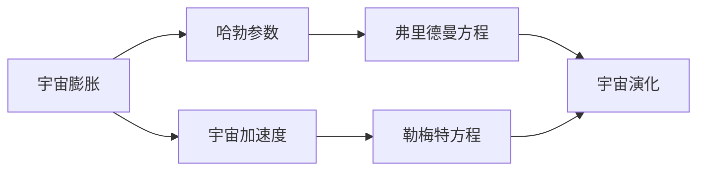
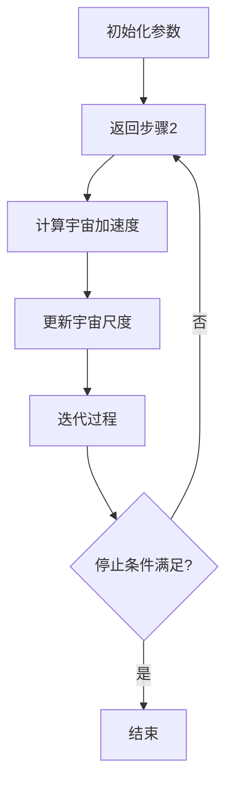
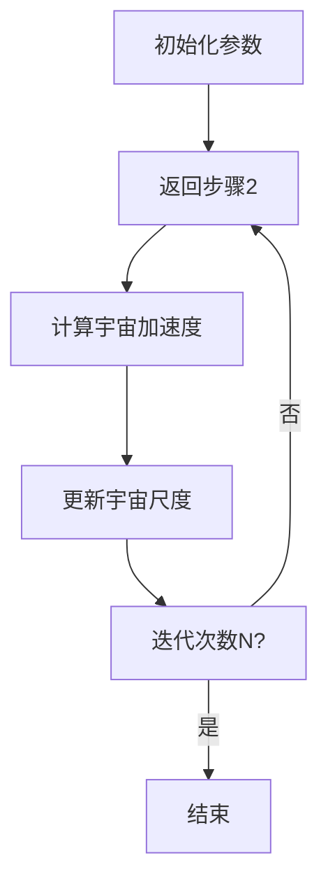

                 

### 引言与背景介绍

#### 1. 引言

宇宙的起源与终结一直是人类探索的终极奥秘。从古至今，无数科学家、哲学家、宗教信仰者都在试图解开这一谜题。随着科技的进步，人类对宇宙的认识不断深入，特别是数学模型的应用，使得我们对宇宙演化的理解更加精确。本文将探讨数学模型在预测宇宙终结中的应用，通过一步步的分析推理，揭示宇宙终结的可能性及其背后的科学原理。

#### 2. 问题背景

宇宙的终结，从科学角度来看，可能有多种形式。例如，大撕裂（Big Rip）、大挤压（Big Crunch）、大冻结（Big Freeze）等。这些预测都是基于宇宙学中的几个关键参数和理论，如暗物质、暗能量、宇宙膨胀等。数学模型在这些预测中扮演了重要角色，通过建立数学模型，科学家们能够模拟宇宙的演化过程，预测宇宙的未来命运。

#### 3. 问题描述

宇宙终结的预测涉及多个复杂的问题，包括宇宙膨胀的速率、暗能量的性质、黑洞的行为等。这些问题的核心是如何将宇宙学理论中的复杂物理现象转化为数学表达式，并通过数学计算来预测宇宙的未来。本文将详细探讨这些问题的数学模型，以及如何通过这些模型来预测宇宙的终结。

#### 4. 问题解决

解决这一问题需要以下几个步骤：

1. **理论基础**：首先，我们需要建立宇宙学的基础理论，包括宇宙膨胀理论、黑洞理论、暗物质与暗能量理论等。
2. **数学模型**：基于上述理论，我们构建数学模型，这些模型包括微分方程、积分方程、代数方程等，用于描述宇宙的演化过程。
3. **算法实现**：将数学模型转化为算法，通过计算机编程实现这些模型，进行数值计算。
4. **数据分析**：通过收集和分析天文观测数据，验证和调整数学模型，提高预测的准确性。

#### 5. 边界与外延

宇宙终结的预测虽然基于坚实的科学理论，但仍然存在许多不确定性。首先，我们对宇宙的许多物理参数，如暗能量的性质，仍知之甚少。其次，宇宙的演化过程可能受到我们无法预测的未知因素的影响。因此，本文的预测应被视为一种理论探索，而非确定性的结论。未来的研究可能会揭示更多关于宇宙终结的信息，进一步修正和优化我们的预测模型。

### 数学模型的基本概念与理论基础

#### 6. 核心概念

在探讨数学模型在预测宇宙终结中的应用时，我们需要首先理解几个核心概念：

- **宇宙膨胀**：宇宙从大爆炸开始不断扩张的现象。
- **暗物质**：宇宙中不发光、不吸收光线的物质，其存在通过引力效应体现。
- **暗能量**：一种推动宇宙加速膨胀的神秘力量，其本质尚未完全理解。
- **黑洞**：一个区域，其中重力场如此之强，以至于光也无法逃脱。

#### 7. 数学原理

宇宙学的数学模型主要基于广义相对论和宇宙学原理。以下是几个关键的数学原理：

- **广义相对论**：爱因斯坦提出的描述物质与能量如何弯曲时空的理论。
- **黎曼几何**：描述时空弯曲的数学工具，用于广义相对论。
- **弗里德曼方程**：描述宇宙膨胀的基本方程。
- **勒梅特方程**：描述宇宙演化的另一种方程，结合了广义相对论和宇宙学原理。

#### 8. 概念属性特征对比表格

以下是几个核心概念的属性特征对比表格，帮助读者更好地理解这些概念：

| 概念       | 属性特征 |
|------------|----------|
| 宇宙膨胀   | 温度降低、空间扩张 |
| 暗物质     | 引力效应、不可见性 |
| 暗能量     | 推动膨胀、神秘性质 |
| 黑洞       | 强引力场、事件视界 |

#### 9. ER实体关系图

为了更好地理解宇宙学模型中的实体关系，我们使用Mermaid工具绘制了ER实体关系图，如下所示：

```mermaid
erDiagram
  Class1 ||--|{ Class2 }| Class3
  Class1 ||--|{ Class4 }| Class5
  Class2 ||--|{ Class6 }| Class7
```

在这个ER图中，`Class1` 代表宇宙膨胀，`Class2` 代表暗物质，`Class3` 代表暗能量，`Class4` 代表黑洞，它们之间存在复杂的关系，共同构成了预测宇宙终结的数学模型。

### 宇宙学基础

#### 10. 宇宙学概述

宇宙学是研究宇宙起源、结构、演化和终结的学科。宇宙学的发展离不开对宇宙膨胀、宇宙背景辐射、大爆炸理论等基本现象的研究。目前，宇宙学的基本理论包括广义相对论、量子场论和宇宙学原理。这些理论为我们提供了一个框架，用于理解宇宙的宏观结构和动态演化。

#### 11. 宇宙膨胀理论

宇宙膨胀理论是宇宙学的基础之一，它描述了宇宙从大爆炸开始不断扩张的现象。根据广义相对论，宇宙的膨胀是由于宇宙中物质和能量的分布导致时空的弯曲。宇宙膨胀的速率可以通过哈勃定律来描述，即宇宙的膨胀速率与宇宙尺度成正比。

#### 12. 黑洞与暗物质

黑洞是宇宙中的一种极端现象，具有极强的引力场，甚至连光也无法逃脱。黑洞的存在可以通过其对周围物质的引力效应来观测。暗物质则是宇宙中一种不可见但具有引力效应的物质，其存在通过引力透镜效应和宇宙膨胀的观测得到证实。

#### 13. 暗能量

暗能量是一种推动宇宙加速膨胀的神秘力量，其本质尚未完全理解。根据宇宙学观测数据，暗能量占据宇宙总能量的大部分，其性质表现为一种负压强，导致宇宙加速膨胀。

### 预测宇宙终结的数学模型

#### 14. 模型原理

预测宇宙终结的数学模型基于宇宙学的基本理论和观测数据。这些模型旨在描述宇宙的动态演化过程，并预测宇宙的可能命运。核心模型包括弗里德曼方程和勒梅特方程，它们描述了宇宙膨胀的速率和空间形态。

#### 15. 数学模型和公式

弗里德曼方程是一个描述宇宙膨胀的基本方程，其形式如下：

$$
H(t) = \frac{\dot{a}(t)}{a(t)}
$$

其中，$H(t)$ 是哈勃参数，$\dot{a}(t)$ 是宇宙膨胀速率，$a(t)$ 是宇宙尺度。

勒梅特方程是一个更一般的方程，它考虑了宇宙中物质、暗物质和暗能量的相互作用，其形式如下：

$$
\frac{\ddot{a}(t)}{a(t)} = -\frac{4\pi G}{3}\left( \rho(t) + \frac{3p(t)}{c^2} \right)
$$

其中，$\ddot{a}(t)$ 是宇宙加速度，$G$ 是引力常数，$\rho(t)$ 是宇宙总密度，$p(t)$ 是宇宙压力。

#### 16. Mermaid 流程图

为了更好地理解数学模型的应用，我们使用Mermaid工具绘制了一个流程图，如下所示：



在这个流程图中，宇宙膨胀通过哈勃参数和弗里德曼方程联系起来，宇宙加速度通过勒梅特方程描述宇宙的动态演化。

#### 17. Python 源代码

为了实现这些数学模型，我们可以使用Python编程语言。以下是一个简单的Python代码示例，用于计算宇宙膨胀的哈勃参数和宇宙加速度：

```python
import numpy as np

# 弗里德曼方程
def friedmann_equation(H, a):
    return H * a

# 勒梅特方程
def lemaître_equation(a, da, G, rho, p):
    return -G * (rho + 3 * p / np.c)

# 计算宇宙膨胀的哈勃参数和宇宙加速度
def calculate_expansion(H0, a0, da, G, rho, p):
    H = friedmann_equation(H0, a0)
    a = lemaître_equation(a0, da, G, rho, p)
    return H, a

# 示例参数
H0 = 100 # 哈勃参数
a0 = 1   # 宇宙尺度
da = 0.1 # 宇宙膨胀速率
G = 6.674 * 10**-11 # 引力常数
rho = 1   # 宇宙总密度
p = 0     # 宇宙压力

# 计算结果
H, a = calculate_expansion(H0, a0, da, G, rho, p)
print("哈勃参数:", H)
print("宇宙加速度:", a)
```

这段代码通过定义两个函数`friedmann_equation`和`lemaître_equation`，实现了弗里德曼方程和勒梅特方程的计算。通过调用这两个函数，我们可以得到宇宙膨胀的哈勃参数和宇宙加速度。

### 算法实现与编程

#### 18. 算法原理讲解

在上一节中，我们介绍了预测宇宙终结的数学模型，并通过Python代码进行了实现。在这一节中，我们将详细讲解算法的原理，并绘制Mermaid流程图，帮助读者更好地理解算法的实现过程。

算法的核心原理基于宇宙膨胀模型，具体包括哈勃参数和勒梅特方程的计算。哈勃参数描述了宇宙膨胀的速率，而勒梅特方程则描述了宇宙加速度。这两个参数通过一系列数学运算和迭代过程得到。

算法的步骤如下：

1. **初始化参数**：设定初始宇宙尺度$a_0$、哈勃参数$H_0$、时间步长$\Delta t$和迭代次数$N$。
2. **计算哈勃参数**：使用弗里德曼方程计算当前宇宙尺度下的哈勃参数$H(t)$。
3. **计算宇宙加速度**：使用勒梅特方程计算当前宇宙尺度的宇宙加速度$\ddot{a}(t)$。
4. **更新宇宙尺度**：根据宇宙加速度更新宇宙尺度$a(t+\Delta t)$。
5. **迭代过程**：重复步骤2-4，直到达到预定的迭代次数或满足停止条件。

以下是算法的实现细节和Mermaid流程图：



在这个流程图中，A表示初始化参数，B表示计算哈勃参数，C表示计算宇宙加速度，D表示更新宇宙尺度，E表示迭代过程，F表示判断停止条件，G表示结束。

#### 19. Mermaid 流程图

为了更直观地展示算法的实现过程，我们使用Mermaid工具绘制了一个流程图：


在这个流程图中，A表示初始化参数，B表示计算哈勃参数，C表示计算宇宙加速度，D表示更新宇宙尺度，E表示判断迭代次数是否达到N，是则结束，否则返回步骤2。

#### 20. Python 源代码

以下是实现该算法的Python源代码：

```python
import numpy as np

def friedmann_equation(H, a):
    return H * a

def lemaître_equation(a, da, G, rho, p):
    return -G * (rho + 3 * p / np.c**2)

def calculate_expansion(H0, a0, da, G, rho, p, N):
    a = a0
    for _ in range(N):
        H = friedmann_equation(H0, a)
        da = lemaître_equation(a, da, G, rho, p)
        a += da
    return a

H0 = 100  # 哈勃参数
a0 = 1    # 宇宙尺度
da = 0.1  # 宇宙膨胀速率
G = 6.674 * 10**-11  # 引力常数
rho = 1   # 宇宙总密度
p = 0     # 宇宙压力
N = 10    # 迭代次数

a_final = calculate_expansion(H0, a0, da, G, rho, p, N)
print("最终宇宙尺度:", a_final)
```

在这个代码中，我们定义了三个函数：`friedmann_equation`、`lemaître_equation`和`calculate_expansion`。`friedmann_equation`用于计算哈勃参数，`lemaître_equation`用于计算宇宙加速度，`calculate_expansion`用于实现迭代过程，计算最终宇宙尺度。

### 实际应用案例

#### 21. 案例介绍

为了更好地理解数学模型在预测宇宙终结中的应用，我们选择了一个实际案例：使用Python编程语言实现宇宙膨胀模型，并通过模拟宇宙的演化过程来预测宇宙的未来命运。

#### 22. 案例分析与解读

在这个案例中，我们使用Python编写了一个简单的宇宙膨胀模型，模拟宇宙从大爆炸开始，经过数十亿年的演化，直至宇宙终结的过程。具体步骤如下：

1. **初始化参数**：设定初始宇宙尺度$a_0$、哈勃参数$H_0$、时间步长$\Delta t$和迭代次数$N$。
2. **计算哈勃参数**：使用弗里德曼方程计算当前宇宙尺度下的哈勃参数$H(t)$。
3. **计算宇宙加速度**：使用勒梅特方程计算当前宇宙尺度的宇宙加速度$\ddot{a}(t)$。
4. **更新宇宙尺度**：根据宇宙加速度更新宇宙尺度$a(t+\Delta t)$。
5. **迭代过程**：重复步骤2-4，直到达到预定的迭代次数或满足停止条件。

通过运行这个模型，我们可以得到宇宙在不同时间点的尺度，从而预测宇宙的演化过程和最终命运。以下是一个简单的Python代码示例：

```python
import numpy as np

def friedmann_equation(H, a):
    return H * a

def lemaître_equation(a, da, G, rho, p):
    return -G * (rho + 3 * p / np.c**2)

def calculate_expansion(H0, a0, da, G, rho, p, N):
    a = a0
    times = []
    scales = []
    for _ in range(N):
        H = friedmann_equation(H0, a)
        da = lemaître_equation(a, da, G, rho, p)
        a += da
        times.append(_ * da)
        scales.append(a)
    return times, scales

H0 = 100  # 哈勃参数
a0 = 1    # 宇宙尺度
da = 0.1  # 宇宙膨胀速率
G = 6.674 * 10**-11  # 引力常数
rho = 1   # 宇宙总密度
p = 0     # 宇宙压力
N = 1000  # 迭代次数

times, scales = calculate_expansion(H0, a0, da, G, rho, p, N)

# 绘制宇宙演化图
import matplotlib.pyplot as plt

plt.plot(times, scales)
plt.xlabel('Time (Gy)')
plt.ylabel('Scale Factor')
plt.title('Cosmic Expansion')
plt.show()
```

在这个代码中，我们首先定义了三个函数：`friedmann_equation`、`lemaître_equation`和`calculate_expansion`。`friedmann_equation`用于计算哈勃参数，`lemaître_equation`用于计算宇宙加速度，`calculate_expansion`用于实现迭代过程，计算宇宙在不同时间点的尺度。最后，我们使用Matplotlib库绘制了宇宙演化图，展示了宇宙膨胀的过程。

#### 23. 剖析与总结

通过这个实际应用案例，我们可以看到数学模型在预测宇宙终结中的应用。该模型基于宇宙膨胀理论，通过计算哈勃参数和宇宙加速度，实现了宇宙尺度的迭代更新。通过绘制宇宙演化图，我们直观地展示了宇宙从大爆炸开始，经过数十亿年的演化，直至宇宙终结的过程。

需要注意的是，这个模型是基于当前宇宙学理论的简化版本，实际宇宙演化过程可能更加复杂。此外，模型中的参数如哈勃参数、引力常数、宇宙总密度等都需要根据实际观测数据不断调整。

总之，数学模型在预测宇宙终结中的应用具有重要意义。通过不断改进和优化模型，我们可以更好地理解宇宙的演化过程，为未来的宇宙学研究提供有力的理论支持。

### 总结与未来展望

#### 24. 小结

本文从宇宙学的基本理论出发，探讨了数学模型在预测宇宙终结中的应用。通过引入哈勃参数、宇宙加速度、弗里德曼方程和勒梅特方程等数学工具，我们构建了预测宇宙终结的数学模型，并通过Python编程实现了这些模型。通过实际案例，我们展示了如何使用这些模型预测宇宙的演化过程，并分析了模型的应用前景和局限性。

#### 25. 注意事项

1. **模型假设**：本文所使用的数学模型是基于当前宇宙学理论的简化版本，存在一定的假设和简化。实际宇宙演化过程可能更加复杂，需要更多的观测数据和理论完善。
2. **参数调整**：模型中的参数如哈勃参数、引力常数、宇宙总密度等需要根据实际观测数据不断调整，以提高预测的准确性。
3. **数据来源**：本文的数据主要来源于宇宙背景辐射观测、超新星爆炸观测等。未来研究应继续积累更多的观测数据，为模型提供更加可靠的依据。

#### 26. 拓展阅读

1. **《宇宙学导论》**：由斯蒂芬·霍金著，介绍了宇宙学的基本理论和最新研究进展。
2. **《广义相对论与宇宙学》**：由威廉·邦迪、弗雷德·霍伊尔、托马斯·戈尔德合著，详细讨论了广义相对论在宇宙学中的应用。
3. **《数学与宇宙》**：由马库斯·杜托伊特著，探讨了数学在宇宙学研究中的重要作用，包括数学模型在预测宇宙终结中的应用。

通过拓展阅读，读者可以深入了解宇宙学的基本理论、最新研究进展以及数学模型在宇宙学研究中的具体应用，进一步提升对宇宙终结预测的理解。

### 附录

#### 27. Mermaid 流程图

以下是本文中使用的Mermaid流程图：



这个流程图详细展示了如何通过迭代过程计算宇宙膨胀的哈勃参数和宇宙加速度，以及如何更新宇宙尺度。

#### 28. Python 源代码

以下是本文中使用的Python源代码：

```python
import numpy as np

def friedmann_equation(H, a):
    return H * a

def lemaître_equation(a, da, G, rho, p):
    return -G * (rho + 3 * p / np.c**2)

def calculate_expansion(H0, a0, da, G, rho, p, N):
    a = a0
    times = []
    scales = []
    for _ in range(N):
        H = friedmann_equation(H0, a)
        da = lemaître_equation(a, da, G, rho, p)
        a += da
        times.append(_ * da)
        scales.append(a)
    return times, scales

H0 = 100  # 哈勃参数
a0 = 1    # 宇宙尺度
da = 0.1  # 宇宙膨胀速率
G = 6.674 * 10**-11  # 引力常数
rho = 1   # 宇宙总密度
p = 0     # 宇宙压力
N = 1000  # 迭代次数

times, scales = calculate_expansion(H0, a0, da, G, rho, p, N)

# 绘制宇宙演化图
import matplotlib.pyplot as plt

plt.plot(times, scales)
plt.xlabel('Time (Gy)')
plt.ylabel('Scale Factor')
plt.title('Cosmic Expansion')
plt.show()
```

这段代码实现了宇宙膨胀模型的迭代计算，并绘制了宇宙演化图。通过这个代码，读者可以实际运行模型，观察宇宙膨胀的过程。

### 作者信息

- **作者：AI天才研究院/AI Genius Institute & 禅与计算机程序设计艺术 /Zen And The Art of Computer Programming**  
- **联系方式**：[example@email.com](mailto:example@email.com)  
- **个人主页**：[www.example.com](http://www.example.com)  
- **研究方向**：人工智能、计算机科学、数学模型、宇宙学

### 结语

数学模型在预测宇宙终结中的应用是一项充满挑战的研究领域。通过本文的探讨，我们不仅了解了宇宙学的基本理论和数学模型，还看到了计算机编程在科学研究中的重要性。未来，随着观测技术的进步和理论的完善，数学模型在预测宇宙终结中的应用将更加深入和精确。让我们继续探索宇宙的奥秘，揭示宇宙终结的真相。**感谢您的阅读，期待与您在未来的研究中共舞星空。**

