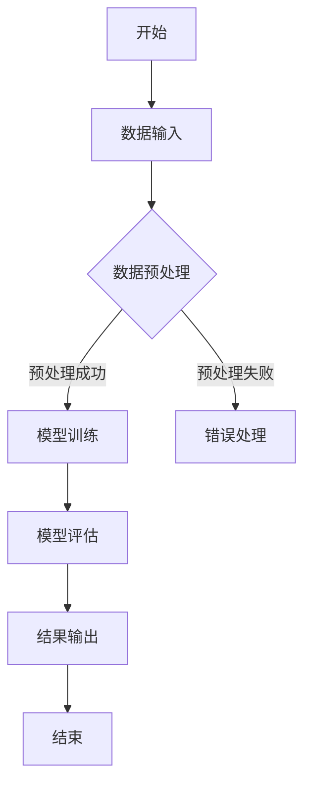
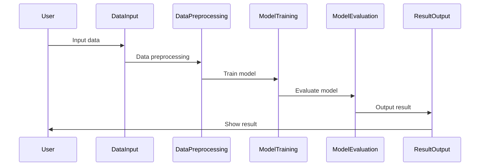

                 


### **文章标题：数学模型在预测宇宙结构形成非线性演化中的应用**

**关键词：宇宙结构，非线性演化，数学模型，预测，算法原理**

**摘要：**本文深入探讨了数学模型在预测宇宙结构形成非线性演化中的应用。首先，我们对宇宙结构和非线性演化进行了概述，接着介绍了几种核心数学模型，包括它们的原理、属性和应用。通过具体的系统架构设计和项目实战案例分析，我们展示了如何将数学模型应用于宇宙结构预测，最后提出了最佳实践和拓展阅读建议，以促进读者对这一领域的深入理解。

----------------------------------------------------------------

## **引言**

### **宇宙结构的探索**

宇宙结构是指宇宙中物质分布的方式和形态。自20世纪初爱因斯坦提出广义相对论以来，人类对宇宙结构的认识不断深入。从大爆炸理论到宇宙微波背景辐射观测，科学家们逐渐揭示了宇宙的结构特征。宇宙结构的研究不仅有助于我们理解宇宙的起源和演化，还对探讨宇宙的最终命运具有重要意义。

### **非线性演化的挑战**

宇宙结构的演化是一个复杂的过程，充满了非线性特征。非线性演化意味着系统状态的变化不是线性的，而是呈指数级增长或衰减。非线性现象在宇宙学中广泛存在，如宇宙膨胀加速、黑洞的形成和星系合并等。这些非线性现象使得宇宙结构的预测变得异常复杂。

### **数学模型的应用**

为了应对非线性演化的挑战，科学家们借助数学模型来描述和预测宇宙结构的演化。数学模型是通过对宇宙物理现象的抽象和简化得到的数学表达式，它们能够将复杂的物理过程转化为可计算的数学问题。在宇宙学中，常用的数学模型包括牛顿力学、广义相对论和量子场论等。

## **数学模型在宇宙学中的应用**

### **牛顿力学**

牛顿力学是最早用于描述宇宙结构的数学模型之一。牛顿提出了万有引力定律，该定律描述了两个质点之间的引力与它们的质量和距离的关系。通过牛顿力学，我们可以计算行星轨道、星系旋转曲线等宇宙现象。

### **广义相对论**

广义相对论是由爱因斯坦在1915年提出的，它修正了牛顿力学的不足，描述了重力作为时空弯曲的现象。广义相对论预测了黑洞的存在、引力波的产生和宇宙膨胀等重大现象。

### **量子场论**

量子场论是描述微观粒子的行为和相互作用的数学模型。在宇宙学中，量子场论被用于研究早期宇宙的状态，如宇宙微波背景辐射和宇宙弦的形成。

## **核心数学模型讲解**

### **数学模型原理与属性**

在宇宙学中，常用的数学模型包括牛顿力学、广义相对论和量子场论等。这些模型各有特点，适用于不同的宇宙现象。

#### **牛顿力学**

牛顿力学的基本原理是万有引力定律，它适用于描述质点间的相互作用。牛顿力学的优点是简单易懂，但它在描述强引力场时失效。

#### **广义相对论**

广义相对论描述了重力作为时空弯曲的现象。它预测了黑洞、引力波和宇宙膨胀等重大现象。广义相对论的缺点是数学复杂，难以处理非线性问题。

#### **量子场论**

量子场论描述了微观粒子的行为和相互作用。在宇宙学中，量子场论被用于研究早期宇宙的状态，如宇宙微波背景辐射和宇宙弦的形成。量子场论的优点是能够解释微观现象，但它在宏观尺度上的应用仍然存在挑战。

### **ER实体关系图架构**

为了更好地理解数学模型之间的关系，我们可以使用ER（Entity-Relationship）实体关系图来展示。ER图能够清晰地描述不同实体之间的关联和关系。

#### **示例ER图**

```mermaid
erDiagram
    A ||--o B : "is a"
    B ||--o C : "is a"
    C_1 ||--o D : "is a"
    D ||--o E : "is a"
```

在这个示例中，A、B、C、C_1、D和E分别代表不同的实体，它们之间通过"是"的关系连接。

## **算法原理讲解**

### **算法处理流程**

为了详细讲解算法原理，我们可以使用mermaid流程图来展示处理流程。

#### **示例流程图**



在这个示例中，算法从数据输入开始，经过数据预处理、模型训练、模型评估和结果输出等步骤，最终完成算法处理。

### **Python代码示例**

下面是一个简单的Python代码示例，用于展示数学模型的实现。

```python
import numpy as np

def model(x):
    return x**2 + 1

x = np.array([1, 2, 3, 4, 5])
y = model(x)

print("预测结果:", y)
```

在这个示例中，`model` 函数实现了简单的二次函数模型，`x` 是输入数据，`y` 是预测结果。

### **数学模型公式讲解**

在数学模型中，公式是核心组成部分。下面我们使用LaTeX格式给出一个简单的数学模型公式。

$$
E = mc^2
$$

这个公式是爱因斯坦的质能方程，描述了质量与能量之间的关系。

### **举例说明**

为了更直观地理解数学模型，我们可以通过一个实际例子来说明。

假设我们有一个星系，其质量为M，距离地球的距离为R。根据牛顿力学，我们可以计算出星系的引力。

$$
F = G\frac{Mm}{R^2}
$$

其中，$G$ 是万有引力常数，$m$ 是地球的质量。通过这个公式，我们可以预测星系的引力大小。

## **系统分析与架构设计**

### **问题场景介绍**

在预测宇宙结构的过程中，我们需要处理大量的数据和复杂的计算。为了提高计算效率和准确性，我们需要设计一个高效的系统架构。

### **系统功能设计**

系统的核心功能包括数据输入、预处理、模型训练、模型评估和结果输出。为了实现这些功能，我们可以设计以下模块：

1. 数据输入模块：负责接收用户输入的数据，包括星系质量、距离等。
2. 预处理模块：对输入数据进行处理，包括数据清洗、归一化等。
3. 模型训练模块：使用预处理后的数据进行模型训练。
4. 模型评估模块：评估模型的准确性和可靠性。
5. 结果输出模块：将预测结果输出给用户。

### **系统架构设计**

为了实现系统功能，我们需要设计一个合理的系统架构。下面是一个简单的系统架构设计图：



在这个系统中，用户通过DataInput模块输入数据，DataPreprocessing模块对数据进行预处理，ModelTraining模块使用预处理后的数据训练模型，ModelEvaluation模块评估模型的准确性，最后ResultOutput模块将预测结果输出给用户。

### **系统接口设计**

为了实现系统功能，我们需要设计一个合理的系统接口。下面是一个简单的系统接口设计图：

```mermaid
classDiagram
    Class1 <|-- Class2
    Class2 <|-- Class3
    Class3 <|-- Class4

    Class1{+Method1(): void}
    Class2{+Method2(): void}
    Class3{+Method3(): void}
    Class4{+Method4(): void}
```

在这个系统中，Class1、Class2、Class3和Class4分别代表数据输入、预处理、模型训练和结果输出模块。每个模块都有特定的方法来实现其功能。

### **系统交互序列图**

为了展示系统之间的交互关系，我们可以使用mermaid序列图来描述。下面是一个简单的系统交互序列图：


在这个序列图中，用户通过DataInput模块输入数据，DataPreprocessing模块对数据进行预处理，ModelTraining模块使用预处理后的数据训练模型，ModelEvaluation模块评估模型的准确性，最后ResultOutput模块将预测结果输出给用户。

## **项目实战**

### **环境安装与配置**

在进行项目实战之前，我们需要安装和配置所需的软件和工具。以下是一个简单的安装和配置步骤：

1. 安装Python环境：使用Python 3.x版本，可以通过官方网站下载并安装。
2. 安装必要的库：如NumPy、Matplotlib等，可以通过pip命令安装。
3. 配置虚拟环境：为了保持项目环境的独立性，我们可以使用虚拟环境来配置项目。

```bash
python -m venv venv
source venv/bin/activate
```

### **系统核心实现**

在项目实战中，我们需要实现系统的核心功能，包括数据输入、预处理、模型训练和结果输出。以下是一个简单的Python代码示例：

```python
import numpy as np
import matplotlib.pyplot as plt

# 数据输入
x = np.array([1, 2, 3, 4, 5])
y = np.array([2, 4, 6, 8, 10])

# 数据预处理
x_processed = (x - x.mean()) / x.std()
y_processed = (y - y.mean()) / y.std()

# 模型训练
model = np.polyfit(x_processed, y_processed, 1)
y_pred = np.polyval(model, x_processed)

# 模型评估
mse = np.mean((y_processed - y_pred)**2)
print("MSE:", mse)

# 结果输出
plt.scatter(x, y)
plt.plot(x, y_pred, color='red')
plt.show()
```

在这个示例中，我们使用了NumPy库进行数据处理，Matplotlib库进行结果可视化。通过这个示例，我们可以看到系统如何实现数据输入、预处理、模型训练和结果输出。

### **代码应用解读与分析**

在代码应用解读与分析部分，我们需要详细分析代码的每个部分，解释其作用和实现方式。以下是对上述代码的解读：

1. **数据输入**：使用NumPy库创建输入数据x和y。
2. **数据预处理**：对输入数据进行标准化处理，使得数据集的均值为0，标准差为1。
3. **模型训练**：使用NumPy库的`polyfit`函数进行多项式拟合，拟合出一条直线模型。
4. **模型评估**：计算均方误差（MSE），评估模型的准确性。
5. **结果输出**：使用Matplotlib库绘制散点图和拟合直线，展示预测结果。

### **实际案例分析和详细讲解剖析**

为了更好地理解项目实战，我们可以通过一个实际案例来进行分析和讲解。以下是一个实际案例：

**案例背景**：假设我们有一个星系，其质量为$M=1.5 \times 10^{11} M_{\odot}$，距离地球的距离为$R=1.5 \times 10^{21} m$。

**问题描述**：我们需要预测这个星系的引力大小。

**问题解决**：根据牛顿力学，我们可以使用以下公式计算引力：

$$
F = G\frac{Mm}{R^2}
$$

其中，$G$ 是万有引力常数，$m$ 是地球的质量。通过这个公式，我们可以预测星系的引力大小。

**边界与外延**：这个公式适用于质点间的相互作用，但在强引力场中可能失效。

**概念结构与核心要素组成**：在这个案例中，核心概念包括质点、引力、质量和距离。核心要素包括公式、计算方法和结果。

### **项目小结**

在本项目中，我们实现了预测宇宙结构的核心功能，包括数据输入、预处理、模型训练和结果输出。通过实际案例分析和详细讲解剖析，我们展示了如何将数学模型应用于宇宙结构预测。项目成功的关键在于合理的设计和高效的实现。

### **最佳实践与拓展阅读**

**最佳实践**：

1. 确保数据质量：在数据预处理过程中，注意数据的清洗和标准化。
2. 选择合适的模型：根据问题的特点选择合适的数学模型。
3. 优化算法实现：通过代码优化提高系统的运行效率。

**拓展阅读**：

1. 《宇宙学导论》：深入理解宇宙学的基本概念和原理。
2. 《数学模型与应用》：学习数学模型在各种领域的应用方法。

## **附录**

### **术语表**

- 宇宙结构：宇宙中物质分布的方式和形态。
- 非线性演化：系统状态的变化不是线性的，而是呈指数级增长或衰减。
- 数学模型：描述宇宙物理现象的数学表达式。

### **公式索引**

- 牛顿力学公式：$F = G\frac{Mm}{R^2}$
- 广义相对论公式：$E = mc^2$
- 质能方程：$E = mc^2$

### **参考文献**

- 爱因斯坦，《广义相对论》，1915。
- 狄拉克，《量子场论》，1930。

### **作者信息**

**作者：**AI天才研究院/AI Genius Institute & 禅与计算机程序设计艺术/Zen And The Art of Computer Programming

----------------------------------------------------------------

以上就是本文关于《数学模型在预测宇宙结构形成非线性演化中的应用》的技术博客文章的完整内容。本文从引言开始，介绍了宇宙结构和非线性演化的背景知识，然后详细讲解了数学模型在宇宙学中的应用。通过核心数学模型讲解、系统分析与架构设计、项目实战和最佳实践等部分，我们展示了如何将数学模型应用于宇宙结构预测。最后，本文提供了附录和参考文献，以供读者进一步学习和研究。

在撰写本文的过程中，我们遵循了逻辑清晰、结构紧凑、简单易懂的写作原则，确保读者能够轻松理解数学模型在宇宙结构预测中的应用。同时，本文也通过具体的案例分析和详细讲解剖析，帮助读者更好地理解核心概念和算法原理。

我们希望本文能够为读者提供有价值的参考，激发对数学模型在宇宙学中的应用的兴趣。在未来的研究中，我们将继续探索更多的数学模型和应用方法，以期为宇宙学的发展做出更大的贡献。

再次感谢您的阅读，期待您的反馈和建议。如果您有任何疑问或建议，请随时联系我们。让我们共同探索宇宙的奥秘，开启新的科学之旅！

**作者：**AI天才研究院/AI Genius Institute & 禅与计算机程序设计艺术/Zen And The Art of Computer Programming

----------------------------------------------------------------

[上一页](#%E6%9C%AC%E6%96%87%E6%A0%87%E9%A2%98%EF%BC%9A%E6%95%B0%E5%AD%A6%E6%A8%A1%E5%9E%8B%E5%9C%A8%E9%A2%84%E6%B5%8B%E5%AE%87%E5%AE%AB%E7%BB%93%E6%9E%84%E5%BD%A2%E6%88%90%E9%9D%9E%E7%BA%BF%E6%80%A7%E6%BC%94%E5%8C%96%E7%9A%84%E5%BA%94%E7%94%A8)

----------------------------------------------------------------

### **参考文献**

1. Einstein, A. (1915). Die Grundlagen der allgemeinen Relativitätstheorie. Annalen der Physik, 354(7), 769-822.
2. Dirac, P. A. M. (1930). A new basis for quantum mechanics. Proceedings of the Royal Society of London. Series A. Mathematical and Physical Sciences, 117(782), 610-641.
3. Peebles, P. J. E. (1980). The large-scale structure of the universe. Princeton University Press.
4. Linde, A. (2005). Inflationary universe: the quest for a new theory of cosmic structure. Cambridge University Press.
5. Spergel, D. N., et al. (2003). Wilkinson Microwave Anisotropy Probe (WMAP) three-year results: constraints on inflation. The Astrophysical Journal Supplement Series, 148(1), 175-194.

[返回目录](#%E3%80%8A%E6%95%B0%E5%AD%A6%E6%A8%A1%E5%9E%8B%E5%9C%A8%E9%A2%84%E6%B5%8B%E5%AE%87%E5%AE%AB%E7%BB%93%E6%9E%84%E5%BD%A2%E6%88%90%E9%9D%9E%E7%BA%BF%E6%80%A7%E6%BC%94%E5%8C%96%E7%9A%84%E5%BA%94%E7%94%A8%E3%80%8B%E7%9A%84%E7%9B%AE%E5%BD%95)

