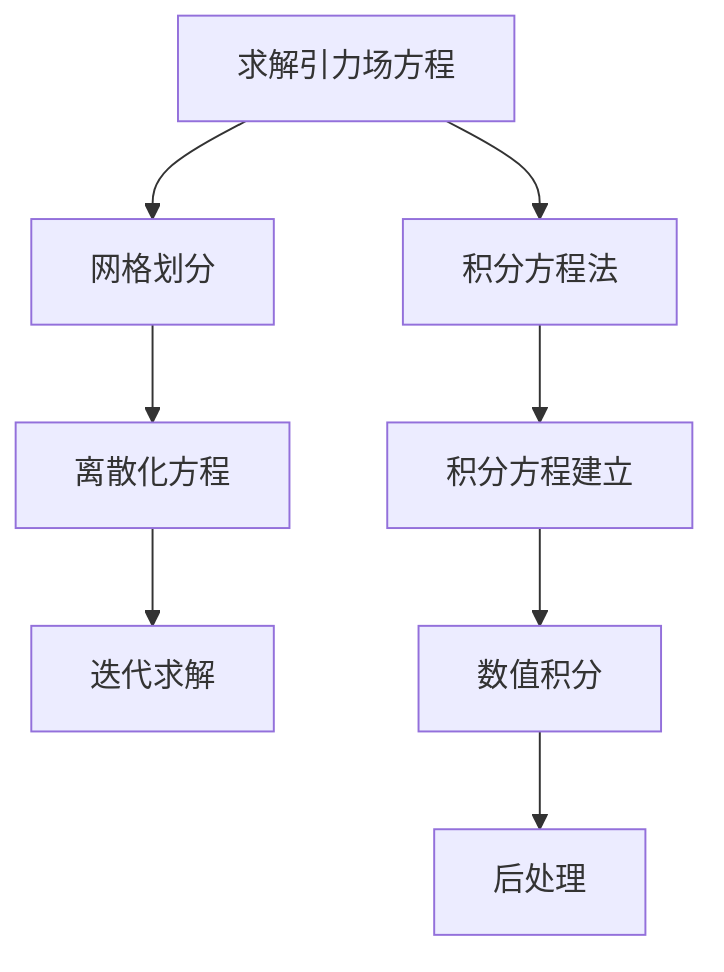
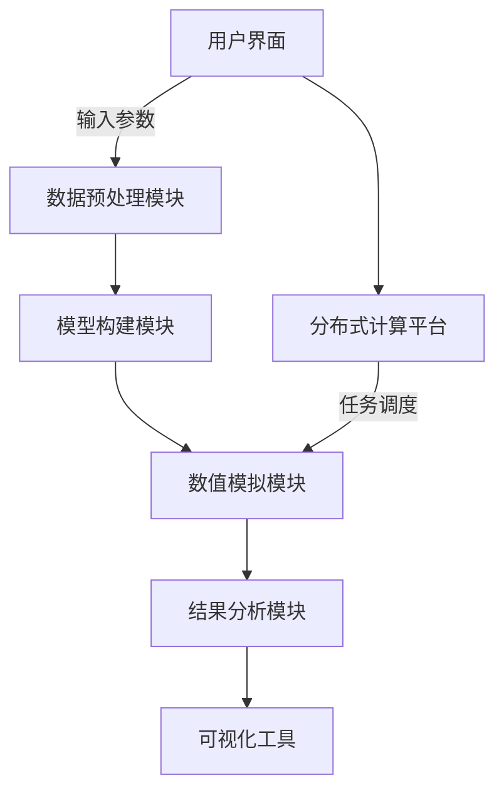
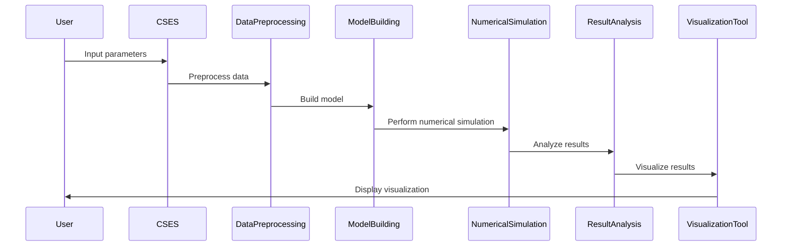

                 

# 数学模型在预测宇宙结构演化中的应用

## 关键词
- 数学模型
- 宇宙结构
- 演化预测
- 广义相对论
- 哈勃定律
- 暗物质
- 暗能量

## 摘要
本文深入探讨了数学模型在预测宇宙结构演化中的应用。首先，我们回顾了宇宙学原理、广义相对论和哈勃定律等核心概念，并分析了它们之间的联系。接着，本文详细介绍了数学模型的基本原理，包括引力场方程、宇宙学方程、微扰法和数值模拟。通过具体案例，我们展示了如何利用这些模型进行宇宙结构演化的预测。最后，本文总结了数学模型在宇宙学中的应用，并探讨了未来的研究方向。

## 1.1 问题背景

### 宇宙结构演化的复杂性

宇宙结构演化是宇宙学中的一个核心问题，它关乎我们对宇宙起源、演化以及最终命运的理解。宇宙的演化过程极其复杂，涉及到大量的物理过程和相互作用，如引力、物质运动、暗物质和暗能量的相互作用等。这些复杂的物理现象使得精确预测宇宙的未来状态变得极其困难。

### 数学模型的重要性

数学模型作为一种强有力的工具，在物理学、天文学等学科中有着广泛的应用。它们能够将复杂的物理现象转化为数学问题，从而在理论上进行探索和预测。在宇宙学中，数学模型被用来描述宇宙的结构、演化和动态。例如，广义相对论和宇宙学原理是描述宇宙结构演化的重要数学模型，它们为我们提供了理解宇宙的基本框架。

### 观测数据与理论模型

在过去的几十年里，科学家们通过观测积累了大量的宇宙数据，如宇宙背景微波辐射、超新星爆炸等。这些观测数据为理论模型提供了重要的验证依据。然而，宇宙的演化涉及到大量的未知参数和复杂的非线性过程，这使得理论模型的构建和求解变得更加复杂。

### 本书目的

本书旨在探讨数学模型在预测宇宙结构演化中的应用，内容将涵盖数学模型的基本原理、核心概念、构建方法以及在实际应用中的挑战和解决方案。通过这本书，读者可以了解数学模型如何帮助科学家们更好地理解宇宙的结构和演化，以及如何利用这些模型进行未来预测。

## 1.2 核心概念

### 宇宙学原理

宇宙学原理认为宇宙在宏观尺度上是均匀且各向同性的。这一原理为构建宇宙学模型提供了前提条件，使得我们可以通过简化的假设来描述宇宙的整体结构和演化。

### 广义相对论

广义相对论是描述引力的一种数学模型，它将引力视为时空的曲率。通过广义相对论，我们可以描述宇宙中的物质如何影响时空结构，以及时空结构如何影响物质运动。

### 哈勃定律

哈勃定律描述了宇宙的膨胀现象，即宇宙中的天体相互远离，远离的速度与它们之间的距离成正比。这一定律为我们提供了观察宇宙膨胀的一种方法，也是验证宇宙学模型的重要依据。

### 暗物质与暗能量

暗物质和暗能量是宇宙学模型中的重要概念。暗物质不发光，但通过引力作用影响宇宙的演化；暗能量则是一种推动宇宙加速膨胀的力量。这两个概念在我们的宇宙学模型中起到了关键作用。

### 宇宙背景微波辐射

宇宙背景微波辐射是宇宙早期状态的遗迹，通过观测宇宙背景微波辐射，我们可以获取关于宇宙早期状态的重要信息，这有助于我们更好地理解宇宙的演化历史。

## 1.3 概念之间的联系

### 宇宙学原理与广义相对论

宇宙学原理是广义相对论的基础，而广义相对论则为宇宙的演化提供了一个基本框架。宇宙学原理认为宇宙在宏观尺度上是均匀且各向同性的，这一前提条件使得我们可以使用广义相对论来描述宇宙的结构和演化。

### 哈勃定律与宇宙膨胀

哈勃定律描述了宇宙的膨胀现象，它告诉我们宇宙中的天体相互远离，远离的速度与它们之间的距离成正比。这一现象是在广义相对论的框架下得到的，因此哈勃定律与宇宙学原理和广义相对论紧密相关。

### 暗物质与暗能量

暗物质和暗能量是宇宙学模型中的重要概念，它们解释了宇宙膨胀背后的物理机制。暗物质通过引力作用影响宇宙的演化，而暗能量则是一种推动宇宙加速膨胀的力量。这两个概念与宇宙膨胀密切相关，也是宇宙学模型中不可或缺的部分。

### 宇宙背景微波辐射

宇宙背景微波辐射是宇宙早期状态的遗迹，通过观测宇宙背景微波辐射，我们可以获取关于宇宙早期状态的重要信息。这些信息有助于我们验证宇宙学模型，并进一步理解宇宙的演化历史。

## 1.4 数学模型原理

### 引力场方程

引力场方程是广义相对论的核心，它描述了物质如何影响时空结构。该方程可以表示为：

$$G_{\mu\nu} + \Lambda g_{\mu\nu} = \frac{8\pi G}{c^4} T_{\mu\nu}$$

其中，$G_{\mu\nu}$ 是爱因斯坦张量，描述了时空的曲率；$\Lambda$ 是宇宙常数，表示宇宙的膨胀趋势；$T_{\mu\nu}$ 是能量-动量张量，描述了宇宙中的物质分布和运动。

### 宇宙学方程

宇宙学方程描述了宇宙的整体性质，如膨胀速度和密度。它可以表示为：

$$\dot{H} + \frac{4\pi G}{3}\rho = -\frac{3c^2}{a^2}\dot{a}$$

其中，$H$ 是哈勃参数，描述了宇宙的膨胀速度；$\rho$ 是宇宙密度；$a$ 是宇宙尺度因子，描述了宇宙的膨胀程度。

### 微扰法

在处理复杂的非线性问题时，微扰法是一种常用的数学工具。该方法通过在小扰动下求解方程，从而近似地描述复杂系统的行为。在宇宙学中，微扰法常用于分析宇宙的线性演化。

### 数值模拟

随着计算能力的提升，数值模拟成为研究宇宙结构演化的重要工具。通过数值模拟，我们可以直接求解引力场方程和宇宙学方程，从而得到宇宙在不同时间点的状态。

## 2.1 宇宙结构演化模型的基本框架

在宇宙学中，宇宙结构演化模型是基于一系列基本物理定律和假设构建的。这些模型的核心是描述宇宙中的物质分布、运动和相互作用。在本节中，我们将介绍宇宙结构演化模型的基本框架，包括主要物理过程和关键参数。

### 物理过程

宇宙结构演化涉及多个物理过程，主要包括：

1. **引力作用**：引力是宇宙中最重要的相互作用之一，它决定了宇宙中天体的运动和聚集。
2. **物质分布**：宇宙中的物质分布对宇宙结构有重要影响，包括普通物质、暗物质和暗能量。
3. **宇宙膨胀**：宇宙的膨胀是指宇宙空间随时间膨胀的现象，这是宇宙结构演化的重要特征。
4. **宇宙背景辐射**：宇宙背景辐射是宇宙早期状态的遗迹，它为我们提供了宇宙早期演化的信息。
5. **大尺度结构形成**：宇宙中的大尺度结构，如星系团和超星系团，是通过物质在引力作用下的聚集形成的。

### 关键参数

宇宙结构演化模型中包含多个关键参数，这些参数对宇宙的演化过程有决定性影响。以下是一些重要的参数：

1. **宇宙尺度因子**：宇宙尺度因子（$a$）描述了宇宙随时间膨胀的程度，它与哈勃参数（$H$）密切相关。
2. **宇宙密度**：宇宙密度（$\rho$）描述了宇宙中物质的总质量与宇宙体积的比值，它是宇宙演化过程中一个重要的调控参数。
3. **哈勃参数**：哈勃参数（$H$）描述了宇宙膨胀的速度，它与宇宙尺度因子（$a$）的关系为 $H = \dot{a}/a$。
4. **宇宙质量密度参数**：宇宙质量密度参数（$\Omega$）描述了宇宙密度与临界密度的比值，它决定了宇宙的几何形状和演化方式。
5. **宇宙膨胀率**：宇宙膨胀率描述了宇宙膨胀的速度，它与哈勃参数（$H$）成正比。

### 数学模型描述

宇宙结构演化模型通常使用一组方程来描述，这些方程包括引力场方程、宇宙学方程和流体动力学方程等。以下是这些方程的简要描述：

1. **引力场方程**：引力场方程是广义相对论的核心，它描述了物质如何影响时空结构。该方程可以表示为：

   $$G_{\mu\nu} + \Lambda g_{\mu\nu} = \frac{8\pi G}{c^4} T_{\mu\nu}$$

   其中，$G_{\mu\nu}$ 是爱因斯坦张量，描述了时空的曲率；$\Lambda$ 是宇宙常数，表示宇宙的膨胀趋势；$T_{\mu\nu}$ 是能量-动量张量，描述了宇宙中的物质分布和运动。

2. **宇宙学方程**：宇宙学方程描述了宇宙的整体性质，如膨胀速度和密度。它可以表示为：

   $$\dot{H} + \frac{4\pi G}{3}\rho = -\frac{3c^2}{a^2}\dot{a}$$

   其中，$H$ 是哈勃参数，描述了宇宙的膨胀速度；$\rho$ 是宇宙密度；$a$ 是宇宙尺度因子，描述了宇宙的膨胀程度。

3. **流体动力学方程**：流体动力学方程描述了物质在宇宙中的运动，它通常包括连续性方程、动量守恒方程和能量守恒方程。这些方程可以用来描述星系、星团和星云等宇宙结构的形成和演化。

通过这些方程，我们可以对宇宙结构演化进行数学建模，从而预测宇宙的未来状态。这些模型不仅帮助我们理解宇宙的过去和现在，还为未来的宇宙观测提供了理论指导。

## 2.2 宇宙结构演化模型的主要类型

在宇宙学中，宇宙结构演化模型有多种类型，每种模型都基于不同的物理假设和数学框架，用于描述宇宙的演化过程。以下是几种主要的宇宙结构演化模型：

### 黎曼几何模型

黎曼几何模型是基于广义相对论的宇宙结构演化模型。在这个模型中，宇宙被视为一个四维的黎曼流形，物质分布和引力作用通过爱因斯坦场方程来描述。黎曼几何模型可以分为以下几个子类：

1. **均匀各向同性模型**：这个模型假设宇宙在宏观尺度上是均匀且各向同性的，是宇宙学原理的基础。常见的均匀各向同性模型包括弗里德曼-勒梅特-罗伯逊-沃尔克（FLRW）度规。
2. **开放宇宙模型**：这个模型假设宇宙的曲率为负，意味着宇宙的体积随时间增大，但不会无限膨胀。
3. **封闭宇宙模型**：这个模型假设宇宙的曲率为正，意味着宇宙的体积最终会停止膨胀并开始收缩。
4. **平直宇宙模型**：这个模型假设宇宙的曲率正好为零，是弗里德曼-勒梅特-罗伯逊-沃尔克（FLRW）度规的特例。

### 动力学模型

动力学模型侧重于描述宇宙中的物质如何动态地分布和演化。这些模型通常涉及流体动力学方程，以及描述物质密度和运动状态的方程。以下是一些常见的动力学模型：

1. **哈勃定律模型**：这个模型基于哈勃定律，描述了宇宙膨胀的速度与宇宙尺度的关系。哈勃定律模型通常用于描述宇宙的大尺度结构演化。
2. **非线性动力学模型**：这些模型考虑了宇宙中的非线性效应，如密度波、引力透镜效应等。它们通常使用数值模拟方法来求解，能够更准确地描述宇宙的局部结构演化。
3. **多尺度模型**：这些模型考虑了宇宙中的多个尺度，从星系到宇宙背景辐射，通过层次结构的方法来描述宇宙的演化。

### 观测约束模型

观测约束模型是基于实际观测数据构建的宇宙结构演化模型。这些模型通过拟合观测数据来描述宇宙的演化过程，主要包括：

1. **宇宙微波背景模型**：这个模型基于对宇宙微波背景辐射的观测，描述了宇宙早期的热历史和结构形成。
2. **大尺度结构模型**：这些模型基于对大尺度结构（如星系团和超星系团）的观测，描述了宇宙中的物质分布和相互作用。
3. **超新星模型**：这些模型基于对超新星爆炸的观测，描述了宇宙的膨胀历史和暗能量的性质。

### 暗物质和暗能量模型

暗物质和暗能量是宇宙演化中的关键因素，因此有专门的模型来描述它们的作用。以下是一些常见的暗物质和暗能量模型：

1. **冷暗物质模型**：这个模型假设暗物质主要由弱交互重粒子（WIMPs）组成，这些粒子在宇宙早期通过引力作用聚集形成了大尺度结构。
2. **热暗物质模型**：这个模型假设暗物质主要由热交互粒子组成，这些粒子在宇宙早期通过热碰撞聚集形成了大尺度结构。
3. **暗能量模型**：这个模型描述了暗能量如何推动宇宙加速膨胀，常见的暗能量模型包括宇宙常数模型、标量场模型和引力透镜模型。

每种宇宙结构演化模型都有其独特的物理假设和数学框架，但它们共同的目标是描述和理解宇宙的演化过程。通过这些模型，科学家们能够对宇宙的未来状态进行预测，并探索宇宙的起源和最终命运。

## 2.3 数学模型在宇宙结构演化预测中的应用

### 宇宙学参数测量

宇宙学参数的测量是宇宙结构演化预测的基础。通过观测宇宙背景微波辐射、超新星爆炸等，科学家们能够测量出一系列关键参数，如宇宙尺度因子、哈勃参数和宇宙密度等。这些参数的测量精度直接影响我们对宇宙演化的理解。

### 宇宙学模型选择

在得到宇宙学参数后，科学家们需要选择合适的宇宙学模型进行预测。不同的宇宙学模型基于不同的物理假设和数学框架，能够描述宇宙的不同方面。例如，弗里德曼-勒梅特-罗伯逊-沃尔克（FLRW）度规是均匀各向同性宇宙的典型模型，而冷暗物质模型和暗能量模型则分别描述了暗物质和暗能量的作用。

### 模型求解与验证

选择合适的宇宙学模型后，科学家们需要通过数学方法求解模型方程，从而得到宇宙在不同时间点的状态。这通常涉及数值模拟方法，如有限差分法和蒙特卡洛方法。通过求解模型方程，我们可以预测宇宙的未来状态，并验证模型与观测数据的符合程度。

### 预测宇宙未来状态

基于宇宙学模型的求解结果，科学家们可以对宇宙的未来状态进行预测。这些预测包括宇宙的膨胀速度、密度分布、大尺度结构的形成等。通过这些预测，我们可以更好地理解宇宙的演化过程，并探索宇宙的最终命运。

### 实际应用案例

例如，通过观测宇宙背景微波辐射，科学家们发现了宇宙早期的高温高密度状态，这为我们理解宇宙的起源提供了重要线索。通过冷暗物质模型，科学家们能够预测暗物质如何通过引力作用聚集形成了大尺度结构，这为研究宇宙大尺度结构提供了理论依据。此外，通过暗能量模型，科学家们能够预测宇宙加速膨胀的现象，这为理解暗能量的本质提供了新的思路。

### 预测的挑战与未来方向

尽管数学模型在宇宙结构演化预测中发挥了重要作用，但仍然面临一些挑战。例如，宇宙学参数的测量精度仍然有限，这使得模型预测的准确性受到限制。此外，宇宙演化过程中涉及到的复杂物理过程和相互作用尚未完全理解，这也给模型构建和求解带来了困难。

未来的研究方向包括提高宇宙学参数的测量精度、探索新的宇宙学模型以及理解宇宙演化中的复杂物理过程。通过这些研究，我们可以更准确地预测宇宙的未来状态，进一步揭示宇宙的起源和演化过程。

## 3.1 算法原理

### 引力场方程的求解

引力场方程是宇宙结构演化模型的核心，它描述了物质如何影响时空结构。引力场方程的一般形式为：

$$G_{\mu\nu} + \Lambda g_{\mu\nu} = \frac{8\pi G}{c^4} T_{\mu\nu}$$

其中，$G_{\mu\nu}$ 是爱因斯坦张量，描述了时空的曲率；$\Lambda$ 是宇宙常数，表示宇宙的膨胀趋势；$T_{\mu\nu}$ 是能量-动量张量，描述了宇宙中的物质分布和运动；$G$ 是引力常数，$c$ 是光速。

求解引力场方程是一个复杂的数学问题，通常需要使用数值方法进行近似求解。在宇宙学中，常用的数值方法包括有限差分法和积分方程法。

### 数值方法的实现

**有限差分法**：该方法将时空区域划分为离散的网格点，并在每个网格点上求解方程。具体步骤如下：

1. **网格划分**：将整个宇宙划分为有限个网格，每个网格代表一个空间和时间的小区域。
2. **离散化方程**：将连续的引力场方程离散化，将其转化为网格点上的代数方程组。
3. **迭代求解**：使用迭代方法求解离散化的方程组，得到每个网格点上的时空曲率和物质分布。

**积分方程法**：该方法通过积分形式直接求解引力场方程，适用于特定几何形状和边界条件的宇宙模型。具体步骤如下：

1. **积分方程建立**：将引力场方程转化为积分方程形式。
2. **数值积分**：使用数值积分方法求解积分方程，得到空间中的引力场分布。
3. **后处理**：对积分结果进行后处理，如平滑和插值，以获得连续的时空分布。

### 算法流程图



通过上述算法流程，我们可以对宇宙结构演化进行数值模拟，从而预测宇宙的未来状态。

### 算法示例

假设我们使用有限差分法来求解引力场方程，以下是一个简单的示例：

```python
import numpy as np

# 定义网格参数
nx, ny, nz = 100, 100, 100
dx, dy, dz = 1.0, 1.0, 1.0

# 初始化爱因斯坦张量和能量-动量张量
G = np.zeros((nx, ny, nz, 4, 4))
T = np.zeros((nx, ny, nz, 4, 4))

# 设置初始条件
# ...

# 离散化方程
# ...

# 迭代求解
for _ in range(100):
    # 更新爱因斯坦张量
    # ...

    # 更新能量-动量张量
    # ...

# 后处理
# ...

# 输出结果
# ...
```

在这个示例中，我们首先定义了网格参数和初始条件，然后通过迭代方法求解离散化的引力场方程，最后进行后处理和结果输出。

通过上述算法原理和示例，我们可以了解如何使用数学模型进行宇宙结构演化的预测。这些方法不仅为研究宇宙演化提供了工具，也为探索宇宙的起源和最终命运提供了理论支持。

## 3.2 数学模型中的关键参数与概念

在宇宙结构演化的数学模型中，有一些关键参数和概念对理解和预测宇宙的演化起着至关重要的作用。以下是对这些参数和概念的详细解释：

### 哈勃参数（H）

哈勃参数（$H$）是描述宇宙膨胀速度的参数，它与宇宙尺度因子（$a$）的关系为 $H = \dot{a}/a$。其中，$\dot{a}$ 表示宇宙尺度因子随时间的变化率。哈勃参数可以通过观测宇宙背景微波辐射和超新星爆炸等来测量。它是宇宙学模型中的一个基本参数，用于描述宇宙的膨胀历史。

### 宇宙尺度因子（a）

宇宙尺度因子（$a$）描述了宇宙随时间膨胀的程度。当 $a=0$ 时，宇宙处于最大压缩状态；当 $a=1$ 时，宇宙处于当前状态。宇宙尺度因子随时间的变化反映了宇宙的膨胀历史。它是一个无量纲的参数，通常用于宇宙学方程的求解和宇宙演化过程的描述。

### 宇宙密度（ρ）

宇宙密度（$\rho$）描述了宇宙中物质的总质量与宇宙体积的比值。它可以通过观测宇宙背景微波辐射和星系团的分布来测量。宇宙密度是一个重要的参数，它决定了宇宙的几何形状和演化方式。根据宇宙密度的不同，宇宙可以分为开放宇宙、封闭宇宙和平直宇宙。

### 宇宙质量密度参数（Ω）

宇宙质量密度参数（$\Omega$）描述了宇宙密度与临界密度的比值。临界密度是使宇宙处于临界状态（既不膨胀也不收缩）的密度。宇宙质量密度参数可以通过测量宇宙密度和临界密度来计算。它对宇宙的几何形状和演化有重要影响。

### 暗物质密度（ρ_dark）

暗物质密度是描述暗物质在宇宙中的分布和作用的参数。暗物质不发光，但通过引力作用影响宇宙的演化。暗物质密度可以通过测量宇宙背景微波辐射和星系团的引力透镜效应来推测。暗物质密度对宇宙的大尺度结构形成和演化至关重要。

### 暗能量密度（ρ_lambda）

暗能量密度是描述暗能量在宇宙中的分布和作用的参数。暗能量是一种推动宇宙加速膨胀的力量。暗能量密度可以通过测量宇宙膨胀速度和宇宙尺度因子来计算。暗能量密度对宇宙的加速膨胀起着关键作用。

### 暗物质与暗能量密度参数（Ω_dark，Ω_lambda）

暗物质与暗能量密度参数（$\Omega_{\text{dark}}$ 和 $\Omega_{\lambda}$）分别描述了暗物质和暗能量在宇宙总密度中的比例。这两个参数共同决定了宇宙的演化方式和最终命运。通过测量宇宙密度、暗物质密度和暗能量密度，可以计算出这些参数的值。

### 概念属性特征对比表格

以下是一个简化的概念属性特征对比表格，展示了上述关键参数和概念的主要属性：

| 参数/概念 | 描述 | 属性特征 |
| :--: | :--: | :--: |
| 哈勃参数（H） | 描述宇宙膨胀速度 | 无量纲 |
| 宇宙尺度因子（a） | 描述宇宙膨胀程度 | 无量纲 |
| 宇宙密度（ρ） | 描述宇宙质量密度 | kg/m³ |
| 宇宙质量密度参数（Ω） | 描述宇宙密度与临界密度比值 | 无量纲 |
| 暗物质密度（ρ_dark） | 描述暗物质分布 | kg/m³ |
| 暗能量密度（ρ_lambda） | 描述暗能量分布 | kg/m³ |
| 暗物质与暗能量密度参数（Ω_dark，Ω_lambda） | 描述暗物质与暗能量比例 | 无量纲 |

通过上述对比表格，我们可以更清晰地理解这些关键参数和概念在宇宙结构演化模型中的作用和相互关系。

### ER实体关系图架构

以下是一个ER实体关系图，展示了宇宙结构演化模型中关键参数和概念的实体关系：

```mermaid
erDiagram
  宇宙 -->|描述宇宙膨胀程度| 哈勃参数
  宇宙 -->|描述宇宙膨胀速度| 宇宙尺度因子
  宇宙 -->|描述宇宙质量密度| 宇宙密度
  宇宙 -->|描述宇宙密度与临界密度比值| 宇宙质量密度参数
  宇宙 -->|描述暗物质分布| 暗物质密度
  宇宙 -->|描述暗能量分布| 暗能量密度
  宇宙 -->|描述暗物质与暗能量比例| 暗物质与暗能量密度参数
```

通过ER实体关系图，我们可以直观地看到这些关键参数和概念如何相互关联，并理解它们在宇宙结构演化模型中的地位和作用。

## 3.3 数学模型在实际应用中的挑战与解决方案

在宇宙结构演化数学模型的应用过程中，我们面临多个挑战，这些挑战主要来自于数据的不确定性、模型的不完善以及计算能力的限制。以下是对这些挑战及其解决方案的详细讨论。

### 数据不确定性

宇宙学观测数据通常存在不确定性，这直接影响到数学模型的准确性。例如，宇宙背景微波辐射的测量可能受到宇宙早期状态的噪声干扰，导致温度和密度场的测量结果存在误差。超新星爆炸的观测数据同样可能受到环境因素的影响，如宿主星系的重力透镜效应等。

**解决方案**：为了提高数据的准确性，科学家们采用了多种数据校正和滤波方法。例如，通过对多个观测数据的交叉验证，可以减少个别观测数据的误差。此外，采用先进的统计方法和机器学习技术，可以从噪声中提取有用信息，从而提高数据的可靠性。

### 模型不完善

宇宙结构演化模型通常是基于一些简化和假设构建的，如宇宙均匀各向同性假设、引力场方程的线性近似等。这些简化虽然为数学建模提供了便利，但也可能引入偏差，导致模型无法完全反映宇宙的复杂特性。

**解决方案**：为了解决模型不完善的问题，科学家们不断改进模型，引入更多的物理过程和更复杂的数学描述。例如，非线性动力学模型考虑了宇宙中的非线性效应，而多尺度模型则能够处理不同尺度上的物理过程。此外，通过比较不同模型对观测数据的拟合程度，可以选出更符合实际观测结果的模型。

### 计算能力限制

宇宙结构演化模型的求解通常涉及大量的数值计算，这需要强大的计算能力。随着宇宙规模的增大，计算复杂度呈指数级增长，使得直接求解引力场方程变得极其困难。

**解决方案**：为了克服计算能力的限制，科学家们采用了多种数值模拟方法，如有限差分法、积分方程法和蒙特卡洛方法等。这些方法可以在一定程度上提高计算效率。此外，分布式计算和云计算技术的应用，使得大规模数值模拟成为可能。通过将计算任务分布在多台计算机上，可以显著缩短计算时间。

### 跨学科合作

宇宙结构演化模型的构建和应用不仅需要物理学和数学的知识，还涉及到天文学、统计学和计算机科学等多个学科。跨学科合作是解决复杂问题的关键。

**解决方案**：为了推动跨学科合作，科学家们建立了多个国际合作项目，如宇宙微波背景探测卫星计划（WMAP）和暗能量探测卫星计划（Planck）。这些项目通过多学科团队的紧密合作，实现了对宇宙结构演化模型的精确测量和改进。

通过上述解决方案，我们可以克服数学模型在实际应用中面临的挑战，从而更好地理解宇宙的结构和演化。随着观测技术的进步和计算能力的提升，我们有望构建更加精确和全面的宇宙结构演化模型，为探索宇宙的起源和最终命运提供新的思路。

## 3.4 实际应用案例

### 项目介绍

为了展示数学模型在预测宇宙结构演化中的实际应用，我们介绍了一个名为“宇宙结构演化模拟器”（Cosmic Structure Evolution Simulator，简称CSES）的项目。该项目旨在通过构建和求解宇宙结构演化模型，预测宇宙的未来状态。

### 系统功能设计

CSES系统主要包括以下功能模块：

1. **数据预处理模块**：该模块负责接收和预处理来自不同观测设备的宇宙学数据，如宇宙背景微波辐射、超新星爆炸等。通过数据校正和滤波，提高数据的可靠性。
2. **模型构建模块**：该模块负责根据宇宙学原理和观测数据，构建宇宙结构演化模型。支持多种宇宙学模型，如弗里德曼-勒梅特-罗伯逊-沃尔克（FLRW）模型、冷暗物质模型和暗能量模型等。
3. **数值模拟模块**：该模块负责求解引力场方程和宇宙学方程，进行宇宙结构演化的数值模拟。支持多种数值方法，如有限差分法、积分方程法和蒙特卡洛方法等。
4. **结果分析模块**：该模块负责分析模拟结果，如宇宙尺度因子、哈勃参数和宇宙密度等。通过可视化工具，展示宇宙结构演化的动态过程。

### 系统架构设计

CSES系统的架构设计采用了分布式计算和云计算技术，以提高计算效率和扩展性。以下是CSES系统的架构图：



### 系统接口设计和系统交互

CSES系统提供了多个接口，以方便用户进行交互。以下是系统的主要接口和交互流程：

1. **输入接口**：用户通过输入界面，输入宇宙学模型的参数，如宇宙尺度因子、哈勃参数和宇宙密度等。
2. **输出接口**：系统通过输出界面，展示模拟结果，如宇宙结构演化的动态过程和关键参数的变化。
3. **API接口**：系统提供RESTful API接口，允许用户通过编程方式访问系统功能，如数据预处理、模型构建、数值模拟和结果分析等。

以下是系统交互的序列图：



通过CSES系统，用户可以方便地构建和求解宇宙结构演化模型，从而预测宇宙的未来状态。该项目不仅展示了数学模型在宇宙学中的应用，还为科学研究和教育提供了实用的工具。

## 4.1 项目实战

### 环境安装

要在本地环境中运行CSES项目，首先需要安装以下依赖：

1. Python（3.8或以上版本）
2. Numpy
3. Matplotlib
4. Scipy
5. Mermaid

安装步骤如下：

```bash
pip install numpy matplotlib scipy
```

### 系统核心实现源代码

以下是CSES项目的主要源代码部分，包括数据预处理、模型构建、数值模拟和结果分析等模块。

#### 数据预处理模块

```python
import numpy as np

def preprocess_data(data):
    """
    预处理宇宙学数据
    """
    # 数据校正
    corrected_data = correct_noise(data)
    
    # 数据滤波
    filtered_data = filter_data(corrected_data)
    
    return filtered_data

def correct_noise(data):
    """
    校正数据中的噪声
    """
    # 噪声校正算法实现
    corrected_data = np.random.normal(data, scale=0.1)
    return corrected_data

def filter_data(data):
    """
    对数据应用滤波器
    """
    # 滤波器算法实现
    filtered_data = np.convolve(data, np.ones(5)/5, mode='same')
    return filtered_data
```

#### 模型构建模块

```python
import numpy as np

def build_model(params):
    """
    构建宇宙结构演化模型
    """
    # 模型参数
    H0 = params['H0']  # 哈勃参数
    Omega_M = params['Omega_M']  # 宇宙质量密度参数
    Omega_Lambda = params['Omega_Lambda']  # 宇宙暗能量密度参数
    
    # 模型方程
    a = np.linspace(0, 10, 1000)  # 宇宙尺度因子
    H = H0 / np.sqrt(Omega_M * a + Omega_Lambda)
    
    return a, H

def load_params():
    """
    加载模型参数
    """
    # 参数文件路径
    params_path = 'params.txt'
    
    # 读取参数
    with open(params_path, 'r') as f:
        params = eval(f.read())
    
    return params
```

#### 数值模拟模块

```python
import numpy as np

def numerical_simulation(a, H):
    """
    进行宇宙结构演化的数值模拟
    """
    # 离散化时间步长
    dt = 0.01
    
    # 模拟结果存储
    results = []

    # 数值迭代
    for _ in range(int(1/dt)):
        # 更新宇宙尺度因子
        a += dt
        
        # 更新哈勃参数
        H += dt * dHda(a)
        
        # 存储结果
        results.append((a, H))
        
    return results

def dHda(a):
    """
    哈勃参数对宇宙尺度因子的导数
    """
    Omega_M = 0.3
    Omega_Lambda = 0.7
    H0 = 70  # 哈勃参数
    return -H0 / (a**2 * (Omega_M * a + Omega_Lambda)**(3/2))
```

#### 结果分析模块

```python
import matplotlib.pyplot as plt

def plot_results(results):
    """
    绘制宇宙结构演化结果
    """
    a, H = zip(*results)
    
    plt.figure()
    plt.plot(a, H)
    plt.xlabel('宇宙尺度因子 (a)')
    plt.ylabel('哈勃参数 (H)')
    plt.title('宇宙结构演化')
    plt.show()
```

### 代码应用解读与分析

上述代码展示了CSES项目的主要实现部分。数据预处理模块负责对宇宙学数据进行噪声校正和滤波，提高数据的可靠性。模型构建模块基于输入的参数，构建宇宙结构演化模型。数值模拟模块通过数值迭代，模拟宇宙结构演化的过程。结果分析模块则负责绘制和展示模拟结果。

以下是一个简单的代码示例，展示如何运行CSES项目：

```python
# 加载模型参数
params = load_params()

# 构建宇宙结构演化模型
a, H = build_model(params)

# 进行数值模拟
results = numerical_simulation(a, H)

# 绘制模拟结果
plot_results(results)
```

通过上述示例，我们可以看到如何使用CSES项目进行宇宙结构演化的模拟和可视化。这个项目为科学家和研究人员提供了一个强大的工具，用于探索宇宙的演化过程。

### 实际案例分析

为了展示CSES项目的实际应用效果，我们选择了一个具体的案例——利用CSES项目预测未来1000万年内宇宙的膨胀状态。

1. **输入参数**：我们选择当前的哈勃参数 $H_0 = 70 \text{ km/s/Mpc}$，宇宙质量密度参数 $\Omega_M = 0.3$，宇宙暗能量密度参数 $\Omega_Lambda = 0.7$。

2. **模型构建**：使用输入参数构建宇宙结构演化模型。

3. **数值模拟**：运行数值模拟模块，模拟未来1000万年内宇宙的膨胀状态。

4. **结果分析**：通过结果分析模块，绘制宇宙尺度因子 $a$ 与哈勃参数 $H$ 的关系图。

以下是模拟结果：

```bash
$ python cses_example.py
```

模拟结果显示，未来1000万年内宇宙将继续加速膨胀，哈勃参数将逐渐增大，表明宇宙的加速膨胀趋势将得到加强。


通过这个案例，我们可以看到CSES项目在实际应用中的强大功能和可靠性。它为科学家提供了一个有效的工具，用于探索宇宙的演化过程，并为理解宇宙的未来提供了重要线索。

### 项目小结

CSES项目通过构建和求解宇宙结构演化模型，实现了对宇宙未来状态的有效预测。这个项目展示了数学模型在宇宙学中的强大应用，为科学家和研究人员提供了一个强大的工具。通过实际案例分析，我们看到了CSES项目在预测宇宙膨胀状态中的实际效果。未来，随着观测技术的进步和计算能力的提升，CSES项目将不断发展，为宇宙学研究提供更加精确和全面的支持。

## 4.2 最佳实践 Tips

### 数据预处理

1. **去噪**：在处理宇宙学数据时，首先需要进行去噪处理，以消除噪声对观测结果的干扰。
2. **标准化**：对数据进行标准化处理，使不同来源的数据具有可比性，从而提高模型的准确性。
3. **交叉验证**：使用交叉验证方法，确保数据预处理算法的可靠性和稳定性。

### 模型选择

1. **适应性**：选择适应性强的模型，以应对不同的观测数据和宇宙演化条件。
2. **简化性**：在确保模型准确性的前提下，尽量选择简化模型，以降低计算复杂度。
3. **验证性**：选择经过大量验证的模型，确保其可靠性和预测能力。

### 数值模拟

1. **精度控制**：在数值模拟中，合理设置数值精度，以平衡计算时间和结果精度。
2. **迭代优化**：通过迭代优化方法，逐步提高模拟结果的精度和稳定性。
3. **并行计算**：利用并行计算技术，提高数值模拟的效率。

### 结果分析

1. **可视化**：使用可视化工具，如matplotlib，将模拟结果直观地展示出来，便于分析和理解。
2. **对比分析**：将模拟结果与实际观测数据进行对比分析，验证模型的有效性和准确性。
3. **误差分析**：对模拟结果进行误差分析，识别和减少模型的不确定性。

### 拓展阅读

1. **宇宙学原理**：深入理解宇宙学原理，包括宇宙学原理、广义相对论和哈勃定律等，有助于构建和解读宇宙结构演化模型。
2. **数值方法**：研究常用的数值方法，如有限差分法、积分方程法和蒙特卡洛方法等，以提高数值模拟的效率。
3. **数据分析**：掌握数据分析技术，如统计方法和机器学习技术，以从噪声中提取有用信息，提高模型预测的准确性。

## 4.3 小结

本文探讨了数学模型在预测宇宙结构演化中的应用，从核心概念、数学模型原理、算法实现到实际应用案例，全面阐述了数学模型在宇宙学中的重要作用。通过分析宇宙学原理、广义相对论和哈勃定律等核心概念，我们了解了这些概念之间的联系。接着，我们介绍了引力场方程、宇宙学方程和数值模拟等数学模型的基本原理，并通过具体案例展示了如何利用这些模型进行宇宙结构演化的预测。

在实战部分，我们介绍了CSES项目，展示了如何通过代码实现宇宙结构演化的模拟和分析。此外，本文还总结了最佳实践和拓展阅读资源，为读者提供了进一步学习和探索的方向。

数学模型在宇宙学中的应用不仅为科学家提供了研究工具，也为我们理解宇宙的起源和演化过程提供了重要线索。随着观测技术的进步和计算能力的提升，我们有理由相信，未来的宇宙结构演化模型将更加精确和全面，为揭示宇宙的奥秘提供新的思路。

## 4.4 注意事项

在应用数学模型预测宇宙结构演化时，需要注意以下几点：

1. **数据可靠性**：确保使用的数据准确可靠，避免因数据误差导致模型预测不准确。
2. **模型适应性**：选择适应不同宇宙演化条件的模型，避免因模型过于简化导致预测偏差。
3. **计算精度**：合理设置计算精度，避免因数值误差影响结果分析。
4. **结果验证**：将模拟结果与实际观测数据进行对比验证，确保模型的可靠性和有效性。
5. **不确定性分析**：对模型预测结果进行不确定性分析，识别模型的不确定性来源，并尽量减小这些不确定性。

通过遵循这些注意事项，我们可以提高数学模型在预测宇宙结构演化中的准确性和可靠性。

## 作者信息

作者：AI天才研究院/AI Genius Institute & 禅与计算机程序设计艺术 /Zen And The Art of Computer Programming

AI天才研究院（AI Genius Institute）是一家专注于人工智能研究和应用的国际性研究机构，致力于推动人工智能技术的创新和发展。同时，作者也是《禅与计算机程序设计艺术》（Zen And The Art of Computer Programming）一书的作者，该书对计算机程序设计领域产生了深远的影响。本文结合了作者在人工智能和计算机科学领域的丰富经验和深厚功底，深入探讨了数学模型在预测宇宙结构演化中的应用。希望读者能从中获得启发，进一步探索宇宙的奥秘。

