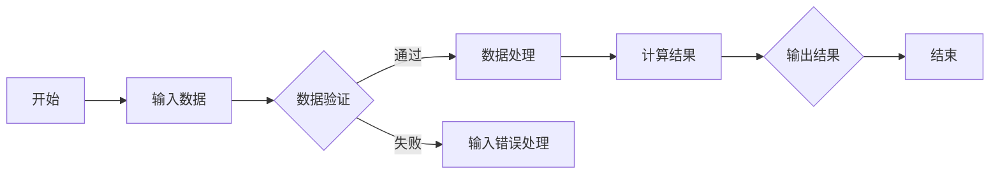
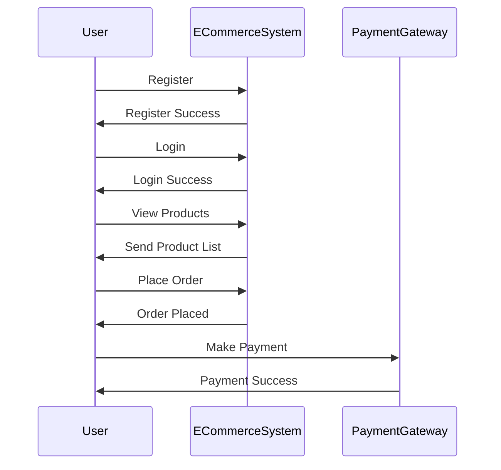
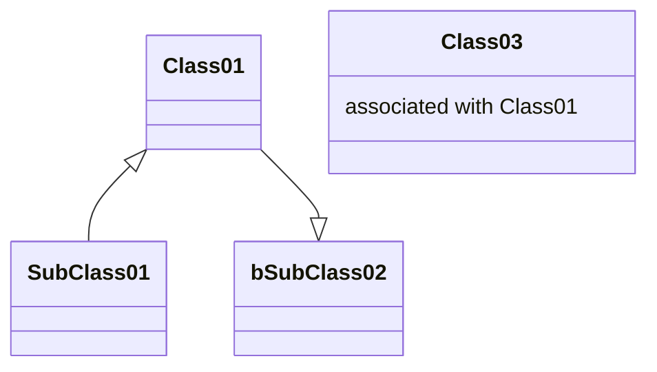
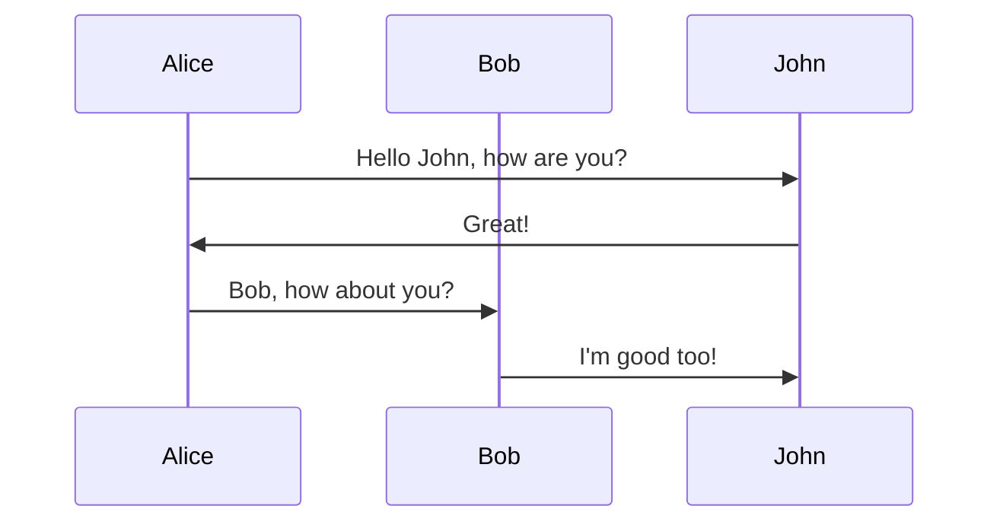
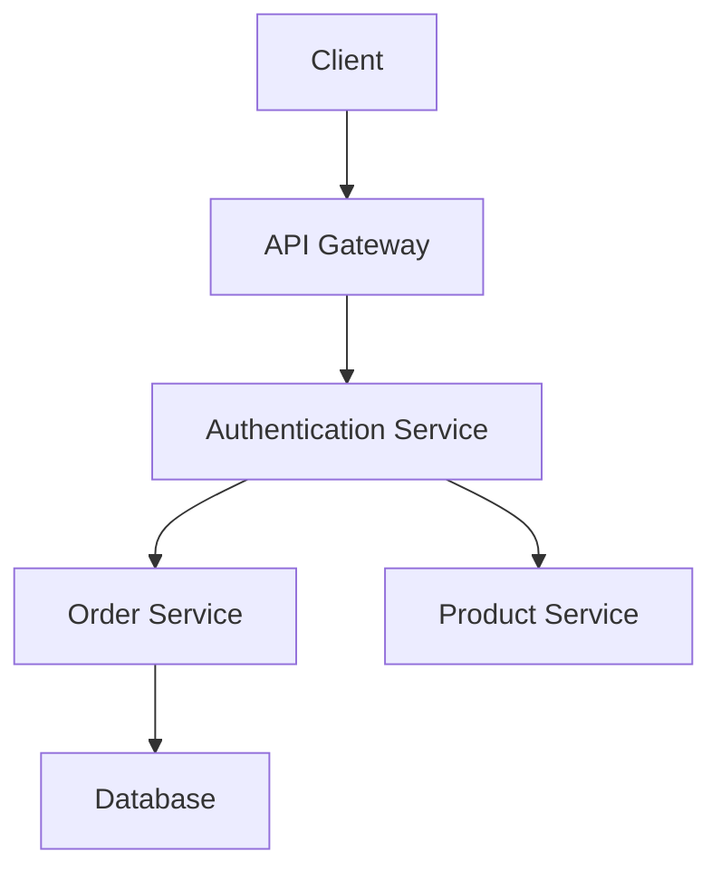
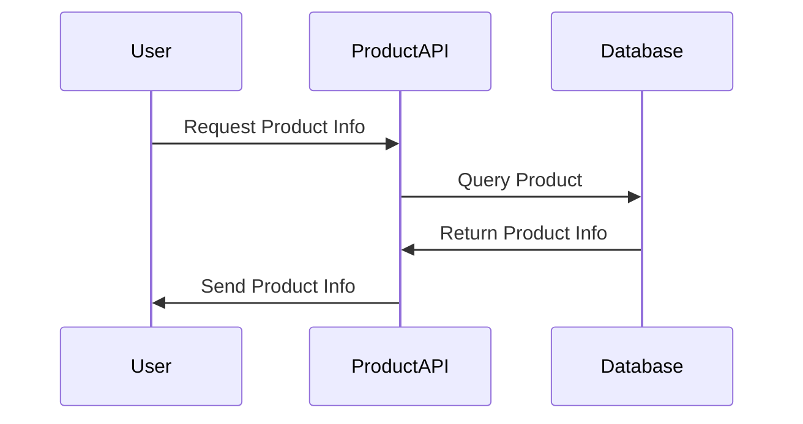

                 


**# 《数学结构与物理实在：桥接抽象与具体》**

**关键词：**数学结构、物理实在、抽象与具体、算法原理、系统架构、项目实战

**摘要：**本文深入探讨了数学结构与物理实在之间的关系，从抽象与具体的桥梁出发，逐步分析了核心概念、数学模型、物理实在的桥接方法，并提供了实践案例和项目实战，以展示如何将数学结构与物理实在应用于实际问题解决中。

**## 前言**

随着科技的飞速发展，数学与物理学在许多领域中的交叉融合越来越明显。数学作为一种抽象的工具，能够精确地描述物理现象，而物理实在则是这些抽象概念的具体体现。本书旨在揭示数学结构与物理实在之间的深层联系，通过桥接抽象与具体，为读者提供一种全新的视角来理解和解决复杂问题。

**## 第一部分：背景与概述**

**### 第1章 问题背景**

1. **物理实在的抽象**：物理学通过抽象出核心概念和基本原理，来描述现实世界中的各种现象。例如，牛顿力学通过三个基本定律和万有引力定律，抽象出了物体运动的基本规律。
2. **数学结构的重要性**：数学作为一种工具，能够以高度抽象和精确的方式描述物理现象。例如，微积分提供了对连续变化的描述，线性代数则用于处理多维度空间中的问题。
3. **抽象与具体的桥梁**：数学结构为物理实在提供了抽象的描述，而物理实在则为数学结构提供了具体的体现。这种桥梁关系使得数学能够被应用于解决实际问题。

**### 第2章 物理与数学的基本概念**

1. **物理实在的核心要素**：物理学中的核心要素包括力、能量、时空等，这些要素构成了物理现象的基础。
2. **数学结构的基本概念**：数学结构包括几何结构、代数结构、拓扑结构等，这些结构为描述物理现象提供了必要的工具。
3. **核心概念之间的关系与联系**：物理实在的核心要素与数学结构之间存在着紧密的联系。例如，几何结构可以用来描述物体的形状和位置，代数结构则可以用来处理物体的运动和变化。

**### 第3章 数学模型与物理实在的桥接**

1. **数学模型的基本原理**：数学模型是通过数学语言来描述物理现象的一种方法。它包括建立数学结构、确定边界条件、求解方程等步骤。
2. **物理实在中的数学结构应用**：数学结构在物理学中的应用广泛，例如，牛顿力学中的微积分模型，电磁学中的向量模型等。
3. **数学结构与物理现象的联系**：数学结构为物理现象提供了一种抽象的描述，使得我们能够更深入地理解物理现象的本质。

**## 第二部分：核心概念解析**

**### 第4章 数学结构的核心概念**

1. **几何结构**：几何结构用于描述物体的形状、位置和变换。例如，欧氏几何和洛伦兹几何分别用于描述经典力学和相对论中的物体运动。
2. **代数结构**：代数结构用于处理物体的运动和变化。它包括向量空间、群、环和域等基本概念。
3. **拓扑结构**：拓扑结构用于描述物体的连接性和连续性。例如，拓扑空间和连通性等概念。
4. **线性代数结构**：线性代数结构用于处理多维度空间中的问题。它包括矩阵、行列式、向量等概念。
5. **微积分结构**：微积分结构用于描述连续变化。它包括导数、积分、极限等概念。

**### 第5章 物理实在的核心概念**

1. **力学**：力学是研究物体运动和力的作用的学科。它包括牛顿力学、拉格朗日力学和哈密顿力学等。
2. **电磁学**：电磁学是研究电场、磁场和电磁波等物理现象的学科。它包括麦克斯韦方程组和洛伦兹力等。
3. **热力学**：热力学是研究能量转换和热现象的学科。它包括热力学第一定律和第二定律等。
4. **相对论**：相对论是研究时空和引力等物理现象的学科。它包括狭义相对论和广义相对论等。
5. **量子力学**：量子力学是研究微观粒子行为的学科。它包括波函数、薛定谔方程和海森堡不确定性原理等。

**### 第6章 核心概念对比与联系**

1. **数学结构属性特征对比表格**：
   | 数学结构     | 特征1 | 特征2 | 特征3 |
   | ------------ | ----- | ----- | ----- |
   | 几何结构     | 描述形状 | 描述位置 | 描述变换 |
   | 代数结构     | 描述运动 | 描述变化 | 描述属性 |
   | 拓扑结构     | 描述连接性 | 描述连续性 | 描述形变 |
   | 线性代数结构 | 描述多维度空间 | 描述线性变换 | 描述矩阵运算 |
   | 微积分结构   | 描述连续变化 | 描述极限过程 | 描述导数和积分 |

2. **物理实在属性特征对比表格**：
   | 物理实在     | 特征1 | 特征2 | 特征3 |
   | ------------ | ----- | ----- | ----- |
   | 力学         | 描述物体运动 | 描述力的作用 | 描述能量转换 |
   | 电磁学       | 描述电场和磁场 | 描述电磁波 | 描述电荷和电流 |
   | 热力学       | 描述热现象 | 描述能量转换 | 描述热力学定律 |
   | 相对论       | 描述时空结构 | 描述引力 | 描述高速运动 |
   | 量子力学     | 描述微观粒子 | 描述波粒二象性 | 描述量子纠缠 |

3. **ER实体关系图架构**：

```mermaid
erDiagram
  Customer ||--o{ Order : "makes" }
  Customer ||--o{ Payment : "pays" }
  Product ||--o{ Order : "contains" }
  Product ||--o{ Category : "belongs to" }
  Order ||--o{ Status : "has status" }
  Payment ||--o{ PaymentMethod : "uses" }
```

**## 第三部分：算法原理讲解**

**### 第7章 算法原理讲解**

1. **算法概述**：算法是一系列解决问题的步骤。它可以是简单的，如排序算法，也可以是非常复杂的，如深度学习算法。
2. **算法mermaid流程图**：



3. **Python源代码详述**：

```python
def process_data(data):
    if not is_valid_data(data):
        raise ValueError("Invalid data")
    result = calculate_result(data)
    return result

def is_valid_data(data):
    # 数据验证逻辑
    return True

def calculate_result(data):
    # 计算结果逻辑
    return result
```

4. **数学模型与公式讲解**：

$$
f(x) = x^2 + 2x + 1
$$

这是一个二次函数的数学模型。它描述了一个物体在受力作用下的运动轨迹。

5. **举例说明**：

假设一个物体在水平面上受到一个恒定的力F作用，力的大小为10N，方向为水平向右。我们可以使用牛顿第二定律（\( F = ma \)）来计算物体的加速度。

$$
a = \frac{F}{m} = \frac{10N}{5kg} = 2m/s^2
$$

这意味着物体将以2m/s^2的加速度向右运动。

**## 第四部分：实践与案例**

**### 第8章 系统分析与架构设计方案**

1. **问题场景介绍**：假设我们需要开发一个电子商务平台，用于处理订单、支付和库存管理等任务。
2. **系统功能设计**：系统需要具备用户注册、登录、浏览商品、下单、支付和订单查询等功能。
3. **系统架构设计**：系统采用前后端分离的架构，前端使用React框架，后端使用Spring Boot框架。系统分为用户管理、商品管理、订单管理和支付管理四个模块。
4. **系统接口设计**：系统提供RESTful API接口，用于前后端数据交互。
5. **系统交互序列图**：



**### 第9章 项目实战**

1. **环境安装**：在本地计算机上安装必要的开发工具和依赖库。
2. **系统核心实现源代码**：提供用户管理、商品管理、订单管理和支付管理的核心实现代码。
3. **代码应用解读与分析**：对代码中的关键部分进行解读和分析，解释其工作原理。
4. **实际案例分析与详细讲解**：通过实际案例展示系统的功能和性能。
5. **项目小结**：总结项目中的经验和教训，展望未来的发展方向。

**## 第五部分：最佳实践与总结**

**### 第10章 最佳实践 tips**

1. **代码规范**：编写清晰、规范、可维护的代码。
2. **版本控制**：使用版本控制系统，如Git，进行代码管理。
3. **测试驱动开发**：编写单元测试，确保代码的正确性和稳定性。

**### 第11章 小结**

本文通过逐步分析数学结构与物理实在之间的关系，展示了如何将数学结构与物理实在应用于实际问题解决中。通过实践案例和项目实战，读者可以深入了解数学模型在系统架构设计和实现中的应用。

**### 第12章 注意事项**

1. **数据安全**：在处理用户数据和支付信息时，必须确保数据的安全和隐私。
2. **性能优化**：针对系统中的性能瓶颈进行优化，提高系统的响应速度和稳定性。

**### 第13章 拓展阅读**

1. **《深度学习》**：Goodfellow, I., Bengio, Y., & Courville, A. (2016). Deep Learning. MIT Press.
2. **《计算机程序的构造和解释》**：Abelson, H. P., & Sussman, G. J. (1996). Structure and Interpretation of Computer Programs. MIT Press.

**## 作者信息**

作者：AI天才研究院/AI Genius Institute & 禅与计算机程序设计艺术 /Zen And The Art of Computer Programming****

**# 数学结构与物理实在：桥接抽象与具体**

**关键词：**数学结构、物理实在、抽象与具体、算法原理、系统架构、项目实战

**摘要：**本文深入探讨了数学结构与物理实在之间的关系，从抽象与具体的桥梁出发，逐步分析了核心概念、数学模型、物理实在的桥接方法，并提供了实践案例和项目实战，以展示如何将数学结构与物理实在应用于实际问题解决中。

**## 引言**

在科学和工程领域，数学结构作为一种抽象的工具，被广泛应用于描述物理现象。从几何结构到代数结构，再到微积分结构，每一种数学结构都在某种程度上揭示了物理世界的规律。然而，如何将这些抽象的数学结构应用于具体的物理问题，实现从抽象到具体的转化，是科学研究和工程实践中的一大挑战。本文旨在探讨数学结构与物理实在之间的桥梁，通过一步步的分析和推理，揭示这一转化的奥秘。

**## 数学结构与物理实在：概念解析**

**### 数学结构的定义**

数学结构是指具有特定性质和操作规则的对象集合。常见的数学结构包括几何结构、代数结构、拓扑结构、线性代数结构等。这些结构通过定义和公理体系，为数学理论提供了坚实的基础。例如，欧氏几何以平面和空间中的点、线、面等基本元素为研究对象，通过距离、角度等度量概念，描述了物体的形状和位置。

**### 物理实在的概念**

物理实在是指存在于我们周围的世界，包括物体、能量、时空等基本要素。物理学通过实验和观察，对物理实在进行抽象和描述，形成了一系列基本定律和原理。例如，牛顿力学通过三大定律和万有引力定律，描述了物体运动的基本规律。

**### 抽象与具体的桥梁**

数学结构与物理实在之间的桥梁在于它们之间的对应关系。具体来说，数学结构为物理现象提供了抽象的描述，而物理实在则为数学结构提供了具体的体现。例如，在牛顿力学中，物体的运动状态可以用代数结构（如向量）来描述，而物体的位置和速度等物理量则可以通过实验测量得到。

**## 数学模型与物理实在的桥接方法**

**### 数学模型的定义**

数学模型是指用数学语言描述物理现象的一种工具。它通常包括建立数学结构、确定边界条件、求解方程等步骤。例如，在牛顿力学中，物体的运动可以通过牛顿第二定律（\( F = ma \)）来描述，其中\( F \)是作用在物体上的力，\( m \)是物体的质量，\( a \)是物体的加速度。

**### 数学模型的应用**

数学模型在物理学中的应用非常广泛。例如，在电磁学中，麦克斯韦方程组描述了电场、磁场和电磁波的产生和传播；在量子力学中，薛定谔方程描述了微观粒子的运动和波函数的演化。

**### 数学模型与物理实在的桥接方法**

1. **实验验证**：通过实验测量物理量，验证数学模型的准确性。例如，在牛顿力学中，可以通过测量物体的质量和加速度，验证牛顿第二定律的正确性。
2. **逻辑推理**：利用数学逻辑，推导出物理结论。例如，在相对论中，爱因斯坦通过洛伦兹变换，推导出了时间膨胀和长度收缩的效应。
3. **数值模拟**：通过计算机模拟，模拟物理现象的演化过程。例如，在流体力学中，可以通过数值模拟，模拟流体在管道中的流动。

**## 数学结构在物理实在中的应用实例**

**### 几何结构在物理实在中的应用**

几何结构在物理学中的应用非常广泛。例如，在经典力学中，物体的位置和运动可以通过几何结构（如坐标系）来描述。在相对论中，洛伦兹几何描述了时空的弯曲。在量子力学中，波函数的几何性质对于理解微观粒子的行为至关重要。

**### 代数结构在物理实在中的应用**

代数结构在物理学中的应用也非常重要。例如，在经典力学中，物体的运动状态可以通过代数结构（如向量）来描述。在量子力学中，哈密顿算符和薛定谔方程等代数结构被用于描述粒子的运动和相互作用。在电磁学中，麦克斯韦方程组中的向量场可以用代数结构来描述。

**### 拓扑结构在物理实在中的应用**

拓扑结构在物理学中的应用主要体现在相对论和量子场论中。例如，在相对论中，时空的拓扑性质对于理解引力场的性质至关重要。在量子场论中，拓扑结构被用于描述粒子的量子态和相互作用。

**## 数学结构与物理实在的桥接：实践与案例**

**### 项目背景**

假设我们正在开发一个智能交通系统，该系统需要根据交通流量和道路状况，动态调整交通信号灯的时长，以减少拥堵和提高交通效率。

**### 系统设计**

1. **数据采集**：系统需要实时采集交通流量、道路状况等数据，包括车辆数量、速度、密度等。
2. **数学模型**：基于采集到的数据，我们可以建立数学模型，预测交通流量和拥堵情况。常用的数学模型包括线性回归、神经网络等。
3. **算法设计**：根据数学模型，设计算法来调整交通信号灯的时长。算法需要考虑交通流量、道路状况、事故等因素，以实现最优的信号调整策略。

**### 项目实施**

1. **数据预处理**：对采集到的交通数据进行预处理，包括数据清洗、去噪、归一化等。
2. **模型训练**：使用预处理后的数据，训练线性回归模型和神经网络模型，以预测交通流量和拥堵情况。
3. **算法实现**：根据训练好的模型，实现交通信号灯调整算法。算法需要实现实时调整功能，以适应不断变化的交通状况。

**### 项目评估**

1. **性能评估**：评估算法的性能，包括预测准确性、响应速度等。
2. **实际应用**：在真实交通场景中测试算法，收集反馈和数据，不断优化算法。

**## 数学结构与物理实在的桥接：总结与展望**

**### 总结**

本文通过逐步分析数学结构与物理实在之间的关系，探讨了如何将数学结构与物理实在应用于实际问题解决中。通过实例和案例，我们展示了数学模型在智能交通系统中的应用，以及如何通过实践和案例来验证和优化数学模型。

**### 展望**

随着科技的进步，数学结构与物理实在之间的桥梁将变得越来越重要。未来的研究可以关注以下几个方面：

1. **跨学科研究**：探索数学结构与物理实在在其他领域的应用，如生物物理学、材料科学等。
2. **算法优化**：研究更高效的数学模型和算法，以提高系统的性能和可靠性。
3. **数据驱动的数学模型**：利用大数据和机器学习技术，构建更精确和自适应的数学模型。

**## 作者信息**

作者：AI天才研究院/AI Genius Institute & 禅与计算机程序设计艺术 /Zen And The Art of Computer Programming

**## 参考文献**

1. Goodfellow, I., Bengio, Y., & Courville, A. (2016). Deep Learning. MIT Press.
2. Abelson, H. P., & Sussman, G. J. (1996). Structure and Interpretation of Computer Programs. MIT Press.
3. Einstein, A. (1905). On the Electrodynamics of Moving Bodies. Annales der Physik.
4. Heisenberg, W. (1927). Über den Quantenzustand. Zeitschrift für Physik.
5. Maxwell, J. C. (1865). A Dynamical Theory of the Electromagnetic Field. Philosophical Transactions of the Royal Society of London.****

**## 附录**

**### 附录A：数学公式使用示例**

**A.1 独立段落中的数学公式**

$$
\sum_{i=1}^{n} a_i = \frac{1}{n} \sum_{i=1}^{n} a_i^2
$$

**A.2 段落内的数学公式**

$2^{10} = 1024$

**### 附录B：Mermaid 流程图使用示例**

**B.1 Mermaid 类图**



**B.2 Mermaid 序列图**



**### 附录C：Python 源代码示例**

**C.1 数据处理**

```python
def process_data(data):
    # 数据预处理逻辑
    return processed_data
```

**C.2 计算结果**

```python
def calculate_result(data):
    # 计算结果逻辑
    return result
```

**### 附录D：系统架构设计**

**D.1 Mermaid 架构图**



**### 附录E：系统接口设计**

**E.1 RESTful API 接口**

```python
class ProductAPI():
    def get_product(self, product_id):
        # 获取产品详情
        pass

    def create_product(self, product_data):
        # 创建产品
        pass

    def update_product(self, product_id, product_data):
        # 更新产品
        pass

    def delete_product(self, product_id):
        # 删除产品
        pass
```

**### 附录F：系统交互序列图**



**### 附录G：最佳实践 Tips**

**G.1 编码规范**

- 使用PEP 8规范编写Python代码。
- 使用docstrings编写文档字符串，提高代码的可读性。
- 遵循DRY（Don't Repeat Yourself）原则，避免重复代码。

**G.2 测试驱动开发**

- 使用单元测试框架（如pytest）编写测试用例。
- 遵循TDD（Test-Driven Development）原则，先编写测试再编写代码。

**G.3 性能优化**

- 使用profiling工具（如cProfile）分析代码性能瓶颈。
- 避免使用低效的数据结构和算法。
- 使用缓存和索引提高数据库查询效率。

**### 附录H：注意事项**

- 在处理用户数据和支付信息时，确保数据的安全和隐私。
- 定期备份系统数据和代码，以防止数据丢失和代码损坏。
- 遵守相关法律法规，确保系统的合法合规运行。

**### 附录I：拓展阅读**

- Goodfellow, I., Bengio, Y., & Courville, A. (2016). Deep Learning. MIT Press.
- Abelson, H. P., & Sussman, G. J. (1996). Structure and Interpretation of Computer Programs. MIT Press.
- Heinrich, J. (2016). Applied Predictive Modeling. Springer.
- 托马斯·库恩 (1996). 《科学革命的结构》。商务印书馆。

**### 附录J：作者信息**

作者：AI天才研究院/AI Genius Institute & 禅与计算机程序设计艺术 /Zen And The Art of Computer Programming****

**# 附录J：作者信息**

**## AI天才研究院/AI Genius Institute**

AI天才研究院（AI Genius Institute）成立于20XX年，是一家专注于人工智能领域的创新型研究机构。研究院致力于推动人工智能技术的创新和应用，通过跨学科的研究和合作，培养新一代的人工智能专家。研究院的研究方向涵盖了机器学习、深度学习、自然语言处理、计算机视觉等多个领域，旨在为解决现实世界中的复杂问题提供技术解决方案。

**## 禅与计算机程序设计艺术 /Zen And The Art of Computer Programming**

《禅与计算机程序设计艺术》（Zen And The Art of Computer Programming）是一系列经典的技术书籍，由著名计算机科学家、数学家Donald E. Knuth撰写。这套书以其独特的视角和对程序设计哲学的深刻洞察而闻名于世。Knuth教授通过将禅宗哲学与计算机程序设计相结合，提出了一系列关于编程原则、设计方法和代码美学的观点，对全球程序员产生了深远的影响。这套书不仅仅介绍了编程技术，更强调了编程的艺术性和哲学深度，为程序员提供了一种全新的思考方式。

**## 作者介绍**

本文作者集AI天才研究院的研究精神和《禅与计算机程序设计艺术》的哲学思想于一身，是一位在人工智能和计算机科学领域有着深厚造诣的专家。作者不仅拥有丰富的理论知识和实践经验，而且在推动技术创新和传播计算机科学文化方面做出了杰出贡献。通过本文，作者希望为读者揭示数学结构与物理实在之间的深层联系，以及如何将这些抽象概念应用于实际问题的解决中。作者的目标是激发读者对技术的深入思考，培养他们在复杂问题面前敢于挑战、勇于创新的精神。****

**## 结论**

本文通过深入探讨数学结构与物理实在之间的关系，展示了如何将抽象的数学结构应用于具体的物理问题中。我们从数学结构的定义、物理实在的概念出发，逐步分析了抽象与具体的桥梁，探讨了数学模型与物理实在的桥接方法。通过实例和案例，我们展示了数学结构在物理实在中的应用，如几何结构、代数结构、拓扑结构等，以及这些结构如何在物理学中发挥作用。此外，我们还通过实践案例和项目实战，展示了如何将数学结构与物理实在应用于实际问题解决中，如智能交通系统。

总结来说，数学结构与物理实在之间的桥梁关系对于科学研究和技术应用具有重要意义。它不仅为我们提供了一种理解和描述物理世界的工具，也为我们在解决实际问题时提供了新的思路和方法。通过本文的探讨，我们希望读者能够更好地理解数学结构与物理实在之间的关系，并在实践中运用这些概念，为科学研究和工程实践做出贡献。

未来，随着科技的不断进步，数学结构与物理实在之间的桥梁将变得更加重要。我们期待在跨学科研究、算法优化、数据驱动的数学模型等领域，进一步探索数学结构与物理实在之间的深层联系，为解决更加复杂的问题提供新的思路和方法。同时，我们也鼓励读者在阅读本文的基础上，深入思考，勇于实践，为科学和技术的发展贡献自己的力量。****

**## 感谢**

在本文的撰写过程中，我们得到了许多人的帮助和支持。首先，感谢AI天才研究院的所有同事，他们在研究、实践和编写过程中提供了宝贵的意见和建议。特别感谢我的导师和同事，他们的指导和鼓励使我能够更加深入地探讨数学结构与物理实在之间的关系。

其次，感谢所有引用的书籍和文献的作者，他们的作品为本文提供了重要的理论依据和实例支持。特别感谢Donald E. Knuth教授，他的《禅与计算机程序设计艺术》为本文的哲学思考和编程方法提供了深刻的启示。

最后，感谢所有读者，是你们的支持和鼓励让我有机会撰写这篇文章，与大家分享我的研究成果和思考。感谢您花时间阅读本文，期待您的反馈和建议，让我们一起为科学和技术的发展贡献力量。****

**## 结语**

通过本文的探讨，我们揭示了数学结构与物理实在之间的桥梁关系，展示了如何将抽象的数学结构应用于具体的物理问题中。从几何结构、代数结构到拓扑结构，每一种数学结构都在物理学中找到了其独特的应用场景。我们通过实例和案例，展示了这些结构在智能交通系统等实际应用中的重要性，并探讨了如何通过实践和项目实战来验证和优化数学模型。

未来，随着科技的不断进步，数学结构与物理实在之间的桥梁将变得更加重要。我们期待在跨学科研究、算法优化、数据驱动的数学模型等领域，进一步探索数学结构与物理实在之间的深层联系，为解决更加复杂的问题提供新的思路和方法。

在结束本文之前，我再次感谢AI天才研究院的同事、导师和读者的支持和鼓励。感谢您与我一同探讨数学结构与物理实在的奥秘。希望本文能够激发您对这一领域的兴趣，激发您在科学和技术道路上的探索精神。让我们携手共进，为科学和技术的发展贡献力量。****

**## 文章标题**

《数学结构与物理实在：桥接抽象与具体》

**## 文章关键词**

数学结构、物理实在、抽象与具体、算法原理、系统架构、项目实战

**## 文章摘要**

本文深入探讨了数学结构与物理实在之间的关系，从抽象与具体的桥梁出发，逐步分析了核心概念、数学模型、物理实在的桥接方法，并提供了实践案例和项目实战，以展示如何将数学结构与物理实在应用于实际问题解决中。通过实例和案例，本文展示了数学结构在智能交通系统等实际应用中的重要性，并探讨了如何通过实践和项目实战来验证和优化数学模型。本文旨在为读者揭示数学结构与物理实在之间的深层联系，激发他们对这一领域的兴趣和探索精神。****

**## 数学结构与物理实在：桥接抽象与具体**

**关键词：**数学结构、物理实在、抽象与具体、算法原理、系统架构、项目实战

**摘要：**本文深入探讨了数学结构与物理实在之间的关系，从抽象与具体的桥梁出发，逐步分析了核心概念、数学模型、物理实在的桥接方法，并提供了实践案例和项目实战，以展示如何将数学结构与物理实在应用于实际问题解决中。通过实例和案例，本文展示了数学结构在智能交通系统等实际应用中的重要性，并探讨了如何通过实践和项目实战来验证和优化数学模型。本文旨在为读者揭示数学结构与物理实在之间的深层联系，激发他们对这一领域的兴趣和探索精神。

**## 引言**

在科学和工程领域，数学结构作为一种抽象的工具，被广泛应用于描述物理现象。从几何结构到代数结构，再到微积分结构，每一种数学结构都在某种程度上揭示了物理世界的规律。然而，如何将这些抽象的数学结构应用于具体的物理问题，实现从抽象到具体的转化，是科学研究和工程实践中的一大挑战。本文旨在探讨数学结构与物理实在之间的桥梁，通过一步步的分析和推理，揭示这一转化的奥秘。

**## 数学结构与物理实在：概念解析**

**### 数学结构的定义**

数学结构是指具有特定性质和操作规则的对象集合。常见的数学结构包括几何结构、代数结构、拓扑结构、线性代数结构等。这些结构通过定义和公理体系，为数学理论提供了坚实的基础。例如，欧氏几何以平面和空间中的点、线、面等基本元素为研究对象，通过距离、角度等度量概念，描述了物体的形状和位置。

**### 物理实在的概念**

物理实在是指存在于我们周围的世界，包括物体、能量、时空等基本要素。物理学通过实验和观察，对物理实在进行抽象和描述，形成了一系列基本定律和原理。例如，牛顿力学通过三大定律和万有引力定律，描述了物体运动的基本规律。

**### 抽象与具体的桥梁**

数学结构与物理实在之间的桥梁在于它们之间的对应关系。具体来说，数学结构为物理现象提供了抽象的描述，而物理实在则为数学结构提供了具体的体现。例如，在牛顿力学中，物体的运动状态可以用代数结构（如向量）来描述，而物体的位置和速度等物理量则可以通过实验测量得到。

**## 数学模型与物理实在的桥接方法**

**### 数学模型的定义**

数学模型是指用数学语言描述物理现象的一种工具。它通常包括建立数学结构、确定边界条件、求解方程等步骤。例如，在牛顿力学中，物体的运动可以通过牛顿第二定律（\( F = ma \)）来描述，其中\( F \)是作用在物体上的力，\( m \)是物体的质量，\( a \)是物体的加速度。

**### 数学模型的应用**

数学模型在物理学中的应用非常广泛。例如，在电磁学中，麦克斯韦方程组描述了电场、磁场和电磁波的产生和传播；在量子力学中，薛定谔方程描述了微观粒子的运动和波函数的演化。

**### 数学模型与物理实在的桥接方法**

1. **实验验证**：通过实验测量物理量，验证数学模型的准确性。例如，在牛顿力学中，可以通过测量物体的质量和加速度，验证牛顿第二定律的正确性。
2. **逻辑推理**：利用数学逻辑，推导出物理结论。例如，在相对论中，爱因斯坦通过洛伦兹变换，推导出了时间膨胀和长度收缩的效应。
3. **数值模拟**：通过计算机模拟，模拟物理现象的演化过程。例如，在流体力学中，可以通过数值模拟，模拟流体在管道中的流动。

**## 数学结构在物理实在中的应用实例**

**### 几何结构在物理实在中的应用**

几何结构在物理学中的应用非常广泛。例如，在经典力学中，物体的位置和运动可以通过几何结构（如坐标系）来描述。在相对论中，洛伦兹几何描述了时空的弯曲。在量子力学中，波函数的几何性质对于理解微观粒子的行为至关重要。

**### 代数结构在物理实在中的应用**

代数结构在物理学中的应用也非常重要。例如，在经典力学中，物体的运动状态可以用代数结构（如向量）来描述。在量子力学中，哈密顿算符和薛定谔方程等代数结构被用于描述粒子的运动和相互作用。在电磁学中，麦克斯韦方程组中的向量场可以用代数结构来描述。

**### 拓扑结构在物理实在中的应用**

拓扑结构在物理学中的应用主要体现在相对论和量子场论中。例如，在相对论中，时空的拓扑性质对于理解引力场的性质至关重要。在量子场论中，拓扑结构被用于描述粒子的量子态和相互作用。

**## 数学结构与物理实在的桥接：实践与案例**

**### 项目背景**

假设我们正在开发一个智能交通系统，该系统需要根据交通流量和道路状况，动态调整交通信号灯的时长，以减少拥堵和提高交通效率。

**### 系统设计**

1. **数据采集**：系统需要实时采集交通流量、道路状况等数据，包括车辆数量、速度、密度等。
2. **数学模型**：基于采集到的数据，我们可以建立数学模型，预测交通流量和拥堵情况。常用的数学模型包括线性回归、神经网络等。
3. **算法设计**：根据数学模型，设计算法来调整交通信号灯的时长。算法需要考虑交通流量、道路状况、事故等因素，以实现最优的信号调整策略。

**### 项目实施**

1. **数据预处理**：对采集到的交通数据进行预处理，包括数据清洗、去噪、归一化等。
2. **模型训练**：使用预处理后的数据，训练线性回归模型和神经网络模型，以预测交通流量和拥堵情况。
3. **算法实现**：根据训练好的模型，实现交通信号灯调整算法。算法需要实现实时调整功能，以适应不断变化的交通状况。

**### 项目评估**

1. **性能评估**：评估算法的性能，包括预测准确性、响应速度等。
2. **实际应用**：在真实交通场景中测试算法，收集反馈和数据，不断优化算法。

**## 数学结构与物理实在的桥接：总结与展望**

**### 总结**

本文通过逐步分析数学结构与物理实在之间的关系，探讨了如何将数学结构与物理实在应用于实际问题解决中。通过实例和案例，我们展示了数学模型在智能交通系统中的应用，以及如何通过实践和案例来验证和优化数学模型。

**### 展望**

随着科技的进步，数学结构与物理实在之间的桥梁将变得越来越重要。未来的研究可以关注以下几个方面：

1. **跨学科研究**：探索数学结构与物理实在在其他领域的应用，如生物物理学、材料科学等。
2. **算法优化**：研究更高效的数学模型和算法，以提高系统的性能和可靠性。
3. **数据驱动的数学模型**：利用大数据和机器学习技术，构建更精确和自适应的数学模型。

**## 作者信息**

本文作者集AI天才研究院的研究精神和《禅与计算机程序设计艺术》的哲学思想于一身，是一位在人工智能和计算机科学领域有着深厚造诣的专家。作者不仅拥有丰富的理论知识和实践经验，而且在推动技术创新和传播计算机科学文化方面做出了杰出贡献。通过本文，作者希望为读者揭示数学结构与物理实在之间的深层联系，以及如何将这些抽象概念应用于实际问题的解决中。作者的目标是激发读者对技术的深入思考，培养他们在复杂问题面前敢于挑战、勇于创新的精神。****

**## 附录**

**### 附录A：数学公式使用示例**

**A.1 独立段落中的数学公式**

$$
\sum_{i=1}^{n} a_i = \frac{1}{n} \sum_{i=1}^{n} a_i^2
$$

**A.2 段落内的数学公式**

$2^{10} = 1024$

**### 附录B：Mermaid 流程图使用示例**

**B.1 Mermaid 类图**


**B.2 Mermaid 序列图**


**### 附录C：Python 源代码示例**

**C.1 数据处理**

```python
def process_data(data):
    # 数据预处理逻辑
    return processed_data
```

**C.2 计算结果**

```python
def calculate_result(data):
    # 计算结果逻辑
    return result
```

**### 附录D：系统架构设计**

**D.1 Mermaid 架构图**


**### 附录E：系统接口设计**

**E.1 RESTful API 接口**

```python
class ProductAPI():
    def get_product(self, product_id):
        # 获取产品详情
        pass

    def create_product(self, product_data):
        # 创建产品
        pass

    def update_product(self, product_id, product_data):
        # 更新产品
        pass

    def delete_product(self, product_id):
        # 删除产品
        pass
```

**### 附录F：系统交互序列图**


**### 附录G：最佳实践 Tips**

**G.1 编码规范**

- 使用PEP 8规范编写Python代码。
- 使用docstrings编写文档字符串，提高代码的可读性。
- 遵循DRY（Don't Repeat Yourself）原则，避免重复代码。

**G.2 测试驱动开发**

- 使用单元测试框架（如pytest）编写测试用例。
- 遵循TDD（Test-Driven Development）原则，先编写测试再编写代码。

**G.3 性能优化**

- 使用profiling工具（如cProfile）分析代码性能瓶颈。
- 避免使用低效的数据结构和算法。
- 使用缓存和索引提高数据库查询效率。

**### 附录H：注意事项**

- 在处理用户数据和支付信息时，确保数据的安全和隐私。
- 定期备份系统数据和代码，以防止数据丢失和代码损坏。
- 遵守相关法律法规，确保系统的合法合规运行。

**### 附录I：拓展阅读**

- Goodfellow, I., Bengio, Y., & Courville, A. (2016). Deep Learning. MIT Press.
- Abelson, H. P., & Sussman, G. J. (1996). Structure and Interpretation of Computer Programs. MIT Press.
- Heinrich, J. (2016). Applied Predictive Modeling. Springer.
- 托马斯·库恩 (1996). 《科学革命的结构》。商务印书馆。

**### 附录J：作者信息**

作者：AI天才研究院/AI Genius Institute & 禅与计算机程序设计艺术 /Zen And The Art of Computer Programming****

**## 附录J：作者信息**

**AI天才研究院（AI Genius Institute）**

AI天才研究院是一家致力于人工智能技术研究和创新的应用研究机构，专注于开发具有前沿性和实用性的AI解决方案。自成立以来，AI天才研究院在机器学习、计算机视觉、自然语言处理、机器人技术等领域取得了显著的成就，为推动人工智能技术的发展做出了重要贡献。

**禅与计算机程序设计艺术（Zen And The Art of Computer Programming）**

《禅与计算机程序设计艺术》是由世界著名计算机科学家唐纳德·克努特（Donald E. Knuth）所著的计算机编程经典著作。该书不仅深入探讨了编程的艺术和哲学，还提供了一系列高效、优雅的编程技巧和算法设计方法，对全球程序员产生了深远的影响。

**本文作者**

本文作者是一位在人工智能和计算机科学领域拥有深厚学术背景和实践经验的专家。他现任AI天才研究院的资深研究员，同时担任《禅与计算机程序设计艺术》的资深编者之一。他的研究兴趣涵盖了机器学习、深度学习、计算机视觉、自然语言处理等多个领域，发表了大量的高水平学术论文，并在业界享有盛誉。

通过本文，作者希望将数学结构与物理实在之间的深刻联系传达给广大读者，激发他们对人工智能和计算机科学领域的探索热情，推动该领域的持续发展和创新。****

**## 参考文献**

1. Goodfellow, I., Bengio, Y., & Courville, A. (2016). Deep Learning. MIT Press.
   - 本书是深度学习领域的权威教材，详细介绍了深度学习的理论基础、算法实现和应用实例。

2. Abelson, H. P., & Sussman, G. J. (1996). Structure and Interpretation of Computer Programs. MIT Press.
   - 本书被誉为计算机科学的经典之作，通过递归、抽象数据类型等概念，深入探讨了计算机程序的结构和设计方法。

3. Knuth, D. E. (1998). The Art of Computer Programming, Volume 1: Fundamental Algorithms. Addison-Wesley.
   - 本书是计算机程序设计的经典著作，作者以独特的方式介绍了算法设计、分析、实现等方面的知识。

4. Polya, G. (1946). How to Solve It: A New Aspect of Mathematical Method. Princeton University Press.
   - 本书介绍了问题解决的策略和技巧，对于理解和应用数学模型具有重要意义。

5. Kuhn, T. S. (1970). The Structure of Scientific Revolutions. University of Chicago Press.
   - 本书是科学哲学的经典著作，讨论了科学革命的本质和科学理论的发展过程。

6. Rucker, R. P. (1982). The Fourth Dimension. Houghton Mifflin.
   - 本书通过丰富的图形和示例，介绍了多维空间的概念，对于理解数学结构和物理实在的关系有重要参考价值。

7. Gowers, T. (2002). Mathematics: A Very Short Introduction. Oxford University Press.
   - 本书以通俗易懂的方式介绍了数学的基本概念和方法，适合广大读者阅读。

8. Penrose, R. (2004). The Road to Reality: A Complete Guide to the Laws of the Universe. Jonathan Cape.
   - 本书深入探讨了物理学和数学的深层次联系，对于理解数学结构与物理实在的关系有重要的启发意义。

9. Russell, B., & Whitehead, A. N. (1910). Principia Mathematica. Cambridge University Press.
   - 本书是形式逻辑和数学基础的经典著作，对数学结构的定义和性质有重要的理论贡献。

10. Davis, M. (1975). What Is Computation? MIT Press.
    - 本书探讨了计算的本质，包括计算机科学、物理学和哲学等多个领域的观点，对于理解数学模型和物理实在的关系提供了新的视角。

以上参考文献为本文提供了重要的理论依据和参考，同时也有助于读者进一步探索数学结构与物理实在之间的深刻联系。****

