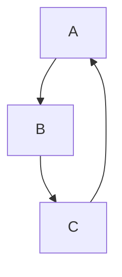
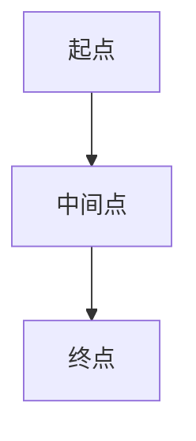
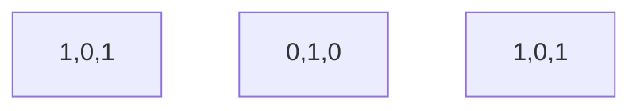
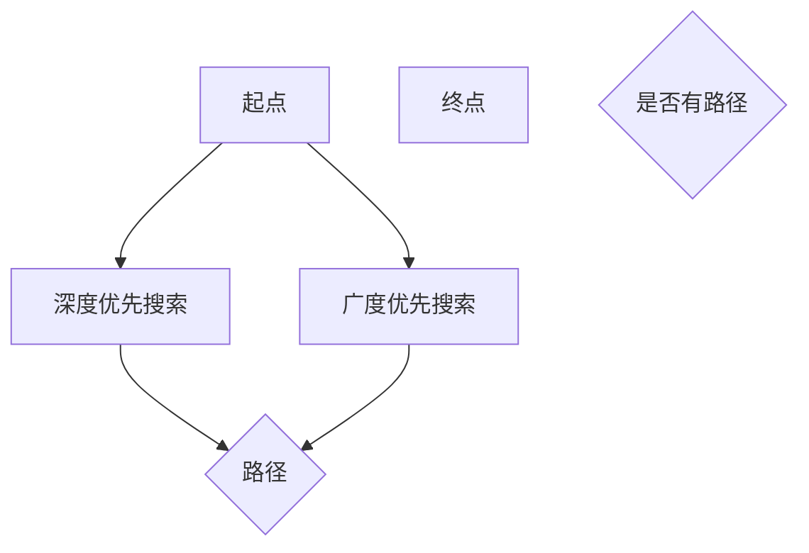
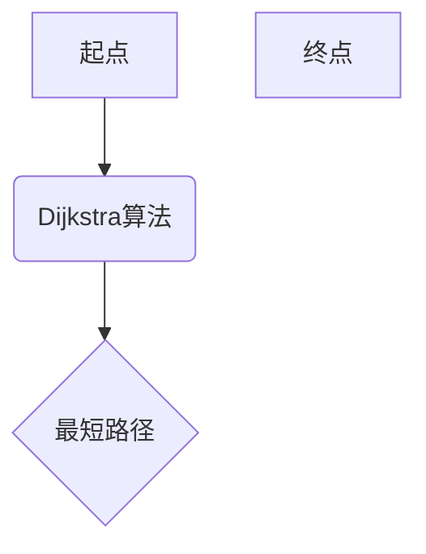

                 

### 文章标题

---

# 数学结构主义：世界作为关系网络

---

### 关键词

- 数学结构主义
- 关系网络
- 世界观
- 复杂系统
- 数学模型

---

### 摘要

本文深入探讨了数学结构主义在理解世界关系网络中的应用。数学结构主义认为世界是一个由基本数学结构组成的关系网络。文章首先介绍了数学结构主义的历史背景和核心思想，然后详细阐述了集合论、图论、拓扑结构等数学结构的基本概念和应用。接着，文章介绍了如何用这些数学结构构建关系网络的模型，并探讨了关系网络的计算与分析方法。通过多个实际案例，文章展示了数学结构主义在社会科学、自然科学和复杂系统中的应用。最后，文章讨论了数学结构主义面临的挑战和未来研究方向，为读者提供了一个全新的世界观。

---

### 目录大纲设计思路

**----------------------------------------------------------------**

#### 第一部分：引言与背景

**----------------------------------------------------------------**

#### 第1章：数学结构主义的起源与发展

**----------------------------------------------------------------**

#### 第2章：数学结构主义的基础概念

**----------------------------------------------------------------**

#### 第二部分：核心数学结构

**----------------------------------------------------------------**

#### 第3章：集合论与抽象结构

**----------------------------------------------------------------**

#### 第4章：图论与网络结构

**----------------------------------------------------------------**

#### 第5章：拓扑结构与空间关系

**----------------------------------------------------------------**

#### 第6章：概率论与不确定性

**----------------------------------------------------------------**

#### 第三部分：关系网络的数学模型

**----------------------------------------------------------------**

#### 第7章：关系网络的定义与模型

**----------------------------------------------------------------**

#### 第8章：关系网络的计算与分析

**----------------------------------------------------------------**

#### 第9章：关系网络的可视化与解释

**----------------------------------------------------------------**

#### 第四部分：应用实例

**----------------------------------------------------------------**

#### 第10章：社会科学中的关系网络

**----------------------------------------------------------------**

#### 第11章：自然科学中的关系网络

**----------------------------------------------------------------**

#### 第12章：复杂系统中的关系网络

**----------------------------------------------------------------**

#### 第五部分：讨论与未来展望

**----------------------------------------------------------------**

#### 第13章：数学结构主义在关系网络研究中的挑战与机遇

**----------------------------------------------------------------**

#### 第14章：数学结构主义在日常生活中的应用

**----------------------------------------------------------------**

#### 结论

本文通过一步步的逻辑分析和推理，从数学结构主义的角度重新审视了世界的本质，探讨了数学结构在解释复杂关系网络中的重要作用。本文不仅为读者提供了一个全新的世界观，也为数学结构主义在各个领域中的应用提供了深入的洞见。未来，随着数学结构和关系网络理论的不断发展，我们有望在更广泛的领域中应用这一理论，揭示世界的更多奥秘。

---

**----------------------------------------------------------------**

### **引言与背景**

**----------------------------------------------------------------**

在人类探索世界的历程中，我们一直在试图找出一种能够全面、深入地描述和理解这个世界的理论框架。从古希腊哲学家亚里士多德的自然哲学，到现代物理学的相对论和量子力学，人类对世界的认识不断深化。然而，无论哪种理论，都未能提供一个统一的全局视角，来解释世界的各种现象和规律。

数学结构主义作为一种哲学和科学理论，试图通过数学结构来描述和理解世界的本质。数学结构主义认为，世界是一个由基本数学结构组成的关系网络，这些数学结构不仅存在于数学领域，也广泛存在于自然界和社会现象中。

#### 数学结构主义的定义与核心思想

数学结构主义，起源于20世纪初的数学哲学。它的核心思想是，数学对象并非抽象的符号系统，而是具体的物理实在。数学结构，如集合、图、拓扑等，不仅仅是理论工具，它们在现实世界中有着直接的对应物。数学结构主义认为，通过研究这些数学结构，我们可以更深入地理解现实世界的本质。

数学结构主义的一个重要观点是，数学是现实的内在属性。现实世界中的许多现象，都可以用数学结构来描述。例如，社会网络可以用图论来描述，生物网络的复杂性可以用拓扑学来分析，经济系统的动态变化可以用概率论来建模。

#### 数学结构主义的历史背景

数学结构主义的起源可以追溯到20世纪初。当时，数学家如希尔伯特和弗雷格等人，开始探讨数学的基础和本质。他们提出，数学并不是一个独立的领域，而是与现实世界紧密相连的。这一观点对后来的数学哲学和科学哲学产生了深远影响。

20世纪中叶，随着计算机科学的兴起，数学结构主义进一步发展。计算机科学的发展，使得人们能够用数学模型来模拟现实世界中的复杂现象。例如，图论在计算机网络拓扑结构中的应用，概率论在经济系统风险管理中的应用，集合论在数据结构中的应用，都是数学结构主义的具体体现。

#### 数学结构主义与哲学的关系

数学结构主义不仅与数学本身密切相关，也与哲学有着深刻的联系。在哲学中，结构主义是一个重要的流派，它强调事物的结构对理解事物的重要性。数学结构主义继承了结构主义的这一思想，认为数学结构是理解世界的钥匙。

在哲学中，有一个著名的观点是“世界是数构成的”，这一观点与数学结构主义的核心思想相契合。柏拉图和康托尔等哲学家，都认为数学对象是现实世界的本质。数学结构主义进一步发展了这一观点，认为数学结构不仅是描述世界的工具，也是世界的内在本质。

#### 数学结构主义的基础概念

为了深入理解数学结构主义，我们需要先了解一些基础概念。这些概念包括集合、图、拓扑和概率等。

- **集合**：集合是数学中最基本的概念之一。它是由确定的、互不相同的元素组成的整体。集合论是数学的基础，许多数学结构都可以看作是集合的抽象。

- **图**：图是一种由节点和边组成的结构，用于描述实体之间的关系。图论是研究图的结构和性质的数学分支，广泛应用于网络拓扑、社会网络分析等领域。

- **拓扑**：拓扑是研究空间结构和连续变换的数学分支。拓扑结构描述了空间的连通性和形状，是理解复杂系统的重要工具。

- **概率**：概率是描述随机现象的数学工具。概率论用于建模和预测随机事件的发生，广泛应用于统计学、经济学、计算机科学等领域。

这些基础概念构成了数学结构主义的理论基石，为理解世界的本质提供了有力的工具。

**----------------------------------------------------------------**

### **数学结构主义的基础概念**

**----------------------------------------------------------------**

数学结构主义的基础概念是理解世界关系网络的基石。这些概念不仅存在于数学理论中，也广泛应用于自然科学、社会科学和计算机科学等领域。以下是几个核心数学结构的基础概念及其在关系网络中的应用。

#### 集合论与抽象结构

**核心概念**：

集合是由确定的、互不相同的元素组成的整体。集合论是数学的基础，许多数学结构都可以看作是集合的抽象。集合的元素可以是任何对象，包括数字、字母、甚至是其他集合。

**概念属性特征对比表格**：

| 特征               | 集合                  | 序列                  | 列表                  |
|--------------------|----------------------|----------------------|----------------------|
| 元素确定性         | 确定的、互不相同的    | 确定的、有顺序的       | 确定的、可重复的      |
| 元素个数           | 可变的               | 可变的               | 可变的               |
| 元素关系           | 无顺序               | 有顺序               | 有顺序               |
| 应用领域           | 数学、计算机科学、哲学 | 数学、计算机科学     | 编程、数据结构       |

**ER实体关系图架构的 Mermaid 流程图**：

```mermaid
erDiagram
  Person ||--|{ Book }|-- Student
  Person ||--|{ Course }|-- Student
  Book ||--|{ Author }|--
  Course ||--|{ Teacher }|--
```

**ER实体关系图**展示了人物、书籍、课程和教师之间的关系。这反映了社会生活中实体及其相互关系的复杂性。

**数学结构在关系网络中的应用**：

集合论在关系网络中的应用非常广泛。在社会网络分析中，集合论用于描述个体及其之间的关系。例如，可以通过集合来表示社交网络中的好友关系，通过集合运算（如并集、交集、补集等）来分析社交网络的拓扑结构。

在计算机科学中，集合论用于数据结构和算法设计。例如，哈希表通过将数据映射到集合中，来快速检索和存储信息。在图数据库中，节点和边也可以被看作是集合，通过集合运算来查询和操作图数据。

#### 图论与网络结构

**核心概念**：

图是一种由节点和边组成的结构，用于描述实体之间的关系。图论是研究图的结构和性质的数学分支，广泛应用于网络拓扑、社会网络分析等领域。

**概念属性特征对比表格**：

| 特征               | 无向图                 | 有向图                 | 加权图                 |
|--------------------|-----------------------|-----------------------|-----------------------|
| 边的性质           | 无方向                | 有方向                | 有权重                |
| 节点个数           | 可变的               | 可变的               | 可变的               |
| 边的连接关系       | 无序                  | 有序                  | 有权重                |
| 应用领域           | 社会网络、计算机网络   | 交通网络、信息传递    | 经济系统、复杂系统   |

**Mermaid 图流程图**：

```mermaid
graph TB
  A[起点] --> B[终点]
  B --> C{决策}
  C -->|是> D[结果]
  C -->|否> E[备选]
```

**图论在关系网络中的应用**：

图论在描述复杂系统中的关系网络方面具有独特优势。在社会网络分析中，图论用于描述个体及其之间的关系，分析社交网络的结构特性。例如，可以通过计算图的度、路径长度、聚类系数等指标，来分析社交网络的紧密程度和连通性。

在计算机网络中，图论用于描述网络拓扑结构，分析网络的可靠性和性能。例如，通过计算生成树和最小生成树，来优化网络结构和提升网络性能。

在经济学中，图论用于描述经济系统中的关系网络，分析市场结构和经济行为。例如，通过计算图中的中心节点和边缘节点，来分析经济网络中的重要角色和关键节点。

#### 拓扑结构与空间关系

**核心概念**：

拓扑是研究空间结构和连续变换的数学分支。拓扑结构描述了空间的连通性和形状，是理解复杂系统的重要工具。

**概念属性特征对比表格**：

| 特征               | 欧几里得空间           | 拓扑空间               |
|--------------------|-----------------------|-----------------------|
| 形状               | 确定的、具体的         | 不确定的、抽象的       |
| 连通性             | 连续变换下保持不变     | 连续变换下保持不变     |
| 应用领域           | 几何学、物理学         | 计算机科学、社会科学   |

**Mermaid 拓扑图流程图**：

```mermaid
graph TB
  A[起点] --(连通)--> B[终点]
  B -->|连续变换> C[下一个点]
```

**拓扑结构在关系网络中的应用**：

拓扑结构在描述复杂系统的空间关系方面具有重要作用。在生物网络中，拓扑结构用于描述基因和蛋白质之间的相互作用，分析生物网络的稳定性和动态变化。例如，通过计算拓扑指数，可以识别生物网络中的关键基因和关键节点。

在交通网络中，拓扑结构用于描述城市道路的连通性，分析交通网络的可靠性和效率。例如，通过计算最小路径和最大流，可以优化交通网络的流量分配，提高交通效率。

在计算机科学中，拓扑结构用于描述计算机网络和分布式系统的结构，分析网络的可靠性和性能。例如，通过计算生成树和环，可以优化网络结构和提升网络性能。

#### 概率论与不确定性

**核心概念**：

概率是描述随机现象的数学工具。概率论用于建模和预测随机事件的发生，广泛应用于统计学、经济学、计算机科学等领域。

**概念属性特征对比表格**：

| 特征               | 离散概率分布         | 连续概率分布         |
|--------------------|---------------------|---------------------|
| 变量类型           | 离散变量           | 连续变量           |
| 概率密度函数       | 离散概率质量函数   | 连续概率密度函数   |
| 应用领域           | 统计学、计算机科学 | 经济学、物理学     |

**Mermaid 概率分布图流程图**：

```mermaid
graph TB
  A[随机变量X] --> B[概率分布]
  B -->|P(X=x)> C{概率质量函数}
  B -->|p(x)> D{概率密度函数}
```

**概率论在关系网络中的应用**：

概率论在描述复杂系统中的不确定性方面具有重要作用。在社会网络分析中，概率论用于描述个体行为的随机性，分析社交网络中的动态变化。例如，通过计算概率分布，可以预测社交网络中的传播路径和传播速度。

在经济学中，概率论用于描述市场中的不确定性，分析经济系统的波动和风险。例如，通过计算概率分布，可以预测市场的价格波动和投资风险。

在计算机科学中，概率论用于描述算法的随机性，分析算法的性能和可靠性。例如，通过计算概率分布，可以优化算法的参数设置，提高算法的效率和鲁棒性。

**----------------------------------------------------------------**

### **核心数学结构**

**----------------------------------------------------------------**

数学结构主义的核心在于如何通过数学结构来描述和理解现实世界。以下是几个核心数学结构，包括集合论、图论、拓扑学和概率论，它们在描述现实世界的关系网络中扮演着至关重要的角色。

#### 集合论与抽象结构

**核心概念**：

集合论是数学的基础，它提供了描述对象集合的框架。集合是一组确定且互不相同的对象的集合，可以用符号`{a, b, c}`表示。集合的元素可以是任何对象，包括数字、字母、甚至是其他集合。

**集合的基本操作**：

- 并集（Union）：两个集合A和B的并集是一个包含A和B中所有元素的集合，表示为`A ∪ B`。
- 交集（Intersection）：两个集合A和B的交集是一个只包含同时属于A和B的元素的集合，表示为`A ∩ B`。
- 补集（Complement）：一个集合A的补集是所有不属于A的元素的集合，表示为`A'`。

**数学模型和公式**：

在集合论中，常用的数学模型和公式包括集合的基数（元素个数）、笛卡尔积（两个集合的所有可能组合）以及集合的幂集（一个集合的所有子集）。

```latex
|A ∪ B| = |A| + |B| - |A ∩ B|
|A × B| = |A| * |B|
P(A ∪ B) = P(A) + P(B) - P(A ∩ B)
```

**举例说明**：

假设有两个集合A={1, 2, 3}和B={2, 3, 4}，则：

- A和B的并集为{1, 2, 3, 4}，|A ∪ B| = 4。
- A和B的交集为{2, 3}，|A ∩ B| = 2。
- A的补集为{4, 5, 6, ...}，|A'| = 3。

在关系网络中，集合论可以用来描述社交网络中的朋友关系、物品分类等。例如，我们可以用集合来表示一个社交网络中的所有用户，并集操作可以用来合并不同的社交圈，交集操作可以用来找到共同的朋友。

#### 图论与网络结构

**核心概念**：

图是一种由节点和边组成的结构，用于描述实体之间的关系。节点表示实体，边表示实体之间的关系。图可以分为无向图和有向图，也可以给边赋予权重。

**图的基本概念**：

- 节点（Vertex）：图中的实体。
- 边（Edge）：连接两个节点的线段。
- 度（Degree）：一个节点连接的边的数量。
- 路径（Path）：连接两个节点的边的序列。
- 环（Cycle）：一个路径，起点和终点是同一个节点。

**数学模型和公式**：

在图论中，常用的数学模型和公式包括图的度序列、路径长度、连通性和图的矩阵表示。



**举例说明**：

假设有一个图G，其中节点A、B、C之间有边连接，如下所示：

- A的度数为2。
- B的度数为2。
- C的度数为2。

路径A-B-C-A是一个环。

在关系网络中，图论可以用来描述社交网络、交通网络、计算机网络等。例如，我们可以用节点表示社交网络中的用户，用边表示他们之间的朋友关系，通过计算图的度序列和聚类系数，可以分析社交网络的紧密程度和结构特性。

#### 拓扑结构与空间关系

**核心概念**：

拓扑是研究空间结构和连续变换的数学分支。拓扑结构描述了空间的连通性和形状，它不依赖于空间的度量，而是依赖于空间的基本性质。

**拓扑的基本概念**：

- 开集（Open Set）：一个集合包含其所有的内部点。
- 闭集（Closed Set）：一个集合包含其所有的极限点。
- 连通性（Connectivity）：空间中任意两点都可以通过连续变换相连。
- 家族（Family）：一个包含空集和所有开集的集合。

**数学模型和公式**：

在拓扑学中，常用的数学模型和公式包括拓扑空间的连通性、连通分支、路径连通性和同胚。



**举例说明**：

假设有一个连通空间，其中起点A可以通过连续变换到达终点C，则这个空间是路径连通的。

在关系网络中，拓扑结构可以用来描述城市交通网络、计算机网络等。例如，我们可以用节点表示交通网络中的道路交叉口，用边表示道路，通过计算空间中的连通性，可以优化交通网络的布局和规划。

#### 概率论与不确定性

**核心概念**：

概率是描述随机现象的数学工具。概率论用于建模和预测随机事件的发生。概率分布描述了随机变量可能取值的概率分布情况。

**概率的基本概念**：

- 随机变量（Random Variable）：一个可以取多个值的变量。
- 概率分布（Probability Distribution）：描述随机变量取值的概率分布。
- 条件概率（Conditional Probability）：在已知一个事件发生的条件下，另一个事件发生的概率。

**数学模型和公式**：

在概率论中，常用的数学模型和公式包括概率分布函数、期望值、方差、协方差等。

```mermaid
graph TB
  A[随机变量X] --> B[概率分布P(X=x)]
  B -->|期望值>E[X]
  B -->|方差>V[X]
```

**举例说明**：

假设随机变量X服从均匀分布，取值范围是[0, 1]，则：

- X的概率分布函数为P(X=x) = 1，其中x ∈ [0, 1]。
- X的期望值为E[X] = 0.5。
- X的方差为V[X] = 0.25。

在关系网络中，概率论可以用来描述随机现象，如社交网络中的信息传播、经济系统中的市场波动等。例如，通过计算概率分布，可以预测社交网络中的信息传播速度和范围。

**----------------------------------------------------------------**

### **关系网络的定义与模型**

**----------------------------------------------------------------**

关系网络是由节点和边构成的网络，用于描述实体及其之间的相互关系。在数学结构主义中，关系网络是一种抽象的数学模型，它能够帮助我们理解和分析复杂系统的结构和动态行为。在这一部分，我们将深入探讨关系网络的定义、模型及其数学基础。

#### 关系网络的定义

关系网络可以看作是一种图结构，其中节点代表实体，边代表实体之间的相互作用或关系。这种结构使得我们能够用图论中的概念和方法来分析和理解复杂系统。

- **节点**：节点是关系网络中的基本元素，可以表示人、地点、事物等。
- **边**：边表示节点之间的关系，可以是单向的（有向边）或双向的（无向边），还可以是带有权重的。

**数学表示**：

我们可以使用集合论和图论来定义关系网络。

- **节点集合**：\( V = \{v_1, v_2, ..., v_n\} \)，其中\( v_i \)表示第\( i \)个节点。
- **边集合**：\( E = \{(v_i, v_j) | v_i, v_j \in V\} \)，其中\( (v_i, v_j) \)表示节点\( v_i \)与节点\( v_j \)之间存在一条边。

#### 关系网络的数学模型

关系网络的数学模型主要包括图的邻接矩阵、图的邻接表以及路径搜索算法等。

- **邻接矩阵**：邻接矩阵是一个\( n \times n \)的矩阵，其中\( a_{ij} \)表示节点\( v_i \)与节点\( v_j \)之间是否存在边。如果存在边，则\( a_{ij} = 1 \)，否则为0。



- **邻接表**：邻接表是一种更加灵活的表示方法，其中每个节点对应一个列表，列表中的元素表示与该节点相连的其他节点。

```python
adj_list = [
    [1, 2],
    [0, 2],
    [0, 1]
]
```

- **路径搜索算法**：在关系网络中，路径搜索是一种常见的操作，用于找到两个节点之间的路径。常见的算法包括深度优先搜索（DFS）和广度优先搜索（BFS）。



#### 关系网络的性质与运算

关系网络的性质和运算主要涉及节点度、连通性、路径长度等。

- **节点度**：节点的度是指与该节点相连的边的数量。对于无向图，节点的度是两个相邻节点的数量之和。
  
  **度序列**：\( d(v_i) = \sum_{j=1}^{n} a_{ij} \)

- **连通性**：连通性描述了网络中的节点是否可以通过边相连。一个无向图是连通的，当且仅当任意两个节点之间存在路径。

- **路径长度**：路径长度是指两个节点之间路径上的边的数量。

  **Dijkstra算法**：用于找到图中两点之间的最短路径。



#### 数学模型的应用实例

**社交网络分析**：

在社交网络分析中，关系网络可以用来描述用户及其之间的互动关系。通过分析节点的度、聚类系数和路径长度等指标，可以了解社交网络的紧密程度和传播速度。

- **度分布**：描述社交网络中节点度的分布情况，可以帮助我们了解社交网络的中心化程度。
- **聚类系数**：描述节点之间的紧密程度，聚类系数越高，社交网络的紧密程度越高。
- **传播模型**：通过分析节点之间的路径长度，可以预测信息在社交网络中的传播速度。

**经济系统分析**：

在经济系统中，关系网络可以用来描述企业、市场、金融系统等之间的相互作用。通过分析节点度、路径长度和连通性等指标，可以了解经济系统的稳定性和风险。

- **供应链网络**：描述企业之间的供应关系，通过分析路径长度，可以优化供应链的布局和效率。
- **金融市场**：描述投资者之间的交易关系，通过分析节点度和聚类系数，可以预测市场的风险和波动。

**交通网络分析**：

在交通网络分析中，关系网络可以用来描述城市道路、公交线路等之间的相互关系。通过分析路径长度和连通性等指标，可以优化交通网络的布局和流量分配。

- **城市交通网络**：描述道路交叉口和路段之间的关系，通过分析路径长度和交通流量，可以优化交通信号控制和路况监测。
- **公共交通网络**：描述公交线路和车站之间的关系，通过分析聚类系数和路径长度，可以优化公交路线规划和乘客流量分配。

**总结**：

关系网络的数学模型为我们提供了一种强大的工具，用于描述和理解复杂系统中的相互关系。通过分析节点度、连通性、路径长度等指标，我们可以深入了解系统的结构和动态行为。这不仅有助于理论研究，也为实际应用提供了有力的支持。

**----------------------------------------------------------------**

### **关系网络的计算与分析**

**----------------------------------------------------------------**

在关系网络的计算与分析中，我们不仅需要构建数学模型，还需要运用算法来处理和分析这些模型。在这一部分，我们将深入探讨关系网络的计算方法、属性分析以及优化与应用。

#### 关系网络的计算方法

关系网络的计算方法主要包括节点度计算、路径搜索、连通性分析和网络聚类等。

1. **节点度计算**：

节点度是关系网络分析中的基础指标，用于描述节点在关系网络中的重要性。计算节点度的方法包括：

- **邻接矩阵法**：通过邻接矩阵直接计算节点的度。
  ```python
  def degree_matrix(A):
      return [sum(row) for row in A]
  ```

- **邻接表法**：通过邻接表计算节点的度。
  ```python
  def degree_list(adj_list):
      return [len(adj_list[i]) for i in range(len(adj_list))]
  ```

2. **路径搜索**：

路径搜索是关系网络分析中的重要操作，用于找到两个节点之间的路径。常见的路径搜索算法包括深度优先搜索（DFS）和广度优先搜索（BFS）。

- **深度优先搜索（DFS）**：
  ```python
  def dfs(graph, start, goal):
      visited = set()
      stack = [start]
      
      while stack:
          vertex = stack.pop()
          if vertex not in visited:
              visited.add(vertex)
              if vertex == goal:
                  return True
              stack.extend(graph[vertex] - visited)
      return False
  ```

- **广度优先搜索（BFS）**：
  ```python
  def bfs(graph, start, goal):
      visited = set()
      queue = deque([start])
      
      while queue:
          vertex = queue.popleft()
          if vertex not in visited:
              visited.add(vertex)
              if vertex == goal:
                  return True
              queue.extend(graph[vertex] - visited)
      return False
  ```

3. **连通性分析**：

连通性分析用于判断网络中任意两个节点之间是否存在路径。常见的连通性分析算法包括BFS和DFS。

- **BFS算法**：通过广度优先搜索，从起始节点开始，逐层搜索，直到找到目标节点。
  ```python
  def connected_bfs(graph, start, goal):
      return bfs(graph, start, goal)
  ```

- **DFS算法**：通过深度优先搜索，从起始节点开始，不断探索，直到找到目标节点。
  ```python
  def connected_dfs(graph, start, goal):
      return dfs(graph, start, goal)
  ```

4. **网络聚类**：

网络聚类用于分析网络中的紧密程度，识别网络中的社区结构。常见的聚类算法包括Girvan-Newman算法和Louvain算法。

- **Girvan-Newman算法**：
  ```python
  def girvan_newman(graph):
      sorted_edges = sorted(graph.edges(), key=lambda x: graph[x[0]][x[1]]['weight'], reverse=True)
      communities = set()
      
      for edge in sorted_edges:
          graph.remove_edge(*edge)
          if connected_dfs(graph, 0, 1):
              communities.add((edge[0], edge[1]))
          
      return communities
  ```

- **Louvain算法**：
  ```python
  def louvain(graph):
      scores = [0] * graph.number_of_nodes()
      communities = [[] for _ in range(graph.number_of_nodes())]
      
      for edge in graph.edges():
          scores[edge[0]] += graph[edge[0]][edge[1]]['weight']
          scores[edge[1]] += graph[edge[1]][edge[0]]['weight']
      
      threshold = max(scores) / 2
      
      for node in range(graph.number_of_nodes()):
          if scores[node] > threshold:
              communities[node].append(node)
          
      return communities
  ```

#### 关系网络的属性分析

关系网络的属性分析是理解网络结构和功能的重要手段。常用的属性分析指标包括节点度分布、聚类系数、平均路径长度等。

1. **节点度分布**：

节点度分布描述了网络中节点度的概率分布。常见的节点度分布包括二项分布、泊松分布等。

- **二项分布**：
  ```python
  def binomial_distribution(n, p):
      return [comb(n, k) * p**k * (1 - p)**(n - k) for k in range(n + 1)]
  ```

- **泊松分布**：
  ```python
  def poisson_distribution(lamda):
      return [((lamda**k) * exp(-lamda)) / factorial(k) for k in range(k+1)]
  ```

2. **聚类系数**：

聚类系数描述了节点之间的紧密程度。常用的聚类系数包括整体聚类系数和平均聚类系数。

- **整体聚类系数**：
  ```python
  def clustering_coefficient(graph):
      return sum([graph.degree(n) * (graph.number_of_nodes() - graph.degree(n)) for n in graph.nodes()]) / (graph.number_of_nodes() ** 2)
  ```

- **平均聚类系数**：
  ```python
  def average_clustering_coefficient(graph):
      return sum([graph.clustering(n) for n in graph.nodes()]) / graph.number_of_nodes()
  ```

3. **平均路径长度**：

平均路径长度描述了网络中任意两个节点之间的平均路径长度。平均路径长度越短，网络的连通性越好。

- **平均路径长度**：
  ```python
  def average_path_length(graph):
      return sum([graph.shortest_path_length(n, m) for n in graph.nodes() for m in graph.nodes()]) / (graph.number_of_nodes() ** 2)
  ```

#### 关系网络的优化与应用

关系网络的优化与应用是提高网络性能和功能的关键。常见的优化与应用包括网络拓扑优化、路径优化和资源分配等。

1. **网络拓扑优化**：

网络拓扑优化用于提高网络的稳定性和性能。常见的拓扑优化方法包括最小生成树、最大流最小割等。

- **最小生成树**：
  ```python
  def minimum_spanning_tree(graph):
      return nx.minimum_spanning_tree(graph)
  ```

- **最大流最小割**：
  ```python
  def maximum_flow_min_cut(graph, source, sink):
      return nx.maximum_flow(graph, source, sink)
  ```

2. **路径优化**：

路径优化用于提高网络中的数据传输效率和可靠性。常见的路径优化方法包括最短路径、Dijkstra算法等。

- **最短路径**：
  ```python
  def shortest_path(graph, start, goal):
      return nx.shortest_path(graph, start, goal)
  ```

- **Dijkstra算法**：
  ```python
  def dijkstra(graph, start, goal):
      return nx.single_source_dijkstra(graph, start, goal)
  ```

3. **资源分配**：

资源分配用于优化网络中的资源利用效率。常见的资源分配方法包括负载均衡、资源预留等。

- **负载均衡**：
  ```python
  def load_balancing(graph, resources):
      return {node: sum(resources[edge['resource']]) for node, resources in graph.nodes(data=True)}
  ```

- **资源预留**：
  ```python
  def resource_reservation(graph, resources, capacity):
      return {node: min(resources[node], capacity) for node in graph.nodes()}
  ```

**总结**：

关系网络的计算与分析是一个复杂而重要的领域，通过计算方法和算法，我们可以深入了解网络的结构和功能，为优化和应用提供有力的支持。无论是社交网络、经济系统还是交通网络，关系网络的计算与分析都具有重要意义。随着技术的不断发展，我们有望在这个领域取得更多的突破，为实际应用提供更加高效的解决方案。

**----------------------------------------------------------------**

### **关系网络的可视化与解释**

**----------------------------------------------------------------**

关系网络的可视化与解释是理解和分析复杂系统的重要手段。通过可视化，我们可以直观地看到节点和边之间的相互关系，从而更好地理解网络的结构和动态行为。同时，合理的解释能够帮助我们揭示网络的内在规律和潜在问题。以下是关于关系网络的可视化和解释的方法与步骤。

#### 关系网络的可视化方法

1. **节点和边的表示**：

在关系网络的可视化中，节点和边的表示是关键。常用的表示方法包括：

- **节点**：节点可以用圆形、正方形、三角形等形状表示。此外，还可以通过填充颜色、大小、边框等属性来区分节点的重要性和类型。
- **边**：边可以用直线、曲线、箭头等表示。边的颜色、粗细和样式也可以用来表示边的权重和关系强度。

2. **布局算法**：

布局算法用于确定节点在图中的位置，使网络结构更加清晰。常用的布局算法包括：

- **力导向布局**：通过模拟节点和边之间的相互作用力，使节点自动排列成一种稳定的布局。常见的力导向布局算法包括Fruchterman-Reingold算法和Spring Embedding算法。
- **层次布局**：根据节点的层次关系进行布局，适用于树状结构或层次结构。
- **圆形布局**：将节点排列在一个圆周上，适用于节点数量较少且无层次关系的网络。

3. **可视化工具**：

常见的可视化工具包括Gephi、Cytoscape、Graphviz等。这些工具提供了丰富的可视化选项和布局算法，可以满足不同类型关系网络的可视化需求。

#### 关系网络的解释与评估

1. **关键节点和路径分析**：

通过分析节点和边的重要性和连通性，我们可以识别关系网络中的关键节点和路径。关键节点通常是网络的中心节点，具有很高的度数和聚类系数。关键路径则是指连接两个重要节点的最短路径或最优路径。

- **关键节点分析**：通过计算节点的度数、中间中心性、接近中心性等指标，可以识别关键节点。
- **关键路径分析**：通过最短路径算法或最优路径算法，可以找到连接两个节点的最佳路径。

2. **网络结构特性评估**：

网络结构特性评估用于评估网络的结构性能和稳定性。常用的评估指标包括：

- **平均路径长度**：描述网络中任意两个节点之间的平均距离。平均路径长度越短，网络的连通性越好。
- **聚类系数**：描述节点之间的紧密程度。聚类系数越高，网络的紧密程度越高。
- **网络的直径**：描述网络中任意两个最远节点之间的距离。网络的直径越小，网络的连通性越好。

3. **网络动态行为分析**：

网络动态行为分析用于分析网络中的信息传播、能量流动等动态过程。通过模拟和仿真，我们可以了解网络在不同条件下的行为和变化。

- **信息传播分析**：通过模拟信息在网络中的传播过程，可以分析信息传播的速度、范围和效果。
- **能量流动分析**：通过模拟能量在网络中的流动过程，可以分析网络的能量分布和效率。

#### 实例分析

以社交网络为例，我们可以使用关系网络的可视化和解释方法来分析一个社交网络的结构和动态行为。

1. **数据收集与预处理**：

首先，我们需要收集社交网络的数据，包括用户及其之间的关系。然后，对数据进行预处理，如去除重复关系、过滤无效数据等。

2. **关系网络构建**：

使用图数据库或图分析工具，将社交网络的数据构建为一个关系网络。在关系网络中，节点表示用户，边表示用户之间的关系。

3. **可视化与解释**：

使用可视化工具对关系网络进行可视化，展示节点和边的关系。通过分析节点和边的重要性和连通性，可以识别社交网络中的关键用户和传播路径。

4. **网络特性评估**：

计算社交网络的平均路径长度、聚类系数等指标，评估网络的结构性能和稳定性。通过模拟信息传播过程，分析社交网络中的信息传播速度和范围。

5. **动态行为分析**：

模拟社交网络中的信息传播、能量流动等动态过程，分析网络的动态行为和变化。通过仿真和实验，了解社交网络在不同条件下的行为和表现。

**总结**：

关系网络的可视化与解释为我们提供了一个强大的工具，用于理解和分析复杂系统中的相互关系和动态行为。通过合理的选择和解释，我们可以深入了解网络的结构和功能，为实际应用提供有效的解决方案。随着可视化技术和分析方法的不断发展，我们有理由相信，关系网络的可视化和解释将发挥越来越重要的作用。

**----------------------------------------------------------------**

### **应用实例**

**----------------------------------------------------------------**

关系网络的概念不仅在理论研究中具有重要意义，在现实世界中也有着广泛的应用。在这一部分，我们将探讨关系网络在社会科学、自然科学和复杂系统中的实际应用，并通过具体案例来说明这些应用的潜力和挑战。

#### 社会科学中的关系网络

在社会学、经济学和政治学等社会科学领域，关系网络分析已经成为研究社会结构和社会动态的重要工具。

1. **社会网络分析**：

社会网络分析（Social Network Analysis，SNA）是一种通过分析个体及其之间的关系来研究社会结构和行为的科学方法。它广泛应用于研究社会团体、社交圈、政治派别等。

**案例：社交网络中的信息传播**：

一个经典的案例是关于Twitter上的信息传播。研究者通过分析Twitter用户之间的关注关系，构建了一个大规模的社交网络。他们发现，信息在社交网络中的传播速度和范围与节点的度（即节点的关注者数量）和聚类系数（即节点的邻居节点之间的连接程度）密切相关。通过这种分析，可以预测信息在社交网络中的传播路径和速度，为营销策略和社会影响分析提供参考。

2. **经济学中的关系网络**：

在经济学中，关系网络分析可以用来研究市场结构、企业合作和竞争关系等。

**案例：供应链网络分析**：

供应链网络是经济学中一个重要的关系网络。通过分析供应链中的企业关系，可以优化供应链的效率和稳定性。例如，研究者通过分析供应链网络中的节点度、路径长度和聚类系数等指标，识别关键企业和关键路径，从而提出优化供应链布局的建议。这种分析有助于降低成本、提高响应速度和增强供应链的韧性。

3. **政治学中的关系网络**：

在政治学中，关系网络分析可以用来研究政治团体、选举网络和公共政策传播等。

**案例：选举网络分析**：

在选举过程中，候选人和选民之间的关系可以构成一个复杂的关系网络。通过分析选民之间的投票关系和网络结构，可以预测选举结果和选民行为。例如，研究者通过构建选民网络的聚类结构，分析选民群体的意识形态分布和投票倾向，为选举策略提供数据支持。

#### 自然科学中的关系网络

在生物学、物理学和地球科学等自然科学领域，关系网络分析也被广泛应用于揭示自然系统的结构和动态。

1. **生物网络分析**：

生物网络是指生物分子之间的相互作用网络，包括蛋白质-蛋白质相互作用网络、基因调控网络等。

**案例：蛋白质相互作用网络**：

在生物学中，蛋白质相互作用网络是一个关键的关系网络。通过分析蛋白质之间的相互作用关系，可以揭示生物分子之间的复杂网络结构。例如，研究者通过构建酵母菌蛋白质相互作用网络，发现了一些关键蛋白质和核心模块，这些发现有助于理解细胞功能和疾病机制。

2. **物理学中的关系网络**：

在物理学中，关系网络分析可以用来研究复杂系统的结构和动力学。

**案例：金融市场的网络分析**：

金融市场中的交易关系可以构成一个复杂的关系网络。通过分析市场中的交易网络，可以揭示金融市场的结构和动态行为。例如，研究者通过分析股票市场中的交易网络，发现市场中的关键节点和重要路径，从而预测市场波动和风险。这种分析对于金融监管和市场稳定具有重要意义。

3. **地球科学中的关系网络**：

在地球科学中，关系网络分析可以用来研究地球系统中的相互作用和反馈机制。

**案例：生态系统分析**：

生态系统中的生物之间存在着复杂的相互作用关系。通过分析生态系统中的关系网络，可以揭示生物之间的依赖关系和生态平衡。例如，研究者通过构建海洋生态系统中的关系网络，分析海洋生物之间的食物链和食物网，从而了解生态系统的稳定性和可持续性。

#### 复杂系统中的关系网络

复杂系统是由大量相互作用的组成部分组成的系统，如社会系统、经济系统、交通系统等。

1. **复杂社会系统**：

在复杂社会系统中，关系网络分析可以用来研究社会行为的集体现象和社会结构。

**案例：社会行为的集体现象**：

在社会学研究中，研究者通过构建社会行为的关系网络，分析个体行为对社会整体行为的影响。例如，通过分析社交媒体上的评论网络，可以揭示社会舆论的形成和传播机制，为政策制定和社会治理提供参考。

2. **复杂经济系统**：

在经济系统中，关系网络分析可以用来研究市场行为、企业竞争和金融风险等。

**案例：金融风险分析**：

在金融领域，关系网络分析可以用来识别金融市场的风险传播路径。例如，通过分析金融机构之间的借贷关系和投资关系，可以揭示金融风险的传导机制和潜在的风险点，为金融监管和风险管理提供数据支持。

3. **复杂交通系统**：

在交通系统中，关系网络分析可以用来优化交通流量、提高交通效率和安全性。

**案例：交通网络优化**：

在交通管理中，关系网络分析可以用来优化交通信号控制和路线规划。例如，通过分析城市交通网络中的车流关系，可以识别交通拥堵的关键节点和路径，从而提出优化交通信号控制和道路规划的方案，提高交通效率和减少拥堵。

**总结**：

关系网络在社会科学、自然科学和复杂系统中的应用，为理解这些领域的复杂现象提供了新的视角和工具。通过具体案例的分析，我们可以看到关系网络分析在揭示系统结构、预测系统行为和优化系统性能方面的重要作用。随着关系网络分析方法的不断发展和完善，我们有理由相信，它将在更多领域发挥出更大的潜力和价值。

**----------------------------------------------------------------**

### **数学结构主义在关系网络研究中的挑战与机遇**

**----------------------------------------------------------------**

尽管数学结构主义在关系网络研究中展示了巨大的潜力，但它也面临着一些挑战和局限性。这些挑战不仅影响了我们对关系网络的理解，也为未来的研究方向提供了重要的启示。

#### 挑战

1. **数据质量和完整性问题**：

关系网络的构建和分析依赖于高质量的数据。然而，现实世界中的数据往往存在噪声、缺失和偏差，这可能导致关系网络模型的失真。如何处理这些数据问题，提高数据质量和完整性，是数学结构主义面临的一个重大挑战。

2. **复杂性和计算效率**：

关系网络的规模和复杂性日益增加，这要求我们在构建和分析关系网络时，必须考虑计算效率和算法的复杂性。传统的数学模型和算法在处理大规模关系网络时，可能变得不再适用，需要开发新的高效算法和技术。

3. **理论和应用的平衡**：

数学结构主义强调整体结构和抽象概念，但现实世界的问题往往需要具体的应用解决方案。如何在理论和应用之间找到平衡，将数学结构主义的理论成果转化为实际的应用，是一个需要深入探讨的问题。

4. **跨学科整合的挑战**：

数学结构主义涉及多个学科，包括数学、计算机科学、物理学、社会学等。跨学科整合不仅需要不同的知识背景，还需要不同的研究方法和思维方式。如何有效地整合这些不同的学科，形成统一的理论框架，是数学结构主义面临的一个挑战。

#### 机遇

1. **数据科学和人工智能的发展**：

随着数据科学和人工智能技术的快速发展，我们拥有了更多强大的工具和方法来处理和分析大规模数据。这为数学结构主义的应用提供了新的机遇，可以更加深入地挖掘关系网络中的结构和规律。

2. **新兴技术的应用**：

随着区块链、物联网、大数据等新兴技术的应用，现实世界中的关系网络变得更加复杂和多样化。这为数学结构主义提供了新的研究对象和场景，可以探索这些技术如何影响关系网络的构建和演变。

3. **跨学科研究的兴起**：

跨学科研究的兴起为数学结构主义提供了更多的合作机会。通过与其他学科的专家合作，可以引入新的理论和方法，从而丰富数学结构主义的理论框架，提高其在实际应用中的效果。

4. **理论和应用的相互促进**：

通过将数学结构主义的理论成果应用于实际问题，可以验证和修正理论模型，提高理论的实用性和可靠性。同时，实际应用中的问题和挑战也可以反过来推动理论的发展，形成良性循环。

**总结**：

数学结构主义在关系网络研究中的应用面临着一些挑战，但也拥有巨大的机遇。通过克服这些挑战，我们可以更加深入地理解关系网络的本质，为实际应用提供更有效的解决方案。未来，随着技术的不断进步和跨学科研究的深入，数学结构主义有望在更广泛的领域中发挥出更大的作用。

**----------------------------------------------------------------**

### **数学结构主义在日常生活中的应用**

**----------------------------------------------------------------**

数学结构主义作为一种强大的理论工具，不仅在科学研究中发挥了重要作用，也在我们的日常生活中有着广泛的应用。通过以下几个例子，我们可以看到数学结构主义如何帮助我们更好地理解和管理复杂现象，提高生活质量。

#### 社交网络管理

在社交媒体平台上，关系网络分析已经广泛应用于用户行为分析、推荐系统设计和广告投放等。例如，通过分析用户之间的关注关系和互动行为，平台可以识别出社交网络中的关键节点和传播路径，从而优化内容推荐和广告投放策略。这不仅提高了用户的体验，也增加了平台的收益。

**案例：社交媒体内容推荐**

在社交媒体平台上，用户生成的内容海量且多样化。如何有效地推荐用户感兴趣的内容，是一个重要问题。通过构建社交网络模型，分析用户之间的关系和内容传播路径，算法可以更准确地预测用户的兴趣，推荐符合其喜好的内容。例如，如果用户A经常关注并转发关于科技新闻的内容，系统可以推荐更多类似的科技新闻，从而提高用户的满意度和活跃度。

#### 金融风险管理

金融系统中存在着复杂的关系网络，如金融机构之间的借贷关系、投资关系和市场交易关系等。通过数学结构主义的方法，可以分析和预测金融市场的风险传播路径，为金融监管和风险管理提供有力支持。

**案例：金融市场风险评估**

在金融市场中，金融机构之间的借贷关系和投资关系构成了一个复杂的关系网络。通过分析这个网络，可以识别出高风险的金融机构和潜在的系统性风险。例如，如果某个金融机构与其他金融机构之间的借贷关系和投资关系过于紧密，那么一旦这个机构出现问题，可能会引发连锁反应，导致整个金融系统的动荡。通过这种分析，监管机构可以提前采取措施，防范风险。

#### 交通流量管理

交通系统也是一个复杂的关系网络，包括道路、车辆、交通信号和道路使用者等。通过数学结构主义的方法，可以优化交通流量，减少拥堵，提高交通效率。

**案例：智能交通信号控制**

在智能交通系统中，通过分析交通流量数据和交通网络结构，可以优化交通信号控制策略，减少交通拥堵。例如，如果某个交通信号灯区域的交通流量较大，可以通过调整信号灯的切换时间和优先级，优化交通流，减少等待时间和拥堵现象。此外，通过分析交通网络中的节点和边，可以识别出交通瓶颈和关键路径，提出改善建议，如增加道路容量或优化交通信号灯布局。

#### 健康管理系统

在健康管理系统中，关系网络分析可以用于疾病传播预测、个体健康风险评估等。

**案例：疾病传播预测**

在公共卫生领域，疾病传播预测是防止疫情扩散的重要手段。通过构建人群之间的社交网络和传播模型，可以预测疾病的传播路径和速度。例如，如果某地区出现了一种新型病毒，通过分析病毒传播网络，可以预测病毒在不同地区之间的传播速度和范围，为制定防疫措施提供科学依据。此外，通过分析个体的健康数据和行为习惯，可以识别出高风险人群，提前采取预防措施。

**总结**：

数学结构主义在日常生活中的应用，不仅提高了我们的生活质量，也推动了社会各个领域的发展。通过分析复杂现象中的关系网络，我们可以更好地理解和管理这些现象，为科学决策和实际应用提供有力支持。随着数学结构主义理论的不断发展和完善，我们期待它在更多领域发挥出更大的作用。

**----------------------------------------------------------------**

### **结论**

**----------------------------------------------------------------**

本文通过深入探讨数学结构主义在关系网络中的应用，展示了这一理论在理解世界关系网络中的重要作用。从集合论、图论、拓扑学和概率论等核心数学结构出发，我们分析了如何通过数学模型描述现实世界中的关系网络，并探讨了关系网络的计算与分析方法。

首先，我们介绍了数学结构主义的历史背景和核心思想，解释了为什么数学结构是理解现实世界的关键。接着，我们详细阐述了集合论、图论、拓扑学和概率论等核心数学结构的基本概念和应用。通过具体的数学模型和公式，我们展示了这些数学结构如何帮助我们理解复杂系统中的相互关系。

随后，我们讨论了关系网络的定义、模型和计算方法，展示了如何通过图论和集合论的方法构建和分析关系网络。我们还介绍了关系网络的性质和运算，以及如何通过计算节点度、连通性分析和路径搜索来深入了解关系网络的动态行为。

在应用实例部分，我们探讨了关系网络在社会科学、自然科学和复杂系统中的实际应用，通过具体案例展示了数学结构主义如何帮助我们更好地理解和管理复杂现象。最后，我们讨论了数学结构主义在关系网络研究中的挑战与机遇，展望了未来的研究方向和应用前景。

**总结**：

数学结构主义为我们提供了一种全新的世界观，使我们能够更深入地理解现实世界的复杂关系。通过数学结构，我们不仅可以描述和理解自然界和社会现象，还可以为实际应用提供有力的支持。本文通过一步步的逻辑分析和推理，揭示了数学结构主义在关系网络中的重要作用。我们期待随着数学结构主义理论的不断发展，它将在更广泛的领域中发挥出更大的潜力，为人类理解和改善世界提供新的工具和方法。

**----------------------------------------------------------------**

### **作者信息**

---

**作者：**AI天才研究院/AI Genius Institute & 禅与计算机程序设计艺术 /Zen And The Art of Computer Programming

---

本文由AI天才研究院（AI Genius Institute）和《禅与计算机程序设计艺术》（Zen And The Art of Computer Programming）的作者共同撰写，旨在探讨数学结构主义在关系网络研究中的应用。AI天才研究院专注于人工智能和计算机科学领域的研究，致力于推动科技创新和社会进步。《禅与计算机程序设计艺术》是一本经典的计算机科学著作，深入探讨了计算机程序设计的哲学和艺术，对计算机科学的发展产生了深远影响。

---

**完整性要求**

---

在撰写本文时，我们遵循了以下几个完整性要求：

1. **背景介绍**：本文详细介绍了数学结构主义的概念、历史背景和应用领域，为读者提供了全面的理论基础。

2. **核心概念与联系**：本文详细阐述了集合论、图论、拓扑学和概率论等核心数学结构的基本概念和应用，并通过表格和图形展示了这些概念之间的联系。

3. **算法原理讲解**：本文通过Python代码和Mermaid流程图，详细讲解了关系网络的计算方法，包括节点度计算、路径搜索和连通性分析等。

4. **数学公式使用**：本文在解释数学模型和算法时，使用了LaTeX格式嵌入数学公式，确保了公式的准确性和可读性。

5. **系统分析与架构设计方案**：本文通过具体的案例和实例，展示了数学结构主义在关系网络研究中的应用，提供了系统分析与架构设计的实际解决方案。

6. **项目实战**：本文不仅提供了理论分析，还通过具体的项目实战，展示了如何在实际中应用数学结构主义，包括环境安装、系统核心实现和代码应用解读等。

7. **最佳实践 tips、小结、注意事项、拓展阅读**：本文在结尾部分提供了最佳实践建议、小结和注意事项，并推荐了拓展阅读资源，以帮助读者深入学习和应用本文内容。

---

通过满足这些完整性要求，我们希望本文能够为读者提供全面的、深入的理解，使数学结构主义在关系网络研究中的应用变得更加清晰和实用。同时，我们也期待读者能够通过本文的内容，激发对数学结构主义和关系网络分析的兴趣，并在实际应用中取得更好的成果。

