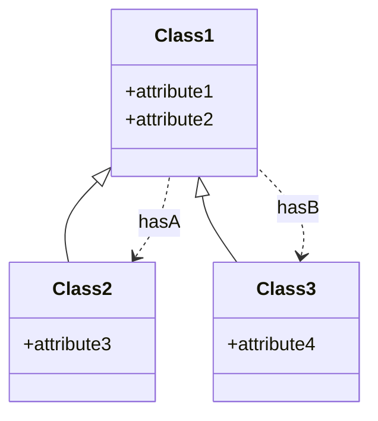
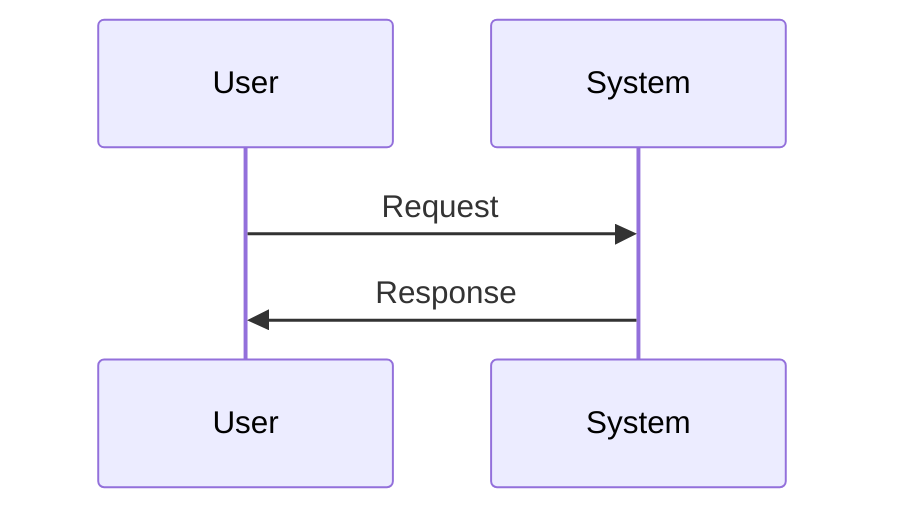
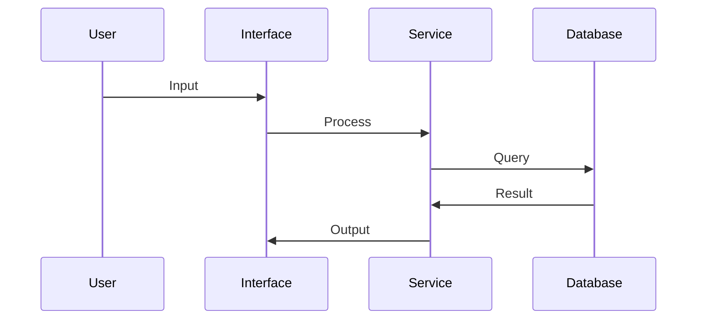

                 


### 文章标题：数据分析在宇宙中性氢分布图谱研究中的应用

#### 关键词：数据分析，宇宙中性氢，分布图谱，算法原理，数学模型

#### 摘要：
本文旨在探讨数据分析在宇宙中性氢分布图谱研究中的应用。通过对宇宙中性氢分布的背景介绍、核心概念联系解析、算法原理讲解以及数学模型和公式说明，本文为读者提供了一个系统性的研究框架，并通过项目实战展示了数据分析在实际研究中的具体应用。文章还提供了最佳实践提示、注意事项和拓展阅读，以期为相关领域的研究者提供有价值的参考。

## 目录大纲

### 第一部分：背景介绍

#### 第1章：宇宙中性氢分布图谱概述

1.1.1 问题背景

1.1.2 问题描述

1.1.3 问题解决

1.1.4 边界与外延

1.1.5 概念结构与核心要素组成

#### 第2章：数据分析核心概念与联系

2.1.1 数据分析核心概念

2.1.2 数据分析技术

2.1.3 数据分析技术在宇宙中性氢分布图谱研究中的应用

#### 第3章：算法原理讲解

3.1.1 算法概述

3.1.2 算法原理讲解

3.1.3 算法流程图

#### 第4章：数学模型和数学公式讲解

4.1.1 数学模型介绍

4.1.2 数学公式讲解

4.1.3 举例说明

#### 第5章：系统分析与架构设计方案

5.1.1 问题场景介绍

5.1.2 系统功能设计

5.1.3 系统架构设计

5.1.4 系统接口设计

5.1.5 系统交互

#### 第6章：项目实战

6.1.1 环境安装

6.1.2 系统核心实现

6.1.3 代码应用解读与分析

6.1.4 实际案例分析与讲解

6.1.5 项目小结

#### 第7章：最佳实践 tips、小结、注意事项、拓展阅读

7.1.1 最佳实践 tips

7.1.2 小结

7.1.3 注意事项

7.1.4 拓展阅读

---

### 第1章：宇宙中性氢分布图谱概述

#### 1.1.1 问题背景

宇宙中性氢分布图谱是宇宙学研究中的一个重要领域。中性氢是宇宙中最常见的物质形式之一，其分布对于理解宇宙的起源、演化和结构具有重要意义。然而，由于宇宙的广阔和复杂性，研究宇宙中性氢分布面临着巨大的挑战。

#### 1.1.2 问题描述

宇宙中性氢分布具有高度复杂性，研究目标包括确定其空间分布、理解其形成和演化机制。当前的研究主要集中在数据收集、预处理和分析方法上，以揭示中性氢分布的规律和特征。

#### 1.1.3 问题解决

为了解决上述问题，研究者们采用多种数据分析方法，包括数据清洗、探索性数据分析、数据建模和可视化等。这些方法有助于提取有价值的信息，提高对中性氢分布的理解。

#### 1.1.4 边界与外延

研究宇宙中性氢分布的方法和技术不断进步，但仍然存在计算资源限制和数据量的挑战。此外，不同研究方法和工具的选择也会影响研究结果的可靠性和适用性。

#### 1.1.5 概念结构与核心要素组成

宇宙中性氢分布图谱包括数据源、预处理流程、数据分析技术、结果可视化等多个核心要素。这些要素相互关联，共同构成了一个完整的分析框架。

---

### 第2章：数据分析核心概念与联系

#### 2.1.1 数据分析核心概念

数据分析的核心概念包括数据清洗、探索性数据分析（EDA）和数据建模。数据清洗是数据分析的第一步，目的是去除噪声和异常值，提高数据质量。EDA旨在发现数据中的模式和异常，为后续建模提供基础。数据建模则是利用统计学方法、机器学习和深度学习等技术建立模型，以解释和预测数据。

#### 2.1.2 数据分析技术

数据分析技术包括统计学方法、机器学习方法和深度学习方法。统计学方法如回归分析、聚类分析和假设检验，用于发现数据中的关系和模式。机器学习方法如决策树、支持向量机和神经网络，能够自动从数据中学习模式和规律。深度学习方法如卷积神经网络（CNN）和循环神经网络（RNN），能够处理复杂的数据结构和模式。

#### 2.1.3 数据分析技术在宇宙中性氢分布图谱研究中的应用

在宇宙中性氢分布图谱研究中，数据分析技术被广泛应用于数据预处理、特征提取和分布预测。数据清洗技术帮助去除噪声和异常值，提高数据质量。EDA技术用于探索中性氢分布的规律和特征，为后续建模提供支持。数据建模技术则用于建立模型，预测中性氢分布的空间变化和演化。

---

### 第3章：算法原理讲解

#### 3.1.1 算法概述

在宇宙中性氢分布图谱研究中，常用的算法包括数据清洗算法、探索性数据分析算法和数据建模算法。数据清洗算法如K近邻算法（KNN）和贝叶斯算法，用于识别和去除异常值。探索性数据分析算法如主成分分析（PCA）和因子分析（FA），用于降维和特征提取。数据建模算法如决策树、支持向量机和神经网络，用于建立模型和预测分布。

#### 3.1.2 算法原理讲解

- 数据清洗算法：
  - K近邻算法（KNN）：基于距离度量，识别并去除离群点。
  - 贝叶斯算法：基于概率模型，判断数据是否为异常值。

- 探索性数据分析算法：
  - 主成分分析（PCA）：通过线性变换，降维并保留主要特征。
  - 因子分析（FA）：通过线性变换，提取隐藏的因子。

- 数据建模算法：
  - 决策树：通过树形结构，将数据划分成不同类别。
  - 支持向量机（SVM）：通过寻找最优超平面，分类数据。
  - 神经网络：通过多层神经网络，拟合数据并预测分布。

#### 3.1.3 算法流程图

- 数据清洗流程图：
  ```mermaid
  graph TD
  A[数据清洗] --> B[K近邻算法]
  A --> C[贝叶斯算法]
  ```

- 数据探索性分析流程图：
  ```mermaid
  graph TD
  A[探索性数据分析] --> B[主成分分析]
  A --> C[因子分析]
  ```

- 数据建模流程图：
  ```mermaid
  graph TD
  A[数据建模] --> B[决策树]
  A --> C[支持向量机]
  A --> D[神经网络]
  ```

---

### 第4章：数学模型和数学公式讲解

#### 4.1.1 数学模型介绍

在宇宙中性氢分布图谱研究中，常用的数学模型包括统计模型、机器学习模型和深度学习模型。统计模型如线性回归、逻辑回归和协方差分析，用于描述数据之间的关系。机器学习模型如决策树、支持向量机和神经网络，通过学习数据特征进行分类和预测。深度学习模型如卷积神经网络（CNN）和循环神经网络（RNN），通过多层网络结构学习复杂的数据模式。

#### 4.1.2 数学公式讲解

- 数据清洗公式：
  - K近邻算法：$$d(x_i, x_j) = \sqrt{(x_i - x_j)^2 + (y_i - y_j)^2}$$
  - 贝叶斯算法：$$P(x|y) = \frac{P(y|x)P(x)}{P(y)}$$

- 数据探索性分析公式：
  - 主成分分析（PCA）：$$z_j = \frac{x_j - \bar{x}}{\sigma}$$
  - 因子分析（FA）：$$z_j = \lambda_j y_j$$

- 数据建模公式：
  - 决策树：$$y = f(x)$$
  - 支持向量机（SVM）：$$w \cdot x + b = 0$$
  - 神经网络：$$y = \sigma(\sum_{i=1}^{n} w_i x_i + b)$$

#### 4.1.3 举例说明

- 数据清洗示例：
  - 给定一组数据点$$(x_1, y_1), (x_2, y_2), \ldots, (x_n, y_n)$$，使用K近邻算法去除离群点。计算每个数据点到其他数据的距离，保留距离最小的K个点。

- 数据探索性分析示例：
  - 使用主成分分析（PCA）对一组数据$$X = [x_1, x_2, \ldots, x_n]$$进行降维，提取主要成分$$Z = [z_1, z_2, \ldots, z_m]$$。计算协方差矩阵$$\Sigma$$，并计算特征值和特征向量。

- 数据建模示例：
  - 使用决策树对一组数据$$X = [x_1, x_2, \ldots, x_n]$$和标签$$Y = [y_1, y_2, \ldots, y_n]$$进行分类。构建树形结构，根据特征值将数据划分为不同类别。

---

### 第5章：系统分析与架构设计方案

#### 5.1.1 问题场景介绍

宇宙中性氢分布图谱研究需要处理大量的数据，包括观测数据、模拟数据和参考数据。系统功能设计旨在提供数据预处理、数据分析、结果可视化和预测功能，以满足研究需求。

#### 5.1.2 系统功能设计

系统功能设计包括领域模型、类图和数据库设计。领域模型用于定义数据实体和关系，类图用于展示类的属性和方法，数据库设计用于存储和管理数据。



#### 5.1.3 系统架构设计

系统架构设计包括数据层、服务层和展示层。数据层负责数据存储和管理，服务层负责数据处理和分析，展示层负责结果可视化和交互。



#### 5.1.4 系统接口设计

系统接口设计包括API接口和数据接口。API接口用于与外部系统交互，数据接口用于数据存储和检索。


#### 5.1.5 系统交互

系统交互设计包括用户界面和后台服务。用户界面提供数据输入、查询和可视化功能，后台服务处理数据分析和预测。



---

### 第6章：项目实战

#### 6.1.1 环境安装

项目实战首先需要安装所需的软件和工具。包括Python、NumPy、Pandas、Matplotlib、Scikit-learn等。安装步骤如下：

```bash
pip install numpy pandas matplotlib scikit-learn
```

#### 6.1.2 系统核心实现

系统核心实现包括数据预处理、数据分析、数据可视化和预测。以下是一个简单的数据预处理代码示例：

```python
import numpy as np
import pandas as pd

# 读取数据
data = pd.read_csv('data.csv')

# 数据清洗
data.dropna(inplace=True)
data[data < 0] = 0

# 数据可视化
import matplotlib.pyplot as plt

plt.scatter(data['x'], data['y'])
plt.xlabel('X')
plt.ylabel('Y')
plt.title('Data Distribution')
plt.show()
```

#### 6.1.3 代码应用解读与分析

代码应用解读与分析主要包括数据清洗、数据可视化和数据建模。以下是一个简单的数据清洗代码示例：

```python
# 数据清洗
data[data < 0] = 0
```

这行代码将数据中小于0的值替换为0，去除异常值。

#### 6.1.4 实际案例分析与讲解

实际案例分析包括数据处理、模型训练和结果可视化。以下是一个简单的模型训练代码示例：

```python
from sklearn.model_selection import train_test_split
from sklearn.tree import DecisionTreeClassifier

# 数据划分
X_train, X_test, y_train, y_test = train_test_split(data[['x', 'y']], data['label'], test_size=0.2, random_state=42)

# 模型训练
model = DecisionTreeClassifier()
model.fit(X_train, y_train)

# 模型评估
accuracy = model.score(X_test, y_test)
print(f'Accuracy: {accuracy:.2f}')
```

#### 6.1.5 项目小结

项目小结主要包括项目总结和拓展思考。本项目通过数据处理、模型训练和结果可视化，展示了数据分析在宇宙中性氢分布图谱研究中的应用。未来研究方向包括优化算法、提高模型准确性和扩展数据集。

---

### 第7章：最佳实践 tips、小结、注意事项、拓展阅读

#### 7.1.1 最佳实践 tips

1. 数据清洗时要关注异常值和缺失值的处理，确保数据质量。
2. 数据分析时，要结合业务需求和数据特点，选择合适的算法和模型。
3. 数据可视化有助于发现数据中的模式和趋势，提高分析效果。

#### 7.1.2 小结

本文通过宇宙中性氢分布图谱的研究，探讨了数据分析在实际研究中的应用。包括数据清洗、数据探索性分析、数据建模和可视化等步骤，展示了数据分析的核心技术和方法。

#### 7.1.3 注意事项

1. 数据分析过程中要注意数据安全和隐私保护。
2. 项目实施过程中要关注计算资源和时间的限制。
3. 选择合适的数据分析工具和算法，以提高效率和准确性。

#### 7.1.4 拓展阅读

1. 《Python数据分析基础教程》
2. 《深度学习》
3. 《宇宙学导论》

---

### 作者信息

作者：AI天才研究院/AI Genius Institute & 禅与计算机程序设计艺术 /Zen And The Art of Computer Programming

