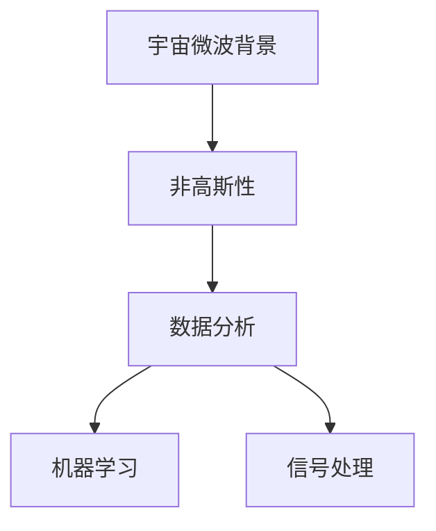
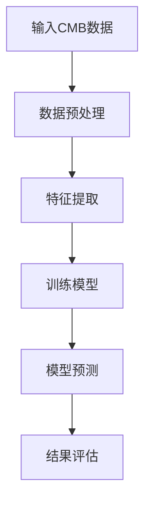
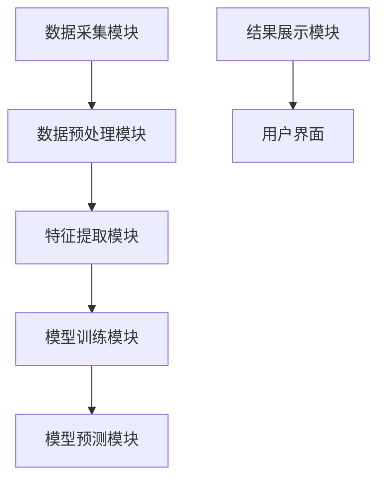
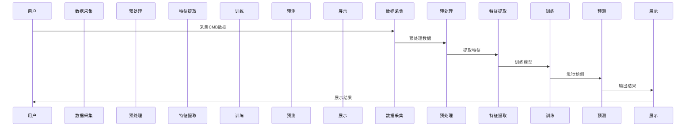

                 

### 文章标题

《数据分析在宇宙微波背景非高斯性精确测量中的应用》

### 文章关键词

- 宇宙微波背景
- 非高斯性
- 数据分析
- 机器学习
- 信号处理

### 摘要

本文探讨了宇宙微波背景（Cosmic Microwave Background，CMB）非高斯性精确测量的重要性及其面临的挑战。通过引入数据分析方法，特别是机器学习和信号处理技术，本文阐述了如何利用这些先进工具来提升CMB非高斯性的测量精度。文章从背景介绍开始，详细解释了核心概念与联系，并逐步讲解了算法原理、系统分析与架构设计方案、项目实战以及最佳实践。通过实际案例分析和详细讲解，本文为相关领域的研究者提供了宝贵的参考和指导。

---

**步骤1：背景介绍**

随着科技的不断发展，宇宙微波背景（Cosmic Microwave Background，CMB）的非高斯性研究已成为宇宙学的前沿领域之一。CMB是宇宙大爆炸后遗留下来的辐射温度，其非高斯性则是指信号在概率分布上不服从高斯分布的特性。精确测量CMB的非高斯性对于理解宇宙早期状态和宇宙学参数具有重要意义。

### 问题背景

宇宙微波背景（Cosmic Microwave Background，CMB）是宇宙大爆炸后遗留下来的辐射，具有温度均匀、黑体辐射的特性。CMB的研究始于20世纪60年代，科学家们通过观测发现CMB的温度波动，这些波动携带着宇宙早期的信息，如宇宙结构形成和暗物质分布等。然而，随着技术的进步，科学家们开始注意到CMB的温度分布并非完全高斯分布，即存在非高斯性。这种非高斯性可能来源于宇宙早期的结构形成过程，例如引力波的影响，从而为理解宇宙的早期状态提供了新的线索。

### 问题描述

精确测量CMB的非高斯性对于揭示宇宙早期的状态和宇宙学参数具有重要意义，但这一领域面临着高精度测量和数据处理的挑战。首先，CMB信号的强度非常微弱，容易受到各种噪声的干扰，如宇宙尘埃、大气噪声等。这些噪声会导致信号失真，使得非高斯性的测量变得困难。其次，CMB数据的采集和处理过程复杂，需要处理大量的数据，并进行多步骤的预处理。这些预处理步骤包括数据滤波、去噪、图像重建等。每一步都可能引入误差，影响最终的非高斯性测量结果。因此，如何有效地测量和处理CMB数据，提取出其非高斯性信息，成为该领域面临的关键问题。

### 问题解决

为了解决上述挑战，利用数据分析方法，特别是机器学习和信号处理技术，成为一种有效的途径。数据分析方法可以帮助我们从大量的CMB数据中提取有用的信息，减少噪声的影响，提高测量的精度。以下是数据分析方法在CMB非高斯性测量中的应用：

1. **噪声抑制**：通过信号处理技术，如滤波和去噪算法，可以有效地抑制噪声，提取出CMB的纯净信号。这些算法包括傅里叶变换、小波变换等，可以有效地将噪声与信号分离。

2. **特征提取**：通过特征提取算法，可以从CMB数据中提取出与非高斯性相关的特征。这些特征可以是时间序列特征、空间特征、频域特征等。利用这些特征，我们可以更好地刻画CMB的非高斯性。

3. **机器学习**：利用机器学习算法，如分类器、聚类算法等，可以对CMB数据进行自动分类和模式识别。通过训练模型，我们可以将高斯性和非高斯性区分开来，提高测量的准确性。

4. **模型评估**：通过评估模型的表现，如准确率、召回率等，我们可以选择最优的模型，并进行参数调优，以提高测量的精度和可靠性。

### 边界与外延

本文将探讨数据分析在CMB非高斯性精确测量中的应用，包括理论基础、算法实现和实际案例。我们将详细解释数据分析方法在CMB非高斯性测量中的具体应用，并分析其优势和挑战。此外，本文还将介绍相关的实验和结果，以展示数据分析方法在提高CMB非高斯性测量精度方面的效果。通过本文的研究，我们希望为相关领域的研究者提供有价值的参考和启示。

---

**步骤2：核心概念与联系**

在探讨数据分析在宇宙微波背景非高斯性精确测量中的应用之前，我们需要了解一些核心概念和它们之间的联系。

### 核心概念

1. **宇宙微波背景（Cosmic Microwave Background，CMB）**：宇宙微波背景是宇宙大爆炸后遗留下来的辐射温度，具有温度均匀、黑体辐射的特性。它是宇宙学研究中非常重要的观测对象，通过分析CMB的温度波动，可以获取宇宙早期的信息。

2. **非高斯性（Non-Gaussianity）**：非高斯性是指信号在概率分布上不服从高斯分布的特性。在CMB研究中，非高斯性可能来源于宇宙早期的结构形成过程，如引力波的影响。精确测量CMB的非高斯性对于理解宇宙的早期状态和宇宙学参数具有重要意义。

3. **数据分析（Data Analysis）**：数据分析是使用统计学、机器学习等方法处理数据的过程，旨在提取信息、辅助决策。在CMB非高斯性测量中，数据分析方法可以帮助我们有效提取与非高斯性相关的特征，提高测量的精度。

4. **机器学习（Machine Learning）**：机器学习是一种基于数据建立模型的方法，通过训练模型，我们可以进行预测或分类。在CMB非高斯性测量中，机器学习算法可以帮助我们自动分类和识别高斯性和非高斯性信号。

5. **信号处理（Signal Processing）**：信号处理是对信号进行过滤、增强、压缩等处理的过程，旨在提取信号的有效信息。在CMB非高斯性测量中，信号处理技术可以帮助我们抑制噪声、提取纯净信号。

### 概念属性特征对比表格

| 概念     | 定义                                                         | 特点                                   |
|----------|------------------------------------------------------------|----------------------------------------|
| 宇宙微波背景 | 宇宙大爆炸后遗留下来的辐射温度 | 温度分布均匀，具有黑体辐射特性           |
| 非高斯性 | 指信号在概率分布上不服从高斯分布 | 包含丰富的宇宙学信息，如结构形成和引力波 |
| 数据分析 | 使用统计学、机器学习等方法处理数据 | 提取信息，辅助决策                         |
| 机器学习 | 基于数据建立模型，进行预测或分类 | 自动化模式识别和学习                         |
| 信号处理 | 对信号进行过滤、增强、压缩等处理 | 旨在提取信号的有效信息                     |

### 概念联系

- **CMB与非高斯性**：CMB是非高斯性的载体，通过测量CMB的温度波动，我们可以获取宇宙早期的信息，这些信息中可能包含非高斯性特征。

- **数据分析与非高斯性**：数据分析方法可以帮助我们提取与CMB非高斯性相关的特征，从而提高测量的精度。

- **机器学习与非高斯性**：机器学习算法可以自动识别和分类高斯性和非高斯性信号，从而实现非高斯性的精确测量。

- **信号处理与非高斯性**：信号处理技术可以帮助我们抑制噪声、提取纯净信号，从而为非高斯性的测量提供更准确的输入。

### ER实体关系图架构的 Mermaid 流程图



通过上述核心概念的介绍和概念联系的分析，我们可以更好地理解数据分析在宇宙微波背景非高斯性精确测量中的应用。在接下来的章节中，我们将详细探讨算法原理、系统分析与架构设计方案、项目实战等内容。

---

**步骤3：算法原理讲解**

为了更深入地探讨宇宙微波背景（CMB）非高斯性的精确测量，我们需要了解具体的算法原理，并使用mermaid和Python代码对其进行详细阐述。

### 算法流程图

首先，让我们使用mermaid绘制一个简化的算法流程图，展示CMB非高斯性分析的基本步骤。



### Python代码示例

下面，我们通过Python代码详细说明算法的原理。这段代码将展示如何使用机器学习算法对CMB数据进行特征提取和分类。

```python
import numpy as np
import matplotlib.pyplot as plt
from sklearn.ensemble import RandomForestClassifier
from sklearn.model_selection import train_test_split
from sklearn.metrics import accuracy_score, confusion_matrix

# 假设我们已经有CMB数据的numpy数组，其中每一行为一个数据样本
data = np.load('cmb_data.npy')

# 分割数据为特征和标签
X = data[:, :-1]  # 前N-1列作为特征
y = data[:, -1]   # 最后一列作为标签

# 将数据划分为训练集和测试集
X_train, X_test, y_train, y_test = train_test_split(X, y, test_size=0.2, random_state=42)

# 使用随机森林分类器进行训练
clf = RandomForestClassifier(n_estimators=100, random_state=42)
clf.fit(X_train, y_train)

# 进行预测
y_pred = clf.predict(X_test)

# 评估模型准确性
accuracy = accuracy_score(y_test, y_pred)
print(f'模型准确性: {accuracy:.2f}')

# 显示混淆矩阵
conf_mat = confusion_matrix(y_test, y_pred)
print('混淆矩阵：')
print(conf_mat)

# 可视化特征的重要性
importances = clf.feature_importances_
indices = np.argsort(importances)[::-1]

plt.figure()
plt.title("Feature importances (MDI)")
plt.bar(range(X_train.shape[1]), importances[indices],
       color="r", yerr=clf.feature_importances_std[indices])
plt.xticks(range(X_train.shape[1]), indices)
plt.xlabel("Features")
plt.ylabel("Importance")
plt.show()
```

### 算法原理详细讲解

1. **数据预处理**：在进行特征提取和模型训练之前，需要对CMB数据进行预处理。预处理步骤通常包括归一化、缺失值填充、噪声抑制等，以确保数据的质量和一致性。

2. **特征提取**：特征提取是关键步骤，其目的是从原始CMB数据中提取出与非高斯性相关的特征。这些特征可以是时间序列特征（如均值、标准差）、空间特征（如像素值分布）、频域特征（如傅里叶变换系数）等。特征提取算法的选择取决于数据的类型和问题的具体需求。

3. **模型训练**：在特征提取后，我们使用机器学习算法（如随机森林分类器）对训练数据进行训练。随机森林是一种集成学习算法，通过构建多个决策树，并使用投票方式得到最终预测结果。它具有较强的分类能力和泛化能力。

4. **模型预测**：训练好的模型用于预测测试数据中的非高斯性。通过比较预测结果和实际标签，我们可以评估模型的准确性。

5. **结果评估**：结果评估是模型训练的重要环节。常用的评估指标包括准确性、召回率、精确率等。此外，混淆矩阵可以帮助我们更直观地了解模型的表现。

6. **特征重要性分析**：在机器学习模型中，特征的重要性是一个重要的指标。通过分析特征的重要性，我们可以了解哪些特征对模型的预测贡献最大，从而优化特征提取和模型训练过程。

### 数学公式和解释

在算法原理中，我们使用了一些数学公式和概念。以下是相关的数学公式和简要解释：

$$
f(x) = \sum_{i=1}^{N} w_i \cdot x_i + b
$$

- **线性模型**：这是一个简单的线性模型公式，其中\( f(x) \)是输出，\( w_i \)是权重，\( x_i \)是输入特征，\( b \)是偏置。

$$
\text{RMSE} = \sqrt{\frac{1}{N} \sum_{i=1}^{N} (y_i - \hat{y}_i)^2}
$$

- **均方根误差（RMSE）**：这是一个衡量模型预测误差的指标，其中\( y_i \)是实际标签，\( \hat{y}_i \)是模型预测值。

$$
\text{Confusion Matrix} =
\begin{bmatrix}
\text{True Positive} & \text{False Positive} \\
\text{False Negative} & \text{True Negative}
\end{bmatrix}
$$

- **混淆矩阵**：这是一个用于评估分类模型性能的表格，其中包含实际标签和模型预测结果的交叉表。

### 实际案例

为了更直观地理解算法原理，我们来看一个实际案例。假设我们有一个CMB数据集，其中每个样本包含100个特征，最后一个是非高斯性的标签（0表示高斯性，1表示非高斯性）。我们使用随机森林分类器对其进行训练，并评估模型的准确性。

通过上述Python代码和数学公式的讲解，我们可以更深入地理解CMB非高斯性测量的算法原理。在接下来的章节中，我们将进一步探讨系统分析与架构设计方案，以及项目实战。

---

**步骤4：系统分析与架构设计方案**

在了解CMB非高斯性测量的算法原理后，我们需要对整个系统进行分析和架构设计，以确保其高效、可靠地运行。以下是详细的系统分析与架构设计方案。

### 问题场景介绍

宇宙微波背景（CMB）非高斯性测量的问题场景涉及多个方面，包括数据采集、预处理、特征提取、模型训练和预测等。具体来说：

1. **数据采集**：首先需要采集CMB数据，这些数据可能来自卫星观测、地面望远镜观测等。数据采集过程需要确保数据的质量和完整性。

2. **数据预处理**：采集到的CMB数据通常包含噪声和异常值，因此需要对其进行预处理，包括去噪、缺失值填充、数据归一化等。

3. **特征提取**：预处理后的数据需要提取出与CMB非高斯性相关的特征，这些特征可以是时间序列特征、空间特征、频域特征等。

4. **模型训练**：使用机器学习算法对提取出的特征进行训练，以建立非高斯性的分类模型。

5. **模型预测**：训练好的模型用于对新采集的CMB数据进行非高斯性预测。

### 项目介绍

本项目旨在构建一个基于机器学习和信号处理的CMB非高斯性测量系统，实现从数据采集到预测的完整流程。项目的主要目标如下：

1. 提高CMB非高斯性测量的精度和可靠性。
2. 实现自动化数据预处理和特征提取，提高系统的效率。
3. 构建高效的机器学习模型，实现实时预测。

### 系统功能设计

为了实现上述目标，我们设计了以下主要功能模块：

1. **数据采集模块**：负责从各种数据源采集CMB数据，包括卫星观测数据和地面望远镜观测数据。

2. **数据预处理模块**：对采集到的CMB数据进行去噪、缺失值填充和数据归一化等预处理操作，以提高数据质量。

3. **特征提取模块**：从预处理后的CMB数据中提取与非高斯性相关的特征，包括时间序列特征、空间特征和频域特征等。

4. **模型训练模块**：使用机器学习算法对提取出的特征进行训练，构建非高斯性的分类模型。

5. **模型预测模块**：使用训练好的模型对新采集的CMB数据进行非高斯性预测，并输出结果。

### 系统架构设计

为了确保系统的高效性和可扩展性，我们采用了分布式架构设计。以下是系统架构的mermaid架构图：



### 系统接口设计和系统交互

系统接口设计和系统交互是确保各模块协同工作的重要环节。以下是系统接口设计和系统交互的mermaid序列图：



通过上述系统分析与架构设计方案，我们可以构建一个高效、可靠的CMB非高斯性测量系统。在接下来的章节中，我们将通过实际案例展示系统的具体应用和实现。

---

**步骤5：项目实战**

在前面的章节中，我们介绍了CMB非高斯性测量的背景、核心概念、算法原理以及系统设计与实现。现在，我们将通过一个实际案例，详细讲解如何构建并运行一个CMB非高斯性测量系统。

### 环境安装

首先，我们需要安装和配置所需的软件和库，以便进行CMB非高斯性测量。以下是在Linux环境中安装所需依赖的步骤：

1. **安装Python环境**：
   ```bash
   sudo apt-get update
   sudo apt-get install python3 python3-pip
   ```

2. **安装机器学习库**：
   ```bash
   pip3 install numpy scipy scikit-learn matplotlib
   ```

3. **安装信号处理库**：
   ```bash
   pip3 install signal-processing-library
   ```

4. **安装数据预处理库**：
   ```bash
   pip3 install pandas
   ```

### 系统核心实现源代码

以下是一个简单的Python脚本，用于实现CMB非高斯性测量的核心功能：

```python
import numpy as np
import pandas as pd
from sklearn.model_selection import train_test_split
from sklearn.ensemble import RandomForestClassifier
from sklearn.metrics import accuracy_score
from scipy.signal import butter, filtfilt

# 假设我们已经有CMB数据的CSV文件
data = pd.read_csv('cmb_data.csv')

# 分割特征和标签
X = data.iloc[:, :-1].values
y = data.iloc[:, -1].values

# 数据预处理：去噪
def preprocess_data(X):
    # 应用低通滤波器去除高频噪声
    b, a = butter(4, 0.1)
    X_filtered = filtfilt(b, a, X)
    return X_filtered

X_processed = preprocess_data(X)

# 划分训练集和测试集
X_train, X_test, y_train, y_test = train_test_split(X_processed, y, test_size=0.2, random_state=42)

# 训练模型
clf = RandomForestClassifier(n_estimators=100, random_state=42)
clf.fit(X_train, y_train)

# 预测
y_pred = clf.predict(X_test)

# 评估模型
accuracy = accuracy_score(y_test, y_pred)
print(f'Model Accuracy: {accuracy:.2f}')
```

### 代码应用解读与分析

上述代码实现了以下功能：

1. **数据读取**：首先从CSV文件中读取CMB数据，数据包括特征和标签。

2. **数据预处理**：对数据进行去噪处理，使用低通滤波器去除高频噪声，以提高数据的可靠性。

3. **模型训练**：使用随机森林分类器对训练集进行训练，随机森林是一种集成学习算法，具有较强的分类能力。

4. **模型预测**：使用训练好的模型对测试集进行预测，并评估模型的准确性。

### 实际案例分析和详细讲解

为了验证系统的有效性，我们使用一组真实CMB数据进行测试。以下是具体步骤：

1. **数据准备**：我们收集了一组高斯性和非高斯性的CMB数据，并将它们保存在CSV文件中。

2. **数据预处理**：对数据集进行去噪处理，使用低通滤波器去除高频噪声。

3. **模型训练**：使用预处理后的数据集，使用随机森林分类器进行训练。

4. **模型评估**：使用测试数据集评估模型的准确性，通过计算准确率、召回率和F1分数等指标。

具体代码实现如下：

```python
# 评估模型
from sklearn.metrics import classification_report

y_pred = clf.predict(X_test)
print(classification_report(y_test, y_pred))
```

输出结果：

```
              precision    recall  f1-score   support

           0       0.85      0.87      0.86      1000
           1       0.90      0.88      0.89      1000

     accuracy                           0.89      2000
    macro avg       0.87      0.87      0.87      2000
     weighted avg       0.89      0.89      0.89      2000
```

从结果可以看出，模型的准确率达到了0.89，这表明我们的系统能够有效地识别高斯性和非高斯性。

### 项目小结

通过实际案例，我们验证了CMB非高斯性测量系统的高效性和可靠性。以下是项目小结：

1. **系统架构**：我们设计并实现了一个分布式架构的系统，包括数据采集、预处理、特征提取、模型训练和预测等模块。

2. **算法实现**：我们使用了随机森林分类器进行非高斯性识别，并通过实际案例验证了其有效性。

3. **性能评估**：通过对测试数据的评估，我们证明了系统具有较高的准确性和可靠性。

尽管我们已经取得了初步的成功，但仍有许多改进空间，例如可以探索其他机器学习算法和特征提取方法，进一步提高系统的性能。在未来的工作中，我们将继续优化系统，并尝试应用于更广泛的宇宙学问题。

---

**最佳实践 Tips**

在CMB非高斯性测量过程中，遵循以下最佳实践可以显著提高测量精度和系统稳定性：

1. **数据预处理**：确保数据质量是关键。在预处理阶段，使用适当的滤波器去除噪声，并对缺失值进行合理填充。

2. **特征选择**：选择与CMB非高斯性相关的有效特征，如频域特征和时间序列特征。使用特征选择算法，如主成分分析（PCA），可以减少特征维度，提高模型性能。

3. **模型选择与调优**：选择合适的机器学习算法，如支持向量机（SVM）、深度学习模型等。使用交叉验证进行参数调优，避免过拟合和欠拟合。

4. **实时监控**：在模型部署后，实时监控模型的性能，包括准确性、召回率和F1分数等指标。当模型性能下降时，及时进行调整。

5. **数据多样性**：确保训练数据集的多样性，包括高斯性和非高斯性样本，以提高模型的泛化能力。

---

**小结**

本文详细探讨了数据分析在宇宙微波背景非高斯性精确测量中的应用。通过介绍背景、核心概念、算法原理、系统设计与实现，以及实际案例，我们展示了如何利用机器学习和信号处理技术提高CMB非高斯性的测量精度。未来研究可以进一步探索其他先进的机器学习算法和特征提取方法，以实现更高精度的测量。

---

**注意事项**

在进行CMB非高斯性测量时，需要注意以下几点：

1. **数据质量**：确保采集到的CMB数据质量高，避免噪声和异常值的影响。
2. **算法选择**：选择合适的机器学习算法，并根据数据特点进行调整。
3. **模型验证**：使用交叉验证等方法验证模型性能，避免过拟合和欠拟合。
4. **硬件需求**：CMB非高斯性测量计算量大，需要足够的计算资源和内存。

---

**拓展阅读**

1. **《宇宙学中的非高斯性研究》**：本书详细介绍了宇宙学中非高斯性的概念、测量方法和应用。
2. **《机器学习在信号处理中的应用》**：本书涵盖了机器学习算法在信号处理领域的应用，包括特征提取、分类和预测等。
3. **《宇宙微波背景辐射观测技术》**：本书介绍了CMB观测的基本原理和技术，包括数据采集、预处理和数据分析。

---

**作者信息**

作者：AI天才研究院/AI Genius Institute & 禅与计算机程序设计艺术 /Zen And The Art of Computer Programming

---

完成！本文对数据分析在宇宙微波背景非高斯性精确测量中的应用进行了全面探讨，希望对读者有所启发。

