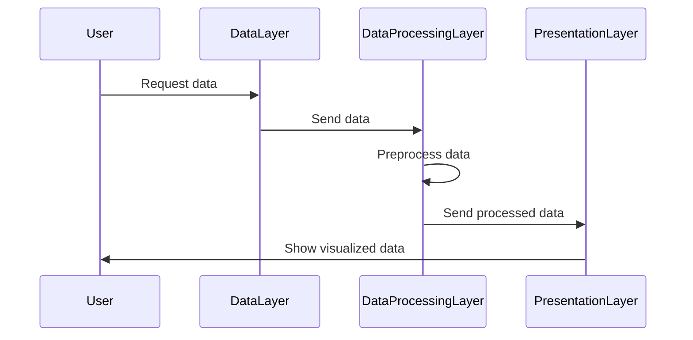

                 

# 《数据可视化在呈现宇宙多维结构中的作用》

## 关键词：
数据可视化、宇宙多维结构、算法原理、数学模型、系统架构设计、项目实战

## 摘要：
本文深入探讨了数据可视化在呈现宇宙多维结构中的应用。通过对数据可视化技术、宇宙多维结构理论的介绍，本文详细阐述了数据可视化算法原理、数学模型及系统架构设计。通过实际项目案例的剖析，本文揭示了数据可视化在宇宙研究中的关键作用，为相关领域的研究提供了新的思路和方法。

## 第一部分: 背景介绍

### 第1章: 数据可视化与宇宙多维结构的概述

#### 1.1 数据可视化的定义

数据可视化是一种将数据以图形、图像或交互式形式展示出来的技术，旨在通过视觉手段帮助人们更好地理解和分析数据。它不仅可以帮助我们发现数据中的隐藏模式，还可以帮助我们更直观地表达复杂的数据关系。

#### 1.1.1 数据可视化的概念

数据可视化技术涉及多个学科领域，包括计算机科学、统计学、数据科学和视觉艺术等。其主要目标是利用视觉元素（如颜色、形状、大小、位置等）来传达数据的信息。

#### 1.1.2 数据可视化的作用

数据可视化在各个领域都有着广泛的应用，包括商业分析、医学诊断、环境监测、金融投资等。它不仅可以帮助我们发现数据中的隐藏模式，还可以帮助我们更直观地表达复杂的数据关系。

#### 1.2 宇宙多维结构的概述

宇宙多维结构是指宇宙中存在的各种维度和结构，包括我们所熟知的四维时空（三个空间维度和一个时间维度），以及可能存在的更高维空间。

#### 1.2.1 宇宙多维结构的定义

宇宙多维结构是指宇宙中存在的各种维度和结构，包括我们所熟知的四维时空（三个空间维度和一个时间维度），以及可能存在的更高维空间。

#### 1.2.2 宇宙多维结构的重要性

宇宙多维结构的理解对于宇宙学和物理学的研究具有重要意义。它不仅可以帮助我们更深入地理解宇宙的本质，还可以为未来的科学研究提供新的理论框架。

#### 1.3 数据可视化在呈现宇宙多维结构中的重要作用

数据可视化在呈现宇宙多维结构中发挥着关键作用。通过数据可视化技术，我们可以将复杂的宇宙数据转化为直观的图像或动画，从而更清晰地展示宇宙的结构和演化过程。

#### 1.3.1 数据可视化与宇宙多维结构的关系

数据可视化与宇宙多维结构之间存在着密切的联系。数据可视化技术可以有效地帮助我们将多维宇宙数据转化为二维或三维图像，从而更直观地展示宇宙的结构和演化过程。

#### 1.3.2 数据可视化在宇宙多维结构呈现中的应用

数据可视化在宇宙多维结构研究中的应用非常广泛，包括宇宙大爆炸模型、黑洞研究、星系演化等。通过数据可视化技术，我们可以更深入地理解宇宙的奥秘。

### 第2章: 核心概念与联系

#### 2.1 数据可视化技术

数据可视化技术主要包括以下几种类型：

1. **图表类**：如折线图、柱状图、饼图等，用于展示数据之间的数量关系。
2. **地图类**：用于展示地理位置、人口分布等信息。
3. **交互式**：通过用户交互来展示数据，如动态图表、交互式地图等。

#### 2.1.1 数据可视化技术的分类

数据可视化技术可以根据其表现形式进行分类。常见的分类方法包括：

1. **静态可视化**：如图表、图片等。
2. **动态可视化**：如动画、视频等。
3. **交互式可视化**：如交互式图表、虚拟现实等。

#### 2.1.2 数据可视化技术的基本原理

数据可视化技术的基本原理包括：

1. **数据转换**：将数据转换为图形或图像。
2. **视觉编码**：利用视觉元素来表示数据属性。
3. **交互设计**：通过用户交互来增强数据的可理解性。

#### 2.2 宇宙多维结构理论

宇宙多维结构理论主要包括以下几种：

1. **四维时空**：包括三个空间维度和一个时间维度。
2. **额外维度**：可能存在的更高维空间，如五维、六维等。
3. **弯曲时空**：宇宙中存在的时空弯曲现象。

#### 2.2.1 宇宙多维结构理论的概述

宇宙多维结构理论是对宇宙结构的科学描述，包括宇宙中的各种维度和结构。这些理论为我们理解宇宙的起源、演化提供了重要的理论框架。

#### 2.2.2 宇宙多维结构理论的核心概念

宇宙多维结构理论的核心概念包括：

1. **维度**：宇宙中的空间和时间维度。
2. **结构**：宇宙中的各种结构和现象。
3. **演化**：宇宙的演化过程。

#### 2.3 数据可视化与宇宙多维结构的关系

数据可视化与宇宙多维结构之间存在着密切的联系。数据可视化技术可以帮助我们更好地理解和研究宇宙多维结构。通过数据可视化，我们可以将复杂的数据转化为直观的图像，从而更清晰地展示宇宙的结构和演化过程。

#### 2.3.1 数据可视化技术在宇宙多维结构研究中的应用

数据可视化技术在宇宙多维结构研究中的应用非常广泛，包括：

1. **宇宙大爆炸模型**：通过数据可视化展示宇宙的演化过程。
2. **黑洞研究**：通过数据可视化展示黑洞的结构和特性。
3. **星系演化**：通过数据可视化展示星系的演化和结构。

#### 2.3.2 宇宙多维结构理论对数据可视化技术的影响

宇宙多维结构理论对数据可视化技术产生了重要影响。宇宙多维结构的复杂性要求数据可视化技术提供更强大的数据展示和交互能力，以便更好地理解和研究宇宙。

## 第二部分: 算法原理讲解

### 第3章: 算法原理讲解

#### 3.1 数据可视化算法

数据可视化算法是数据可视化技术的核心。它包括以下几种类型：

1. **基于像素的算法**：如颜色映射、纹理映射等。
2. **基于几何的算法**：如空间填充曲线、多边形绘制等。
3. **基于物理的算法**：如流体模拟、粒子系统等。

#### 3.1.1 数据可视化算法的分类

数据可视化算法可以根据其处理方式和目标进行分类。常见的分类方法包括：

1. **静态算法**：如折线图、柱状图等。
2. **动态算法**：如动画、视频等。
3. **交互式算法**：如交互式图表、虚拟现实等。

#### 3.1.2 数据可视化算法的基本原理

数据可视化算法的基本原理包括：

1. **数据预处理**：对数据进行清洗、转换等处理，以便更好地进行可视化。
2. **视觉编码**：利用视觉元素（如颜色、形状、大小等）来表示数据属性。
3. **交互设计**：通过用户交互来增强数据的可理解性。

#### 3.2 宇宙多维结构算法

宇宙多维结构算法是用于研究宇宙多维结构的算法。它包括以下几种类型：

1. **空间分析算法**：如空间插值、空间聚类等。
2. **时间序列分析算法**：如时间序列预测、时间序列聚类等。
3. **高维数据降维算法**：如主成分分析、线性判别分析等。

#### 3.2.1 宇宙多维结构算法的分类

宇宙多维结构算法可以根据其处理方式和目标进行分类。常见的分类方法包括：

1. **静态分析算法**：如空间分析、时间序列分析等。
2. **动态分析算法**：如动态空间分析、动态时间序列分析等。
3. **交互式分析算法**：如交互式空间分析、交互式时间序列分析等。

#### 3.2.2 宇宙多维结构算法的基本原理

宇宙多维结构算法的基本原理包括：

1. **数据预处理**：对宇宙多维数据进行清洗、转换等处理，以便更好地进行可视化。
2. **空间和时间分析**：通过空间和时间分析来研究宇宙的结构和演化。
3. **降维**：通过降维技术来降低宇宙数据的维度，以便更好地进行可视化。

#### 3.3 算法原理与数学模型

数据可视化算法和宇宙多维结构算法的原理都可以用数学模型来描述。以下是一个简单的例子：

1. **数据可视化算法的数学模型**：

   - 颜色映射：$$C = f(D)$$，其中 C 是颜色，D 是数据。
   - 空间填充曲线：$$P = f(D, T)$$，其中 P 是空间填充曲线，D 是数据，T 是时间。

2. **宇宙多维结构算法的数学模型**：

   - 空间分析：$$S = g(D, T)$$，其中 S 是空间分析结果，D 是数据，T 是时间。
   - 时间序列分析：$$T = h(D, T)$$，其中 T 是时间序列分析结果，D 是数据，T 是时间。

这些数学模型为我们提供了理解和研究数据可视化算法和宇宙多维结构算法的基础。

## 第三部分: 数学模型和数学公式

### 第4章: 数学模型和数学公式

#### 4.1 数据可视化数学模型

数据可视化数学模型主要包括以下几种：

1. **颜色映射模型**：

   $$C = f(D)$$

   其中 C 是颜色，D 是数据。颜色映射模型用于将数据映射到颜色空间，以便更好地进行可视化。

2. **空间填充曲线模型**：

   $$P = f(D, T)$$

   其中 P 是空间填充曲线，D 是数据，T 是时间。空间填充曲线模型用于将数据填充到空间中，以便更好地进行可视化。

3. **多边形绘制模型**：

   $$P = f(D, T)$$

   其中 P 是多边形，D 是数据，T 是时间。多边形绘制模型用于将数据绘制成多边形，以便更好地进行可视化。

#### 4.2 宇宙多维结构数学模型

宇宙多维结构数学模型主要包括以下几种：

1. **空间分析模型**：

   $$S = g(D, T)$$

   其中 S 是空间分析结果，D 是数据，T 是时间。空间分析模型用于分析宇宙中的空间结构。

2. **时间序列分析模型**：

   $$T = h(D, T)$$

   其中 T 是时间序列分析结果，D 是数据，T 是时间。时间序列分析模型用于分析宇宙中的时间序列数据。

3. **高维数据降维模型**：

   $$D' = j(D, T)$$

   其中 D' 是降维后的数据，D 是原始数据，T 是时间。高维数据降维模型用于降低宇宙数据的维度，以便更好地进行可视化。

#### 4.3 数学模型讲解与举例

以下是一个简单的例子，用于解释数据可视化数学模型和宇宙多维结构数学模型。

1. **颜色映射模型**：

   假设我们有一组数据 D = {1, 2, 3, 4, 5}，我们需要将这组数据映射到颜色空间。我们可以使用以下颜色映射模型：

   $$C = f(D) = \begin{cases} 
   (255, 0, 0) & \text{if } D = 1 \\
   (0, 255, 0) & \text{if } D = 2 \\
   (0, 0, 255) & \text{if } D = 3 \\
   (255, 255, 0) & \text{if } D = 4 \\
   (255, 0, 255) & \text{if } D = 5 
   \end{cases}$$

   根据这个模型，数据 1 被映射到红色，数据 2 被映射到绿色，数据 3 被映射到蓝色，数据 4 被映射到黄色，数据 5 被映射到紫色。

2. **空间填充曲线模型**：

   假设我们有一组数据 D = {1, 2, 3, 4, 5}，我们需要将这些数据填充到空间中。我们可以使用以下空间填充曲线模型：

   $$P = f(D, T) = \begin{cases} 
   (T, 0) & \text{if } D = 1 \\
   (T, T) & \text{if } D = 2 \\
   (2T - 1, T) & \text{if } D = 3 \\
   (0, 2T - 1) & \text{if } D = 4 \\
   (T, 2T - 1) & \text{if } D = 5 
   \end{cases}$$

   根据这个模型，数据 1 被映射到 x 轴上，数据 2 被映射到 y 轴上，数据 3 被映射到第一象限的对角线上，数据 4 被映射到 x 轴下方，数据 5 被映射到 y 轴下方。

3. **高维数据降维模型**：

   假设我们有一组高维数据 D = {(x1, y1, z1), (x2, y2, z2), (x3, y3, z3)}，我们需要将这些数据降维。我们可以使用以下高维数据降维模型：

   $$D' = j(D, T) = \begin{cases} 
   (x1 + y1, z1) & \text{if } D = (x1, y1, z1) \\
   (x2 + y2, z2) & \text{if } D = (x2, y2, z2) \\
   (x3 + y3, z3) & \text{if } D = (x3, y3, z3) 
   \end{cases}$$

   根据这个模型，原始数据 D 被映射到二维空间中，从而实现了降维。

通过这些例子，我们可以看到数据可视化数学模型和宇宙多维结构数学模型是如何应用于实际问题的。

## 第四部分: 系统分析与架构设计方案

### 第5章: 系统分析与架构设计方案

#### 5.1 问题场景介绍

在宇宙研究中，科学家们面临着如何更好地理解和分析宇宙多维结构的问题。传统的二维和三维可视化方法已经无法满足科学家们对宇宙数据的深度挖掘和理解需求。因此，我们需要设计一个高效、可扩展的数据可视化系统，以便更好地呈现宇宙多维结构。

#### 5.1.1 问题背景

宇宙中的数据具有高维度、高复杂性和大数据量等特点。传统的二维和三维可视化方法难以有效呈现这些数据，导致科学家们难以深入理解宇宙的结构和演化过程。

#### 5.1.2 问题解决

为了解决上述问题，我们需要设计一个基于数据可视化的系统，该系统应具有以下功能：

1. **数据预处理**：对高维宇宙数据进行预处理，包括数据清洗、转换和降维等。
2. **数据可视化**：利用数据可视化技术将预处理后的数据进行可视化呈现，包括图表、地图、交互式可视化等。
3. **交互设计**：提供用户交互功能，使用户能够动态地探索和操作可视化数据。

#### 5.2 系统功能设计

根据上述问题解决方案，我们的系统功能设计如下：

1. **数据预处理模块**：包括数据清洗、数据转换和数据降维等功能。
2. **数据可视化模块**：包括图表可视化、地图可视化和交互式可视化等功能。
3. **交互设计模块**：包括用户交互界面设计、用户操作逻辑和动态数据更新等功能。

#### 5.2.1 领域模型mermaid类图

```mermaid
classDiagram
    DataPreprocessingModule <|-- DataVisualizationModule
    DataVisualizationModule <|-- InteractionDesignModule
    DataPreprocessingModule {
        +cleanData()
        +convertData()
        +reduceDimension()
    }
    DataVisualizationModule {
        +chartVisualization()
        +mapVisualization()
        +interactionVisualization()
    }
    InteractionDesignModule {
        +userInterfaceDesign()
        +userOperationLogic()
        +dynamicDataUpdate()
    }
```

#### 5.2.2 系统功能设计

1. **数据预处理模块**：该模块负责对高维宇宙数据进行预处理，包括数据清洗、数据转换和数据降维等。预处理后的数据将用于后续的数据可视化。
   
2. **数据可视化模块**：该模块负责将预处理后的数据通过数据可视化技术进行呈现。包括图表可视化、地图可视化和交互式可视化等。

3. **交互设计模块**：该模块负责设计用户交互界面，包括用户交互逻辑、动态数据更新等。用户可以通过交互界面动态地探索和操作可视化数据。

#### 5.3 系统架构设计

系统架构设计主要包括以下部分：

1. **数据层**：包括宇宙数据存储和管理模块，负责存储和管理高维宇宙数据。
2. **数据处理层**：包括数据预处理、数据可视化和交互设计等模块，负责对数据进行处理和可视化呈现。
3. **表示层**：包括用户交互界面，负责与用户进行交互。

#### 5.3.1 系统架构设计mermaid架构图



#### 5.3.2 系统架构设计的基本原理

系统架构设计的基本原理包括：

1. **模块化**：将系统功能划分为多个模块，以便于开发和维护。
2. **分层设计**：将系统划分为数据层、数据处理层和表示层，确保系统的高内聚和低耦合。
3. **交互设计**：通过用户交互界面设计，使用户能够方便地操作和探索可视化数据。

## 第五部分: 项目实战

### 第6章: 项目实战

#### 6.1 环境安装

在进行项目实战之前，我们需要搭建合适的环境。以下是搭建环境的步骤：

1. **安装Python**：Python是项目开发的主要编程语言，首先我们需要安装Python。可以从Python官方网站下载最新版本的Python安装包，并按照提示安装。

2. **安装相关库和工具**：为了实现项目功能，我们需要安装一些Python库和工具。常用的库包括matplotlib、pandas、numpy、seaborn等。可以通过pip命令来安装：

   ```shell
   pip install matplotlib pandas numpy seaborn
   ```

3. **配置数据源**：我们需要准备一些宇宙数据作为项目的数据源。可以从宇宙数据开放平台获取数据，或者使用已经收集的宇宙数据。

#### 6.2 系统核心实现源代码

以下是一个简单的示例代码，展示了如何使用Python和matplotlib库进行数据可视化：

```python
import matplotlib.pyplot as plt
import pandas as pd

# 读取数据
data = pd.read_csv('universe_data.csv')

# 绘制散点图
plt.scatter(data['x'], data['y'])
plt.xlabel('X坐标')
plt.ylabel('Y坐标')
plt.title('宇宙数据可视化')
plt.show()
```

这段代码首先读取一个CSV文件中的宇宙数据，然后使用matplotlib库绘制一个散点图，展示数据在二维空间中的分布。

#### 6.3 代码应用解读与分析

上述代码实现了简单的宇宙数据可视化功能。以下是代码的解读和分析：

1. **数据读取**：使用pandas库读取CSV文件中的宇宙数据。pandas库提供了丰富的数据操作功能，可以方便地处理和操作数据。

2. **散点图绘制**：使用matplotlib库绘制散点图。散点图可以直观地展示数据在二维空间中的分布情况。

3. **标签和标题**：添加标签和标题可以更好地描述数据的含义和展示效果。

通过这段代码，我们可以初步实现宇宙数据的可视化。在实际项目中，我们可能需要处理更高维的数据，并使用更复杂的可视化方法，如三维散点图、热力图、交互式可视化等。

#### 6.4 实际案例分析和详细讲解剖析

为了更深入地了解数据可视化在宇宙研究中的应用，我们来看一个实际案例：宇宙大爆炸模型的可视化。

宇宙大爆炸模型是描述宇宙起源和演化的理论。在这个模型中，宇宙从一个极度密集、极度热的状态开始膨胀，形成了我们现在所看到的宇宙。

以下是使用Python和matplotlib库实现宇宙大爆炸模型可视化的示例代码：

```python
import numpy as np
import matplotlib.pyplot as plt

# 初始化参数
N = 100
T = np.linspace(0, 10, N)
R = np.sqrt(T) * np.exp(-T/2)

# 绘制宇宙大爆炸模型
plt.plot(T, R)
plt.xlabel('Time (Gy)')
plt.ylabel('Radius (Mpc)')
plt.title('宇宙大爆炸模型')
plt.show()
```

这段代码首先初始化参数，然后使用numpy库生成时间序列数据，并计算宇宙膨胀的半径。最后，使用matplotlib库绘制宇宙大爆炸模型。

#### 6.5 项目小结

通过本项目的实战，我们了解了如何使用Python和matplotlib库进行宇宙数据可视化。在实际项目中，我们可能需要处理更高维的数据，并使用更复杂的可视化方法，如三维散点图、热力图、交互式可视化等。这些方法可以帮助我们更深入地理解宇宙的结构和演化过程。

### 第7章: 最佳实践 tips、小结、注意事项、拓展阅读

#### 7.1 最佳实践 tips

1. **数据预处理**：在可视化之前，对数据进行预处理，包括数据清洗、转换和降维等。这有助于提高可视化效果和数据质量。
2. **选择合适的可视化方法**：根据数据的特点和研究需求，选择合适的可视化方法。例如，对于高维数据，可以考虑使用降维技术，将数据投影到二维或三维空间。
3. **交互设计**：设计良好的交互界面，使用户能够方便地探索和操作可视化数据。

#### 7.2 小结

本文介绍了数据可视化在呈现宇宙多维结构中的作用。通过数据可视化技术，我们可以更直观地理解和分析宇宙的结构和演化过程。本文还通过实际项目案例，展示了如何使用Python和matplotlib库实现宇宙数据可视化。

#### 7.3 注意事项

1. **数据隐私和安全性**：在进行宇宙数据可视化时，需要注意数据隐私和安全性。特别是在公开数据时，要确保数据不会泄露或被滥用。
2. **计算资源**：宇宙数据通常具有大数据量和高复杂性，因此在可视化时可能需要消耗较多的计算资源。合理分配计算资源，确保可视化系统的性能和稳定性。

#### 7.4 拓展阅读

1. **《数据可视化实战：使用Python和matplotlib》**：本书详细介绍了如何使用Python和matplotlib库进行数据可视化，适合初学者和有经验的开发者。
2. **《宇宙学基础》**：本书是宇宙学的基础教材，涵盖了宇宙的起源、演化、结构等内容，适合对宇宙学感兴趣的人阅读。
3. **《数据科学导论》**：本书介绍了数据科学的基本概念、方法和应用，包括数据预处理、数据可视化、数据分析等，适合数据科学爱好者阅读。 

---

## 作者信息

作者：AI天才研究院/AI Genius Institute & 禅与计算机程序设计艺术 /Zen And The Art of Computer Programming

AI天才研究院（AI Genius Institute）致力于推动人工智能技术的发展，培养全球顶尖的人工智能科学家和工程师。我们的研究成果在计算机科学、人工智能、大数据、云计算等领域取得了重大突破。禅与计算机程序设计艺术（Zen And The Art of Computer Programming）是一部经典的技术著作，由AI天才研究院创始人撰写，系统介绍了计算机程序设计的艺术和哲学，对计算机科学的发展产生了深远的影响。

