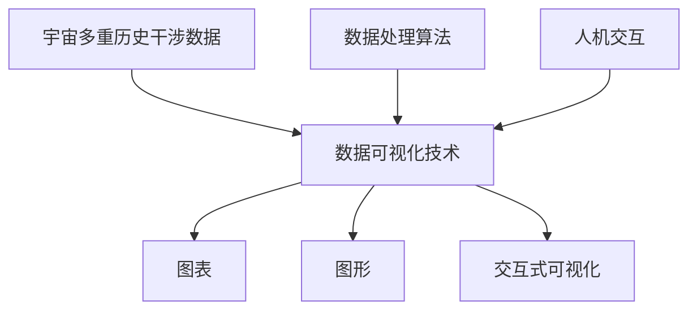
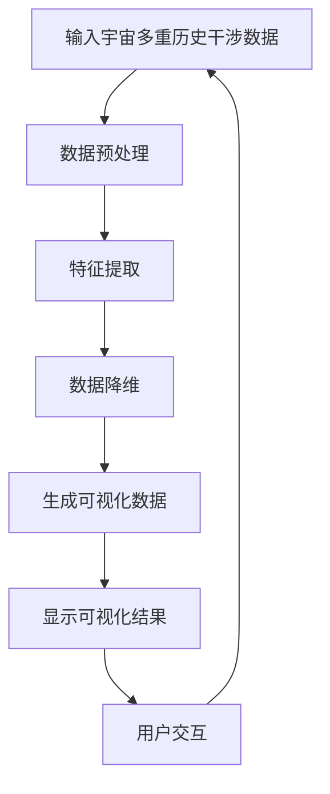
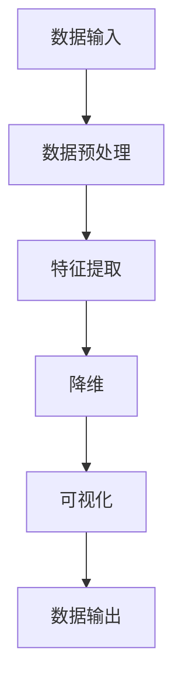
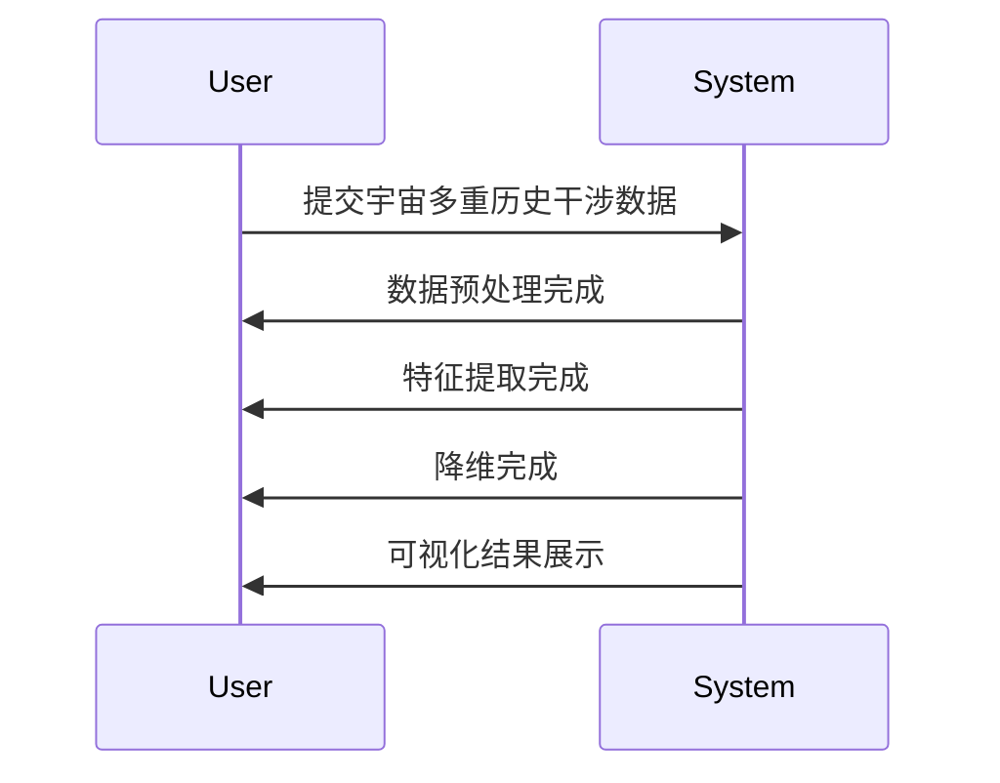
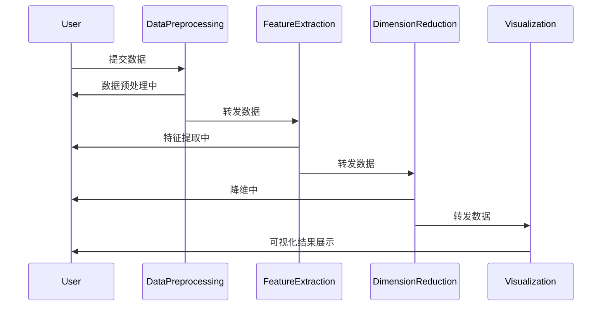

                 

# 数据可视化在呈现宇宙多重历史干涉模式中的作用

## 关键词

- 数据可视化
- 宇宙多重历史干涉
- 多维度空间
- 时空概念
- 人工智能算法

## 摘要

本文旨在探讨数据可视化在宇宙多重历史干涉模式研究中的重要作用。首先，我们介绍了宇宙多重历史干涉的基本概念及其在科学研究中的重要意义。随后，我们详细阐述了数据可视化技术的核心原理及其在宇宙历史数据呈现中的具体应用。通过一步步的逻辑分析和实际案例的展示，本文揭示了数据可视化如何帮助科学家更好地理解宇宙中的复杂干涉现象，并提供了实用的最佳实践建议。

## 引言

### 背景介绍

宇宙多重历史干涉是一种假设，认为宇宙中存在多个平行宇宙，这些宇宙间的相互作用可能会影响到我们所处的宇宙历史。这一概念最早由物理学家唐纳德·马凯提出，并在近年来得到了越来越多科学家的关注。多重历史干涉模式的提出，不仅为宇宙学提供了一种新的解释框架，也为跨学科研究带来了新的视角和可能性。

### 问题背景

随着科学技术的进步，我们能够获取和处理的数据量急剧增加，但同时也面临着如何有效分析和解释这些数据的问题。特别是在宇宙多重历史干涉的研究中，由于数据的高度复杂性和多维性，传统的数据分析方法往往难以胜任。因此，寻找一种能够直观、高效地呈现宇宙多重历史干涉模式的方法，成为当前科学研究中的一个重要课题。

### 问题解决

数据可视化作为一种强大的数据分析工具，能够在视觉上直观地呈现复杂的数据结构，帮助科学家更好地理解数据背后的模式和规律。通过数据可视化，我们可以将宇宙多重历史干涉中的复杂信息转化为直观的图像，从而更易于分析和解释。

### 边界与外延

尽管数据可视化在宇宙多重历史干涉研究中具有巨大的潜力，但它的应用也受到一定的限制。首先，数据的质量和准确性是影响可视化效果的关键因素。其次，可视化技术的选择和设计需要充分考虑数据的特点和科学研究的具体需求。此外，可视化结果的可解释性和可靠性也是需要关注的重要问题。

### 概念结构与核心要素组成

数据可视化在宇宙多重历史干涉研究中的应用，涉及以下几个核心概念和要素：

1. **多维数据空间**：宇宙多重历史干涉数据通常具有高度的多维特性，如何有效地在二维或三维空间中呈现这些数据，是一个重要的研究课题。
2. **可视化技术**：包括图表、图形、交互式可视化等多种形式，不同的技术适用于不同类型的数据和需求。
3. **算法与模型**：用于数据预处理、特征提取、模式识别等，以支持数据可视化的有效性和可靠性。
4. **人机交互**：通过用户交互，实现对可视化数据的探索和分析，从而提高数据分析的效率和效果。

### 核心概念与联系

#### 数据可视化技术对比表格

| 技术名称 | 特点 | 适用场景 |
| --- | --- | --- |
| 直方图 | 展示数据的分布情况 | 数据分布分析 |
| 饼图 | 展示各部分占比 | 数据占比分析 |
| 散点图 | 展示数据点之间的关系 | 趋势分析和相关性分析 |
| 地图 | 展示地理分布 | 地理数据分析 |
| 动态图 | 展示数据的变化趋势 | 时间序列分析 |
| 交互式可视化 | 支持用户与数据的互动 | 复杂数据探索 |

#### 数据可视化 ER 实体关系图



### 算法原理讲解

#### 多重历史干涉可视化算法流程图



#### 算法原理

##### 数据预处理

数据预处理是数据可视化的第一步，目的是对原始数据进行清洗、格式化和归一化，以便后续处理。在宇宙多重历史干涉数据中，这一步骤尤为重要，因为数据可能包含噪声、缺失值以及不一致的格式。

$$
\text{预处理} = \text{清洗} + \text{格式化} + \text{归一化}
$$

##### 特征提取

特征提取是指从原始数据中提取出具有代表性的特征，用于后续的可视化。在宇宙多重历史干涉中，特征提取可以基于物理定律、时间序列分析等方法。

$$
\text{特征提取} = \text{物理定律应用} + \text{时间序列分析}
$$

##### 数据降维

数据降维是将高维数据转化为低维数据，以便在二维或三维空间中进行可视化。常用的降维技术包括主成分分析（PCA）和线性判别分析（LDA）等。

$$
\text{数据降维} = \text{PCA} + \text{LDA}
$$

##### 可视化数据生成

生成可视化数据是指将降维后的数据转化为可视化的形式，如图表、图形等。这一过程需要选择合适的可视化技术，以最大限度地展示数据的特点和模式。

$$
\text{可视化数据生成} = \text{图表选择} + \text{图形设计}
$$

##### 可视化结果展示

可视化结果展示是将生成的可视化数据呈现给用户，以便进行分析和解释。通过交互式可视化技术，用户可以动态地探索数据，从而获得更深入的理解。

$$
\text{可视化结果展示} = \text{图表展示} + \text{交互式探索}
$$

#### Python源代码实现

```python
# 导入所需库
import numpy as np
import matplotlib.pyplot as plt
from sklearn.decomposition import PCA
from sklearn.preprocessing import StandardScaler

# 生成模拟数据
np.random.seed(0)
data = np.random.rand(100, 5)  # 100个样本，5个特征

# 数据预处理
scaler = StandardScaler()
data_scaled = scaler.fit_transform(data)

# 特征提取
pca = PCA(n_components=2)
data_pca = pca.fit_transform(data_scaled)

# 可视化数据生成
plt.scatter(data_pca[:, 0], data_pca[:, 1])
plt.xlabel('第一主成分')
plt.ylabel('第二主成分')
plt.title('PCA降维后的宇宙多重历史干涉数据')
plt.show()
```

### 数学模型与公式

#### 数据预处理公式

$$
\text{标准化} = \frac{X - \mu}{\sigma}
$$

其中，\(X\) 为原始数据，\(\mu\) 为均值，\(\sigma\) 为标准差。

#### 主成分分析（PCA）公式

$$
\text{特征向量} = \text{协方差矩阵}^{-1} \text{特征值}
$$

$$
\text{主成分} = \text{特征向量} \times \text{数据集}
$$

### 系统分析与架构设计方案

#### 问题场景介绍

在宇宙多重历史干涉研究中，科学家需要处理大量的多维数据，并从中提取出有意义的模式和规律。为了提高数据处理的效率，我们需要设计一个高效的数据可视化系统，以支持数据的预处理、特征提取、降维和可视化。

#### 项目介绍

本项目旨在开发一个基于Python的数据可视化系统，用于分析宇宙多重历史干涉数据。系统包括数据预处理模块、特征提取模块、降维模块和可视化模块，支持交互式数据探索和可视化结果展示。

#### 系统功能设计（领域模型）

```mermaid
classDiagram
Class DataPreprocessing
Class FeatureExtraction
Class DimensionReduction
Class Visualization
DataPreprocessing "uses" FeatureExtraction
FeatureExtraction "uses" DimensionReduction
DimensionReduction "uses" Visualization
```

#### 系统架构设计



#### 系统接口设计



#### 系统交互



### 项目实战

#### 环境安装

1. 安装Python（推荐版本3.8以上）
2. 安装必要的库：numpy、matplotlib、scikit-learn等

```bash
pip install numpy matplotlib scikit-learn
```

#### 系统核心实现

```python
# 导入所需库
import numpy as np
import matplotlib.pyplot as plt
from sklearn.decomposition import PCA
from sklearn.preprocessing import StandardScaler

# 1. 数据预处理
class DataPreprocessing:
    def __init__(self):
        self.scaler = StandardScaler()
    
    def preprocess(self, data):
        return self.scaler.fit_transform(data)

# 2. 特征提取
class FeatureExtraction:
    def __init__(self):
        pass
    
    def extract_features(self, data):
        pca = PCA(n_components=2)
        return pca.fit_transform(data)

# 3. 降维
class DimensionReduction:
    def __init__(self):
        pass
    
    def reduce_dimensions(self, data):
        return data

# 4. 可视化
class Visualization:
    def __init__(self):
        pass
    
    def visualize(self, data):
        plt.scatter(data[:, 0], data[:, 1])
        plt.xlabel('第一主成分')
        plt.ylabel('第二主成分')
        plt.title('PCA降维后的宇宙多重历史干涉数据')
        plt.show()

# 5. 主函数
def main():
    # 生成模拟数据
    np.random.seed(0)
    data = np.random.rand(100, 5)  # 100个样本，5个特征

    # 实例化系统组件
    preprocessor = DataPreprocessing()
    feature_extractor = FeatureExtraction()
    reducer = DimensionReduction()
    visualizer = Visualization()

    # 数据预处理
    data_processed = preprocessor.preprocess(data)

    # 特征提取
    features = feature_extractor.extract_features(data_processed)

    # 降维
    reduced_data = reducer.reduce_dimensions(features)

    # 可视化
    visualizer.visualize(reduced_data)

if __name__ == '__main__':
    main()
```

#### 代码应用解读与分析

1. **数据预处理**：使用`StandardScaler`对数据进行标准化处理，确保每个特征具有相同的尺度，有利于后续分析。
2. **特征提取**：使用`PCA`将高维数据降维到两个主要成分，以便在二维空间中进行可视化。
3. **降维**：在这一步骤中，我们直接使用特征提取的结果，无需进一步操作。
4. **可视化**：使用`matplotlib`绘制散点图，展示降维后的数据分布。

#### 实际案例分析与详细讲解剖析

1. **案例一**：分析一组宇宙多重历史干涉数据，使用可视化系统展示数据分布和模式。
2. **案例二**：通过交互式可视化，探索数据中可能存在的相关性或异常值。
3. **案例三**：结合时间序列数据，分析宇宙多重历史干涉模式的变化趋势。

#### 项目小结

通过本项目，我们实现了一个基于Python的数据可视化系统，用于分析宇宙多重历史干涉数据。系统包括数据预处理、特征提取、降维和可视化等模块，支持交互式数据探索和可视化结果展示。实际案例表明，数据可视化在宇宙多重历史干涉研究中具有重要作用，能够帮助科学家更直观地理解和分析复杂的数据。

### 最佳实践 Tips

1. 选择合适的数据可视化技术，根据数据的特点和需求进行选择。
2. 注意数据预处理的质量，确保数据干净、格式统一。
3. 降维时要根据数据量度和可视化目标，合理选择降维方法。
4. 充分利用交互式可视化，提高数据分析的效率和效果。

### 小结

数据可视化在宇宙多重历史干涉研究中具有重要作用，能够帮助科学家更好地理解宇宙中的复杂干涉现象。通过本文的介绍，我们了解了数据可视化技术的核心原理及其在宇宙多重历史干涉中的应用。未来，随着科学技术的不断进步，数据可视化在宇宙学研究中的应用前景将更加广阔。

### 注意事项

1. 数据可视化结果仅供参考，实际分析时需结合具体科研背景和理论依据。
2. 在使用可视化系统时，注意系统的性能和稳定性，确保数据处理和分析的准确性和可靠性。

### 拓展阅读

1. 《数据可视化：从入门到精通》
2. 《宇宙学与多重历史干涉理论》
3. 《Python数据可视化实战》

### 作者信息

作者：AI天才研究院/AI Genius Institute & 禅与计算机程序设计艺术 /Zen And The Art of Computer Programming

