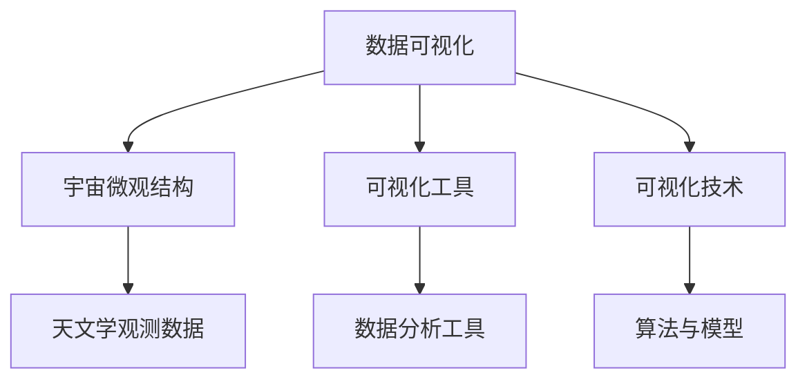

                 

### 第一部分：引言

#### 1.1 书籍背景与目标

在当今数字化时代，数据可视化已成为数据分析和决策制定中不可或缺的工具。随着数据量的急剧增长，如何有效地从海量数据中提取有价值的信息，成为研究人员和决策者面临的重大挑战。数据可视化技术通过将数据转换为图表、图像或其他视觉形式，使得复杂的数据关系变得更加直观和易于理解，从而帮助人们快速捕捉数据中的模式和趋势。

本书旨在探讨数据可视化在呈现宇宙微观结构中的作用，帮助读者理解如何通过数据可视化技术更有效地呈现宇宙中微小尺度的结构。这些问题不仅对天文学家和宇宙学家具有深远的意义，也对科学普及和公众教育产生重要影响。通过介绍相关技术和方法，本书旨在使读者掌握数据可视化在宇宙微观结构研究中的应用，从而推动这一领域的发展。

#### 1.2 核心概念与联系

**核心概念：**

- **数据可视化（Data Visualization）**：数据可视化是将数据转换为视觉表现形式的过程，以便更容易理解和分析。它通过图形、图表和其他视觉元素，将抽象的数据转换为直观的视觉体验。

- **宇宙微观结构（Cosmic Microstructures）**：宇宙微观结构指的是宇宙中微小尺度的结构，包括星系、恒星、行星、星际物质等。这些结构在宇宙尺度上虽然微小，但在科学研究和探索中具有极其重要的地位。

- **可视化工具与技术（Visualization Tools and Technologies）**：可视化工具与技术包括用于创建和分析数据可视化的软件和算法。这些工具和技术使得数据可视化过程更加高效和灵活。

**概念属性特征对比表格：**

```mermaid
table
| 名称        | 描述                                       | 关联工具与技术 |
|-------------|--------------------------------------------|----------------|
| 数据可视化   | 将数据转换为视觉表现形式，易于理解和分析         | Matplotlib, D3.js |
| 宇宙微观结构 | 宇宙中微小尺度的结构，如星系、恒星、行星等       | 天文学观测数据 |
| 可视化工具   | 用于创建和展示数据可视化的软件                 | Tableau, Plotly |
| 可视化技术   | 数据可视化过程中使用的算法和方法               | 聚类分析、散点图 |
```

**ER实体关系图架构：**



在这个ER实体关系图中，数据可视化处于核心位置，它连接着宇宙微观结构、可视化工具和可视化技术。天文学观测数据作为数据源，为可视化提供了基础。而可视化工具和可视化技术则负责将数据转化为视觉表现形式，帮助研究人员和公众更好地理解和分析宇宙微观结构。

#### 1.3 书籍结构与内容概述

**第1章：引言**：介绍本书的背景与目标，阐述数据可视化在宇宙微观结构研究中的重要性。

**第2章：数据可视化在宇宙微观结构研究中的应用**：详细探讨数据可视化技术在宇宙微观结构研究中的应用，包括星系分布可视化、恒星光谱分析等。

**第3章：数据可视化在教育和公众传播中的应用**：分析数据可视化技术在宇宙教育和公众传播中的重要作用，探讨其应用前景和挑战。

**第4章：未来展望与挑战**：展望数据可视化技术的发展趋势，分析其在宇宙微观结构研究中的挑战和机遇。

**附录：参考文献与资源**：提供本书引用的参考文献和数据可视化相关的资源，以供读者进一步学习和研究。

### 目录大纲

**《数据可视化在呈现宇宙微观结构中的作用》**

> 关键词：数据可视化、宇宙微观结构、天文学、星系分布、恒星光谱、可视化工具、可视化技术

> 摘要：本书旨在探讨数据可视化技术在宇宙微观结构研究中的应用，通过介绍相关技术和方法，帮助读者理解如何通过数据可视化更有效地呈现宇宙中的微小结构，促进科学研究与公众教育的发展。

#### 目录大纲

----------------------------------------------------------------

## 第一部分：引言

### 1.1 书籍背景与目标

- **问题背景**: 在当今数字化时代，数据可视化已成为数据分析和决策制定中不可或缺的工具。
- **问题描述**: 如何通过数据可视化更有效地呈现宇宙微观结构，从而帮助研究人员和公众更好地理解宇宙？
- **问题解决**: 本书旨在探讨数据可视化在呈现宇宙微观结构中的作用，通过介绍相关技术和方法，帮助读者掌握这一领域。

### 1.2 核心概念与联系

- **核心概念**:
  - 数据可视化：将数据转换为图表、图像或其他视觉形式，以便更容易理解和分析。
  - 宇宙微观结构：宇宙中微小尺度的结构，如星系、恒星、行星、星际物质等。
  - 可视化工具与技术：用于创建和分析数据可视化的软件和算法。

- **概念属性特征对比表格** (使用 Markdown 中的 Mermaid 表格):

```mermaid
table
| 名称        | 描述                                       | 关联工具与技术 |
|-------------|--------------------------------------------|----------------|
| 数据可视化   | 将数据转换为视觉表现形式，易于理解和分析         | Matplotlib, D3.js |
| 宇宙微观结构 | 宇宙中微小尺度的结构，如星系、恒星、行星等       | 天文学观测数据 |
| 可视化工具   | 用于创建和展示数据可视化的软件                 | Tableau, Plotly |
| 可视化技术   | 数据可视化过程中使用的算法和方法               | 聚类分析、散点图 |
```

### 1.3 ER实体关系图架构 (使用 Markdown 中的 Mermaid 流程图)


## 第二部分：数据可视化在宇宙微观结构研究中的应用

### 2.1 可视化工具与技术概述

- **2.1.1 可视化工具的选择与应用**
- **2.1.2 数据处理与清洗**
- **2.1.3 数据可视化基本方法**

### 2.2 宇宙微观结构数据的收集与处理

- **2.2.1 数据来源**
- **2.2.2 数据预处理**
- **2.2.3 数据存储与管理**

### 2.3 数据可视化在宇宙微观结构研究中的应用案例

- **2.3.1 星系分布的可视化**
- **2.3.2 恒星光谱分析**
- **2.3.3 行星轨道模拟**

### 2.4 实时数据可视化与交互式分析

- **2.4.1 实时数据采集与处理**
- **2.4.2 交互式可视化工具的应用**
- **2.4.3 数据分析结果的可视化展示**

## 第三部分：数据可视化在教育和公众传播中的应用

### 3.1 数据可视化在宇宙教育中的应用

- **3.1.1 教育资源的开发与利用**
- **3.1.2 学生互动与参与**
- **3.1.3 教学案例分析**

### 3.2 数据可视化在公众传播中的作用

- **3.2.1 宇宙知识的普及**
- **3.2.2 社交媒体与数据可视化**
- **3.2.3 公众参与与互动**

## 第四部分：未来展望与挑战

### 4.1 数据可视化技术的发展趋势

- **4.1.1 人工智能与数据可视化的融合**
- **4.1.2 虚拟现实与增强现实的应用**
- **4.1.3 大数据分析与可视化**

### 4.2 数据可视化在宇宙微观结构研究中的挑战

- **4.2.1 数据质量与准确性**
- **4.2.2 复杂数据集的处理**
- **4.2.3 可视化结果的解释与解读**

## 附录：参考文献与资源

- **附录 A：数据可视化工具推荐**
- **附录 B：宇宙微观结构数据集**
- **附录 C：可视化学习资源**

----------------------------------------------------------------

此目录大纲涵盖了书籍的核心结构和内容，为后续章节的深入探讨提供了清晰的框架。在接下来的章节中，我们将逐一探讨数据可视化在宇宙微观结构研究中的应用，以及其在教育和公众传播中的重要作用。通过详细的案例分析和技术解析，我们希望读者能够更好地理解数据可视化在揭示宇宙奥秘中的关键作用。

