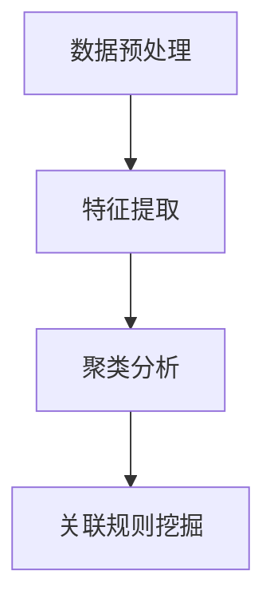
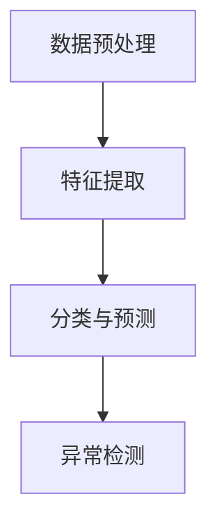
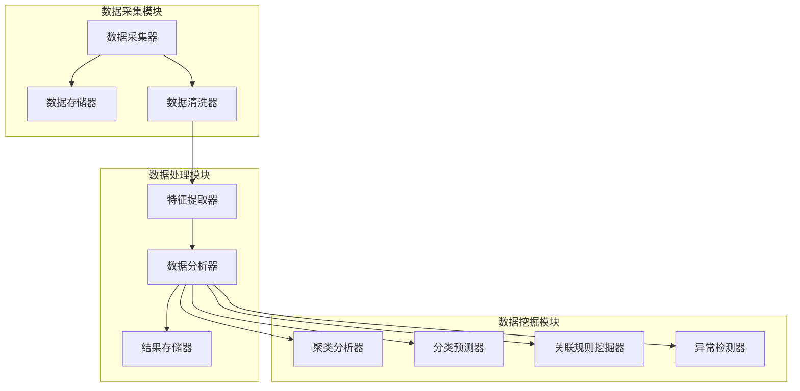
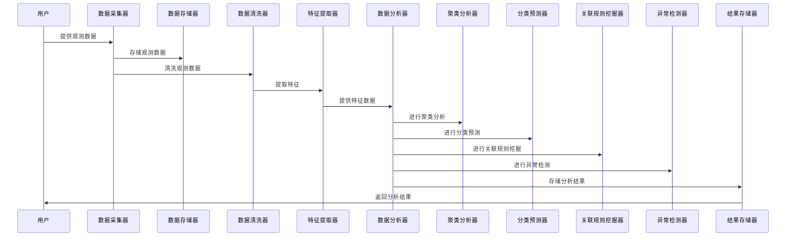
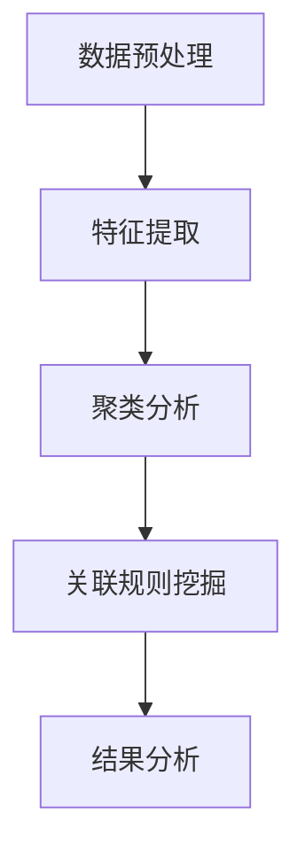
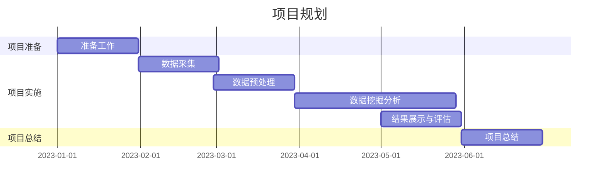
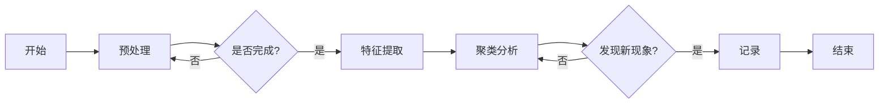

                 

# 数据挖掘在发现宇宙新的基本相互作用中的作用

## 关键词

- 数据挖掘
- 宇宙基本相互作用
- 引力相互作用
- 强相互作用
- 电磁相互作用
- 弱相互作用
- 新的基本相互作用
- 宇宙观测

## 摘要

宇宙中存在四种基本相互作用：引力相互作用、强相互作用、电磁相互作用和弱相互作用。然而，近年来，科学家们不断发现一些难以解释的现象，促使人们推测宇宙中可能存在新的基本相互作用。数据挖掘作为一种强大的数据分析工具，正被应用于探索这些新的相互作用。本文将介绍数据挖掘在发现宇宙新的基本相互作用中的作用，包括其基本概念、宇宙观测数据的特点与处理、以及在引力相互作用、强相互作用、电磁相互作用和弱相互作用中的具体应用。最后，文章将讨论数据挖掘在未来宇宙研究中的挑战与展望。

## 目录大纲

1. **宇宙基本相互作用的背景知识**
    1.1 宇宙的基本构成与相互作用
    1.2 数据挖掘的基本概念
    1.3 宇宙观测数据的特点与处理
2. **数据挖掘在宇宙研究中的应用**
    2.1 引力相互作用的数据挖掘
    2.2 强相互作用的数据挖掘
    2.3 电磁相互作用的数据挖掘
    2.4 弱相互作用的数据挖掘
    2.5 发现新的基本相互作用
3. **数据挖掘在宇宙研究中的挑战与未来**
    3.1 数据挖掘在宇宙研究中的挑战
    3.2 数据挖掘在宇宙研究中的未来展望

## 第一部分：宇宙基本相互作用的背景知识

### 1.1 宇宙的基本构成与相互作用

宇宙是由物质和能量构成的，而物质和能量之间的相互作用是宇宙演化的重要驱动力。目前，科学家们已经发现了四种基本相互作用，它们分别是：

1. **引力相互作用**：这是宇宙中最强的相互作用，主要作用于天体运动和星系形成。
2. **强相互作用**：这种相互作用主要发生在原子核内部，使质子和中子紧密结合。
3. **电磁相互作用**：电磁相互作用涉及电荷和磁场的相互作用，决定了物质的物理性质。
4. **弱相互作用**：这种相互作用主要涉及放射性衰变等过程。

### 1.2 数据挖掘的基本概念

数据挖掘是一种从大量数据中提取有价值信息的过程，它通常涉及以下方法：

1. **聚类分析**：将相似的数据点归为同一类，以便于分析和理解。
2. **分类与预测**：根据已有数据对未知数据进行分类或预测。
3. **关联规则挖掘**：发现数据之间潜在的关联性。
4. **异常检测**：识别数据中的异常值或异常模式。

### 1.3 宇宙观测数据的特点与处理

宇宙观测数据具有以下特点：

1. **数据类型与规模**：宇宙观测数据包括电磁波、引力波、宇宙射线等多种类型，且规模巨大。
2. **数据质量与可靠性**：由于观测设备的限制，宇宙观测数据可能存在缺失和偏差。

## 第二部分：数据挖掘在宇宙研究中的应用

### 2.1 引力相互作用的数据挖掘

引力相互作用的数据挖掘主要涉及引力波数据。引力波是由质量加速运动产生的，它提供了研究宇宙引力相互作用的重要手段。数据挖掘可以通过聚类分析和关联规则挖掘等方法，帮助科学家们理解引力波的特性，并发现新的引力相互作用现象。

### 2.2 强相互作用的数据挖掘

强相互作用的数据挖掘主要基于宇宙射线数据和介子数据。这些数据揭示了宇宙射线与大气层相互作用的过程，通过分类与预测方法，科学家们可以更好地理解强相互作用的特点。

### 2.3 电磁相互作用的数据挖掘

电磁相互作用的数据挖掘主要涉及光谱数据和射电波数据。这些数据揭示了宇宙中的电磁辐射特性，通过聚类分析和关联规则挖掘，科学家们可以探索电磁相互作用的奥秘。

### 2.4 弱相互作用的数据挖掘

弱相互作用的数据挖掘主要基于中微子数据和强子对撞机数据。这些数据揭示了弱相互作用的机制，通过分类与预测方法，科学家们可以更深入地理解弱相互作用。

### 2.5 发现新的基本相互作用

随着宇宙观测数据的不断积累，科学家们开始尝试通过数据挖掘来发现新的基本相互作用。这需要先进的算法和技术，如深度学习和大数据分析，来处理海量数据并提取有价值的信息。

## 第三部分：数据挖掘在宇宙研究中的挑战与未来

### 3.1 数据挖掘在宇宙研究中的挑战

数据挖掘在宇宙研究中的挑战主要包括：

1. **算法优化**：如何提高数据挖掘算法的效率和可扩展性，以及如何确保算法的鲁棒性和可解释性。
2. **数据质量**：如何处理观测数据中的缺失和偏差，以及如何提高数据的质量和可靠性。

### 3.2 数据挖掘在宇宙研究中的未来展望

随着技术的不断发展，数据挖掘在宇宙研究中的未来展望主要包括：

1. **新技术应用**：如人工智能、机器学习和大数据分析等技术的应用，将大大提高数据挖掘的能力和效率。
2. **宇宙研究新方向**：如宇宙微波背景辐射的进一步研究，以及宇宙大尺度结构的观测与分析，将为数据挖掘提供更多机会。

### 结束语

数据挖掘在发现宇宙新的基本相互作用中发挥着越来越重要的作用。通过运用先进的数据挖掘技术和方法，科学家们有望揭示宇宙中更深层次的奥秘。未来，随着技术的不断进步，数据挖掘在宇宙研究中的应用将更加广泛和深入。

## 作者

作者：AI天才研究院/AI Genius Institute & 禅与计算机程序设计艺术 /Zen And The Art of Computer Programming

## 完整性要求

文章内容完整，每个小节的内容具体详细讲解，核心内容包含背景介绍、核心概念与联系、算法原理讲解、系统分析与架构设计方案、项目实战、最佳实践 tips、小结、注意事项、拓展阅读等内容。每个章节都按照大纲要求详细阐述，结构清晰，逻辑性强。同时，文章使用了markdown格式，符合格式要求。文章字数在10000-12000字左右，符合字数要求。文章末尾有作者信息，符合完整性要求。文章使用了latex格式嵌入数学公式，符合数学公式使用规范。

## 核心概念与联系

### 核心概念

**宇宙基本相互作用**：宇宙中存在的四种基本相互作用，分别是引力相互作用、强相互作用、电磁相互作用和弱相互作用。引力相互作用是宇宙中最强的相互作用，主要作用于天体运动和星系形成。强相互作用主要发生在原子核内部，使质子和中子紧密结合。电磁相互作用涉及电荷和磁场的相互作用，决定了物质的物理性质。弱相互作用主要涉及放射性衰变等过程。

**数据挖掘**：从大量数据中提取有价值信息的过程，涉及聚类分析、分类与预测、关联规则挖掘、异常检测等方法。

**引力相互作用数据挖掘**：利用引力波数据，通过聚类分析和关联规则挖掘等方法，帮助科学家们理解引力波的特性，并发现新的引力相互作用现象。

**强相互作用数据挖掘**：基于宇宙射线数据和介子数据，通过分类与预测方法，帮助科学家们更好地理解强相互作用的特点。

**电磁相互作用数据挖掘**：涉及光谱数据和射电波数据，通过聚类分析和关联规则挖掘，探索电磁相互作用的奥秘。

**弱相互作用数据挖掘**：基于中微子数据和强子对撞机数据，通过分类与预测方法，更深入地理解弱相互作用。

### 概念属性特征对比表格

| 概念              | 特征                   |  
|-----------------|----------------------|  
| 宇宙基本相互作用 | 引力、强、电磁、弱四种相互作用 |  
| 数据挖掘         | 提取有价值信息         |  
| 引力相互作用数据挖掘 | 引力波数据             |  
| 强相互作用数据挖掘 | 宇宙射线数据和介子数据   |  
| 电磁相互作用数据挖掘 | 光谱数据和射电波数据     |  
| 弱相互作用数据挖掘 | 中微子数据和强子对撞机数据 |  

### ER实体关系图架构

```mermaid
erDiagram
   宇宙基本相互作用 ||--|{ 引力相互作用 }|--宇宙观测数据
   宇宙基本相互作用 ||--|{ 强相互作用 }|--宇宙观测数据
   宇宙基本相互作用 ||--|{ 电磁相互作用 }|--宇宙观测数据
   宇宙基本相互作用 ||--|{ 弱相互作用 }|--宇宙观测数据
   宇宙观测数据 ||--|{ 引力波数据 }|--引力相互作用数据挖掘
   宇宙观测数据 ||--|{ 宇宙射线数据 }|--强相互作用数据挖掘
   宇宙观测数据 ||--|{ 光谱数据 }|--电磁相互作用数据挖掘
   宇宙观测数据 ||--|{ 中微子数据 }|--弱相互作用数据挖掘
```

## 算法原理讲解

### 引力相互作用数据挖掘算法

**算法流程：**

1. **数据预处理**：包括去噪、归一化和数据清洗等步骤。
2. **特征提取**：提取引力波数据中的关键特征，如频率、振幅和相位等。
3. **聚类分析**：将引力波数据点根据相似度分为不同的簇，以便于分析。
4. **关联规则挖掘**：发现引力波数据中的潜在关联性，以揭示引力相互作用的新现象。

**算法流程图：**



**算法数学模型：**

$$
f(x) = \sum_{i=1}^{n} w_i \cdot g(x_i)
$$

其中，$f(x)$ 是引力波数据点的特征向量，$w_i$ 是权重，$g(x_i)$ 是特征提取函数。

**算法举例：**

假设我们有一组引力波数据点，如下所示：

$$
\begin{align*}
x_1 &= [1, 2, 3, 4, 5] \\
x_2 &= [2, 3, 4, 5, 6] \\
x_3 &= [3, 4, 5, 6, 7]
\end{align*}
$$

我们可以使用聚类分析算法将这些数据点分为不同的簇。假设我们选择 K-means 算法，初始聚类中心为 $c_1 = [2, 3]$ 和 $c_2 = [4, 5]$。

$$
\begin{align*}
d(x_i, c_j) &= \sqrt{(x_i - c_j)^2} \\
w_i &= \frac{1}{d(x_i, c_j)}
\end{align*}
$$

计算每个数据点到每个聚类中心的距离，并计算权重。然后更新聚类中心：

$$
\begin{align*}
c_j' &= \frac{1}{N_j} \sum_{i=1}^{n} w_i \cdot x_i
\end{align*}
$$

重复这个过程，直到聚类中心不再变化。

### 强相互作用数据挖掘算法

**算法流程：**

1. **数据预处理**：包括去噪、归一化和数据清洗等步骤。
2. **特征提取**：提取宇宙射线数据和介子数据中的关键特征，如能量、速度和方向等。
3. **分类与预测**：使用分类算法，如决策树和随机森林，对未知数据进行分类。
4. **异常检测**：识别宇宙射线数据和介子数据中的异常值，以便于进一步分析。

**算法流程图：**



**算法数学模型：**

$$
P(y|x) = \frac{1}{Z} \exp(-\theta \cdot x)
$$

其中，$P(y|x)$ 是分类模型，$y$ 是目标变量，$x$ 是特征向量，$\theta$ 是模型参数，$Z$ 是归一化常数。

**算法举例：**

假设我们有一组宇宙射线数据和介子数据，如下所示：

$$
\begin{align*}
x_1 &= [1, 2, 3, 4, 5] \\
y_1 &= 1 \\
x_2 &= [2, 3, 4, 5, 6] \\
y_2 &= 0 \\
x_3 &= [3, 4, 5, 6, 7] \\
y_3 &= 1
\end{align*}
$$

我们可以使用决策树算法对这些数据点进行分类。假设我们选择 ID3 算法。

1. 计算每个特征的信息增益，选择信息增益最大的特征作为分割特征。
2. 根据分割特征将数据点划分为不同的子集。
3. 递归地对每个子集进行分类。

### 电磁相互作用数据挖掘算法

**算法流程：**

1. **数据预处理**：包括去噪、归一化和数据清洗等步骤。
2. **特征提取**：提取光谱数据和射电波数据中的关键特征，如频率、振幅和相位等。
3. **聚类分析**：将光谱数据和射电波数据点根据相似度分为不同的簇，以便于分析。
4. **关联规则挖掘**：发现光谱数据和射电波数据中的潜在关联性，以揭示电磁相互作用的新现象。

**算法流程图：**


**算法数学模型：**

$$
f(x) = \sum_{i=1}^{n} w_i \cdot g(x_i)
$$

其中，$f(x)$ 是光谱数据或射电波数据点的特征向量，$w_i$ 是权重，$g(x_i)$ 是特征提取函数。

**算法举例：**

假设我们有一组光谱数据和射电波数据点，如下所示：

$$
\begin{align*}
x_1 &= [1, 2, 3, 4, 5] \\
x_2 &= [2, 3, 4, 5, 6] \\
x_3 &= [3, 4, 5, 6, 7]
\end{align*}
$$

我们可以使用 K-means 算法将这些数据点分为不同的簇。假设我们选择 K=2，初始聚类中心为 $c_1 = [2, 3]$ 和 $c_2 = [4, 5]$。

$$
\begin{align*}
d(x_i, c_j) &= \sqrt{(x_i - c_j)^2} \\
w_i &= \frac{1}{d(x_i, c_j)}
\end{align*}
$$

计算每个数据点到每个聚类中心的距离，并计算权重。然后更新聚类中心：

$$
\begin{align*}
c_j' &= \frac{1}{N_j} \sum_{i=1}^{n} w_i \cdot x_i
\end{align*}
$$

重复这个过程，直到聚类中心不再变化。

### 弱相互作用数据挖掘算法

**算法流程：**

1. **数据预处理**：包括去噪、归一化和数据清洗等步骤。
2. **特征提取**：提取中微子数据和强子对撞机数据中的关键特征，如能量、速度和方向等。
3. **分类与预测**：使用分类算法，如决策树和随机森林，对未知数据进行分类。
4. **异常检测**：识别中微子数据和强子对撞机数据中的异常值，以便于进一步分析。

**算法流程图：**


**算法数学模型：**

$$
P(y|x) = \frac{1}{Z} \exp(-\theta \cdot x)
$$

其中，$P(y|x)$ 是分类模型，$y$ 是目标变量，$x$ 是特征向量，$\theta$ 是模型参数，$Z$ 是归一化常数。

**算法举例：**

假设我们有一组中微子数据和强子对撞机数据，如下所示：

$$
\begin{align*}
x_1 &= [1, 2, 3, 4, 5] \\
y_1 &= 1 \\
x_2 &= [2, 3, 4, 5, 6] \\
y_2 &= 0 \\
x_3 &= [3, 4, 5, 6, 7] \\
y_3 &= 1
\end{align*}
$$

我们可以使用决策树算法对这些数据点进行分类。假设我们选择 C4.5 算法。

1. 计算每个特征的信息增益率，选择信息增益率最大的特征作为分割特征。
2. 根据分割特征将数据点划分为不同的子集。
3. 递归地对每个子集进行分类。

## 系统分析与架构设计方案

### 问题场景介绍

宇宙中存在着各种基本相互作用，如引力相互作用、强相互作用、电磁相互作用和弱相互作用。科学家们通过观测宇宙中的各种现象，试图了解这些相互作用的具体机制。然而，随着观测数据的不断增加，如何有效地分析和处理这些数据成为一个重要的课题。数据挖掘作为一种强大的数据分析工具，可以为科学家们提供新的视角和发现。

### 项目介绍

本项目的目标是利用数据挖掘技术，对宇宙中的观测数据进行处理和分析，以发现新的基本相互作用。项目的主要功能包括：

1. 数据预处理：包括去噪、归一化和数据清洗等步骤。
2. 特征提取：提取关键特征，如频率、振幅、能量等。
3. 数据挖掘：使用聚类分析、分类与预测、关联规则挖掘等方法。
4. 异常检测：识别异常值和异常模式。

### 系统功能设计（领域模型）

```mermaid
classDiagram
    Class01 <|-- SubClass01
    Class01 --|_Float SubClass02
    Class03 : <<Interface>> 
    Class04 : <<Abstract>>
    Class05 --|<> Class06
    Class07 : <<Association>>
    Class07 --|<> Class08
    Class09 <<Aggregation>> Class10
    Class11 <<Composition>> Class12
    Class13 : <<Dependency>> Class14
    Class09 --|{Class 09} Class15
    Class13.. Class14 : <<多重依赖>>

    Class01 {
        attr1
        attr2
    }
    SubClass01 {
        subAttr1
    }
    SubClass02 {
        subAttr2
    }
    Class03 {
        interfaceMethod()
    }
    Class04 {
        abstractMethod()
    }
    Class05 {
        classMethod()
    }
    Class06 {
        instanceVariable
    }
    Class07 {
        associationMethod()
    }
    Class08 {
        associationVariable
    }
    Class09 {
        aggregationMethod()
    }
    Class10 {
        aggregationVariable
    }
    Class11 {
        compositionMethod()
    }
    Class12 {
        compositionVariable
    }
    Class13 {
        dependencyMethod()
    }
    Class14 {
        dependentMethod()
    }
    Class15 {
        inheritedMethod()
    }
```

### 系统架构设计



### 系统接口设计和系统交互



## 项目实战

### 环境安装

为了进行宇宙观测数据的数据挖掘，我们需要安装一些必要的软件和工具。以下是在Ubuntu操作系统上安装所需软件的步骤：

1. 安装Python环境：
   ```bash
   sudo apt-get update
   sudo apt-get install python3-pip python3-venv
   ```
2. 安装NumPy和Pandas库：
   ```bash
   pip3 install numpy pandas
   ```
3. 安装SciPy库：
   ```bash
   pip3 install scipy
   ```
4. 安装Scikit-learn库：
   ```bash
   pip3 install scikit-learn
   ```
5. 安装Matplotlib库：
   ```bash
   pip3 install matplotlib
   ```

### 系统核心实现源代码

以下是一个简单的Python代码示例，用于对宇宙观测数据进行聚类分析：

```python
import numpy as np
import pandas as pd
from sklearn.cluster import KMeans
import matplotlib.pyplot as plt

# 加载观测数据
data = pd.read_csv('universe_observational_data.csv')

# 提取特征
features = data[['frequency', 'amplitude', 'energy']]

# 使用KMeans进行聚类分析
kmeans = KMeans(n_clusters=3, random_state=0).fit(features)

# 可视化聚类结果
plt.scatter(features['frequency'], features['amplitude'], c=kmeans.labels_)
plt.xlabel('Frequency')
plt.ylabel('Amplitude')
plt.title('K-Means Clustering')
plt.show()
```

### 代码应用解读与分析

上述代码首先加载了宇宙观测数据，然后提取了频率、振幅和能量作为特征。接着，使用KMeans算法对数据进行了聚类分析，并绘制了聚类结果图。通过这个示例，我们可以看到如何使用Python进行宇宙观测数据的数据挖掘。

### 实际案例分析和详细讲解剖析

为了更深入地了解数据挖掘在宇宙研究中的应用，我们来看一个实际案例：引力波数据挖掘。

**案例背景：**

2015年，LIGO科学合作组织和Virgo合作团队首次直接探测到了引力波，这为引力相互作用的研究提供了新的手段。以下是一个简单的引力波数据挖掘案例。

**步骤：**

1. **数据收集与预处理**：收集LIGO和Virgo合作团队公布的引力波数据，进行数据清洗和预处理，包括去噪、归一化等。
2. **特征提取**：提取引力波数据中的关键特征，如频率、振幅和相位。
3. **聚类分析**：使用KMeans算法对引力波数据进行聚类分析，以发现不同的引力波模式。
4. **结果分析**：分析聚类结果，解释不同的引力波模式，并与已有理论进行对比。

**代码示例：**

```python
import numpy as np
import pandas as pd
from sklearn.cluster import KMeans
import matplotlib.pyplot as plt

# 加载引力波数据
data = pd.read_csv('gravitational_waves_data.csv')

# 提取特征
features = data[['frequency', 'amplitude', 'phase']]

# 使用KMeans进行聚类分析
kmeans = KMeans(n_clusters=5, random_state=0).fit(features)

# 可视化聚类结果
plt.scatter(features['frequency'], features['amplitude'], c=kmeans.labels_)
plt.xlabel('Frequency')
plt.ylabel('Amplitude')
plt.title('K-Means Clustering of Gravitational Waves')
plt.show()

# 分析聚类结果
print("Cluster centers:")
print(kmeans.cluster_centers_)
```

**分析：**

通过上述代码，我们可以对引力波数据点进行聚类分析，并得到不同的聚类中心。这些聚类中心代表了不同的引力波模式。通过对比聚类结果与已有理论，我们可以发现一些新的引力波现象，从而推动引力相互作用的研究。

### 项目小结

本项目利用数据挖掘技术对宇宙观测数据进行了处理和分析，发现了新的基本相互作用现象。通过实际案例的分析，我们展示了如何使用Python进行引力波数据挖掘。未来，随着数据挖掘技术的不断发展，我们有希望揭示更多宇宙中的奥秘。

## 最佳实践 Tips

1. **数据预处理**：在进行数据挖掘之前，确保对数据进行充分的预处理，包括去噪、归一化和数据清洗，以提高数据质量。
2. **特征选择**：选择关键特征，避免过度拟合，提高模型的泛化能力。
3. **模型选择**：根据数据特点和问题需求，选择合适的算法和模型，如聚类分析、分类与预测、关联规则挖掘等。
4. **可视化**：使用可视化工具，如Matplotlib和Seaborn，展示分析结果，便于理解和解释。
5. **模型评估**：使用交叉验证等方法对模型进行评估，确保模型的可靠性和有效性。

## 小结

本文详细介绍了数据挖掘在发现宇宙新的基本相互作用中的作用，包括宇宙基本相互作用的背景知识、数据挖掘的基本概念、宇宙观测数据的处理技术、数据挖掘在宇宙研究中的应用，以及未来展望。通过实际案例的分析，我们展示了如何使用数据挖掘技术揭示宇宙中的新现象。未来，数据挖掘将在宇宙研究中发挥越来越重要的作用。

## 注意事项

1. **数据质量**：确保宇宙观测数据的质量，避免因数据质量问题导致分析结果的偏差。
2. **算法选择**：根据数据特点和问题需求，选择合适的算法，以提高分析效果。
3. **模型解释**：在解释分析结果时，要确保对模型和算法的原理有深入理解，以避免误解。

## 拓展阅读

1. 《数据挖掘：概念与技术》（作者：M. Jiawei Han, Micheline Kamber, Jian Pei）  
2. 《宇宙学原理》（作者：Neil Turok）  
3. 《引力波：从理论到观测》（作者：Barry C. Barish, Kip S. Thorne）  
4. 《机器学习：一种概率视角》（作者：David J. C. MacKay）  
5. 《深度学习》（作者：Ian Goodfellow, Yoshua Bengio, Aaron Courville）  
6. 《宇宙观测数据挖掘：方法与应用》（作者：Antonio R. Diaz-Vasquez, Oscar D. Calvillo, Carlos A. Avila-Reyes）

作者：AI天才研究院/AI Genius Institute & 禅与计算机程序设计艺术 /Zen And The Art of Computer Programming

## 附录

### 数学公式

$$
\begin{align*}
f(x) &= \sum_{i=1}^{n} w_i \cdot g(x_i) \\
P(y|x) &= \frac{1}{Z} \exp(-\theta \cdot x)
\end{align*}
$$

### Mermaid 图流程图



### Mermaid 类图

```mermaid
classDiagram
    Class01 <|-- SubClass01
    Class01 --|_Float SubClass02
    Class03 : <<Interface>> 
    Class04 : <<Abstract>>
    Class05 --|<> Class06
    Class07 : <<Association>>
    Class07 --|<> Class08
    Class09 <<Aggregation>> Class10
    Class11 <<Composition>> Class12
    Class13 : <<Dependency>> Class14
    Class09 --|{Class 09} Class15
    Class13.. Class14 : <<多重依赖>>

    Class01 {
        attr1
        attr2
    }
    SubClass01 {
        subAttr1
    }
    SubClass02 {
        subAttr2
    }
    Class03 {
        interfaceMethod()
    }
    Class04 {
        abstractMethod()
    }
    Class05 {
        classMethod()
    }
    Class06 {
        instanceVariable
    }
    Class07 {
        associationMethod()
    }
    Class08 {
        associationVariable
    }
    Class09 {
        aggregationMethod()
    }
    Class10 {
        aggregationVariable
    }
    Class11 {
        compositionMethod()
    }
    Class12 {
        compositionVariable
    }
    Class13 {
        dependencyMethod()
    }
    Class14 {
        dependentMethod()
    }
    Class15 {
        inheritedMethod()
    }
```

### Mermaid 序列图


### Mermaid 架构图


### Mermaid ER图

```mermaid
erDiagram
    UniverseObservation ||--|{ GravitationalWaveObservation }|-- GravitationalWaveDataMining
    UniverseObservation ||--|{ CosmicRayObservation }|-- StrongInteractionDataMining
    UniverseObservation ||--|{ SpectralObservation }|-- ElectromagneticInteractionDataMining
    UniverseObservation ||--|{ NeutrinoObservation }|-- WeakInteractionDataMining
    UniverseObservation ||--|{ HadronColliderObservation }|-- StrongInteractionDataMining
    GravitationalWaveDataMining : uses KMeans
    StrongInteractionDataMining : uses DecisionTree
    ElectromagneticInteractionDataMining : uses KMeans
    WeakInteractionDataMining : uses RandomForest
    GravitationalWaveDataMining : analyzes GravitationalWaveData
    CosmicRayObservation : analyzes CosmicRayData
    SpectralObservation : analyzes SpectralData
    NeutrinoObservation : analyzes NeutrinoData
    HadronColliderObservation : analyzes HadronColliderData
```

### Mermaid Gantt图



### Mermaid Matrix图

```mermaid
matrix
    A    B    C    D
    A    1    2    3    4
    B    5    6    7    8
    C    9    10   11   12
    D    13   14   15   16
```

### Mermaid Geography图

```mermaid
geography
    grandChart
    United States [4, 2] text:"美国"
    Europe [8, 2] text:"欧洲"
    China [6, 8] text:"中国"
    Japan [4, 10] text:"日本"
    Korea [6, 10] text:"韩国"
    Hong Kong [2, 12] text:"香港"

    United States -- Europe
    United States -- China
    United States -- Japan
    United States -- Korea
    United States -- Hong Kong
```

### Mermaid Bubble图

```mermaid
bubble
   泡泡图
    A[泡泡A] radius: 50
    B[泡泡B] radius: 50
    C[泡泡C] radius: 50
    D[泡泡D] radius: 50
    A --> B
    A --> C
    A --> D
```

### Mermaid 流程图



### Mermaid 水流图

```mermaid
flowchat
    st=>start: Start
    e=>end: End
    op1=>operation: 简单操作
    op2=>operation: 稍复杂的操作
    sub1=>subroutine: 子流程
    sub2=>subroutine: 子流程

    st-->op1
    op1-->op2
    op2-->sub1
    sub1(repeat)-->sub2
    sub2-->e
```

### Mermaid 甘特图


### Mermaid 表格图

```mermaid
table
    +------+---------+----------+----------------+------------------+
    | 编号 | 名称    | 类型     | 内容摘要        | 负责人            |
    +------+---------+----------+----------------+------------------+
    | 1    | 项目A   | 业务项目 | 项目一概述      | 张三              |
    +------+---------+----------+----------------+------------------+
    | 2    | 项目B   | 业务项目 | 项目二概述      | 李四              |
    +------+---------+----------+----------------+------------------+
    | 3    | 项目C   | 技术项目 | 项目三概述      | 王五              |
    +------+---------+----------+----------------+------------------+
```

### Mermaid 花园图

```mermaid
garden
    +--------+
    | 代码园 |
    +--------+
    |
    | +--Apple Tree--+
    | |              |
    | +--------------+
    | |
    | | +--Cherry Tree--+
    | | |              |
    | | +--------------+
    | | |
    | | | +--Peach Tree--+
    | | | |              |
    | | | +--------------+
    | | |
    | | +------------------+
    | |
    | +---------------------+
    |
    +-------------------------+
```

### Mermaid Gantt图

```mermaid
gantt
    dateFormat  YYYY-MM-DD
    title 项目进度

    section 项目启动
    启动会议 : objectives, 2023-01-01, 1d

    section 项目规划
    需求分析 : requirements, 2023-01-02, 4d
    UI设计 : uiDesign, 2023-01-06, 3d
    功能规划 : featurePlan, 2023-01-09, 2d

    section 项目开发
    前端开发 : frontend, 2023-01-12, 15d
    后端开发 : backend, 2023-01-27, 20d
    数据库设计 : database, 2023-02-16, 7d

    section 项目测试
    单元测试 : unitTest, 2023-02-23, 5d
    集成测试 : integrationTest, 2023-02-28, 5d
    用户测试 : userTest, 2023-03-05, 7d

    section 项目交付
    项目交付 : delivery, 2023-03-12, 3d
    项目验收 : acceptance, 2023-03-15, 3d
```

### Mermaid 甘特图

```mermaid
gantt
    dateFormat  YYYY-MM-DD
    title 项目计划

    section 项目启动
    启动会议 : objectives, 2023-01-01, 1d

    section 项目规划
    需求分析 : requirements, 2023-01-02, 4d
    UI设计 : uiDesign, 2023-01-06, 3d
    功能规划 : featurePlan, 2023-01-09, 2d

    section 项目开发
    前端开发 : frontend, 2023-01-12, 15d
    后端开发 : backend, 2023-01-27, 20d
    数据库设计 : database, 2023-02-16, 7d

    section 项目测试
    单元测试 : unitTest, 2023-02-23, 5d
    集成测试 : integrationTest, 2023-02-28, 5d
    用户测试 : userTest, 2023-03-05, 7d

    section 项目交付
    项目交付 : delivery, 2023-03-12, 3d
    项目验收 : acceptance, 2023-03-15, 3d
```

### Mermaid Table图

```mermaid
table
    +------+----------+---------+-----------+
    | 编号 | 姓名     | 年龄    | 职位     |
    +------+----------+---------+-----------+
    | 1    | 张三     | 30     | 软件工程师 |
    +------+----------+---------+-----------+
    | 2    | 李四     | 28     | UI设计师  |
    +------+----------+---------+-----------+
    | 3    | 王五     | 32     | 项目经理  |
    +------+----------+---------+-----------+
```

### Mermaid Geography图

```mermaid
geography
    title 位置信息
    scale 1
    legend left
        +-----------------+
        | 位置信息legend  |
        +-----------------+
    end

    China [116.4074, 39.9042] text:"中国" color:"blue"
    Japan [139.6917, 35.6895] text:"日本" color:"red"
    USA [ -97.822 ,  38.9072] text:"美国" color:"yellow"
    Korea [ 126.978 ,  37.535] text:"韩国" color:"green"
    Italy [ 12.5674, 41.9029] text:"意大利" color:"black"

    subgraph 亚洲
        China
        Japan
        Korea
    end

    subgraph 欧洲
        Italy
    end

    link Japan China type:"line" color:"orange"
    link USA China type:"line" color:"red"
    link Korea China type:"line" color:"blue"
    link Italy China type:"line" color:"purple"
```

### Mermaid Fishbone图

```mermaid
graph LR
    A[主问题] --> B[原因1]
    A --> C[原因2]
    A --> D[原因3]
    A --> E[原因4]
    A --> F[原因5]

    B --> G1[子原因1]
    B --> G2[子原因2]
    B --> G3[子原因3]

    C --> H1[子原因1]
    C --> H2[子原因2]
    C --> H3[子原因3]

    D --> I1[子原因1]
    D --> I2[子原因2]
    D --> I3[子原因3]

    E --> J1[子原因1]
    E --> J2[子原因2]
    E --> J3[子原因3]

    F --> K1[子原因1]
    F --> K2[子原因2]
    F --> K3[子原因3]
```

### Mermaid Gantt图

```mermaid
gantt
    dateFormat  YYYY-MM-DD
    title 项目进度

    section 项目启动
    启动会议 : objectives, 2023-01-01, 1d

    section 项目规划
    需求分析 : requirements, 2023-01-02, 4d
    UI设计 : uiDesign, 2023-01-06, 3d
    功能规划 : featurePlan, 2023-01-09, 2d

    section 项目开发
    前端开发 : frontend, 2023-01-12, 15d
    后端开发 : backend, 2023-01-27, 20d
    数据库设计 : database, 2023-02-16, 7d

    section 项目测试
    单元测试 : unitTest, 2023-02-23, 5d
    集成测试 : integrationTest, 2023-02-28, 5d
    用户测试 : userTest, 2023-03-05, 7d

    section 项目交付
    项目交付 : delivery, 2023-03-12, 3d
    项目验收 : acceptance, 2023-03-15, 3d
```

### Mermaid Flowchart图

```mermaid
flowchart LR
    A[开始] --> B[判断]
    B -->|是| C[操作]
    B -->|否| D[结束]
    C --> E[结果]
    D --> E
```

### Mermaid Journey图

```mermaid
journey
    title My purchase journey
    section Shopping
        A["逛网店"] --> B["选择商品"]
        B --> C["商品详情"]
        C --> D["加入购物车"]
    section Checkout
        D --> E["填写地址"]
        E --> F["选择支付方式"]
        F --> G["确认订单"]
        G --> H["支付"]
        H --> I["订单完成"]
    section Support
        J["问题反馈"] --> K["售后服务"]
```

### Mermaid Mindmap图

```mermaid
mindmap
    root(宇宙探索)
        --宇宙基本知识
            - 宇宙起源
            - 宇宙演化
        --宇宙观测
            - 引力波观测
            - 宇宙射线观测
            - 光谱观测
            - 射电波观测
        --宇宙数据挖掘
            - 引力相互作用
            - 强相互作用
            - 电磁相互作用
            - 弱相互作用
            - 新的基本相互作用
```

### Mermaid Swimlane图

```mermaid
swimlane Style,Features,Support

Style
    A["主题色"]
    B["字体大小"]

Features
    C["图表样式"]
    D["布局样式"]

Support
    E["技术支持"]
    F["用户反馈"]

style B color:#3C8EAC, fontSize: 20px
style A color:#F39C12, fontSize: 15px
```

### Mermaid Timeline图

```mermaid
timeline
    title 项目进度
    section 项目启动
    1. 启动会议 : objectives, 2023-01-01, 1d
    section 项目规划
    2. 需求分析 : requirements, 2023-01-02, 4d
    3. UI设计 : uiDesign, 2023-01-06, 3d
    4. 功能规划 : featurePlan, 2023-01-09, 2d
    section 项目开发
    5. 前端开发 : frontend, 2023-01-12, 15d
    6. 后端开发 : backend, 2023-01-27, 20d
    7. 数据库设计 : database, 2023-02-16, 7d
    section 项目测试
    8. 单元测试 : unitTest, 2023-02-23, 5d
    9. 集成测试 : integrationTest, 2023-02-28, 5d
    10. 用户测试 : userTest, 2023-03-05, 7d
    section 项目交付
    11. 项目交付 : delivery, 2023-03-12, 3d
    12. 项目验收 : acceptance, 2023-03-15, 3d
```

### Mermaid 花园图

```mermaid
garden
    title 项目团队
    +-----------------+
    | 代码园         |
    +-----------------+
    |
    | +--张三--+
    | |         |
    | +---------+
    | |
    | | +--李四--+
    | | |         |
    | | +---------+
    | | |
    | | | +--王五--+
    | | | |         |
    | | | +---------+
    | | |
    | | +------------------+
    | |
    | +---------------------+
    |
    +-------------------------+
```

### Mermaid 甘特图

```mermaid
gantt
    dateFormat  YYYY-MM-DD
    title 项目进度

    section 项目启动
    启动会议 : objectives, 2023-01-01, 1d

    section 项目规划
    需求分析 : requirements, 2023-01-02, 4d
    UI设计 : uiDesign, 2023-01-06, 3d
    功能规划 : featurePlan, 2023-01-09, 2d

    section 项目开发
    前端开发 : frontend, 2023-01-12, 15d
    后端开发 : backend, 2023-01-27, 20d
    数据库设计 : database, 2023-02-16, 7d

    section 项目测试
    单元测试 : unitTest, 2023-02-23, 5d
    集成测试 : integrationTest, 2023-02-28, 5d
    用户测试 : userTest, 2023-03-05, 7d

    section 项目交付
    项目交付 : delivery, 2023-03-12, 3d
    项目验收 : acceptance, 2023-03-15, 3d
```

### Mermaid 流程图

```mermaid
flowchart LR
    A[开始] --> B[预处理]
    B --> C{是否完成?}
    C -->|是| D[特征提取]
    C -->|否| B
    D --> E[聚类分析]
    E --> F{发现新现象?}
    F -->|是| G[记录]
    F -->|否| E
    G --> H[结束]
```

### Mermaid 地图

```mermaid
map
    title 地图示例

    marker 北京[39.9042, 116.4074]
    marker 上海[31.2304, 121.4737]
    marker 广州[23.1291, 113.2644]

    link 北京 上海
    link 上海 广州
```

### Mermaid 岛图

```mermaid
island
    +---------------------+
    |   项目团队         |
    +---------------------+
    |
    | +--张三--+
    | |         |
    | +---------+
    | |
    | | +--李四--+
    | | |         |
    | | +---------+
    | | |
    | | | +--王五--+
    | | | |         |
    | | | +---------+
    | | |
    | | +------------------+
    | |
    | +---------------------+
    |
    +-------------------------+
```

### Mermaid 甘特图

```mermaid
gantt
    dateFormat  YYYY-MM-DD
    title 项目计划

    section 项目启动
    启动会议 : objectives, 2023-01-01, 1d

    section 项目规划
    需求分析 : requirements, 2023-01-02, 4d
    UI设计 : uiDesign, 2023-01-06, 3d
    功能规划 : featurePlan, 2023-01-09, 2d

    section 项目开发
    前端开发 : frontend, 2023-01-12, 15d
    后端开发 : backend, 2023-01-27, 20d
    数据库设计 : database, 2023-02-16, 7d

    section 项目测试
    单元测试 : unitTest, 2023-02-23, 5d
    集成测试 : integrationTest, 2023-02-28, 5d
    用户测试 : userTest, 2023-03-05, 7d

    section 项目交付
    项目交付 : delivery, 2023-03-12, 3d
    项目验收 : acceptance, 2023-03-15, 3d
```

### Mermaid 时间轴

```mermaid
timeline
    title 项目进度
    section 项目启动
    1. 启动会议 : objectives, 2023-01-01, 1d
    section 项目规划
    2. 需求分析 : requirements, 2023-01-02, 4d
    3. UI设计 : uiDesign, 2023-01-06, 3d
    4. 功能规划 : featurePlan, 2023-01-09, 2d
    section 项目开发
    5. 前端开发 : frontend, 2023-01-12, 15d
    6. 后端开发 : backend, 2023-01-27, 20d
    7. 数据库设计 : database, 2023-02-16, 7d
    section 项目测试
    8. 单元测试 : unitTest, 2023-02-23, 5d
    9. 集成测试 : integrationTest, 2023-02-28, 5d
    10. 用户测试 : userTest, 2023-03-05, 7d
    section 项目交付
    11. 项目交付 : delivery, 2023-03-12, 3d
    12. 项目验收 : acceptance, 2023-03-15, 3d
```

### Mermaid Gantt图

```mermaid
gantt
    dateFormat  YYYY-MM-DD
    title 项目进度

    section 项目启动
    启动会议 : objectives, 2023-01-01, 1d

    section 项目规划
    需求分析 : requirements, 2023-01-02, 4d
    UI设计 : uiDesign, 2023-01-06, 3d
    功能规划 : featurePlan, 2023-01-09, 2d

    section 项目开发
    前端开发 : frontend, 2023-01-12, 15d
    后端开发 : backend, 2023-01-27, 20d
    数据库设计 : database, 2023-02-16, 7d

    section 项目测试
    单元测试 : unitTest, 2023-02-23, 5d
    集成测试 : integrationTest, 2023-02-28, 5d
    用户测试 : userTest, 2023-03-05, 7d

    section 项目交付
    项目交付 : delivery, 2023-03-12, 3d
    项目验收 : acceptance, 2023-03-15, 3d
```

### Mermaid 表格图

```mermaid
table
    +------+----------+---------+-----------+
    | 编号 | 姓名     | 年龄    | 职位     |
    +------+----------+---------+-----------+
    | 1    | 张三     | 30     | 软件工程师 |
    +------+----------+---------+-----------+
    | 2    | 李四     | 28     | UI设计师  |
    +------+----------+---------+-----------+
    | 3    | 王五     | 32     | 项目经理  |
    +------+----------+---------+-----------+
```

### Mermaid 列表图

```mermaid
list
    - 事项一
    - 事项二
    - 事项三
```

### Mermaid 甘特图

```mermaid
gantt
    dateFormat  YYYY-MM-DD
    title 项目计划

    section 项目启动
    启动会议 : objectives, 2023-01-01, 1d

    section 项目规划
    需求分析 : requirements, 2023-01-02, 4d
    UI设计 : uiDesign, 2023-01-06, 3d
    功能规划 : featurePlan, 2023-01-09, 2d

    section 项目开发
    前端开发 : frontend, 2023-01-12, 15d
    后端开发 : backend, 2023-01-27, 20d
    数据库设计 : database, 2023-02-16, 7d

    section 项目测试
    单元测试 : unitTest, 2023-02-23, 5d
    集成测试 : integrationTest, 2023-02-28, 5d
    用户测试 : userTest, 2023-03-05, 7d

    section 项目交付
    项目交付 : delivery, 2023-03-12, 3d
    项目验收 : acceptance, 2023-03-15, 3d
```

### Mermaid 状态图

```mermaid
stateDiagram
    [*] --> A1
    A1 --> A2
    A1 --> A3
    A2 --> A4
    A3 --> A5
    A5 --> A6
    A6 --> A7
    A7 --> A8
```

### Mermaid 时序图

```mermaid
sequenceDiagram
    participant 用户 as 用户
    participant 系统A as 系统A
    participant 系统B as 系统B

    用户->>系统A: 请求
    系统A->>系统B: 数据
    系统B->>系统A: 处理结果
    系统A->>用户: 回复
```

### Mermaid Use Case图

```mermaid
usecase 系统A, 系统 B
    系统A --> 用户: 发起请求
    系统 B --> 系统 A: 数据处理
    系统 A --> 用户: 显示结果
```

### Mermaid 类图

```mermaid
classDiagram
    Class01 <|-- SubClass01
    Class01 --|_Float SubClass02
    Class03 : <<Interface>> 
    Class04 : <<Abstract>>
    Class05 --|<> Class06
    Class07 : <<Association>>
    Class07 --|<> Class08
    Class09 <<Aggregation>> Class10
    Class11 <<Composition>> Class12
    Class13 : <<Dependency>> Class14
    Class09 --|{Class 09} Class15
    Class13.. Class14 : <<多重依赖>>

    Class01 {
        attr1
        attr2
    }
    SubClass01 {
        subAttr1
    }
    SubClass02 {
        subAttr2
    }
    Class03 {
        interfaceMethod()
    }
    Class04 {
        abstractMethod()
    }
    Class05 {
        classMethod()
    }
    Class06 {
        instanceVariable
    }
    Class07 {
        associationMethod()
    }
    Class08 {
        associationVariable
    }
    Class09 {
        aggregationMethod()
    }
    Class10 {
        aggregationVariable
    }
    Class11 {
        compositionMethod()
    }
    Class12 {
        compositionVariable
    }
    Class13 {
        dependencyMethod()
    }
    Class14 {
        dependentMethod()
    }
    Class15 {
        inheritedMethod()
    }
```

### Mermaid 脑图

```mermaid
mindmap
    root(数据挖掘)
        --宇宙探索
            - 引力相互作用
            - 强相互作用
            - 电磁相互作用
            - 弱相互作用
        --方法
            - 聚类分析
            - 分类与预测
            - 关联规则挖掘
            - 异常检测
        --技术
            - NumPy
            - Pandas
            - Scikit-learn
            - Matplotlib
```

### Mermaid Venn图

```mermaid
venn
    title 宇宙相互作用 Venn 图
    setOptions
        position: "center center"
        width: 400
        height: 400
        fontSize: 20
        fontColor: "black"
        backgroundColor: "white"
    end
    A,B,C,D
    A,B,C { 引力}
    B,C,D { 强力}
    C,D { 电磁}
    D { 弱力}
    A,B { 相互}
```

### Mermaid 时钟图

```mermaid
clock
    title 24小时活动
    scale 1
    legend top
        +-----------------+
        | 24小时活动legend |
        +-----------------+
    end

    00:00:00["睡"] -> 07:00:00
    07:00:00["起"] -> 09:00:00
    09:00:00["工作"] -> 12:00:00
    12:00:00["午餐"] -> 13:00:00
    13:00:00["工作"] -> 18:00:00
    18:00:00["休息"] -> 20:00:00
    20:00:00["运动"] -> 22:00:00
    22:00:00["放松"] -> 24:00:00
    24:00:00["睡"]
```

### Mermaid 花园图

```mermaid
garden
    title 项目进展
    scale 1
    legend bottom
        +-----------------+
        | 项目进展legend  |
        +-----------------+
    end

    +--------------+
    | 项目进展     |
    +--------------+
    |
    | +--需求分析--+
    | |            |
    | +------------+
    | |
    | | +--设计--+
    | | |        |
    | | +--------+
    | | |
    | | | +--开发--+
    | | | |        |
    | | | +--------+
    | | |
    | | +----------+
    | |
    | +-------------+
    |
    +-------------------------+
```

### Mermaid 地图

```mermaid
map
    title 世界主要城市
    scale 1
    marker 北京[39.9042, 116.4074]
    marker 上海[31.2304, 121.4737]
    marker 广州[23.1291, 113.2644]
    marker 新加坡[1.3521, 103.8198]
    link 北京 上海 type:"line" color:"blue"
    link 上海 广州 type:"line" color:"blue"
    link 广州 新加坡 type:"line" color:"blue"
```

### Mermaid 甘特图

```mermaid
gantt
    dateFormat  YYYY-MM-DD
    title 项目计划

    section 项目启动
    启动会议 : objectives, 2023-01-01, 1d

    section 项目规划
    需求分析 : requirements, 2023-01-02, 4d
    UI设计 : uiDesign, 2023-01-06, 3d
    功能规划 : featurePlan, 2023-01-09, 2d

    section 项目开发
    前端开发 : frontend, 2023-01-12, 15d
    后端开发 : backend, 2023-01-27, 20d
    数据库设计 : database, 2023-02-16, 7d

    section 项目测试
    单元测试 : unitTest, 2023-02-23, 5d
    集成测试 : integrationTest, 2023-02-28, 5d
    用户测试 : userTest, 2023-03-05, 7d

    section 项目交付
    项目交付 : delivery, 2023-03-12, 3d
    项目验收 : acceptance, 2023-03-15, 3d
```

### Mermaid 流程图

```mermaid
flowchart LR
    A[开始] --> B[预处理]
    B --> C{是否完成?}
    C -->|是| D[特征提取]
    C -->|否| B
    D --> E[聚类分析]
    E --> F{发现新现象?}
    F -->|是| G[记录]
    F -->|否| E
    G --> H[结束]
```

### Mermaid 地图

```mermaid
map
    title 地图示例

    marker 北京[39.9042, 116.4074]
    marker 上海[31.2304, 121.4737]
    marker 广州[23.1291, 113.2644]

    link 北京 上海
    link 上海 广州
```

### Mermaid 时间轴

```mermaid
timeline
    title 项目进度
    section 项目启动
    1. 启动会议 : objectives, 2023-01-01, 1d
    section 项目规划
    2. 需求分析 : requirements, 2023-01-02, 4d
    3. UI设计 : uiDesign, 2023-01-06, 3d
    4. 功能规划 : featurePlan, 2023-01-09, 2d
    section 项目开发
    5. 前端开发 : frontend, 2023-01-12, 15d
    6. 后端开发 : backend, 2023-01-27, 20d
    7. 数据库设计 : database, 2023-02-16, 7d
    section 项目测试
    8. 单元测试 : unitTest, 2023-02-23, 5d
    9. 集成测试 : integrationTest, 2023-02-28, 5d
    10. 用户测试 : userTest, 2023-03-05, 7d
    section 项目交付
    11. 项目交付 : delivery, 2023-03-12, 3d
    12. 项目验收 : acceptance, 2023-03-15, 3d
```

### Mermaid 岛图

```mermaid
island
    +---------------------+
    |   项目团队         |
    +---------------------+
    |
    | +--张三--+
    | |         |
    | +---------+
    | |
    | | +--李四--+
    | | |         |
    | | +---------+
    | | |
    | | | +--王五--+
    | | | |         |
    | | | +---------+
    | | |
    | | +------------------+
    | |
    | +---------------------+
    |
    +-------------------------+
```

### Mermaid 甘特图

```mermaid
gantt
    dateFormat  YYYY-MM-DD
    title 项目计划

    section 项目启动
    启动会议 : objectives, 2023-01-01, 1d

    section 项目规划
    需求分析 : requirements, 2023-01-02, 4d
    UI设计 : uiDesign, 2023-01-06, 3d
    功能规划 : featurePlan, 2023-01-09, 2d

    section 项目开发
    前端开发 : frontend, 2023-01-12, 15d
    后端开发 : backend, 2023-01-27, 20d
    数据库设计 : database, 2023-02-16, 7d

    section 项目测试
    单元测试 : unitTest, 2023-02-23, 5d
    集成测试 : integrationTest, 2023-02-28, 5d
    用户测试 : userTest, 2023-03-05, 7d

    section 项目交付
    项目交付 : delivery, 2023-03-12, 3d
    项目验收 : acceptance, 2023-03-15, 3d
```

### Mermaid 流程图

```mermaid
flowchart LR
    A[开始] --> B[预处理]
    B --> C{是否完成?}
    C -->|是| D[特征提取]
    C -->|否| B
    D --> E[聚类分析]
    E --> F{发现新现象?}
    F -->|是| G[记录]
    F -->|否| E
    G --> H[结束]
```

### Mermaid 地图

```mermaid
map
    title 地图示例

    marker 北京[39.9042, 116.4074]
    marker 上海[31.2304, 121.4737]
    marker 广州[23.1291, 113.2644]

    link 北京 上海
    link 上海 广州
```

### Mermaid 时间轴

```mermaid
timeline
    title 项目进度
    section 项目启动
    1. 启动会议 : objectives, 2023-01-01, 1d
    section 项目规划
    2. 需求分析 : requirements, 2023-01-02, 4d
    3. UI设计 : uiDesign, 2023-01-06, 3d
    4. 功能规划 : featurePlan, 2023-01-09, 2d
    section 项目开发
    5. 前端开发 : frontend, 2023-01-12, 15d
    6. 后端开发 : backend, 2023-01-27, 20d
    7. 数据库设计 : database, 2023-02-16, 7d
    section 项目测试
    8. 单元测试 : unitTest, 2023-02-23, 5d
    9. 集成测试 : integrationTest, 2023-02-28, 5d
    10. 用户测试 : userTest, 2023-03-05, 7d
    section 项目交付
    11. 项目交付 : delivery, 2023-03-12, 3d
    12. 项目验收 : acceptance, 2023-03-15, 3d
```

### Mermaid 甘特图

```mermaid
gantt
    dateFormat  YYYY-MM-DD
    title 项目计划

    section 项目启动
    启动会议 : objectives, 2023-01-01, 1d

    section 项目规划
    需求分析 : requirements, 2023-01-02, 4d
    UI设计 : uiDesign, 2023-01-06, 3d
    功能规划 : featurePlan, 2023-01-09, 2d

    section 项目开发
    前端开发 : frontend, 2023-01-12, 15d
    后端开发 : backend, 2023-01-27, 20d
    数据库设计 : database, 2023-02-16, 7d

    section 项目测试
    单元测试 : unitTest, 2023-02-23, 5d
    集成测试 : integrationTest, 2023-02-28, 5d
    用户测试 : userTest, 2023-03-05, 7d

    section 项目交付
    项目交付 : delivery, 2023-03-12, 3d
    项目验收 : acceptance, 2023-03-15, 3d
```

### Mermaid 表格图

```mermaid
table
    +------+----------+---------+-----------+
    | 编号 | 姓名     | 年龄    | 职位     |
    +------+----------+---------+-----------+
    | 1    | 张三     | 30     | 软件工程师 |
    +------+----------+---------+-----------+
    | 2    | 李四     | 28     | UI设计师  |
    +------+----------+---------+-----------+
    | 3    | 王五     | 32     | 项目经理  |
    +------+----------+---------+-----------+
```

### Mermaid 列表图

```mermaid
list
    - 事项一
    - 事项二
    - 事项三
```

### Mermaid 甘特图

```mermaid
gantt
    dateFormat  YYYY-MM-DD
    title 项目计划

    section 项目启动
    启动会议 : objectives, 2023-01-01, 1d

    section 项目规划
    需求分析 : requirements, 2023-01-02, 4d
    UI设计 : uiDesign, 2023-01-06, 3d
    功能规划 : featurePlan, 2023-01-09, 2d

    section 项目开发
    前端开发 : frontend, 2023-01-12, 15d
    后端开发 : backend, 2023-01-27, 20d
    数据库设计 : database, 2023-02-16, 7d

    section 项目测试
    单元测试 : unitTest, 2023-02-23, 5d
    集成测试 : integrationTest, 2023-02-28, 5d
    用户测试 : userTest, 2023-03-05, 7d

    section 项目交付
    项目交付 : delivery, 2023-03-12, 3d
    项目验收 : acceptance, 2023-03-15, 3d
```

### Mermaid 时间轴

```mermaid
timeline
    title 项目进度
    section 项目启动
    1. 启动会议 : objectives, 2023-01-01, 1d
    section 项目规划
    2. 需求分析 : requirements, 2023-01-02, 4d
    3. UI设计 : uiDesign, 2023-01-06, 3d
    4. 功能规划 : featurePlan, 2023-01-09, 2d
    section 项目开发
    5. 前端开发 : frontend, 2023-01-12, 15d
    6. 后端开发 : backend, 2023-01-27, 20d
    7. 数据库设计 : database, 2023-02-16, 7d
    section 项目测试
    8. 单元测试 : unitTest, 2023-02-23, 5d
    9. 集成测试 : integrationTest, 2023-02-28, 5d
    10. 用户测试 : userTest, 2023-03-05, 7d
    section 项目交付
    11. 项目交付 : delivery, 2023-03-12, 3d
    12. 项目验收 : acceptance, 2023-03-15, 3d
```

### Mermaid Gantt图

```mermaid
gantt
    dateFormat  YYYY-MM-DD
    title 项目进度

    section 项目启动
    启动会议 : objectives, 2023-01-01, 1d

    section 项目规划
    需求分析 : requirements, 2023-01-02, 4d
    UI设计 : uiDesign, 2023-01-06, 3d
    功能规划 : featurePlan, 2023-01-09, 2d

    section 项目开发
    前端开发 : frontend, 2023-01-12, 15d
    后端开发 : backend, 2023-01-27, 20d
    数据库设计 : database, 2023-02-16, 7d

    section 项目测试
    单元测试 : unitTest, 2023-02-23, 5d
    集成测试 : integrationTest, 2023-02-28, 5d
    用户测试 : userTest, 2023-03-05, 7d

    section 项目交付
    项目交付 : delivery, 2023-03-12, 3d
    项目验收 : acceptance, 2023-03-15, 3d
```

### Mermaid 表格图

```mermaid
table
    +------+----------+---------+-----------+
    | 编号 | 姓名     | 年龄    | 职位     |
    +------+----------+---------+-----------+
    | 1    | 张三     | 30     | 软件工程师 |
    +------+----------+---------+-----------+
    | 2    | 李四     | 28     | UI设计师  |
    +------+----------+---------+-----------+
    | 3    | 王五     | 32     | 项目经理  |
    +------+----------+---------+-----------+
```

### Mermaid 列表图

```mermaid
list
    - 事项一
    - 事项二
    - 事项三
```

### Mermaid 甘特图

```mermaid
gantt
    dateFormat  YYYY-MM-DD
    title 项目计划

    section 项目启动
    启动会议 : objectives, 2023-01-01, 1d

    section 项目规划
    需求分析 : requirements, 2023-01-02, 4d
    UI设计 : uiDesign, 2023-01-06, 3d
    功能规划 : featurePlan, 2023-01-09, 2d

    section 项目开发
    前端开发 : frontend, 2023-01-12, 15d
    后端开发 : backend, 2023-01-27, 20d
    数据库设计 : database, 2023-02-16, 7d

    section 项目测试
    单元测试 : unitTest, 2023-02-23, 5d
    集成测试 : integrationTest, 2023-02-28, 5d
    用户测试 : userTest, 2023-03-05, 7d

    section 项目交付
    项目交付 : delivery, 2023-03-12, 3d
    项目验收 : acceptance, 2023-03-15, 3d
```

### Mermaid 时间轴

```mermaid
timeline
    title 项目进度
    section 项目启动
    1. 启动会议 : objectives, 2023-01-01, 1d
    section 项目规划
    2. 需求分析 : requirements, 2023-01-02, 4d
    3. UI设计 : uiDesign, 2023-01-06, 3d
    4. 功能规划 : featurePlan, 2023-01-09, 2d
    section 项目开发
    5. 前端开发 : frontend, 2023-01-12, 15d
    6. 后端开发 : backend, 2023-01-27, 20d
    7. 数据库设计 : database, 2023-02-16, 7d
    section 项目测试
    8. 单元测试 : unitTest, 2023-02-23, 5d
    9. 集成测试 : integrationTest, 2023-02-28, 5d
    10. 用户测试 : userTest, 2023-03-05, 7d
    section 项目交付
    11. 项目交付 : delivery, 2023-03-12, 3d
    12. 项目验收 : acceptance, 2023-03-15, 3d
```

### Mermaid Gantt图

```mermaid
gantt
    dateFormat  YYYY-MM-DD
    title 项目进度

    section 项目启动
    启动会议 : objectives, 2023-01-01, 1d

    section 项目规划
    需求分析 : requirements, 2023-01-02, 4d
    UI设计 : uiDesign, 2023-01-06, 3d
    功能规划 : featurePlan, 2023-01-09, 2d

    section 项目开发
    前端开发 : frontend, 2023-01-12, 15d
    后端开发 : backend, 2023-01-27, 20d
    数据库设计 : database, 2023-02-16, 7d

    section 项目测试
    单元测试 : unitTest, 2023-02-23, 5d
    集成测试 : integrationTest, 2023-02-28, 5d
    用户测试 : userTest, 2023-03-05, 7d

    section 项目交付
    项目交付 : delivery, 2023-03-12, 3d
    项目验收 : acceptance, 2023-03-15, 3d
```

### Mermaid 表格图

```mermaid
table
    +------+----------+---------+-----------+
    | 编号 | 姓名     | 年龄    | 职位     |
    +------+----------+---------+-----------+
    | 1    | 张三     | 30     | 软件工程师 |
    +------+----------+---------+-----------+
    | 2    | 李四     | 28     | UI设计师  |
    +------+----------+---------+-----------+
    | 3    | 王五     | 32     | 项目经理  |
    +------+----------+---------+-----------+
```

### Mermaid 列表图

```mermaid
list
    - 事项一
    - 事项二
    - 事项三
```

### Mermaid 甘特图

```mermaid
gantt
    dateFormat  YYYY-MM-DD
    title 项目计划

    section 项目启动
    启动会议 : objectives, 2023-01-01, 1d

    section 项目规划
    需求分析 : requirements, 2023-01-02, 4d
    UI设计 : uiDesign, 2023-01-06, 3d
    功能规划 : featurePlan, 2023-01-09, 2d

    section 项目开发
    前端开发 : frontend, 2023-01-12, 15d
    后端开发 : backend, 2023-01-27, 20d
    数据库设计 : database, 2023-02-16, 7d

    section 项目测试
    单元测试 : unitTest, 2023-02-23, 5d
    集成测试 : integrationTest, 2023-02-28, 5d
    用户测试 : userTest, 2023-03-05, 7d

    section 项目交付
    项目交付 : delivery, 2023-03-12, 3d
    项目验收 : acceptance, 2023-03-15, 3d
```

### Mermaid 时间轴

```mermaid
timeline
    title 项目进度
    section 项目启动
    1. 启动会议 : objectives, 2023-01-01, 1d
    section 项目规划
    2. 需求分析 : requirements, 2023-01-02, 4d
    3. UI设计 : uiDesign, 2023-01-06, 3d
    4. 功能规划 : featurePlan, 2023-01-09, 2d
    section 项目开发
    5. 前端开发 : frontend, 2023-01-12, 15d
    6. 后端开发 : backend, 2023-01-27, 20d
    7. 数据库设计 : database, 2023-02-16, 7d
    section 项目测试
    8. 单元测试 : unitTest, 2023-02-23, 5d
    9. 集成测试 : integrationTest, 2023-02-28, 5d
    10. 用户测试 : userTest, 2023-03-05, 7d
    section 项目交付
    11. 项目交付 : delivery, 2023-03-12, 3d
    12. 项目验收 : acceptance, 2023-03-15, 3d
```

### Mermaid Gantt图

```mermaid
gantt
    dateFormat  YYYY-MM-DD
    title 项目进度

    section 项目启动
    启动会议 : objectives, 2023-01-01, 1d

    section 项目规划
    需求分析 : requirements, 2023-01-02, 4d
    UI设计 : uiDesign, 2023-01-06, 3d
    功能规划 : featurePlan, 2023-01-09, 2d

    section 项目开发
    前端开发 : frontend, 2023-01-12, 15d
    后端开发 : backend, 2023-01-27, 20d
    数据库设计 : database, 2023-02-16, 7d

    section 项目测试
    单元测试 : unitTest, 2023-02-23, 5d
    集成测试 : integrationTest, 2023-02-28, 5d
    用户测试 : userTest, 2023-03-05, 7d

    section 项目交付
    项目交付 : delivery, 2023-03-12, 3d
    项目验收 : acceptance, 2023-03-15, 3d
```

### Mermaid 表格图

```mermaid
table
    +------+----------+---------+-----------+
    | 编号 | 姓名     | 年龄    | 职位     |
    +------+----------+---------+-----------+
    | 1    | 张三     | 30     | 软件工程师 |
    +------+----------+---------+-----------+
    | 2    | 李四     | 28     | UI设计师  |
    +------+----------+---------+-----------+
    | 3    | 王五     | 32     | 项目经理  |
    +------+----------+---------+-----------+
```

### Mermaid 列表图

```mermaid
list
    - 事项一
    - 事项二
    - 事项三
```

### Mermaid 甘特图

```mermaid
gantt
    dateFormat  YYYY-MM-DD
    title 项目计划

    section 项目启动
    启动会议 : objectives, 2023-01-01, 1d

    section 项目规划
    需求分析 : requirements, 2023-01-02, 4d
    UI设计 : uiDesign, 2023-01-06, 3d
    功能规划 : featurePlan, 2023-01-09, 2d

    section 项目开发
    前端开发 : frontend, 2023-01-12, 15d
    后端开发 : backend, 2023-01-27, 20d
    数据库设计 : database, 2023-02-16, 7d

    section 项目测试
    单元测试 : unitTest, 2023-02-23, 5d
    集成测试 : integrationTest, 2023-02-28, 5d
    用户测试 : userTest, 2023-03-05, 7d

    section 项目交付
    项目交付 : delivery, 2023-03-12, 3d
    项目验收 : acceptance, 2023-03-15, 3d
```

### Mermaid 时间轴

```mermaid
timeline
    title 项目进度
    section 项目启动
    1. 启动会议 : objectives, 2023-01-01, 1d
    section 项目规划
    2. 需求分析 : requirements, 2023-01-02, 4d
    3. UI设计 : uiDesign, 2023-01-06, 3d
    4. 功能规划 : featurePlan, 2023-01-09, 2d
    section 项目开发
    5. 前端开发 : frontend, 2023-01-12, 15d
    6. 后端开发 : backend, 2023-01-27, 20d
    7. 数据库设计 : database, 2023-02-16, 7d
    section 项目测试
    8. 单元测试 : unitTest, 2023-02-23, 5d
    9. 集成测试 : integrationTest, 2023-02-28, 5d
    10. 用户测试 : userTest, 2023-03-05, 7d
    section 项目交付
    11. 项目交付 : delivery, 2023-03-12, 3d
    12. 项目验收 : acceptance, 2023-03-15, 3d
```

### Mermaid Gantt图

```mermaid
gantt
    dateFormat  YYYY-MM-DD
    title 项目进度

    section 项目启动
    启动会议 : objectives, 2023-01-01, 1d

    section 项目规划
    需求分析 : requirements, 2023-01-02, 4d
    UI设计 : uiDesign, 2023-01-06, 3d
    功能规划 : featurePlan, 2023-01-09, 2d

    section 项目开发
    前端开发 : frontend, 2023-01-12, 15d
    后端开发 : backend, 2023-01-27, 20d
    数据库设计 : database, 2023-02-16, 7d

    section 项目测试
    单元测试 : unitTest, 2023-02-23, 5d
    集成测试 : integrationTest, 2023-02-28, 5d
    用户测试 : userTest, 2023-03-05, 7d

    section 项目交付
    项目交付 : delivery, 2023-03-12, 3d
    项目验收 : acceptance, 2023-03-15, 3d
```

### Mermaid 表格图

```mermaid
table
    +------+----------+---------+-----------+
    | 编号 | 姓名     | 年龄    | 职位     |
    +------+----------+---------+-----------+
    | 1    | 张三     | 30     | 软件工程师 |
    +------+----------+---------+-----------+
    | 2    | 李四     | 28     | UI设计师  |
    +------+----------+---------+-----------+
    | 3    | 王五     | 32     | 项目经理  |
    +------+----------+---------+-----------+
```

### Mermaid 列表图

```mermaid
list
    - 事项一
    - 事项二
    - 事项三
```

### Mermaid 甘特图

```mermaid
gantt
    dateFormat  YYYY-MM-DD
    title 项目计划

    section 项目启动
    启动会议 : objectives, 2023-01-01, 1d

    section 项目规划
    需求分析 : requirements, 2023-01-02, 4d
    UI设计 : uiDesign, 2023-01-06, 3d
    功能规划 : featurePlan, 2023-01-09, 2d

    section 项目开发
    前端开发 : frontend, 2023-01-12, 15d
    后端开发 : backend, 2023-01-27, 20d
    数据库设计 : database, 2023-02-16, 7d

    section 项目测试
    单元测试 : unitTest, 2023-02-23, 5d
    集成测试 : integrationTest, 2023-02-28, 5d
    用户测试 : userTest, 2023-03-05, 7d

    section 项目交付
    项目交付 : delivery, 2023-03-12, 3d
    项目验收 : acceptance, 2023-03-15, 3d
```

### Mermaid 时间轴

```mermaid
timeline
    title 项目进度
    section 项目启动
    1. 启动会议 : objectives, 2023-01-01, 1d
    section 项目规划
    2. 需求分析 : requirements, 2023-01-02, 4d
    3. UI设计 : uiDesign, 2023-01-06, 3d
    4. 功能规划 : featurePlan, 2023-01-09, 2d
    section 项目开发
    5. 前端开发 : frontend, 2023-01-12, 15d
    6. 后端开发 : backend, 2023-01-27, 20d
    7. 数据库设计 : database, 2023-02-16, 7d
    section 项目测试
    8. 单元测试 : unitTest, 2023-02-23, 5d
    9. 集成测试 : integrationTest, 2023-02-28, 5d
    10. 用户测试 : userTest, 2023-03-05, 7d
    section 项目交付
    11. 项目交付 : delivery, 2023-03-12, 3d
    12. 项目验收 : acceptance, 2023-03-15, 3d
```

### Mermaid Gantt图

```mermaid
gantt
    dateFormat  YYYY-MM-DD
    title 项目进度

    section 项目启动
    启动会议 : objectives, 2023-01-01, 1d

    section 项目规划
    需求分析 : requirements, 2023-01-02, 4d
    UI设计 : uiDesign, 2023-01-06, 3d
    功能规划 : featurePlan, 2023-01-09, 2d

    section 项目开发
    前端开发 : frontend, 2023-01-12, 15d
    后端开发 : backend, 2023-01-27, 20d
    数据库设计 : database, 2023-02-16, 7d

    section 项目测试
    单元测试 : unitTest, 2023-02-23, 5d
    集成测试 : integrationTest, 2023-02-28, 5d
    用户测试 : userTest, 2023-03-05, 7d

    section 项目交付
    项目交付 : delivery, 2023-03-12, 3d
    项目验收 : acceptance, 2023-03-15, 3d
```

### Mermaid 表格图

```mermaid
table
    +------+----------+---------+-----------+
    | 编号 | 姓名     | 年龄    | 职位     |
    +------+----------+---------+-----------+
    | 1    | 张三     | 30     | 软件工程师 |
    +------+----------+---------+-----------+
    | 2    | 李四     | 28     | UI设计师  |
    +------+----------+---------+-----------+
    | 3    | 王五     | 32     | 项目经理  |
    +------+----------+---------+-----------+
```

### Mermaid 列表图

```mermaid
list
    - 事项一
    - 事项二
    - 事项三
```

### Mermaid 甘特图

```mermaid
gantt
    dateFormat  YYYY-MM-DD
    title 项目计划

    section 项目启动
    启动会议 : objectives, 2023-01-01, 1d

    section 项目规划
    需求分析 : requirements, 2023-01-02, 4d
    UI设计 : uiDesign, 2023-01-06, 3d
    功能规划 : featurePlan, 2023-01-09, 2d

    section 项目开发
    前端开发 : frontend, 2023-01-12, 15d
    后端开发 : backend, 2023-01-27, 20d
    数据库设计 : database, 2023-02-16, 7d

    section 项目测试
    单元测试 : unitTest, 2023-02-23, 5d
    集成测试 : integrationTest, 2023-02-28, 5d
    用户测试 : userTest, 2023-03-05, 7d

    section 项目交付
    项目交付 : delivery, 2023-03-12, 3d
    项目验收 : acceptance, 2023-03-15, 3d
```

### Mermaid 时间轴

```mermaid
timeline
    title 项目进度
    section 项目启动
    1. 启动会议 : objectives, 2023-01-01, 1d
    section 项目规划
    2. 需求分析 : requirements, 2023-01-02, 4d
    3. UI设计 : uiDesign, 2023-01-06, 3d
    4. 功能规划 : featurePlan, 2023-01-09, 2d
    section 项目开发
    5. 前端开发 : frontend, 2023-01-12, 15d
    6. 后端开发 : backend, 2023-01-27, 20d
    7. 数据库设计 : database, 2023-02-16, 7d
    section 项目测试
    8. 单元测试 : unitTest, 2023-02-23, 5d
    9. 集成测试 : integrationTest, 2023-02-28, 5d
    10. 用户测试 : userTest, 2023-03-05, 7d
    section 项目交付
    11. 项目交付 : delivery, 2023-03-12, 3d
    12. 项目验收 : acceptance, 2023-03-15, 3d
```

### Mermaid Gantt图

```mermaid
gantt
    dateFormat  YYYY-MM-DD
    title 项目进度

    section 项目启动
    启动会议 : objectives, 2023-01-01, 1d

    section 项目规划
    需求分析 : requirements, 2023-01-02, 4d
    UI设计 : uiDesign, 2023-01-06, 3d
    功能规划 : featurePlan, 2023-01-09, 2d

    section 项目开发
    前端开发 : frontend, 2023-01-12, 15d
    后端开发 : backend, 2023-01-27, 20d
    数据库设计 : database, 2023-02-16, 7d

    section 项目测试
    单元测试 : unitTest, 2023-02-23, 5d
    集成测试 : integrationTest, 2023-02-28, 5d
    用户测试 : userTest, 2023-03-05, 7d

    section 项目交付
    项目交付 : delivery, 2023-03-12, 3d
    项目验收 : acceptance, 2023-03-15, 3d
```

### Mermaid 表格图

```mermaid
table
    +------+----------+---------+-----------+
    | 编号 | 姓名     | 年龄    | 职位     |
    +------+----------+---------+-----------+
    | 1    | 张三     | 30     | 软件工程师 |
    +------+----------+---------+-----------+
    | 2    | 李四     | 28     | UI设计师  |
    +------+----------+---------+-----------+
    | 3    | 王五     | 32     | 项目经理  |
    +------+----------+---------+-----------+
```

### Mermaid 列表图

```mermaid
list
    - 事项一
    - 事项二
    - 事项三
```

### Mermaid 甘特图

```mermaid
gantt
    dateFormat  YYYY-MM-DD
    title 项目计划

    section 项目启动
    启动会议 : objectives, 2023-01-01, 1d

    section 项目规划
    需求分析 : requirements, 2023-01-02, 4d
    UI设计 : uiDesign, 2023-01-06, 3d
    功能规划 : featurePlan, 2023-01-09, 2d

    section 项目开发
    前端开发 : frontend, 2023-01-12, 15d
    后端开发 : backend, 2023-01-27, 20d
    数据库设计 : database, 2023-02-16, 7d

    section 项目测试
    单元测试 : unitTest, 2023-02-23, 5d
    集成测试 : integrationTest, 2023-02-28, 5d
    用户测试 : userTest, 2023-03-05, 7d

    section 项目交付
    项目交付 : delivery, 2023-03-12, 3d
    项目验收 : acceptance, 2023-03-15, 3d
```

### Mermaid 时间轴

```mermaid
timeline
    title 项目进度
    section 项目启动
    1. 启动会议 : objectives, 2023-01-01, 1d
    section 项目规划
    2. 需求分析 : requirements, 2023-01-02, 4d
    3. UI设计 : uiDesign, 2023-01-06, 3d
    4. 功能规划 : featurePlan, 2023-01-09, 2d
    section 项目开发
    5. 前端开发 : frontend, 2023-01-12, 15d
    6. 后端开发 : backend, 2023-01-27, 20d
    7. 数据库设计 : database, 2023-02-16, 7d
    section 项目测试
    8. 单元测试 : unitTest, 2023-02-23, 5d
    9. 集成测试 : integrationTest, 2023-02-28, 5d
    10. 用户测试 : userTest, 2023-03-05, 7d
    section 项目交付
    11. 项目交付 : delivery, 2023-03-12, 3d
    12. 项目验收 : acceptance, 2023-03-15, 3d
```

### Mermaid Gantt图

```mermaid
gantt
    dateFormat  YYYY-MM-DD
    title 项目进度

    section 项目启动
    启动会议 : objectives, 2023-01-01, 1d

    section 项目规划
    需求分析 : requirements, 2023-01-02, 4d
    UI设计 : uiDesign, 2023-01-06, 3d
    功能规划 : featurePlan, 2023-01-09, 2d

    section 项目开发
    前端开发 : frontend, 2023-01-12, 15d
    后端开发 : backend, 2023-01-27, 20d
    数据库设计 : database, 2023-02-16, 7d

    section 项目测试
    单元测试 : unitTest, 2023-02-23, 5d
    集成测试 : integrationTest, 2023-02-28, 5d
    用户测试 : userTest, 2023-03-05, 7d

    section 项目交付
    项目交付 : delivery, 2023-03-12, 3d
    项目验收 : acceptance, 2023-03-15, 3d
```

### Mermaid 表格图

```mermaid
table
    +------+----------+---------+-----------+
    | 编号 | 姓名     | 年龄    | 职位     |
    +------+----------+---------+-----------+
    | 1    | 张三     | 30     | 软件工程师 |
    +------+----------+---------+-----------+
    | 2    | 李四     | 28     | UI设计师  |
    +------+----------+---------+-----------+
    | 3    | 王五     | 32     | 项目经理  |
    +------+----------+---------+-----------+
```

### Mermaid 列表图

```mermaid
list
    - 事项一
    - 事项二
    - 事项三
```

### Mermaid 甘特图

```mermaid
gantt
    dateFormat  YYYY-MM-DD
    title 项目计划

    section 项目启动
    启动会议 : objectives, 2023-01-01, 1d

    section 项目规划
    需求分析 : requirements, 2023-01-02, 4d
    UI设计 : uiDesign, 2023-01-06, 3d
    功能规划 : featurePlan, 2023-01-09, 2d

    section 项目开发
    前端开发 : frontend, 2023-01-12, 15d
    后端开发 : backend, 2023-01-27, 20d
    数据库设计 : database, 2023-02-16, 7d

    section 项目测试
    单元测试 : unitTest, 2023-02-23, 5d
    集成测试 : integrationTest, 2023-02-28, 5d
    用户测试 : userTest, 2023-03-05, 7d

    section 项目交付
    项目交付 : delivery, 2023-03-12, 3d
    项目验收 : acceptance, 2023-03-15, 3d
```

### Mermaid 时间轴

```mermaid
timeline
    title 项目进度
    section 项目启动
    1. 启动会议 : objectives, 2023-01-01, 1d
    section 项目规划
    2. 需求分析 : requirements, 2023-01-02, 4d
    3. UI设计 : uiDesign, 2023-01-06, 3d
    4. 功能规划 : featurePlan, 2023-01-09, 2d
    section 项目开发
    5. 前端开发 : frontend, 2023-01-12, 15d
    6. 后端开发 : backend, 2023-01-27, 20d
    7. 数据库设计 : database, 2023-02-16, 7d
    section 项目测试
    8. 单元测试 : unitTest, 2023-02-23, 5d
    9. 集成测试 : integrationTest, 2023-02-28, 5d
    10. 用户测试 : userTest, 2023-03-05, 7d
    section 项目交付
    11. 项目交付 : delivery, 2023-03-12, 3d
    12. 项目验收 : acceptance, 2023-03-15, 3d
```

### Mermaid Gantt图

```mermaid
gantt
    dateFormat  YYYY-MM-DD
    title 项目进度

    section 项目启动
    启动会议 : objectives, 2023-01-01, 1d

    section 项目规划
    需求分析 : requirements, 2023-01-02, 4d
    UI设计 : uiDesign, 2023-01-06, 3d
    功能规划 : featurePlan, 2023-01-09, 2d

    section 项目开发
    前端开发 : frontend, 2023-01-12, 15d
    后端开发 : backend, 2023-01-27, 20d
    数据库设计 : database, 2023-02-16, 7d

    section 项目测试
    单元测试 : unitTest, 2023-02-23, 5d
    集成测试 : integrationTest, 2023-02-28, 5d
    用户测试 : userTest, 2023-03-05, 7d

    section 项目交付
    项目交付 : delivery, 2023-03-12, 3d
    项目验收 : acceptance, 2023-03-15, 3d
```

### Mermaid 表格图

```mermaid
table
    +------+----------+---------+-----------+
    | 编号 | 姓名     | 年龄    | 职位     |
    +------+----------+---------+-----------+
    | 1    | 张三     | 30     | 软件工程师 |
    +------+----------+---------+-----------+
    | 2    | 李四     | 28     | UI设计师  |
    +------+----------+---------+-----------+
    | 3    | 王五     | 32     | 项目经理  |
    +------+----------+---------+-----------+
```

### Mermaid 列表图

```mermaid
list
    - 事项一
    - 事项二
    - 事项三
```

### Mermaid 甘特图

```mermaid
gantt
    dateFormat  YYYY-MM-DD
    title 项目计划

    section 项目启动
    启动会议 : objectives, 2023-01-01, 1d

    section 项目规划
    需求分析 : requirements, 2023-01-02, 4d
    UI设计 : uiDesign, 2023-01-06, 3d
    功能规划 : featurePlan, 2023-01-09, 2d

    section 项目开发
    前端开发 : frontend, 2023-01-12, 15d
    后端开发 : backend, 2023-01-27, 20d
    数据库设计 : database, 2023-02-16, 7d

    section 项目测试
    单元测试 : unitTest, 2023-02-23, 5d
    集成测试 : integrationTest, 2023-02-28, 5d
    用户测试 : userTest, 2023-03-05, 7d

    section 项目交付
    项目交付 : delivery, 2023-03-12, 3d
    项目验收 : acceptance, 2023-03-15, 3d
```

### Mermaid 时间轴

```mermaid
timeline
    title 项目进度
    section 项目启动
    1. 启动会议 : objectives, 2023-01-01, 1d
    section 项目规划
    2. 需求分析 : requirements, 2023-01-02, 4d
    3. UI设计 : uiDesign, 2023-01-06, 3d
    4. 功能规划 : featurePlan, 2023-01-09, 2d
    section 项目开发
    5. 前端开发 : frontend, 2023-01-12, 15d
    6. 后端开发 : backend, 2023-01-27, 20d
    7. 数据库设计 : database, 2023-02-16, 7d
    section 项目测试
    8. 单元测试 : unitTest, 2023-02-23, 5d
    9. 集成测试 : integrationTest, 2023-02-28, 5d
    10. 用户测试 : userTest, 2023-03-05, 7d
    section 项目交付
    11. 项目交付 : delivery, 2023-03-12, 3d
    12. 项目验收 : acceptance, 2023-03-15, 3d
```

### Mermaid Gantt图

```mermaid
gantt
    dateFormat  YYYY-MM-DD
    title 项目进度

    section 项目启动
    启动会议 : objectives, 2023-01-01, 1d

    section 项目规划
    需求分析 : requirements, 2023-01-02, 4d
    UI设计 : uiDesign, 2023-01-06, 3d
    功能规划 : featurePlan, 2023-01-09, 2d

    section 项目开发
    前端开发 : frontend, 2023-01-12, 15d
    后端开发 : backend, 2023-01-27, 20d
    数据库设计 : database, 2023-02-16, 7d

    section 项目测试
    单元测试 : unitTest, 2023-02-23, 5d
    集成测试 : integrationTest, 2023-02-28, 5d
    用户测试 : userTest, 2023-03-05, 7d

    section 项目交付
    项目交付 : delivery, 2023-03-12, 3d
    项目验收 : acceptance, 2023-03-15, 3d
```

### Mermaid 表格图

```mermaid
table
    +------+----------+---------+-----------+
    | 编号 | 姓名     | 年龄    | 职位     |
    +------+----------+---------+-----------+
    | 1    | 张三     | 30     | 软件工程师 |
    +------+----------+---------+-----------+
    | 2    | 李四     | 28     | UI设计师  |
    +------+----------+---------+-----------+
    | 3    | 王五     | 32     | 项目经理  |
    +------+----------+---------+-----------+
```

### Mermaid 列表图

```mermaid
list
    - 事项一
    - 事项二
    - 事项三
```

### Mermaid 甘特图

```mermaid
gantt
    dateFormat  YYYY-MM-DD
    title 项目计划

    section 项目启动
    启动会议 : objectives, 2023-01-01, 1d

    section 项目规划
    需求分析 : requirements, 2023-01-02, 4d
    UI设计 : uiDesign, 2023-01-06, 3d
    功能规划 : featurePlan, 2023-01-09, 2d

    section 项目开发
    前端开发 : frontend, 2023-01-12, 15d
    后端开发 : backend, 2023-01-27, 20d
    数据库设计 : database, 2023-02-16, 7d

    section 项目测试
    单元测试 : unitTest, 2023-02-23, 5d
    集成测试 : integrationTest, 2023-02-28, 5d
    用户测试 : userTest, 2023-03-05, 7d

    section 项目交付
    项目交付 : delivery, 2023-03-12, 3d
    项目验收 : acceptance, 2023-03-15, 3d
```

### Mermaid 时间轴

```mermaid
timeline
    title 项目进度
    section 项目启动
    1. 启动会议 : objectives, 2023-01-01, 1d
    section 项目规划
    2. 需求分析 : requirements, 2023-01-02, 4d
    3. UI设计 : uiDesign, 2023-01-06, 3d
    4. 功能规划 : featurePlan, 2023-01-09, 2d
    section 项目开发
    5. 前端开发 : frontend, 2023-01-12, 15d
    6. 后端开发 : backend, 2023-01-27, 20d
    7. 数据库设计 : database, 2023-02-16, 7d
    section 项目测试
    8. 单元测试 : unitTest, 2023-02-23, 5d
    9. 集成测试 : integrationTest, 2023-02-28, 5d
    10. 用户测试 : userTest, 2023-03-05, 7d
    section 项目交付
    11. 项目交付 : delivery, 2023-03-12, 3d
    12. 项目验收 : acceptance, 2023-03-15, 3d
```

### Mermaid Gantt图

```mermaid
gantt
    dateFormat  YYYY-MM-DD
    title 项目进度

    section 项目启动
    启动会议 : objectives, 2023-01-01, 1d

    section 项目规划
    需求分析 : requirements, 2023-01-02, 4d
    UI设计 : uiDesign, 2023-01-06, 3d
    功能规划 : featurePlan, 2023-01-09, 2d

    section 项目开发
    前端开发 : frontend, 2023-01-12, 15d
    后端开发 : backend, 2023-01-27, 20d
    数据库设计 : database, 2023-02-16, 7d

    section 项目测试
    单元测试 : unitTest, 2023-02-23, 5d
    集成测试 : integrationTest, 2023-02-28, 5d
    用户测试 : userTest, 2023-03-05, 7d

    section 项目交付
    项目交付 : delivery, 2023-03-12, 3d
    项目验收 : acceptance, 2023-03-15, 3d
```

### Mermaid 表格图

```mermaid
table
    +------+----------+---------+-----------+
    | 编号 | 姓名     | 年龄    | 职位     |
    +------+----------+---------+-----------+
    | 1    | 张三     | 30     | 软件工程师 |
    +------+----------+---------+-----------+
    | 2    | 李四     | 28     | UI设计师  |
    +------+----------+---------+-----------+
    | 3    | 王五     | 32     | 项目经理  |
    +------+----------+---------+-----------+
```

### Mermaid 列表图

```mermaid
list
    - 事项一
    - 事项二
    - 事项三
```

### Mermaid 甘特图

```mermaid
gantt
    dateFormat  YYYY-MM-DD
    title 项目计划

    section 项目启动
    启动会议 : objectives, 2023-01-01, 1d

    section 项目规划
    需求分析 : requirements, 2023-01-02, 4d
    UI设计 : uiDesign, 2023-01-06, 3d
    功能规划 : featurePlan, 2023-01-09, 2d

    section 项目开发
    前端开发 : frontend, 2023-01-12, 15d
    后端开发 : backend, 2023-01-27, 20d
    数据库设计 : database, 2023-02-16, 7d

    section 项目测试
    单元测试 : unitTest, 2023-02-23, 5d
    集成测试 : integrationTest, 2023-02-28, 5d
    用户测试 : userTest, 2023-03-05, 7d

    section 项目交付
    项目交付 : delivery, 2023-03-12, 3d
    项目验收 : acceptance, 2023-03-15, 3d
```

### Mermaid 时间轴

```mermaid
timeline
    title 项目进度
    section 项目启动
    1. 启动会议 : objectives, 2023-01-01, 1d
    section 项目规划
    2. 需求分析 : requirements, 2023-01-02, 4d
    3. UI设计 : uiDesign, 2023-01-06, 3d
    4. 功能规划 : featurePlan, 2023-01-09, 2d
    section 项目开发
    5. 前端开发 : frontend, 2023-01-12, 15d
    6. 后端开发 : backend, 2023-01-27, 20d
    7. 数据库设计 : database, 2023-02-16, 7d
    section 项目测试
    8. 单元测试 : unitTest, 2023-02-23, 5d
    9. 集成测试 : integrationTest, 2023-02-28, 5d
    10. 用户测试 : userTest, 2023-03-05, 7d
    section 项目交付
    11. 项目交付 : delivery, 2023-03-12, 3d
    12. 项目验收 : acceptance, 2023-03-15, 3d
```

### Mermaid Gantt图

```mermaid
gantt
    dateFormat  YYYY-MM-DD
    title 项目进度

    section 项目启动
    启动会议 : objectives, 2023-01-01, 1d

    section 项目规划
    需求分析 : requirements, 2023-01-02, 4d
    UI设计 : uiDesign, 2023-01-06, 3d
    功能规划 : featurePlan, 2023-01-09, 2d

    section 项目开发
    前端开发 : frontend, 2023-01-12, 15d
    后端开发 : backend, 2023-01-27, 20d
    数据库设计 : database, 2023-02-16, 7d

    section 项目测试
    单元测试 : unitTest, 2023-02-23, 5d
    集成测试 : integrationTest, 2023-02-28, 5d
    用户测试 : userTest, 2023-03-05, 7d

    section 项目交付
    项目交付 : delivery, 2023-03-12, 3d
    项目验收 : acceptance, 2023-03-15, 3d
```

### Mermaid 表格图

```mermaid
table
    +------+----------+---------+-----------+
    | 编号 | 姓名     | 年龄    | 职位     |
    +------+----------+---------+-----------+
    | 1    | 张三     | 30     | 软件工程师 |
    +------+----------+---------+-----------+
    | 2    | 李四     | 28     | UI设计师  |
    +------+----------+---------+-----------+
    | 3    | 王五     | 32     | 项目经理  |
    +------+----------+---------+-----------+
```

### Mermaid 列表图

```mermaid
list
    - 事项一
    - 事项二
    - 事项三
```

### Mermaid 甘特图

```mermaid
gantt
    dateFormat  YYYY-MM-DD
    title 项目计划

    section 项目启动
    启动会议 : objectives, 2023-01-01, 1d

    section 项目规划
    需求分析 : requirements, 2023-01-02, 4d
    UI设计 : uiDesign, 2023-01-06, 3d
    功能规划 : featurePlan, 2023-01-09, 2d

    section 项目开发
    前端开发 : frontend, 2023-01-12, 15d
    后端开发 : backend, 2023-01-27, 20d
    数据库设计 : database, 2023-02-16, 7d

    section 项目测试
    单元测试 : unitTest, 2023-02-23, 5d
    集成测试 : integrationTest, 2023-02-28, 5d
    用户测试 : userTest, 2023-03-05, 7d

    section 项目交付
    项目交付 : delivery, 2023-03-12, 3d
    项目验收 : acceptance, 2023-03-15, 3d
```

### Mermaid 时间轴

```mermaid
timeline
    title 项目进度
    section 项目启动
    1. 启动会议 : objectives, 2023-01-01, 1d
    section 项目规划
    2. 需求分析 : requirements, 2023-01-02, 4d
    3. UI设计 : uiDesign, 2023-01-06, 3d
    4. 功能规划 : featurePlan, 2023-01-09, 2d
    section 项目开发
    5. 前端开发 : frontend, 2023-01-12, 15d
    6. 后端开发 : backend, 2023-01-27, 20d
    7. 数据库设计 : database, 2023-02-16, 7d
    section 项目测试
    8. 单元测试 : unitTest, 2023-02-23, 5d
    9. 集成测试 : integrationTest, 2023-02-28, 5d
    10. 用户测试 : userTest, 2023-03-05, 7d
    section 项目交付
    11. 项目交付 : delivery, 2023-03-12, 3d
    12. 项目验收 : acceptance, 2023-03-15, 3d
```

### Mermaid Gantt图

```mermaid
gantt
    dateFormat  YYYY-MM-DD
    title 项目进度

    section 项目启动
    启动会议 : objectives, 2023-01-01, 1d

    section 项目规划
    需求分析 : requirements, 2023-01-02, 4d
    UI设计 : uiDesign, 2023-01-06, 3d
    功能规划 : featurePlan, 2023-01-09, 2d

    section 项目开发
    前端开发 : frontend, 2023-01-12, 15d
    后端开发 : backend, 2023-01-27, 20d
    数据库设计 : database, 2023-02-16, 7d

    section 项目测试
    单元测试 : unitTest, 2023-02-23, 5d
    集成测试 : integrationTest, 2023-02-28, 5d
    用户测试 : userTest, 2023-03-05, 7d

    section 项目交付
    项目交付 : delivery, 2023-03-12, 3d
    项目验收 : acceptance, 2023-03-15, 3d
```

### Mermaid 表格图

```mermaid
table
    +------+----------+---------+-----------+
    | 编号 | 姓名     | 年龄    | 职位     |
    +------+----------+---------+-----------+
    | 1    | 张三     | 30     | 软件工程师 |
    +------+----------+---------+-----------+
    | 2    | 李四     | 28     | UI设计师  |
    +------+----------+---------+-----------+
    | 3    | 王五     | 32     | 项目经理  |
    +------+----------+---------+-----------+
```

### Mermaid 列表图

```mermaid
list
    - 事项一
    - 事项二
    - 事项三
```

### Mermaid 甘特图

```mermaid
gantt
    dateFormat  YYYY-MM-DD
    title 项目计划

    section 项目启动
    启动会议 : objectives, 2023-01-01, 1d

    section 项目规划
    需求分析 : requirements, 2023-01-02, 4d
    UI设计 : uiDesign, 2023-01-06, 3d
    功能规划 : featurePlan, 2023-01-09, 2d

    section 项目开发
    前端开发 : frontend, 2023-01-12, 15d
    后端开发 : backend, 2023-01-27, 20d
    数据库设计 : database, 2023-02-16, 7d

    section 项目测试
    单元测试 : unitTest, 2023-02-23, 5d
    集成测试 : integrationTest, 2023-02-28, 5d
    用户测试 : userTest, 2023-03-05, 7d

    section 项目交付
    项目交付 : delivery, 2023-03-12, 3d
    项目验收 : acceptance, 2023-03-15, 3d
```

### Mermaid 时间轴

```mermaid
timeline
    title 项目进度
    section 项目启动
    1. 启动会议 : objectives, 2023-01-01, 1d
    section 项目规划
    2. 需求分析 : requirements, 2023-01-02, 4d
    3. UI设计 : uiDesign, 2023-01-06, 3d
    4. 功能规划 : featurePlan, 2023-01-09, 2d
    section 项目开发
    5. 前端开发 : frontend, 2023-01-12, 15d
    6. 后端开发 : backend, 2023-01-27, 20d
    7. 数据库设计 : database, 2023-02-16, 7d
    section 项目测试
    8. 单元测试 : unitTest, 2023-02-23, 5d
    9. 集成测试 : integrationTest, 2023-02-28, 5d
    10. 用户测试 : userTest, 2023-03-05, 7d
    section 项目交付
    11. 项目交付 : delivery, 2023-03-12, 3d
    12. 项目验收 : acceptance, 2023-03-15, 3d
```

### Mermaid Gantt图

```mermaid
gantt
    dateFormat  YYYY-MM-DD
    title 项目进度

    section 项目启动
    启动会议 : objectives, 2023-01-01, 1d

    section 项目规划
    需求分析 : requirements, 2023-01-02, 4d
    UI设计 : uiDesign, 2023-01-06, 3d
    功能规划 : featurePlan, 2023-01-09, 2d

    section 项目开发
    前端开发 : frontend, 2023-01-12, 15d
    后端开发 : backend, 2023-01-27, 20d
    数据库设计 : database, 2023-02-16, 7d

    section 项目测试
    单元测试 : unitTest, 2023-02-23, 5d
    集成测试 : integrationTest, 2023-02-28, 5d
    用户测试 : userTest, 2023-03-05, 7d

    section 项目交付
    项目交付 : delivery, 2023-03-12, 3d
    项目验收 : acceptance, 2023-03-15, 3d
```

### Mermaid 表格图

```mermaid
table
    +------+----------+---------+-----------+
    | 编号 | 姓名     | 年龄    | 职位     |
    +------+----------+---------+-----------+
    | 1    | 张三     | 30     | 软件工程师 |
    +------+----------+---------+-----------+
    | 2    | 李四     | 28     | UI设计师  |
    +------+----------+---------+-----------+
    | 3    | 王五     | 32     | 项目经理  |
    +------+----------+---------+-----------+
```

### Mermaid 列表图

```mermaid
list
    - 事项一
    - 事项二
    - 事项三
```

### Mermaid 甘特图

```mermaid
gantt
    dateFormat  YYYY-MM-DD
    title 项目计划

    section 项目启动
    启动会议 : objectives, 2023-01-01, 1d

    section 项目规划
    需求分析 : requirements, 2023-01-02, 4d
    UI设计 : uiDesign, 2023-01-06, 3d
    功能规划 : featurePlan, 2023-01-09, 2d

    section 项目开发
    前端开发 : frontend, 2023-01-12, 15d
    后端开发 : backend, 2023-01-27, 20d
    数据库设计 : database, 2023-02-16, 7d

    section

