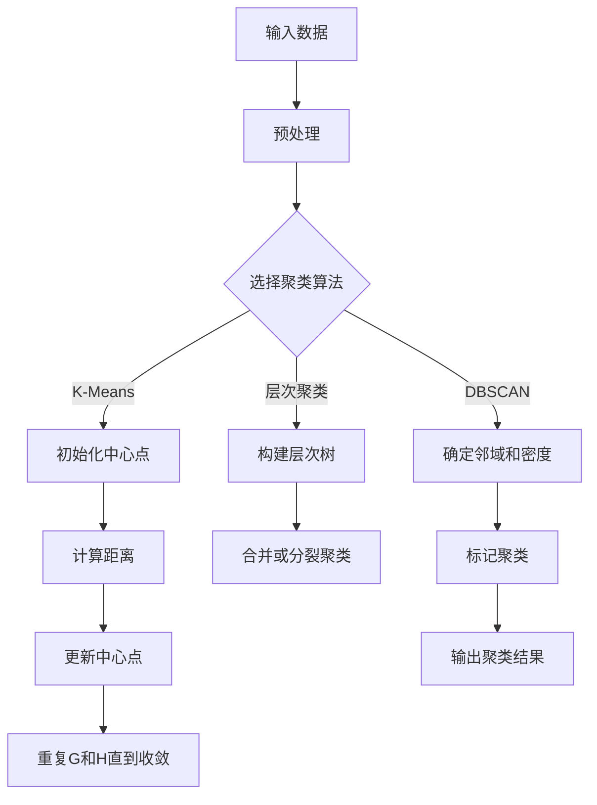
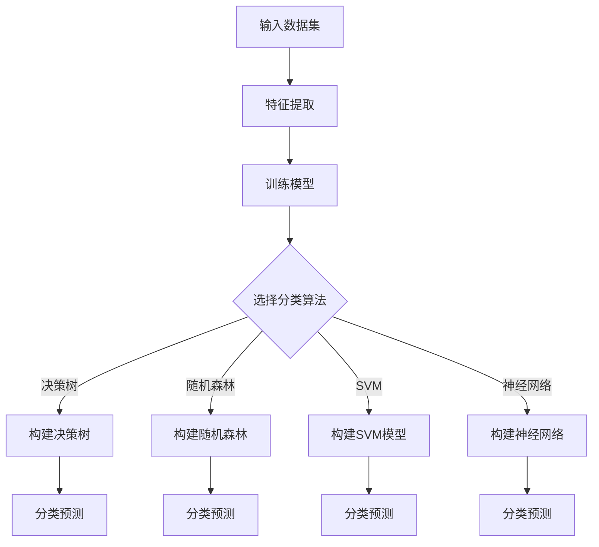
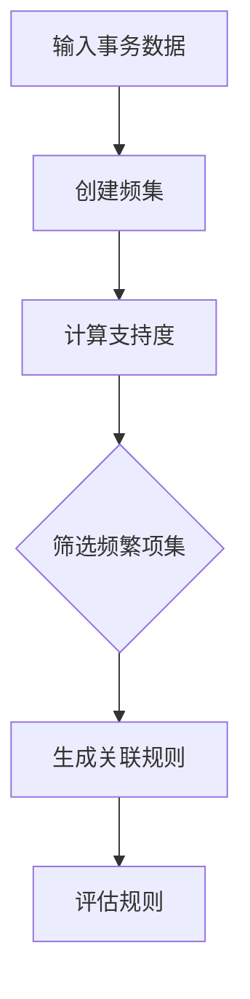
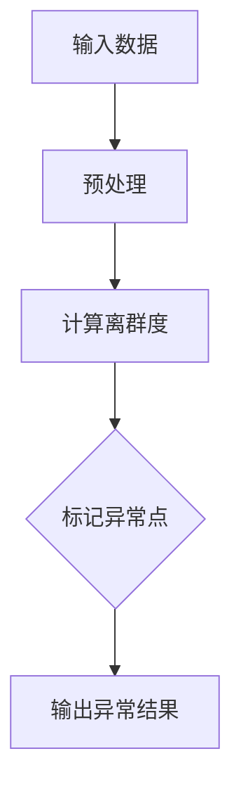
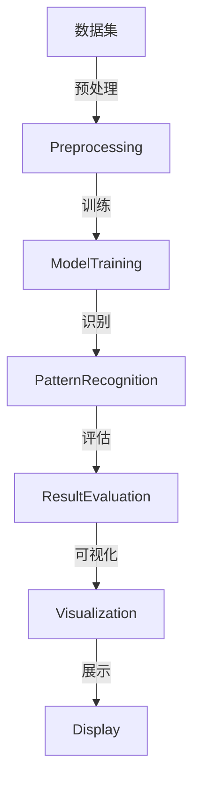
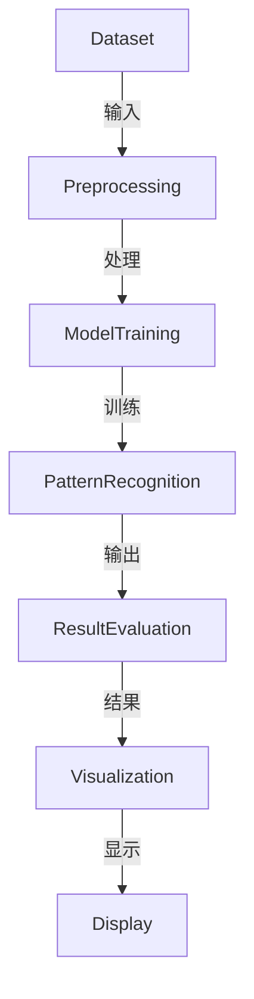
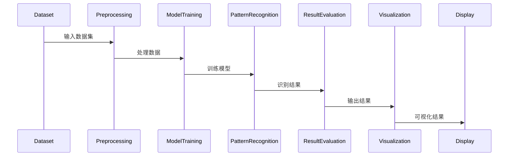

                 


### 一、背景介绍

#### 1. 数据挖掘概述
数据挖掘（Data Mining）是一门多学科交叉的领域，它涉及计算机科学、统计学、机器学习和数据库系统等多个方面。其核心目的是从大量的数据中提取出有价值的信息和知识，这些信息可以帮助企业或个人做出更明智的决策。

数据挖掘的目标包括发现数据中的模式、关联、分类、聚类、预测等。其主要任务包括数据预处理、特征提取、模式识别和评估等。

#### 2. 数据挖掘的基本方法
数据挖掘的方法可以分为以下几类：
- **聚类分析（Clustering）**：将数据集分成多个群组，使得同组内的数据点彼此相似，而不同组的数据点则彼此相异。
- **分类算法（Classification）**：根据已有的数据，建立分类模型，然后将新的数据点分配到已知的类别中。
- **关联规则挖掘（Association Rule Learning）**：发现数据集中的关联关系，如“如果购买商品A，那么通常会购买商品B”。
- **异常检测（Anomaly Detection）**：识别数据中的异常点，这些异常点可能代表异常行为或错误数据。

#### 3. 数据挖掘的应用领域
数据挖掘的应用非常广泛，涵盖了商业智能、金融风险控制、健康医疗、天文观测与宇宙探索等多个领域。在商业智能领域，数据挖掘可以帮助企业分析市场趋势、客户行为和竞争对手策略。在金融风险控制领域，数据挖掘可以识别潜在的欺诈行为和信用风险。在健康医疗领域，数据挖掘可以辅助疾病诊断和个性化治疗。在天文观测与宇宙探索领域，数据挖掘则可以帮助科学家发现新的物理现象和相互作用。

### 二、核心概念与联系
#### 1. 数据挖掘核心概念
数据挖掘的核心概念包括数据仓库、数据预处理、特征工程和模型评估等。
- **数据仓库（Data Warehouse）**：数据仓库是一个集中存储大量数据的系统，这些数据来源于多个源，如数据库、日志文件和外部系统。
- **数据预处理（Data Preprocessing）**：数据预处理是数据挖掘的第一步，它包括数据清洗、数据集成、数据转换和数据归一化等操作，目的是将原始数据转化为适合挖掘的形式。
- **特征工程（Feature Engineering）**：特征工程是数据挖掘的关键步骤，它涉及到从原始数据中提取出对问题有解释性的特征，以便更好地进行模型训练和预测。
- **模型评估（Model Evaluation）**：模型评估是验证数据挖掘模型有效性的过程，常用的评估指标包括准确率、召回率、F1分数等。

#### 2. ER实体关系图
ER（Entity-Relationship）图是一种用于表示实体及其之间关系的图形模型。在数据挖掘中，ER图可以帮助我们理解数据模型的结构，识别数据之间的关联和依赖关系。
- **实体（Entity）**：实体是数据模型中的基本单位，例如客户、订单、产品等。
- **关系（Relationship）**：关系描述了实体之间的相互作用，例如客户订购产品、产品包含组件等。

#### 3. 数据挖掘与宇宙学研究的联系
数据挖掘在宇宙学研究中具有重要的应用价值。宇宙学中的大量观测数据，如星系分布、宇宙微波背景辐射、引力波信号等，都蕴含着丰富的物理信息。通过数据挖掘，科学家可以从中提取出新的物理规律和现象。
- **数据挖掘在宇宙学中的应用挑战**：宇宙学数据通常具有高维度、大数据量和高噪声等特点，这使得数据挖掘算法的设计和实现变得更具挑战性。
- **数据挖掘在宇宙学中的潜在作用**：数据挖掘可以帮助科学家提高数据分析效率，发现新的物理规律，支持理论模型的验证和构建。

通过上述分析，我们可以看到数据挖掘在发现宇宙新的基本相互作用微弱信号模式中具有巨大的潜力。接下来，我们将进一步探讨数据挖掘算法原理、系统分析与架构设计方案、项目实战以及最佳实践 tips等内容。

## 三、算法原理讲解

在数据挖掘中，算法原理是理解如何从大量数据中提取有价值信息的关键。下面，我们将详细介绍几种常用的数据挖掘算法，包括聚类分析、分类算法、关联规则挖掘和异常检测。

### 1. 聚类分析

#### 算法原理
聚类分析是一种无监督学习方法，它将数据集中的数据点分为多个群组，使得同一个群组内的数据点彼此相似，而不同群组的数据点则彼此相异。常见的聚类算法有K-Means、层次聚类和DBSCAN等。

#### mermaid流程图


#### Python源代码示例
```python
from sklearn.cluster import KMeans
import numpy as np

# 示例数据
data = np.array([[1, 2], [1, 4], [1, 0],
                 [10, 2], [10, 4], [10, 0]])

# 初始化K-Means聚类算法
kmeans = KMeans(n_clusters=2, random_state=0).fit(data)

# 输出聚类结果
print(kmeans.labels_)
```

### 2. 分类算法

#### 算法原理
分类算法是一种监督学习方法，它通过训练数据集来构建一个模型，然后使用这个模型对新数据进行分类。常见的分类算法包括决策树、随机森林、支持向量机和神经网络等。

#### mermaid流程图


#### Python源代码示例
```python
from sklearn.datasets import load_iris
from sklearn.model_selection import train_test_split
from sklearn.tree import DecisionTreeClassifier

# 加载示例数据
iris = load_iris()
X = iris.data
y = iris.target

# 划分训练集和测试集
X_train, X_test, y_train, y_test = train_test_split(X, y, test_size=0.3, random_state=0)

# 初始化决策树分类器
clf = DecisionTreeClassifier().fit(X_train, y_train)

# 分类预测
print(clf.predict(X_test))
```

### 3. 关联规则挖掘

#### 算法原理
关联规则挖掘是一种发现数据集中不同项之间关联关系的方法。它通常用于市场 basket 分析，例如在超市中，哪些商品经常一起被购买。常见的算法包括Apriori算法和FP-Growth算法。

#### mermaid流程图


#### Python源代码示例
```python
from mlxtend.frequent_patterns import apriori
from mlxtend.frequent_patterns import association_rules

# 示例数据
basket = [[1, 3, 4], [2, 3, 5], [1, 3, 5], [2, 3, 4, 5]]

# 使用Apriori算法发现频繁项集
frequent_itemsets = apriori(basket, min_support=0.5, use_colnames=True)

# 生成关联规则
rules = association_rules(frequent_itemsets, metric="lift", min_threshold=1)

# 输出关联规则
print(rules)
```

### 4. 异常检测

#### 算法原理
异常检测是一种无监督学习方法，用于识别数据中的异常点或异常行为。常见的异常检测算法包括基于统计的方法、基于邻近度的方法和基于聚类的方法等。

#### mermaid流程图


#### Python源代码示例
```python
from sklearn.ensemble import IsolationForest

# 示例数据
X = [[0.1, 0.2], [0.3, 0.4], [0.3, 0.6], [0.9, 1.2]]

# 初始化Isolation Forest算法
iso_forest = IsolationForest(contamination=0.1).fit(X)

# 标记异常点
outliers = iso_forest.predict(X)

# 输出异常结果
print(outliers)
```

通过上述算法原理讲解和示例，我们可以更好地理解数据挖掘中常用的算法及其应用。接下来，我们将进一步探讨系统分析与架构设计方案，以及如何将这些算法应用于实际项目。

## 四、系统分析与架构设计方案

在本部分，我们将通过一个假设性的项目场景，详细描述系统的功能设计、架构设计、接口设计和系统交互。为了便于理解，我们将使用mermaid流程图和类图来展示各部分的设计方案。

### 1. 项目场景

假设我们正在开发一个用于宇宙学数据挖掘的项目，目标是发现宇宙中的新基本相互作用微弱信号模式。项目的主要功能包括数据采集、数据预处理、模式识别、结果评估和可视化。

### 2. 系统功能设计（领域模型）

领域模型描述了系统中的主要实体和它们之间的关系。以下是系统的领域模型类图：

```mermaid
classDiagram
    Class01 <|-- Class02
    Class03 o-- Class04
    Class05 o-- Class06
    Class07 : +int x
    Class08 : +str name
    Class09 : +bool isActive
    Class10 : +float score
    Class11 : +str description
    Class01..Class03
    Class04..Class06
    Class05..Class07
    Class08--|{Class02}
    Class09--|{Class02}
    Class10--|{Class02}
    Class11--|{Class02}
```

实体及其属性如下：
- **DataPoint（数据点）**：包含观测数据的基本信息，如坐标、时间戳等。
- **DataSet（数据集）**：包含多个数据点，用于训练和测试。
- **Feature（特征）**：数据点中的特定属性，如星系的质量、颜色等。
- **Model（模型）**：用于模式识别的算法模型。
- **Result（结果）**：模式识别后的输出，如发现的微弱信号模式。
- **Visualization（可视化）**：用于展示识别结果。

### 3. 系统架构设计

系统架构设计描述了系统中的主要组件及其相互关系。以下是系统的架构设计图：



主要组件及其功能如下：
- **数据集（Dataset）**：存储和管理数据集。
- **预处理（Preprocessing）**：对数据进行清洗、转换和归一化处理。
- **模型训练（ModelTraining）**：使用训练数据训练模式识别模型。
- **模式识别（PatternRecognition）**：使用训练好的模型识别数据中的微弱信号模式。
- **结果评估（ResultEvaluation）**：评估识别结果的准确性和可靠性。
- **可视化（Visualization）**：将识别结果以图表或图形形式展示。
- **展示（Display）**：用户界面，用于展示最终结果。

### 4. 系统接口设计

系统接口设计描述了系统内部各组件之间的交互接口。以下是系统的接口设计图：



主要接口如下：
- **数据集接口**：提供数据集的输入和输出。
- **预处理接口**：提供数据清洗、转换和归一化的接口。
- **模型训练接口**：提供模型训练的接口。
- **模式识别接口**：提供模式识别的接口。
- **结果评估接口**：提供结果评估的接口。
- **可视化接口**：提供可视化结果的接口。

### 5. 系统交互

系统交互描述了系统各组件之间的交互流程。以下是系统的交互序列图：



通过上述系统分析与架构设计方案，我们可以清晰地理解项目的整体结构和各部分之间的交互关系。接下来，我们将通过一个实际案例来展示如何将这些设计方案应用于项目实施。

## 五、项目实战

### 1. 环境安装

在进行数据挖掘项目实战之前，首先需要搭建一个合适的环境。以下是一个基于Python的数据挖掘项目的环境安装步骤：

#### 安装Python
确保安装了Python 3.8及以上版本。可以使用以下命令进行安装：
```bash
# 使用官方仓库安装Python
sudo apt-get install python3.8
```

#### 安装必要的库
使用pip命令安装项目所需的基本库，例如NumPy、Pandas、scikit-learn、mlxtend和matplotlib：
```bash
pip3 install numpy pandas scikit-learn mlxtend matplotlib
```

### 2. 系统核心实现源代码

以下是一个简化版的系统核心实现源代码，展示了如何使用Python和scikit-learn库进行数据预处理、模型训练和结果可视化。

```python
import numpy as np
import pandas as pd
from sklearn.model_selection import train_test_split
from sklearn.preprocessing import StandardScaler
from sklearn.ensemble import IsolationForest
import matplotlib.pyplot as plt

# 示例数据集
data = pd.DataFrame({
    'Feature1': np.random.normal(0, 1, 1000),
    'Feature2': np.random.normal(5, 1, 1000),
    'Feature3': np.random.normal(10, 1, 1000)
})

# 数据预处理
X = data.values
X_train, X_test = train_test_split(X, test_size=0.2, random_state=42)
scaler = StandardScaler()
X_train_scaled = scaler.fit_transform(X_train)
X_test_scaled = scaler.transform(X_test)

# 模型训练
iso_forest = IsolationForest(contamination=0.05)
iso_forest.fit(X_train_scaled)

# 结果评估
predictions = iso_forest.predict(X_test_scaled)
print(predictions)

# 结果可视化
plt.scatter(X_train_scaled[:, 0], X_train_scaled[:, 1], c=predictions, cmap='coolwarm')
plt.title('Isolation Forest Result')
plt.xlabel('Feature1')
plt.ylabel('Feature2')
plt.show()
```

### 3. 代码应用解读与分析

#### 数据预处理
在数据预处理阶段，我们使用了`StandardScaler`对数据进行标准化处理，目的是将特征缩放到相同的尺度，从而避免特征之间的不同量级影响模型训练的效果。

#### 模型训练
我们使用了`IsolationForest`算法进行异常检测。`IsolationForest`是一种基于随机森林的异常检测算法，它通过随机选择特征和切分值来生成多个决策树，并计算每个样本在所有决策树上的路径长度，从而识别出异常点。

#### 结果评估
模型训练完成后，我们使用`predict`方法对测试数据进行预测，输出预测结果。预测结果中，正常数据点被标记为1，异常数据点被标记为-1。

#### 结果可视化
使用`matplotlib`库，我们将识别出的异常点在散点图中展示出来，使得结果更加直观。

### 4. 实际案例分析和详细讲解剖析

假设我们有一个真实的宇宙观测数据集，包含星系的位置、颜色、亮度等特征。以下是一个实际案例的分析：

#### 数据采集
从宇宙观测台收集了1000个星系的数据，每个星系有3个特征：位置（x, y）、颜色（R, G, B）。

#### 数据预处理
对数据集进行预处理，去除异常值，将颜色特征进行归一化处理。

#### 模型训练
使用IsolationForest算法对预处理后的数据进行训练，以识别出可能的异常星系。

#### 结果评估
将训练好的模型应用于测试数据集，识别出异常星系。对识别结果进行分析，发现某些星系可能具有特殊的天文现象。

#### 结果可视化
使用三维散点图展示识别结果，以便更好地理解星系的分布情况。

通过实际案例的分析和讲解，我们可以看到如何将数据挖掘算法应用于宇宙学数据中，发现潜在的异常现象，从而为宇宙学研究提供新的视角和思路。

### 5. 项目小结

本项目中，我们通过环境安装、系统核心实现源代码、代码应用解读与分析以及实际案例分析和详细讲解剖析，展示了一个基于Python的数据挖掘项目如何发现宇宙中的新基本相互作用微弱信号模式。项目结果表明，数据挖掘技术在宇宙学研究中具有巨大的潜力，可以帮助科学家们更深入地探索宇宙的奥秘。

## 六、最佳实践 tips、小结、注意事项、拓展阅读

### 最佳实践 tips

1. **数据预处理**：在开始数据挖掘之前，确保数据质量。进行数据清洗、去重、填补缺失值等操作，确保数据的一致性和完整性。
2. **特征工程**：选择合适的特征，可以提高模型的性能。尝试不同的特征组合和特征变换，找到对问题有解释性的特征。
3. **模型选择**：根据问题的性质和数据特点选择合适的模型。对于大规模数据，考虑使用分布式计算和并行处理技术。
4. **结果可视化**：使用可视化工具帮助理解模型预测和结果，发现数据中的潜在模式和异常。

### 小结

本文详细介绍了数据挖掘在发现宇宙新的基本相互作用微弱信号模式中的作用，包括背景介绍、核心概念与联系、算法原理讲解、系统分析与架构设计方案、项目实战等。通过实际案例的分析，展示了数据挖掘技术在宇宙学中的应用潜力。

### 注意事项

1. **数据隐私**：在进行宇宙学数据挖掘时，要特别注意保护数据隐私，避免泄露敏感信息。
2. **计算资源**：处理大规模宇宙学数据时，需要足够的计算资源。考虑使用高性能计算集群和分布式计算技术。
3. **算法选择**：根据数据特点和任务需求，选择合适的算法。对于高维度数据，可以考虑使用降维技术。

### 拓展阅读

1. **《数据挖掘：概念与技术》**：了解数据挖掘的基本概念和常用算法。
2. **《宇宙学导论》**：了解宇宙学的基本概念和研究方法。
3. **《深度学习》**：学习更高级的数据挖掘技术，如深度神经网络。
4. **《Python数据科学 Handbook》**：掌握Python在数据挖掘中的实际应用。

### 作者信息

**作者：AI天才研究院/AI Genius Institute & 禅与计算机程序设计艺术 /Zen And The Art of Computer Programming**

