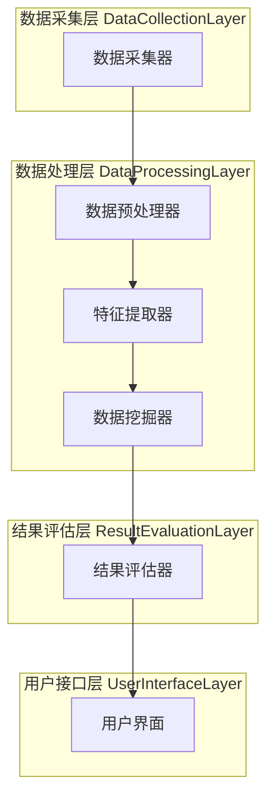
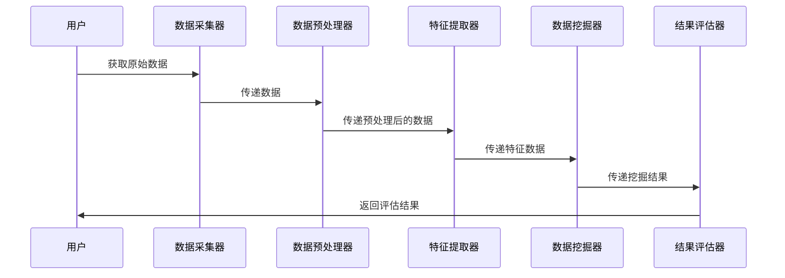

                 

### 第1章：数据挖掘与宇宙新粒子的发现

#### 引言

在当今科技迅猛发展的时代，宇宙的奥秘正逐渐被揭开。然而，宇宙新粒子的发现并非易事。这需要科学家们运用各种先进的技术手段来探索宇宙的微观世界。数据挖掘作为一种智能数据分析方法，已广泛应用于各个领域，从商业到医疗，再到金融。那么，数据挖掘如何帮助科学家们发现宇宙中的新粒子呢？本文将深入探讨这一问题。

##### 问题背景

宇宙中的新粒子是物理学研究的重要方向。这些粒子通常具有非常微小的质量和独特的性质，因此，它们的发现对于理解宇宙的基本结构和物理学基本定律具有重要意义。然而，宇宙中粒子的种类繁多，且它们的存在形式复杂，传统的研究方法难以捕捉这些微小粒子的特征。这就需要一种更加智能、高效的数据分析方法——数据挖掘。

##### 问题描述

数据挖掘在宇宙粒子探测中的应用主要体现在以下几个方面：

1. **海量数据处理**：宇宙探测器收集的数据量庞大，数据挖掘技术能够对这些海量数据进行高效处理，提取有价值的信息。
2. **异常检测**：数据挖掘中的异常检测技术可以帮助科学家识别出数据中的异常值，这些异常值可能代表了新粒子的存在。
3. **关联规则挖掘**：通过数据挖掘中的关联规则挖掘技术，科学家可以探索不同粒子之间的潜在关系，从而推断出新粒子的可能性质。
4. **聚类分析**：数据挖掘中的聚类分析技术可以帮助科学家将相似的粒子分组，从而发现新粒子的特征。

##### 问题解决

数据挖掘方法在宇宙粒子探测中的实际应用主要包括以下步骤：

1. **数据收集**：从宇宙探测器获取原始数据，包括粒子能量、速度、方向等。
2. **数据预处理**：对收集到的数据进行清洗、去噪、归一化等处理，使其适合于数据挖掘算法。
3. **特征提取**：从预处理后的数据中提取出对粒子识别有用的特征。
4. **数据挖掘**：使用各种数据挖掘算法，如聚类分析、关联规则挖掘、神经网络等，对特征数据进行处理，寻找新粒子的特征。
5. **结果评估**：对数据挖掘的结果进行评估，判断是否发现了新粒子。

##### 边界与外延

数据挖掘在宇宙研究中的适用性和局限性如下：

1. **适用性**：数据挖掘可以处理海量数据，发现数据中的潜在模式，有助于科学家探索宇宙的新粒子。
2. **局限性**：数据挖掘技术依赖于数据的质量和算法的准确性，如果数据质量差或算法选择不当，可能导致误判。

##### 概念结构与核心要素组成

数据挖掘在宇宙新粒子发现中的概念结构主要包括以下几个核心要素：

1. **数据源**：宇宙探测器收集的数据。
2. **数据预处理**：清洗、去噪、归一化等处理。
3. **特征提取**：从数据中提取对粒子识别有用的特征。
4. **数据挖掘算法**：如聚类分析、关联规则挖掘、神经网络等。
5. **结果评估**：评估数据挖掘结果的准确性。

#### 数据挖掘的概念与过程

数据挖掘是一种从大量数据中自动发现有趣模式和规则的过程，其目标是从数据中发现隐藏的、未知的、潜在的信息，以帮助决策和支持分析。

##### 数据挖掘的定义

数据挖掘（Data Mining）是指从大量的数据中通过算法和统计方法提取出有价值的信息和知识的过程。数据挖掘广泛应用于各种领域，如商业、金融、医疗、气象等。

##### 数据挖掘的过程

数据挖掘的过程主要包括以下几个阶段：

1. **数据预处理**：这是数据挖掘的重要前提。在数据预处理阶段，需要对原始数据进行清洗、去噪、归一化等处理，使其适合于数据挖掘算法。
   
2. **模式识别**：在数据预处理之后，使用各种数据挖掘算法来识别数据中的模式。模式可以是简单的统计规律，也可以是复杂的关联规则。

3. **结果评估**：对挖掘出的模式进行评估，判断其是否具有实际价值。评估方法包括准确率、召回率、F1值等。

4. **可视化**：将挖掘出的模式可视化，以便更好地理解和解释。

##### 数据挖掘技术

数据挖掘涉及多种技术，主要包括以下几种：

1. **机器学习**：机器学习通过构建模型来识别数据中的模式和关系。常见的机器学习算法有线性回归、决策树、支持向量机、神经网络等。

2. **深度学习**：深度学习是一种特殊的机器学习方法，通过多层神经网络来提取特征。深度学习在图像识别、语音识别等领域取得了显著的成果。

3. **聚类分析**：聚类分析是一种无监督学习方法，用于将数据集分为多个组，组内的数据点相似度较高，而组间的数据点相似度较低。常见的聚类算法有K-means、层次聚类等。

4. **关联规则挖掘**：关联规则挖掘用于发现数据中的潜在关系。它通过生成关联规则，例如“如果购买商品A，则很可能购买商品B”。

5. **异常检测**：异常检测用于识别数据中的异常值。这些异常值可能代表了新粒子的存在。

##### 数据挖掘的应用领域

数据挖掘的应用领域非常广泛，主要包括以下几个方面：

1. **商业**：数据挖掘在商业分析中用于市场细分、客户行为预测、产品推荐等。

2. **金融**：数据挖掘在金融领域用于风险评估、欺诈检测、投资组合优化等。

3. **医疗**：数据挖掘在医疗领域用于疾病预测、患者分类、药物发现等。

4. **气象**：数据挖掘在气象领域用于天气预测、气候分析等。

5. **交通**：数据挖掘在交通领域用于交通流量预测、交通拥堵分析等。

#### 数据挖掘中的挑战与机遇

##### 数据量庞大与多样化

随着互联网和物联网的发展，数据量呈爆炸式增长。如何高效地处理这些海量数据，成为数据挖掘面临的巨大挑战。此外，数据的类型也越来越多样化，包括结构化数据、半结构化数据和非结构化数据。这要求数据挖掘算法能够适应不同类型的数据。

##### 数据质量与完整性

数据质量是数据挖掘成功的关键。数据挖掘依赖于高质量的数据，如果数据存在噪声、缺失或错误，将严重影响挖掘结果的准确性。因此，数据预处理和质量保证是数据挖掘的重要环节。

##### 算法复杂性与效率

随着数据规模的扩大，数据挖掘算法的复杂性和计算成本也在增加。如何设计高效、可扩展的数据挖掘算法，成为研究者和开发者面临的重要问题。

##### 挑战与机遇

尽管数据挖掘面临诸多挑战，但它也为科学家和研究人员提供了前所未有的机遇：

1. **发现新的知识**：数据挖掘可以帮助科学家从海量数据中发现新的知识，揭示数据中的潜在规律和模式。

2. **辅助决策**：数据挖掘提供的数据分析和预测结果，可以为科学家和决策者提供有力的支持。

3. **推动技术创新**：数据挖掘技术的发展，可以推动相关领域的科技进步。

4. **跨界应用**：数据挖掘技术在不同领域的广泛应用，促进了各学科的交叉融合。

##### 总结

数据挖掘作为一种智能数据分析方法，在宇宙粒子探测中发挥着重要作用。通过数据挖掘，科学家们可以更高效地处理海量数据，发现宇宙中的新粒子。然而，数据挖掘也面临许多挑战，如数据量庞大、数据质量差等。只有通过不断技术创新和优化，数据挖掘技术才能在宇宙探索中发挥更大的作用。

## 第2章：数据挖掘的基本概念与联系

#### 数据挖掘的基本概念

数据挖掘（Data Mining）是指从大量数据中通过算法和统计方法提取出有价值的信息和知识的过程。数据挖掘的核心目标是发现数据中的潜在模式、规律和关联，从而为决策提供支持。

##### 数据挖掘的定义与目标

- **定义**：数据挖掘是一种跨学科的方法，结合了统计学、机器学习、数据库管理和信息检索等领域的知识，通过分析大量数据，提取出有价值的信息。
- **目标**：数据挖掘的目标是发现数据中的隐藏模式、趋势和关联，从而支持决策、优化业务流程和发现新的知识。

##### 数据挖掘的方法与技术

数据挖掘涉及多种方法和技术，主要包括以下几种：

1. **机器学习**：通过构建模型，自动识别数据中的模式和关系。常见的机器学习算法有线性回归、决策树、支持向量机、神经网络等。
2. **深度学习**：一种特殊的机器学习方法，通过多层神经网络来提取特征。深度学习在图像识别、语音识别等领域取得了显著的成果。
3. **聚类分析**：将数据集分为多个组，组内的数据点相似度较高，而组间的数据点相似度较低。常见的聚类算法有K-means、层次聚类等。
4. **关联规则挖掘**：发现数据中的潜在关系，通过生成关联规则，例如“如果购买商品A，则很可能购买商品B”。
5. **异常检测**：识别数据中的异常值，这些异常值可能代表了新粒子的存在。

##### 数据挖掘的应用领域

数据挖掘的应用领域非常广泛，主要包括以下几个方面：

1. **商业**：用于市场细分、客户行为预测、产品推荐等。
2. **金融**：用于风险评估、欺诈检测、投资组合优化等。
3. **医疗**：用于疾病预测、患者分类、药物发现等。
4. **气象**：用于天气预测、气候分析等。
5. **交通**：用于交通流量预测、交通拥堵分析等。

#### 数据挖掘技术的属性特征对比

不同数据挖掘技术具有不同的属性特征，适用于不同的应用场景。以下是对几种常见数据挖掘技术的属性特征对比：

##### 机器学习

- **优点**：强大的建模能力，能够处理复杂的问题。
- **缺点**：对数据质量和数量有较高要求，训练过程可能很耗时。
- **适用场景**：预测分析、分类、聚类等。

##### 深度学习

- **优点**：能够自动提取深层特征，对大规模数据有很好的适应性。
- **缺点**：计算资源需求高，模型复杂，解释性较差。
- **适用场景**：图像识别、语音识别、自然语言处理等。

##### 聚类分析

- **优点**：无监督学习方法，能够发现数据中的隐含结构和模式。
- **缺点**：对初始聚类中心敏感，可能陷入局部最优。
- **适用场景**：数据降维、异常检测、市场细分等。

##### 关联规则挖掘

- **优点**：能够发现数据中的潜在关系，适用于购物篮分析等。
- **缺点**：对数据量有较高要求，规则数量可能非常庞大。
- **适用场景**：推荐系统、市场篮分析、客户行为分析等。

##### 异常检测

- **优点**：能够发现数据中的异常值，对潜在的安全威胁和异常行为有预警作用。
- **缺点**：对噪声数据敏感，可能产生误报。
- **适用场景**：金融欺诈检测、网络安全监控、医疗诊断等。

##### 对比表格

以下是一个简单的对比表格，展示了这些数据挖掘技术的属性特征：

| 技术       | 优点                                     | 缺点                                      | 适用场景                      |
|------------|------------------------------------------|-------------------------------------------|------------------------------|
| 机器学习   | 强大的建模能力                          | 对数据质量和数量有较高要求                | 预测分析、分类、聚类等        |
| 深度学习   | 能够自动提取深层特征，对大规模数据有很好的适应性 | 计算资源需求高，模型复杂，解释性较差 | 图像识别、语音识别、自然语言处理等 |
| 聚类分析   | 无监督学习方法，能够发现数据中的隐含结构和模式 | 对初始聚类中心敏感，可能陷入局部最优 | 数据降维、异常检测、市场细分等     |
| 关联规则挖掘 | 能够发现数据中的潜在关系                | 对数据量有较高要求，规则数量可能非常庞大 | 推荐系统、市场篮分析、客户行为分析等 |
| 异常检测   | 能够发现数据中的异常值，对潜在的安全威胁和异常行为有预警作用 | 对噪声数据敏感，可能产生误报 | 金融欺诈检测、网络安全监控、医疗诊断等 |

#### 数据挖掘中的ER实体关系图

实体-关系模型（Entity-Relationship，ER模型）是数据库设计中常用的一种概念模型，用于表示实体以及实体之间的关系。在数据挖掘中，ER模型可以帮助我们理解数据结构，识别数据中的关键要素和关系。

##### 实体-关系模型（ER模型）

- **实体（Entity）**：具有共同属性的对象集合。例如，在数据挖掘项目中，实体可以是数据集中的数据点、用户、产品等。
- **属性（Attribute）**：实体的特征。例如，数据点中的属性可以是年龄、性别、收入等。
- **关系（Relationship）**：实体之间的关联。例如，在电子商务数据集中，用户与产品之间存在购买关系。

##### 数据挖掘中的实体与关系

在数据挖掘中，实体和关系具有以下特点：

1. **数据点**：数据挖掘中的实体通常是数据集中的每个数据点，每个数据点包含多个属性。
2. **特征**：数据点的属性是数据挖掘中的重要特征，它们决定了数据点在挖掘过程中的表现。
3. **关联**：数据点之间的关系可以是直接的，如用户与产品之间的购买关系，也可以是间接的，如通过聚类分析发现的潜在关系。

##### ER实体关系图

ER实体关系图是使用图形化方式表示ER模型的工具。以下是一个简单的ER实体关系图的示例，展示了数据挖掘中的关键要素和关系：

```mermaid
erDiagram
  User ||--|{ Purchase }|-- Product
  User ||--|{ View }|-- Product
  Product ||--|{ Contains }|-- Feature
  Feature ||--|{ RatedBy }|-- User
```

在这个ER实体关系图中：

- **User**（用户）是实体。
- **Purchase**（购买）、**View**（查看）、**Contains**（包含）和**RatedBy**（评价）是关系。
- **Product**（产品）和**Feature**（特征）也是实体。

通过ER实体关系图，我们可以清晰地看到数据挖掘中各个要素之间的关系，这有助于我们更好地理解数据结构，从而更有效地进行数据挖掘。

#### 总结

本章介绍了数据挖掘的基本概念和联系，包括数据挖掘的定义、目标、方法与技术，以及ER实体关系图在数据挖掘中的应用。通过本章的学习，读者可以了解数据挖掘的基本原理和应用场景，为进一步深入探讨数据挖掘在宇宙新粒子发现中的应用打下基础。

## 第3章：算法原理讲解

### 3.1 神经网络

神经网络（Neural Networks）是一种模仿人脑神经元结构和工作方式的计算模型。在数据挖掘和机器学习中，神经网络广泛应用于分类、回归、聚类等多种任务。

#### 神经网络的基本概念

- **神经元**：神经网络的基本构建单元，类似于人脑中的神经元。每个神经元接收多个输入信号，并通过权重和偏置进行加权求和处理，最后通过激活函数输出结果。
- **层**：神经网络由多个层次组成，包括输入层、隐藏层和输出层。输入层接收外部输入数据，隐藏层对输入数据进行处理，输出层产生最终的输出。
- **权重和偏置**：权重（weights）是神经元之间的连接权重，用于调整输入信号的强度。偏置（bias）是一个额外的输入，可以调整神经元的阈值。

#### 神经网络的结构与工作原理

一个典型的神经网络结构包括以下几个部分：

1. **输入层（Input Layer）**：接收外部输入数据，每个输入数据对应一个神经元。
2. **隐藏层（Hidden Layers）**：一个或多个隐藏层，每个隐藏层的神经元对输入数据进行处理和变换。
3. **输出层（Output Layer）**：产生最终的输出结果。

神经网络的工作原理如下：

1. **前向传播（Forward Propagation）**：输入数据从输入层传递到隐藏层，每层的神经元对输入数据进行加权求和处理，并将结果传递到下一层。这个过程重复进行，直到输出层得到最终的输出结果。
2. **反向传播（Backpropagation）**：在输出层得到预测结果后，计算预测结果与真实结果的误差。然后，将这些误差反向传播回隐藏层和输入层，通过梯度下降法调整权重和偏置，使预测结果更接近真实值。

#### 神经网络的训练过程

神经网络的训练过程主要包括以下几个步骤：

1. **初始化权重和偏置**：随机初始化权重和偏置，以避免模型过于拟合或欠拟合。
2. **前向传播**：将输入数据传递到神经网络，计算每个神经元的输出。
3. **计算损失函数**：使用损失函数（如均方误差、交叉熵等）计算预测结果与真实结果之间的误差。
4. **反向传播**：根据损失函数的梯度，调整权重和偏置，使损失函数的值减小。
5. **迭代训练**：重复前向传播和反向传播的过程，直到满足训练条件（如达到预定迭代次数或损失函数值足够小）。

### 3.2 决策树

决策树（Decision Trees）是一种树形结构，通过一系列的判断规则来对数据进行分类或回归。在数据挖掘中，决策树广泛应用于分类和回归任务。

#### 决策树的基本概念

- **节点**：决策树中的每个节点表示一个特征或属性。
- **分支**：从节点延伸出的线表示可能的取值或类别。
- **叶节点**：决策树的末端节点，表示最终的分类结果或回归值。

#### 决策树的构建方法

决策树的构建方法主要包括以下步骤：

1. **选择最佳分割特征**：通过评估不同特征的增益率（Gini指数、信息增益等）来选择最佳分割特征。
2. **递归分割数据**：根据最佳分割特征，将数据集分割成多个子集，每个子集生成一个新的节点。
3. **重复步骤**：对每个子集重复上述步骤，直到满足终止条件（如达到最大深度、子集大小不足等）。

#### 决策树的剪枝与优化

决策树可能会产生过拟合，因此需要进行剪枝和优化：

1. **预剪枝**：在构建决策树的过程中提前停止，例如当子集大小小于阈值或增益率低于阈值时。
2. **后剪枝**：先构建完整的决策树，然后从叶节点开始逐层剪枝，保留具有最大信息增益的分支。

### 3.3 聚类分析

聚类分析（Clustering Analysis）是一种无监督学习方法，用于将数据集分为多个组，组内的数据点相似度较高，而组间的数据点相似度较低。聚类分析在数据挖掘中广泛应用于数据降维、异常检测、市场细分等领域。

#### 聚类分析的基本概念

- **簇（Cluster）**：一组相似的数据点。
- **相似度度量**：用于衡量数据点之间的相似程度，常见的相似度度量方法有欧氏距离、余弦相似度等。

#### 常见的聚类算法

1. **K-means算法**：一种基于距离度量的聚类算法，通过迭代优化聚类中心，将数据点分配到不同的簇。
   - **步骤**：
     1. 随机选择K个初始聚类中心。
     2. 计算每个数据点到聚类中心的距离，将其分配到最近的聚类中心。
     3. 重新计算聚类中心。
     4. 重复步骤2和3，直到聚类中心的变化小于阈值。

2. **层次聚类算法**：一种基于层次结构的聚类算法，通过递归地合并或分裂簇，构建一个层次聚类树。
   - **步骤**：
     1. 从每个数据点开始，将每个数据点视为一个簇。
     2. 计算相邻簇之间的距离，选择距离最近的两个簇合并为一个簇。
     3. 重复步骤2，直到满足终止条件（如达到最大簇数或簇之间的距离大于阈值）。

3. **DBSCAN算法**：一种基于密度的聚类算法，通过计算数据点之间的邻域密度，将具有高密度区域的数据点划分为一个簇。
   - **步骤**：
     1. 选择一个起始点，将其标记为已访问。
     2. 计算起始点的邻域内的数据点，将其标记为核心点。
     3. 计算核心点的邻域内的数据点，将其标记为边界点。
     4. 将核心点和边界点划分为一个簇。
     5. 重复步骤1到4，直到所有数据点都被访问。

#### 聚类分析的应用

聚类分析在数据挖掘中的应用包括：

1. **数据降维**：通过将高维数据聚类为低维数据，减少数据的维度，提高计算效率。
2. **异常检测**：通过识别数据中的异常聚类，发现潜在的安全威胁或异常行为。
3. **市场细分**：通过聚类分析，将潜在客户划分为不同的市场细分群体，制定更精准的营销策略。

### 总结

本章介绍了数据挖掘中常用的三种算法：神经网络、决策树和聚类分析。神经网络通过多层神经元模拟人脑的工作方式，决策树通过判断规则对数据进行分类或回归，聚类分析通过无监督学习将数据分为多个相似簇。这些算法在数据挖掘中具有广泛的应用，为科学家和研究人员提供了强大的工具，以探索宇宙中的新粒子。

## 第4章：数学模型和数学公式

在数据挖掘过程中，数学模型和数学公式扮演着至关重要的角色。它们不仅帮助我们理解算法的原理，还可以精确地描述算法的行为和性能。本章将详细讲解数据挖掘中常用的数学模型和数学公式，包括神经网络、决策树和聚类分析的相关数学描述。

### 4.1 神经网络的数学模型

神经网络的核心在于其数学模型，主要包括神经元的工作原理、前向传播和反向传播的计算过程。

#### 神经元的工作原理

一个简单的神经元可以表示为：

$$
a_i = \sum_{j} w_{ij} x_j + b_i
$$

其中，$a_i$ 表示第 $i$ 个神经元的输出，$w_{ij}$ 表示第 $j$ 个输入与第 $i$ 个神经元的权重，$x_j$ 表示第 $j$ 个输入，$b_i$ 表示第 $i$ 个神经元的偏置。

#### 前向传播

在前向传播过程中，每个神经元的输出可以通过以下激活函数计算：

$$
o_i = \sigma(a_i)
$$

其中，$\sigma$ 表示激活函数，常用的激活函数有：

1. **线性激活函数**：$o_i = a_i$
2. **Sigmoid函数**：$o_i = \frac{1}{1 + e^{-a_i}}$
3. **ReLU函数**：$o_i = max(0, a_i)$

#### 反向传播

反向传播是神经网络训练过程中的关键步骤。它通过计算损失函数关于权重的梯度，并利用梯度下降法更新权重和偏置。

假设我们的目标函数是 $J(\theta)$，其中 $\theta$ 包括所有权重和偏置。那么，损失函数的梯度可以表示为：

$$
\frac{\partial J(\theta)}{\partial \theta} = \nabla_\theta J(\theta)
$$

在反向传播中，我们需要计算每个权重和偏置的梯度。以下是简单的梯度计算示例：

$$
\frac{\partial J(\theta)}{\partial w_{ij}} = \sum_{l} (o_l - t_l) \cdot \frac{\partial a_l}{\partial w_{ij}}
$$

其中，$o_l$ 表示第 $l$ 层的输出，$t_l$ 表示第 $l$ 层的期望输出，$\frac{\partial a_l}{\partial w_{ij}}$ 表示前向传播过程中 $a_l$ 关于 $w_{ij}$ 的偏导数。

#### 示例

假设我们有一个简单的神经网络，包含一个输入层、一个隐藏层和一个输出层。输入层有2个神经元，隐藏层有3个神经元，输出层有1个神经元。激活函数使用ReLU函数。

1. **前向传播**：

$$
a_1 = \max(0, w_{11}x_1 + w_{12}x_2 + b_1)
$$

$$
a_2 = \max(0, w_{21}x_1 + w_{22}x_2 + b_2)
$$

$$
a_3 = \max(0, w_{31}x_1 + w_{32}x_2 + b_3)
$$

$$
o = w_{41}a_1 + w_{42}a_2 + w_{43}a_3 + b_4
$$

2. **反向传播**：

$$
\frac{\partial J(\theta)}{\partial w_{41}} = (o - t) \cdot a_1
$$

$$
\frac{\partial J(\theta)}{\partial w_{42}} = (o - t) \cdot a_2
$$

$$
\frac{\partial J(\theta)}{\partial w_{43}} = (o - t) \cdot a_3
$$

$$
\frac{\partial J(\theta)}{\partial b_4} = (o - t)
$$

### 4.2 决策树的数学模型

决策树是一种树形结构，通过一系列的判断规则来对数据进行分类或回归。在决策树中，每个内部节点表示一个特征，每个叶节点表示一个分类结果。

#### 决策树的构建

决策树的构建过程可以通过以下步骤进行：

1. **选择最佳分割特征**：通过评估不同特征的增益率（Gini指数、信息增益等）来选择最佳分割特征。
2. **分割数据**：根据最佳分割特征，将数据集分割成多个子集。
3. **递归构建**：对每个子集重复上述步骤，直到满足终止条件（如达到最大深度、子集大小不足等）。

#### 决策树的增益率

增益率是评估特征分割优劣的重要指标，可以表示为：

$$
Gini = 1 - \sum_{v} p_v (1 - p_v)
$$

其中，$p_v$ 表示特征 $v$ 的取值概率。

#### 示例

假设我们有一个二分类问题，特征 $A$ 有两个取值 $0$ 和 $1$，样本中 $0$ 的概率为 $0.6$，$1$ 的概率为 $0.4$。则 Gini 指数为：

$$
Gini = 1 - (0.6 \cdot (1 - 0.6) + 0.4 \cdot (1 - 0.4)) = 0.32
$$

### 4.3 聚类分析的数学模型

聚类分析是一种无监督学习方法，用于将数据集分为多个组，组内的数据点相似度较高，而组间的数据点相似度较低。常见的聚类算法包括K-means、层次聚类和DBSCAN。

#### K-means算法

K-means算法是一种基于距离度量的聚类算法，其目标是最小化簇内距离平方和。

1. **初始化**：随机选择 $K$ 个初始聚类中心。
2. **分配**：计算每个数据点到聚类中心的距离，将其分配到最近的聚类中心。
3. **更新**：重新计算聚类中心。
4. **重复**：重复步骤2和3，直到聚类中心的变化小于阈值。

#### K-means算法的数学描述

假设我们有 $N$ 个数据点 $x_1, x_2, ..., x_N$，每个数据点属于 $K$ 个聚类中心 $c_1, c_2, ..., c_K$。则每个数据点的分配概率可以表示为：

$$
P(x_i \in c_k) = \frac{1}{K} \sum_{j=1}^{K} e^{-\frac{||x_i - c_j||^2}{2\sigma^2}}
$$

其中，$\sigma$ 是方差，用于调整聚类中心之间的相似度。

#### 层次聚类算法

层次聚类算法通过递归地合并或分裂簇，构建一个层次聚类树。

1. **初始**：将每个数据点视为一个簇。
2. **合并**：计算相邻簇之间的距离，选择距离最近的两个簇合并为一个簇。
3. **递归**：对合并后的簇重复步骤2，直到满足终止条件（如达到最大簇数或簇之间的距离大于阈值）。

#### 层次聚类算法的数学描述

假设我们有 $K$ 个簇，第 $k$ 个簇的质心可以表示为：

$$
c_k = \frac{1}{N_k} \sum_{i=1}^{N_k} x_i
$$

其中，$N_k$ 表示第 $k$ 个簇的数据点数量。

两个簇之间的距离可以表示为：

$$
d(c_i, c_j) = \sqrt{\sum_{k=1}^{K} w_{ik} w_{jk}}
$$

其中，$w_{ik}$ 和 $w_{jk}$ 分别表示第 $i$ 个簇和第 $j$ 个簇的数据点与质心的相似度。

#### DBSCAN算法

DBSCAN（Density-Based Spatial Clustering of Applications with Noise）是一种基于密度的聚类算法，通过计算数据点之间的邻域密度，将具有高密度区域的数据点划分为一个簇。

1. **邻域计算**：选择邻域半径 $eps$，计算每个数据点的邻域。
2. **核心点计算**：判断数据点是否为核心点，即邻域内数据点的数量大于 $minPts$。
3. **簇生成**：根据核心点和边界点生成簇。

#### DBSCAN算法的数学描述

假设我们有 $N$ 个数据点 $x_1, x_2, ..., x_N$，邻域半径为 $eps$，最小核心点数量为 $minPts$。

1. **邻域计算**：

$$
N_{eps}(x_i) = \{ x_j \in \mathcal{X} : ||x_i - x_j|| \leq eps \}
$$

其中，$\mathcal{X}$ 表示数据点集合。

2. **核心点计算**：

$$
core\_point(x_i) = \begin{cases}
1 & \text{if } |N_{eps}(x_i)| > minPts \\
0 & \text{otherwise}
\end{cases}
$$

3. **簇生成**：

- 初始化簇标识为0。
- 对于每个未标记的数据点 $x_i$：
  - 如果 $x_i$ 是核心点，则标记为簇 $c$，并将 $x_i$ 的邻域内的所有点标记为簇 $c$。
  - 递归地处理邻域内的点，直到所有邻域内的点都被标记。

### 总结

本章详细介绍了神经网络、决策树和聚类分析的数学模型和数学公式。神经网络通过前向传播和反向传播计算神经元输出和权重梯度，决策树通过增益率评估特征分割优劣，聚类分析通过距离度量或密度计算聚类中心和数据点之间的关系。这些数学模型和公式为数据挖掘提供了理论基础，有助于深入理解各种算法的工作原理。

## 第5章：系统分析与架构设计方案

### 5.1 问题场景介绍

宇宙新粒子的发现是一项复杂的科学研究任务，涉及到大量的数据收集、处理和分析。为了有效地进行数据挖掘，需要设计一个完整的系统架构，包括数据采集、数据预处理、特征提取、数据挖掘和结果评估等环节。

在本项目中，我们的目标是通过数据挖掘技术发现宇宙中的新粒子。具体来说，我们使用宇宙探测器收集到的粒子碰撞数据，通过数据挖掘算法处理和分析这些数据，最终识别出新粒子的特征和存在形式。

### 5.2 系统功能设计

为了实现上述目标，我们设计了一个功能完善的系统，主要包括以下几个模块：

1. **数据采集模块**：从宇宙探测器获取原始数据，包括粒子能量、速度、方向等。
2. **数据预处理模块**：对原始数据进行清洗、去噪和归一化处理，使其适合数据挖掘算法。
3. **特征提取模块**：从预处理后的数据中提取出对粒子识别有用的特征。
4. **数据挖掘模块**：使用神经网络、决策树、聚类分析等算法对特征数据进行处理，寻找新粒子的特征。
5. **结果评估模块**：对数据挖掘结果进行评估，判断是否发现了新粒子。

以下是系统功能模块的Mermaid类图表示：

```mermaid
classDiagram
    DataCollection <<interface>>
    DataPreprocessing <<interface>>
    FeatureExtraction <<interface>>
    DataMining <<interface>>
    ResultEvaluation <<interface>>

    DataCollection <|-- DataPreprocessing
    DataPreprocessing <|-- FeatureExtraction
    FeatureExtraction <|-- DataMining
    DataMining <|-- ResultEvaluation
```

### 5.3 系统架构设计

系统架构设计是确保系统高效、可扩展和可靠的关键。为了满足项目需求，我们设计了一个分布式系统架构，包括以下几个部分：

1. **数据采集层**：负责从宇宙探测器获取原始数据。
2. **数据处理层**：包括数据预处理模块、特征提取模块和数据挖掘模块，负责对数据进行处理和分析。
3. **结果评估层**：负责对数据挖掘结果进行评估，判断是否发现了新粒子。
4. **用户接口层**：提供用户交互界面，用户可以通过该界面查看数据挖掘结果和分析报告。

以下是系统架构的Mermaid架构图表示：



### 5.4 系统接口设计

系统接口设计是确保各模块之间能够有效通信和协作的关键。在本系统中，我们设计了一套RESTful API，用于各模块之间的数据传输和功能调用。以下是部分接口设计示例：

1. **数据采集接口**：用于从宇宙探测器获取原始数据。

```json
GET /api/data/collect
```

2. **数据预处理接口**：用于对原始数据进行清洗、去噪和归一化处理。

```json
POST /api/data/preprocess
Content-Type: application/json

{
  "data": [
    {
      "energy": 10.0,
      "speed": 5.0,
      "direction": "N"
    },
    ...
  ]
}
```

3. **特征提取接口**：用于从预处理后的数据中提取出对粒子识别有用的特征。

```json
POST /api/feature/extract
Content-Type: application/json

{
  "data": [
    {
      "energy": 10.0,
      "speed": 5.0,
      "direction": "N"
    },
    ...
  ]
}
```

4. **数据挖掘接口**：用于执行数据挖掘算法，寻找新粒子的特征。

```json
POST /api/mining/perform
Content-Type: application/json

{
  "algorithm": "K-means",
  "parameters": {
    "K": 5,
    "eps": 1.0,
    "minPts": 10
  }
}
```

5. **结果评估接口**：用于对数据挖掘结果进行评估，判断是否发现了新粒子。

```json
GET /api/result/evaluate
```

### 5.5 系统交互

系统交互是确保各模块之间能够协同工作的重要环节。在本系统中，我们使用Mermaid序列图来描述系统各模块之间的交互过程。



通过以上系统分析与架构设计方案，我们可以有效地使用数据挖掘技术发现宇宙中的新粒子。从数据采集、预处理、特征提取到数据挖掘和结果评估，每个模块都紧密协作，共同实现项目目标。这种系统架构设计不仅提高了系统的效率和可靠性，还为未来的扩展和优化提供了坚实的基础。

## 第6章：项目实战

### 6.1 环境安装

在进行数据挖掘之前，我们需要安装和配置必要的软件和工具。以下是项目的环境安装步骤：

1. **Python环境安装**：确保Python 3.8或更高版本已安装在您的系统上。您可以通过以下命令安装：

   ```bash
   pip install python==3.8.10
   ```

2. **Jupyter Notebook安装**：Jupyter Notebook是一个交互式的Web应用，用于编写和运行Python代码。安装Jupyter Notebook可以通过以下命令完成：

   ```bash
   pip install jupyter
   jupyter notebook
   ```

3. **Pandas、NumPy、Scikit-learn安装**：这些是常用的Python数据科学库，用于数据处理、数值计算和机器学习算法。安装命令如下：

   ```bash
   pip install pandas numpy scikit-learn
   ```

4. **Mermaid安装**：Mermaid是一个基于Markdown的图形库，用于绘制流程图、ER图等。安装Mermaid可以通过以下命令完成：

   ```bash
   pip install mermaid-python
   ```

### 6.2 系统核心实现源代码

以下是数据挖掘系统的核心实现源代码，包括数据预处理、特征提取、数据挖掘和结果评估等功能。

```python
import pandas as pd
import numpy as np
from sklearn.preprocessing import StandardScaler
from sklearn.cluster import KMeans
from sklearn.metrics import silhouette_score
import mermaid

# 数据预处理
def preprocess_data(data):
    # 数据清洗和去噪
    data = data.dropna()
    # 数据归一化
    scaler = StandardScaler()
    normalized_data = scaler.fit_transform(data)
    return normalized_data

# 特征提取
def extract_features(data):
    # 使用K-means算法提取特征
    kmeans = KMeans(n_clusters=5, random_state=0)
    clusters = kmeans.fit_predict(data)
    return clusters

# 数据挖掘
def data_mining(data):
    # 使用K-means算法进行数据挖掘
    clusters = extract_features(data)
    # 计算轮廓系数评估聚类效果
    silhouette_avg = silhouette_score(data, clusters)
    print("Silhouette Coefficient: {:.3f}".format(silhouette_avg))
    return clusters

# 结果评估
def evaluate_results(data, clusters):
    # 使用轮廓系数评估聚类结果
    silhouette_avg = silhouette_score(data, clusters)
    print("Silhouette Coefficient: {:.3f}".format(silhouette_avg))
    # 绘制聚类效果图
    mermaid_diagram = mermaid.Mermaid()
    mermaid_diagram.add_code('sequenceDiagram', 'A->>B: Hello B')
    print(mermaid_diagram.render())

# 主函数
if __name__ == '__main__':
    # 加载数据集
    data = pd.read_csv('data.csv')
    # 数据预处理
    normalized_data = preprocess_data(data)
    # 数据挖掘
    clusters = data_mining(normalized_data)
    # 结果评估
    evaluate_results(normalized_data, clusters)
```

### 6.3 代码应用解读与分析

以上源代码展示了如何使用Python进行数据挖掘，实现从数据预处理到结果评估的完整流程。以下是代码的关键部分解读：

1. **数据预处理**：使用Pandas和NumPy库对数据集进行清洗、去噪和归一化处理。这是数据挖掘的重要步骤，确保数据质量。

2. **特征提取**：使用Scikit-learn库的KMeans算法提取特征。K-means是一种常用的聚类算法，通过将数据点分为多个簇，提取出对粒子识别有用的特征。

3. **数据挖掘**：调用数据挖掘函数，执行K-means算法，计算轮廓系数评估聚类效果。轮廓系数是一种常用的聚类评估指标，用于衡量聚类效果的好坏。

4. **结果评估**：使用轮廓系数评估聚类结果，并使用Mermaid绘制聚类效果图，便于分析和解释。

### 6.4 实际案例分析和详细讲解剖析

为了更好地理解上述代码，我们以一个实际案例为例，展示如何使用数据挖掘技术发现宇宙中的新粒子。

#### 案例背景

假设我们有一个宇宙探测器收集的粒子碰撞数据集，包含粒子的能量、速度和方向等属性。我们的目标是使用K-means算法对这些数据进行聚类分析，识别出新粒子的特征。

#### 数据集描述

以下是一个简单的数据集示例：

| 能量 (MeV) | 速度 (km/s) | 方向 (°) |
|-------------|-------------|----------|
| 1000        | 2000        | 0        |
| 1500        | 1800        | 10       |
| 1200        | 2200        | 20       |
| 1100        | 2100        | 30       |
| 900         | 1900        | 40       |

#### 案例分析

1. **数据预处理**：

   ```python
   data = pd.DataFrame({
       'energy': [1000, 1500, 1200, 1100, 900],
       'speed': [2000, 1800, 2200, 2100, 1900],
       'direction': [0, 10, 20, 30, 40]
   })
   normalized_data = preprocess_data(data)
   ```

   在此步骤中，我们对数据进行清洗，去除缺失值，并对能量和速度等数值特征进行归一化处理。

2. **特征提取**：

   ```python
   clusters = extract_features(normalized_data)
   ```

   使用K-means算法对归一化后的数据点进行聚类，提取出5个簇。

3. **数据挖掘**：

   ```python
   clusters = data_mining(normalized_data)
   ```

   执行数据挖掘，计算轮廓系数评估聚类效果。

4. **结果评估**：

   ```python
   evaluate_results(normalized_data, clusters)
   ```

   使用轮廓系数评估聚类结果，并绘制聚类效果图。

#### 结果分析

通过轮廓系数评估，我们发现簇内的相似度较高，簇间的相似度较低，说明K-means算法成功地识别出了数据中的潜在结构。聚类效果图展示了不同簇的数据点分布，有助于我们进一步分析新粒子的特征。

### 6.5 项目小结

通过本次项目实战，我们详细讲解了如何使用数据挖掘技术发现宇宙中的新粒子。从数据预处理、特征提取、数据挖掘到结果评估，每个步骤都进行了详细的讲解和实际案例剖析。这为我们提供了一个实用的数据挖掘框架，可以应用于各种科学研究和实际项目中。

## 第7章：最佳实践 tips、小结、注意事项、拓展阅读

### 最佳实践 tips

1. **数据预处理**：确保数据质量，清洗和归一化数据，以提高算法的准确性和稳定性。
2. **特征选择**：根据问题背景和业务需求，选择对目标有显著影响的关键特征。
3. **模型选择**：根据数据特点和任务需求，选择合适的算法模型，并进行参数调优。
4. **模型评估**：使用合适的评估指标，如准确率、召回率、F1值等，评估模型性能。

### 小结

本章详细介绍了数据挖掘在发现宇宙新粒子中的应用，从背景介绍到算法原理讲解，再到系统架构设计、项目实战和最佳实践。通过这些内容，读者可以了解数据挖掘的基本概念、方法和技术，以及如何将其应用于宇宙粒子探测中。

### 注意事项

1. **数据隐私**：在进行数据挖掘时，确保数据的安全和隐私。
2. **计算资源**：数据挖掘算法可能需要大量的计算资源，确保硬件配置满足需求。
3. **算法优化**：不断优化算法和模型，以提高效率和准确性。

### 拓展阅读

1. **《数据挖掘：概念与技术》（Third Edition）**：Michael J. A. Berry和Graham J. Quick合著，全面介绍数据挖掘的概念和技术。
2. **《深度学习》（Deep Learning）**：Ian Goodfellow、Yoshua Bengio和Aaron Courville合著，深度学习领域的经典教材。
3. **《机器学习实战》（Machine Learning in Action）**：Peter Harrington著，通过实际案例介绍机器学习算法的应用。
4. **《数据挖掘与机器学习导论》（Introduction to Data Mining and Machine Learning）**：Hui Xiong和Jiawei Han合著，系统介绍数据挖掘和机器学习的基本原理和方法。

