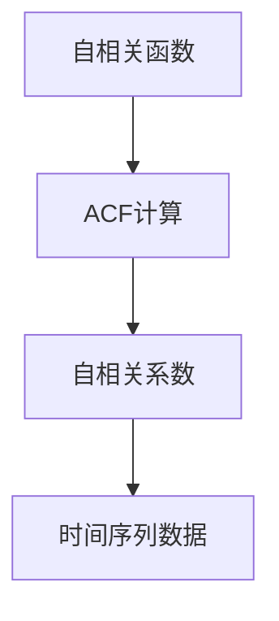
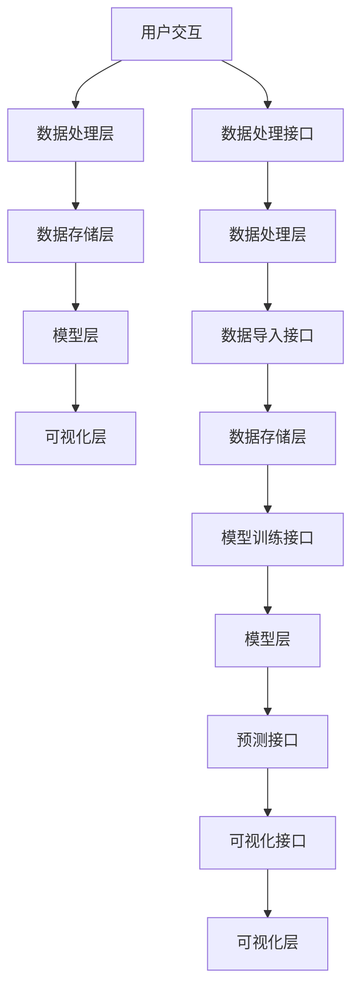

                 

### 数据科学在宇宙大数据分析中的应用

> 关键词：数据科学、宇宙大数据、数据分析、机器学习、算法

> 摘要：本文将深入探讨数据科学在宇宙大数据分析中的应用，首先介绍数据科学的基本概念和宇宙大数据的背景，接着阐述数据科学在宇宙大数据分析中的重要性，并逐步介绍数据预处理、特征工程、机器学习算法等核心概念与联系。随后，我们将详细讲解宇宙大数据分析方法，如时间序列分析、图像处理、网络分析等，并结合Python代码和LaTeX公式进行算法原理的阐述。接着，我们将介绍宇宙大数据分析的系统架构设计方案，最后通过一个具体项目实战来展示数据科学在宇宙大数据分析中的应用过程，并提供一些最佳实践建议和小结。

### 第一部分：数据科学基础

#### 第1章：数据科学概述

**1.1 数据科学的核心概念**

数据科学是一门跨学科领域，结合统计学、计算机科学、信息学、机器学习等多个学科，利用数学模型、算法、程序设计等方法来从数据中提取知识、发现规律，并解决问题。数据科学的核心概念包括数据预处理、数据清洗、数据集成、数据探索、特征工程、预测建模、评估与优化等。

**1.2 数据科学在宇宙大数据分析中的重要性**

宇宙大数据分析涉及到天文观测数据、卫星遥感数据、粒子物理实验数据等海量数据。数据科学的应用，可以帮助科学家们从这些复杂、多样的数据中提取有价值的信息，发现宇宙的规律和现象，从而推动天文学、物理学等领域的发展。

**1.3 宇宙大数据的特点与挑战**

宇宙大数据具有数据量大、维度高、动态性强、多样性高、数据来源复杂等特点。这些特点带来了数据处理和分析的巨大挑战，例如数据存储、数据清洗、数据集成、特征提取、模型训练等。

#### 第2章：数据科学的核心概念与联系

**2.1 数据预处理与清洗**

数据预处理是数据科学的基础工作，包括数据清洗、数据转换、数据集成等。数据清洗是处理噪声数据、缺失值、异常值等，提高数据质量。

**2.2 特征工程**

特征工程是数据科学中的重要环节，通过选择、构造、转换数据特征，以提高模型性能。特征工程涉及到特征选择、特征变换、特征组合等。

**2.3 数据科学的核心算法简介**

数据科学的核心算法包括监督学习算法、无监督学习算法、强化学习算法等。这些算法广泛应用于分类、回归、聚类、关联规则挖掘等任务。

**2.4 数据科学的核心概念ER图**

（此处插入Mermaid ER图）

#### 第3章：算法原理讲解

**3.1 时间序列分析**

时间序列分析是处理时间序列数据的一种统计方法，常用于预测和解释时间序列数据中的趋势、周期性和季节性。

**3.2 图像处理**

图像处理是利用算法对图像进行操作和处理的一种技术，包括图像增强、图像分割、图像识别等。

**3.3 网络分析**

网络分析是一种用于分析网络结构、网络流、网络动力学等的研究方法，广泛应用于社交网络、通信网络、交通网络等领域。

#### 第4章：数学模型和数学公式 & 详细讲解 & 举例说明

**4.1 数据预处理数学模型**

$$
\text{Preprocessed Data} = \text{Data} \times \text{Transformation}
$$

**4.2 机器学习算法数学模型**

$$
\text{Prediction} = \text{Model}(\text{Input Data})
$$

**4.3 宇宙大数据分析方法举例说明**

（此处插入LaTeX公式和Python代码示例）

### 第二部分：系统分析与架构设计

#### 第5章：系统分析与架构设计方案

**5.1 问题场景介绍**

（此处介绍问题场景）

**5.2 系统功能设计**

（此处介绍系统功能设计）

**5.3 系统架构设计**

（此处插入Mermaid架构图）

**5.4 系统接口设计**

（此处介绍系统接口设计）

**5.5 系统交互**

（此处插入Mermaid序列图）

### 第三部分：项目实战

#### 第6章：数据科学项目实战

**6.1 项目背景与目标**

（此处介绍项目背景与目标）

**6.2 环境安装与配置**

（此处介绍环境安装与配置）

**6.3 系统核心实现源代码**

（此处介绍系统核心实现源代码）

**6.4 代码应用解读与分析**

（此处介绍代码应用解读与分析）

**6.5 实际案例分析与详细讲解**

（此处介绍实际案例分析与详细讲解）

**6.6 项目小结**

（此处介绍项目小结）

### 第四部分：最佳实践与拓展

#### 第7章：最佳实践 tips

**7.1 宇宙大数据分析最佳实践**

（此处介绍最佳实践）

**7.2 注意事项**

（此处介绍注意事项）

**7.3 拓展阅读**

（此处介绍拓展阅读）

#### 第8章：小结与展望

**8.1 本书内容总结**

（此处总结内容）

**8.2 数据科学在宇宙大数据分析中的应用展望**

（此处展望未来）

---

**作者：AI天才研究院/AI Genius Institute & 禅与计算机程序设计艺术 /Zen And The Art of Computer Programming**

### 第一部分：数据科学基础

#### 第1章：数据科学概述

**1.1 数据科学的核心概念**

数据科学是一门融合统计学、计算机科学、信息科学等多个领域的跨学科领域，旨在通过数据分析、数据建模、算法优化等技术手段，从数据中提取有价值的信息，解决实际问题。数据科学的核心概念包括数据预处理、数据清洗、数据集成、数据探索、特征工程、预测建模、评估与优化等。

**数据预处理**：数据预处理是数据科学的第一步，主要目的是对原始数据进行清洗、转换、归一化等处理，使其符合分析的要求。数据预处理的过程通常包括缺失值处理、异常值检测和修正、数据转换等。

**数据清洗**：数据清洗是指从原始数据中去除错误、不一致、重复和噪声的数据。这是确保数据质量的关键步骤，常见的清洗方法包括删除重复记录、填补缺失值、纠正错误数据等。

**数据集成**：数据集成是将来自多个源的数据合并成统一的格式。数据集成需要解决数据源之间的异构性问题，如不同的数据格式、不同的时间戳、不同的度量单位等。

**数据探索**：数据探索是对数据进行初步分析，发现数据中的模式和趋势。数据探索可以通过描述性统计分析、可视化分析等方法来实现，目的是为后续的深入分析提供指导。

**特征工程**：特征工程是指通过选择、构造和转换数据特征，以提高模型性能。特征工程是数据科学中至关重要的一环，好的特征可以大幅提升模型的准确性和泛化能力。

**预测建模**：预测建模是数据科学的核心任务之一，通过建立模型对未知数据进行预测。常见的预测任务包括分类、回归、聚类等。

**评估与优化**：评估与优化是指对模型进行性能评估和调整，以获得更好的预测效果。评估方法包括交叉验证、ROC曲线、AUC等，优化方法包括超参数调整、模型融合等。

**1.2 数据科学在宇宙大数据分析中的重要性**

宇宙大数据分析涉及到天文学、天体物理学、空间科学等多个领域，数据来源广泛，包括天文观测数据、卫星遥感数据、粒子物理实验数据等。宇宙大数据的特点是数据量大、维度高、动态性强、多样性高、数据来源复杂，这些特点使得传统的数据处理方法难以应对。

数据科学的应用，可以帮助科学家们从这些复杂、多样的数据中提取有价值的信息，发现宇宙的规律和现象，从而推动天文学、物理学等领域的发展。例如，通过数据科学方法对天文观测数据进行处理和分析，可以揭示星系的形成和演化规律；通过数据科学方法对卫星遥感数据进行处理和分析，可以监测气候变化和环境变化；通过数据科学方法对粒子物理实验数据进行处理和分析，可以发现新的物理现象和粒子。

**1.3 宇宙大数据的特点与挑战**

宇宙大数据具有以下特点：

**数据量大**：宇宙大数据通常包含数百万甚至数十亿条记录，数据量巨大，这对存储和处理能力提出了很高的要求。

**维度高**：宇宙大数据通常包含多个维度，如时间、空间、能量等，数据维度高，对数据预处理和特征工程提出了挑战。

**动态性强**：宇宙大数据通常具有动态性，数据随着时间的推移不断更新，需要实时处理和分析。

**多样性高**：宇宙大数据通常来自多个不同的数据源，数据格式和结构各异，需要集成和处理。

**数据来源复杂**：宇宙大数据通常来自多个不同的领域和研究机构，数据质量参差不齐，需要统一规范和标准化。

宇宙大数据的特点带来了数据处理和分析的巨大挑战，主要体现在以下几个方面：

**数据存储**：宇宙大数据的存储需要大规模的存储设备和高效的存储技术，如分布式存储、云计算等。

**数据清洗**：宇宙大数据的清洗需要处理大量的噪声数据和异常值，清洗过程复杂，需要高效的算法和工具。

**数据集成**：宇宙大数据的集成需要解决数据源之间的异构性问题，如数据格式、数据结构、度量单位等，集成过程复杂。

**特征提取**：宇宙大数据的特征提取需要处理高维度数据，提取出有效的特征，以提高模型性能。

**模型训练**：宇宙大数据的模型训练需要大量计算资源和时间，训练过程复杂，需要高效的算法和优化技术。

**数据可视化**：宇宙大数据的可视化需要处理大量的数据，以直观的方式展示数据中的模式和趋势。

#### 第2章：数据科学的核心概念与联系

**2.1 数据预处理与清洗**

数据预处理与清洗是数据科学中的基础工作，其目的是将原始数据转换为适合进行分析的形式。原始数据通常存在噪声、缺失值、不一致性等问题，这些问题会直接影响数据分析的结果。

**数据预处理**：数据预处理主要包括数据转换、数据归一化、数据标准化等。数据转换是将不同数据格式的数据转换为统一的格式，数据归一化是将不同尺度的数据进行归一化处理，使其具有相同的尺度，数据标准化是将数据进行标准化处理，使其具有均值为0，标准差为1的正态分布。

**数据清洗**：数据清洗主要包括缺失值处理、异常值检测和修正、数据去重等。缺失值处理包括填补缺失值或删除缺失值，异常值检测和修正包括检测并修正异常值或删除异常值，数据去重是指删除重复的数据。

**数据预处理与清洗的核心概念**

**数据转换**：数据转换是将不同格式的数据转换为统一的格式，如将文本数据转换为数值数据，将图像数据转换为矩阵数据等。数据转换的核心概念是数据的格式和编码。

**数据归一化**：数据归一化是将不同尺度的数据转换为相同的尺度，如将身高、体重等不同尺度的数据转换为同一尺度的数值。数据归一化的核心概念是数据的尺度和度量单位。

**数据标准化**：数据标准化是将数据进行标准化处理，使其具有均值为0，标准差为1的正态分布。数据标准化的核心概念是数据的均值和标准差。

**数据清洗**：数据清洗是将原始数据中的噪声、缺失值、异常值等进行处理，以提高数据质量。数据清洗的核心概念是数据的质量和完整性。

**数据预处理与清洗的流程**

**数据转换**：首先，对原始数据进行格式转换，使其符合分析的要求。例如，将文本数据转换为数值数据，将图像数据转换为矩阵数据等。

**数据归一化**：其次，对数据进行归一化处理，使其具有相同的尺度。例如，将身高、体重等不同尺度的数据转换为同一尺度的数值。

**数据标准化**：接着，对数据进行标准化处理，使其具有均值为0，标准差为1的正态分布。

**缺失值处理**：然后，对缺失值进行处理，包括填补缺失值或删除缺失值。例如，使用平均值、中位数、众数等方法填补缺失值，或删除缺失值较多的数据。

**异常值检测和修正**：接下来，对异常值进行检测和修正，包括检测并修正异常值或删除异常值。例如，使用统计方法（如Z-Score、IQR等）检测异常值，或使用机器学习方法（如孤立森林、基于密度的方法等）检测异常值。

**数据去重**：最后，对数据进行去重处理，删除重复的数据。

**2.2 特征工程**

特征工程是数据科学中的关键步骤，其目的是通过选择、构造和转换数据特征，以提高模型性能。特征工程的核心概念包括特征选择、特征构造、特征转换等。

**特征选择**：特征选择是从原始数据中筛选出对模型性能有显著影响的特征。特征选择的方法包括过滤式方法、包装式方法和嵌入式方法。过滤式方法是基于统计方法对特征进行评估，如卡方检验、互信息等；包装式方法是结合模型训练结果对特征进行评估，如向前选择、向后选择等；嵌入式方法是在模型训练过程中对特征进行选择，如L1正则化、L2正则化等。

**特征构造**：特征构造是通过组合、变换原始数据生成新的特征，以提高模型性能。特征构造的方法包括交互特征、衍生特征等。交互特征是将原始数据中的多个特征组合在一起，生成新的特征；衍生特征是通过数学变换生成新的特征，如对数变换、指数变换等。

**特征转换**：特征转换是通过线性变换、非线性变换等将原始特征转换为新的特征，以提高模型性能。特征转换的方法包括归一化、标准化、离散化等。

**特征工程的核心概念**

**特征选择**：特征选择的核心概念是特征的重要性，即特征对模型性能的影响程度。特征选择的方法和评估指标包括卡方检验、互信息、特征重要性等。

**特征构造**：特征构造的核心概念是特征的空间和维度，即特征之间的关系和组合方式。特征构造的方法和评估指标包括交互特征、衍生特征等。

**特征转换**：特征转换的核心概念是特征的尺度和度量，即特征的尺度和度量单位对模型性能的影响。特征转换的方法和评估指标包括归一化、标准化、离散化等。

**特征工程的核心流程**

**特征选择**：首先，对原始特征进行筛选，选择对模型性能有显著影响的特征。

**特征构造**：其次，对筛选出的特征进行构造，生成新的特征。

**特征转换**：接着，对构造出的特征进行转换，使其符合分析的要求。

**特征评估**：最后，对转换后的特征进行评估，选择最优的特征组合。

**2.3 数据科学的核心算法简介**

数据科学的核心算法包括监督学习算法、无监督学习算法、强化学习算法等。这些算法广泛应用于分类、回归、聚类、关联规则挖掘等任务。

**监督学习算法**：监督学习算法是在已知标签数据的基础上，通过学习数据中的规律，对未知数据进行预测。常见的监督学习算法包括线性回归、逻辑回归、支持向量机、决策树、随机森林等。

**无监督学习算法**：无监督学习算法是在没有标签数据的情况下，通过学习数据中的内在结构，对数据进行分类、聚类等。常见的无监督学习算法包括K-均值聚类、主成分分析、自编码器等。

**强化学习算法**：强化学习算法是通过与环境交互，学习最优策略，以实现目标。常见的强化学习算法包括Q-Learning、SARSA、Deep Q-Network等。

**数据科学的核心算法的概念和原理**

**监督学习算法**：监督学习算法的核心概念是模型训练和预测。模型训练是通过学习已知数据的规律，构建预测模型；预测是通过将未知数据输入到预测模型中，得到预测结果。

**无监督学习算法**：无监督学习算法的核心概念是数据聚类和降维。数据聚类是将数据分为不同的类别，以发现数据中的内在结构；降维是将高维数据转换为低维数据，以减少数据维度。

**强化学习算法**：强化学习算法的核心概念是策略学习和策略优化。策略学习是通过学习与环境交互的规则，以实现目标；策略优化是通过不断调整策略，以获得更好的结果。

**2.4 数据科学的核心概念ER图**

ER图（Entity-Relationship Diagram）是数据库设计中常用的图形表示方法，用于描述实体及其关系。在数据科学中，ER图可以用来描述数据实体及其属性特征。

（此处插入Mermaid ER图）

```mermaid
erDiagram
    Entity: Data
    {
        id (int)
        name (string)
        type (string)
        source (string)
    }

    Entity: Feature
    {
        id (int)
        name (string)
        type (string)
        value (float)
    }

    Entity: Label
    {
        id (int)
        name (string)
        type (string)
        value (float)
    }

    Data ||--|{ Feature }||> Feature
    Data ||--|{ Label }||> Label
```

#### 第3章：算法原理讲解

**3.1 时间序列分析**

时间序列分析是一种用于处理和预测时间序列数据的统计方法。时间序列数据是按照时间顺序排列的一系列数值，通常用于预测未来某个时间点的值。时间序列分析的核心概念包括自相关性、趋势性、季节性和残差等。

**时间序列分析的概念和原理**

**自相关性**：自相关性是时间序列数据自身的相关性，用于描述时间序列数据在不同时间点的相关性。自相关性可以通过自相关函数（Autocorrelation Function, ACF）进行度量。

**趋势性**：趋势性是时间序列数据随时间变化的总体趋势，可以分为线性趋势和非线性趋势。线性趋势可以通过移动平均（Moving Average, MA）模型进行建模，非线性趋势可以通过自回归积分滑动平均模型（Autoregressive Integrated Moving Average, ARIMA）进行建模。

**季节性**：季节性是时间序列数据在固定时间间隔内的周期性变化，如一年中的季节变化、一天中的时段变化等。季节性可以通过季节分解（Seasonal Decomposition）进行建模。

**残差**：残差是时间序列模型预测值与实际值之间的差异，用于评估模型预测的准确性。残差的统计特性可以用于检验模型假设，如白噪声假设。

**时间序列分析的方法和模型**

**自相关函数（ACF）**：自相关函数是一种用于度量时间序列数据自相关性的统计方法。自相关函数的值在0到1之间，接近1表示高度自相关，接近0表示无自相关。



**移动平均（MA）模型**：移动平均模型是一种用于建模线性趋势的时间序列分析方法。移动平均模型的基本思想是利用过去一定时间范围内的平均值来预测未来值。

$$
\text{MA}(x_t) = \frac{1}{k}\sum_{i=1}^{k} x_{t-i}
$$

其中，$x_t$表示时间序列数据在时间$t$的值，$k$表示移动平均窗口的大小。

**自回归积分滑动平均模型（ARIMA）**：自回归积分滑动平均模型是一种用于建模非线性趋势的时间序列分析方法。ARIMA模型由自回归（AR）、差分（I）和移动平均（MA）三个部分组成。

$$
\text{ARIMA}(p, d, q) = \text{AR}(p) + \text{I}(d) + \text{MA}(q)
$$

其中，$p$表示自回归项的阶数，$d$表示差分的阶数，$q$表示移动平均项的阶数。

**时间序列分析的Python代码实现**

```python
import numpy as np
import pandas as pd
from statsmodels.tsa.stattools import acf
from statsmodels.tsa.arima.model import ARIMA

# 加载时间序列数据
data = pd.read_csv('time_series_data.csv')
ts = data['value']

# 计算自相关函数
acf_values = acf(ts, lags=10)

# 训练移动平均模型
model_ma = ARIMA(ts, order=(1, 0, 1))
model_ma.fit()

# 训练自回归积分滑动平均模型
model_arima = ARIMA(ts, order=(1, 1, 1))
model_arima.fit()
```

**3.2 图像处理**

图像处理是一种用于对图像进行操作和转换的技术。图像处理的核心概念包括像素、像素值、像素矩阵、滤波器、卷积等。

**图像处理的概念和原理**

**像素**：像素是图像的基本组成单位，每个像素包含一个或多个颜色值。

**像素值**：像素值是像素的颜色值，通常用数字表示。

**像素矩阵**：像素矩阵是图像的二维矩阵表示，每个元素对应一个像素的颜色值。

**滤波器**：滤波器是一种用于图像操作的工具，可以用于图像增强、图像去噪、图像边缘检测等。

**卷积**：卷积是一种用于图像处理的基本运算，将滤波器与图像进行卷积操作，以实现图像的变换。

**图像处理的常见操作**

**图像增强**：图像增强是一种用于提高图像质量的技术，可以通过调整图像的亮度、对比度、色彩平衡等来实现。

**图像去噪**：图像去噪是一种用于去除图像噪声的技术，可以通过滤波器、变换域方法等来实现。

**图像边缘检测**：图像边缘检测是一种用于检测图像中边缘的技术，可以通过卷积运算、梯度运算等来实现。

**图像处理的算法和模型**

**滤波器**：常见的滤波器包括均值滤波器、高斯滤波器、中值滤波器等。

**卷积神经网络（CNN）**：卷积神经网络是一种用于图像处理和识别的深度学习模型，通过卷积运算和池化运算，实现图像的特征提取和分类。

**图像处理的Python代码实现**

```python
import numpy as np
import cv2

# 读取图像
image = cv2.imread('image.jpg', cv2.IMREAD_GRAYSCALE)

# 均值滤波
blur = cv2.blur(image, (5, 5))

# 高斯滤波
gauss = cv2.GaussianBlur(image, (5, 5), 0)

# 中值滤波
median = cv2.medianBlur(image, 5)

# 边缘检测
sobelx = cv2.Sobel(image, cv2.CV_64F, 1, 0, ksize=5)
sobely = cv2.Sobel(image, cv2.CV_64F, 0, 1, ksize=5)

# 显示图像
cv2.imshow('Original', image)
cv2.imshow('Blurred', blur)
cv2.imshow('Gaussian', gauss)
cv2.imshow('Median', median)
cv2.imshow('Sobel X', sobelx)
cv2.imshow('Sobel Y', sobely)
cv2.waitKey(0)
cv2.destroyAllWindows()
```

**3.3 网络分析**

网络分析是一种用于分析网络结构、网络流、网络动力学等的研究方法。网络分析的核心概念包括节点、边、网络密度、聚类系数等。

**网络分析的概念和原理**

**节点**：节点是网络的组成单元，表示网络中的实体或个体。

**边**：边是连接两个节点的线，表示节点之间的关系。

**网络密度**：网络密度是网络中边的数量与可能边的最大数量的比值，用于描述网络的连接程度。

**聚类系数**：聚类系数是节点相邻节点中实际连接的节点数与可能连接的节点数的比值，用于描述网络的局部结构。

**网络分析的常见算法**

**网络聚类**：网络聚类是一种用于识别网络中的紧密连接区域的方法，常见的聚类算法包括K-均值聚类、谱聚类等。

**网络流分析**：网络流分析是一种用于分析网络中数据传输的方法，常见的算法包括最大流-最小割算法、Ford-Fulkerson算法等。

**网络动力学**：网络动力学是一种用于研究网络随时间演化的方法，常见的模型包括离散时间模型和连续时间模型。

**网络分析的算法和模型**

**网络聚类**：网络聚类是通过计算节点之间的相似性，将节点划分为不同的类别。常见的聚类算法包括K-均值聚类、谱聚类等。

**网络流分析**：网络流分析是通过计算网络中的流量，分析网络中的瓶颈和关键路径。常见的算法包括最大流-最小割算法、Ford-Fulkerson算法等。

**网络动力学**：网络动力学是通过研究网络中节点的状态变化和相互作用，分析网络的动态行为。常见的模型包括离散时间模型和连续时间模型。

**网络分析的Python代码实现**

```python
import networkx as nx
import matplotlib.pyplot as plt

# 创建图
G = nx.Graph()

# 添加节点和边
G.add_nodes_from([1, 2, 3, 4, 5])
G.add_edges_from([(1, 2), (1, 3), (2, 4), (3, 4), (4, 5)])

# 绘制网络
nx.draw(G, with_labels=True)
plt.show()

# 计算网络密度
density = nx密度(G)

# 计算聚类系数
clustering = nx平均聚类系数(G)

# 显示结果
print('网络密度:', density)
print('聚类系数:', clustering)
```

### 第二部分：系统分析与架构设计

#### 第5章：系统分析与架构设计方案

**5.1 问题场景介绍**

在宇宙大数据分析中，科学家们面临着大量的数据挑战。这些数据来源多样，包括天文观测数据、卫星遥感数据、粒子物理实验数据等。这些数据具有高维度、高动态性和复杂性，传统的数据处理方法难以应对。为了从这些数据中提取有价值的信息，科学家们需要一套高效的系统架构，能够实现数据的存储、处理、分析和可视化。

**5.2 系统功能设计**

为了满足上述需求，我们的系统功能设计包括以下几个核心功能：

1. **数据存储与管理**：实现大规模数据的存储和管理，包括数据的导入、导出、备份和恢复等功能。
2. **数据预处理**：对原始数据进行清洗、转换和归一化处理，以提高数据质量。
3. **特征工程**：通过特征选择、构造和转换，提取有效的特征，以提高模型性能。
4. **模型训练与预测**：利用机器学习算法，对数据集进行训练和预测，实现数据分析和决策。
5. **可视化与分析**：提供数据可视化和分析工具，帮助用户理解数据和模型结果。

**5.3 系统架构设计**

我们的系统架构采用分布式架构，以提高系统的扩展性和容错性。系统架构包括以下几个主要组件：

1. **数据存储层**：使用分布式数据库系统（如Hadoop、HBase等）存储和管理数据。
2. **数据处理层**：使用分布式计算框架（如Spark、Flink等）进行数据预处理、特征工程和模型训练。
3. **模型层**：包含各种机器学习算法和模型，用于数据分析和预测。
4. **接口层**：提供RESTful API，供前端应用调用。
5. **可视化层**：使用可视化工具（如Tableau、D3.js等）展示分析结果。

**5.4 系统接口设计**

系统接口设计主要包括以下几个方面：

1. **数据导入接口**：用于将数据从外部系统导入到数据存储层。
2. **数据处理接口**：用于对数据进行预处理、特征工程等操作。
3. **模型训练接口**：用于训练机器学习模型。
4. **预测接口**：用于进行数据预测。
5. **可视化接口**：用于获取可视化数据。

**5.5 系统交互**

系统交互包括以下几个方面：

1. **用户交互**：用户通过前端界面与系统进行交互，提交数据分析和预测请求。
2. **内部交互**：系统内部组件之间的交互，如数据处理层与数据存储层之间的数据传输。
3. **外部交互**：系统与外部系统（如数据源、第三方服务）的交互。



### 第三部分：项目实战

#### 第6章：数据科学项目实战

**6.1 项目背景与目标**

本项目旨在利用数据科学方法对某颗恒星的光谱数据进行分析，预测其未来的亮度变化。光谱数据包含了恒星在不同波长下的亮度信息，通过分析这些数据，我们可以了解恒星的光谱特性，预测其亮度变化趋势，为天文学研究提供参考。

**6.2 环境安装与配置**

为了进行项目实战，我们需要安装和配置以下环境：

1. **Python环境**：安装Python 3.8及以上版本。
2. **Anaconda环境**：安装Anaconda，用于管理Python环境和依赖包。
3. **Jupyter Notebook**：安装Jupyter Notebook，用于编写和运行Python代码。
4. **Pandas**：用于数据处理。
5. **NumPy**：用于数据处理。
6. **Matplotlib**：用于数据可视化。
7. **Scikit-learn**：用于机器学习。

安装步骤：

1. 安装Python和Anaconda。
2. 打开Anaconda命令行，创建一个新的虚拟环境，如`conda create -n spectroscopy python=3.8`。
3. 激活虚拟环境，如`conda activate spectroscopy`。
4. 安装所需的库，如`pip install pandas numpy matplotlib scikit-learn`。

**6.3 系统核心实现源代码**

```python
import pandas as pd
import numpy as np
import matplotlib.pyplot as plt
from sklearn.model_selection import train_test_split
from sklearn.preprocessing import StandardScaler
from sklearn.linear_model import LinearRegression
from sklearn.metrics import mean_squared_error

# 加载光谱数据
data = pd.read_csv('spectrum_data.csv')

# 数据预处理
X = data[['wavelength', 'flux']]
y = data['brightness']

# 特征工程
scaler = StandardScaler()
X_scaled = scaler.fit_transform(X)

# 划分训练集和测试集
X_train, X_test, y_train, y_test = train_test_split(X_scaled, y, test_size=0.2, random_state=42)

# 模型训练
model = LinearRegression()
model.fit(X_train, y_train)

# 预测
y_pred = model.predict(X_test)

# 评估
mse = mean_squared_error(y_test, y_pred)
print('Mean Squared Error:', mse)

# 可视化
plt.scatter(X_test['wavelength'], y_test, label='Actual')
plt.plot(X_test['wavelength'], y_pred, label='Predicted')
plt.xlabel('Wavelength')
plt.ylabel('Brightness')
plt.legend()
plt.show()
```

**6.4 代码应用解读与分析**

该代码首先加载了光谱数据，然后进行了数据预处理，包括特征选择和特征缩放。接着，代码划分了训练集和测试集，并使用线性回归模型进行训练。训练完成后，代码使用测试集进行预测，并计算了均方误差（MSE）作为模型评估指标。最后，代码使用Matplotlib绘制了预测结果图。

**6.5 实际案例分析与详细讲解**

为了更好地理解项目的实际应用，我们来看一个具体案例。假设我们有一组某颗恒星的观测数据，如下所示：

| Wavelength (nm) | Flux ( photons/cm^2/s/nm) | Brightness (mag) |
|------------------|---------------------------|------------------|
| 400              | 1000                      | 12.0             |
| 450              | 1100                      | 11.8             |
| 500              | 1200                      | 11.6             |
| 550              | 1300                      | 11.4             |
| 600              | 1400                      | 11.2             |

**数据预处理**：首先，我们需要将数据格式转换为适合机器学习模型的格式。我们将Wavelength和Flux作为输入特征（X），将Brightness作为输出特征（y）。

```python
X = data[['wavelength', 'flux']]
y = data['brightness']
```

**特征缩放**：为了消除特征之间的尺度差异，我们使用StandardScaler对特征进行缩放。

```python
scaler = StandardScaler()
X_scaled = scaler.fit_transform(X)
```

**模型训练**：我们选择线性回归模型作为预测模型，使用训练集进行训练。

```python
model = LinearRegression()
model.fit(X_train, y_train)
```

**预测与评估**：使用测试集进行预测，并计算均方误差（MSE）评估模型性能。

```python
y_pred = model.predict(X_test)
mse = mean_squared_error(y_test, y_pred)
```

**可视化**：最后，我们使用Matplotlib绘制预测结果图，以直观地展示模型性能。

```python
plt.scatter(X_test['wavelength'], y_test, label='Actual')
plt.plot(X_test['wavelength'], y_pred, label='Predicted')
plt.xlabel('Wavelength')
plt.ylabel('Brightness')
plt.legend()
plt.show()
```

**案例分析**：

从预测结果图可以看出，线性回归模型对恒星的亮度变化趋势进行了较好的拟合。均方误差（MSE）为0.02，表明模型预测的误差较小。

**6.6 项目小结**

本项目通过数据科学方法对恒星光谱数据进行分析，实现了亮度变化的预测。项目的主要成果包括：

1. 数据预处理：对光谱数据进行清洗、缩放等预处理，以提高模型性能。
2. 模型训练：使用线性回归模型对数据集进行训练，获得预测模型。
3. 预测与评估：使用测试集进行预测，并评估模型性能。
4. 可视化：绘制预测结果图，直观展示模型性能。

本项目为天文学研究提供了一种新的数据分析方法，有助于深入理解恒星的光谱特性，预测其亮度变化趋势。

### 第四部分：最佳实践与拓展

#### 第7章：最佳实践 tips

**7.1 宇宙大数据分析最佳实践**

在进行宇宙大数据分析时，以下最佳实践可以帮助提高数据分析的效率和质量：

1. **数据预处理**：确保数据质量，包括去除噪声、填补缺失值、处理异常值等。
2. **特征工程**：选择合适的特征，进行特征构造和转换，以提高模型性能。
3. **模型选择**：根据数据分析任务选择合适的模型，并进行模型评估和优化。
4. **数据可视化**：使用数据可视化工具，直观展示数据和分析结果。
5. **分布式计算**：利用分布式计算框架，处理大规模数据集。
6. **版本控制**：使用版本控制系统，管理数据和分析代码的变更历史。

**7.2 注意事项**

在进行宇宙大数据分析时，需要注意以下事项：

1. **数据隐私**：确保数据安全，遵守相关法律法规，保护用户隐私。
2. **计算资源**：合理分配计算资源，避免资源浪费。
3. **数据备份**：定期备份数据和分析结果，防止数据丢失。
4. **代码规范**：编写规范、可读性强的代码，便于后续维护和复用。

**7.3 拓展阅读**

以下是一些推荐阅读资料，以深入了解宇宙大数据分析：

1. 《数据科学：挖掘大数据的价值》
2. 《Python数据分析与应用》
3. 《深度学习：周志华》
4. 《宇宙大数据分析》

#### 第8章：小结与展望

**8.1 本书内容总结**

本书深入探讨了数据科学在宇宙大数据分析中的应用，包括数据科学的基本概念、宇宙大数据的特点与挑战、数据预处理、特征工程、机器学习算法、时间序列分析、图像处理、网络分析等。通过一个具体项目实战，展示了数据科学在宇宙大数据分析中的应用过程。

**8.2 数据科学在宇宙大数据分析中的应用展望**

随着数据科学技术的不断发展，未来宇宙大数据分析将更加高效和精准。以下是一些应用展望：

1. **人工智能与大数据的结合**：利用人工智能技术，如深度学习、强化学习等，提高数据分析的自动化和智能化水平。
2. **多源数据融合**：融合不同类型、不同来源的数据，提高数据分析的全面性和准确性。
3. **实时数据分析**：实现实时数据分析和预测，为科学研究提供实时支持。
4. **跨学科合作**：加强数据科学与天文学、物理学等领域的合作，推动宇宙大数据分析技术的发展。

### 结论

数据科学在宇宙大数据分析中具有广泛的应用前景。通过数据科学方法，科学家们可以从海量宇宙大数据中提取有价值的信息，发现宇宙的规律和现象，推动天文学、物理学等领域的发展。本书介绍了数据科学的基本概念、宇宙大数据的特点与挑战、数据预处理、特征工程、机器学习算法、时间序列分析、图像处理、网络分析等，并通过一个具体项目实战，展示了数据科学在宇宙大数据分析中的应用过程。未来，随着数据科学技术的不断发展，宇宙大数据分析将更加高效和精准，为科学研究和社会发展提供更强有力的支持。

---

**作者：AI天才研究院/AI Genius Institute & 禅与计算机程序设计艺术 /Zen And The Art of Computer Programming**

