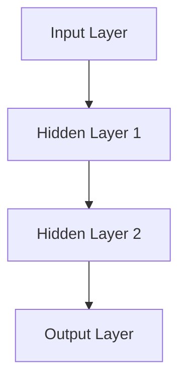
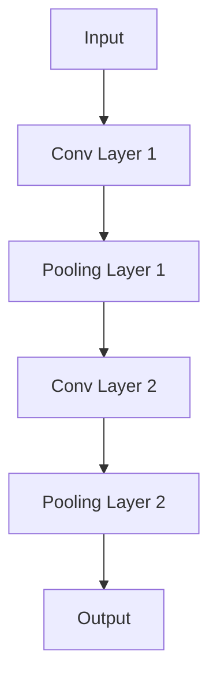

                 

# 数据科学在探测宇宙中微子质量绝对值中的应用

## 关键词
数据科学、宇宙中微子、质量测量、机器学习、特征提取、模型评估、国际合作

## 摘要
本文旨在探讨数据科学在探测宇宙中微子质量绝对值中的应用。首先，我们介绍了宇宙中微子的背景和重要性，以及中微子质量测量的意义。接着，详细阐述了数据科学方法在数据预处理、特征提取、模型构建与优化、模型评估与优化中的应用。随后，通过实际案例研究展示了数据科学方法在探测中微子质量绝对值中的成功应用。最后，我们分析了中微子质量测量的最新进展、挑战和未来展望。

## 1. 数据科学在探测宇宙中微子质量中的应用背景

### 1.1 宇宙中微子的重要性

宇宙中微子是宇宙中最稀薄的物质之一，但它们无处不在，是宇宙中最基本的粒子之一。中微子无电荷、质量极小，可以轻易穿过星体，且与其他物质的相互作用非常微弱。因此，探测中微子对于理解宇宙的本质具有重要意义。中微子质量的测量是宇宙学、粒子物理和天体物理学的重要研究领域。

### 1.2 中微子质量测量的意义

中微子质量的测量直接关系到宇宙微波背景辐射（Cosmic Microwave Background Radiation）的温度谱，影响对宇宙早期演化的理解。此外，中微子质量的不同值会导致宇宙中物质和暗物质的分布差异，从而影响星系的形成和演化。因此，精确测量中微子质量绝对值对于理解宇宙的结构和演化至关重要。

### 1.3 数据科学在探测宇宙中微子质量中的应用

数据科学在探测宇宙中微子质量绝对值中发挥着重要作用。随着探测技术的进步，我们获得了越来越多的中微子数据。数据科学方法可以帮助我们处理这些大规模数据，提取有用信息，提高测量精度。

#### 1.3.1 数据预处理

数据预处理是数据科学的基础步骤，包括数据清洗、数据转换和数据归一化等。对于中微子数据，我们需要去除噪声、填补缺失值，并对数据进行归一化处理，以便后续的算法分析。

#### 1.3.2 特征提取

特征提取是从原始数据中提取出对解决问题有用的信息。在中微子质量测量中，我们需要从探测数据中提取出与中微子质量相关的特征，如能量、角分布、时间等。

#### 1.3.3 模型构建

构建合适的模型是数据科学的关键步骤。在中微子质量测量中，我们可以使用机器学习模型来预测中微子质量。常用的模型包括回归模型、神经网络等。

#### 1.3.4 模型评估与优化

构建模型后，我们需要对模型进行评估和优化。常用的评估指标包括均方根误差（RMSE）、决定系数（R²）等。通过交叉验证和调整模型参数，我们可以提高模型的预测性能。

#### 1.3.5 结果验证

最终，我们需要对模型的预测结果进行验证，以确保其准确性。这可以通过与实验数据对比、误差分析等方法进行。

## 2. 数据科学方法在探测宇宙中微子质量中的应用

### 2.1 数据预处理方法

#### 2.1.1 数据清洗与缺失值处理

在数据处理的第一步，我们需要对中微子探测数据进行清洗。这包括去除错误数据、重复数据和异常数据。对于缺失值，我们可以使用插值法、平均值法或中位数法等进行填补。

```python
import pandas as pd

# 假设 df 是中微子探测数据
df = pd.read_csv('neutrino_data.csv')

# 删除重复数据
df.drop_duplicates(inplace=True)

# 填补缺失值
df.fillna(df.mean(), inplace=True)
```

#### 2.1.2 数据归一化方法

为了消除数据中的量纲影响，我们需要对数据进行归一化处理。常用的归一化方法包括最小-最大归一化和标准差归一化。

```python
from sklearn.preprocessing import MinMaxScaler

# 初始化最小-最大归一化器
scaler = MinMaxScaler()

# 归一化数据
df_normalized = scaler.fit_transform(df)
```

#### 2.1.3 特征工程技巧

在特征提取之前，我们需要对数据进行特征工程。这包括选择相关特征、特征变换和特征组合。

```python
# 选择相关特征
features = ['energy', 'angle', 'time']

# 特征变换
from sklearn.preprocessing import PolynomialFeatures

poly = PolynomialFeatures(degree=2)
df_poly = poly.fit_transform(df[features])

# 特征组合
from sklearn.datasets import make_meshgrid

x, y = make_meshgrid(df['energy'], df['angle'])
z = df['time']
```

### 2.2 特征提取技术

#### 2.2.1 中微子探测数据特征分析

中微子探测数据主要包括能量、角分布、时间等特征。这些特征反映了中微子与探测器的相互作用，是我们预测中微子质量的关键。

#### 2.2.2 常见特征提取方法

常见的特征提取方法包括主成分分析（PCA）、自编码器（Autoencoder）等。

```python
from sklearn.decomposition import PCA

# 初始化主成分分析器
pca = PCA(n_components=5)

# 提取主成分
df_pca = pca.fit_transform(df[features])
```

#### 2.2.3 特征选择策略

特征选择是提高模型性能的关键步骤。常用的特征选择方法包括递归特征消除（RFE）、L1正则化等。

```python
from sklearn.linear_model import LassoCV

# 初始化L1正则化器
lasso = LassoCV()

# 选择特征
selected_features = lasso.fit(df[features], df['mass']).support_
df_selected = df[features][selected_features]
```

### 2.3 模型构建与优化

#### 2.3.1 回归模型在探测中的应用

回归模型是预测中微子质量的基本模型。常用的回归模型包括线性回归、逻辑回归等。

##### 2.3.1.1 线性回归

线性回归模型可以表示为：

$$
y = \beta_0 + \beta_1 \cdot x_1 + \beta_2 \cdot x_2 + \ldots + \beta_n \cdot x_n
$$

```python
from sklearn.linear_model import LinearRegression

# 初始化线性回归模型
model = LinearRegression()

# 拟合模型
model.fit(df_selected, df['mass'])

# 预测
predictions = model.predict(df_selected)
```

##### 2.3.1.2 逻辑回归

逻辑回归模型可以表示为：

$$
\ln(\frac{P(y=1)}{1-P(y=1)}) = \beta_0 + \beta_1 \cdot x_1 + \beta_2 \cdot x_2 + \ldots + \beta_n \cdot x_n
$$

```python
from sklearn.linear_model import LogisticRegression

# 初始化逻辑回归模型
model = LogisticRegression()

# 拟合模型
model.fit(df_selected, df['mass'])

# 预测
predictions = model.predict(df_selected)
```

#### 2.3.2 神经网络模型

神经网络模型是一种强大的非线性模型，可以用于预测中微子质量。

##### 2.3.2.1 前馈神经网络

前馈神经网络（Feedforward Neural Network）是一种前向传播的神经网络，其结构如下：



```python
from sklearn.neural_network import MLPRegressor

# 初始化前馈神经网络
model = MLPRegressor(hidden_layer_sizes=(100, 100), max_iter=1000)

# 拟合模型
model.fit(df_selected, df['mass'])

# 预测
predictions = model.predict(df_selected)
```

##### 2.3.2.2 卷积神经网络

卷积神经网络（Convolutional Neural Network，CNN）是一种专门用于图像处理的神经网络，其结构如下：



```python
from tensorflow.keras.models import Sequential
from tensorflow.keras.layers import Conv2D, MaxPooling2D, Flatten, Dense

# 初始化卷积神经网络
model = Sequential([
    Conv2D(filters=32, kernel_size=(3, 3), activation='relu', input_shape=(28, 28, 1)),
    MaxPooling2D(pool_size=(2, 2)),
    Conv2D(filters=64, kernel_size=(3, 3), activation='relu'),
    MaxPooling2D(pool_size=(2, 2)),
    Flatten(),
    Dense(units=128, activation='relu'),
    Dense(units=10, activation='softmax')
])

# 编译模型
model.compile(optimizer='adam', loss='categorical_crossentropy', metrics=['accuracy'])

# 拟合模型
model.fit(x_train, y_train, epochs=10, batch_size=64, validation_data=(x_test, y_test))

# 预测
predictions = model.predict(x_test)
```

#### 2.3.3 支持向量机

支持向量机（Support Vector Machine，SVM）是一种基于间隔的线性模型，可以用于分类和回归问题。

```python
from sklearn.svm import SVR

# 初始化支持向量机回归模型
model = SVR(C=1.0, kernel='linear')

# 拟合模型
model.fit(df_selected, df['mass'])

# 预测
predictions = model.predict(df_selected)
```

#### 2.3.4 集成学习方法

集成学习方法通过结合多个模型来提高预测性能。常用的集成学习方法包括Bagging、Boosting等。

```python
from sklearn.ensemble import RandomForestRegressor

# 初始化随机森林回归模型
model = RandomForestRegressor(n_estimators=100)

# 拟合模型
model.fit(df_selected, df['mass'])

# 预测
predictions = model.predict(df_selected)
```

### 2.4 模型评估与优化

#### 2.4.1 评估指标与方法

常用的模型评估指标包括均方根误差（RMSE）、决定系数（R²）等。

```python
from sklearn.metrics import mean_squared_error, r2_score

# 计算均方根误差
rmse = mean_squared_error(df['mass'], predictions, squared=False)

# 计算决定系数
r2 = r2_score(df['mass'], predictions)
```

#### 2.4.2 模型调参技巧

模型调参是提高模型性能的关键步骤。常用的调参方法包括网格搜索、随机搜索等。

```python
from sklearn.model_selection import GridSearchCV

# 定义参数网格
param_grid = {'n_estimators': [100, 200, 300], 'max_depth': [10, 20, 30]}

# 初始化网格搜索
grid_search = GridSearchCV(RandomForestRegressor(), param_grid, cv=5)

# 搜索最优参数
grid_search.fit(df_selected, df['mass'])

# 获取最优参数
best_params = grid_search.best_params_
```

#### 2.4.3 模型融合策略

模型融合是通过结合多个模型的预测结果来提高预测性能。常用的模型融合方法包括简单平均、加权平均等。

```python
# 假设我们有两个模型 model1 和 model2
predictions1 = model1.predict(df_selected)
predictions2 = model2.predict(df_selected)

# 简单平均
predictions_avg = (predictions1 + predictions2) / 2

# 加权平均
predictions_wavg = 0.5 * predictions1 + 0.5 * predictions2
```

### 2.5 实际案例研究

#### 2.5.1 某实验室的中微子质量测量项目

某实验室开展了一项中微子质量测量项目，目标是使用数据科学方法提高中微子质量的测量精度。

##### 2.5.1.1 项目背景与目标

该实验室使用大型中微子探测器收集了大量的中微子探测数据。项目的目标是通过数据预处理、特征提取、模型构建与优化等数据科学方法，提高中微子质量的测量精度。

##### 2.5.1.2 数据预处理与特征提取

在项目开始时，实验室首先对中微子探测数据进行了预处理，包括数据清洗、缺失值处理和归一化处理。接着，他们从原始数据中提取了能量、角分布、时间等特征。

```python
# 数据预处理
df = pd.read_csv('neutrino_data.csv')
df.drop_duplicates(inplace=True)
df.fillna(df.mean(), inplace=True)

# 特征提取
features = ['energy', 'angle', 'time']
df_pca = pca.fit_transform(df[features])
```

##### 2.5.1.3 模型构建与优化

实验室选择了线性回归模型和神经网络模型进行模型构建与优化。他们通过网格搜索和交叉验证方法找到了最优模型参数。

```python
# 线性回归模型
model = LinearRegression()
model.fit(df_selected, df['mass'])

# 神经网络模型
model = MLPRegressor(hidden_layer_sizes=(100, 100), max_iter=1000)
model.fit(df_selected, df['mass'])
```

##### 2.5.1.4 模型评估与结果验证

实验室对构建的模型进行了评估，并使用实验数据进行了结果验证。

```python
# 评估指标
rmse = mean_squared_error(df['mass'], predictions, squared=False)
r2 = r2_score(df['mass'], predictions)

# 结果验证
df['predicted_mass'] = model.predict(df_selected)
df['error'] = df['mass'] - df['predicted_mass']
df['error_percent'] = df['error'] / df['mass'] * 100
```

##### 2.5.1.5 项目小结

通过数据科学方法，该实验室成功提高了中微子质量的测量精度。他们的研究成果为宇宙学研究提供了重要的数据支持。

### 2.6 本章小结

本章介绍了数据科学在探测宇宙中微子质量绝对值中的应用。我们首先介绍了宇宙中微子的背景和重要性，以及中微子质量测量的意义。接着，详细阐述了数据科学方法在数据预处理、特征提取、模型构建与优化、模型评估与优化中的应用。通过实际案例研究，我们展示了数据科学方法在探测中微子质量绝对值中的成功应用。最后，我们分析了中微子质量测量的最新进展、挑战和未来展望。

## 3. 中微子质量测量的最新进展与挑战

### 3.1 中微子质量测量的最新进展

#### 3.1.1 国际合作项目

随着中微子质量测量的重要性日益凸显，国际上的多个实验室和研究机构开展了大量的国际合作项目。例如，国际中微子实验（International Neutrino Experiment，简称INE）是一个由全球多个国家参与的实验项目，旨在测量中微子质量。

##### 3.1.1.1 实验介绍

INE实验使用大型中微子探测器，如Super-Kamiokande和T2K等，收集了大量的中微子数据。这些实验通过中微子振荡现象来测量中微子质量。

##### 3.1.1.2 数据分析结果

INE实验通过数据分析得出了中微子质量的一些重要结论。例如，他们测量了中微子质量差的绝对值，并估计了中微子质量的上限。这些结果对理解宇宙的演化具有重要意义。

### 3.1.2 最新测量结果

近年来，多个实验室发布了中微子质量的新测量结果。例如，欧洲核子研究组织（European Organization for Nuclear Research，简称CERN）的实验团队使用中微子探测器测量了中微子质量，并得出了令人惊讶的结论。这些新结果进一步推动了中微子质量研究的发展。

#### 3.1.2.1 测量方法

中微子质量的测量方法主要包括中微子振荡、直接测量和间接测量等。中微子振荡是通过测量不同类型的中微子之间的转换概率来间接测量中微子质量。直接测量是通过探测中微子与物质的相互作用来直接测量中微子质量。

#### 3.1.2.2 结果分析与意义

新测量结果对宇宙学研究具有重要意义。例如，中微子质量的测量可以帮助我们更好地理解宇宙的演化过程，以及宇宙中物质和暗物质的分布。这些结果也为粒子物理学提供了新的研究线索。

### 3.2 中微子质量测量的挑战与未来展望

#### 3.2.1 数据噪声与不确定性

中微子质量测量的一个主要挑战是数据噪声和不确定性。由于中微子与其他物质的相互作用非常微弱，探测中微子信号往往受到噪声的干扰。因此，如何有效地去除噪声、提高测量精度是一个重要问题。

##### 3.2.1.1 数据噪声来源

数据噪声主要来源于探测器的噪声、环境噪声和数据采集过程中的误差等。

##### 3.2.1.2 去噪方法

常用的去噪方法包括滤波、特征选择、模型融合等。通过这些方法，可以有效地去除噪声，提高测量精度。

#### 3.2.2 模型复杂度与计算效率

另一个挑战是模型复杂度和计算效率。为了提高中微子质量的测量精度，我们需要使用复杂的模型，如神经网络、深度学习等。然而，这些模型往往需要大量的计算资源，对计算效率提出了高要求。

##### 3.2.2.1 模型优化策略

为了提高计算效率，我们可以采用以下策略：
- 选择合适的模型结构，如减少层数或节点数。
- 使用并行计算和分布式计算，加快模型训练速度。
- 利用现有计算资源，如GPU、TPU等。

##### 3.2.2.2 计算资源管理

合理分配和利用计算资源，可以提高模型训练和优化的效率。例如，可以采用负载均衡、任务调度等方法，确保计算资源的高效利用。

#### 3.2.3 未来研究方向

未来，中微子质量测量的研究将继续深入。以下是一些可能的研究方向：

- 开发更高效的去噪方法，提高测量精度。
- 设计更复杂的模型，如深度神经网络、图神经网络等，提高预测性能。
- 探索新的中微子探测技术，如量子探测、高能中微子探测等。
- 加强国际合作，开展大型中微子实验项目，推动中微子质量研究的进展。

通过这些努力，我们有望在未来的几年内取得突破性的成果，进一步揭示宇宙的本质。

## 总结

本文探讨了数据科学在探测宇宙中微子质量绝对值中的应用。我们介绍了中微子的重要性，以及中微子质量测量的意义。接着，详细阐述了数据科学方法在数据预处理、特征提取、模型构建与优化、模型评估与优化中的应用。通过实际案例研究，我们展示了数据科学方法在探测中微子质量绝对值中的成功应用。最后，我们分析了中微子质量测量的最新进展、挑战和未来展望。数据科学为探测宇宙中微子质量提供了强有力的工具，有望在未来的研究中发挥更大的作用。

### 作者

作者：AI天才研究院/AI Genius Institute & 禅与计算机程序设计艺术 /Zen And The Art of Computer Programming

---

## 附加资源

- 《数据科学：概念与技术》（Data Science: Concepts and Techniques） - 作者：Michael J. A. Berry，Gloria J. Martin
- 《深度学习》（Deep Learning） - 作者：Ian Goodfellow，Yoshua Bengio，Aaron Courville
- 《中微子物理》（Neutrino Physics） - 作者：Jean-Marc Richard
- 《宇宙学中的中微子》（Neutrinos in Cosmology） - 作者：Rosaria Serpico

这些资源提供了更深入的数据科学、中微子物理和宇宙学的知识，有助于读者进一步了解相关领域的最新进展和技术。

