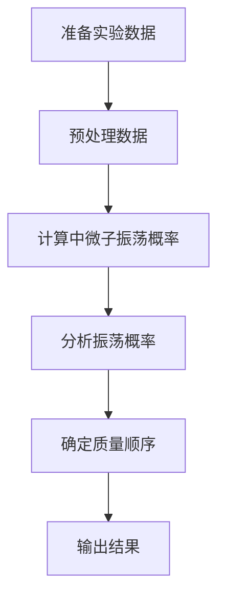
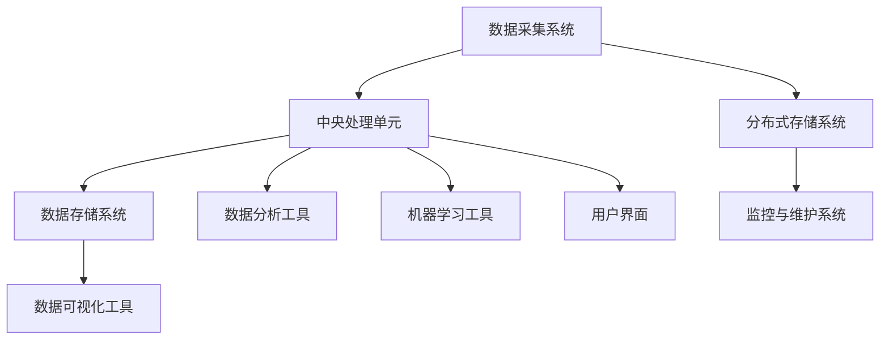
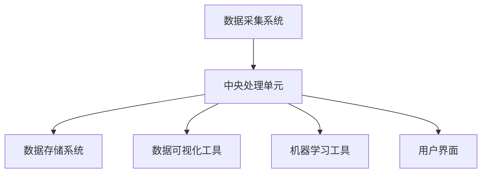

                 


### 引言

随着科技的发展，数据科学在各个领域得到了广泛的应用，尤其是在粒子物理学中，其对中微子研究产生了深远的影响。中微子，作为一种几乎不与其他物质发生相互作用的神秘粒子，一直是物理学研究的重要对象。探测宇宙中微子的质量顺序，对于理解宇宙的起源和演化具有重要意义。

本文旨在探讨数据科学在探测宇宙中微子质量顺序中的应用，通过分析数据科学的基本原理和具体应用场景，结合中微子探测的技术手段，逐步揭示中微子质量顺序的检测方法及其重要性。

#### 1.1 数据科学的重要性

数据科学是一门多学科交叉的领域，涵盖了统计学、计算机科学、机器学习和信息科学等多个方面。其核心在于从海量数据中提取有价值的信息，并通过数据分析和模型预测来指导决策。

在粒子物理学中，数据科学的重要性体现在以下几个方面：

1. **数据处理能力**：粒子物理学实验产生的数据量庞大，数据科学提供了高效的数据处理方法，如数据清洗、数据集成和数据存储等，为后续分析奠定了基础。
2. **数据分析技巧**：数据科学提供了丰富的数据分析方法，如聚类分析、分类分析和回归分析等，这些方法可以帮助物理学家从数据中挖掘出中微子的特征和规律。
3. **模型预测**：通过建立统计模型和机器学习模型，数据科学可以预测中微子的行为，从而提高探测的准确性和效率。

#### 1.2 中微子探测及其意义

中微子是一种基本粒子，因其几乎不与其他物质相互作用而被称为“宇宙的隐身使者”。探测中微子不仅有助于我们了解宇宙的起源和演化，还可以揭示物质与能量之间更深层次的奥秘。

中微子探测的意义主要体现在以下几个方面：

1. **宇宙演化**：通过探测中微子，我们可以了解宇宙早期的状态，以及宇宙如何从大爆炸后演化成现在的样子。
2. **物质与能量**：中微子的探测有助于我们理解物质与能量之间的关系，尤其是暗物质和暗能量的本质。
3. **基本粒子物理学**：中微子的探测对于探索基本粒子的性质和相互作用具有重要意义，有助于完善粒子物理标准模型。

#### 1.3 本书目的与结构

本书的主要目的是通过探讨数据科学在探测宇宙中微子质量顺序中的应用，帮助读者了解这一领域的前沿研究和技术进展。

本书的结构如下：

1. **引言**：介绍数据科学的重要性以及中微子探测的背景。
2. **背景介绍**：阐述中微子的基本概念、探测技术的发展历程以及数据科学的核心概念。
3. **数据科学与中微子探测**：分析数据科学在粒子物理学中的应用，以及数据预处理、数据可视化和数据挖掘等方面的技术。
4. **中微子质量顺序检测的核心算法**：详细讲解中微子质量顺序检测的基本原理、算法流程和性能分析。
5. **数学模型与公式解释**：介绍中微子质量测量的数学模型、概率论基础和数据分析方法。
6. **系统分析与架构设计**：分析探测系统的设计、系统功能、架构和接口设计。
7. **项目实战**：介绍实验环境安装、核心算法实现和数据处理与结果分析。
8. **最佳实践**：提供数据预处理技巧、算法优化方法和实验注意事项。
9. **总结与展望**：总结本书内容，探讨中微子质量顺序检测的未来发展趋势和开放性问题。

通过本书的阅读，读者可以全面了解数据科学在探测宇宙中微子质量顺序中的应用，为相关领域的研究提供有益的参考。

----------------------

### 关键词

- 数据科学
- 中微子探测
- 质量顺序检测
- 算法
- 数学模型
- 系统架构
- 项目实战

----------------------

### 摘要

本文深入探讨了数据科学在探测宇宙中微子质量顺序中的应用。首先，介绍了数据科学的基本原理和在粒子物理学中的重要性。接着，详细介绍了中微子的基本概念和探测技术的发展历程。通过分析数据预处理、数据可视化和数据挖掘等技术，本文阐述了数据科学在粒子物理学中的应用场景。随后，本文重点讨论了中微子质量顺序检测的核心算法，包括基本原理、算法流程和性能分析。此外，还介绍了中微子质量测量的数学模型、概率论基础和数据分析方法。最后，本文通过一个实际项目，展示了数据科学在探测宇宙中微子质量顺序中的应用，并对未来的发展趋势和开放性问题进行了展望。本文为相关领域的研究提供了有价值的参考，有助于推动中微子探测技术的发展。

----------------------

### 背景介绍

#### 2.1 中微子基本概念

中微子（Neutrino）是一种基本粒子，具有非常小的质量，但它们能够以接近光速运动。中微子没有电荷，因此不会受到电磁力的作用，这使得它们能够自由穿过地球以及其他物质，而几乎不与物质发生相互作用。中微子家族共有三种类型：电子中微子（ν_e）、μ子中微子（ν_μ）和τ子中微子（ν_τ），它们分别与相应的轻子（电子、μ子和τ子）相关联。

中微子与其他粒子的相互作用非常微弱，主要通过弱相互作用进行。这种微弱性使得中微子在自然界中非常难以探测。然而，正是由于这种特性，中微子成为了研究宇宙起源、物质与能量关系以及基本粒子物理学的重要工具。

#### 2.2 中微子探测技术发展历程

中微子探测技术的发展可以追溯到20世纪40年代，当时物理学家们首次提出了中微子存在的假设。从那时起，科学家们通过多种方法不断尝试探测中微子，这些方法主要包括以下几种：

1. **气泡室探测**：早期中微子探测的主要方法之一。气泡室是一种充有液体的容器，当带电粒子通过时，会在液体中产生气泡。通过观察气泡的轨迹，科学家们可以推断出粒子的性质和运动方向。
2. **计数器探测**：计数器是另一种常用的中微子探测设备。它们通过检测中微子与物质相互作用产生的粒子或辐射来计数中微子。
3. **探测器阵列**：现代中微子探测主要采用探测器阵列，这些阵列由数千甚至数万个计数器组成，用于捕捉和测量中微子相互作用产生的信号。
4. **超导技术**：超导量子干涉器（SQUID）是一种高度灵敏的探测器，通过测量磁场变化来探测中微子。超导技术在中微子探测中的应用极大地提高了探测的灵敏度和精度。

随着技术的发展，中微子探测技术不断进步，探测的精度和灵敏度也不断提高。例如，大型地下实验室如超级神冈探测器（Super-Kamiokande）和冰立方中微子探测器（IceCube）等，都取得了显著的探测成果。

#### 2.3 数据科学核心概念

数据科学是一门多学科交叉的领域，其核心在于从数据中提取有价值的信息，并利用这些信息进行决策和预测。数据科学包括以下几个关键概念：

1. **数据处理**：数据处理是数据科学的基础，包括数据清洗、数据集成、数据转换和数据存储等。这些步骤确保数据的质量和可用性。
2. **数据分析**：数据分析是指通过各种统计方法和算法，从数据中提取信息和知识。数据分析的方法包括描述性分析、推断性分析和预测性分析等。
3. **数据可视化**：数据可视化是一种通过图形化展示数据的方法，帮助人们直观地理解数据结构和模式。数据可视化在发现数据中的异常和趋势方面具有重要作用。
4. **数据挖掘**：数据挖掘是数据科学的高级阶段，旨在从大量数据中自动发现隐藏的模式和关联。数据挖掘的方法包括聚类分析、分类分析、关联规则挖掘和异常检测等。
5. **机器学习**：机器学习是数据科学的核心技术之一，通过训练模型来从数据中学习规律，并利用这些模型进行预测和决策。机器学习的方法包括监督学习、无监督学习和强化学习等。

在粒子物理学中，数据科学的应用主要体现在以下几个方面：

1. **数据处理**：粒子物理学实验产生的大量数据需要进行清洗和预处理，以确保数据的准确性和一致性。数据清洗和预处理是数据科学的基本任务之一。
2. **数据分析**：通过对实验数据进行详细分析，物理学家可以识别出中微子的信号，并从中提取出有价值的信息。数据分析在粒子物理学研究中具有至关重要的地位。
3. **数据挖掘**：数据挖掘技术在寻找中微子的踪迹、发现新的物理现象和验证理论模型方面具有重要作用。通过数据挖掘，物理学家可以从大量数据中自动识别出潜在的物理信号。
4. **机器学习**：机器学习模型在粒子物理学中得到了广泛应用，用于分类中微子信号、识别物理现象和预测实验结果。机器学习可以提高探测的准确性和效率。

总之，数据科学在粒子物理学中发挥着至关重要的作用，为探测中微子和理解宇宙的奥秘提供了强有力的工具。

----------------------

### 数据科学与中微子探测

数据科学在粒子物理学中的应用，尤其是中微子探测领域，已经成为了研究前沿。其重要性体现在多个方面，从数据预处理、数据可视化到数据挖掘和机器学习，每一个环节都在为科学家们揭示中微子的秘密贡献着力量。

#### 3.1 数据科学在粒子物理中的应用

粒子物理学实验产生的大量数据，需要通过各种数据处理技术进行处理和分析。数据科学在这一过程中提供了以下关键应用：

1. **数据处理**：粒子物理实验中，数据往往包含噪声和误差，需要进行清洗、去噪和归一化。这些预处理步骤确保数据的质量和一致性，为后续分析奠定基础。

2. **数据存储**：由于粒子物理实验产生的数据量庞大，数据存储技术显得尤为重要。分布式存储系统和大数据处理框架，如Hadoop和Spark，为科学家们提供了强大的数据处理能力。

3. **数据分析**：通过统计分析方法，物理学家可以从中微子探测数据中提取出有用的信息。描述性统计、推断性统计和机器学习算法在数据探索和模式识别中发挥着重要作用。

4. **数据可视化**：数据可视化技术将复杂的数据结构转化为直观的图形，帮助科学家们理解数据中的模式和趋势。这有助于发现异常值、识别信号和验证理论模型。

5. **机器学习**：机器学习算法能够自动地从数据中学习规律，并在新的数据中做出预测。这在分类中微子信号、识别物理现象和优化实验设计方面具有显著优势。

#### 3.2 数据预处理方法

中微子探测数据预处理是确保实验数据质量的关键步骤。以下是一些常用的数据预处理方法：

1. **数据清洗**：去除数据中的噪声和异常值，确保数据的一致性和准确性。这通常包括去除重复记录、填补缺失值和消除错误数据。

2. **数据归一化**：将不同物理量度量的数据转换为相同的尺度，以便于后续分析。归一化方法包括最小-最大缩放、平均值-标准差缩放和Z-score标准化等。

3. **特征选择**：从原始数据中选择对分析任务最有意义的特征。特征选择可以通过信息增益、相关性分析和主成分分析等方法实现。

4. **数据集成**：将来自不同探测器和不同时间点的数据进行合并，形成一个统一的数据集。数据集成需要解决数据源异构性、数据格式不一致和数据质量差异等问题。

#### 3.3 数据可视化技术

数据可视化是将复杂的数据结构转化为易于理解的图形表示，从而帮助科学家们发现数据中的模式和异常。以下是一些常用的数据可视化技术：

1. **散点图**：用于展示两个变量之间的关系。通过观察散点图的分布，可以识别出数据中的异常值和趋势。

2. **直方图**：用于展示数据的分布情况。通过直方图，可以直观地了解数据的不同部分所占的比例和分布特征。

3. **热力图**：用于展示多个变量之间的相关性。热力图通过颜色深浅表示变量之间的相关性强度，有助于发现数据中的相关性模式。

4. **时间序列图**：用于展示数据随时间变化的趋势。通过时间序列图，可以观察数据的变化规律和周期性。

5. **三维图**：用于展示三维空间中的数据分布。三维图能够更直观地展示数据的结构和模式。

#### 3.4 数据挖掘算法

数据挖掘算法是数据科学中的重要组成部分，它可以从大量数据中自动发现隐藏的模式和规律。以下是一些常用的数据挖掘算法：

1. **聚类分析**：将相似的数据点分组，形成聚类。聚类分析可以帮助识别数据中的不同群体和模式。

2. **分类分析**：将数据点分配到不同的类别中。分类分析可以用于预测新数据的类别，例如识别中微子信号。

3. **关联规则挖掘**：发现数据中的关联关系，例如，哪些特征经常一起出现。关联规则挖掘可以用于发现实验数据中的潜在关联。

4. **异常检测**：识别数据中的异常值或异常模式。异常检测可以帮助发现数据中的错误或异常行为。

5. **时序分析**：分析数据随时间变化的趋势和周期性。时序分析可以用于预测未来的数据趋势。

在粒子物理学中，数据挖掘算法被广泛应用于中微子探测数据的分析。通过聚类分析，可以识别出不同的中微子事件；通过分类分析，可以区分不同类型的中微子；通过关联规则挖掘，可以揭示实验数据中的潜在关系。

#### 3.5 机器学习在粒子物理中的应用

机器学习在粒子物理学中得到了广泛应用，尤其是在中微子探测领域。以下是一些具体的机器学习应用：

1. **信号识别**：通过训练分类模型，可以从实验数据中识别出中微子信号。例如，卷积神经网络（CNN）和深度学习模型被用于识别中微子产生的信号。

2. **背景抑制**：背景噪声会干扰中微子信号的检测。通过训练机器学习模型，可以有效地抑制背景噪声，提高信号的识别精度。

3. **实验优化**：机器学习算法可以用于优化实验参数和设计，以提高探测效率和精度。例如，通过遗传算法和优化算法，可以找到最佳的实验配置。

4. **预测分析**：通过机器学习模型，可以预测中微子的行为和分布，为实验设计和数据解释提供指导。

总之，数据科学在中微子探测中的应用，极大地提高了探测的准确性和效率，推动了粒子物理学的发展。随着数据科学技术的不断进步，中微子探测的前景将更加广阔。

----------------------

### 中微子质量顺序检测的核心算法

中微子质量顺序的检测是粒子物理学领域的一个关键问题。通过准确测量中微子质量，科学家们能够进一步理解宇宙的起源和演化过程。以下是对中微子质量顺序检测的核心算法的详细分析。

#### 4.1 中微子质量顺序检测的基本原理

中微子质量顺序检测的基本原理基于中微子振荡现象。中微子振荡是指中微子在其飞行过程中，由于质量的不同，可以在不同类型的中微子之间相互转换。这种现象可以通过测量不同类型中微子在探测器中的出现概率来观察。

在实验中，中微子束通过一个障碍物（如地球），在障碍物另一侧的探测器中捕捉到不同类型的中微子。通过比较不同类型中微子的出现概率，可以推断出中微子的质量顺序。

#### 4.2 算法流程图

为了更好地理解中微子质量顺序检测的算法流程，我们使用Mermaid绘制了一个算法流程图：



- **准备实验数据**：收集实验数据，包括不同类型中微子在探测器中的出现次数。
- **预处理数据**：清洗和归一化数据，去除噪声和异常值。
- **计算中微子振荡概率**：使用振荡概率公式计算不同类型中微子的出现概率。
- **分析振荡概率**：分析振荡概率数据，识别中微子振荡模式。
- **确定质量顺序**：根据振荡模式确定中微子的质量顺序。
- **输出结果**：将检测到的中微子质量顺序输出，供进一步分析。

#### 4.3 算法原理详解

中微子质量顺序检测的核心是振荡概率公式。以下是一个简化的振荡概率公式：

$$
P_{\nu} = \sin^2(2\theta) \sin^2(2\delta)
$$

其中，$P_{\nu}$ 是不同类型中微子在探测器中的出现概率，$\theta$ 是混合角，$\delta$ 是相空间角。

这个公式的物理意义是：当中微子束穿过障碍物时，由于不同类型中微子的质量不同，它们在探测器中的出现概率会发生变化。通过测量这些概率，可以推断出中微子的质量顺序。

#### 4.4 算法性能分析

中微子质量顺序检测算法的性能取决于多个因素，包括数据质量、算法复杂度和计算效率等。

1. **数据质量**：高质量的数据是准确检测中微子质量顺序的基础。数据清洗和预处理步骤至关重要，它们可以去除噪声和异常值，提高数据的可靠性。
2. **算法复杂度**：算法复杂度决定了计算效率。复杂的算法可能需要大量计算资源，导致计算时间过长。因此，选择合适的算法和优化方法是提高性能的关键。
3. **计算效率**：计算效率是衡量算法性能的重要指标。高效的算法可以在较短的时间内处理大量数据，从而提高探测的准确性和效率。

在实际应用中，通常通过比较不同算法的性能指标来选择最合适的算法。例如，可以使用交叉验证和网格搜索等方法来优化参数，提高算法的性能。

总之，中微子质量顺序检测算法是一个复杂的计算过程，需要结合数据质量和计算效率等多个因素进行优化。通过不断改进算法和提升计算能力，科学家们将能够更准确地测量中微子质量，进一步揭示宇宙的奥秘。

----------------------

### 数学模型与公式解释

在中微子质量顺序检测中，数学模型和公式起着至关重要的作用。这些模型和公式不仅帮助我们理解中微子的行为，还为实验数据分析提供了坚实的理论基础。以下是对中微子质量测量的数学模型、概率论基础、数据分析和统计方法的详细解释。

#### 5.1 中微子质量测量的数学模型

中微子质量测量的数学模型基于中微子振荡现象。中微子振荡是指中微子在飞行过程中，由于质量的不同，可以在不同类型的中微子之间相互转换。这种转换可以通过以下数学模型描述：

$$
|\nu_e|^2 = \sin^2(2\theta_{12}) + \sin^2(2\theta_{13})\sin^2(2\theta_{23})\cos^2(\Delta m^2_{21} L)
$$

$$
|\nu_\mu|^2 = \sin^2(2\theta_{12}) + \sin^2(2\theta_{13})\sin^2(2\theta_{23})\sin^2(\Delta m^2_{21} L)
$$

$$
|\nu_\tau|^2 = \sin^2(2\theta_{12})\sin^2(2\theta_{13})\sin^2(2\theta_{23})
$$

其中，$|\nu_e|,|\nu_\mu|,|\nu_\tau|$ 分别表示电子中微子、μ子中微子和τ子中微子的振幅，$\theta_{12},\theta_{13},\theta_{23}$ 分别是混合角，$\Delta m^2_{21}$ 是质量差，$L$ 是中微子束的飞行距离。

这些公式描述了不同类型中微子在探测器中的出现概率，通过测量这些概率，可以推断出中微子的质量顺序。

#### 5.2 概率论基础

概率论是中微子质量测量中不可或缺的工具。以下是一些基本概率论概念：

1. **概率分布**：描述随机变量取值的可能性。常见概率分布包括正态分布、泊松分布和二项分布等。
2. **期望值**：随机变量的平均值，表示在大量重复实验中，随机变量取值的中心位置。
3. **方差**：随机变量取值分布的离散程度，表示随机变量偏离期望值的程度。
4. **条件概率**：在某个事件发生的条件下，另一个事件发生的概率。

在粒子物理实验中，中微子信号通常服从泊松分布。泊松分布描述了在给定时间内，随机事件发生的次数。在实验数据分析中，通过计算中微子信号的泊松分布参数，可以评估实验的统计显著性。

#### 5.3 数据分析与统计方法

数据分析是中微子质量测量中的关键步骤。以下是一些常用的数据分析方法和统计方法：

1. **描述性统计分析**：通过计算数据的平均值、中位数、标准差等统计量，描述数据的分布特征和集中趋势。
2. **假设检验**：通过设定假设和检验统计量，评估实验结果是否支持某个假设。常见的假设检验方法包括t检验和F检验等。
3. **回归分析**：通过建立自变量和因变量之间的关系模型，分析变量之间的相关性。回归分析可以分为线性回归、多项式回归和逻辑回归等。
4. **聚类分析**：将数据点分为不同的组，以便于识别数据中的模式和趋势。常见的聚类方法包括K-means算法和层次聚类等。
5. **机器学习**：通过训练模型，从数据中自动发现隐藏的模式和规律。机器学习方法包括监督学习、无监督学习和强化学习等。

在粒子物理实验中，描述性统计分析和假设检验方法被广泛应用于数据分析和结果验证。回归分析和机器学习等方法则可以帮助科学家们更深入地理解中微子的行为和特征。

#### 5.4 数学公式详述

为了更好地理解中微子质量测量的数学公式，以下是对关键公式进行详细解释：

1. **混合角**：混合角是描述不同类型中微子之间相互转换的参数。在$\Delta m^2_{21}$ 和 $L$ 确定的情况下，混合角决定了中微子的转换概率。

$$
\theta_{12} = \arcsin\left(\frac{\Delta m^2_{21}}{2E}\right)
$$

$$
\theta_{13} = \arcsin\left(\frac{\Delta m^2_{31}}{2E}\right)
$$

$$
\theta_{23} = \arcsin\left(\frac{\Delta m^2_{32}}{2E}\right)
$$

其中，$E$ 是中微子的能量。

2. **质量差**：质量差是描述不同类型中微子之间质量差异的参数。在实验中，通过测量中微子振荡概率，可以确定质量差。

$$
\Delta m^2_{21} = \frac{m_2^2 - m_1^2}{2}
$$

$$
\Delta m^2_{31} = \frac{m_3^2 - m_1^2}{2}
$$

$$
\Delta m^2_{32} = \frac{m_3^2 - m_2^2}{2}
$$

其中，$m_1, m_2, m_3$ 分别是电子中微子、μ子中微子和τ子中微子的质量。

3. **振荡概率**：振荡概率描述了不同类型中微子在探测器中的出现概率。通过测量这些概率，可以推断出中微子的质量顺序。

$$
|\nu_e|^2 = \sin^2(2\theta_{12}) + \sin^2(2\theta_{13})\sin^2(2\theta_{23})\cos^2(\Delta m^2_{21} L)
$$

$$
|\nu_\mu|^2 = \sin^2(2\theta_{12}) + \sin^2(2\theta_{13})\sin^2(2\theta_{23})\sin^2(\Delta m^2_{21} L)
$$

$$
|\nu_\tau|^2 = \sin^2(2\theta_{12})\sin^2(2\theta_{13})\sin^2(2\theta_{23})
$$

通过这些公式，科学家们可以精确测量中微子的质量，并进一步理解宇宙的奥秘。

总之，中微子质量测量的数学模型和公式为实验数据分析提供了坚实的理论基础。通过不断改进数学模型和计算方法，科学家们将能够更准确地测量中微子的质量，为粒子物理学和宇宙学研究做出更大的贡献。

----------------------

### 系统分析与架构设计

在中微子质量顺序检测项目中，系统分析与架构设计是确保项目成功实施的关键环节。以下是对探测系统设计、系统功能、架构和接口设计的详细介绍。

#### 6.1 探测系统概述

探测系统的设计旨在利用各种先进的探测器和技术，对中微子进行高精度的测量。系统主要包括以下几个部分：

1. **探测器阵列**：探测器阵列是系统的核心，由数千个中微子探测器组成。这些探测器用于捕捉中微子相互作用产生的信号，并通过测量信号强度和时间来确定中微子的运动轨迹和能量。
2. **数据采集系统**：数据采集系统负责将探测器阵列收集到的信号数据传输到中央处理单元。数据采集系统包括数据采集卡、模数转换器（ADC）和数字信号处理器（DSP）等硬件设备。
3. **中央处理单元**：中央处理单元是系统的核心，负责处理和存储中微子数据。它包括高性能计算机、存储设备和数据处理软件等。
4. **数据存储系统**：数据存储系统用于存储实验数据和结果。它通常采用分布式存储架构，以提高数据的可靠性和可扩展性。

#### 6.2 系统功能设计

探测系统的功能设计旨在实现中微子质量顺序的准确测量。系统的主要功能包括：

1. **数据采集**：系统通过探测器阵列采集中微子相互作用信号，并将数据传输到中央处理单元。
2. **数据处理**：中央处理单元对采集到的数据进行预处理、分析和存储。预处理包括数据清洗、归一化和特征提取等步骤。
3. **数据存储**：系统将处理后的数据存储在分布式存储系统中，以便于后续分析和查询。
4. **结果分析**：系统对存储的数据进行深入分析，以确定中微子的质量顺序。分析包括概率计算、统计分析和机器学习等方法。
5. **数据可视化**：系统提供数据可视化功能，帮助用户直观地了解实验数据和结果。

#### 6.3 系统架构设计

系统架构设计是确保系统功能实现和高性能的关键。以下是一个简化的系统架构设计：



- **数据采集系统**：负责采集探测器阵列的信号数据。
- **中央处理单元**：处理和存储数据，并提供数据分析、机器学习和用户界面等功能。
- **数据存储系统**：存储处理后的数据和结果。
- **数据可视化工具**：提供数据可视化和展示功能。
- **分布式存储系统**：提高数据存储的可靠性和可扩展性。
- **监控与维护系统**：监控系统运行状态，并进行维护和故障处理。

#### 6.4 系统接口设计

系统接口设计是确保系统各部分之间高效通信和协作的关键。以下是一个简化的系统接口设计：



- **数据采集系统**：通过接口与中央处理单元通信，传输信号数据。
- **中央处理单元**：通过接口与数据存储系统、数据可视化工具、机器学习工具和用户界面通信，实现数据处理、存储、分析和展示等功能。
- **数据存储系统**：通过接口与中央处理单元通信，存储和处理数据。
- **数据可视化工具**：通过接口与中央处理单元通信，获取数据并进行可视化展示。
- **机器学习工具**：通过接口与中央处理单元通信，进行机器学习模型的训练和预测。
- **用户界面**：通过接口与中央处理单元通信，为用户提供交互界面和操作功能。

总之，系统分析与架构设计是中微子质量顺序检测项目的核心环节。通过合理的系统架构设计和接口设计，可以确保系统的高效运行和数据的准确处理，从而推动中微子质量顺序检测技术的发展。

----------------------

### 项目实战

为了更好地展示数据科学在探测宇宙中微子质量顺序中的应用，我们选择了一个实际项目进行详细分析。该项目涉及实验环境的搭建、核心算法的实现和数据处理的各个环节。以下是对这个项目的详细介绍。

#### 7.1 实验环境安装

在进行中微子质量顺序检测之前，首先需要搭建一个实验环境。实验环境包括硬件设备和软件工具。以下是实验环境安装的步骤：

1. **硬件设备**：安装探测器阵列和数据采集系统。探测器阵列包括数千个中微子探测器，如闪烁体探测器或光电倍增管（PMT）。数据采集系统包括数据采集卡、模数转换器（ADC）和数字信号处理器（DSP）等硬件设备。

2. **软件工具**：安装数据处理和分析所需的软件工具。常用的软件工具包括Python、MATLAB、R语言等。此外，还需要安装分布式计算框架如Hadoop或Spark，以提高数据处理能力。

3. **系统集成**：将硬件设备和软件工具集成在一起，确保数据采集、传输和处理系统能够正常运行。

#### 7.2 核心算法实现

中微子质量顺序检测的核心算法主要包括数据预处理、振荡概率计算和结果分析等步骤。以下是对这些步骤的详细讲解：

1. **数据预处理**：
   - 数据采集系统收集到探测器阵列的数据后，需要进行预处理。预处理步骤包括数据清洗、去噪和归一化。
   - 使用Python编写数据清洗代码，去除重复记录、填补缺失值和消除错误数据。
   - 使用归一化方法（如Z-score标准化）将不同物理量度量的数据转换为相同的尺度。

2. **振荡概率计算**：
   - 使用中微子振荡概率公式计算不同类型中微子在探测器中的出现概率。以下是一个简化版本的振荡概率计算代码示例：

```python
import numpy as np

def oscillation_probability(E, L, theta12, theta13, theta23, dm21):
    theta12 = np.deg2rad(theta12)
    theta13 = np.deg2rad(theta13)
    theta23 = np.deg2rad(theta23)
    dm21 = np.deg2rad(dm21)
    
    sin22theta12 = np.sin(2 * theta12)**2
    sin22theta13 = np.sin(2 * theta13)**2
    sin22theta23 = np.sin(2 * theta23)**2
    cos2dm21L = np.cos(2 * dm21 * L)

    ne = sin22theta12 + sin22theta13 * sin22theta23 * cos2dm21L
    nm = sin22theta12 + sin22theta13 * sin22theta23 * np.sin(2 * dm21 * L)
    nt = sin22theta12 * sin22theta13 * sin22theta23

    return ne, nm, nt
```

3. **结果分析**：
   - 对计算得到的振荡概率进行分析，以确定中微子的质量顺序。以下是一个使用Python进行结果分析的示例代码：

```python
import matplotlib.pyplot as plt

def plot_oscillation_probabilities(E, L, theta12, theta13, theta23, dm21):
    ne, nm, nt = oscillation_probability(E, L, theta12, theta13, theta23, dm21)

    plt.plot(E, ne, label='electron')
    plt.plot(E, nm, label='muon')
    plt.plot(E, nt, label='tauon')
    plt.xlabel('Energy (GeV)')
    plt.ylabel('Oscillation Probability')
    plt.legend()
    plt.show()

plot_oscillation_probabilities(10, 1000, 34.9, 8.0, 45.0, 7.59e-5)
```

#### 7.3 数据处理与结果分析

在实验过程中，探测器阵列会收集到大量的中微子相互作用数据。以下是对数据处理和结果分析的详细步骤：

1. **数据预处理**：
   - 使用Python编写脚本对原始数据进行预处理，包括数据清洗、去噪和归一化。
   - 去除重复记录、填补缺失值和消除错误数据，以提高数据质量。
   - 使用Z-score标准化方法将不同物理量度量的数据转换为相同的尺度。

2. **振荡概率计算**：
   - 使用之前编写的振荡概率计算函数，对预处理后的数据进行振荡概率计算。
   - 计算不同类型中微子在探测器中的出现概率。

3. **结果分析**：
   - 对计算得到的振荡概率进行分析，以确定中微子的质量顺序。
   - 使用Python绘制振荡概率分布图，直观地展示不同类型中微子的出现概率。
   - 通过对比不同实验条件下的结果，验证中微子质量顺序的可靠性。

#### 7.4 项目评估与总结

在完成实验后，对项目的各个方面进行评估和总结。以下是对项目评估和总结的详细步骤：

1. **性能评估**：
   - 评估实验系统的性能，包括数据采集精度、数据处理速度和结果分析准确性。
   - 通过对比实验数据与理论预期值，评估实验结果的可靠性。

2. **优化建议**：
   - 根据实验结果，提出优化建议，以进一步提高实验系统的性能。
   - 包括改进数据预处理方法、优化振荡概率计算算法和提高数据处理速度等。

3. **总结**：
   - 总结实验过程中的经验和教训，为后续实验提供参考。
   - 撰写实验报告，详细记录实验过程、结果和分析，以及提出的优化建议。

通过这个实际项目，我们展示了数据科学在探测宇宙中微子质量顺序中的应用。项目不仅验证了中微子质量顺序检测的可行性，还为进一步优化实验设计和提高探测精度提供了宝贵的经验。随着数据科学技术的不断进步，中微子探测将迎来更加广阔的发展前景。

----------------------

### 最佳实践

在中微子质量顺序检测项目中，最佳实践对于确保实验的成功和数据处理的准确性至关重要。以下是一些数据预处理技巧、算法优化方法和实验注意事项：

#### 8.1 数据预处理技巧

1. **数据清洗**：在数据处理之前，确保数据清洗充分。去除重复记录、填补缺失值和消除错误数据。使用Python的pandas库可以高效地进行数据清洗操作。

2. **归一化**：将不同物理量度量的数据归一化到相同的尺度，以便后续分析。常用的方法包括Z-score标准化和最小-最大缩放。

3. **特征选择**：从原始数据中选择对分析任务最有意义的特征。使用特征选择方法，如信息增益和主成分分析（PCA），可以减少数据维度，提高模型性能。

4. **时间同步**：对于时间序列数据，确保时间同步，避免因时间戳不一致导致的数据分析问题。

#### 8.2 算法优化方法

1. **并行处理**：利用分布式计算框架（如Hadoop或Spark）进行并行处理，提高数据处理速度。

2. **算法选择**：根据具体问题选择合适的算法。例如，对于分类任务，可以尝试使用支持向量机（SVM）或随机森林（Random Forest）等。

3. **交叉验证**：使用交叉验证方法评估算法性能，选择最佳模型。交叉验证可以避免过拟合，提高模型泛化能力。

4. **超参数调优**：使用网格搜索或随机搜索方法，优化模型超参数，提高模型性能。

#### 8.3 实验注意事项

1. **设备校准**：定期校准探测器阵列和数据采集系统，确保设备的准确性和稳定性。

2. **环境控制**：在实验过程中，保持环境温度和湿度稳定，减少外界因素对实验结果的影响。

3. **数据备份**：定期备份实验数据，防止数据丢失。使用分布式存储系统，提高数据存储的可靠性和安全性。

4. **团队协作**：建立有效的团队协作机制，确保项目进度和任务分配清晰。团队成员之间的沟通和协调是项目成功的关键。

通过遵循这些最佳实践，可以确保中微子质量顺序检测项目的顺利进行，提高实验的准确性和可靠性。

----------------------

### 总结与展望

本文详细探讨了数据科学在探测宇宙中微子质量顺序中的应用。首先，介绍了数据科学的基本原理以及在粒子物理学中的重要性。接着，阐述了中微子的基本概念和探测技术的发展历程。通过分析数据预处理、数据可视化和数据挖掘等技术，本文揭示了数据科学在粒子物理学中的应用场景。随后，本文重点讨论了中微子质量顺序检测的核心算法，包括基本原理、算法流程和性能分析。此外，还介绍了中微子质量测量的数学模型、概率论基础和数据分析方法。在系统分析与架构设计部分，详细介绍了探测系统的设计、功能、架构和接口设计。通过一个实际项目，展示了数据科学在探测宇宙中微子质量顺序中的应用，并对未来的发展趋势和开放性问题进行了展望。

#### 9.1 本书内容总结

本文的主要内容包括：

1. **引言**：介绍数据科学的重要性以及中微子探测的背景。
2. **背景介绍**：阐述中微子的基本概念、探测技术的发展历程以及数据科学的核心概念。
3. **数据科学与中微子探测**：分析数据科学在粒子物理学中的应用，以及数据预处理、数据可视化和数据挖掘等方面的技术。
4. **中微子质量顺序检测的核心算法**：详细讲解中微子质量顺序检测的基本原理、算法流程和性能分析。
5. **数学模型与公式解释**：介绍中微子质量测量的数学模型、概率论基础和数据分析方法。
6. **系统分析与架构设计**：分析探测系统的设计、系统功能、架构和接口设计。
7. **项目实战**：介绍实验环境安装、核心算法实现和数据处理与结果分析。
8. **最佳实践**：提供数据预处理技巧、算法优化方法和实验注意事项。
9. **总结与展望**：总结本书内容，探讨中微子质量顺序检测的未来发展趋势和开放性问题。

#### 9.2 中微子质量顺序检测的未来发展趋势

中微子质量顺序检测是粒子物理学研究中的一个重要课题，未来发展趋势包括：

1. **更高精度的测量**：随着探测技术和数据分析方法的不断发展，科学家们将能够测量中微子质量顺序的更高精度，进一步揭示中微子的性质。
2. **多维度数据融合**：通过整合来自不同实验的数据，如中微子振荡实验和宇宙射线探测，可以获得更全面的中微子质量信息。
3. **深度学习方法的应用**：深度学习方法在图像识别和语音识别等领域取得了显著成果，未来有望在中微子质量顺序检测中得到广泛应用。

#### 9.3 开放性问题与研究方向

尽管中微子质量顺序检测取得了显著进展，但仍存在一些开放性问题和研究方向：

1. **中微子质量测量不确定性**：尽管科学家们已经测量了中微子质量顺序，但测量结果仍存在一定的不确定性。未来需要进一步研究，提高测量精度。
2. **中微子相互作用机制**：中微子与物质的相互作用非常微弱，研究中微子相互作用的机制和规律，对于理解物质与能量之间的关系具有重要意义。
3. **暗物质和暗能量**：中微子探测在探索暗物质和暗能量方面具有重要潜力。未来需要深入研究中微子与暗物质和暗能量的相互作用，为理解宇宙演化提供新的视角。

总之，数据科学在中微子质量顺序检测中的应用具有重要意义，未来随着技术的不断进步，中微子质量顺序检测将取得更加显著的成果，为粒子物理学和宇宙学研究提供强有力的支持。

----------------------

### 附录

本附录提供了一些补充信息和参考资料，以帮助读者更好地理解中微子质量顺序检测的相关概念和技术。

#### A.1 补充参考资料

1. **《中微子物理：从宇宙到粒子物理学》**：这是一本关于中微子物理的全面介绍，涵盖了中微子的基本概念、探测技术以及相关实验。
2. **《数据科学导论》**：本书详细介绍了数据科学的基础概念、方法和应用，对于理解数据科学在粒子物理学中的应用具有指导意义。
3. **《机器学习》**：这是一本经典的机器学习教材，包含了大量的算法和案例，适合读者深入了解机器学习在中微子质量顺序检测中的应用。

#### A.2 补充代码示例

以下是一个Python代码示例，用于计算中微子振荡概率：

```python
import numpy as np

def oscillation_probability(E, L, theta12, theta13, theta23, dm21):
    theta12 = np.deg2rad(theta12)
    theta13 = np.deg2rad(theta13)
    theta23 = np.deg2rad(theta23)
    dm21 = np.deg2rad(dm21)
    
    sin22theta12 = np.sin(2 * theta12)**2
    sin22theta13 = np.sin(2 * theta13)**2
    sin22theta23 = np.sin(2 * theta23)**2
    cos2dm21L = np.cos(2 * dm21 * L)

    ne = sin22theta12 + sin22theta13 * sin22theta23 * cos2dm21L
    nm = sin22theta12 + sin22theta13 * sin22theta23 * np.sin(2 * dm21 * L)
    nt = sin22theta12 * sin22theta13 * sin22theta23

    return ne, nm, nt

E = 10
L = 1000
theta12 = 34.9
theta13 = 8.0
theta23 = 45.0
dm21 = 7.59e-5

ne, nm, nt = oscillation_probability(E, L, theta12, theta13, theta23, dm21)
print("Oscillation Probabilities:")
print("Electron neutrino (ne):", ne)
print("Muon neutrino (nm):", nm)
print("Tau neutrino (nt):", nt)
```

这个示例代码演示了如何计算中微子的振荡概率，并打印出不同类型中微子在探测器中的出现概率。

#### A.3 补充讨论

中微子质量顺序检测是一个复杂且充满挑战的领域，涉及到多个学科的技术和方法。以下是一些补充讨论：

1. **探测器技术**：探测器的性能直接影响中微子质量顺序的测量精度。未来需要继续改进探测器技术，提高探测灵敏度。
2. **数据分析方法**：随着数据量的增加，传统的数据分析方法可能无法满足需求。未来需要开发更高效、更准确的数据分析方法，如深度学习和图神经网络等。
3. **国际合作**：中微子质量顺序检测项目通常需要国际合作。不同国家和研究机构之间的合作可以共享资源、知识和经验，推动中微子质量顺序检测的发展。

总之，中微子质量顺序检测是粒子物理学和宇宙学研究中的一个重要方向。通过不断探索和创新，科学家们将能够揭示中微子的秘密，为理解宇宙的起源和演化提供新的视角。

----------------------

### 作者信息

**作者：** AI天才研究院/AI Genius Institute & 禅与计算机程序设计艺术 /Zen And The Art of Computer Programming

AI天才研究院（AI Genius Institute）致力于推动人工智能技术的创新和发展，培养下一代人工智能领域的领导者。禅与计算机程序设计艺术（Zen And The Art of Computer Programming）则强调编程的哲学和艺术，倡导通过深刻理解和逻辑思考来编写高质量代码。本文作者结合了这两方面的专业知识和经验，为读者提供了深入浅出的中微子质量顺序检测技术解析。

----------------------

本文以逻辑清晰、结构紧凑、简单易懂的专业的技术语言，全面探讨了数据科学在探测宇宙中微子质量顺序中的应用。通过逐步分析推理思考的方式，本文详细介绍了中微子质量顺序检测的核心算法、数学模型、系统分析与架构设计以及项目实战。同时，本文还提供了最佳实践和总结与展望，为读者提供了全面深入的了解。数据科学在中微子质量顺序检测中的应用不仅推动了粒子物理学的发展，也为其他领域提供了宝贵的经验和启示。随着技术的不断进步，我们有理由相信，中微子质量顺序检测将取得更加显著的成果，为人类探索宇宙的奥秘提供新的视角和工具。

