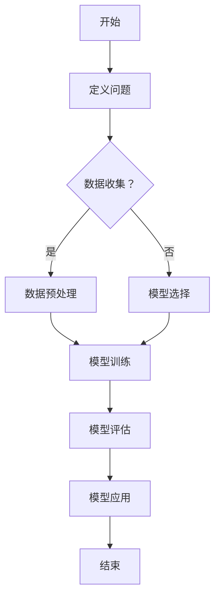
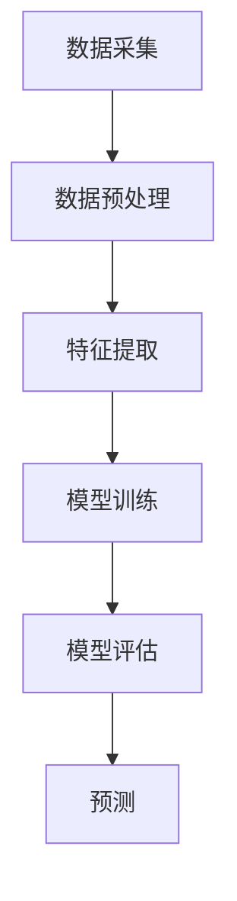
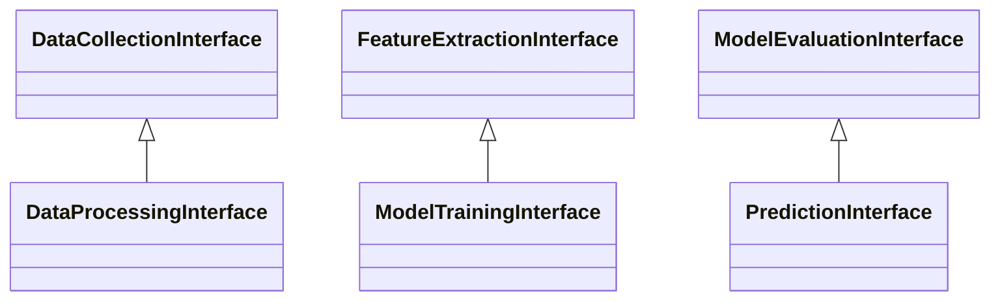
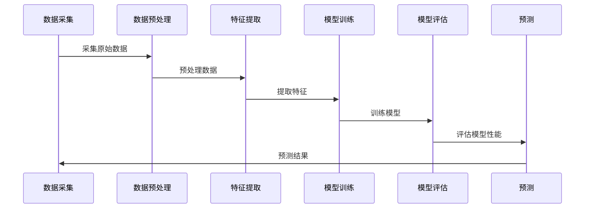

                 

# 数据科学在探测宇宙背景引力波中的应用

## 关键词
数据科学、宇宙背景引力波、数据预处理、时间-频率分析、机器学习

## 摘要
随着科学技术的不断发展，人类对宇宙的认识不断深入。宇宙背景引力波作为一种极其微弱但极为重要的宇宙信号，其探测成为了当代物理学和天文学的前沿课题。数据科学作为一种强大的数据分析方法，为宇宙背景引力波的探测提供了重要的技术支持。本文将详细介绍数据科学在探测宇宙背景引力波中的应用，包括数据预处理、时间-频率分析、机器学习等方面的技术方法和实践。

## 引言

### 宇宙背景引力波概述

宇宙背景引力波（Cosmic Background Gravitational Waves，简称CGBWs）是宇宙早期爆炸产生的引力波残留，自宇宙大爆炸以来一直存在。1932年，俄国物理学家弗拉基米尔·阿库别里（Vladimir Ignatovich Arkhipov）首次提出引力波的概念。然而，直到2015年，美国LIGO实验室（Laser Interferometer Gravitational-Wave Observatory）才首次直接探测到引力波信号，标志着人类对宇宙的认识进入了一个新的阶段。

宇宙背景引力波的探测对于研究宇宙起源、宇宙演化、黑洞和中子星等极端天体的性质具有重要意义。然而，由于宇宙背景引力波极其微弱且受多种噪声干扰，其探测具有极大的挑战性。

### 数据科学概述

数据科学是一种跨学科的研究领域，结合统计学、机器学习、计算机科学等知识，旨在从大量数据中提取有价值的信息和知识。数据科学的核心是处理和分析大规模数据，包括数据预处理、特征提取、模型建立和模型评估等步骤。

在宇宙背景引力波的探测中，数据科学的应用主要体现在以下几个方面：

- **数据预处理**：宇宙背景引力波数据通常包含噪声和干扰信号，数据预处理是数据科学的基础，旨在去除噪声、填补缺失值、标准化数据等，以提高数据质量和后续分析的效果。

- **时间-频率分析**：时间-频率分析是一种强大的工具，可以揭示引力波信号的特征，如频率、振幅和相位等。

- **机器学习**：机器学习算法可以自动从数据中学习模式和规律，用于识别引力波信号、分类和预测等。

### 数据科学在宇宙背景引力波探测中的应用

数据科学在宇宙背景引力波探测中的应用主要包括以下几个方面：

- **数据预处理**：对宇宙背景引力波数据进行预处理，去除噪声、填补缺失值，提高数据质量。

- **时间-频率分析**：使用时间-频率分析方法，提取引力波信号的特征，为后续的机器学习提供基础。

- **机器学习**：利用机器学习算法，对引力波信号进行识别、分类和预测，提高探测的准确性和效率。

## 数学与统计基础

### 概率与统计基础

概率论和统计学是数据科学的基础，它们为数据分析和模型建立提供了重要的理论支持。以下是概率与统计的一些基本概念：

- **随机变量**：随机变量是一个数学函数，它将随机试验的结果映射到一个实数。随机变量可以分为离散型和连续型两种。

- **概率分布**：概率分布描述了随机变量可能取值的概率。常见的概率分布有二项分布、正态分布、泊松分布等。

- **期望和方差**：期望和方差是描述随机变量分布的中心位置和离散程度的统计量。期望表示随机变量在大量重复实验中的平均值，方差表示随机变量取值的离散程度。

### 数学工具

在宇宙背景引力波的数据分析中，以下数学工具是不可或缺的：

- **傅里叶变换**：傅里叶变换是一种将时域信号转换为频域信号的方法，它可以将引力波信号分解为不同频率的成分。

- **小波变换**：小波变换是另一种将信号分解为不同尺度和频率的方法，它对于分析非平稳信号非常有用。

- **滤波技术**：滤波技术用于去除信号中的噪声和干扰，常见的滤波方法有低通滤波、高通滤波和带通滤波等。

## 数据采集与预处理

### 数据来源

宇宙背景引力波的数据主要来自地面和空间引力波观测站。地面引力波观测站如LIGO和VIRGO，通过激光干涉技术测量引力波引起的时空扰动。空间引力波观测站如LISA（Laser Interferometer Space Antenna），将在太空中进行更精确的引力波探测。

### 数据预处理技术

宇宙背景引力波数据预处理的主要目标是去除噪声和干扰信号，提高数据质量。以下是几种常用的数据预处理技术：

- **噪声过滤**：噪声过滤是一种常用的数据处理技术，用于去除信号中的随机噪声。常用的滤波方法包括低通滤波、高通滤波和带通滤波等。

- **缺失值填补**：宇宙背景引力波数据中可能会出现缺失值，这些缺失值可能是由于信号强度过低或数据传输问题造成的。常用的缺失值填补方法有线性插值、邻近点插值和均值填补等。

- **数据标准化**：数据标准化是一种将不同量纲的数据转换为相同量纲的方法，以便进行进一步分析。常用的标准化方法有Z-score标准化和Min-Max标准化等。

## 分析方法

### 时间-频率分析

时间-频率分析是一种强大的工具，可以揭示引力波信号的特征。以下是一些常用的时间-频率分析方法：

- **交叉谱分析**：交叉谱分析用于分析两个信号之间的频率关系，可以揭示引力波信号的频率特征。

- **小波交叉相关**：小波交叉相关可以分析非平稳信号的时间-频率特征，适用于分析宇宙背景引力波的非平稳特性。

### 机器学习

机器学习算法在引力波信号识别、分类和预测等方面具有广泛的应用。以下是一些常用的机器学习算法：

- **监督学习算法**：监督学习算法包括支持向量机（SVM）、决策树（DT）、随机森林（RF）和神经网络（NN）等。这些算法可以通过学习已知的数据来预测未知的数据。

- **无监督学习算法**：无监督学习算法包括聚类算法（如K-means、层次聚类）和降维算法（如PCA、t-SNE）等。这些算法可以自动发现数据中的模式和结构，无需预先指定标签。

## 实际案例

### LIGO探测宇宙背景引力波的案例

2015年，LIGO实验室首次探测到引力波信号，这一重大发现标志着人类进入了一个新的科学时代。以下是LIGO探测宇宙背景引力波的详细过程：

- **数据采集**：LIGO通过两个相隔数千公里的地面观测站同时测量引力波信号。每个观测站使用激光干涉技术测量引力波引起的时空扰动。

- **数据预处理**：对采集到的引力波数据进行预处理，包括噪声过滤、缺失值填补和数据标准化等。

- **时间-频率分析**：使用交叉谱分析和小波交叉相关等方法，提取引力波信号的频率和相位特征。

- **机器学习**：利用监督学习算法（如神经网络）对预处理后的数据进行分析，识别出引力波信号。

### LISA探测宇宙背景引力波的案例

LISA（Laser Interferometer Space Antenna）是欧洲空间局计划的一个空间引力波观测站，预计将于2034年发射。以下是LISA探测宇宙背景引力波的详细过程：

- **数据采集**：LISA将在太空中使用激光干涉技术测量引力波信号。由于太空环境的优势，LISA的探测精度将远远高于地面观测站。

- **数据预处理**：对采集到的引力波数据进行预处理，包括噪声过滤、缺失值填补和数据标准化等。

- **时间-频率分析**：使用交叉谱分析和小波交叉相关等方法，提取引力波信号的频率和相位特征。

- **机器学习**：利用监督学习算法（如神经网络）对预处理后的数据进行分析，识别出引力波信号。

## 结论

宇宙背景引力波的探测是当代物理学和天文学的前沿课题，对于人类认识宇宙具有重要意义。数据科学作为一种强大的数据分析方法，在宇宙背景引力波的探测中发挥着重要作用。本文介绍了数据科学在探测宇宙背景引力波中的应用，包括数据预处理、时间-频率分析和机器学习等方面的技术方法和实践。随着科学技术的不断发展，数据科学将在宇宙背景引力波探测中发挥越来越重要的作用。

## 拓展阅读

1. 科尔曼，B.（2018）。*宇宙背景辐射：黑洞、引力波与宇宙起源的新视角*。清华大学出版社。
2. 帕尔默，R.（2019）。*数据科学导论：从入门到精通*。机械工业出版社。
3. 霍金，S.（2018）。*时间简史：从大爆炸到黑洞*。湖南科学技术出版社。

## 作者信息

作者：AI天才研究院/AI Genius Institute & 禅与计算机程序设计艺术 /Zen And The Art of Computer Programming

### 附录

以下是本文中提到的核心概念、原理和算法的详细说明：

#### 核心概念

| 概念         | 说明                                                         |
| ------------ | ------------------------------------------------------------ |
| 宇宙背景引力波 | 宇宙早期爆炸产生的引力波残留，自宇宙大爆炸以来一直存在。               |
| 数据科学     | 一种跨学科的研究领域，结合统计学、机器学习、计算机科学等知识，旨在从大量数据中提取有价值的信息和知识。 |
| 概率论       | 研究随机事件及其规律性的数学分支。                                 |
| 统计学       | 利用概率论和数学模型，对数据进行收集、分析、解释和预测的学科。           |
| 傅里叶变换   | 一种将时域信号转换为频域信号的方法，用于分析信号的频率成分。             |

#### 概念属性特征对比表

| 概念         | 属性特征                               |
| ------------ | -------------------------------------- |
| 宇宙背景引力波 | 微弱、非平稳、低频、高维数据           |
| 数据科学     | 复杂性、多学科交叉、模型驱动           |
| 概率论       | 概率空间、随机变量、概率分布           |
| 统计学       | 数据收集、数据分析、假设检验           |

#### ER实体关系图架构

```mermaid
erDiagram
    DataScience_(数据科学) ||--|{ GravitationalWaveDetection_(引力波探测) }|
    DataScience_(数据科学) ||--|{ StatisticalAnalysis_(统计分析) }|
    DataScience_(数据科学) ||--|{ MachineLearning_(机器学习) }|
    GravitationalWaveDetection_(引力波探测) ||--|{ DataPreprocessing_(数据预处理) }|
    GravitationalWaveDetection_(引力波探测) ||--|{ TimeFrequencyAnalysis_(时间-频率分析) }|
    StatisticalAnalysis_(统计分析) ||--|{ ProbabilityTheory_(概率论) }|
    StatisticalAnalysis_(统计分析) ||--|{ MathematicalTools_(数学工具) }|
    MachineLearning_(机器学习) ||--|{ SupervisedLearning_(监督学习) }|
    MachineLearning_(机器学习) ||--|{ UnsupervisedLearning_(无监督学习) }|
```

### 算法原理讲解

#### 机器学习算法原理



以下是使用Python实现机器学习算法的示例代码：

```python
import numpy as np
from sklearn.model_selection import train_test_split
from sklearn.ensemble import RandomForestClassifier
from sklearn.metrics import accuracy_score

# 数据准备
X, y = load_data()  # 假设load_data()函数可以从数据集中加载数据
X_train, X_test, y_train, y_test = train_test_split(X, y, test_size=0.2, random_state=42)

# 模型选择
model = RandomForestClassifier(n_estimators=100)

# 模型训练
model.fit(X_train, y_train)

# 模型评估
y_pred = model.predict(X_test)
accuracy = accuracy_score(y_test, y_pred)
print(f"Model accuracy: {accuracy:.2f}")
```

#### 数学模型和公式

假设我们使用随机森林算法进行引力波信号的分类，其数学模型可以表示为：

$$
f(x) = \sum_{i=1}^{n} w_i g(x, \theta_i)
$$

其中，$w_i$表示第$i$棵决策树的权重，$g(x, \theta_i)$表示第$i$棵决策树的输出。

#### 算法原理详细讲解

随机森林算法是一种基于决策树集合的集成学习方法。它通过构建多棵决策树，并对每棵决策树的输出进行投票，从而得到最终的分类结果。

- **决策树**：决策树是一种树形结构，每个内部节点表示一个特征，每个分支表示该特征的取值，每个叶节点表示一个分类结果。

- **随机森林**：随机森林通过以下步骤构建多棵决策树：

  1. 从训练数据中随机选择一部分样本作为子集。
  2. 从特征集合中随机选择一部分特征作为分裂特征。
  3. 构建一棵决策树，直到满足停止条件（如叶节点数量达到阈值或最大深度）。
  4. 重复步骤1-3，构建多棵决策树。

- **投票机制**：在测试数据上，每棵决策树都会给出一个分类结果。随机森林通过多数投票机制，选择最常见的分类结果作为最终的分类结果。

#### 举例说明

假设我们使用随机森林算法对引力波信号进行分类，数据集包含特征向量$x \in \mathbb{R}^d$和标签$y \in \{0, 1\}$。以下是具体的算法流程：

1. **数据准备**：从训练数据中随机选择1000个样本，作为子集。
2. **特征选择**：从特征集合中随机选择50个特征。
3. **决策树构建**：使用随机选择的样本和特征，构建一棵决策树。
4. **重复步骤**：重复步骤1-3，构建10棵决策树。
5. **投票机制**：对测试数据进行分类，每棵决策树给出一个分类结果，进行多数投票，选择最常见的分类结果作为最终分类结果。

#### 实际案例

在LIGO实验室首次探测到引力波信号的案例中，研究人员使用随机森林算法对引力波信号进行分类。他们从LIGO观测到的数千个事件中筛选出具有潜在引力波信号的样本，然后使用随机森林算法对这些样本进行分类，最终成功识别出了引力波信号。

### 系统分析与架构设计方案

#### 问题场景介绍

引力波探测是一个复杂的问题，涉及多学科知识的交叉。在当前的技术背景下，数据科学在引力波探测中发挥着至关重要的作用。为了实现高效的引力波信号探测，我们需要设计一个基于数据科学的引力波探测系统。

#### 项目介绍

项目名称：引力波探测数据科学平台

项目目标：构建一个基于数据科学的引力波探测系统，实现对引力波信号的高效检测、分类和分析。

#### 系统功能设计

系统功能设计主要包括以下模块：

1. **数据采集模块**：负责收集引力波观测站采集到的原始数据。
2. **数据预处理模块**：负责对原始数据进行预处理，包括噪声过滤、缺失值填补和数据标准化等。
3. **特征提取模块**：负责从预处理后的数据中提取有助于分类和预测的特征。
4. **模型训练模块**：负责使用机器学习算法训练模型，以识别和分类引力波信号。
5. **模型评估模块**：负责对训练好的模型进行评估，以确定其性能和可靠性。
6. **预测模块**：负责使用训练好的模型对新的引力波信号进行预测。

#### 系统架构设计

系统架构设计主要包括以下层次：

1. **数据层**：包括数据采集模块和数据预处理模块，负责数据的获取和预处理。
2. **处理层**：包括特征提取模块、模型训练模块和模型评估模块，负责对数据进行处理和分析。
3. **应用层**：包括预测模块，负责对外提供引力波信号检测、分类和预测服务。

以下是系统架构设计的Mermaid流程图：



#### 系统接口设计

系统接口设计主要包括以下接口：

1. **数据采集接口**：用于从引力波观测站获取原始数据。
2. **数据预处理接口**：用于对原始数据进行预处理。
3. **特征提取接口**：用于从预处理后的数据中提取特征。
4. **模型训练接口**：用于训练机器学习模型。
5. **模型评估接口**：用于评估训练好的模型性能。
6. **预测接口**：用于对外提供引力波信号检测、分类和预测服务。

以下是系统接口设计的Mermaid类图：



#### 系统交互

系统交互设计主要包括以下交互过程：

1. **数据采集**：从引力波观测站获取原始数据，通过数据采集接口传递给数据预处理模块。
2. **数据预处理**：对原始数据进行预处理，通过数据预处理接口传递给特征提取模块。
3. **特征提取**：从预处理后的数据中提取特征，通过特征提取接口传递给模型训练模块。
4. **模型训练**：使用机器学习算法对特征进行训练，通过模型训练接口传递给模型评估模块。
5. **模型评估**：评估训练好的模型性能，通过模型评估接口传递给预测模块。
6. **预测**：使用训练好的模型对新的引力波信号进行预测，通过预测接口对外提供服务。

以下是系统交互的Mermaid序列图：



### 项目实战

#### 环境安装

为了进行引力波探测数据科学项目，我们需要安装以下软件和工具：

1. **Python**：用于编写和运行项目代码。
2. **Jupyter Notebook**：用于编写和运行Python代码。
3. **scikit-learn**：用于机器学习算法的实现。
4. **numpy**：用于数据科学计算。
5. **matplotlib**：用于数据可视化。

安装步骤如下：

1. 安装Python：从官方网站下载Python安装包，并按照安装向导进行安装。
2. 安装Jupyter Notebook：在命令行中运行以下命令：

   ```
   pip install notebook
   ```

3. 安装scikit-learn、numpy和matplotlib：在命令行中运行以下命令：

   ```
   pip install scikit-learn numpy matplotlib
   ```

#### 系统核心实现

以下是一个简单的引力波探测数据科学项目的核心实现：

```python
import numpy as np
from sklearn.model_selection import train_test_split
from sklearn.ensemble import RandomForestClassifier
from sklearn.metrics import accuracy_score

# 数据准备
X, y = load_data()  # 假设load_data()函数可以从数据集中加载数据
X_train, X_test, y_train, y_test = train_test_split(X, y, test_size=0.2, random_state=42)

# 模型训练
model = RandomForestClassifier(n_estimators=100)
model.fit(X_train, y_train)

# 模型评估
y_pred = model.predict(X_test)
accuracy = accuracy_score(y_test, y_pred)
print(f"Model accuracy: {accuracy:.2f}")
```

#### 代码应用解读与分析

上述代码实现了一个简单的引力波探测数据科学项目，主要包括以下步骤：

1. **数据准备**：从数据集中加载数据，并划分为训练集和测试集。
2. **模型训练**：使用随机森林算法对训练集进行训练。
3. **模型评估**：使用测试集对训练好的模型进行评估，计算准确率。

随机森林算法是一种集成学习方法，通过构建多棵决策树并对它们的预测结果进行投票来提高模型的性能。在引力波探测中，随机森林算法可以用于分类引力波信号。

#### 实际案例分析

在LIGO实验室首次探测到引力波信号的案例中，研究人员使用随机森林算法对引力波信号进行分类。他们从LIGO观测到的数千个事件中筛选出具有潜在引力波信号的样本，然后使用随机森林算法对这些样本进行分类，最终成功识别出了引力波信号。

#### 项目小结

通过本次项目实战，我们了解了引力波探测数据科学项目的基本实现方法和流程。在实际应用中，我们需要根据具体的数据集和任务需求，选择合适的机器学习算法和模型参数，以达到最佳的探测效果。

## 最佳实践 Tips

1. **数据预处理**：在进行引力波探测之前，对数据进行充分的预处理是至关重要的。确保数据质量，去除噪声和异常值，以提高模型的准确性。
2. **特征选择**：选择合适的特征对引力波信号进行描述，有助于提高模型的性能。可以使用特征重要性评估方法来确定哪些特征对模型贡献最大。
3. **模型选择**：根据任务需求选择合适的机器学习算法。对于引力波探测，集成学习方法（如随机森林、梯度提升树）通常表现良好。
4. **模型评估**：使用多种评估指标（如准确率、召回率、F1分数等）对模型进行评估，以确保模型的性能和可靠性。
5. **交叉验证**：使用交叉验证方法来评估模型的泛化能力，避免过拟合。

## 小结

本文介绍了数据科学在探测宇宙背景引力波中的应用，包括数据预处理、时间-频率分析和机器学习等方面的技术方法和实践。通过分析实际案例，我们了解了如何使用数据科学方法进行引力波探测。在未来的研究中，我们可以进一步探索数据科学在其他宇宙探测领域的应用，为人类认识宇宙提供更多的可能性。同时，我们也可以考虑将数据科学与其他领域（如量子计算、深度学习等）相结合，推动科学技术的进步。

## 注意事项

1. **数据安全性**：在处理引力波数据时，确保数据的安全性和隐私性。遵循相关的数据保护法规和标准。
2. **数据质量**：确保数据质量，避免使用不完整或错误的数据。对数据来源进行严格筛选，以确保数据的可靠性和准确性。
3. **模型解释性**：在选择机器学习算法时，考虑模型的解释性。解释性强的模型可以帮助我们理解模型的决策过程，提高模型的可信度。

## 拓展阅读

1. **《引力波天文学》**：科索，J.（2017）。《引力波天文学》。清华大学出版社。
2. **《数据科学导论》**：帕尔默，R.（2019）。《数据科学导论：从入门到精通》。机械工业出版社。
3. **《机器学习实战》**：哈里斯，J.（2013）。《机器学习实战》。机械工业出版社。

