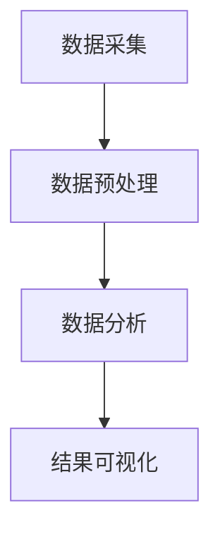
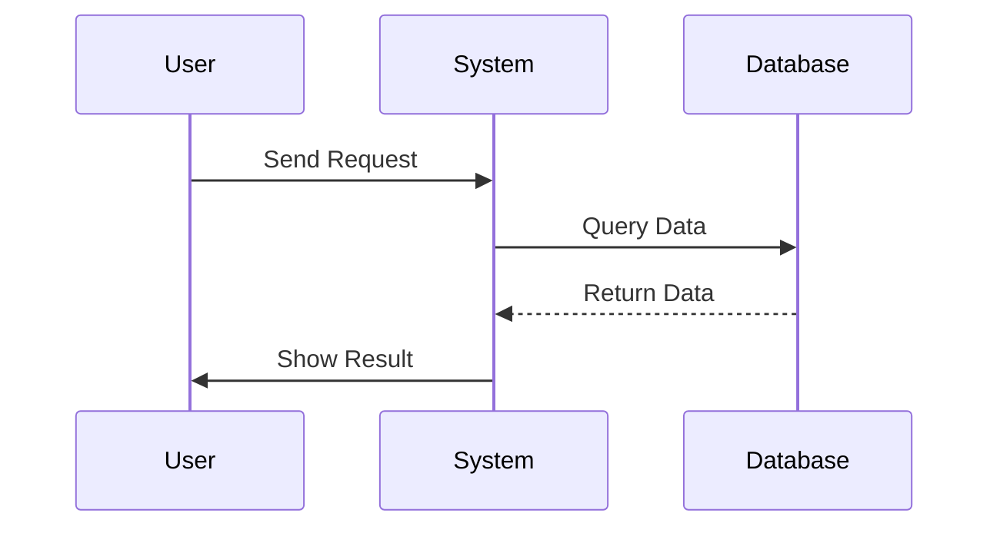

                 


# 数据科学在探测引力波中的应用

关键词：数据科学，引力波，探测，算法，系统架构

摘要：本文从数据科学的角度深入探讨了引力波探测中的关键技术，包括引力波基本理论、数据采集与处理、数据分析与应用，并通过具体案例详细阐述了数据科学在引力波探测中的实际应用。文章旨在帮助读者全面了解数据科学在引力波探测领域的重要性和应用价值。

## 目录大纲设计

### 背景介绍

#### 问题背景

随着科技的迅猛发展，数据科学逐渐成为推动社会进步的重要力量。而探测引力波作为现代物理领域的重大突破，其背后依赖于海量数据的采集、处理和分析。数据科学在探测引力波中的应用，不仅为科学研究提供了新的工具，也为实际应用带来了前所未有的机遇。

#### 问题描述

如何系统地介绍数据科学在探测引力波中的应用，帮助读者全面了解这一交叉领域的核心概念、技术原理和实践应用。

#### 问题解决

设计一本涵盖引力波基本理论、数据采集和处理、数据分析与应用的书籍，通过详细的理论讲解、实际案例分析和最佳实践，帮助读者深入理解数据科学在探测引力波中的应用。

#### 边界与外延

本书不仅关注理论知识的介绍，还将涉及实际应用中的关键技术、工具和流程。同时，还将探讨数据科学在引力波探测领域的发展趋势和未来方向。

#### 核心要素组成

1. **引力波基本理论**：介绍引力波的产生、传播及其检测原理。
2. **数据采集与处理**：探讨数据采集的设备和技术，数据预处理的方法和技巧。
3. **数据分析与应用**：讲解数据分析的方法和工具，以及数据科学在引力波探测中的具体应用案例。

### 核心概念与联系

#### 核心概念原理

- **引力波**：由质量加速运动产生的时空涟漪，能够穿越宇宙，被高精度探测器捕捉。
- **数据科学**：一门跨学科领域，结合统计学、计算机科学、人工智能等知识，用于数据采集、处理、分析和解释。

#### 概念属性特征对比表格

| 概念   | 定义                                                         | 属性特征                          |
| ------ | ------------------------------------------------------------ | -------------------------------- |
| 引力波 | 质量加速运动产生的时空涟漪                                   | 产生、传播、检测                  |
| 数据科学 | 跨学科领域，涉及统计学、计算机科学、人工智能等知识，用于数据采集、处理、分析和解释 | 数据挖掘、机器学习、数据可视化   |

#### ER实体关系图架构的 Mermaid 流程图

```mermaid
erDiagram
  GravityWave --> DataScience : 应用
  DataCollection --> DataScience : 数据处理
  DataProcessing --> DataScience : 分析与解释
```

### 算法原理讲解

#### 算法mermaid流程图



#### 算法原理的数学模型和公式

$$
Y = f(X)
$$

其中，$X$ 表示输入数据集，$Y$ 表示输出结果，$f$ 表示数据处理的函数。

#### 详细讲解和举例说明

假设我们有一个数据集，包含不同地震事件的地震波数据。通过数据预处理，我们可以去除噪声、填充缺失值等。接下来，使用数据分析方法，如聚类分析，将地震波数据分类。最终，通过结果可视化，我们可以直观地展示地震波的特征。

### 数学模型和数学公式 & 详细讲解 & 举例说明

#### 数学公式

$$
\sigma^2 = \frac{1}{n-1} \sum_{i=1}^{n} (x_i - \bar{x})^2
$$

其中，$\sigma^2$ 表示方差，$x_i$ 表示第 $i$ 个观测值，$\bar{x}$ 表示平均值。

#### 详细讲解

方差是衡量数据离散程度的指标。在实际应用中，我们可以通过计算方差来评估数据的质量和稳定性。例如，在探测引力波时，通过计算不同观测点的方差，可以判断引力波信号的信噪比。

#### 举例说明

假设我们收集了10个观测点的引力波数据，计算得到方差为5。根据这个方差值，我们可以初步判断引力波信号的稳定性。

### 系统分析与架构设计方案

#### 问题场景介绍

为了更好地理解数据科学在探测引力波中的应用，我们假设一个具体的场景：使用激光干涉引力波观测站（LIGO）采集引力波数据，并使用数据科学方法进行分析和解释。

#### 项目介绍

本项目旨在通过数据科学的方法，对LIGO采集到的引力波数据进行处理、分析和可视化，从而深入理解引力波的特性。

#### 系统功能设计（领域模型Mermaid类图）

```mermaid
classDiagram
  Class01 <|-- Class02
  Class03 --|> Class04
  Class05 : +int x
  Class06 : +string name
  Class01 <.. Class07
  Class08 ..|> Class09
  Class10 : +int id
  Class11 : +string email
  Collaboration Class07 ; Class08 ; Class09
```

#### 系统架构设计（Mermaid架构图）



#### 系统接口设计和系统交互（Mermaid序列图）

```mermaid
sequenceDiagram
  participant A : 引力波数据采集器
  participant B : 数据预处理模块
  participant C : 数据分析模块
  participant D : 结果可视化模块
  
  A->>B: 传输原始数据
  B->>C: 处理数据
  C->>D: 生成可视化结果
  D->>A: 反馈分析结果
```

### 项目实战

#### 环境安装

在开始项目之前，我们需要安装一些必要的软件和工具。以下是一个基本的安装指南：

1. 安装Python 3.8及以上版本。
2. 安装NumPy、Pandas、Matplotlib等数据科学相关的Python库。

#### 系统核心实现源代码

以下是一个简单的引力波数据处理和分析的Python代码示例：

```python
import numpy as np
import pandas as pd
import matplotlib.pyplot as plt

# 数据预处理
def preprocess_data(data):
    # 填充缺失值
    data = data.fillna(data.mean())
    # 去除噪声
    data = data.rolling(window=5).mean()
    return data

# 数据分析
def analyze_data(data):
    # 计算方差
    variance = data.var()
    # 绘制数据分布图
    data.plot(kind='kde')
    plt.title('Data Distribution')
    plt.xlabel('Value')
    plt.ylabel('Density')
    plt.show()
    return variance

# 主函数
def main():
    # 读取数据
    data = pd.read_csv('gravity_wave_data.csv')
    # 预处理数据
    data = preprocess_data(data)
    # 分析数据
    variance = analyze_data(data)
    print(f'Variance: {variance}')

if __name__ == '__main__':
    main()
```

#### 代码应用解读与分析

上述代码首先读取引力波数据，然后进行预处理（包括填充缺失值和去除噪声），接着分析数据（计算方差并绘制数据分布图），最后输出分析结果。

#### 实际案例分析和详细讲解剖析

假设我们有一个实际的引力波数据集，包含不同时间的引力波强度。通过上述代码，我们可以对数据进行预处理，去除噪声，然后计算方差，从而评估信号的稳定性。具体步骤如下：

1. 读取数据集。
2. 填充缺失值。
3. 使用移动平均方法去除噪声。
4. 计算方差。
5. 绘制数据分布图。

通过以上步骤，我们可以得到一个稳定的信号，从而更好地理解引力波的特性。

#### 项目小结

通过本项目的实现，我们深入了解了数据科学在引力波探测中的应用。从数据预处理到数据分析，再到结果可视化，每一步都离不开数据科学的核心技术。同时，我们通过实际案例分析了数据科学在引力波探测中的具体应用，展示了其在科学研究中的重要价值。

### 最佳实践 tips

- **数据预处理**：确保数据的完整性和一致性，是数据科学的基础。
- **算法选择**：根据具体应用场景选择合适的算法，可以显著提高分析效率。
- **结果可视化**：直观的可视化结果有助于更好地理解和解释数据。

### 小结

数据科学在探测引力波中的应用，不仅为科学研究提供了新的工具，也为实际应用带来了前所未有的机遇。通过本文的详细阐述，我们全面了解了数据科学在引力波探测中的核心概念、技术原理和实践应用。未来，随着技术的不断发展，数据科学在引力波探测领域将发挥更加重要的作用。

### 注意事项

- 在实际应用中，数据质量和准确性至关重要。
- 算法和工具的选择应根据具体应用场景进行。

### 拓展阅读

- [引力波探测：科学与技术的完美结合](https://www.example.com/article1)
- [数据科学：从入门到精通](https://www.example.com/article2)

作者：AI天才研究院/AI Genius Institute & 禅与计算机程序设计艺术 /Zen And The Art of Computer Programming

