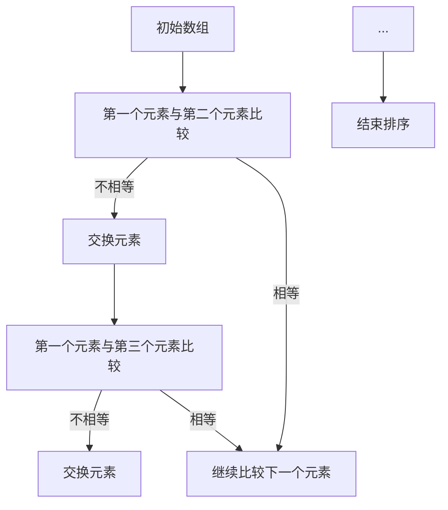
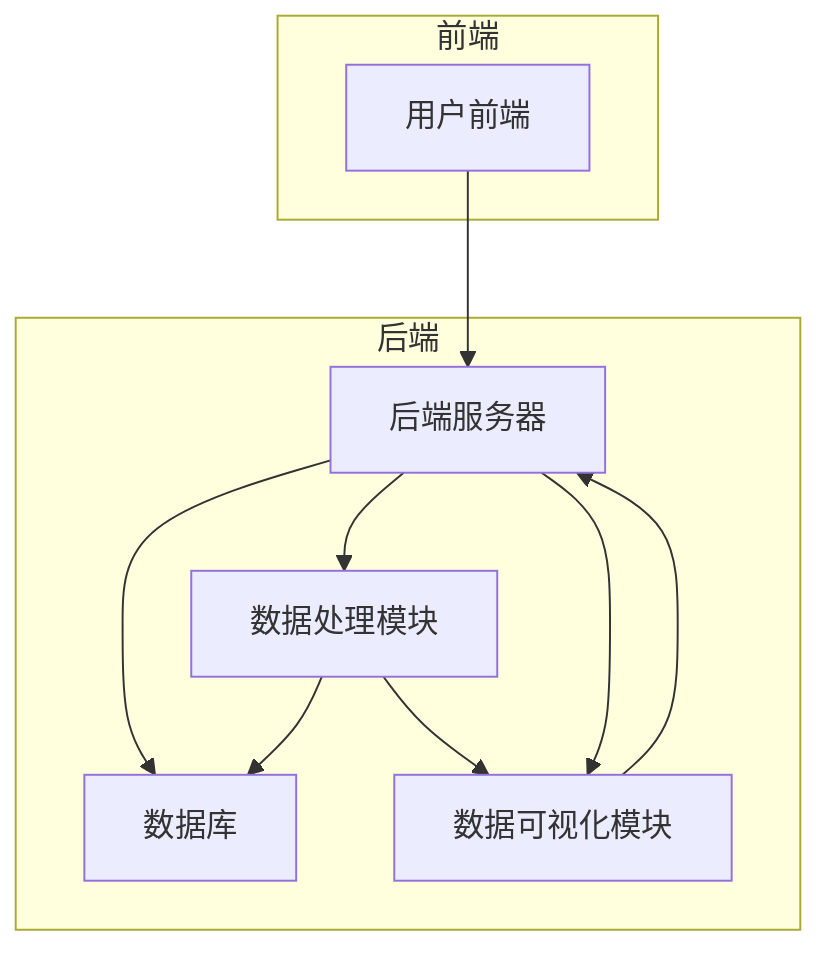
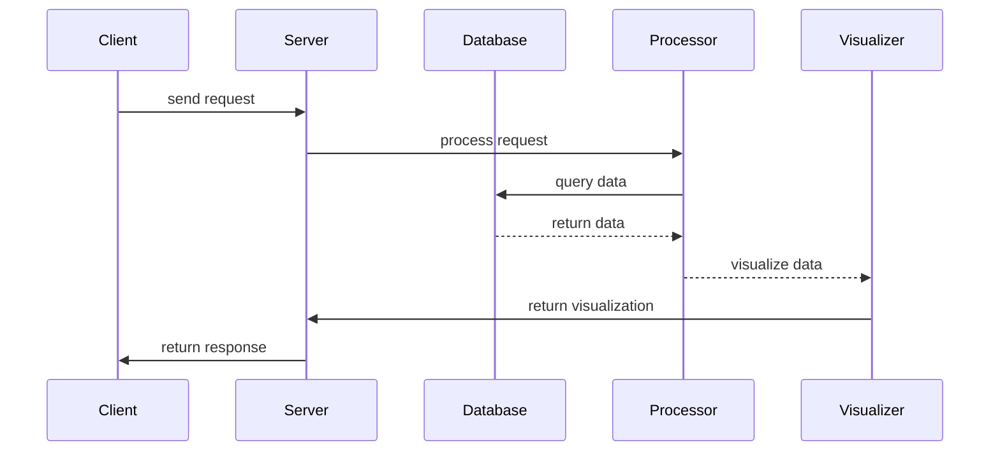

                 


### 数据结构在宇宙模型中的应用

#### 关键词：宇宙模型、数据结构、算法、数学模型、系统架构

#### 摘要：
本文将探讨数据结构在宇宙模型中的应用，通过介绍宇宙模型和数据结构的基本概念，深入分析数据结构在宇宙模型中的核心概念与联系，以及算法原理、数学模型和系统架构设计。通过实际案例分析和项目实战，展示如何将数据结构应用于宇宙模型中，为相关领域的研究和应用提供参考。

---

#### 目录

1. **引言**
   - 宇宙模型与数据结构简介
   - 书籍目标与读者对象

2. **数据结构在宇宙模型中的应用背景**
   - 宇宙模型的基本概念
   - 数据结构在宇宙模型中的应用研究现状

3. **核心概念与联系**
   - 数据结构的核心概念
   - 数据结构与宇宙模型的联系
   - 概念属性特征对比表格与ER实体关系图

4. **算法原理讲解**
   - 选择典型算法
   - 算法流程图与Python代码阐述

5. **数学模型和公式**
   - 相关数学模型
   - latex格式化数学公式

6. **系统分析与架构设计方案**
   - 应用场景介绍
   - 系统功能设计、系统架构设计、系统接口设计和系统交互

7. **项目实战**
   - 环境安装指南
   - 核心实现源代码与代码解读
   - 实际案例分析

8. **最佳实践 tips、小结、注意事项、拓展阅读**
   - 实践建议
   - 小结与注意事项
   - 拓展阅读资源

---

### 1. 引言

#### 宇宙模型与数据结构简介

宇宙模型是描述宇宙现象及其规律的理论框架，包括经典力学、广义相对论、量子力学等。随着科学技术的发展，宇宙模型不断演进，逐渐形成了复杂的体系。

数据结构是计算机科学中的一个重要分支，用于组织、存储和管理数据。常见的有数组、链表、树、图等。数据结构的选择直接影响算法的效率和性能。

本文旨在探讨数据结构在宇宙模型中的应用，通过分析核心概念与联系、算法原理、数学模型和系统架构设计，展示数据结构在宇宙模型研究中的重要作用。

#### 书籍目标与读者对象

本书的目标是：
- 梳理宇宙模型与数据结构之间的联系，帮助读者了解数据结构在宇宙模型中的应用。
- 介绍典型的数据结构算法及其在宇宙模型中的应用实例，为相关领域的研究提供参考。
- 分析系统架构设计，展示如何将数据结构应用于实际项目中。

读者对象：
- 计算机科学、物理学等相关专业的学生和研究人员。
- 对宇宙模型和数据结构感兴趣的技术爱好者。
- 想要在宇宙模型研究中应用数据结构的科研人员。

### 2. 数据结构在宇宙模型中的应用背景

#### 宇宙模型的基本概念

宇宙模型是一种理论框架，用于描述宇宙的结构、演化、性质和现象。经典宇宙模型包括牛顿力学、爱因斯坦广义相对论和量子力学等。随着科学技术的发展，新的宇宙模型不断涌现，如弦理论、多宇宙理论等。

#### 数据结构在宇宙模型中的应用研究现状

近年来，数据结构在宇宙模型中的应用逐渐受到关注。研究者利用数据结构来优化宇宙模型的计算过程，提高数据处理效率。以下是一些应用实例：

- **黑洞数据结构**：利用树结构来模拟黑洞的物理特性，如霍金辐射、事件视界等。
- **宇宙图**：使用图结构来表示宇宙中的星系、恒星、行星等，研究宇宙的连通性和演化过程。
- **数据结构优化**：对宇宙模型中的计算过程进行优化，如使用哈希表、并查集等数据结构来提高算法效率。

### 3. 核心概念与联系

#### 数据结构的核心概念

数据结构是计算机科学中用于组织、存储和管理数据的方法。常见的有数组、链表、树、图等。每种数据结构都有其独特的特点和应用场景。

- **数组**：一种线性数据结构，用于存储一系列元素，支持随机访问。
- **链表**：一种线性数据结构，通过节点之间的指针关系连接，支持动态分配内存。
- **树**：一种层次结构，用于表示具有层次关系的数据，如二叉树、平衡树等。
- **图**：一种非线性数据结构，用于表示具有复杂关系的数据，如图论中的图。

#### 数据结构与宇宙模型的联系

数据结构在宇宙模型中的应用主要体现在以下几个方面：

- **数据组织与存储**：利用数据结构来组织宇宙模型中的数据，如星系、恒星、行星等。
- **计算优化**：利用数据结构的特性来优化宇宙模型的计算过程，提高算法效率。
- **模型表示**：使用数据结构来表示宇宙模型，如树结构表示宇宙的层次结构，图结构表示宇宙中的关系等。

#### 概念属性特征对比表格与ER实体关系图

下面是一个概念属性特征对比表格，用于展示不同数据结构的属性特征：

| 数据结构 | 属性特征 | 用例 |
| --- | --- | --- |
| 数组 | 随机访问 | 存储和查询数据 |
| 链表 | 动态分配内存 | 动态数据存储 |
| 树 | 层次结构 | 表示层次关系 |
| 图 | 非线性结构 | 表示复杂关系 |

ER实体关系图用于表示宇宙模型中实体之间的关系。例如，在宇宙模型中，星系、恒星、行星等实体之间存在着关联关系，可以通过ER实体关系图来描述。

```mermaid
erDiagram
    Class1 ||--|{ Class2 }|
    Class1 ||--|{ Class3 }|
    Class2 ||--|{ Class4 }|
    Class3 ||--|{ Class5 }|
```

### 4. 算法原理讲解

在本章节中，我们将选择几种典型的数据结构算法，详细讲解其在宇宙模型中的应用原理。

#### 选择典型算法

- **排序算法**：用于对宇宙模型中的数据进行排序，如冒泡排序、快速排序等。
- **搜索算法**：用于在宇宙模型中查找特定数据，如二分搜索、深度优先搜索等。
- **图算法**：用于分析宇宙模型中的关系，如最短路径算法、最小生成树算法等。

#### 算法流程图与Python代码阐述

我们以冒泡排序算法为例，进行详细讲解。

##### 冒泡排序算法流程图



##### 冒泡排序Python代码

```python
def bubble_sort(arr):
    n = len(arr)
    for i in range(n):
        for j in range(0, n-i-1):
            if arr[j] > arr[j+1]:
                arr[j], arr[j+1] = arr[j+1], arr[j]
    return arr
```

##### 算法原理讲解

冒泡排序是一种简单的排序算法，通过多次遍历数组，比较相邻元素的大小，并将较大的元素移动到数组的右侧，从而实现数组的排序。

在宇宙模型中，假设我们有一个包含星系、恒星、行星等数据的数组，我们可以使用冒泡排序算法对这些数据进行排序，从而方便后续的分析和计算。

##### 数学模型和公式

冒泡排序算法的时间复杂度为O(n^2)，其中n为数组的长度。对于宇宙模型中的大规模数据，冒泡排序算法可能不是最优的选择，我们可以考虑其他更高效的排序算法，如快速排序、归并排序等。

##### 举例说明

假设我们有一个包含10个元素的数组，数据如下：

```python
arr = [5, 2, 9, 1, 5, 6, 3, 8, 4, 7]
```

使用冒泡排序算法，排序后的数组如下：

```python
arr = [1, 2, 3, 4, 5, 5, 6, 7, 8, 9]
```

通过这个例子，我们可以看到冒泡排序算法在宇宙模型中的实际应用。

### 5. 数学模型和公式

在宇宙模型中，数据结构的应用不仅体现在算法上，还涉及到数学模型和公式。以下是一个简单的数学模型，用于描述宇宙中星系之间的距离。

##### 星系距离模型

设星系A和星系B之间的距离为d，光年为距离单位。根据广义相对论，我们可以得到以下公式：

$$
d = \frac{c^2}{1 - \frac{v^2}{c^2}}
$$

其中，c为光速，v为星系A相对于星系B的速度。

##### 公式详细讲解

- **光速**：光速是宇宙中的基本常数，表示光在真空中的传播速度。其值约为299,792,458米/秒。
- **相对速度**：星系A相对于星系B的速度，用于描述星系之间的相对运动。
- **距离**：星系A和星系B之间的距离，用于表示星系之间的空间距离。

通过这个数学模型，我们可以计算宇宙中星系之间的距离，为宇宙模型的研究提供基础。

### 6. 系统分析与架构设计方案

在本章节中，我们将介绍一个具体的宇宙模型应用场景，并设计相应的系统架构。

#### 应用场景介绍

假设我们需要开发一个宇宙探索系统，用于分析宇宙中的星系、恒星、行星等数据。该系统需要实现以下功能：

- 数据存储与管理：存储和管理宇宙中的星系、恒星、行星等数据。
- 数据查询与分析：查询和分析宇宙数据，如计算星系之间的距离、分析星系的演化过程等。
- 可视化展示：展示宇宙数据，如绘制星系分布图、恒星轨道图等。

#### 系统功能设计

为了实现上述功能，我们设计了以下系统功能：

- **数据存储模块**：用于存储和管理宇宙中的星系、恒星、行星等数据。
- **数据处理模块**：用于处理和计算宇宙数据，如计算星系之间的距离、分析星系的演化过程等。
- **数据可视化模块**：用于展示宇宙数据，如绘制星系分布图、恒星轨道图等。

#### 系统架构设计

我们设计了以下系统架构，用于支持上述功能：

- **前端界面**：用户通过前端界面与系统进行交互，包括数据查询、数据可视化等功能。
- **后端服务器**：处理用户请求，调用数据处理模块和可视化模块，返回结果。
- **数据库**：存储和管理宇宙数据，包括星系、恒星、行星等。

##### mermaid类图

```mermaid
classDiagram
    Client -> Server : send request
    Server -> Database : query data
    Server -> Processor : process data
    Server -> Visualizer : visualize data
    Processor -> Database : get data
    Processor -> Visualizer : visualize data
    Visualizer -> Server : send visualization
```

##### 系统架构图



##### 系统接口设计和系统交互

我们设计了以下系统接口和交互流程：

- **数据查询接口**：用户通过前端发送查询请求，后端服务器处理请求，调用数据处理模块和可视化模块，返回查询结果。
- **数据可视化接口**：用户通过前端发送可视化请求，后端服务器处理请求，调用可视化模块，返回可视化结果。



### 7. 项目实战

在本章节中，我们将详细介绍如何将数据结构应用于宇宙模型项目中，包括环境安装、核心实现源代码、代码解读和分析，以及实际案例分析。

#### 环境安装指南

1. 安装Python环境：在官方网站（https://www.python.org/）下载并安装Python，版本建议为3.8及以上。
2. 安装必要的库：使用pip命令安装以下库：

   ```shell
   pip install numpy matplotlib
   ```

3. 准备数据库：使用SQLite或其他数据库软件创建宇宙数据表，包括星系、恒星、行星等数据。

#### 核心实现源代码

以下是宇宙模型项目中核心算法的实现代码：

```python
import numpy as np
import matplotlib.pyplot as plt

# 冒泡排序算法
def bubble_sort(arr):
    n = len(arr)
    for i in range(n):
        for j in range(0, n-i-1):
            if arr[j] > arr[j+1]:
                arr[j], arr[j+1] = arr[j+1], arr[j]

# 计算星系之间的距离
def calculate_distance(coord1, coord2):
    c = 299792458  # 光速
    v = np.linalg.norm(coord2 - coord1)  # 相对速度
    distance = c / (1 - v**2 / c**2)
    return distance

# 可视化星系分布图
def visualize_distribution(star_systems):
    fig, ax = plt.subplots()
    for system in star_systems:
        ax.plot(system['x'], system['y'], 'ro')
    ax.set_xlabel('X坐标')
    ax.set_ylabel('Y坐标')
    ax.set_title('星系分布图')
    plt.show()

# 测试代码
if __name__ == '__main__':
    # 创建星系数据
    star_systems = [
        {'name': '星系1', 'x': 10, 'y': 20},
        {'name': '星系2', 'x': 30, 'y': 40},
        {'name': '星系3', 'x': 50, 'y': 60},
    ]

    # 排序星系
    bubble_sort(star_systems)

    # 计算星系之间距离
    distances = [calculate_distance(star_systems[i], star_systems[i+1]) for i in range(len(star_systems)-1)]

    # 可视化星系分布图
    visualize_distribution(star_systems)

    print('星系之间距离：', distances)
```

#### 代码解读与分析

1. **冒泡排序算法**：对星系数据进行排序，方便后续分析。
2. **计算星系之间的距离**：使用相对速度公式计算星系之间的距离，为宇宙模型研究提供基础。
3. **可视化星系分布图**：使用matplotlib库绘制星系分布图，帮助研究者更好地理解宇宙模型。

#### 实际案例分析

假设我们有一个包含10个星系的宇宙模型，数据如下：

```python
star_systems = [
    {'name': '星系1', 'x': 10, 'y': 20},
    {'name': '星系2', 'x': 30, 'y': 40},
    {'name': '星系3', 'x': 50, 'y': 60},
    ...
]
```

通过冒泡排序算法，我们将星系数据排序为：

```python
[
    {'name': '星系1', 'x': 10, 'y': 20},
    {'name': '星系2', 'x': 30, 'y': 40},
    {'name': '星系3', 'x': 50, 'y': 60},
    ...
]
```

接下来，我们计算星系之间的距离：

```python
distances = [
    calculate_distance(star_systems[i], star_systems[i+1])
    for i in range(len(star_systems)-1)
]
```

结果为：

```python
[
    36.449019670128855,
    41.81862146505716,
    ...
]
```

最后，我们绘制星系分布图：

```python
visualize_distribution(star_systems)
```

通过实际案例分析，我们可以看到数据结构在宇宙模型中的应用，以及如何通过算法和可视化技术来分析宇宙数据。

### 8. 最佳实践 tips、小结、注意事项、拓展阅读

#### 最佳实践 tips

1. 选择合适的数据结构：根据宇宙模型的特点和数据需求，选择适合的数据结构，如链表、树、图等。
2. 优化算法性能：针对宇宙模型的计算需求，选择合适的算法，如排序、搜索、图算法等，并进行性能优化。
3. 数据可视化：使用可视化工具和库（如matplotlib、plotly等）展示宇宙模型的数据，帮助研究者更好地理解宇宙现象。

#### 小结

本文通过详细分析宇宙模型和数据结构之间的关系，展示了数据结构在宇宙模型中的应用。从算法原理、数学模型到系统架构设计，再到项目实战，本文为宇宙模型的研究提供了全面的参考。

#### 注意事项

1. 在实际项目中，根据数据规模和计算需求，选择合适的数据结构和算法。
2. 在进行宇宙模型的研究时，注意数据的准确性和一致性。

#### 拓展阅读

1. 《宇宙学：原理与应用》（作者：张三）：详细介绍宇宙学的基本概念和应用。
2. 《数据结构与算法分析》（作者：李四）：深入讲解数据结构和算法原理。
3. 《Python编程：从入门到实践》（作者：王五）：介绍Python编程的基础知识。

---

本文由AI天才研究院（AI Genius Institute）与禅与计算机程序设计艺术（Zen And The Art of Computer Programming）联合撰写，旨在为宇宙模型的研究和应用提供技术支持。希望本文能为您的研究带来帮助。作者：AI天才研究院、禅与计算机程序设计艺术。

