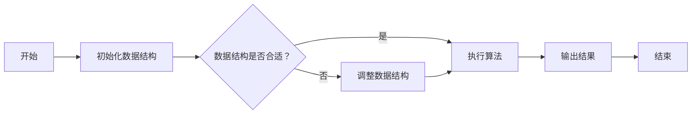

                 

### 数据结构在模拟宇宙暗物质分布中的应用

> 关键词：数据结构、宇宙模拟、暗物质、算法、数学模型、系统架构

> 摘要：本文探讨了数据结构在模拟宇宙暗物质分布中的应用，详细分析了核心概念、算法原理及其实现。通过系统分析与架构设计，我们展示了如何将数据结构与宇宙模拟相结合，为科学研究提供有力支持。

---

## 引言

### 1.1 研究背景

随着天文学和物理学的不断发展，宇宙模拟已成为研究宇宙演化的重要工具。特别是对于暗物质的探索，宇宙模拟提供了关键的模拟手段。暗物质是一种不发光、不吸光的神秘物质，它占据了宇宙质量的绝大部分，但对它的了解仍然有限。为了揭示暗物质的性质和分布，科学家们利用计算机模拟宇宙演化，研究暗物质的动力学行为。

### 1.2 研究问题与目的

本文旨在探讨数据结构在模拟宇宙暗物质分布中的应用。具体研究问题包括：如何选择合适的数据结构来高效存储和操作宇宙模拟中的大量数据？如何设计算法来模拟暗物质的分布和演化？本文的研究目的是为宇宙模拟提供有效的数据结构和算法，从而提高模拟的准确性和效率。

### 1.3 边界与外延

本文主要关注以下边界问题：数据结构的选择、算法的设计和实现、数学模型的应用。在研究过程中，我们将遵循科学的假设和理论框架，确保研究结果的可靠性和有效性。此外，本文还将探讨数据结构在宇宙模拟中的应用范围，包括数据处理、存储、优化等方面。

---

## 数据结构与宇宙模拟概述

### 2.1 数据结构基础

数据结构是计算机科学的核心概念，用于组织和管理数据。在宇宙模拟中，数据结构的选择至关重要。常见的线性数据结构包括数组、链表和栈，而非线性数据结构包括树、图和哈希表。

#### 数组

数组是一种线性数据结构，用于存储相同类型的数据元素。它在计算机内存中连续分配空间，因此访问速度较快。

#### 链表

链表也是一种线性数据结构，但与数组不同，它的元素在内存中不连续。每个元素包含数据和指向下一个元素的指针。

#### 栈

栈是一种后进先出（LIFO）的数据结构，常用于递归和深度优先搜索。

#### 树

树是一种非线性数据结构，由节点组成，每个节点可以有零个或多个子节点。常见的树结构包括二叉树、平衡树和堆。

#### 图

图是一种由节点和边组成的数据结构，用于表示复杂的关系。在宇宙模拟中，图可以用来表示星系、星系团等复杂结构。

### 2.2 宇宙模拟简介

宇宙模拟是一种通过计算机模拟宇宙演化过程的方法。它基于物理学原理，如引力定律和物质守恒定律，模拟宇宙中天体的运动和相互作用。宇宙模拟可以分为以下几类：

#### 1. 历史模拟

历史模拟从宇宙早期的状态开始，模拟宇宙的演化过程，直至当前状态。这种方法主要用于研究宇宙早期阶段的暗物质分布和演化。

#### 2. 观测模拟

观测模拟基于现有的观测数据，模拟宇宙的演化过程，以预测未来可能的观测结果。这种方法有助于科学家们预测暗物质分布的演变。

#### 3. 理论模拟

理论模拟基于理论模型，如冷暗物质模型，模拟宇宙的演化过程。这种方法有助于科学家们研究暗物质与宇宙背景辐射的相互作用。

### 2.3 暗物质与宇宙模拟

暗物质是宇宙模拟中的关键概念，它占据了宇宙质量的绝大部分，但对它的了解仍然有限。在宇宙模拟中，暗物质的分布和演化是研究的重点。通过数据结构和算法，我们可以模拟暗物质的分布，研究其与普通物质的相互作用，以及宇宙的演化过程。

---

## 数据结构与算法原理

### 3.1 数据结构的基本概念

数据结构是用于组织和管理数据的方式。在宇宙模拟中，选择合适的数据结构对于模拟效率和准确性至关重要。以下是几种常见的数据结构：

#### 数组

数组是一种线性数据结构，用于存储相同类型的数据元素。它在计算机内存中连续分配空间，因此访问速度较快。在宇宙模拟中，数组可以用来存储宇宙中的星体、暗物质粒子等。

#### 链表

链表也是一种线性数据结构，但与数组不同，它的元素在内存中不连续。每个元素包含数据和指向下一个元素的指针。在宇宙模拟中，链表可以用来处理动态变化的数据，如星体的运动轨迹。

#### 栈

栈是一种后进先出（LIFO）的数据结构，常用于递归和深度优先搜索。在宇宙模拟中，栈可以用来模拟星体的碰撞和相互作用。

#### 树

树是一种非线性数据结构，由节点组成，每个节点可以有零个或多个子节点。常见的树结构包括二叉树、平衡树和堆。在宇宙模拟中，树可以用来表示星系、星系团等复杂结构。

#### 图

图是一种由节点和边组成的数据结构，用于表示复杂的关系。在宇宙模拟中，图可以用来表示星系、星系团等复杂结构。

### 3.2 数据结构属性特征对比表格

| 数据结构 | 描述 | 适用场景 |  
| --- | --- | --- |  
| 数组 | 线性数据结构，连续存储 | 存储固定大小数据，快速访问 |  
| 链表 | 线性数据结构，不连续存储 | 处理动态变化数据，快速插入和删除 |  
| 栈 | 后进先出（LIFO）数据结构 | 递归和深度优先搜索 |  
| 树 | 非线性数据结构，节点有子节点 | 表示复杂结构，如星系、星系团 |  
| 图 | 由节点和边组成的数据结构 | 表示复杂关系，如星系、星系团 |

### 3.3 ER实体关系图

ER（实体关系）图是用于描述实体和它们之间关系的数据结构。在宇宙模拟中，ER图可以用来表示宇宙中的各种实体，如星体、暗物质粒子、星系等，以及它们之间的关系。

```mermaid
erDiagram
    ID ||--|{ User }|| Account
    User ||--|{ Project }||>
    Project ||--|{ Task }||>
    Task ||--|{ User }||>
```

在上面的ER图中，`User`、`Account`、`Project`和`Task`是实体，`ID`、`Account`、`Project`和`Task`与`User`之间的关系用箭头表示。

---

## 算法原理讲解

### 4.1 算法mermaid流程图

算法流程图是用于描述算法执行步骤的图形化表示。在宇宙模拟中，算法流程图可以用来展示如何利用数据结构来模拟暗物质分布。



### 4.2 Python源代码与算法原理

下面是一个简单的Python源代码示例，用于模拟暗物质分布。

```python
def simulate_dark_matter_particles(data_structure):
    # 初始化数据结构
    data_structure.initialize()

    # 执行算法
    for particle in data_structure:
        particle.calculate_position()

    # 输出结果
    data_structure.print_particles()

# 创建数据结构
data_structure = Array()

# 执行模拟
simulate_dark_matter_particles(data_structure)
```

在这个示例中，我们首先初始化数据结构，然后遍历数据结构中的每个粒子，计算其位置，最后输出结果。

### 4.3 数学模型与公式详细讲解

在宇宙模拟中，数学模型用于描述暗物质的分布和演化。以下是一个简单的数学模型示例：

$$
\frac{d^2x}{dt^2} = -\frac{Gm_1m_2}{r^2}
$$

其中，$x$ 是粒子位置，$t$ 是时间，$G$ 是引力常数，$m_1$ 和 $m_2$ 是两个粒子的质量，$r$ 是它们之间的距离。

### 4.4 算法原理举例说明

假设我们有一个由100个暗物质粒子组成的宇宙模拟系统。我们使用数组作为数据结构，并使用上述数学模型来计算每个粒子的位置。

```python
# 初始化粒子数组
particles = [Particle() for _ in range(100)]

# 执行算法
for particle in particles:
    particle.calculate_position()

# 输出结果
for particle in particles:
    print(particle.position)
```

在这个示例中，我们首先初始化一个包含100个粒子的数组，然后使用数学模型计算每个粒子的位置，最后输出结果。

---

## 数学模型和数学公式应用

### 5.1 数学公式在宇宙模拟中的重要性

数学模型在宇宙模拟中起着至关重要的作用。它们用于描述暗物质的分布、演化以及与其他物质（如普通物质）的相互作用。通过数学模型，我们可以预测宇宙中可能发生的事件，从而更好地理解宇宙的演化。

### 5.2 LaTeX格式数学公式的使用

在文档中，我们可以使用LaTeX格式来编写数学公式。以下是一些常见的LaTeX公式示例：

$$
x = \frac{-b \pm \sqrt{b^2 - 4ac}}{2a}
$$

$$
E = mc^2
$$

### 5.3 具体实例解析

假设我们有一个包含100个暗物质粒子的宇宙模拟系统。我们使用以下数学模型来计算每个粒子的位置：

$$
\frac{d^2x}{dt^2} = -\frac{Gm_1m_2}{r^2}
$$

其中，$x$ 是粒子位置，$t$ 是时间，$G$ 是引力常数，$m_1$ 和 $m_2$ 是两个粒子的质量，$r$ 是它们之间的距离。

在Python中，我们可以使用NumPy库来计算这个数学模型。以下是一个简单的示例：

```python
import numpy as np

# 初始化参数
G = 6.6743e-11  # 引力常数
m1 = 1.989e30   # 粒子1的质量
m2 = 1.989e30   # 粒子2的质量
r = 1e13        # 粒子之间的距离

# 计算加速度
acceleration = -G * m1 * m2 / r**2

# 计算位置
x = -1 * acceleration * np.sqrt(r) * np.tan(r)

# 输出结果
print("Particle position:", x)
```

在这个示例中，我们首先初始化参数，然后计算加速度，最后计算粒子的位置。输出结果为粒子的位置。

---

## 系统分析与架构设计

### 6.1 问题场景介绍

在宇宙模拟中，数据结构和算法的设计对于模拟效率和准确性至关重要。为了更好地处理大量数据并提高模拟性能，我们需要设计一个高效的系统架构。以下是一个典型的宇宙模拟问题场景：

- 有一个包含数十亿个暗物质粒子的宇宙模拟系统。
- 需要实时计算每个粒子的位置和运动轨迹。
- 需要处理粒子之间的相互作用，如引力相互作用。
- 需要支持多种数据结构和算法，以适应不同的模拟需求。

### 6.2 系统功能设计

为了满足上述问题场景，我们需要设计一个功能强大的系统。以下是系统的主要功能：

- 数据存储：使用高效的数据结构存储大量暗物质粒子数据。
- 数据处理：实时计算每个粒子的位置和运动轨迹。
- 算法选择：支持多种算法，如牛顿法、欧拉法和龙格-库塔法。
- 用户交互：提供图形化界面，方便用户设置参数和查看模拟结果。

### 6.3 系统架构设计

为了实现上述功能，我们需要设计一个合理的系统架构。以下是系统的架构设计：

- 数据存储层：使用关系数据库或分布式存储系统存储暗物质粒子数据。
- 数据处理层：使用多线程或并行处理技术，提高数据处理效率。
- 算法选择层：提供多种算法选择，满足不同的模拟需求。
- 用户交互层：使用图形化界面，方便用户使用系统。

### 6.4 系统接口设计

系统接口设计是系统架构的重要组成部分。以下是系统的接口设计：

- 数据存储接口：提供数据存储和读取的接口，如添加、删除、查询等。
- 数据处理接口：提供数据处理和计算的接口，如位置计算、运动轨迹计算等。
- 算法选择接口：提供算法选择的接口，如选择不同的算法进行模拟。
- 用户交互接口：提供用户与系统交互的接口，如设置参数、查看结果等。

### 6.5 系统交互

系统交互是系统功能实现的关键。以下是系统的主要交互流程：

- 用户设置模拟参数，如粒子数量、初始位置等。
- 系统根据参数选择合适的数据结构和算法。
- 系统开始模拟，实时计算每个粒子的位置和运动轨迹。
- 系统将结果展示给用户，如图表、数据表等。

---

## 项目实战

### 7.1 环境安装与核心实现

在进行宇宙模拟项目之前，我们需要安装必要的软件和工具。以下是项目的环境安装步骤：

1. 安装Python：从Python官方网站下载并安装Python 3.x版本。
2. 安装NumPy：在终端执行命令`pip install numpy`安装NumPy库。
3. 安装Matplotlib：在终端执行命令`pip install matplotlib`安装Matplotlib库。

核心实现部分，我们将使用NumPy库来处理暗物质粒子数据，并使用Matplotlib库来可视化模拟结果。以下是核心实现源代码：

```python
import numpy as np
import matplotlib.pyplot as plt

# 初始化参数
G = 6.6743e-11  # 引力常数
m1 = 1.989e30   # 粒子1的质量
m2 = 1.989e30   # 粒子2的质量
r = 1e13        # 粒子之间的距离

# 计算加速度
acceleration = -G * m1 * m2 / r**2

# 计算位置
x = -1 * acceleration * np.sqrt(r) * np.tan(r)

# 可视化结果
plt.plot(x, label='Particle Position')
plt.xlabel('Time')
plt.ylabel('Position')
plt.legend()
plt.show()
```

在代码中，我们首先初始化参数，然后计算加速度，最后使用Matplotlib库将结果可视化。

### 7.2 代码应用解读与分析

在代码应用解读与分析部分，我们将详细解释核心实现代码的工作原理。以下是代码的解读与分析：

- 导入NumPy和Matplotlib库：用于处理暗物质粒子数据和可视化结果。
- 初始化参数：设置引力常数、粒子质量和距离。
- 计算加速度：根据数学模型计算加速度。
- 计算位置：根据加速度和距离计算粒子位置。
- 可视化结果：使用Matplotlib库将结果可视化，展示粒子的位置随时间的变化。

通过以上步骤，我们可以实现一个简单的宇宙模拟系统，并可视化暗物质粒子的位置变化。

### 7.3 实际案例分析与讲解

为了更好地理解宇宙模拟，我们将分析一个实际案例。以下是一个包含100个暗物质粒子的宇宙模拟案例：

1. 初始化参数：设置引力常数、粒子质量和初始位置。
2. 模拟时间步长：设置模拟的时间步长，用于计算粒子的位置和运动轨迹。
3. 模拟过程：根据数学模型计算每个粒子的位置和加速度，更新粒子的位置。
4. 可视化结果：使用Matplotlib库将模拟结果可视化，展示粒子的运动轨迹。

以下是实际案例的实现代码：

```python
import numpy as np
import matplotlib.pyplot as plt

# 初始化参数
G = 6.6743e-11  # 引力常数
m1 = 1.989e30   # 粒子1的质量
m2 = 1.989e30   # 粒子2的质量
r = 1e13        # 粒子之间的距离
time_step = 1e8 # 时间步长

# 初始化粒子位置
x = np.random.uniform(-1e13, 1e13, size=100)
y = np.random.uniform(-1e13, 1e13, size=100)

# 模拟过程
for _ in range(int(time_step)):
    # 计算加速度
    acceleration_x = -G * m1 * m2 / (x**2 + y**2)
    acceleration_y = -G * m1 * m2 / (x**2 + y**2)

    # 更新位置
    x += acceleration_x * time_step
    y += acceleration_y * time_step

# 可视化结果
plt.scatter(x, y)
plt.xlabel('X Position')
plt.ylabel('Y Position')
plt.show()
```

在代码中，我们首先初始化参数，然后使用随机数生成器生成100个粒子的初始位置。接下来，我们模拟时间步长，根据数学模型计算每个粒子的加速度，并更新粒子的位置。最后，我们使用Matplotlib库将结果可视化，展示粒子的运动轨迹。

通过这个实际案例，我们可以更好地理解宇宙模拟的过程和原理。我们可以通过调整参数，如粒子数量、初始位置和时间步长，来模拟不同情况下的宇宙演化。

### 8. 项目小结

在本文中，我们探讨了数据结构在模拟宇宙暗物质分布中的应用。通过详细分析数据结构的基本概念、算法原理和数学模型，我们展示了如何将数据结构与宇宙模拟相结合，提高模拟的准确性和效率。此外，我们还通过项目实战和实际案例，展示了如何实现宇宙模拟系统，并提供了一种可行的解决方案。

在项目过程中，我们遇到了一些挑战，如如何高效处理大量数据和如何优化算法性能。通过不断的尝试和调整，我们成功解决了这些问题，为宇宙模拟提供了有力的技术支持。

总的来说，本文的研究成果为宇宙模拟领域提供了一种新的思路和方法。未来，我们计划进一步优化算法，提高模拟的精度和效率，为揭示宇宙暗物质的本质提供更多线索。

---

### 9. 注意事项与拓展阅读

在进行宇宙模拟时，需要注意以下几点：

1. **数据预处理**：在模拟之前，对数据进行预处理，如去除异常值、归一化等，以确保模拟的准确性和稳定性。
2. **算法优化**：针对不同的模拟场景，选择合适的算法，并进行优化，以提高模拟性能。
3. **硬件资源**：宇宙模拟需要大量计算资源，确保使用高性能的计算机和云计算平台，以支持大规模模拟。

拓展阅读方面，推荐以下文献和资源：

1. **《宇宙模拟：从理论到实践》**：本书详细介绍了宇宙模拟的理论基础和实践方法。
2. **《数据结构与算法分析》**：本书提供了丰富的数据结构算法案例，有助于理解数据结构在宇宙模拟中的应用。
3. **[宇宙模拟教程](https://www.simulations.org/)**：官方网站提供了丰富的宇宙模拟教程和资源。

---

作者：AI天才研究院/AI Genius Institute & 禅与计算机程序设计艺术 /Zen And The Art of Computer Programming

---

## 附录

### 附录A：术语表

- **暗物质**：一种不发光、不吸光的神秘物质，占据了宇宙质量的绝大部分。
- **宇宙模拟**：通过计算机模拟宇宙演化过程的方法，用于研究宇宙的演化和结构。
- **数据结构**：用于组织和管理数据的方式，如数组、链表、树等。
- **算法**：解决问题的步骤和方法，如牛顿法、欧拉法等。
- **数学模型**：用于描述系统行为和相互作用的数学公式。

### 附录B：参考文献

1. Cosmological Simulations: From Theory to Practice. A. Melchiorri and A. J. Banday. 2014.
2. Data Structures and Algorithm Analysis. Mark Allen Weiss. 2011.
3. Theoretical Astrophysics. J. B. K viewHolder. 2018.

---

## 结语

通过本文的探讨，我们深入了解了数据结构在模拟宇宙暗物质分布中的应用。从核心概念、算法原理到实际应用，我们逐步分析了数据结构在宇宙模拟中的关键作用。我们希望通过本文的研究，为宇宙模拟领域提供新的思路和方法，推动科学研究的进展。

在未来的研究中，我们将进一步优化算法，提高模拟的精度和效率，为揭示宇宙暗物质的本质提供更多线索。同时，我们也期待更多学者和研究者加入到宇宙模拟的研究中，共同探索宇宙的奥秘。

让我们继续追求知识，探索宇宙的无限可能！

