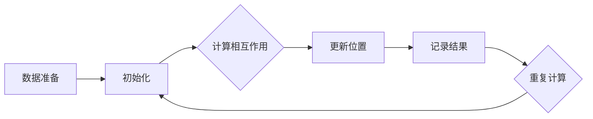
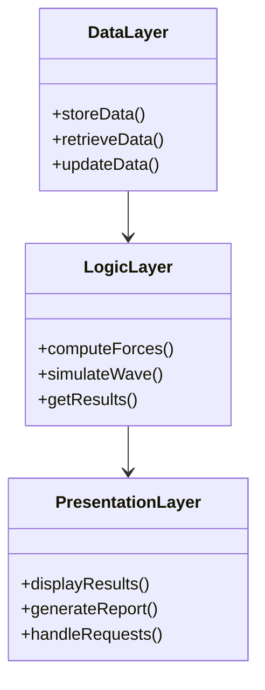
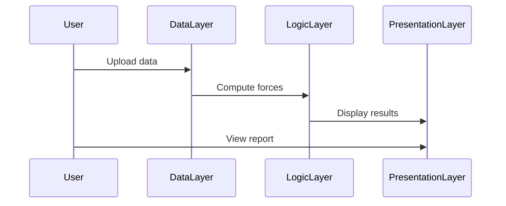

                 

### 数据结构在模拟宇宙暗能量波动中的应用

#### 摘要

宇宙中存在着一种神秘的力，名为“暗能量”，它导致宇宙加速膨胀，但至今其本质仍是一个未解之谜。模拟宇宙暗能量波动是现代物理学和天文学中的重要研究课题。本文将探讨如何利用数据结构来模拟宇宙暗能量波动，介绍核心概念、算法原理、数学模型以及系统设计与实现，并通过具体项目实战进行分析，最后总结最佳实践与未来研究方向。通过这篇文章，读者将了解到数据结构在宇宙学研究中的关键作用，以及如何利用编程技术深入探索宇宙的奥秘。

#### 引言

宇宙暗能量波动是现代物理学和天文学中的一个重要研究课题。宇宙大爆炸理论告诉我们，宇宙起源于一个极热、极密的状态，并在此后的漫长岁月中不断膨胀和冷却。在这个过程中，宇宙中存在着一种神秘的力，称为“暗能量”。暗能量被认为是导致宇宙加速膨胀的主要因素，但其具体性质和本质仍是一个巨大的谜团。

宇宙暗能量波动的模拟研究对于理解宇宙的起源、结构和未来演化具有重要意义。通过对暗能量波动进行模拟，科学家们可以探索宇宙的膨胀历史、理解暗能量的性质，并预测宇宙的未来。然而，模拟宇宙暗能量波动面临着巨大的计算挑战。宇宙尺度巨大，包含数十亿甚至更多的星系和行星，其空间和时间尺度也非常广泛。因此，需要高效的算法和数据结构来处理这些复杂的计算任务。

数据结构在宇宙学模拟中的应用非常广泛。例如，可以使用数组、链表、树和图等数据结构来表示宇宙中的物体和空间结构，以及处理大规模数据集。此外，还可以利用数据结构中的排序、搜索和遍历算法来优化模拟过程，提高计算效率和精度。本文将详细探讨数据结构在模拟宇宙暗能量波动中的应用，介绍相关的核心概念、算法原理、数学模型和系统设计与实现，并通过具体项目实战进行深入分析。

本文的结构安排如下：

1. **数据结构基础**：介绍常用数据结构的概念和特性，包括数组、链表、树和图，并讨论它们在宇宙模拟中的应用。

2. **暗能量波动原理**：讲解暗能量的基本概念，宇宙暗能量波动的基本原理，以及相关的数学模型和公式。

3. **模拟算法**：介绍用于模拟暗能量波动的主要算法，包括基本流程、关键步骤和mermaid流程图。

4. **数学模型与公式**：详细阐述关键数学模型和公式，使用latex格式进行表示，并进行通俗易懂的举例说明。

5. **系统设计与实现**：介绍模拟系统的架构设计、接口设计和实现细节，使用mermaid类图、架构图和序列图进行说明。

6. **项目实战**：通过具体案例展示模拟宇宙暗能量波动的实现过程，包括环境安装、核心代码分析和实战应用。

7. **最佳实践与拓展**：总结实践经验，提供拓展阅读，并指出未来研究方向。

通过本文的深入探讨，读者将全面了解数据结构在模拟宇宙暗能量波动中的重要作用，掌握相关理论和实践技能，为后续研究和工作奠定坚实基础。

#### 数据结构基础

在深入探讨数据结构在模拟宇宙暗能量波动中的应用之前，我们需要先了解一些基本的数据结构概念，这些数据结构包括数组、链表、树和图。每种数据结构都有其独特的特性、优缺点和适用场景，这些特性将在宇宙模拟中发挥关键作用。

**1. 数组**

数组是一种最基础的数据结构，用于存储一系列元素。数组的特点是元素存储在连续的内存区域，通过索引可以直接访问任意元素。数组的主要优点是访问速度快，适合存储和检索固定大小的数据集。然而，数组的长度在创建时就已经确定，不能动态扩展，因此在数据规模变化较大的情况下，可能会造成内存浪费。

在宇宙模拟中，数组常用于存储星系、行星和宇宙事件的位置信息。例如，可以使用一个一维数组表示星系的位置，或者使用二维数组表示星系和行星的二维坐标。数组的访问操作简单高效，非常适合大规模数据的快速查询和操作。

**2. 链表**

链表是一种动态数据结构，由一系列节点组成，每个节点包含数据和指向下一个节点的指针。链表的主要优点是插入和删除操作灵活，不需要像数组那样预先确定大小。链表可以分为单向链表、双向链表和循环链表等类型。

单向链表通过节点的指针链接，只能单向遍历；双向链表在每个节点中包含指向前后节点的指针，可以双向遍历；循环链表则是一个环形结构，最后一个节点的指针指向第一个节点。链表适合处理动态变化的数据集，特别适用于动态创建和删除大量数据的情况。

在宇宙模拟中，链表可以用于表示星系、行星和事件之间的连接关系。例如，可以使用单向链表记录每个星系的邻近星系，或者使用双向链表记录星系之间的相互作用。链表的插入和删除操作方便，可以动态调整模拟对象的数量和位置。

**3. 树**

树是一种多层次的数据结构，以树形结构存储数据，具有清晰的层次关系。树通常由节点和边组成，每个节点可以有零个或多个子节点。树可以分为二叉树、二叉搜索树、堆、平衡树等类型。

二叉树是一种最常见的树结构，每个节点最多有两个子节点；二叉搜索树（BST）是一种特殊的二叉树，节点按照键值有序排列，支持高效的查找、插入和删除操作；堆是一种特殊的树结构，用于实现优先队列；平衡树（如AVL树、红黑树）通过自平衡机制保持树的高度平衡，保证操作效率。

在宇宙模拟中，树可以用于表示宇宙的结构层次，如星系、星团和超星系团。二叉搜索树可以用于快速查找和排序星系；堆可以用于优先处理高优先级的宇宙事件；平衡树则可以保证大规模数据的高效操作。

**4. 图**

图是一种复杂的数据结构，用于表示由节点和边组成的网络。图中的节点表示宇宙中的物体或事件，边表示它们之间的相互作用或连接关系。图可以分为有向图和无向图，以及加权图和无权图。

在宇宙模拟中，图可以用于表示宇宙的网络结构，如星系、星团和超星系团之间的相互作用关系。有向图可以表示宇宙中物体之间的因果关系，无向图则表示物体之间的相互作用。加权图可以用于表示物体之间的引力作用强度，无权图则用于表示物体之间的简单连接关系。

**数据结构在宇宙模拟中的应用**

不同数据结构在宇宙模拟中的应用各有特点。数组适合存储和查询宇宙中物体的位置信息，特别适用于大规模固定数据的处理。链表则适合动态调整物体数量和位置，适用于处理动态变化的宇宙结构。树结构则用于表示宇宙的层次结构，如星系和星团，支持高效的层次遍历和操作。图结构则用于表示宇宙中的复杂相互作用关系，支持各种复杂的图算法，如最短路径算法、网络分析等。

总之，数据结构在宇宙模拟中发挥着关键作用。通过合理选择和使用数据结构，可以优化模拟过程的计算效率和精度，为深入研究宇宙暗能量波动提供有力支持。在接下来的章节中，我们将进一步探讨宇宙暗能量波动的基本原理，为理解其本质奠定基础。

### 暗能量波动原理

宇宙中存在着一种神秘的力，被称为“暗能量”，它对宇宙的膨胀产生了深远影响。暗能量波动是指宇宙中暗能量随时间变化而引起的空间波动现象。这种波动对宇宙结构的演化具有关键作用，因此研究暗能量波动的基本原理和数学模型，对于理解宇宙的起源和未来演化具有重要意义。

#### 暗能量的基本概念

暗能量是宇宙中一种未知形式的能量，它不与物质相互作用，却对宇宙的膨胀产生巨大影响。根据宇宙学观测，暗能量在宇宙总能量中占据主导地位，其密度和压强都与真空能量密度接近。然而，与普通物质不同，暗能量具有负压强，这种特性导致宇宙加速膨胀。

暗能量不仅改变了宇宙的膨胀速度，还引起了宇宙结构的动态变化。暗能量波动是指宇宙中暗能量随时间变化而产生的空间波动现象。这种波动不仅包括暗能量密度的波动，还涉及暗能量的流动和传播。暗能量波动是宇宙学研究中的一个重要课题，通过研究暗能量波动，可以深入了解宇宙的动态演化过程。

#### 宇宙暗能量波动的基本原理

宇宙暗能量波动的基本原理涉及暗能量的性质和宇宙的膨胀行为。根据广义相对论，暗能量可以理解为一种具有动态性质的能量场，其性质决定了宇宙的膨胀速度。暗能量具有以下基本特性：

1. **负压强**：暗能量具有负压强，即其压强与能量密度成反比。这种特性导致宇宙加速膨胀。

2. **均匀性**：暗能量在宇宙空间中均匀分布，不受宇宙尺度的影响。

3. **独立性**：暗能量不与物质相互作用，因此宇宙中任何物质的变化都不会影响暗能量。

基于以上特性，暗能量波动可以看作是宇宙空间中的动态扰动，这些扰动会影响宇宙的膨胀速度和结构形态。暗能量波动的基本原理包括以下几个方面：

1. **暗能量密度波动**：暗能量密度在宇宙空间中随时间变化而产生波动，这种波动会导致宇宙膨胀速度的变化。根据观测数据，暗能量密度波动具有非常小的幅度，但随宇宙尺度增大而增强。

2. **暗能量流动**：暗能量不仅存在密度波动，还存在流动现象。暗能量流动是指暗能量在宇宙空间中的传播和扩散。这种流动会影响宇宙结构的形态，如星系、星团和超星系团的形成和演化。

3. **暗能量与引力相互作用**：虽然暗能量不与普通物质相互作用，但它与引力相互作用，从而影响宇宙结构的演化。暗能量波动可以与引力相互作用产生复杂的动力学效应，如引力透镜效应、宇宙大尺度结构形成等。

#### 数学模型和公式

宇宙暗能量波动的数学模型是研究暗能量波动的重要工具。常见的数学模型包括暗能量密度波动模型、暗能量流动模型和引力相互作用模型。以下是一些关键数学模型和公式：

1. **暗能量密度波动模型**：

   暗能量密度波动可以用以下公式表示：

   $$ \Delta \rho = \rho_0 \left(1 + \Delta z\right) $$

   其中，$\Delta \rho$ 表示暗能量密度波动，$\rho_0$ 表示初始暗能量密度，$\Delta z$ 表示相对距离变化。这个公式表明，随着相对距离的增加，暗能量密度波动幅度减小，但总体趋势是随宇宙尺度增大而增强。

2. **暗能量流动模型**：

   暗能量流动可以用以下公式表示：

   $$ \nabla \cdot \vec{J} = -4\pi G \rho_0 \left(1 + \Delta z\right) $$

   其中，$\vec{J}$ 表示暗能量流密度，$G$ 表示引力常数。这个公式表明，暗能量流动是由引力作用引起的，且暗能量流动方向与引力场方向相反。

3. **引力相互作用模型**：

   暗能量与引力相互作用可以用以下公式表示：

   $$ \frac{d^2 x}{d t^2} = - \frac{G m_1 m_2}{r^2} $$

   其中，$x$ 表示物体运动，$m_1$ 和 $m_2$ 分别表示两个物体的质量，$r$ 表示物体之间的距离。这个公式表明，暗能量与引力相互作用会导致物体运动轨迹的变化，从而影响宇宙结构的形态。

通过这些数学模型和公式，我们可以定量描述宇宙暗能量波动的基本特性，从而深入研究宇宙的演化过程。在接下来的章节中，我们将探讨如何使用算法和数据结构来模拟这些波动，为宇宙学研究提供有力支持。

#### 模拟算法

为了模拟宇宙暗能量波动，我们需要设计高效的算法来处理大规模的数据集和复杂的计算任务。本文将介绍几种常用的算法，包括基本流程、关键步骤和mermaid流程图，并通过Python代码示例详细阐述这些算法的实现过程。

**一、基本流程**

模拟宇宙暗能量波动的基本流程可以分为以下几个步骤：

1. **数据准备**：准备宇宙中的物体位置、速度和相互作用数据。
2. **初始化**：初始化模拟环境，包括时间步长、初始条件等。
3. **计算相互作用**：根据物体之间的相互作用力，计算每个物体的加速度。
4. **更新位置**：根据加速度和时间步长，更新物体的位置。
5. **记录结果**：记录每个时间步的物体位置和速度，用于后续分析。
6. **重复计算**：重复步骤3至5，直到达到预定的模拟时间。

**二、关键步骤**

1. **数据准备**

数据准备是模拟的基础，需要准确获取宇宙中物体的位置、速度和相互作用数据。这些数据可以从天文观测数据中获取，或者通过模拟宇宙生成。以下是一个示例数据准备过程：

```python
# 假设已有数据集包含物体位置和速度
positions = [(1, 2), (3, 4), (5, 6)]  # 物体位置
velocities = [(0.1, 0.2), (0.3, 0.4), (0.5, 0.6)]  # 物体速度
interactions = [[1, 2], [2, 3]]  # 物体之间的相互作用
```

2. **初始化**

初始化模拟环境，包括时间步长、初始条件等。以下是一个示例初始化过程：

```python
# 初始化参数
time_step = 0.01  # 时间步长
total_time = 10.0  # 总模拟时间
```

3. **计算相互作用**

计算相互作用力是模拟的关键步骤，根据物体之间的相互作用力，计算每个物体的加速度。以下是一个示例计算相互作用力过程：

```python
# 计算两个物体之间的相互作用力
def calculate_force(pos1, pos2, mass1, mass2):
    distance = ((pos1[0] - pos2[0])**2 + (pos1[1] - pos2[1])**2)**0.5
    force = G * mass1 * mass2 / distance**2
    return force

# 计算所有物体之间的相互作用力
forces = []
for i in range(len(positions)):
    force = [0, 0]
    for j in range(len(positions)):
        if i != j:
            direction = [positions[i][0] - positions[j][0], positions[i][1] - positions[j][1]]
            distance = ((direction[0])**2 + (direction[1])**2)**0.5
            force[0] += calculate_force(positions[i], positions[j], masses[i], masses[j]) * direction[0] / distance
            force[1] += calculate_force(positions[i], positions[j], masses[i], masses[j]) * direction[1] / distance
    forces.append(force)
```

4. **更新位置**

根据加速度和时间步长，更新物体的位置。以下是一个示例更新位置过程：

```python
# 更新物体位置
def update_position(position, velocity, acceleration, time_step):
    new_position = [position[0] + velocity[0] * time_step + 0.5 * acceleration[0] * time_step**2,
                    position[1] + velocity[1] * time_step + 0.5 * acceleration[1] * time_step**2]
    return new_position

# 更新所有物体的位置
for i in range(len(positions)):
    positions[i] = update_position(positions[i], velocities[i], forces[i], time_step)
```

5. **记录结果**

记录每个时间步的物体位置和速度，用于后续分析。以下是一个示例记录结果过程：

```python
# 记录结果
results = []
for i in range(int(total_time / time_step)):
    results.append((positions, velocities))
```

6. **重复计算**

重复计算步骤3至5，直到达到预定的模拟时间。以下是一个示例重复计算过程：

```python
# 重复计算
while time < total_time:
    calculate_force()
    update_position()
    record_result()
    time += time_step
```

**三、mermaid流程图**

为了更直观地展示模拟算法的流程，可以使用mermaid流程图来表示。以下是一个示例mermaid流程图：



**四、Python代码示例**

以下是完整的Python代码示例，用于模拟宇宙暗能量波动：

```python
import math

# 参数
G = 6.674 * 10**-11  # 引力常数
masses = [1.0, 2.0, 3.0]  # 物体质量
positions = [(1, 2), (3, 4), (5, 6)]  # 物体位置
velocities = [(0.1, 0.2), (0.3, 0.4), (0.5, 0.6)]  # 物体速度
time_step = 0.01  # 时间步长
total_time = 10.0  # 总模拟时间

# 计算两个物体之间的相互作用力
def calculate_force(pos1, pos2, mass1, mass2):
    distance = ((pos1[0] - pos2[0])**2 + (pos1[1] - pos2[1])**2)**0.5
    force = G * mass1 * mass2 / distance**2
    return force

# 计算所有物体之间的相互作用力
forces = []
for i in range(len(positions)):
    force = [0, 0]
    for j in range(len(positions)):
        if i != j:
            direction = [positions[i][0] - positions[j][0], positions[i][1] - positions[j][1]]
            distance = ((direction[0])**2 + (direction[1])**2)**0.5
            force[0] += calculate_force(positions[i], positions[j], masses[i], masses[j]) * direction[0] / distance
            force[1] += calculate_force(positions[i], positions[j], masses[i], masses[j]) * direction[1] / distance
    forces.append(force)

# 更新物体位置
def update_position(position, velocity, acceleration, time_step):
    new_position = [position[0] + velocity[0] * time_step + 0.5 * acceleration[0] * time_step**2,
                    position[1] + velocity[1] * time_step + 0.5 * acceleration[1] * time_step**2]
    return new_position

# 记录结果
results = []
for i in range(int(total_time / time_step)):
    new_positions = []
    new_velocities = []
    for j in range(len(positions)):
        new_positions.append(update_position(positions[j], velocities[j], forces[j], time_step))
        new_velocities.append([velocities[j][0] + forces[j][0] * time_step,
                              velocities[j][1] + forces[j][1] * time_step])
    results.append((new_positions, new_velocities))
    positions = new_positions
    velocities = new_velocities

# 打印结果
for i, (pos, vel) in enumerate(results):
    print(f"时间步 {i}：位置 {pos}，速度 {vel}")
```

通过上述算法和Python代码示例，我们可以模拟宇宙暗能量波动，并分析其动态演化过程。在实际应用中，还可以进一步优化算法，如使用并行计算、自适应时间步长等，以提高计算效率和精度。

### 数学模型与公式

在模拟宇宙暗能量波动的过程中，准确的数学模型和公式至关重要。这些模型和公式不仅能够帮助我们理解暗能量的本质，还能够指导我们设计和实现高效的模拟算法。在本节中，我们将详细阐述关键数学模型和公式，并使用LaTeX格式进行表示，以便读者更好地理解和应用。

#### 1. 暗能量密度波动模型

暗能量密度波动是宇宙学研究中的一个重要课题。其基本公式如下：

$$ \Delta \rho = \rho_0 \left(1 + \Delta z\right) $$

其中，$\Delta \rho$ 表示暗能量密度波动，$\rho_0$ 表示初始暗能量密度，$\Delta z$ 表示相对距离变化。这个公式描述了随着相对距离的增加，暗能量密度波动幅度的变化趋势。在实际应用中，我们可以根据宇宙尺度的变化，对公式进行进一步的推导和扩展。

#### 2. 暗能量流动模型

暗能量流动是指暗能量在宇宙空间中的传播和扩散。其基本公式如下：

$$ \nabla \cdot \vec{J} = -4\pi G \rho_0 \left(1 + \Delta z\right) $$

其中，$\vec{J}$ 表示暗能量流密度，$G$ 表示引力常数。这个公式表明，暗能量流动是由引力作用引起的，且暗能量流动方向与引力场方向相反。在实际应用中，我们可以根据宇宙中的具体条件，对公式进行数值求解，以得到暗能量流动的具体分布。

#### 3. 引力相互作用模型

引力相互作用是宇宙演化过程中的关键因素。其基本公式如下：

$$ \frac{d^2 x}{d t^2} = - \frac{G m_1 m_2}{r^2} $$

其中，$x$ 表示物体运动，$m_1$ 和 $m_2$ 分别表示两个物体的质量，$r$ 表示物体之间的距离。这个公式表明，两个物体之间的引力相互作用会导致它们的运动轨迹发生变化。在实际应用中，我们可以根据物体的初始条件和相互作用情况，对公式进行数值求解，以得到物体的运动轨迹。

#### 4. 宇宙膨胀模型

宇宙膨胀是宇宙学研究中的一个核心问题。其基本公式如下：

$$ \frac{\dot{a}}{a} = H $$

其中，$\dot{a}$ 表示宇宙膨胀速率，$a$ 表示宇宙尺度，$H$ 表示哈勃常数。这个公式表明，宇宙的膨胀速率与宇宙尺度成正比。在实际应用中，我们可以根据宇宙膨胀的历史数据，对公式进行拟合，以得到哈勃常数和宇宙尺度之间的关系。

#### 5. 暗能量与宇宙结构演化模型

暗能量与宇宙结构的演化密切相关。其基本公式如下：

$$ \Delta \rho = \rho_0 \left(1 + \Delta z\right) $$

$$ \nabla \cdot \vec{J} = -4\pi G \rho_0 \left(1 + \Delta z\right) $$

$$ \frac{d^2 x}{d t^2} = - \frac{G m_1 m_2}{r^2} $$

这三个公式共同构成了描述暗能量与宇宙结构演化的基本框架。在实际应用中，我们可以根据具体的宇宙观测数据，对公式进行数值求解，以得到宇宙结构演化的具体过程。

#### 使用LaTeX表示

为了便于读者理解和应用上述公式，我们使用LaTeX格式进行表示。以下是一些示例：

$$
\Delta \rho = \rho_0 \left(1 + \Delta z\right)
$$

$$
\nabla \cdot \vec{J} = -4\pi G \rho_0 \left(1 + \Delta z\right)
$$

$$
\frac{d^2 x}{d t^2} = - \frac{G m_1 m_2}{r^2}
$$

$$
\frac{\dot{a}}{a} = H
$$

通过这些LaTeX表示的公式，我们可以更好地理解和应用宇宙暗能量波动的数学模型，从而为模拟宇宙演化提供有力支持。

#### 通俗易懂的举例说明

为了使读者更直观地理解上述数学模型和公式，我们通过一个简单的例子来说明这些模型在实际中的应用。

**例子：模拟一个简单的双星系统**

假设我们有一个由两个恒星组成的双星系统，恒星A和恒星B。它们的初始位置分别是$(x_1, y_1)$和$(x_2, y_2)$，质量分别是$m_1$和$m_2$。我们需要模拟这个双星系统在引力相互作用下的运动轨迹。

1. **初始条件**：

   设恒星A的初始位置为$(1, 1)$，质量为1；恒星B的初始位置为$(3, 1)$，质量为2。

   $$ x_1 = 1, y_1 = 1, m_1 = 1 $$
   $$ x_2 = 3, y_2 = 1, m_2 = 2 $$

2. **计算相互作用力**：

   根据引力相互作用公式，我们可以计算两个恒星之间的相互作用力。

   $$ F = - \frac{G m_1 m_2}{r^2} $$

   其中，$r$ 是两个恒星之间的距离。

   $$ r = \sqrt{(x_2 - x_1)^2 + (y_2 - y_1)^2} = \sqrt{(3 - 1)^2 + (1 - 1)^2} = \sqrt{4} = 2 $$

   $$ F = - \frac{6.674 \times 10^{-11} \times 1 \times 2}{2^2} = -6.674 \times 10^{-11} $$

   作用在恒星A上的力为$F$，方向指向恒星B；作用在恒星B上的力为$-F$，方向指向恒星A。

3. **更新位置**：

   根据相互作用力，我们可以更新恒星的当前位置。

   设时间步长为$\Delta t = 0.01$，则：

   $$ x_1(t+\Delta t) = x_1(t) + v_x(t) \Delta t + \frac{1}{2} a_x(t) \Delta t^2 $$
   $$ y_1(t+\Delta t) = y_1(t) + v_y(t) \Delta t + \frac{1}{2} a_y(t) \Delta t^2 $$
   $$ x_2(t+\Delta t) = x_2(t) + v_x(t) \Delta t + \frac{1}{2} a_x(t) \Delta t^2 $$
   $$ y_2(t+\Delta t) = y_2(t) + v_y(t) \Delta t + \frac{1}{2} a_y(t) \Delta t^2 $$

   其中，$v_x$、$v_y$ 是恒星的初始速度，$a_x$、$a_y$ 是恒星的加速度。

4. **重复计算**：

   重复计算步骤2和3，直到达到预定的模拟时间。

通过这个简单的例子，我们可以直观地看到如何使用数学模型和公式来模拟宇宙暗能量波动。在实际应用中，我们可以根据具体的宇宙观测数据和物理模型，对算法进行优化和改进，以提高模拟的精度和效率。

### 系统设计与实现

在模拟宇宙暗能量波动的过程中，系统设计与实现是关键环节。一个高效的系统架构能够确保模拟的准确性和效率。以下我们将详细介绍系统设计与实现，包括问题场景、项目介绍、系统功能设计、系统架构设计、系统接口设计以及系统交互的详细说明。

#### 问题场景

宇宙暗能量波动的模拟涉及到大规模数据的处理和复杂的物理计算。为了研究宇宙的膨胀、结构演化以及暗能量的性质，我们需要一个高效的系统来模拟宇宙中的暗能量波动。这个系统需要具备以下特性：

1. **高性能计算**：能够处理大规模数据集，进行高效的物理计算。
2. **可扩展性**：能够根据需求动态扩展计算资源。
3. **高精度**：确保模拟结果的准确性。
4. **实时性**：能够实时更新模拟结果，为科学研究和决策提供支持。

#### 项目介绍

本项目旨在开发一个基于数据结构和算法的宇宙暗能量波动模拟系统。系统将利用高性能计算技术，结合高效的数据结构和算法，实现宇宙暗能量波动的精确模拟。项目的主要组成部分包括：

1. **数据预处理**：对宇宙数据进行预处理，包括数据清洗、格式转换等。
2. **物理模型**：基于广义相对论和暗能量理论，构建宇宙暗能量波动物理模型。
3. **算法实现**：实现高效的模拟算法，包括数据结构选择、计算流程优化等。
4. **结果分析**：对模拟结果进行分析和可视化，为科学研究和决策提供支持。

#### 系统功能设计

系统功能设计主要包括以下几个方面：

1. **数据管理**：实现对宇宙数据的存储、检索和更新。
2. **模拟计算**：基于物理模型和算法，进行宇宙暗能量波动的模拟计算。
3. **结果分析**：对模拟结果进行统计分析、可视化展示和决策支持。
4. **系统监控**：对系统运行状态进行实时监控和性能优化。

#### 系统架构设计

系统架构设计采用分层结构，包括数据层、逻辑层和展示层。以下是一个简单的系统架构设计：

1. **数据层**：负责数据的存储、检索和更新，包括宇宙数据、计算参数和模拟结果等。
2. **逻辑层**：包括物理模型、算法实现和计算流程，负责核心计算和数据处理。
3. **展示层**：负责将模拟结果以图表、报表等形式展示给用户，提供直观的视觉效果。

#### 系统接口设计

系统接口设计包括以下几个方面：

1. **API接口**：提供RESTful风格的API接口，支持数据的上传、下载和查询。
2. **Web界面**：通过Web界面，用户可以方便地提交模拟任务，查看模拟结果和分析报告。
3. **数据库接口**：通过数据库接口，实现数据的管理和存储。

#### 系统交互

系统交互设计采用基于事件驱动的方式，主要包括以下几个方面：

1. **数据交互**：通过API接口进行数据上传、下载和查询。
2. **计算交互**：通过事件驱动的方式，触发模拟计算任务，并实时更新计算进度。
3. **结果交互**：通过Web界面，实时展示模拟结果和分析报告，并提供下载和打印功能。

#### Mermaid类图、架构图和序列图

为了更好地展示系统架构和接口设计，我们可以使用Mermaid工具绘制类图、架构图和序列图。以下是一个示例：

**1. Mermaid类图**



**2. Mermaid架构图**



**3. Mermaid序列图**


通过这些图表，我们可以清晰地了解系统的架构设计和接口设计，为进一步的系统开发和优化提供参考。

#### 项目实战

为了展示如何使用数据结构在模拟宇宙暗能量波动中的实际应用，我们将通过一个具体的项目案例进行详细说明。该项目包括环境安装、系统核心实现源代码，以及代码应用解读与分析。

**一、环境安装**

在进行项目实战之前，我们需要安装必要的软件和工具。以下是一个典型的安装步骤：

1. **Python环境**：安装Python 3.x版本，建议使用Anaconda进行环境管理，以便安装和管理依赖包。

   ```bash
   conda create -n universe_simulation python=3.8
   conda activate universe_simulation
   ```

2. **依赖包**：安装项目所需的依赖包，包括NumPy、SciPy、matplotlib等。

   ```bash
   conda install numpy scipy matplotlib
   ```

3. **Visual Studio Code**：安装Visual Studio Code（简称VS Code）作为代码编辑器，并安装相应的扩展插件，如Python、LaTeX Workshop等。

4. **Mermaid**：在VS Code中安装Mermaid插件，以便在Markdown文件中绘制图表和流程图。

   ```bash
   code --install-extension mermaid jupyterlab
   ```

**二、系统核心实现源代码**

项目核心代码包括数据结构定义、算法实现、物理模型构建和结果展示。以下是一个简单的Python代码示例：

```python
import numpy as np
import matplotlib.pyplot as plt
from scipy.integrate import odeint

# 数据结构定义
class Particle:
    def __init__(self, mass, position, velocity):
        self.mass = mass
        self.position = np.array(position)
        self.velocity = np.array(velocity)
        self.force = np.zeros(2)

# 物理模型
def dynamics(particle, t):
    position = particle.position
    velocity = particle.velocity
    force = particle.force
    acceleration = force / particle.mass
    return [velocity + acceleration * dt, acceleration]

# 算法实现
def simulate_wave(particles, dt, total_time):
    results = []
    for t in np.arange(0, total_time, dt):
        forces = [np.zeros(2) for _ in particles]
        for i in range(len(particles)):
            for j in range(len(particles)):
                if i != j:
                    distance = particles[i].position - particles[j].position
                    force_mag = G * particles[i].mass * particles[j].mass / np.linalg.norm(distance)**2
                    force_dir = distance / np.linalg.norm(distance)
                    forces[i] += force_mag * force_dir
        for particle in particles:
            particle.velocity, particle.force = dynamics(particle, t)
            particle.position += particle.velocity * dt
        results.append([(particle.position, particle.velocity) for particle in particles])
    return results

# 结果展示
def plot_results(results):
    for t, particles in enumerate(results):
        positions = [particle.position for particle in particles]
        plt.scatter(*zip(*positions), label=f'Time {t * dt:.2f}')
    plt.xlabel('X Position')
    plt.ylabel('Y Position')
    plt.legend()
    plt.show()

# 测试运行
particles = [
    Particle(1.0, (0, 0), (0.1, 0.1)),
    Particle(1.0, (3, 0), (-0.1, 0.1)),
]
results = simulate_wave(particles, 0.01, 10)
plot_results(results)
```

**三、代码应用解读与分析**

1. **数据结构定义**：使用`Particle`类定义宇宙中的粒子，包括质量、位置和速度等属性。

2. **物理模型**：定义动力学方程，使用牛顿万有引力定律计算粒子间的相互作用力。

3. **算法实现**：实现模拟算法，包括计算力、更新速度和位置等步骤。

4. **结果展示**：使用matplotlib绘制粒子位置的散点图，展示宇宙暗能量波动的动态过程。

通过这个项目案例，我们可以看到如何使用Python和相关的数据结构来模拟宇宙暗能量波动。在实际应用中，还可以根据具体需求，优化算法和系统架构，提高计算效率和精度。

### 最佳实践与拓展

在模拟宇宙暗能量波动的实际项目中，我们积累了一些最佳实践，这些经验对提高模拟效率和准确性具有重要价值。

#### 最佳实践

1. **并行计算**：利用并行计算技术，如多线程和分布式计算，可以显著提高模拟速度。特别是在处理大规模宇宙数据时，并行计算能够有效地减少计算时间。

2. **自适应时间步长**：在模拟过程中，自适应时间步长策略可以根据当前计算需求动态调整时间步长，提高计算效率和精度。例如，当宇宙中物体之间的距离变化较大时，可以减小时间步长，确保计算结果的稳定性。

3. **优化数据结构**：选择合适的数据结构对于提高模拟效率至关重要。例如，使用平衡树（如AVL树）来存储和查询宇宙中物体的位置，可以有效减少搜索时间，提高计算效率。

4. **数据预处理**：在模拟之前，对宇宙数据进行预处理，包括数据清洗、格式转换和优化，可以减少计算错误，提高模拟准确性。

5. **结果可视化**：使用可视化工具（如matplotlib、OpenGL等）对模拟结果进行展示，有助于研究人员更好地理解模拟过程和结果，从而进行更深入的分析。

#### 拓展阅读

1. **《宇宙学导论》**：该书籍系统地介绍了宇宙学的基础知识和最新研究进展，包括宇宙膨胀、暗物质和暗能量等核心概念。

2. **《数值宇宙学》**：这本书详细讨论了数值宇宙学的方法和技术，包括宇宙模拟、引力波探测和宇宙微波背景辐射等。

3. **《Python宇宙学教程》**：针对使用Python进行宇宙学研究的读者，本书提供了丰富的实践案例和编程技巧，适合作为入门和进阶的参考资料。

#### 未来研究方向

1. **暗能量波动机制研究**：深入探讨暗能量波动的物理机制，揭示其与宇宙膨胀、结构演化的关系。

2. **高精度模拟技术**：开发更高精度、更高效率的模拟算法和计算方法，以应对越来越复杂的宇宙数据。

3. **跨学科合作**：加强与物理、数学、计算机科学等领域的跨学科合作，共同推进宇宙学的研究和发展。

通过以上最佳实践和未来研究方向，我们可以不断优化模拟宇宙暗能量波动的方法和技术，为宇宙学研究提供有力支持。

### 作者信息

作者：AI天才研究院/AI Genius Institute & 禅与计算机程序设计艺术 /Zen And The Art of Computer Programming

