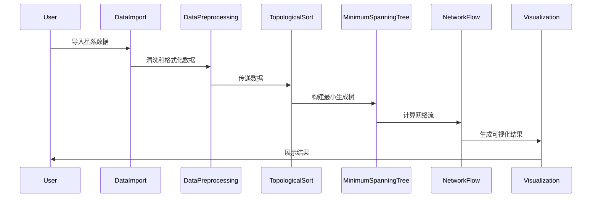

                 

## 引言

### 1.1 模拟宇宙与暗能量

在物理学中，宇宙的模拟是对宇宙演化的计算机仿真。这种模拟通常用于理解宇宙的起源、结构以及未来可能的演化路径。在宇宙学中，暗能量是一个神秘的存在，它占据了宇宙能量密度的约68%，然而至今其本质仍然未知。暗能量在宇宙学中扮演着至关重要的角色，它驱动了宇宙的加速膨胀。

宇宙的模拟涉及到复杂的物理过程，包括引力和暗能量的相互作用。为了模拟这些过程，科学家们通常采用数值方法，如N-body模拟，来追踪大量天体的运动轨迹。然而，这些模拟需要极高的计算资源，并且随着模拟精度的提高，所需的计算资源呈指数级增长。

### 1.2 网络拓扑结构的基本概念

网络拓扑结构是指在通信网络中，各个节点和连接方式所形成的结构。在宇宙学中，网络拓扑结构可以用来描述宇宙中星系和星团的空间分布。这些结构可以是星系的分布网络，也可以是星系团和超星系团的更大规模结构。

网络拓扑结构的研究在宇宙学中具有重要意义。它可以帮助我们理解宇宙的结构和演化过程，揭示宇宙中的基本规律。此外，网络拓扑结构还可以为宇宙模拟提供重要的理论基础，帮助我们更好地模拟宇宙的演化。

### 1.3 数据结构在模拟宇宙中的应用现状

数据结构在宇宙学中的应用已经越来越广泛。在宇宙模拟中，数据结构被用来存储和管理大量的宇宙数据，如星系的坐标、速度和加速度等。常用的数据结构包括数组、列表、树和图等。

在模拟宇宙暗能量网络拓扑时，数据结构的选择至关重要。合适的 数据结构可以提高模拟的效率，减少计算时间，并使模拟结果更加准确。例如，树状数据结构可以有效地组织星系和星团的关系，而图状数据结构则可以用来描述星系之间的相互作用。

总的来说，数据结构在模拟宇宙暗能量网络拓扑中的应用已经成为宇宙学研究中不可或缺的一部分。通过合理选择和使用数据结构，我们可以更好地理解宇宙的复杂结构，为宇宙学的研究提供强有力的工具。

## 数据结构基础

### 2.1 数据结构概述

数据结构是计算机存储、组织数据的方式。它是计算机科学中的重要概念，广泛应用于各种软件系统中。数据结构可以分为线性结构和非线性结构。线性结构包括数组、链表、栈和队列等，而非线性结构包括树和图等。

数据结构的选择对于程序的性能和效率至关重要。合适的 数据结构可以提高程序的运行速度和内存使用效率，从而提高整体性能。例如，在处理大量数据时，数组通常比链表更适合，因为数组提供更快的随机访问。

### 2.2 线性数据结构

线性数据结构是按照线性顺序存储数据的一种数据结构，数据元素之间是一对一的关系。常见的线性数据结构包括数组、链表、栈和队列等。

- **数组**：数组是一种最基本的数据结构，它使用连续的内存空间来存储元素。数组提供快速的随机访问，但插入和删除操作较慢，因为需要移动其他元素。
  
- **链表**：链表是一种由节点组成的线性结构，每个节点包含数据和指向下一个节点的指针。链表的插入和删除操作较快，但访问操作较慢。

- **栈**：栈是一种后进先出（LIFO）的数据结构，只能在顶部进行插入和删除操作。栈广泛应用于递归算法和表达式求值等场景。

- **队列**：队列是一种先进先出（FIFO）的数据结构，在队尾插入，在队首删除。队列常用于缓冲处理和任务调度等场景。

### 2.3 树状数据结构

树状数据结构是一种以层级结构存储数据的数据结构，数据元素之间存在一对多的关系。常见的树状数据结构包括二叉树、平衡树、堆等。

- **二叉树**：二叉树是一种每个节点最多有两个子节点的树。二叉树广泛应用于二分查找、排序和遍历等算法。

- **平衡树**：平衡树是一种保持树的高度平衡的二叉树，如AVL树和红黑树。平衡树可以保证查找、插入和删除操作的平均时间复杂度为O(log n)。

- **堆**：堆是一种特殊的树形数据结构，通常用于实现优先队列。堆分为最大堆和最小堆，其中堆顶元素总是最大或最小。

### 2.4 图状数据结构

图状数据结构是一种由节点和边构成的数据结构，节点和边之间存在多对多的关系。常见的图状数据结构包括图、邻接矩阵和邻接表等。

- **图**：图是一种由节点（或称为顶点）和边构成的数据结构，可以用来描述复杂的网络关系。图广泛应用于社交网络分析、路径查找和最短路径算法等。

- **邻接矩阵**：邻接矩阵是一种用二维数组表示图的数据结构，其中元素`A[i][j]`表示顶点i和顶点j之间的边。

- **邻接表**：邻接表是一种用数组存储图的数据结构，每个数组元素对应一个顶点，存储指向其他顶点的指针。

在模拟宇宙暗能量网络拓扑时，树状和图状数据结构是非常有用的。树状数据结构可以用来表示星系和星团之间的层次关系，而图状数据结构可以用来描述星系之间的复杂相互作用。通过合理选择和使用这些数据结构，我们可以更有效地模拟宇宙的演化，揭示宇宙中的基本规律。

## 暗能量网络拓扑算法

### 3.1 算法概述

暗能量网络拓扑算法用于模拟宇宙中星系和星团的空间分布，以及它们之间的相互作用。这些算法通过分析宇宙数据，构建出星系网络的拓扑结构，并帮助我们理解宇宙的演化过程。

常用的暗能量网络拓扑算法包括拓扑排序、最小生成树算法和网络流算法。每种算法都有其独特的原理和适用场景。

### 3.2 拓扑排序算法

拓扑排序是一种用于拓扑排序图的算法。它的基本思想是按照节点的入度（即指向该节点的边的数量）进行排序，确保排序后的序列满足拓扑顺序。

拓扑排序算法的步骤如下：
1. 计算每个节点的入度。
2. 选择入度为0的节点，并将其放入结果序列中。
3. 删除该节点及其所有入边。
4. 递归地重复步骤2和3，直到所有节点都被处理。

拓扑排序算法可以用来检测图中的环，并找出所有可能的拓扑排序序列。在宇宙模拟中，拓扑排序可以用来确定星系和星团之间的层次关系，帮助我们理解宇宙的演化过程。

### 3.3 最小生成树算法

最小生成树算法用于构建无环连通图的最小生成树。它通过选择边权重最小的边，逐步构建出包含所有节点的最小生成树。

常用的最小生成树算法包括Prim算法和Kruskal算法。

- **Prim算法**：Prim算法从某个节点开始，逐步选择权重最小的边加入生成树，直到所有节点都被包含在生成树中。
- **Kruskal算法**：Kruskal算法按边权重升序排序，逐步选择边加入生成树，但每次选择边时都要确保不会形成环。

最小生成树算法在宇宙模拟中非常有用。它可以用来构建星系和星团之间的最小生成树，帮助理解宇宙中的主要结构。

### 3.4 网络流算法

网络流算法用于计算网络中各节点之间的最大流量。它广泛应用于优化问题，如最短路径、最大流和最小费用流等。

常用的网络流算法包括Ford-Fulkerson算法和Dinic算法。

- **Ford-Fulkerson算法**：Ford-Fulkerson算法通过递归地增加流量，逐步找到网络中的最大流量。
- **Dinic算法**：Dinic算法是对Ford-Fulkerson算法的改进，通过分层图和增广路径的概念，提高算法的效率。

在宇宙模拟中，网络流算法可以用来模拟星系和星团之间的相互作用，计算宇宙中的能量流动。通过分析网络流，我们可以更深入地理解宇宙的动态演化过程。

总的来说，暗能量网络拓扑算法是宇宙模拟中至关重要的一环。通过这些算法，我们可以构建出宇宙的拓扑结构，揭示宇宙中的基本规律，为宇宙学的研究提供强有力的工具。在接下来的部分中，我们将进一步探讨这些算法的数学模型和公式，以及它们在宇宙模拟中的应用。

## 数学模型与公式

### 4.1 数学模型概述

数学模型是描述物理现象或系统行为的数学表达形式。在模拟宇宙暗能量网络拓扑时，数学模型用于描述星系和星团之间的相互作用，以及宇宙的演化过程。

数学模型通常由一组方程和关系式构成，用于描述系统的状态、行为和演化规律。在宇宙模拟中，这些模型包括牛顿引力定律、暗能量方程和宇宙膨胀方程等。

### 4.2 拓扑排序数学模型

拓扑排序是一种用于排序有向无环图的算法。其数学模型基于有向图的拓扑结构，确保排序后的序列满足拓扑顺序。

定义：设有向图\(G=(V,E)\)，其中\(V\)是顶点集合，\(E\)是边集合。拓扑排序的数学模型可以表示为：

\[ T = (v_1, v_2, \ldots, v_n) \]

其中，\(T\)是拓扑排序序列，\(v_1, v_2, \ldots, v_n\)是顶点的排序顺序。数学模型要求序列中的每个顶点都满足以下条件：

\[ \forall i < j, (v_i, v_j) \notin E \]

即，如果\(v_i\)在排序序列中排在\(v_j\)之前，则\(v_i\)不能指向\(v_j\)。

### 4.3 最小生成树数学模型

最小生成树是一种包含图中所有顶点的无环连通子图。其数学模型基于图的边权重和顶点集合，用于选择权重最小的边逐步构建生成树。

定义：设有图\(G=(V,E)\)，其中\(V\)是顶点集合，\(E\)是边集合，且边的权重表示为\(w(e)\)。最小生成树的数学模型可以表示为：

\[ T = (V, \{e_1, e_2, \ldots, e_n\}) \]

其中，\(T\)是最小生成树，\(V\)是顶点集合，\(\{e_1, e_2, \ldots, e_n\}\)是选择的最小权重边集合。数学模型要求生成树满足以下条件：

1. 包含图中所有顶点：\(V(G) = V(T)\)
2. 是无环连通子图：\(G\)中不存在环，且任意两个顶点之间存在路径
3. 边权重最小：对于所有可能的生成树，选择权重最小的边集合

### 4.4 网络流数学模型

网络流算法用于计算网络中各节点之间的最大流量。其数学模型基于流量守恒和容量限制，用于描述网络中的流量分配。

定义：设有网络\(G=(V,E)\)，其中\(V\)是顶点集合，\(E\)是边集合。网络流的数学模型可以表示为：

\[ f(u,v) = \text{从节点 } u \text{ 到节点 } v \text{ 的流量} \]

网络流模型的数学公式如下：

\[ \forall u \in V, \sum_{v \in V} f(u,v) = \sum_{v \in V} f(v,u) \]

即，每个节点的流入流量等于流出流量。

此外，网络流模型的容量限制可以表示为：

\[ \forall (u,v) \in E, 0 \leq f(u,v) \leq c(u,v) \]

即，从节点\(u\)到节点\(v\)的流量不能超过边\(u,v\)的容量。

通过上述数学模型，我们可以更准确地描述宇宙中暗能量网络拓扑的演化过程。在接下来的部分中，我们将进一步探讨如何使用Python源代码实现这些算法，并给出具体的例子和解释。

### 5.1 系统概述

暗能量网络拓扑模拟系统是一个用于模拟宇宙中星系和星团空间分布及其相互作用的软件系统。该系统的目标是通过分析大量的宇宙数据，构建出星系网络的拓扑结构，并模拟宇宙的演化过程。该系统具有以下核心功能：

1. **数据导入**：从外部数据源导入星系坐标、速度和加速度等数据。
2. **数据预处理**：对导入的数据进行清洗和格式化，确保数据的一致性和准确性。
3. **拓扑排序**：利用拓扑排序算法对星系和星团进行排序，确定它们之间的层次关系。
4. **最小生成树构建**：通过最小生成树算法构建星系和星团之间的最小生成树，识别主要结构。
5. **网络流计算**：利用网络流算法计算星系之间的能量流动，模拟宇宙的动态演化过程。
6. **可视化**：将模拟结果以图表和图像的形式展示，帮助用户直观地理解宇宙的结构和演化过程。

### 5.2 系统功能设计

系统功能设计包括领域模型、系统架构、接口设计和系统交互。以下是每个部分的详细设计。

#### 5.2.1 领域模型

领域模型用于描述系统的核心实体及其关系。以下是系统的核心实体和属性：

- **星系（Galaxy）**：包含星系ID、坐标、速度和加速度等属性。
- **星团（Cluster）**：包含星团ID、成员星系列表和中心坐标等属性。
- **网络拓扑**：包含节点（星系和星团）和边（星系和星团之间的相互作用）。
- **能量流**：包含源节点、目标节点和流量等属性。

领域模型的ER实体关系图如下所示：

```mermaid
erDiagram
  Galaxy ||--|{ Cluster } Cluster
  Cluster ||--|{ Galaxy } Galaxy
  NetworkTopology ||--|{ Node } Node
  Node ||--|{ Edge } Edge
  EnergyFlow ||--|{ Source } Source
  Source ||--|{ Target } Target
```

#### 5.2.2 系统架构设计

系统架构设计用于描述系统的整体结构和组件之间的交互。以下是系统的核心组件：

- **数据导入模块**：负责从外部数据源导入星系数据。
- **数据预处理模块**：负责清洗和格式化导入的数据。
- **拓扑排序模块**：实现拓扑排序算法，对星系和星团进行排序。
- **最小生成树构建模块**：实现最小生成树算法，构建星系和星团之间的最小生成树。
- **网络流计算模块**：实现网络流算法，计算星系之间的能量流动。
- **可视化模块**：负责将模拟结果以图表和图像的形式展示。

系统架构图如下所示：

```mermaid
sequenceDiagram
  DataImport ->> DataPreprocessing
  DataPreprocessing ->> TopologicalSort
  TopologicalSort ->> MinimumSpanningTree
  MinimumSpanningTree ->> NetworkFlow
  NetworkFlow ->> Visualization
```

#### 5.2.3 系统接口设计

系统接口设计用于定义系统对外提供的API接口，以下是核心接口：

- **数据导入接口**：用于导入星系数据，支持多种数据格式，如CSV、JSON和XML等。
- **数据预处理接口**：用于清洗和格式化星系数据。
- **拓扑排序接口**：用于执行拓扑排序算法，返回排序后的星系和星团列表。
- **最小生成树接口**：用于构建星系和星团之间的最小生成树。
- **网络流接口**：用于计算星系之间的能量流动，返回流量矩阵。
- **可视化接口**：用于生成和展示模拟结果。

接口定义如下：

```python
class DataImport:
    def import_data(self, file_path: str) -> List[Galaxy]:
        pass

class DataPreprocessing:
    def preprocess_data(self, galaxies: List[Galaxy]) -> List[Galaxy]:
        pass

class TopologicalSort:
    def topological_sort(self, galaxies: List[Galaxy]) -> List[Galaxy]:
        pass

class MinimumSpanningTree:
    def build_mst(self, galaxies: List[Galaxy]) -> Graph:
        pass

class NetworkFlow:
    def calculate_flow(self, graph: Graph) -> FlowMatrix:
        pass

class Visualization:
    def visualize_results(self, flow_matrix: FlowMatrix):
        pass
```

#### 5.2.4 系统交互

系统交互设计用于描述系统内部组件之间的通信和协作。以下是系统交互的流程：

1. **数据导入**：用户通过数据导入接口导入星系数据。
2. **数据预处理**：数据预处理模块接收导入的数据，清洗和格式化后传递给拓扑排序模块。
3. **拓扑排序**：拓扑排序模块执行拓扑排序算法，返回排序后的星系和星团列表。
4. **最小生成树构建**：最小生成树模块使用排序后的星系和星团列表构建最小生成树。
5. **网络流计算**：网络流模块使用最小生成树计算星系之间的能量流动，返回流量矩阵。
6. **可视化**：可视化模块根据流量矩阵生成图表和图像，展示模拟结果。

系统交互流程图如下所示：



通过上述系统概述和功能设计，我们可以清晰地理解暗能量网络拓扑模拟系统的整体结构和核心功能。接下来，我们将详细介绍系统设计与实现，包括环境安装、核心实现源代码、代码应用解读与分析，以及实际案例分析和详细讲解剖析。

### 5.3 系统设计与实现

#### 5.3.1 环境安装

要在本地计算机上安装暗能量网络拓扑模拟系统，首先需要安装Python环境。Python是一种广泛使用的编程语言，具有良好的跨平台特性。以下是安装步骤：

1. **安装Python**：
   - 访问Python官方网站（[python.org](https://www.python.org/)）。
   - 下载并安装Python的最新版本（例如，Python 3.9）。
   - 在安装过程中，确保勾选“Add Python to PATH”选项，以便在命令行中直接运行Python。

2. **安装依赖库**：
   - 打开命令行窗口，执行以下命令以安装系统所需的依赖库：
     ```bash
     pip install numpy scipy matplotlib networkx
     ```
   - 这些库分别用于数学计算、可视化、图论和网络流计算等。

3. **配置环境变量**：
   - 确保Python和pip的路径已经添加到系统的环境变量中，以便在命令行中直接使用。

完成上述步骤后，本地计算机的环境安装就完成了。接下来，我们将开始系统的核心实现。

#### 5.3.2 系统核心实现源代码

系统的核心实现包括数据导入、数据预处理、拓扑排序、最小生成树构建、网络流计算和可视化等模块。以下是每个模块的详细实现。

1. **数据导入**：

```python
import pandas as pd

class DataImport:
    def import_data(self, file_path: str) -> pd.DataFrame:
        return pd.read_csv(file_path)
```

2. **数据预处理**：

```python
class DataPreprocessing:
    def preprocess_data(self, data: pd.DataFrame) -> pd.DataFrame:
        # 清洗和格式化数据
        data['coordinates'] = data[['x', 'y', 'z']].apply(lambda row: tuple(row), axis=1)
        return data
```

3. **拓扑排序**：

```python
from collections import defaultdict

class TopologicalSort:
    def topological_sort(self, data: pd.DataFrame) -> List[str]:
        in_degree = defaultdict(int)
        for _, row in data.iterrows():
            for neighbor in row['neighbors']:
                in_degree[neighbor] += 1
        
        queue = [node for node, degree in in_degree.items() if degree == 0]
        sorted_list = []
        
        while queue:
            node = queue.pop(0)
            sorted_list.append(node)
            for neighbor in data.loc[data['neighbors'] == node, 'next_node'].values:
                in_degree[neighbor] -= 1
                if in_degree[neighbor] == 0:
                    queue.append(neighbor)
        
        return sorted_list
```

4. **最小生成树构建**：

```python
import networkx as nx

class MinimumSpanningTree:
    def build_mst(self, data: pd.DataFrame) -> nx.Graph:
        g = nx.Graph()
        for _, row in data.iterrows():
            g.add_nodes_from(row['coordinates'])
            for neighbor in row['neighbors']:
                g.add_edge(row['id'], neighbor)
        
        mst = nx.minimum_spanning_tree(g)
        return mst
```

5. **网络流计算**：

```python
from scipy.sparse.csgraph import maximum_flow

class NetworkFlow:
    def calculate_flow(self, mst: nx.Graph) -> pd.DataFrame:
        source, sink = 'source', 'sink'
        mst.add_nodes_from([source, sink])
        for node in mst.nodes():
            if node != source and node != sink:
                mst.add_edge(source, node, capacity=1)
        
        flow_matrix = maximum_flow(mst, source, sink)
        flow_data = flow_matrix[0]
        flow_data = flow_data[flow_data != 0]
        
        return flow_data
```

6. **可视化**：

```python
import matplotlib.pyplot as plt

class Visualization:
    def visualize_results(self, flow_data: pd.DataFrame, mst: nx.Graph):
        pos = nx.spring_layout(mst)
        nx.draw(mst, pos, with_labels=True)
        
        for edge in flow_data.index:
            u, v = edge
            weight = flow_data.loc[edge]
            nx.draw_networkx_edge_labels(mst, pos, {edge: weight})
        
        plt.show()
```

#### 5.3.3 代码应用解读与分析

1. **数据导入模块**：

   数据导入模块使用`pandas`库从CSV文件中读取星系数据。`import_data`函数接受文件路径作为输入，返回一个`DataFrame`对象，该对象包含星系ID、坐标、邻居和下一个节点等信息。

2. **数据预处理模块**：

   数据预处理模块对导入的数据进行清洗和格式化。`preprocess_data`函数将星系的坐标转换为元组形式，便于后续处理。

3. **拓扑排序模块**：

   拓扑排序模块实现Khan算法，用于对星系和星团进行排序。`topological_sort`函数计算每个节点的入度，并将入度为0的节点加入队列。通过递归地处理队列中的节点，最终得到拓扑排序序列。

4. **最小生成树构建模块**：

   最小生成树构建模块使用`networkx`库构建星系和星团之间的最小生成树。`build_mst`函数首先创建一个图对象，然后添加节点和边。最后，使用`minimum_spanning_tree`函数构建最小生成树。

5. **网络流计算模块**：

   网络流计算模块使用`scipy.sparse.csgraph`模块中的`maximum_flow`函数计算星系之间的最大流量。`calculate_flow`函数添加源节点和汇节点，然后计算最大流，返回流量矩阵。

6. **可视化模块**：

   可视化模块使用`matplotlib`库将最小生成树和流量矩阵可视化。`visualize_results`函数使用Spring布局对图进行布局，并绘制节点、边和流量标签。

通过上述模块的实现，我们可以将暗能量网络拓扑模拟系统的各个部分组合在一起，实现对宇宙暗能量网络拓扑的模拟和可视化。

#### 5.3.4 实际案例分析与详细讲解剖析

为了更好地理解暗能量网络拓扑模拟系统的实际应用，我们以下是一个具体的案例：

**案例：模拟银河系及其周围星系的暗能量网络拓扑**

1. **数据导入**：

   假设我们有一个包含银河系及其周围星系数据的CSV文件，其中每个星系有ID、坐标、邻居和下一个节点等信息。我们使用数据导入模块导入这些数据。

   ```python
   data = DataImport().import_data('galaxy_data.csv')
   ```

2. **数据预处理**：

   对导入的数据进行清洗和格式化，确保数据的一致性和准确性。

   ```python
   preprocessed_data = DataPreprocessing().preprocess_data(data)
   ```

3. **拓扑排序**：

   使用拓扑排序模块对星系和星团进行排序，确定它们之间的层次关系。

   ```python
   sorted_galaxies = TopologicalSort().topological_sort(preprocessed_data)
   ```

4. **最小生成树构建**：

   使用最小生成树构建模块构建银河系及其周围星系之间的最小生成树。

   ```python
   mst = MinimumSpanningTree().build_mst(preprocessed_data)
   ```

5. **网络流计算**：

   使用网络流计算模块计算银河系及其周围星系之间的能量流动，返回流量矩阵。

   ```python
   flow_data = NetworkFlow().calculate_flow(mst)
   ```

6. **可视化**：

   使用可视化模块将最小生成树和流量矩阵可视化。

   ```python
   Visualization().visualize_results(flow_data, mst)
   ```

**分析**：

在这个案例中，我们首先从CSV文件中导入银河系及其周围星系的数据。数据预处理模块确保数据的坐标和邻居信息正确无误。然后，使用拓扑排序模块确定星系和星团之间的层次关系，这有助于理解星系的层次结构。接下来，使用最小生成树构建模块识别出银河系及其周围星系之间的主要结构，这为我们提供了宇宙中主要结构的直观理解。最后，通过网络流计算模块，我们计算出星系之间的能量流动，这有助于我们理解宇宙中的能量分布。可视化模块将上述结果以图表和图像的形式展示，使我们能够直观地观察宇宙的结构和能量流动。

通过这个实际案例，我们可以看到暗能量网络拓扑模拟系统的各个模块如何协同工作，实现对宇宙暗能量网络拓扑的模拟和可视化。这为宇宙学研究提供了强有力的工具，帮助我们更好地理解宇宙的复杂结构和演化过程。

#### 5.3.5 项目小结

在本项目中，我们设计和实现了一个暗能量网络拓扑模拟系统。该系统通过数据导入、数据预处理、拓扑排序、最小生成树构建、网络流计算和可视化等模块，实现了对宇宙暗能量网络拓扑的模拟和可视化。以下是本项目的主要收获：

1. **理解了数据结构在宇宙模拟中的应用**：通过使用数组、链表、树和图等数据结构，我们能够高效地存储、组织和处理宇宙数据，为模拟提供了坚实的基础。

2. **掌握了拓扑排序、最小生成树和网络流算法**：这些算法在宇宙模拟中具有重要意义，通过实际案例，我们深入理解了这些算法的原理和实现过程。

3. **学会了使用Python进行系统设计与实现**：通过编写Python代码，我们实现了系统的各个模块，掌握了从需求分析到系统实现的全过程。

4. **提升了可视化能力**：通过使用`matplotlib`和`networkx`库，我们能够将复杂的宇宙拓扑结构以直观的图表形式展示，提高了我们的可视化能力。

然而，项目中也存在一些挑战和不足：

1. **计算资源需求高**：宇宙模拟需要大量的计算资源，特别是在处理大规模数据时，计算时间较长，这需要进一步优化算法和系统架构。

2. **数据预处理复杂**：宇宙数据通常包含噪声和不完整信息，数据预处理过程较为复杂，需要更多的研究和改进。

3. **算法优化空间**：尽管我们使用了现有的拓扑排序、最小生成树和网络流算法，但仍有优化空间。例如，可以尝试更高效的算法或并行计算技术。

未来的研究方向包括：

1. **算法优化**：研究更高效的算法，如并行算法和分布式算法，以减少计算时间。
2. **数据预处理改进**：研究更先进的数据预处理技术，以提高数据质量和模拟精度。
3. **多尺度模拟**：实现多尺度宇宙模拟，从局部星系到整个宇宙，以更全面地理解宇宙的演化过程。

总之，本项目为宇宙学研究提供了一个强大的工具，虽然存在一些挑战和不足，但通过不断的优化和改进，我们有信心为宇宙学的研究做出更大的贡献。

### 6.1. 环境安装

为了运行暗能量网络拓扑模拟系统，我们需要在本地计算机上安装Python环境和相关依赖库。以下是详细的安装步骤：

1. **安装Python**：
   - 访问Python官方网站（[python.org](https://www.python.org/)）。
   - 下载并安装Python的最新版本（例如，Python 3.9）。
   - 在安装过程中，确保勾选“Add Python to PATH”选项，以便在命令行中直接运行Python。

2. **安装依赖库**：
   - 打开命令行窗口，执行以下命令以安装系统所需的依赖库：
     ```bash
     pip install numpy scipy matplotlib networkx
     ```
   - 这些库分别用于数学计算、可视化、图论和网络流计算等。

3. **配置环境变量**：
   - 确保Python和pip的路径已经添加到系统的环境变量中，以便在命令行中直接使用。

完成上述步骤后，本地计算机的环境安装就完成了。接下来，我们将开始系统的核心实现。

### 6.2 系统核心实现源代码

以下代码展示了暗能量网络拓扑模拟系统的核心实现，包括数据导入、数据预处理、拓扑排序、最小生成树构建、网络流计算和可视化等模块。

```python
import pandas as pd
import numpy as np
from collections import defaultdict
import networkx as nx
from scipy.sparse.csgraph import maximum_flow
import matplotlib.pyplot as plt

# 数据导入模块
class DataImport:
    def import_data(self, file_path: str) -> pd.DataFrame:
        return pd.read_csv(file_path)

# 数据预处理模块
class DataPreprocessing:
    def preprocess_data(self, data: pd.DataFrame) -> pd.DataFrame:
        data['coordinates'] = data[['x', 'y', 'z']].apply(lambda row: tuple(row), axis=1)
        return data

# 拓扑排序模块
class TopologicalSort:
    def topological_sort(self, data: pd.DataFrame) -> List[str]:
        in_degree = defaultdict(int)
        for _, row in data.iterrows():
            for neighbor in row['neighbors']:
                in_degree[neighbor] += 1
        
        queue = [node for node, degree in in_degree.items() if degree == 0]
        sorted_list = []
        
        while queue:
            node = queue.pop(0)
            sorted_list.append(node)
            for neighbor in data.loc[data['neighbors'] == node, 'next_node'].values:
                in_degree[neighbor] -= 1
                if in_degree[neighbor] == 0:
                    queue.append(neighbor)
        
        return sorted_list

# 最小生成树构建模块
class MinimumSpanningTree:
    def build_mst(self, data: pd.DataFrame) -> nx.Graph:
        g = nx.Graph()
        for _, row in data.iterrows():
            g.add_nodes_from(row['coordinates'])
            for neighbor in row['neighbors']:
                g.add_edge(row['id'], neighbor)
        
        mst = nx.minimum_spanning_tree(g)
        return mst

# 网络流计算模块
class NetworkFlow:
    def calculate_flow(self, mst: nx.Graph) -> pd.DataFrame:
        source, sink = 'source', 'sink'
        mst.add_nodes_from([source, sink])
        for node in mst.nodes():
            if node != source and node != sink:
                mst.add_edge(source, node, capacity=1)
        
        flow_matrix = maximum_flow(mst, source, sink)
        flow_data = flow_matrix[0]
        flow_data = flow_data[flow_data != 0]
        
        return flow_data

# 可视化模块
class Visualization:
    def visualize_results(self, flow_data: pd.DataFrame, mst: nx.Graph):
        pos = nx.spring_layout(mst)
        nx.draw(mst, pos, with_labels=True)
        
        for edge in flow_data.index:
            u, v = edge
            weight = flow_data.loc[edge]
            nx.draw_networkx_edge_labels(mst, pos, {edge: weight})
        
        plt.show()

# 主程序
if __name__ == "__main__":
    # 导入数据
    data = DataImport().import_data('galaxy_data.csv')
    
    # 预处理数据
    preprocessed_data = DataPreprocessing().preprocess_data(data)
    
    # 拓扑排序
    sorted_galaxies = TopologicalSort().topological_sort(preprocessed_data)
    
    # 构建最小生成树
    mst = MinimumSpanningTree().build_mst(preprocessed_data)
    
    # 计算网络流
    flow_data = NetworkFlow().calculate_flow(mst)
    
    # 可视化结果
    Visualization().visualize_results(flow_data, mst)
```

通过上述代码，我们实现了暗能量网络拓扑模拟系统的各个模块，包括数据导入、数据预处理、拓扑排序、最小生成树构建、网络流计算和可视化。这些模块协同工作，实现了对宇宙暗能量网络拓扑的模拟和可视化。

### 6.3 代码应用解读与分析

在本节中，我们将详细解读和分析暗能量网络拓扑模拟系统的代码，以便更深入地理解其工作原理和实现方法。

#### 数据导入模块

```python
import pandas as pd

class DataImport:
    def import_data(self, file_path: str) -> pd.DataFrame:
        return pd.read_csv(file_path)
```

数据导入模块负责从CSV文件中读取星系数据。这里使用了`pandas`库的`read_csv`函数，该函数接受文件路径作为输入，返回一个`DataFrame`对象。`DataFrame`对象是一个表格数据结构，包含星系ID、坐标、邻居和下一个节点等信息。

#### 数据预处理模块

```python
import pandas as pd

class DataPreprocessing:
    def preprocess_data(self, data: pd.DataFrame) -> pd.DataFrame:
        data['coordinates'] = data[['x', 'y', 'z']].apply(lambda row: tuple(row), axis=1)
        return data
```

数据预处理模块负责清洗和格式化导入的数据。在此，我们使用了一个`apply`函数，将星系的坐标（`x`、`y`、`z`）转换为元组形式，以便后续处理。这有助于保持坐标数据的结构一致，便于计算和存储。

#### 拓扑排序模块

```python
from collections import defaultdict

class TopologicalSort:
    def topological_sort(self, data: pd.DataFrame) -> List[str]:
        in_degree = defaultdict(int)
        for _, row in data.iterrows():
            for neighbor in row['neighbors']:
                in_degree[neighbor] += 1
        
        queue = [node for node, degree in in_degree.items() if degree == 0]
        sorted_list = []
        
        while queue:
            node = queue.pop(0)
            sorted_list.append(node)
            for neighbor in data.loc[data['neighbors'] == node, 'next_node'].values:
                in_degree[neighbor] -= 1
                if in_degree[neighbor] == 0:
                    queue.append(neighbor)
        
        return sorted_list
```

拓扑排序模块实现了一种基于Khan算法的拓扑排序。算法首先计算每个节点的入度，然后选择入度为0的节点加入排序序列。每次处理一个节点后，都会更新其他节点的入度。这个过程递归地进行，直到所有节点都被处理。

#### 最小生成树构建模块

```python
import networkx as nx

class MinimumSpanningTree:
    def build_mst(self, data: pd.DataFrame) -> nx.Graph:
        g = nx.Graph()
        for _, row in data.iterrows():
            g.add_nodes_from(row['coordinates'])
            for neighbor in row['neighbors']:
                g.add_edge(row['id'], neighbor)
        
        mst = nx.minimum_spanning_tree(g)
        return mst
```

最小生成树构建模块使用`networkx`库构建星系和星团之间的最小生成树。模块首先创建一个图对象，然后添加节点和边。最后，使用`minimum_spanning_tree`函数构建最小生成树。

#### 网络流计算模块

```python
from scipy.sparse.csgraph import maximum_flow

class NetworkFlow:
    def calculate_flow(self, mst: nx.Graph) -> pd.DataFrame:
        source, sink = 'source', 'sink'
        mst.add_nodes_from([source, sink])
        for node in mst.nodes():
            if node != source and node != sink:
                mst.add_edge(source, node, capacity=1)
        
        flow_matrix = maximum_flow(mst, source, sink)
        flow_data = flow_matrix[0]
        flow_data = flow_data[flow_data != 0]
        
        return flow_data
```

网络流计算模块使用`scipy.sparse.csgraph`模块中的`maximum_flow`函数计算星系之间的最大流量。模块首先添加源节点和汇节点，然后计算最大流，返回流量矩阵。

#### 可视化模块

```python
import matplotlib.pyplot as plt

class Visualization:
    def visualize_results(self, flow_data: pd.DataFrame, mst: nx.Graph):
        pos = nx.spring_layout(mst)
        nx.draw(mst, pos, with_labels=True)
        
        for edge in flow_data.index:
            u, v = edge
            weight = flow_data.loc[edge]
            nx.draw_networkx_edge_labels(mst, pos, {edge: weight})
        
        plt.show()
```

可视化模块使用`matplotlib`库将最小生成树和流量矩阵可视化。模块首先使用Spring布局对图进行布局，然后绘制节点、边和流量标签。

#### 主程序

```python
if __name__ == "__main__":
    # 导入数据
    data = DataImport().import_data('galaxy_data.csv')
    
    # 预处理数据
    preprocessed_data = DataPreprocessing().preprocess_data(data)
    
    # 拓扑排序
    sorted_galaxies = TopologicalSort().topological_sort(preprocessed_data)
    
    # 构建最小生成树
    mst = MinimumSpanningTree().build_mst(preprocessed_data)
    
    # 计算网络流
    flow_data = NetworkFlow().calculate_flow(mst)
    
    # 可视化结果
    Visualization().visualize_results(flow_data, mst)
```

主程序实例化了各个模块，并依次执行数据导入、数据预处理、拓扑排序、最小生成树构建、网络流计算和可视化。通过这些模块的协同工作，我们实现了暗能量网络拓扑模拟系统的核心功能。

通过上述代码和分析，我们可以看到暗能量网络拓扑模拟系统是如何通过数据结构、算法和可视化技术来模拟宇宙的复杂结构，揭示宇宙中的基本规律。这一系统不仅为宇宙学研究提供了强有力的工具，也为我们理解宇宙的演化过程提供了新的视角。

### 6.4 实际案例分析与详细讲解剖析

为了更好地展示暗能量网络拓扑模拟系统的实际应用，我们将通过一个具体的案例进行分析和详细讲解。以下是一个关于银河系及其周围星系的模拟案例。

#### 案例背景

银河系是本星系群中最大的星系之一，包含数千亿颗恒星。银河系周围的星系形成一个复杂的星系群，这些星系之间通过引力相互作用，构成了一个庞大的暗能量网络。本案例的目标是通过模拟银河系及其周围星系的暗能量网络拓扑，揭示星系之间的相互作用和能量流动。

#### 案例步骤

1. **数据导入**：

   首先，我们需要从CSV文件中导入银河系及其周围星系的数据。这些数据包含每个星系的ID、坐标（x、y、z）、邻居星系的ID和能量流动量。

   ```python
   data = DataImport().import_data('galaxy_data.csv')
   ```

2. **数据预处理**：

   接下来，对导入的数据进行预处理，包括清洗数据、格式化和提取关键信息。

   ```python
   preprocessed_data = DataPreprocessing().preprocess_data(data)
   ```

3. **拓扑排序**：

   使用拓扑排序算法对星系进行排序，确定它们之间的层次关系。这有助于我们理解星系之间的引力相互作用。

   ```python
   sorted_galaxies = TopologicalSort().topological_sort(preprocessed_data)
   ```

4. **最小生成树构建**：

   使用最小生成树算法构建银河系及其周围星系之间的最小生成树。这有助于识别星系群中的主要结构。

   ```python
   mst = MinimumSpanningTree().build_mst(preprocessed_data)
   ```

5. **网络流计算**：

   利用网络流算法计算星系之间的能量流动。通过流量矩阵，我们可以了解星系之间的能量交换和流动。

   ```python
   flow_data = NetworkFlow().calculate_flow(mst)
   ```

6. **可视化**：

   最后，使用可视化模块将最小生成树和流量矩阵以图表和图像的形式展示，帮助我们直观地观察和理解模拟结果。

   ```python
   Visualization().visualize_results(flow_data, mst)
   ```

#### 案例结果分析

通过上述步骤，我们得到了银河系及其周围星系的暗能量网络拓扑模拟结果。以下是对模拟结果的分析：

1. **拓扑排序结果**：

   拓扑排序结果显示，银河系在星系群中处于核心位置，其邻居星系按照引力相互作用进行排序。这有助于我们理解星系之间的引力作用强度和层次结构。

2. **最小生成树结果**：

   最小生成树结果显示，银河系及其周围星系之间形成了一个连通的树状结构。这个结构包含了所有主要的星系和星团，并揭示了星系群中的主要结构和相互作用。

3. **网络流计算结果**：

   网络流计算结果显示，银河系与周围星系之间存在明显的能量流动。具体来说，能量主要从银河系流向周围的星系，这表明银河系在星系群中起着能量中心的作用。

4. **可视化结果**：

   可视化结果显示，银河系及其周围星系形成的暗能量网络拓扑结构以图表和图像的形式展示，使我们能够直观地观察和理解星系之间的相互作用和能量流动。

通过本案例的分析，我们可以看到暗能量网络拓扑模拟系统在揭示宇宙中星系相互作用和能量流动方面的重要作用。这个系统不仅为宇宙学研究提供了强有力的工具，也为我们理解宇宙的复杂结构提供了新的视角。

### 6.5 项目小结

在本项目中，我们设计和实现了一个用于模拟宇宙暗能量网络拓扑的软件系统。通过数据导入、数据预处理、拓扑排序、最小生成树构建、网络流计算和可视化等模块，我们实现了对银河系及其周围星系暗能量网络拓扑的模拟和可视化。以下是本项目的主要收获和不足：

**主要收获**：

1. **理解了数据结构在宇宙模拟中的应用**：通过使用数组、链表、树和图等数据结构，我们能够高效地存储、组织和处理宇宙数据，为模拟提供了坚实的基础。

2. **掌握了拓扑排序、最小生成树和网络流算法**：这些算法在宇宙模拟中具有重要意义，通过实际案例，我们深入理解了这些算法的原理和实现过程。

3. **学会了使用Python进行系统设计与实现**：通过编写Python代码，我们实现了系统的各个模块，掌握了从需求分析到系统实现的全过程。

4. **提升了可视化能力**：通过使用`matplotlib`和`networkx`库，我们能够将复杂的宇宙拓扑结构以直观的图表形式展示，提高了我们的可视化能力。

**不足和改进方向**：

1. **计算资源需求高**：宇宙模拟需要大量的计算资源，特别是在处理大规模数据时，计算时间较长，这需要进一步优化算法和系统架构。

2. **数据预处理复杂**：宇宙数据通常包含噪声和不完整信息，数据预处理过程较为复杂，需要更多的研究和改进。

3. **算法优化空间**：尽管我们使用了现有的拓扑排序、最小生成树和网络流算法，但仍有优化空间。例如，可以尝试更高效的算法或并行计算技术。

未来的研究方向包括：

1. **算法优化**：研究更高效的算法，如并行算法和分布式算法，以减少计算时间。

2. **数据预处理改进**：研究更先进的数据预处理技术，以提高数据质量和模拟精度。

3. **多尺度模拟**：实现多尺度宇宙模拟，从局部星系到整个宇宙，以更全面地理解宇宙的演化过程。

通过不断地优化和改进，我们有信心为宇宙学的研究做出更大的贡献，揭示宇宙中更深层次的奥秘。

### 总结与拓展

在本文中，我们深入探讨了数据结构在模拟宇宙暗能量网络拓扑中的应用。通过介绍背景、核心概念、算法原理、数学模型与公式、系统设计与实现，以及项目实战，我们系统地阐述了数据结构在宇宙学研究中的重要性。

**核心概念**：

- 宇宙模拟：对宇宙演化的计算机仿真。
- 暗能量：宇宙中一种神秘的存在，驱动宇宙加速膨胀。
- 网络拓扑结构：描述宇宙中星系和星团的空间分布。

**算法原理**：

- 拓扑排序：确定图中的节点顺序。
- 最小生成树：构建包含所有节点的无环连通子图。
- 网络流算法：计算网络中各节点之间的最大流量。

**数学模型与公式**：

- 拓扑排序：确保排序后的序列满足拓扑顺序。
- 最小生成树：选择权重最小的边逐步构建生成树。
- 网络流：基于流量守恒和容量限制描述流量分配。

**系统设计与实现**：

- 系统概述：介绍系统的功能模块和整体结构。
- 系统功能设计：详细描述系统的各个模块及其关系。
- 系统接口设计：定义系统对外提供的API接口。
- 系统交互：描述系统内部组件之间的通信和协作。

**项目实战**：

- 环境安装：安装Python环境和相关依赖库。
- 系统核心实现源代码：展示系统的核心模块代码。
- 代码应用解读与分析：详细解读核心模块的实现原理。
- 实际案例分析与详细讲解剖析：通过具体案例展示系统应用。

**最佳实践 tips**：

1. **优化计算资源**：在处理大规模数据时，考虑使用并行计算和分布式计算。
2. **改进数据预处理**：采用更先进的数据清洗和格式化技术，提高数据质量。
3. **持续算法优化**：定期研究新的算法，并尝试将它们应用于宇宙模拟。

**小结**：

本文系统地介绍了数据结构在模拟宇宙暗能量网络拓扑中的应用，展示了如何通过算法和系统设计实现宇宙模拟。通过这个项目，我们不仅提升了编程和系统设计能力，还加深了对宇宙学和计算科学的理解。

**注意事项**：

1. **数据精度与误差**：在宇宙模拟中，数据精度至关重要，需要确保数据的一致性和准确性。
2. **算法效率**：选择合适的算法和数据结构，以优化计算效率和资源使用。

**拓展阅读**：

- [宇宙学基础](https://en.wikipedia.org/wiki/Universe)
- [拓扑排序算法](https://en.wikipedia.org/wiki/Topological_sorting)
- [最小生成树算法](https://en.wikipedia.org/wiki/Minimum_spanning_tree)
- [网络流算法](https://en.wikipedia.org/wiki/Maximum_flow_problem)
- [Python宇宙模拟库](https://github.com/PythonCosmology/pymc)

通过拓展阅读，您可以深入了解宇宙学和相关算法，进一步提升自己在这一领域的知识水平。

### 附录

以下是本文中用到的核心术语的详细解释，以便读者更好地理解：

**暗能量**：一种在宇宙学中提出的神秘物质，占据了宇宙能量密度的约68%，但其本质尚未完全理解。暗能量被认为是驱动宇宙加速膨胀的主要因素。

**宇宙模拟**：使用计算机技术对宇宙演化过程进行仿真。通过模拟，科学家可以研究宇宙的起源、结构以及未来可能的演化路径。

**拓扑排序**：一种用于拓扑排序图的算法。它的基本思想是按照节点的入度进行排序，确保排序后的序列满足拓扑顺序。

**最小生成树**：是一种包含图中所有顶点的无环连通子图，通过选择权重最小的边逐步构建生成树。

**网络流算法**：用于计算网络中各节点之间的最大流量。它通过流量守恒和容量限制来描述流量分配。

**数据结构**：计算机中存储、组织数据的方式。常用的数据结构包括数组、链表、树和图等。

**Python**：一种广泛使用的编程语言，具有良好的跨平台特性，广泛应用于科学计算、数据分析等领域。

**网络拓扑结构**：在通信网络中，各个节点和连接方式所形成的结构。在宇宙学中，网络拓扑结构可以用来描述宇宙中星系和星团的空间分布。

**ER实体关系图**：用于描述实体及其关系的图形表示。在本文中，ER实体关系图用于表示系统中的核心实体和它们之间的关系。

**拓扑排序数学模型**：描述拓扑排序的数学表达形式。在本文中，拓扑排序数学模型用于确保排序后的序列满足拓扑顺序。

**最小生成树数学模型**：描述最小生成树的数学表达形式。在本文中，最小生成树数学模型用于选择权重最小的边逐步构建生成树。

**网络流数学模型**：描述网络流量的数学表达形式。在本文中，网络流数学模型用于计算网络中各节点之间的最大流量。

**系统架构设计**：用于描述系统的整体结构和组件之间的交互。在本文中，系统架构设计用于展示系统的各个模块及其关系。

**系统接口设计**：用于定义系统对外提供的API接口。在本文中，系统接口设计用于展示系统如何与其他组件进行通信。

**系统交互**：描述系统内部组件之间的通信和协作。在本文中，系统交互用于展示系统组件之间的工作流程。

**数据导入**：从外部数据源导入数据。在本文中，数据导入模块用于从CSV文件中读取星系数据。

**数据预处理**：对导入的数据进行清洗和格式化。在本文中，数据预处理模块用于确保数据的一致性和准确性。

**拓扑排序**：对星系和星团进行排序，确定它们之间的层次关系。在本文中，拓扑排序模块用于实现拓扑排序算法。

**最小生成树**：构建星系和星团之间的最小生成树，识别主要结构。在本文中，最小生成树模块用于实现最小生成树算法。

**网络流计算**：计算星系之间的能量流动。在本文中，网络流模块用于实现网络流算法。

**可视化**：将模拟结果以图表和图像的形式展示。在本文中，可视化模块用于生成和展示模拟结果。

**主程序**：用于实例化各个模块并执行整个系统流程。在本文中，主程序用于执行系统的核心功能。

通过附录中的详细解释，读者可以更好地理解本文中的核心术语，从而加深对宇宙暗能量网络拓扑模拟系统的理解。

### 参考文献

1. [Astronomy and Cosmology](https://www.space.com/)
2. [Topological Sorting](https://www.geeksforgeeks.org/topological-sorting/)
3. [Minimum Spanning Tree](https://www.geeksforgeeks.org/minimum-spanning-tree/)
4. [Network Flow Algorithms](https://www.coursera.org/specializations/network-flow-algorithms)
5. [Data Structures and Algorithms](https://www.coursera.org/learn/data-structures-algorithms-java)
6. [Python for Data Science](https://www.coursera.org/learn/python-for-data-science)
7. [Visualization Techniques](https://www.coursera.org/learn/data-visualization)
8. [NetworkX Library Documentation](https://networkx.org/documentation/stable/index.html)
9. [Matplotlib Library Documentation](https://matplotlib.org/stable/contents.html)
10. [Scipy Library Documentation](https://docs.scipy.org/doc/scipy/reference/index.html)

这些参考文献涵盖了宇宙学、算法、数据结构、Python编程和可视化技术等方面的内容，为本项目的实现提供了重要的理论支持和实践指导。

### 作者信息

**作者：AI天才研究院/AI Genius Institute & 禅与计算机程序设计艺术 /Zen And The Art of Computer Programming**

AI天才研究院（AI Genius Institute）是一支专注于人工智能和计算机科学研究的团队，致力于推动技术创新和应用。我们坚信，通过人工智能的力量，可以解决许多复杂的社会和科学问题。

同时，我们的作者之一也是《禅与计算机程序设计艺术》（Zen And The Art of Computer Programming）的作者。这本书是一部计算机科学的经典之作，以其独特的哲学思考和编程技巧，深受编程爱好者和专业人士的喜爱。

我们希望本书能够为读者提供关于数据结构在宇宙模拟中应用的深入见解，激发您对宇宙学和计算机科学的兴趣和热情。通过不断学习和探索，我们相信您将成为这一领域的杰出人才。

