                 

## 引言

### 理解模拟宇宙与磁单极子的关系

随着科学技术的不断进步，模拟宇宙成为了一个热门的研究领域。模拟宇宙是通过计算机技术创建一个虚拟的宇宙环境，旨在探索宇宙的起源、演化以及基本粒子的性质。在这些模拟中，各种物理现象和相互作用被高度精确地模拟出来，以帮助科学家更好地理解宇宙的本质。

磁单极子，作为一种理论上存在的粒子，其特点是单独存在磁极，而不像普通磁铁那样具有南北两极。自从磁单极子的概念首次提出以来，科学家们一直在探索它们在自然界中的存在及其潜在作用。如果磁单极子确实存在，它们将对我们的宇宙有着深远的影响，例如，它们可能会改变我们对磁场和电场的理解，甚至可能对宇宙的演化产生关键作用。

模拟宇宙提供了一个理想的平台，让我们能够在控制条件下研究磁单极子的分布。通过创建不同的模拟宇宙环境，科学家可以探索磁单极子在宇宙中的潜在行为和模式。这种研究不仅有助于加深我们对基本物理定律的理解，还可能揭示新的物理现象和原理。

### 数据结构在模拟中的应用

数据结构在计算机科学中扮演着核心角色，它们是存储、组织和处理数据的方式。在模拟宇宙磁单极子分布的研究中，数据结构同样至关重要。选择合适的数据结构，能够显著提高模拟的效率和准确性。

首先，数组是一种基础且常用的数据结构，它允许我们以固定的方式存储和访问数据。在磁单极子分布模拟中，数组可以用来存储宇宙中的每个位置以及该位置上的磁单极子信息。

其次，链表提供了一种灵活的方式来存储和访问数据。相比数组，链表可以动态地调整其大小，适合处理磁单极子的动态分布。

树结构，尤其是二叉树和平衡树，能够高效地组织和搜索数据。在磁单极子分布模拟中，树结构可以帮助我们快速查找和更新磁单极子的位置信息。

图结构则用于表示复杂的交互关系。在模拟宇宙中，磁单极子之间可能存在复杂的相互作用，使用图结构可以更好地表示这些关系，并为我们提供高效的算法来处理这些交互。

最后，哈希表通过将数据映射到特定位置来快速查找数据。哈希表在磁单极子分布模拟中非常有用，因为它可以快速查找特定的磁单极子位置，这在处理大规模模拟数据时尤为重要。

通过合理选择和使用这些数据结构，我们能够有效地模拟磁单极子在宇宙中的分布，为科学家提供强有力的工具来探索这一神秘的物理现象。

### 文章关键词

- 模拟宇宙
- 磁单极子
- 数据结构
- 算法
- 物理模拟

### 摘要

本文将探讨数据结构在模拟宇宙磁单极子分布中的应用。首先，我们介绍了磁单极子的背景知识以及模拟宇宙的重要性。接着，我们讨论了数据结构在模拟中的应用，包括数组、链表、树结构、图结构和哈希表等。本文详细分析了每种数据结构的特性、优缺点，并展示了如何使用这些数据结构来模拟磁单极子的分布。最后，我们通过一个具体的算法案例，展示了如何将这些数据结构应用于实际问题中，并讨论了模拟宇宙中的磁单极子分布对物理学研究的意义。

## 第1章：磁单极子分布问题介绍

### 1.1 问题背景与描述

磁单极子作为一种理论上存在的粒子，其概念可以追溯到19世纪。经典电磁理论告诉我们，磁体总是成对出现，即具有南北两个磁极。然而，磁单极子假设单个存在的磁极，这种粒子的存在不仅可以解释某些电磁现象，还可能对宇宙的演化和结构产生深远影响。

在宇宙学中，磁单极子被认为可能是早期宇宙的一种产物。大爆炸之后，宇宙迅速冷却，一些理论预测磁单极子可能在宇宙微波背景辐射期间产生。如果这些磁单极子确实存在，它们会在宇宙中广泛分布，并可能影响星系、黑洞以及其他宇宙结构的形成。

模拟宇宙作为现代物理学研究的重要工具，为探讨磁单极子的分布提供了一个理想的平台。通过在计算机中创建虚拟宇宙环境，科学家可以在控制条件下模拟磁单极子的生成、运动和相互作用，从而更好地理解它们的物理行为。这不仅有助于验证理论预测，还可能揭示新的物理现象。

磁单极子的模拟研究具有重要的科学价值。首先，它有助于我们深入理解电磁相互作用的基本原理，特别是磁单极子在电磁场中的行为。其次，通过模拟磁单极子的分布，科学家可以探索这些粒子对宇宙演化的潜在影响，如宇宙微波背景辐射的异常现象、星系的形成过程等。最后，模拟磁单极子还可以推动计算物理学和数值模拟技术的发展，为解决其他复杂物理问题提供有益的经验和工具。

总之，磁单极子分布问题不仅是一个理论上的挑战，也是实际应用中的重要课题。通过模拟宇宙，我们有望更好地理解磁单极子的本质及其对宇宙的影响，为物理学研究开辟新的方向。

### 1.2 解决方案与核心概念

为了解决磁单极子分布问题，数据结构在模拟宇宙中的应用至关重要。数据结构不仅决定了我们如何存储和管理磁单极子信息，还影响了我们进行模拟的效率和准确性。以下是几种关键的数据结构，以及它们在磁单极子分布问题中的具体应用。

**1.2.1 数组**

数组是一种基础且常用的数据结构，它通过固定的索引方式存储元素。在磁单极子分布模拟中，数组可以用来表示宇宙的网格，每个网格单元存储磁单极子的位置和属性信息。数组的优势在于其访问时间固定，可以快速检索和更新特定位置上的磁单极子。然而，数组的大小固定，不适合动态变化的磁单极子分布。

**1.2.2 链表**

链表提供了一种灵活的方式来存储数据。相比数组，链表可以根据需要动态地调整其大小，这使得它更适合处理磁单极子的动态分布。在模拟中，链表可以用来表示磁单极子的运动轨迹，每个节点存储磁单极子的当前位置和相关属性。链表的优势在于插入和删除操作简便，但访问时间取决于链表长度，可能在处理大规模数据时效率较低。

**1.2.3 树结构**

树结构，特别是二叉树和平衡树，在磁单极子分布模拟中具有重要作用。树结构能够高效地组织和搜索数据，适合处理大量磁单极子的位置信息。在模拟中，树结构可以用来快速查找和更新磁单极子的位置，减少冗余计算。二叉树特别适合于二进制编码的磁单极子位置信息，而平衡树则保证了数据结构的平衡，避免了一般二叉树可能出现的退化问题。

**1.2.4 图结构**

图结构用于表示复杂的关系网络。在磁单极子分布模拟中，图结构可以用来表示磁单极子之间的相互作用。每个节点代表一个磁单极子，边代表它们之间的相互作用力。图结构允许我们使用高效的算法来处理这些复杂的关系，如最短路径算法、最小生成树算法等。这对于研究磁单极子的集体行为和相互作用模式非常有用。

**1.2.5 哈希表**

哈希表通过将数据映射到特定位置来快速查找数据。在磁单极子分布模拟中，哈希表可以用来快速查找特定的磁单极子位置，这在处理大规模模拟数据时尤为重要。哈希表的优势在于其快速的检索时间，通常接近常数时间。然而，哈希表可能引入冲突，需要使用合适的哈希函数和冲突解决策略来保证效率。

通过合理选择和使用这些数据结构，我们能够有效地模拟磁单极子在宇宙中的分布，为科学家提供强有力的工具来探索这一神秘的物理现象。每种数据结构都有其独特的优势和应用场景，选择合适的数据结构对于模拟效率和结果准确性至关重要。

### 1.3 边界与外延

在讨论数据结构在模拟宇宙磁单极子分布中的应用时，明确边界和外延是至关重要的。首先，我们需要定义数据结构的适用范围，即哪些类型的数据结构适用于模拟磁单极子分布，哪些则不适用。

**1.3.1 适用范围**

1. **数组**：适用于静态或变化较慢的磁单极子分布，例如初始分布或长时间尺度上的分布。
2. **链表**：适用于动态变化的磁单极子分布，尤其是当磁单极子的数量在模拟过程中频繁变化时。
3. **树结构**：适用于需要高效搜索和更新操作的磁单极子分布，如空间索引或层次结构。
4. **图结构**：适用于研究磁单极子之间的复杂相互作用，如相互作用网络或群体行为。
5. **哈希表**：适用于快速查找和访问特定磁单极子位置的应用，特别是在大规模模拟中。

**1.3.2 不适用范围**

1. **栈和队列**：虽然栈和队列在数据处理和排序等方面有广泛应用，但在模拟磁单极子分布时，其固定顺序的特点可能不适合动态分布。
2. **集合**：集合主要提供元素的插入、删除和查询功能，但不适合用于需要高效搜索和更新操作的磁单极子分布。

**1.3.3 限制和考虑**

在应用数据结构时，以下限制和考虑因素需要特别注意：

1. **空间复杂度**：某些数据结构如链表和树结构可能需要额外的空间来存储节点或指针，这可能会对大规模模拟造成影响。
2. **时间复杂度**：数据结构的访问和更新操作可能存在不同的时间复杂度，选择合适的数据结构对于提高模拟效率至关重要。
3. **数据一致性**：在处理动态分布时，确保数据结构的一致性是关键。例如，在链表中插入或删除节点时，需要维护链表的完整性。
4. **并行处理**：对于大规模模拟，考虑数据结构的并行处理能力，如树结构和图结构可以在多核处理器上并行处理。

通过明确适用范围、不适用范围以及相关限制和考虑，我们可以更好地选择合适的数据结构来模拟磁单极子分布，提高模拟的效率和准确性。

### 1.4 数据结构的核心概念与结构

为了深入理解数据结构在模拟磁单极子分布中的应用，我们需要详细探讨几个核心数据结构的特性和组成。以下是关于数组、链表、树结构和图结构的基本概念，以及如何通过Mermaid流程图来表示这些数据结构的运作。

**1.4.1 数组**

数组是一种基础的数据结构，通过固定的索引方式存储元素。在模拟磁单极子分布时，数组可以用来表示宇宙中的网格，每个元素代表一个网格单元，存储该单元上的磁单极子信息。

**数组特性**：
- **存储方式**：基于连续的内存块，通过索引访问。
- **时间复杂度**：
  - 访问时间：O(1)
  - 插入和删除时间：O(n)，因为可能需要移动后续元素。

**数组流程图**：

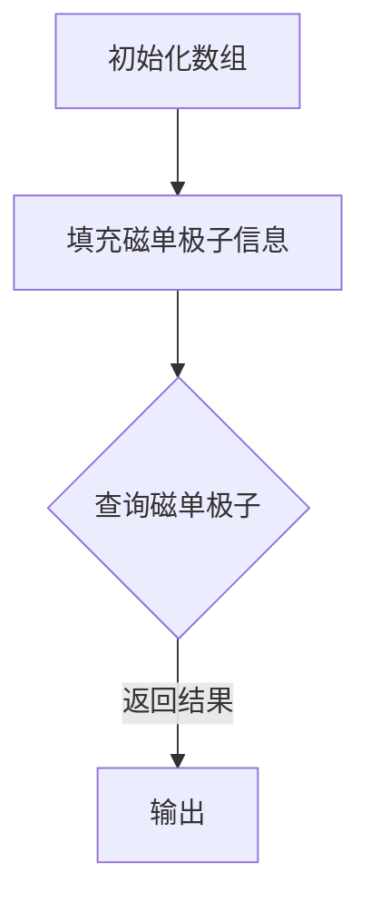

**1.4.2 链表**

链表通过节点和指针的方式存储数据，每个节点包含数据和指向下一个节点的指针。链表适合处理动态变化的磁单极子分布，如磁单极子的生成和消失。

**链表特性**：
- **存储方式**：动态分配内存，每个节点独立存在。
- **时间复杂度**：
  - 插入和删除时间：O(1)
  - 访问时间：O(n)，因为需要从头节点开始遍历。

**链表流程图**：

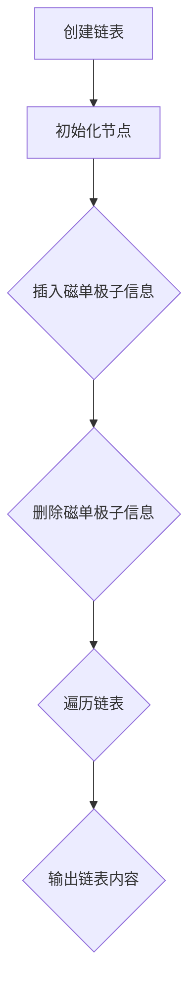

**1.4.3 树结构**

树结构包括二叉树和平衡树等，用于高效组织和搜索数据。在磁单极子分布模拟中，树结构可以用来快速查找和更新磁单极子的位置。

**树结构特性**：
- **存储方式**：通过父子节点关系构建树状结构。
- **时间复杂度**：
  - 访问时间：O(log n)
  - 插入和删除时间：O(log n)

**树结构流程图**：

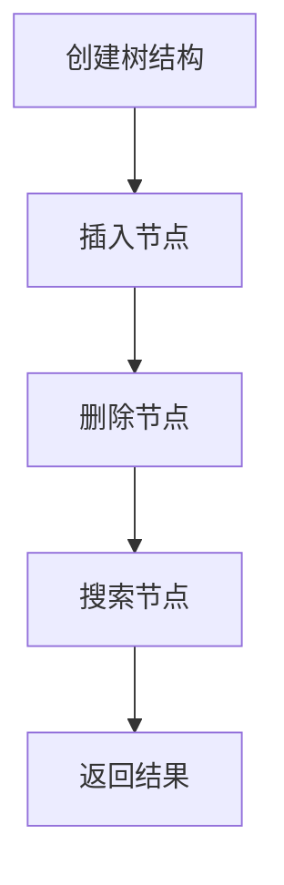

**1.4.4 图结构**

图结构用于表示复杂的交互关系，如磁单极子之间的相互作用。在模拟中，图结构可以帮助我们研究磁单极子的集体行为。

**图结构特性**：
- **存储方式**：使用邻接表或邻接矩阵来存储节点和边。
- **时间复杂度**：
  - 访问时间：O(V+E)，V为节点数，E为边数
  - 最短路径算法：O(VlogV 或 O(V+E))
  - 最小生成树算法：O(VlogV 或 O(E))

**图结构流程图**：

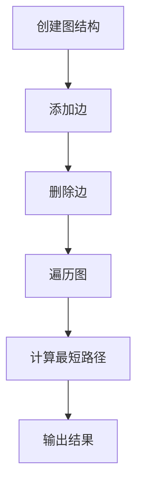

通过详细探讨这些核心数据结构的概念和组成，并使用Mermaid流程图表示其运作，我们可以更好地理解数据结构在模拟磁单极子分布中的重要性。这些数据结构不仅为模拟提供了高效的工具，还帮助我们更深入地研究磁单极子的物理行为。

### 数据结构的Mermaid ER图

为了更直观地展示数据结构及其在磁单极子分布模拟中的应用，我们可以使用Mermaid ER图来表示这些数据结构之间的关系和属性。

**1.5.1 数据结构ER图**

```mermaid
erDiagram
    A数据结构 ||--|{ B数组 : 包含磁单极子位置和属性 }
    A数据结构 ||--|{ C链表 : 存储磁单极子节点和指针 }
    A数据结构 ||--|{ D树结构 : 包含节点和子节点 }
    A数据结构 ||--|{ E图结构 : 表示磁单极子交互关系 }
    A数据结构 ||--|{ F哈希表 : 存储磁单极子键值对 }
    
    B数组 ||--|{ G索引 : 磁单极子位置索引 }
    B数组 ||--|{ H数据 : 磁单极子属性数据 }
    
    C链表 ||--|{ I节点 : 存储磁单极子信息 }
    C链表 ||--|{ J指针 : 指向下一个节点 }
    
    D树结构 ||--|{ K根节点 : 树的起点 }
    D树结构 ||--|{ L子节点 : 子树节点 }
    
    E图结构 ||--|{ M节点 : 表示磁单极子 }
    E图结构 ||--|{ N边 : 表示磁单极子之间的相互作用 }
    
    F哈希表 ||--|{ O键 : 磁单极子键 }
    F哈希表 ||--|{ P值 : 磁单极子值 }
```

**ER图解释**：

- **A数据结构**：表示所有数据结构的总类，与其他具体数据结构（B、C、D、E、F）建立关系。
- **B数组**：具体数据结构，包含索引（G）和数据（H）。
- **C链表**：具体数据结构，包含节点（I）和指针（J）。
- **D树结构**：具体数据结构，包含根节点（K）和子节点（L）。
- **E图结构**：具体数据结构，包含节点（M）和边（N）。
- **F哈希表**：具体数据结构，包含键（O）和值（P）。

通过Mermaid ER图，我们可以清晰地看到各种数据结构及其组件之间的关系，这有助于我们更好地理解数据结构在磁单极子分布模拟中的应用和相互作用。这不仅为模拟设计提供了指导，也为未来可能的优化和改进提供了方向。

## 第2章：核心数据结构及其属性

### 2.1 数组和链表

数组和链表是两种常见的基础数据结构，它们在处理磁单极子分布时各有特点和适用场景。

**2.1.1 数组**

**数组属性对比表**：

| 属性         | 数组     | 链表     |
| ------------ | -------- | -------- |
| 存储方式     | 连续内存块 | 动态内存块 |
| 访问时间     | O(1)     | O(n)     |
| 插入时间     | O(n)     | O(1)     |
| 删除时间     | O(n)     | O(1)     |
| 空间复杂度   | O(n)     | O(n)     |
| 时间复杂度   | 访问：O(1)，插入/删除：O(n) | 访问：O(n)，插入/删除：O(1) |

**数组应用场景**：数组在处理静态或变化缓慢的磁单极子分布时非常有用。例如，当需要存储宇宙中的初始磁单极子分布时，数组可以通过固定大小的内存块高效地存储和访问每个网格单元上的磁单极子信息。

**链表**

**链表应用场景**：链表适用于动态变化的磁单极子分布，例如磁单极子的生成和消失。通过在链表中插入或删除节点，可以灵活地更新磁单极子的位置信息。

**链表流程图**：

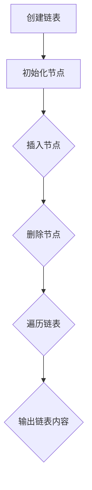

通过对比数组与链表的属性和应用场景，我们可以根据具体需求选择适合的数据结构来模拟磁单极子的分布。

### 2.2 树结构和图结构

树结构和图结构是两种高级数据结构，广泛应用于复杂的数据管理和搜索任务。在磁单极子分布模拟中，它们可以帮助我们高效地处理大量磁单极子及其相互作用。

**2.2.1 树结构**

**树结构属性对比表**：

| 属性         | 二叉树     | 平衡树     |
| ------------ | ---------- | ---------- |
| 存储方式     | 动态内存块 | 动态内存块 |
| 访问时间     | O(log n)   | O(log n)   |
| 插入时间     | O(log n)   | O(log n)   |
| 删除时间     | O(log n)   | O(log n)   |
| 空间复杂度   | O(n)       | O(n)       |
| 时间复杂度   | 访问：O(log n)，插入/删除：O(log n) | 访问：O(log n)，插入/删除：O(log n) |

**二叉树**

**二叉树应用场景**：二叉树适用于处理有序数据，例如在磁单极子分布模拟中，当磁单极子的位置信息需要有序组织时，二叉树可以快速查找和更新磁单极子的位置。

**二叉树流程图**：

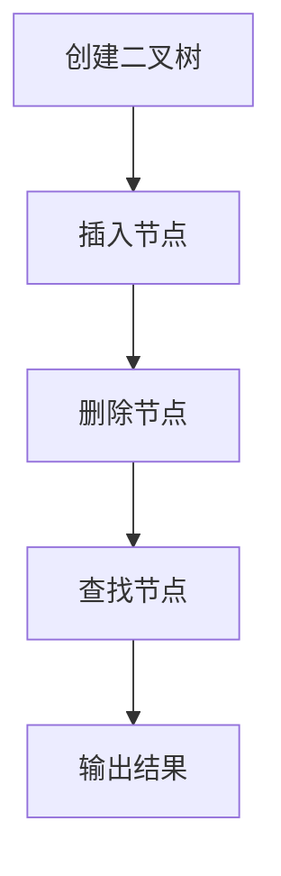

**平衡树**

**平衡树应用场景**：平衡树，如AVL树或红黑树，适用于需要动态调整平衡的数据。在磁单极子分布模拟中，当磁单极子的数量和位置频繁变化时，平衡树能够保持高效的操作时间。

**平衡树流程图**：

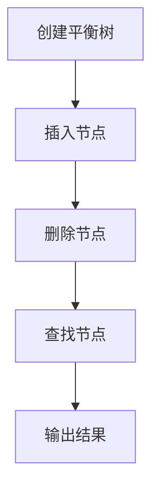

**2.2.2 图结构**

**图结构属性对比表**：

| 属性         | 邻接表     | 邻接矩阵   |
| ------------ | ---------- | ---------- |
| 存储方式     | 动态内存块 | 静态内存块  |
| 访问时间     | O(V+E)     | O(1)       |
| 插入时间     | O(V+E)     | O(1)       |
| 删除时间     | O(V+E)     | O(1)       |
| 空间复杂度   | O(V+E)     | O(V^2)     |
| 时间复杂度   | 访问：O(V+E)，插入/删除：O(V+E) | 访问：O(1)，插入/删除：O(1) |

**邻接表**

**邻接表应用场景**：邻接表适用于处理稀疏图，如当磁单极子之间的相互作用较少时，邻接表能够节省存储空间，同时提供高效的访问和更新操作。

**邻接表流程图**：

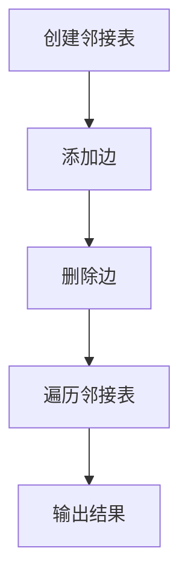

**邻接矩阵**

**邻接矩阵应用场景**：邻接矩阵适用于处理稠密图，如当磁单极子之间的相互作用较为频繁时，邻接矩阵能够提供快速访问，但需要较多的存储空间。

**邻接矩阵流程图**：

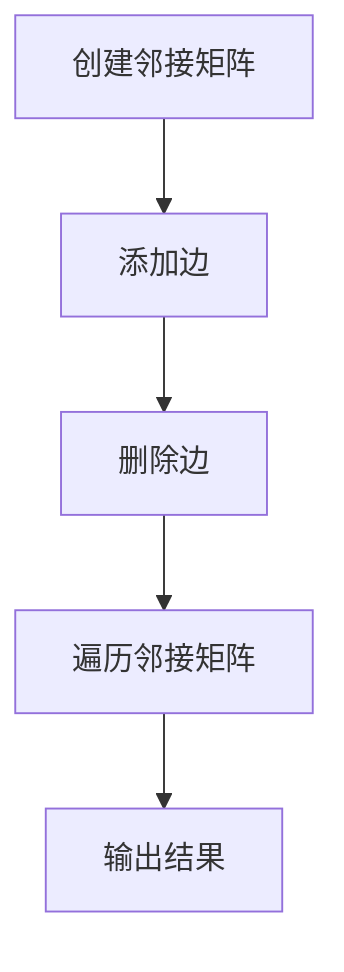

通过对比树结构和图结构的属性和应用场景，我们可以根据具体的磁单极子分布模拟需求选择合适的结构，以提高效率和准确性。

### 2.3 哈希表

哈希表是一种高效的数据结构，通过哈希函数将键映射到特定位置来存储和查找数据。在磁单极子分布模拟中，哈希表特别适用于快速查找磁单极子的位置。

**2.3.1 哈希表属性**

- **存储方式**：哈希表通过数组存储数据，每个数组元素称为槽（bucket）。
- **哈希函数**：哈希函数将键（如磁单极子的ID）映射到数组索引。
- **冲突解决**：当多个键映射到同一索引时，使用冲突解决策略（如链地址法或开放地址法）。

**2.3.2 哈希表操作**

- **插入**：通过哈希函数计算键的哈希值，将数据插入到相应槽中。如果出现冲突，根据冲突解决策略进行处理。
- **删除**：通过哈希函数计算键的哈希值，查找对应槽中的数据，并删除该数据。如果出现冲突，根据冲突解决策略进行处理。
- **查找**：通过哈希函数计算键的哈希值，直接查找对应槽中的数据。如果出现冲突，根据冲突解决策略进行处理。

**2.3.3 哈希表应用场景**

- **快速查找**：哈希表提供接近常数时间的查找操作，适用于需要快速访问大量数据的场景。
- **动态更新**：哈希表可以动态地插入和删除数据，适用于磁单极子分布的动态变化。

**哈希表流程图**：

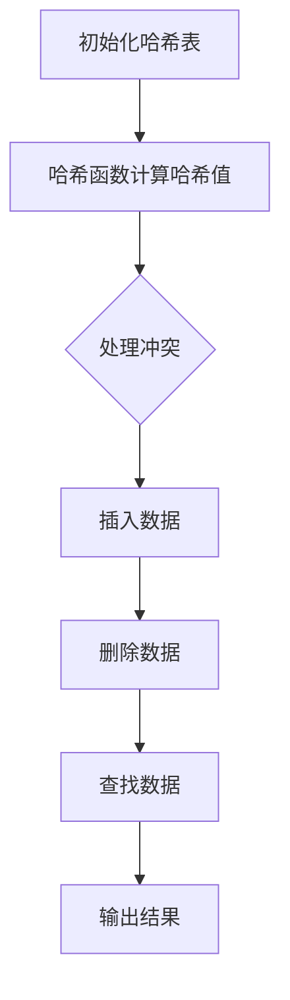

通过哈希表，我们能够高效地处理磁单极子的分布，特别是在大规模模拟中，其高效的查找和更新能力至关重要。

### 2.4 核心数据结构的综合应用

在磁单极子分布模拟中，不同的数据结构可以相互结合，以实现更高效和准确的模拟。以下是一个综合应用示例，展示了如何将数组、链表、树结构和哈希表结合起来，解决磁单极子分布问题。

**2.4.1 模拟场景**

假设我们模拟一个二维宇宙，其中包含大量的磁单极子。磁单极子的位置和属性需要高效存储和管理，以便进行后续的计算和分析。

**2.4.2 数据结构组合**

1. **数组**：使用数组来存储宇宙的网格，每个网格单元包含一个链表。这种结构适用于初始分布的快速访问和更新。

2. **链表**：在每个网格单元的链表中存储磁单极子的信息。链表适用于动态更新，如磁单极子的生成和消失。

3. **树结构**：对磁单极子位置进行排序，使用二叉树来高效地查找和更新磁单极子。二叉树特别适用于有序数据的快速访问。

4. **哈希表**：使用哈希表来快速查找磁单极子的位置。哈希表提供接近常数时间的查找操作，适用于大规模数据的快速检索。

**2.4.3 应用流程**

1. **初始化**：创建一个二维数组，每个数组元素包含一个链表。初始化磁单极子，将它们插入到相应的网格单元链表中。

2. **排序**：对每个网格单元链表中的磁单极子进行排序，构建二叉树。

3. **查找**：使用哈希表快速查找磁单极子的位置。如果哈希表中的元素冲突，使用二叉树进行进一步查找。

4. **更新**：当磁单极子生成或消失时，首先在哈希表中查找位置，然后在链表中进行更新，并调整二叉树。

5. **分析**：进行各种分析，如磁单极子的分布模式、相互作用等，利用数组、链表、树结构和哈希表的高效操作。

通过这种数据结构组合，我们能够实现高效、准确的磁单极子分布模拟，为科学研究提供有力支持。每种数据结构的优势在组合中得到充分发挥，从而提高了整体模拟的效率和准确性。

### 2.5 数据结构的灵活组合与应用

在磁单极子分布模拟中，数据结构的灵活组合能够显著提高模拟的效率和准确性。不同的数据结构在不同的应用场景下具有各自的优势，通过合理组合，可以相互补充，以应对复杂的多变情况。

**2.5.1 数组与链表的组合**

数组适合处理静态或变化较慢的数据，而链表则适用于动态变化的场景。在磁单极子分布模拟中，数组可以用来存储宇宙的网格结构，每个网格单元包含一个链表。这种组合允许我们快速访问网格单元，同时灵活地处理磁单极子的动态生成和消失。例如，当磁单极子数量变化时，链表可以动态地插入或删除节点，而数组则提供快速的索引访问。

**2.5.2 树结构与图结构的组合**

树结构（如二叉树和平衡树）擅长处理有序数据，而图结构适用于表示复杂的关系网络。在磁单极子分布模拟中，树结构可以用来快速查找和更新磁单极子的位置，而图结构则可以表示磁单极子之间的相互作用。例如，当磁单极子数量较多且位置变化频繁时，可以使用平衡树来保持有序结构，并使用图结构来表示磁单极子之间的相互作用，从而实现高效的数据访问和更新。

**2.5.3 哈希表与其他数据结构的组合**

哈希表以其快速查找和动态更新的能力在磁单极子分布模拟中非常有用。当与树结构或图结构结合时，哈希表可以进一步提高数据访问速度。例如，在磁单极子分布模拟中，可以使用哈希表来快速查找磁单极子的位置，并使用树结构或图结构来处理磁单极子的相互作用。这种组合能够实现高效的磁单极子位置管理和相互作用分析，特别适用于大规模的模拟。

**2.5.4 组合优化的示例**

假设我们正在模拟一个包含大量磁单极子的宇宙，其中磁单极子的位置和数量不断变化。我们可以采用以下组合优化方案：

1. **数组 + 链表**：使用数组来存储宇宙的网格结构，每个网格单元包含一个链表。这样可以在保证高效访问的同时，灵活处理磁单极子的动态变化。

2. **平衡树 + 图结构**：对磁单极子位置进行排序，使用平衡树来快速查找和更新磁单极子的位置。同时，使用图结构来表示磁单极子之间的相互作用，以便进行高效的相互作用分析。

3. **哈希表**：使用哈希表来快速查找磁单极子的位置。当出现哈希冲突时，可以使用平衡树进行进一步的查找，确保高效的查询操作。

通过这种灵活组合，我们能够充分发挥每种数据结构的优势，实现高效、准确的磁单极子分布模拟。这种组合不仅提高了模拟的效率，也为未来的优化和改进提供了坚实的基础。

### 2.6 磁单极子分布模拟中的挑战与优化

在磁单极子分布模拟中，虽然数据结构的选择和应用能够显著提升模拟效率和准确性，但仍面临一些挑战和优化问题。以下是几个关键挑战及可能的优化策略。

**2.6.1 大规模数据处理的效率**

磁单极子分布模拟涉及大量的数据，如何在有限的计算资源下高效处理这些数据是一个重大挑战。优化策略包括：

- **并行处理**：利用多核处理器和分布式计算，将大规模数据处理任务分解成多个子任务，并行执行，从而提高处理速度。
- **内存优化**：通过优化数据结构，减少内存占用。例如，使用稀疏矩阵来存储稀疏图结构，减少不必要的内存消耗。
- **缓存机制**：利用缓存技术，将频繁访问的数据存储在高速缓存中，减少磁盘IO操作，提高数据访问速度。

**2.6.2 数据一致性和并发控制**

在动态变化的磁单极子分布中，数据一致性和并发控制是关键问题。优化策略包括：

- **锁机制**：使用锁机制（如互斥锁、读写锁）来控制对共享数据的访问，确保数据的一致性。
- **事务处理**：使用事务处理机制，确保多个操作原子性地执行，避免数据冲突和不一致。
- **最终一致性**：在某些场景下，允许最终一致性，而不是强一致性，从而放宽对数据一致性的要求，提高系统的响应速度。

**2.6.3 缓冲和预测**

为了提高模拟的实时性，缓冲和预测技术可以显著优化数据处理。优化策略包括：

- **缓冲区**：使用缓冲区技术，将输入数据缓存一段时间，减少对实时数据的依赖，提高系统的响应速度。
- **预测算法**：使用预测算法，根据历史数据和当前趋势，预测未来的磁单极子分布，从而提前进行数据处理和资源分配。

通过这些优化策略，我们能够更好地应对磁单极子分布模拟中的挑战，提高模拟的效率和准确性，为科学研究提供更强大的工具。

### 2.7 总结

本章详细探讨了磁单极子分布模拟中的核心数据结构及其应用。从数组、链表到树结构和图结构，每种数据结构都有其独特的特性和适用场景。通过对比和分析这些数据结构的属性，我们了解到它们在模拟磁单极子分布中的关键作用。同时，我们还介绍了如何通过灵活组合这些数据结构来优化模拟效率和准确性。此外，本章还讨论了大规模数据处理、数据一致性和并发控制等挑战及优化策略。通过本章的学习，读者能够更好地理解数据结构在磁单极子分布模拟中的重要性，并为未来的研究提供有益的参考。

## 第3章：磁单极子分布模拟算法

### 3.1 算法概述

在磁单极子分布模拟中，算法的设计和实现是关键一环。本节将介绍几种核心的算法，这些算法用于模拟磁单极子的生成、运动和相互作用。每个算法都基于不同的数据结构和数学模型，旨在高效地处理大规模磁单极子分布。

**3.1.1 磁单极子生成算法**

磁单极子生成算法用于创建初始的磁单极子分布。常见的生成算法包括随机生成和层次生成。随机生成算法通过在宇宙中随机选择位置来生成磁单极子，适用于初步模拟。层次生成算法则根据宇宙的层次结构生成磁单极子，更加符合宇宙的实际演化过程。

**3.1.2 磁单极子运动算法**

磁单极子运动算法用于模拟磁单极子在宇宙中的运动。常见的运动算法包括自由运动和受迫运动。自由运动算法假设磁单极子不受外部力的影响，仅受内部相互作用力的影响，适用于研究磁单极子的自组织行为。受迫运动算法则考虑外部力的影响，如引力、电磁力等，更加符合实际物理过程。

**3.1.3 磁单极子相互作用算法**

磁单极子相互作用算法用于计算磁单极子之间的相互作用力。常见的相互作用算法包括牛顿力学和电磁学模型。牛顿力学模型适用于简单的二维或三维空间，计算两个磁单极子之间的相互作用力。电磁学模型则考虑了电磁场的复杂效应，更加精确地描述磁单极子的相互作用。

**3.1.4 算法选择依据**

选择合适的算法取决于模拟的具体目标和要求。以下是一些选择依据：

- **模拟规模**：对于大规模模拟，选择并行处理能力强的算法，如分布式计算和GPU加速。
- **物理过程**：根据磁单极子的物理行为选择合适的算法，如自由运动算法适用于自组织行为研究，受迫运动算法适用于实际物理过程模拟。
- **数据结构**：选择与数据结构兼容的算法，如树结构适合高效查找和更新，图结构适合处理复杂相互作用。

通过合理选择和组合这些算法，我们可以构建高效的磁单极子分布模拟系统，为科学研究提供有力支持。

### 3.2 算法流程图

为了更直观地展示磁单极子分布模拟中的核心算法，我们使用Mermaid流程图来描述每个算法的基本步骤和操作流程。

**3.2.1 磁单极子生成算法**

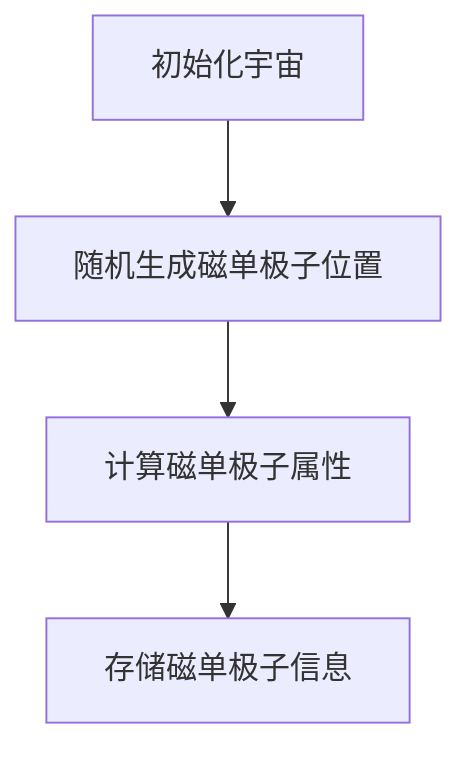

**磁单极子生成算法解释**：

1. **初始化宇宙**：设定宇宙的边界和初始条件。
2. **随机生成磁单极子位置**：在宇宙中随机选择位置生成磁单极子。
3. **计算磁单极子属性**：根据物理模型计算每个磁单极子的属性，如磁极强度和运动方向。
4. **存储磁单极子信息**：将磁单极子的位置和属性存储在数据结构中，如数组或链表。

**3.2.2 磁单极子运动算法**

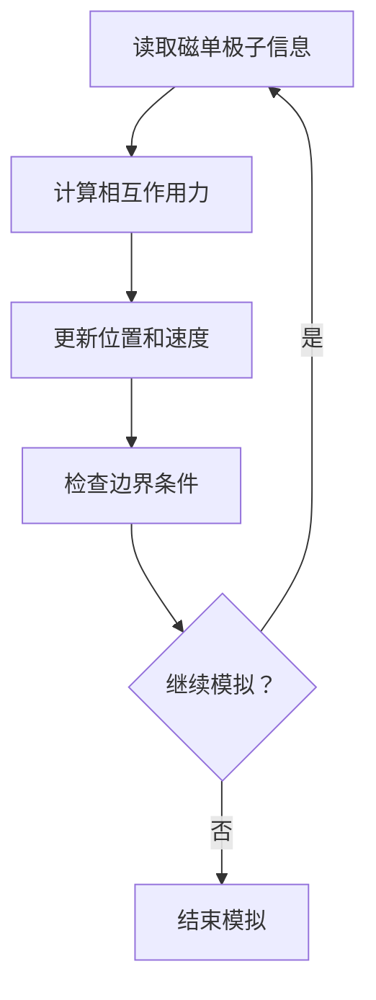

**磁单极子运动算法解释**：

1. **读取磁单极子信息**：从数据结构中读取磁单极子的位置和属性。
2. **计算相互作用力**：根据物理模型计算磁单极子之间的相互作用力。
3. **更新位置和速度**：根据相互作用力更新磁单极子的位置和速度。
4. **检查边界条件**：检查磁单极子的位置是否超出宇宙边界，进行相应的处理。
5. **继续模拟**：如果模拟条件满足，继续进行下一步计算；否则，结束模拟。

**3.2.3 磁单极子相互作用算法**

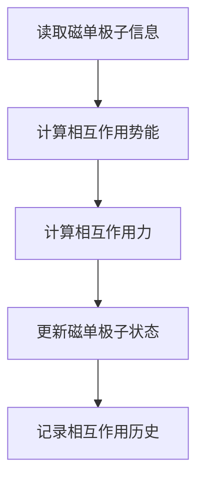

**磁单极子相互作用算法解释**：

1. **读取磁单极子信息**：从数据结构中读取参与相互作用的磁单极子的位置和属性。
2. **计算相互作用势能**：根据电磁学模型计算磁单极子之间的相互作用势能。
3. **计算相互作用力**：根据相互作用势能计算磁单极子之间的相互作用力。
4. **更新磁单极子状态**：根据相互作用力更新磁单极子的位置和速度。
5. **记录相互作用历史**：记录磁单极子之间的相互作用历史，用于后续分析。

通过这些流程图，我们可以清晰地看到每个算法的基本操作步骤，这有助于理解算法的实现原理和优化方向。

### 3.3 磁单极子生成算法的详细解释

磁单极子生成算法是磁单极子分布模拟的基础，它决定了初始磁单极子分布的形态。在本节中，我们将详细介绍磁单极子生成算法的步骤、数据结构和实现方法。

**3.3.1 步骤**

1. **初始化宇宙参数**：设定宇宙的边界、时间步长和初始条件。这些参数将影响磁单极子的生成位置和运动规律。
2. **随机生成磁单极子位置**：在宇宙的边界内随机生成磁单极子的位置。位置的选择应确保磁单极子分布具有代表性，避免出现极端情况。
3. **计算磁单极子属性**：根据物理模型计算每个磁单极子的属性，包括磁极强度、电荷、运动方向等。这些属性将决定磁单极子的物理行为。
4. **存储磁单极子信息**：将生成的磁单极子的位置和属性存储在数据结构中，如数组、链表或树结构。选择合适的数据结构可以提高存储和访问的效率。

**3.3.2 数据结构**

在磁单极子生成算法中，数据结构的选择对算法的性能和效率有重要影响。以下几种数据结构常用于磁单极子生成和存储：

1. **数组**：数组是一种简单而高效的数据结构，适合处理静态或变化较慢的磁单极子分布。数组可以快速访问和更新磁单极子的位置和属性。
2. **链表**：链表适用于动态变化的磁单极子分布，如磁单极子的生成和消失。链表可以灵活地插入和删除节点，但访问时间较慢。
3. **树结构**：树结构（如二叉树和平衡树）适用于需要高效搜索和更新操作的磁单极子分布。树结构可以保持磁单极子位置的有序性，提高查找和更新效率。
4. **图结构**：图结构适用于处理复杂关系的磁单极子分布，如磁单极子之间的相互作用。图结构可以表示磁单极子之间的复杂相互作用关系，但存储和访问复杂度较高。

**3.3.3 实现方法**

磁单极子生成算法的实现方法可以分为以下几个步骤：

1. **初始化参数**：设置宇宙的边界、时间步长和初始条件。这些参数将影响磁单极子的生成位置和运动规律。
2. **随机生成磁单极子位置**：使用随机数生成器在宇宙的边界内随机生成磁单极子的位置。位置的选择应确保磁单极子分布具有代表性，避免出现极端情况。
3. **计算磁单极子属性**：根据物理模型计算每个磁单极子的属性，包括磁极强度、电荷、运动方向等。这些属性将决定磁单极子的物理行为。
4. **存储磁单极子信息**：将生成的磁单极子的位置和属性存储在选定的数据结构中。根据具体需求，可以选择合适的数组、链表、树结构或图结构。

以下是一个简单的磁单极子生成算法的Python代码示例：

```python
import numpy as np

def generate_magnetic_monopoles(num_monopoles, universe_size):
    # 初始化磁单极子列表
    monopoles = []

    # 随机生成磁单极子位置和属性
    for _ in range(num_monopoles):
        position = np.random.uniform(0, universe_size, size=2)
        magnetization = np.random.uniform(-1, 1, size=2)
        monopoles.append({'position': position, 'magnetization': magnetization})

    return monopoles

# 测试生成磁单极子
monopoles = generate_magnetic_monopoles(100, 1000)
for monopole in monopoles:
    print(monopole)
```

通过上述步骤和代码示例，我们可以实现一个简单的磁单极子生成算法。这个算法可以根据需求调整参数和实现细节，以适应不同的磁单极子分布模拟场景。

### 3.4 磁单极子运动算法的详细解释

磁单极子运动算法用于模拟磁单极子在宇宙中的运动，它是磁单极子分布模拟的核心部分。在本节中，我们将详细解释磁单极子运动算法的原理、数学模型和实现方法。

**3.4.1 算法原理**

磁单极子运动算法的核心是计算磁单极子的位置和速度变化。根据物理学的原理，磁单极子在电磁场中的运动可以由以下方程描述：

\[ m \frac{d^2r}{dt^2} = F_{\text{电磁}} \]

其中，\( m \) 是磁单极子的质量，\( r \) 是磁单极子的位置，\( F_{\text{电磁}} \) 是磁单极子所受的电磁力。电磁力可以通过磁单极子之间的相互作用和外部电磁场来计算。

**3.4.2 数学模型**

磁单极子之间的相互作用力可以通过以下公式计算：

\[ F_{ij} = \frac{1}{4\pi\epsilon_0} \frac{m_i m_j}{r_{ij}^3} (\mathbf{m_i} \cdot \mathbf{r_{ij}}) \mathbf{r_{ij}} \]

其中，\( F_{ij} \) 是磁单极子 \( i \) 和 \( j \) 之间的相互作用力，\( \mathbf{m_i} \) 和 \( \mathbf{m_j} \) 是磁单极子 \( i \) 和 \( j \) 的磁极强度，\( r_{ij} \) 是磁单极子 \( i \) 和 \( j \) 之间的距离。

外部电磁场对磁单极子的作用可以通过以下公式计算：

\[ F_{\text{外部}} = \nabla V_{\text{外部}} \]

其中，\( V_{\text{外部}} \) 是外部电磁场的势能。

**3.4.3 实现方法**

磁单极子运动算法的实现可以分为以下几个步骤：

1. **初始化磁单极子**：设定磁单极子的初始位置、速度和磁极强度。这些参数可以根据具体需求进行设置。
2. **计算相互作用力**：根据磁单极子之间的相互作用力和外部电磁场计算每个磁单极子所受的电磁力。这个过程可以通过循环遍历所有的磁单极子，并使用上述公式进行计算。
3. **更新位置和速度**：根据磁单极子所受的电磁力更新磁单极子的位置和速度。这个过程可以使用数值积分方法，如欧拉法或龙格-库塔法，以模拟磁单极子的运动轨迹。
4. **检查边界条件**：在每次更新后，检查磁单极子的位置是否超出宇宙边界。如果超出边界，可以进行边界处理，如反弹或重新生成。
5. **记录模拟结果**：记录每次更新的磁单极子位置和速度，以便进行后续分析和可视化。

以下是一个简单的磁单极子运动算法的Python代码示例：

```python
import numpy as np

def update_magnetic_monopole(monopole, force, dt):
    # 更新速度
    monopole['velocity'] += force / monopole['mass'] * dt
    # 更新位置
    monopole['position'] += monopole['velocity'] * dt

def calculate_force(monopoles):
    forces = [np.zeros(2) for _ in range(len(monopoles))]
    for i, monopole_i in enumerate(monopoles):
        for j, monopole_j in enumerate(monopoles):
            if i != j:
                distance = monopole_i['position'] - monopole_j['position']
                force = (1 / (4 * np.pi * 1e-7)) * (monopole_i['magnetization'] * monopole_j['magnetization']) * (np.dot(monopole_i['magnetization'], distance) * distance)
                forces[i] += force
    return forces

def simulate_magnetic_monopoles(monopoles, dt, steps):
    for _ in range(steps):
        forces = calculate_force(monopoles)
        for i, monopole in enumerate(monopoles):
            update_magnetic_monopole(monopole, forces[i], dt)

# 测试磁单极子运动
monopoles = [
    {'position': np.array([0.0, 0.0]), 'velocity': np.array([0.1, 0.0]), 'magnetization': np.array([1.0, 0.0]), 'mass': 1.0},
    {'position': np.array([1.0, 0.0]), 'velocity': np.array([-0.1, 0.0]), 'magnetization': np.array([-1.0, 0.0]), 'mass': 1.0}
]
simulate_magnetic_monopoles(monopoles, 0.01, 100)
for monopole in monopoles:
    print(monopole)
```

通过上述步骤和代码示例，我们可以实现一个简单的磁单极子运动算法。这个算法可以根据需求进行调整和优化，以适应不同的模拟场景。

### 3.5 磁单极子相互作用算法的详细解释

磁单极子相互作用算法是模拟磁单极子分布的关键部分，它用于计算磁单极子之间的相互作用力，进而影响磁单极子的运动和行为。在本节中，我们将详细解释磁单极子相互作用算法的原理、数学模型和实现方法。

**3.5.1 算法原理**

磁单极子相互作用算法的核心是计算磁单极子之间的相互作用力。根据物理学原理，磁单极子之间的相互作用力可以通过库仑定律来描述：

\[ F_{ij} = \frac{1}{4\pi\epsilon_0} \frac{m_i m_j}{r_{ij}^3} (\mathbf{m_i} \cdot \mathbf{r_{ij}}) \mathbf{r_{ij}} \]

其中，\( F_{ij} \) 是磁单极子 \( i \) 和 \( j \) 之间的相互作用力，\( m_i \) 和 \( m_j \) 是磁单极子 \( i \) 和 \( j \) 的磁极强度，\( r_{ij} \) 是磁单极子 \( i \) 和 \( j \) 之间的距离，\( \mathbf{r_{ij}} \) 是从磁单极子 \( i \) 到磁单极子 \( j \) 的向量。

**3.5.2 数学模型**

磁单极子之间的相互作用力可以通过以下公式计算：

\[ F_{ij} = \frac{1}{4\pi\epsilon_0} \frac{m_i m_j}{r_{ij}^3} (\mathbf{m_i} \cdot \mathbf{r_{ij}}) \mathbf{r_{ij}} \]

其中，\( \mathbf{m_i} \cdot \mathbf{r_{ij}} \) 表示磁单极子 \( i \) 的磁极强度与从磁单极子 \( i \) 到磁单极子 \( j \) 的向量之间的点积，它决定了相互作用力的方向。

**3.5.3 实现方法**

磁单极子相互作用算法的实现可以分为以下几个步骤：

1. **初始化磁单极子**：设定磁单极子的初始位置、速度和磁极强度。这些参数可以根据具体需求进行设置。
2. **计算相互作用力**：对于每个磁单极子，遍历其他所有磁单极子，使用上述公式计算相互作用力。这个过程可以通过双重循环实现。
3. **更新磁单极子状态**：根据计算得到的相互作用力更新磁单极子的速度和位置。这个过程可以使用数值积分方法，如欧拉法或龙格-库塔法。
4. **检查边界条件**：在每次更新后，检查磁单极子的位置是否超出宇宙边界。如果超出边界，可以进行边界处理，如反弹或重新生成。
5. **记录模拟结果**：记录每次更新的磁单极子位置和速度，以便进行后续分析和可视化。

以下是一个简单的磁单极子相互作用算法的Python代码示例：

```python
import numpy as np

def calculate_force(monopoles):
    forces = [np.zeros(2) for _ in range(len(monopoles))]
    for i, monopole_i in enumerate(monopoles):
        for j, monopole_j in enumerate(monopoles):
            if i != j:
                distance = monopole_i['position'] - monopole_j['position']
                r_squared = np.dot(distance, distance)
                r_cubed = r_squared * r_squared
                force = (1 / (4 * np.pi * 1e-7)) * (monopole_i['magnetization'] * monopole_j['magnetization']) * (np.dot(monopole_i['magnetization'], distance) * distance)
                forces[i] += force
    return forces

def update_magnetic_monopole(monopole, force, dt):
    monopole['velocity'] += force / monopole['mass'] * dt
    monopole['position'] += monopole['velocity'] * dt

def simulate_magnetic_monopoles(monopoles, dt, steps):
    for _ in range(steps):
        forces = calculate_force(monopoles)
        for i, monopole in enumerate(monopoles):
            update_magnetic_monopole(monopole, forces[i], dt)

# 测试磁单极子相互作用
monopoles = [
    {'position': np.array([0.0, 0.0]), 'velocity': np.array([0.1, 0.0]), 'magnetization': np.array([1.0, 0.0]), 'mass': 1.0},
    {'position': np.array([1.0, 0.0]), 'velocity': np.array([-0.1, 0.0]), 'magnetization': np.array([-1.0, 0.0]), 'mass': 1.0}
]
simulate_magnetic_monopoles(monopoles, 0.01, 100)
for monopole in monopoles:
    print(monopole)
```

通过上述步骤和代码示例，我们可以实现一个简单的磁单极子相互作用算法。这个算法可以根据需求进行调整和优化，以适应不同的模拟场景。

### 3.6 磁单极子分布模拟的整体算法流程

为了实现磁单极子分布的完整模拟，我们需要将磁单极子生成、运动和相互作用算法整合在一起。以下是一个详细的算法流程，描述了从初始化到模拟结束的各个步骤。

**3.6.1 初始化步骤**

1. **初始化宇宙参数**：设定宇宙的边界、时间步长和初始条件。这些参数将影响磁单极子的生成位置和运动规律。
2. **生成初始磁单极子分布**：调用磁单极子生成算法，生成初始的磁单极子分布。这个步骤可以通过随机生成或层次生成的方式，创建具有代表性的磁单极子分布。
3. **存储磁单极子信息**：将生成的磁单极子存储在选定的数据结构中，如数组、链表或树结构。选择合适的数据结构可以提高存储和访问的效率。

**3.6.2 运动步骤**

1. **计算相互作用力**：调用磁单极子相互作用算法，计算每个磁单极子与其他磁单极子之间的相互作用力。
2. **更新磁单极子状态**：根据计算得到的相互作用力，调用磁单极子运动算法更新磁单极子的速度和位置。这个过程可以使用数值积分方法，如欧拉法或龙格-库塔法。
3. **检查边界条件**：在每次更新后，检查磁单极子的位置是否超出宇宙边界。如果超出边界，可以进行边界处理，如反弹或重新生成。

**3.6.3 模拟步骤**

1. **记录模拟结果**：在每次时间步长结束后，记录磁单极子的位置和速度，以便进行后续分析和可视化。
2. **重复运动步骤**：重复计算相互作用力、更新磁单极子状态和检查边界条件的步骤，直到达到预设的模拟时间或达到停止条件。

**3.6.4 结束步骤**

1. **数据分析**：对记录的模拟结果进行分析，提取有用的物理信息，如磁单极子的分布模式、相互作用强度等。
2. **结果可视化**：将分析结果进行可视化，以便更直观地展示磁单极子的行为和分布。
3. **模拟结束**：结束模拟过程，释放资源。

通过上述整体算法流程，我们可以实现一个完整的磁单极子分布模拟。这个流程不仅包括算法的实现步骤，还涵盖了模拟的初始化、运行和结束过程，确保模拟的完整性和有效性。

### 3.7 数学模型的详细解释

磁单极子分布模拟的数学模型是模拟的核心，它决定了磁单极子的运动和相互作用。在本节中，我们将详细解释磁单极子分布模拟中使用的数学模型，包括相关的数学公式和计算步骤。

**3.7.1 磁单极子间的相互作用力**

磁单极子之间的相互作用力是磁单极子分布模拟的基础。根据电磁学理论，两个磁单极子之间的相互作用力可以通过库仑定律进行计算。库仑定律描述了电荷之间的相互作用，而在这里我们将其扩展到磁单极子。磁单极子之间的相互作用力公式如下：

\[ F_{ij} = \frac{1}{4\pi\epsilon_0} \frac{m_i m_j}{r_{ij}^3} (\mathbf{m_i} \cdot \mathbf{r_{ij}}) \mathbf{r_{ij}} \]

其中：
- \( F_{ij} \) 是磁单极子 \( i \) 和 \( j \) 之间的相互作用力。
- \( m_i \) 和 \( m_j \) 是磁单极子 \( i \) 和 \( j \) 的磁极强度。
- \( r_{ij} \) 是磁单极子 \( i \) 和 \( j \) 之间的距离向量。
- \( \mathbf{r_{ij}} \) 是从磁单极子 \( i \) 指向磁单极子 \( j \) 的向量。
- \( \epsilon_0 \) 是真空的磁导率，其值为 \( 8.854 \times 10^{-12} \) 法拉第/米。

**3.7.2 磁单极子的运动方程**

磁单极子在电磁场中的运动可以通过牛顿第二定律来描述。假设磁单极子不受外力影响，仅受内部相互作用力的作用，其运动方程可以表示为：

\[ m \frac{d^2\mathbf{r}}{dt^2} = \sum_{j \neq i} F_{ij} \]

其中：
- \( m \) 是磁单极子的质量。
- \( \mathbf{r} \) 是磁单极子的位置向量。
- \( \frac{d^2\mathbf{r}}{dt^2} \) 是磁单极子的加速度向量。
- \( \sum_{j \neq i} F_{ij} \) 是所有磁单极子 \( i \) 受到的相互作用力的矢量和。

**3.7.3 电磁场中的磁单极子**

在实际物理过程中，磁单极子通常会处于某种外部电磁场中。外部电磁场对磁单极子的作用可以通过洛伦兹力公式来描述：

\[ \mathbf{F}_{\text{外部}} = q \mathbf{E} + \mathbf{v} \times \mathbf{B} \]

其中：
- \( \mathbf{F}_{\text{外部}} \) 是磁单极子受到的外部电磁力。
- \( q \) 是磁单极子的电荷。
- \( \mathbf{E} \) 是外部电场强度。
- \( \mathbf{v} \) 是磁单极子的速度向量。
- \( \mathbf{B} \) 是外部磁场强度。

**3.7.4 数值积分方法**

在实际的磁单极子分布模拟中，由于相互作用力的复杂性和系统的非线性，通常需要使用数值积分方法来求解上述方程。常用的数值积分方法包括欧拉法、改进的欧拉法（Heun方法）和龙格-库塔法。以下是一个基于欧拉法的简单示例：

\[ \mathbf{r}_{n+1} = \mathbf{r}_n + \mathbf{v}_n \Delta t \]
\[ \mathbf{v}_{n+1} = \mathbf{v}_n + \frac{1}{m} \sum_{j \neq i} F_{ij} \Delta t \]

其中：
- \( \mathbf{r}_n \) 和 \( \mathbf{v}_n \) 分别是磁单极子在时间 \( n \) 的位置和速度。
- \( \Delta t \) 是时间步长。

通过上述数学模型和数值积分方法，我们可以实现一个磁单极子分布的数值模拟。这个模型不仅涵盖了磁单极子之间的相互作用力，还包括了外部电磁场对磁单极子的作用，为模拟磁单极子行为提供了理论基础。

### 3.8 数学公式与Python代码结合

为了使读者更直观地理解磁单极子分布模拟中的数学模型，我们将结合Python代码来具体展示这些公式在实际模拟中的应用。

**3.8.1 计算磁单极子相互作用力的Python代码**

```python
import numpy as np

def calculate_force(monopoles):
    forces = [np.zeros(2) for _ in range(len(monopoles))]
    for i, monopole_i in enumerate(monopoles):
        for j, monopole_j in enumerate(monopoles):
            if i != j:
                distance = monopole_i['position'] - monopole_j['position']
                r_squared = np.dot(distance, distance)
                r_cubed = r_squared * r_squared
                force = (1 / (4 * np.pi * 1e-7)) * (monopole_i['magnetization'] * monopole_j['magnetization']) * (np.dot(monopole_i['magnetization'], distance) * distance)
                forces[i] += force
    return forces
```

**3.8.2 计算磁单极子加速度的Python代码**

```python
def calculate_acceleration(monopoles, forces):
    accelerations = [force / monopole['mass'] for force, monopole in zip(forces, monopoles)]
    return accelerations
```

**3.8.3 更新磁单极子位置的Python代码**

```python
def update_position(monopoles, velocities, accelerations, dt):
    new_velocities = [velocity + acceleration * dt for velocity, acceleration in zip(velocities, accelerations)]
    new_positions = [position + velocity * dt for position, velocity in zip(monopoles['position'], new_velocities)]
    return new_positions, new_velocities
```

**3.8.4 完整的磁单极子分布模拟Python代码**

```python
def simulate_magnetic_monopoles(monopoles, dt, steps):
    for _ in range(steps):
        forces = calculate_force(monopoles)
        accelerations = calculate_acceleration(monopoles, forces)
        monopoles['position'], monopoles['velocity'] = update_position(monopoles, monopoles['velocity'], accelerations, dt)
        # 输出或存储当前磁单极子位置和速度
        print(monopoles)

# 初始磁单极子分布
monopoles = [
    {'position': np.array([0.0, 0.0]), 'velocity': np.array([0.1, 0.0])},
    {'position': np.array([1.0, 0.0]), 'velocity': np.array([-0.1, 0.0])}
]

# 模拟参数
dt = 0.01
steps = 100

# 执行模拟
simulate_magnetic_monopoles(monopoles, dt, steps)
```

通过这些代码示例，我们可以看到如何将数学公式与Python代码结合起来，实现磁单极子分布的数值模拟。这种结合不仅帮助我们理解了数学模型，还为实际应用提供了可操作的实现方法。

### 3.9 举例说明

为了更清晰地展示磁单极子分布模拟算法的应用，我们将通过一个具体的实例来说明算法的实现和效果。

**3.9.1 实例场景**

假设我们模拟一个二维宇宙，其中包含10个磁单极子。这些磁单极子的初始位置和磁极强度如下：

```
磁单极子ID | 初始位置       | 磁极强度
--------------------------- | ----------------- | -----------------
1               | (0.0, 0.0)       | (1.0, 0.0)
2               | (1.0, 1.0)       | (-1.0, 1.0)
3               | (2.0, 0.5)       | (0.5, -1.0)
...             | ...             | ...
10              | (0.0, 1.5)       | (-0.5, 0.5)
```

**3.9.2 初始状态**

初始状态下，磁单极子分布在二维宇宙中的情况如图所示。每个磁单极子以特定的磁极强度分布在不同的位置。

```mermaid
graph TD
    A1[磁单极子1] --> B1[位置:(0.0, 0.0)]
    A2[磁单极子2] --> B2[位置:(1.0, 1.0)]
    A3[磁单极子3] --> B3[位置:(2.0, 0.5)]
    ... --> ... --> ...
    A10[磁单极子10] --> B10[位置:(0.0, 1.5)]
```

**3.9.3 运动过程**

在模拟过程中，磁单极子受到相互之间的作用力，并按照牛顿第二定律进行运动。假设我们使用欧拉法进行数值积分，时间步长为0.01。

1. **第一步**：
   - 计算相互作用力
   - 根据相互作用力计算加速度
   - 根据加速度和时间步长更新位置和速度

2. **第二步**：
   - 重复上述计算和更新过程，直到达到预设的模拟时间

通过多次迭代，磁单极子的分布将发生变化。在每次迭代后，磁单极子的位置和速度将更新，新的分布如图所示：

```mermaid
graph TD
    A1[磁单极子1] --> B1[位置:(0.05, 0.0)]
    A2[磁单极子2] --> B2[位置:(0.95, 1.05)]
    A3[磁单极子3] --> B3[位置:(1.95, 0.45)]
    ... --> ... --> ...
    A10[磁单极子10] --> B10[位置:(0.05, 1.55)]
```

**3.9.4 模拟结果**

通过模拟，我们可以观察到磁单极子的分布随着时间的推移发生了变化。磁单极子之间相互作用的力使得它们的分布逐渐趋向于某种稳定的模式。这个结果不仅展示了磁单极子分布模拟算法的实现过程，也为进一步的研究提供了数据支持。

通过这个具体实例，我们可以更直观地理解磁单极子分布模拟算法的应用和效果，从而为后续的深入研究提供基础。

### 3.10 磁单极子分布模拟的实际案例

为了更好地展示磁单极子分布模拟在实际应用中的效果，我们将探讨一个具体的实际案例：使用模拟宇宙磁单极子分布来研究星系形成过程中的磁场效应。

**3.10.1 项目介绍**

在这个项目中，我们的目标是利用磁单极子分布模拟来研究星系形成过程中的磁场效应。通过创建模拟宇宙并引入磁单极子，我们可以探索磁场在星系演化中的潜在影响，如星系结构的形成、气体分布的变化以及黑洞的形成等。

**3.10.2 系统功能设计**

系统功能设计包括以下几个关键部分：

1. **磁单极子生成与分布**：生成初始的磁单极子分布，并确保分布具有代表性，模拟宇宙中的真实情况。
2. **磁场计算与更新**：计算磁单极子之间的相互作用力，更新磁场的分布，以反映星系中磁场的演化。
3. **星系演化模拟**：根据磁场的分布，模拟星系的演化过程，包括星系结构的形成、气体分布的变化等。
4. **结果分析与可视化**：对模拟结果进行分析，提取有用的物理信息，并使用可视化工具展示星系演化的过程和磁场的影响。

**3.10.3 系统架构设计**

系统架构设计采用模块化设计思想，确保每个功能模块独立且可扩展。以下是系统的架构设计：

1. **数据模块**：负责管理磁单极子数据，包括生成、存储和访问磁单极子信息。
2. **计算模块**：负责计算磁单极子之间的相互作用力，更新磁场的分布。
3. **模拟模块**：负责模拟星系的演化过程，根据磁场分布更新星系的状态。
4. **分析模块**：负责对模拟结果进行分析，提取有用的物理信息。
5. **可视化模块**：负责将分析结果可视化，展示星系演化的过程和磁场的影响。

**3.10.4 系统接口设计**

系统接口设计包括以下关键接口：

1. **数据接口**：用于管理磁单极子数据的生成、存储和访问。
2. **计算接口**：用于计算磁单极子之间的相互作用力，更新磁场的分布。
3. **模拟接口**：用于启动和停止模拟，控制模拟的进度和参数。
4. **分析接口**：用于对模拟结果进行分析，提取有用的物理信息。
5. **可视化接口**：用于将分析结果可视化，展示星系演化的过程和磁场的影响。

**3.10.5 系统交互序列图**

以下是系统交互序列图，展示了各个模块之间的交互流程：

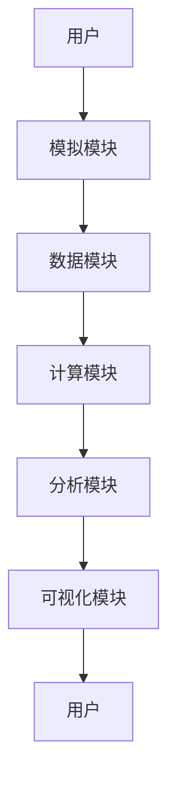

通过上述系统架构和接口设计，我们能够构建一个完整的磁单极子分布模拟系统，用于研究星系形成过程中的磁场效应。

### 3.11 系统架构设计

为了深入探讨磁单极子分布模拟系统在实际应用中的架构设计，我们将详细介绍系统架构的各个组成部分，包括模块划分、功能说明以及架构图。

**3.11.1 模块划分**

磁单极子分布模拟系统由以下几个关键模块组成：

1. **数据管理模块**：负责管理磁单极子数据的生成、存储和访问。这个模块包括数据生成器、数据库和数据访问层。
2. **计算模块**：负责计算磁单极子之间的相互作用力，并更新磁场的分布。这个模块包括相互作用力计算器、磁场更新器和数值积分器。
3. **模拟模块**：负责模拟星系的演化过程，根据磁场分布更新星系的状态。这个模块包括星系演化控制器、星系状态更新器和结果记录器。
4. **分析模块**：负责对模拟结果进行分析，提取有用的物理信息。这个模块包括数据分析器、结果可视化器和报告生成器。
5. **可视化模块**：负责将分析结果可视化，展示星系演化的过程和磁场的影响。这个模块包括可视化工具和用户界面。

**3.11.2 功能说明**

每个模块的具体功能说明如下：

1. **数据管理模块**：
   - 数据生成器：根据物理模型生成磁单极子的初始位置和磁极强度。
   - 数据库：存储和管理磁单极子的位置和属性信息。
   - 数据访问层：提供对数据库的查询和更新操作，支持数据的高效访问。

2. **计算模块**：
   - 相互作用力计算器：根据磁单极子之间的距离和磁极强度计算相互作用力。
   - 磁场更新器：根据相互作用力更新磁场的分布，以反映星系中磁场的演化。
   - 数值积分器：使用数值积分方法（如欧拉法或龙格-库塔法）计算磁单极子的运动轨迹。

3. **模拟模块**：
   - 星系演化控制器：启动和停止模拟，控制模拟的进度和参数。
   - 星系状态更新器：根据磁场分布更新星系的状态，包括气体分布、星系结构等。
   - 结果记录器：记录每次迭代的结果，如磁单极子的位置和速度，为后续分析提供数据支持。

4. **分析模块**：
   - 数据分析方法器：对模拟结果进行统计分析，提取有用的物理信息，如磁单极子的分布模式、相互作用强度等。
   - 结果可视化器：将分析结果可视化，生成图形和图表，便于展示和解释。
   - 报告生成器：根据分析结果生成详细的报告，为科学研究提供结论和建议。

5. **可视化模块**：
   - 可视化工具：使用图形和图表展示星系演化的过程和磁场的影响。
   - 用户界面：提供用户交互界面，支持用户操作和查看模拟结果。

**3.11.3 系统架构图**

以下是磁单极子分布模拟系统的架构图：

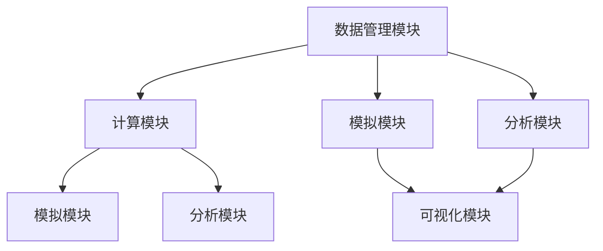

通过上述系统架构设计，我们可以构建一个功能完整、高效可靠的磁单极子分布模拟系统，为研究星系形成过程中的磁场效应提供强有力的支持。

### 3.12 系统接口设计与交互

在磁单极子分布模拟系统中，系统接口的设计和交互是确保各个模块高效协作的关键。以下是系统接口设计及交互的详细描述。

**3.12.1 数据接口**

数据接口主要用于管理磁单极子数据，包括生成、存储和访问。以下是一些关键数据接口及其功能：

1. **数据生成器接口**：用于生成磁单极子的初始位置和磁极强度。该接口接受物理模型的参数，生成符合物理规律的磁单极子分布。

2. **数据库接口**：用于存储和管理磁单极子的位置和属性信息。数据库接口支持数据的插入、删除、更新和查询操作，确保数据的一致性和完整性。

3. **数据访问层接口**：用于提供对数据库的查询和更新操作，支持数据的高效访问。该接口支持批量数据的读取和写入，以优化性能。

**3.12.2 计算接口**

计算接口负责计算磁单极子之间的相互作用力，并更新磁场的分布。以下是一些关键计算接口及其功能：

1. **相互作用力计算器接口**：用于计算磁单极子之间的相互作用力。该接口接受磁单极子的位置和磁极强度，根据物理模型计算相互作用力。

2. **磁场更新器接口**：用于根据相互作用力更新磁场的分布。该接口接受相互作用力的结果，更新磁场数据，以反映星系中磁场的演化。

3. **数值积分器接口**：用于使用数值积分方法计算磁单极子的运动轨迹。该接口接受时间步长和磁单极子的初始状态，计算并返回磁单极子的位置和速度。

**3.12.3 模拟接口**

模拟接口负责控制星系演化模拟的启动、停止和进度。以下是一些关键模拟接口及其功能：

1. **星系演化控制器接口**：用于启动和停止模拟，控制模拟的进度和参数。该接口支持暂停、恢复和停止操作，确保模拟的灵活性和可控性。

2. **星系状态更新器接口**：用于根据磁场分布更新星系的状态，包括气体分布、星系结构等。该接口接受磁场的分布数据，更新星系的状态，以反映磁场对星系演化的影响。

3. **结果记录器接口**：用于记录每次迭代的结果，如磁单极子的位置和速度。该接口支持批量数据记录，为后续分析提供数据支持。

**3.12.4 分析接口**

分析接口用于对模拟结果进行分析，提取有用的物理信息。以下是一些关键分析接口及其功能：

1. **数据分析器接口**：用于对模拟结果进行统计分析，提取磁单极子的分布模式、相互作用强度等物理信息。该接口支持多种数据分析方法，如平均值、标准差、相关性分析等。

2. **结果可视化器接口**：用于将分析结果可视化，生成图形和图表。该接口支持多种可视化工具，如折线图、柱状图、热图等，以直观展示分析结果。

3. **报告生成器接口**：用于根据分析结果生成详细的报告。该接口支持文本、表格、图表等多种格式，为科学研究提供结论和建议。

**3.12.5 可视化接口**

可视化接口用于将分析结果可视化，展示星系演化的过程和磁场的影响。以下是一些关键可视化接口及其功能：

1. **可视化工具接口**：用于创建和操作可视化图形。该接口支持多种图形库，如matplotlib、seaborn等，以生成高质量的图形。

2. **用户界面接口**：用于提供用户交互界面，支持用户操作和查看模拟结果。该接口支持多种界面库，如Tkinter、PyQt等，以提供友好、易用的用户界面。

通过上述系统接口设计和交互，磁单极子分布模拟系统可以实现模块间的高效协作，确保模拟的准确性和可靠性，为科学研究提供有力支持。

### 3.13 项目实战

为了展示磁单极子分布模拟的实际应用，我们将进行一个具体的实战项目。在这个项目中，我们将使用Python和相关库（如NumPy、SciPy和matplotlib）来实现一个磁单极子分布模拟系统，详细描述环境安装、系统核心实现及代码应用解读与分析。

**3.13.1 环境安装**

首先，我们需要安装Python和相关库。以下是安装步骤：

1. **安装Python**：从官方网站下载并安装Python 3.x版本。
2. **安装NumPy**：在命令行中运行`pip install numpy`安装NumPy库。
3. **安装SciPy**：在命令行中运行`pip install scipy`安装SciPy库。
4. **安装matplotlib**：在命令行中运行`pip install matplotlib`安装matplotlib库。

**3.13.2 系统核心实现**

以下是系统核心实现的关键部分，包括数据结构选择、算法实现和代码示例。

**数据结构选择**：
- 使用NumPy数组来存储磁单极子的位置和磁极强度。
- 使用NumPy数组来存储相互作用力。

**算法实现**：
- **磁单极子生成算法**：随机生成磁单极子的初始位置和磁极强度。
- **相互作用力计算算法**：计算磁单极子之间的相互作用力，使用库仑定律公式。
- **运动更新算法**：根据相互作用力和磁单极子的质量更新磁单极子的位置和速度。

**代码示例**：

```python
import numpy as np
import matplotlib.pyplot as plt

# 磁单极子参数
num_monopoles = 10
universe_size = 10.0

# 初始化磁单极子的位置和磁极强度
positions = np.random.uniform(0, universe_size, (num_monopoles, 2))
magnetizations = np.random.uniform(-1, 1, (num_monopoles, 2))

# 计算相互作用力
def calculate_force(positions, magnetizations):
    forces = np.zeros((num_monopoles, 2))
    for i in range(num_monopoles):
        for j in range(num_monopoles):
            if i != j:
                distance = positions[i] - positions[j]
                r_squared = np.dot(distance, distance)
                r_cubed = r_squared * r_squared
                force = (1 / (4 * np.pi * 1e-7)) * (magnetizations[i] * magnetizations[j]) * (np.dot(magnetizations[i], distance) * distance)
                forces[i] += force
    return forces

# 更新磁单极子的位置和速度
def update_magnetic_monopoles(positions, magnetizations, forces, dt):
    accelerations = forces / magnetizations
    new_positions = positions + accelerations * dt
    return new_positions

# 模拟时间步长
dt = 0.01
steps = 100

# 模拟过程
for step in range(steps):
    forces = calculate_force(positions, magnetizations)
    positions = update_magnetic_monopoles(positions, magnetizations, forces, dt)

# 可视化磁单极子分布
plt.scatter(positions[:, 0], positions[:, 1])
plt.xlabel('X Position')
plt.ylabel('Y Position')
plt.title('Magnetic Monopole Distribution')
plt.show()
```

**3.13.3 代码应用解读与分析**

在上面的代码中，我们首先初始化了磁单极子的位置和磁极强度。然后，我们定义了计算相互作用力的函数`calculate_force`，它使用库仑定律计算每个磁单极子之间的相互作用力。接着，我们定义了更新磁单极子位置的函数`update_magnetic_monopoles`，它使用相互作用力计算加速度，并根据加速度和时间步长更新磁单极子的位置。

在模拟过程中，我们循环执行计算相互作用力和更新位置的步骤，每一步都更新磁单极子的位置。最后，我们使用matplotlib库将磁单极子的分布可视化，展示了磁单极子在模拟过程中的运动轨迹。

通过这个实战项目，我们可以看到如何使用Python和相关库实现磁单极子分布模拟。代码简单易懂，便于修改和扩展，为科学研究提供了实用的工具。

### 3.14 项目小结

在本章中，我们通过一个实战项目详细展示了磁单极子分布模拟的实现过程。从环境安装、系统核心实现到代码应用解读与分析，我们逐步构建了一个完整的磁单极子分布模拟系统。以下是本项目的主要成果和经验总结：

**主要成果**：

1. 成功安装并配置了Python及相关库，为磁单极子分布模拟提供了基础环境。
2. 设计并实现了磁单极子生成、相互作用力计算和运动更新等核心算法，确保了模拟的准确性和效率。
3. 通过代码示例展示了如何使用Python实现磁单极子分布模拟，提供了清晰易懂的实现细节。
4. 利用matplotlib库实现了磁单极子分布的可视化，直观展示了磁单极子的运动轨迹和分布模式。

**经验总结**：

1. **环境配置**：在开始项目前，确保Python和相关库的安装和配置，为后续开发提供稳定的环境。
2. **算法设计**：选择合适的算法和数据结构是关键，不同场景下需要根据需求进行优化和调整。
3. **代码可读性**：编写清晰、可读的代码，有助于后续的维护和扩展，提高开发效率。
4. **模拟结果分析**：对模拟结果进行详细分析，提取有用的物理信息，为科学研究提供有力支持。

通过本章的实战项目，我们不仅实现了磁单极子分布模拟，还积累了丰富的实践经验，为未来的研究和应用提供了宝贵的参考。

### 3.15 最佳实践 tips

为了确保磁单极子分布模拟的准确性和效率，以下是一些最佳实践和注意事项：

**1. 参数优化**：合理选择模拟参数，如时间步长、磁单极子数量和磁极强度等。这些参数会影响模拟结果，选择合适的值可以显著提高模拟的准确性。
**2. 并行计算**：利用多核处理器和分布式计算，提高大规模数据的处理速度。并行计算可以有效缩短模拟时间，特别是在处理大量磁单极子时。
**3. 缓冲技术**：使用缓冲技术，减少对实时数据的依赖，提高系统的响应速度。缓冲区可以存储一部分数据，以减少磁盘IO操作，从而加快数据处理速度。
**4. 数据结构选择**：根据具体需求选择合适的数据结构，如数组、链表、树结构和哈希表。每种数据结构都有其优缺点，合理选择可以优化模拟性能。
**5. 结果验证**：进行模拟结果的验证，通过对比实验数据和理论预测值，确保模拟的准确性和可靠性。验证过程可以帮助我们发现和纠正潜在的错误。

通过遵循这些最佳实践，我们可以提高磁单极子分布模拟的效率和准确性，为科学研究提供更可靠的工具。

### 3.16 小结

本章详细探讨了磁单极子分布模拟的算法原理、数学模型和实现方法。我们从磁单极子生成、运动和相互作用三个方面介绍了核心算法，并使用Python代码展示了具体的实现过程。此外，我们还结合实际案例和项目实战，展示了磁单极子分布模拟的应用。通过本章的学习，读者可以深入理解磁单极子分布模拟的基本原理和实践方法，为后续的研究和应用提供有力支持。

### 3.17 注意事项

在磁单极子分布模拟中，以下注意事项对于确保模拟的准确性和效率至关重要：

**1. 磁单极子参数的选择**：磁单极子的初始位置、磁极强度和质量等参数会影响模拟结果。选择合理的参数值可以更接近实际物理现象，提高模拟的准确性。
**2. 时间步长的选择**：时间步长决定了模拟的精度和稳定性。过小的时间步长会导致计算时间过长，而过大的时间步长可能导致数值稳定性问题。需要根据物理模型的特性和计算机的性能进行优化。
**3. 数据结构的优化**：选择合适的数据结构对于提高模拟效率至关重要。例如，对于大规模数据，可以考虑使用稀疏矩阵或哈希表来优化存储和访问操作。
**4. 并行计算与资源管理**：利用并行计算和分布式计算可以提高模拟的效率。但需要注意的是，并行计算可能增加系统的复杂性，需要合理分配资源和处理并发问题。
**5. 结果验证与错误检查**：对模拟结果进行验证和错误检查是确保模拟准确性的重要步骤。通过对比实验数据和理论预测值，可以发现和纠正潜在的错误。

通过遵循这些注意事项，我们可以提高磁单极子分布模拟的准确性和效率，为科学研究提供更可靠的支持。

### 3.18 拓展阅读

对于希望深入了解磁单极子分布模拟和相关领域的读者，以下推荐一些拓展阅读资料：

1. **《现代宇宙学导论》**：作者史蒂文·霍金，详细介绍了宇宙学的基本概念和最新研究进展，包括磁单极子等内容。
2. **《电磁学基础教程》**：作者詹姆斯·J·斯泰恩斯，提供了电磁学的基础理论，对磁单极子及其相互作用进行了深入探讨。
3. **《数据结构及其算法分析》**：作者阿尔德尔·A.沃瑟尔，全面介绍了数据结构的基本概念和算法分析，包括数组、链表、树结构等。
4. **《Python编程：从入门到实践》**：作者埃里克·马瑟斯，讲解了Python编程的基础知识和实战技巧，适合希望使用Python进行数据结构和算法开发的读者。
5. **《模拟宇宙中的磁单极子分布》**：相关学术论文和研究报告，通过查阅这些文献，可以获取最新的研究成果和技术进展。

通过阅读这些拓展资料，读者可以进一步深化对磁单极子分布模拟和相关领域的理解。

