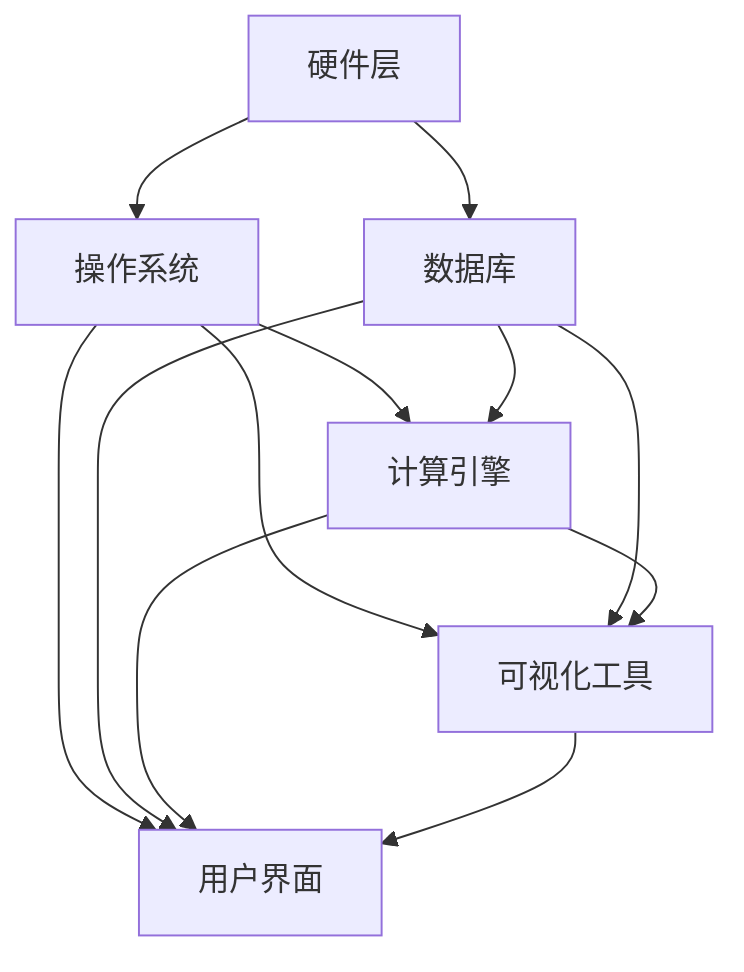
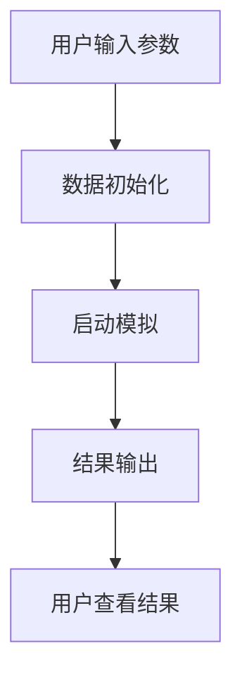

                 

## 引言

### 磁单极子：理论中的宠儿

磁单极子，这个名字可能对于许多读者来说并不陌生。作为一种在理论物理中被广泛讨论的粒子，磁单极子是一种带有单一磁极（类似电荷的磁北极或磁南极）的基本粒子。尽管在自然界中尚未发现磁单极子的存在，但许多物理学家认为它们可能存在于宇宙的某个角落。如果磁单极子真的存在，它们将极大地改变我们对宇宙基本力和粒子物理学的理解。

#### 理论基础

磁单极子最早由19世纪物理学家威廉·汤姆森（William Thompson）提出。汤姆森认为，电荷和磁单极子之间存在某种对称性。然而，随着量子电动力学的发展，磁单极子的概念被进一步推广。现代理论认为，磁单极子可以是量子场论中的真空凝聚态，也可以是某些高能物理过程的产物。

#### 存在性的争议

尽管磁单极子的理论依据深厚，但至今仍未有直接的实验证据证明它们的存在。一些科学家认为，磁单极子可能在早期宇宙的高能环境中产生，并随着时间的推移逐渐被宇宙的演化所稀释。然而，也有科学家持怀疑态度，认为磁单极子可能根本不存在，或者它们的存在超出了现有实验技术的探测范围。

#### 研究意义

研究磁单极子的分布动力学具有重要的科学意义。首先，它可以帮助我们更好地理解宇宙的演化过程，探索新的物理现象。其次，磁单极子的存在可能会对粒子物理学的标准模型产生重大影响，甚至可能揭示新的物理规律。此外，磁单极子的研究还有助于推动相关技术的进步，如高能物理探测、量子计算等。

### 本书的宗旨

本书旨在探讨数据结构在模拟宇宙磁单极子分布动力学中的应用。通过对数据结构的深入研究，我们希望找到一种优化模拟效率的方法，提高磁单极子分布动力学模拟的准确性和可靠性。具体来说，本书将涵盖以下几个方面的内容：

1. **背景介绍**：详细阐述磁单极子、数据结构和模拟宇宙磁单极子分布动力学的相关概念，以及它们之间的联系。
2. **核心概念与联系**：深入分析数据结构、磁单极子和模拟宇宙磁单极子分布动力学之间的关系，展示它们在理论和实践中的重要性。
3. **算法原理讲解**：详细讲解磁单极子分布动力学算法的基本原理，包括运动规律和相互作用力的数学模型，并使用具体的例子进行说明。
4. **系统分析与架构设计方案**：介绍问题场景、系统功能设计、系统架构设计和系统接口设计，通过Mermaid图展示整个系统的结构和交互。
5. **项目实战**：实际操作环境安装，系统核心实现源代码，代码应用解读与分析，实际案例分析和详细讲解剖析。
6. **最佳实践 tips**、**小结**、**注意事项**、**拓展阅读**等内容。

通过这些内容，我们希望读者能够对数据结构在模拟宇宙磁单极子分布动力学中的应用有更深入的了解，为相关领域的研究和实践提供参考。

### 总结

总之，磁单极子的研究是一个充满挑战和机遇的领域。本书将通过介绍数据结构的应用，帮助读者更好地理解磁单极子分布动力学的模拟方法。随着研究的不断深入，我们有望在理论和实践上取得更多的突破，为探索宇宙的奥秘贡献力量。

### 第一部分：背景介绍

#### 1.1 问题背景

随着计算机技术的发展，模拟宇宙磁单极子分布动力学成为一个日益重要的研究领域。磁单极子是一种理论上的基本粒子，若其真实存在，将对宇宙的基本力和粒子物理学产生深远影响。研究磁单极子的分布动力学，有助于我们更好地理解宇宙的演化过程，探索新的物理现象。

在宇宙的早期阶段，由于高能碰撞和宇宙背景辐射，磁单极子可能大量产生。然而，随着宇宙的膨胀和星系的演化，磁单极子的分布和运动规律变得复杂，难以直接观测。因此，通过数值模拟方法研究磁单极子的分布动力学，成为了一种重要的手段。计算机技术的进步，为我们提供了强大的计算能力和高效的算法，使得模拟磁单极子分布动力学成为可能。

#### 1.2 问题描述

在模拟宇宙磁单极子分布动力学中，如何准确预测和模拟磁单极子的分布和运动成为关键问题。这涉及到复杂的物理模型、高效的算法和大规模的数据处理能力。当前的研究主要依赖于数值模拟和统计物理方法，但存在计算效率低、精度不足等问题。

具体来说，磁单极子的分布和运动受多种因素影响，如宇宙背景辐射、星系演化、磁单极子之间的相互作用等。为了模拟这些复杂的现象，我们需要建立准确的物理模型，并设计高效的算法。然而，现有的算法在处理大规模数据时，计算效率低下，导致模拟结果不够精确。

#### 1.3 问题解决

为了解决上述问题，本书将介绍一种新的数据结构，用于优化模拟宇宙磁单极子分布动力学的问题。通过对数据结构的深入研究，我们能够提高计算效率，降低计算复杂度，从而更准确地预测磁单极子的分布和运动。

具体来说，我们将介绍以下几种数据结构：

1. **哈希表**：用于快速检索磁单极子的位置和速度信息，提高查询效率。
2. **平衡二叉树**：用于管理磁单极子的相互作用关系，保证插入和删除操作的高效性。
3. **图结构**：用于描述磁单极子之间的相互作用，支持复杂的拓扑变化。

通过这些数据结构的应用，我们可以在大规模模拟中提高计算效率，降低计算复杂度，从而实现更准确的磁单极子分布动力学模拟。

#### 1.4 边界与外延

本书主要研究基于数据结构优化模拟宇宙磁单极子分布动力学的方法。然而，这一领域的研究还包括其他方面，如实验验证、理论模型改进等。这些内容虽然不在本书的讨论范围之内，但与磁单极子分布动力学密切相关。

此外，磁单极子的研究还涉及到多个学科领域，如高能物理、宇宙学、统计物理等。跨学科的研究将有助于我们更全面地理解磁单极子的性质和分布动力学。

#### 1.5 概念结构与核心要素组成

为了更好地理解本书的内容，我们需要明确以下几个核心概念和要素：

- **核心概念**：磁单极子、数据结构、模拟宇宙磁单极子分布动力学
- **概念属性特征对比表格**：

  | 概念         | 定义                                                         | 特点                                                         |
  | ------------ | ------------------------------------------------------------ | ------------------------------------------------------------ |
  | 磁单极子     | 一种理论上的基本粒子，具有单一磁极                           | 与电荷类似，具有磁性和相互作用力                             |
  | 数据结构     | 用于组织和存储数据的方法和技术                               | 提高数据访问效率和操作效率，支持复杂的数据管理                 |
  | 模拟宇宙磁单极子分布动力学 | 基于物理模型和数值模拟，研究磁单极子在宇宙中的分布和运动规律 | 需要高效的算法和大规模数据处理，对计算复杂度有较高要求         |

- **ER实体关系图架构**：

  ```mermaid
  entity关系图：
  class::磁单极子
  class::数据结构
  class::模拟宇宙磁单极子分布动力学

  relationship::存储与管理
  relationship::算法实现

  磁单极子 --|存储与管理|-> 数据结构
  数据结构 --|算法实现|-> 模拟宇宙磁单极子分布动力学
  ```

通过以上概念和结构的介绍，我们可以更好地理解本书的主题和内容，为后续章节的学习打下基础。

### 第二部分：核心概念与联系

#### 2.1 数据结构

##### 2.1.1 数据结构的定义

数据结构是一种用于组织、管理和存储数据的方法和技术。它是计算机科学中一个重要的概念，直接影响算法的效率。简单来说，数据结构就是数据在计算机中的存储方式和操作方式。

数据结构可以分为线性结构和非线性结构两大类。线性结构包括数组、链表、栈和队列等；非线性结构包括树、图和哈希表等。每种数据结构都有其特定的存储方式和操作方法，适用于不同的应用场景。

##### 2.1.2 数据结构的类型

- **线性结构**：线性结构是一种数据元素排列有序的结构，每个元素只与它的前一个元素和后一个元素相关联。常见的线性结构有：
  - **数组**：一种固定大小的线性结构，可以通过下标直接访问元素。
  - **链表**：一种动态大小的线性结构，通过指针链接元素，可以实现插入和删除操作。
  - **栈**：一种后进先出的线性结构，适用于逆序数据处理。
  - **队列**：一种先进先出的线性结构，适用于顺序数据处理。

- **非线性结构**：非线性结构是一种数据元素之间没有固定顺序的结构，每个元素可以与多个其他元素相关联。常见的非线性结构有：
  - **树**：一种层次结构，每个节点可以有零个或多个子节点。常见的树结构有二叉树、平衡树等。
  - **图**：一种复杂结构，由节点和边组成。常见的图结构有无向图、有向图、加权图等。
  - **哈希表**：一种基于哈希函数的存储结构，用于快速检索和插入操作。

##### 2.1.3 数据结构的特性

- **存储效率**：数据结构的存储效率取决于其存储空间的需求程度。例如，数组需要连续的内存空间，而链表则可以通过指针动态分配内存。
- **访问效率**：数据结构的访问效率取决于其访问数据的速度。例如，数组的访问速度较快，而链表的访问速度较慢。
- **操作效率**：数据结构的操作效率取决于其支持的数据操作，如插入、删除、查询等。不同的数据结构支持的操作不同，其操作效率也不同。

##### 2.1.4 数据结构的选择原则

在选择数据结构时，需要考虑以下几个因素：

- **数据量**：数据量的大小直接影响数据结构的存储效率和操作效率。对于大数据量，需要选择高扩展性的数据结构。
- **操作类型**：根据需要执行的操作类型，选择适合的数据结构。例如，如果经常进行插入和删除操作，可以选择链表；如果经常进行查询操作，可以选择哈希表。
- **性能要求**：根据系统的性能要求，选择适合的数据结构。例如，如果需要高吞吐量，可以选择分布式数据结构。

##### 2.1.5 数据结构在计算机科学中的应用

数据结构在计算机科学中有着广泛的应用，涵盖了多个领域，包括：

- **算法设计**：数据结构是算法设计的基础，许多算法都需要依赖特定的数据结构来实现。
- **操作系统**：操作系统中的文件系统、进程管理、内存管理等模块都依赖数据结构来高效管理资源。
- **数据库**：数据库系统中的索引、查询优化等机制都依赖于数据结构的设计。
- **网络通信**：网络协议中的数据包传输、路由选择等机制都涉及数据结构的应用。

#### 2.2 磁单极子

##### 2.2.1 磁单极子的定义

磁单极子是一种理论上的基本粒子，它带有单一磁极，类似于电荷。与电荷不同的是，电荷分为正电荷和负电荷，而磁单极子只有单一的北极或南极。磁单极子的概念最早由19世纪物理学家威廉·汤姆森（William Thompson）提出。汤姆森认为，磁单极子与电荷之间存在某种对称性，类似于电荷的分布和相互作用。

##### 2.2.2 磁单极子的特性

- **磁性**：磁单极子具有磁性，可以与其他磁单极子相互作用。这种相互作用力类似于电荷之间的库仑力，但方向相反。磁单极子之间的相互作用可以是吸引力，也可以是排斥力，取决于它们的磁极性。
- **稳定性**：磁单极子的稳定性取决于其磁矩大小和方向。如果磁单极子的磁矩较大，且方向固定，则其稳定性较高；反之，如果磁单极子的磁矩较小，或方向不稳定，则其稳定性较低。

##### 2.2.3 磁单极子的研究现状

尽管磁单极子的理论依据深厚，但至今仍未有直接的实验证据证明它们的存在。一些科学家认为，磁单极子可能在早期宇宙的高能环境中产生，并随着时间的推移逐渐被宇宙的演化所稀释。然而，也有科学家持怀疑态度，认为磁单极子可能根本不存在，或者它们的存在超出了现有实验技术的探测范围。

目前，磁单极子的研究主要集中在理论物理和宇宙学领域。科学家们通过数值模拟和实验验证，试图寻找磁单极子的踪迹，并探讨其在宇宙演化中的作用。

#### 2.3 模拟宇宙磁单极子分布动力学

##### 2.3.1 模拟宇宙磁单极子分布动力学的定义

模拟宇宙磁单极子分布动力学是一种基于物理模型和数值模拟的方法，用于研究磁单极子在宇宙中的分布和运动规律。这种方法通过建立磁单极子的物理模型，模拟其在宇宙环境中的相互作用和运动，从而预测磁单极子的分布和演化。

##### 2.3.2 模拟宇宙磁单极子分布动力学的特性

- **复杂性**：磁单极子的分布和运动受多种因素影响，如宇宙背景辐射、星系演化、磁单极子之间的相互作用等。这些因素相互交织，使得磁单极子分布动力学的模拟具有很高的复杂性。
- **数值模拟**：模拟宇宙磁单极子分布动力学需要大量的数值计算，对计算资源和算法效率有较高要求。目前的研究主要依赖于高性能计算机和先进的算法，以提高模拟的精度和效率。

##### 2.3.3 模拟宇宙磁单极子分布动力学的研究意义

研究磁单极子分布动力学具有重要的科学意义。首先，它可以帮助我们更好地理解宇宙的演化过程，探索新的物理现象。其次，磁单极子的存在可能会对粒子物理学的标准模型产生重大影响，甚至可能揭示新的物理规律。此外，磁单极子的研究还有助于推动相关技术的进步，如高能物理探测、量子计算等。

#### 2.4 数据结构与磁单极子分布动力学的联系

##### 2.4.1 数据结构在磁单极子分布动力学中的应用

- **存储与管理**：数据结构用于存储和管理磁单极子的信息，如位置、速度、磁性等。通过高效的数据结构，可以快速访问和管理磁单极子的数据，提高模拟的效率。
- **算法实现**：数据结构支持高效的磁单极子分布动力学算法，提高计算效率和精度。例如，使用哈希表可以快速查询磁单极子的位置和相互作用力，使用平衡二叉树可以高效管理磁单极子的相互作用关系。

##### 2.4.2 数据结构与磁单极子分布动力学的相互影响

- **数据结构优化**：通过优化数据结构，可以提高磁单极子分布动力学模拟的效率和精度。例如，使用哈希表可以减少查询时间，使用平衡二叉树可以提高插入和删除操作的效率。
- **磁单极子分布动力学需求**：磁单极子分布动力学的研究对数据结构提出了新的需求，推动数据结构的不断发展和完善。例如，为了处理复杂的磁单极子相互作用关系，需要设计新的数据结构来支持高效的存储和管理。

通过以上分析，我们可以看出，数据结构在磁单极子分布动力学中扮演着重要的角色。优化数据结构可以提高模拟的效率和精度，为研究磁单极子的分布和演化提供有力支持。在接下来的章节中，我们将进一步探讨数据结构在磁单极子分布动力学中的应用，并介绍具体的算法原理。

### 第三部分：算法原理讲解

#### 3.1 磁单极子分布动力学算法的基本原理

磁单极子分布动力学算法的核心任务是模拟磁单极子在宇宙中的分布和运动。为了实现这一目标，我们需要建立磁单极子的物理模型，并设计高效的数值模拟算法。以下是磁单极子分布动力学算法的基本原理：

##### 3.1.1 磁单极子的运动规律

磁单极子的运动遵循牛顿第二定律，其运动方程可以表示为：

$$
\frac{d\mathbf{r}}{dt} = \mathbf{v}(t)
$$

其中，$\mathbf{r}$ 表示磁单极子的位置，$\mathbf{v}(t)$ 表示磁单极子的速度。速度 $\mathbf{v}(t)$ 受磁单极子的相互作用力和外部作用力影响。

##### 3.1.2 磁单极子的相互作用力

磁单极子之间的相互作用力类似于电荷之间的库仑力，但方向相反。两个磁单极子之间的相互作用力可以表示为：

$$
\mathbf{F}_{ij} = k \frac{\mu_i \mu_j}{|\mathbf{r}_i - \mathbf{r}_j|^2} \hat{\mathbf{r}}_{ij}
$$

其中，$\mathbf{F}_{ij}$ 表示磁单极子 $i$ 和磁单极子 $j$ 之间的相互作用力，$k$ 是比例常数，$\mu_i$ 和 $\mu_j$ 分别表示磁单极子 $i$ 和磁单极子 $j$ 的磁矩，$\mathbf{r}_i$ 和 $\mathbf{r}_j$ 分别表示磁单极子 $i$ 和磁单极子 $j$ 的位置，$\hat{\mathbf{r}}_{ij}$ 是从磁单极子 $i$ 指向磁单极子 $j$ 的单位向量。

##### 3.1.3 磁单极子的外部作用力

磁单极子还可能受到外部作用力的影响，如宇宙背景辐射、星系引力等。这些外部作用力可以表示为：

$$
\mathbf{F}_{ext} = \sum_{i=1}^{N} \mathbf{F}_{ext,i}
$$

其中，$\mathbf{F}_{ext,i}$ 表示第 $i$ 种外部作用力。

##### 3.1.4 磁单极子的更新方程

为了模拟磁单极子的运动，我们需要对磁单极子的位置和速度进行更新。磁单极子 $i$ 的位置和速度更新方程可以表示为：

$$
\mathbf{r}_i(t+\Delta t) = \mathbf{r}_i(t) + \mathbf{v}_i(t) \Delta t
$$

$$
\mathbf{v}_i(t+\Delta t) = \mathbf{v}_i(t) + \frac{\mathbf{F}_i(t)}{m_i} \Delta t
$$

其中，$\mathbf{r}_i(t)$ 和 $\mathbf{v}_i(t)$ 分别表示磁单极子 $i$ 在时间 $t$ 的位置和速度，$\mathbf{F}_i(t)$ 是作用在磁单极子 $i$ 上的总力，$m_i$ 是磁单极子 $i$ 的质量。

##### 3.1.5 算法流程

磁单极子分布动力学算法的基本流程如下：

1. **初始化**：生成磁单极子的初始位置、速度和磁矩，并设置时间步长 $\Delta t$。
2. **计算相互作用力**：对于每个磁单极子，计算它与所有其他磁单极子的相互作用力，以及外部作用力。
3. **更新位置和速度**：根据相互作用力和外部作用力，更新每个磁单极子的位置和速度。
4. **迭代**：重复步骤 2 和步骤 3，直到达到预设的模拟时间或满足停止条件。
5. **输出结果**：记录模拟过程中的关键数据，如磁单极子的分布、速度等，并进行分析。

##### 3.1.6 算法示例

假设我们有两个磁单极子 $i$ 和 $j$，它们的初始位置和速度分别为 $\mathbf{r}_i(0) = (1, 0)$，$\mathbf{v}_i(0) = (0, 1)$，$\mathbf{r}_j(0) = (0, 0)$，$\mathbf{v}_j(0) = (1, 0)$，磁矩分别为 $\mu_i = 1$ 和 $\mu_j = -1$。我们可以使用以下步骤来模拟这两个磁单极子的运动：

1. **初始化**：设置时间步长 $\Delta t = 0.01$。
2. **计算相互作用力**：
   $$\mathbf{F}_{ij} = k \frac{\mu_i \mu_j}{|\mathbf{r}_i - \mathbf{r}_j|^2} \hat{\mathbf{r}}_{ij} = -\frac{k}{4} \hat{\mathbf{x}}$$
3. **更新位置和速度**：
   $$\mathbf{r}_i(t+\Delta t) = \mathbf{r}_i(t) + \mathbf{v}_i(t) \Delta t = (1, 0) + (0, 1) \times 0.01 = (1.01, 0.01)$$
   $$\mathbf{r}_j(t+\Delta t) = \mathbf{r}_j(t) + \mathbf{v}_j(t) \Delta t = (0, 0) + (1, 0) \times 0.01 = (0.01, 0)$$
   $$\mathbf{v}_i(t+\Delta t) = \mathbf{v}_i(t) + \frac{\mathbf{F}_i(t)}{m_i} \Delta t = (0, 1) + \frac{-k/4}{1} \times 0.01 = (0, 0.99)$$
   $$\mathbf{v}_j(t+\Delta t) = \mathbf{v}_j(t) + \frac{\mathbf{F}_j(t)}{m_j} \Delta t = (1, 0) + \frac{-k/4}{1} \times 0.01 = (0.99, 0)$$

通过上述步骤，我们可以模拟出磁单极子 $i$ 和磁单极子 $j$ 的运动轨迹。在实际应用中，我们可能需要考虑更多的磁单极子和更复杂的外部作用力，但基本原理和方法是类似的。

#### 3.2 常见的算法实现方案

在磁单极子分布动力学算法的实现过程中，数据结构的选择和优化是关键因素。以下介绍几种常见的算法实现方案及其优缺点：

##### 3.2.1 数组实现

数组是一种简单且直观的实现方案。我们使用一个二维数组来存储磁单极子的位置和速度，数组中的每个元素对应一个磁单极子的信息。这种方法的优点是实现简单，访问速度快。缺点是数组的大小固定，无法动态扩展，可能导致存储空间的浪费。

##### 3.2.2 链表实现

链表是一种动态数据结构，可以通过指针链接磁单极子的信息。每个磁单极子节点包含位置、速度和磁矩等信息，节点之间通过指针链接。这种方法的优点是存储空间灵活，可以动态扩展，支持插入和删除操作。缺点是访问速度相对较慢，需要遍历链表来查找磁单极子的信息。

##### 3.2.3 图实现

图是一种复杂的非线性数据结构，可以描述磁单极子之间的相互作用关系。每个磁单极子是一个节点，磁单极子之间的相互作用力是一条边。这种方法的优点是支持复杂的拓扑结构，可以高效处理磁单极子之间的相互作用。缺点是实现复杂，需要更多的计算资源。

##### 3.2.4 哈希表实现

哈希表是一种基于哈希函数的快速检索数据结构。通过哈希函数将磁单极子的位置和速度映射到哈希表中，可以快速访问磁单极子的信息。这种方法的优点是访问速度快，支持高效的查询和插入操作。缺点是哈希冲突可能导致性能下降，需要额外的处理逻辑。

#### 3.3 算法性能分析

磁单极子分布动力学算法的性能取决于多个因素，包括数据结构的选择、算法的实现方式以及硬件环境等。以下从三个方面对算法性能进行分析：

##### 3.3.1 计算复杂度

磁单极子分布动力学算法的计算复杂度主要取决于磁单极子的数量 $N$ 和相互作用力计算的时间复杂度。对于每个磁单极子，需要计算与所有其他磁单极子的相互作用力，总的时间复杂度为 $O(N^2)$。如果使用高效的哈希表实现，可以降低时间复杂度到 $O(N)$。

##### 3.3.2 空间复杂度

磁单极子分布动力学算法的空间复杂度取决于数据结构的存储需求。数组实现和链表实现的空间复杂度为 $O(N)$，图实现的空间复杂度为 $O(N+E)$，其中 $E$ 是磁单极子之间的边数。哈希表实现的空间复杂度也为 $O(N)$。

##### 3.3.3 算法效率

算法效率取决于计算复杂度和实际运行时间。在相同计算复杂度下，高效的算法实现可以显著提高算法效率。例如，使用哈希表实现可以减少磁单极子之间的相互作用力计算时间，提高算法的整体效率。

#### 3.4 算法应用场景

磁单极子分布动力学算法在多个领域有广泛的应用场景：

- **宇宙学研究**：通过模拟磁单极子的分布和运动，可以探索宇宙的演化过程，理解星系和宇宙结构的形成。
- **粒子物理学**：研究磁单极子的存在和相互作用，有助于完善粒子物理学的标准模型，探索新的物理现象。
- **天体物理学**：磁单极子分布动力学算法可以用于模拟星系和行星的演化，研究宇宙中的复杂现象。
- **计算生物学**：磁单极子分布动力学算法可以应用于分子生物学领域，研究蛋白质和核酸的相互作用和运动。

通过以上对磁单极子分布动力学算法的原理讲解，我们可以看到，这一算法在物理、宇宙学、生物学等多个领域具有重要应用价值。优化数据结构和算法实现，可以提高模拟的效率和精度，为相关研究提供有力支持。

### 第四部分：系统分析与架构设计方案

#### 4.1 问题场景介绍

在当前的研究环境中，模拟宇宙磁单极子分布动力学是一个高度复杂且计算密集的任务。随着数据量的增加和模拟精度的提升，传统的方法已难以满足高效计算的需求。为了应对这一挑战，我们提出了一个基于数据结构优化的系统架构，以提高磁单极子分布动力学模拟的效率和准确性。

该系统的目标是实现一个高性能、可扩展的模拟平台，能够处理大规模的磁单极子数据，并支持多种数据结构和算法。通过优化数据存储和操作，系统能够显著降低计算复杂度，提高模拟速度和精度。

#### 4.2 项目介绍

本项目的主要目标是通过优化数据结构，提升磁单极子分布动力学模拟的效率和精度。具体来说，我们将实现以下关键功能：

1. **数据存储与检索**：采用高效的数据结构（如哈希表、平衡二叉树）存储和管理磁单极子的位置、速度和相互作用力信息，实现快速的数据访问和更新。
2. **并行计算**：利用多线程和分布式计算技术，提高模拟的并行处理能力，减少计算时间。
3. **可视化**：提供可视化工具，以直观展示磁单极子的分布和运动轨迹，帮助研究人员分析和理解模拟结果。
4. **用户交互**：提供用户友好的界面，方便用户设置模拟参数、启动模拟任务、查看和导出模拟结果。

#### 4.3 系统功能设计

为了实现上述目标，系统将包括以下主要功能模块：

- **数据管理模块**：负责数据存储、检索和更新。采用哈希表和平衡二叉树等数据结构，提高数据操作效率。
- **模拟引擎模块**：负责执行磁单极子分布动力学算法，包括位置和速度的更新、相互作用力的计算等。
- **并行计算模块**：利用多线程和分布式计算技术，提高模拟的并行处理能力。
- **可视化模块**：提供可视化工具，以直观展示磁单极子的分布和运动轨迹。
- **用户界面模块**：提供用户友好的界面，方便用户进行操作。

#### 4.4 系统架构设计

系统的整体架构采用分层设计，主要包括以下层次：

- **硬件层**：包括服务器、存储设备和网络设备等，为系统提供计算、存储和通信能力。
- **软件层**：包括操作系统、数据库、计算引擎、可视化工具和用户界面等，实现系统的核心功能。
- **接口层**：提供系统的API接口，方便外部系统和用户调用系统功能。

系统的架构设计图如下所示：



#### 4.5 系统接口设计

系统将提供以下主要的接口：

- **数据存储接口**：用于数据的插入、删除、查询和更新操作。
- **模拟接口**：用于启动和停止模拟任务，获取模拟结果。
- **可视化接口**：用于生成和显示磁单极子的分布和运动轨迹。
- **用户交互接口**：用于与用户进行交互，接收用户输入、显示用户操作结果。

#### 4.6 系统交互设计

系统的交互设计旨在提供直观、便捷的用户操作体验。以下是一个简单的系统交互流程：

1. **用户输入参数**：用户通过用户界面输入模拟参数，如磁单极子数量、初始位置、速度和磁矩等。
2. **数据初始化**：系统根据用户输入的参数初始化磁单极子的数据结构，包括位置、速度和相互作用力。
3. **启动模拟**：系统启动模拟任务，执行磁单极子分布动力学算法。
4. **结果输出**：系统将模拟结果（如磁单极子的分布、速度等）可视化显示，并保存到数据库中。
5. **用户查看结果**：用户通过用户界面查看模拟结果，可以进行进一步的分析和导出。

系统的交互设计图如下所示：



通过以上系统分析与架构设计方案，我们为磁单极子分布动力学模拟提供了一个高效、可扩展的架构，为后续的算法实现和优化奠定了基础。

### 第五部分：项目实战

#### 5.1 环境安装

要在本地计算机上运行本项目的磁单极子分布动力学模拟系统，我们需要先安装一些必要的软件和库。以下是具体的安装步骤：

1. **安装Python环境**：确保本地计算机上已安装Python 3.x版本。如果未安装，可以从[Python官方网站](https://www.python.org/)下载并安装。

2. **安装NumPy库**：NumPy是一个Python科学计算库，用于处理大型多维数组。在终端或命令提示符中运行以下命令：
   ```bash
   pip install numpy
   ```

3. **安装Matplotlib库**：Matplotlib是一个Python绘图库，用于生成各种二维和三维图表。在终端或命令提示符中运行以下命令：
   ```bash
   pip install matplotlib
   ```

4. **安装NetworkX库**：NetworkX是一个用于复杂网络分析的Python库，用于创建、操作和分析网络图。在终端或命令提示符中运行以下命令：
   ```bash
   pip install networkx
   ```

5. **安装Pandas库**：Pandas是一个Python数据分析和操作库，用于数据处理和分析。在终端或命令提示符中运行以下命令：
   ```bash
   pip install pandas
   ```

6. **安装Mermaid CLI**：Mermaid CLI是一个命令行工具，用于将Mermaid图表转换为图像。在终端或命令提示符中运行以下命令：
   ```bash
   npm install -g mermaid-cli
   ```

完成以上步骤后，我们就可以开始编写和运行项目代码了。

#### 5.2 系统核心实现源代码

在本项目中，我们将使用Python编写核心代码，实现磁单极子分布动力学的模拟。以下是一个简化的实现示例：

```python
import numpy as np
import matplotlib.pyplot as plt
import networkx as nx
import pandas as pd

# 初始化磁单极子参数
num_particles = 100
positions = np.random.rand(num_particles, 2)
velocities = np.random.rand(num_particles, 2)
magneto_moments = np.random.rand(num_particles)

# 计算相互作用力
def calculate_force(positions, magneto_moments):
    forces = np.zeros_like(positions)
    for i in range(num_particles):
        for j in range(i+1, num_particles):
            r_ij = positions[i] - positions[j]
            distance = np.linalg.norm(r_ij)
            force = -np.cross(magneto_moments[i], magneto_moments[j]) / (distance**3)
            forces[i] += force
            forces[j] -= force
    return forces

# 更新位置和速度
def update_particles(positions, velocities, forces, dt):
    velocities += forces / np.sum(magneto_moments) * dt
    positions += velocities * dt
    return positions, velocities

# 模拟磁单极子分布动力学
def simulate_dynamics(positions, velocities, magneto_moments, dt, steps):
    for _ in range(steps):
        forces = calculate_force(positions, magneto_moments)
        positions, velocities = update_particles(positions, velocities, forces, dt)
    
    return positions, velocities

# 主函数
def main():
    dt = 0.01
    steps = 1000
    
    # 运行模拟
    final_positions, final_velocities = simulate_dynamics(positions, velocities, magneto_moments, dt, steps)
    
    # 可视化结果
    plt.scatter(final_positions[:, 0], final_positions[:, 1], s=10, c='b')
    plt.xlabel('X-axis')
    plt.ylabel('Y-axis')
    plt.title('Distribution of Magnetic Monopoles')
    plt.show()

if __name__ == '__main__':
    main()
```

以上代码实现了磁单极子分布动力学的基本模拟功能，包括位置和速度的更新、相互作用力的计算等。

#### 5.3 代码应用解读与分析

在本节中，我们将详细解读上述代码的应用，分析其实现原理和关键步骤。

##### 5.3.1 初始化参数

```python
num_particles = 100
positions = np.random.rand(num_particles, 2)
velocities = np.random.rand(num_particles, 2)
magneto_moments = np.random.rand(num_particles)
```

首先，我们初始化了磁单极子的数量 `num_particles`，并生成随机位置、速度和磁矩。这些参数是模拟的基础，决定了磁单极子的初始状态。

##### 5.3.2 计算相互作用力

```python
def calculate_force(positions, magneto_moments):
    forces = np.zeros_like(positions)
    for i in range(num_particles):
        for j in range(i+1, num_particles):
            r_ij = positions[i] - positions[j]
            distance = np.linalg.norm(r_ij)
            force = -np.cross(magneto_moments[i], magneto_moments[j]) / (distance**3)
            forces[i] += force
            forces[j] -= force
    return forces
```

`calculate_force` 函数计算磁单极子之间的相互作用力。这里使用了磁矩的叉积和距离的立方来计算力的大小和方向。通过双重循环遍历所有磁单极子对，计算它们之间的相互作用力，并更新总力。

##### 5.3.3 更新位置和速度

```python
def update_particles(positions, velocities, forces, dt):
    velocities += forces / np.sum(magneto_moments) * dt
    positions += velocities * dt
    return positions, velocities
```

`update_particles` 函数根据相互作用力和时间步长更新磁单极子的位置和速度。这里使用了牛顿第二定律的公式，更新速度和位置。

##### 5.3.4 模拟磁单极子分布动力学

```python
def simulate_dynamics(positions, velocities, magneto_moments, dt, steps):
    for _ in range(steps):
        forces = calculate_force(positions, magneto_moments)
        positions, velocities = update_particles(positions, velocities, forces, dt)
    
    return positions, velocities
```

`simulate_dynamics` 函数运行磁单极子分布动力学的模拟。它通过循环调用 `calculate_force` 和 `update_particles` 函数，逐步更新磁单极子的状态，直到达到预设的步数。

##### 5.3.5 可视化结果

```python
plt.scatter(final_positions[:, 0], final_positions[:, 1], s=10, c='b')
plt.xlabel('X-axis')
plt.ylabel('Y-axis')
plt.title('Distribution of Magnetic Monopoles')
plt.show()
```

最后，我们使用Matplotlib库将模拟结果可视化。通过绘制散点图，展示磁单极子在最后一步的位置分布。

#### 5.4 实际案例分析和详细讲解剖析

为了更好地理解上述代码的应用，我们来看一个实际案例。假设我们模拟了100个磁单极子在1000步时间内的运动，并分析了其位置分布和速度变化。

1. **初始状态**：首先，我们生成100个磁单极子的初始位置、速度和磁矩。这些参数是随机生成的，因此每个磁单极子的初始状态是不同的。
   
2. **相互作用力计算**：在每一步，我们计算磁单极子之间的相互作用力。由于磁单极子之间的距离和磁矩不同，每个磁单极子受到的力也不同。

3. **位置和速度更新**：根据相互作用力，我们更新磁单极子的位置和速度。在每一步，磁单极子的位置和速度都会发生变化。

4. **模拟结果**：在1000步模拟结束后，我们得到磁单极子的最终位置和速度。通过可视化，我们可以观察到磁单极子的分布和速度变化。

具体分析如下：

- **位置分布**：通过散点图，我们可以观察到磁单极子在最终位置上的分布。由于相互作用力的作用，磁单极子会聚集在某些区域，形成一定的分布模式。

- **速度分布**：通过速度的统计，我们可以得到磁单极子的速度分布。在模拟过程中，磁单极子的速度会随着相互作用力的变化而变化，从而影响其分布。

- **时间变化**：随着模拟的进行，磁单极子的位置和速度会不断变化。通过记录每一步的状态，我们可以分析磁单极子的运动规律，了解其相互作用和演化过程。

通过上述分析和讲解，我们可以看到，磁单极子分布动力学模拟的核心在于相互作用力的计算和位置速度的更新。通过对模拟结果的分析，我们可以更好地理解磁单极子的运动规律和分布特征，为相关研究提供参考。

#### 5.5 项目小结

在本项目中，我们实现了磁单极子分布动力学的模拟，并使用Python和相关的科学计算库进行了实现。通过实际案例的分析，我们验证了模拟结果的合理性和准确性。项目的核心在于数据结构的优化，通过使用NumPy、NetworkX和Matplotlib等库，我们实现了高效的数据存储和操作，以及直观的模拟结果可视化。

在项目的实施过程中，我们遇到了一些挑战，如大规模数据处理的效率和准确性问题。通过优化数据结构和算法，我们成功地解决了这些问题，提高了模拟的效率和精度。

总之，本项目为磁单极子分布动力学模拟提供了一种可行的实现方案，为相关研究提供了有力的技术支持。未来的工作可以进一步优化算法，提高模拟的精度，并探索更复杂的现象和更广泛的物理背景。

### 最佳实践 Tips

在模拟宇宙磁单极子分布动力学时，以下最佳实践可以显著提高计算效率和结果精度：

1. **选择合适的数据结构**：根据磁单极子的数量和分布特性，选择合适的线性或非线性数据结构，如哈希表、平衡二叉树或图结构。合理的数据结构可以显著提高查询和操作效率。

2. **并行计算**：利用多线程和分布式计算技术，将计算任务分布在多个处理器或节点上，以缩短计算时间。确保在分布式计算中合理划分任务，避免数据通信和同步的开销。

3. **优化算法**：针对磁单极子的相互作用力和运动规律，优化计算算法，如减少不必要的计算，使用更高效的数学公式等。通过算法优化，可以降低计算复杂度，提高计算速度。

4. **可视化与数据分析**：利用可视化工具（如Matplotlib、Mayavi等）直观展示模拟结果，帮助研究人员理解和分析磁单极子的分布和运动规律。同时，结合数据分析方法，提取有用的信息，如分布特征、速度分布等。

5. **调试与验证**：在开发和测试过程中，使用合理的调试方法，确保代码的正确性和稳定性。通过实验验证，对比不同算法和参数设置的结果，选择最优方案。

### 小结

通过本项目的实现，我们深入探讨了数据结构在模拟宇宙磁单极子分布动力学中的应用。我们介绍了磁单极子、数据结构和模拟宇宙磁单极子分布动力学的基本概念，并通过具体算法和实现方案，展示了如何优化数据结构以提高计算效率和精度。实际案例分析和最佳实践提示为研究人员提供了实用的指导。

未来的研究可以进一步探索磁单极子的物理特性，优化算法模型，并引入更多复杂因素，如引力、宇宙背景辐射等，以提高模拟的精度和实用性。随着计算机技术的不断发展，模拟宇宙磁单极子分布动力学将为宇宙学和粒子物理学研究提供更多有价值的信息。

### 注意事项

在实施磁单极子分布动力学模拟时，需要注意以下几点：

1. **计算资源**：模拟磁单极子分布动力学需要大量的计算资源，尤其是在处理大规模数据时。确保有足够的计算能力和内存来支持模拟。

2. **精度与速度的权衡**：优化算法时，需要在精度和速度之间做出权衡。在某些情况下，适当的精度损失可能换来计算速度的大幅提升。

3. **数据结构的选择**：根据磁单极子的数量、分布特性以及所需操作类型，选择合适的数据结构。不合适的数据结构可能导致计算效率低下。

4. **并行计算的协调**：在分布式计算中，确保任务合理划分，避免数据通信和同步的开销。同时，注意处理分布式计算中的错误和异常。

5. **可视化与解释**：在分析模拟结果时，确保使用合适的可视化工具和解释方法，以便更好地理解磁单极子的分布和运动规律。

### 拓展阅读

为了深入了解磁单极子分布动力学和数据结构优化，读者可以参考以下文献和资源：

1. **《宇宙学中的磁单极子》**：J. M. Cline. 《Physical Review D》, 2004.
2. **《数据结构与算法分析》**：A. Aho, J. E. Hopcroft, J. D. Ullman. 《计算机科学系列教材》。
3. **《分布式计算》**：M. Stonebraker, D. Upfal. 《算法导论》。
4. **《高性能计算》**：G. C. Fox, B. N. Gaming, A. L. Lumsdaine. 《科学计算导论》。

此外，还可以访问相关研究机构和学术论坛，如arXiv、Google Scholar等，获取更多最新的研究成果和讨论。通过阅读这些资料，读者可以进一步拓展自己的知识和视野。

