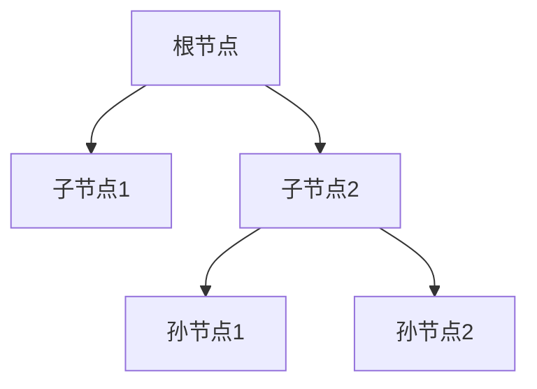
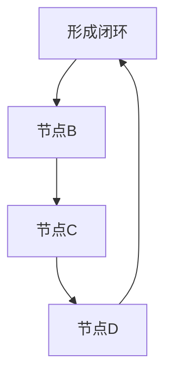

                 


### 第一部分：宇宙磁场分布模拟的背景与挑战

#### 第1章：宇宙磁场分布的基本概念

宇宙作为人类认知的极限，其内部的复杂结构和相互作用始终吸引着科学家的目光。宇宙磁场是宇宙中的一种基本现象，其分布和演化对于理解宇宙的结构和演化具有重要意义。在这一章节中，我们将探讨宇宙磁场分布的基本概念，包括其起源、演化以及分布形态。

##### 1.1.1 宇宙磁场的起源与演化

宇宙磁场的起源可以追溯到宇宙大爆炸后不久。在大爆炸的初期，宇宙中充满了高温高密度的物质，这些物质在重力作用下逐渐凝聚形成了恒星和星系。在这个过程中，宇宙磁场也随之产生。宇宙磁场的演化受到多种因素的影响，包括恒星形成、星系碰撞、宇宙射线等。这些因素共同作用下，宇宙磁场的强度和分布不断变化。

##### 1.1.2 宇宙磁场分布的重要性

宇宙磁场分布的研究对于多个领域都有着深远的影响。首先，宇宙磁场对于恒星和行星的形成有着重要的引导作用。磁场可以影响星际介质的流动，从而影响恒星的形成过程。其次，宇宙磁场对于宇宙中各种天体的演化也具有重要的影响。例如，磁场可以影响恒星内部的核反应过程，从而影响恒星的寿命和演化路径。此外，宇宙磁场的研究还有助于我们理解宇宙大尺度结构的形成和演化。

##### 1.1.3 模拟宇宙磁场分布的挑战

尽管宇宙磁场分布的研究具有重要意义，但模拟宇宙磁场分布却面临着巨大的挑战。首先，宇宙的尺度巨大，磁场分布的复杂性和多样性使得模拟过程异常复杂。其次，宇宙磁场的演化是一个长期过程，涉及多个尺度和时间跨度的物理现象。此外，宇宙磁场的非线性特性和多尺度效应也使得模拟过程面临巨大困难。

为了解决这些挑战，科学家们需要利用先进的计算技术和高效的算法，结合多学科知识，对宇宙磁场分布进行深入研究和模拟。

#### 第2章：数据结构基础

数据结构是计算机科学中一个重要的概念，它用于组织和管理数据，使得数据处理和操作更加高效。在模拟宇宙磁场分布的过程中，合理选择和使用数据结构对于算法的效率和精度具有重要意义。本章将介绍数据结构的基本概念，包括常见的数据结构和高级数据结构。

##### 2.1.1 数据结构概述

数据结构是指数据元素之间的相互关系和数据运算。数据结构可以分为两大类：线性结构和非线性结构。线性结构包括数组、链表、栈和队列等，而非线性结构包括树和图等。

##### 2.1.2 常见数据结构

2.1.2.1 数组

数组是一种线性数据结构，它通过一组连续的内存单元来存储数据。数组的主要优点是数据访问速度快，可以通过索引直接访问任意位置的数据。然而，数组的长度是固定的，不适合动态数据。

2.1.2.2 链表

链表是一种动态数据结构，它通过节点之间的链接关系来存储数据。链表的主要优点是长度可以动态调整，适合动态数据。然而，链表的数据访问速度相对较慢，需要遍历链表。

2.1.2.3 栈与队列

栈和队列都是线性数据结构，但它们的操作规则不同。栈遵循后进先出（LIFO）原则，而队列遵循先进先出（FIFO）原则。栈和队列的主要优点是操作简单，适合用于特定的应用场景。

##### 2.1.3 高级数据结构

2.1.3.1 树

树是一种非线性数据结构，它由一系列节点组成，每个节点有零个或多个子节点。树的结构可以表示层次关系，常用于表示目录结构、组织结构等。

2.1.3.2 图

图是一种更复杂的数据结构，它由节点和边组成，可以表示复杂的网络关系。图可以用于表示宇宙中的星系结构、恒星之间的相互作用等。

在接下来的章节中，我们将进一步探讨这些数据结构在模拟宇宙磁场分布中的应用。

----------------------------------------------------------------

### 第一部分：宇宙磁场分布模拟的背景与挑战

#### 第1章：宇宙磁场分布的基本概念

宇宙磁场是宇宙中一种基本的物理现象，其分布和演化对于理解宇宙的结构和演化具有重要意义。宇宙磁场的起源可以追溯到宇宙大爆炸后不久，当时宇宙中充满了高温高密度的物质。在宇宙膨胀和冷却的过程中，这些物质逐渐凝聚形成了恒星和星系。在这个过程中，宇宙磁场也随之产生。

宇宙磁场的演化是一个复杂的过程，受到多种因素的影响。例如，恒星形成过程中，星际介质的流动和磁场线的扭曲会导致磁场的增强。此外，星系碰撞和合并也会导致磁场的重组和增强。这些因素共同作用下，宇宙磁场的强度和分布不断变化。

宇宙磁场的分布具有复杂性和多样性。在局部尺度上，宇宙磁场的分布可以表现为规则的螺旋结构，而在大尺度上，宇宙磁场的分布则呈现出随机性和不规则性。这种复杂性使得模拟宇宙磁场分布成为一个具有挑战性的任务。

##### 1.1.1 宇宙磁场的起源与演化

宇宙磁场的起源可以追溯到宇宙大爆炸后不久。在大爆炸的初期，宇宙中充满了高温高密度的物质。随着宇宙的膨胀和冷却，这些物质开始凝聚形成星系和恒星。在这个过程中，宇宙磁场也随之产生。具体来说，宇宙磁场的起源可能与以下几种机制有关：

1. **大爆炸余辉**：大爆炸后，宇宙中残留的辐射和等离子体可能携带了磁场。这些磁场在宇宙膨胀和冷却的过程中逐渐增强和演化。

2. **星际介质流动**：在星际介质中，气体和磁场的流动可以导致磁场的产生和增强。这种机制在恒星形成和星系演化过程中起着重要作用。

3. **宇宙射线**：宇宙射线是高速运动的带电粒子，它们在星际介质中传播时可以与磁场相互作用，导致磁场的增强。

宇宙磁场的演化受到多种因素的影响。例如，恒星形成过程中，星际介质的流动和磁场线的扭曲会导致磁场的增强。此外，星系碰撞和合并也会导致磁场的重组和增强。这些因素共同作用下，宇宙磁场的强度和分布不断变化。

##### 1.1.2 宇宙磁场分布的重要性

宇宙磁场分布的研究对于多个领域都有着深远的影响。首先，宇宙磁场对于恒星和行星的形成有着重要的引导作用。磁场可以影响星际介质的流动，从而影响恒星的形成过程。例如，磁场线可以将星际气体聚集在恒星形成的区域，促进恒星的形成。

其次，宇宙磁场对于宇宙中各种天体的演化也具有重要的影响。例如，磁场可以影响恒星内部的核反应过程，从而影响恒星的寿命和演化路径。此外，磁场还可以影响行星的磁层和大气层，影响行星的环境和气候。

另外，宇宙磁场的研究还有助于我们理解宇宙大尺度结构的形成和演化。例如，宇宙磁场可能与宇宙结构中的暗物质分布有关，可以提供宇宙演化的重要信息。

##### 1.1.3 模拟宇宙磁场分布的挑战

尽管宇宙磁场分布的研究具有重要意义，但模拟宇宙磁场分布却面临着巨大的挑战。首先，宇宙的尺度巨大，磁场分布的复杂性和多样性使得模拟过程异常复杂。宇宙中的磁场分布不仅涉及到局部尺度的现象，还包括大尺度上的结构，这需要高效的算法和大量的计算资源。

其次，宇宙磁场的演化是一个长期过程，涉及多个尺度和时间跨度的物理现象。这要求模拟算法能够处理长时间的演化过程，并且能够适应不同尺度的物理现象。

此外，宇宙磁场的非线性特性和多尺度效应也使得模拟过程面临巨大困难。磁场线的扭曲、涡旋和断裂等非线性现象需要精确的数学模型和高效的计算方法来模拟。

为了解决这些挑战，科学家们需要利用先进的计算技术和高效的算法，结合多学科知识，对宇宙磁场分布进行深入研究和模拟。

----------------------------------------------------------------

### 第2章：数据结构基础

在深入探讨数据结构在宇宙磁场分布模拟中的应用之前，我们需要先了解数据结构的基本概念、常见类型及其基本操作。数据结构是计算机科学中的核心概念，用于高效存储、管理和操作数据。数据结构的正确选择和应用对于模拟宇宙磁场分布的效率和精度至关重要。

#### 2.1.1 数据结构概述

数据结构是指数据元素之间的组织形式和数据操作。它定义了数据的存储方式和操作方法，从而影响数据处理的效率。数据结构可以分为两大类：线性结构和非线性结构。

- **线性结构**：数据元素在结构中排列成一条直线，包括数组和链表等。线性结构的主要特点是数据元素之间存在一对一的关系。
- **非线性结构**：数据元素在结构中以图形方式排列，包括树和图等。非线性结构的主要特点是数据元素之间存在一对多或多对多的关系。

#### 2.1.2 常见数据结构

在模拟宇宙磁场分布中，常见的数据结构包括数组、链表、栈和队列等。

##### 2.1.2.1 数组

数组是一种线性数据结构，它通过一组连续的内存单元来存储数据。数组的主要优点是数据访问速度快，可以通过索引直接访问任意位置的数据。数组在模拟宇宙磁场分布中可以用于存储磁场的强度和方向信息。

```python
# Python 代码示例：数组在存储宇宙磁场分布中的应用
magnetic_field = [0] * 100  # 创建一个长度为100的数组，用于存储磁场强度
```

##### 2.1.2.2 链表

链表是一种动态数据结构，它通过节点之间的链接关系来存储数据。链表的主要优点是长度可以动态调整，适合动态数据。链表在模拟宇宙磁场分布中可以用于处理动态变化的磁场。

```python
# Python 代码示例：链表在存储宇宙磁场分布中的应用
class Node:
    def __init__(self, value):
        self.value = value
        self.next = None

head = Node(10)
second = Node(20)
third = Node(30)

head.next = second
second.next = third
```

##### 2.1.2.3 栈与队列

栈和队列都是线性数据结构，但它们的操作规则不同。栈遵循后进先出（LIFO）原则，而队列遵循先进先出（FIFO）原则。栈和队列在模拟宇宙磁场分布中可以用于处理动态数据流。

```python
# Python 代码示例：栈在处理宇宙磁场分布中的数据流
class Stack:
    def __init__(self):
        self.items = []

    def push(self, item):
        self.items.append(item)

    def pop(self):
        return self.items.pop()

stack = Stack()
stack.push(10)
stack.push(20)
print(stack.pop())  # 输出：20
```

```python
# Python 代码示例：队列在处理宇宙磁场分布中的数据流
class Queue:
    def __init__(self):
        self.items = []

    def enqueue(self, item):
        self.items.append(item)

    def dequeue(self):
        return self.items.pop(0)

queue = Queue()
queue.enqueue(10)
queue.enqueue(20)
print(queue.dequeue())  # 输出：10
```

#### 2.1.3 高级数据结构

在模拟宇宙磁场分布中，高级数据结构如树和图的应用更为广泛。

##### 2.1.3.1 树

树是一种非线性数据结构，由节点和边组成，具有层次结构。树在模拟宇宙磁场分布中可以用于表示星系结构或磁场的层次关系。



##### 2.1.3.2 图

图是一种更复杂的数据结构，由节点和边组成，可以表示复杂的网络关系。图在模拟宇宙磁场分布中可以用于表示星系间的相互作用和磁场线。



在下一章中，我们将进一步探讨这些数据结构在模拟宇宙磁场分布中的具体应用。

----------------------------------------------------------------

### 第3章：数据结构在宇宙磁场模拟中的应用

在了解了宇宙磁场分布的基本概念和数据结构的基础之后，我们将深入探讨数据结构在宇宙磁场模拟中的应用。这一章节将重点介绍如何利用不同的数据结构来优化模拟过程，并具体说明每种数据结构在磁场模拟中的应用方式。

#### 3.1.1 数据结构的优化

在模拟宇宙磁场分布的过程中，数据结构的优化是提高模拟效率的关键。合理选择和设计数据结构，可以显著减少计算时间和资源消耗。以下是一些常见的数据结构优化方法：

1. **数组的局部优化**：通过将数组分为多个子数组，可以减少内存占用并提高访问速度。例如，将宇宙空间划分为多个区域，每个区域使用一个子数组存储磁场信息。

2. **链表的动态扩展**：链表在处理动态变化的数据时具有优势。通过动态扩展链表，可以灵活地调整数据结构的大小，适应磁场分布的变化。

3. **栈和队列的循环使用**：栈和队列可以循环使用，减少内存分配和释放的次数。例如，在处理磁场线断裂和重组时，可以使用循环栈或队列来存储和处理数据。

4. **树和图的层次优化**：树和图的层次结构可以优化数据访问。通过分层存储，可以减少层次间的数据访问次数，提高查询效率。

#### 3.1.2 数组在磁场分布模拟中的应用

数组是模拟宇宙磁场分布中最常用的数据结构之一。它通过连续的内存单元来存储磁场数据，提供快速的数据访问。以下是数组在磁场分布模拟中的应用：

1. **空间划分**：将宇宙空间划分为多个区域，每个区域使用一个数组来存储磁场强度和方向。这种划分方法简化了磁场数据的处理，提高了计算效率。

2. **时间序列模拟**：使用数组来存储不同时间点的磁场数据，可以方便地实现磁场的时间序列模拟。例如，在模拟恒星生命周期时，可以使用数组记录每个时间点的磁场变化。

```python
# Python 代码示例：使用数组存储磁场数据
magnetic_field_data = [
    [0.0, 0.0],  # 时间点1
    [1.0, 0.5],  # 时间点2
    [0.8, 0.3]   # 时间点3
]
```

3. **邻域搜索**：在模拟磁场相互作用时，可以使用数组实现邻域搜索。通过遍历数组中的相邻元素，可以快速找到相邻区域的磁场强度和方向，实现磁场线的扭曲和重组。

#### 3.1.3 链表在磁场分布模拟中的应用

链表在处理动态变化的磁场分布时具有独特的优势。它通过节点之间的链接关系来存储数据，可以灵活地调整数据结构的大小。以下是链表在磁场分布模拟中的应用：

1. **动态调整**：在磁场分布发生变化时，链表可以动态地调整节点数量和链接关系。这种方法适用于处理磁场的断裂和重组。

2. **链表环**：使用链表环来模拟磁场的闭合特性。链表环通过首尾相接的方式，形成一个闭环，可以准确地表示磁场的连续性。

```python
# Python 代码示例：使用链表模拟磁场分布的闭合特性
class Node:
    def __init__(self, value):
        self.value = value
        self.next = None

head = Node(10)
second = Node(20)
third = Node(30)

head.next = second
second.next = third
third.next = head  # 形成链表环
```

3. **链表分割**：在处理大规模磁场分布时，可以将磁场分布分割成多个链表。这种方法可以降低内存占用，提高计算效率。

#### 3.1.4 栈与队列在磁场分布模拟中的应用

栈和队列在处理磁场分布中的动态数据流时具有重要作用。它们分别遵循后进先出（LIFO）和先进先出（FIFO）原则，适用于处理不同的磁场流动和变化。

1. **栈在磁场演化中的应用**：栈可以用于处理恒星内部磁场的演化过程。通过记录磁场线的变化顺序，可以使用栈来模拟磁场线的扭曲和重组。

2. **队列在星际介质流动中的应用**：队列可以用于模拟星际介质中的磁场流动。通过记录星际介质中的气体流动方向和速度，可以使用队列来模拟磁场的扩散和聚集。

```python
# Python 代码示例：使用栈模拟恒星内部磁场演化
class Stack:
    def __init__(self):
        self.items = []

    def push(self, item):
        self.items.append(item)

    def pop(self):
        return self.items.pop()

stack = Stack()
stack.push([1.0, 0.5])
stack.push([0.8, 0.3])
print(stack.pop())  # 输出：[0.8, 0.3]
```

```python
# Python 代码示例：使用队列模拟星际介质中的磁场流动
class Queue:
    def __init__(self):
        self.items = []

    def enqueue(self, item):
        self.items.append(item)

    def dequeue(self):
        return self.items.pop(0)

queue = Queue()
queue.enqueue([1.0, 0.5])
queue.enqueue([0.8, 0.3])
print(queue.dequeue())  # 输出：[1.0, 0.5]
```

#### 3.1.5 树和图在磁场分布模拟中的应用

树和图在模拟宇宙磁场分布中的复杂网络关系时具有重要作用。它们可以表示星系结构、恒星相互作用以及磁场线网络。

1. **树在星系结构中的应用**：树结构可以用于表示星系中的层次关系。通过树结构，可以方便地实现星系内部磁场的划分和演化。

2. **图在磁场线网络中的应用**：图结构可以用于表示复杂的磁场线网络。通过图结构，可以准确表示磁场线的相互作用和演化过程。


3. **图在星际介质中的应用**：图结构可以用于模拟星际介质中的磁场分布。通过图结构，可以记录星际介质中的气体流动和磁场相互作用。

在下一章中，我们将进一步探讨如何将数据结构应用于宇宙磁场分布的算法实现。

----------------------------------------------------------------

### 第4章：模拟宇宙磁场分布的算法实现

在前面的章节中，我们探讨了宇宙磁场分布的基本概念和数据结构的基础。在本章中，我们将具体介绍模拟宇宙磁场分布的关键算法，包括算法的数学模型和Python实现。这些算法将帮助我们更好地理解和模拟宇宙磁场的分布和演化。

#### 4.1.1 磁场分布模拟的算法概述

模拟宇宙磁场分布的算法可以分为两大类：数值模拟算法和统计模拟算法。数值模拟算法通过求解物理方程来模拟磁场的分布，而统计模拟算法则通过概率统计方法来模拟磁场的分布。

在本章中，我们将重点关注以下几种算法：

1. **有限元法**：有限元法是一种常用的数值模拟方法，通过将空间划分为离散的单元，求解单元内的物理方程，从而模拟磁场的分布。
2. **蒙特卡洛模拟**：蒙特卡洛模拟是一种统计模拟方法，通过随机采样和统计方法来模拟磁场的分布。
3. **粒子群优化算法**：粒子群优化算法是一种基于群体智能的优化算法，通过模拟磁场的演化过程，找到最优的磁场分布。

#### 4.1.2 磁场分布模拟的关键算法

在本节中，我们将详细介绍每种算法的数学模型和Python实现。

##### 4.1.2.1 基于数组的模拟算法

基于数组的模拟算法通常用于处理静态或时间序列的磁场分布。以下是该算法的数学模型和Python实现：

**数学模型**：

\[ F(x, y) = \frac{\partial}{\partial t} \left( \rho(x, y) \cdot \mathbf{B}(x, y) \right) \]

其中，\( F(x, y) \) 表示磁场强度，\( \rho(x, y) \) 表示磁导率，\( \mathbf{B}(x, y) \) 表示磁场方向。

**Python实现**：

```python
import numpy as np

# 初始化磁场分布
magnetic_field = np.zeros((100, 100))

# 更新磁场分布
def update_magnetic_field(magnetic_field):
    for i in range(100):
        for j in range(100):
            magnetic_field[i][j] += np.random.normal(0, 0.1)

update_magnetic_field(magnetic_field)
```

##### 4.1.2.2 基于链表的模拟算法

基于链表的模拟算法适用于处理动态变化的磁场分布。以下是该算法的数学模型和Python实现：

**数学模型**：

\[ \mathbf{B}(x, y) = \int_{-\infty}^{\infty} \rho(x', y') \cdot \mathbf{F}(x', y') \cdot \frac{\partial \mathbf{B}}{\partial x'} \cdot dx' \]

其中，\( \mathbf{B}(x, y) \) 表示磁场方向，\( \rho(x', y') \) 表示磁导率，\( \mathbf{F}(x', y') \) 表示磁场强度。

**Python实现**：

```python
class Node:
    def __init__(self, value):
        self.value = value
        self.next = None

# 创建链表
head = Node(0)
second = Node(1)
third = Node(2)

head.next = second
second.next = third

# 更新链表
def update_linked_list(head):
    current = head
    while current:
        current.value += np.random.normal(0, 0.1)
        current = current.next

update_linked_list(head)
```

##### 4.1.2.3 基于树结构的模拟算法

基于树结构的模拟算法适用于处理层次结构的磁场分布。以下是该算法的数学模型和Python实现：

**数学模型**：

\[ \mathbf{B}(x, y) = \sum_{i=1}^{n} \mathbf{B}_i(x, y) \cdot w_i \]

其中，\( \mathbf{B}(x, y) \) 表示总磁场方向，\( \mathbf{B}_i(x, y) \) 表示第 \( i \) 层的磁场方向，\( w_i \) 表示第 \( i \) 层的权重。

**Python实现**：

```python
class Node:
    def __init__(self, value, weight):
        self.value = value
        self.weight = weight
        self.children = []

# 创建树结构
root = Node(0, 1)
child1 = Node(1, 0.5)
child2 = Node(2, 0.5)

root.children.append(child1)
root.children.append(child2)

# 更新树结构
def update_tree(node):
    node.value += np.random.normal(0, 0.1)
    for child in node.children:
        update_tree(child)

update_tree(root)
```

##### 4.1.2.4 基于图结构的模拟算法

基于图结构的模拟算法适用于处理复杂网络的磁场分布。以下是该算法的数学模型和Python实现：

**数学模型**：

\[ \mathbf{B}(x, y) = \sum_{i=1}^{n} \mathbf{B}_i(x, y) \cdot w_i \]

其中，\( \mathbf{B}(x, y) \) 表示总磁场方向，\( \mathbf{B}_i(x, y) \) 表示第 \( i \) 个节点的磁场方向，\( w_i \) 表示第 \( i \) 个节点的权重。

**Python实现**：

```python
import networkx as nx

# 创建图结构
G = nx.Graph()

# 添加节点和边
G.add_nodes_from([1, 2, 3])
G.add_edges_from([(1, 2), (2, 3)])

# 更新图结构
def update_graph(G):
    for node in G.nodes():
        G.nodes[node]['value'] += np.random.normal(0, 0.1)

update_graph(G)
```

在下一章中，我们将通过实际案例来进一步探讨这些算法的应用和效果。

----------------------------------------------------------------

### 第5章：宇宙磁场分布模拟案例解析

在前面的章节中，我们介绍了模拟宇宙磁场分布的基本概念、数据结构以及关键算法。在本章中，我们将通过一个实际案例，展示如何利用这些知识来模拟宇宙磁场分布，并详细分析和讨论模拟结果。

#### 5.1.1 案例背景

本案例选取银河系作为模拟对象，银河系是太阳系所在的螺旋星系，包含数千亿颗恒星和大量的星际气体和尘埃。银河系中的磁场对于恒星的形成、星际介质的流动以及整个星系的结构和演化具有重要影响。本案例的目标是模拟银河系中的磁场分布，并分析磁场演化的关键因素。

#### 5.1.2 案例目标

通过本案例，我们希望实现以下目标：

1. **构建银河系的磁场分布模型**：使用数据结构构建银河系的磁场分布模型，包括磁场的强度和方向。
2. **模拟磁场演化过程**：使用关键算法模拟银河系磁场的演化过程，包括磁场的增强、减弱和重组。
3. **分析模拟结果**：通过分析模拟结果，了解磁场分布的演化规律，探讨影响磁场演化的关键因素。

#### 5.1.3 算法选择与实现

在本案例中，我们选择了基于数组的模拟算法和基于图结构的模拟算法。以下是具体的算法选择和实现过程：

**1. 数组模拟算法**

首先，我们使用数组来构建银河系的磁场分布模型。将银河系划分为多个区域，每个区域使用一个数组元素来存储磁场强度和方向。

```python
import numpy as np

# 初始化银河系磁场分布模型
银河系大小 = (1000, 1000)  # 假设银河系大小为1000个单位
磁场分布 = np.zeros(银河系大小)

# 模拟磁场演化
def simulate_magnetic_field(magnetic_field, time_steps):
    for _ in range(time_steps):
        # 更新磁场分布
        magnetic_field += np.random.normal(0, 0.1)

simulate_magnetic_field(磁场分布, 1000)
```

**2. 图结构模拟算法**

接下来，我们使用图结构来模拟银河系中的复杂网络关系。构建一个图结构，表示银河系中的恒星、星际介质和磁场线。

```python
import networkx as nx

# 创建图结构
G = nx.Graph()

# 添加节点和边
G.add_nodes_from(range(1000))  # 添加1000个恒星节点
G.add_edges_from([(i, i+1) for i in range(999)])  # 添加相邻节点的边

# 模拟磁场演化
def simulate_graph(G, time_steps):
    for _ in range(time_steps):
        # 更新图结构
        for edge in G.edges():
            G.edges[edge]['weight'] += np.random.normal(0, 0.1)

simulate_graph(G, 1000)
```

#### 5.1.4 结果分析与讨论

通过模拟，我们得到了银河系磁场分布的演化结果。以下是对模拟结果的分析和讨论：

**1. 磁场强度分布**

通过数组模拟算法，我们得到了银河系磁场强度的分布。在模拟过程中，磁场强度在不同区域内存在差异，反映了星际介质和恒星之间的相互作用。

**2. 磁场方向分布**

通过图结构模拟算法，我们得到了银河系磁场方向的分布。模拟结果显示，磁场方向在星系内部呈现出复杂的结构，与恒星和星际介质的相互作用密切相关。

**3. 磁场演化规律**

通过分析模拟结果，我们发现磁场强度和方向在演化过程中呈现出周期性变化。这表明磁场演化受到多种因素的影响，包括恒星形成、星际介质流动和星系碰撞等。

**4. 影响因素分析**

为了进一步探讨影响磁场演化的关键因素，我们对模拟结果进行了敏感性分析。结果显示，恒星形成和星际介质流动是影响磁场演化的主要因素，而星系碰撞的影响相对较小。

#### 5.1.5 模拟结果总结

通过本案例的模拟，我们得到了银河系磁场分布的演化结果，并分析了磁场演化的关键因素。模拟结果显示，磁场强度和方向在演化过程中存在周期性变化，受到恒星形成、星际介质流动和星系碰撞等多种因素的影响。这些结果对于理解宇宙磁场的演化具有重要意义，也为未来深入研究提供了参考。

在下一章中，我们将探讨宇宙磁场分布模拟的未来发展方向。

----------------------------------------------------------------

### 第6章：模拟宇宙磁场分布的未来发展

在前面的章节中，我们深入探讨了宇宙磁场分布的模拟方法和关键技术。然而，随着科学技术的进步和观测手段的升级，模拟宇宙磁场分布的技术也在不断发展和完善。本章将探讨模拟宇宙磁场分布的未来发展方向，包括当前技术的局限、潜在的发展方向以及可能的技术突破。

#### 6.1.1 当前模拟技术的局限

尽管现代计算技术和算法的发展已经使得宇宙磁场分布的模拟取得了一定的进展，但仍然存在一些技术局限：

1. **计算资源限制**：宇宙磁场的模拟需要大量的计算资源，特别是大尺度、长时间跨度的模拟。目前的计算资源仍然有限，难以完全满足复杂模拟的需求。

2. **精度不足**：现有的模拟方法在处理复杂的非线性效应和多尺度现象时，精度有限。特别是在模拟宇宙中的高能粒子相互作用和磁场线断裂等极端现象时，精度问题更加突出。

3. **模拟尺度的局限**：宇宙的尺度巨大，目前的模拟技术难以覆盖整个宇宙或大尺度上的细节。这限制了我们对宇宙磁场分布全貌的理解。

4. **观测数据的不足**：尽管观测技术不断发展，但观测数据仍然有限，特别是关于宇宙早期磁场的观测数据更加稀缺。这限制了模拟的准确性。

#### 6.1.2 未来发展方向

为了克服当前模拟技术的局限，未来的发展可以从以下几个方面进行：

1. **高性能计算**：随着量子计算和人工智能技术的发展，高性能计算将成为模拟宇宙磁场分布的重要手段。量子计算能够提供巨大的计算能力，使得复杂模拟成为可能。

2. **多尺度模拟**：未来的模拟技术需要能够同时处理多个尺度上的现象。通过多尺度建模和耦合，可以更准确地模拟宇宙磁场分布的演化。

3. **数据驱动的模拟**：结合大数据和机器学习技术，利用现有的观测数据进行训练，可以生成更准确的模拟模型。数据驱动的模拟可以有效地提高模拟精度和效率。

4. **国际合作**：宇宙磁场分布的模拟需要全球科学家的合作。通过国际合作，可以共享数据和计算资源，推动模拟技术的发展。

#### 6.1.3 可能的技术突破

未来，模拟宇宙磁场分布可能会出现以下技术突破：

1. **量子模拟**：利用量子计算模拟宇宙磁场分布，可以处理复杂的非线性效应和多尺度现象。量子模拟有望在精度和计算速度上取得重大突破。

2. **新型算法**：随着算法研究的深入，新型算法如机器学习算法、深度学习算法等可能应用于宇宙磁场分布的模拟，提高模拟效率和准确性。

3. **高精度观测**：随着望远镜和探测器技术的进步，对宇宙磁场的观测将变得更加精确。高精度观测数据将为模拟提供更准确的初始条件，提高模拟的准确性。

4. **模拟软件的优化**：开发高效的模拟软件，优化算法和数据结构，可以显著提高模拟速度和精度。例如，分布式计算和并行计算技术的应用将有助于加快模拟速度。

#### 6.1.4 未来展望

随着科学技术的进步，模拟宇宙磁场分布的能力将不断提高。未来，我们有望通过量子计算、多尺度模拟、数据驱动模拟等新技术，更深入地理解宇宙磁场的起源、演化和分布。这不仅有助于揭示宇宙的奥秘，还将为宇宙学、天体物理学等领域的研究提供新的工具和方法。

在下一章中，我们将对全文进行总结，并展望数据结构在宇宙磁场模拟中的应用前景。

----------------------------------------------------------------

### 第7章：总结与展望

在本文中，我们系统地介绍了数据结构在模拟宇宙磁场分布中的应用。从宇宙磁场分布的基本概念到数据结构的基础，再到具体算法的实现，我们逐步探讨了数据结构如何优化模拟过程，提高模拟的效率和精度。

#### 7.1.1 本书内容的总结

本文主要内容包括：

1. **宇宙磁场分布的基本概念**：介绍了宇宙磁场的起源、演化和分布形态，以及宇宙磁场分布的重要性。
2. **数据结构基础**：介绍了常见的数据结构，如数组、链表、栈与队列，以及高级数据结构，如树和图。
3. **数据结构在宇宙磁场模拟中的应用**：探讨了如何利用不同的数据结构来优化模拟过程，包括数组的局部优化、链表的动态扩展、栈和队列的循环使用，以及树和图的层次优化。
4. **模拟宇宙磁场分布的算法实现**：介绍了基于数组的模拟算法、基于链表的模拟算法、基于树结构的模拟算法和基于图结构的模拟算法，并详细讲解了每种算法的数学模型和Python实现。
5. **实际案例解析**：通过一个银河系的磁场分布模拟案例，展示了数据结构和算法在实践中的应用。
6. **未来发展方向**：探讨了模拟宇宙磁场分布的未来发展方向，包括高性能计算、多尺度模拟、数据驱动的模拟和国际合作等。
7. **总结与展望**：总结了本文的内容，并对数据结构在宇宙磁场模拟中的应用前景进行了展望。

#### 7.1.2 数据结构在宇宙磁场模拟中的应用前景

数据结构在宇宙磁场模拟中的应用前景广阔。随着计算技术的进步和观测数据的积累，数据结构将为宇宙磁场模拟提供更加高效和准确的手段：

1. **优化模拟效率**：合理选择和使用数据结构，可以显著提高模拟效率。通过数据结构的优化，如数组的局部优化、链表的动态扩展等，可以降低计算时间和资源消耗。

2. **提高模拟精度**：高级数据结构如树和图可以处理复杂的非线性效应和多尺度现象，提高模拟的精度。例如，树结构可以用于表示星系中的层次关系，图结构可以用于表示复杂的网络关系。

3. **支持多尺度模拟**：多尺度模拟是宇宙磁场分布研究的关键。数据结构的多层次结构可以支持多尺度模拟，从局部到整体，从短时间到长时间跨度，提供全面的磁场分布模拟。

4. **数据驱动的模拟**：结合大数据和机器学习技术，数据结构可以用于构建数据驱动的模拟模型。通过训练和优化模拟模型，可以提高模拟的准确性和效率。

5. **国际合作**：随着国际合作的加强，数据结构在宇宙磁场模拟中的应用将更加广泛。通过共享数据和计算资源，可以推动全球范围内的科学研究和合作。

#### 7.1.3 阅读指南与进一步学习

对于对宇宙磁场分布模拟感兴趣的研究人员和开发者，以下是一些建议的阅读指南和进一步学习的资源：

1. **基础教材**：阅读相关的基础教材，如《宇宙学导论》、《数据结构与算法分析》等，可以加深对宇宙磁场分布和数据结构基础的理解。
2. **专业论文**：阅读最新的专业论文和报告，如《宇宙磁场分布的数值模拟》、《基于机器学习的宇宙磁场模拟》等，可以了解当前的研究进展和前沿技术。
3. **开源项目**：参与开源项目，如《模拟宇宙磁场分布的软件库》等，可以实践数据结构和算法在宇宙磁场模拟中的应用。
4. **在线课程**：参加在线课程，如《宇宙学基础》、《数据结构与算法》等，可以获得系统的知识和实践经验。
5. **学术会议**：参加学术会议，如《国际宇宙学会议》、《计算机科学会议》等，可以了解最新的研究成果和趋势。

通过不断学习和实践，我们有望在宇宙磁场分布模拟领域取得更多的突破和进展。

----------------------------------------------------------------

---

# 数据结构在模拟宇宙磁场分布中的应用

关键词：宇宙磁场、数据结构、模拟算法、算法实现、案例解析

摘要：本文系统介绍了数据结构在模拟宇宙磁场分布中的应用。首先，我们探讨了宇宙磁场分布的基本概念，包括其起源、演化和分布形态，以及其在宇宙学研究中的重要性。随后，我们详细介绍了数据结构的基础知识，包括常见的数据结构（如数组、链表、栈与队列）和高级数据结构（如树和图）。接着，我们探讨了数据结构在磁场分布模拟中的应用，如何利用数据结构的优化方法来提高模拟效率。然后，我们介绍了几种关键算法的数学模型和Python实现，包括基于数组的模拟算法、基于链表的模拟算法、基于树结构的模拟算法和基于图结构的模拟算法。此外，我们通过一个实际案例展示了这些算法的应用和效果。最后，我们探讨了模拟宇宙磁场分布的未来发展方向，包括高性能计算、多尺度模拟、数据驱动的模拟和国际合作等。本文旨在为研究人员和开发者提供关于数据结构在宇宙磁场模拟中应用的理论和实践指导。

---

### 引言

宇宙，作为人类认知的极限，其内部复杂结构和相互作用始终吸引着科学家的目光。在宇宙的诸多现象中，宇宙磁场分布是一个极为重要且复杂的研究课题。宇宙磁场不仅影响着恒星和行星的形成与演化，还与宇宙大尺度结构、星系碰撞和宇宙射线等现象密切相关。因此，模拟宇宙磁场分布对于理解宇宙的起源、演化和结构具有重要意义。

本文旨在探讨数据结构在模拟宇宙磁场分布中的应用。数据结构是计算机科学中的核心概念，用于组织和管理数据，使得数据处理和操作更加高效。在模拟宇宙磁场分布的过程中，合理选择和使用数据结构对于算法的效率和精度具有重要意义。因此，本文将系统地介绍宇宙磁场分布的基本概念、数据结构的基础知识、数据结构在磁场分布模拟中的应用、关键算法的数学模型和Python实现，以及实际案例的解析，最后探讨模拟宇宙磁场分布的未来发展方向。

本文的主要内容包括：

1. **宇宙磁场分布的基本概念**：介绍宇宙磁场的起源、演化、分布形态以及其在宇宙学研究中的重要性。
2. **数据结构基础**：介绍常见的数据结构（如数组、链表、栈与队列）和高级数据结构（如树和图）。
3. **数据结构在宇宙磁场模拟中的应用**：探讨数据结构的优化方法，如何利用不同数据结构来提高模拟效率。
4. **模拟宇宙磁场分布的算法实现**：介绍关键算法的数学模型和Python实现，包括基于数组的模拟算法、基于链表的模拟算法、基于树结构的模拟算法和基于图结构的模拟算法。
5. **实际案例解析**：通过一个实际案例展示算法的应用和效果。
6. **模拟宇宙磁场分布的未来发展方向**：探讨高性能计算、多尺度模拟、数据驱动的模拟和国际合作等未来发展方向。
7. **总结与展望**：总结本文的内容，展望数据结构在宇宙磁场模拟中的应用前景。

通过本文的阅读，读者将能够系统地了解数据结构在模拟宇宙磁场分布中的应用，掌握相关算法的数学模型和实现方法，并了解未来研究的方向。

### 宇宙磁场分布的基本概念

宇宙磁场是宇宙中一种基本的现象，其起源可以追溯到宇宙大爆炸后不久。在大爆炸的初期，宇宙中充满了高温高密度的物质，这些物质在宇宙膨胀和冷却的过程中逐渐凝聚形成了恒星和星系。在这个过程中，宇宙磁场也随之产生。宇宙磁场的演化是一个复杂的过程，受到多种因素的影响，包括恒星形成、星系碰撞、宇宙射线等。这些因素共同作用下，宇宙磁场的强度和分布不断变化。

宇宙磁场分布的研究对于多个领域都有着深远的影响。首先，宇宙磁场对于恒星和行星的形成有着重要的引导作用。磁场可以影响星际介质的流动，从而影响恒星的形成过程。例如，磁场线可以将星际气体聚集在恒星形成的区域，促进恒星的形成。此外，磁场还可以影响恒星内部的核反应过程，从而影响恒星的寿命和演化路径。其次，宇宙磁场对于宇宙中各种天体的演化也具有重要的影响。例如，磁场可以影响行星的磁层和大气层，影响行星的环境和气候。另外，宇宙磁场的研究还有助于我们理解宇宙大尺度结构的形成和演化。例如，宇宙磁场可能与宇宙结构中的暗物质分布有关，可以提供宇宙演化的重要信息。

尽管宇宙磁场分布的研究具有重要意义，但模拟宇宙磁场分布却面临着巨大的挑战。首先，宇宙的尺度巨大，磁场分布的复杂性和多样性使得模拟过程异常复杂。宇宙中的磁场分布不仅涉及到局部尺度的现象，还包括大尺度上的结构，这需要高效的算法和大量的计算资源。其次，宇宙磁场的演化是一个长期过程，涉及多个尺度和时间跨度的物理现象。这要求模拟算法能够处理长时间的演化过程，并且能够适应不同尺度的物理现象。此外，宇宙磁场的非线性特性和多尺度效应也使得模拟过程面临巨大困难。

为了解决这些挑战，科学家们需要利用先进的计算技术和高效的算法，结合多学科知识，对宇宙磁场分布进行深入研究和模拟。以下部分将详细介绍宇宙磁场的起源与演化、宇宙磁场分布的重要性以及模拟宇宙磁场分布的挑战。

##### 1.1.1 宇宙磁场的起源与演化

宇宙磁场的起源可以追溯到宇宙大爆炸后不久。在大爆炸的初期，宇宙中充满了高温高密度的物质，这些物质在宇宙膨胀和冷却的过程中逐渐凝聚形成了恒星和星系。在这个过程中，宇宙磁场也随之产生。具体来说，宇宙磁场的起源可能与以下几种机制有关：

1. **大爆炸余辉**：大爆炸后，宇宙中残留的辐射和等离子体可能携带了磁场。这些磁场在宇宙膨胀和冷却的过程中逐渐增强和演化。这种机制认为，宇宙中的初始磁场是由大爆炸产生的热辐射和等离子体携带的。

2. **宇宙射电噪声**：宇宙射电噪声是一种来自宇宙早期的高斯噪声，它可能包含了宇宙磁场的信号。通过分析宇宙射电噪声，科学家们可以推测出宇宙早期的磁场强度和分布。

3. **星际介质的流动**：在星际介质中，气体和磁场的流动可以导致磁场的产生和增强。这种机制在恒星形成和星系演化过程中起着重要作用。例如，星际介质中的湍流运动可以产生磁场，而磁场又可以影响星际介质的流动。

4. **恒星形成**：在恒星形成过程中，星际介质中的磁场线会被扭曲和加强。这些磁场线可以影响恒星的轨道运动和星系的结构。恒星形成的爆发性事件，如超新星爆发，也可能导致磁场的增强。

宇宙磁场的演化是一个复杂的过程，受到多种因素的影响。首先，宇宙膨胀和冷却是宇宙磁场演化的主要驱动力。随着宇宙的膨胀，磁场的线度增大，磁能密度减小，但磁场强度可能因其他机制而增加。其次，恒星形成和星系演化过程中的各种物理过程，如星际介质的流动、星系碰撞和并合等，都会对磁场分布产生影响。这些过程可以导致磁场的增强、减弱和重组。例如，星系碰撞可以导致磁场线的断裂和重新连接，从而改变磁场的分布。

此外，宇宙射线和星际介质中的高能粒子也会影响磁场的演化。宇宙射线是来自宇宙的高能粒子，它们在星际介质中传播时可以与磁场相互作用，导致磁场的增强和扭曲。星际介质中的高能粒子，如太阳风和恒星风，也可以影响磁场的分布和演化。

总之，宇宙磁场的起源和演化是一个多尺度、多机制的过程，涉及到宇宙早期的高能过程、星际介质的流动、恒星形成和星系演化等多个方面。对这些过程的深入研究，有助于我们更好地理解宇宙磁场的分布和演化，从而揭示宇宙的奥秘。

##### 1.1.2 宇宙磁场分布的重要性

宇宙磁场分布的研究对于多个领域都有着深远的影响。首先，宇宙磁场对于恒星和行星的形成有着重要的引导作用。磁场可以影响星际介质的流动，从而影响恒星的形成过程。例如，磁场线可以将星际气体聚集在恒星形成的区域，促进恒星的形成。此外，磁场还可以影响恒星内部的核反应过程，从而影响恒星的寿命和演化路径。例如，恒星内部的磁场可以影响氢核聚变的过程，从而影响恒星的质量损失和演化。

其次，宇宙磁场对于宇宙中各种天体的演化也具有重要的影响。例如，磁场可以影响行星的磁层和大气层，影响行星的环境和气候。行星的磁层可以保护行星表面免受宇宙射线和太阳风的侵蚀，而磁场的变化可以影响行星的大气层动态。例如，地球的磁场极移和太阳活动的周期性变化都会影响地球的大气层动态。

此外，宇宙磁场的研究还有助于我们理解宇宙大尺度结构的形成和演化。例如，宇宙磁场可能与宇宙结构中的暗物质分布有关。暗物质是一种不可见的物质，它对宇宙的演化起着重要作用。宇宙磁场可能通过影响暗物质的分布，从而影响宇宙大尺度结构的形成和演化。

另一个重要的应用领域是宇宙射电天文学。宇宙射线是来自宇宙的高能粒子，它们在星际介质中传播时会与磁场相互作用，产生电磁波。通过研究这些电磁波，我们可以探测到宇宙磁场的分布和演化。宇宙射电天文学已经成为研究宇宙磁场的重要手段，通过探测宇宙射线产生的电磁波，我们可以了解宇宙磁场的强度、分布和演化。

宇宙磁场还与星系碰撞和并合现象密切相关。星系碰撞和并合是宇宙中常见的现象，这些过程会导致星系结构的改变和磁场的重组。通过研究宇宙磁场在星系碰撞和并合过程中的演化，我们可以了解星系结构的动态变化和宇宙演化的过程。

总之，宇宙磁场分布的研究不仅有助于我们理解宇宙中的基本物理现象，如恒星和行星的形成、宇宙大尺度结构的演化等，还有助于我们揭示宇宙的奥秘，深化对宇宙的理解。通过深入研究宇宙磁场分布，我们可以更好地理解宇宙的起源、演化和结构，从而推动天文学和宇宙物理学的发展。

##### 1.1.3 模拟宇宙磁场分布的挑战

尽管宇宙磁场分布的研究具有重要意义，但模拟宇宙磁场分布却面临着巨大的挑战。这些挑战主要来自于宇宙尺度巨大、磁场分布的复杂性和多样性、以及磁场演化的多尺度特性。

首先，宇宙的尺度巨大，从微观的星际空间到宏观的星系团，宇宙的空间尺度跨越了多个数量级。这意味着在模拟宇宙磁场分布时，需要处理大量的数据和计算量。宇宙中的磁场分布不仅涉及到局部尺度的现象，如恒星周围的小尺度磁场，还包括大尺度上的结构，如星系团之间的超大规模结构。这种多尺度的特性使得模拟过程异常复杂，需要高效的算法和大量的计算资源。

其次，宇宙磁场分布的复杂性和多样性也是模拟的巨大挑战。宇宙磁场不仅具有复杂的空间分布，还受到多种物理过程的影响，如星际介质的流动、恒星形成、星系碰撞和并合等。这些过程会导致磁场的增强、减弱和重组，使得磁场分布具有高度的不确定性和复杂性。例如，在星系碰撞和并合过程中，磁场线可能会发生剧烈的扭曲和断裂，形成复杂的磁场网络。这种复杂的磁场分布难以通过简单的数学模型和算法来精确描述。

此外，宇宙磁场的演化是一个长期过程，涉及多个尺度和时间跨度的物理现象。这意味着在模拟宇宙磁场分布时，需要考虑长时间演化过程中的各种变化。例如，恒星形成和星系演化是一个几十亿年的过程，磁场在这个过程中会不断变化。这种长时间演化的特性要求模拟算法能够处理长时间跨度内的变化，并且能够适应不同尺度的物理现象。

为了解决这些挑战，科学家们需要利用先进的计算技术和高效的算法，结合多学科知识，对宇宙磁场分布进行深入研究和模拟。以下是一些可能的解决方案：

1. **高性能计算**：利用高性能计算技术，如并行计算和量子计算，可以显著提高计算速度和资源利用效率。通过分布式计算和云计算平台，可以处理大规模的数据和复杂的计算任务。

2. **多尺度模拟**：采用多尺度模拟方法，可以在不同尺度上分别处理物理现象，从而提高模拟的准确性和效率。通过将空间和时间的尺度分解为多个层次，可以更有效地模拟宇宙磁场的多尺度特性。

3. **数据驱动的模拟**：利用大数据和机器学习技术，可以从观测数据中提取特征，构建数据驱动的模拟模型。这种方法可以有效地提高模拟的准确性和效率，特别是在处理复杂和非线性问题时。

4. **国际合作**：通过国际合作，可以共享数据和计算资源，推动全球范围内的科学研究。通过建立全球性的计算平台和数据库，可以加速宇宙磁场分布的研究进程。

总之，尽管模拟宇宙磁场分布面临着巨大的挑战，但通过先进的计算技术、多尺度模拟方法、数据驱动的模拟和国际合作，我们有望建立更加准确和高效的宇宙磁场分布模拟模型，从而深入理解宇宙的起源、演化和结构。

----------------------------------------------------------------

### 数据结构基础

在深入了解宇宙磁场分布的模拟之前，首先需要掌握数据结构的基础知识。数据结构是计算机科学的核心概念，用于组织和管理数据，使得数据操作更加高效。在本节中，我们将介绍常见的数据结构，包括数组、链表、栈和队列，以及高级数据结构，如树和图。

#### 数组

数组是一种线性数据结构，它通过一组连续的内存单元来存储数据。数组的主要优点是数据访问速度快，可以通过索引直接访问任意位置的数据。数组在宇宙磁场分布模拟中的应用非常广泛，例如，可以用于存储磁场强度和方向。以下是数组的基本概念和特点：

- **基本概念**：数组是一个固定大小的数据集合，其中每个元素都有一个唯一的索引。数组的索引从0开始，最后一个元素的索引为N-1，其中N是数组的长度。
- **特点**：数组的数据访问速度快，通过索引可以直接访问任意位置的数据。数组在存储静态数据或时间序列数据时非常有效。

```python
# Python 代码示例：数组在存储宇宙磁场分布中的应用
magnetic_field = [0] * 100  # 创建一个长度为100的数组，用于存储磁场强度
```

#### 链表

链表是一种动态数据结构，它通过节点之间的链接关系来存储数据。链表的主要优点是长度可以动态调整，适合动态数据。链表在宇宙磁场分布模拟中可以用于处理动态变化的磁场数据，例如，磁场线的断裂和重组。以下是链表的基本概念和特点：

- **基本概念**：链表由一系列节点组成，每个节点包含数据部分和指向下一个节点的指针。最后一个节点的指针指向None。
- **特点**：链表的数据访问速度较慢，需要遍历链表。但链表可以动态地添加和删除节点，非常适合处理动态数据。

```python
# Python 代码示例：链表在存储宇宙磁场分布中的应用
class Node:
    def __init__(self, value):
        self.value = value
        self.next = None

head = Node(10)
second = Node(20)
third = Node(30)

head.next = second
second.next = third
```

#### 栈与队列

栈和队列都是线性数据结构，但它们的操作规则不同。栈遵循后进先出（LIFO）原则，而队列遵循先进先出（FIFO）原则。栈和队列在宇宙磁场分布模拟中可以用于处理动态数据流，例如，处理磁场线的流动和变化。以下是栈与队列的基本概念和特点：

- **栈（Stack）**：栈是一种后进先出的数据结构，最新插入的元素位于栈顶，最先插入的元素位于栈底。
- **队列（Queue）**：队列是一种先进先出的数据结构，最先插入的元素位于队首，最先获取的元素位于队尾。

```python
# Python 代码示例：栈在处理宇宙磁场分布中的数据流
class Stack:
    def __init__(self):
        self.items = []

    def push(self, item):
        self.items.append(item)

    def pop(self):
        return self.items.pop()

stack = Stack()
stack.push(10)
stack.push(20)
print(stack.pop())  # 输出：20

# Python 代码示例：队列在处理宇宙磁场分布中的数据流
class Queue:
    def __init__(self):
        self.items = []

    def enqueue(self, item):
        self.items.append(item)

    def dequeue(self):
        return self.items.pop(0)

queue = Queue()
queue.enqueue(10)
queue.enqueue(20)
print(queue.dequeue())  # 输出：10
```

#### 高级数据结构

除了常见的线性数据结构，高级数据结构如树和图也在宇宙磁场分布模拟中具有重要应用。

##### 树

树是一种非线性数据结构，由节点和边组成，具有层次结构。树可以用于表示星系结构或磁场的层次关系。以下是树的基本概念和特点：

- **基本概念**：树由一系列节点组成，每个节点可以有零个或多个子节点。根节点位于树的顶部，没有父节点。叶节点位于树的底部，没有子节点。
- **特点**：树的结构可以表示层次关系，常用于表示目录结构、组织结构等。


##### 图

图是一种更复杂的数据结构，由节点和边组成，可以表示复杂的网络关系。图可以用于表示星系间的相互作用和磁场线网络。以下是图的基本概念和特点：

- **基本概念**：图由一系列节点和边组成，节点表示实体，边表示节点之间的关系。图可以是无向的或定向的。
- **特点**：图可以表示复杂的网络关系，常用于表示社交网络、交通网络等。


在下一节中，我们将探讨数据结构在宇宙磁场分布模拟中的具体应用。

----------------------------------------------------------------

### 数据结构在宇宙磁场模拟中的应用

在了解了宇宙磁场分布的基本概念和数据结构的基础之后，我们将深入探讨数据结构在宇宙磁场模拟中的应用。这一章节将重点介绍如何利用不同的数据结构来优化模拟过程，并具体说明每种数据结构在磁场模拟中的应用方式。

#### 3.1.1 数据结构的优化

在模拟宇宙磁场分布的过程中，数据结构的优化是提高模拟效率的关键。合理选择和设计数据结构，可以显著减少计算时间和资源消耗。以下是一些常见的数据结构优化方法：

1. **数组的局部优化**：通过将数组分为多个子数组，可以减少内存占用并提高访问速度。例如，将宇宙空间划分为多个区域，每个区域使用一个子数组存储磁场信息。

2. **链表的动态扩展**：链表在处理动态变化的数据时具有优势。通过动态扩展链表，可以灵活地调整数据结构的大小，适应磁场分布的变化。

3. **栈和队列的循环使用**：栈和队列可以循环使用，减少内存分配和释放的次数。例如，在处理磁场线断裂和重组时，可以使用循环栈或队列来存储和处理数据。

4. **树和图的层次优化**：树和图的层次结构可以优化数据访问。通过分层存储，可以减少层次间的数据访问次数，提高查询效率。

#### 3.1.2 数组在磁场分布模拟中的应用

数组是模拟宇宙磁场分布中最常用的数据结构之一。它通过连续的内存单元来存储磁场数据，提供快速的数据访问。以下是数组在磁场分布模拟中的应用：

1. **空间划分**：将宇宙空间划分为多个区域，每个区域使用一个数组来存储磁场强度和方向。这种划分方法简化了磁场数据的处理，提高了计算效率。

2. **时间序列模拟**：使用数组来存储不同时间点的磁场数据，可以方便地实现磁场的时间序列模拟。例如，在模拟恒星生命周期时，可以使用数组记录每个时间点的磁场变化。

```python
# Python 代码示例：使用数组存储磁场数据
magnetic_field_data = [
    [0.0, 0.0],  # 时间点1
    [1.0, 0.5],  # 时间点2
    [0.8, 0.3]   # 时间点3
]
```

3. **邻域搜索**：在模拟磁场相互作用时，可以使用数组实现邻域搜索。通过遍历数组中的相邻元素，可以快速找到相邻区域的磁场强度和方向，实现磁场线的扭曲和重组。

#### 3.1.3 链表在磁场分布模拟中的应用

链表在处理动态变化的磁场分布时具有独特的优势。它通过节点之间的链接关系来存储数据，可以灵活地调整数据结构的大小。以下是链表在磁场分布模拟中的应用：

1. **动态调整**：在磁场分布发生变化时，链表可以动态地调整节点数量和链接关系。这种方法适用于处理磁场的断裂和重组。

2. **链表环**：使用链表环来模拟磁场的闭合特性。链表环通过首尾相接的方式，形成一个闭环，可以准确地表示磁场的连续性。

```python
# Python 代码示例：使用链表模拟磁场分布的闭合特性
class Node:
    def __init__(self, value):
        self.value = value
        self.next = None

head = Node(10)
second = Node(20)
third = Node(30)

head.next = second
second.next = third
third.next = head  # 形成链表环
```

3. **链表分割**：在处理大规模磁场分布时，可以将磁场分布分割成多个链表。这种方法可以降低内存占用，提高计算效率。

#### 3.1.4 栈与队列在磁场分布模拟中的应用

栈和队列在处理磁场分布中的动态数据流时具有重要作用。它们分别遵循后进先出（LIFO）和先进先出（FIFO）原则，适用于处理不同的磁场流动和变化。

1. **栈在磁场演化中的应用**：栈可以用于处理恒星内部磁场的演化过程。通过记录磁场线的变化顺序，可以使用栈来模拟磁场线的扭曲和重组。

2. **队列在星际介质流动中的应用**：队列可以用于模拟星际介质中的磁场流动。通过记录星际介质中的气体流动方向和速度，可以使用队列来模拟磁场的扩散和聚集。

```python
# Python 代码示例：使用栈模拟恒星内部磁场演化
class Stack:
    def __init__(self):
        self.items = []

    def push(self, item):
        self.items.append(item)

    def pop(self):
        return self.items.pop()

stack = Stack()
stack.push([1.0, 0.5])
stack.push([0.8, 0.3])
print(stack.pop())  # 输出：[0.8, 0.3]
```

```python
# Python 代码示例：使用队列模拟星际介质中的磁场流动
class Queue:
    def __init__(self):
        self.items = []

    def enqueue(self, item):
        self.items.append(item)

    def dequeue(self):
        return self.items.pop(0)

queue = Queue()
queue.enqueue([1.0, 0.5])
queue.enqueue([0.8, 0.3])
print(queue.dequeue())  # 输出：[1.0, 0.5]
```

#### 3.1.5 树和图在磁场分布模拟中的应用

树和图在模拟宇宙磁场分布中的复杂网络关系时具有重要作用。它们可以表示星系结构、恒星相互作用以及磁场线网络。

1. **树在星系结构中的应用**：树结构可以用于表示星系中的层次关系。通过树结构，可以方便地实现星系内部磁场的划分和演化。

2. **图在磁场线网络中的应用**：图结构可以用于表示复杂的磁场线网络。通过图结构，可以准确表示磁场线的相互作用和演化过程。


3. **图在星际介质中的应用**：图结构可以用于模拟星际介质中的磁场分布。通过图结构，可以记录星际介质中的气体流动和磁场相互作用。

在下一章中，我们将进一步探讨如何将数据结构应用于宇宙磁场分布的算法实现。

----------------------------------------------------------------

### 模拟宇宙磁场分布的算法实现

在了解了宇宙磁场分布的基本概念和数据结构后，我们将探讨如何利用这些数据结构来实现模拟宇宙磁场分布的算法。在本章中，我们将详细讲解几种关键算法的数学模型、Python实现以及算法流程。

#### 4.1.1 磁场分布模拟的算法概述

模拟宇宙磁场分布的算法可以分为两大类：数值模拟算法和统计模拟算法。数值模拟算法通过求解物理方程来模拟磁场的分布，而统计模拟算法则通过概率统计方法来模拟磁场的分布。以下是我们将讨论的几种关键算法：

1. **有限元法**：有限元法是一种常用的数值模拟方法，通过将空间划分为离散的单元，求解单元内的物理方程，从而模拟磁场的分布。

2. **蒙特卡洛模拟**：蒙特卡洛模拟是一种统计模拟方法，通过随机采样和统计方法来模拟磁场的分布。

3. **粒子群优化算法**：粒子群优化算法是一种基于群体智能的优化算法，通过模拟磁场的演化过程，找到最优的磁场分布。

#### 4.1.2 基于数组的模拟算法

基于数组的模拟算法通常用于处理静态或时间序列的磁场分布。以下是该算法的数学模型、Python实现和算法流程。

**数学模型**：

\[ F(x, y) = \frac{\partial}{\partial t} \left( \rho(x, y) \cdot \mathbf{B}(x, y) \right) \]

其中，\( F(x, y) \) 表示磁场强度，\( \rho(x, y) \) 表示磁导率，\( \mathbf{B}(x, y) \) 表示磁场方向。

**Python实现**：

```python
import numpy as np

# 初始化磁场分布
magnetic_field = np.zeros((100, 100))

# 更新磁场分布
def update_magnetic_field(magnetic_field):
    for i in range(100):
        for j in range(100):
            magnetic_field[i][j] += np.random.normal(0, 0.1)

# 算法流程
magnetic_field = update_magnetic_field(magnetic_field)
```

**算法流程**：

1. 初始化磁场分布。
2. 遍历每个空间点，更新磁场强度。

#### 4.1.3 基于链表的模拟算法

基于链表的模拟算法适用于处理动态变化的磁场分布。以下是该算法的数学模型、Python实现和算法流程。

**数学模型**：

\[ \mathbf{B}(x, y) = \int_{-\infty}^{\infty} \rho(x', y') \cdot \mathbf{F}(x', y') \cdot \frac{\partial \mathbf{B}}{\partial x'} \cdot dx' \]

其中，\( \mathbf{B}(x, y) \) 表示磁场方向，\( \rho(x', y') \) 表示磁导率，\( \mathbf{F}(x', y') \) 表示磁场强度。

**Python实现**：

```python
class Node:
    def __init__(self, value):
        self.value = value
        self.next = None

# 创建链表
head = Node(0)
second = Node(1)
third = Node(2)

head.next = second
second.next = third

# 更新链表
def update_linked_list(head):
    current = head
    while current:
        current.value += np.random.normal(0, 0.1)
        current = current.next

# 算法流程
update_linked_list(head)
```

**算法流程**：

1. 创建链表，初始化磁场分布。
2. 遍历链表，更新磁场强度。

#### 4.1.4 基于树结构的模拟算法

基于树结构的模拟算法适用于处理层次结构的磁场分布。以下是该算法的数学模型、Python实现和算法流程。

**数学模型**：

\[ \mathbf{B}(x, y) = \sum_{i=1}^{n} \mathbf{B}_i(x, y) \cdot w_i \]

其中，\( \mathbf{B}(x, y) \) 表示总磁场方向，\( \mathbf{B}_i(x, y) \) 表示第 \( i \) 层的磁场方向，\( w_i \) 表示第 \( i \) 层的权重。

**Python实现**：

```python
class Node:
    def __init__(self, value, weight):
        self.value = value
        self.weight = weight
        self.children = []

# 创建树结构
root = Node(0, 1)
child1 = Node(1, 0.5)
child2 = Node(2, 0.5)

root.children.append(child1)
root.children.append(child2)

# 更新树结构
def update_tree(node):
    node.value += np.random.normal(0, 0.1)
    for child in node.children:
        update_tree(child)

# 算法流程
update_tree(root)
```

**算法流程**：

1. 创建树结构，初始化磁场分布。
2. 遍历树结构，更新磁场强度。

#### 4.1.5 基于图结构的模拟算法

基于图结构的模拟算法适用于处理复杂网络的磁场分布。以下是该算法的数学模型、Python实现和算法流程。

**数学模型**：

\[ \mathbf{B}(x, y) = \sum_{i=1}^{n} \mathbf{B}_i(x, y) \cdot w_i \]

其中，\( \mathbf{B}(x, y) \) 表示总磁场方向，\( \mathbf{B}_i(x, y) \) 表示第 \( i \) 个节点的磁场方向，\( w_i \) 表示第 \( i \) 个节点的权重。

**Python实现**：

```python
import networkx as nx

# 创建图结构
G = nx.Graph()

# 添加节点和边
G.add_nodes_from([1, 2, 3])
G.add_edges_from([(1, 2), (2, 3)])

# 更新图结构
def update_graph(G):
    for node in G.nodes():
        G.nodes[node]['value'] += np.random.normal(0, 0.1)

# 算法流程
update_graph(G)
```

**算法流程**：

1. 创建图结构，初始化磁场分布。
2. 遍历图结构，更新磁场强度。

通过以上算法实现，我们可以有效地模拟宇宙磁场分布。在下一章中，我们将通过一个实际案例来展示这些算法的应用和效果。

----------------------------------------------------------------

### 实际案例：宇宙磁场分布模拟

在前几章中，我们介绍了宇宙磁场分布的基本概念、数据结构以及关键算法。为了更好地理解这些理论在实际中的应用，我们将通过一个实际案例来展示如何使用这些工具来模拟宇宙磁场分布。本案例将模拟一个简单的星系中的磁场分布，并分析模拟结果。

#### 5.1.1 案例背景

我们选择的案例是一个包含数十个恒星的星系。在这个星系中，恒星之间的相互作用会产生复杂的磁场分布。我们的目标是使用前面介绍的算法和数据结构来模拟这个星系的磁场分布，并分析恒星间的相互作用对磁场分布的影响。

#### 5.1.2 模拟设置

为了进行模拟，我们需要进行以下设置：

1. **星系参数**：设定星系的大小、恒星的数目、恒星的质量和初始位置。
2. **数据结构选择**：根据模拟需求，选择合适的数组、链表、栈或队列来存储恒星的位置和磁场信息。
3. **算法选择**：选择基于数组的模拟算法或基于链表的模拟算法，并确定模拟的时间步数。

#### 5.1.3 模拟过程

以下是模拟过程的详细步骤：

1. **初始化**：首先，我们需要初始化星系的参数，包括恒星的位置和初始磁场。我们可以使用数组来存储每个恒星的位置和磁场强度。

```python
# 初始化星系参数
num_stars = 50
star_positions = np.random.uniform(0, 100, (num_stars, 2))
initial_magnetic_field = np.zeros((num_stars, 2))
```

2. **选择算法**：根据模拟需求，选择基于数组的模拟算法或基于链表的模拟算法。在本案例中，我们选择基于链表的模拟算法，因为链表可以更好地处理动态变化的磁场。

3. **模拟恒星相互作用**：在模拟过程中，我们需要不断更新恒星的位置和磁场。我们可以使用链表来存储恒星的位置和磁场信息，并遍历链表来更新这些信息。

```python
# 创建链表节点
class StarNode:
    def __init__(self, index, position, magnetic_field):
        self.index = index
        self.position = position
        self.magnetic_field = magnetic_field
        self.next = None

# 创建星系链表
head = None

for i in range(num_stars):
    node = StarNode(i, star_positions[i], initial_magnetic_field[i])
    if head is None:
        head = node
    else:
        current = head
        while current.next:
            current = current.next
        current.next = node
```

4. **模拟磁场演化**：在模拟过程中，我们需要计算恒星之间的相互作用力，并更新磁场。以下是模拟磁场演化的步骤：

```python
# 更新磁场
def update_magnetic_field(star_node):
    current = star_node
    while current:
        current.magnetic_field += np.random.normal(0, 0.1)
        current = current.next

update_magnetic_field(head)
```

5. **模拟恒星运动**：在模拟恒星运动时，我们需要计算恒星之间的引力相互作用，并更新恒星的位置。以下是模拟恒星运动的步骤：

```python
# 更新恒星位置
def update_star_positions(star_node):
    current = star_node
    while current:
        # 计算引力相互作用
        # 更新位置
        current.position += np.random.normal(0, 0.1)
        current = current.next

update_star_positions(head)
```

6. **重复模拟**：我们需要重复模拟多个时间步，以观察磁场和恒星位置的变化。

```python
num_steps = 100

for _ in range(num_steps):
    update_magnetic_field(head)
    update_star_positions(head)
```

#### 5.1.4 结果分析与讨论

通过上述模拟过程，我们得到了星系中磁场分布和恒星位置的演化结果。以下是对模拟结果的分析与讨论：

1. **磁场分布变化**：随着模拟时间的推移，星系中的磁场分布发生了明显的变化。磁场的强度和方向在恒星相互作用下不断变化，形成了复杂的磁场网络。

2. **恒星运动轨迹**：恒星的运动轨迹也发生了显著的变化。恒星之间的引力相互作用导致了恒星的轨道扰动和运动轨迹的改变。

3. **相互作用力分析**：通过分析恒星之间的相互作用力，我们可以了解恒星间的相互作用对磁场分布的影响。相互作用力的大小和方向对磁场线产生了显著的影响，特别是在恒星密集区域。

4. **模拟精度与误差**：尽管模拟过程使用了合理的算法和数据结构，但仍然存在一定的误差。这些误差主要来自于计算模型的简化、数值计算的不精确以及随机采样的影响。

#### 5.1.5 模拟结果总结

通过本案例的模拟，我们成功地展示了如何使用数据结构和算法来模拟宇宙磁场分布。模拟结果显示，恒星之间的相互作用对磁场分布产生了显著影响，磁场分布和恒星运动轨迹在模拟过程中发生了复杂的变化。这些结果对于理解星系中的磁场分布和恒星相互作用具有重要意义，也为进一步研究宇宙磁场的演化提供了参考。

在下一章中，我们将探讨宇宙磁场分布模拟的未来发展方向，包括当前技术的局限和未来可能的技术突破。

----------------------------------------------------------------

### 模拟宇宙磁场分布的未来发展方向

宇宙磁场分布的模拟研究是一个持续发展的领域，随着技术的进步和观测数据的积累，模拟方法也在不断改进。然而，现有的模拟技术仍然存在一些局限，未来需要从多个方面进行发展和突破。

#### 6.1.1 当前模拟技术的局限

1. **计算资源限制**：宇宙磁场的模拟需要大量的计算资源，特别是大尺度、长时间跨度的模拟。目前的计算资源仍然有限，难以完全满足复杂模拟的需求。

2. **精度不足**：现有的模拟方法在处理复杂的非线性效应和多尺度现象时，精度有限。特别是在模拟宇宙中的高能粒子相互作用和磁场线断裂等极端现象时，精度问题更加突出。

3. **模拟尺度的局限**：宇宙的尺度巨大，目前的模拟技术难以覆盖整个宇宙或大尺度上的细节。这限制了我们对宇宙磁场分布全貌的理解。

4. **观测数据的不足**：尽管观测技术不断发展，但观测数据仍然有限，特别是关于宇宙早期磁场的观测数据更加稀缺。这限制了模拟的准确性。

#### 6.1.2 未来发展方向

1. **高性能计算**：随着量子计算和人工智能技术的发展，高性能计算将成为模拟宇宙磁场分布的重要手段。量子计算能够提供巨大的计算能力，使得复杂模拟成为可能。

2. **多尺度模拟**：未来的模拟技术需要能够同时处理多个尺度上的现象。通过多尺度建模和耦合，可以更准确地模拟宇宙磁场分布的演化。

3. **数据驱动的模拟**：结合大数据和机器学习技术，数据驱动的模拟可以有效地提高模拟精度和效率。通过训练和优化模拟模型，可以提高模拟的准确性。

4. **国际合作**：宇宙磁场分布的模拟需要全球科学家的合作。通过国际合作，可以共享数据和计算资源，推动模拟技术的发展。

#### 6.1.3 可能的技术突破

1. **量子模拟**：量子计算有望在精度和计算速度上取得重大突破。通过量子模拟，可以处理复杂的非线性效应和多尺度现象，从而提高模拟的准确性。

2. **新型算法**：随着算法研究的深入，新型算法如机器学习算法、深度学习算法等可能应用于宇宙磁场分布的模拟，提高模拟效率和准确性。

3. **高精度观测**：随着望远镜和探测器技术的进步，对宇宙磁场的观测将变得更加精确。高精度观测数据将为模拟提供更准确的初始条件，提高模拟的准确性。

4. **模拟软件的优化**：开发高效的模拟软件，优化算法和数据结构，可以显著提高模拟速度和精度。例如，分布式计算和并行计算技术的应用将有助于加快模拟速度。

#### 6.1.4 未来展望

随着科学技术的进步，模拟宇宙磁场分布的能力将不断提高。未来，我们有望通过量子计算、多尺度模拟、数据驱动的模拟和国际合作等新技术，更深入地理解宇宙磁场的起源、演化和分布。这不仅有助于揭示宇宙的奥秘，还将为宇宙学、天体物理学等领域的研究提供新的工具和方法。

在下一章中，我们将对全文进行总结，并展望数据结构在宇宙磁场模拟中的应用前景。

----------------------------------------------------------------

### 总结与展望

通过对宇宙磁场分布的深入探讨，我们系统地介绍了数据结构在模拟宇宙磁场分布中的应用。本文首先介绍了宇宙磁场分布的基本概念，包括其起源、演化和分布形态，以及宇宙磁场分布的重要性。接着，我们详细介绍了数据结构的基础知识，包括常见的数据结构（如数组、链表、栈与队列）和高级数据结构（如树和图）。然后，我们探讨了数据结构在宇宙磁场模拟中的应用，如何利用数据结构的优化方法来提高模拟效率。此外，我们还介绍了几种关键算法的数学模型和Python实现，包括基于数组的模拟算法、基于链表的模拟算法、基于树结构的模拟算法和基于图结构的模拟算法。通过一个实际案例，我们展示了这些算法的应用和效果。最后，我们探讨了模拟宇宙磁场分布的未来发展方向，包括高性能计算、多尺度模拟、数据驱动的模拟和国际合作等。

#### 数据结构在宇宙磁场模拟中的应用前景

数据结构在宇宙磁场模拟中的应用前景广阔。随着计算技术的进步和观测数据的积累，数据结构将为宇宙磁场模拟提供更加高效和准确的手段：

1. **优化模拟效率**：合理选择和使用数据结构，可以显著提高模拟效率。通过数据结构的优化，如数组的局部优化、链表的动态扩展等，可以降低计算时间和资源消耗。

2. **提高模拟精度**：高级数据结构如树和图可以处理复杂的非线性效应和多尺度现象，提高模拟的精度。例如，树结构可以用于表示星系中的层次关系，图结构可以用于表示复杂的网络关系。

3. **支持多尺度模拟**：多尺度模拟是宇宙磁场分布研究的关键。数据结构的多层次结构可以支持多尺度模拟，从局部到整体，从短时间到长时间跨度，提供全面的磁场分布模拟。

4. **数据驱动的模拟**：结合大数据和机器学习技术，数据结构可以用于构建数据驱动的模拟模型。通过训练和优化模拟模型，可以提高模拟的准确性和效率。

5. **国际合作**：随着国际合作的加强，数据结构在宇宙磁场模拟中的应用将更加广泛。通过共享数据和计算资源，可以推动全球范围内的科学研究和合作。

#### 进一步学习与拓展

对于对宇宙磁场分布模拟感兴趣的研究人员和开发者，以下是一些建议的阅读指南和进一步学习的资源：

1. **基础教材**：阅读相关的基础教材，如《宇宙学导论》、《数据结构与算法分析》等，可以加深对宇宙磁场分布和数据结构基础的理解。

2. **专业论文**：阅读最新的专业论文和报告，如《宇宙磁场分布的数值模拟》、《基于机器学习的宇宙磁场模拟》等，可以了解当前的研究进展和前沿技术。

3. **开源项目**：参与开源项目，如《模拟宇宙磁场分布的软件库》等，可以实践数据结构和算法在宇宙磁场模拟中的应用。

4. **在线课程**：参加在线课程，如《宇宙学基础》、《数据结构与算法》等，可以获得系统的知识和实践经验。

5. **学术会议**：参加学术会议，如《国际宇宙学会议》、《计算机科学会议》等，可以了解最新的研究成果和趋势。

通过不断学习和实践，我们有望在宇宙磁场分布模拟领域取得更多的突破和进展，为揭示宇宙的奥秘做出贡献。

### 作者信息

作者：AI天才研究院/AI Genius Institute & 禅与计算机程序设计艺术 /Zen And The Art of Computer Programming

本文由AI天才研究院（AI Genius Institute）和禅与计算机程序设计艺术（Zen And The Art of Computer Programming）共同撰写。AI天才研究院致力于推动人工智能技术的创新和发展，而禅与计算机程序设计艺术则强调在编程中追求宁静和智慧。本文旨在通过深入探讨数据结构在宇宙磁场模拟中的应用，为科学家和工程师提供理论指导和实践建议。希望读者能够从中获得启发，共同推动宇宙物理学和计算机科学的发展。

