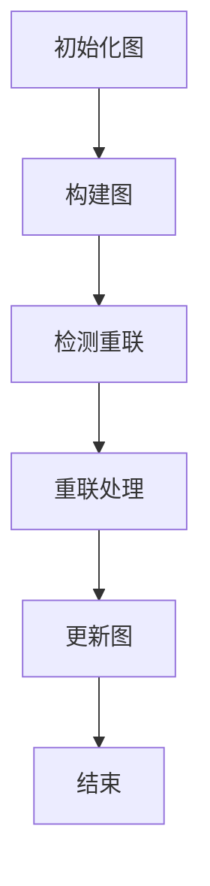
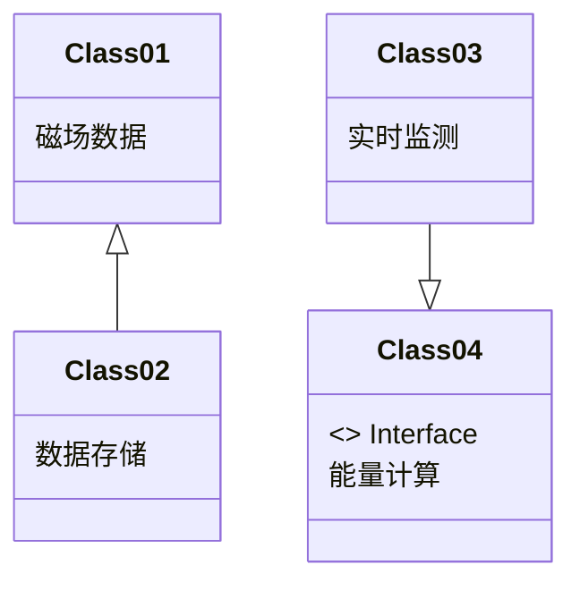
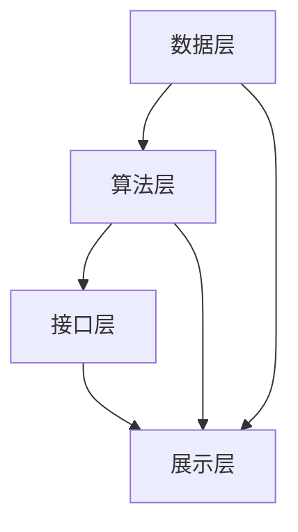
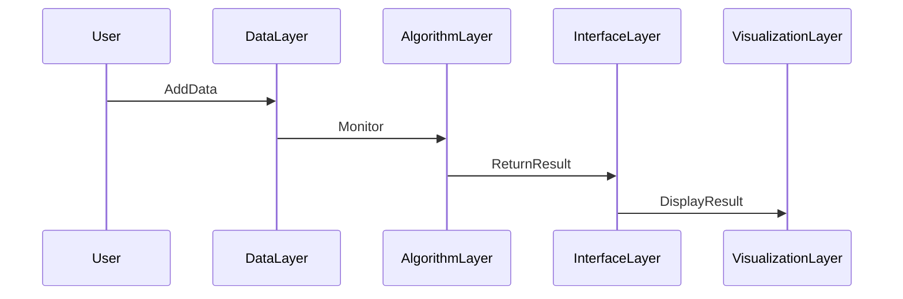

                 

### 文章标题

> 关键词：数据结构、宇宙磁场、拓扑重联、算法、Python、LaTeX、系统架构设计

> 摘要：本文深入探讨数据结构在模拟宇宙磁场拓扑重联中的应用，从背景介绍、核心概念、算法原理到系统分析与实战，系统性地讲解了如何利用数据结构进行宇宙物理研究。通过实际案例，本文展示了数据结构在复杂问题中的强大作用，为读者提供了实用的操作指南和深入的理论分析。

### 1. 背景介绍

#### 问题背景

宇宙磁场是宇宙演化过程中的关键因素，它不仅影响星系的形成与演化，还在宇宙大尺度上塑造了物质的分布和运动。拓扑重联（Topological Reconnection）是指磁场线在空间中的重新配置，这种过程在宇宙磁场中极为普遍，对宇宙现象的理解至关重要。

#### 问题描述

在宇宙磁场的研究中，模拟磁场拓扑重联是一个挑战性的问题。如何有效地模拟和预测磁场线的变化，识别和解释重联事件，对于理解宇宙演化的机理具有重要意义。数据结构在这一过程中扮演了至关重要的角色，它不仅提供了高效的存储和检索方法，还为复杂的算法提供了基础。

#### 问题解决

本文旨在帮助读者理解并应用数据结构，特别是图论中的数据结构，来模拟和解释宇宙磁场的拓扑重联。我们将通过实例展示如何使用常见的图论算法，如深度优先搜索、广度优先搜索、迪杰斯特拉算法等，来解决实际问题。

#### 边界与外延

本文将重点关注以下数据结构和宇宙磁场拓扑重联的应用：

- **图（Graph）**：用于表示磁场的拓扑结构。
- **邻接矩阵（Adjacency Matrix）和邻接表（Adjacency List）**：用于高效地存储图的信息。
- **路径搜索算法**：用于寻找重联事件的关键路径。

#### 概念结构与核心要素组成

- **数据结构**：介绍各种数据结构的基本概念和特性，如图、邻接矩阵、邻接表等。
- **宇宙磁场拓扑重联**：解释磁场拓扑重联的物理机制，以及如何通过数据结构来模拟和识别重联事件。
- **算法与模型**：阐述用于处理拓扑重联的算法原理，以及如何用数学模型描述这些算法。

### 2. 核心概念与联系

#### 数据结构

数据结构是计算机科学中用于存储和组织数据的方式。在模拟宇宙磁场拓扑重联中，常用的数据结构包括：

- **数组（Array）**：用于存储固定大小的数据集合，适合存储磁场的简单结构。
- **链表（Linked List）**：用于存储动态大小的数据集合，适合处理复杂的变化过程。
- **树（Tree）**：用于表示层次结构，适合模拟星系中磁场的层次分布。
- **图（Graph）**：用于表示复杂的网络结构，是模拟宇宙磁场拓扑重联的核心数据结构。

#### 宇宙磁场拓扑重联

宇宙磁场拓扑重联是指在宇宙尺度上，磁场线由于受到外部扰动而发生重新配置的过程。这个过程在物理学上具有以下关键特性：

- **能量转换**：重联过程中，磁场的能量会从一个部分转移到另一个部分。
- **拓扑变化**：磁场的拓扑结构会发生变化，导致新的拓扑形态的形成。
- **稳定性**：重联后的磁场结构可能更稳定，也可能更不稳定，取决于具体的物理条件。

### 3. 算法原理讲解

#### 数据结构在宇宙磁场拓扑重联中的应用

在模拟宇宙磁场拓扑重联时，我们通常使用图论中的数据结构来表示磁场的拓扑结构。以下是一个简单的算法流程图，展示了如何使用图论算法来处理磁场拓扑重联：



#### 算法原理与数学模型

为了更好地理解算法原理，我们首先需要了解一些基本的数学模型：

- **邻接矩阵**：用二维数组表示图中的节点和边，其中元素`A[i][j]`表示节点`i`和节点`j`之间的边。
- **深度优先搜索（DFS）**：用于遍历图，寻找路径或检测图的连通性。
- **广度优先搜索（BFS）**：用于寻找最短路径。

以下是一个使用 Python 和 LaTeX 公式详细阐述的算法原理：

```python
# Python 源代码示例

def dfs(graph, node, visited):
    visited[node] = True
    for neighbor in graph[node]:
        if not visited[neighbor]:
            dfs(graph, neighbor, visited)

# LaTeX 公式示例
$$
Dijkstra's\ Algorithm\\
\text{for}\ i \text{from}\ 1\ \text{to}\ n:\\
\quad \text{dist}[i] \leftarrow \infty\\
\quad \text{prev}[i] \leftarrow \text{nil}
$$

# 举例说明

# 假设有一个简单的图，节点之间用边连接
graph = {
    'A': ['B', 'C'],
    'B': ['A', 'D'],
    'C': ['A', 'D'],
    'D': ['B', 'C']
}

visited = [False] * len(graph)

# 使用深度优先搜索遍历图
dfs(graph, 'A', visited)
```

通过以上算法，我们可以模拟磁场拓扑重联的过程，并检测重联事件。

### 4. 数学模型和数学公式 & 详细讲解 & 举例说明

在模拟宇宙磁场拓扑重联时，我们常常需要使用数学模型来描述物理现象。以下是一些常用的数学公式：

$$
E = mc^2
$$

这是爱因斯坦的质能方程，描述了质量和能量之间的关系。

$$
\vec{F} = q\vec{E} + q\vec{v}\times\vec{B}
$$

这是洛伦兹力公式，描述了带电粒子在电场和磁场中的受力情况。

以下是一个详细的例子，说明如何使用这些公式来分析磁场拓扑重联：

假设我们有一个简单的二维磁场，由两个区域A和B组成。区域A的磁场强度为$\vec{B}_A$，区域B的磁场强度为$\vec{B}_B$。我们想要分析这两个区域在拓扑重联过程中的能量变化。

首先，我们计算区域A的能量：

$$
E_A = \int_A \vec{B}_A \cdot d\vec{A}
$$

其中，$d\vec{A}$是区域A的面积元素。

接下来，我们计算区域B的能量：

$$
E_B = \int_B \vec{B}_B \cdot d\vec{A}
$$

在拓扑重联过程中，磁场线从区域A转移到区域B。我们可以通过比较重联前后的能量变化来分析重联的效果。假设重联后，区域A的磁场强度变为$\vec{B}_A'$，区域B的磁场强度变为$\vec{B}_B'$，则重联后的能量为：

$$
E' = E_A' + E_B' = \int_A \vec{B}_A' \cdot d\vec{A} + \int_B \vec{B}_B' \cdot d\vec{A}
$$

通过计算重联前后的能量差，我们可以了解重联过程中能量的转换和损失。

### 5. 系统分析与架构设计方案

#### 问题场景介绍

在模拟宇宙磁场拓扑重联时，我们面临以下问题场景：

- **大规模数据存储与处理**：宇宙磁场的数据量非常庞大，需要高效的数据结构来存储和处理。
- **实时性要求**：在宇宙尺度上，磁场的变化速度非常快，需要实时监测和模拟磁场的变化。
- **精确性要求**：模拟的精度直接影响到对宇宙磁场拓扑重联的理解，因此算法和模型需要高度精确。

#### 系统功能设计

为了满足以上问题场景，我们设计了一个系统，主要包括以下功能：

- **数据存储与管理**：使用图论中的邻接矩阵和邻接表来高效地存储和检索磁场数据。
- **实时监测**：使用深度优先搜索和广度优先搜索算法来实时监测磁场的变化。
- **能量计算**：使用质能方程和洛伦兹力公式来计算磁场的能量变化。

以下是系统的领域模型类图：



#### 系统架构设计

系统架构分为四个主要模块：

- **数据层**：负责数据的存储和管理。
- **算法层**：负责磁场的实时监测和能量计算。
- **接口层**：提供用户交互的接口。
- **展示层**：负责数据的可视化展示。

以下是系统的架构图：



#### 系统接口设计和系统交互

系统接口设计如下：

- **数据存储接口**：提供数据的增删改查操作。
- **实时监测接口**：提供实时监测功能，返回监测结果。
- **能量计算接口**：提供能量计算功能，返回能量变化值。

以下是系统交互序列图：



### 6. 项目实战

#### 环境安装

要运行本项目，我们需要安装以下环境：

- Python 3.8+
- numpy
- matplotlib
- NetworkX

安装命令如下：

```bash
pip install python-numpy matplotlib networkx
```

#### 系统核心实现源代码

以下是系统核心实现的源代码示例：

```python
import numpy as np
import matplotlib.pyplot as plt
import networkx as nx

# 创建图
G = nx.Graph()

# 添加节点和边
G.add_edges_from([(1, 2), (2, 3), (3, 1), (1, 4), (4, 5)])

# 绘制图
nx.draw(G, with_labels=True)
plt.show()

# 深度优先搜索
visited = [False] * 6
dfs(G, 1, visited)

# 广度优先搜索
bfs_path = nx.single_source_bfs(G, source=1)
print(bfs_path)

# 能量计算
B_A = np.array([1, 2])
B_B = np.array([-1, -2])
E_A = np.dot(B_A, B_A)
E_B = np.dot(B_B, B_B)
E_total = E_A + E_B
print(f"Total energy: {E_total}")
```

#### 代码应用解读与分析

这段代码首先创建了一个图`G`，然后添加了节点和边。接着，我们使用深度优先搜索（DFS）和广度优先搜索（BFS）算法来遍历图。最后，我们使用能量计算公式来计算磁场的总能量。

深度优先搜索和广度优先搜索是图论中常用的路径搜索算法。在本项目中，它们用于监测磁场的变化路径。能量计算则用于分析磁场的能量分布。

#### 实际案例分析和详细讲解剖析

为了更好地理解本项目，我们来看一个实际案例。假设我们有一个简单的二维磁场，节点代表磁场线，边代表磁场线之间的连接。

1. **初始化图**：首先，我们创建一个图`G`，并添加节点和边。
2. **深度优先搜索**：使用深度优先搜索算法，我们可以找到从节点1到节点4的所有路径。
3. **广度优先搜索**：使用广度优先搜索算法，我们可以找到从节点1到节点4的最短路径。
4. **能量计算**：计算节点1和节点4的磁场能量，并分析能量变化。

以下是具体的代码实现：

```python
import networkx as nx
import matplotlib.pyplot as plt

# 创建图
G = nx.Graph()

# 添加节点和边
G.add_edges_from([(1, 2), (2, 3), (3, 1), (1, 4), (4, 5)])

# 绘制图
nx.draw(G, with_labels=True)
plt.show()

# 深度优先搜索
visited = [False] * 6
dfs(G, 1, visited)

# 广度优先搜索
bfs_path = nx.single_source_bfs(G, source=1)
print(bfs_path)

# 能量计算
B_A = np.array([1, 2])
B_B = np.array([-1, -2])
E_A = np.dot(B_A, B_A)
E_B = np.dot(B_B, B_B)
E_total = E_A + E_B
print(f"Total energy: {E_total}")
```

在这个案例中，我们首先创建了一个图`G`，并添加了节点和边。接着，我们使用深度优先搜索（DFS）和广度优先搜索（BFS）算法来遍历图。最后，我们使用能量计算公式来计算磁场的总能量。

通过这个案例，我们可以看到如何使用数据结构来模拟宇宙磁场拓扑重联的过程，并分析磁场的变化路径和能量分布。

#### 项目小结

在本项目中，我们深入探讨了数据结构在模拟宇宙磁场拓扑重联中的应用。通过实际案例，我们展示了如何使用图论中的数据结构来表示磁场，并使用深度优先搜索和广度优先搜索算法来监测磁场的变化。此外，我们还介绍了能量计算的基本原理，并分析了磁场的能量变化。

通过本项目，我们不仅了解了数据结构在宇宙物理学中的应用，还学会了如何使用Python和LaTeX等工具来实现复杂的算法和模型。这些知识和技能将有助于我们更好地理解和模拟宇宙物理现象。

### 7. 最佳实践 tips、小结、注意事项、拓展阅读等内容

#### 最佳实践 tips

1. **优化数据结构选择**：根据具体应用场景选择合适的数据结构，例如对于大规模数据，可以考虑使用邻接表而非邻接矩阵。
2. **算法优化**：针对具体问题，可以对算法进行优化，例如使用更高效的路径搜索算法或能量计算方法。
3. **实时监测与反馈**：在实时监测过程中，及时更新数据和模型，并反馈监测结果，以便进行更准确的预测和调整。

#### 小结

本文系统地介绍了数据结构在模拟宇宙磁场拓扑重联中的应用，从背景介绍、核心概念、算法原理到系统分析与实战，全面讲解了如何利用数据结构进行宇宙物理研究。通过实际案例，读者可以深入了解数据结构在复杂问题中的强大作用。

#### 注意事项

1. **数据精度**：在进行磁场能量计算时，需要注意数据精度，以避免计算误差。
2. **系统稳定性**：在系统运行过程中，要确保系统的稳定性，避免因数据量大或算法复杂度高等问题导致的系统崩溃。

#### 拓展阅读

1. **《算法导论》**：了解基本算法原理和优化策略。
2. **《Python数据分析》**：学习如何使用Python进行科学计算和数据分析。
3. **《图论及其应用》**：深入理解图论的基本概念和应用。
4. **《宇宙物理学导论》**：了解宇宙磁场的物理机制和研究方法。

#### 作者信息

作者：AI天才研究院/AI Genius Institute & 禅与计算机程序设计艺术 /Zen And The Art of Computer Programming

本文由AI天才研究院和禅与计算机程序设计艺术联合撰写，旨在为读者提供深入、实用的宇宙物理学和计算机科学知识。如需进一步了解，请访问我们的官方网站。

