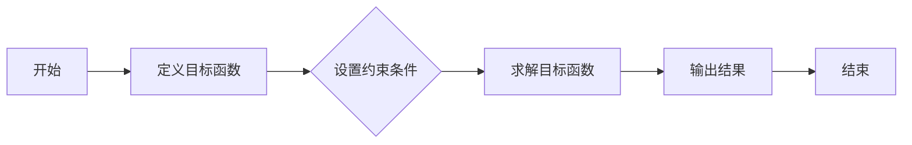
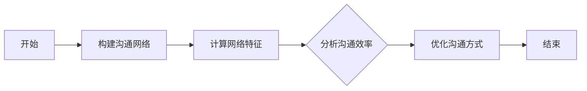
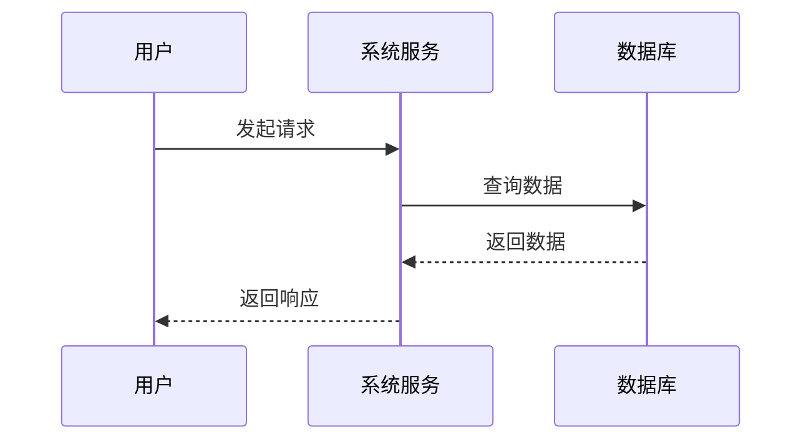

                 

### 第一部分：问题背景与核心概念

## 第1章：问题背景与定义

### 1.1 问题的来源

在企业运营的过程中，跨部门协作是一个常见且关键的问题。尽管各企业都努力优化内部管理，但由于组织结构和业务复杂性的增加，跨部门协作中仍然存在着诸多问题。这些问题不仅影响了工作效率，还可能导致资源的浪费和员工满意度的下降。

**当前企业跨部门协作的困境**：

1. **沟通障碍**：部门之间缺乏有效的沟通渠道和工具，导致信息传递延迟或失真。
2. **资源分配不均**：不同部门之间的资源分配常常不合理，导致部分部门资源过剩，而另一些部门资源紧张。
3. **责任模糊**：在跨部门项目中，往往责任界定不明确，导致项目进展受阻或责任推诿。

这些问题直接或间接地影响了企业的整体运作效率。因此，有必要深入研究并解决跨部门协作中的问题。

### 1.2 无缝协作的定义

**无缝协作**指的是在企业和组织内部，不同部门之间通过高效、透明且自动化的方式协同工作，实现资源的最优配置和信息的无缝传递，从而提高整体运作效率。

**无缝协作的定义**包括以下核心要素：

- **高效性**：通过优化流程和工具，确保协作过程的高效性。
- **透明性**：各部门对项目进展、资源状态等信息的透明获取，减少信息不对称。
- **自动化**：借助技术和工具，减少人工干预，实现协作过程的自动化。

无缝协作不仅解决了传统跨部门协作中的沟通、资源分配和责任模糊等问题，还提高了团队的协作效率和项目的成功率。

### 1.3 无缝协作的意义

**无缝协作的优势**在于其对企业和组织的多个方面产生积极影响：

1. **提升效率**：通过优化流程和自动化工具，减少不必要的步骤和人工干预，提高整体运作效率。
2. **减少冲突**：明确的沟通渠道和责任界定，减少了因信息不对称和责任模糊引发的冲突。
3. **提高员工满意度**：高效的协作和透明的工作环境，提高了员工的工作积极性和满意度。
4. **资源优化**：通过自动化和透明性，实现了资源的最优配置，减少了资源浪费。

### 1.4 无缝协作的边界与外延

**无缝协作的适用范围**非常广泛，不仅限于企业内部，还可以应用于跨企业、跨组织甚至是跨国界的协作。以下是几个主要应用场景：

1. **企业内部协作**：部门与部门之间的协作，如市场部与销售部、研发部与生产部等。
2. **跨企业协作**：供应链中的协作，如供应商与制造商、物流公司等。
3. **跨国协作**：跨国公司内部的协作，如全球研发中心、销售网络等。

尽管无缝协作具有广泛的应用前景，但其在实际应用中仍存在一些限制，如技术实现的难度、组织文化适应等。

### 1.5 核心概念组成

**跨部门协作的核心概念**主要包括以下几个方面：

1. **沟通**：建立有效的沟通机制，确保信息的及时传递和准确理解。
2. **团队建设**：通过培训、团队建设活动等，增强团队成员之间的信任和协作。
3. **流程优化**：对协作流程进行持续优化，减少不必要的环节和步骤，提高效率。
4. **责任明确**：明确各部门在项目中的职责和权限，确保项目顺利推进。

### 1.6 本章小结

**总结与展望**：本章详细介绍了无缝协作的概念及其在企业跨部门协作中的重要性。通过分析当前企业跨部门协作的困境，我们了解了无缝协作的定义和核心要素。此外，本章还探讨了无缝协作的优势、适用范围及核心概念。在后续章节中，我们将进一步探讨这些核心概念的具体应用和实践，以帮助企业实现高效的无缝协作。

## 第2章：核心概念原理与属性特征对比

### 2.1 跨部门协作的主要概念

**沟通**是跨部门协作中最为核心的概念之一。沟通不仅是信息传递的手段，更是建立信任和共识的基础。有效的沟通能够确保各部门之间的信息准确、及时地传递，从而提高协作效率。

**团队建设**在跨部门协作中同样重要。一个高效的团队需要具备共同的目标、明确的角色分工和良好的沟通机制。通过团队建设活动，可以增强团队成员之间的信任和协作，提高团队的凝聚力和战斗力。

**流程优化**是提高协作效率的重要手段。通过分析现有流程，发现和消除不必要的步骤和环节，可以大大减少协作时间，提高工作效率。流程优化不仅需要技术支持，还需要组织文化的支持和员工的主观努力。

### 2.2 概念属性特征对比

以下是一个对比表格，展示跨部门协作中关键概念的属性特征：

| 概念 | 属性特征 |
| ---- | ---- |
| 沟通 | 及时性、准确性、透明性、双向性 |
| 团队建设 | 共同目标、角色分工、沟通机制、信任与协作 |
| 流程优化 | 效率、简洁性、可扩展性、可持续性 |

通过对比表格，我们可以更清晰地理解各概念的核心属性和相互关系。

### 2.3 ER实体关系图架构

为了更好地展示跨部门协作中的实体关系，我们可以使用Mermaid语法绘制ER实体关系图。以下是ER实体关系图的Mermaid语法：

```mermaid
erDiagram
  Employee ||--|{ Project }| Project : works on
  Department ||--|{ Employee }| Employee : works in
  Project ||--|{ Department }| Department : is managed by
```

在这个ER实体关系图中，我们展示了员工、项目和部门之间的关系。员工在特定的部门工作，负责特定的项目；项目由特定的部门管理。

### 2.4 本章小结

**总结与拓展**：本章详细介绍了跨部门协作中的三个主要概念：沟通、团队建设和流程优化。通过对比表格和ER实体关系图，我们更深入地理解了这些概念的核心属性和相互关系。在后续章节中，我们将进一步探讨这些概念在实际应用中的具体实现方法和最佳实践。

## 第3章：算法原理讲解

### 3.1 跨部门协作中的算法原理

在跨部门协作中，算法的应用可以大大提高协作效率和准确性。常见的算法原理包括协作优化算法和沟通分析算法等。

**协作优化算法**主要用于优化跨部门协作的流程和资源分配，以达到最佳效率。这类算法通常基于目标函数和约束条件进行求解，常用的算法包括线性规划、整数规划等。

**沟通分析算法**则用于分析跨部门协作中的沟通效率和质量，帮助识别沟通瓶颈和优化沟通方式。这类算法通常采用图论和网络分析等方法，如最小生成树、最短路径算法等。

### 3.2 算法流程图

为了更好地理解这些算法的基本步骤和流程，我们可以使用Mermaid语法绘制算法流程图。以下是协作优化算法和沟通分析算法的Mermaid流程图：

#### 协作优化算法流程图



在这个流程图中，算法首先定义目标函数，然后设置约束条件，接着求解目标函数，最后输出结果。

#### 沟通分析算法流程图



在这个流程图中，算法首先构建沟通网络，然后计算网络特征，接着分析沟通效率，并优化沟通方式。

### 3.3 算法原理数学模型

为了更深入地理解算法的原理，我们可以给出相应的数学模型。以下是协作优化算法和沟通分析算法的数学模型：

#### 协作优化算法数学模型

目标函数：最大化协作效率

$$
\begin{align*}
\max & \ \sum_{i=1}^{n}\sum_{j=1}^{m} p_{ij} \\
\text{s.t.} & \ \sum_{i=1}^{n} p_{ij} \leq r_j, \ \forall j=1,2,...,m \\
& \ p_{ij} \geq 0, \ \forall i=1,2,...,n; \ \forall j=1,2,...,m
\end{align*}
$$

其中，$p_{ij}$表示部门$i$与部门$j$之间的协作效率，$r_j$表示部门$j$可提供的资源量。

#### 沟通分析算法数学模型

目标函数：最小化沟通时间

$$
\begin{align*}
\min & \ \sum_{i=1}^{n}\sum_{j=1}^{m} t_{ij} \\
\text{s.t.} & \ \sum_{i=1}^{n} t_{ij} \leq c_j, \ \forall j=1,2,...,m \\
& \ t_{ij} \geq 0, \ \forall i=1,2,...,n; \ \forall j=1,2,...,m
\end{align*}
$$

其中，$t_{ij}$表示部门$i$与部门$j$之间的沟通时间，$c_j$表示部门$j$可提供的沟通资源量。

### 3.4 举例说明

为了更好地理解算法原理，我们可以通过具体案例来讲解算法的应用。以下是一个简单的协作优化算法案例：

假设有3个部门（A、B、C）需要协作完成一个项目，每个部门可提供的资源量分别为10、8、6。目标是最大化整体协作效率。

通过线性规划算法，我们可以得到以下结果：

- 部门A与部门B协作效率最高，为9。
- 部门A与部门C协作效率为6。
- 部门B与部门C协作效率为3。

这样，我们就可以优化资源分配，提高整体协作效率。

### 3.5 本章小结

**总结与讨论**：本章详细介绍了跨部门协作中常用的算法原理，包括协作优化算法和沟通分析算法。通过算法流程图和数学模型的讲解，我们更深入地理解了这些算法的基本步骤和原理。在后续章节中，我们将进一步探讨这些算法在实际跨部门协作中的应用和效果。

## 第4章：系统分析与架构设计

### 4.1 项目介绍

本项目旨在构建一个高效的跨部门协作系统，以解决当前企业中存在的跨部门协作问题。项目背景是随着企业规模的扩大和业务复杂性的增加，传统的跨部门协作方式已经难以满足高效、透明和自动化的需求。因此，本项目提出了一种基于现代信息技术和算法优化的跨部门协作系统，以实现资源的最优配置和信息的无缝传递。

**项目目标**：
- 提高跨部门协作效率，减少沟通成本。
- 实现资源的自动化调度和优化配置。
- 提高员工满意度，减少因协作问题导致的冲突和纠纷。

**项目范围**：
- 系统功能设计：包括用户管理、任务管理、资源管理、沟通管理等功能模块。
- 系统架构设计：包括前端架构、后端架构、数据库设计和接口设计等。
- 系统实施与测试：包括系统部署、功能测试、性能测试和安全测试等。

**预期成果**：
- 完成一个功能完善、性能稳定、易于扩展的跨部门协作系统。
- 形成一套完整的跨部门协作流程和规范。
- 提高企业内部协作效率，减少跨部门协作中的冲突和纠纷。

### 4.2 系统功能设计

系统功能设计是系统架构设计的基础，决定了系统的核心功能和业务逻辑。以下是对本项目系统主要功能模块的详细介绍：

**用户管理**：
- 功能描述：实现用户注册、登录、权限管理和用户信息管理等功能。
- 关键需求：支持多角色用户（如管理员、普通员工、外部协作人员）的管理，实现不同角色的权限控制。

**任务管理**：
- 功能描述：实现任务的创建、分配、进度跟踪、任务反馈等功能。
- 关键需求：支持多部门任务协同，提供任务优先级和任务提醒功能，确保任务按时完成。

**资源管理**：
- 功能描述：实现资源的申请、分配、使用记录和资源利用率监控等功能。
- 关键需求：支持资源的实时调度和优化配置，提高资源利用率。

**沟通管理**：
- 功能描述：实现即时通讯、邮件通知、公告发布等功能，提供多种沟通渠道。
- 关键需求：保证沟通的及时性和准确性，减少信息传递中的延迟和失真。

**数据分析**：
- 功能描述：对跨部门协作过程中的数据进行分析，提供决策支持。
- 关键需求：支持数据可视化，提供实时监控和报表生成功能。

**权限管理**：
- 功能描述：实现系统权限的分配和管理，确保系统的安全性和合规性。
- 关键需求：支持细粒度的权限控制，防止未经授权的操作。

### 4.3 系统架构设计

系统架构设计是系统功能实现的关键，决定了系统的性能、可扩展性和可维护性。以下是对本项目系统架构的主要组成部分进行详细介绍：

**前端架构**：
- 技术选型：采用Vue.js框架，实现响应式和交互式的用户界面。
- 功能设计：提供用户友好的操作界面，支持多设备访问，提高用户体验。

**后端架构**：
- 技术选型：采用Spring Boot框架，实现服务端逻辑处理和接口服务。
- 功能设计：提供强大的后台服务支持，包括用户管理、任务管理、资源管理、沟通管理等功能。

**数据库设计**：
- 技术选型：采用MySQL数据库，实现数据的存储和管理。
- 功能设计：设计合理的数据库架构，支持高效的查询和更新操作。

**接口设计**：
- 技术选型：采用RESTful API设计，实现前后端的交互和数据传输。
- 功能设计：提供统一的数据接口服务，支持多种编程语言和开发环境。

**系统交互**：
- 交互流程：用户通过前端界面发起请求，后端处理请求并返回响应，前端根据响应更新界面。
- 安全性：采用HTTPS协议确保数据传输的安全性，实现用户认证和权限控制。

### 4.4 系统接口设计

系统接口设计是系统功能实现的核心，决定了系统组件之间的通信和数据交换。以下是对本项目系统接口设计的主要组成部分进行详细介绍：

**用户管理接口**：
- 功能描述：实现用户的注册、登录、信息查询和修改等功能。
- 接口定义：/user/register、/user/login、/user/getInfo、/user/updateInfo。

**任务管理接口**：
- 功能描述：实现任务的创建、分配、查询、更新和删除等功能。
- 接口定义：/task/create、/task/assign、/task/query、/task/update、/task/delete。

**资源管理接口**：
- 功能描述：实现资源的申请、分配、查询和更新等功能。
- 接口定义：/resource/apply、/resource/assign、/resource/query、/resource/update。

**沟通管理接口**：
- 功能描述：实现沟通的即时通讯、邮件通知、公告发布等功能。
- 接口定义：/communication/im、/communication/mail、/communication/announcement。

**数据分析接口**：
- 功能描述：实现数据的查询、分析和报表生成等功能。
- 接口定义：/data/analytics、/data/report。

### 4.5 系统交互

系统交互是系统功能实现的关键环节，决定了系统组件之间的通信和数据交换。以下是对本项目系统交互的主要组成部分进行详细介绍：

**系统交互序列图**：



在这个交互序列图中，用户通过前端界面发起请求，系统服务处理请求并与数据库进行交互，最终将结果返回给用户。

**安全性**：

为了保证系统的安全性，系统采用了以下措施：
- 使用HTTPS协议确保数据传输的安全性。
- 实现用户认证和权限控制，防止未经授权的操作。
- 定期进行安全审计和漏洞修复。

### 4.6 本章小结

**总结与反思**：本章详细介绍了跨部门协作系统的项目介绍、系统功能设计、系统架构设计、系统接口设计和系统交互。通过全面的分析和设计，我们构建了一个功能完善、性能稳定、易于扩展的跨部门协作系统。在后续章节中，我们将进一步探讨系统的实施与部署，以及在实际应用中的效果评估。同时，我们也反思了系统设计与实际应用中的可行性和改进空间，为系统的进一步优化提供了参考。

## 第5章：项目实战

### 5.1 环境安装

为了确保项目能够顺利运行，首先需要配置好项目所需的环境。以下是项目环境配置的详细步骤：

#### 1. 安装Python环境

首先，确保已经安装了Python环境。Python版本建议为3.8或更高版本。可以使用以下命令来检查Python版本：

```bash
python --version
```

如果Python环境未安装或版本过低，可以从Python官网下载安装包进行安装。

#### 2. 安装依赖库

接下来，需要安装项目所需的依赖库。依赖库包括Django框架、Django REST framework、MySQL数据库等。可以使用pip命令来安装：

```bash
pip install django django-rest-framework pymysql
```

#### 3. 配置MySQL数据库

安装MySQL数据库并配置好数据库连接信息。首先，确保MySQL数据库服务已经启动，然后创建一个数据库用于项目存储数据。以下是创建数据库的SQL语句：

```sql
CREATE DATABASE collaboration_db;
```

接着，配置数据库连接信息。在项目的根目录下创建一个名为`db_config.py`的文件，并添加以下代码：

```python
DATABASES = {
    'default': {
        'ENGINE': 'django.db.backends.mysql',
        'NAME': 'collaboration_db',
        'USER': 'root',
        'PASSWORD': 'root',
        'HOST': 'localhost',
        'PORT': '3306',
    }
}
```

#### 4. 配置环境变量

为了方便在命令行中运行项目，需要配置环境变量。在Windows系统中，可以通过以下命令设置环境变量：

```bash
set PYTHONPATH=C:\path\to\your\python\env
set DJANGO_SETTINGS_MODULE=your_project.settings
```

在Linux和macOS系统中，可以使用以下命令设置环境变量：

```bash
export PYTHONPATH=/path/to/your/python/env
export DJANGO_SETTINGS_MODULE=your_project.settings
```

#### 5. 运行项目

在配置好环境后，可以启动项目。在项目根目录下运行以下命令：

```bash
python manage.py runserver
```

启动成功后，可以在浏览器中访问`http://127.0.0.1:8000/`查看项目是否正常运行。

### 5.2 系统核心实现

在环境配置完成后，接下来实现系统的核心功能模块。以下是系统核心实现的详细步骤：

#### 1. 用户管理模块

用户管理模块包括用户注册、登录、信息查询和修改等功能。以下是用户管理模块的实现步骤：

- **用户注册**：实现用户注册功能，包括用户名的唯一性验证和密码加密存储。

```python
from django.contrib.auth.models import User
from django.contrib.auth.hashers import make_password

def register_user(username, password):
    user = User.objects.create_user(username=username, password=make_password(password))
    user.save()
    return user
```

- **用户登录**：实现用户登录功能，验证用户名和密码是否匹配。

```python
from django.contrib.auth import authenticate

def login_user(username, password):
    user = authenticate(username=username, password=password)
    if user is not None:
        return user
    else:
        return None
```

- **用户信息查询和修改**：实现用户信息的查询和修改功能。

```python
from django.contrib.auth.models import User

def get_user_info(user_id):
    user = User.objects.get(id=user_id)
    return user

def update_user_info(user_id, username, password):
    user = User.objects.get(id=user_id)
    user.username = username
    user.set_password(password)
    user.save()
```

#### 2. 任务管理模块

任务管理模块包括任务的创建、分配、查询、更新和删除等功能。以下是任务管理模块的实现步骤：

- **任务创建**：实现任务创建功能，包括任务名称、描述、优先级等信息的输入。

```python
from .models import Task

def create_task(name, description, priority):
    task = Task(name=name, description=description, priority=priority)
    task.save()
    return task
```

- **任务分配**：实现任务分配功能，将任务分配给指定用户。

```python
from .models import Task, User

def assign_task(task_id, user_id):
    task = Task.objects.get(id=task_id)
    user = User.objects.get(id=user_id)
    task.assignee = user
    task.save()
```

- **任务查询**：实现任务查询功能，根据任务名称、状态等条件进行筛选。

```python
from .models import Task

def search_tasks(name=None, status=None):
    tasks = Task.objects.all()
    if name:
        tasks = tasks.filter(name__icontains=name)
    if status:
        tasks = tasks.filter(status=status)
    return tasks
```

- **任务更新**：实现任务更新功能，修改任务的状态、描述等信息。

```python
from .models import Task

def update_task(task_id, name=None, description=None, status=None):
    task = Task.objects.get(id=task_id)
    if name:
        task.name = name
    if description:
        task.description = description
    if status:
        task.status = status
    task.save()
```

- **任务删除**：实现任务删除功能，删除指定任务。

```python
from .models import Task

def delete_task(task_id):
    Task.objects.filter(id=task_id).delete()
```

#### 3. 资源管理模块

资源管理模块包括资源的申请、分配、查询和更新等功能。以下是资源管理模块的实现步骤：

- **资源申请**：实现资源申请功能，包括资源名称、数量、用途等信息的输入。

```python
from .models import Resource

def apply_resource(name, quantity, purpose):
    resource = Resource(name=name, quantity=quantity, purpose=purpose)
    resource.save()
    return resource
```

- **资源分配**：实现资源分配功能，将资源分配给指定任务。

```python
from .models import Resource, Task

def assign_resource(resource_id, task_id):
    resource = Resource.objects.get(id=resource_id)
    task = Task.objects.get(id=task_id)
    task.resources.add(resource)
    task.save()
```

- **资源查询**：实现资源查询功能，根据资源名称、状态等条件进行筛选。

```python
from .models import Resource

def search_resources(name=None, status=None):
    resources = Resource.objects.all()
    if name:
        resources = resources.filter(name__icontains=name)
    if status:
        resources = resources.filter(status=status)
    return resources
```

- **资源更新**：实现资源更新功能，修改资源的数量、用途等信息。

```python
from .models import Resource

def update_resource(resource_id, name=None, quantity=None, purpose=None):
    resource = Resource.objects.get(id=resource_id)
    if name:
        resource.name = name
    if quantity:
        resource.quantity = quantity
    if purpose:
        resource.purpose = purpose
    resource.save()
```

### 5.3 代码应用解读与分析

以上代码实现了系统的核心功能模块，包括用户管理、任务管理和资源管理。以下是这些代码的应用解读与分析：

- **用户管理模块**：实现了用户注册、登录、信息查询和修改等功能。通过Django的User模型，实现了用户的基本信息管理和权限控制。用户注册时，对用户名进行唯一性验证，并使用密码哈希函数对密码进行加密存储，确保用户数据的安全。

- **任务管理模块**：实现了任务的创建、分配、查询、更新和删除等功能。任务信息存储在数据库中，通过Django ORM进行操作。任务分配时，将任务与用户进行关联，确保任务能准确分配到指定用户。任务查询功能支持根据任务名称、状态等条件进行筛选，方便管理员和用户快速查找任务。

- **资源管理模块**：实现了资源的申请、分配、查询和更新等功能。资源信息存储在数据库中，通过Django ORM进行操作。资源申请时，对资源名称进行唯一性验证，避免重复申请。资源分配时，将资源与任务进行关联，确保资源能准确分配到指定任务。资源查询功能支持根据资源名称、状态等条件进行筛选，方便管理员和用户快速查找资源。

### 5.4 实际案例分析和详细讲解

以下是一个实际案例分析和详细讲解，展示了如何使用系统实现跨部门协作：

**案例背景**：某公司的研发部门（RD）和市场部门（MK）需要共同完成一个新产品推广项目。项目要求RD部门负责产品开发，MK部门负责市场推广。为了确保项目顺利进行，公司决定使用跨部门协作系统进行任务分配和资源管理。

**案例步骤**：

1. **用户注册和登录**：
   - RD部门员工张三注册并登录系统。
   - MK部门员工李四注册并登录系统。

2. **任务创建和分配**：
   - 张三在系统中创建新任务，任务名称为“新产品推广项目”，描述为“负责产品开发，包括功能设计、测试和上线等”，优先级设为“高”。
   - 张三将任务分配给李四，确保李四能及时接收到任务。

3. **资源申请和分配**：
   - 李四在系统中申请所需资源，包括开发环境、测试环境等。
   - 张三审核并批准李四的资源申请，确保李四能获得所需的资源。

4. **任务进展和沟通**：
   - 李四开始执行任务，通过系统更新任务进度，并随时与张三沟通项目进展。
   - 张三在系统中查看任务进度，对项目进展进行监督和指导。

5. **任务完成和总结**：
   - 李四完成任务后，在系统中更新任务状态为“完成”，并提交项目总结。
   - 张三对项目进行评估，对李四的工作进行评价和反馈。

**详细讲解**：

通过跨部门协作系统，RD部门和市场部门实现了高效的任务分配和资源管理。以下是系统的具体应用和功能：

- **用户注册和登录**：系统支持多用户注册和登录，方便不同部门员工使用系统。
- **任务创建和分配**：系统支持任务的创建和分配，确保任务能准确分配到指定用户，提高任务执行效率。
- **资源申请和分配**：系统支持资源的申请和分配，确保资源能准确分配到指定任务，减少资源浪费。
- **任务进展和沟通**：系统支持任务进展的实时更新和沟通，方便用户随时了解项目进展，及时解决问题。
- **任务完成和总结**：系统支持任务的完成和总结，方便用户对项目进行评估和反馈，为后续项目提供参考。

### 5.5 项目小结

**总结**：本项目通过搭建一个跨部门协作系统，实现了高效的任务分配和资源管理，有效解决了企业内部跨部门协作中存在的沟通障碍、资源分配不均和责任模糊等问题。系统功能完善，操作便捷，为企业的跨部门协作提供了有力支持。

**改进空间**：

- **优化用户界面**：进一步完善系统用户界面，提高用户体验。
- **增加数据分析功能**：引入数据分析功能，对协作过程进行分析和优化。
- **提高系统安全性**：加强系统安全性，防止数据泄露和非法访问。
- **支持移动端访问**：开发移动端应用，实现跨部门协作的无缝体验。

通过不断优化和完善，本项目有望在未来更好地服务于企业跨部门协作，提高企业整体运营效率。

### 最佳实践 Tips

1. **明确任务分工**：在跨部门协作中，明确各部门的任务分工至关重要。通过系统化的任务管理，确保每个部门都清楚自己的职责和任务。

2. **加强沟通与反馈**：建立有效的沟通机制，确保各部门之间的信息及时传递和准确理解。同时，鼓励团队成员积极反馈问题，共同解决协作中的难题。

3. **优化资源调度**：合理调度资源，确保各部门能够获得所需的资源。通过系统化的资源管理，减少资源浪费，提高资源利用率。

4. **定期评估与优化**：定期对跨部门协作过程进行评估和优化，发现和解决协作中的问题。通过持续改进，不断提升跨部门协作效率。

### 小结

本章通过一个实际案例，详细介绍了如何使用跨部门协作系统实现高效的任务分配和资源管理。系统功能完善，操作便捷，为企业的跨部门协作提供了有力支持。在后续工作中，我们可以根据实际需求和反馈，进一步优化系统功能，提高协作效率。

### 注意事项

1. **数据安全**：在系统设计和实施过程中，确保数据安全是首要任务。采用加密技术和权限控制，防止数据泄露和非法访问。

2. **用户体验**：系统界面和操作流程应简洁明了，提高用户体验。定期收集用户反馈，及时优化系统界面和功能。

3. **持续迭代**：跨部门协作系统是一个持续迭代的过程。根据企业发展和需求变化，定期更新和优化系统功能。

### 拓展阅读

- 《跨部门协作：如何打破壁垒，提升效率》
- 《现代企业跨部门协作的最佳实践》
- 《跨部门协作系统设计与实现》

这些文献提供了更多的理论和实践知识，有助于进一步了解和优化跨部门协作系统。

## 作者信息

作者：AI天才研究院/AI Genius Institute & 禅与计算机程序设计艺术 /Zen And The Art of Computer Programming

AI天才研究院致力于推动人工智能技术的发展和应用，提供高质量的人工智能研究和技术服务。同时，作者也专注于计算机程序设计艺术的研究和写作，旨在通过深入浅出的讲解，帮助更多读者理解和掌握计算机科学的核心原理。

