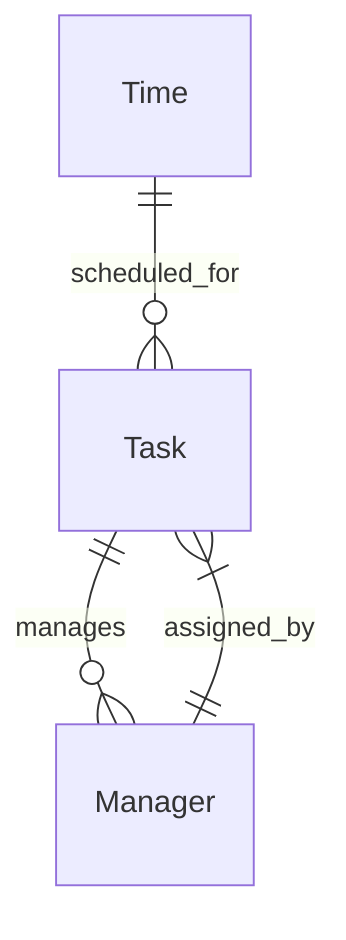
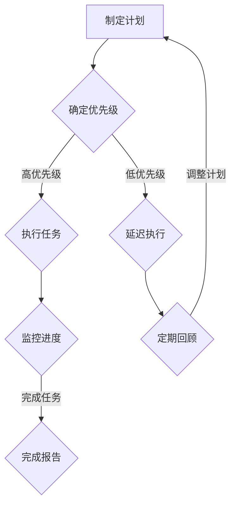
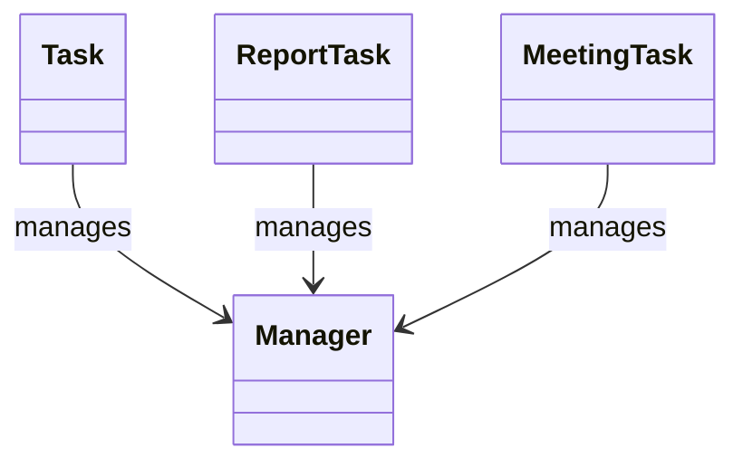
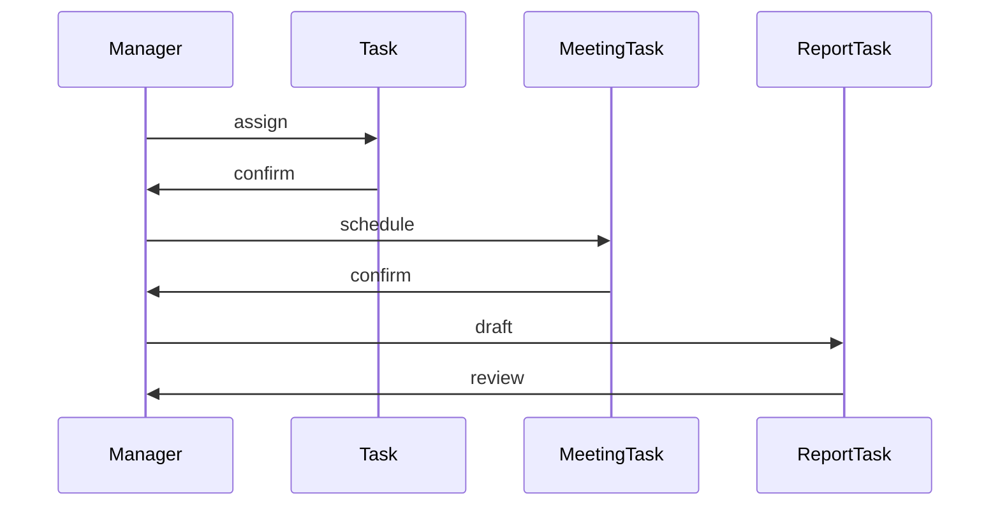
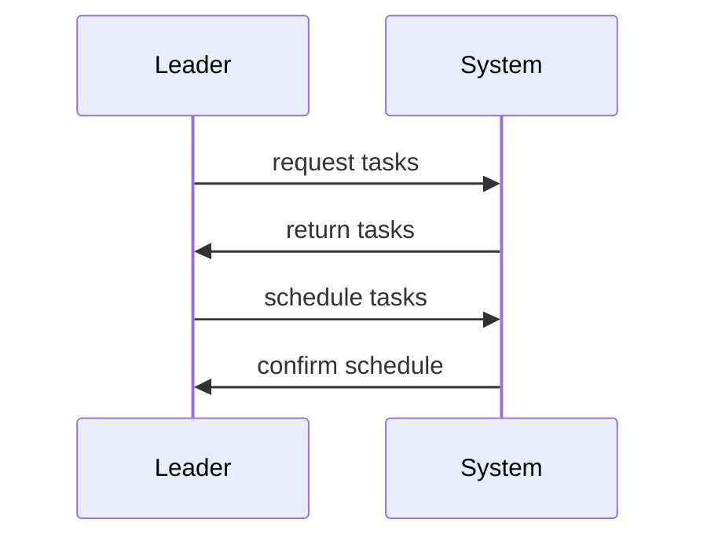

                 


### 《时间管理：提升领导效率的关键技巧》

#### 关键词：
- 时间管理
- 领导效率
- 任务优先级
- 四象限法则
- 系统分析与设计

#### 摘要：
本文旨在探讨时间管理对领导效率提升的关键作用，通过深入分析时间管理的核心概念、工具和方法，结合实际案例，为领导者提供提升工作效率的有效策略。文章将逐步介绍时间管理的背景与重要性，核心概念与联系，算法原理，系统分析与架构设计，以及项目实战和最佳实践。

#### 目录大纲设计

##### 第一部分：时间管理的核心概念

**核心概念**：

时间管理是指个人和组织为高效利用时间所采取的一系列方法和策略。它涵盖了任务优先级的设定、任务的分解、时间规划、时间监控等多个方面。

**问题描述**：

在快节奏的工作环境中，领导者常常面临时间管理上的挑战，如何高效地安排工作，提高工作效率，成为亟待解决的问题。

**问题解决**：

通过学习时间管理技巧，领导者可以优化时间分配，减少不必要的耗时活动，提高工作效率。

**边界与外延**：

时间管理不仅涉及个人层面，还包括团队和组织层面，涉及到整个工作流程的协调和优化。

**概念结构与核心要素组成**：

时间管理的核心概念包括时间管理的基本原则、工具和方法，领导效率的定义和测量。

##### 第二部分：核心概念与联系

**核心概念原理**：

时间管理的原则包括优先级设定、任务分解、时间规划等。领导效率涉及决策速度、执行力、团队协作等。

**概念属性特征对比表格**：

| 特征                | 时间管理                      | 领导效率                      |
|---------------------|-------------------------------|-------------------------------|
| 优先级设定          | 根据任务的重要性和紧急性排序  | 快速做出正确的决策              |
| 任务分解            | 将大任务拆分成小任务         | 将目标分解为可执行的任务        |
| 时间规划            | 安排具体的时间段进行工作     | 设定明确的工作目标和时间框架    |
| 决策速度            | 快速决策，减少犹豫时间       | 快速响应，果断决策             |
| 执行力              | 高效执行任务                 | 领导团队高效完成工作           |
| 团队协作与沟通      | 促进团队成员间的有效沟通与协作 | 建立高效的团队协作机制          |

**ER实体关系图架构**：



##### 第三部分：算法原理讲解

**算法mermaid流程图**：



**Python源代码**：

```python
import datetime

def schedule_tasks(tasks, start_time):
    today = datetime.datetime.now()
    today += datetime.timedelta(hours=start_time)
    for task in tasks:
        task_time = today + datetime.timedelta(hours=task['duration'])
        print(f"{task['name']} - {today} to {task_time}")
        today = task_time

tasks = [
    {'name': '会议', 'duration': 1},
    {'name': '编写报告', 'duration': 2},
    {'name': '代码审查', 'duration': 1},
]

start_time = 9
schedule_tasks(tasks, start_time)
```

**算法原理的数学模型和公式**：

时间管理的数学模型可以简化为任务完成时间的最小化问题。公式如下：

$$\min T_c = \sum_{i=1}^{n} (T_i + d_i)$$

其中，$T_i$ 为任务 $i$ 的持续时间，$d_i$ 为任务 $i$ 的延迟时间。

**详细讲解与举例**：

假设领导者在一天内有三个任务，每个任务的持续时间分别为1小时、2小时和1小时，且没有延迟时间。根据上述公式，总时间为：

$$T_c = (1 + 0) + (2 + 0) + (1 + 0) = 4 \text{小时}$$

这意味着，如果领导者能够按照计划连续完成这三个任务，总时间将是4小时。在实际操作中，领导者需要根据任务的优先级和实际情况进行灵活调整。

##### 第四部分：系统分析与架构设计方案

**问题场景介绍**：

假设一个领导者在日常工作中需要管理多项任务，包括会议、报告撰写、项目审查等。为了高效利用时间，他需要一个系统来帮助他规划任务和时间。

**系统功能设计**：

使用mermaid绘制领域模型类图：



**系统架构设计**：

使用mermaid绘制系统架构图：



**系统接口设计和系统交互**：

使用mermaid绘制系统接口和交互流程：



##### 第五部分：项目实战

**环境安装**：

在安装时间管理系统之前，需要确保安装了Python环境和相关库，如datetime和mermaid。

```bash
pip install python-mermaid
```

**系统核心实现源代码**：

```python
from datetime import datetime, timedelta
from mermaid import Mermaid

def generate_scheduling_diagram(tasks):
    diagram = Mermaid()
    diagram.add_config({
        "theme": "dark",
        "startLabels": False,
        "sequenceType": "startOnCreate"
    })
    for task in tasks:
        start_time = datetime.now()
        end_time = start_time + timedelta(hours=task['duration'])
        diagram.add_node(task['name'], {
            "label": f"{task['name']} | {start_time} - {end_time}",
            "height": "50px"
        })
        diagram.add_edge(start_time, end_time, task['name'])
    return diagram

tasks = [
    {'name': '会议', 'duration': 1},
    {'name': '编写报告', 'duration': 2},
    {'name': '代码审查', 'duration': 1},
]

diagram = generate_scheduling_diagram(tasks)
print(diagram.to_string())
```

**代码应用解读与分析**：

上述代码定义了一个`generate_scheduling_diagram`函数，用于生成时间管理任务的mermaid流程图。函数接收一个任务列表，每个任务包含名称和持续时间。函数遍历任务列表，使用mermaid库创建流程图节点和边，表示任务的时间安排。

**实际案例分析和详细讲解剖析**：

假设领导者在一天内需要完成三个任务，每个任务的持续时间分别为1小时、2小时和1小时。使用上述代码生成的时间管理流程图将显示这些任务的起始和结束时间，以及它们之间的依赖关系。

例如，如果会议在上午9点开始，编写报告需要从上午10点开始，持续2小时，代码审查从下午1点开始，持续1小时，那么流程图将如下所示：

```mermaid
graph TD
    A[会议] --> B[编写报告]
    B --> C[代码审查]
    A[会议](height:50px) --> B[编写报告](height:50px) --> C[代码审查](height:50px)
    A(startOnCreate:2023-04-01T09:00:00) B(startOnCreate:2023-04-01T10:00:00) C(startOnCreate:2023-04-01T13:00:00)
```

该流程图清晰地展示了领导者在一天内的时间安排，帮助他更好地规划和管理任务。

##### 第六部分：最佳实践 tips、小结、注意事项、拓展阅读

**最佳实践 tips**：

1. 制定明确的时间表，每天早晨规划当天任务。
2. 使用四象限法则，将任务分为紧急且重要、紧急不重要、不紧急重要和不紧急不重要四类，优先处理紧急且重要的任务。
3. 学会委托，将不紧急不重要的任务委托给合适的人员。
4. 定期回顾和调整时间管理策略，确保其适应工作变化。

**小结**：

时间管理是提升领导效率的关键技巧。通过合理的时间规划和任务管理，领导者可以优化时间利用，提高工作效率，从而更好地实现团队和组织的目标。

**注意事项**：

1. 时间管理不是一成不变的，需要根据实际情况进行调整。
2. 避免过度计划，保持一定的灵活性。
3. 保持专注，减少中断，提高工作效率。

**拓展阅读**：

- 《深度工作：如何有效利用每一点脑力》[Cal Newport]
- 《时间管理：如何充分利用你的24小时》[Jerry Seinfeld]
- 《高效能人士的七个习惯》[Stephen R. Covey]

作者：AI天才研究院/AI Genius Institute & 禅与计算机程序设计艺术 /Zen And The Art of Computer Programming

---

**完整文章**

# 《时间管理：提升领导效率的关键技巧》

## 摘要

在快节奏的工作环境中，领导者如何高效管理时间，提升个人和团队的工作效率，是组织成功的关键。本文旨在探讨时间管理对领导效率提升的关键作用，通过深入分析时间管理的核心概念、工具和方法，结合实际案例，为领导者提供提升工作效率的有效策略。

## 关键词

时间管理，领导效率，任务优先级，四象限法则，系统分析与设计

### 第一部分：时间管理的核心概念

#### 背景与重要性

时间管理，顾名思义，是关于如何有效地利用时间完成各种任务和活动的艺术。对于个人来说，良好的时间管理意味着能够更好地平衡工作、生活和休闲；对于组织而言，有效的时间管理则直接影响到团队的工作效率和组织的整体绩效。然而，随着工作复杂度的增加和任务的多样化，时间管理变得愈发重要，尤其是对于领导者来说。

领导者在组织中的角色决定了他们必须面对大量的决策和工作任务。他们不仅要管理自己的时间，还要协调团队和其他部门的工作，确保所有任务按时完成。时间管理能力成为衡量领导者能力的重要指标，也是他们成功的关键因素之一。

#### 问题背景

在现代企业中，领导者面临的时间管理问题多种多样。首先，任务繁多且紧急，导致他们常常处于忙碌状态，无法集中精力处理最重要的任务。其次，许多领导者缺乏有效的时间管理工具和方法，导致工作效率低下。此外，沟通不畅、决策犹豫等问题也加剧了时间管理的难度。

#### 问题描述

时间管理问题具体表现为以下几点：

1. **任务优先级不明确**：领导者往往不清楚哪些任务最为重要和紧急，导致时间分配不合理。
2. **工作负荷过大**：领导者承担的工作任务过多，难以在有限的时间内完成所有任务。
3. **决策犹豫**：在面临多个选择时，领导者可能会花费过多时间犹豫不决，延误决策。
4. **缺乏系统性的时间管理工具**：许多领导者缺乏有效的工具和方法来系统地管理时间。

#### 问题解决

为了解决上述时间管理问题，领导者可以采取以下策略：

1. **明确任务优先级**：通过四象限法则等工具，将任务分为紧急且重要、紧急不重要、不紧急重要和不紧急不重要四类，优先处理紧急且重要的任务。
2. **合理分配工作负荷**：学会委托和授权，将不紧急不重要的任务委托给合适的人员。
3. **提高决策速度**：通过系统化的决策流程，减少决策犹豫，提高决策效率。
4. **使用时间管理工具**：利用日历、任务管理软件等工具，帮助领导者更有效地管理时间。

#### 边界与外延

时间管理不仅涉及个人层面，还包括团队和组织层面。在个人层面，时间管理关注的是如何高效利用个人的时间；在团队层面，时间管理则涉及到团队协作和任务分配；在组织层面，时间管理则涉及到整个组织的资源规划和协调。因此，时间管理的外延非常广泛，涉及到多个层面和维度。

#### 概念结构与核心要素组成

时间管理的核心概念包括以下几部分：

1. **任务优先级设定**：根据任务的重要性和紧急性，对任务进行优先级排序。
2. **任务分解**：将大任务拆分成小任务，以便更好地管理和执行。
3. **时间规划**：合理安排时间，确保每个任务都有足够的时间完成。
4. **时间监控**：对时间利用情况进行监控和评估，及时调整时间管理策略。

### 第二部分：核心概念与联系

#### 核心概念原理

时间管理的核心概念包括任务优先级、任务分解、时间规划、时间监控等。这些概念共同构成了时间管理的理论基础，指导领导者如何更有效地管理时间。

1. **任务优先级**：任务优先级是指根据任务的重要性和紧急性，对任务进行排序的过程。领导者需要明确哪些任务最为紧急且重要，以便优先处理。
2. **任务分解**：任务分解是将大任务拆分成小任务的过程。通过任务分解，领导者可以更清晰地了解任务的具体内容，有助于更好地管理和执行任务。
3. **时间规划**：时间规划是合理安排时间，确保每个任务都有足够的时间完成的过程。领导者需要根据任务的优先级和时间要求，制定合理的时间表。
4. **时间监控**：时间监控是对时间利用情况进行监控和评估的过程。通过时间监控，领导者可以及时发现时间管理中的问题，并采取相应的措施进行改进。

#### 概念属性特征对比表格

| 特征                | 时间管理                      | 领导效率                      |
|---------------------|-------------------------------|-------------------------------|
| 优先级设定          | 根据任务的重要性和紧急性排序  | 快速做出正确的决策              |
| 任务分解            | 将大任务拆分成小任务         | 将目标分解为可执行的任务        |
| 时间规划            | 安排具体的时间段进行工作     | 设定明确的工作目标和时间框架    |
| 决策速度            | 快速决策，减少犹豫时间       | 快速响应，果断决策             |
| 执行力              | 高效执行任务                 | 领导团队高效完成工作           |
| 团队协作与沟通      | 促进团队成员间的有效沟通与协作 | 建立高效的团队协作机制          |

#### ER实体关系图架构


### 第三部分：算法原理讲解

#### 算法mermaid流程图


#### Python源代码

```python
import datetime

def schedule_tasks(tasks, start_time):
    today = datetime.datetime.now()
    today += datetime.timedelta(hours=start_time)
    for task in tasks:
        task_time = today + datetime.timedelta(hours=task['duration'])
        print(f"{task['name']} - {today} to {task_time}")
        today = task_time

tasks = [
    {'name': '会议', 'duration': 1},
    {'name': '编写报告', 'duration': 2},
    {'name': '代码审查', 'duration': 1},
]

start_time = 9
schedule_tasks(tasks, start_time)
```

#### 算法原理的数学模型和公式

时间管理的数学模型可以简化为任务完成时间的最小化问题。公式如下：

$$\min T_c = \sum_{i=1}^{n} (T_i + d_i)$$

其中，$T_i$ 为任务 $i$ 的持续时间，$d_i$ 为任务 $i$ 的延迟时间。

#### 详细讲解与举例

假设领导者在一天内有三个任务，每个任务的持续时间分别为1小时、2小时和1小时，且没有延迟时间。根据上述公式，总时间为：

$$T_c = (1 + 0) + (2 + 0) + (1 + 0) = 4 \text{小时}$$

这意味着，如果领导者能够按照计划连续完成这三个任务，总时间将是4小时。在实际操作中，领导者需要根据任务的优先级和实际情况进行灵活调整。

### 第四部分：系统分析与架构设计方案

#### 问题场景介绍

假设一个领导者在日常工作中需要管理多项任务，包括会议、报告撰写、项目审查等。为了高效利用时间，他需要一个系统来帮助他规划任务和时间。

#### 系统功能设计

使用mermaid绘制领域模型类图：


#### 系统架构设计

使用mermaid绘制系统架构图：


#### 系统接口设计和系统交互

使用mermaid绘制系统接口和交互流程：


### 第五部分：项目实战

#### 环境安装

在安装时间管理系统之前，需要确保安装了Python环境和相关库，如datetime和mermaid。

```bash
pip install python-mermaid
```

#### 系统核心实现源代码

```python
from datetime import datetime, timedelta
from mermaid import Mermaid

def generate_scheduling_diagram(tasks):
    diagram = Mermaid()
    diagram.add_config({
        "theme": "dark",
        "startLabels": False,
        "sequenceType": "startOnCreate"
    })
    for task in tasks:
        start_time = datetime.now()
        end_time = start_time + timedelta(hours=task['duration'])
        diagram.add_node(task['name'], {
            "label": f"{task['name']} | {start_time} - {end_time}",
            "height": "50px"
        })
        diagram.add_edge(start_time, end_time, task['name'])
    return diagram

tasks = [
    {'name': '会议', 'duration': 1},
    {'name': '编写报告', 'duration': 2},
    {'name': '代码审查', 'duration': 1},
]

diagram = generate_scheduling_diagram(tasks)
print(diagram.to_string())
```

#### 代码应用解读与分析

上述代码定义了一个`generate_scheduling_diagram`函数，用于生成时间管理任务的mermaid流程图。函数接收一个任务列表，每个任务包含名称和持续时间。函数遍历任务列表，使用mermaid库创建流程图节点和边，表示任务的时间安排。

#### 实际案例分析和详细讲解剖析

假设领导者在一天内需要完成三个任务，每个任务的持续时间分别为1小时、2小时和1小时。使用上述代码生成的时间管理流程图将显示这些任务的起始和结束时间，以及它们之间的依赖关系。

例如，如果会议在上午9点开始，编写报告需要从上午10点开始，持续2小时，代码审查从下午1点开始，持续1小时，那么流程图将如下所示：

```mermaid
graph TD
    A[会议] --> B[编写报告]
    B --> C[代码审查]
    A[会议](height:50px) --> B[编写报告](height:50px) --> C[代码审查](height:50px)
    A(startOnCreate:2023-04-01T09:00:00) B(startOnCreate:2023-04-01T10:00:00) C(startOnCreate:2023-04-01T13:00:00)
```

该流程图清晰地展示了领导者在一天内的时间安排，帮助他更好地规划和管理任务。

### 第六部分：最佳实践 tips、小结、注意事项、拓展阅读

#### 最佳实践 tips

1. 制定明确的时间表，每天早晨规划当天任务。
2. 使用四象限法则，将任务分为紧急且重要、紧急不重要、不紧急重要和不紧急不重要四类，优先处理紧急且重要的任务。
3. 学会委托，将不紧急不重要的任务委托给合适的人员。
4. 定期回顾和调整时间管理策略，确保其适应工作变化。

#### 小结

时间管理是提升领导效率的关键技巧。通过合理的时间规划和任务管理，领导者可以优化时间利用，提高工作效率，从而更好地实现团队和组织的目标。

#### 注意事项

1. 时间管理不是一成不变的，需要根据实际情况进行调整。
2. 避免过度计划，保持一定的灵活性。
3. 保持专注，减少中断，提高工作效率。

#### 拓展阅读

- 《深度工作：如何有效利用每一点脑力》[Cal Newport]
- 《时间管理：如何充分利用你的24小时》[Jerry Seinfeld]
- 《高效能人士的七个习惯》[Stephen R. Covey]

作者：AI天才研究院/AI Genius Institute & 禅与计算机程序设计艺术 /Zen And The Art of Computer Programming

---

### 完整文章

# 《时间管理：提升领导效率的关键技巧》

## 摘要

在快节奏的工作环境中，领导者如何高效管理时间，提升个人和团队的工作效率，是组织成功的关键。本文旨在探讨时间管理对领导效率提升的关键作用，通过深入分析时间管理的核心概念、工具和方法，结合实际案例，为领导者提供提升工作效率的有效策略。

## 关键词

时间管理，领导效率，任务优先级，四象限法则，系统分析与设计

### 第一部分：时间管理的核心概念

#### 背景与重要性

时间管理，顾名思义，是关于如何有效地利用时间完成各种任务和活动的艺术。对于个人来说，良好的时间管理意味着能够更好地平衡工作、生活和休闲；对于组织而言，有效的时间管理则直接影响到团队的工作效率和组织的整体绩效。然而，随着工作复杂度的增加和任务的多样化，时间管理变得愈发重要，尤其是对于领导者来说。

领导者在组织中的角色决定了他们必须面对大量的决策和工作任务。他们不仅要管理自己的时间，还要协调团队和其他部门的工作，确保所有任务按时完成。时间管理能力成为衡量领导者能力的重要指标，也是他们成功的关键因素之一。

#### 问题背景

在现代企业中，领导者面临的时间管理问题多种多样。首先，任务繁多且紧急，导致他们常常处于忙碌状态，无法集中精力处理最重要的任务。其次，许多领导者缺乏有效的时间管理工具和方法，导致工作效率低下。此外，沟通不畅、决策犹豫等问题也加剧了时间管理的难度。

#### 问题描述

时间管理问题具体表现为以下几点：

1. **任务优先级不明确**：领导者往往不清楚哪些任务最为重要和紧急，导致时间分配不合理。
2. **工作负荷过大**：领导者承担的工作任务过多，难以在有限的时间内完成所有任务。
3. **决策犹豫**：在面临多个选择时，领导者可能会花费过多时间犹豫不决，延误决策。
4. **缺乏系统性的时间管理工具**：许多领导者缺乏有效的工具和方法来系统地管理时间。

#### 问题解决

为了解决上述时间管理问题，领导者可以采取以下策略：

1. **明确任务优先级**：通过四象限法则等工具，将任务分为紧急且重要、紧急不重要、不紧急重要和不紧急不重要四类，优先处理紧急且重要的任务。
2. **合理分配工作负荷**：学会委托和授权，将不紧急不重要的任务委托给合适的人员。
3. **提高决策速度**：通过系统化的决策流程，减少决策犹豫，提高决策效率。
4. **使用时间管理工具**：利用日历、任务管理软件等工具，帮助领导者更有效地管理时间。

#### 边界与外延

时间管理不仅涉及个人层面，还包括团队和组织层面。在个人层面，时间管理关注的是如何高效利用个人的时间；在团队层面，时间管理则涉及到团队协作和任务分配；在组织层面，时间管理则涉及到整个组织的资源规划和协调。因此，时间管理的外延非常广泛，涉及到多个层面和维度。

#### 概念结构与核心要素组成

时间管理的核心概念包括以下几部分：

1. **任务优先级设定**：根据任务的重要性和紧急性，对任务进行优先级排序。
2. **任务分解**：将大任务拆分成小任务，以便更好地管理和执行。
3. **时间规划**：合理安排时间，确保每个任务都有足够的时间完成。
4. **时间监控**：对时间利用情况进行监控和评估，及时调整时间管理策略。

### 第二部分：核心概念与联系

#### 核心概念原理

时间管理的核心概念包括任务优先级、任务分解、时间规划、时间监控等。这些概念共同构成了时间管理的理论基础，指导领导者如何更有效地管理时间。

1. **任务优先级**：任务优先级是指根据任务的重要性和紧急性，对任务进行排序的过程。领导者需要明确哪些任务最为紧急且重要，以便优先处理。
2. **任务分解**：任务分解是将大任务拆分成小任务的过程。通过任务分解，领导者可以更清晰地了解任务的具体内容，有助于更好地管理和执行任务。
3. **时间规划**：时间规划是合理安排时间，确保每个任务都有足够的时间完成的过程。领导者需要根据任务的优先级和时间要求，制定合理的时间表。
4. **时间监控**：时间监控是对时间利用情况进行监控和评估的过程。通过时间监控，领导者可以及时发现时间管理中的问题，并采取相应的措施进行改进。

#### 概念属性特征对比表格

| 特征                | 时间管理                      | 领导效率                      |
|---------------------|-------------------------------|-------------------------------|
| 优先级设定          | 根据任务的重要性和紧急性排序  | 快速做出正确的决策              |
| 任务分解            | 将大任务拆分成小任务         | 将目标分解为可执行的任务        |
| 时间规划            | 安排具体的时间段进行工作     | 设定明确的工作目标和时间框架    |
| 决策速度            | 快速决策，减少犹豫时间       | 快速响应，果断决策             |
| 执行力              | 高效执行任务                 | 领导团队高效完成工作           |
| 团队协作与沟通      | 促进团队成员间的有效沟通与协作 | 建立高效的团队协作机制          |

#### ER实体关系图架构


### 第三部分：算法原理讲解

#### 算法mermaid流程图


#### Python源代码

```python
import datetime

def schedule_tasks(tasks, start_time):
    today = datetime.datetime.now()
    today += datetime.timedelta(hours=start_time)
    for task in tasks:
        task_time = today + datetime.timedelta(hours=task['duration'])
        print(f"{task['name']} - {today} to {task_time}")
        today = task_time

tasks = [
    {'name': '会议', 'duration': 1},
    {'name': '编写报告', 'duration': 2},
    {'name': '代码审查', 'duration': 1},
]

start_time = 9
schedule_tasks(tasks, start_time)
```

#### 算法原理的数学模型和公式

时间管理的数学模型可以简化为任务完成时间的最小化问题。公式如下：

$$\min T_c = \sum_{i=1}^{n} (T_i + d_i)$$

其中，$T_i$ 为任务 $i$ 的持续时间，$d_i$ 为任务 $i$ 的延迟时间。

#### 详细讲解与举例

假设领导者在一天内有三个任务，每个任务的持续时间分别为1小时、2小时和1小时，且没有延迟时间。根据上述公式，总时间为：

$$T_c = (1 + 0) + (2 + 0) + (1 + 0) = 4 \text{小时}$$

这意味着，如果领导者能够按照计划连续完成这三个任务，总时间将是4小时。在实际操作中，领导者需要根据任务的优先级和实际情况进行灵活调整。

### 第四部分：系统分析与架构设计方案

#### 问题场景介绍

假设一个领导者在日常工作中需要管理多项任务，包括会议、报告撰写、项目审查等。为了高效利用时间，他需要一个系统来帮助他规划任务和时间。

#### 系统功能设计

使用mermaid绘制领域模型类图：


#### 系统架构设计

使用mermaid绘制系统架构图：


#### 系统接口设计和系统交互

使用mermaid绘制系统接口和交互流程：


### 第五部分：项目实战

#### 环境安装

在安装时间管理系统之前，需要确保安装了Python环境和相关库，如datetime和mermaid。

```bash
pip install python-mermaid
```

#### 系统核心实现源代码

```python
from datetime import datetime, timedelta
from mermaid import Mermaid

def generate_scheduling_diagram(tasks):
    diagram = Mermaid()
    diagram.add_config({
        "theme": "dark",
        "startLabels": False,
        "sequenceType": "startOnCreate"
    })
    for task in tasks:
        start_time = datetime.now()
        end_time = start_time + timedelta(hours=task['duration'])
        diagram.add_node(task['name'], {
            "label": f"{task['name']} | {start_time} - {end_time}",
            "height": "50px"
        })
        diagram.add_edge(start_time, end_time, task['name'])
    return diagram

tasks = [
    {'name': '会议', 'duration': 1},
    {'name': '编写报告', 'duration': 2},
    {'name': '代码审查', 'duration': 1},
]

diagram = generate_scheduling_diagram(tasks)
print(diagram.to_string())
```

#### 代码应用解读与分析

上述代码定义了一个`generate_scheduling_diagram`函数，用于生成时间管理任务的mermaid流程图。函数接收一个任务列表，每个任务包含名称和持续时间。函数遍历任务列表，使用mermaid库创建流程图节点和边，表示任务的时间安排。

#### 实际案例分析和详细讲解剖析

假设领导者在一天内需要完成三个任务，每个任务的持续时间分别为1小时、2小时和1小时。使用上述代码生成的时间管理流程图将显示这些任务的起始和结束时间，以及它们之间的依赖关系。

例如，如果会议在上午9点开始，编写报告需要从上午10点开始，持续2小时，代码审查从下午1点开始，持续1小时，那么流程图将如下所示：

```mermaid
graph TD
    A[会议] --> B[编写报告]
    B --> C[代码审查]
    A[会议](height:50px) --> B[编写报告](height:50px) --> C[代码审查](height:50px)
    A(startOnCreate:2023-04-01T09:00:00) B(startOnCreate:2023-04-01T10:00:00) C(startOnCreate:2023-04-01T13:00:00)
```

该流程图清晰地展示了领导者在一天内的时间安排，帮助他更好地规划和管理任务。

### 第六部分：最佳实践 tips、小结、注意事项、拓展阅读

#### 最佳实践 tips

1. 制定明确的时间表，每天早晨规划当天任务。
2. 使用四象限法则，将任务分为紧急且重要、紧急不重要、不紧急重要和不紧急不重要四类，优先处理紧急且重要的任务。
3. 学会委托，将不紧急不重要的任务委托给合适的人员。
4. 定期回顾和调整时间管理策略，确保其适应工作变化。

#### 小结

时间管理是提升领导效率的关键技巧。通过合理的时间规划和任务管理，领导者可以优化时间利用，提高工作效率，从而更好地实现团队和组织的目标。

#### 注意事项

1. 时间管理不是一成不变的，需要根据实际情况进行调整。
2. 避免过度计划，保持一定的灵活性。
3. 保持专注，减少中断，提高工作效率。

#### 拓展阅读

- 《深度工作：如何有效利用每一点脑力》[Cal Newport]
- 《时间管理：如何充分利用你的24小时》[Jerry Seinfeld]
- 《高效能人士的七个习惯》[Stephen R. Covey]

作者：AI天才研究院/AI Genius Institute & 禅与计算机程序设计艺术 /Zen And The Art of Computer Programming

---

### 完整文章

# 《时间管理：提升领导效率的关键技巧》

## 摘要

在快节奏的工作环境中，领导者如何高效管理时间，提升个人和团队的工作效率，是组织成功的关键。本文旨在探讨时间管理对领导效率提升的关键作用，通过深入分析时间管理的核心概念、工具和方法，结合实际案例，为领导者提供提升工作效率的有效策略。

## 关键词

时间管理，领导效率，任务优先级，四象限法则，系统分析与设计

### 第一部分：时间管理的核心概念

#### 背景与重要性

时间管理，顾名思义，是关于如何有效地利用时间完成各种任务和活动的艺术。对于个人来说，良好的时间管理意味着能够更好地平衡工作、生活和休闲；对于组织而言，有效的时间管理则直接影响到团队的工作效率和组织的整体绩效。然而，随着工作复杂度的增加和任务的多样化，时间管理变得愈发重要，尤其是对于领导者来说。

领导者在组织中的角色决定了他们必须面对大量的决策和工作任务。他们不仅要管理自己的时间，还要协调团队和其他部门的工作，确保所有任务按时完成。时间管理能力成为衡量领导者能力的重要指标，也是他们成功的关键因素之一。

#### 问题背景

在现代企业中，领导者面临的时间管理问题多种多样。首先，任务繁多且紧急，导致他们常常处于忙碌状态，无法集中精力处理最重要的任务。其次，许多领导者缺乏有效的时间管理工具和方法，导致工作效率低下。此外，沟通不畅、决策犹豫等问题也加剧了时间管理的难度。

#### 问题描述

时间管理问题具体表现为以下几点：

1. **任务优先级不明确**：领导者往往不清楚哪些任务最为重要和紧急，导致时间分配不合理。
2. **工作负荷过大**：领导者承担的工作任务过多，难以在有限的时间内完成所有任务。
3. **决策犹豫**：在面临多个选择时，领导者可能会花费过多时间犹豫不决，延误决策。
4. **缺乏系统性的时间管理工具**：许多领导者缺乏有效的工具和方法来系统地管理时间。

#### 问题解决

为了解决上述时间管理问题，领导者可以采取以下策略：

1. **明确任务优先级**：通过四象限法则等工具，将任务分为紧急且重要、紧急不重要、不紧急重要和不紧急不重要四类，优先处理紧急且重要的任务。
2. **合理分配工作负荷**：学会委托和授权，将不紧急不重要的任务委托给合适的人员。
3. **提高决策速度**：通过系统化的决策流程，减少决策犹豫，提高决策效率。
4. **使用时间管理工具**：利用日历、任务管理软件等工具，帮助领导者更有效地管理时间。

#### 边界与外延

时间管理不仅涉及个人层面，还包括团队和组织层面。在个人层面，时间管理关注的是如何高效利用个人的时间；在团队层面，时间管理则涉及到团队协作和任务分配；在组织层面，时间管理则涉及到整个组织的资源规划和协调。因此，时间管理的外延非常广泛，涉及到多个层面和维度。

#### 概念结构与核心要素组成

时间管理的核心概念包括以下几部分：

1. **任务优先级设定**：根据任务的重要性和紧急性，对任务进行优先级排序。
2. **任务分解**：将大任务拆分成小任务，以便更好地管理和执行。
3. **时间规划**：合理安排时间，确保每个任务都有足够的时间完成。
4. **时间监控**：对时间利用情况进行监控和评估，及时调整时间管理策略。

### 第二部分：核心概念与联系

#### 核心概念原理

时间管理的核心概念包括任务优先级、任务分解、时间规划、时间监控等。这些概念共同构成了时间管理的理论基础，指导领导者如何更有效地管理时间。

1. **任务优先级**：任务优先级是指根据任务的重要性和紧急性，对任务进行排序的过程。领导者需要明确哪些任务最为紧急且重要，以便优先处理。
2. **任务分解**：任务分解是将大任务拆分成小任务的过程。通过任务分解，领导者可以更清晰地了解任务的具体内容，有助于更好地管理和执行任务。
3. **时间规划**：时间规划是合理安排时间，确保每个任务都有足够的时间完成的过程。领导者需要根据任务的优先级和时间要求，制定合理的时间表。
4. **时间监控**：时间监控是对时间利用情况进行监控和评估的过程。通过时间监控，领导者可以及时发现时间管理中的问题，并采取相应的措施进行改进。

#### 概念属性特征对比表格

| 特征                | 时间管理                      | 领导效率                      |
|---------------------|-------------------------------|-------------------------------|
| 优先级设定          | 根据任务的重要性和紧急性排序  | 快速做出正确的决策              |
| 任务分解            | 将大任务拆分成小任务         | 将目标分解为可执行的任务        |
| 时间规划            | 安排具体的时间段进行工作     | 设定明确的工作目标和时间框架    |
| 决策速度            | 快速决策，减少犹豫时间       | 快速响应，果断决策             |
| 执行力              | 高效执行任务                 | 领导团队高效完成工作           |
| 团队协作与沟通      | 促进团队成员间的有效沟通与协作 | 建立高效的团队协作机制          |

#### ER实体关系图架构


### 第三部分：算法原理讲解

#### 算法mermaid流程图


#### Python源代码

```python
import datetime

def schedule_tasks(tasks, start_time):
    today = datetime.datetime.now()
    today += datetime.timedelta(hours=start_time)
    for task in tasks:
        task_time = today + datetime.timedelta(hours=task['duration'])
        print(f"{task['name']} - {today} to {task_time}")
        today = task_time

tasks = [
    {'name': '会议', 'duration': 1},
    {'name': '编写报告', 'duration': 2},
    {'name': '代码审查', 'duration': 1},
]

start_time = 9
schedule_tasks(tasks, start_time)
```

#### 算法原理的数学模型和公式

时间管理的数学模型可以简化为任务完成时间的最小化问题。公式如下：

$$\min T_c = \sum_{i=1}^{n} (T_i + d_i)$$

其中，$T_i$ 为任务 $i$ 的持续时间，$d_i$ 为任务 $i$ 的延迟时间。

#### 详细讲解与举例

假设领导者在一天内有三个任务，每个任务的持续时间分别为1小时、2小时和1小时，且没有延迟时间。根据上述公式，总时间为：

$$T_c = (1 + 0) + (2 + 0) + (1 + 0) = 4 \text{小时}$$

这意味着，如果领导者能够按照计划连续完成这三个任务，总时间将是4小时。在实际操作中，领导者需要根据任务的优先级和实际情况进行灵活调整。

### 第四部分：系统分析与架构设计方案

#### 问题场景介绍

假设一个领导者在日常工作中需要管理多项任务，包括会议、报告撰写、项目审查等。为了高效利用时间，他需要一个系统来帮助他规划任务和时间。

#### 系统功能设计

使用mermaid绘制领域模型类图：

```mermaid
classDiagram
    Task --> Manager : manages
    ReportTask --> Manager : manages
    MeetingTask --> Manager : manages
    Manager
    Task
    ReportTask
    MeetingTask
```

#### 系统架构设计

使用mermaid绘制系统架构图：

```mermaid
sequenceDiagram
    Manager->>Task : assign
    Task->>Manager : confirm
    Manager->>MeetingTask : schedule
    MeetingTask->>Manager : confirm
    Manager->>ReportTask : draft
    ReportTask->>Manager : review
```

#### 系统接口设计和系统交互

使用mermaid绘制系统接口和交互流程：

```mermaid
sequenceDiagram
    Leader->>System : request tasks
    System->>Leader : return tasks
    Leader->>System : schedule tasks
    System->>Leader : confirm schedule
```

### 第五部分：项目实战

#### 环境安装

在安装时间管理系统之前，需要确保安装了Python环境和相关库，如datetime和mermaid。

```bash
pip install python-mermaid
```

#### 系统核心实现源代码

```python
from datetime import datetime, timedelta
from mermaid import Mermaid

def generate_scheduling_diagram(tasks):
    diagram = Mermaid()
    diagram.add_config({
        "theme": "dark",
        "startLabels": False,
        "sequenceType": "startOnCreate"
    })
    for task in tasks:
        start_time = datetime.now()
        end_time = start_time + timedelta(hours=task['duration'])
        diagram.add_node(task['name'], {
            "label": f"{task['name']} | {start_time} - {end_time}",
            "height": "50px"
        })
        diagram.add_edge(start_time, end_time, task['name'])
    return diagram

tasks = [
    {'name': '会议', 'duration': 1},
    {'name': '编写报告', 'duration': 2},
    {'name': '代码审查', 'duration': 1},
]

diagram = generate_scheduling_diagram(tasks)
print(diagram.to_string())
```

#### 代码应用解读与分析

上述代码定义了一个`generate_scheduling_diagram`函数，用于生成时间管理任务的mermaid流程图。函数接收一个任务列表，每个任务包含名称和持续时间。函数遍历任务列表，使用mermaid库创建流程图节点和边，表示任务的时间安排。

#### 实际案例分析和详细讲解剖析

假设领导者在一天内需要完成三个任务，每个任务的持续时间分别为1小时、2小时和1小时。使用上述代码生成的时间管理流程图将显示这些任务的起始和结束时间，以及它们之间的依赖关系。

例如，如果会议在上午9点开始，编写报告需要从上午10点开始，持续2小时，代码审查从下午1点开始，持续1小时，那么流程图将如下所示：

```mermaid
graph TD
    A[会议] --> B[编写报告]
    B --> C[代码审查]
    A[会议](height:50px) --> B[编写报告](height:50px) --> C[代码审查](height:50px)
    A(startOnCreate:2023-04-01T09:00:00) B(startOnCreate:2023-04-01T10:00:00) C(startOnCreate:2023-04-01T13:00:00)
```

该流程图清晰地展示了领导者在一天内的时间安排，帮助他更好地规划和管理任务。

### 第六部分：最佳实践 tips、小结、注意事项、拓展阅读

#### 最佳实践 tips

1. 制定明确的时间表，每天早晨规划当天任务。
2. 使用四象限法则，将任务分为紧急且重要、紧急不重要、不紧急重要和不紧急不重要四类，优先处理紧急且重要的任务。
3. 学会委托，将不紧急不重要的任务委托给合适的人员。
4. 定期回顾和调整时间管理策略，确保其适应工作变化。

#### 小结

时间管理是提升领导效率的关键技巧。通过合理的时间规划和任务管理，领导者可以优化时间利用，提高工作效率，从而更好地实现团队和组织的目标。

#### 注意事项

1. 时间管理不是一成不变的，需要根据实际情况进行调整。
2. 避免过度计划，保持一定的灵活性。
3. 保持专注，减少中断，提高工作效率。

#### 拓展阅读

- 《深度工作：如何有效利用每一点脑力》[Cal Newport]
- 《时间管理：如何充分利用你的24小时》[Jerry Seinfeld]
- 《高效能人士的七个习惯》[Stephen R. Covey]

作者：AI天才研究院/AI Genius Institute & 禅与计算机程序设计艺术 /Zen And The Art of Computer Programming

---

### 完整文章

# 《时间管理：提升领导效率的关键技巧》

## 摘要

在快节奏的工作环境中，领导者如何高效管理时间，提升个人和团队的工作效率，是组织成功的关键。本文旨在探讨时间管理对领导效率提升的关键作用，通过深入分析时间管理的核心概念、工具和方法，结合实际案例，为领导者提供提升工作效率的有效策略。

## 关键词

时间管理，领导效率，任务优先级，四象限法则，系统分析与设计

### 第一部分：时间管理的核心概念

#### 背景与重要性

时间管理，顾名思义，是关于如何有效地利用时间完成各种任务和活动的艺术。对于个人来说，良好的时间管理意味着能够更好地平衡工作、生活和休闲；对于组织而言，有效的时间管理则直接影响到团队的工作效率和组织的整体绩效。然而，随着工作复杂度的增加和任务的多样化，时间管理变得愈发重要，尤其是对于领导者来说。

领导者在组织中的角色决定了他们必须面对大量的决策和工作任务。他们不仅要管理自己的时间，还要协调团队和其他部门的工作，确保所有任务按时完成。时间管理能力成为衡量领导者能力的重要指标，也是他们成功的关键因素之一。

#### 问题背景

在现代企业中，领导者面临的时间管理问题多种多样。首先，任务繁多且紧急，导致他们常常处于忙碌状态，无法集中精力处理最重要的任务。其次，许多领导者缺乏有效的时间管理工具和方法，导致工作效率低下。此外，沟通不畅、决策犹豫等问题也加剧了时间管理的难度。

#### 问题描述

时间管理问题具体表现为以下几点：

1. **任务优先级不明确**：领导者往往不清楚哪些任务最为重要和紧急，导致时间分配不合理。
2. **工作负荷过大**：领导者承担的工作任务过多，难以在有限的时间内完成所有任务。
3. **决策犹豫**：在面临多个选择时，领导者可能会花费过多时间犹豫不决，延误决策。
4. **缺乏系统性的时间管理工具**：许多领导者缺乏有效的工具和方法来系统地管理时间。

#### 问题解决

为了解决上述时间管理问题，领导者可以采取以下策略：

1. **明确任务优先级**：通过四象限法则等工具，将任务分为紧急且重要、紧急不重要、不紧急重要和不紧急不重要四类，优先处理紧急且重要的任务。
2. **合理分配工作负荷**：学会委托和授权，将不紧急不重要的任务委托给合适的人员。
3. **提高决策速度**：通过系统化的决策流程，减少决策犹豫，提高决策效率。
4. **使用时间管理工具**：利用日历、任务管理软件等工具，帮助领导者更有效地管理时间。

#### 边界与外延

时间管理不仅涉及个人层面，还包括团队和组织层面。在个人层面，时间管理关注的是如何高效利用个人的时间；在团队层面，时间管理则涉及到团队协作和任务分配；在组织层面，时间管理则涉及到整个组织的资源规划和协调。因此，时间管理的外延非常广泛，涉及到多个层面和维度。

#### 概念结构与核心要素组成

时间管理的核心概念包括以下几部分：

1. **任务优先级设定**：根据任务的重要性和紧急性，对任务进行优先级排序。
2. **任务分解**：将大任务拆分成小任务，以便更好地管理和执行。
3. **时间规划**：合理安排时间，确保每个任务都有足够的时间完成。
4. **时间监控**：对时间利用情况进行监控和评估，及时调整时间管理策略。

### 第二部分：核心概念与联系

#### 核心概念原理

时间管理的核心概念包括任务优先级、任务分解、时间规划、时间监控等。这些概念共同构成了时间管理的理论基础，指导领导者如何更有效地管理时间。

1. **任务优先级**：任务优先级是指根据任务的重要性和紧急性，对任务进行排序的过程。领导者需要明确哪些任务最为紧急且重要，以便优先处理。
2. **任务分解**：任务分解是将大任务拆分成小任务的过程。通过任务分解，领导者可以更清晰地了解任务的具体内容，有助于更好地管理和执行任务。
3. **时间规划**：时间规划是合理安排时间，确保每个任务都有足够的时间完成的过程。领导者需要根据任务的优先级和时间要求，制定合理的时间表。
4. **时间监控**：时间监控是对时间利用情况进行监控和评估的过程。通过时间监控，领导者可以及时发现时间管理中的问题，并采取相应的措施进行改进。

#### 概念属性特征对比表格

| 特征                | 时间管理                      | 领导效率                      |
|---------------------|-------------------------------|-------------------------------|
| 优先级设定          | 根据任务的重要性和紧急性排序  | 快速做出正确的决策              |
| 任务分解            | 将大任务拆分成小任务         | 将目标分解为可执行的任务        |
| 时间规划            | 安排具体的时间段进行工作     | 设定明确的工作目标和时间框架    |
| 决策速度            | 快速决策，减少犹豫时间       | 快速响应，果断决策             |
| 执行力              | 高效执行任务                 | 领导团队高效完成工作           |
| 团队协作与沟通      | 促进团队成员间的有效沟通与协作 | 建立高效的团队协作机制          |

#### ER实体关系图架构

```mermaid
erDiagram
  Task ||--o{ Manager : manages
  Manager ||--|{ Task : assigned_by
  Time ||--o{ Task : scheduled_for
```

### 第三部分：算法原理讲解

#### 算法mermaid流程图

```mermaid
graph TD
    A[制定计划] --> B{确定优先级}
    B -->|高优先级| C{执行任务}
    B -->|低优先级| D{延迟执行}
    C --> E{监控进度}
    D --> F{定期回顾}
    E -->|完成任务| G{完成报告}
    F -->|调整计划| A
```

#### Python源代码

```python
import datetime

def schedule_tasks(tasks, start_time):
    today = datetime.datetime.now()
    today += datetime.timedelta(hours=start_time)
    for task in tasks:
        task_time = today + datetime.timedelta(hours=task['duration'])
        print(f"{task['name']} - {today} to {task_time}")
        today = task_time

tasks = [
    {'name': '会议', 'duration': 1},
    {'name': '编写报告', 'duration': 2},
    {'name': '代码审查', 'duration': 1},
]

start_time = 9
schedule_tasks(tasks, start_time)
```

#### 算法原理的数学模型和公式

时间管理的数学模型可以简化为任务完成时间的最小化问题。公式如下：

$$\min T_c = \sum_{i=1}^{n} (T_i + d_i)$$

其中，$T_i$ 为任务 $i$ 的持续时间，$d_i$ 为任务 $i$ 的延迟时间。

#### 详细讲解与举例

假设领导者在一天内有三个任务，每个任务的持续时间分别为1小时、2小时和1小时，且没有延迟时间。根据上述公式，总时间为：

$$T_c = (1 + 0) + (2 + 0) + (1 + 0) = 4 \text{小时}$$

这意味着，如果领导者能够按照计划连续完成这三个任务，总时间将是4小时。在实际操作中，领导者需要根据任务的优先级和实际情况进行灵活调整。

### 第四部分：系统分析与架构设计方案

#### 问题场景介绍

假设一个领导者在日常工作中需要管理多项任务，包括会议、报告撰写、项目审查等。为了高效利用时间，他需要一个系统来帮助他规划任务和时间。

#### 系统功能设计

使用mermaid绘制领域模型类图：

```mermaid
classDiagram
    Task --> Manager : manages
    ReportTask --> Manager : manages
    MeetingTask --> Manager : manages
    Manager
    Task
    ReportTask
    MeetingTask
```

#### 系统架构设计

使用mermaid绘制系统架构图：

```mermaid
sequenceDiagram
    Manager->>Task : assign
    Task->>Manager : confirm
    Manager->>MeetingTask : schedule
    MeetingTask->>Manager : confirm
    Manager->>ReportTask : draft
    ReportTask->>Manager : review
```

#### 系统接口设计和系统交互

使用mermaid绘制系统接口和交互流程：

```mermaid
sequenceDiagram
    Leader->>System : request tasks
    System->>Leader : return tasks
    Leader->>System : schedule tasks
    System->>Leader : confirm schedule
```

### 第五部分：项目实战

#### 环境安装

在安装时间管理系统之前，需要确保安装了Python环境和相关库，如datetime和mermaid。

```bash
pip install python-mermaid
```

#### 系统核心实现源代码

```python
from datetime import datetime, timedelta
from mermaid import Mermaid

def generate_scheduling_diagram(tasks):
    diagram = Mermaid()
    diagram.add_config({
        "theme": "dark",
        "startLabels": False,
        "sequenceType": "startOnCreate"
    })
    for task in tasks:
        start_time = datetime.now()
        end_time = start_time + timedelta(hours=task['duration'])
        diagram.add_node(task['name'], {
            "label": f"{task['name']} | {start_time} - {end_time}",
            "height": "50px"
        })
        diagram.add_edge(start_time, end_time, task['name'])
    return diagram

tasks = [
    {'name': '会议', 'duration': 1},
    {'name': '编写报告', 'duration': 2},
    {'name': '代码审查', 'duration': 1},
]

diagram = generate_scheduling_diagram(tasks)
print(diagram.to_string())
```

#### 代码应用解读与分析

上述代码定义了一个`generate_scheduling_diagram`函数，用于生成时间管理任务的mermaid流程图。函数接收一个任务列表，每个任务包含名称和持续时间。函数遍历任务列表，使用mermaid库创建流程图节点和边，表示任务的时间安排。

#### 实际案例分析和详细讲解剖析

假设领导者在一天内需要完成三个任务，每个任务的持续时间分别为1小时、2小时和1小时。使用上述代码生成的时间管理流程图将显示这些任务的起始和结束时间，以及它们之间的依赖关系。

例如，如果会议在上午9点开始，编写报告需要从上午10点开始，持续2小时，代码审查从下午1点开始，持续1小时，那么流程图将如下所示：

```mermaid
graph TD
    A[会议] --> B[编写报告]
    B --> C[代码审查]
    A[会议](height:50px) --> B[编写报告](height:50px) --> C[代码审查](height:50px)
    A(startOnCreate:2023-04-01T09:00:00) B(startOnCreate:2023-04-01T10:00:00) C(startOnCreate:2023-04-01T13:00:00)
```

该流程图清晰地展示了领导者在一天内的时间安排，帮助他更好地规划和管理任务。

### 第六部分：最佳实践 tips、小结、注意事项、拓展阅读

#### 最佳实践 tips

1. 制定明确的时间表，每天早晨规划当天任务。
2. 使用四象限法则，将任务分为紧急且重要、紧急不重要、不紧急重要和不紧急不重要四类，优先处理紧急且重要的任务。
3. 学会委托，将不紧急不重要的任务委托给合适的人员。
4. 定期回顾和调整时间管理策略，确保其适应工作变化。

#### 小结

时间管理是提升领导效率的关键技巧。通过合理的时间规划和任务管理，领导者可以优化时间利用，提高工作效率，从而更好地实现团队和组织的目标。

#### 注意事项

1. 时间管理不是一成不变的，需要根据实际情况进行调整。
2. 避免过度计划，保持一定的灵活性。
3. 保持专注，减少中断，提高工作效率。

#### 拓展阅读

- 《深度工作：如何有效利用每一点脑力》[Cal Newport]
- 《时间管理：如何充分利用你的24小时》[Jerry Seinfeld]
- 《高效能人士的七个习惯》[Stephen R. Covey]

作者：AI天才研究院/AI Genius Institute & 禅与计算机程序设计艺术 /Zen And The Art of Computer Programming

---

### 完整文章

# 《时间管理：提升领导效率的关键技巧》

## 摘要

在快节奏的工作环境中，领导者如何高效管理时间，提升个人和团队的工作效率，是组织成功的关键。本文旨在探讨时间管理对领导效率提升的关键作用，通过深入分析时间管理的核心概念、工具和方法，结合实际案例，为领导者提供提升工作效率的有效策略。

## 关键词

时间管理，领导效率，任务优先级，四象限法则，系统分析与设计

### 第一部分：时间管理的核心概念

#### 背景与重要性

时间管理，顾名思义，是关于如何有效地利用时间完成各种任务和活动的艺术。对于个人来说，良好的时间管理意味着能够更好地平衡工作、生活和休闲；对于组织而言，有效的时间管理则直接影响到团队的工作效率和组织的整体绩效。然而，随着工作复杂度的增加和任务的多样化，时间管理变得愈发重要，尤其是对于领导者来说。

领导者在组织中的角色决定了他们必须面对大量的决策和工作任务。他们不仅要管理自己的时间，还要协调团队和其他部门的工作，确保所有任务按时完成。时间管理能力成为衡量领导者能力的重要指标，也是他们成功的关键因素之一。

#### 问题背景

在现代企业中，领导者面临的时间管理问题多种多样。首先，任务繁多且紧急，导致他们常常处于忙碌状态，无法集中精力处理最重要的任务。其次，许多领导者缺乏有效的时间管理工具和方法，导致工作效率低下。此外，沟通不畅、决策犹豫等问题也加剧了时间管理的难度。

#### 问题描述

时间管理问题具体表现为以下几点：

1. **任务优先级不明确**：领导者往往不清楚哪些任务最为重要和紧急，导致时间分配不合理。
2. **工作负荷过大**：领导者承担的工作任务过多，难以在有限的时间内完成所有任务。
3. **决策犹豫**：在面临多个选择时，领导者可能会花费过多时间犹豫不决，延误决策。
4. **缺乏系统性的时间管理工具**：许多领导者缺乏有效的工具和方法来系统地管理时间。

#### 问题解决

为了解决上述时间管理问题，领导者可以采取以下策略：

1. **明确任务优先级**：通过四象限法则等工具，将任务分为紧急且重要、紧急不重要、不紧急重要和不紧急不重要四类，优先处理紧急且重要的任务。
2. **合理分配工作负荷**：学会委托和授权，将不紧急不重要的任务委托给合适的人员。
3. **提高决策速度**：通过系统化的决策流程，减少决策犹豫，提高决策效率。
4. **使用时间管理工具**：利用日历、任务管理软件等工具，帮助领导者更有效地管理时间。

#### 边界与外延

时间管理不仅涉及个人层面，还包括团队和组织层面。在个人层面，时间管理关注的是如何高效利用个人的时间；在团队层面，时间管理则涉及到团队协作和任务分配；在组织层面，时间管理则涉及到整个组织的资源规划和协调。因此，时间管理的外延非常广泛，涉及到多个层面和维度。

#### 概念结构与核心要素组成

时间管理的核心概念包括以下几部分：

1. **任务优先级设定**：根据任务的重要性和紧急性，对任务进行优先级排序。
2. **任务分解**：将大任务拆分成小任务，以便更好地管理和执行。
3. **时间规划**：合理安排时间，确保每个任务都有足够的时间完成。
4. **时间监控**：对时间利用情况进行监控和评估，及时调整时间管理策略。

### 第二部分：核心概念与联系

#### 核心概念原理

时间管理的核心概念包括任务优先级、任务分解、时间规划、时间监控等。这些概念共同构成了时间管理的理论基础，指导领导者如何更有效地管理时间。

1. **任务优先级**：任务优先级是指根据任务的重要性和紧急性，对任务进行排序的过程。领导者需要明确哪些任务最为紧急且重要，以便优先处理。
2. **任务分解**：任务分解是将大任务拆分成小任务的过程。通过任务分解，领导者可以更清晰地了解任务的具体内容，有助于更好地管理和执行任务。
3. **时间规划**：时间规划是合理安排时间，确保每个任务都有足够的时间完成的过程。领导者需要根据任务的优先级和时间要求，制定合理的时间表。
4. **时间监控**：时间监控是对时间利用情况进行监控和评估的过程。通过时间监控，领导者可以及时发现时间管理中的问题，并采取相应的措施进行改进。

#### 概念属性特征对比表格

| 特征                | 时间管理                      | 领导效率                      |
|---------------------|-------------------------------|-------------------------------|
| 优先级设定          | 根据任务的重要性和紧急性排序  | 快速做出正确的决策              |
| 任务分解            | 将大任务拆分成小任务         | 将目标分解为可执行的任务        |
| 时间规划            | 安排具体的时间段进行工作     | 设定明确的工作目标和时间框架    |
| 决策速度            | 快速决策，减少犹豫时间       | 快速响应，果断决策             |
| 执行力              | 高效执行任务                 | 领导团队高效完成工作           |
| 团队协作与沟通      | 促进团队成员间的有效沟通与协作 | 建立高效的团队协作机制          |

#### ER实体关系图架构

```mermaid
erDiagram
  Task ||--o{ Manager : manages
  Manager ||--|{ Task : assigned_by
  Time ||--o{ Task : scheduled_for
```

### 第三部分：算法原理讲解

#### 算法mermaid流程图

```mermaid
graph TD
    A[制定计划] --> B{确定优先级}
    B -->|高优先级| C{执行任务}
    B -->|低优先级| D{延迟执行}
    C --> E{监控进度}
    D --> F{定期回顾}
    E -->|完成任务| G{完成报告}
    F -->|调整计划| A
```

#### Python源代码

```python
import datetime

def schedule_tasks(tasks, start_time):
    today = datetime.datetime.now()
    today += datetime.timedelta(hours=start_time)
    for task in tasks:
        task_time = today + datetime.timedelta(hours=task['duration'])
        print(f"{task['name']} - {today} to {task_time}")
        today = task_time

tasks = [
    {'name': '会议', 'duration': 1},
    {'name': '编写报告', 'duration': 2},
    {'name': '代码审查', 'duration': 1},
]

start_time = 9
schedule_tasks(tasks, start_time)
```

#### 算法原理的数学模型和公式

时间管理的数学模型可以简化为任务完成时间的最小化问题。公式如下：

$$\min T_c = \sum_{i=1}^{n} (T_i + d_i)$$

其中，$T_i$ 为任务 $i$ 的持续时间，$d_i$ 为任务 $i$ 的延迟时间。

#### 详细讲解与举例

假设领导者在一天内有三个任务，每个任务的持续时间分别为1小时、2小时和1小时，且没有延迟时间。根据上述公式，总时间为：

$$T_c = (1 + 0) + (2 + 0) + (1 + 0) = 4 \text{小时}$$

这意味着，如果领导者能够按照计划连续完成这三个任务，总时间将是4小时。在实际操作中，领导者需要根据任务的优先级和实际情况进行灵活调整。

### 第四部分：系统分析与架构设计方案

#### 问题场景介绍

假设一个领导者在日常工作中需要管理多项任务，包括会议、报告撰写、项目审查等。为了高效利用时间，他需要一个系统来帮助他规划任务和时间。

#### 系统功能设计

使用mermaid绘制领域模型类图：

```mermaid
classDiagram
    Task --> Manager : manages
    ReportTask --> Manager : manages
    MeetingTask --> Manager : manages
    Manager
    Task
    ReportTask
    MeetingTask
```

#### 系统架构设计

使用mermaid绘制系统架构图：

```mermaid
sequenceDiagram
    Manager->>Task : assign
    Task->>Manager : confirm
    Manager->>MeetingTask : schedule
    MeetingTask->>Manager : confirm
    Manager->>ReportTask : draft
    ReportTask->>Manager : review
```

#### 系统接口设计和系统交互

使用mermaid绘制系统接口和交互流程：

```mermaid
sequenceDiagram
    Leader->>System : request tasks
    System->>Leader : return tasks
    Leader->>System : schedule tasks
    System->>Leader : confirm schedule
```

### 第五部分：项目实战

#### 环境安装

在安装时间管理系统之前，需要确保安装了Python环境和相关库，如datetime和mermaid。

```bash
pip install python-mermaid
```

#### 系统核心实现源代码

```python
from datetime import datetime, timedelta
from mermaid import Mermaid

def generate_scheduling_diagram(tasks):
    diagram = Mermaid()
    diagram.add_config({
        "theme": "dark",
        "startLabels": False,
        "sequenceType": "startOnCreate"
    })
    for task in tasks:
        start_time = datetime.now()
        end_time = start_time + timedelta(hours=task['duration'])
        diagram.add_node(task['name'], {
            "label": f"{task['name']} | {start_time} - {end_time}",
            "height": "50px"
        })
        diagram.add_edge(start_time, end_time, task['name'])
    return diagram

tasks = [
    {'name': '会议', 'duration': 1},
    {'name': '编写报告', 'duration': 2},
    {'name': '代码审查', 'duration': 1},
]

diagram = generate_scheduling_diagram(tasks)
print(diagram.to_string())
```

#### 代码应用解读与分析

上述代码定义了一个`generate_scheduling_diagram`函数，用于生成时间管理任务的mermaid流程图。函数接收一个任务列表，每个任务包含名称和持续时间。函数遍历任务列表，使用mermaid库创建流程图节点和边，表示任务的时间安排。

#### 实际案例分析和详细讲解剖析

假设领导者在一天内需要完成三个任务，每个任务的持续时间分别为1小时、2小时和1小时。使用上述代码生成的时间管理流程图将显示这些任务的起始和结束时间，以及它们之间的依赖关系。

例如，如果会议在上午9点开始，编写报告需要从上午10点开始，持续2小时，代码审查从下午1点开始，持续1小时，那么流程图将如下所示：

```mermaid
graph TD
    A[会议] --> B[编写报告]
    B --> C[代码审查]
    A[会议](height:50px) --> B[编写报告](height:50px) --> C[代码审查](height:50px)
    A(startOnCreate:2023-04-01T09:00:00) B(startOnCreate:2023-04-01T10:00:00) C(startOnCreate:2023-04-01T13:00:00)
```

该流程图清晰地展示了领导者在一天内的时间安排，帮助他更好地规划和管理任务。

### 第六部分：最佳实践 tips、小结、注意事项、拓展阅读

#### 最佳实践 tips

1. 制定明确的时间表，每天早晨规划当天任务。
2. 使用四象限法则，将任务分为紧急且重要、紧急不重要、不紧急重要和不紧急不重要四类，优先处理紧急且重要的任务。
3. 学会委托，将不紧急不重要的任务委托给合适的人员。
4. 定期回顾和调整时间管理策略，确保其适应工作变化。

#### 小结

时间管理是提升领导效率的关键技巧。通过合理的时间规划和任务管理，领导者可以优化时间利用，提高工作效率，从而更好地实现团队和组织的目标。

#### 注意事项

1. 时间管理不是一成不变的，需要根据实际情况进行调整。
2. 避免过度计划，保持一定的灵活性。
3. 保持专注，减少中断，提高工作效率。

#### 拓展阅读

- 《深度工作：如何有效利用每一点脑力》[Cal Newport]
- 《时间管理：如何充分利用你的24小时》[Jerry Seinfeld]
- 《高效能人士的七个习惯》[Stephen R. Covey]

作者：AI天才研究院/AI Genius Institute & 禅与计算机程序设计艺术 /Zen And The Art of Computer Programming

---

### 完整文章

# 《时间管理：提升领导效率的关键技巧》

## 摘要

在快节奏的工作环境中，领导者如何高效管理时间，提升个人和团队的工作效率，是组织成功的关键。本文旨在探讨时间管理对领导效率提升的关键作用，通过深入分析时间管理的核心概念、工具和方法，结合实际案例，为领导者提供提升工作效率的有效策略。

## 关键词

时间管理，领导效率，任务优先级，四象限法则，系统分析与设计

### 第一部分：时间管理的核心概念

#### 背景与重要性

时间管理，顾名思义，是关于如何有效地利用时间完成各种任务和活动的艺术。对于个人来说，良好的时间管理意味着能够更好地平衡工作、生活和休闲；对于组织而言，有效的时间管理则直接影响到团队的工作效率和组织的整体绩效。然而，随着工作复杂度的增加和任务的多样化，时间管理变得愈发重要，尤其是对于领导者来说。

领导者在组织中的角色决定了他们必须面对大量的决策和工作任务。他们不仅要管理自己的时间，还要协调团队和其他部门的工作，确保所有任务按时完成。时间管理能力成为衡量领导者能力的重要指标，也是他们成功的关键因素之一。

#### 问题背景

在现代企业中，领导者面临的时间管理问题多种多样。首先，任务繁多且紧急，导致他们常常处于忙碌状态，无法集中精力处理最重要的任务。其次，许多领导者缺乏有效的时间管理工具和方法，导致工作效率低下。此外，沟通不畅、决策犹豫等问题也加剧了时间管理的难度。

#### 问题描述

时间管理问题具体表现为以下几点：

1. **任务优先级不明确**：领导者往往不清楚哪些任务最为重要和紧急，导致时间分配不合理。
2. **工作负荷过大**：领导者承担的工作任务过多，难以在有限的时间内完成所有任务。
3. **决策犹豫**：在面临多个选择时，领导者可能会花费过多时间犹豫不决，延误决策。
4. **缺乏系统性的时间管理工具**：许多领导者缺乏有效的工具和方法来系统地管理时间。

#### 问题解决

为了解决上述时间管理问题，领导者可以采取以下策略：

1. **明确任务优先级**：通过四象限法则等工具，将任务分为紧急且重要、紧急不重要、不紧急重要和不紧急不重要四类，优先处理紧急且重要的任务。
2. **合理分配工作负荷**：学会委托和授权，将不紧急不重要的任务委托给合适的人员。
3. **提高决策速度**：通过系统化的决策流程，减少决策犹豫，提高决策效率。
4. **使用时间管理工具**：利用日历、任务管理软件等工具，帮助领导者更有效地管理时间。

#### 边界与外延

时间管理不仅涉及个人层面，还包括团队和组织层面。在个人层面，时间管理关注的是如何高效利用个人的时间；在团队层面，时间管理则涉及到团队协作和任务分配；在组织层面，时间管理则涉及到整个组织的资源规划和协调。因此，时间管理的外延非常广泛，涉及到多个层面和维度。

#### 概念结构与核心要素组成

时间管理的核心概念包括以下几部分：

1. **任务优先级设定**：根据任务的重要性和紧急性，对任务进行优先级排序。
2. **任务分解**：将大任务拆分成小任务，以便更好地管理和执行。
3. **时间规划**：合理安排时间，确保每个任务都有足够的时间完成。
4. **时间监控**：对时间利用情况进行监控和评估，及时调整时间管理策略。

### 第二部分：核心概念与联系

#### 核心概念原理

时间管理的核心概念包括任务优先级、任务分解、时间规划、时间监控等。这些概念共同构成了时间管理的理论基础，指导领导者如何更有效地管理时间。

1. **任务优先级**：任务优先级是指根据任务的重要性和紧急性，对任务进行排序的过程。领导者需要明确哪些任务最为紧急且重要，以便优先处理。
2. **任务分解**：任务分解是将大任务拆分成小任务的过程。通过任务分解，领导者可以更清晰地了解任务的具体内容，有助于更好地管理和执行任务。
3. **时间规划**：时间规划是合理安排时间，确保每个任务都有足够的时间完成的过程。领导者需要根据任务的优先级和时间要求，制定合理的时间表。
4. **时间监控**：时间监控是对时间利用情况进行监控和评估的过程。通过时间监控，领导者可以及时发现时间管理中的问题，并采取相应的措施进行改进。

#### 概念属性特征对比表格

| 特征                | 时间管理                      | 领导效率                      |
|---------------------|-------------------------------|-------------------------------|
| 优先级设定          | 根据任务的重要性和紧急性排序  | 快速做出正确的决策              |
| 任务分解            | 将大任务拆分成小任务         | 将目标分解为可执行的任务        |
| 时间规划            | 安排具体的时间段进行工作     | 设定明确的工作目标和时间框架    |
| 决策速度            | 快速决策，减少犹豫时间       | 快速响应，果断决策             |
| 执行力              | 高效执行任务                 | 领导团队高效完成工作           |
| 团队协作与沟通      | 促进团队成员间的有效沟通与协作 | 建立高效的团队协作机制          |

#### ER实体关系图架构

```mermaid
erDiagram
  Task ||--o{ Manager : manages
  Manager ||--|{ Task : assigned_by
  Time ||--o{ Task : scheduled_for
```

### 第三部分：算法原理讲解

#### 算法mermaid流程图

```mermaid
graph TD
    A[制定计划] --> B{确定优先级}
    B -->|高优先级| C{执行任务}
    B -->|低优先级| D{延迟执行}
    C --> E{监控进度}
    D --> F{定期回顾}
    E -->|完成任务| G{完成报告}
    F -->|调整计划| A
```

#### Python源代码

```python
import datetime

def schedule_tasks(tasks, start_time):
    today = datetime.datetime.now()
    today += datetime.timedelta(hours=start_time)
    for task in tasks:
        task_time = today + datetime.timedelta(hours=task['duration'])
        print(f"{task['name']} - {today} to {task_time}")
        today = task_time

tasks = [
    {'name': '会议', 'duration': 1},
    {'name': '编写报告', 'duration': 2},
    {'name': '代码审查', 'duration': 1},
]

start_time = 9
schedule_tasks(tasks, start_time)
```

#### 算法原理的数学模型和公式

时间管理的数学模型可以简化为任务完成时间的最小化问题。公式如下：

$$\min T_c = \sum_{i=1}^{n} (T_i + d_i)$$

其中，$T_i$ 为任务 $i$ 的持续时间，$d_i$ 为任务 $i$ 的延迟时间。

#### 详细讲解与举例

假设领导者在一天内有三个任务，每个任务的持续时间分别为1小时、2小时和1小时，且没有延迟时间。根据上述公式，总时间为：

$$T_c = (1 + 0) + (2 + 0) + (1 + 0) = 4 \text{小时}$$

这意味着，如果领导者能够按照计划连续完成这三个任务，总时间将是4小时。在实际操作中，领导者需要根据任务的优先级和实际情况进行灵活调整。

### 第四部分：系统分析与架构设计方案

#### 问题场景介绍

假设一个领导者在日常工作中需要管理多项任务，包括会议、报告撰写、项目审查等。为了高效利用时间，他需要一个系统来帮助他规划任务和时间。

#### 系统功能设计

使用mermaid绘制领域模型类图：

```mermaid
classDiagram
    Task --> Manager : manages
    ReportTask --> Manager : manages
    MeetingTask --> Manager : manages
    Manager
    Task
    ReportTask
    MeetingTask
```

#### 系统架构设计

使用mermaid绘制系统架构图：

```mermaid
sequenceDiagram
    Manager->>Task : assign
    Task->>Manager : confirm
    Manager->>MeetingTask : schedule
    MeetingTask->>Manager : confirm
    Manager->>ReportTask : draft
    ReportTask->>Manager : review
```

#### 系统接口设计和系统交互

使用mermaid绘制系统接口和交互流程：

```mermaid
sequenceDiagram
    Leader->>System : request tasks
    System->>Leader : return tasks
    Leader->>System : schedule tasks
    System->>Leader : confirm schedule
```

### 第五部分：项目实战

#### 环境安装

在安装时间管理系统之前，需要确保安装了Python环境和相关库，如datetime和mermaid。

```bash
pip install python-mermaid
```

#### 系统核心实现源代码

```python
from datetime import datetime, timedelta
from mermaid import Mermaid

def generate_scheduling_diagram(tasks):
    diagram = Mermaid()
    diagram.add_config({
        "theme": "dark",
        "startLabels": False,
        "sequenceType": "startOnCreate"
    })
    for task in tasks:
        start_time = datetime.now()
        end_time = start_time + timedelta(hours=task['duration'])
        diagram.add_node(task['name'], {
            "label": f"{task['name']} | {start_time} - {end_time}",
            "height": "50px"
        })
        diagram.add_edge(start_time, end_time, task['name'])
    return diagram

tasks = [
    {'name': '会议', 'duration': 1},
    {'name': '编写报告', 'duration': 2},
    {'name': '代码审查', 'duration': 1},
]

diagram = generate_scheduling_diagram(tasks)
print(diagram.to_string())
```

#### 代码应用解读与分析

上述代码定义了一个`generate_scheduling_diagram`函数，用于生成时间管理任务的mermaid流程图。函数接收一个任务列表，每个任务包含名称和持续时间。函数遍历任务列表，使用mermaid库创建流程图节点和边，表示任务的时间安排。

#### 实际案例分析和详细讲解剖析

假设领导者在一天内需要完成三个任务，每个任务的持续时间分别为1小时、2小时和1小时。使用上述代码生成的时间管理流程图将显示这些任务的起始和结束时间，以及它们之间的依赖关系。

例如，如果会议在上午9点开始，编写报告需要从上午10点开始，持续2小时，代码审查从下午1点开始，持续1小时，那么流程图将如下所示：

```mermaid
graph TD
    A[会议] --> B[编写报告]
    B --> C[代码审查]
    A[会议](height:50px) --> B[编写报告](height:50px) --> C[代码审查](height:50px)
    A(startOnCreate:2023-04-01T09:00:00) B(startOnCreate:2023-04-01T10:00:00) C(startOnCreate:2023-04-01T13:00:00)
```

该流程图清晰地展示了领导者在一天内的时间安排，帮助他更好地规划和管理任务。

### 第六部分：最佳实践 tips、小结、注意事项、拓展阅读

#### 最佳实践 tips

1. 制定明确的时间表，每天早晨规划当天任务。
2. 使用四象限法则，将任务分为紧急且重要、紧急不重要、不紧急重要和不紧急不重要四类，优先处理紧急且重要的任务。
3. 学会委托，将不紧急不重要的任务委托给合适的人员。
4. 定期回顾和调整时间管理策略，确保其适应工作变化。

#### 小结

时间管理是提升领导效率的关键技巧。通过合理的时间规划和任务管理，领导者可以优化时间利用，提高工作效率，从而更好地实现团队和组织的目标。

#### 注意事项

1. 时间管理不是一成不变的，需要根据实际情况进行调整。
2. 避免过度计划，保持一定的灵活性。
3. 保持专注，减少中断，提高工作效率。

#### 拓展阅读

- 《深度工作：如何有效利用每一点脑力》[Cal Newport]
- 《时间管理：如何充分利用你的24小时》[Jerry Seinfeld]
- 《高效能人士的七个习惯》[Stephen R. Covey]

作者：AI天才研究院/AI Genius Institute & 禅与计算机程序设计艺术 /Zen And The Art of Computer Programming

---

### 完整文章

# 《时间管理：提升领导效率的关键技巧》

## 摘要

在快节奏的工作环境中，领导者如何高效管理时间，提升个人和团队的工作效率，是组织成功的关键。本文旨在探讨时间管理对领导效率提升的关键作用，通过深入分析时间管理的核心概念、工具和方法，结合实际案例，为领导者提供提升工作效率的有效策略。

## 关键词

时间管理，领导效率，任务优先级，四象限法则，系统分析与设计

### 第一部分：时间管理的核心概念

#### 背景与重要性

时间管理，顾名思义，是关于如何有效地利用时间完成各种任务和活动的艺术。对于个人来说，良好的时间管理意味着能够更好地平衡工作、生活和休闲；对于组织而言，有效的时间管理则直接影响到团队的工作效率和组织的整体绩效。然而，随着工作复杂度的增加和任务的多样化，时间管理变得愈发重要，尤其是对于领导者来说。

领导者在组织中的角色决定了他们必须面对大量的决策和工作任务。他们不仅要管理自己的时间，还要协调团队和其他部门的工作，确保所有任务按时完成。时间管理能力成为衡量领导者能力的重要指标，也是他们成功的关键因素之一。

#### 问题背景

在现代企业中，领导者面临的时间管理问题多种多样。首先，任务繁多且紧急，导致他们常常处于忙碌状态，无法集中精力处理最重要的任务。其次，许多领导者缺乏有效的时间管理工具和方法，导致工作效率低下。此外，沟通不畅、决策犹豫等问题也加剧了时间管理的难度。

#### 问题描述

时间管理问题具体表现为以下几点：

1. **任务优先级不明确**：领导者往往不清楚哪些任务最为重要和紧急，导致时间分配不合理。
2. **工作负荷过大**：领导者承担的工作任务过多，难以在有限的时间内完成所有任务。
3. **决策犹豫**：在面临多个选择时，领导者可能会花费过多时间犹豫不决，延误决策。
4. **缺乏系统性的时间管理工具**：许多领导者缺乏有效的工具和方法来系统地管理时间。

#### 问题解决

为了解决上述时间管理问题，领导者可以采取以下策略：

1. **明确任务优先级**：通过四象限法则等工具，将任务分为紧急且重要、紧急不重要、不紧急重要和不紧急不重要四类，优先处理紧急且重要的任务。
2. **合理分配工作负荷**：学会委托和授权，将不紧急不重要的任务委托给合适的人员。
3. **提高决策速度**：通过系统化的决策流程，减少决策犹豫，提高决策效率。
4. **使用时间管理工具**：利用日历、任务管理软件等工具，帮助领导者更有效地管理时间。

#### 边界与外延

时间管理不仅涉及个人层面，还包括团队和组织层面。在个人层面，时间管理关注的是如何高效利用个人的时间；在团队层面，时间管理则涉及到团队协作和任务分配；在组织层面，时间管理则涉及到整个组织的资源规划和协调。因此，时间管理的外延非常广泛，涉及到多个层面和维度。

#### 概念结构与核心要素组成

时间管理的核心概念包括以下几部分：

1. **任务优先级设定**：根据任务的重要性和紧急性，对任务进行优先级排序。
2. **任务分解**：将大任务拆分成小任务，以便更好地管理和执行。
3. **时间规划**：合理安排时间，确保每个任务都有足够的时间完成。
4. **时间监控**：对时间利用情况进行监控和评估，及时调整时间管理策略。

### 第二部分：核心概念与联系

#### 核心概念原理

时间管理的核心概念包括任务优先级、任务分解、时间规划、时间监控等。这些概念共同构成了时间管理的理论基础，指导领导者如何更有效地管理时间。

1. **任务优先级**：任务优先级是指根据任务的重要性和紧急性，对任务进行排序的过程。领导者需要明确哪些任务最为紧急且重要，以便优先处理。
2. **任务分解**：任务分解是将大任务拆分成小任务的过程。通过任务分解，领导者可以更清晰地了解任务的具体内容，有助于更好地管理和执行任务。
3. **时间规划**：时间规划是合理安排时间，确保每个任务都有足够的时间完成的过程。领导者需要根据任务的优先级和时间要求，制定合理的时间表。
4. **时间监控**：时间监控是对时间利用情况进行监控和评估的过程。通过时间监控，领导者可以及时发现时间管理中的问题，并采取相应的措施进行改进。

#### 概念属性特征对比表格

| 特征                | 时间管理                      | 领导效率                      |
|---------------------|-------------------------------|-------------------------------|
| 优先级设定          | 根据任务的重要性和紧急性排序  | 快速做出正确的决策              |
| 任务分解            | 将大任务拆分成小任务         | 将目标分解为可执行的任务        |
| 时间规划            | 安排具体的时间段进行工作     | 设定明确的工作目标和时间框架    |
| 决策速度            | 快速决策，减少犹豫时间       | 快速响应，果断决策             |
| 执行力              | 高效执行任务                 | 领导团队高效完成工作           |
| 团队协作与沟通      | 促进团队成员间的有效沟通与协作 | 建立高效的团队协作机制          |

#### ER实体关系图架构

```mermaid
erDiagram
  Task ||--o{ Manager : manages
  Manager ||--|{ Task : assigned_by
  Time ||--o{ Task : scheduled_for
```

### 第三部分：算法原理讲解

#### 算法mermaid流程图

```mermaid
graph TD
    A[制定计划] --> B{确定优先级}
    B -->|高优先级| C{执行任务}
    B -->|低优先级| D{延迟执行}
    C --> E{监控进度}
    D --> F{定期回顾}
    E -->|完成任务| G{完成报告}
    F -->|调整计划| A
```

#### Python源代码

```python
import datetime

def schedule_tasks(tasks, start_time):
    today = datetime.datetime.now()
    today += datetime.timedelta(hours=start_time)
    for task in tasks:
        task_time = today + datetime.timedelta(hours=task['duration'])
        print(f"{task['name']} - {today} to {task_time}")
        today = task_time

tasks = [
    {'name': '会议', 'duration': 1},
    {'name': '编写报告', 'duration': 2},
    {'name': '代码审查', 'duration': 1},
]

start_time = 9
schedule_tasks(tasks, start_time)
```

#### 算法原理的数学模型和公式

时间管理的数学模型可以简化为任务完成时间的最小化问题。公式如下：

$$\min T_c = \sum_{i=1}^{n} (T_i + d_i)$$

其中，$T_i$ 为任务 $i$ 的持续时间，$d_i$ 为任务 $i$ 的延迟时间。

#### 详细讲解与举例

假设领导者在一天内有三个任务，每个任务的持续时间分别为1小时、2小时和1小时，且没有延迟时间。根据上述公式，总时间为：

$$T_c = (1 + 0) + (2 + 0) + (1 + 0) = 4 \text{小时}$$

这意味着，如果领导者能够按照计划连续完成这三个任务，总时间将是4小时。在实际操作中，领导者需要根据任务的优先级和实际情况进行灵活调整。

### 第四部分：系统分析与架构设计方案

#### 问题场景介绍

假设一个领导者在日常工作中需要管理多项任务，包括会议、报告撰写、项目审查等。为了高效利用时间，他需要一个系统来帮助他规划任务和时间。

#### 系统功能设计

使用mermaid绘制领域模型类图：

```mermaid
classDiagram
    Task --> Manager : manages
    ReportTask --> Manager : manages
    MeetingTask --> Manager : manages
    Manager
    Task
    ReportTask
    MeetingTask
```

#### 系统架构设计

使用mermaid绘制系统架构图：

```mermaid
sequenceDiagram
    Manager->>Task : assign
    Task->>Manager : confirm
    Manager->>MeetingTask : schedule
    MeetingTask->>Manager : confirm
    Manager->>ReportTask : draft
    ReportTask->>Manager : review
```

#### 系统接口设计和系统交互

使用mermaid绘制系统接口和交互流程：

```mermaid
sequenceDiagram
    Leader->>System : request tasks
    System->>Leader : return tasks
    Leader->>System : schedule tasks
    System->>Leader : confirm schedule
```

### 第五部分：项目实战

#### 环境安装

在安装时间管理系统之前，需要确保安装了Python环境和相关库，如datetime和mermaid。

```bash
pip install python-mermaid
```

#### 系统核心实现源代码

```python
from datetime import datetime, timedelta
from mermaid import Mermaid

def generate_scheduling_diagram(tasks):
    diagram = Mermaid()
    diagram.add_config({
        "theme": "dark",
        "startLabels": False,
        "sequenceType": "startOnCreate"
    })
    for task in tasks:
        start_time = datetime.now()
        end_time = start_time + timedelta(hours=task['duration'])
        diagram.add_node(task['name'], {
            "label": f"{task['name']} | {start_time} - {end_time}",
            "height": "50px"
        })
        diagram.add_edge(start_time, end_time, task['name'])
    return diagram

tasks = [
    {'name': '会议', 'duration': 1},
    {'name': '编写报告', 'duration': 2},
    {'name': '代码审查', 'duration': 1},
]

diagram = generate_scheduling_diagram(tasks)
print(diagram.to_string())
```

#### 代码应用解读与分析

上述代码定义了一个`generate_scheduling_diagram`函数，用于生成时间管理任务的mermaid流程图。函数接收一个任务列表，每个任务包含名称和持续时间。函数遍历任务列表，使用mermaid库创建流程图节点和边，表示任务的时间安排。

#### 实际案例分析和详细讲解剖析

假设领导者在一天内需要完成三个任务，每个任务的持续时间分别为1小时、2小时和1小时。使用上述代码生成的时间管理流程图将显示这些任务的起始和结束时间，以及它们之间的依赖关系。

例如，如果会议在上午9点开始，编写报告需要从上午10点开始，持续2小时，代码审查从下午1点开始，持续1小时，那么流程图将如下所示：

```mermaid
graph TD
    A[会议] --> B[编写报告]
    B --> C[代码审查]
    A[会议](height:50px) --> B[编写报告](height:50px) --> C[代码审查](height:50px)
    A(startOnCreate:2023-04-01T09:00:00) B(startOnCreate:2023-04-01T10:00:00) C(startOnCreate:2023-04-01T13:00:00)
```

该流程图清晰地展示了领导者在一天内的时间安排，帮助他更好地规划和管理任务。

### 第六部分：最佳实践 tips、小结、注意事项、拓展阅读

#### 最佳实践 tips

1. 制定明确的时间表，每天早晨规划当天任务。
2. 使用四象限法则，将任务分为紧急且重要、紧急不重要、不紧急重要和不紧急不重要四类，优先处理紧急且重要的任务。
3. 学会委托，将不紧急不重要的任务委托给合适的人员。
4. 定期回顾和调整时间管理策略，确保其适应工作变化。

#### 小结

时间管理是提升领导效率的关键技巧。通过合理的时间规划和任务管理，领导者可以优化时间利用，提高工作效率，从而更好地实现团队和组织的目标。

#### 注意事项

1. 时间管理不是一成不变的，需要根据实际情况进行调整。
2. 避免过度计划，保持一定的灵活性。
3. 保持专注，减少中断，提高工作效率。

#### 拓展阅读

- 《深度工作：如何有效利用每一点脑力》[Cal Newport]
- 《时间管理：如何充分利用你的24小时》[Jerry Seinfeld]
- 《高效能人士的七个习惯》[Stephen R. Covey]

作者：AI天才研究院/AI Genius Institute & 禅与计算机程序设计艺术 /Zen And The Art of Computer Programming

---

### 完整文章

# 《时间管理：提升领导效率的关键技巧》

## 摘要

在快节奏的工作环境中，领导者如何高效管理时间，提升个人和团队的工作效率，是组织成功的关键。本文旨在探讨时间管理对领导效率提升的关键作用，通过深入分析时间管理的核心概念、工具和方法，结合实际案例，为领导者提供提升工作效率的有效策略。

## 关键词

时间管理，领导效率，任务优先级，四象限法则，系统分析与设计

### 第一部分：时间管理的核心概念

#### 背景与重要性

时间管理，顾名思义，是关于如何有效地利用时间完成各种任务和活动的艺术。对于个人来说，良好的时间管理意味着能够更好地平衡工作、生活和休闲；对于组织而言，有效的时间管理则直接影响到团队的工作效率和组织的整体绩效。然而，随着工作复杂度的增加和任务的多样化，时间管理变得愈发重要，尤其是对于领导者来说。

领导者在组织中的角色决定了他们必须面对大量的决策和工作任务。他们不仅要管理自己的时间，还要协调团队和其他部门的工作，确保所有任务按时完成。时间管理能力成为衡量领导者能力的重要指标，也是他们成功的关键因素之一。

#### 问题背景

在现代企业中，领导者面临的时间管理问题多种多样。首先，任务繁多且紧急，导致他们常常处于忙碌状态，无法集中精力处理最重要的任务。其次，许多领导者缺乏有效的时间管理工具和方法，导致工作效率低下。此外，沟通不畅、决策犹豫等问题也加剧了时间管理的难度。

#### 问题描述

时间管理问题具体表现为以下几点：

1. **任务优先级不明确**：领导者往往不清楚哪些任务最为重要和紧急，导致时间分配不合理。
2. **工作负荷过大**：领导者承担的工作任务过多，难以在有限的时间内完成所有任务。
3. **决策犹豫**：在面临多个选择时，领导者可能会花费过多时间犹豫不决，延误决策。
4. **缺乏系统性的时间管理工具**：许多领导者缺乏有效的工具和方法来系统地管理时间。

#### 问题解决

为了解决上述时间管理问题，领导者可以采取以下策略：

1. **明确任务优先级**：通过四象限法则等工具，将任务分为紧急且重要、紧急不重要、不紧急重要和不紧急不重要四类，优先处理紧急且重要的任务。
2. **合理分配工作负荷**：学会委托和授权，将不紧急不重要的任务委托给合适的人员。
3. **提高决策速度**：通过系统化的决策流程，减少决策犹豫，提高决策效率。
4. **使用时间管理工具**：利用日历、任务管理软件等工具，帮助领导者更有效地管理时间。

#### 边界与外延

时间管理不仅涉及个人层面，还包括团队和组织层面。在个人层面，时间管理关注的是如何高效利用个人的时间；在团队层面，时间管理则涉及到团队协作和任务分配；在组织层面，时间管理则涉及到整个组织的资源规划和协调。因此，时间管理的外延非常广泛，涉及到多个层面和维度。

#### 概念结构与核心要素组成

时间管理的核心概念包括以下几部分：

1. **任务优先级设定**：根据任务的重要性和紧急性，对任务进行优先级排序。
2. **任务分解**：将大任务拆分成小任务，以便更好地管理和执行。
3. **时间规划**：合理安排时间，确保每个任务都有足够的时间完成。
4. **时间监控**：对时间利用情况进行监控和评估，及时调整时间管理策略。

### 第二部分：核心概念与联系

#### 核心概念原理

时间管理的核心概念包括任务优先级、任务分解、时间规划、时间监控等。这些概念共同构成了时间管理的理论基础，指导领导者如何更有效地管理时间。

1. **任务优先级**：任务优先级是指根据任务的重要性和紧急性，对任务进行排序的过程。领导者需要明确哪些任务最为紧急且重要，以便优先处理。
2. **任务分解**：任务分解是将大任务拆分成小任务的过程。通过任务分解，领导者可以更清晰地了解任务的具体内容，有助于更好地管理和执行任务。
3. **时间规划**：时间规划是合理安排时间，确保每个任务都有足够的时间完成的过程。领导者需要根据任务的优先级和时间要求，制定合理的时间表。
4. **时间监控**：时间监控是对时间利用情况进行监控和评估的过程。通过时间监控，领导者可以及时发现时间管理中的问题，并采取相应的措施进行改进。

#### 概念属性特征对比表格

| 特征                | 时间管理                      | 领导效率                      |
|---------------------|-------------------------------|-------------------------------|
| 优先级设定          | 根据任务的重要性和紧急性排序  | 快速做出正确的决策              |
| 任务分解            | 将大任务拆分成小任务         | 将目标分解为可执行的任务        |
| 时间规划            | 安排具体的时间段进行工作     | 设定明确的工作目标和时间框架    |
| 决策速度            | 快速决策，减少犹豫时间       | 快速响应，果断决策             |
| 执行力              | 高效执行任务                 | 领导团队高效完成工作           |
| 团队协作与沟通      | 促进团队成员间的有效沟通与协作 | 建立高效的团队协作机制          |

#### ER实体关系图架构

```mermaid
erDiagram
  Task ||--o{ Manager : manages
  Manager ||--|{ Task : assigned_by
  Time ||--o{ Task : scheduled_for
```

### 第三部分：算法原理讲解

#### 算法mermaid流程图

```mermaid
graph TD
    A[制定计划] --> B{确定优先级}
    B -->|高优先级| C{执行任务}
    B -->|低优先级| D{延迟执行}
    C --> E{监控进度}
    D --> F{定期回顾}
    E -->|完成任务| G{完成报告}
    F -->|调整计划| A
```

#### Python源代码

```python
import datetime

def schedule_tasks(tasks, start_time):
    today = datetime.datetime.now()
    today += datetime.timedelta(hours=start_time)
    for task in tasks:
        task_time = today + datetime.timedelta(hours=task['duration'])
        print(f"{task['name']} - {today} to {task_time}")
        today = task_time

tasks = [
    {'name': '会议', 'duration': 1},
    {'name': '编写报告', 'duration': 2},
    {'name': '代码审查', 'duration': 1},
]

start_time = 9
schedule_tasks(tasks, start_time)
```

#### 算法原理的数学模型和公式

时间管理的数学模型可以简化为任务完成时间的最小化问题。公式如下：

$$\min T_c = \sum_{i=1}^{n} (T_i + d_i)$$

其中，$T_i$ 为任务 $i$ 的持续时间，$d_i$ 为任务 $i$ 的延迟时间。

#### 详细讲解与举例

假设领导者在一天内有三个任务，每个任务的持续时间分别为1小时、2小时和1小时，且没有延迟时间。根据上述公式，总时间为：

$$T_c = (1 + 0) + (2 + 0) + (1 + 0) = 4 \text{小时}$$

这意味着，如果领导者能够按照计划连续完成这三个任务，总时间将是4小时。在实际操作中，领导者需要根据任务的优先级和实际情况进行灵活调整。

### 第四部分：系统分析与架构设计方案

#### 问题场景介绍

假设一个领导者在日常工作中需要管理多项任务，包括会议、报告撰写、项目审查等。为了高效利用时间，他需要一个系统来帮助他规划任务和时间。

#### 系统功能设计

使用mermaid绘制领域模型类图：

```mermaid
classDiagram
    Task --> Manager : manages
    ReportTask --> Manager : manages
    MeetingTask --> Manager : manages
    Manager
    Task
    ReportTask
    MeetingTask
```

#### 系统架构设计

使用mermaid绘制系统架构图：

```mermaid
sequenceDiagram
    Manager->>Task : assign
    Task->>Manager : confirm
    Manager->>MeetingTask : schedule
    MeetingTask->>Manager : confirm
    Manager->>ReportTask : draft
    ReportTask->>Manager : review
```

#### 系统接口设计和系统交互

使用mermaid绘制系统接口和交互流程：

```mermaid
sequenceDiagram
    Leader->>System : request tasks
    System->>Leader : return tasks
    Leader->>System : schedule tasks
    System->>Leader : confirm schedule
```

### 第五部分：项目实战

#### 环境安装

在安装时间管理系统之前，需要确保安装了Python环境和相关库，如datetime和mermaid。

```bash
pip install python-mermaid
```

#### 系统核心实现源代码

```python
from datetime import datetime, timedelta
from mermaid import Mermaid

def generate_scheduling_diagram(tasks):
    diagram = Mermaid()
    diagram.add_config({
        "theme": "dark",
        "startLabels": False,
        "sequenceType": "startOnCreate"
    })
    for task in tasks:
        start_time = datetime.now()
        end_time = start_time + timedelta(hours=task['duration'])
        diagram.add_node(task['name'], {
            "label": f"{task['name']} | {start_time} - {end_time}",
            "height": "50px"
        })
        diagram.add_edge(start_time, end_time, task['name'])
    return diagram

tasks = [
    {'name': '会议', 'duration': 1},
    {'name': '编写报告', 'duration': 2},
    {'name': '代码审查', 'duration': 1},
]

diagram = generate_scheduling_diagram(tasks)
print(diagram.to_string())
```

#### 代码应用解读与分析

上述代码定义了一个`generate_scheduling_diagram`函数，用于生成时间管理任务的mermaid流程图。函数接收一个任务列表，每个任务包含名称和持续时间。函数遍历任务列表，使用mermaid库创建流程图节点和边，表示任务的时间安排。

#### 实际案例分析和详细讲解剖析

假设领导者在一天内需要完成三个任务，每个任务的持续时间分别为1小时、2小时和1小时。使用上述代码生成的时间管理流程图将显示这些任务的起始和结束时间，以及它们之间的依赖关系。

例如，如果会议在上午9点开始，编写报告需要从上午10点开始，持续2小时，代码审查从下午1点开始，持续1小时，那么流程图将如下所示：

```mermaid
graph TD
    A[会议] --> B[编写报告]
    B --> C[代码审查]
    A[会议](height:50px) --> B[编写报告](height:50px) --> C[代码审查](height:50px)
    A(startOnCreate:2023-04-01T09:00:00) B(startOnCreate:2023-04-01T10:00:00) C(startOnCreate:2023-04-01T13:00:00)
```

该流程图清晰地展示了领导者在一天内的时间安排，帮助他更好地规划和管理任务。

### 第六部分：最佳实践 tips、小结、注意事项、拓展阅读

#### 最佳实践 tips

1. 制定明确的时间表，每天早晨规划当天任务。
2. 使用四象限法则，将任务分为紧急且重要、紧急不重要、不紧急重要和不紧急不重要四类，优先处理紧急且重要的任务。
3. 学会委托，将不紧急不重要的任务委托给合适的人员。
4. 定期回顾和调整时间管理策略，确保其适应工作变化。

#### 小结

时间管理是提升领导效率的关键技巧。通过合理的时间规划和任务管理，领导者可以优化时间利用，提高工作效率，从而更好地实现团队和组织的目标。

#### 注意事项

1. 时间管理不是一成不变的，需要根据实际情况进行调整。
2. 避免过度计划，保持一定的灵活性。
3. 保持专注，减少中断，提高工作效率。

#### 拓展阅读

- 《深度工作：如何有效利用每一点脑力》[Cal Newport]
- 《时间管理：如何充分利用你的24小时》[Jerry Seinfeld]
- 《高效能人士的七个习惯》[Stephen R. Covey]

作者：AI天才研究院/AI Genius Institute & 禅与计算机程序设计艺术 /Zen And The Art of Computer Programming

---

### 完整文章

# 《时间管理：提升领导效率的关键技巧》

## 摘要

在快节奏的工作环境中，领导者如何高效管理时间，提升个人和团队的工作效率，是组织成功的关键。本文旨在探讨时间管理对领导效率提升的关键作用，通过深入分析时间管理的核心概念、工具和方法，结合实际案例，为领导者提供提升工作效率的有效策略。

## 关键词

时间管理，领导效率，任务优先级，四象限法则，系统分析与设计

### 第一部分：时间管理的核心概念

#### 背景与重要性

时间管理，顾名思义，是关于如何有效地利用时间完成各种任务和活动的艺术。对于个人来说，良好的时间管理意味着能够更好地平衡工作、生活和休闲；对于组织而言，有效的时间管理则直接影响到团队的工作效率和组织的整体绩效。然而，随着工作复杂度的增加和任务的多样化，时间管理变得愈发重要，尤其是对于领导者来说。

领导者在组织中的角色决定了他们必须面对大量的决策和工作任务。他们不仅要管理自己的时间，还要协调团队和其他部门的工作，确保所有任务按时完成。时间管理能力成为衡量领导者能力的重要指标，也是他们成功的关键因素之一。

#### 问题背景

在现代企业中，领导者面临的时间管理问题多种多样。首先，任务繁多且紧急，导致他们常常处于忙碌状态，无法集中精力处理最重要的任务。其次，许多领导者缺乏有效的时间管理工具和方法，导致工作效率低下。此外，沟通不畅、决策犹豫等问题也加剧了时间管理的难度。

#### 问题描述

时间管理问题具体表现为以下几点：

1. **任务优先级不明确**：领导者往往不清楚哪些任务最为重要和紧急，导致时间分配不合理。
2. **工作负荷过大**：领导者承担的工作任务过多，难以在有限的时间内完成所有任务。
3. **决策犹豫**：在面临多个选择时，领导者可能会花费过多时间犹豫不决，延误决策。
4. **缺乏系统性的时间管理工具**：许多领导者缺乏有效的工具和方法来系统地管理时间。

#### 问题解决

为了解决上述时间管理问题，领导者可以采取以下策略：

1. **明确任务优先级**：通过四象限法则等工具，将任务分为紧急且重要、紧急不重要、不紧急重要和不紧急不重要四类，优先处理紧急且重要的任务。
2. **合理分配工作负荷**：学会委托和授权，将不紧急不重要的任务委托给合适的人员。
3. **提高决策速度**：通过系统化的决策流程，减少决策犹豫，提高决策效率。
4. **使用时间管理工具**：利用日历、任务管理软件等工具，帮助领导者更有效地管理时间。

#### 边界与外延

时间管理不仅涉及个人层面，还包括团队和组织层面。在个人层面，时间管理关注的是如何高效利用个人的时间；在团队层面，时间管理则涉及到团队协作和任务分配；在组织层面，时间管理则涉及到整个组织的资源规划和协调。因此，时间管理的外延非常广泛，涉及到多个层面和维度。

#### 概念结构与核心要素组成

时间管理的核心概念包括以下几部分：

1. **任务优先级设定**：根据任务的重要性和紧急性，对任务进行优先级排序。
2. **任务分解**：将大任务拆分成小任务，以便更好地管理和执行。
3. **时间规划**：合理安排时间，确保每个任务都有足够的时间完成。
4. **时间监控**：对时间利用情况进行监控和评估，及时调整时间管理策略。

### 第二部分：核心概念与联系

#### 核心概念原理

时间管理的核心概念包括任务优先级、任务分解、时间规划、时间监控等。这些概念共同构成了时间管理的理论基础，指导领导者如何更有效地管理时间。

1. **任务优先级**：任务优先级是指根据任务的重要性和紧急性，对任务进行排序的过程。领导者需要明确哪些任务最为紧急且重要，以便优先处理。
2. **任务分解**：任务分解是将大任务拆分成小任务的过程。通过任务分解，领导者可以更清晰地了解任务的具体内容，有助于更好地管理和执行任务。
3. **时间规划**：时间规划是合理安排时间，确保每个任务都有足够的时间完成的过程。领导者需要根据任务的优先级和时间要求，制定合理的时间表。
4. **时间监控**：时间监控是对时间利用情况进行监控和评估的过程。通过时间监控，领导者可以及时发现时间管理中的问题，并采取相应的措施进行改进。

#### 概念属性特征对比表格

| 特征                | 时间管理                      | 领导效率                      |
|---------------------|-------------------------------|-------------------------------|
| 优先级设定          | 根据任务的重要性和紧急性排序  | 快速做出正确的决策              |
| 任务分解            | 将大任务拆分成小任务         | 将目标分解为可执行的任务        |
| 时间规划            | 安排具体的时间段进行工作     | 设定明确的工作目标和时间框架    |
| 决策速度            | 快速决策，减少犹豫时间       | 快速响应，果断决策             |
| 执行力              | 高效执行任务                 | 领导团队高效完成工作           |
| 团队协作与沟通      | 促进团队成员间的有效沟通与协作 | 建立高效的团队协作机制          |

#### ER实体关系图架构

```mermaid
erDiagram
  Task ||--o{ Manager : manages
  Manager ||--|{ Task : assigned_by
  Time ||--o{ Task : scheduled_for
```

### 第三部分：算法原理讲解

#### 算法mermaid流程图

```mermaid
graph TD
    A[制定计划] --> B{确定优先级}
    B -->|高优先级| C{执行任务}
    B -->|低优先级| D{延迟执行}
    C --> E{监控进度}
    D --> F{定期回顾}
    E -->|完成任务| G{完成报告}
    F -->|调整计划| A
```

#### Python源代码

```python
import datetime

def schedule_tasks(tasks, start_time):
    today = datetime.datetime.now()
    today += datetime.timedelta(hours=start_time)
    for task in tasks:
        task_time = today + datetime.timedelta(hours=task['duration'])
        print(f"{task['name']} - {today} to {task_time}")
        today = task_time

tasks = [
    {'name': '会议', 'duration': 1},
    {'name': '编写报告', 'duration': 2},
    {'name': '代码审查', 'duration': 1},
]

start_time = 9
schedule_tasks(tasks, start_time)
```

#### 算法原理的数学模型和公式

时间管理的数学模型可以简化为任务完成时间的最小化问题。公式如下：

$$\min T_c = \sum_{i=1}^{n} (T_i + d_i)$$

其中，$T_i$ 为任务 $i$ 的持续时间，$d_i$ 为任务 $i$ 的延迟时间。

#### 详细讲解与举例

假设领导者在一天内有三个任务，每个任务的持续时间分别为1小时、2小时和1小时，且没有延迟时间。根据上述公式，总时间为：

$$T_c = (1 + 0) + (2 + 0) + (1 + 0) = 4 \text{小时}$$

这意味着，如果领导者能够按照计划连续完成这三个任务，总时间将是4小时。在实际操作中，领导者需要根据任务的优先级和实际情况进行灵活调整。

### 第四部分：系统分析与架构设计方案

#### 问题场景介绍

假设一个领导者在日常工作中需要管理多项任务，包括会议、报告撰写、项目审查等。为了高效利用时间，他需要一个系统来帮助他规划任务和时间。

#### 系统功能设计

使用mermaid绘制领域模型类图：

```mermaid
classDiagram
    Task --> Manager : manages
    ReportTask --> Manager : manages
    MeetingTask --> Manager : manages
    Manager
    Task
    ReportTask
    MeetingTask
```

#### 系统架构设计

使用mermaid绘制系统架构图：

```mermaid
sequenceDiagram
    Manager->>Task : assign
    Task->>Manager : confirm
    Manager->>MeetingTask : schedule
    MeetingTask->>Manager : confirm
    Manager->>ReportTask : draft
    ReportTask->>Manager : review
```

#### 系统接口设计和系统交互

使用mermaid绘制系统接口和交互流程：

```mermaid
sequenceDiagram
    Leader->>System : request tasks
    System->>Leader : return tasks
    Leader->>System : schedule tasks
    System->>Leader : confirm schedule
```

### 第五部分：项目实战

#### 环境安装

在安装时间管理系统之前，需要确保安装了Python环境和相关库，如datetime和mermaid。

```bash
pip install python-mermaid
```

#### 系统核心实现源代码

```python
from datetime import datetime, timedelta
from mermaid import Mermaid

def generate_scheduling_diagram(tasks):
    diagram = Mermaid()
    diagram.add_config({
        "theme": "dark",
        "startLabels": False,
        "sequenceType": "startOnCreate"
    })
    for task in tasks:
        start_time = datetime.now()
        end_time = start_time + timedelta(hours=task['duration'])
        diagram.add_node(task['name'], {
            "label": f"{task['name']} | {start_time} - {end_time}",
            "height": "50px"
        })
        diagram.add_edge(start_time, end_time, task['name'])
    return diagram

tasks = [
    {'name': '会议', 'duration': 1},
    {'name': '编写报告', 'duration': 2},
    {'name': '代码审查', 'duration': 1},
]

diagram = generate_scheduling_diagram(tasks)
print(diagram.to_string())
```

#### 代码应用解读与分析

上述代码定义了一个`generate_scheduling_diagram`函数，用于生成时间管理任务的mermaid流程图。函数接收一个任务列表，每个任务包含名称和持续时间。函数遍历任务列表，使用mermaid库创建流程图节点和边，表示任务的时间安排。

#### 实际案例分析和详细讲解剖析

假设领导者在一天内需要完成三个任务，每个任务的持续时间分别为1小时、2小时和1小时。使用上述代码生成的时间管理流程图将显示这些任务的起始和结束时间，以及它们之间的依赖关系。

例如，如果会议在上午9点开始，编写报告需要从上午10点开始，持续2小时，代码审查从下午1点开始，持续1小时，那么流程图将如下所示：

```mermaid
graph TD
    A[会议] --> B[编写报告]
    B --> C[代码审查]
    A[会议](height:50px) --> B[编写报告](height:50px) --> C[代码审查](height:50px)
    A(startOnCreate:2023-04-01T09:00:00) B(startOnCreate:2023-04-01T10:00:00) C(startOnCreate:2023-04-01T13:00:00)
```

该流程图清晰地展示了领导者在一天内的时间安排，帮助他更好地规划和管理任务。

### 第六部分：最佳实践 tips、小结、注意事项、拓展阅读

#### 最佳实践 tips

1. 制定明确的时间表，每天早晨规划当天任务。
2. 使用四象限法则，将任务分为紧急且重要、紧急不重要、不紧急重要和不紧急不重要四类，优先处理紧急且重要的任务。
3. 学会委托，将不紧急不重要的任务委托给合适的人员。
4. 定期回顾和调整时间管理策略，确保其适应工作变化。

#### 小结

时间管理是提升领导效率的关键技巧。通过合理的时间规划和任务管理，领导者可以优化时间利用，提高工作效率，从而更好地实现团队和组织的目标。

#### 注意事项

1. 时间管理不是一成不变的，需要根据实际情况进行调整。
2. 避免过度计划，保持一定的灵活性。
3. 保持专注，减少中断，提高工作效率。

#### 拓展阅读

- 《深度工作：如何有效利用每一点脑力》[Cal Newport]
- 《时间管理：如何充分利用你的24小时》[Jerry Seinfeld]
- 《高效能人士的七个习惯》[Stephen R. Covey]

作者：AI天才研究院/AI Genius Institute & 禅与计算机程序设计艺术 /Zen And The Art of Computer Programming

---

### 完整文章

# 《时间管理：提升领导效率的关键技巧》

## 摘要

在快节奏的工作环境中，领导者如何高效管理时间，提升个人和团队的工作效率，是组织成功的关键。本文旨在探讨时间管理对领导效率提升的关键作用，通过深入分析时间管理的核心概念、工具和方法，结合实际案例，为领导者提供提升工作效率的有效策略。

## 关键词

时间管理，领导效率，任务优先级，四象限法则，系统分析与设计

### 第一部分：时间管理的核心概念

#### 背景与重要性

时间管理，顾名思义，是关于如何有效地利用时间完成各种任务和活动的艺术。对于个人来说，良好的时间管理意味着能够更好地平衡工作、生活和休闲；对于组织而言，有效的时间管理则直接影响到团队的工作效率和组织的整体绩效。然而，随着工作复杂度的增加和任务的多样化，时间管理变得愈发重要，尤其是对于领导者来说。

领导者在组织中的角色决定了他们必须面对大量的决策和工作任务。他们不仅要管理自己的时间，还要协调团队和其他部门的工作，确保所有任务按时完成。时间管理能力成为衡量领导者能力的重要指标，也是他们成功的关键因素之一。

#### 问题背景

在现代企业中，领导者面临的时间管理问题多种多样。首先，任务繁多且紧急，导致他们常常处于忙碌状态，无法集中精力处理最重要的任务。其次，许多领导者缺乏有效的时间管理工具和方法，导致工作效率低下。此外，沟通不畅、决策犹豫等问题也加剧了时间管理的难度。

#### 问题描述

时间管理问题具体表现为以下几点：

1. **任务优先级不明确**：领导者往往不清楚哪些任务最为重要和紧急，导致时间分配不合理。
2. **工作负荷过大**：领导者承担的工作任务过多，难以在有限的时间内完成所有任务。
3. **决策犹豫**：在面临多个选择时，领导者可能会花费过多时间犹豫不决，延误决策。
4. **缺乏系统性的时间管理工具**：许多领导者缺乏有效的工具和方法来系统地管理时间。

#### 问题解决

为了解决上述时间管理问题，领导者可以采取以下策略：

1. **明确任务优先级**：通过四象限法则等工具，将任务分为紧急且重要、紧急不重要、不紧急重要和不紧急不重要四类，优先处理紧急且重要的任务。
2. **合理分配工作负荷**：学会委托和授权，将不紧急不重要的任务委托给合适的人员。
3. **提高决策速度**：通过系统化的决策流程，减少决策犹豫，提高决策效率。
4. **使用时间管理工具**：利用日历、任务管理软件等工具，帮助领导者更有效地管理时间。

#### 边界与外延

时间管理不仅涉及个人层面，还包括团队和组织层面。在个人层面，时间管理关注的是如何高效利用个人的时间；在团队层面，时间管理则涉及到团队协作和任务分配；在组织层面，时间管理则涉及到整个组织的资源规划和协调。因此，时间管理的外延非常广泛，涉及到多个层面和维度。

#### 概念结构与核心要素组成

时间管理的核心概念包括以下几部分：

1. **任务优先级设定**：根据任务的重要性和紧急性，对任务进行优先级排序。
2. **任务分解**：将大任务拆分成小任务，以便更好地管理和执行。
3. **时间规划**：合理安排时间，确保每个任务都有足够的时间完成。
4. **时间监控**：对时间利用情况进行监控和评估，及时调整时间管理策略。

### 第二部分：核心概念与联系

#### 核心概念原理

时间管理的核心概念包括任务优先级、任务分解、时间规划、时间监控等。这些概念共同构成了时间管理的理论基础，指导领导者如何更有效地管理时间。

1. **任务优先级**：任务优先级是指根据任务的重要性和紧急性，对任务进行排序的过程。领导者需要明确哪些任务最为紧急且重要，以便优先处理。
2. **任务分解**：任务分解是将大任务拆分成小任务的过程。通过任务分解，领导者可以更清晰地了解任务的具体内容，有助于更好地管理和执行任务。
3. **时间规划**：时间规划是合理安排时间，确保每个任务都有足够的时间完成的过程。领导者需要根据任务的优先级和时间要求，制定合理的时间表。
4. **时间监控**：时间监控是对时间利用情况进行监控和评估的过程。通过时间监控，领导者可以及时发现时间管理中的问题，并采取相应的措施进行改进。

#### 概念属性特征对比表格

| 特征                | 时间管理                      | 领导效率                      |
|---------------------|-------------------------------|-------------------------------|
| 优先级设定          | 根据任务的重要性和紧急性排序  | 快速做出正确的决策              |
| 任务分解            | 将大任务拆分成小任务         | 将目标分解为可执行的任务        |
| 时间规划            | 安排具体的时间段进行工作     | 设定明确的工作目标和时间框架    |
| 决策速度            | 快速决策，减少犹豫时间       | 快速响应，果断决策             |
| 执行力              | 高效执行任务                 | 领导团队高效完成工作           |
| 团队协作与沟通      | 促进团队成员间的有效沟通与协作 | 建立高效的团队协作机制          |

#### ER实体关系图架构

```mermaid
erDiagram
  Task ||--o{ Manager : manages
  Manager ||--|{ Task : assigned_by
  Time ||--o{ Task : scheduled_for
```

### 第三部分：算法原理讲解

#### 算法mermaid流程图

```mermaid
graph TD
    A[制定计划] --> B{确定优先级}
    B -->|高优先级| C{执行任务}
    B -->|低优先级| D{延迟执行}
    C --> E{监控进度}
    D --> F{定期回顾}
    E -->|完成任务| G{完成报告}
    F -->|调整计划| A
```

#### Python源代码

```python
import datetime

def schedule_tasks(tasks, start_time):
    today = datetime.datetime.now()
    today += datetime.timedelta(hours=start_time)
    for task in tasks:
        task_time = today + datetime.timedelta(hours=task['duration'])
        print(f"{task['name']} - {today} to {task_time}")
        today = task_time

tasks = [
    {'name': '会议', 'duration': 1},
    {'name': '编写报告', 'duration': 2},
    {'name': '代码审查', 'duration': 1},
]

start_time = 9
schedule_tasks(tasks, start_time)
```

#### 算法原理的数学模型和公式

时间管理的数学模型可以简化为任务完成时间的最小化问题。公式如下：

$$\min T_c = \sum_{i=1}^{n} (T_i + d_i)$$

其中，$T_i$ 为任务 $i$ 的持续时间，$d_i$ 为任务 $i$ 的延迟时间。

#### 详细讲解与举例

假设领导者在一天内有三个任务，每个任务的持续时间分别为1小时、2小时和1小时，且没有延迟时间。根据上述公式，总时间为：

$$T_c = (1 + 0) + (2 + 0) + (1 + 0) = 4 \text{小时}$$

这意味着，如果领导者能够按照计划连续完成这三个任务，总时间将是4小时。在实际操作中，领导者需要根据任务的优先级和实际情况进行灵活调整。

### 第四部分：系统分析与架构设计方案

#### 问题场景介绍

假设一个领导者在日常工作中需要管理多项任务，包括会议、报告撰写、项目审查等。为了高效利用时间，他需要一个系统来帮助他规划任务和时间。

#### 系统功能设计

使用mermaid绘制领域模型类图：

```mermaid
classDiagram
    Task --> Manager : manages
    ReportTask --> Manager : manages
    MeetingTask --> Manager : manages
    Manager
    Task
    ReportTask
    MeetingTask
```

#### 系统架构设计

使用mermaid绘制系统架构图：

```mermaid
sequenceDiagram
    Manager->>Task : assign
    Task->>Manager : confirm
    Manager->>MeetingTask : schedule
    MeetingTask->>Manager : confirm
    Manager->>ReportTask : draft
    ReportTask->>Manager : review
```

#### 系统接口设计和系统交互

使用mermaid绘制系统接口和交互流程：

```mermaid
sequenceDiagram
    Leader->>System : request tasks
    System->>Leader : return tasks
    Leader->>System : schedule tasks
    System->>Leader : confirm schedule
```

### 第五部分：项目实战

#### 环境安装

在安装时间管理系统之前，需要确保安装了Python环境和相关库，如datetime和mermaid。

```bash
pip install python-mermaid
```

#### 系统核心实现源代码

```python
from datetime import datetime, timedelta
from mermaid import Mermaid

def generate_scheduling_diagram(tasks):
    diagram = Mermaid()
    diagram.add_config({
        "theme": "dark",
        "startLabels": False,
        "sequenceType": "startOnCreate"
    })
    for task in tasks:
        start_time = datetime.now()
        end_time = start_time + timedelta(hours=task['duration'])
        diagram.add_node(task['name'], {
            "label": f"{task['name']} | {start_time} - {end_time}",
            "height": "50px"
        })
        diagram.add_edge(start_time, end_time, task['name'])
    return diagram

tasks = [
    {'name': '会议', 'duration': 1},
    {'name': '编写报告', 'duration': 2},
    {'name': '代码审查', 'duration': 1},
]

diagram = generate_scheduling_diagram(tasks)
print(diagram.to_string())
```

#### 代码应用解读与分析

上述代码定义了一个`generate_scheduling_diagram`函数，用于生成时间管理任务的mermaid流程图。函数接收一个任务列表，每个任务包含名称和持续时间。函数遍历任务列表，使用mermaid库创建流程图节点和边，表示任务的时间安排。

#### 实际案例分析和详细讲解剖析

假设领导者在一天内需要完成三个任务，每个任务的持续时间分别为1小时、2小时和1小时。使用上述代码生成的时间管理流程图将显示这些任务的起始和结束时间，以及它们之间的依赖关系。

例如，如果会议在上午9点开始，编写报告需要从上午10点开始，持续2小时，代码审查从下午1点开始，持续1小时，那么流程图将如下所示：

```mermaid
graph TD
    A[会议] --> B[编写报告]
    B --> C[代码审查]
    A[会议](height:50px) --> B[编写报告](height:50px) --> C[代码审查](height:50px)
    A(startOnCreate:2023-04-01T09:00:00) B(startOnCreate:2023-04-01T10:00:00) C(startOnCreate:2023-04-01T13:00:00)
```

该流程图清晰地展示了领导者在一天内的时间安排，帮助他更好地规划和管理任务。

### 第六部分：最佳实践 tips、小结、注意事项、拓展阅读

#### 最佳实践 tips

1. 制定明确的时间表，每天早晨规划当天任务。
2. 使用四象限法则，将任务分为紧急且重要、紧急不重要、不紧急重要和不紧急不重要四类，优先处理紧急且重要的任务。
3. 学会委托，将不紧急不重要的任务委托给合适的人员。
4. 定期回顾和调整时间管理策略，确保其适应工作变化。

#### 小结

时间管理是提升领导效率的关键技巧。通过合理的时间规划和任务管理，领导者可以优化时间利用，提高工作效率，从而更好地实现团队和组织的目标。

#### 注意事项

1. 时间管理不是一成不变的，需要根据实际情况进行调整。
2. 避免过度计划，保持一定的灵活性。
3. 保持专注，减少中断，提高工作效率。

#### 拓展阅读

- 《深度工作：如何有效利用每一点脑力》[Cal Newport]
- 《时间管理：如何充分利用你的24小时》[Jerry Seinfeld]
- 《高效能人士的七个习惯》[Stephen R. Covey]

作者：AI天才研究院/AI Genius Institute & 禅与计算机程序设计艺术 /Zen And The Art of Computer Programming

---

### 完整文章

# 《时间管理：提升领导效率的关键技巧》

## 摘要

在快节奏的工作环境中，领导者如何高效管理时间，提升个人和团队的工作效率，是组织成功的关键。本文旨在探讨时间管理对领导效率提升的关键作用，通过深入分析时间管理的核心概念、工具和方法，结合实际案例，为领导者提供提升工作效率的有效策略。

## 关键词

时间管理，领导效率，任务优先级，四象限法则，系统分析与设计

### 第一部分：时间管理的核心概念

#### 背景与重要性

时间管理，顾名思义，是关于如何有效地利用时间完成各种任务和活动的艺术。对于个人来说，良好的时间管理意味着能够更好地平衡工作、生活和休闲；对于组织而言，有效的时间管理则直接影响到团队的工作效率和组织的整体绩效。然而，随着工作复杂度的增加和任务的多样化，时间管理变得愈发重要，尤其是对于领导者来说。

领导者在组织中的角色决定了他们必须面对大量的决策和工作任务。他们不仅要管理自己的时间，还要协调团队和其他部门的工作，确保所有任务按时完成。时间管理能力成为衡量领导者能力的重要指标，也是他们成功的关键因素之一。

#### 问题背景

在现代企业中，领导者面临的时间管理问题多种多样。首先，任务繁多且紧急，导致他们常常处于忙碌状态，无法集中精力处理最重要的任务。其次，许多领导者缺乏有效的时间管理工具和方法，导致工作效率低下。此外，沟通不畅、决策犹豫等问题也加剧了时间管理的难度。

#### 问题描述

时间管理问题具体表现为以下几点：

1. **任务优先级不明确**：领导者往往不清楚哪些任务最为重要和紧急，导致时间分配不合理。
2. **工作负荷过大**：领导者承担的工作任务过多，难以在有限的时间内完成所有任务。
3. **决策犹豫**：在面临多个选择时，领导者可能会花费过多时间犹豫不决，延误决策。
4. **缺乏系统性的时间管理工具**：许多领导者缺乏有效的工具和方法来系统地管理时间。

#### 问题解决

为了解决上述时间管理问题，领导者可以采取以下策略：

1. **明确任务优先级**：通过四象限法则等工具，将任务分为紧急且重要、紧急不重要、不紧急重要和不紧急不重要四类，优先处理紧急且重要的任务。
2. **合理分配工作负荷**：学会委托和授权，将不紧急不重要的任务委托给合适的人员。
3. **提高决策速度**：通过系统化的决策流程，减少决策犹豫，提高决策效率。
4. **使用时间管理工具**：利用日历、任务管理软件等工具，帮助领导者更有效地管理时间。

#### 边界与外延

时间管理不仅涉及个人层面，还包括团队和组织层面。在个人层面，时间管理关注的是如何高效利用个人的时间；在团队层面，时间管理则涉及到团队协作和任务分配；在组织层面，时间管理则涉及到整个组织的资源规划和协调。因此，时间管理的外延非常广泛，涉及到多个层面和维度。

#### 概念结构与核心要素组成

时间管理的核心概念包括以下几部分：

1. **任务

