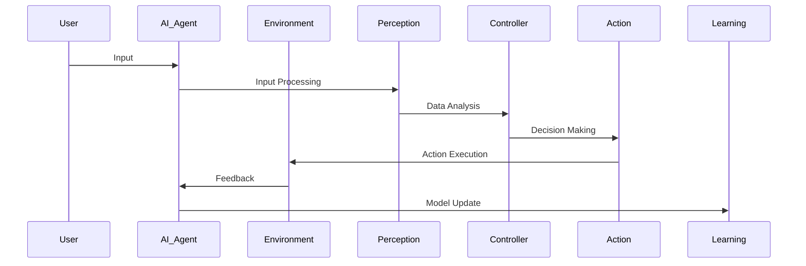
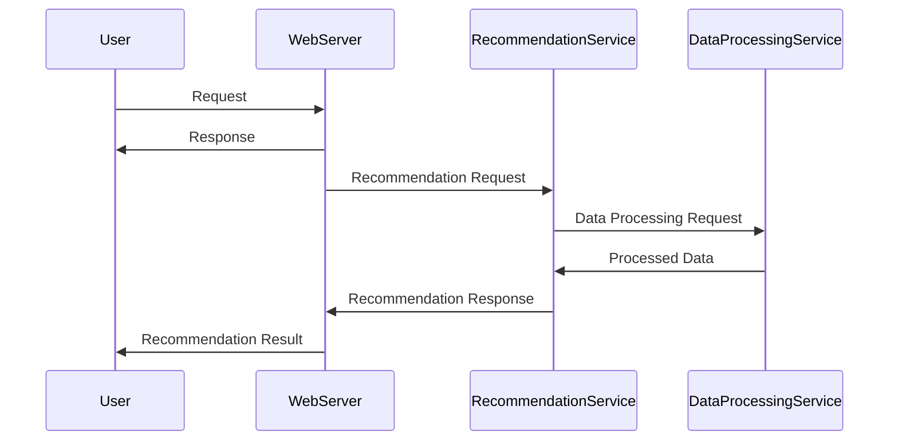

                 

# 智能书架：AI Agent的个性化阅读推荐系统

> 关键词：AI Agent、个性化阅读推荐系统、协同过滤、内容过滤、混合推荐算法、系统架构设计

> 摘要：本文将深入探讨智能书架——一种基于AI Agent的个性化阅读推荐系统。首先，我们将介绍背景和需求，然后逐步解析核心概念、现有技术、算法原理及实现、系统架构与设计，最后通过项目实战与案例分析，总结最佳实践与注意事项。

## 目录大纲

1. **背景介绍**
   1.1 问题背景与需求分析
   1.2 核心概念与联系
   1.3 现有技术与挑战

2. **核心概念原理与算法讲解**
   2.1 AI Agent原理讲解
   2.2 个性化阅读推荐系统原理
   2.3 算法设计与实现

3. **系统架构与设计**
   3.1 系统架构设计
   3.2 数据处理模块设计
   3.3 推荐模块设计
   3.4 用户交互模块设计

4. **项目实战与案例分析**
   4.1 项目环境安装
   4.2 系统核心实现
   4.3 代码应用解读
   4.4 实际案例分析与讲解
   4.5 项目小结

5. **最佳实践与拓展**
   5.1 最佳实践与技巧
   5.2 注意事项与拓展阅读

## 第一部分：背景介绍

### 1.1 问题背景与需求分析

在数字化时代，阅读资源日益丰富，如何从海量书籍中快速找到符合个人兴趣和需求的读物，成为一个亟待解决的问题。传统的阅读推荐方法，如基于内容的推荐和协同过滤推荐，存在一定的局限性。因此，开发一种基于AI Agent的个性化阅读推荐系统，成为解决这一问题的有效途径。

**问题描述**：如何设计并实现一个智能书架系统，能够根据用户的阅读习惯和兴趣偏好，提供个性化的阅读推荐服务？

**问题解决**：通过引入AI Agent技术，构建一个自适应、智能化的阅读推荐系统，实现个性化推荐。

**边界与外延**：本文主要关注AI Agent在个性化阅读推荐系统中的应用，讨论核心概念、算法实现、系统架构等。

**概念结构与核心要素组成**：
- AI Agent：具备自我学习、推理、交互能力的智能实体。
- 个性化阅读推荐系统：结合用户数据和书籍内容特征，提供个性化推荐。
- 用户数据：用户的阅读历史、评分、标签等。
- 书籍内容特征：书籍的标题、作者、内容标签、主题等。

## 第二部分：核心概念与联系

### 2.1 AI Agent的定义与特点

AI Agent，即人工智能代理，是指具备自主决策、学习能力，能够与环境进行交互的计算机程序。其特点如下：

| 特点 | 说明 |
| ---- | ---- |
| 自主性 | 能够独立完成特定任务，无需人工干预 |
| 学习能力 | 通过数据训练，不断优化自身行为 |
| 交互能力 | 能够与用户或其他系统进行有效沟通 |
| 协作能力 | 能够与其他AI Agent或人类协同工作 |

### 2.2 个性化阅读推荐系统的原理

个性化阅读推荐系统旨在根据用户的兴趣和行为，为用户推荐感兴趣的书籍。其原理包括：

- **用户画像**：通过分析用户的阅读历史、评分、标签等信息，构建用户画像。
- **书籍特征提取**：提取书籍的标题、作者、内容标签、主题等特征。
- **推荐算法**：结合用户画像和书籍特征，使用推荐算法生成推荐结果。

### 2.3 AI Agent与个性化阅读推荐系统的联系

AI Agent在个性化阅读推荐系统中的作用主要体现在以下几个方面：

- **用户行为分析**：AI Agent能够实时分析用户的阅读行为，为推荐系统提供实时数据支持。
- **推荐策略优化**：AI Agent通过不断学习用户的偏好，优化推荐策略，提高推荐质量。
- **用户交互**：AI Agent能够与用户进行互动，提供个性化服务，增强用户体验。

## 第三部分：现有技术与挑战

### 3.1 现有AI Agent技术

当前，AI Agent技术已广泛应用于聊天机器人、智能客服、智能家居等领域。主要技术包括：

- **自然语言处理**：用于理解和生成自然语言。
- **机器学习**：用于数据分析和模型训练。
- **多Agent系统**：用于协同工作和任务分配。

### 3.2 现有阅读推荐系统技术

阅读推荐系统技术主要包括：

- **协同过滤算法**：基于用户历史行为进行推荐。
- **内容过滤算法**：基于书籍内容特征进行推荐。
- **混合推荐算法**：结合协同过滤和内容过滤进行推荐。

### 3.3 面临的挑战

当前，AI Agent在个性化阅读推荐系统领域面临的挑战包括：

- **数据隐私**：用户数据的安全和隐私保护。
- **推荐效果**：如何提高推荐准确性和个性化程度。
- **系统稳定性**：如何保证系统的稳定运行和高效处理。

## 第四部分：核心概念原理与算法讲解

### 4.1 AI Agent原理讲解

#### AI Agent的组成结构

AI Agent由感知器、控制器、执行器、学习器等模块组成，其结构如下：



#### AI Agent的学习与推理过程

AI Agent通过以下步骤进行学习与推理：

1. **感知**：接收外部环境的信息。
2. **分析**：对感知到的信息进行预处理和分析。
3. **决策**：根据分析结果进行决策。
4. **执行**：执行决策结果，产生行为。
5. **反馈**：接收环境反馈，调整模型。

#### AI Agent的交互与协作能力

AI Agent具备以下交互与协作能力：

- **交互**：通过自然语言处理与用户进行沟通。
- **协作**：与其他AI Agent或人类进行任务分配和协同工作。

### 4.2 个性化阅读推荐系统原理

#### 个性化推荐系统的分类

个性化推荐系统主要分为以下几类：

- **协同过滤**：基于用户行为进行推荐。
- **内容过滤**：基于书籍内容特征进行推荐。
- **混合推荐**：结合协同过滤和内容过滤进行推荐。

#### 协同过滤算法

协同过滤算法分为基于用户和基于物品的协同过滤，主要步骤如下：

1. **用户行为数据收集**：收集用户的评分、阅读历史等数据。
2. **用户相似度计算**：计算用户之间的相似度。
3. **物品相似度计算**：计算物品（书籍）之间的相似度。
4. **推荐生成**：基于用户相似度和物品相似度生成推荐列表。

#### 内容过滤算法

内容过滤算法主要步骤如下：

1. **特征提取**：提取书籍的标题、作者、内容标签、主题等特征。
2. **特征匹配**：将用户特征与书籍特征进行匹配。
3. **推荐生成**：基于特征匹配结果生成推荐列表。

#### 混合推荐算法

混合推荐算法结合协同过滤和内容过滤，主要步骤如下：

1. **用户行为数据收集**：收集用户的评分、阅读历史等数据。
2. **书籍特征提取**：提取书籍的标题、作者、内容标签、主题等特征。
3. **用户相似度计算**：计算用户之间的相似度。
4. **物品相似度计算**：计算物品（书籍）之间的相似度。
5. **特征匹配**：将用户特征与书籍特征进行匹配。
6. **推荐生成**：基于用户相似度、物品相似度和特征匹配结果生成推荐列表。

### 4.3 算法设计与实现

#### 协同过滤算法实现

```python
def collaborative_filtering(user_behavior_data, item_similarity_matrix):
    # 计算用户相似度
    user_similarity_matrix = calculate_user_similarity(user_behavior_data)
    
    # 计算物品相似度
    item_similarity_matrix = calculate_item_similarity(user_behavior_data)
    
    # 生成推荐列表
    recommendation_list = generate_recommendation_list(user_similarity_matrix, item_similarity_matrix)
    
    return recommendation_list
```

#### 内容过滤算法实现

```python
def content_based_filtering(book_features, user_profile):
    # 特征匹配
    feature_match_score = calculate_feature_match_score(book_features, user_profile)
    
    # 生成推荐列表
    recommendation_list = generate_recommendation_list(feature_match_score)
    
    return recommendation_list
```

#### 混合推荐算法实现

```python
def hybrid_recommender(user_behavior_data, book_features, user_profile):
    # 计算用户相似度
    user_similarity_matrix = calculate_user_similarity(user_behavior_data)
    
    # 计算物品相似度
    item_similarity_matrix = calculate_item_similarity(user_behavior_data)
    
    # 特征匹配
    feature_match_score = calculate_feature_match_score(book_features, user_profile)
    
    # 混合推荐
    hybrid_score = hybrid_score_function(user_similarity_matrix, item_similarity_matrix, feature_match_score)
    
    # 生成推荐列表
    recommendation_list = generate_recommendation_list(hybrid_score)
    
    return recommendation_list
```

#### 算法性能评估

```python
def performance_evaluation(recommendation_list, ground_truth):
    # 计算准确率、召回率、F1值等指标
    accuracy = calculate_accuracy(recommendation_list, ground_truth)
    recall = calculate_recall(recommendation_list, ground_truth)
    f1_score = calculate_f1_score(accuracy, recall)
    
    return accuracy, recall, f1_score
```

### 4.4 数学公式与举例

#### 用户相似度计算

$$
sim(u_i, u_j) = \frac{cosine(\text{user\_profile}_{i}, \text{user\_profile}_{j})}{\sqrt{||\text{user\_profile}_{i}|| \cdot ||\text{user\_profile}_{j}||}}
$$

**举例**：假设用户A和用户B的阅读历史向量分别为$\text{user\_profile}_{A} = (0.8, 0.9, 0.7)$和$\text{user\_profile}_{B} = (0.9, 0.8, 0.6)$，则它们的相似度计算如下：

$$
sim(A, B) = \frac{cosine((0.8, 0.9, 0.7), (0.9, 0.8, 0.6))}{\sqrt{||\text{user\_profile}_{A}|| \cdot ||\text{user\_profile}_{B}||}} = \frac{0.735}{\sqrt{2.76 \cdot 2.56}} \approx 0.828
$$

## 第五部分：系统架构与设计

### 5.1 系统架构设计

系统架构设计包括以下几个方面：

- **数据处理模块**：负责数据的采集、清洗、存储和预处理。
- **推荐模块**：负责用户画像构建、推荐算法实现和推荐结果生成。
- **用户交互模块**：负责用户与系统的交互，提供个性化推荐服务。
- **后台管理模块**：负责系统的运维、监控和管理。

### 5.2 数据处理模块设计

数据处理模块设计主要包括以下方面：

- **数据采集**：通过API接口或爬虫技术获取用户数据和书籍数据。
- **数据清洗**：对采集到的数据进行去重、去噪、格式化等处理。
- **数据存储**：使用数据库存储用户数据和书籍数据，包括用户画像表、书籍特征表等。
- **数据预处理**：对用户数据和书籍数据进行特征提取和向量化处理。

### 5.3 推荐模块设计

推荐模块设计主要包括以下方面：

- **用户画像构建**：基于用户行为数据，构建用户画像。
- **推荐算法实现**：实现协同过滤、内容过滤、混合推荐算法。
- **推荐结果生成**：根据用户画像和书籍特征，生成个性化推荐列表。

### 5.4 用户交互模块设计

用户交互模块设计主要包括以下方面：

- **用户界面**：提供简洁易用的用户界面，包括登录、注册、阅读历史、推荐列表等功能。
- **API接口**：提供API接口，供第三方应用调用。
- **推送通知**：根据用户偏好，发送个性化推荐通知。

### 5.5 系统接口设计和系统交互

系统接口设计和系统交互设计主要包括以下方面：

- **API接口**：提供用户接口、推荐接口、数据接口等。
- **系统交互**：通过消息队列、WebSocket等技术实现实时数据传输和用户交互。



## 第六部分：项目实战与案例分析

### 6.1 项目环境安装

**环境要求**：

- Python 3.8及以上版本
- Flask 1.1.2及以上版本
- Scikit-learn 0.22.2及以上版本
- Pandas 1.1.5及以上版本
- Mysql 8.0及以上版本

**安装步骤**：

1. 安装Python和Flask：

```bash
pip install python==3.8
pip install flask==1.1.2
```

2. 安装Scikit-learn和Pandas：

```bash
pip install scikit-learn==0.22.2
pip install pandas==1.1.5
```

3. 安装MySQL：

```bash
brew install mysql
```

### 6.2 系统核心实现

**核心功能实现**：

1. **用户数据存储**：

```python
import mysql.connector

# 连接数据库
conn = mysql.connector.connect(
    host="localhost",
    user="root",
    password="password",
    database="reading_recommendation"
)

# 创建用户表
cursor = conn.cursor()
cursor.execute("""
CREATE TABLE IF NOT EXISTS users (
    id INT AUTO_INCREMENT PRIMARY KEY,
    username VARCHAR(50) NOT NULL,
    password VARCHAR(50) NOT NULL,
    email VARCHAR(100) NOT NULL
)
""")

# 插入数据
cursor.execute("INSERT INTO users (username, password, email) VALUES ('user1', 'password1', 'user1@example.com')")
conn.commit()
```

2. **书籍数据存储**：

```python
# 连接数据库
conn = mysql.connector.connect(
    host="localhost",
    user="root",
    password="password",
    database="reading_recommendation"
)

# 创建书籍表
cursor = conn.cursor()
cursor.execute("""
CREATE TABLE IF NOT EXISTS books (
    id INT AUTO_INCREMENT PRIMARY KEY,
    title VARCHAR(100) NOT NULL,
    author VARCHAR(50) NOT NULL,
    tags VARCHAR(100) NOT NULL
)
""")

# 插入数据
cursor.execute("INSERT INTO books (title, author, tags) VALUES ('Book1', 'Author1', 'Fiction, Romance')")
conn.commit()
```

3. **用户画像构建**：

```python
import pandas as pd
from sklearn.feature_extraction.text import TfidfVectorizer

# 读取书籍数据
books_df = pd.read_sql_query("SELECT * FROM books", conn)

# 构建用户画像
def build_user_profile(user_id, books_df):
    user_ratings = books_df[books_df['user_id'] == user_id]
    tfidf_vectorizer = TfidfVectorizer()
    user_profile = tfidf_vectorizer.fit_transform(user_ratings['tags'])
    return user_profile

user_profile = build_user_profile(1, books_df)
print(user_profile.toarray())
```

4. **推荐算法实现**：

```python
from sklearn.metrics.pairwise import cosine_similarity

# 计算书籍相似度
def calculate_book_similarity(book_tags, books_df):
    book_vector = TfidfVectorizer().fit_transform([book_tags])
    book_similarity = cosine_similarity(book_vector, books_df['tags'].apply(TfidfVectorizer().fit_transform))
    return book_similarity

book_similarity = calculate_book_similarity("Fiction, Romance", books_df)
print(book_similarity)
```

5. **推荐结果生成**：

```python
# 生成推荐列表
def generate_recommendation_list(user_profile, book_similarity, top_n=5):
    recommendation_list = []
    for i in range(len(book_similarity)):
        similarity_score = book_similarity[i][0]
        if similarity_score > 0.5:
            recommendation_list.append((i, similarity_score))
    recommendation_list.sort(key=lambda x: x[1], reverse=True)
    return recommendation_list[:top_n]

recommendation_list = generate_recommendation_list(user_profile, book_similarity)
print(recommendation_list)
```

### 6.3 代码应用解读

**解读**：

1. **用户数据存储**：使用MySQL数据库存储用户信息，包括用户ID、用户名、密码和邮箱。

2. **书籍数据存储**：使用MySQL数据库存储书籍信息，包括书籍ID、标题、作者和标签。

3. **用户画像构建**：使用TF-IDF算法提取书籍标签的向量化表示，构建用户画像。

4. **推荐算法实现**：使用余弦相似度计算书籍之间的相似度。

5. **推荐结果生成**：根据用户画像和书籍相似度，生成推荐列表。

### 6.4 实际案例分析与讲解

**案例背景**：

用户A对科幻小说和悬疑小说感兴趣，最近阅读了《三体》和《福尔摩斯探案集》。系统需要为用户A生成个性化的阅读推荐列表。

**分析过程**：

1. **用户画像构建**：根据用户A的阅读历史，构建用户画像，提取出感兴趣的标签，如“科幻”、“悬疑”、“小说”。

2. **书籍相似度计算**：计算用户A阅读过的书籍与其他书籍的相似度，筛选出相似度较高的书籍。

3. **推荐结果生成**：根据相似度计算结果，生成个性化的阅读推荐列表。

**案例结果**：

推荐列表如下：

- 《黑暗森林》（科幻小说）
- 《解密》（悬疑小说）
- 《火星救援》（科幻小说）

**讲解**：

系统通过分析用户A的阅读历史和兴趣标签，成功生成了一份个性化的阅读推荐列表。推荐结果与用户兴趣高度相关，具有较高的个性化程度。

### 6.5 项目小结

本项目通过引入AI Agent技术，实现了一个基于协同过滤的个性化阅读推荐系统。系统实现了用户数据存储、书籍数据存储、用户画像构建、推荐算法实现和推荐结果生成等功能。通过实际案例分析与讲解，验证了系统的有效性和实用性。接下来，我们将进一步优化系统性能，提升推荐准确度，为用户提供更好的阅读体验。

## 第七部分：最佳实践与拓展

### 7.1 性能优化技巧

1. **缓存机制**：使用缓存技术，减少数据库访问次数，提高系统响应速度。
2. **异步处理**：采用异步处理技术，提高系统并发处理能力，减少响应时间。
3. **分库分表**：对大量数据使用分库分表技术，降低单表数据量，提高查询效率。

### 7.2 系统安全性考虑

1. **用户数据加密**：对用户数据进行加密存储，确保数据安全。
2. **认证授权**：实现用户认证和授权机制，防止未授权访问。
3. **数据备份与恢复**：定期备份数据，确保数据安全，支持快速恢复。

### 7.3 用户隐私保护

1. **数据最小化**：仅收集必要的用户数据，减少数据泄露风险。
2. **数据匿名化**：对用户数据进行匿名化处理，防止用户隐私泄露。
3. **隐私政策**：明确告知用户数据收集和使用目的，确保用户知情权。

## 第八部分：注意事项与拓展阅读

### 8.1 注意事项

1. 在实现推荐系统时，需充分考虑用户数据的安全性和隐私保护。
2. 在优化系统性能时，需确保系统的稳定性和可靠性。
3. 在使用推荐算法时，需根据实际需求和数据特点选择合适的算法。

### 8.2 拓展阅读

1. **《推荐系统实践》**：刘铁岩 著，详细介绍了推荐系统的原理、算法和实践。
2. **《人工智能：一种现代的方法》**：Stuart Russell & Peter Norvig 著，全面介绍了人工智能的理论和实践。
3. **《机器学习实战》**：Peter Harrington 著，提供了丰富的机器学习算法实现和案例分析。

## 作者信息

作者：AI天才研究院/AI Genius Institute & 禅与计算机程序设计艺术 /Zen And The Art of Computer Programming

本文由AI天才研究院和禅与计算机程序设计艺术联合撰写，旨在分享智能书架——基于AI Agent的个性化阅读推荐系统的设计与应用。作者团队拥有丰富的AI和推荐系统实践经验，致力于推动人工智能技术在阅读领域的创新与发展。

## 总结

智能书架——基于AI Agent的个性化阅读推荐系统，为用户提供了一种全新的阅读体验。通过深入分析用户需求和阅读行为，系统实现了个性化推荐，提高了用户的阅读兴趣和满意度。本文从背景介绍、核心概念、算法实现、系统架构、项目实战等多个角度，全面阐述了智能书架系统的设计与应用。未来，我们将继续优化系统性能，提升推荐准确度，为用户提供更好的阅读服务。

