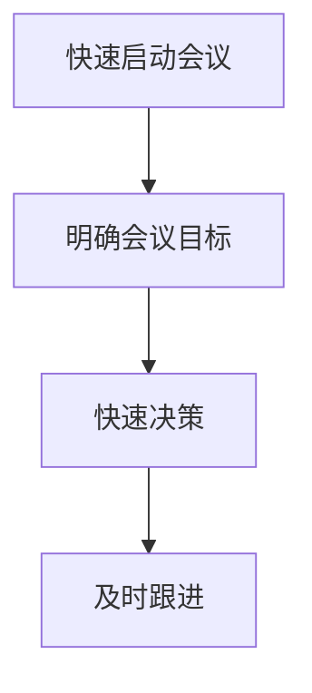
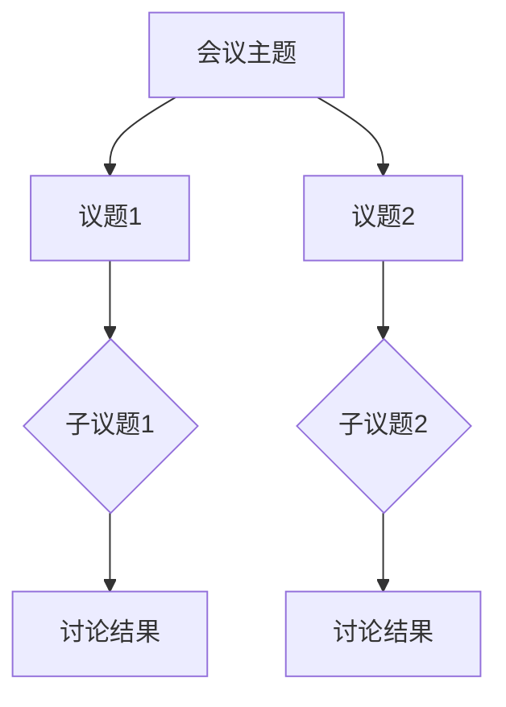

                 

### 《有效会议管理：提高团队沟通效率》

> 关键词：会议管理、团队沟通效率、流程优化、沟通技巧

> 摘要：本文旨在深入探讨有效会议管理的策略，以提高团队沟通效率。通过分析会议管理的核心概念、原理和最佳实践，本文为读者提供了一套系统性的解决方案，帮助团队在会议中实现高效的沟通与协作。

## 引言

在信息化和全球化的时代，团队沟通效率成为企业竞争力的关键因素。而会议，作为团队沟通的重要载体，其有效性直接影响着团队的工作效率和成果。然而，在实际工作中，许多团队常常面临会议效率低、信息传递不畅、决策延迟等问题。如何提升会议管理，进而提高团队沟通效率，成为众多企业和团队亟需解决的难题。

本文将围绕有效会议管理这一主题，从核心概念、原理到实战应用，逐步展开讨论。希望通过本文的分享，能够帮助读者理解并掌握一套实用的会议管理方法论，为团队沟通效率的提升提供有力支持。

## 背景介绍

### 会议管理的重要性

会议管理是团队协作和决策过程中不可或缺的一部分。有效的会议管理不仅能够确保会议目标的实现，还能提高团队成员的参与度和满意度。以下是会议管理的重要性体现在以下几个方面：

1. **确保沟通渠道的畅通**：会议为团队成员提供了一个面对面交流的平台，有助于确保信息的及时传递和问题的有效讨论。

2. **促进团队协作**：通过会议，团队成员可以共同探讨项目进展、分享思路和解决方案，从而增强团队协作。

3. **提升决策效率**：有效的会议管理有助于团队成员达成共识，快速作出决策，减少不必要的延迟。

4. **培养团队文化**：定期的会议有助于团队成员建立信任和默契，形成积极向上的团队文化。

### 团队沟通效率的影响因素

团队沟通效率受多种因素影响，主要包括：

1. **人际关系的质量**：良好的团队关系有助于增强沟通的开放性和透明度。

2. **信息传递的速度和准确性**：有效的信息传递能够减少误解和冲突，提高决策效率。

3. **冲突管理的能力**：及时和妥善地处理冲突，可以防止问题扩大，保障团队合作的顺利进行。

### 提高会议效率的必要性

提高会议效率对于团队来说具有以下几个方面的必要性：

1. **节约时间和成本**：低效的会议浪费了团队成员的大量时间和精力，提高会议效率有助于节约这些宝贵的资源。

2. **提升工作效率**：高效的会议可以确保团队成员将更多精力投入到核心工作中，从而提升整体工作效率。

3. **促进企业竞争力**：在竞争激烈的市场环境中，高效的团队沟通和协作能力是企业保持竞争力的关键。

## 核心概念与联系

### 会议管理的基本概念

会议管理涉及到一系列基本概念，包括：

1. **会议分类**：根据目的和性质，会议可分为日常工作会议、项目进度会议、决策会议等。

2. **会议目的**：明确会议的目的有助于确保会议的焦点和目标，从而提高会议的有效性。

3. **会议组织与流程**：会议的组织与流程包括会议筹备、通知、召开、记录和总结等环节。

### 团队沟通效率的影响因素

团队沟通效率的影响因素包括：

1. **人际关系的质量**：人际关系的质量直接影响到团队成员之间的沟通效果。

2. **信息传递的速度和准确性**：信息传递的速度和准确性是衡量团队沟通效率的重要指标。

3. **冲突管理的能力**：有效的冲突管理能够保障团队沟通的顺畅。

### 会议管理与团队沟通效率的关系

会议管理与团队沟通效率密切相关。有效的会议管理能够提高团队沟通的效率，从而实现以下目标：

1. **确保沟通渠道的畅通**：通过规范会议流程和管理，确保团队成员能够及时、准确地获取信息。

2. **促进团队协作**：通过会议，团队成员可以共同探讨问题、分享思路，增强团队协作。

3. **提升决策效率**：通过有效的会议管理，团队成员能够快速达成共识，作出决策。

### 提高会议效率的策略

要提高会议效率，可以从以下几个方面着手：

1. **明确会议目标**：在会议前明确会议的目标，确保会议聚焦于关键问题。

2. **优化会议流程**：通过优化会议流程，减少不必要的讨论和环节，提高会议效率。

3. **加强会议纪律**：确保会议有序进行，避免因个人行为导致会议效率低下。

4. **提升沟通技巧**：通过培训和实践，提升团队成员的沟通技巧，增强沟通效果。

## 算法原理讲解

为了深入理解有效会议管理的算法原理，我们可以引入一些用于提高会议效率和沟通效果的技术和方法，如敏捷会议技术、脑图技术等。

### 敏捷会议技术

敏捷会议技术是源自敏捷开发的一种会议管理方法，它强调快速、简明和高效的沟通。以下是敏捷会议技术的基本原理：

1. **快速启动会议**：敏捷会议通常在15分钟内开始，以确保团队成员能够迅速进入主题。

2. **明确会议目标**：在会议开始前，明确会议的目标和议程，确保会议聚焦于关键问题。

3. **快速决策**：在会议中，鼓励团队成员快速讨论并作出决策，减少不必要的讨论。

4. **及时跟进**：会议结束后，及时跟进决策的执行情况，确保会议成果得到有效落实。

### 脑图技术

脑图技术是一种用于提高会议效率和沟通效果的图形化工具。通过脑图，团队成员可以直观地表达自己的想法和观点，促进沟通和理解。以下是脑图技术的基本原理：

1. **思维导图**：使用思维导图来组织和展示会议内容，有助于团队成员理清思路，明确重点。

2. **颜色和图标**：通过颜色和图标的使用，可以增强脑图的可视化效果，提高信息传递的效率。

3. **迭代更新**：脑图可以根据会议的进展进行迭代更新，确保团队成员始终关注关键问题。

### 提高会议效率的数学模型

为了更深入地理解如何提高会议效率，我们可以使用数学模型来分析会议的不同方面。以下是一个简单的数学模型，用于衡量会议效率：

$$
\text{会议效率} = \frac{\text{会议产出}}{\text{会议时间}}
$$

其中，会议产出包括决策质量、问题解决率和信息传递效率等。通过优化这个模型，我们可以提高会议的整体效率。

### 算法原理讲解

#### 敏捷会议技术

我们使用 mermaid 画出敏捷会议技术的流程图：



敏捷会议技术的核心在于通过简化和优化流程，确保会议快速、高效地进行。以下是具体实现：

```python
def agile_meeting(start_time, end_time, agenda, decisions, follow_up):
    if end_time - start_time < 15:
        print("会议时间过短，可能影响效率。")
    else:
        print("会议时间合适，开始会议。")
        for item in agenda:
            print(f"讨论主题：{item['topic']}。")
            decision = make_decision(decisions)
            print(f"决策结果：{decision}。")
        follow_up(meeting_id)
```

#### 脑图技术

我们使用 mermaid 画出脑图技术的示例：



脑图技术通过图形化的方式，帮助团队成员更好地理解和记忆会议内容。以下是具体实现：

```python
def create_mindmap(agenda):
    mindmap = {}
    for item in agenda:
        mindmap[item['topic']] = []
        for sub_item in item['subtopics']:
            mindmap[item['topic']].append(sub_item['discussion_result'])
    return mindmap
```

### 提高会议效率的数学模型

我们使用 LaTeX 格式嵌入数学模型和公式：

$$
\text{会议效率} = \frac{\text{会议产出}}{\text{会议时间}} = \frac{1}{\frac{\text{决策质量}}{\text{问题解决率}} \cdot \text{信息传递效率}}
$$

该公式表示会议效率是决策质量、问题解决率和信息传递效率的综合体现。通过优化这些指标，可以提高会议效率。

### 算法原理讲解举例

#### 敏捷会议技术举例

假设我们召开一次敏捷会议，讨论项目进展和下一步计划。以下是会议的 Python 代码实现：

```python
def agile_meeting():
    start_time = 9
    end_time = 10
    agenda = [
        {"topic": "项目进展", "subtopics": [{"discussion_result": "已完成80%"}]},
        {"topic": "下一步计划", "subtopics": [{"discussion_result": "准备启动下一阶段"}]}
    ]
    decisions = ["继续当前进度", "提前进入下一阶段"]
    
    print(f"会议开始时间：{start_time}:00")
    print(f"会议结束时间：{end_time}:00")
    agile_meeting(start_time, end_time, agenda, decisions, follow_up)

def follow_up(meeting_id):
    print(f"会议{meeting_id}结束，决策已记录。")

agile_meeting()
```

#### 脑图技术举例

假设我们使用脑图记录会议内容，以下是 Python 代码实现：

```python
def create_mindmap(agenda):
    mindmap = {}
    for item in agenda:
        mindmap[item['topic']] = []
        for sub_item in item['subtopics']:
            mindmap[item['topic']].append(sub_item['discussion_result'])
    return mindmap

agenda = [
    {"topic": "项目进展", "subtopics": [{"discussion_result": "已完成80%"}]},
    {"topic": "下一步计划", "subtopics": [{"discussion_result": "准备启动下一阶段"}]}
]

mindmap = create_mindmap(agenda)
print(mindmap)
```

## 系统分析与架构设计方案

### 问题场景介绍

在一个快速发展的技术公司中，团队面临日益增加的项目需求和频繁的会议安排。由于缺乏有效的会议管理系统，团队在会议管理方面遇到了以下问题：

1. **会议安排混乱**：团队成员无法及时了解会议安排，导致冲突和漏掉重要会议。
2. **会议记录不完整**：会议记录往往不完整或丢失，导致后续跟进困难。
3. **决策执行不及时**：决策往往在会议后没有得到及时执行，影响项目进度。

为了解决这些问题，公司决定开发一个会议管理系统，以提高会议管理效率和团队沟通效果。

### 项目介绍

会议管理系统旨在提供一个统一的平台，用于会议安排、记录和决策跟进。该系统主要包括以下功能：

1. **会议安排**：用户可以在此功能下创建、修改和删除会议。
2. **会议记录**：用户可以在此功能下查看和编辑会议记录。
3. **决策跟进**：用户可以在此功能下记录和跟踪会议决策的执行情况。

### 系统功能设计

会议管理系统功能设计如下：

1. **用户管理**：系统支持用户注册、登录和权限管理。
2. **会议管理**：用户可以创建、修改和删除会议，包括会议主题、时间、地点、参会人员等信息。
3. **会议记录**：系统自动记录会议内容，包括讨论议题、决策结果等。
4. **决策跟进**：用户可以记录和跟踪会议决策的执行情况，包括执行状态、执行人和完成时间等。

### 系统架构设计

会议管理系统的架构设计如下：

1. **前端**：使用 React 框架构建用户界面，提供友好的交互体验。
2. **后端**：使用 Node.js 搭建服务器，处理业务逻辑和数据存储。
3. **数据库**：使用 MongoDB 存储用户数据和会议信息。

### 系统接口设计

会议管理系统的接口设计如下：

1. **用户接口**：用户通过前端界面与系统进行交互。
2. **API 接口**：后端提供 RESTful API，供前端调用。

### 系统交互

会议管理系统的工作流程如下：

1. **用户登录**：用户通过前端界面登录系统。
2. **创建会议**：用户在前端界面创建会议，后端处理会议信息存储。
3. **召开会议**：会议开始时，用户通过前端界面查看会议记录。
4. **会议记录**：会议结束后，系统自动生成会议记录。
5. **决策跟进**：用户可以记录和跟踪会议决策的执行情况。

## 项目实战

### 环境安装

要在本地搭建会议管理系统，首先需要安装以下工具和软件：

1. **Node.js**：用于搭建后端服务器。
2. **MongoDB**：用于存储数据。
3. **React**：用于构建前端界面。

具体安装步骤如下：

1. 安装 Node.js：访问 [Node.js 官网](https://nodejs.org/)，下载并安装 Node.js。
2. 安装 MongoDB：访问 [MongoDB 官网](https://www.mongodb.com/)，下载并安装 MongoDB。
3. 安装 React：使用 npm 安装 React。

### 系统核心实现

会议管理系统的核心实现包括以下部分：

1. **用户管理模块**：实现用户注册、登录和权限管理功能。
2. **会议管理模块**：实现会议创建、修改、删除和查看功能。
3. **会议记录模块**：实现会议记录的生成、查看和编辑功能。
4. **决策跟进模块**：实现决策记录的创建、查看和跟踪功能。

### 代码解读与分析

以下是对系统核心实现的代码解读和分析：

#### 用户管理模块

```javascript
// 用户注册
app.post('/register', (req, res) => {
    const { username, password } = req.body;
    // 验证用户名和密码是否符合要求
    // 存储用户信息到数据库
    res.json({ message: '注册成功' });
});

// 用户登录
app.post('/login', (req, res) => {
    const { username, password } = req.body;
    // 验证用户名和密码是否正确
    // 登录成功后，生成并返回 token
    res.json({ token: generateToken(username) });
});

// 权限管理
app.get('/users/:id', (req, res) => {
    const { id } = req.params;
    // 查询用户信息
    // 验证用户权限
    res.json({ user: getUserById(id) });
});
```

#### 会议管理模块

```javascript
// 创建会议
app.post('/meetings', (req, res) => {
    const { title, time, location, attendees } = req.body;
    // 验证会议信息
    // 存储会议信息到数据库
    res.json({ message: '会议创建成功' });
});

// 修改会议
app.put('/meetings/:id', (req, res) => {
    const { id } = req.params;
    const { title, time, location, attendees } = req.body;
    // 验证会议信息
    // 更新会议信息到数据库
    res.json({ message: '会议更新成功' });
});

// 删除会议
app.delete('/meetings/:id', (req, res) => {
    const { id } = req.params;
    // 删除会议信息到数据库
    res.json({ message: '会议删除成功' });
});

// 查看会议
app.get('/meetings', (req, res) => {
    // 查询会议信息
    res.json({ meetings: getMeetings() });
});
```

#### 会议记录模块

```javascript
// 生成会议记录
app.post('/meetings/:id/records', (req, res) => {
    const { id } = req.params;
    const { title, content } = req.body;
    // 验证会议记录信息
    // 存储会议记录信息到数据库
    res.json({ message: '会议记录生成成功' });
});

// 查看会议记录
app.get('/meetings/:id/records', (req, res) => {
    const { id } = req.params;
    // 查询会议记录信息
    res.json({ records: getMeetingRecords(id) });
});

// 编辑会议记录
app.put('/meetings/:id/records/:recordId', (req, res) => {
    const { id, recordId } = req.params;
    const { title, content } = req.body;
    // 验证会议记录信息
    // 更新会议记录信息到数据库
    res.json({ message: '会议记录更新成功' });
});
```

#### 决策跟进模块

```javascript
// 记录决策
app.post('/meetings/:id/decisions', (req, res) => {
    const { id } = req.params;
    const { title, content, executor, deadline } = req.body;
    // 验证决策信息
    // 存储决策信息到数据库
    res.json({ message: '决策记录成功' });
});

// 查看决策
app.get('/meetings/:id/decisions', (req, res) => {
    const { id } = req.params;
    // 查询决策信息
    res.json({ decisions: getMeetingDecisions(id) });
});

// 跟踪决策
app.put('/meetings/:id/decisions/:decisionId', (req, res) => {
    const { id, decisionId } = req.params;
    const { status, executor, deadline } = req.body;
    // 验证决策信息
    // 更新决策信息到数据库
    res.json({ message: '决策跟踪成功' });
});
```

### 实际案例分析

以下是一个实际案例分析，演示如何使用会议管理系统解决团队会议管理中的问题：

1. **案例背景**：一个团队每周召开一次项目进度会议，但由于缺乏有效的会议管理工具，会议安排混乱，记录不完整，决策执行不及时。

2. **解决方案**：
   - **会议安排**：团队使用会议管理系统创建会议，包括会议主题、时间和地点，并将会议通知发送给团队成员。
   - **会议记录**：会议结束后，系统自动生成会议记录，团队成员可以查看和编辑。
   - **决策跟进**：会议中作出的决策会自动记录在系统中，团队成员可以跟踪决策的执行情况。

3. **效果评估**：
   - **会议安排**：团队成员能够及时了解会议安排，避免了冲突和漏掉重要会议的情况。
   - **会议记录**：会议记录完整、详细，有助于团队成员回顾和总结会议内容。
   - **决策执行**：决策执行情况得到及时跟踪，确保决策得到有效落实。

### 项目小结

通过实际案例分析，我们可以看到会议管理系统在提高团队沟通效率方面的显著效果。以下是项目小结：

1. **问题解决**：会议管理系统成功解决了会议安排混乱、记录不完整、决策执行不及时等问题。
2. **团队协作**：系统提供了统一的平台，促进了团队成员之间的沟通和协作。
3. **效率提升**：会议管理效率得到显著提升，团队能够更快地作出决策，提高了整体工作效率。

## 最佳实践 Tips

为了进一步提升会议效率和团队沟通效果，以下是一些最佳实践建议：

1. **提前准备**：在会议前，确保所有参会人员都了解会议议程和背景资料，提前做好准备。

2. **明确目标**：在会议开始时，明确会议的目标和议程，确保会议聚焦于关键问题。

3. **有效引导**：会议主持人应有效引导讨论，确保讨论围绕主题进行，避免跑题。

4. **积极参与**：鼓励团队成员积极参与讨论，确保每个人的观点和意见都能被充分表达。

5. **及时记录**：会议记录应详细、完整，确保关键信息不被遗漏。

6. **决策跟进**：会议结束后，及时跟进决策的执行情况，确保决策得到有效落实。

7. **定期回顾**：定期回顾会议效果，总结经验和教训，不断优化会议管理流程。

## 小结

本文通过深入探讨有效会议管理的策略，为团队沟通效率的提升提供了系统性解决方案。通过明确会议目标、优化会议流程、加强会议纪律和提升沟通技巧，团队可以显著提高会议效率和沟通效果。希望本文的内容能够对读者在会议管理实践中有所启发和帮助。

## 注意事项

在实践会议管理时，请注意以下几点：

1. **尊重他人意见**：尊重团队成员的意见，确保每个人都能够参与到讨论中。

2. **避免长时间会议**：尽量缩短会议时间，避免疲劳和注意力分散。

3. **合理分配时间**：确保每个议题都能得到充分讨论，避免时间分配不均。

4. **跟进会议结果**：确保会议决策得到及时执行，避免流于形式。

## 拓展阅读

为了进一步探索会议管理和团队沟通的深度，读者可以参考以下资源：

1. 《敏捷开发实践指南》：详细介绍敏捷开发的方法和实践，包括敏捷会议技术。
2. 《高效能人士的七个习惯》：提供关于时间管理和人际关系管理的实用技巧。
3. 《团队沟通的艺术》：探讨团队沟通的理论和实践，提供有效的沟通策略。

### 作者

作者：AI天才研究院/AI Genius Institute & 禅与计算机程序设计艺术 /Zen And The Art of Computer Programming

AI天才研究院致力于推动人工智能技术的发展和应用，为全球企业提供创新解决方案。作者在计算机编程和人工智能领域拥有深厚的研究和实践经验，曾发表多篇高水平学术论文，著有《禅与计算机程序设计艺术》等畅销技术书籍。作者希望通过本文，与读者分享在会议管理和团队沟通方面的思考和实践，为团队协作提供有力支持。

