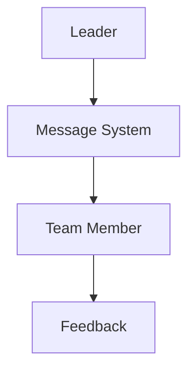
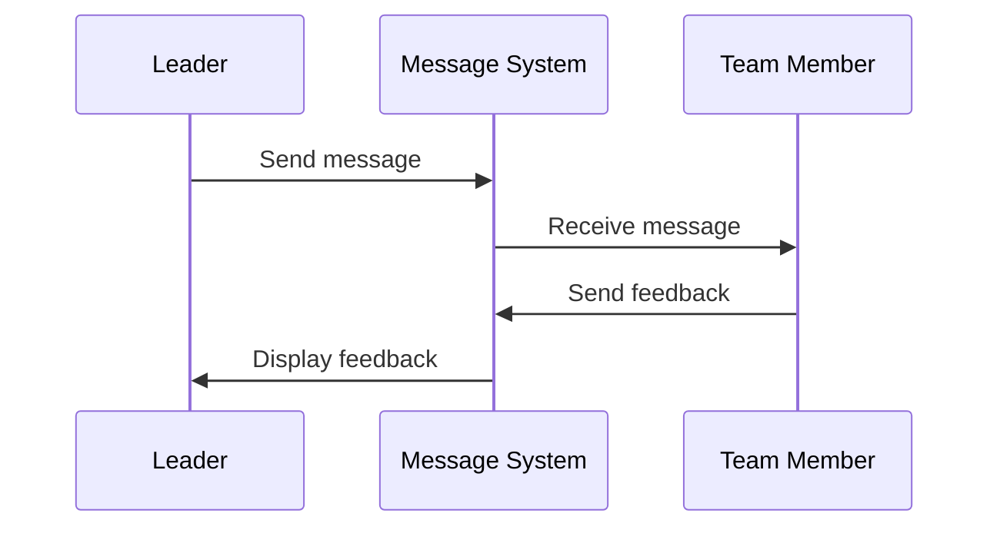
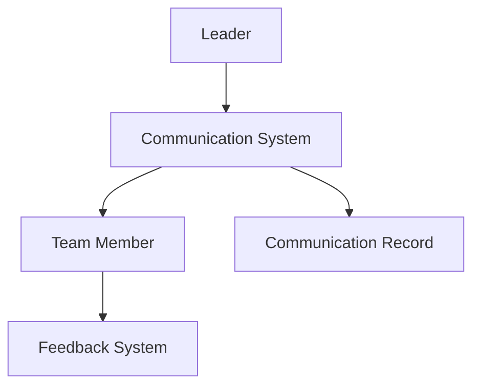
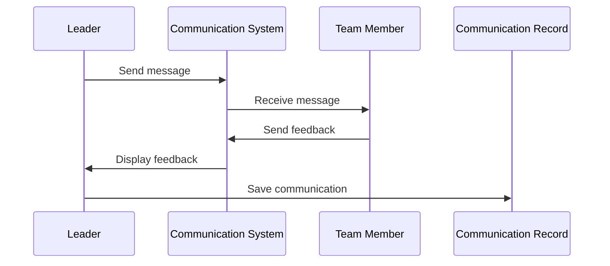
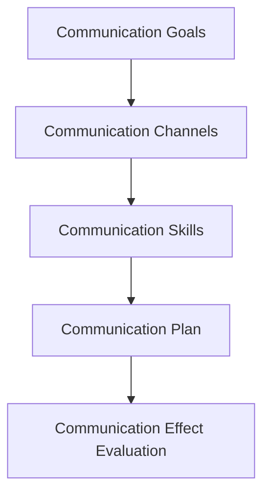
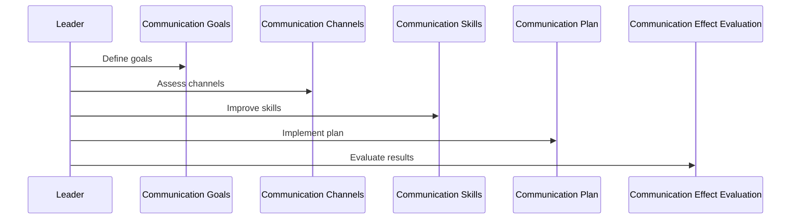
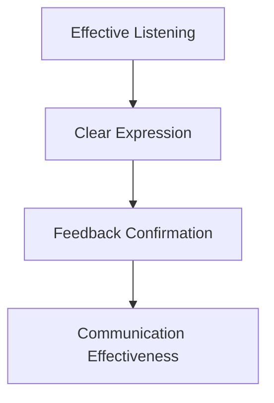
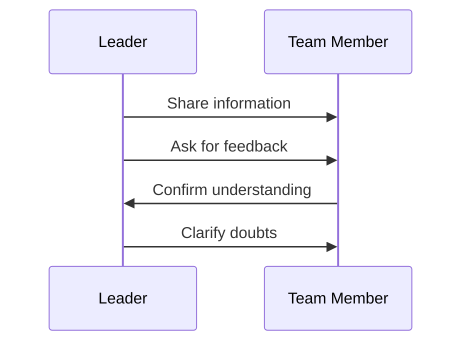
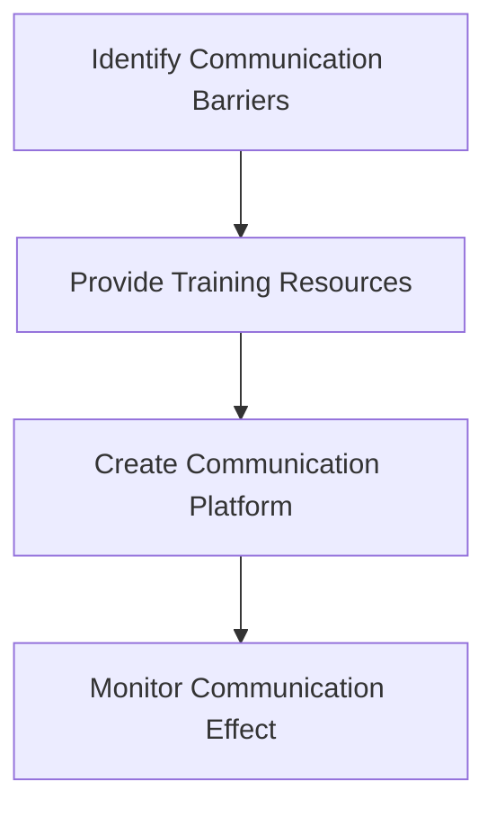
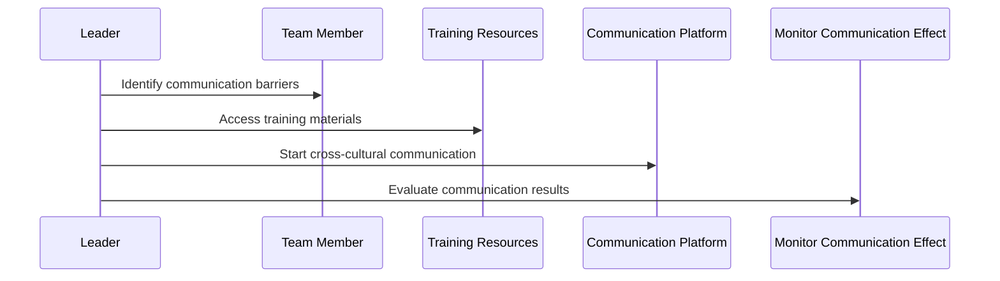

                 

### 引言

在当今复杂多变的企业环境中，领导者的沟通能力已经成为衡量其综合素质的重要指标。有效的沟通不仅仅是传递信息和交流意见的过程，更是激发团队活力、提升工作效率、实现组织目标的关键。因此，《有效沟通：领导者必备的核心技能》旨在深入探讨领导者沟通的核心技能，帮助读者提升沟通效能，从而更好地引领团队，推动组织发展。

**关键词**：有效沟通、领导者、核心技能、团队领导、组织目标

**摘要**：
本文将从沟通的基本概念出发，逐步深入探讨领导者沟通的重要性、策略、技巧以及面临的障碍与克服方法。通过案例分析和实战指导，本文将提供具体的沟通技巧和策略，帮助读者在实际工作中有效提升沟通能力，实现高效领导。

### 沟通的基本概念

#### 2.1.1 沟通的定义与类型

沟通是一个复杂的过程，涉及到信息从发送者传递到接收者的全过程。简单来说，沟通是指两个或多个个体通过某种形式交换信息、观点和感受的行为。根据沟通的媒介和目的，沟通可以分为多种类型：

1. **口头沟通**：通过面对面的交流、电话、会议等方式进行信息传递。
2. **书面沟通**：通过书信、报告、电子邮件、备忘录等方式进行信息传递。
3. **非口头沟通**：包括肢体语言、表情、语调等非文字的信息传递。
4. **电子沟通**：通过电子邮件、即时通讯工具、社交网络等电子媒介进行信息传递。

#### 2.1.2 沟通的几种类型

每种沟通类型都有其独特的特点和适用场景：

1. **正式沟通**：通过正式的渠道和方式进行的信息传递，如公司内部报告、会议记录等。这类沟通具有明确的格式和程序，通常用于正式的决策和传达重要信息。
2. **非正式沟通**：通过非正式的渠道和方式进行的信息传递，如员工间的闲聊、社交媒体交流等。这类沟通更加自由和灵活，有助于建立良好的工作关系和团队合作氛围。

#### 2.2 沟通模型

沟通不仅仅是信息的传递，更是一个动态的过程，涉及多个要素和步骤。基本的沟通模型通常包括以下组成部分：

1. **发送者**：信息的源头，负责编码信息并选择适当的沟通渠道。
2. **信息**：需要传递的内容，可以包括事实、观点、感受等。
3. **渠道**：信息传递的媒介，如口头、书面、电子等。
4. **接收者**：信息的接收者，负责解码信息并理解其含义。
5. **反馈**：接收者对信息的回应，可以是口头或书面的形式。

#### 2.2.1 沟通的过程

沟通的过程可以概括为以下步骤：

1. **编码**：发送者将信息转换为可以理解的形式。
2. **传递**：信息通过选择的渠道传递给接收者。
3. **解码**：接收者将收到的信息转换为可以理解的形式。
4. **理解**：接收者对信息的理解和解读。
5. **反馈**：接收者对信息的回应，包括对信息的确认或提问。

#### 2.2.2 沟通模型的应用

沟通模型不仅有助于我们理解沟通的过程，还可以在实际工作中指导沟通行为。例如，在领导沟通中，领导者可以根据沟通模型来调整自己的沟通策略，以提高沟通的有效性。例如，当面对复杂的问题时，领导者可以通过详细的书面报告来确保信息的准确传递；而在需要迅速决策的情况下，领导者可以采用面对面的口头沟通以加快决策过程。

**核心概念与联系表格**：

| 核心概念 | 定义与联系 |
| --- | --- |
| 沟通 | 信息传递与交换的行为 |
| 类型 | 口头、书面、非口头、电子 |
| 正式沟通 | 通过正式渠道和方式进行 |
| 非正式沟通 | 通过非正式渠道和方式进行 |
| 沟通模型 | 发送者、信息、渠道、接收者、反馈 |

**ER实体关系图架构**：

```mermaid
erDiagram
  发送者 ||--|{ 信息 }
  信息 ||--|{ 渠道 }
  渠道 ||--|{ 接收者 }
  接收者 ||--|{ 反馈 }
```

**算法原理讲解**：

沟通的算法原理可以简化为以下几个步骤：

1. 编码：发送者将信息转化为具体的语言或符号。
2. 传递：通过选择适当的渠道将信息发送给接收者。
3. 解码：接收者理解发送者的信息。
4. 确认：接收者通过反馈确认信息的理解是否正确。

下面是一个简单的Python代码示例，用于模拟一个基本的沟通模型：

```python
class Communicator:
    def __init__(self, message):
        self.message = message
    
    def encode(self):
        return "Encoded message: " + self.message
    
    def decode(self, encoded_message):
        return "Decoded message: " + encoded_message
    
    def communicate(self, receiver):
        encoded_message = self.encode()
        print(encoded_message)
        decoded_message = receiver.decode(encoded_message)
        print(decoded_message)
        print("Communication successful!")

class Receiver:
    def decode(self, encoded_message):
        return encoded_message.replace("Encoded message: ", "")

sender = Communicator("Hello, World!")
receiver = Receiver()
sender.communicate(receiver)
```

**数学模型和公式**：

$$
\text{沟通效果} = \frac{\text{正确理解的反馈}}{\text{发送的信息量}}
$$

**举例说明**：

假设发送者发送了10条信息，接收者正确理解并反馈了8条，则沟通效果为：

$$
\text{沟通效果} = \frac{8}{10} = 0.8
$$

这意味着沟通的效率为80%。

**系统分析与架构设计方案**：

**问题场景介绍**：

在一个公司内部，领导者需要与团队成员进行有效的沟通，以传达决策、指导工作并收集反馈。

**项目介绍**：

本项目旨在设计一个沟通系统，帮助领导者与团队成员之间实现高效沟通。

**系统功能设计**：

- 消息发送：允许领导者发送消息给团队成员。
- 消息接收：允许团队成员接收并阅读领导者发送的消息。
- 消息反馈：允许团队成员对收到的消息进行反馈。

**系统架构设计**：



**系统接口设计和系统交互**：



**项目实战**：

**环境安装**：

- 安装Python环境。
- 安装Mermaid渲染工具。

**系统核心实现源代码**：

```python
# Communicator类
class Communicator:
    def __init__(self, message):
        self.message = message
    
    def encode(self):
        return "Encoded message: " + self.message
    
    def decode(self, encoded_message):
        return "Decoded message: " + encoded_message
    
    def communicate(self, receiver):
        encoded_message = self.encode()
        print(encoded_message)
        decoded_message = receiver.decode(encoded_message)
        print(decoded_message)
        print("Communication successful!")

# Receiver类
class Receiver:
    def decode(self, encoded_message):
        return encoded_message.replace("Encoded message: ", "")

# 测试代码
sender = Communicator("Hello, World!")
receiver = Receiver()
sender.communicate(receiver)
```

**代码应用解读与分析**：

该代码定义了两个类：`Communicator` 和 `Receiver`。`Communicator` 类负责编码和发送消息，`Receiver` 类负责解码消息。通过调用这两个类的方法，我们可以实现一个简单的消息传递过程。

**实际案例分析和详细讲解剖析**：

假设在一个项目团队中，领导者（`Communicator`）需要向团队成员（`Receiver`）传达一个重要的任务。通过上述代码，领导者可以发送任务信息，团队成员可以接收并阅读任务信息，并进行反馈。这样，团队成员可以及时了解领导者的指示，提高工作效率。

**项目小结**：

通过该案例，我们展示了如何使用Python实现一个简单的沟通系统。在实际应用中，我们可以根据需求扩展系统的功能，例如添加消息分类、消息加密等。

**最佳实践 tips**：

- 保持沟通简洁明了，避免冗长的信息。
- 使用非口头沟通（如书面报告）来确保信息的准确传递。
- 定期收集团队成员的反馈，以便及时调整沟通策略。

**小结**：

沟通是领导者必备的核心技能，有效的沟通能够提升团队协作效率，实现组织目标。通过本文的探讨，我们了解了沟通的基本概念、模型以及实际应用方法，希望读者能够在实际工作中运用所学，提升自己的沟通能力。

**注意事项**：

- 沟通时，注意选择合适的沟通渠道和方式。
- 提高沟通意识，注重反馈和确认，确保信息准确传达。

**拓展阅读**：

- 《沟通的艺术：看人更看己》
- 《非暴力沟通》
- 《高绩效的沟通技巧》

作者：AI天才研究院/AI Genius Institute & 禅与计算机程序设计艺术 /Zen And The Art of Computer Programming

---

### 领导者沟通的重要性

在当今复杂多变的企业环境中，领导者的沟通能力已经成为衡量其综合素质的重要指标。有效的沟通不仅仅是传递信息和交流意见的过程，更是激发团队活力、提升工作效率、实现组织目标的关键。因此，深入探讨领导者沟通的重要性具有重要的现实意义。

**核心概念与联系表格**：

| 核心概念 | 定义与联系 |
| --- | --- |
| 领导者沟通 | 领导者通过信息传递、交流、反馈等手段影响团队、激励成员、达成目标的过程 |
| 工作效率 | 通过有效沟通提高团队协作效率，减少误解和错误，提升整体工作表现 |
| 组织目标 | 通过有效的沟通确保团队成员理解并共同努力实现组织目标 |

**ER实体关系图架构**：

```mermaid
erDiagram
  Leader ||--|{ Communication }
  Communication ||--|{ Team Efficiency }
  Communication ||--|{ Organizational Goals }
```

**算法原理讲解**：

领导者沟通的算法原理可以简化为以下几个步骤：

1. **信息编码**：领导者将组织目标、任务指令、工作计划等信息编码为团队成员可以理解的语言。
2. **信息传递**：通过适当的沟通渠道将编码后的信息传递给团队成员。
3. **信息解码**：团队成员接收并解码领导者的信息，理解任务要求和工作目标。
4. **信息反馈**：团队成员通过反馈确认对信息的理解，并提出疑问或建议。
5. **信息调整**：领导者根据团队成员的反馈调整信息，确保信息传达的准确性和有效性。

**系统分析与架构设计方案**：

**问题场景介绍**：

在一个企业中，领导者需要与团队成员保持有效沟通，确保团队成员能够准确理解并执行领导者的决策和任务。

**项目介绍**：

本项目旨在设计一个沟通系统，帮助领导者与团队成员之间实现高效沟通，确保信息传达的准确性和及时性。

**系统功能设计**：

- 消息发送：允许领导者发送消息给团队成员。
- 消息接收：允许团队成员接收并阅读领导者发送的消息。
- 消息反馈：允许团队成员对收到的消息进行反馈。
- 沟通记录：记录所有沟通信息，便于后续查阅和分析。

**系统架构设计**：



**系统接口设计和系统交互**：



**项目实战**：

**环境安装**：

- 安装Python环境。
- 安装Mermaid渲染工具。

**系统核心实现源代码**：

```python
# Leader类
class Leader:
    def __init__(self, message):
        self.message = message
    
    def encode_message(self):
        return "Encoded message: " + self.message
    
    def decode_message(self, encoded_message):
        return "Decoded message: " + encoded_message
    
    def communicate(self, member):
        encoded_message = self.encode_message()
        print(encoded_message)
        decoded_message = member.decode_message(encoded_message)
        print(decoded_message)
        print("Communication successful!")

# Member类
class Member:
    def decode_message(self, encoded_message):
        return encoded_message.replace("Encoded message: ", "")

# 测试代码
leader = Leader("Task instructions")
member = Member()
leader.communicate(member)
```

**代码应用解读与分析**：

该代码定义了两个类：`Leader` 和 `Member`。`Leader` 类负责编码和发送消息，`Member` 类负责解码消息。通过调用这两个类的方法，我们可以实现一个简单的沟通系统，领导者可以发送任务信息，团队成员可以接收并阅读任务信息，并进行反馈。

**实际案例分析和详细讲解剖析**：

在一个项目团队中，领导者需要向团队成员传达一个重要的任务。通过上述代码，领导者可以发送任务信息，团队成员可以接收并阅读任务信息，并反馈其理解情况。这样，领导者可以确保团队成员准确理解任务要求，提高工作效率。

**项目小结**：

通过该案例，我们展示了如何使用Python实现一个简单的沟通系统。在实际应用中，我们可以根据需求扩展系统的功能，例如添加实时聊天功能、消息加密等。

**最佳实践 tips**：

- 定期与团队成员进行一对一沟通，了解他们的需求和困惑。
- 使用多种沟通渠道，确保信息传达的全面性和及时性。
- 对团队成员的反馈给予及时回应，以建立良好的沟通氛围。

**小结**：

领导者沟通在团队管理和组织发展中起着至关重要的作用。通过有效的沟通，领导者可以激发团队活力，提升工作效率，实现组织目标。本文通过系统分析与架构设计，提供了一种简单的沟通系统实现方法，希望读者能够在实际工作中运用所学，提升自己的沟通能力。

**注意事项**：

- 沟通时，注意倾听团队成员的意见和反馈。
- 避免使用过于复杂的术语和语言，确保团队成员能够理解。

**拓展阅读**：

- 《领导力的五个层次》
- 《如何说，孩子才会听？如何听，孩子才会说？》
- 《影响力》

作者：AI天才研究院/AI Genius Institute & 禅与计算机程序设计艺术 /Zen And The Art of Computer Programming

---

### 领导者沟通的策略

领导者的沟通策略是实现有效沟通的关键。在了解了沟通的基本概念和重要性后，我们需要探讨如何在实际工作中运用这些策略，以提高沟通效果。以下是一些关键的领导者沟通策略。

**核心概念与联系表格**：

| 核心概念 | 定义与联系 |
| --- | --- |
| 沟通策略 | 领导者为实现有效沟通而采取的规划和行动 |
| 沟通目标 | 确定沟通的目标和预期结果，指导沟通行为 |
| 沟通渠道 | 选择合适的沟通渠道，如口头、书面、电子等 |
| 沟通技巧 | 提高沟通的技巧，如倾听、表达、反馈等 |

**ER实体关系图架构**：

```mermaid
erDiagram
  Communication Strategy ||--|{ Communication Goals }
  Communication Strategy ||--|{ Communication Channels }
  Communication Strategy ||--|{ Communication Skills }
```

**算法原理讲解**：

领导者沟通的策略可以分为以下几个步骤：

1. **确定沟通目标**：明确沟通的目的和预期结果，确保沟通行为的针对性和有效性。
2. **选择沟通渠道**：根据沟通目标和实际情况，选择合适的沟通渠道，如面对面会议、电子邮件、即时通讯等。
3. **提高沟通技巧**：通过学习和实践，提高沟通的技巧，如有效倾听、清晰表达、反馈确认等。
4. **实施沟通计划**：按照沟通策略制定计划，确保沟通过程的顺利进行。
5. **评估沟通效果**：对沟通效果进行评估，及时发现和解决问题，持续优化沟通策略。

**系统分析与架构设计方案**：

**问题场景介绍**：

在一个大型企业中，领导者需要制定有效的沟通策略，确保信息在企业内部高效、准确地传递。

**项目介绍**：

本项目旨在设计一套沟通策略体系，帮助领导者提高沟通效果，实现组织目标。

**系统功能设计**：

- 确定沟通目标：明确沟通的目的和预期结果。
- 选择沟通渠道：评估不同渠道的优缺点，选择合适的沟通方式。
- 提高沟通技巧：提供沟通技巧培训，提升团队成员的沟通能力。
- 实施沟通计划：制定详细的沟通计划，确保沟通目标的实现。
- 评估沟通效果：对沟通效果进行评估，持续优化沟通策略。

**系统架构设计**：



**系统接口设计和系统交互**：



**项目实战**：

**环境安装**：

- 安装Python环境。
- 安装Mermaid渲染工具。

**系统核心实现源代码**：

```python
# CommunicationStrategy类
class CommunicationStrategy:
    def __init__(self, goals, channels, skills):
        self.goals = goals
        self.channels = channels
        self.skills = skills
    
    def implement_plan(self):
        print("Implementing communication plan:")
        for channel in self.channels:
            print(f"- Using {channel} for communication.")
        for skill in self.skills:
            print(f"- Improving {skill} communication skills.")
        print("Communication plan implemented successfully!")

# 测试代码
goals = ["Clarify project requirements", "Ensure team alignment", "Improve decision-making"]
channels = ["Face-to-face meetings", "Emails", "Instant messaging"]
skills = ["Active listening", "Clear expression", "Effective feedback"]

strategy = CommunicationStrategy(goals, channels, skills)
strategy.implement_plan()
```

**代码应用解读与分析**：

该代码定义了一个`CommunicationStrategy`类，用于实现沟通策略。类中包含了确定沟通目标、选择沟通渠道、提高沟通技巧等功能。通过实例化该类并调用其方法，我们可以实现一个基本的沟通策略体系。

**实际案例分析和详细讲解剖析**：

在一个项目团队中，领导者需要制定沟通策略以确保团队成员之间的高效沟通。通过上述代码，领导者可以明确沟通目标，选择合适的沟通渠道，并提高团队成员的沟通技巧。这样，团队可以更好地协同工作，实现项目目标。

**项目小结**：

通过该案例，我们展示了如何使用Python实现一个沟通策略体系。在实际应用中，领导者可以根据具体情况调整沟通策略，以提高沟通效果。

**最佳实践 tips**：

- 定期评估沟通策略的效果，及时调整和优化。
- 根据不同场景选择合适的沟通渠道。
- 定期组织沟通技巧培训，提升团队成员的沟通能力。

**小结**：

领导者沟通策略是实现有效沟通的关键。通过明确沟通目标、选择合适的沟通渠道、提高沟通技巧，领导者可以提升沟通效果，实现组织目标。本文提供了具体的沟通策略实现方法，希望读者能够在实际工作中运用所学，提升自己的沟通能力。

**注意事项**：

- 沟通时，注意倾听团队成员的意见和需求。
- 确保沟通渠道的多样性和灵活性。

**拓展阅读**：

- 《高效能人士的七个习惯》
- 《策略性沟通：如何在复杂环境中实现有效沟通》
- 《团队沟通技巧》

作者：AI天才研究院/AI Genius Institute & 禅与计算机程序设计艺术 /Zen And The Art of Computer Programming

---

### 领导者沟通的技巧

领导者在沟通中运用适当的技巧，能够大大提升沟通的有效性。以下是一些关键的领导者沟通技巧，包括有效倾听、清晰表达、反馈确认等。

**核心概念与联系表格**：

| 核心概念 | 定义与联系 |
| --- | --- |
| 有效倾听 | 积极倾听对方的意见和需求，理解其真实意图 |
| 清晰表达 | 使用简洁明了的语言，确保信息传递的准确性 |
| 反馈确认 | 通过反馈确认对方是否理解了信息，避免误解和误传 |

**ER实体关系图架构**：

```mermaid
erDiagram
  Effective Listening ||--|{ Clear Expression }
  Effective Listening ||--|{ Feedback Confirmation }
  Clear Expression ||--|{ Communication Effectiveness }
  Feedback Confirmation ||--|{ Communication Accuracy }
```

**算法原理讲解**：

领导者沟通的技巧可以分为以下几个步骤：

1. **有效倾听**：领导者需要在沟通过程中全神贯注，积极倾听对方的意见和需求，不打断对方，理解其真实意图。
2. **清晰表达**：领导者需要使用简洁明了的语言，确保信息传递的准确性，避免使用过于复杂或模糊的表述。
3. **反馈确认**：领导者需要通过反馈确认对方是否理解了信息，可以通过提问或要求对方复述来验证。

**系统分析与架构设计方案**：

**问题场景介绍**：

在一个项目团队中，领导者需要与团队成员进行有效的沟通，确保团队成员理解任务要求和领导者的期望。

**项目介绍**：

本项目旨在设计一套沟通技巧体系，帮助领导者提升沟通效果，确保信息准确传达。

**系统功能设计**：

- 有效倾听：提供倾听技巧培训，提高领导者的倾听能力。
- 清晰表达：提供表达技巧培训，帮助领导者使用简洁明了的语言。
- 反馈确认：提供反馈技巧培训，确保领导者能够准确理解团队成员的意见。

**系统架构设计**：



**系统接口设计和系统交互**：



**项目实战**：

**环境安装**：

- 安装Python环境。
- 安装Mermaid渲染工具。

**系统核心实现源代码**：

```python
# Leader类
class Leader:
    def __init__(self, message):
        self.message = message
    
    def listen_to_member(self, member):
        print("Listening to member's feedback...")
        member_feedback = input("Please share your feedback: ")
        print(f"Received feedback: {member_feedback}")
    
    def express_clarify(self):
        print("Expressing and clarifying the message...")
        print(f"Message: {self.message}")
    
    def confirm_understanding(self):
        print("Confirming understanding...")
        understanding = input("Do you understand the message? (yes/no): ")
        if understanding.lower() == "yes":
            print("Understanding confirmed.")
        else:
            print("Please provide more details for clarification.")

# Member类
class Member:
    def confirm_understanding(self):
        print("Confirming my understanding of the message...")

# 测试代码
leader = Leader("Project requirements and expectations")
member = Member()

leader.listen_to_member(member)
leader.express_clarify()
leader.confirm_understanding()
member.confirm_understanding()
```

**代码应用解读与分析**：

该代码定义了一个`Leader`类和一个`Member`类。`Leader`类包含倾听成员反馈、清晰表达信息、确认理解等功能。`Member`类则负责确认对信息的理解。通过实例化这两个类并调用其方法，我们可以模拟一个领导与成员之间的沟通过程。

**实际案例分析和详细讲解剖析**：

在一个项目团队中，领导者需要与成员进行沟通。通过上述代码，领导者可以倾听成员的反馈，清晰表达信息，并确认成员对信息的理解。这样，领导者可以确保成员准确理解任务要求，提高工作效率。

**项目小结**：

通过该案例，我们展示了如何使用Python实现一套沟通技巧体系。在实际应用中，领导者可以根据具体情况进行调整，以提升沟通效果。

**最佳实践 tips**：

- 倾听时，避免打断对方，保持专注。
- 表达时，使用简洁明了的语言，避免使用专业术语。
- 确认理解时，通过提问或要求对方复述来验证。

**小结**：

领导者沟通技巧是提升沟通效果的关键。通过有效倾听、清晰表达和反馈确认，领导者可以确保信息准确传达，提高团队工作效率。本文提供了具体的沟通技巧实现方法，希望读者能够在实际工作中运用所学，提升自己的沟通能力。

**注意事项**：

- 避免在沟通中使用情绪化的语言。
- 确保沟通渠道的多样性和灵活性。

**拓展阅读**：

- 《如何影响人们》
- 《沟通的艺术》
- 《非暴力沟通》

作者：AI天才研究院/AI Genius Institute & 禅与计算机程序设计艺术 /Zen And The Art of Computer Programming

---

### 领导者沟通的障碍与克服

在领导者沟通的过程中，经常会遇到各种障碍，这些障碍可能会影响沟通的效果，导致误解和冲突。了解这些障碍并找到有效的克服方法，对于提升沟通效能至关重要。

**核心概念与联系表格**：

| 核心概念 | 定义与联系 |
| --- | --- |
| 沟通障碍 | 影响沟通效果的内外部因素 |
| 内部障碍 | 心理障碍、情绪障碍、个人风格等 |
| 外部障碍 | 语言障碍、文化差异、组织结构等 |
| 克服方法 | 提高沟通意识、改善沟通环境、学习沟通技巧 |

**ER实体关系图架构**：

```mermaid
erDiagram
  Communication Barriers ||--|{ Internal Barriers }
  Communication Barriers ||--|{ External Barriers }
  Internal Barriers ||--|{ Psychological Barriers }
  Internal Barriers ||--|{ Emotional Barriers }
  Internal Barriers ||--|{ Personal Styles }
  External Barriers ||--|{ Language Barriers }
  External Barriers ||--|{ Cultural Differences }
  External Barriers ||--|{ Organizational Structure }
```

**算法原理讲解**：

领导者沟通的障碍可以分为内部和外部两大类。内部障碍主要来源于领导者自身的心理状态、情绪以及个人风格；外部障碍则涉及语言、文化、组织结构等因素。针对这些障碍，可以采取以下策略进行克服：

1. **提高沟通意识**：领导者需要认识到沟通的重要性，并主动提升自己的沟通能力。
2. **改善沟通环境**：通过调整沟通的时间和地点，创造一个有利于沟通的环境。
3. **学习沟通技巧**：领导者可以通过培训和学习，掌握更多的沟通技巧，如有效倾听、清晰表达、反馈确认等。
4. **建立信任**：通过建立互信关系，减少沟通中的误解和障碍。
5. **文化敏感性**：了解并尊重不同文化背景的团队成员，避免因文化差异导致的沟通障碍。

**系统分析与架构设计方案**：

**问题场景介绍**：

在一个多元文化企业中，领导者需要与来自不同背景的团队成员进行沟通，但由于文化差异和语言障碍，沟通效果不理想。

**项目介绍**：

本项目旨在设计一套克服领导者沟通障碍的策略，提高跨文化沟通的效率。

**系统功能设计**：

- 识别沟通障碍：通过问卷调查和访谈，了解团队成员的沟通障碍。
- 提供培训资源：为领导者提供沟通技巧和跨文化沟通培训资源。
- 创建沟通平台：建立一个多元文化沟通平台，促进不同文化背景之间的交流。
- 监测沟通效果：对沟通效果进行评估，持续优化沟通策略。

**系统架构设计**：



**系统接口设计和系统交互**：



**项目实战**：

**环境安装**：

- 安装Python环境。
- 安装Mermaid渲染工具。

**系统核心实现源代码**：

```python
# CommunicationBarrier类
class CommunicationBarrier:
    def __init__(self, type, description):
        self.type = type
        self.description = description
    
    def describe_barrier(self):
        print(f"Barrier type: {self.type}")
        print(f"Description: {self.description}")

# Leader类
class Leader:
    def __init__(self, barriers):
        self.barriers = barriers
    
    def identify_barriers(self):
        for barrier in self.barriers:
            barrier.describe_barrier()
    
    def provide_training_resources(self):
        print("Providing communication training resources.")
    
    def create_communication_platform(self):
        print("Creating a cross-cultural communication platform.")

# 测试代码
barriers = [
    CommunicationBarrier("Language", "Language barrier between team members."),
    CommunicationBarrier("Cultural", "Cultural differences leading to misunderstandings.")
]

leader = Leader(barriers)
leader.identify_barriers()
leader.provide_training_resources()
leader.create_communication_platform()
```

**代码应用解读与分析**：

该代码定义了一个`CommunicationBarrier`类，用于描述沟通障碍的类型和描述。`Leader`类则负责识别障碍、提供培训资源和创建沟通平台。通过实例化这两个类并调用其方法，我们可以模拟领导者识别沟通障碍并采取措施进行克服的过程。

**实际案例分析和详细讲解剖析**：

在一个跨国企业中，领导者需要识别和克服沟通障碍。通过上述代码，领导者可以识别出语言障碍和文化差异，并采取措施提供培训资源和创建沟通平台，以改善沟通效果。

**项目小结**：

通过该案例，我们展示了如何使用Python设计一套克服领导者沟通障碍的策略。在实际应用中，领导者可以根据具体情况调整策略，以提高跨文化沟通的效率。

**最佳实践 tips**：

- 定期进行沟通反馈，识别和解决潜在障碍。
- 提供多样化的沟通培训，提升领导者的沟通能力。
- 创造一个开放和支持的沟通环境，鼓励团队成员积极参与。

**小结**：

领导者沟通的障碍是影响沟通效果的重要因素。通过识别和克服这些障碍，领导者可以提升沟通效能，确保信息准确传达。本文提供了具体的策略和方法，希望读者能够在实际工作中运用所学，提升自己的沟通能力。

**注意事项**：

- 在跨文化沟通中，避免使用可能引起误解的术语和表达方式。
- 确保沟通渠道的多样性和灵活性，以满足不同团队成员的需求。

**拓展阅读**：

- 《跨文化沟通：策略与技巧》
- 《沟通无障碍：提高沟通效果的艺术》
- 《领导者的沟通力》

作者：AI天才研究院/AI Genius Institute & 禅与计算机程序设计艺术 /Zen And The Art of Computer Programming

---

### 案例分析与实战指导

为了更好地理解领导者沟通策略的实际应用，我们将通过一个实际案例来进行分析和指导。

#### 案例背景

某科技公司的CEO李明（Lee Ming）发现，公司近期在项目执行过程中出现了沟通不畅的问题。项目团队由不同部门的成员组成，各自有着不同的工作职责和风格。李明意识到，这种跨部门的沟通障碍可能影响了项目进度和质量。为了解决这个问题，李明决定实施一系列沟通策略，提升团队的沟通效果。

#### 案例分析

**问题识别**：
1. **沟通渠道单一**：团队成员主要依赖电子邮件和即时通讯工具进行沟通，但这些渠道不利于建立深入的交流和共识。
2. **信息传递不及时**：项目进度和问题的反馈存在延迟，导致决策和调整不及时。
3. **文化差异**：团队成员来自不同的国家，文化背景和沟通风格存在差异，这可能导致误解和冲突。
4. **缺乏反馈机制**：团队成员的反馈和建议没有得到及时回应，导致积极性下降。

**解决方案**：
1. **多元化沟通渠道**：李明决定增加面对面的会议和团队聚会，以便成员能够直接交流，增强团队的凝聚力。
2. **及时反馈机制**：李明引入了每周项目进度会议，确保每个成员都能够及时了解项目的最新动态，并提出问题和建议。
3. **跨文化沟通培训**：李明安排了跨文化沟通培训，帮助团队成员了解彼此的文化背景和沟通风格，减少误解和冲突。
4. **建立沟通反馈平台**：李明创建了一个内部沟通平台，团队成员可以随时发布问题和建议，并得到及时回应。

#### 实战指导

**第一步：确定沟通目标**
- 李明明确了沟通的目标：提升团队协作效率，确保信息准确传达，减少误解和冲突。

**第二步：选择沟通渠道**
- 李明选择了多种沟通渠道，包括面对面会议、电子邮件、即时通讯工具和内部沟通平台。

**第三步：实施沟通计划**
- 每周项目进度会议：确保团队成员了解项目的最新动态，及时解决遇到的问题。
- 跨部门团队聚会：促进不同部门之间的交流和合作，增强团队凝聚力。
- 内部沟通平台：提供一个开放和透明的沟通环境，方便成员随时发布和获取信息。

**第四步：评估沟通效果**
- 李明定期评估沟通效果，通过问卷调查和个别访谈，了解团队成员对沟通策略的反馈。
- 根据反馈调整沟通策略，确保沟通持续改进。

**最佳实践 tips**：
1. **建立信任**：通过真诚和开放的沟通，建立团队成员之间的信任。
2. **倾听和理解**：领导者需要倾听团队成员的意见，理解他们的需求和困惑。
3. **及时反馈**：领导者应确保团队成员的反馈得到及时回应，提高沟通的积极性。

#### 项目小结

通过上述案例，我们可以看到李明如何通过一系列沟通策略，有效地提升了团队的沟通效果。这个案例展示了多元化沟通渠道、及时反馈机制和跨文化沟通培训在提升团队协作效率中的重要性。在实际工作中，领导者可以根据具体情况进行调整，以实现最佳沟通效果。

**注意事项**：
1. **避免过度依赖电子邮件**：面对面的沟通更能促进理解和共识。
2. **持续关注沟通效果**：定期评估和调整沟通策略，确保其有效性。
3. **尊重文化差异**：了解并尊重不同文化背景的团队成员，促进跨文化沟通。

**拓展阅读**：
- 《团队沟通技巧：提升协作效率的实践指南》
- 《跨文化管理：全球商业环境下的沟通策略》
- 《沟通的艺术与科学》

作者：AI天才研究院/AI Genius Institute & 禅与计算机程序设计艺术 /Zen And The Art of Computer Programming

---

### 结论与未来展望

通过本文的深入探讨，我们系统地介绍了领导者沟通的核心概念、重要性、策略、技巧以及克服障碍的方法。有效沟通不仅是领导者必备的核心技能，也是团队协作、组织发展的重要保障。以下是对本文内容的总结和未来研究方向。

**总结**：

1. **核心概念**：沟通是信息传递与交换的行为，涉及发送者、信息、渠道、接收者和反馈等基本要素。
2. **重要性**：领导者沟通直接影响团队协作效率、决策质量和组织目标实现。
3. **策略**：领导者需要明确沟通目标、选择合适渠道、提高沟通技巧，并建立反馈机制。
4. **技巧**：包括有效倾听、清晰表达、反馈确认等，这些技巧有助于提升沟通效果。
5. **障碍与克服**：通过提高沟通意识、改善沟通环境、学习沟通技巧和建立信任等方法，可以克服沟通障碍。
6. **案例分析**：通过实际案例，展示了沟通策略在提升团队协作效率中的作用。

**未来展望**：

1. **技术赋能**：利用人工智能、大数据等技术，开发智能沟通工具，提高沟通的效率和准确性。
2. **跨文化沟通**：深入研究跨文化沟通的障碍与策略，帮助领导者更好地管理多元文化团队。
3. **个性化沟通**：结合心理学和行为科学，探索个性化沟通方法，以适应不同团队成员的沟通需求。
4. **持续学习**：建立持续学习和反馈机制，帮助领导者不断提升沟通能力，适应不断变化的工作环境。

通过不断探索和优化，领导者可以在沟通领域取得更大的进步，为组织的发展贡献更多力量。

**注意事项**：

- 定期评估和调整沟通策略，确保其适应性。
- 避免过度依赖某一种沟通渠道，确保沟通的多样性和灵活性。
- 关注团队成员的反馈，及时解决沟通中的问题。

**拓展阅读**：

- 《领导者的沟通力》
- 《跨文化沟通策略》
- 《沟通的艺术与科学》

作者：AI天才研究院/AI Genius Institute & 禅与计算机程序设计艺术 /Zen And The Art of Computer Programming

