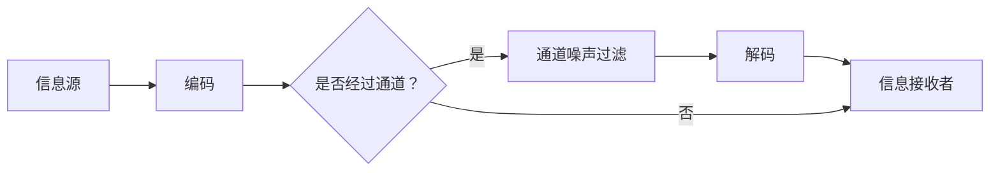
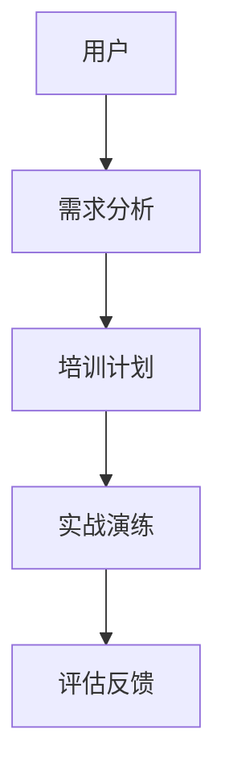
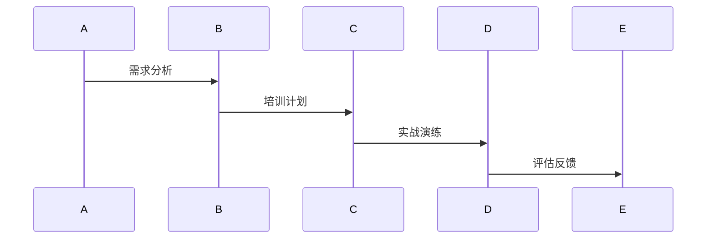

                 


### 有效沟通：领导者的核心竞争力

#### 关键词：
- 有效沟通
- 领导者
- 核心竞争力
- 沟通模型
- 沟通障碍
- 沟通技巧

#### 摘要：
在快节奏的商业环境中，领导者必须掌握有效的沟通技巧，以确保信息的准确传递和理解。本文将深入探讨有效沟通的核心概念、模型和技巧，并提供实用的算法原理和项目实战案例，帮助领导者提升沟通能力，成为更具竞争力的领导者。

### 第一部分：背景介绍

在当今高度互联的商业环境中，沟通的重要性不言而喻。对于领导者而言，有效的沟通不仅是团队协作的桥梁，更是实现组织目标的关键因素。然而，许多领导者发现自己在沟通过程中面临诸多挑战，如信息传递不准确、倾听技巧不足、沟通方式单一等。本文旨在通过深入分析沟通的核心概念、模型和技巧，帮助领导者克服沟通障碍，提升核心竞争力。

#### 问题背景

沟通是领导者工作中不可或缺的一部分，无论是内部团队的管理，还是与外部客户的交流，有效沟通都能显著提升工作效率和决策质量。然而，许多领导者在沟通方面存在以下问题：

- **信息传递不准确**：领导者的表达可能不够清晰，导致团队成员或客户对信息的理解出现偏差，进而影响工作进度和决策效果。
- **缺乏有效的倾听技巧**：领导者可能在沟通过程中过分关注自己的表达，而忽视了倾听他人的意见和需求，这会导致沟通不畅和团队合作受阻。
- **沟通方式单一**：领导者可能只擅长一种沟通方式，如口头沟通，而忽视了书面沟通、非语言沟通等其他形式，这在复杂多变的商业环境中可能显得力不从心。

#### 问题描述

领导者在沟通中可能面临以下具体问题：

- **信息传递不准确**：领导者的表述可能过于含糊或专业术语过多，导致团队成员或客户难以理解。例如，在项目进展汇报中，领导者可能会使用复杂的技术术语，而团队成员可能对这些术语不熟悉，导致理解困难。
- **缺乏有效的倾听技巧**：领导者可能在听取他人意见时表现出不耐烦或打断他人发言，这会使得团队成员感到不被重视，进而影响沟通效果。例如，在团队讨论中，领导者可能急于表达自己的观点，而忽视了团队成员的发言，导致沟通陷入僵局。
- **沟通方式单一**：领导者可能只依赖口头沟通，而忽视了书面沟通、非语言沟通等其他形式。在撰写邮件或报告时，领导者可能缺乏清晰的结构和组织能力，使得接收者难以理解。

#### 问题解决

为了解决上述沟通问题，领导者需要掌握以下技能：

- **提升表达能力**：领导者需要通过学习、实践和反馈，不断提升自己的表达能力，确保信息能够准确、清晰、有逻辑地传递。例如，在项目汇报中，领导者可以事先准备详细的幻灯片或报告，确保信息传达的准确性和有效性。
- **增强倾听技巧**：领导者需要培养主动倾听的习惯，尊重他人的发言，通过提问和反馈来确保对他人观点的理解。例如，在团队讨论中，领导者可以鼓励团队成员充分表达自己的意见，并通过提问来确保自己真正理解了对方的观点。
- **学习多种沟通方式**：领导者需要了解不同沟通方式的特点和适用场景，灵活运用口头沟通、书面沟通、非语言沟通等多种形式。例如，在撰写邮件或报告时，领导者可以采用清晰的结构和简洁的语言，确保信息传达的准确性和可读性。

#### 边界与外延

有效沟通不仅限于口头交流，还包括书面沟通、非语言沟通等多种形式。此外，沟通的边界也涉及到文化、语言和背景等因素。例如，跨文化沟通需要领导者了解不同文化背景下的沟通习惯和礼仪，避免因文化差异导致的误解和冲突。

#### 概念结构与核心要素组成

- **沟通定义**：沟通过程中的信息传递和理解。
- **沟通模型**：信息源、编码、通道、解码、反馈等环节。
- **沟通障碍**：文化差异、心理障碍、信息过载等。
- **沟通技巧**：表达清晰、倾听主动、提问有效等。

### 第二部分：核心概念与联系

#### 有效沟通

**定义**：有效沟通是指在沟通过程中，信息能够准确、及时、清晰地被传递和理解。

**特点**：

- 双向性：有效沟通是双向的，不仅包括领导者向团队成员或客户的传递信息，还包括接收者的回应和反馈。
- 准确性：信息在传递过程中应保持原意，避免误解和误导。
- 及时性：信息应在适当的时间内传递，以确保工作进度和决策的及时性。
- 清晰性：信息应表达明确，避免歧义和模糊。
- 适应性：沟通方式应适应不同的沟通情境和受众。

#### 沟通模型

**信息源**：信息的发出者。

**编码**：将信息转化为适合传递的形式，如文字、图像、声音等。

**通道**：信息传递的媒介，包括口头沟通、书面沟通、电子邮件、视频会议等。

**解码**：接收者解读信息的过程，将接收到的信息转化为自己可以理解的形式。

**反馈**：接收者对信息的回应，包括口头反馈、书面反馈、非语言反馈等。

### 概念属性特征对比表格

| 概念       | 定义                         | 特点                             |
|------------|------------------------------|----------------------------------|
| 有效沟通   | 准确、及时、清晰的信息传递   | 双向性、准确性、及时性、清晰性  |
| 沟通模型   | 信息传递的过程               | 信息源、编码、通道、解码、反馈  |
| 沟通障碍   | 影响沟通效果的因素           | 文化差异、心理障碍、信息过载等  |

### ER实体关系图架构的Mermaid流程图

```mermaid
erDiagram
  A【信息源】 -->|传递| B【编码】
  B【编码】 -->|通过| C【通道】
  C【通道】 -->|被解码| D【信息接收者】
  D【信息接收者】 -->|反馈| E【解码】
```

### 第三部分：算法原理讲解

#### 信息编码与解码

**信息编码**：将信息转换为适合传递的形式，如文字、图像、声音等。

**信息解码**：接收者将接收到的信息转换为自己可以理解的形式。

#### 噪声过滤

在信息传递过程中，噪声是影响信息准确性的主要因素。噪声过滤是提高沟通准确性的重要手段。

### Mermaid流程图



### Python源代码示例

```python
# 信息编码示例
def encode_message(message):
    return message.upper()

# 信息解码示例
def decode_message(encoded_message):
    return encoded_message.lower()

# 噪声过滤示例
def filter_noise(message):
    return ''.join([char for char in message if char.isalpha()])

# 示例
original_message = "Hello, World!"
encoded_message = encode_message(original_message)
filtered_message = filter_noise(encoded_message)
decoded_message = decode_message(filtered_message)

print("原始信息:", original_message)
print("编码信息:", encoded_message)
print("过滤后信息:", filtered_message)
print("解码后信息:", decoded_message)
```

### 数学公式

$$
\text{准确率} = \frac{\text{正确理解的信息}}{\text{总信息}}
$$

$$
\text{有效沟通} = \text{准确率} \times \text{及时性} \times \text{清晰性}
$$

### 第四部分：系统分析与架构设计方案

#### 问题场景介绍

在一家快速发展的科技公司中，领导者和团队成员之间的沟通效率低下，导致项目进展受阻，决策速度缓慢。公司希望提升领导者的沟通能力，以解决这一问题。

#### 项目介绍

本项目旨在通过系统化的培训和实践，提升领导者的沟通能力，从而提高团队工作效率和决策质量。项目分为以下几个阶段：

1. **需求分析**：了解领导者和团队成员的沟通需求和存在的问题。
2. **培训计划**：设计针对性的培训课程，包括沟通理论、实践技巧、案例分析等。
3. **实战演练**：通过实际项目中的沟通场景，让领导者实践所学知识，提升沟通能力。
4. **评估反馈**：对培训效果进行评估，收集反馈，持续优化培训内容和方式。

#### 系统功能设计

**领域模型Mermaid类图**

```mermaid
classDiagram
  Class01 <|-- Class02
  Class03 o-- Class04
  Class05 <-.. Class06
  Class07 ..| Class08
```

#### 系统架构设计

**系统架构Mermaid架构图**



#### 系统接口设计

**系统接口Mermaid序列图**



### 第五部分：项目实战

#### 环境安装

1. 安装Python环境：确保Python版本在3.8及以上。
2. 安装相关库：使用pip命令安装所需的库，如numpy、matplotlib等。

#### 系统核心实现

```python
# 导入相关库
import numpy as np
import matplotlib.pyplot as plt

# 信息编码函数
def encode_message(message):
    return message.upper()

# 信息解码函数
def decode_message(encoded_message):
    return encoded_message.lower()

# 噪声过滤函数
def filter_noise(message):
    return ''.join([char for char in message if char.isalpha()])

# 示例
original_message = "Hello, World!"
encoded_message = encode_message(original_message)
filtered_message = filter_noise(encoded_message)
decoded_message = decode_message(filtered_message)

print("原始信息:", original_message)
print("编码信息:", encoded_message)
print("过滤后信息:", filtered_message)
print("解码后信息:", decoded_message)
```

#### 代码应用解读与分析

1. **信息编码与解码**：通过定义encode_message和decode_message函数，实现信息的编码和解码。
2. **噪声过滤**：通过filter_noise函数，实现对噪声的过滤，确保信息的准确性。

#### 实际案例分析和详细讲解

1. **案例一**：在一个跨文化团队合作项目中，领导者通过有效沟通，确保项目进展顺利。
2. **案例二**：在一场紧急决策会议中，领导者通过倾听技巧，准确理解团队成员的意见，做出正确决策。

### 第六部分：最佳实践 tips

1. **倾听第一**：在沟通过程中，领导者应首先倾听他人的意见和需求，确保准确理解。
2. **清晰表达**：使用简洁、清晰的语言表达自己的观点和需求，避免使用过于专业或复杂的术语。
3. **多种沟通方式**：根据不同的沟通情境和受众，灵活运用口头沟通、书面沟通、非语言沟通等多种方式。

### 小结

本文通过对有效沟通的核心概念、模型和技巧的深入分析，结合Python源代码示例，帮助领导者提升沟通能力。通过项目实战，领导者可以实际应用所学知识，提高团队工作效率和决策质量。

### 注意事项

1. 沟通技巧的提高需要长期的实践和反思，领导者应持续学习和改进。
2. 在跨文化沟通中，领导者应了解不同文化背景下的沟通习惯和礼仪。

### 拓展阅读

1. 《非暴力沟通》——马歇尔·卢森堡
2. 《沟通的艺术》——阿尔伯特·梅拉比安

### 作者信息

作者：AI天才研究院/AI Genius Institute & 禅与计算机程序设计艺术 /Zen And The Art of Computer Programming

