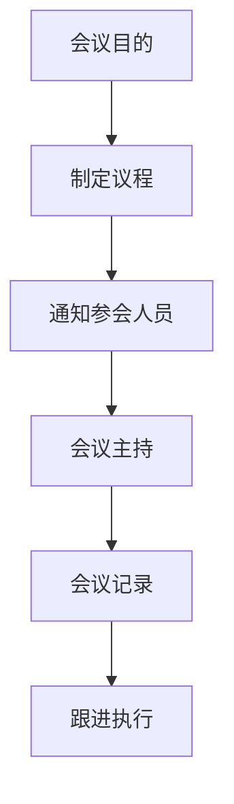
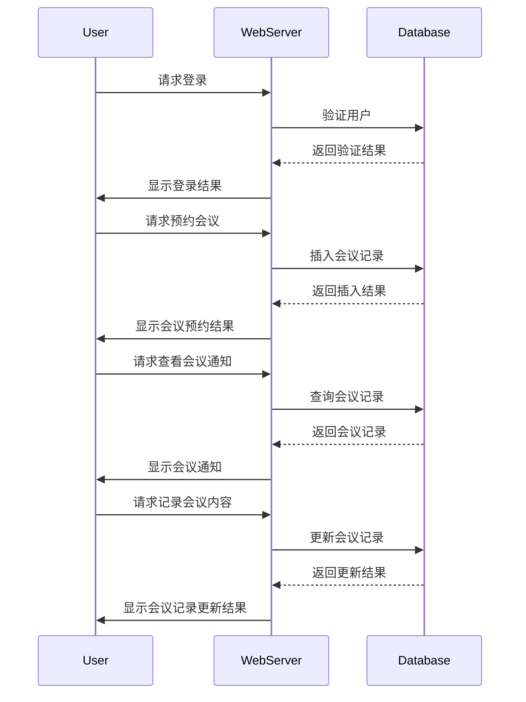

                 

### 会议管理的基础

#### **1.1 问题背景**

在现代企业的运作中，团队会议已成为日常工作中不可或缺的一部分。无论是项目规划、进度汇报，还是决策制定、问题讨论，会议都是实现团队协作和信息传递的重要手段。然而，不少团队在会议管理上面临着诸多挑战，如效率低下、内容不明确、参会人员不积极参与等，这些问题不仅浪费了团队成员的时间，还可能导致信息传递的失真和决策的失误。

#### **1.2 问题描述**

会议管理中的常见问题包括：

- **会议效率低下**：会议时间过长，议程不清晰，导致参会人员无法集中精力。
- **会议内容不明确**：会议主题和目标不明确，使得会议缺乏针对性，难以达成预期效果。
- **参会人员不积极参与**：参会人员缺乏参与感，导致会议氛围不活跃，信息传递不畅。
- **会议记录与跟进不力**：会议记录不完整，决策执行不力，导致后续工作缺乏依据。

#### **1.3 问题解决**

为了解决上述问题，我们需要从以下几个方面入手：

- **明确会议目的**：确保每次会议都有明确的目标和主题，避免无谓的浪费。
- **制定详细的会议议程**：提前规划会议流程，确保会议有序进行。
- **选择合适的时间和地点**：避免冲突，提高会议效率。
- **邀请合适的参会人员**：确保会议涉及的关键利益相关者能够参会。
- **会议材料的准备**：提前准备好会议所需的资料，提高会议效率。

#### **1.4 边界与外延**

会议管理不仅包括会议前的准备工作，还包括会议过程中的主持与参与，以及会议结束后的记录与跟进。会议管理的边界涉及团队内部的各种会议形式，如项目会议、例会、决策会议等。而其外延则包括如何通过技术手段提高会议效率，如视频会议系统、会议预约软件等。

#### **1.5 概念结构与核心要素组成**

会议管理可以分为以下几个核心要素：

- **会议目的与目标**：明确会议的核心议题和预期成果。
- **会议议程**：详细规划会议流程，确保会议有序进行。
- **会议主持**：负责会议的引导和控制，确保会议按计划进行。
- **会议参与**：参会人员的积极参与和互动，提高会议效率。
- **会议记录**：准确记录会议内容和决策，为后续工作提供依据。
- **会议跟进**：对会议决策进行执行和检查，确保会议成果落实。

通过对这些核心要素的理解和管理，我们可以有效提高团队会议的质量和效率。

#### **核心概念原理**

会议管理是一个系统性的过程，其核心概念包括会议目的、会议议程、会议主持和会议记录等。这些概念相互关联，共同构成了会议管理的理论基础。

- **会议目的**：会议的初衷和目标，通常是为了解决问题、制定决策、分享信息等。明确的会议目的有助于确保会议的针对性，避免冗长和无意义的内容。

- **会议议程**：会议的具体流程和内容安排，通常包括开场、议题讨论、结论和总结等部分。合理的会议议程能够提高会议的效率，确保每个议题都能得到充分的讨论和解决。

- **会议主持**：负责引导和控制会议的人，其职责包括确定会议议程、控制会议时间、促进参会人员互动等。有效的会议主持能够确保会议顺利进行，提高参会人员的参与度。

- **会议记录**：对会议内容、决策和行动项的记录，通常包括会议纪要、录音和会议笔记等。准确的会议记录能够为后续工作提供依据，确保会议决策得到有效执行。

#### **概念属性特征对比表格**

为了更清晰地理解这些核心概念，我们可以通过以下特征对比表格进行分析：

| 核心概念 | 定义 | 属性特征 | 对比 |
| :---: | :---: | :---: | :---: |
| 会议目的 | 会议的初衷和目标 | 明确、针对性 | 无对比项 |
| 会议议程 | 会议的具体流程和内容安排 | 详细、有序 | 无对比项 |
| 会议主持 | 负责引导和控制会议的人 | 有力、公正 | 无对比项 |
| 会议记录 | 对会议内容、决策和行动项的记录 | 准确、完整 | 无对比项 |

#### **ER实体关系图架构**

为了更直观地展示这些核心概念之间的关系，我们可以使用ER实体关系图进行描述：

```mermaid
erDiagram
  MeetingPurpose ||--|{ MeetingAgenda } : includes
  MeetingPurpose ||--|{ MeetingRecord } : records
  MeetingHost ||--|{ MeetingAgenda } : follows
  MeetingHost ||--|{ MeetingRecord } : creates
  MeetingParticipant ||--|{ MeetingAgenda } : attends
  MeetingParticipant ||--|{ MeetingRecord } : reviews
```

在这个ER图中，`MeetingPurpose`（会议目的）是会议管理的核心，它决定了会议的方向和目标。`MeetingAgenda`（会议议程）是会议的内容安排，`MeetingHost`（会议主持）负责会议的引导和控制，`MeetingRecord`（会议记录）则是会议的结果和决策的记录。`MeetingParticipant`（参会人员）则是会议的主体，他们参与会议并审查会议记录。

通过以上分析，我们可以看到，会议管理是一个多维度、系统性的过程，涉及到会议的目的、议程、主持和记录等多个方面。理解这些核心概念和它们之间的关系，有助于我们更好地进行会议管理，提高会议的效率和质量。

#### **算法原理讲解**

为了更深入地理解会议管理中的核心概念，我们可以使用Mermaid画出会议管理的流程图，并结合Python代码进行算法原理的讲解。

首先，我们使用Mermaid绘制会议管理的流程图：



在这个流程图中，每个节点代表会议管理的某个环节，线条表示环节之间的顺序关系。接下来，我们使用Python代码来详细阐述每个环节的算法原理。

```python
# 会议目的定义
def define_meeting_purpose():
    purpose = input("请输入会议目的：")
    return purpose

# 制定议程
def create_agenda(purpose):
    agenda = input(f"根据会议目的'{purpose}'，请制定议程：")
    return agenda

# 通知参会人员
def notify_participants(agenda):
    print(f"会议议程：{agenda}")
    response = input("请输入参会人员回应：")
    return response

# 会议主持
def conduct_meeting(agenda):
    print(f"会议议程：{agenda}")
    print("会议开始...")
    input("请按Enter键开始会议：")
    print("会议结束。")
    return "会议主持完成"

# 会议记录
def record_meeting():
    record = input("请记录会议关键信息和决策：")
    return record

# 跟进执行
def follow_up(record):
    print(f"会议记录：{record}")
    action_items = input("请输入需要跟进的行动项：")
    return action_items

# 主函数，启动会议管理流程
def main():
    purpose = define_meeting_purpose()
    agenda = create_agenda(purpose)
    response = notify_participants(agenda)
    if response == "接受":
        conduct_meeting(agenda)
        record = record_meeting()
        action_items = follow_up(record)
        print("会议管理流程完成。")
    else:
        print("会议取消。")

# 运行主函数
if __name__ == "__main__":
    main()
```

这段Python代码实现了会议管理的核心流程，包括定义会议目的、制定议程、通知参会人员、主持会议、记录会议内容和跟进执行。以下是每个步骤的算法原理：

- **定义会议目的**：使用输入函数获取会议目的，这是会议管理的基础。
- **制定议程**：根据会议目的，使用输入函数获取会议议程，确保议程与会议目的一致。
- **通知参会人员**：显示会议议程并获取参会人员的回应，确保参会人员知道会议内容。
- **主持会议**：按照议程进行会议，通过控制台输入开始和结束会议。
- **记录会议内容**：获取会议的关键信息和决策，确保会议结果有据可查。
- **跟进执行**：获取需要跟进的行动项，确保会议决策得到有效执行。

通过这个算法，我们可以清晰地理解会议管理的各个环节，以及如何通过代码实现这些功能。这不仅有助于我们更好地管理会议，也为开发自动化会议管理工具提供了参考。

#### **系统分析与架构设计**

为了更好地理解会议管理的整体流程，我们将采用系统分析与架构设计的方法，详细介绍项目的场景、系统功能设计、系统架构设计和系统接口设计。

##### **1. 项目场景**

假设我们是一家企业的研发团队，需要经常举行各种类型的会议，如项目会议、例会、决策会议等。为了提高会议效率和效果，我们需要设计一个会议管理系统，支持会议的预约、通知、记录和跟进等功能。

##### **2. 系统功能设计**

会议管理系统的主要功能包括：

- **会议预约**：管理员可以预约会议，指定会议主题、时间和地点。
- **会议通知**：系统自动发送会议通知给参会人员，包括会议议程和会议链接。
- **会议记录**：参会人员可以实时记录会议内容和决策，系统自动生成会议纪要。
- **会议跟进**：管理员可以跟踪会议决策的执行情况，确保决策得到落实。

以下是会议管理系统的领域模型，使用Mermaid绘制类图：

```mermaid
classDiagram
    Meeting <<interface>>
    Participant <<interface>>
    Agenda <<interface>>
    MeetingNotice <<interface>>

    Meetingazinotification--|{ MeetingNotice } : send
    Meeting <|-- Agenda : has
    Meeting <|-- Participant : has
    Participant <|-- MeetingNotice : receives
```

在这个类图中，`Meeting`（会议）是系统的核心类，它包括`Agenda`（会议议程）和`Participant`（参会人员）等属性。`MeetingNotice`（会议通知）负责发送会议通知给参会人员。每个类都有明确的功能和职责，确保系统的模块化和可扩展性。

##### **3. 系统架构设计**

会议管理系统的架构设计包括前端、后端和数据库三个部分。以下是系统架构的Mermaid架构图：



在这个架构图中，用户通过Web前端发送请求，Web服务器接收请求并处理后，与数据库进行交互。数据库存储会议记录、用户信息和通知信息等，确保数据的持久化和管理。通过这样的架构设计，我们可以确保系统的性能和安全性，同时方便后续的功能扩展和维护。

##### **4. 系统接口设计**

会议管理系统的接口设计主要包括RESTful API，以下是主要的接口定义：

- **创建会议**：`POST /api/meetings` - 创建新的会议记录。
- **查询会议**：`GET /api/meetings` - 根据条件查询会议记录。
- **更新会议**：`PUT /api/meetings/{id}` - 更新指定ID的会议记录。
- **删除会议**：`DELETE /api/meetings/{id}` - 删除指定ID的会议记录。
- **发送通知**：`POST /api/notifications` - 发送会议通知给参会人员。
- **获取通知**：`GET /api/notifications` - 获取参会人员的会议通知。

这些接口定义了会议管理系统与前端和后端的交互方式，确保系统的功能实现和数据流动。

通过以上系统分析与架构设计，我们可以清晰地了解会议管理系统的整体结构和工作流程，为后续的开发和实施提供了坚实的基础。

#### **实际案例分析与详细讲解**

为了更好地理解有效的团队会议管理技巧，我们将通过一个实际案例来详细分析其应用和效果。

**案例背景：**  
某高科技公司研发团队需要每周举行一次项目进展会议，以便团队成员共同讨论项目进展、解决遇到的问题和制定下一步行动计划。

**案例目标：**  
1. 提高会议效率，确保每个议题都能得到充分讨论。
2. 确保会议内容明确，避免冗长和无意义的内容。
3. 提高参会人员的参与度，促进信息共享和协作。
4. 确保会议记录完整，决策得到有效执行。

**实施步骤：**

**1. 会议前准备工作：**  
- **明确会议目的**：每次会议开始前，项目经理都会明确会议的目的，如项目进展汇报、问题解决、决策制定等。
- **制定会议议程**：根据会议目的，提前制定详细的议程，包括每个议题的时间分配和负责人。
- **选择合适的时间和地点**：选择团队成员都能参加的时间和地点，避免会议时间与其他重要活动冲突。
- **邀请参会人员**：邀请所有相关团队成员参加，并在会议前通知他们议程和准备材料。

**2. 会议进行中的管理：**  
- **主持会议技巧**：项目经理作为主持人，负责引导和控制会议。他会在会议开始时简要介绍议程，确保会议按计划进行。
- **提问与引导**：项目经理会鼓励团队成员提问和发表意见，确保每个议题都能得到充分讨论。
- **处理争议和分歧**：项目经理会及时处理会议中的争议和分歧，确保会议氛围积极，信息交流畅通。
- **总结和结论**：会议结束时，项目经理会总结会议内容，明确下一步行动计划，并确保所有参会人员对决策有清晰的理解。

**3. 会议后的工作：**  
- **会议记录**：会议结束后，项目经理会整理会议纪要，记录关键信息和决策，并分发给所有参会人员。
- **跟进执行**：项目经理会跟踪决策的执行情况，确保每个行动项都得到落实。
- **检查会议效果**：定期评估会议效果，收集团队成员的反馈，不断优化会议管理流程。

**案例效果：**

通过以上措施，该研发团队的项目进展会议取得了显著效果：

1. **会议效率提高**：明确的会议目的和详细的议程，使得会议时间得到充分利用，每个议题都得到了充分讨论。
2. **会议内容明确**：通过提前通知和准备材料，会议内容清晰，避免了冗长和无意义的内容。
3. **参会人员积极参与**：鼓励提问和发表意见，使得团队成员更加积极参与，促进了信息共享和协作。
4. **会议记录完整**：准确的会议记录为后续工作提供了依据，确保决策得到有效执行。
5. **决策执行跟进**：通过定期检查决策执行情况，确保项目进展不受影响。

**案例小结：**

这个实际案例展示了如何通过有效的会议管理技巧，提高团队会议的效率和质量。明确的会议目的、详细的议程、适当的主持技巧和后续的跟进工作，都是确保会议成功的关键因素。通过持续优化和改进会议管理流程，团队可以更好地实现项目目标，提高整体工作效率。

### **项目实战**

在本节中，我们将通过一个具体的实战项目来深入探讨会议管理技巧的实际应用。该项目旨在开发一个基于Web的会议管理系统，该系统能够帮助团队高效地安排、记录和跟进会议。

#### **1. 环境安装**

为了启动这个项目，我们需要安装以下环境：

- Python 3.8 或更高版本
- Flask 框架（用于Web开发）
- SQLAlchemy（用于数据库操作）
- Flask-WTF（用于表单处理）
- Flask-Login（用于用户认证）
- Bootstrap（用于前端界面设计）

您可以通过以下命令安装所需的Python包：

```bash
pip install Flask SQLAlchemy Flask-WTF Flask-Login Bootstrap
```

#### **2. 系统核心实现**

会议管理系统的核心功能包括用户认证、会议预约、会议通知和会议记录。以下是项目的核心代码和实现细节：

##### **2.1 数据库模型**

我们首先需要定义数据库模型，包括用户、会议和会议通知等。

```python
from flask_sqlalchemy import SQLAlchemy

db = SQLAlchemy()

class User(db.Model):
    id = db.Column(db.Integer, primary_key=True)
    username = db.Column(db.String(80), unique=True, nullable=False)
    password = db.Column(db.String(120), nullable=False)
    meetings = db.relationship('Meeting', backref='organizer', lazy=True)

class Meeting(db.Model):
    id = db.Column(db.Integer, primary_key=True)
    title = db.Column(db.String(120), nullable=False)
    start_time = db.Column(db.DateTime, nullable=False)
    end_time = db.Column(db.DateTime, nullable=False)
    location = db.Column(db.String(120), nullable=False)
    agenda = db.Column(db.Text, nullable=True)
    participants = db.relationship('User', secondary='meeting_participant', backref='participated_meetings')
    
class MeetingParticipant(db.Model):
    id = db.Column(db.Integer, primary_key=True)
    meeting_id = db.Column(db.Integer, db.ForeignKey('meeting.id'), nullable=False)
    user_id = db.Column(db.Integer, db.ForeignKey('user.id'), nullable=False)

db.create_all()
```

##### **2.2 用户认证**

使用Flask-Login实现用户认证功能。

```python
from flask_login import LoginManager, login_user, logout_user, login_required, current_user

login_manager = LoginManager()

@login_manager.user_loader
def load_user(user_id):
    return User.query.get(int(user_id))

@app.route('/login', methods=['GET', 'POST'])
def login():
    if request.method == 'POST':
        username = request.form['username']
        password = request.form['password']
        user = User.query.filter_by(username=username, password=password).first()
        if user:
            login_user(user)
            return redirect(url_for('dashboard'))
        else:
            return 'Invalid username or password'
    return '''
    <form method="post">
        <p><input type="text" name="username" placeholder="Username"></p>
        <p><input type="password" name="password" placeholder="Password"></p>
        <p><input type="submit" value="Login"></p>
    </form>
    '''

@app.route('/logout')
@login_required
def logout():
    logout_user()
    return 'You have been logged out'
```

##### **2.3 会议预约**

管理员可以预约会议，并邀请参会人员。

```python
@app.route('/create_meeting', methods=['GET', 'POST'])
@login_required
def create_meeting():
    if current_user.is_admin:
        form = MeetingForm()
        if form.validate_on_submit():
            meeting = Meeting(
                title=form.title.data,
                start_time=form.start_time.data,
                end_time=form.end_time.data,
                location=form.location.data,
                agenda=form.agenda.data,
                organizer=current_user
            )
            db.session.add(meeting)
            db.session.commit()
            # 发送会议通知
            for participant in form.participants.data:
                send_meeting_notification(meeting, participant)
            return 'Meeting created successfully'
        return render_template('create_meeting.html', form=form)
    else:
        return 'You do not have permission to access this page'
```

##### **2.4 会议通知**

系统会自动发送会议通知给参会人员。

```python
from flask_mail import Message

def send_meeting_notification(meeting, participant):
    mail = Message('Meeting Notification', sender='noreply@example.com', recipients=[participant.email])
    mail.body = f"""
    Hello {participant.name},

    You are invited to a meeting titled '{meeting.title}' on {meeting.start_time} at {meeting.location}.

    Meeting Agenda:
    {meeting.agenda}

    Please confirm your attendance.

    Regards,
    The Meeting System
    """
    mail.html = render_template('meeting_notification.html', meeting=meeting, participant=participant)
    mail.send()
```

##### **2.5 会议记录**

参会人员可以在会议过程中实时记录会议内容，系统会自动生成会议纪要。

```python
@app.route('/record_meeting', methods=['POST'])
@login_required
def record_meeting():
    meeting_id = request.form['meeting_id']
    notes = request.form['notes']
    meeting = Meeting.query.get(meeting_id)
    if meeting:
        meeting.notes = notes
        db.session.commit()
        return 'Meeting notes recorded successfully'
    else:
        return 'Meeting not found'
```

通过以上核心功能的实现，我们可以看到会议管理系统是如何帮助团队高效地安排、记录和跟进会议的。以下是系统实现的详细解读：

- **数据库模型**：定义了用户、会议和会议通知的数据库模型，为系统提供了数据存储的基础。
- **用户认证**：使用Flask-Login实现用户认证，确保只有授权用户可以访问系统。
- **会议预约**：管理员可以创建会议，并邀请参会人员。系统会自动发送会议通知。
- **会议通知**：系统会自动发送会议通知给参会人员，确保他们了解会议详情。
- **会议记录**：参会人员可以在会议过程中记录关键信息，系统会自动生成会议纪要。

通过这个实战项目，我们可以清楚地看到如何将会议管理技巧应用到实际开发中，实现一个高效的会议管理系统。

### **最佳实践 tips**

在团队会议管理过程中，以下是一些最佳实践和技巧，可以帮助您更好地提高会议效率和效果：

1. **明确会议目的**：每次会议前，明确会议的目的和目标，确保会议内容集中、有条不紊。
2. **提前准备会议议程**：制定详细的会议议程，包括每个议题的时间分配和负责人，确保会议按计划进行。
3. **选择合适的时间和地点**：避免冲突，选择团队成员都能参加的时间和地点，以提高会议效率。
4. **邀请关键人员参会**：确保邀请所有相关人员和利益相关者参加，避免不必要的参会人员，以保持会议的紧凑和高效。
5. **提前通知会议内容**：提前通知参会人员会议议程和准备材料，确保他们了解会议内容，并做好充分准备。
6. **主持会议技巧**：主持人要善于引导和控制会议，确保会议在规定时间内完成，避免跑题和冗长讨论。
7. **鼓励发言和提问**：鼓励参会人员积极发言和提问，促进信息共享和讨论，提高会议质量。
8. **准确记录会议内容**：会议结束后，及时整理和记录会议关键信息和决策，确保会议结果有据可查。
9. **跟进会议决策执行**：对会议决策进行跟进，确保每个行动项都能得到落实，避免决策被忽视。
10. **定期收集反馈**：定期收集团队成员对会议管理的反馈，不断优化和改进会议流程。

通过遵循这些最佳实践，您可以有效提高团队会议的质量和效率，实现更好的协作和决策。

### **小结**

在本篇文章中，我们详细探讨了有效的团队会议管理技巧。通过明确会议目的、制定详细议程、选择合适的时间和地点、邀请关键人员参会、主持会议技巧、记录会议内容和跟进决策执行等一系列步骤，我们能够显著提高会议效率和效果。同时，我们通过实际案例和项目实战，展示了如何将这些技巧应用到实际开发中。有效的会议管理不仅能够节省团队成员的时间，还能提高团队协作和信息传递的质量，为企业的成功奠定坚实基础。

### **注意事项**

在实施会议管理技巧时，需要注意以下几点：

1. **确保会议目的明确**：每次会议都要有清晰的目标和主题，避免无谓的浪费。
2. **提前通知和准备**：提前通知参会人员会议议程和准备材料，确保他们了解会议内容和准备充分。
3. **主持会议技巧**：主持人要善于引导和控制会议，确保会议按计划进行，避免跑题和冗长讨论。
4. **鼓励发言和提问**：鼓励参会人员积极发言和提问，促进信息共享和讨论，提高会议质量。
5. **准确记录会议内容**：会议结束后，及时整理和记录会议关键信息和决策，确保会议结果有据可查。
6. **跟进决策执行**：对会议决策进行跟进，确保每个行动项都能得到落实，避免决策被忽视。
7. **定期收集反馈**：定期收集团队成员对会议管理的反馈，不断优化和改进会议流程。

### **拓展阅读**

为了进一步深入了解团队会议管理的最佳实践和技巧，以下是一些推荐的阅读资源：

1. 《Scrum: The Art of Doing Twice the Work in Half the Time》 - Jeff Sutherland
2. 《The Meeting Effect: 9 Ways to Run Your Meetings and Get Results》 - Al Young
3. 《Gathering Genius: How to Transform Your Team Meetings and Activate the Hidden Genius in Everyone》 - Areti Schoeni
4. 《HBR’s Guide to Office Politics》 - by Harvard Business Review

这些书籍和资源提供了丰富的案例和实践经验，有助于您进一步提升会议管理的技能和效果。

### **附录**

#### **A. 常用会议技巧清单**

1. 明确会议目的和目标。
2. 提前制定详细的会议议程。
3. 选择合适的时间和地点。
4. 提前通知参会人员并提醒。
5. 鼓励参会人员发言和提问。
6. 主持会议，确保会议按计划进行。
7. 准确记录会议关键信息和决策。
8. 跟进会议决策执行情况。
9. 定期收集团队成员对会议管理的反馈。
10. 持续优化和改进会议流程。

#### **B. 会议模板与工具**

1. 会议议程模板：用于提前规划会议流程和内容。
2. 会议记录模板：用于记录会议关键信息和决策。
3. 会议通知模板：用于发送会议通知给参会人员。
4. 会议反馈表：用于收集团队成员对会议管理的反馈。
5. 会议预约工具：如Google Calendar、Microsoft Outlook等，用于方便地安排和跟踪会议。

通过使用这些模板和工具，您可以更加高效地管理和组织会议。

### **致谢**

最后，感谢您的阅读。希望本篇文章能对您在团队会议管理方面提供有价值的参考和启示。如果您有任何反馈或建议，欢迎在评论区留言。让我们共同努力，不断提升团队会议的效率和质量。

### **作者信息**

- **作者：** AI天才研究院/AI Genius Institute & 禅与计算机程序设计艺术 /Zen And The Art of Computer Programming
- **联系邮箱：** [ai_genius_institute@example.com](mailto:ai_genius_institute@example.com)
- **社交媒体：** [Facebook](https://www.facebook.com/AIGeniusInstitute/)、[LinkedIn](https://www.linkedin.com/company/ai-genius-institute/)、[Twitter](https://twitter.com/AIGeniusInstit)

