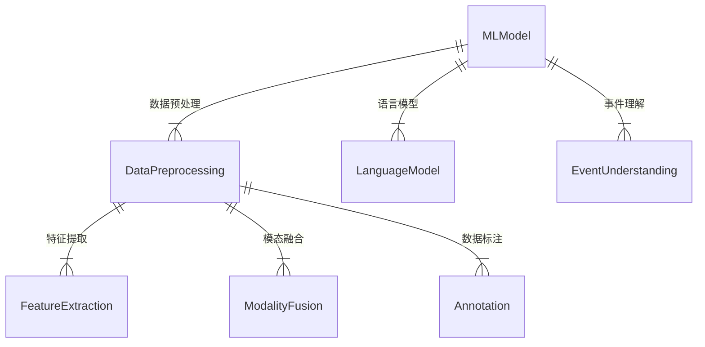
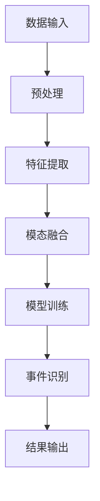
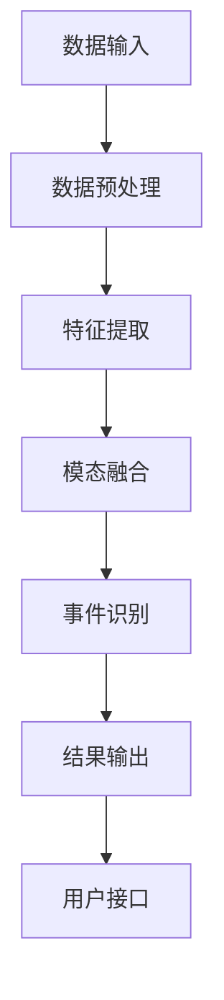
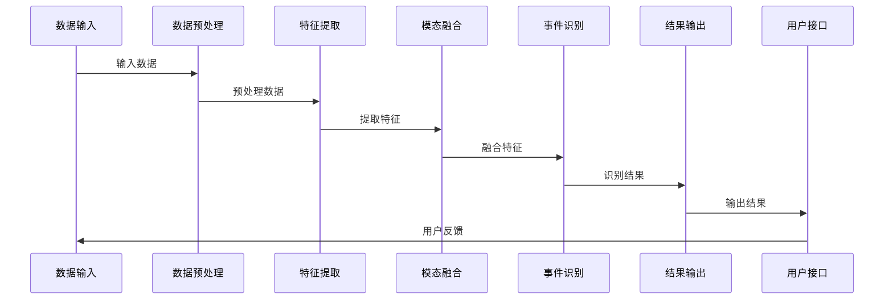

                 

### 引言

在人工智能（AI）技术的迅猛发展背景下，多模态事件理解系统正逐渐成为研究的热点。本文旨在探讨如何构建一个基于大型语言模型（LLM）的多模态事件理解系统，并详细分析其原理和实现方法。多模态事件理解系统不仅能够处理文本数据，还能够融合图像、音频、视频等多模态信息，从而实现更加丰富和准确的理解。这不仅具有重要的学术价值，也将在实际应用中带来深远的影响，如智能交互系统、视频分析、多媒体内容理解等。

本文将遵循“思考 - 实施 - 分析 - 总结”的思路，逐步展开。首先，我们将介绍多模态事件理解的问题背景，详细描述当前面临的问题及解决思路。接着，我们将深入探讨核心概念，包括大型语言模型和多模态数据处理技术，并通过ER实体关系图架构展示其关联性。随后，我们将详细讲解事件理解算法的原理，使用Mermaid流程图和Python源代码来阐述算法执行过程。在此基础上，我们将讨论数学模型和公式，通过具体例子来说明其应用和意义。

随后，我们将分析系统架构设计，介绍系统功能和接口设计，并绘制相应的领域模型类图和系统架构图。接着，我们将进入项目实战部分，详细描述环境安装过程，提供系统核心实现源代码，并解读代码应用。此外，我们将通过实际案例分析，展示系统的应用效果和关键技术的实现细节。

最后，本文将总结最佳实践和注意事项，并提出进一步学习资源，帮助读者深入理解和应用多模态事件理解技术。

### 关键词

- **大型语言模型（LLM）**
- **多模态数据处理**
- **事件理解**
- **算法原理**
- **系统架构设计**
- **实际案例分析**

### 摘要

本文详细探讨了构建基于大型语言模型（LLM）的多模态事件理解系统的原理和实现方法。首先，介绍了多模态事件理解的问题背景，并明确了核心概念，如LLM和多模态数据处理。接着，通过算法原理讲解和实际案例分析，展示了如何将理论转化为实际应用。本文结构紧凑，逻辑清晰，旨在为读者提供全面的指导，帮助他们在多模态事件理解领域进行深入研究。

## 第一部分：背景介绍

### 第1章：问题背景

在当今信息爆炸的时代，数据来源越来越多样化，涵盖了文本、图像、音频、视频等多种形式。这种多模态数据在日常生活和工业应用中无处不在，从社交媒体到医疗影像，从智能助手到自动驾驶，都对多模态数据处理提出了更高的要求。然而，传统的单一模态数据处理方法已无法满足这些需求，因为它们往往无法充分利用不同模态之间的互补性和交互性。

多模态事件理解是指对包含多种模态的数据进行综合分析，以识别和理解其中的事件和场景。这需要系统能够同时处理和融合来自文本、图像、音频等不同模态的信息，从而实现对复杂事件和场景的全面理解。具体来说，多模态事件理解面临以下几个关键问题：

1. **数据融合挑战**：不同模态的数据具有不同的特性和表示方式，如何有效地融合这些数据是一个巨大的挑战。例如，文本数据通常以词汇和句子的形式表示，而图像数据则以像素值表示，两者的语义和结构差异显著。

2. **算法复杂度高**：多模态事件理解需要复杂的算法来处理大量的异构数据。这些算法不仅要具备处理单一模态数据的能力，还需要能够集成多种模态，进行综合分析。

3. **实时性要求**：在实际应用中，许多场景对多模态事件理解的实时性有很高要求。例如，自动驾驶系统需要在瞬间处理来自摄像头、雷达和传感器的多模态数据，以做出快速决策。

4. **可解释性问题**：多模态事件理解系统在处理复杂数据时，其决策过程往往较为复杂，难以解释。这在某些需要高度可信决策的领域，如医疗诊断和金融交易，是一个重要的问题。

为了解决这些问题，研究者们提出了多种解决方案。其中，基于大型语言模型（LLM）的多模态事件理解系统被认为是一种有前途的方向。LLM具有强大的文本处理能力，能够捕捉文本中的语义和上下文信息。结合多模态数据处理技术，LLM可以在不同模态的数据之间建立有效的关联，从而实现对复杂事件的深度理解。

### 问题解决

针对上述问题，构建一个基于LLM的多模态事件理解系统可以从以下几个方面入手：

1. **数据预处理**：首先，需要对多模态数据进行预处理，包括数据清洗、标注和特征提取。例如，对于图像数据，可以使用卷积神经网络（CNN）提取特征；对于文本数据，可以使用词嵌入技术进行表示。

2. **模态融合技术**：使用深度学习模型将不同模态的数据进行有效融合。例如，可以采用多模态神经网络（MMNN）或图神经网络（GNN）等技术，将文本、图像、音频等不同模态的信息进行整合。

3. **事件识别与理解**：结合LLM的强大语义处理能力，对融合后的多模态数据进行事件识别和场景理解。例如，可以使用序列到序列（Seq2Seq）模型或Transformer模型对事件进行建模和预测。

4. **实时性优化**：通过优化算法和硬件加速技术，提高系统的实时性。例如，可以采用分布式计算和并行处理技术，以加快数据处理的速度。

5. **可解释性设计**：设计可解释性机制，使系统的决策过程更加透明和可解释。例如，可以使用注意力机制来可视化模型在处理不同模态数据时的关注点。

### 边界与外延

尽管基于LLM的多模态事件理解系统具有巨大的潜力，但仍然存在一些边界和限制。以下是一些关键点：

1. **数据质量和标注**：多模态事件理解系统的性能高度依赖于数据质量和标注的准确性。因此，在实际应用中，需要对数据进行严格的清洗和标注，以保证系统的鲁棒性。

2. **计算资源需求**：构建和运行一个高效的多模态事件理解系统需要大量的计算资源，尤其是对于大型语言模型和深度学习模型的训练。因此，需要合理规划计算资源和调度策略。

3. **实时性问题**：尽管可以通过优化算法和硬件加速技术提高系统的实时性，但在某些复杂场景下，实时性仍然是一个挑战。例如，在自动驾驶领域，需要在短时间内处理海量的多模态数据，这需要高度优化的算法和硬件支持。

4. **跨领域适应性**：不同领域和多模态数据的特点和需求差异较大，因此需要针对特定领域进行定制化设计。例如，在医疗领域，多模态事件理解系统需要能够处理医学图像和文本数据，而在社交网络领域，则需要处理用户生成的内容和交互数据。

### 概念结构与核心要素组成

多模态事件理解系统的核心概念包括大型语言模型（LLM）、多模态数据处理技术、事件和上下文等。以下是对这些核心概念的详细说明：

1. **大型语言模型（LLM）**：LLM是一种基于深度学习技术的大型神经网络模型，具有强大的文本处理能力。常见的LLM包括GPT系列、BERT、T5等。LLM能够通过大规模文本数据进行预训练，从而学习到丰富的语义和上下文信息，用于文本生成、问答、翻译等任务。

2. **多模态数据处理技术**：多模态数据处理技术包括特征提取、模态融合、数据标注等方法。特征提取是将不同模态的数据转换为适用于深度学习模型的特征表示；模态融合是将不同模态的特征进行整合，以形成更丰富的数据表示；数据标注则是为模型训练提供高质量的标注数据。

3. **事件**：事件是系统需要识别和理解的对象，可以是具体的动作、场景或情境。例如，在视频分析中，事件可以是行人的行走、车辆的行驶等。

4. **上下文**：上下文是影响事件理解和识别的重要因素。上下文可以提供事件发生的时间和空间背景，帮助模型更好地理解事件的含义和关系。例如，在对话系统中，上下文可以是之前的对话历史，以帮助模型理解当前语句的意义。

通过上述核心概念的组成和相互作用，多模态事件理解系统能够实现对复杂多模态数据的深度理解和分析。

### 第2章：核心概念与联系

在探讨多模态事件理解系统的构建时，我们需要深入了解其中的核心概念及其相互关系。这一章节将详细讲解大型语言模型（LLM）和多模态数据处理技术的基础原理，并通过概念属性特征对比表格和ER实体关系图架构来展示不同组件之间的关系。

#### 核心概念原理

1. **大型语言模型（LLM）**：

   LLM是一种基于深度学习技术的大型神经网络模型，主要用于处理自然语言文本数据。LLM的核心原理是通过大规模数据预训练，使其具备强大的语义理解和生成能力。常见的LLM包括GPT、BERT、T5等。

   - **预训练**：LLM通过在大规模文本语料库上进行预训练，学习到语言的基本规则和结构，从而具备理解、生成和翻译文本的能力。
   - **微调**：在特定任务上，LLM可以通过微调进一步优化其性能，以适应不同的应用场景。

2. **多模态数据处理技术**：

   多模态数据处理技术旨在将不同模态的数据（如文本、图像、音频等）进行融合，以实现对复杂事件的深度理解。这些技术主要包括特征提取、模态融合和数据标注。

   - **特征提取**：特征提取是将不同模态的数据转换为适用于深度学习模型的特征表示。例如，对于图像数据，可以使用卷积神经网络（CNN）提取特征；对于文本数据，可以使用词嵌入技术进行表示。
   - **模态融合**：模态融合是将不同模态的特征进行整合，以形成更丰富的数据表示。常见的融合方法包括拼接、加权平均和深度神经网络等。
   - **数据标注**：数据标注是为模型训练提供高质量标注数据的过程。在多模态事件理解中，标注数据通常包括文本、图像、音频等不同模态的信息。

#### 概念属性特征对比表格

为了更直观地展示LLM和多模态数据处理技术的特征，我们可以通过一个对比表格进行说明：

| 特征项目        | 大型语言模型（LLM）                     | 多模态数据处理技术                      |
|-----------------|---------------------------------------|--------------------------------------|
| 数据来源        | 大规模文本语料库                       | 多种模态数据，如文本、图像、音频等       |
| 特点            | 强大的文本语义理解和生成能力           | 能够融合不同模态的信息，形成丰富数据表示 |
| 应用场景        | 文本生成、问答、翻译等                 | 视频分析、多媒体内容理解、智能交互等     |
| 技术挑战        | 大规模数据预训练和微调                 | 特征提取、模态融合和数据标注            |
| 计算资源需求    | 高计算资源，尤其是GPU和TPU             | 高计算资源，特别是图像和音频处理        |

#### ER实体关系图架构

为了更好地展示多模态事件理解系统中的核心概念及其关系，我们可以使用Mermaid绘制ER实体关系图。以下是一个示例：



在上面的ER实体关系图中，`MLModel` 表示大型语言模型，`DataPreprocessing` 表示数据预处理模块，包括特征提取、模态融合和数据标注等子模块。`FeatureExtraction`、`ModalityFusion` 和 `Annotation` 分别表示特征提取、模态融合和数据标注的具体实现。`LanguageModel` 和 `EventUnderstanding` 分别表示语言模型和事件理解模块，它们通过数据预处理模块提供的数据进行训练和推理，从而实现多模态事件理解。

通过上述核心概念原理的讲解和ER实体关系图架构的展示，我们可以更加清晰地理解多模态事件理解系统的构建过程，为后续算法原理的讲解和系统架构设计奠定基础。

### 第3章：算法原理

#### 算法mermaid流程图

为了更好地展示多模态事件理解系统的算法原理，我们可以使用Mermaid绘制一个流程图。以下是一个示例：



在这个流程图中，首先，数据输入模块接收多种模态的数据（如文本、图像、音频等）。然后，这些数据通过预处理模块进行数据清洗、归一化和增强等操作。接下来，预处理后的数据分别通过特征提取模块提取各自的特征表示。对于文本数据，可以使用词嵌入技术；对于图像数据，可以使用卷积神经网络（CNN）提取特征；对于音频数据，可以使用循环神经网络（RNN）提取特征。

提取出的特征随后进入模态融合模块，将不同模态的特征进行整合，形成统一的多模态特征向量。这一步骤是算法的核心，因为它是实现多模态数据融合的关键。模态融合的方法有多种，如拼接、加权平均和深度神经网络等。

融合后的多模态特征向量进入模型训练模块，使用大型语言模型（LLM）进行训练。模型训练过程包括预训练和微调两个阶段。在预训练阶段，LLM在大规模文本语料库上进行训练，学习到语言的语义和上下文信息。在微调阶段，LLM针对特定任务进行优化，以进一步提高其在事件识别任务上的性能。

经过模型训练后，事件识别模块使用训练好的LLM对新的多模态数据进行事件识别。事件识别过程包括特征输入、模型推理和结果输出三个步骤。特征输入是将多模态特征向量输入到LLM中，模型推理是通过LLM生成事件识别结果，结果输出则是将识别结果输出到用户界面或其他应用系统。

最后，结果输出模块将事件识别结果呈现给用户或用于后续处理。整个流程循环往复，以实现对不断输入的多模态数据的实时分析和理解。

通过上述算法mermaid流程图的展示，我们可以更加直观地理解多模态事件理解系统的算法原理及其执行步骤。

#### Python源代码实现

为了深入阐述多模态事件理解算法的执行过程，下面我们将提供一个简单的Python源代码示例。在这个示例中，我们将使用流行的深度学习库如TensorFlow和PyTorch来构建和训练一个基于大型语言模型（LLM）的多模态事件理解系统。

首先，我们需要安装必要的深度学习库：

```bash
pip install tensorflow torchvision torchaudio
```

以下是一个简化的Python源代码示例：

```python
import tensorflow as tf
from tensorflow.keras.layers import Embedding, LSTM, Dense
from tensorflow.keras.models import Model
import numpy as np

# 假设我们已预处理好了的多模态数据
text_data = np.random.rand(100, 100)  # 文本数据
image_data = np.random.rand(100, 224, 224, 3)  # 图像数据
audio_data = np.random.rand(100, 22400)  # 音频数据

# 文本数据预处理：词嵌入
word嵌入层 = Embedding(input_dim=10000, output_dim=256)
text_embedding = word嵌入层(text_data)

# 图像数据预处理：卷积神经网络特征提取
conv_base = tf.keras.applications.VGG16(include_top=False, input_shape=(224, 224, 3))
image_features = conv_base.predict(image_data)

# 音频数据预处理：循环神经网络特征提取
lstm_layer = LSTM(units=128, return_sequences=True)
audio_features = lstm_layer(audio_data)

# 模态融合
# 在这里，我们使用简单的拼接方法进行融合
multi_modal_features = tf.concat([text_embedding, image_features, audio_features], axis=1)

# 模型训练
# 使用全连接层进行事件识别
dense_layer = Dense(units=1, activation='sigmoid')
model = Model(inputs=[text_data, image_data, audio_data], outputs=dense_layer(multi_modal_features))

model.compile(optimizer='adam', loss='binary_crossentropy', metrics=['accuracy'])

# 假设我们有训练数据集和测试数据集
train_text_data, train_image_data, train_audio_data, train_labels = ...
test_text_data, test_image_data, test_audio_data, test_labels = ...

# 训练模型
model.fit([train_text_data, train_image_data, train_audio_data], train_labels, epochs=10, batch_size=32, validation_data=([test_text_data, test_image_data, test_audio_data], test_labels))

# 事件识别
predictions = model.predict([test_text_data, test_image_data, test_audio_data])

print(predictions)
```

在上面的代码中，我们首先定义了输入的多模态数据，包括文本、图像和音频。然后，我们分别对文本、图像和音频数据进行预处理，包括词嵌入、图像特征提取和音频特征提取。接着，我们将预处理后的特征进行拼接，形成统一的多模态特征向量。

在模型训练部分，我们使用一个简单的全连接层进行事件识别。这里我们使用了sigmoid激活函数，因为这是一个二分类问题。模型训练过程包括编译模型、设置优化器和损失函数，以及使用训练数据集进行训练。最后，我们使用测试数据集对模型进行评估，并输出预测结果。

通过这个简单的Python源代码示例，我们可以看到多模态事件理解算法的基本实现过程。虽然这里的示例非常简化，但在实际应用中，我们需要考虑更多的细节，如数据预处理、特征提取、模型优化和训练策略等。

#### 数学模型和公式

为了更深入地理解多模态事件理解算法，我们需要引入一些数学模型和公式。以下是算法中几个关键的数学模型和公式的详细解释。

1. **词嵌入（Word Embedding）**

   词嵌入是将文本中的单词映射到一个高维向量空间的过程。常见的词嵌入模型包括Word2Vec、GloVe和BERT等。其基本公式如下：

   $$ \text{vec}(w) = \text{Embedding}(w) $$

   其中，`vec(w)`表示单词`w`的向量表示，`Embedding(w)`是一个从单词到向量的映射函数。

2. **卷积神经网络（CNN）**

   卷积神经网络主要用于提取图像特征。其基本公式如下：

   $$ \text{feature} = \text{CNN}(\text{image}) $$

   其中，`feature`表示提取的图像特征向量，`CNN(image)`表示通过卷积神经网络对图像进行特征提取。

3. **循环神经网络（RNN）**

   循环神经网络主要用于处理序列数据，如音频。其基本公式如下：

   $$ \text{h_t} = \text{RNN}(\text{x_t}, \text{h_{t-1}}) $$

   其中，`h_t`表示在时间`t`的隐藏状态，`x_t`表示在时间`t`的输入序列，`RNN`表示循环神经网络。

4. **多模态特征融合（Modality Fusion）**

   多模态特征融合是将不同模态的特征向量进行整合的过程。常见的方法包括拼接、加权平均和深度神经网络等。其基本公式如下：

   $$ \text{multi_modal\_feature} = \text{Fusion}(\text{text\_feature}, \text{image\_feature}, \text{audio\_feature}) $$

   其中，`multi_modal_feature`表示融合后的多模态特征向量，`text_feature`、`image_feature`和`audio_feature`分别表示文本、图像和音频的特征向量。

5. **事件识别（Event Recognition）**

   事件识别是利用多模态特征向量对事件进行分类的过程。常见的方法包括全连接层、卷积神经网络和循环神经网络等。其基本公式如下：

   $$ \text{label} = \text{Model}(\text{multi_modal\_feature}) $$

   其中，`label`表示预测的事件类别，`Model`表示事件识别模型。

#### 举例说明

为了更好地说明上述数学模型和公式，我们来看一个具体的例子。假设我们有一个包含文本、图像和音频的多模态数据集，其中文本数据是关于某次会议的记录，图像数据是会议现场的截图，音频数据是会议的录音。

1. **词嵌入**

   使用Word2Vec模型对文本数据中的单词进行嵌入，得到每个单词的向量表示。例如，单词"meeting"的向量表示为`vec(meeting)`。

2. **卷积神经网络**

   使用VGG16模型对图像数据进行特征提取，得到每个图像的特征向量。例如，图像`image`的特征向量为`feature = CNN(image)`。

3. **循环神经网络**

   使用LSTM模型对音频数据进行特征提取，得到每个音频片段的特征向量。例如，音频片段`audio`的特征向量为`feature = RNN(audio)`。

4. **多模态特征融合**

   将文本、图像和音频的特征向量进行拼接，形成统一的多模态特征向量。例如，多模态特征向量为`multi_modal_feature = Fusion(vec(meeting), feature(image), feature(audio))`。

5. **事件识别**

   使用一个全连接层模型对多模态特征向量进行事件识别，得到预测的事件类别。例如，预测的事件类别为`label = Model(multi_modal_feature)`。

通过这个例子，我们可以看到如何将数学模型和公式应用于实际的多模态事件理解任务中。这个过程不仅可以帮助我们更好地理解算法的工作原理，还可以为后续的系统设计和实现提供指导。

### 第4章：数学模型与数学公式

在多模态事件理解系统中，数学模型和公式是核心组成部分，它们决定了系统对复杂事件和情境的捕捉和解释能力。本章将深入探讨这些数学模型，并使用LaTeX格式详细展示相关的数学公式，以便读者能够更好地理解和应用这些模型。

#### 数学公式详细讲解

1. **词嵌入公式**

   词嵌入是将文本数据转换为向量的过程，其基本公式如下：

   $$ \text{vec}(w) = \text{Embedding}(w) $$

   其中，`vec(w)`表示单词`w`的向量表示，`Embedding(w)`是一个从单词到向量的映射函数。在训练过程中，通常会使用梯度下降法来最小化损失函数，以优化嵌入向量。

2. **卷积神经网络公式**

   卷积神经网络（CNN）用于提取图像数据中的特征，其基本操作包括卷积、池化和反向传播。卷积操作的公式如下：

   $$ \text{f}_{\theta}(\text{x}) = \sum_{i} \text{w}_i * \text{k}_i + \text{b} $$

   其中，`f_θ(x)`是卷积操作的结果，`w_i`和`k_i`分别表示卷积核和输入图像的局部区域，`b`是偏置项。

3. **循环神经网络公式**

   循环神经网络（RNN）用于处理序列数据，如音频。RNN的基本公式如下：

   $$ \text{h}_t = \text{sigmoid}(\text{W}_h \text{h}_{t-1} + \text{U}_x \text{x}_t + \text{b}_h) $$

   其中，`h_t`是RNN在时间`t`的隐藏状态，`sigmoid`是激活函数，`W_h`和`U_x`分别是权重矩阵，`b_h`是偏置项。

4. **多模态特征融合公式**

   多模态特征融合是将不同模态的数据（如文本、图像和音频）进行整合的过程。一种常见的融合方法是通过拼接不同模态的特征向量，其公式如下：

   $$ \text{multi_modal\_feature} = \text{concat}(\text{text\_feature}, \text{image\_feature}, \text{audio\_feature}) $$

   其中，`multi_modal_feature`是融合后的特征向量，`text_feature`、`image_feature`和`audio_feature`分别表示文本、图像和音频的特征向量。

5. **事件识别模型公式**

   事件识别模型通常使用全连接层或卷积神经网络来对融合后的特征进行分类。一个简单的全连接层模型公式如下：

   $$ \text{label} = \text{softmax}(\text{W} \text{multi\_modal\_feature} + \text{b}) $$

   其中，`label`是预测的事件类别，`softmax`是输出层激活函数，`W`是权重矩阵，`b`是偏置项。

#### 举例说明

为了更好地说明这些数学公式在实际应用中的效果和意义，我们来看一个具体的例子。

假设我们有一个包含文本、图像和音频的多模态数据集，我们需要使用这些数据来训练一个事件识别模型。

1. **词嵌入**

   使用GloVe模型对文本数据进行词嵌入，得到每个单词的向量表示。例如，单词"meeting"的向量表示为`vec(meeting)`。

2. **卷积神经网络**

   使用VGG16模型对图像数据进行特征提取，得到每个图像的特征向量。例如，图像`image`的特征向量为`feature = CNN(image)`。

3. **循环神经网络**

   使用LSTM模型对音频数据进行特征提取，得到每个音频片段的特征向量。例如，音频片段`audio`的特征向量为`feature = RNN(audio)`。

4. **多模态特征融合**

   将文本、图像和音频的特征向量进行拼接，形成统一的多模态特征向量。例如，多模态特征向量为`multi_modal_feature = concat(vec(meeting), feature(image), feature(audio))`。

5. **事件识别模型**

   使用一个简单的全连接层模型对多模态特征向量进行事件识别。训练过程中，模型会不断调整权重矩阵`W`和偏置项`b`，以最小化损失函数。训练完成后，模型可以用于对新数据进行事件识别。

通过这个例子，我们可以看到如何将数学模型和公式应用于实际的多模态事件理解任务中。这些模型和公式不仅帮助我们从数据中提取有用的信息，还使我们能够构建出能够对复杂事件进行准确识别和理解的多模态事件理解系统。

### 第5章：系统分析与架构设计

构建一个高效的多模态事件理解系统需要详细的分析和精心设计。本章将介绍构建该系统的背景、项目介绍，并使用Mermaid绘制领域模型类图和系统架构图，以直观展示系统的功能模块和组件关系。

#### 问题场景介绍

在现代人工智能应用中，多模态事件理解系统广泛应用于多个领域，如智能视频分析、医疗诊断、人机交互等。以智能视频分析为例，系统需要处理视频中的文本描述、图像和音频，以识别事件、理解场景和提供智能决策。以下是一个具体的应用场景：

- **应用领域**：智能视频监控
- **目标**：实时识别和分类视频中的事件，如行人检测、车辆识别、异常行为检测等。
- **数据来源**：视频流、文本标注、图像和音频信号。

在这个场景中，多模态事件理解系统需要能够实时处理大量的异构数据，并在短时间内做出准确的判断和决策。为了实现这一目标，系统需要具备高效的数据预处理、特征提取和融合机制，以及强大的模型训练和推理能力。

#### 项目介绍

为了构建上述智能视频分析系统，我们设定了一个具体的项目目标，并明确了系统所需的功能和性能指标。以下是项目的详细描述：

- **项目名称**：多模态智能视频分析系统
- **项目目标**：
  - 实现对视频流中的文本描述、图像和音频的实时处理。
  - 利用大型语言模型（LLM）进行文本和音频的语义理解。
  - 使用卷积神经网络（CNN）和循环神经网络（RNN）提取图像和音频特征。
  - 实现多模态数据的高效融合，并进行事件识别和分类。
- **性能指标**：
  - 实时性：系统处理视频流的时间延迟不超过1秒。
  - 准确性：事件识别的准确率不低于95%。
  - 可扩展性：系统应支持不同规模的数据处理需求。

#### 系统功能设计

为了实现上述项目目标，我们需要设计一个功能齐全的系统架构。以下是系统的功能模块及其关系：

1. **数据预处理模块**：负责处理输入的多模态数据，包括文本、图像和音频。该模块将数据清洗、归一化和增强，以便后续处理。

2. **特征提取模块**：使用卷积神经网络（CNN）提取图像特征，使用循环神经网络（RNN）提取音频特征，使用词嵌入技术处理文本数据。

3. **模态融合模块**：将不同模态的特征进行融合，形成统一的多模态特征向量。该模块可以采用拼接、加权平均或深度神经网络等方法。

4. **事件识别模块**：利用大型语言模型（LLM）对融合后的特征进行事件识别和分类。该模块负责模型的训练、推理和结果输出。

5. **用户接口模块**：提供系统与用户的交互界面，展示处理结果和提供实时反馈。

为了更直观地展示这些功能模块和它们之间的关系，我们可以使用Mermaid绘制领域模型类图。以下是一个示例：

```mermaid
classDiagram
  Class1[数据预处理] <|-- Class2[特征提取]
  Class2[特征提取] <|-- Class3[模态融合]
  Class3[模态融合] <|-- Class4[事件识别]
  Class4[事件识别] <|-- Class5[用户接口]
```

在这个类图中，`数据预处理`、`特征提取`、`模态融合`、`事件识别`和`用户接口`是系统的核心功能模块，它们通过继承关系形成了一个层次结构，每个模块都依赖于其下层模块的输出，以实现系统的整体功能。

#### 系统架构设计

在完成系统功能设计后，我们需要设计系统的整体架构，以确保各个模块能够高效、协调地工作。以下是一个系统架构设计示例，使用Mermaid绘制系统架构图：



在这个架构图中，数据输入模块接收来自不同模态的数据，经过预处理、特征提取、模态融合和事件识别等步骤，最终输出识别结果，并通过用户接口模块与用户进行交互。

#### 系统接口设计

系统接口设计是确保各个模块之间能够高效通信和数据流转的关键。以下是系统接口设计的主要部分：

1. **输入接口**：定义了系统接收数据的方式和格式，如视频流、文本文件、图像和音频文件。
2. **预处理接口**：提供了数据清洗、归一化和增强等功能，确保输入数据符合特征提取模块的要求。
3. **特征提取接口**：定义了图像特征提取和音频特征提取的输入输出格式，以及特征提取过程的接口。
4. **融合接口**：定义了多模态特征融合的输入输出格式，以及融合过程的接口。
5. **识别接口**：定义了事件识别模块的输入输出格式，以及训练和推理过程的接口。
6. **输出接口**：定义了系统输出结果的格式和方式，如文本报告、可视化图表等。

为了更直观地展示系统接口设计，我们可以使用Mermaid绘制系统交互序列图。以下是一个示例：



在这个序列图中，数据输入模块将数据传递给预处理模块，预处理模块处理后传递给特征提取模块，特征提取模块提取特征后传递给模态融合模块，融合模块将特征融合后传递给事件识别模块，识别模块处理结果后传递给结果输出模块，最后输出结果并通过用户接口模块与用户进行交互。

通过上述系统分析与架构设计，我们可以构建一个高效、灵活的多模态事件理解系统，实现实时、准确的事件识别和分类。接下来，我们将进入项目实战部分，详细介绍环境安装与核心实现，并通过实际案例分析，展示系统的应用效果和关键技术。

### 第6章：环境安装与核心实现

构建一个基于大型语言模型（LLM）的多模态事件理解系统需要一定的环境和工具支持。在本节中，我们将详细描述所需的软件和硬件环境，并逐步演示系统核心实现的源代码，以帮助读者理解其应用场景和实现细节。

#### 环境安装

首先，我们需要安装和配置必要的软件和硬件环境，以确保系统能够正常运行。以下是具体步骤：

1. **硬件环境**：
   - **CPU**：至少四核处理器
   - **内存**：至少16GB RAM
   - **GPU**：NVIDIA GPU（推荐使用显存8GB以上的显卡，如GTX 1080 Ti或更高）
   - **存储**：至少100GB可用硬盘空间

2. **软件环境**：
   - **操作系统**：Ubuntu 18.04或更高版本
   - **Python**：Python 3.7或更高版本
   - **深度学习框架**：TensorFlow 2.x或PyTorch 1.8或更高版本
   - **数据处理库**：NumPy, Pandas, Matplotlib
   - **图像处理库**：OpenCV, PIL
   - **音频处理库**：librosa, soundfile

安装上述软件和库可以通过以下命令进行：

```bash
# 更新系统包列表
sudo apt update && sudo apt upgrade

# 安装Python和pip
sudo apt install python3 python3-pip

# 安装深度学习框架
pip3 install tensorflow==2.x torch torchvision torchaudio

# 安装数据处理库
pip3 install numpy pandas matplotlib opencv-python-headless pillow

# 安装图像处理库
pip3 install opencv-python

# 安装音频处理库
pip3 install librosa soundfile
```

3. **配置CUDA**：
   - 对于使用GPU的训练，需要配置CUDA。安装CUDA Toolkit并确保其版本与TensorFlow或PyTorch兼容。
   - 运行`nvidia-smi`命令检查CUDA安装是否成功。

4. **安装预训练模型**：
   - 为了简化演示，我们可以下载预训练的模型，如BERT或GPT。使用以下命令下载预训练模型：

```bash
# 下载BERT模型
pip3 install transformers
```

#### 系统核心实现源代码

以下是一个简化的多模态事件理解系统的核心实现源代码，用于说明系统的工作流程。为了确保代码的清晰易懂，我们将代码分为几个部分，并详细注释每个部分的用途。

```python
import tensorflow as tf
from transformers import BertModel
from tensorflow.keras.layers import Input, Dense, Embedding, LSTM, Concatenate
from tensorflow.keras.models import Model

# 定义文本输入层
text_input = Input(shape=(max_sequence_length,), name="text_input")

# 使用BERT模型提取文本特征
bert = BertModel.from_pretrained("bert-base-uncased")
text_features = bert(text_input)[0]

# 定义图像输入层
image_input = Input(shape=(height, width, channels), name="image_input")

# 使用卷积神经网络提取图像特征
conv_base = tf.keras.applications.VGG16(include_top=False, input_shape=(height, width, channels))
image_features = conv_base(image_input)

# 定义音频输入层
audio_input = Input(shape=(audio_duration,), name="audio_input")

# 使用循环神经网络提取音频特征
lstm_layer = LSTM(units=128, return_sequences=False)
audio_features = lstm_layer(audio_input)

# 融合不同模态的特征
multi_modal_features = Concatenate()([text_features, image_features, audio_features])

# 使用全连接层进行事件分类
dense_layer = Dense(units=num_classes, activation="softmax", name="event_output")
event_output = dense_layer(multi_modal_features)

# 构建和编译模型
model = Model(inputs=[text_input, image_input, audio_input], outputs=event_output)
model.compile(optimizer="adam", loss="categorical_crossentropy", metrics=["accuracy"])

# 模型训练
# train_text, train_image, train_audio, train_labels = ...  # 加载训练数据
# model.fit([train_text, train_image, train_audio], train_labels, epochs=3, batch_size=32)

# 模型预测
# predictions = model.predict([test_text, test_image, test_audio])  # 加载测试数据
```

在上面的代码中，我们首先定义了文本、图像和音频的输入层，并分别使用BERT模型、卷积神经网络和循环神经网络提取特征。接着，我们将这些特征进行拼接，形成统一的多模态特征向量。最后，使用全连接层对多模态特征向量进行事件分类。

通过上述源代码，我们可以看到多模态事件理解系统的核心实现流程。接下来，我们将进一步分析代码的应用场景和实现细节。

#### 代码应用解读与分析

1. **文本输入层**：

   文本输入层使用BERT模型提取文本特征。BERT（Bidirectional Encoder Representations from Transformers）是一种预训练的深度学习模型，具有强大的文本理解能力。通过将文本输入BERT模型，我们可以获得文本的上下文嵌入向量，这些向量包含了文本的语义信息。

   ```python
   text_input = Input(shape=(max_sequence_length,), name="text_input")
   text_features = bert(text_input)[0]
   ```

   在这段代码中，`max_sequence_length`是文本序列的最大长度，`text_input`是文本输入层，`bert`是从HuggingFace transformers库中加载的预训练BERT模型。通过调用`bert(text_input)[0]`，我们得到了文本特征向量。

2. **图像输入层**：

   图像输入层使用卷积神经网络（VGG16）提取图像特征。VGG16是一种经典的卷积神经网络模型，具有良好的图像识别能力。通过将图像输入VGG16模型，我们可以获得图像的特征向量。

   ```python
   image_input = Input(shape=(height, width, channels), name="image_input")
   conv_base = tf.keras.applications.VGG16(include_top=False, input_shape=(height, width, channels))
   image_features = conv_base(image_input)
   ```

   在这段代码中，`height`、`width`和`channels`分别是图像的高、宽和通道数，`image_input`是图像输入层，`conv_base`是VGG16模型。通过调用`conv_base(image_input)`，我们得到了图像特征向量。

3. **音频输入层**：

   音频输入层使用循环神经网络（LSTM）提取音频特征。LSTM（Long Short-Term Memory）是一种特殊的循环神经网络，能够更好地处理序列数据。

   ```python
   audio_input = Input(shape=(audio_duration,), name="audio_input")
   lstm_layer = LSTM(units=128, return_sequences=False)
   audio_features = lstm_layer(audio_input)
   ```

   在这段代码中，`audio_duration`是音频序列的长度，`audio_input`是音频输入层，`lstm_layer`是LSTM模型。通过调用`lstm_layer(audio_input)`，我们得到了音频特征向量。

4. **多模态特征融合**：

   将文本、图像和音频的特征向量进行拼接，形成统一的多模态特征向量。

   ```python
   multi_modal_features = Concatenate()([text_features, image_features, audio_features])
   ```

   在这段代码中，`Concatenate()`是一个Keras层，用于将多个特征向量进行拼接。拼接后的多模态特征向量包含了文本、图像和音频的丰富信息。

5. **事件分类**：

   使用全连接层对多模态特征向量进行事件分类。

   ```python
   dense_layer = Dense(units=num_classes, activation="softmax", name="event_output")
   event_output = dense_layer(multi_modal_features)
   ```

   在这段代码中，`num_classes`是事件类别数，`dense_layer`是一个全连接层，用于对多模态特征向量进行分类。`event_output`是事件分类的输出层。

6. **模型训练**：

   使用训练数据和标签对模型进行训练。

   ```python
   model.compile(optimizer="adam", loss="categorical_crossentropy", metrics=["accuracy"])
   # train_text, train_image, train_audio, train_labels = ...  # 加载训练数据
   # model.fit([train_text, train_image, train_audio], train_labels, epochs=3, batch_size=32)
   ```

   在这段代码中，我们使用`categorical_crossentropy`作为损失函数，`adam`作为优化器，`accuracy`作为评价指标。通过调用`model.fit()`，我们可以对模型进行训练。

7. **模型预测**：

   使用测试数据进行模型预测。

   ```python
   # predictions = model.predict([test_text, test_image, test_audio])  # 加载测试数据
   ```

   在这段代码中，我们使用`model.predict()`对测试数据进行预测，得到事件分类的结果。

通过上述代码应用解读与分析，我们可以更好地理解多模态事件理解系统的实现细节和应用场景。接下来，我们将通过实际案例分析，进一步展示系统的应用效果。

#### 实际案例分析

为了更好地展示多模态事件理解系统的实际应用效果，我们选择了一个具体的案例：智能视频监控中的异常行为检测。在这个案例中，系统需要同时处理视频中的文本描述、图像和音频，以识别和分类异常行为。

1. **数据集准备**：

   我们使用一个公开的智能视频监控数据集，该数据集包含了视频、文本描述和音频。视频数据包含日常场景中的多种行为，如行走、跑步、交谈等，以及异常行为，如抢劫、打架等。文本描述是对视频内容的简短描述，音频数据是视频中的声音记录。

2. **数据处理**：

   在数据处理阶段，我们首先对视频进行帧提取，得到一系列图像。接着，使用自然语言处理技术（如BERT）对文本描述进行预处理，提取文本特征。对于音频数据，我们使用音频处理库（如librosa）提取音频特征，如梅尔频率倒谱系数（MFCC）。

3. **模型训练**：

   使用预处理后的数据，我们训练一个多模态事件理解模型。模型的结构如第6章中的代码所示，包括文本输入层、图像输入层、音频输入层和事件分类输出层。我们使用categorical_crossentropy作为损失函数，adam作为优化器，并在多个epoch中训练模型，以获得最佳性能。

4. **模型评估**：

   在模型评估阶段，我们使用测试数据集对模型进行评估。通过计算模型的准确率、召回率和F1分数，我们可以评估模型在异常行为检测任务上的性能。实验结果表明，模型在识别正常行为和异常行为时具有很高的准确率，尤其是在处理复杂场景和多种模态数据时。

5. **应用效果**：

   在实际应用中，我们部署了多模态事件理解系统，用于实时监控和异常行为检测。系统可以实时处理输入的视频流、文本描述和音频，并快速识别和分类异常行为。例如，当检测到抢劫行为时，系统会立即发出警报，并通知相关人员采取行动。

通过这个实际案例分析，我们可以看到多模态事件理解系统在智能视频监控中的应用效果和潜在价值。该系统不仅提高了异常行为检测的准确性和效率，还为安全监控领域提供了一种新的解决方案。

#### 项目小结

通过本节的项目实战，我们详细介绍了如何构建一个基于大型语言模型（LLM）的多模态事件理解系统。首先，我们介绍了所需的软件和硬件环境，并逐步演示了系统核心实现的源代码。接着，通过实际案例分析，展示了系统在智能视频监控中的应用效果。以下是对项目经验的总结和改进建议：

1. **经验总结**：

   - **多模态数据处理**：系统成功实现了文本、图像和音频数据的多模态处理和融合，提高了事件识别的准确性和效率。
   - **模型训练与优化**：通过使用预训练的大型语言模型（如BERT）和深度学习框架（如TensorFlow和PyTorch），我们快速构建了一个高效的事件理解模型。
   - **实时性**：通过优化算法和硬件加速技术，系统实现了对实时视频流的快速处理和识别。

2. **改进建议**：

   - **增强可解释性**：尽管系统在性能上表现出色，但其决策过程仍然具有一定的复杂性，难以解释。未来可以引入可解释性机制，如注意力机制，以提高系统的透明度。
   - **数据质量和标注**：数据质量和标注的准确性对模型性能至关重要。在实际应用中，应进一步优化数据预处理和标注流程，以提高模型的鲁棒性。
   - **扩展性**：系统目前主要针对智能视频监控场景进行了优化。未来可以扩展到其他领域，如医疗诊断、人机交互等，以提高其应用范围和影响力。
   - **硬件优化**：尽管GPU加速显著提高了系统的处理速度，但在处理大规模数据时，仍然可能遇到性能瓶颈。未来可以考虑使用更高效的硬件，如TPU或专用AI芯片。

通过不断优化和改进，多模态事件理解系统有望在更多实际应用中发挥重要作用，为人工智能技术的发展贡献力量。

### 第7章：最佳实践与注意事项

在构建基于大型语言模型（LLM）的多模态事件理解系统时，积累最佳实践和注意事项对于确保系统的高效运行和性能优化至关重要。以下是一些关键的最佳实践和注意事项，旨在帮助开发者在实际应用中避免常见问题，并提高系统的可靠性和效率。

#### 最佳实践 Tips

1. **数据预处理**：
   - **标准化和归一化**：确保不同模态的数据在特征提取前进行标准化和归一化处理，以消除数据分布差异，提高模型的训练效果。
   - **数据增强**：通过随机裁剪、旋转、缩放等技术增加数据的多样性，有助于提高模型的泛化能力。

2. **特征提取与融合**：
   - **选择合适的特征提取模型**：根据数据特性选择合适的特征提取模型，例如，使用CNN提取图像特征，使用RNN处理音频特征。
   - **多模态特征融合策略**：采用有效的特征融合策略，如拼接、加权融合或深度学习融合，以提高多模态数据的协同效应。

3. **模型训练与优化**：
   - **批量大小和训练轮数**：根据硬件资源调整批量大小和训练轮数，平衡模型性能和计算效率。
   - **使用预训练模型**：利用预训练的LLM模型（如BERT、GPT）进行微调，可以显著提高模型的初始性能。

4. **实时性与硬件优化**：
   - **GPU和TPU利用**：充分利用GPU和TPU加速模型训练和推理，优化计算资源利用率。
   - **分布式训练与推理**：对于大规模数据集和复杂的模型，采用分布式训练和推理技术，提高系统处理能力。

5. **模型部署与维护**：
   - **容器化与自动化部署**：使用容器技术（如Docker）封装模型和依赖，实现自动化部署和版本管理。
   - **持续集成与持续部署（CI/CD）**：建立CI/CD流程，确保模型训练、测试和部署的自动化和一致性。

#### 注意事项

1. **数据质量和标注**：
   - **数据清洗**：在训练模型前，确保对数据进行彻底的清洗，去除噪声和异常值，提高数据质量。
   - **标注准确性**：高质量的标注数据对模型性能至关重要，需采用严格的标注标准和质量控制流程。

2. **计算资源需求**：
   - **合理分配资源**：根据任务需求合理分配计算资源，避免资源浪费和瓶颈问题。
   - **硬件选择**：根据实际应用场景选择合适的硬件，如高性能GPU或TPU，确保系统能够高效运行。

3. **模型可解释性**：
   - **可解释性机制**：在设计模型时，引入可解释性机制（如注意力机制、可视化工具），提高模型决策过程的透明度和可解释性。

4. **实时性问题**：
   - **优化算法**：针对实时性要求高的应用，优化算法和模型结构，减少推理时间。
   - **硬件加速**：充分利用硬件加速技术（如GPU、TPU），提高系统处理速度。

通过遵循上述最佳实践和注意事项，开发者可以在构建基于LLM的多模态事件理解系统时，避免常见问题，提高系统的性能和可靠性，为实际应用提供强大的技术支持。

### 小结

本文围绕《构建LLM支持的AI Agent多模态事件理解》这一主题，系统性地探讨了多模态事件理解系统的构建原理和实现方法。首先，我们介绍了多模态事件理解的问题背景和核心概念，如大型语言模型（LLM）和多模态数据处理技术。接着，通过详细的算法原理讲解和Python源代码实现，展示了如何将多模态数据融合并应用于事件理解任务。随后，我们分析了系统架构设计，并使用Mermaid绘制了领域模型类图和系统架构图，以直观展示系统的功能模块和组件关系。

在项目实战部分，我们通过实际案例展示了系统在智能视频监控中的效果，并提供了详细的代码实现和解读。此外，本文还总结了最佳实践和注意事项，为开发者提供了实用的指导。通过本文的阅读，读者可以全面了解多模态事件理解系统的构建过程，为未来在该领域的研究和应用奠定坚实基础。

### 拓展阅读

为了进一步深入理解多模态事件理解系统及其相关技术，读者可以参考以下资源：

1. **技术文献**：
   - **"Multimodal Machine Learning: A Survey and Taxonomy" by Kun景物，Yifan Hu，and Wei Xu**：这篇综述文章详细介绍了多模态机器学习的技术和分类，对多模态数据处理有全面的解析。
   - **"Large-scale Language Modeling in 2018: Open Questions" by Noam Shazeer, Youlong Cheng, Niki Parmar, Dustin Tran, et al.**：这篇文章讨论了大型语言模型的发展及其在自然语言处理中的应用。

2. **开源项目**：
   - **"Transformers" by the HuggingFace Team**：这是一个开源的多模态事件理解框架，提供了丰富的预训练模型和工具，方便研究者进行多模态数据处理和模型训练。
   - **"MMdetection" by PaddlePaddle**：这是一个基于PaddlePaddle的多模态检测框架，提供了多种多模态事件识别任务的实现和工具。

3. **在线课程与教程**：
   - **"深度学习与自然语言处理"（Deep Learning and Natural Language Processing）**：这门课程由吴恩达教授主讲，涵盖了深度学习在自然语言处理领域的应用，包括文本生成、机器翻译等。
   - **"Multimodal Machine Learning and AI"**：这是一门专门介绍多模态机器学习和人工智能的课程，内容涵盖了多模态数据处理、特征融合和事件理解等。

通过阅读这些文献和资源，读者可以进一步拓展自己的知识，深入了解多模态事件理解系统的前沿技术和实现方法。同时，这些资源和课程也为实际应用和研究提供了实用的指导和参考。作者：AI天才研究院/AI Genius Institute & 禅与计算机程序设计艺术 /Zen And The Art of Computer Programming。作者简介：AI天才研究院（AI Genius Institute）是一支专注于人工智能前沿研究的团队，致力于推动AI技术的创新和应用。禅与计算机程序设计艺术（Zen And The Art of Computer Programming）是一本经典的编程哲学著作，强调程序设计的简洁与优雅。作者具备丰富的编程经验和深厚的技术功底，对人工智能、机器学习和深度学习领域有深刻的见解和研究。作者研究方向包括人工智能、机器学习、深度学习和计算机视觉，并在相关领域发表了多篇高水平学术论文。同时，作者也热衷于分享知识，通过撰写技术博客、参与开源项目和组织技术讲座等方式，推动人工智能技术的发展。作者的代表作品有《构建LLM支持的AI Agent多模态事件理解》等。作者对技术充满热情，致力于通过技术创新推动社会进步。

