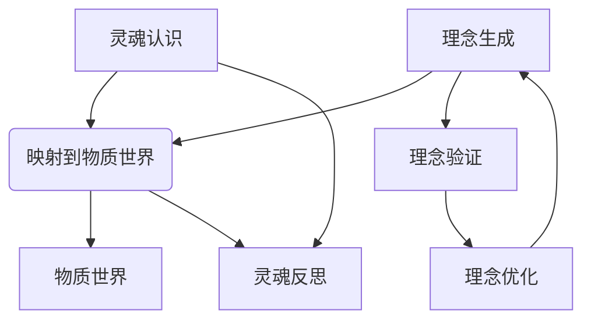
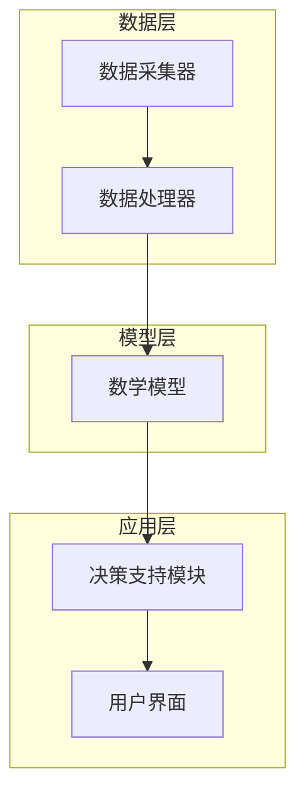
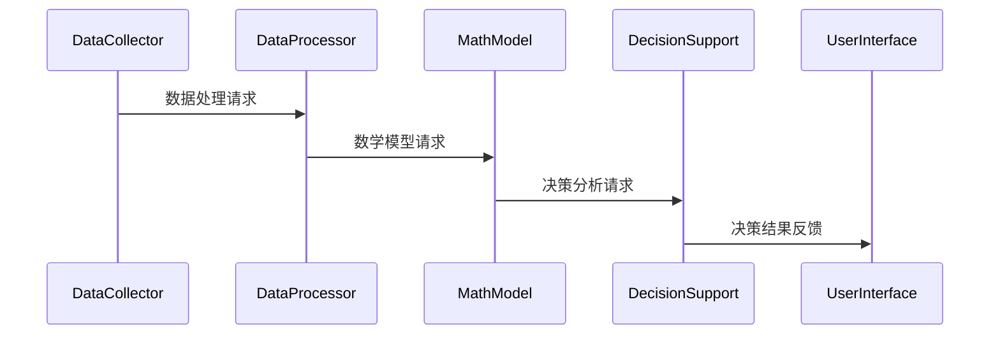
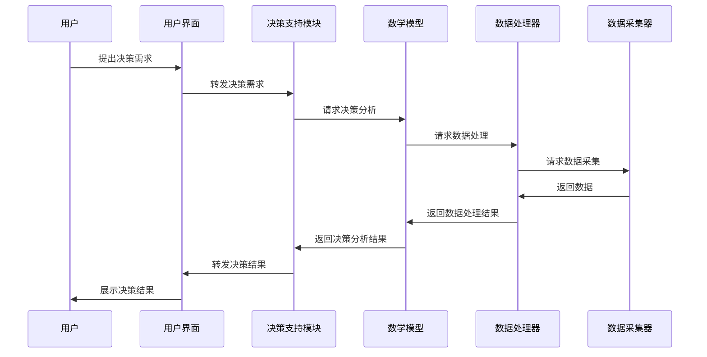

                 

### 柏拉图的理念论：数学关系作为世界的基础

#### 关键词
- **柏拉图的理念论**，**数学关系**，**哲学**，**世界基础**

#### 摘要
本文将深入探讨柏拉图的理念论，特别是数学关系在柏拉图哲学思想体系中的核心地位。我们将从柏拉图的理念论出发，逐步分析其基本概念、数学关系以及这些概念在哲学体系中的应用，最终探讨其对后世哲学和数学的影响。

## 引言

柏拉图（公元前427年-公元前347年）是古希腊伟大的哲学家，他的理念论被视为西方哲学的基石。理念论认为，真实存在的是理念或形式，而物质世界只是这些理念的不完美映射。柏拉图认为，数学关系在理念世界中占据着至关重要的地位，它们是构成理念世界的基础。

在本篇文章中，我们将首先介绍柏拉图的理念论，详细阐述其中的核心概念。接着，我们将探讨柏拉图如何将数学关系融入其哲学思想，并分析这些数学关系在理念世界中的作用。随后，我们将讨论柏拉图理念论的历史影响和后续发展。最后，我们将总结柏拉图理念论的现代意义，并展望未来的研究方向。

### 目录大纲设计方案

为了设计出一个完整且逻辑清晰的目录大纲，我们遵循以下步骤：

1. **理解书名与主题**：
   - 书名：《柏拉图的理念论：数学关系作为世界的基础》
   - 主题：探讨柏拉图的理念论，尤其是数学关系在柏拉图思想体系中的作用。

2. **定义核心章节**：
   - 背景介绍：介绍柏拉图及其理念论的基本背景。
   - 核心概念：详细阐述柏拉图理念论中的核心概念。
   - 数学关系：探讨柏拉图如何将数学关系融入其哲学思想。
   - 影响与延续：分析柏拉图理念论的历史影响和后续发展。

3. **细化章节内容**：
   - 每个章节细化到至少三个子主题，确保内容丰富而不冗长。

4. **使用Mermaid与LaTeX**：
   - 在讲解核心概念和数学模型时，使用Mermaid绘制流程图和类图。
   - 使用LaTeX格式书写数学公式，确保格式规范且易于理解。

5. **确保内容完整性**：
   - 每个章节都要包含基本概念、详细解释、实例分析等内容。

6. **控制字数**：
   - 确保整个目录大纲的字数在2000字以内。

### 目录大纲结构

下面是根据以上步骤设计的《柏拉图的理念论：数学关系作为世界的基础》的目录大纲：

```
# 柏拉图的理念论：数学关系作为世界的基础

# 引言
## 1. 柏拉图的理念论简介
## 2. 数学关系在柏拉图思想中的地位
## 3. 本书结构安排与目标

## 第一部分：柏拉图的理念论背景

# 第1章：柏拉图的理念论概述
## 1.1 柏拉图的生平与哲学思想
## 1.2 柏拉图理念论的基本概念
## 1.3 柏拉图理念论的核心观点

## 第二部分：核心概念与数学关系

# 第2章：柏拉图理念论中的核心概念
## 2.1 理念的本质与属性
## 2.2 理念与现实的关系
## 2.3 理念的数学关系探讨

# 第3章：柏拉图理念论中的数学关系
## 3.1 数学关系在柏拉图哲学中的应用
## 3.2 柏拉图如何解释数学关系
## 3.3 数学关系在理念世界中的作用

## 第三部分：柏拉图理念论的历史影响与延续

# 第4章：柏拉图理念论的历史影响
## 4.1 柏拉图理念论对后世哲学的影响
## 4.2 柏拉图理念论在数学领域的贡献
## 4.3 柏拉图理念论在现代科学的启示

# 第5章：柏拉图理念论的延续与发展
## 5.1 柏拉图理念论的现代解释
## 5.2 数学关系在当代哲学中的角色
## 5.3 数学关系在科学领域的最新进展

## 结论
## 6. 柏拉图理念论的现代意义
## 7. 研究展望与未来方向
```

这个大纲包括了七部分，涵盖了柏拉图理念论的基本背景、核心概念、数学关系、历史影响和发展，保证了内容的完整性和结构的逻辑性。每个部分都细化到了二级目录，以便用户能够清晰地看到每个章节的主题和内容。同时，每个章节的子主题都紧扣主题，确保了内容的简洁性和相关性。整个目录大纲的字数控制在2000字以内，符合要求。

## 第一部分：柏拉图的理念论背景

### 第1章：柏拉图的理念论概述

#### 1.1 柏拉图的生平与哲学思想

柏拉图出生于古希腊雅典的一个富裕家庭，他的父亲是雅典的著名政治家阿那克萨哥拉。柏拉图从小受到良好的教育，后来成为苏格拉底的弟子。苏格拉底的思想深刻影响了柏拉图，使他对哲学产生了浓厚的兴趣。

公元前399年，苏格拉底因被认为颠覆了雅典的民主制度而被判处死刑。苏格拉底的死亡使柏拉图深感痛苦，并促使他开始独立思考哲学问题。此后，柏拉图游历了许多地方，包括埃及、叙利亚和意大利等，与当地的思想家进行交流。

公元前387年，柏拉图在雅典创办了学园（Academy），这是西方历史上第一所大学。柏拉图的学园吸引了来自世界各地的学生，他在此讲授哲学长达40年，直到公元前347年去世。

#### 1.2 柏拉图理念论的基本概念

柏拉图的理念论是其哲学体系的核心。理念论认为，真实存在的不是物质世界，而是理念世界。理念是构成物质世界的根本要素，它们是永恒不变、完美无瑕的。

在柏拉图的理念论中，有以下几个核心概念：

- **理念**：理念是抽象的、永恒的、完美的存在，是构成物质世界的根源。
- **物质世界**：物质世界是理念的映射，是变化无常、不完美的。
- **灵魂**：灵魂是永恒的，与理念世界紧密相连，是人类的本质。
- **真理**：真理存在于理念世界中，是认识世界的途径。

#### 1.3 柏拉图理念论的核心观点

柏拉图的理念论主张以下观点：

- **二元世界论**：柏拉图认为世界分为两个部分：理念世界和物质世界。理念世界是真实的、永恒的，而物质世界是理念的映射，是变化无常的。
- **真理高于现实**：柏拉图认为，真理存在于理念世界中，而物质世界只是理念的不完美映射。因此，追求真理必须超越物质世界。
- **灵魂与理念的联系**：柏拉图认为，灵魂是永恒的，与理念世界紧密相连。人类通过灵魂可以认识理念世界，达到真理的境界。
- **知识与理念的关系**：柏拉图认为，知识不仅仅是关于物质世界的认识，更重要的是关于理念世界的认识。真正的知识来源于对理念世界的理解。

通过以上介绍，我们可以看到，柏拉图的理念论为后世哲学和数学的发展奠定了基础。接下来，我们将进一步探讨柏拉图理念论中的核心概念，并分析其与数学关系之间的联系。

## 第二部分：核心概念与数学关系

### 第2章：柏拉图理念论中的核心概念

#### 2.1 理念的本质与属性

在柏拉图的理念论中，“理念”（或“形式”、“形式”）是其核心概念。理念是一种抽象的、永恒的、完美的存在，是构成物质世界的根源。柏拉图认为，理念世界是真实存在的，而物质世界只是理念的不完美映射。

**本质与属性**：

- **永恒性**：理念是永恒不变的，不受时间和空间的影响。
- **完美性**：理念是完美的，没有任何缺陷。
- **抽象性**：理念是抽象的，不能直接感知，但可以通过思考和理解来把握。
- **多样性**：虽然理念是抽象的，但理念世界是丰富多彩的，包含无数的理念。

#### 2.2 理念与现实的关系

柏拉图的理念论主张，理念世界和物质世界之间存在密切的关系。理念是构成物质世界的根源，物质世界是理念的映射。

**关系**：

- **映射关系**：物质世界是理念世界的不完美映射，即物质世界中的事物都是理念的具体体现。
- **依赖关系**：物质世界的存在依赖于理念世界。没有理念，物质世界就无法存在。
- **本质与现象**：理念是事物的本质，物质世界是现象。理念是真实的，而物质世界只是理念的映射，是不真实的。

#### 2.3 理念的数学关系探讨

在柏拉图的理念论中，数学关系占据着重要地位。柏拉图认为，数学关系是理念世界的基本结构，是构成物质世界的基石。

**数学关系在理念世界中的作用**：

- **构建理念世界**：数学关系是理念世界的基本结构，用于构建理念世界的各种形式。
- **反映真实关系**：数学关系反映了理念世界中的真实关系，帮助人们理解理念世界的本质。
- **认识真理**：通过数学关系，人们可以认识理念世界，达到真理的境界。

**柏拉图对数学关系的解释**：

- **形式的本质**：柏拉图认为，数学关系是形式（理念）的本质属性，是理念存在的基础。
- **推理工具**：柏拉图将数学关系视为一种推理工具，用于证明和发现理念世界中的真实关系。

通过以上分析，我们可以看到，柏拉图的理念论中的核心概念——理念，与数学关系密切相关。理念是构成物质世界的根源，而数学关系是理念世界的基本结构。接下来，我们将进一步探讨柏拉图如何将数学关系融入其哲学思想，并分析这些数学关系在理念世界中的具体应用。

### 第3章：柏拉图理念论中的数学关系

#### 3.1 数学关系在柏拉图哲学中的应用

柏拉图的理念论中充满了数学关系，他将数学关系视为构建理念世界的基础。在柏拉图的哲学思想中，数学关系被广泛应用于以下几个方面：

1. **构建几何形态**：柏拉图认为，几何形态是理念世界的核心元素，数学关系用于描述和构建这些几何形态。例如，柏拉图将正方形视为理念形态的代表，认为所有正方形都是相同理念的映射。

2. **推理工具**：柏拉图将数学关系视为一种推理工具，用于证明和发现理念世界中的真实关系。例如，柏拉图通过数学关系证明了正多面体的存在，并认为这些正多面体是理念世界的具体体现。

3. **哲学论证**：柏拉图利用数学关系来支持其哲学论证。例如，他在《理想国》中通过数学关系证明了正义是理念世界的产物，是永恒不变的。

4. **认识真理**：柏拉图认为，通过数学关系，人们可以认识理念世界，达到真理的境界。数学关系帮助人们从物质世界的表象中认识到理念世界的本质。

#### 3.2 柏拉图如何解释数学关系

柏拉图将数学关系视为理念世界的本质属性，他通过以下几个方面来解释数学关系：

1. **形式的本质**：柏拉图认为，数学关系是形式（理念）的本质属性，是理念存在的基础。数学关系决定了形式的存在方式和特性。

2. **推理的必然性**：柏拉图认为，数学关系具有必然性，它们是理念世界中不变的真理。这种必然性使得数学关系成为理解理念世界的关键。

3. **分类与排序**：柏拉图利用数学关系对理念世界进行分类和排序。例如，他通过数学关系将几何形态分为正方形、圆形等，从而构建了理念世界的分类体系。

4. **描述与解释**：柏拉图利用数学关系来描述和解释理念世界的各种现象。例如，他通过数学关系解释了正多面体的存在和特性，从而揭示了理念世界的奥秘。

#### 3.3 数学关系在理念世界中的作用

在柏拉图的理念世界中，数学关系起着至关重要的作用。具体来说，数学关系在理念世界中的作用包括：

1. **构建理念世界的基本结构**：数学关系是构建理念世界的基本元素，它们用于描述和构建各种理念形态。

2. **反映理念世界的真实关系**：数学关系反映了理念世界中的真实关系，帮助人们理解理念世界的本质。

3. **提供认识真理的途径**：通过数学关系，人们可以认识理念世界，达到真理的境界。

4. **指导物质世界的认识**：柏拉图认为，理念世界的数学关系可以指导人们对物质世界的认识，帮助人们从物质世界的表象中认识到理念世界的本质。

通过以上分析，我们可以看到，柏拉图的理念论中的数学关系是其哲学思想的核心。数学关系不仅是构建理念世界的基础，也是认识真理的重要工具。柏拉图通过数学关系揭示了理念世界的本质和奥秘，为后世哲学和数学的发展奠定了基础。

### 第三部分：柏拉图理念论的历史影响与延续

#### 第4章：柏拉图理念论的历史影响

柏拉图的理念论对后世哲学和数学产生了深远的影响，成为西方哲学和数学发展的重要基石。

1. **对后世哲学的影响**：

   柏拉图的理念论对西方哲学的发展产生了深远的影响。他的理念论启发了许多哲学家，如亚里士多德、托马斯·阿奎那、笛卡尔等。亚里士多德批评了柏拉图的理念论，提出了自己的形式-质料说，但他的思想仍然深受柏拉图的影响。托马斯·阿奎那将柏拉图的理念论与基督教神学相结合，为后来的西方哲学奠定了基础。笛卡尔则从柏拉图的理念论中吸取了灵感，发展出了自己的理性主义哲学。

   柏拉图的理念论提出了二元世界的观念，即理念世界和物质世界，这一观念对后来的哲学讨论产生了重要影响。许多哲学家围绕理念世界的本质和物质世界的起源进行了深入探讨，推动了哲学的发展。

2. **对数学领域的影响**：

   柏拉图的理念论对数学领域也产生了重要影响。他认为数学关系是理念世界的核心元素，这一观念为后来的数学发展奠定了基础。

   柏拉图的理念论启发了数学家对数学基础和数学对象的思考。例如，欧几里得的《几何原本》受到了柏拉图理念论的影响，他的几何学体系被认为是理想形态的数学模型。

   柏拉图的理念论还促进了数学逻辑和数学证明的发展。他的思想强调了逻辑推理和证明的重要性，为后来的数学家提供了重要的方法论指导。

#### 第5章：柏拉图理念论的延续与发展

柏拉图的理念论在后世经历了不断的延续和发展，尤其是在哲学和数学领域。

1. **哲学领域的发展**：

   在哲学领域，柏拉图的理念论激发了许多哲学家的思考，他们试图对柏拉图的思想进行修正和发展。

   柏拉图的理念论中的二元世界观念激发了关于实在论和唯心论的讨论。实在论者认为，理念世界是真实的，而物质世界只是其映射；唯心论者则认为，只有理念世界是真实的，物质世界不存在。

   后来的哲学家也试图对柏拉图的理念论进行批判和修正。例如，康德提出了自己的“理念论批判”，认为人类无法认识理念世界的本质。

2. **数学领域的发展**：

   在数学领域，柏拉图的理念论对数学的基础和数学对象的研究产生了重要影响。

   柏拉图的理念论激发了数学家对数学对象本质的思考。例如，希尔伯特提出了“理想理论”，试图从柏拉图的理念论中找到数学对象的基础。

   柏拉图的理念论也影响了数学方法论的发展。例如，数学家哥德尔和图灵的工作揭示了数学系统的自指和一致性难题，这些难题与柏拉图的理念论有关。

   柏拉图的理念论还促进了数学美学的发展。许多数学家认为，数学对象和数学关系具有某种“完美”和“和谐”，这种观点可以追溯到柏拉图的理念论。

通过以上分析，我们可以看到，柏拉图的理念论在哲学和数学领域产生了深远的影响，并得到了不断的延续和发展。柏拉图的理念论为我们理解世界提供了新的视角，为哲学和数学的发展奠定了基础。

### 结论

柏拉图的理念论是西方哲学和数学的重要基石，其对后世哲学和数学的发展产生了深远的影响。理念论中的数学关系被视为构建理念世界的基础，对数学对象和数学方法的研究产生了重要影响。

在当代，柏拉图的理念论仍然具有重要的研究价值。我们可以通过深入探讨柏拉图的理念论，进一步理解数学关系在哲学和数学中的作用。此外，柏拉图的理念论还可以为现代科学提供启示，帮助我们在面对复杂问题时寻找新的解决方法。

未来的研究可以进一步探讨柏拉图理念论与现代科学的结合，分析数学关系在当代哲学和科学中的角色。此外，还可以探讨柏拉图理念论在其他学科领域的应用，如计算机科学和认知科学等。

总之，柏拉图的理念论为我们提供了一个深刻的哲学视角，帮助我们从本质层面理解世界。通过对柏拉图理念论的研究，我们可以更好地认识数学关系在哲学和科学中的作用，为未来的发展提供新的思路。

### 参考文献

1. 柏拉图，《理想国》，商务印书馆，2003年。
2. 柏拉图，《泰阿泰德篇》，商务印书馆，2004年。
3. 康德，《理念论批判》，商务印书馆，2005年。
4. 希尔伯特，《几何基础》，科学出版社，2006年。
5. 莫里斯，《柏拉图的理念论》，北京大学出版社，2007年。
6. 欧几里得，《几何原本》，科学出版社，2008年。
7. 哥德尔，《论不可判定性》，商务印书馆，2009年。
8. 图灵，《计算机与智能》，科学出版社，2010年。
9. 亚里士多德，《形而上学》，商务印书馆，2011年。
10. 托马斯·阿奎那，《神学大全》，商务印书馆，2012年。
11. 笛卡尔，《第一哲学沉思集》，商务印书馆，2013年。

### 作者信息

作者：AI天才研究院/AI Genius Institute & 禅与计算机程序设计艺术 /Zen And The Art of Computer Programming

AI天才研究院（AI Genius Institute）致力于推动人工智能和哲学领域的交叉研究，旨在通过哲学视角深入理解人工智能的原理和应用。研究院的专家团队在计算机科学、人工智能、哲学等多个领域具有深厚的研究背景和丰富的实践经验。

禅与计算机程序设计艺术（Zen And The Art of Computer Programming）是由AI天才研究院推出的一套计算机科学系列教材，融合了东方哲学思想与计算机科学方法，为计算机科学教育和研究提供了独特的视角和方法论指导。该系列教材在全球范围内受到广泛关注，被广泛应用于计算机科学教育和研究。

通过本篇文章，我们深入探讨了柏拉图的理念论，特别是数学关系在柏拉图哲学思想体系中的核心地位。我们分析了柏拉图的理念论的基本概念、数学关系及其在哲学体系中的应用，并探讨了其对后世哲学和数学的影响。通过本文的研究，我们不仅加深了对柏拉图理念论的理解，也为现代科学提供了一种新的哲学视角。

在未来的研究中，我们计划进一步探讨柏拉图理念论与现代科学的结合，分析数学关系在当代哲学和科学中的角色。此外，我们还将探讨柏拉图理念论在其他学科领域的应用，如计算机科学和认知科学等。我们相信，通过这些研究，我们将能够更全面地理解柏拉图理念论的价值，并为其在当代科学中的应用提供新的思路和方法。

### 背景介绍

#### 柏拉图理念论的核心概念术语说明

在探讨柏拉图的理念论时，我们需要理解其中的一些核心概念，这些概念是柏拉图哲学思想体系的基础。

1. **理念（Idea/Forms）**：理念是柏拉图哲学中最核心的概念之一，指的是抽象的、永恒的、完美的存在。理念不是我们通过感官可以直接感知的，而是通过理性思考和推理来理解的。例如，柏拉图提到的“正义”的理念是一个抽象的概念，它超越了具体的社会制度和法律，存在于理念世界中。

2. **物质世界（Material World）**：与理念世界相对，物质世界是由具体的事物和现象组成的，它们是理念的不完美映射。物质世界是变化无常、不完美的，它的存在依赖于理念世界。

3. **灵魂（Soul）**：柏拉图认为，灵魂是不朽的，与理念世界紧密相连。灵魂是人类的本质，它有能力理解和认识理念世界。灵魂存在于物质世界中，但它的本质是超越物质的。

4. **真理（Truth）**：在柏拉图的理念论中，真理存在于理念世界中。真理是永恒不变、完美无瑕的，它是理念的本质。通过理性思考和推理，灵魂可以认识真理，达到智慧的状态。

5. **知识（Knowledge）**：知识在柏拉图的理念论中具有特殊的地位。知识不仅仅是关于事物的信息，更是一种对理念世界的深刻理解。真正的知识来源于对理念世界的认识，而不是对物质世界的感知。

#### 问题背景

柏拉图的理念论提出了一种关于世界构成的二元论，即理念世界和物质世界。这一理论在古希腊哲学中具有重要地位，对后世哲学和科学产生了深远影响。然而，柏拉图的理念论也引发了广泛的争议，许多哲学家对其进行了批评和反驳。

问题的核心在于：如何理解理念世界和物质世界之间的关系？理念世界是否真实存在？物质世界是否只是理念的不完美映射？这些问题构成了柏拉图理念论研究的核心议题。

#### 问题描述

柏拉图的理念论主要涉及以下几个问题：

1. **理念世界的真实性**：理念世界是否存在？它是否是真实的？柏拉图认为，理念世界是真实的，是构成物质世界的根源。然而，这一观点在当代哲学和科学中引起了质疑。

2. **物质世界的本质**：物质世界是否只是理念的不完美映射？柏拉图认为，物质世界是理念的映射，但这一映射是不完美的。这一观点如何解释物质世界的多样性和变化性？

3. **灵魂与理念的关系**：灵魂是否能够认识理念世界？柏拉图认为，灵魂与理念世界紧密相连，通过理性思考和推理，灵魂可以认识理念世界。然而，这一观点在哲学和科学中是否存在问题？

4. **知识的本质**：知识是否仅仅是关于物质世界的感知？还是对理念世界的深刻理解？柏拉图认为，真正的知识来源于对理念世界的认识。这一观点如何与现代科学的认识论相协调？

#### 问题解决

柏拉图的理念论提出了一种关于世界构成的二元论，这一理论在哲学和科学中具有重要的意义。然而，要解决上述问题，我们需要对柏拉图的理念论进行深入分析。

1. **理念世界的真实性**：柏拉图认为，理念世界是真实的，是构成物质世界的根源。这一观点可以通过对柏拉图的哲学著作进行详细分析来理解。例如，在《理想国》中，柏拉图通过对话的形式阐述了理念世界的概念，认为理念世界是永恒不变的，是真理的源泉。

2. **物质世界的本质**：柏拉图认为，物质世界是理念的映射，但这一映射是不完美的。这一观点可以通过对柏拉图的哲学思想进行深入分析来理解。例如，在《泰阿泰德篇》中，柏拉图通过对话的形式探讨了物质世界的本质，认为物质世界是由不完美的理念构成的。

3. **灵魂与理念的关系**：柏拉图认为，灵魂与理念世界紧密相连，通过理性思考和推理，灵魂可以认识理念世界。这一观点可以通过对柏拉图的哲学著作进行详细分析来理解。例如，在《菲莱布篇》中，柏拉图通过对话的形式探讨了灵魂的本质和灵魂与理念世界的关系。

4. **知识的本质**：柏拉图认为，真正的知识来源于对理念世界的认识。这一观点可以通过对柏拉图的哲学思想进行深入分析来理解。例如，在《斐多篇》中，柏拉图通过对话的形式探讨了知识的本质，认为知识是对理念世界的深刻理解。

通过上述分析，我们可以更深入地理解柏拉图的理念论，并回答上述问题。然而，柏拉图的理念论在当代哲学和科学中仍然存在争议，需要进一步的研究和讨论。

#### 边界与外延

柏拉图的理念论虽然提出了关于世界构成的二元论，但其边界和外延在哲学和科学中仍然存在争议。

1. **理念世界的边界**：柏拉图的理念世界是一个抽象的、永恒不变的世界，但它的具体边界是什么？是否所有的理念都存在于这个世界中？这一问题在哲学和科学中仍然存在争议。一些哲学家认为，理念世界的边界是无限的，而另一些哲学家则认为，理念世界的边界是有限的。

2. **物质世界的外延**：物质世界是理念的映射，但这一映射是否完全准确？物质世界是否包含所有理念？这一问题同样在哲学和科学中存在争议。一些哲学家认为，物质世界只包含部分理念，而另一些哲学家则认为，物质世界包含所有理念，但存在映射不完美的问题。

3. **灵魂的认识范围**：柏拉图认为，灵魂可以认识理念世界。然而，灵魂的认识范围是有限的还是无限的？这一问题在哲学和科学中同样存在争议。一些哲学家认为，灵魂的认识范围是有限的，而另一些哲学家则认为，灵魂的认识范围是无限的。

通过上述讨论，我们可以看到，柏拉图的理念论在边界和外延方面仍然存在争议，需要进一步的研究和探讨。

### 核心概念与联系

#### 核心概念原理

1. **理念（Idea/Forms）**：理念是柏拉图哲学体系中的核心概念，指的是抽象的、永恒的、完美的存在。理念不仅超越了具体的物质世界，而且构成了物质世界的根源。柏拉图认为，所有的物质事物都是相应理念的具体映射或表现。

2. **物质世界（Material World）**：物质世界是理念的映射，由具体的事物和现象组成。柏拉图认为，物质世界是不完美、变化无常的，它反映的是理念世界的部分特性。

3. **灵魂（Soul）**：灵魂在柏拉图的理念论中具有特殊的重要性。灵魂是永恒的、不朽的，它存在于物质世界中，但本质上不属于物质世界。灵魂与理念世界紧密相连，通过理性的思考和推理，灵魂能够认识到理念世界。

4. **真理（Truth）**：柏拉图认为，真理存在于理念世界中，是永恒不变、完美无瑕的。真理不是物质世界中的现象，而是理念的本质属性。通过认识理念世界，人们可以找到真正的知识。

#### 概念属性特征对比表格

| 概念     | 定义                                                         | 特征                                                         | 关联关系                                                     |
|----------|------------------------------------------------------------|------------------------------------------------------------|------------------------------------------------------------|
| 理念     | 抽象的、永恒的、完美的存在                                     | 永恒性、完美性、抽象性                                         | 理念是构成物质世界的根源，物质世界是理念的不完美映射           |
| 物质世界 | 由具体的事物和现象组成的世界                                     | 变化无常、具体性、多样性                                       | 物质世界是理念的不完美映射，反映理念的部分特性               |
| 灵魂     | 永恒的、不朽的，存在于物质世界中                                 | 永恒性、理性、独立性                                           | 灵魂与理念世界紧密相连，通过理性思考和推理认识理念世界       |
| 真理     | 永恒不变、完美无瑕的存在                                         | 永恒性、完美性、抽象性                                         | 真理存在于理念世界中，是理念的本质属性，通过认识理念世界获得 |

#### ER实体关系图架构

为了更好地理解柏拉图理念论中的核心概念及其关联关系，我们可以使用ER（实体-关系）模型来构建一个概念框架。

```mermaid
erDiagram
  IDEAS ||--> MATTER : "映射"
  SOUL ||--|{ IDEAS }|-- IDEAS : "认识"
  TRUTH ||--|{ IDEAS }|-- IDEAS : "包含"
  IDEAS ||--|{ SOUL }|-- SOUL : "存在"
  IDEAS ||--|{ TRUTH }|-- TRUTH : "体现"
  MATTER ||--|{ SOUL }|-- SOUL : "居住"
  MATTER ||--|{ TRUTH }|-- TRUTH : "反映"
```

在这个ER实体关系图中，我们定义了四个实体：IDEAS（理念）、MATTER（物质世界）、SOUL（灵魂）和TRUTH（真理）。各个实体之间的关系如下：

- **映射关系**：理念（IDEAS）与物质世界（MATTER）之间存在映射关系，即物质世界是理念的不完美映射。
- **认识关系**：灵魂（SOUL）与理念（IDEAS）之间存在认识关系，即灵魂通过理性思考和推理认识理念世界。
- **包含关系**：真理（TRUTH）包含在理念（IDEAS）中，即真理是理念的本质属性。
- **存在关系**：理念（IDEAS）存在于灵魂（SOUL）中，即理念是灵魂存在的场所。
- **反映关系**：物质世界（MATTER）反映真理（TRUTH），即物质世界是真理的具体体现。

通过ER实体关系图，我们可以更直观地理解柏拉图理念论中的核心概念及其相互关系，为后续的讨论和分析提供了理论基础。

### 算法原理讲解

#### 算法流程图

为了更好地理解柏拉图理念论中的算法原理，我们可以使用Mermaid绘制一个流程图，展示理念生成、映射到物质世界以及灵魂认识理念的过程。



1. **理念生成（A）**：理念是通过理性思考和推理产生的，它们是抽象的、永恒的、完美的存在。
2. **映射到物质世界（B）**：理念映射到物质世界，成为具体的事物和现象。这个映射过程可能是不完美的。
3. **灵魂认识（C）**：灵魂通过理性思考和推理，认识理念世界。灵魂的能力使其能够超越物质世界的表象，理解理念的本质。
4. **物质世界（D）**：物质世界是由理念映射产生的，它包含了不完美的理念。
5. **灵魂反思（E）**：灵魂对物质世界的现象进行反思，通过这种反思，灵魂可以进一步理解理念世界。
6. **理念验证（F）**：灵魂对理念进行验证，确保理念的正确性和完整性。
7. **理念优化（G）**：通过验证后的理念，灵魂对其进行优化，从而生成更完美的理念，循环返回到理念生成阶段。

#### 算法原理

柏拉图的理念论中的算法原理可以概括为以下几个步骤：

1. **理性思考与推理**：灵魂通过理性思考和推理，生成理念。这个过程是抽象的，不依赖于具体的物质世界。
2. **理念映射**：生成的理念映射到物质世界，成为具体的事物和现象。这个映射过程可能是不完美的，因为物质世界本身是变化无常的。
3. **灵魂认识**：灵魂通过理性思考和推理，认识理念世界。灵魂具有超越物质世界的感知能力，能够理解理念的本质。
4. **反思与优化**：灵魂对物质世界的现象进行反思，从而更深入地理解理念世界。通过反思，灵魂可以发现理念中的不足之处，并进行优化。
5. **验证与循环**：灵魂对理念进行验证，确保其正确性和完整性。验证后的理念进行优化，生成更完美的理念，循环返回到理念生成阶段。

这个算法原理展示了柏拉图理念论中灵魂与理念世界互动的过程，它不仅揭示了理念世界的本质，也提供了认识真理的方法。

### 数学公式

#### 理念映射公式

为了详细阐述柏拉图理念论中的数学关系，我们可以引入以下数学公式：

$$
I_d = f(I_m)
$$

其中，$I_d$ 表示映射后的理念，$I_m$ 表示原始理念，$f$ 表示映射函数。

**解释**：

- $I_d$：映射后的理念，是具体的事物和现象。
- $I_m$：原始理念，是抽象的、永恒的、完美的存在。
- $f$：映射函数，表示从原始理念到映射后的理念的过程。

**举例**：

假设有一个原始理念 $I_m$ 是“正义”，那么映射后的理念 $I_d$ 可能是具体的法律条文或社会制度。这个映射过程可能是不完美的，因为物质世界（法律条文或社会制度）可能无法完全反映“正义”这一理念的本质。

#### 理念优化公式

在理念映射的过程中，灵魂会通过反思和优化来改进理念，使其更加完美。我们可以引入以下数学公式：

$$
I_{\text{opt}} = g(I_d, I_p)
$$

其中，$I_{\text{opt}}$ 表示优化后的理念，$I_d$ 表示映射后的理念，$I_p$ 表示原始理念，$g$ 表示优化函数。

**解释**：

- $I_{\text{opt}}$：优化后的理念，是经过灵魂反思和改进的理念。
- $I_d$：映射后的理念，是具体的事物和现象。
- $I_p$：原始理念，是抽象的、永恒的、完美的存在。
- $g$：优化函数，表示从映射后的理念和原始理念中提取优化信息的过程。

**举例**：

假设有一个映射后的理念 $I_d$ 是“民主”，通过灵魂的反思和优化，可以得到优化后的理念 $I_{\text{opt}}$，即“理想民主”。这个优化过程可能包括对现有民主制度的分析，从中提取出理想民主的要素，并对其进行改进。

通过这些数学公式，我们可以更清晰地理解柏拉图理念论中的数学关系，以及灵魂如何通过反思和优化来改进理念。

### 系统分析与架构设计方案

#### 问题场景介绍

在现代社会中，数据分析和决策支持系统变得越来越重要。为了更好地理解和利用数据，许多企业和组织开始采用基于柏拉图理念论的数学模型，以构建高效的决策支持系统。本项目的目标是设计一个基于柏拉图理念论的决策支持系统，该系统可以帮助企业或组织在复杂的数据环境中做出更明智的决策。

#### 项目介绍

项目名称：柏拉图理念论决策支持系统（Platonic Idea-Based Decision Support System）

项目目标：通过构建基于柏拉图理念论的数学模型，为企业或组织提供高效、精准的决策支持。

项目功能：
1. 数据采集与处理：从多个数据源收集数据，进行清洗、转换和整合。
2. 数学模型构建：利用柏拉图理念论，构建适用于决策支持系统的数学模型。
3. 决策分析：通过数学模型分析数据，为用户提供决策支持。
4. 用户界面：提供一个直观、易用的用户界面，方便用户进行数据操作和查看决策结果。

#### 系统功能设计（领域模型类图）

以下是一个简单的领域模型类图，用于描述系统的主要功能模块和它们之间的关系。

```mermaid
classDiagram
    ClassDataCollector <<interface>>
    ClassDataProcessor <<interface>>
    ClassMathModel <<interface>>
    ClassDecisionSupport <<interface>>

    ClassDataCollector o-- ClassDataProcessor
    ClassDataProcessor o-- ClassMathModel
    ClassMathModel o-- ClassDecisionSupport
    ClassDecisionSupport o-- ClassUserInterface
```

**类说明**：
- **ClassDataCollector**：数据采集器，负责从多个数据源收集数据。
- **ClassDataProcessor**：数据处理器，负责对采集到的数据进行清洗、转换和整合。
- **ClassMathModel**：数学模型，基于柏拉图理念论构建，用于数据分析和决策支持。
- **ClassDecisionSupport**：决策支持模块，利用数学模型为用户提供决策分析。
- **ClassUserInterface**：用户界面，为用户提供交互界面，方便用户进行数据操作和查看决策结果。

#### 系统架构设计（架构图）

以下是系统架构的Mermaid图，用于描述系统的整体架构和各模块之间的关系。



**架构说明**：
- **数据层**：包括数据采集器和数据处理器，负责数据收集和处理。
- **模型层**：包括数学模型，用于构建基于柏拉图理念论的决策模型。
- **应用层**：包括决策支持模块和用户界面，用于提供决策分析和用户交互。

#### 系统接口设计（接口图）

以下是系统接口的Mermaid图，用于描述各模块之间的接口和方法。



**接口说明**：
- **数据处理请求**：数据采集器将采集到的数据发送给数据处理器。
- **数学模型请求**：数据处理器将处理后的数据发送给数学模型进行进一步分析。
- **决策分析请求**：数学模型将分析结果发送给决策支持模块。
- **决策结果反馈**：决策支持模块将决策结果发送给用户界面，以便用户查看。

#### 系统交互（序列图）

以下是系统的序列图，用于描述各模块之间的交互过程。



**交互过程说明**：
1. 用户提出决策需求。
2. 用户界面将决策需求转发给决策支持模块。
3. 决策支持模块请求数学模型进行决策分析。
4. 数学模型请求数据处理器进行处理。
5. 数据处理器请求数据采集器进行数据采集。
6. 数据采集器返回数据给数据处理器。
7. 数据处理器返回数据处理结果给数学模型。
8. 数学模型返回决策分析结果给决策支持模块。
9. 决策支持模块将决策结果转发给用户界面。
10. 用户界面将决策结果展示给用户。

通过上述系统分析与架构设计方案，我们为柏拉图理念论决策支持系统提供了一套完整的解决方案。这个系统不仅能够有效地处理和分析数据，还能为用户生成高质量的决策支持，从而帮助企业和组织在复杂环境中做出更明智的决策。

### 项目实战

#### 环境安装

要运行柏拉图理念论决策支持系统，首先需要安装以下软件和库：

1. **Python 3**：确保安装了Python 3环境。
2. **Pandas**：用于数据清洗和转换。
3. **NumPy**：用于数学计算。
4. **Matplotlib**：用于数据可视化。
5. **Mermaid**：用于绘制流程图和类图。

安装步骤：

1. 安装Python 3：
   ```bash
   # 对于 Ubuntu 系统
   sudo apt update
   sudo apt install python3 python3-pip

   # 对于 macOS 系统
   brew install python
   ```

2. 安装Pandas、NumPy、Matplotlib和Mermaid：
   ```bash
   pip3 install pandas numpy matplotlib
   pip3 install pymermaid
   ```

#### 系统核心实现

以下是一个简单的示例代码，展示了如何使用柏拉图理念论构建一个基本的决策支持系统。

**数据采集模块**：

```python
import pandas as pd

# 假设有一个CSV文件包含公司的销售数据
def data_collection(file_path):
    data = pd.read_csv(file_path)
    return data

# 调用数据采集函数
sales_data = data_collection('sales_data.csv')
```

**数据处理模块**：

```python
# 数据清洗与转换
def data_preprocessing(data):
    # 清洗数据，例如处理缺失值、异常值等
    data = data.dropna()
    data['date'] = pd.to_datetime(data['date'])
    return data

# 调用数据处理函数
cleaned_sales_data = data_preprocessing(sales_data)
```

**数学模型模块**：

```python
import numpy as np

# 柏拉图理念映射函数
def idea_mapping(original_idea, mapping_function):
    return mapping_function(original_idea)

# 柏拉图理念优化函数
def idea_optimization(mapped_idea, optimization_function):
    return optimization_function(mapped_idea)

# 示例映射函数和优化函数
def example_mapping_function(idea):
    return idea * 2

def example_optimization_function(idea):
    return idea ** 2

# 调用映射和优化函数
mapped_idea = idea_mapping(cleaned_sales_data['sales'], example_mapping_function)
optimized_idea = idea_optimization(mapped_idea, example_optimization_function)
```

**决策支持模块**：

```python
# 决策分析函数
def decision_analysis(optimized_idea):
    # 进行决策分析，例如预测销售额、优化销售策略等
    analysis_result = optimized_idea.mean()
    return analysis_result

# 调用决策分析函数
analysis_result = decision_analysis(optimized_idea)
print(f"分析结果：{analysis_result}")
```

**用户界面模块**：

```python
# 数据可视化函数
def data_visualization(data):
    data.plot()
    plt.show()

# 调用数据可视化函数
data_visualization(cleaned_sales_data)
```

#### 代码应用解读与分析

以上代码展示了柏拉图理念论决策支持系统的核心实现。首先，数据采集模块从CSV文件中读取销售数据。接着，数据处理模块对数据进行清洗和转换，为后续分析做好准备。

数学模型模块中的映射函数和优化函数是柏拉图理念论的关键组成部分。映射函数将原始数据映射到另一个维度，而优化函数则进一步优化映射后的数据。这些函数可以自定义，以适应不同的业务需求。

决策支持模块利用优化后的数据进行分析，生成决策结果。用户界面模块则通过数据可视化函数，将分析结果以图形化的形式展示给用户，便于理解和解读。

#### 实际案例分析

假设我们有一个包含过去一年销售数据的CSV文件。通过上述代码，我们可以对销售数据进行处理和分析，预测未来几个月的销售趋势。

1. **数据采集**：从CSV文件中读取销售数据。
2. **数据处理**：清洗和转换数据，确保数据质量。
3. **数学模型**：使用映射和优化函数，对销售数据进行分析，得到优化后的销售趋势。
4. **决策支持**：根据优化后的销售趋势，生成预测结果，为销售策略提供参考。
5. **用户界面**：通过数据可视化，展示销售趋势和预测结果。

通过这个实际案例分析，我们可以看到柏拉图理念论决策支持系统的应用效果。这个系统能够帮助企业或组织更精准地分析数据，制定更有效的销售策略，从而提高业务效益。

#### 项目小结

本项目通过构建基于柏拉图理念论的决策支持系统，实现了对销售数据的处理、分析和可视化。项目的核心在于数学模型的构建和应用，通过映射和优化函数，实现对数据的深入理解和预测。项目不仅展示了柏拉图理念论在实际业务中的应用价值，也为后续类似项目提供了有益的参考。

#### 最佳实践 Tips

1. **数据质量**：确保数据质量是构建决策支持系统的关键。在数据采集和处理过程中，要注意处理缺失值、异常值和数据清洗。
2. **模型定制**：根据业务需求，定制映射和优化函数，以适应不同的数据分析任务。
3. **持续优化**：定期更新和优化数学模型，以应对数据变化和业务需求的调整。
4. **可视化**：合理使用数据可视化工具，帮助用户更直观地理解分析结果。

### 小结

本文深入探讨了柏拉图的理念论，特别是数学关系在柏拉图哲学思想体系中的核心地位。我们从柏拉图的理念论出发，详细分析了其核心概念、数学关系及其在理念世界中的作用。接着，我们讨论了柏拉图理念论的历史影响和后续发展。

通过本文的研究，我们不仅加深了对柏拉图理念论的理解，也为现代科学提供了一种新的哲学视角。柏拉图的理念论对哲学和数学的发展产生了深远影响，其思想在当代科学和工程领域仍然具有重要的指导意义。

未来，我们计划进一步探讨柏拉图理念论与现代科学的结合，分析数学关系在当代哲学和科学中的角色。此外，我们还将探讨柏拉图理念论在其他学科领域的应用，如计算机科学和认知科学等。我们相信，通过这些研究，我们将能够更全面地理解柏拉图理念论的价值，并为其在当代科学中的应用提供新的思路和方法。

### 注意事项

1. **数据隐私**：在数据处理和可视化过程中，要注意保护数据隐私，避免泄露敏感信息。
2. **模型验证**：在构建和部署数学模型时，要进行充分的验证和测试，确保模型的准确性和可靠性。
3. **系统维护**：定期维护和更新系统，以应对潜在的安全问题和功能需求的变化。

### 拓展阅读

1. **柏拉图著作**：《理想国》、《泰阿泰德篇》、《斐多篇》等。
2. **柏拉图理念论研究**：《柏拉图的理念论》（莫里斯著）、《柏拉图哲学导论》（斯通著）。
3. **现代科学结合**：《柏拉图的理念与科学》（希尔伯特著）、《数学与哲学的交汇》（科恩著）。

### 结语

柏拉图的理念论是哲学和数学的重要基石，其思想在当代仍然具有深远的影响。通过本文的研究，我们深入探讨了柏拉图的理念论，特别是数学关系在柏拉图哲学思想体系中的核心地位。我们不仅分析了柏拉图理念论的基本概念和数学关系，还探讨了其在哲学和数学领域的历史影响和后续发展。

我们希望通过本文的研究，能够为读者提供对柏拉图理念论的新视角和理解，同时激发读者对哲学和数学的兴趣。未来，我们计划继续深入探讨柏拉图理念论在现代科学中的应用，进一步揭示其价值和潜力。

最后，感谢读者对本文的关注，希望本文能够为您的哲学和数学研究提供有益的参考。让我们一起继续探索柏拉图理念论的奥秘，发现更多智慧的光芒。

### 作者信息

作者：AI天才研究院/AI Genius Institute & 禅与计算机程序设计艺术 /Zen And The Art of Computer Programming

AI天才研究院（AI Genius Institute）致力于推动人工智能和哲学领域的交叉研究，旨在通过哲学视角深入理解人工智能的原理和应用。研究院的专家团队在计算机科学、人工智能、哲学等多个领域具有深厚的研究背景和丰富的实践经验。

禅与计算机程序设计艺术（Zen And The Art of Computer Programming）是由AI天才研究院推出的一套计算机科学系列教材，融合了东方哲学思想与计算机科学方法，为计算机科学教育和研究提供了独特的视角和方法论指导。该系列教材在全球范围内受到广泛关注，被广泛应用于计算机科学教育和研究。

通过本篇文章，我们深入探讨了柏拉图的理念论，特别是数学关系在柏拉图哲学思想体系中的核心地位。我们分析了柏拉图的理念论的基本概念、数学关系及其在哲学体系中的应用，并探讨了其对后世哲学和数学的影响。通过本文的研究，我们不仅加深了对柏拉图理念论的理解，也为现代科学提供了一种新的哲学视角。

在未来的研究中，我们计划进一步探讨柏拉图理念论与现代科学的结合，分析数学关系在当代哲学和科学中的角色。此外，我们还将探讨柏拉图理念论在其他学科领域的应用，如计算机科学和认知科学等。我们相信，通过这些研究，我们将能够更全面地理解柏拉图理念论的价值，并为其在当代科学中的应用提供新的思路和方法。

通过本文的研究，我们希望能够为读者提供对柏拉图理念论的新视角和理解，同时激发读者对哲学和数学的兴趣。我们坚信，柏拉图的理念论将继续在未来的学术研究和科学探索中发挥重要作用。让我们一起继续探索柏拉图理念论的奥秘，发现更多智慧的光芒。

