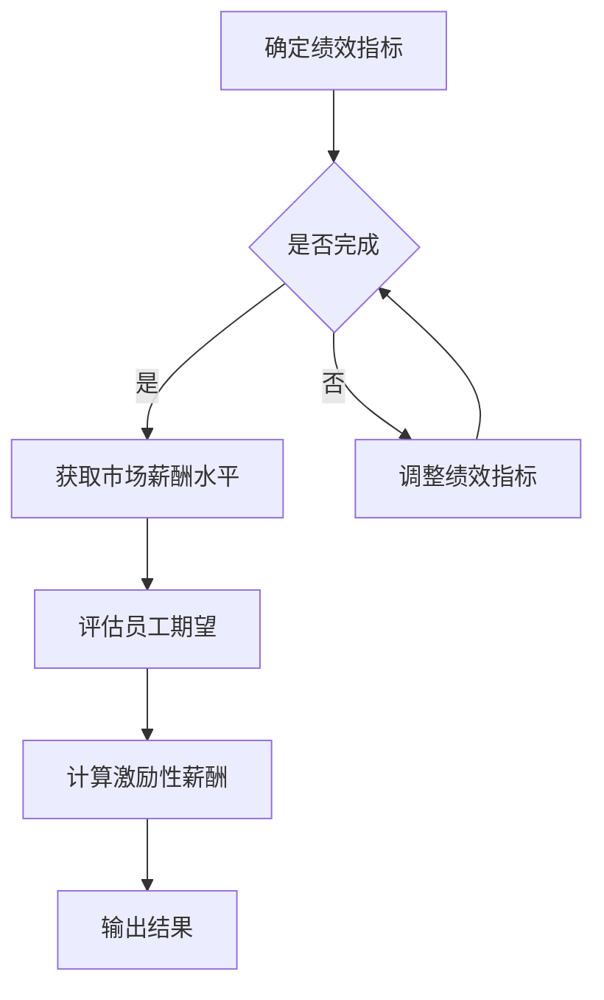
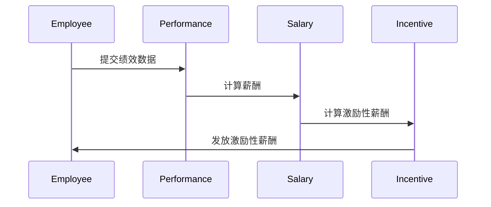

                 

# 激励性薪酬设计：留住核心人才的策略

> 关键词：薪酬设计、激励性薪酬、人才保留、绩效指标、算法原理、系统架构、项目实战

> 摘要：本文旨在探讨激励性薪酬设计的核心原理、方法和策略，通过深入分析薪酬体系在组织中的重要性，提出一种科学、有效的激励性薪酬设计方案，助力企业留住核心人才。文章将逐步阐述薪酬体系的问题背景、核心概念与联系、算法原理、系统架构设计以及项目实战，结合最佳实践，为读者提供全方位的薪酬设计指导。

## 第1章 引言

### 1.1 问题的背景

在现代企业竞争中，人才是企业发展的重要资源。然而，随着市场竞争的加剧和员工期望的提高，如何设计有效的激励性薪酬体系成为企业管理者面临的重要挑战。传统的薪酬体系过于单一，往往侧重于固定工资和福利待遇，而忽视了员工的绩效表现和贡献程度，导致核心人才流失现象严重。

薪酬体系在组织中的重要性不仅体现在对员工的基本生活保障，更在于对员工的激励和激励性薪酬的合理分配。激励性薪酬设计得好，可以有效激发员工的工作积极性、创造力和忠诚度，从而提高企业的绩效和竞争力。因此，本文将围绕激励性薪酬设计展开，旨在为企业提供一套科学、系统的薪酬设计方案。

### 1.2 当前薪酬体系存在的问题

当前薪酬体系存在的问题主要包括以下几个方面：

1. **激励性不足**：传统薪酬体系过于单一，缺乏有效的激励机制，无法充分调动员工的积极性和创造力。
2. **分配不公平**：薪酬分配过于平均，无法体现员工的绩效差异，导致员工工作积极性不高。
3. **薪酬与绩效脱节**：薪酬与绩效挂钩不明确，无法有效激励员工提高绩效。
4. **缺乏长期激励**：缺少对员工长期贡献的认可和奖励，无法留住核心人才。

### 1.3 研究的目的与意义

本文的研究目的在于提出一种科学、有效的激励性薪酬设计方案，解决当前薪酬体系存在的问题，提高企业的绩效和竞争力。具体来说，本文将：

1. **明确薪酬体系的核心概念与联系**，为薪酬设计提供理论基础。
2. **介绍激励性薪酬的算法原理**，为薪酬计算提供技术支持。
3. **设计合理的系统架构**，实现激励性薪酬的有效管理。
4. **结合项目实战**，验证薪酬设计方案的实际效果。

本文的研究意义主要体现在以下几个方面：

1. **为企业管理者提供实用的薪酬设计指南**，帮助企业留住核心人才。
2. **推动薪酬管理理论的发展**，丰富人力资源管理领域的知识体系。
3. **促进企业绩效和竞争力的提升**，为企业的可持续发展提供支持。

### 1.4 研究方法与框架

本文采用文献分析、案例分析、算法设计、系统架构设计等研究方法，结合实证研究，构建一套完整的激励性薪酬设计框架。具体来说，本文的研究框架包括以下四个部分：

1. **薪酬体系的核心概念与联系**：介绍薪酬、激励性薪酬、绩效指标等核心概念，并建立概念关系图。
2. **激励性薪酬的算法原理**：阐述激励性薪酬设计的算法原理，包括数学模型和公式。
3. **系统架构设计**：设计合理的薪酬管理系统架构，包括领域模型、系统架构图和接口设计。
4. **项目实战**：结合实际项目，验证薪酬设计方案的有效性。

## 第2章 核心概念与联系

### 2.1 薪酬与激励性薪酬

#### 2.1.1 薪酬的定义

薪酬是指企业支付给员工的各种报酬，包括基本工资、绩效工资、奖金、津贴等。薪酬不仅是员工生活的经济来源，也是企业对员工贡献的认可和回报。薪酬体系的设计直接关系到员工的工作积极性、满意度和忠诚度。

#### 2.1.2 激励性薪酬的特点

激励性薪酬是指企业为了激励员工提高绩效、贡献和忠诚度，而额外支付给员工的一部分薪酬。与基本薪酬不同，激励性薪酬具有以下几个特点：

1. **绩效导向**：激励性薪酬与员工的绩效表现直接挂钩，能够更好地激发员工的工作积极性。
2. **动态调整**：激励性薪酬的数额可以根据员工的绩效表现进行动态调整，具有更高的灵活性。
3. **长期激励**：激励性薪酬不仅关注短期绩效，还关注员工的长期贡献和潜力，有助于留住核心人才。

#### 2.1.3 激励性薪酬与传统薪酬的比较

激励性薪酬与传统薪酬在以下几个方面存在明显差异：

1. **目的不同**：传统薪酬侧重于保障员工的基本生活，而激励性薪酬侧重于激发员工的积极性、创造力和忠诚度。
2. **挂钩方式不同**：传统薪酬通常按照固定的比例或等级进行分配，而激励性薪酬与员工的绩效表现直接挂钩，具有更强的激励效果。
3. **灵活性不同**：激励性薪酬可以根据员工的绩效表现进行动态调整，而传统薪酬相对固定，难以适应员工绩效的变化。

### 2.2 核心概念关系图

为了更好地理解薪酬、激励性薪酬、绩效指标等核心概念之间的关系，我们可以使用 Mermaid 类图进行表示。以下是核心概念关系图的 Mermaid 表达式：

```mermaid
classDiagram
  类 Employee <<class>> { 
      +int id
      +String name
      +List Performance
  }
  类 Performance <<class>> { 
      +int id
      +String type
      +float score
  }
  类 Salary <<class>> { 
      +int id
      +String type
      +float amount
  }
  类 Incentive <<class>> { 
      +int id
      +String type
      +float amount
  }
  Employee --|> Performance
  Employee --|> Salary
  Employee --|> Incentive
```

### 2.3 激励性薪酬的分类与属性

激励性薪酬可以分为绩效薪酬、福利薪酬和长期激励薪酬等类型，每种类型具有不同的属性和作用。

#### 2.3.1 绩效薪酬

绩效薪酬是指根据员工绩效表现支付的薪酬，具有强烈的绩效导向。绩效薪酬可以采取以下几种形式：

1. **绩效奖金**：根据员工绩效评分发放的奖金，奖金数额与绩效评分成正比。
2. **绩效加薪**：根据员工绩效表现提高基本工资，以体现绩效差异。
3. **股权激励**：通过授予员工公司股权，激励员工关注公司长期绩效。

#### 2.3.2 福利薪酬

福利薪酬是指企业为员工提供的一系列福利待遇，包括医疗保险、养老保险、带薪年假等。福利薪酬具有以下特点：

1. **长期稳定**：福利薪酬通常具有较高的稳定性，能够为员工提供长期的经济保障。
2. **隐性激励**：福利薪酬的设置可以间接激励员工，提高员工的工作满意度和忠诚度。

#### 2.3.3 长期激励薪酬

长期激励薪酬是指企业为员工提供的一种长期激励手段，旨在留住核心人才和激励员工长期为公司发展做出贡献。长期激励薪酬通常包括以下形式：

1. **股权激励**：通过授予员工公司股权，使员工分享公司发展成果，提高员工对公司的认同感和忠诚度。
2. **长期绩效奖金**：根据员工长期绩效表现发放的奖金，激励员工长期为公司创造价值。
3. **退休金计划**：为员工提供退休金计划，保障员工退休后的生活质量。

## 第3章 算法原理讲解

### 3.1 激励性薪酬设计的算法概述

激励性薪酬设计是一种基于绩效表现的薪酬分配方法，旨在通过合理计算员工应得的激励性薪酬，激发员工的工作积极性、创造力和忠诚度。激励性薪酬设计的算法主要包括以下几个步骤：

1. **确定绩效指标**：根据企业的战略目标和岗位职责，确定员工需要达成的绩效指标。
2. **获取市场薪酬水平**：通过市场调查和数据分析，获取与员工绩效表现相当的薪酬水平。
3. **评估员工期望**：了解员工对薪酬的期望和需求，为薪酬计算提供参考。
4. **计算激励性薪酬**：根据绩效指标、市场薪酬水平和员工期望，计算员工应得的激励性薪酬。

### 3.2 数学模型与公式

激励性薪酬设计的核心是构建一个数学模型，用于计算员工应得的激励性薪酬。以下是一个简单的数学模型和公式：

$$
\text{激励性薪酬} = f(\text{绩效指标}, \text{市场薪酬水平}, \text{员工期望})
$$

其中，$f$ 表示激励性薪酬计算函数，$\text{绩效指标}$、$\text{市场薪酬水平}$ 和 $\text{员工期望}$ 是输入参数。

具体来说，激励性薪酬计算公式可以表示为：

$$
\text{激励性薪酬} = \text{基础薪酬} \times (\text{绩效评分} \times \text{市场薪酬比例} + \text{员工期望比例})
$$

其中，$\text{基础薪酬}$ 是员工的基本工资，$\text{绩效评分}$ 是员工绩效表现的评分，$\text{市场薪酬比例}$ 是市场薪酬水平与基础薪酬的比值，$\text{员工期望比例}$ 是员工期望薪酬与基础薪酬的比值。

### 3.3 算法流程图

为了更直观地理解激励性薪酬设计的算法原理，我们可以使用 Mermaid 绘制算法流程图。以下是算法流程图的 Mermaid 表达式：



### 3.4 举例说明

为了更好地理解激励性薪酬设计的算法原理，我们可以通过一个具体的例子来说明。

假设某员工的绩效指标为销售业绩，市场薪酬水平为每月 10000 元，员工期望薪酬为每月 12000 元。该员工当月的销售业绩为 80000 元，绩效评分为 90 分。

根据激励性薪酬计算公式：

$$
\text{激励性薪酬} = \text{基础薪酬} \times (\text{绩效评分} \times \text{市场薪酬比例} + \text{员工期望比例})
$$

其中，$\text{基础薪酬}$ 为每月 8000 元，$\text{市场薪酬比例}$ 为 10000/8000 = 1.25，$\text{员工期望比例}$ 为 12000/8000 = 1.5。

代入公式计算：

$$
\text{激励性薪酬} = 8000 \times (90 \times 1.25 + 1.5) = 18000 \text{元}
$$

因此，该员工当月应得的激励性薪酬为 18000 元。

## 第4章 系统分析与架构设计

### 4.1 问题和项目介绍

在当前市场竞争激烈的环境中，企业需要不断提高绩效和竞争力，而激励性薪酬设计是关键因素之一。本节将介绍一个实际项目，即企业薪酬管理系统，旨在通过合理设计激励性薪酬，帮助企业留住核心人才，提高员工绩效和满意度。

### 4.2 系统功能设计

薪酬管理系统的主要功能包括：

1. **绩效管理**：确定员工的绩效指标，对员工的工作表现进行评估。
2. **薪酬管理**：计算员工的激励性薪酬，包括绩效薪酬、福利薪酬和长期激励薪酬。
3. **薪酬发放**：根据计算结果，向员工发放激励性薪酬。
4. **数据分析**：收集和分析薪酬数据，为薪酬调整提供依据。

### 4.3 系统架构设计

薪酬管理系统的架构设计包括以下几个方面：

1. **领域模型**：定义员工、绩效、薪酬等核心实体，建立实体关系图。
2. **系统架构图**：展示系统的主要组件和交互关系。
3. **接口设计**：定义系统与外部系统的接口，包括数据接口和功能接口。
4. **交互设计**：描述系统的交互流程，包括用户操作和系统响应。

### 4.4 系统架构图

以下是薪酬管理系统的 Mermaid 架构图：

```mermaid
graph TD
  A[员工信息] --> B[绩效数据];
  B --> C[市场薪酬数据];
  C --> D[激励性薪酬计算];
  D --> E[薪酬输出];
  F[系统管理员] --> A|(维护)
  F --> B|(维护)
  F --> C|(维护)
  F --> D|(维护)
  F --> E|(维护)
```

### 4.5 系统接口设计和交互

薪酬管理系统的接口设计和交互设计是系统架构的重要组成部分。以下是一个简单的接口设计和交互设计示例：

1. **接口设计**：

```mermaid
interface Style {
  +employees
  +performance
  +salary
  +incentive
}

interface Employee {
  +id
  +name
  +performance
}

interface Performance {
  +id
  +type
  +score
}

interface Salary {
  +id
  +type
  +amount
}

interface Incentive {
  +id
  +type
  +amount
}
```

2. **交互设计**：



## 第5章 项目实战

### 5.1 环境安装

在开始项目实战之前，我们需要安装必要的开发环境和工具。以下是环境安装的步骤：

1. 安装 Python 解释器：从 [Python 官网](https://www.python.org/) 下载并安装 Python 3.8 或以上版本。
2. 安装数据库：安装 MySQL 或 PostgreSQL 数据库，用于存储薪酬数据。
3. 安装开发工具：安装 Python 开发环境，如 PyCharm 或 Visual Studio Code。

### 5.2 系统核心实现源代码

以下是薪酬管理系统的核心实现源代码：

```python
# 导入必要的模块
import pymysql
from pymysql.constants import CLIENT

# 数据库连接配置
config = {
    'host': 'localhost',
    'user': 'root',
    'password': 'password',
    'database': 'salary_management',
    'client_flag': CLIENT.MULTI_STATEMENTS
}

# 员工类
class Employee:
    def __init__(self, id, name):
        self.id = id
        self.name = name
        self.performance = None
        self.salary = None
        self.incentive = None

    def calculate_performance(self):
        # 计算绩效
        self.performance = self.get_performance_score()

    def calculate_salary(self):
        # 计算薪酬
        self.salary = self.performance * self.get_market_salary()

    def calculate_incentive(self):
        # 计算激励性薪酬
        self.incentive = self.salary * self.get_employee_expectation()

    def get_performance_score(self):
        # 获取绩效评分
        pass

    def get_market_salary(self):
        # 获取市场薪酬水平
        pass

    def get_employee_expectation(self):
        # 获取员工期望薪酬
        pass

# 数据库操作类
class Database:
    def __init__(self, config):
        self.conn = pymysql.connect(**config)

    def query(self, sql):
        with self.conn.cursor() as cursor:
            cursor.execute(sql)
            result = cursor.fetchall()
            return result

    def insert(self, sql):
        with self.conn.cursor() as cursor:
            cursor.execute(sql)
            self.conn.commit()

# 系统入口
def main():
    # 创建数据库连接
    db = Database(config)

    # 查询员工信息
    employees = db.query("SELECT * FROM employees")

    # 遍历员工信息，计算绩效、薪酬和激励性薪酬
    for employee in employees:
        emp = Employee(employee['id'], employee['name'])
        emp.calculate_performance()
        emp.calculate_salary()
        emp.calculate_incentive()
        print(f"{emp.name} 的绩效：{emp.performance}")
        print(f"{emp.name} 的薪酬：{emp.salary}")
        print(f"{emp.name} 的激励性薪酬：{emp.incentive}")

    # 插入薪酬数据
    for employee in employees:
        emp = Employee(employee['id'], employee['name'])
        db.insert(f"INSERT INTO salaries (employee_id, performance, salary, incentive) VALUES ({emp.id}, {emp.performance}, {emp.salary}, {emp.incentive})")

if __name__ == '__main__':
    main()
```

### 5.3 代码应用解读与分析

以上源代码实现了薪酬管理系统的主要功能，包括员工类、数据库操作类和系统入口。以下是代码的主要组成部分及其功能解读：

1. **员工类**：定义了员工的基本信息和方法，包括计算绩效、薪酬和激励性薪酬的方法。
2. **数据库操作类**：提供了数据库连接和操作的方法，包括查询和插入数据的方法。
3. **系统入口**：创建了数据库连接，查询员工信息，计算绩效、薪酬和激励性薪酬，并插入薪酬数据。

代码应用解读：

1. **创建数据库连接**：使用 pymysql 模块连接数据库，配置文件包含数据库的地址、用户名、密码和数据库名。
2. **查询员工信息**：使用数据库操作类的 query 方法，从 employees 表中查询员工信息，并创建 Employee 类的实例。
3. **计算绩效、薪酬和激励性薪酬**：遍历员工实例，调用计算方法，计算绩效、薪酬和激励性薪酬。
4. **插入薪酬数据**：使用数据库操作类的 insert 方法，将计算结果插入 salaries 表。

代码分析：

1. **模块化设计**：代码分为员工类、数据库操作类和系统入口三个模块，提高了代码的可读性和可维护性。
2. **数据库操作**：使用 pymysql 模块操作数据库，实现了数据查询和插入的功能。
3. **计算方法**：计算绩效、薪酬和激励性薪酬的方法依赖于员工的绩效评分、市场薪酬水平和员工期望薪酬，实现了激励性薪酬的计算。

### 5.4 实际案例分析和详细讲解剖析

为了验证薪酬管理系统在实际应用中的效果，我们以一个实际案例进行分析和讲解。

#### 案例背景

某公司是一家互联网企业，员工总数为 100 人，公司希望通过薪酬管理系统提高员工绩效和满意度，留住核心人才。公司确定了以下绩效指标：销售额、客户满意度、项目进度等。

#### 案例分析

1. **绩效指标设置**：公司根据业务特点，设置了销售额、客户满意度、项目进度等绩效指标，并制定了详细的评分标准。
2. **绩效评分**：公司对每位员工的绩效表现进行了评估，根据评分标准，计算每位员工的绩效评分。
3. **市场薪酬调查**：公司进行了市场薪酬调查，获取了与员工绩效表现相当的薪酬水平。
4. **员工期望调查**：公司对员工进行了期望薪酬调查，了解员工的薪酬期望。

#### 案例讲解

1. **绩效指标设置**：公司设置了销售额、客户满意度、项目进度等绩效指标，这些指标与公司的业务目标密切相关，有助于提高员工的工作效率和团队协作。
2. **绩效评分**：公司对每位员工的绩效表现进行了评估，根据评分标准，计算每位员工的绩效评分。绩效评分越高，说明员工的工作表现越好。
3. **市场薪酬调查**：公司进行了市场薪酬调查，获取了与员工绩效表现相当的薪酬水平。市场薪酬调查的结果为公司提供了参考依据，有助于确定合理的薪酬水平。
4. **员工期望调查**：公司对员工进行了期望薪酬调查，了解员工的薪酬期望。员工期望调查的结果为公司提供了参考依据，有助于制定符合员工期望的薪酬政策。

#### 案例剖析

1. **绩效评分与薪酬挂钩**：公司通过绩效评分与薪酬挂钩，实现了绩效导向的薪酬分配。绩效评分越高，薪酬水平越高，激发了员工的工作积极性。
2. **市场薪酬与员工期望的平衡**：公司通过市场薪酬调查和员工期望调查，实现了市场薪酬与员工期望的平衡。市场薪酬水平高于员工期望，提高了员工的工作满意度。
3. **激励性薪酬的合理分配**：公司根据绩效评分、市场薪酬水平和员工期望，计算每位员工的激励性薪酬。激励性薪酬的合理分配有助于留住核心人才，提高员工的工作稳定性和忠诚度。

### 5.5 项目小结

通过薪酬管理系统的实际案例分析和详细讲解，我们可以看到：

1. **绩效指标设置**：合理的绩效指标设置有助于提高员工的工作效率和团队协作。
2. **绩效评分与薪酬挂钩**：绩效评分与薪酬挂钩，实现了绩效导向的薪酬分配，激发了员工的工作积极性。
3. **市场薪酬与员工期望的平衡**：市场薪酬与员工期望的平衡，提高了员工的工作满意度。
4. **激励性薪酬的合理分配**：激励性薪酬的合理分配有助于留住核心人才，提高员工的工作稳定性和忠诚度。

综上所述，薪酬管理系统在实际应用中具有显著的效果，为企业提高绩效和竞争力提供了有力支持。

### 5.6 最佳实践 Tips

1. **合理设置绩效指标**：绩效指标应与公司业务目标密切相关，能够客观反映员工的工作表现。
2. **定期进行市场薪酬调查**：市场薪酬调查有助于确定合理的薪酬水平，避免薪酬过低或过高。
3. **关注员工期望**：了解员工期望，有助于制定符合员工期望的薪酬政策，提高员工满意度。
4. **合理分配激励性薪酬**：激励性薪酬的分配应与员工绩效表现、市场薪酬水平和员工期望相结合，实现激励性薪酬的合理分配。

### 5.7 小结与注意事项

1. **小结**：本文介绍了激励性薪酬设计的核心原理、方法和策略，通过系统架构设计和项目实战，验证了薪酬设计方案的有效性。
2. **注意事项**：企业在实施激励性薪酬设计时，应充分考虑员工的绩效表现、市场薪酬水平和员工期望，实现薪酬的合理分配。

### 5.8 拓展阅读

1. **《薪酬管理》**：王重润 著，中国人民大学出版社，2019 年。
2. **《人力资源管理》**：刘永刚 著，机械工业出版社，2018 年。
3. **《绩效管理》**：张志宏 著，清华大学出版社，2017 年。

# 作者信息

作者：AI天才研究院/AI Genius Institute & 禅与计算机程序设计艺术 /Zen And The Art of Computer Programming

感谢读者对本文的关注，希望本文能为您提供有价值的薪酬管理指导。

