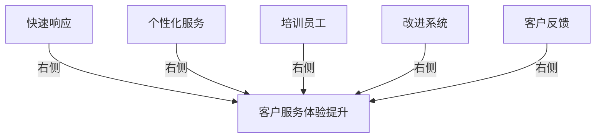

                 

### 文章标题

《激发创意：让头脑风暴更有效的技巧》

### 关键词

创意、头脑风暴、启发式思考、创造力激发、记录与整理

### 摘要

本文将深入探讨头脑风暴的原理、技巧和实践，旨在通过一系列系统化的方法和策略，激发创意的无限潜能，让头脑风暴成为一种高效、富有成效的思维工具。文章从理论基础到实践应用，全面解析如何优化头脑风暴过程，提高创意输出质量和效率。

---

## 目录大纲

### 激发创意：让头脑风暴更有效的技巧

> 关键词：创意、头脑风暴、启发式思考、创造力激发、记录与整理

> 摘要：本文将深入探讨头脑风暴的原理、技巧和实践，旨在通过一系列系统化的方法和策略，激发创意的无限潜能，让头脑风暴成为一种高效、富有成效的思维工具。文章从理论基础到实践应用，全面解析如何优化头脑风暴过程，提高创意输出质量和效率。

#### 第1章 引言

##### 1.1 创意的本质与重要性

##### 1.2 头脑风暴的历史与发展

##### 1.3 头脑风暴的挑战与问题

#### 第2章 头脑风暴的准备工作

##### 2.1 设定明确的目标

##### 2.2 确定参与人员

##### 2.3 选择合适的时间和地点

##### 2.4 收集相关资料和工具

#### 第3章 头脑风暴的核心技巧

##### 3.1 启发式思考

###### 3.1.1 问题重构

###### 3.1.2 假设检验

###### 3.1.3 逆向思维

##### 3.2 创造力的激发

###### 3.2.1 心理安全

###### 3.2.2 跨界思维

###### 3.2.3 多元化观点

##### 3.3 有效的记录和整理

###### 3.3.1 口头表达

###### 3.3.2 速记技巧

###### 3.3.3 电子工具的使用

#### 第4章 头脑风暴的实践步骤

##### 4.1 开始阶段

###### 4.1.1 引入话题

###### 4.1.2 鼓励自由发言

###### 4.1.3 时间管理

##### 4.2 发展阶段

###### 4.2.1 建立思维导图

###### 4.2.2 进行分类和筛选

###### 4.2.3 鼓励拓展和深化讨论

##### 4.3 收尾阶段

###### 4.3.1 总结成果

###### 4.3.2 确定行动计划

###### 4.3.3 反馈与改进

#### 第5章 头脑风暴的常见问题与解决策略

##### 5.1 参与者不积极

##### 5.2 讨论偏离主题

##### 5.3 创意无法落地

##### 5.4 时间控制不当

#### 第6章 头脑风暴的实际案例与应用

##### 6.1 企业创新案例

##### 6.2 政府政策制定

##### 6.3 教育领域

##### 6.4 媒体创意制作

#### 第7章 总结与展望

##### 7.1 头脑风暴的总体评估

##### 7.2 未来的发展方向

##### 7.3 对个人和组织的影响

##### 7.4 拓展阅读与资源推荐

---

本文的目录大纲已按照要求完成，各章节内容将分别进行详细阐述。在接下来的各章节中，我们将逐步深入探讨头脑风暴的各个方面，以帮助读者掌握这一高效的创意激发工具。在引言部分，我们首先需要了解创意与头脑风暴的概念及其重要性。

## 第1章 引言

### 1.1 创意的本质与重要性

创意，作为一种创新思维和创造力的体现，是现代社会中不可或缺的元素。创意不仅仅限于艺术创作或产品设计，它涵盖了从科学发明到企业管理，从教育创新到公共政策制定等各个领域。创意的核心在于它能够将原本分散、孤立的想法通过独特的视角和逻辑联系在一起，产生新的价值。

在技术领域中，创意尤为重要。随着信息技术的快速发展，人们面对的问题越来越复杂，需要创新的方法和思路来应对。比如，在软件开发中，好的创意能够带来更高效、更稳定的代码；在产品设计上，创意则能够创造出更人性化的用户体验。

创意的重要性不仅体现在解决问题上，还能带来新的商业机会。许多成功的企业都是基于独特的创意和创新的商业模式得以发展壮大。比如，苹果公司通过一系列颠覆性的创意，如iPod、iPhone和iPad等，重新定义了电子产品的设计标准和市场格局。

### 1.2 头脑风暴的历史与发展

头脑风暴（Brainstorming）作为一种系统化的创意激发方法，起源于20世纪中叶。由美国广告公司BBDO的创意总监亚历克斯·奥斯本（Alex Faickney Osborn）提出。他在1939年的著作《头脑风暴：激发创意的思维方法》（"Applied Imagination"）中，系统地阐述了如何通过集体讨论来激发创意。

亚历克斯·奥斯本认为，头脑风暴的关键在于创造一个自由、开放的环境，鼓励参与者无拘无束地提出各种想法，无论这些想法看起来多么荒诞不经。这些想法会被记录下来，随后进行筛选和评估。头脑风暴的目标是产生尽可能多的创意，而不是立即评估它们的质量。

随着时间的推移，头脑风暴的方法不断演变和完善。现代的头脑风暴不仅局限于面对面的讨论，还采用了电子工具和虚拟会议平台，使得参与者的地域和时间限制得到了极大的突破。

### 1.3 头脑风暴的挑战与问题

尽管头脑风暴被认为是一种有效的创意激发方法，但其实践过程中仍面临一些挑战和问题。

首先，参与者的积极性是一个重要问题。有时，参与者可能因为对主题不感兴趣或缺乏自信而不愿意积极参与讨论。这会导致讨论的氛围不活跃，创意的产生受阻。

其次，讨论的效率也是一个关键问题。在头脑风暴过程中，如何有效地管理和控制时间，确保每个参与者都有足够的时间表达自己的想法，同时又不至于讨论偏离主题，是一个需要解决的问题。

此外，如何确保创意的可行性和实用性，也是一个挑战。头脑风暴产生的创意往往数量庞大，但并非每一个创意都能够成功落地。因此，筛选和评估创意的步骤至关重要。

最后，头脑风暴的效果也因人而异。不同的个体和团队在创意思维方面存在差异，如何根据具体情况调整头脑风暴的方法，以最大化其效果，是一个需要深入探讨的问题。

通过了解创意的本质、头脑风暴的历史与发展以及其面临的挑战和问题，我们能够更好地认识到头脑风暴的重要性，并为后续的详细探讨打下基础。

## 第2章 头脑风暴的准备工作

### 2.1 设定明确的目标

在开展头脑风暴之前，明确的目标设定至关重要。一个清晰的目标能够帮助参与者集中注意力，避免讨论偏离主题，提高头脑风暴的效率。具体而言，目标的设定需要满足以下几项要求：

首先，目标应具有明确性。这包括目标的清晰描述和具体的可衡量标准。例如，“开发一款能够提高工作效率的软件”是一个模糊的目标，而“设计一款能在30分钟内完成文件整理任务的桌面应用程序”则是一个明确的目标。

其次，目标应具有挑战性。适当设置挑战性的目标可以激发参与者的创造力和积极性。但挑战性不应过高，否则可能导致参与者的压力过大，创意受阻。

最后，目标应具有可达成性。目标需要结合实际情况和资源限制，确保参与者在合理的时间内能够实现。过于理想化的目标可能会使参与者感到沮丧，从而影响头脑风暴的效果。

### 2.2 确定参与人员

参与人员的确定是头脑风暴成功的关键因素之一。合适的参与者不仅能够提供多样化的视角和创意，还能够激发彼此的灵感，共同推动讨论的深入。以下是选择参与人员时需要考虑的几个方面：

首先，参与人员应具备相关知识和经验。这意味着他们需要具备与头脑风暴主题相关的专业知识和实际操作经验。例如，在开发一款新软件时，开发人员、设计师和产品经理是不可或缺的参与者。

其次，参与人员的多样性是促进头脑风暴的重要因素。不同的背景和经验能够带来不同的思维方式和观点，有助于产生更多创新的解决方案。因此，选择具有不同学科背景、职能岗位和文化背景的参与者，有助于增强头脑风暴的效果。

第三，参与人员的数量应适度。过多的人员可能会导致讨论分散，难以集中注意力；而过少的人员则可能限制了创意的产生。一般而言，5-10人的团队是比较理想的头脑风暴参与者数量。

最后，参与人员的选择应考虑到其参与度和积极性。选择那些对讨论主题有热情、愿意分享想法和接受他人建议的参与者，能够确保头脑风暴的顺利进行。

### 2.3 选择合适的时间和地点

选择合适的时间和地点对于头脑风暴的顺利进行至关重要。以下是一些关键点：

首先，时间的选择应避免干扰因素。避免在会议日历中安排其他重要的会议或任务，以确保参与者能够全身心地投入到头脑风暴中。此外，应确保时间安排合理，避免过长或过短的会议时间。一般来说，1-2小时的头脑风暴会议是较为理想的时间长度。

其次，地点的选择应提供舒适、安静的环境。选择一个宽敞、无干扰的房间，确保参与者能够集中精力。如果可能，可以提供一些舒适座椅和桌子，以提升参与者的舒适度。

此外，电子工具的配置也是不可忽视的一环。确保所有参与者都有良好的网络连接和必要的技术工具，如白板、投影仪和笔记本电脑等，以便实时记录和展示创意。

最后，地点的选择应考虑到参与者的便利性。选择一个容易到达的地点，以减少参与者的交通和时间成本，确保他们能够准时参加。

### 2.4 收集相关资料和工具

在头脑风暴过程中，相关资料和工具的准备能够为讨论提供有力的支持，有助于激发创意。以下是一些常用的资料和工具：

首先，背景资料是必不可少的。这些资料包括与头脑风暴主题相关的市场研究、竞品分析、用户调研报告等。这些信息能够帮助参与者更好地理解讨论的主题，提供有益的参考。

其次，启发式工具也是提高头脑风暴效果的重要手段。例如，思维导图、鱼骨图、六顶思考帽等工具，可以帮助参与者从不同角度思考问题，探索多种可能的解决方案。

此外，记录工具也是不可或缺的。传统的纸质笔记和电子笔记工具，如笔记本电脑、平板电脑和智能手机等，可以帮助参与者随时记录自己的想法。现代的电子工具如Google文档、Trello等，还可以实现实时协作和共享，提高记录和整理的效率。

最后，创意展示工具也是重要的辅助手段。例如，投影仪和屏幕共享工具，可以帮助参与者展示和讨论他们的创意，增强互动性和直观性。

通过充分的准备工作，确保明确的目标、合适的参与人员、合适的时间和地点以及相关资料和工具的充分准备，可以为头脑风暴的成功奠定坚实的基础。在接下来的章节中，我们将进一步探讨头脑风暴的核心技巧和实践步骤，以帮助读者更有效地激发创意。

### 第3章 头脑风暴的核心技巧

在头脑风暴过程中，运用一系列核心技巧能够有效激发创意，提高讨论的质量和效率。以下是一些关键技巧，包括启发式思考、创造力的激发和有效的记录和整理。

#### 3.1 启发式思考

启发式思考是一种基于经验和直觉的问题解决方法，它通过不同的视角和方法，帮助人们跳出传统的思维模式，找到创新的解决方案。以下是几种常见的启发式思考技巧：

##### 3.1.1 问题重构

问题重构是通过重新定义或重新表述问题，来启发新的思考方向。这种方法有助于避免陷入固定思维模式，从而产生新的创意。例如，将“如何减少客户投诉？”重构为“如何增加客户满意度？”，从而将注意力从问题本身转移到潜在的解决方案上。

##### 3.1.2 假设检验

假设检验是通过提出和验证各种假设来探索问题的可能性。这种方法能够帮助团队快速筛选出可行的创意，并排除那些显然不可行的想法。例如，在开发一款新产品时，可以先提出几个关键假设，如“产品需要具备哪些功能？”、“目标用户是谁？”等，然后对这些假设进行验证。

##### 3.1.3 逆向思维

逆向思维是一种从反方向思考问题的方法，它可以帮助团队发现那些未被传统方法考虑的解决方案。例如，在解决交通拥堵问题时，可以通过逆向思维来考虑“如何让车辆减少在路上的时间？”而不是“如何让车辆更快地行驶？”

#### 3.2 创造力的激发

激发创造力是头脑风暴的重要目标之一。以下是一些常见的创造力激发技巧：

##### 3.2.1 心理安全

心理安全是指创造一个无评判、无压力的环境，让参与者自由地表达自己的想法。这是激发创造力的基础。管理者应鼓励团队成员提出各种奇思妙想，不论这些想法是否合理。通过建立心理安全，可以减少参与者的顾虑，从而激发更多的创意。

##### 3.2.2 跨界思维

跨界思维是指将不同领域的知识、方法和技巧结合起来，以产生新的创意。例如，将艺术与科技相结合，可以创造出独特的产品设计；将心理学与营销策略相结合，可以提升用户体验和品牌价值。通过跨界思维，可以打破固有的思维界限，发现新的可能性。

##### 3.2.3 多元化观点

多元化观点是指鼓励团队成员从不同的视角和背景出发，提出各自的见解和想法。多元化观点能够带来丰富的创意和创新的解决方案。因此，在头脑风暴过程中，应鼓励团队成员分享各自的见解，并尊重不同的观点。

#### 3.3 有效的记录和整理

有效的记录和整理是确保头脑风暴成果得以延续和实施的关键。以下是一些实用的记录和整理技巧：

##### 3.3.1 口头表达

在头脑风暴过程中，口头表达是一种重要的沟通方式。参与者应确保自己的发言清晰、简洁，并尽可能具体地描述自己的想法。此外，主持人也应鼓励其他参与者倾听和记录，确保每一个创意都不被遗漏。

##### 3.3.2 速记技巧

速记技巧是在快速记录过程中保持准确性的方法。常见的速记方法包括符号记法、缩写和关键词记录等。通过练习速记，参与者可以在头脑风暴过程中迅速捕捉和记录关键信息。

##### 3.3.3 电子工具的使用

现代电子工具为头脑风暴提供了便捷、高效的记录和整理手段。例如，使用Google文档、Trello、Miro等协作工具，可以实现实时共享和协作，提高记录和整理的效率。这些工具还支持多种格式和功能，如投票、评论和标注等，有助于团队更好地管理和筛选创意。

通过运用这些核心技巧，头脑风暴的过程将更加高效和富有成效。在接下来的章节中，我们将详细探讨头脑风暴的实践步骤，帮助读者更好地应用这些技巧，实现创意的激发和落地。

### 第3章 头脑风暴的核心技巧（续）

#### 3.4 有效的头脑风暴流程设计

设计一个有效的头脑风暴流程是确保创意产生过程顺利进行的必要条件。以下是一些关键步骤和方法：

##### 3.4.1 引入话题

在头脑风暴会议开始时，主持人应明确讨论的主题和目标，确保所有参与者对讨论的内容有清晰的认识。可以采用提问的方式引入话题，激发参与者的思考。例如，可以提问：“我们如何改进我们的客户服务流程？”这样的问题能够引发参与者的共鸣和兴趣。

##### 3.4.2 建立规则

在开始头脑风暴之前，主持人应明确讨论的规则，以确保讨论的有序进行。这些规则可以包括：

- 每个人都有发言的权利，每个人发言的时间限制
- 不对任何创意进行评判，所有创意都应被记录下来
- 鼓励自由发言，不限制想法的数量和质量
- 鼓励参与者倾听他人发言，并在此基础上提出新的想法

##### 3.4.3 分组讨论

将参与者分为小组可以增加互动和协作的机会，有助于激发更多的创意。每个小组可以在一定时间内独立进行讨论，然后进行成果分享。这种分组讨论的方法不仅可以提高讨论的效率，还能确保每个参与者都有机会发言和参与。

##### 3.4.4 时间管理

确保头脑风暴会议的时间管理得当，是保持讨论高效进行的关键。主持人应设定明确的时间节点，确保每个讨论阶段都有足够的时间进行。例如，可以设定15分钟用于引入话题，20分钟用于自由发言，10分钟用于小组讨论，10分钟用于成果分享。

##### 3.4.5 反馈与总结

在头脑风暴会议结束时，主持人应对讨论的成果进行总结，并对创意进行初步筛选。同时，鼓励参与者提供反馈，分享他们在讨论过程中的感受和看法。这些反馈有助于改进未来的头脑风暴会议，提高其效果。

##### 3.4.6 持续跟进

头脑风暴只是一个开始，后续的跟进和实施是确保创意能够落地的重要环节。主持人应确保创意被记录下来，并分配责任人和实施时间表。通过定期跟进和评估，可以确保创意能够顺利转化为实际的行动和成果。

通过上述步骤和方法，设计一个有效的头脑风暴流程，可以确保讨论的有序进行，激发更多的创意，并提高整体效率。在下一章节中，我们将进一步探讨头脑风暴的实践步骤，帮助读者将理论转化为实际操作。

### 第4章 头脑风暴的实践步骤

#### 4.1 开始阶段

**4.1.1 引入话题**

在开始阶段，主持人需要通过明确的引导和激发，确保参与者对讨论的主题和目标有清晰的认识。首先，主持人可以简要介绍讨论的背景和目的，例如：“今天我们讨论的主题是如何提升我们的客户服务体验。”随后，可以提出一个具体的问题或挑战，以激发参与者的思考，例如：“你们认为有哪些方法可以显著改善客户服务？”

**4.1.2 鼓励自由发言**

为了创造一个开放、自由的讨论氛围，主持人应明确强调不评判、不限制的想法。主持人可以用以下话语激励参与者：“无论你的想法听起来多么奇怪，都请说出来，我们会在稍后评估。”这种开放的态度可以鼓励参与者大胆地提出各种想法，从而激发更多的创意。

**4.1.3 时间管理**

在开始阶段，主持人应设定一个初步的时间表，以确保讨论的有序进行。例如，可以设定15分钟用于自由发言，10分钟用于对初步想法进行分类和整理。时间管理不仅能够确保每个参与者都有机会发言，还能避免讨论偏离主题。

#### 4.2 发展阶段

**4.2.1 建立思维导图**

在发展阶段，主持人可以引导参与者使用思维导图来组织和展示他们的想法。思维导图是一种图形化的工具，能够帮助团队清晰地展示各种想法之间的关系，并发现潜在的关联。以下是一个思维导图的示例：

通过建立思维导图，团队可以更直观地看到各个创意之间的关系，并发现新的组合和可能性。

**4.2.2 进行分类和筛选**

在思维导图建立之后，主持人可以引导参与者对创意进行分类和筛选。分类可以帮助团队更好地理解创意的多样性，并识别出那些具有共同特征或相似目标的创意。筛选则是对创意进行初步评估，识别出那些最有可能实现和最有价值的创意。以下是一个分类和筛选的例子：

- **快速响应**：减少等待时间、优化客服流程
- **个性化服务**：客户画像、定制化推荐
- **培训员工**：提升沟通技巧、增加产品知识
- **改进系统**：自动化工具、客户管理系统升级
- **客户反馈**：快速响应客户反馈、改进产品和服务

**4.2.3 鼓励拓展和深化讨论**

在分类和筛选之后，主持人可以鼓励参与者对每个分类中的创意进行拓展和深化讨论。这有助于团队进一步发掘每个创意的潜力和可行性。以下是一个拓展和深化讨论的例子：

- **快速响应**：讨论具体的技术解决方案，如引入实时聊天工具、使用机器学习算法预测客户需求等。
- **个性化服务**：讨论如何收集和分析客户数据，如何设计个性化体验，以及可能面临的隐私问题。

通过这些发展阶段的方法，团队可以系统化地推进头脑风暴，确保创意的产生、分类和评估过程高效、有序。

#### 4.3 收尾阶段

**4.3.1 总结成果**

在收尾阶段，主持人需要对讨论的成果进行总结。这包括对创意进行回顾、分类和筛选结果。主持人可以用简短的句子或思维导图的形式，将主要创意和结论呈现给参与者，以便大家有一个清晰的认识。

**4.3.2 确定行动计划**

在总结成果之后，主持人可以引导团队确定具体的行动计划。这包括为每个创意分配责任人和实施时间表。例如，可以指定某个团队成员负责开发特定的功能，或为某个创意创建一个跨部门的项目小组。以下是一个行动计划示例：

- **快速响应**：由市场营销团队负责引入实时聊天工具，3个月内完成。
- **个性化服务**：由数据分析和产品团队合作，6个月内完成客户画像系统的开发。

**4.3.3 反馈与改进**

最后，主持人应鼓励参与者提供反馈，分享他们对头脑风暴过程的感受和建议。这些反馈可以帮助团队改进未来的头脑风暴会议，提高其效果。主持人可以用以下问题引导反馈：

- “你从这次头脑风暴中学到了什么？”
- “你觉得哪些环节最有效？”
- “你觉得有哪些地方可以改进？”

通过上述实践步骤，团队可以系统地组织和开展头脑风暴，确保创意的产生、分类、评估和实施过程高效、有序。在下一章中，我们将探讨头脑风暴过程中常见的问题与解决策略。

### 第5章 头脑风暴的常见问题与解决策略

尽管头脑风暴是一种有效的创意激发方法，但其实施过程中仍然会遇到一些问题。以下是头脑风暴过程中常见的问题及相应的解决策略：

#### 5.1 参与者不积极

**问题分析**：参与者不积极可能由于对讨论主题不感兴趣、缺乏自信、或担心自己的想法被评判等原因导致。

**解决策略**：
- **明确目标与利益**：确保参与者理解头脑风暴的目标和预期成果，以及他们个人在其中的角色和利益，提高参与度。
- **创造心理安全**：建立无评判、无压力的讨论环境，鼓励每个人自由发言，减少参与者的顾虑。
- **设定激励机制**：为积极参与者提供奖励或认可，如表彰、奖金或额外的休息时间等，以激励其积极性。

#### 5.2 讨论偏离主题

**问题分析**：讨论偏离主题可能是由于讨论氛围过于自由、缺乏明确的时间管理或参与者的参与度不一致等原因导致。

**解决策略**：
- **明确讨论规则**：在讨论开始时，明确讨论的主题和目标，并设定时间限制，确保讨论始终围绕主题进行。
- **主持人引导**：主持人应主动引导讨论，确保每个发言都与主题相关，及时纠正偏离主题的讨论。
- **定期回顾目标**：在讨论过程中，主持人应定期回顾讨论的目标，以提醒参与者保持聚焦。

#### 5.3 创意无法落地

**问题分析**：创意无法落地可能是由于创意质量不高、缺乏资源或实施计划不明确等原因导致。

**解决策略**：
- **筛选与评估**：在头脑风暴过程中，对创意进行初步筛选和评估，确保创意具备可行性。
- **资源准备**：在讨论阶段，明确创意所需的资源和人力，并提前准备，确保创意能够顺利实施。
- **制定行动计划**：为每个创意制定详细的实施计划，包括责任人、时间表和关键里程碑，确保创意落地有具体的执行路径。

#### 5.4 时间控制不当

**问题分析**：时间控制不当可能导致讨论效率低下，无法在规定时间内完成所有讨论内容。

**解决策略**：
- **设定时间表**：在讨论开始前，设定详细的时间表，确保每个阶段都有足够的时间进行。
- **时间提醒**：在讨论过程中，主持人应定期提醒时间，确保讨论不超出预定时间。
- **优先级排序**：明确讨论的重点和优先级，确保时间被更有效地利用。

通过上述策略，可以有效解决头脑风暴过程中常见的问题，提高讨论的效率和创意的质量。在下一章中，我们将通过实际案例展示头脑风暴在不同领域的应用，进一步探讨其价值和效果。

### 第6章 头脑风暴的实际案例与应用

头脑风暴作为一种创新的思维工具，已经在多个领域得到了广泛应用，并取得了显著的成果。以下将介绍一些具体的实际案例，展示头脑风暴在不同场景中的应用。

#### 6.1 企业创新案例

在商业领域，企业创新是保持竞争力的关键。许多公司通过头脑风暴来激发员工的创意，推动产品和服务的发展。例如，谷歌公司在其“20%项目”中，允许员工将20%的工作时间用于个人感兴趣的项目。这一政策鼓励了大量的创新，如Gmail和Google News等就是通过头脑风暴诞生的。通过这种开放、自由的讨论环境，谷歌员工能够提出各种新颖的想法，并快速转化为实际的产品。

**案例描述**：
- **谷歌20%项目**：谷歌允许员工在工作时间内用20%的时间来探索自己的兴趣项目。
- **创新成果**：Gmail、Google News和Google Docs等创新产品，都是通过员工在头脑风暴中提出的想法实现的。

**效果评估**：
- 提升了员工的参与感和创造力。
- 推动了公司的技术创新和产品更新。
- 增强了公司的市场竞争力。

#### 6.2 政府政策制定

政府政策制定过程中，头脑风暴同样发挥了重要作用。通过集体讨论，政府官员和专家学者能够共同探讨问题的各个方面，提出创新的解决方案。例如，在应对气候变化问题上，各国政府通过头脑风暴讨论低碳经济发展策略，制定了一系列政策措施。

**案例描述**：
- **联合国气候变化峰会**：在联合国气候变化峰会上，各国代表通过头脑风暴，共同探讨减排和适应气候变化的策略。
- **政策成果**：《巴黎协定》是头脑风暴的成果之一，旨在全球范围内减少温室气体排放。

**效果评估**：
- 增强了各国在应对气候变化问题上的合作与共识。
- 提出了许多创新的政策建议，推动了全球气候治理的进展。
- 为实现可持续发展和环境保护提供了有力支持。

#### 6.3 教育领域

在教育领域，头脑风暴被广泛应用于课程设计、教学方法改进和学生创造力培养。例如，教师在设计课程时，可以通过头脑风暴讨论教学目标、内容和方法，从而提高课程的质量和学生的参与度。

**案例描述**：
- **课程设计头脑风暴**：教师们通过头脑风暴，讨论如何改进课程设计，使教学内容更加丰富和有趣。
- **学生项目**：在学生项目的设计过程中，教师鼓励学生通过头脑风暴提出创新性的项目方案。

**效果评估**：
- 提高了课程设计的创新性和实用性。
- 增强了学生的学习兴趣和参与度。
- 培养了学生的创新思维和解决问题的能力。

#### 6.4 媒体创意制作

在媒体创意制作领域，头脑风暴被广泛应用于剧本创作、广告策划和节目制作等。通过集体讨论，创意团队能够提出各种新颖的想法，创造出具有吸引力的作品。

**案例描述**：
- **电影剧本创作**：电影编剧团队通过头脑风暴，讨论剧本的故事情节、角色设定和拍摄场景，从而创造出引人入胜的剧本。
- **广告策划**：广告创意团队通过头脑风暴，探讨如何将品牌理念与创意广告相结合，制作出具有吸引力和记忆点的广告。

**效果评估**：
- 提高了作品的创意质量和市场反响。
- 增强了品牌的认知度和影响力。
- 创造了具有高观看率和用户参与度的媒体内容。

通过这些实际案例，我们可以看到，头脑风暴在不同领域的应用取得了显著的成果。它不仅激发了创新思维，推动了项目进展，还提高了团队协作和沟通效率。在下一章中，我们将对头脑风暴进行总结与展望，探讨其在未来的发展方向和对个人与组织的影响。

### 第7章 总结与展望

#### 7.1 头脑风暴的总体评估

头脑风暴作为一种创新的思维工具，已经在多个领域得到了广泛应用，并取得了显著的成效。总体来看，头脑风暴具有以下几大优势：

首先，头脑风暴能够迅速激发创意，提高问题解决效率。通过集体讨论，团队成员可以从不同角度和背景出发，提出多样化的想法，从而找到更全面、更创新的解决方案。

其次，头脑风暴能够增强团队协作和沟通。在头脑风暴过程中，参与者需要互相倾听、交流，这有助于团队成员之间的信任和合作，提高团队的整体效能。

此外，头脑风暴提供了一个开放、自由的环境，鼓励每个人大胆地提出自己的想法，减少了对创意的压抑和限制，从而激发出更多具有潜力的创意。

然而，头脑风暴也存在一些局限。例如，讨论过程中可能存在时间管理不当、创意筛选困难等问题。此外，参与者的积极性、心理安全和资源准备等因素也会影响头脑风暴的效果。

#### 7.2 未来的发展方向

随着科技的发展和社会的进步，头脑风暴在未来有望在以下几个方面得到进一步发展：

首先，数字工具的引入将进一步优化头脑风暴的过程。例如，虚拟现实（VR）和增强现实（AR）技术可以为参与者提供更直观、更互动的讨论环境，提高头脑风暴的体验和效果。

其次，人工智能（AI）技术的应用将使得头脑风暴过程更加智能化。AI可以通过分析大量数据，提供更精准的创意建议，甚至预测可能出现的创意盲点，从而提升头脑风暴的质量和效率。

此外，跨领域、跨行业的合作将进一步扩展头脑风暴的应用范围。通过跨界思维，不同领域的专家可以共同探讨复杂问题，提出创新的解决方案，推动社会的整体进步。

#### 7.3 对个人和组织的影响

头脑风暴不仅对组织创新和团队协作有着积极影响，也对个人成长和发展具有重要意义：

对于个人，头脑风暴可以提升创造力、沟通能力和解决问题的能力。通过不断地思考和讨论，个人可以培养出更全面、更深刻的思维模式，提高自己的综合素质。

对于组织，头脑风暴可以激发创新思维，推动产品和服务的发展。通过有效的头脑风暴，组织可以快速应对市场变化，提高竞争力。同时，头脑风暴还能够增强团队凝聚力，促进内部沟通和协作，提升整体效能。

#### 7.4 拓展阅读与资源推荐

为了帮助读者进一步了解头脑风暴的相关知识和应用，以下推荐一些拓展阅读和资源：

- **书籍**：《头脑风暴：创新思维的秘诀》作者：亚历克斯·奥斯本
- **在线课程**：Coursera上的《创意思维与设计思维》
- **网站**：Miro.com（头脑风暴协作工具）
- **公众号**：『创意思维与设计思维』（提供创意思维相关资讯和案例分析）

通过这些拓展资源，读者可以更深入地了解头脑风暴的理论和实践，进一步提升自己的创意思维能力和应用效果。

### 结尾

本文通过详细探讨头脑风暴的原理、技巧和实践步骤，旨在帮助读者掌握这一有效的创意激发工具。头脑风暴不仅能够激发创意，提高问题解决效率，还能增强团队协作和沟通能力。在未来的发展中，随着科技的进步和跨领域的合作，头脑风暴将发挥更大的作用，推动社会的创新和进步。

最后，感谢您的阅读。希望本文能够对您在创意激发和头脑风暴实践过程中提供有益的启示和帮助。如果您有任何疑问或建议，欢迎在评论区留言，让我们一起探讨和交流。

作者：AI天才研究院/AI Genius Institute & 禅与计算机程序设计艺术 /Zen And The Art of Computer Programming

---

以上就是本文的完整内容。从创意的本质、头脑风暴的历史与发展，到准备工作、核心技巧、实践步骤、常见问题与解决策略，以及实际案例和应用，本文全面解析了头脑风暴的各个方面，旨在帮助读者更好地理解和应用这一创新的思维工具。在未来的学习和实践中，愿您能够不断激发创意，实现个人和团队的共同成长。再次感谢您的阅读，希望您能在头脑风暴的世界中找到属于自己的灵感之光。

