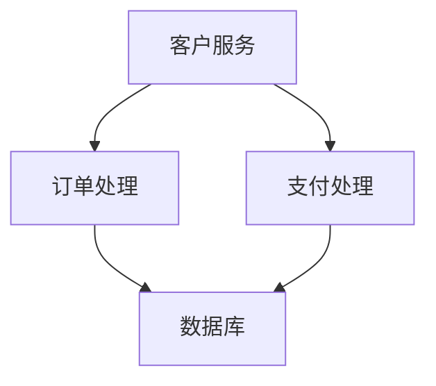
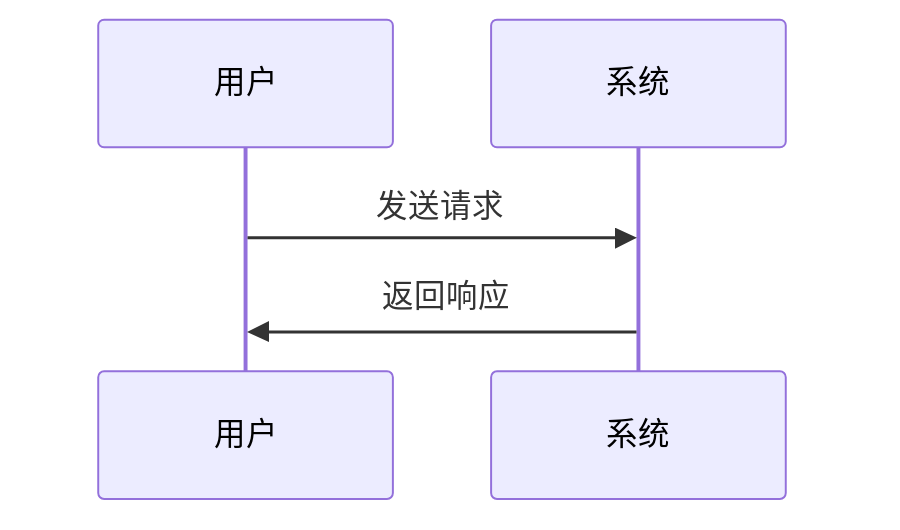
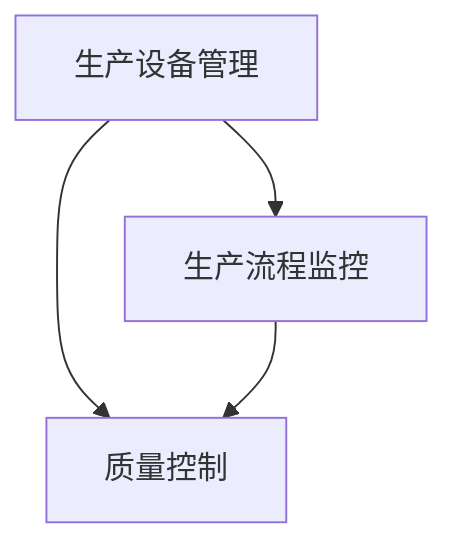
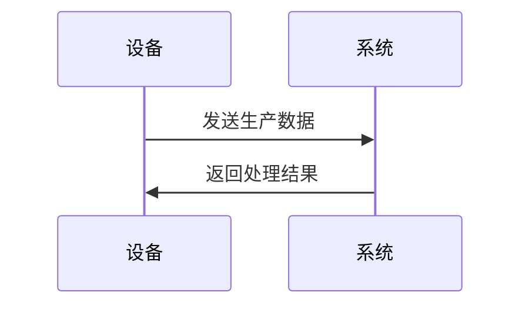

                 

### 目标设定的基本概念

在IT领域，目标设定是一个至关重要的环节。它不仅关乎项目的成功与否，还直接影响团队的工作效率和员工的发展。本文将系统地探讨目标设定的概念、重要性及其原则。

#### **核心概念术语说明**

- **目标设定**：是指在特定时间内，为达到预期结果而确定的具体目标。
- **SMART目标**：一种目标设定的方法，即目标需具备具体（Specific）、可衡量（Measurable）、可实现（Achievable）、相关（Relevant）和时限（Time-bound）的特征。
- **价值观导向法**：基于个人或团队的价值观，制定与之一致的目标。

#### **问题背景**

在快速发展的IT行业，项目和技术更新迭代迅速。为了确保团队能够在变化中保持竞争力，明确的目标设定显得尤为重要。然而，很多团队在目标设定过程中常常面临以下问题：

- 目标模糊不清，难以衡量进展。
- 缺乏具体行动计划，导致目标无法实现。
- 目标与个人或团队价值观不匹配，影响积极性。

#### **问题描述**

如何有效制定和实现目标，确保团队在动态环境中保持高效运作，成为当前IT领域面临的主要挑战。

#### **问题解决**

为了解决上述问题，我们需要遵循以下原则：

1. **明确目标**：确保目标具体、可衡量、可实现、相关和时限。
2. **制定行动计划**：将目标分解为具体的任务，并设定明确的完成时间。
3. **价值观导向**：确保目标与个人或团队的价值观一致，增强执行动力。

#### **边界与外延**

目标设定的边界在于确保目标的可实现性和时效性，而其外延则涉及目标的制定、执行和跟踪全过程。此外，目标设定还需考虑外部环境的变化，如市场需求、技术趋势等。

#### **概念结构与核心要素组成**

目标设定的概念结构包括：

1. **目标**：核心概念，是整个目标设定的基础。
2. **SMART原则**：确保目标具体、可衡量、可实现、相关和时限。
3. **行动计划**：具体实施步骤，确保目标能够实现。
4. **价值观导向**：确保目标与个人或团队价值观一致。

#### **下一步分析**

在明确目标设定的基本概念后，我们将在下一节中详细探讨目标设定的步骤，帮助团队系统地制定和实现目标。**让我们一步步思考，深入理解目标设定的核心原理和方法。**

### 明确目标设定的步骤

要成功地设定目标，必须遵循一系列系统化的步骤。以下是明确目标设定的主要步骤，包括分析现状、确定目标和制定行动计划。

#### **分析现状**

在开始设定目标之前，了解当前状态是至关重要的一步。以下是具体步骤：

1. **收集数据**：通过调研、访谈和数据分析，了解团队当前的工作表现、资源分配和市场需求。
2. **识别问题**：找出当前存在的问题和瓶颈，如项目进度延误、资源不足或市场需求变化等。
3. **评估优势与劣势**：分析团队的优势和劣势，了解如何在现有条件下制定出合理的目标。

#### **确定目标**

在分析现状的基础上，我们需要明确目标。以下是具体步骤：

1. **明确目标方向**：根据团队愿景和战略规划，确定目标的大致方向。
2. **具体化目标**：将目标具体化，使其具备SMART特征（具体、可衡量、可实现、相关、时限）。
3. **目标分解**：将总目标分解为若干个子目标，确保每个子目标都是可实现的。

#### **制定行动计划**

制定明确的行动计划是确保目标实现的必要步骤。以下是具体步骤：

1. **任务分解**：将每个子目标分解为具体的任务，明确任务的责任人和完成时间。
2. **资源分配**：根据任务需求，合理分配资源，确保任务能够顺利执行。
3. **风险评估**：评估每个任务可能面临的风险，并制定相应的应对措施。
4. **制定时间表**：为每个任务设定明确的完成时间，确保项目按时完成。

### **步骤详述**

1. **分析现状**：
   - **数据收集**：使用问卷调查、员工访谈、项目报告和市场分析等方式，收集团队当前的表现数据和相关信息。
   - **识别问题**：通过数据分析，识别项目中的瓶颈和存在的问题，如进度延误、资源不足或质量不高等。
   - **评估优势与劣势**：分析团队在技术、资源、市场等方面的优势与劣势，为后续目标的制定提供参考。

2. **确定目标**：
   - **明确目标方向**：根据团队的愿景和战略规划，确定短期和长期的目标方向。
   - **具体化目标**：将目标具体化，如“提高项目完成率至90%”或“增加市场占有率5%”。
   - **目标分解**：将总目标分解为若干个子目标，如“缩短项目开发周期一个月”或“提升产品质量评分至4.5星”。

3. **制定行动计划**：
   - **任务分解**：将子目标分解为具体的任务，如“优化代码架构”或“改进客户服务流程”。
   - **资源分配**：根据任务需求，合理分配人力资源、技术资源和预算。
   - **风险评估**：评估每个任务可能面临的风险，如技术难题、资源不足或时间压力。
   - **制定时间表**：为每个任务设定明确的完成时间，并制定阶段性目标，确保项目按时完成。

通过以上步骤，团队可以系统地制定目标，并制定出切实可行的行动计划，为后续的实现奠定基础。在接下来的章节中，我们将进一步探讨如何制定SMART目标，并提供具体的方法和技巧。**让我们继续深入分析，确保目标设定的科学性和有效性。**

### 制定SMART目标

SMART目标是一种广泛应用于目标设定的方法，它确保目标具备具体、可衡量、可实现、相关和时限的特征。以下我们将分别解释这些特征，并提供具体的制定方法和示例。

#### **S代表具体（Specific）**

具体的目标应明确具体，避免模糊不清。以下是具体化目标的方法：

1. **明确目标对象**：确保目标指向明确，如“提高项目完成率”应改为“提高项目A的完成率”。
2. **详细描述目标内容**：详细描述目标的具体内容，如“提升产品质量”应改为“提升产品A的质量评分至4.5星”。
3. **设置具体数值**：使用具体的数值来量化目标，如“增加市场占有率5%”或“缩短项目开发周期一个月”。

#### **M代表可衡量（Measurable）**

可衡量的目标意味着目标应具备明确的衡量标准。以下是衡量目标的方法：

1. **设定量化指标**：使用量化指标来衡量目标进展，如“提高客户满意度至90%”。
2. **明确衡量标准**：定义具体的衡量标准，如“通过用户满意度调查进行评分”。
3. **定期跟踪进度**：设定定期的时间点，如每月或每季度，来跟踪目标的进展。

#### **A代表可实现（Achievable）**

可实现的目标应基于团队当前的能力和资源。以下是确保目标可实现的方法：

1. **评估资源**：评估团队现有的资源，包括人力、技术和资金。
2. **考虑现实因素**：确保目标考虑了现实中的困难和挑战。
3. **设定挑战性目标**：目标应具有一定的挑战性，但不应过于困难。

#### **R代表相关性（Relevant）**

相关的目标应与团队的战略和愿景保持一致。以下是确保目标相关的步骤：

1. **与愿景匹配**：确保目标与团队的长期愿景和战略规划一致。
2. **关注关键领域**：将目标集中在团队最需要改进的关键领域。
3. **平衡多重目标**：确保目标之间相互协调，避免冲突。

#### **T代表时限（Time-bound）**

时限的目标应设定明确的完成时间。以下是设置时间限制的方法：

1. **设定明确期限**：为每个目标设定具体的完成时间，如“明年年底前完成”。
2. **分阶段目标**：将大目标分解为若干个小目标，并为每个小目标设定完成时间。
3. **跟踪时间进度**：定期检查目标进度，确保按时完成。

#### **示例**

以下是一个具体的SMART目标示例：

**目标：提高项目A的完成率**

- **S（具体）**：提高项目A的完成率。
- **M（可衡量）**：通过项目管理软件跟踪项目进度，目标完成率为90%。
- **A（可实现）**：根据团队当前资源和技术能力，制定详细的项目管理计划，确保每个任务都有明确的负责人和时间表。
- **R（相关性）**：项目A是公司战略规划中的重点项目，提高其完成率有助于实现公司的长期目标。
- **T（时限）**：目标设定为三个月内完成。

通过以上步骤，我们可以确保目标具备SMART特征，从而提高目标设定的科学性和可实现性。在下一节中，我们将进一步探讨目标设定的技巧和方法，以帮助团队更有效地制定目标。**让我们继续深入分析，找到最适合团队的目标设定策略。**

### 目标设定的技巧与方法

在目标设定过程中，不同的技巧和方法可以帮助团队更有效地制定和实现目标。以下将介绍几种常用的目标设定技巧与方法。

#### **价值观导向法**

价值观导向法是基于个人或团队的价值观，制定与之一致的目标。这种方法有助于增强团队的内在动力和执行力。以下是具体步骤：

1. **明确价值观**：首先，团队需要明确共同的价值观，如团队合作、创新和客户满意度等。
2. **与价值观对齐**：在设定目标时，确保目标与团队的价值观一致。
3. **制定激励措施**：基于价值观，设定相应的激励机制，如奖励团队达成与价值观相关的目标。

#### **命题法**

命题法是通过提出问题或挑战，激发团队思考并设定目标。这种方法有助于激发团队的创造力和积极性。以下是具体步骤：

1. **提出问题或挑战**：例如，“如何提升我们的市场占有率？”或“如何缩短项目开发周期？”。
2. **讨论解决方案**：组织团队讨论，共同寻找解决问题的方法。
3. **设定具体目标**：基于讨论的结果，设定具体且可实现的目标。

#### **形成性目标法**

形成性目标法是一种动态的目标设定方法，目标会随着团队的发展和项目进展而调整。这种方法有助于团队适应变化，保持目标的灵活性。以下是具体步骤：

1. **初步设定目标**：根据当前情况，设定初步的目标。
2. **定期评估与调整**：定期评估目标进展，根据实际情况进行调整。
3. **持续改进**：通过调整目标，持续改进团队的工作效率和项目质量。

#### **演变法**

演变法是基于过去的目标设定和执行经验，逐步调整和优化的方法。这种方法有助于团队积累经验和知识，提高目标设定的科学性和有效性。以下是具体步骤：

1. **总结过去经验**：回顾过去的目标设定和执行过程，总结成功和失败的经验。
2. **制定改进计划**：根据总结的经验，制定改进计划，优化目标设定方法。
3. **持续迭代**：通过不断的迭代，逐步优化目标设定和执行过程。

#### **技巧比较**

- **价值观导向法**：有助于增强团队凝聚力，但目标可能较为抽象。
- **命题法**：激发团队创造力，但可能需要更多时间进行讨论。
- **形成性目标法**：适应变化，保持目标灵活性，但需要定期评估和调整。
- **演变法**：基于经验积累，提高目标设定的科学性，但初期可能需要更多时间进行总结。

选择哪种目标设定技巧和方法，应基于团队的具体情况和目标特点。通过灵活运用这些技巧和方法，团队可以更有效地制定和实现目标，提升整体绩效。**让我们继续深入探讨，如何将目标设定与团队实践相结合，确保目标的顺利实现。**

### 目标设定的团队实践

在目标设定的过程中，团队实践是确保目标实现的关键环节。有效的团队目标设定不仅需要明确的目标和详细的计划，还需要良好的沟通技巧和冲突管理策略。以下是关于团队目标设定的具体实践方法和建议。

#### **团队目标设定的流程**

1. **制定战略规划**：首先，团队需要明确整体的战略规划，这包括公司的愿景、使命和长期目标。这些战略规划将为团队目标设定提供方向和依据。

2. **召开目标设定会议**：在战略规划的基础上，组织团队目标设定会议。会议中，团队成员可以共同讨论和确定团队的具体目标。

3. **分解目标**：将团队总体目标分解为具体的子目标和任务。确保每个目标都是具体、可衡量、可实现、相关和时限的（SMART目标）。

4. **分配责任**：明确每个任务的负责人，确保每个目标都有明确的执行者。

5. **制定行动计划**：为每个目标制定详细的行动计划，包括任务的优先级、所需资源和预计完成时间。

6. **跟踪与评估**：定期跟踪目标进展，评估目标的实现情况，并根据需要调整计划和策略。

#### **团队目标设定的沟通技巧**

1. **明确沟通目标**：每次沟通前，确保明确沟通的目标和预期结果。

2. **倾听与反馈**：鼓励团队成员积极参与讨论，倾听他们的意见和建议，并提供及时的反馈。

3. **透明沟通**：保持沟通的透明度，确保每个成员都能了解项目的进展和目标。

4. **建立信任**：通过积极的沟通和协作，建立团队之间的信任，提高团队凝聚力。

#### **团队目标设定的冲突管理**

1. **预防冲突**：在目标设定的早期阶段，识别可能出现的冲突点，并制定预防措施。

2. **早期介入**：一旦冲突发生，及时介入，避免问题扩大。

3. **公平公正**：在处理冲突时，确保公平公正，避免偏袒。

4. **寻求共识**：通过讨论和协商，寻求团队成员的共识，达成解决方案。

5. **持续改进**：通过反思和总结，持续改进目标设定的流程和沟通技巧，以减少未来的冲突。

#### **实际操作建议**

1. **定期召开团队会议**：确保团队有足够的时间进行目标设定和进展讨论。

2. **使用目标管理工具**：使用目标管理工具（如目标追踪软件或项目管理工具），帮助团队更好地跟踪和评估目标进展。

3. **鼓励自主管理**：鼓励团队成员自主设定个人目标，并与团队总体目标保持一致。

4. **奖励与认可**：为达成目标的团队成员提供奖励和认可，增强他们的积极性和执行力。

通过以上实践方法和建议，团队可以更有效地进行目标设定和实现。有效的团队目标设定不仅能够提高团队的工作效率，还能增强团队成员的归属感和成就感。**让我们继续深入探讨，如何通过有效的执行和跟踪，确保目标的实现。**

### 目标设定的执行与跟踪

在明确了目标设定和团队实践后，如何确保这些目标的实现是关键。目标设定的执行与跟踪是确保目标达成的重要环节，主要包括执行策略、跟踪方法和面对目标偏差的调整策略。

#### **目标执行的策略**

1. **制定详细的执行计划**：目标执行计划应详细列出每个任务的执行步骤、责任人和完成时间。确保任务分解到个人，每个成员都有明确的责任。

2. **资源合理分配**：根据任务需求，合理分配人力、资金和技术资源。确保每个任务都有足够的资源支持，避免资源浪费和瓶颈。

3. **建立监督机制**：建立定期检查和监督机制，确保任务按照计划进行。通过项目管理工具或定期汇报，监控任务进度和问题。

4. **提供支持与帮助**：在执行过程中，及时提供必要的支持与帮助，解决执行中的难题和障碍。

5. **保持沟通**：保持团队成员之间的沟通，确保每个人了解项目的进展和目标，及时调整策略。

#### **目标跟踪的方法**

1. **使用目标管理工具**：利用目标管理工具（如JIRA、Trello等），记录和跟踪每个目标的进展情况。这些工具可以帮助团队成员实时查看任务状态和完成情况。

2. **定期进度汇报**：定期召开进度汇报会议，团队成员汇报任务进展，讨论存在的问题和解决方案。

3. **数据分析**：通过数据分析，监控目标的实现情况。使用关键绩效指标（KPIs）来衡量目标的完成程度，如项目完成率、客户满意度等。

4. **反馈机制**：建立有效的反馈机制，团队成员可以随时反馈问题和建议，确保问题得到及时解决。

5. **动态调整**：根据实际情况，及时调整目标和执行计划。在目标实现过程中，可能会出现新的问题和挑战，需要灵活调整策略。

#### **面对目标偏差的调整策略**

1. **及时发现问题**：通过定期跟踪和数据分析，及时发现目标偏离的情况。

2. **分析原因**：分析导致目标偏差的原因，包括资源不足、计划不周或外部环境变化等。

3. **制定调整方案**：根据分析结果，制定相应的调整方案，如重新分配资源、调整任务优先级或改变执行策略。

4. **实施调整**：执行调整方案，确保目标能够重新回到正轨。

5. **总结经验**：在目标调整过程中，总结经验和教训，为未来类似情况提供参考。

通过有效的执行与跟踪策略，团队可以确保目标的高效实现，并在面对目标偏差时及时调整，确保项目的成功。**在下一节中，我们将通过成功目标设定的案例分析和启示，为读者提供实用的经验和建议。**

### 成功目标设定的案例分析与启示

为了更好地理解如何成功地设定和实现目标，以下我们将通过两个具体的案例进行分析，并总结出一些有价值的启示。

#### **案例1：初创公司的成功扩张**

**背景介绍**：
某初创公司致力于开发一款基于人工智能的客户服务软件。在成立初期，公司的主要目标是迅速占领市场，并获得首批用户。

**项目介绍**：
公司制定了一系列短期和长期目标，包括：
- 在六个月内完成产品研发并推出市场。
- 在一年内获得500个付费用户。
- 在两年内实现盈利。

**系统功能设计**：
- **领域模型**：设计了一个包含客户、产品、订单、支付等关键实体的类图，确保系统能够满足客户需求。
- **系统架构**：采用了微服务架构，确保系统的高可用性和可扩展性。

**系统架构设计**：
- **架构图**：使用Mermaid绘制了系统架构图，展示了各服务之间的依赖关系和数据流。



**系统接口设计和系统交互**：
- **接口设计**：定义了API接口，确保各服务之间能够高效通信。
- **交互序列图**：使用Mermaid绘制了用户与系统交互的序列图，展示了用户如何通过API接口与系统进行交互。



**代码应用解读与分析**：
- **核心实现**：使用Python编写了核心代码，实现了用户认证、订单处理和支付处理等功能。
- **代码分析**：代码结构清晰，遵循了面向对象的设计原则，确保了系统的可维护性和可扩展性。

```python
class User:
    def authenticate(self, username, password):
        # 用户认证逻辑

class Order:
    def process_order(self, user, products):
        # 订单处理逻辑

class Payment:
    def process_payment(self, order):
        # 支付处理逻辑
```

**实际案例分析和详细讲解剖析**：
- **成功因素**：公司成功实现了目标，主要原因包括：
  - 明确的目标设定：基于市场和客户需求，设定了具体、可衡量、可实现的目标。
  - 系统架构设计：采用了高效的系统架构，确保了系统的稳定性和扩展性。
  - 执行与跟踪：通过定期进度汇报和数据分析，及时调整执行策略，确保目标实现。

**项目小结**：
- 项目成功实现了所有目标，获得了良好的市场反响和用户满意度。
- 通过有效的目标设定和执行策略，公司迅速占领了市场，并在两年内实现了盈利。

#### **案例2：大型企业的数字化转型**

**背景介绍**：
一家大型制造企业为了提高生产效率和产品质量，决定进行数字化转型。

**项目介绍**：
企业制定了以下目标：
- 在一年内完成数字化生产线的建设。
- 提高生产效率10%。
- 降低生产成本5%。

**系统功能设计**：
- **领域模型**：设计了一个包含生产设备、生产流程、质量控制等实体的类图。
- **系统架构**：采用了云计算和大数据技术，确保系统的高效性和灵活性。

**系统架构设计**：
- **架构图**：使用Mermaid绘制了系统架构图，展示了各模块之间的依赖关系和数据流。



**系统接口设计和系统交互**：
- **接口设计**：定义了API接口，确保各模块之间能够高效通信。
- **交互序列图**：使用Mermaid绘制了生产流程的交互序列图，展示了数据如何在系统中流动。



**代码应用解读与分析**：
- **核心实现**：使用Java编写了核心代码，实现了生产设备监控、生产流程优化和质量控制等功能。
- **代码分析**：代码结构合理，模块化设计，确保了系统的可维护性和可扩展性。

```java
class ProductionDevice {
    void monitorDevice() {
        // 生产设备监控逻辑
    }
}

class ProductionFlow {
    void optimizeFlow() {
        // 生产流程优化逻辑
    }
}

class QualityControl {
    void controlQuality() {
        // 质量控制逻辑
    }
}
```

**实际案例分析和详细讲解剖析**：
- **成功因素**：企业成功实现了数字化转型，主要原因包括：
  - 明确的目标设定：基于实际需求和业务目标，设定了具体、可衡量、可实现的目标。
  - 技术创新：采用了最新的云计算和大数据技术，提高了生产效率和产品质量。
  - 执行与跟踪：通过实时监控和数据分析，确保了目标的实现。

**项目小结**：
- 项目成功实现了所有目标，显著提高了生产效率和产品质量。
- 通过有效的目标设定和执行策略，企业实现了数字化转型，为未来的发展奠定了基础。

#### **小结与思考**

通过以上两个案例的分析，我们可以得出以下启示：

1. **明确的目标设定**：成功的关键在于明确、具体和可衡量的目标设定。
2. **系统化执行与跟踪**：通过系统化的执行和跟踪策略，确保目标的实现。
3. **技术创新**：利用最新的技术手段，提高工作效率和产品质量。
4. **持续改进**：通过反思和总结，不断优化目标设定和执行策略。

设定和实现目标并非一蹴而就，需要团队共同努力和持续改进。通过有效的目标设定和执行，团队可以在快速变化的市场环境中保持竞争力，实现长期发展。**让我们继续努力，将目标设定和实现的最佳实践应用到实际工作中。**

### 总结与最佳实践

在本文中，我们系统地探讨了目标设定的基本概念、步骤、SMART目标、技巧与方法，以及团队实践、执行与跟踪，并结合两个成功案例进行了详细分析。以下是对本文内容的总结和最佳实践建议。

**总结**

- **目标设定的重要性**：明确的目标是团队前进的指南针，有助于提高工作效率和实现预期成果。
- **SMART目标的制定**：确保目标具备具体、可衡量、可实现、相关和时限的特征，提高目标的实现可能性。
- **团队实践的策略**：通过明确流程、沟通技巧和冲突管理，确保目标设定的有效性和执行力。
- **执行与跟踪**：通过制定详细计划、使用管理工具和定期评估，确保目标的顺利实现。

**最佳实践**

1. **明确价值观**：在目标设定过程中，确保目标与团队价值观一致，增强执行动力。
2. **定期回顾与调整**：定期回顾目标进展，及时调整策略，确保目标符合实际情况。
3. **数据驱动**：使用数据和分析来支持目标设定和执行，确保决策基于事实。
4. **团队协作**：鼓励团队成员积极参与目标设定和执行，提高团队的凝聚力和执行力。
5. **持续学习与改进**：通过总结经验和反思，不断优化目标设定和执行策略。

**注意事项**

- **避免目标过多**：过多的目标可能导致资源分散，降低执行力。
- **目标具体化**：确保目标具体、明确，避免模糊不清。
- **平衡短期与长期目标**：同时关注短期目标和长期目标，确保团队持续发展。

**拓展阅读**

- 《敏捷目标管理：如何在快速变化中保持竞争力》
- 《目标驱动团队：高效目标设定的实践指南》
- 《项目管理与目标达成：理论与实践相结合》

通过以上总结和最佳实践，团队可以更有效地进行目标设定和实现，提高整体绩效。**让我们继续在实践中不断探索和改进，实现团队的长期发展目标。**

### 注意事项

在目标设定的过程中，有几点需要注意，以确保目标的实现效果最大化：

1. **避免目标过多**：过多的目标会导致资源分散，降低每个目标的执行力。因此，建议团队在设定目标时，集中精力关注最重要的几个目标，确保资源的集中利用。

2. **目标具体化**：明确、具体的目标更容易衡量和实现。避免设定模糊不清的目标，如“提高工作效率”，而是设定具体的目标，如“将项目A的开发周期缩短两周”。

3. **平衡短期与长期目标**：短期目标可以帮助团队迅速看到成果，提高积极性；而长期目标则为团队提供了明确的方向和目标。确保两者之间的平衡，以实现持续发展。

4. **数据驱动**：在目标设定和执行过程中，使用数据和分析来支持决策。数据可以帮助团队了解目标进展，及时调整策略，确保目标的实现。

5. **团队协作**：鼓励团队成员积极参与目标设定和执行，提高团队的凝聚力和执行力。通过团队协作，可以更好地利用每个人的优势和资源。

6. **灵活性**：目标设定不是一成不变的，应根据实际情况和外部环境的变化进行灵活调整。保持目标的灵活性，可以帮助团队应对变化，保持竞争力。

7. **持续沟通**：保持定期沟通，确保每个团队成员都了解项目的进展和目标。通过沟通，可以及时发现和解决问题，确保目标的顺利实现。

通过遵循以上注意事项，团队可以更有效地进行目标设定和实现，提高整体绩效。**让我们在实践中不断总结经验，持续优化目标设定和执行策略。**

### 拓展阅读

为了帮助读者进一步深入了解目标设定的理论和实践，以下推荐几本经典的书籍和学术论文：

1. **《目标管理：如何通过目标设定实现个人和团队的成功》**：作者斯蒂芬·罗宾斯（Stephen P. Robbins），详细介绍了目标管理的理论和实践方法。

2. **《敏捷目标管理：如何在快速变化中保持竞争力》**：作者约翰·科特（John P. Kotter），探讨了如何在动态环境中有效设定和实现目标。

3. **《目标驱动团队：高效目标设定的实践指南》**：作者克里斯·麦吉韦恩（Chris McGovern），提供了实用的目标设定技巧和团队管理策略。

4. **《目标管理实务：构建高效团队的目标管理系统》**：作者安东尼·欧文（Anthony O'Driscoll），结合实际案例，讲解了如何构建有效的目标管理系统。

5. **论文《目标设定与员工绩效的关系研究》**：作者玛丽-弗朗斯·吉拉尔（Marie-France Germain），通过实证研究探讨了目标设定对员工绩效的影响。

6. **论文《基于SMART原则的目标管理研究》**：作者郑文龙（Zheng Wenlong），详细分析了SMART原则在目标管理中的应用及其有效性。

通过阅读这些书籍和论文，读者可以更全面地理解目标设定的理论和实践，提升目标设定的科学性和执行力。**让我们在未来的学习和实践中不断探索，提升目标设定的能力。**

