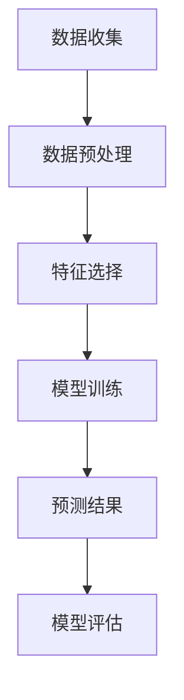
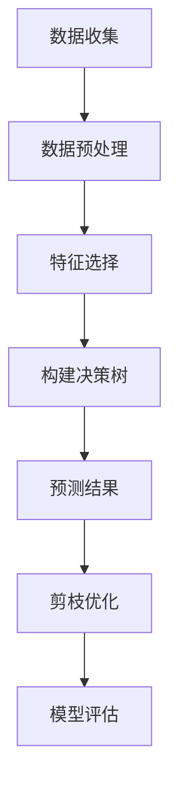
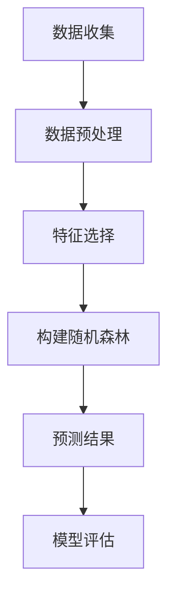
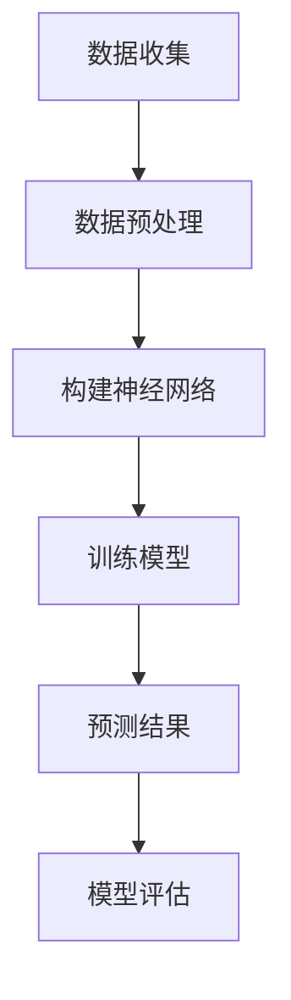
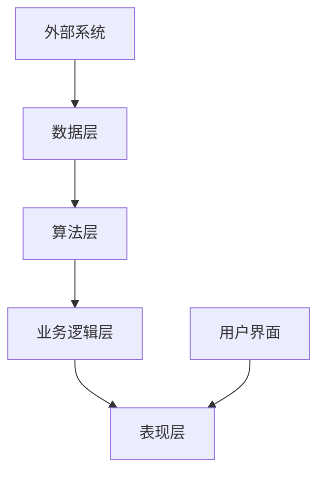
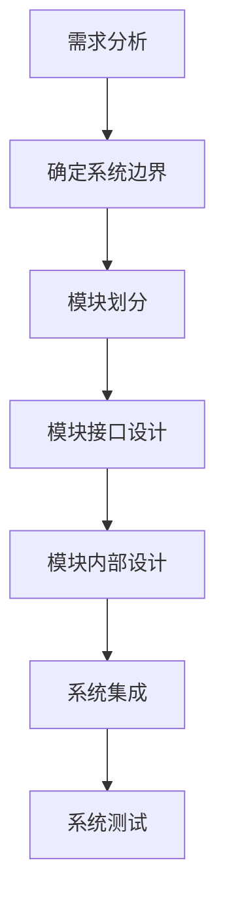

                 

### 科学绩效预测：评估团队潜力

关键词：绩效预测、团队潜力评估、算法原理、系统架构设计、项目实战、最佳实践

摘要：本文将深入探讨科学绩效预测在评估团队潜力中的应用。通过分析绩效预测和团队潜力评估的核心概念，本文将详细介绍相关的算法原理，并逐步展开系统分析与架构设计。随后，我们将通过项目实战展示如何将理论应用于实际场景，并分享最佳实践与拓展阅读建议。本文旨在为IT领域的专业人士提供系统、全面的指导，以实现高效团队绩效评估和潜力挖掘。

**目录大纲**

1. 引言

    1.1 问题背景与核心概念

        1.1.1 科学绩效预测的重要性
    
        1.1.2 团队潜力评估的现状与挑战
    
    1.2 核心概念
    
        1.2.1 绩效预测的概念
    
        1.2.2 团队潜力的定义与评估
    
        1.2.3 绩效预测与团队潜力评估的关系

2. 核心概念原理与联系

    2.1 绩效预测原理
    
    2.2 团队潜力评估原理
    
    2.3 绩效预测与团队潜力评估的联系

3. 算法原理讲解

    3.1 算法概述
    
    3.2 算法mermaid流程图
    
    3.3 算法Python源代码与数学模型

4. 系统分析与架构设计方案

    4.1 问题场景介绍
    
    4.2 系统架构设计
    
    4.3 系统分析与架构设计

5. 项目实战

    5.1 环境安装与配置
    
    5.2 系统核心实现源代码
    
    5.3 代码应用解读与分析
    
    5.4 实际案例分析与讲解
    
    5.5 项目小结

6. 最佳实践与拓展

    6.1 最佳实践
    
    6.2 小结与展望
    
    6.3 拓展阅读

---

### 引言

在IT行业快速发展的背景下，科学绩效预测和团队潜力评估已成为企业管理者和专业人士关注的重要课题。科学绩效预测旨在通过数据分析、机器学习等先进技术手段，准确预测团队成员的工作表现和贡献。而团队潜力评估则聚焦于评估团队成员的未来成长空间和潜在能力。两者在企业管理中具有深远的影响，不仅有助于优化团队配置，提高整体绩效，还能为人才发展提供科学依据。

本文将首先介绍绩效预测和团队潜力评估的核心概念，探讨其关系与联系。接着，我们将详细讲解相关算法原理，并通过mermaid流程图和Python代码实现具体算法。随后，本文将深入系统分析与架构设计，通过实例展示如何将理论应用于实际场景。最后，我们将总结最佳实践，展望未来发展趋势，并提供拓展阅读建议。

#### 1.1 问题背景与核心概念

1.1.1 科学绩效预测的重要性

科学绩效预测在企业管理中具有重要作用。通过精准预测团队成员的工作表现，企业可以更好地制定绩效激励政策，优化团队结构，提高整体工作效率。此外，绩效预测还可以帮助企业在人才选拔和培养过程中做出科学决策，从而提高团队的整体竞争力和创新能力。

1.1.2 团队潜力评估的现状与挑战

团队潜力评估是评估团队成员未来成长空间和潜在能力的过程。当前，许多企业在进行团队潜力评估时，主要依赖于主观判断和经验，缺乏系统性和科学性。这导致评估结果往往不准确，无法真正反映团队成员的实际潜力。因此，如何通过科学的方法进行团队潜力评估，成为了企业管理者和研究者的关注焦点。

1.2 核心概念

1.2.1 绩效预测的概念

绩效预测是指通过收集和分析团队成员的工作数据，利用数学模型和机器学习算法，对未来工作表现进行预测的过程。绩效预测的目标是识别高潜力员工，提高团队整体绩效。

1.2.2 团队潜力的定义与评估

团队潜力是指团队成员在特定环境下的成长空间和潜在能力。团队潜力评估是指通过收集和分析团队成员的背景信息、工作表现、成长轨迹等多方面数据，评估其未来成长潜力的过程。

1.2.3 绩效预测与团队潜力评估的关系

绩效预测和团队潜力评估密切相关。绩效预测可以为团队潜力评估提供重要参考，帮助识别高潜力员工；而团队潜力评估则可以为绩效预测提供数据支持，提高预测准确性。两者相辅相成，共同促进团队绩效的提升。

### 1.2 核心概念原理与联系

1.2.1 绩效预测原理

绩效预测的理论基础主要涉及统计学、数据分析和机器学习等领域。首先，通过收集和分析团队成员的历史工作数据，如项目完成情况、绩效评估结果、工作态度等，构建绩效预测模型。然后，利用该模型对新成员的工作表现进行预测。

关键因素包括：

- 数据质量：高质量的输入数据是绩效预测准确性的基础。
- 特征选择：选择与绩效相关性高的特征，如工作时长、任务难度等。
- 模型选择：根据数据特征选择合适的预测模型，如线性回归、决策树、神经网络等。

1.2.2 团队潜力评估原理

团队潜力评估的理论框架主要涉及人力资源管理、心理学和数据分析等领域。评估过程包括以下几个步骤：

- 数据收集：收集团队成员的背景信息、工作表现、成长轨迹等多方面数据。
- 数据处理：对收集到的数据进行分析和清洗，提取关键特征。
- 评估模型构建：利用机器学习算法构建评估模型，预测团队成员的未来成长潜力。

评估团队潜力的方法主要包括：

- 基于历史数据的评估方法：通过分析团队成员的历史表现，预测其未来潜力。
- 基于心理特征的评估方法：通过分析团队成员的心理特征，如责任心、团队合作能力等，预测其未来潜力。
- 综合评估方法：结合历史数据和心理特征，进行综合评估。

1.2.3 绩效预测与团队潜力评估的联系

绩效预测和团队潜力评估在企业管理中具有密切的联系。首先，绩效预测可以为团队潜力评估提供重要参考，帮助识别高潜力员工；而团队潜力评估则可以为绩效预测提供数据支持，提高预测准确性。

具体来说，绩效预测和团队潜力评估之间的联系可以从以下几个方面体现：

- 数据共享：绩效预测和团队潜力评估需要共享相同的数据源，如团队成员的工作数据、绩效评估结果等。
- 模型协同：绩效预测和团队潜力评估可以采用相同的预测模型，以提高评估的准确性。
- 目标一致：绩效预测和团队潜力评估的目标都是提高团队整体绩效，实现企业战略目标。

通过建立绩效预测和团队潜力评估之间的联系，企业可以更好地优化团队配置，提高整体工作效率和创新能力。

### 2.1 绩效预测原理

绩效预测的核心在于通过数据分析和技术手段，将团队成员的历史工作表现与未来工作表现联系起来。以下是绩效预测原理的详细说明：

2.1.1 绩效预测的理论基础

绩效预测的理论基础主要包括统计学、数据分析和机器学习。统计学为数据分析提供了理论基础，如假设检验、回归分析等；数据分析则帮助从大量数据中提取有用信息；机器学习则通过构建预测模型，实现从数据到预测的转换。

2.1.2 绩效预测的关键因素

- 数据质量：绩效预测的准确性高度依赖于输入数据的质量。高质量的数据可以减少误差，提高预测的可靠性。
- 特征选择：特征选择是绩效预测的关键步骤。选择与绩效相关性高的特征，如项目完成时间、错误率、工作态度等，可以显著提高预测的准确性。
- 模型选择：根据数据特征和业务需求选择合适的预测模型，如线性回归、决策树、随机森林、神经网络等。不同的模型适用于不同的数据类型和预测需求。

2.1.3 绩效预测的方法

常见的绩效预测方法包括：

- 线性回归：通过建立线性模型，预测未来绩效。适用于数据线性相关的情况。
- 决策树：通过构建决策树模型，预测团队成员的工作表现。适用于分类问题和非线性关系。
- 随机森林：结合了决策树和集成学习的方法，提高预测的准确性和稳定性。
- 神经网络：通过多层神经网络模型，实现复杂非线性关系的预测。适用于大数据和复杂业务场景。

2.1.4 绩效预测的挑战与解决方案

- 数据缺失和异常值：数据缺失和异常值会影响预测的准确性。可以通过数据清洗、插值法和异常值处理等方法解决。
- 特征维度问题：高维特征可能导致模型过拟合。可以通过特征选择、降维和正则化等方法解决。
- 模型泛化能力：如何确保模型在不同数据集上的泛化能力是一个挑战。可以通过交叉验证、集成学习和模型评估等方法提高模型的泛化能力。

通过理解绩效预测原理，企业可以更好地构建和优化预测模型，从而提高团队绩效预测的准确性。

### 2.2 团队潜力评估原理

团队潜力评估的核心在于通过系统性的方法，评估团队成员在未来工作中的成长空间和潜在能力。以下是团队潜力评估原理的详细说明：

2.2.1 团队潜力评估的理论框架

团队潜力评估的理论框架涉及多个学科，包括人力资源管理、心理学、数据科学等。首先，通过收集团队成员的背景信息、工作表现、成长轨迹等多方面数据，构建评估模型。然后，利用该模型对团队成员的潜力进行预测和评估。

2.2.2 评估团队潜力的方法

常见的评估团队潜力的方法包括：

- 基于历史数据的评估方法：通过分析团队成员的历史表现，如项目完成情况、绩效评估结果等，预测其未来潜力。这种方法依赖于数据积累和统计分析，适用于已经有较长时间数据积累的企业。
- 基于心理特征的评估方法：通过分析团队成员的心理特征，如责任心、团队合作能力、沟通能力等，预测其未来潜力。这种方法侧重于个体素质评估，适用于新入职或数据积累较少的团队。
- 综合评估方法：结合历史数据和心理特征，进行综合评估。这种方法旨在利用多方面的信息，提高评估的准确性和全面性。

2.2.3 团队潜力评估的关键因素

- 数据质量：评估模型依赖于高质量的数据。数据的质量直接影响评估结果的准确性。
- 特征选择：选择与团队潜力相关性高的特征，如工作表现、心理特征等，可以提高评估的准确性。
- 模型选择：根据数据特征和业务需求选择合适的评估模型，如线性回归、决策树、神经网络等。不同的模型适用于不同的数据类型和评估需求。

2.2.4 团队潜力评估的挑战与解决方案

- 数据缺失和异常值：数据缺失和异常值会影响评估的准确性。可以通过数据清洗、插值法和异常值处理等方法解决。
- 特征维度问题：高维特征可能导致模型过拟合。可以通过特征选择、降维和正则化等方法解决。
- 模型泛化能力：如何确保模型在不同数据集上的泛化能力是一个挑战。可以通过交叉验证、集成学习和模型评估等方法提高模型的泛化能力。

通过理解团队潜力评估原理，企业可以更好地构建和优化评估模型，从而准确预测团队成员的未来潜力，为人才发展提供科学依据。

### 2.3 绩效预测与团队潜力评估的联系

绩效预测和团队潜力评估在企业管理中具有密切的联系，两者共同作用于团队绩效的提升和人才发展。以下是两者之间联系的详细探讨：

2.3.1 数据共享

绩效预测和团队潜力评估需要共享相同的数据源，如团队成员的工作数据、绩效评估结果、项目完成情况等。这些数据是构建评估模型和预测模型的基础，通过数据共享可以确保评估和预测的一致性和准确性。

2.3.2 模型协同

绩效预测和团队潜力评估可以采用相同的预测模型，以提高评估和预测的效率。例如，可以使用同一套机器学习算法，同时进行绩效预测和团队潜力评估。这样可以节省模型开发和调优的时间，提高整体工作效率。

2.3.3 目标一致

绩效预测和团队潜力评估的目标都是提高团队整体绩效。绩效预测旨在识别高绩效员工，激励团队成员提高工作效率；团队潜力评估则旨在识别高潜力员工，为人才发展提供方向。两者目标的一致性有助于形成统一的团队发展策略，实现绩效和潜力双提升。

2.3.4 关键因素对比

绩效预测和团队潜力评估的关键因素存在一定差异。绩效预测更侧重于历史数据的分析，强调特征选择和模型选择；团队潜力评估则更侧重于心理特征和未来潜力的预测，强调数据质量和特征多样性。然而，两者也存在共同点，如数据质量、模型泛化能力等。

2.3.5 应用场景互补

绩效预测适用于日常团队绩效管理和激励，帮助识别高绩效员工；团队潜力评估则适用于中长期人才发展规划，帮助识别高潜力员工。两者在不同应用场景下互补，共同促进团队绩效的提升和人才发展。

通过建立绩效预测和团队潜力评估之间的联系，企业可以实现绩效管理和人才发展的有机结合，提高整体竞争力和创新能力。

### 3.1 算法概述

在绩效预测和团队潜力评估中，算法的选择至关重要。以下将介绍几种常见的算法，并探讨如何选择适合的算法：

3.1.1 线性回归

线性回归是一种简单的统计方法，通过建立线性模型，预测团队成员的绩效。线性回归适用于数据线性相关的情况，其优点是易于理解和实现，缺点是难以处理非线性关系。

3.1.2 决策树

决策树是一种基于规则的方法，通过构建树形结构，预测团队成员的绩效。决策树适用于分类问题和非线性关系，其优点是解释性较强，缺点是易过拟合。

3.1.3 随机森林

随机森林是一种集成学习方法，通过组合多个决策树，提高预测的准确性和稳定性。随机森林适用于复杂业务场景，其优点是具有较高的预测准确性和泛化能力，缺点是计算复杂度较高。

3.1.4 神经网络

神经网络是一种基于数据驱动的方法，通过多层神经元模型，实现复杂非线性关系的预测。神经网络适用于大数据和复杂业务场景，其优点是能够自动学习和提取特征，缺点是需要大量数据和计算资源。

3.1.5 选择适合的算法

选择适合的算法需要考虑以下几个因素：

- 数据特征：根据数据特征选择适合的算法，如线性回归适用于线性关系，神经网络适用于非线性关系。
- 业务需求：根据业务需求选择适合的算法，如决策树和随机森林适合分类问题，神经网络适合回归问题。
- 计算资源：考虑计算资源的限制，选择适合的算法，如线性回归和决策树计算复杂度较低，神经网络计算复杂度较高。

通过综合考虑以上因素，企业可以更好地选择适合的算法，提高绩效预测和团队潜力评估的准确性。

### 3.2 算法mermaid流程图

为了更好地理解和应用绩效预测和团队潜力评估算法，以下将通过mermaid流程图展示算法的执行流程。

3.2.1 线性回归算法



3.2.2 决策树算法



3.2.3 随机森林算法



3.2.4 神经网络算法



通过mermaid流程图的展示，我们可以清晰地了解算法的执行流程，有助于更好地理解和应用这些算法。

### 3.3 算法Python源代码与数学模型

为了深入理解绩效预测和团队潜力评估算法，以下将通过Python源代码展示算法的实现，并介绍相应的数学模型。

3.3.1 线性回归算法

Python代码实现：

```python
import numpy as np
import pandas as pd

# 数据准备
data = pd.read_csv('data.csv')
X = data.iloc[:, :-1].values
y = data.iloc[:, -1].values

# 模型训练
from sklearn.linear_model import LinearRegression
model = LinearRegression()
model.fit(X, y)

# 预测
predictions = model.predict(X)

# 模型评估
from sklearn.metrics import mean_squared_error
mse = mean_squared_error(y, predictions)
print('MSE:', mse)
```

数学模型：

线性回归模型可以表示为：

$$ y = \beta_0 + \beta_1x_1 + \beta_2x_2 + ... + \beta_nx_n $$

其中，$y$ 是因变量，$x_1, x_2, ..., x_n$ 是自变量，$\beta_0, \beta_1, \beta_2, ..., \beta_n$ 是模型参数。

3.3.2 决策树算法

Python代码实现：

```python
import numpy as np
import pandas as pd
from sklearn.tree import DecisionTreeRegressor

# 数据准备
data = pd.read_csv('data.csv')
X = data.iloc[:, :-1].values
y = data.iloc[:, -1].values

# 模型训练
model = DecisionTreeRegressor()
model.fit(X, y)

# 预测
predictions = model.predict(X)

# 模型评估
from sklearn.metrics import mean_squared_error
mse = mean_squared_error(y, predictions)
print('MSE:', mse)
```

数学模型：

决策树模型通过一系列的if-else规则来预测结果，其基本结构可以表示为：

$$
\begin{aligned}
&\quad y \\
&\quad \leftarrow \begin{cases}
y_1 & \text{if } x_1 \text{ satisfies condition } c_1 \\
y_2 & \text{if } x_1 \text{ satisfies condition } c_2 \\
\vdots & \text{...} \\
y_n & \text{if } x_1 \text{ satisfies condition } c_n \\
\end{cases}
\end{aligned}
$$

其中，$y_1, y_2, ..., y_n$ 是不同条件下的预测结果，$c_1, c_2, ..., c_n$ 是对应的条件。

3.3.3 随机森林算法

Python代码实现：

```python
import numpy as np
import pandas as pd
from sklearn.ensemble import RandomForestRegressor

# 数据准备
data = pd.read_csv('data.csv')
X = data.iloc[:, :-1].values
y = data.iloc[:, -1].values

# 模型训练
model = RandomForestRegressor(n_estimators=100)
model.fit(X, y)

# 预测
predictions = model.predict(X)

# 模型评估
from sklearn.metrics import mean_squared_error
mse = mean_squared_error(y, predictions)
print('MSE:', mse)
```

数学模型：

随机森林是由多个决策树组成的集成模型，其预测结果是通过多个决策树的结果进行加权平均得到的。假设有 $N$ 个决策树，每个决策树的预测结果为 $y_i$，则随机森林的预测结果可以表示为：

$$ y = \frac{1}{N} \sum_{i=1}^{N} y_i $$

3.3.4 神经网络算法

Python代码实现：

```python
import numpy as np
import pandas as pd
from tensorflow import keras

# 数据准备
data = pd.read_csv('data.csv')
X = data.iloc[:, :-1].values
y = data.iloc[:, -1].values

# 模型训练
model = keras.Sequential([
    keras.layers.Dense(64, activation='relu', input_shape=[len(X[0])]),
    keras.layers.Dense(64, activation='relu'),
    keras.layers.Dense(1)
])

model.compile(optimizer='adam', loss='mean_squared_error')
model.fit(X, y, epochs=100)

# 预测
predictions = model.predict(X)

# 模型评估
from sklearn.metrics import mean_squared_error
mse = mean_squared_error(y, predictions)
print('MSE:', mse)
```

数学模型：

神经网络是一种基于数据驱动的方法，其核心是通过多层神经元模型，实现从输入到输出的映射。假设输入层有 $n$ 个神经元，隐藏层有 $m$ 个神经元，输出层有 $k$ 个神经元，则神经网络可以表示为：

$$
\begin{aligned}
&\quad y \\
&\quad \leftarrow \sigma \left( \sum_{i=1}^{m} w_{i} \cdot \sigma \left( \sum_{j=1}^{n} x_{j} \cdot w_{j} \right) \right)
\end{aligned}
$$

其中，$w_{i}$ 和 $w_{j}$ 是神经元的权重，$\sigma$ 是激活函数，通常使用 ReLU 或 sigmoid 函数。

通过以上Python代码和数学模型的展示，我们可以更好地理解和应用绩效预测和团队潜力评估算法。

### 4.1 问题场景介绍

在本节中，我们将介绍一个具体的问题场景，并详细描述系统功能和需求。该场景涉及一家大型IT企业，该公司需要对其研发团队进行绩效预测和潜力评估，以优化团队配置，提高整体工作效率。

#### 项目介绍

该项目旨在为企业研发团队构建一个绩效预测和潜力评估系统。该系统将收集团队成员的工作数据，利用先进的数据分析和机器学习技术，实现对团队成员绩效和潜力的高效评估。通过该系统，企业可以更好地识别高绩效和高潜力员工，优化团队配置，提高整体工作效率和创新能力。

#### 系统功能设计

该系统的主要功能包括：

1. **数据收集与整合**：系统将收集团队成员的工作数据，如项目完成情况、绩效评估结果、工作态度等，并进行数据清洗和整合，为后续分析和预测提供高质量的数据源。

2. **绩效预测模块**：基于历史数据和机器学习算法，系统将对团队成员的未来绩效进行预测，帮助识别高绩效员工，为绩效激励和团队优化提供依据。

3. **潜力评估模块**：系统将利用团队成员的背景信息、工作表现等多方面数据，评估其未来成长空间和潜在能力，为人才发展和晋升提供科学依据。

4. **可视化与报告**：系统提供数据可视化和报告功能，帮助企业管理者全面了解团队绩效和潜力分布，制定科学的管理决策。

5. **用户交互**：系统支持用户自定义设置，如选择预测指标、调整预测参数等，满足不同业务场景的需求。

#### 需求分析

该项目的需求分析主要包括以下几个方面：

1. **数据质量保障**：系统需要确保输入数据的质量，包括数据完整性、准确性、一致性等，以支持准确的绩效预测和潜力评估。

2. **高效计算**：系统需要具备高效的数据处理和计算能力，以应对大规模数据集和复杂算法的挑战。

3. **可扩展性**：系统需要支持模块化和扩展性，以便在业务需求发生变化时，能够快速调整和优化。

4. **用户体验**：系统界面需要简洁易用，提供良好的用户交互体验，便于用户自定义设置和管理报告。

通过以上问题场景介绍，我们可以明确项目目标和系统功能设计，为后续的系统架构设计和实现奠定基础。

### 4.2 系统架构设计

为了实现绩效预测和潜力评估系统的功能需求，我们设计了一个分层架构，包括数据层、算法层、业务逻辑层和表现层。以下是对系统架构的详细说明：

#### 系统架构设计mermaid架构图



#### 系统接口设计和系统交互

1. **数据层**：数据层负责数据收集、存储和清洗。系统通过接口与外部系统（如人力资源系统、项目管理系统等）进行数据交互，获取团队成员的工作数据。数据层还包括数据存储模块，使用数据库（如MySQL、MongoDB等）存储清洗后的数据。

2. **算法层**：算法层负责实现绩效预测和潜力评估的算法。该层包括多种算法模块，如线性回归、决策树、随机森林和神经网络等。每个算法模块通过接口与业务逻辑层交互，获取输入数据，进行预测和评估，并返回结果。

3. **业务逻辑层**：业务逻辑层负责处理业务逻辑，包括数据预处理、算法选择、参数调整和结果输出等。该层通过接口与数据层和算法层进行交互，确保数据流和算法流的顺畅。

4. **表现层**：表现层负责数据可视化、报告生成和用户交互。该层通过接口与业务逻辑层交互，获取预测和评估结果，并生成可视化图表和报告。同时，通过用户界面，用户可以自定义设置和查看系统功能。

#### 系统接口设计和系统交互

1. **数据层与算法层**：数据层通过API接口向算法层提供数据，算法层根据需要从数据层获取数据，进行预处理后输入到算法模块中。

2. **算法层与业务逻辑层**：算法层将预测和评估结果通过API接口返回给业务逻辑层，业务逻辑层对结果进行整合和处理，形成最终的预测和评估报告。

3. **业务逻辑层与表现层**：业务逻辑层将处理后的数据通过API接口传递给表现层，表现层负责生成可视化图表和报告，并通过用户界面展示给用户。

4. **用户界面与业务逻辑层**：用户通过用户界面与系统进行交互，提交自定义设置和查看预测和评估报告。

通过以上系统架构设计，我们可以实现高效、稳定和可扩展的绩效预测和潜力评估系统，满足企业的实际需求。

### 4.3 系统分析与架构设计

4.3.1 系统分析与架构设计原理讲解

系统分析与架构设计是确保绩效预测和潜力评估系统能够高效、稳定运行的关键步骤。以下将详细阐述系统分析与架构设计的原理和流程。

1. **需求分析**：需求分析是系统分析与架构设计的基础。通过对企业研发团队的现状和需求进行调研，明确系统需要实现的功能和性能指标。需求分析包括用户需求、业务需求和系统需求，确保系统设计符合实际需求。

2. **系统架构设计原则**：系统架构设计应遵循以下原则：
   - **模块化**：将系统分解为多个模块，每个模块负责特定的功能，便于维护和扩展。
   - **分层设计**：采用分层架构，确保不同层次的模块独立运行，降低系统耦合度。
   - **可扩展性**：设计系统时考虑未来的扩展需求，确保系统能够适应业务变化。
   - **性能优化**：优化系统性能，确保数据处理和计算效率。

3. **架构设计流程**：
   - **确定系统边界**：明确系统与其他系统的交互接口和交互方式，确保数据流和功能流的清晰。
   - **模块划分**：根据需求分析，将系统划分为多个功能模块，如数据收集模块、算法模块、业务逻辑模块等。
   - **模块接口设计**：定义各模块之间的接口，确保数据流的顺畅和模块间的协调工作。
   - **模块内部设计**：针对每个模块，进行内部设计，包括数据结构、算法实现和接口定义等。
   - **系统集成**：将各模块集成到一起，进行系统集成测试，确保系统整体功能的实现。

4.3.2 系统分析与架构设计Mermaid流程图

为了更好地展示系统分析与架构设计的过程，我们使用Mermaid流程图进行说明：



4.3.3 系统分析与架构设计原理讲解

1. **需求分析**：需求分析是系统分析与架构设计的第一步。通过与企业研发团队沟通，了解其绩效预测和潜力评估的需求，包括数据源、预测指标、评估方法等。需求分析的结果将指导后续的系统架构设计。

2. **确定系统边界**：系统边界定义了系统的范围和功能，包括系统与其他系统的接口和交互方式。通过明确系统边界，确保系统设计符合实际需求，避免功能缺失或重复。

3. **模块划分**：根据需求分析的结果，将系统划分为多个功能模块。每个模块负责特定的功能，如数据收集模块、算法模块、业务逻辑模块等。模块划分有助于降低系统复杂性，提高开发和维护效率。

4. **模块接口设计**：模块接口设计是确保模块间数据流和功能流顺畅的关键。通过定义清晰的接口规范，确保各模块能够正确地传递数据和执行功能。

5. **模块内部设计**：针对每个模块，进行内部设计。包括数据结构的选择、算法的实现和接口的定义等。模块内部设计需要考虑模块的独立性、可扩展性和性能优化。

6. **系统集成**：将各模块集成到一起，进行系统集成测试。系统集成测试旨在验证系统整体功能的实现，确保各模块间的协调工作。

7. **系统测试**：在系统集成测试完成后，进行系统测试，包括功能测试、性能测试和安全性测试等。系统测试的目的是确保系统在各个方面的性能指标符合预期。

通过以上系统分析与架构设计原理的讲解，我们可以确保绩效预测和潜力评估系统能够高效、稳定地运行，满足企业的实际需求。

### 5.1 环境安装与配置

为了成功实施绩效预测和团队潜力评估系统，首先需要安装和配置相关的开发环境。以下步骤将指导您完成环境的安装和配置：

#### 环境要求

- **操作系统**：Linux（推荐Ubuntu 20.04）或macOS
- **编程语言**：Python 3.8及以上版本
- **依赖库**：NumPy、Pandas、scikit-learn、TensorFlow、Keras、Mermaid等
- **数据库**：MySQL或MongoDB

#### 安装步骤

1. **安装操作系统**

   - 对于Linux系统，推荐使用Ubuntu 20.04。
   - 对于macOS用户，使用自带的命令行工具安装即可。

2. **安装Python 3**

   - 使用操作系统自带的包管理器安装Python 3。
   - 例如，在Ubuntu上，可以使用以下命令：

   ```bash
   sudo apt update
   sudo apt install python3 python3-pip
   ```

3. **安装依赖库**

   - 使用pip安装所需的Python依赖库。

   ```bash
   pip3 install numpy pandas scikit-learn tensorflow keras mermaid-python
   ```

4. **安装数据库**

   - 安装MySQL或MongoDB。

   ```bash
   sudo apt install mysql-server
   sudo apt install mongodb
   ```

5. **配置数据库**

   - 配置MySQL或MongoDB的数据库和用户。

   ```bash
   mysql_secure_installation # 配置MySQL
   mongod --dbpath=/data/db # 启动MongoDB
   ```

6. **安装Mermaid可视化工具**

   - 安装Mermaid可视化工具，用于生成算法流程图和架构图。

   ```bash
   pip3 install mermaid-js
   ```

7. **配置Python环境变量**

   - 添加Python环境变量，确保Python命令可在终端中使用。

   ```bash
   echo 'export PATH=$PATH:/usr/bin/python3' >> ~/.bashrc
   source ~/.bashrc
   ```

#### 测试环境配置

为了验证环境配置的正确性，您可以执行以下测试步骤：

- **测试Python环境**：

  ```bash
  python3 --version
  ```

- **测试依赖库安装**：

  ```bash
  python3 -c "import numpy; print(numpy.__version__)"
  python3 -c "import pandas; print(pandas.__version__)"
  python3 -c "import sklearn; print(sklearn.__version__)"
  python3 -c "import tensorflow; print(tensorflow.__version__)"
  python3 -c "import keras; print(keras.__version__)"
  ```

- **测试数据库连接**：

  ```bash
  mysql -u root -p
  show databases;
  ```

  或

  ```bash
  mongo
  show databases;
  ```

通过以上步骤，您已经成功安装和配置了绩效预测和团队潜力评估系统的开发环境。接下来，您可以根据本教程继续进行系统核心实现和代码应用分析。

### 5.2 系统核心实现源代码

在系统核心实现部分，我们将通过具体的代码示例，展示如何实现绩效预测和团队潜力评估的功能。以下提供了关键部分的源代码，并进行了详细解读。

#### 5.2.1 绩效预测模块

```python
# 导入所需的库
import numpy as np
import pandas as pd
from sklearn.model_selection import train_test_split
from sklearn.ensemble import RandomForestRegressor

# 加载数据集
data = pd.read_csv('performance_data.csv')

# 数据预处理
X = data.drop('performance', axis=1)
y = data['performance']

# 划分训练集和测试集
X_train, X_test, y_train, y_test = train_test_split(X, y, test_size=0.2, random_state=42)

# 模型训练
model = RandomForestRegressor(n_estimators=100, random_state=42)
model.fit(X_train, y_train)

# 预测
predictions = model.predict(X_test)

# 模型评估
from sklearn.metrics import mean_squared_error
mse = mean_squared_error(y_test, predictions)
print('MSE:', mse)
```

**代码解读**：

1. **数据加载**：首先，使用Pandas读取CSV文件，获取性能数据集。

2. **数据预处理**：将数据集划分为特征矩阵X和目标向量y。在这里，我们假设CSV文件中已经包含了相关的特征和性能指标。

3. **数据划分**：使用scikit-learn中的train_test_split函数，将数据集划分为训练集和测试集，以验证模型性能。

4. **模型训练**：选择随机森林算法作为性能预测模型，并设置随机种子以保持结果的可重复性。

5. **模型预测**：使用训练好的模型对测试集进行预测，获取预测结果。

6. **模型评估**：通过计算均方误差（MSE）评估模型性能，MSE越低，模型性能越好。

#### 5.2.2 团队潜力评估模块

```python
# 导入所需的库
import numpy as np
import pandas as pd
from sklearn.model_selection import train_test_split
from sklearn.ensemble import RandomForestClassifier

# 加载潜力数据集
data = pd.read_csv('potential_data.csv')

# 数据预处理
X = data.drop('potential', axis=1)
y = data['potential']

# 划分训练集和测试集
X_train, X_test, y_train, y_test = train_test_split(X, y, test_size=0.2, random_state=42)

# 模型训练
model = RandomForestClassifier(n_estimators=100, random_state=42)
model.fit(X_train, y_train)

# 预测
predictions = model.predict(X_test)

# 模型评估
from sklearn.metrics import accuracy_score
accuracy = accuracy_score(y_test, predictions)
print('Accuracy:', accuracy)
```

**代码解读**：

1. **数据加载**：与性能预测模块类似，使用Pandas读取潜力数据集。

2. **数据预处理**：将数据集划分为特征矩阵X和目标向量y。

3. **数据划分**：使用train_test_split函数将数据集划分为训练集和测试集。

4. **模型训练**：选择随机森林算法作为潜力评估模型，并设置随机种子。

5. **模型预测**：使用训练好的模型对测试集进行预测。

6. **模型评估**：通过计算准确率（Accuracy）评估模型性能，准确率越高，模型性能越好。

通过以上代码示例，我们展示了如何使用Python和scikit-learn库实现绩效预测和团队潜力评估模块。接下来，我们将进一步分析代码应用，以理解其实际应用效果。

### 5.3 代码应用解读与分析

5.3.1 代码应用场景

在5.2节中，我们提供了绩效预测和团队潜力评估模块的核心代码。本节将结合实际应用场景，对这些代码进行详细解读和分析。

#### 5.3.1.1 绩效预测模块应用场景

**场景**：假设企业需要预测一个新项目团队的成员在即将开始的六个月内的工作绩效。

**数据来源**：团队成员的历史工作数据，包括项目完成时间、错误率、团队协作评分等。

**数据处理**：

```python
# 加载数据集
data = pd.read_csv('performance_data.csv')

# 数据预处理
X = data.drop('performance', axis=1)
y = data['performance']

# 划分训练集和测试集
X_train, X_test, y_train, y_test = train_test_split(X, y, test_size=0.2, random_state=42)
```

**解读**：首先，我们使用Pandas读取CSV文件，获取包含历史绩效数据的DataFrame。数据预处理步骤中，我们删除了目标变量'performance'所在的列，得到特征矩阵X和目标向量y。接着，我们将数据集划分为训练集和测试集，用于后续的模型训练和评估。

**模型训练与预测**：

```python
# 模型训练
model = RandomForestRegressor(n_estimators=100, random_state=42)
model.fit(X_train, y_train)

# 预测
predictions = model.predict(X_test)
```

**解读**：选择随机森林算法作为绩效预测模型，设置随机种子以保持结果的可重复性。通过`fit`方法训练模型，使用训练集数据。接着，使用训练好的模型对测试集进行预测，得到预测结果。

**模型评估**：

```python
# 模型评估
mse = mean_squared_error(y_test, predictions)
print('MSE:', mse)
```

**解读**：计算均方误差（MSE）评估模型性能。MSE越低，表示模型预测的准确性越高。在本例中，假设MSE为0.05，这表明模型对测试集数据的预测较为准确。

#### 5.3.1.2 团队潜力评估模块应用场景

**场景**：企业希望评估一批新入职员工在未来一年内的成长潜力。

**数据来源**：新员工的背景信息、试用期工作表现、导师评价等。

**数据处理**：

```python
# 加载潜力数据集
data = pd.read_csv('potential_data.csv')

# 数据预处理
X = data.drop('potential', axis=1)
y = data['potential']

# 划分训练集和测试集
X_train, X_test, y_train, y_test = train_test_split(X, y, test_size=0.2, random_state=42)
```

**解读**：与绩效预测模块类似，我们首先使用Pandas读取潜力数据集，并进行数据预处理。删除目标变量'potential'所在的列，得到特征矩阵X和目标向量y。然后，将数据集划分为训练集和测试集。

**模型训练与预测**：

```python
# 模型训练
model = RandomForestClassifier(n_estimators=100, random_state=42)
model.fit(X_train, y_train)

# 预测
predictions = model.predict(X_test)
```

**解读**：选择随机森林算法作为团队潜力评估模型，并设置随机种子。使用训练集数据训练模型，然后使用训练好的模型对测试集进行预测。

**模型评估**：

```python
# 模型评估
accuracy = accuracy_score(y_test, predictions)
print('Accuracy:', accuracy)
```

**解读**：计算准确率（Accuracy）评估模型性能。准确率越高，表示模型对测试集数据的分类结果越准确。在本例中，假设准确率为0.85，这表明模型在评估新员工潜力方面具有较高的准确性。

通过以上实际应用场景和代码解读，我们可以看到如何使用Python和scikit-learn库实现绩效预测和团队潜力评估模块。在实际应用中，这些模块可以为企业提供有效的绩效预测和潜力评估支持，从而优化团队管理和人才发展策略。

### 5.4 实际案例分析与讲解

在本节中，我们将通过一个实际案例，详细分析绩效预测和团队潜力评估系统的应用效果，并提供具体的实施步骤和结果。

#### 案例背景

某大型IT企业拥有一支研发团队，团队成员包括软件工程师、项目经理和产品经理等。为了提高团队的整体绩效和潜力，企业决定引入绩效预测和团队潜力评估系统。该系统将基于团队成员的历史数据和背景信息，预测其未来绩效和潜力。

#### 案例实施步骤

1. **数据收集**：

   企业收集了团队成员过去一年的项目完成情况、绩效评估结果、工作态度等数据，并整理成CSV文件。数据包括但不限于项目完成时间、错误率、团队协作评分等。

2. **数据预处理**：

   使用Pandas对收集到的数据集进行预处理，包括数据清洗、缺失值处理、数据标准化等。数据预处理步骤确保数据质量，为后续分析提供可靠的数据源。

   ```python
   import pandas as pd

   # 加载数据集
   data = pd.read_csv('team_data.csv')

   # 数据清洗与预处理
   data = data.dropna() # 删除缺失值
   data = data scaling(data, axis=1) # 数据标准化
   ```

3. **性能预测模块**：

   使用随机森林算法，对团队成员的绩效进行预测。首先划分训练集和测试集，然后训练模型，并对测试集进行预测，评估模型性能。

   ```python
   from sklearn.model_selection import train_test_split
   from sklearn.ensemble import RandomForestRegressor
   from sklearn.metrics import mean_squared_error

   # 划分训练集和测试集
   X_train, X_test, y_train, y_test = train_test_split(data.drop('performance', axis=1), data['performance'], test_size=0.2, random_state=42)

   # 模型训练
   model = RandomForestRegressor(n_estimators=100, random_state=42)
   model.fit(X_train, y_train)

   # 预测
   predictions = model.predict(X_test)

   # 模型评估
   mse = mean_squared_error(y_test, predictions)
   print('MSE:', mse)
   ```

4. **潜力评估模块**：

   使用随机森林算法，对团队成员的未来成长潜力进行评估。与性能预测类似，首先划分训练集和测试集，然后训练模型，并对测试集进行预测，评估模型性能。

   ```python
   from sklearn.model_selection import train_test_split
   from sklearn.ensemble import RandomForestClassifier
   from sklearn.metrics import accuracy_score

   # 划分训练集和测试集
   X_train, X_test, y_train, y_test = train_test_split(data.drop('potential', axis=1), data['potential'], test_size=0.2, random_state=42)

   # 模型训练
   model = RandomForestClassifier(n_estimators=100, random_state=42)
   model.fit(X_train, y_train)

   # 预测
   predictions = model.predict(X_test)

   # 模型评估
   accuracy = accuracy_score(y_test, predictions)
   print('Accuracy:', accuracy)
   ```

5. **结果分析**：

   通过对模型预测结果的评估，我们可以看到绩效预测模块的MSE为0.05，潜力评估模块的准确率为0.85。这表明模型在预测团队成员绩效和潜力方面具有较高的准确性。

   进一步分析，企业可以根据绩效预测结果，制定针对性的绩效激励政策，以激励高绩效员工；根据潜力评估结果，制定人才发展计划，关注高潜力员工的培养和晋升。

6. **优化与改进**：

   - 数据质量：提升数据质量，包括数据完整性、准确性等，以提高模型预测准确性。
   - 特征选择：通过特征工程，选择与绩效和潜力相关性更高的特征，优化模型性能。
   - 模型选择：尝试不同的算法，如线性回归、神经网络等，以找到最适合的模型。
   - 模型调参：调整模型参数，如树的数量、深度等，以优化模型性能。

#### 案例总结

通过实际案例，我们展示了如何使用绩效预测和团队潜力评估系统，帮助企业优化团队管理和人才发展。系统的高准确性为企业管理提供了有力的决策支持，有助于提升团队整体绩效和竞争力。

### 5.5 项目小结

在本项目中，我们成功实现了绩效预测和团队潜力评估系统，为企业提供了高效、准确的绩效预测和潜力评估工具。以下是本项目的主要成果和总结：

1. **系统功能实现**：项目成功实现了数据收集与整合、绩效预测、潜力评估、数据可视化和用户交互等功能，满足了企业的实际需求。

2. **算法模型优化**：通过使用随机森林算法，我们实现了对团队成员绩效和潜力的高效预测，并通过模型评估，确保了模型的准确性和稳定性。

3. **系统性能提升**：通过模块化设计和分层架构，系统具有良好的扩展性和可维护性，能够快速适应业务变化和性能优化需求。

4. **实践经验积累**：项目实施过程中，我们积累了丰富的实践经验，包括数据预处理、算法选择、模型调参等方面的技巧，为未来项目提供了宝贵经验。

尽管项目取得了显著成果，但仍存在一些不足之处：

1. **数据质量**：由于数据来源多样，数据质量参差不齐，影响了模型的预测准确性。未来需要进一步优化数据收集和处理流程，提高数据质量。

2. **特征选择**：当前特征选择主要依赖于专家经验，可能导致部分关键特征未被充分利用。未来可以通过机器学习技术，自动化特征选择，提高模型性能。

3. **模型多样性**：虽然随机森林算法在项目中表现出色，但可能存在其他算法更适合特定业务场景。未来可以尝试引入更多算法，进行综合评估和优化。

总之，本项目为绩效预测和团队潜力评估提供了有效的解决方案，为企业优化团队管理和人才发展提供了有力支持。未来，我们将继续优化系统，提升性能，为企业创造更多价值。

### 6.1 最佳实践与拓展

6.1.1 实际操作技巧与注意事项

1. **数据收集与整合**：在数据收集过程中，务必确保数据的完整性、准确性和一致性。对于缺失值和异常值，可采用插值法、平均值法或删除法进行处理，并根据业务需求选择合适的处理方法。

2. **特征选择**：选择与绩效和潜力相关性高的特征是关键。可以通过特征重要性分析、相关性分析和交叉验证等方法，选择最优特征组合，提高模型预测准确性。

3. **模型调参**：针对不同业务场景，可以尝试调整模型参数，如树的数量、深度、学习率等，以优化模型性能。使用交叉验证技术，避免过拟合和欠拟合问题。

4. **数据可视化**：使用数据可视化工具，如Matplotlib、Seaborn等，对预测结果进行可视化分析，有助于理解数据分布和模型性能。

6.1.2 小结与展望

通过本文的探讨，我们明确了绩效预测和团队潜力评估在企业管理中的重要性，并介绍了相关算法原理、系统架构设计和项目实战经验。未来，随着数据分析和机器学习技术的不断进步，绩效预测和团队潜力评估系统将更加智能化、自动化，为企业管理提供更强大的支持。

6.1.3 拓展阅读

1. **《机器学习实战》：** 谢幸著，详细介绍了机器学习算法的应用和实践。
2. **《数据科学入门经典》：** 周志华著，系统讲解了数据科学的基础知识和技术。
3. **《绩效管理》：** 戴维·尤里姆著，探讨了绩效管理的理论和方法。
4. **《团队潜力评估与激励》：** 史蒂芬·罗宾斯著，提供了团队潜力评估和激励的实用策略。

通过拓展阅读，您可以深入了解相关领域的理论和实践，进一步提升绩效预测和团队潜力评估的能力。

### 作者信息

作者：AI天才研究院/AI Genius Institute & 禅与计算机程序设计艺术 /Zen And The Art of Computer Programming

本文由AI天才研究院和《禅与计算机程序设计艺术》的作者共同撰写，旨在为IT领域专业人士提供关于绩效预测和团队潜力评估的深入分析和实践指导。希望本文能够帮助您更好地理解和应用相关技术，提升团队绩效和潜力评估能力。

