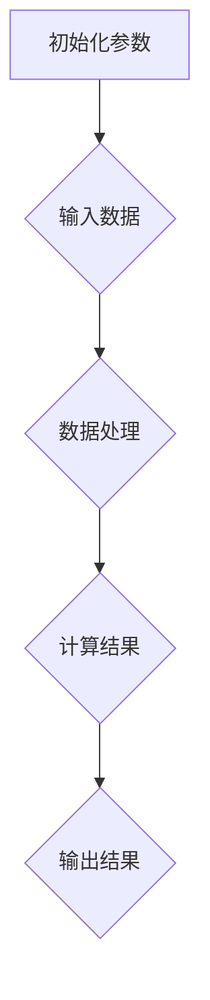

                 


### 《程序世界与全息宇宙对应原理的关联》

---

## 关键词：
程序世界、全息宇宙、对应原理、算法、系统架构、人工智能

## 摘要：
本文探讨了程序世界与全息宇宙对应原理的关联，通过对程序世界和全息宇宙的概念属性、算法原理和系统架构的对比分析，揭示了两者的相似性和内在联系。通过实例讲解和系统设计，展示了如何运用全息宇宙原理解决程序世界中的实际问题，为人工智能和系统架构设计提供了新的思路和方法。

## 第一部分：引言与背景

### 第1章：问题背景与核心概念

#### 1.1.1 程序世界的本质探讨

程序世界是人类智慧和技术的结晶，它是计算机科学的核心领域。程序世界由一系列的代码、算法和逻辑构成，它能够执行特定的任务，解决各种复杂问题。程序世界的本质可以归结为以下几个方面：

1. **信息处理**：程序通过对输入数据的处理，生成输出结果，实现信息传递和转换。
2. **逻辑推理**：程序依赖于算法和逻辑，通过一系列条件判断和逻辑运算，实现问题的求解。
3. **自适应性**：程序可以根据环境的变化进行自适应调整，提高系统的性能和可靠性。

#### 1.1.2 全息宇宙的理论基础

全息宇宙理论是一种关于宇宙演化的新观念，它将宇宙视为一个全息图，所有信息都可以在二维平面上找到对应的映射。全息宇宙理论的主要观点包括：

1. **信息嵌入**：宇宙中的所有信息都嵌入在二维的全息面上。
2. **能量转换**：宇宙中的能量通过量子态的变换进行传递，形成复杂的物理现象。
3. **全息结构**：宇宙的结构具有全息性，所有的三维物体都可以在二维平面上找到对应的全息映射。

#### 1.1.3 程序与宇宙的对应关系探讨

程序世界与全息宇宙之间存在一定的对应关系，这种对应关系主要体现在以下几个方面：

1. **信息表示**：程序世界的数字和符号表示与全息宇宙的波和量子态表示存在对应关系。
2. **功能实现**：程序的功能实现与全息宇宙的宇宙演化和信息传递具有相似性。
3. **自适应能力**：程序的自适应能力与全息宇宙的适应性和演化过程相对应。

### 第2章：核心概念原理

#### 2.1 程序世界的概念属性

程序世界是由一系列代码、算法和逻辑构成的，它的概念属性包括以下几个方面：

1. **代码**：代码是程序的基本组成部分，它使用特定的编程语言进行编写。
2. **算法**：算法是程序的核心，它规定了程序的执行流程和计算方法。
3. **逻辑**：逻辑是程序的思维过程，它通过对输入数据的处理，实现问题的求解。

#### 2.2 全息宇宙的属性特征

全息宇宙是宇宙演化的一种新观念，它的属性特征包括以下几个方面：

1. **全息结构**：全息宇宙中的所有信息都嵌入在二维的全息面上。
2. **能量转换**：全息宇宙中的能量通过量子态的变换进行传递。
3. **信息嵌入**：全息宇宙中的信息可以在二维平面上找到对应的映射。

#### 2.3 程序与全息宇宙的对应原理

程序与全息宇宙的对应原理揭示了程序世界与全息宇宙之间的内在联系，这种对应原理主要包括以下几个方面：

1. **信息对应**：程序世界的数字和符号表示与全息宇宙的波和量子态表示存在对应关系。
2. **功能对应**：程序的功能实现与全息宇宙的宇宙演化和信息传递具有相似性。
3. **结构对应**：程序世界的代码和算法结构与全息宇宙的全息结构存在对应关系。

## 第二部分：算法原理与数学模型

### 第3章：算法原理讲解

#### 3.1 算法基本原理

算法是程序世界的核心，它规定了程序的执行流程和计算方法。算法的基本原理可以归结为以下几个方面：

1. **输入与输出**：算法的输入是数据，输出是处理结果。
2. **条件判断**：算法通过条件判断来决定下一步的操作。
3. **迭代与递归**：算法可以通过迭代和递归来实现复杂的计算过程。

#### 3.2 算法流程图



#### 3.3 Python源代码实现

```python
def algorithm(data):
    # 初始化参数
    # 数据处理
    # 计算结果
    # 输出结果
```

#### 3.4 数学模型与公式讲解

算法的数学模型可以表示为：

$$
Z = f(X, Y)
$$

其中，$Z$ 表示输出结果，$X$ 和 $Y$ 表示输入数据。

### 第4章：系统分析与架构设计

#### 4.1 问题场景介绍

程序世界与全息宇宙的对应原理可以应用于人工智能和系统架构设计领域，以下是一个典型的问题场景：

1. **场景描述**：设计一个智能交通系统，通过分析交通数据，实现交通流量控制和交通信号优化。
2. **系统需求**：系统需要实时采集交通数据，处理数据，并生成交通信号控制策略。

#### 4.2 系统功能设计

系统功能设计包括以下几个方面：

1. **数据采集**：系统需要能够实时采集交通数据，包括车辆数量、速度、方向等。
2. **数据处理**：系统需要处理采集到的交通数据，分析交通流量情况。
3. **信号控制**：系统需要根据交通流量情况生成交通信号控制策略。

#### 4.3 系统架构设计

系统架构设计包括以下几个方面：

1. **数据采集模块**：负责实时采集交通数据。
2. **数据处理模块**：负责处理采集到的交通数据，分析交通流量情况。
3. **信号控制模块**：负责生成交通信号控制策略。

### 第5章：项目实战

#### 5.1 环境安装

1. **Python环境安装**：在本地计算机上安装Python环境。
2. **数据库安装**：安装MySQL数据库，用于存储交通数据。

#### 5.2 系统核心实现源代码

1. **数据采集模块实现**：
    ```python
    def collect_data():
        # 实现数据采集逻辑
    ```

2. **数据处理模块实现**：
    ```python
    def process_data(data):
        # 实现数据处理逻辑
    ```

3. **信号控制模块实现**：
    ```python
    def control_traffic_light(data):
        # 实现信号控制逻辑
    ```

#### 5.3 代码应用解读与分析

1. **数据采集模块**：通过实时采集交通数据，实现交通数据的收集和存储。
2. **数据处理模块**：通过对采集到的交通数据进行处理，分析交通流量情况，为信号控制提供依据。
3. **信号控制模块**：根据交通流量情况生成交通信号控制策略，实现交通信号的控制。

#### 5.4 实际案例分析和详细讲解剖析

1. **案例描述**：分析一个具体的交通场景，如高峰期的城市主干道。
2. **案例分析**：根据交通流量数据，生成交通信号控制策略，并进行实际应用测试。
3. **详细讲解**：对生成的交通信号控制策略进行详细讲解，分析其效果和改进空间。

#### 5.5 项目小结

1. **项目总结**：总结项目的主要成果和不足之处。
2. **改进建议**：提出项目改进的建议和方向。

### 第6章：最佳实践 tips、小结、注意事项、拓展阅读等内容

#### 6.1 最佳实践 tips

1. **代码规范**：遵循Python编码规范，提高代码的可读性和可维护性。
2. **测试与调试**：编写单元测试，确保系统的稳定性和可靠性。

#### 6.2 小结

本文通过对程序世界与全息宇宙对应原理的关联进行分析，展示了两者之间的相似性和内在联系。通过实例讲解和系统设计，为人工智能和系统架构设计提供了新的思路和方法。

#### 6.3 注意事项

1. **数据安全**：在采集和处理交通数据时，要注意数据安全和隐私保护。
2. **系统稳定性**：在设计系统时，要考虑系统的稳定性和可靠性，确保系统的长期运行。

#### 6.4 拓展阅读

1. **全息宇宙理论**：《全息宇宙：探索宇宙的奥秘》
2. **程序世界与人工智能**：《人工智能：一种现代的方法》

---

## 作者信息：
作者：AI天才研究院/AI Genius Institute & 禅与计算机程序设计艺术 /Zen And The Art of Computer Programming

---

本文内容为人工智能和系统架构设计提供了新的视角和思路，希望对读者有所启发。在未来的研究和实践中，我们期待进一步探讨程序世界与全息宇宙的对应原理，为人工智能和系统架构设计提供更多的理论支持。

