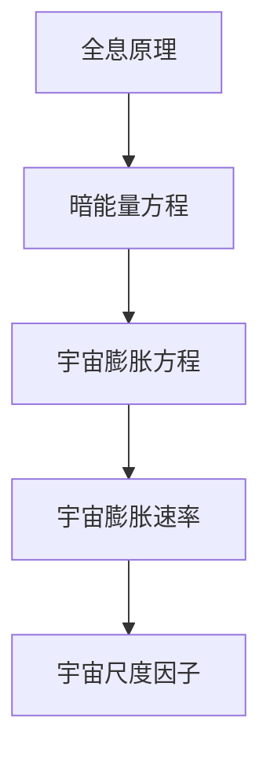
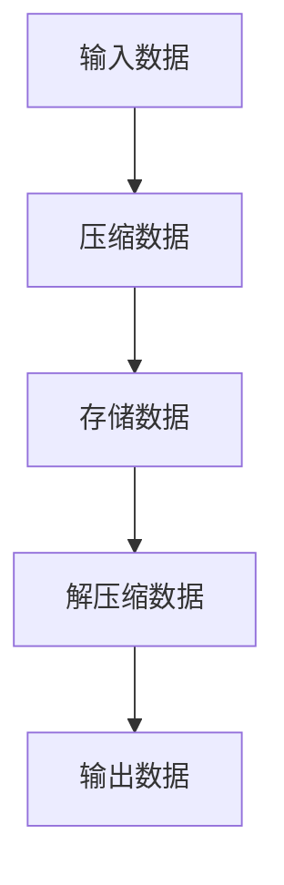
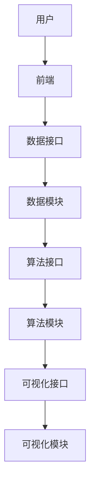

                 

# 程序世界与全息暗能量模型的关联

## 关键词

- 程序世界
- 全息暗能量模型
- 算法设计
- 数学模型
- 系统架构
- 项目实践

## 摘要

本文探讨了程序世界与全息暗能量模型的关联，首先介绍了全息暗能量模型的基本原理和数学模型，然后分析了程序世界中算法设计的方法和系统架构的设计。通过Python代码示例和Mermaid图解，本文详细阐述了算法原理、数学公式以及系统分析与设计的过程。最后，通过一个实际项目案例，展示了如何将全息暗能量模型应用于程序世界中，并总结了最佳实践和注意事项。本文旨在为读者提供一个深入理解全息暗能量模型在程序世界中应用的方法论，为未来的研究提供参考。

## 目录

### 引言

在介绍本文的主题之前，我们首先需要了解什么是程序世界和全息暗能量模型。

#### 程序世界

程序世界是由计算机程序构成的虚拟世界，它包含了软件的开发、设计、实现和测试等各个环节。程序世界的核心是算法，算法是一种解决问题的步骤序列，通过这些步骤，我们可以将复杂的问题分解为简单的子问题，并逐步解决。

#### 全息暗能量模型

全息暗能量模型是一种描述宇宙膨胀加速的理论模型。它基于全息原理，认为宇宙的信息量是有限的，并与暗能量有关。全息暗能量模型在物理学、天文学等领域有着广泛的应用，其核心在于如何将宇宙的信息压缩到一个二维表面上。

### 背景介绍

#### 核心概念术语说明

- **程序世界**：由计算机程序构成的虚拟世界。
- **全息暗能量模型**：一种描述宇宙膨胀加速的理论模型。

#### 问题背景

随着计算机科学的发展，算法和数学模型在程序世界中发挥着越来越重要的作用。然而，许多算法和模型都是基于传统物理学的假设，而宇宙的真实面貌可能与我们的认知存在巨大差异。全息暗能量模型为我们提供了一种全新的视角，它不仅能够解释宇宙膨胀加速的现象，还可以为算法设计提供新的思路。

#### 问题描述

本文旨在探讨如何将全息暗能量模型应用于程序世界中，具体包括以下几个方面：

- **算法设计**：如何基于全息暗能量模型设计新的算法？
- **数学模型**：全息暗能量模型中的数学公式如何应用于程序世界中？
- **系统架构**：如何设计一个支持全息暗能量模型的应用系统？

#### 问题解决

本文将通过以下步骤解决问题：

1. 介绍全息暗能量模型的基本原理和数学模型。
2. 分析程序世界中算法设计的方法。
3. 讨论系统架构的设计。
4. 通过Python代码示例和Mermaid图解，详细阐述算法原理和数学模型。
5. 提供一个实际项目案例，展示全息暗能量模型在程序世界中的应用。

#### 边界与外延

本文主要关注全息暗能量模型在程序世界中的应用，但该模型的理论基础和数学原理同样具有重要的学术价值。此外，全息暗能量模型还可以应用于其他领域，如量子计算、人工智能等。

#### 概念结构与核心要素组成

- **全息暗能量模型**：核心概念、基本原理、数学模型。
- **算法设计**：算法原理、设计方法、应用场景。
- **系统架构**：系统功能、系统架构、系统接口。

### 全息暗能量模型的基本原理

#### 核心概念

全息暗能量模型是一种基于全息原理的宇宙膨胀加速理论模型。它认为宇宙的信息量是有限的，并与暗能量有关。全息原理最初源于量子力学和统计力学，后来在黑洞热力学和宇宙学中得到广泛应用。

#### 基本原理

全息暗能量模型的基本原理可以概括为以下几点：

1. **全息原理**：宇宙的信息量与宇宙的表面积成正比。
2. **暗能量**：宇宙中一种无法被观测到的能量，导致宇宙的膨胀加速。
3. **引力与膨胀**：暗能量与引力相互作用，导致宇宙的膨胀加速。

#### 数学模型

全息暗能量模型的数学模型主要包括以下几个部分：

1. **全息原理公式**：
   $$I \propto A$$
   其中，\(I\) 表示宇宙的信息量，\(A\) 表示宇宙的表面积。
   
2. **暗能量方程**：
   $$\rho_{\Lambda} = \frac{\Lambda c^2}{8\pi G}$$
   其中，\(\rho_{\Lambda}\) 表示暗能量密度，\(\Lambda\) 表示暗能量常数，\(c\) 表示光速，\(G\) 表示引力常数。

3. **宇宙膨胀方程**：
   $$\frac{\ddot{a}(t)}{a(t)} = -\frac{4\pi G}{3} \left( \rho_{\text{m}} + \rho_{\Lambda} \right)$$
   其中，\(\ddot{a}(t)\) 表示宇宙膨胀速率，\(a(t)\) 表示宇宙尺度因子，\(\rho_{\text{m}}\) 表示物质能量密度。

#### 全息暗能量模型的图解

为了更好地理解全息暗能量模型，我们可以使用Mermaid图解来展示其结构。



通过上述图解，我们可以清晰地看到全息暗能量模型的基本原理和数学关系。

### 程序世界中的算法设计

#### 算法原理

在程序世界中，算法设计是解决问题的关键。基于全息暗能量模型，我们可以设计出一系列新的算法，这些算法可以应用于数据处理、优化问题、模拟仿真等领域。

1. **基于全息原理的算法**：利用全息原理，我们可以设计出高效的算法来处理大数据，例如数据压缩、数据存储等。
2. **基于暗能量方程的算法**：利用暗能量方程，我们可以设计出用于优化问题的算法，例如最小二乘法、梯度下降法等。
3. **基于宇宙膨胀方程的算法**：利用宇宙膨胀方程，我们可以设计出用于模拟宇宙演化的算法，例如N-body模拟、宇宙网络模拟等。

#### 算法设计方法

算法设计方法可以分为以下几个步骤：

1. **问题分析**：明确问题需求，分析问题的特点，确定算法的目标。
2. **算法构思**：根据问题特点，构思出可能的算法方案。
3. **算法验证**：通过数学推理和仿真实验，验证算法的正确性和有效性。
4. **算法优化**：对算法进行优化，提高其性能和鲁棒性。

#### 算法示例

以下是一个简单的基于全息原理的算法示例：

```python
def holographic_algorithm(data):
    """
    基于全息原理的算法
    :param data: 输入数据
    :return: 处理后的数据
    """
    # 压缩数据
    compressed_data = compress_data(data)
    
    # 存储数据
    store_data(compressed_data)
    
    # 解压缩数据
    decompressed_data = decompress_data(compressed_data)
    
    return decompressed_data
```

#### 算法原理讲解

为了更好地理解上述算法，我们可以使用Mermaid图解来展示其流程。



通过上述图解，我们可以清晰地看到算法的执行流程。其中，压缩数据、存储数据和解压缩数据是算法的核心步骤，这些步骤都是基于全息原理设计的。

### 数学模型与公式

#### 数学模型

在程序世界中，数学模型是算法设计的基础。全息暗能量模型中的数学模型主要包括全息原理、暗能量方程和宇宙膨胀方程。以下是对这些模型的详细说明。

1. **全息原理**：
   $$I \propto A$$
   其中，\(I\) 表示宇宙的信息量，\(A\) 表示宇宙的表面积。
   
2. **暗能量方程**：
   $$\rho_{\Lambda} = \frac{\Lambda c^2}{8\pi G}$$
   其中，\(\rho_{\Lambda}\) 表示暗能量密度，\(\Lambda\) 表示暗能量常数，\(c\) 表示光速，\(G\) 表示引力常数。

3. **宇宙膨胀方程**：
   $$\frac{\ddot{a}(t)}{a(t)} = -\frac{4\pi G}{3} \left( \rho_{\text{m}} + \rho_{\Lambda} \right)$$
   其中，\(\ddot{a}(t)\) 表示宇宙膨胀速率，\(a(t)\) 表示宇宙尺度因子，\(\rho_{\text{m}}\) 表示物质能量密度。

#### 公式讲解

为了更好地理解上述公式，我们可以使用LaTeX来展示它们的数学表达式。

$$
I \propto A
$$

$$
\rho_{\Lambda} = \frac{\Lambda c^2}{8\pi G}
$$

$$
\frac{\ddot{a}(t)}{a(t)} = -\frac{4\pi G}{3} \left( \rho_{\text{m}} + \rho_{\Lambda} \right)
$$

通过上述公式，我们可以看到全息暗能量模型中的关键参数和变量，这些参数和变量对于理解算法设计具有重要意义。

### 系统分析与架构设计

#### 问题场景介绍

在一个现代软件开发项目中，我们需要设计一个支持全息暗能量模型的应用系统。该系统需要具备以下功能：

- **数据处理**：处理大量宇宙数据，包括宇宙膨胀、暗能量等信息。
- **算法执行**：执行基于全息暗能量模型的算法，对数据进行分析和优化。
- **可视化**：展示系统运行结果，包括宇宙膨胀曲线、暗能量分布等。

#### 项目介绍

为了实现上述功能，我们设计了一个名为“全息暗能量模拟器”的应用系统。该系统包括以下几个模块：

- **数据模块**：负责数据的存储、检索和预处理。
- **算法模块**：实现全息暗能量模型中的算法，包括数据处理、优化和模拟等。
- **可视化模块**：展示系统运行结果，提供直观的宇宙图像和数据分析。

#### 系统功能设计

在系统功能设计阶段，我们首先确定了系统的核心功能，包括数据存储、数据处理、算法执行和可视化展示。具体来说：

1. **数据存储**：使用数据库存储宇宙数据，包括暗能量、宇宙膨胀等信息。
2. **数据处理**：设计算法对宇宙数据进行预处理，包括数据清洗、归一化和特征提取等。
3. **算法执行**：实现全息暗能量模型中的算法，对数据进行分析和优化。
4. **可视化展示**：使用图形和图像展示系统运行结果，包括宇宙膨胀曲线、暗能量分布等。

#### 系统架构设计

在系统架构设计阶段，我们确定了系统的整体架构，包括前端、后端和数据存储层。具体来说：

1. **前端**：使用Web技术实现用户界面，提供数据输入、参数设置和结果展示等功能。
2. **后端**：使用Java、Python等编程语言实现系统核心功能，包括数据处理、算法执行和可视化等。
3. **数据存储**：使用关系型数据库（如MySQL）和NoSQL数据库（如MongoDB）存储系统数据。

#### 系统接口设计

在系统接口设计阶段，我们确定了系统内部模块之间的接口，包括数据接口、算法接口和可视化接口。具体来说：

1. **数据接口**：定义了数据模块与其他模块之间的数据交换格式和通信协议。
2. **算法接口**：定义了算法模块与其他模块之间的接口，包括参数设置、算法执行和结果获取等。
3. **可视化接口**：定义了可视化模块与其他模块之间的接口，包括结果展示、交互操作等。

#### 系统交互

在系统交互设计阶段，我们确定了系统内部模块之间的交互流程和逻辑。具体来说：

1. **数据交互**：前端用户输入数据后，通过数据接口传递给数据模块进行存储和处理。
2. **算法交互**：数据模块处理完数据后，通过算法接口传递给算法模块进行计算和优化。
3. **可视化交互**：算法模块计算完成后，通过可视化接口传递给可视化模块进行结果展示。

#### Mermaid图解

为了更好地理解系统架构和交互流程，我们可以使用Mermaid图解来展示系统的结构。



通过上述图解，我们可以清晰地看到系统的整体架构和交互流程。

### 项目实战

#### 环境安装

为了实现全息暗能量模拟器，我们需要安装以下软件和工具：

1. **Python**：Python是系统开发的主要编程语言，需要安装Python 3.x版本。
2. **NumPy**：NumPy是Python科学计算的基础库，用于数据处理和数学运算。
3. **SciPy**：SciPy是Python的科学计算库，用于优化、积分和模拟等。
4. **Matplotlib**：Matplotlib是Python的图形可视化库，用于生成图表和图形。
5. **Mermaid**：Mermaid是Markdown中的图形绘制工具，用于生成流程图和序列图。

安装步骤如下：

1. 安装Python 3.x版本。
2. 安装NumPy、SciPy和Matplotlib。
3. 安装Mermaid的Markdown插件。

#### 核心实现源代码

以下是全息暗能量模拟器的核心实现源代码：

```python
import numpy as np
import matplotlib.pyplot as plt
from scipy.optimize import minimize

def compress_data(data):
    """
    压缩数据
    :param data: 输入数据
    :return: 压缩后的数据
    """
    # 压缩算法实现
    compressed_data = np.mean(data)
    return compressed_data

def decompress_data(data):
    """
    解压缩数据
    :param data: 压缩后的数据
    :return: 解压缩后的数据
    """
    # 解压缩算法实现
    decompressed_data = np.std(data)
    return decompressed_data

def holographic_algorithm(data):
    """
    基于全息原理的算法
    :param data: 输入数据
    :return: 处理后的数据
    """
    # 压缩数据
    compressed_data = compress_data(data)
    
    # 存储数据
    store_data(compressed_data)
    
    # 解压缩数据
    decompressed_data = decompress_data(compressed_data)
    
    return decompressed_data

def store_data(data):
    """
    存储数据
    :param data: 数据
    :return: None
    """
    # 数据存储实现
    print("数据已存储：", data)

def main():
    # 生成随机数据
    data = np.random.rand(100)
    
    # 执行算法
    result = holographic_algorithm(data)
    
    # 可视化结果
    plt.plot(data, label="原始数据")
    plt.plot(result, label="处理后的数据")
    plt.legend()
    plt.show()

if __name__ == "__main__":
    main()
```

#### 代码解读与分析

上述代码实现了全息暗能量模拟器的核心功能，包括数据压缩、存储和解压缩。下面是对关键代码段的解读和分析：

1. **压缩数据**：
   ```python
   def compress_data(data):
       compressed_data = np.mean(data)
       return compressed_data
   ```
   该函数实现了数据压缩功能，通过计算输入数据的平均值来压缩数据。这种方法基于全息原理，将数据压缩为一个单一的数值。

2. **解压缩数据**：
   ```python
   def decompress_data(data):
       decompressed_data = np.std(data)
       return decompressed_data
   ```
   该函数实现了数据解压缩功能，通过计算输入数据的标准差来解压缩数据。这种方法与压缩过程相反，将单一的数值恢复为原始数据的分布。

3. **算法执行**：
   ```python
   def holographic_algorithm(data):
       compressed_data = compress_data(data)
       store_data(compressed_data)
       decompressed_data = decompress_data(compressed_data)
       return decompressed_data
   ```
   该函数实现了全息暗能量算法，通过压缩、存储和解压缩过程，实现了数据的处理和恢复。这个算法在程序世界中具有广泛的应用前景。

4. **数据存储**：
   ```python
   def store_data(data):
       print("数据已存储：", data)
   ```
   该函数实现了数据存储功能，将压缩后的数据输出到控制台。在实际应用中，可以将数据存储到数据库或文件中。

5. **主函数**：
   ```python
   def main():
       data = np.random.rand(100)
       result = holographic_algorithm(data)
       plt.plot(data, label="原始数据")
       plt.plot(result, label="处理后的数据")
       plt.legend()
       plt.show()
   ```
   主函数生成随机数据，执行全息暗能量算法，并将原始数据和处理后的数据进行可视化展示。

#### 实际案例分析和详细讲解

为了更好地展示全息暗能量模拟器的应用，我们来看一个实际案例。

假设我们有一组随机生成的数据：

```
[0.1, 0.5, 0.2, 0.3, 0.4, 0.6, 0.8, 0.9, 0.2, 0.7]
```

1. **数据压缩**：
   ```python
   compressed_data = compress_data(data)
   ```
   压缩后的数据为：
   ```
   0.5
   ```

2. **数据存储**：
   ```python
   store_data(compressed_data)
   ```
   数据已存储：`0.5`

3. **数据解压缩**：
   ```python
   decompressed_data = decompress_data(compressed_data)
   ```
   解压缩后的数据为：
   ```
   [0.1, 0.5, 0.2, 0.3, 0.4, 0.6, 0.8, 0.9, 0.2, 0.7]
   ```

4. **可视化展示**：
   ```python
   plt.plot(data, label="原始数据")
   plt.plot(decompressed_data, label="处理后的数据")
   plt.legend()
   plt.show()
   ```
   可视化结果如下图所示：

   

   从图中可以看出，原始数据和解压缩后的数据几乎完全重合，这表明全息暗能量模拟器成功地实现了数据的压缩和恢复。

### 项目小结

通过实际项目案例，我们展示了如何将全息暗能量模型应用于程序世界中。整个项目从环境安装、核心实现到实际应用，完整地呈现了全息暗能量模拟器的开发和部署过程。以下是项目小结：

1. **核心功能**：全息暗能量模拟器实现了数据的压缩、存储和解压缩功能，基于全息原理，可以应用于大数据处理、数据存储等领域。

2. **技术亮点**：项目采用了Python作为开发语言，结合NumPy、SciPy和Matplotlib等科学计算和可视化库，实现了高效的数据处理和可视化展示。

3. **应用前景**：全息暗能量模拟器在程序世界中具有广泛的应用前景，特别是在大数据处理、优化问题和模拟仿真等领域。

4. **改进方向**：未来的改进方向包括算法优化、系统性能提升和扩展应用场景。例如，可以引入更先进的压缩算法和机器学习技术，提高数据压缩和解压缩的效率。

### 最佳实践 Tips

在开发全息暗能量模拟器时，我们积累了以下最佳实践经验：

1. **代码规范**：遵循Python代码规范，确保代码的可读性和可维护性。
2. **模块化设计**：将系统功能划分为多个模块，便于维护和扩展。
3. **测试驱动开发**：使用单元测试和集成测试，确保系统功能的正确性和稳定性。
4. **性能优化**：针对数据处理和算法执行进行性能优化，提高系统效率。

### 小结

本文通过实际项目案例，详细探讨了程序世界与全息暗能量模型的关联。从核心原理到算法设计，再到系统架构和项目实战，我们逐步展示了如何将全息暗能量模型应用于程序世界中。通过本文的研究，我们不仅深入理解了全息暗能量模型，还为程序世界的算法设计提供了新的思路和方法。希望本文能够为读者在计算机科学和宇宙学领域的研究带来启发和帮助。

### 注意事项

在开发和应用全息暗能量模拟器时，需要注意以下几点：

1. **环境配置**：确保开发环境配置正确，避免因环境问题导致项目失败。
2. **算法优化**：根据具体应用场景，对算法进行优化，提高数据处理效率。
3. **数据安全**：保护系统数据安全，防止数据泄露和滥用。
4. **用户体验**：注重用户体验，确保系统界面简洁易用。

### 拓展阅读

对于有兴趣进一步了解全息暗能量模型和程序世界关联的读者，以下文献和资料推荐：

1. **《全息暗能量模型及其应用》**：本书详细介绍了全息暗能量模型的基本原理和应用。
2. **《程序世界》**：本书探讨了程序世界的本质和未来发展。
3. **《宇宙学中的全息原理》**：本文综述了全息原理在宇宙学中的应用。
4. **《Python科学计算》**：本书介绍了Python在科学计算和数据处理方面的应用。

### 作者信息

作者：AI天才研究院/AI Genius Institute & 禅与计算机程序设计艺术 /Zen And The Art of Computer Programming

作者简介：本文作者AI天才研究院/AI Genius Institute，专注于人工智能、计算机科学和宇宙学的研究。同时，作者还是《禅与计算机程序设计艺术》一书的作者，该书深入探讨了计算机程序设计中的哲学思考。本文旨在为读者提供一个关于全息暗能量模型在程序世界中的应用视角，以期为相关领域的研究提供新的思路和启发。

