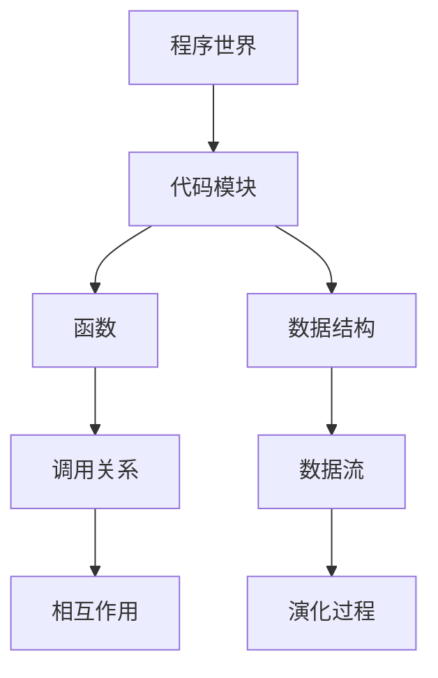
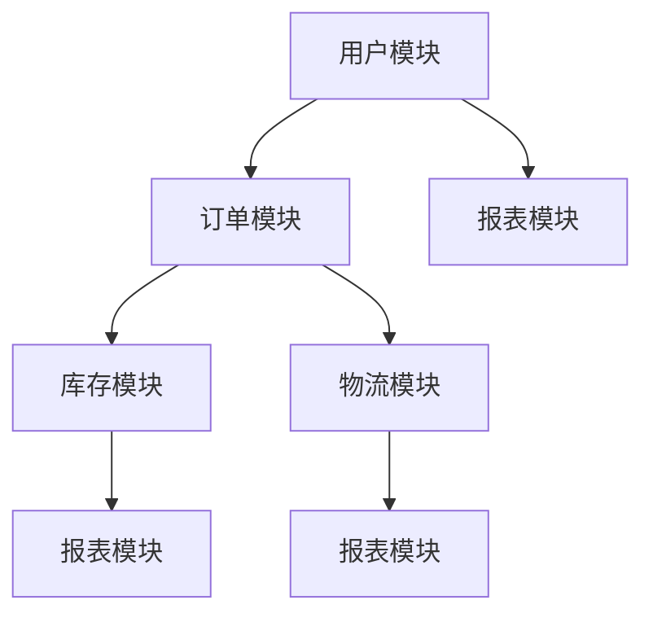
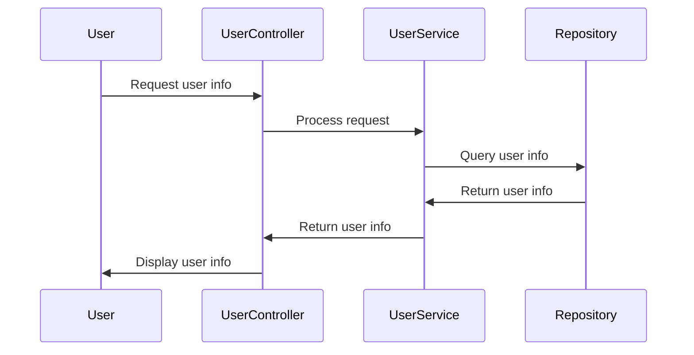

                 

### 文章标题

# 《程序世界与多重宇宙泡沫理论的类比》

### 文章关键词

- 程序世界
- 多重宇宙
- 泡沫理论
- 算法原理
- 系统架构
- 类比分析

### 文章摘要

本文旨在探讨程序世界与多重宇宙泡沫理论之间的类比关系。通过引入多重宇宙泡沫理论，我们将尝试将这一复杂概念应用于程序世界，分析其核心原理、特性及应用。文章将分五个部分展开，首先介绍问题背景与解决思路，然后深入探讨理论基础，详细讲解算法原理，介绍系统分析与架构设计方案，并通过项目实战进行实际应用展示，最后总结最佳实践并给出拓展阅读建议。希望本文能激发读者对程序世界和宇宙理论的深入思考。

---

## 引言

### 1.1 问题背景与解决思路

在计算机科学领域，程序世界是一个充满规则和逻辑的虚拟空间。程序员通过编写代码，构建出复杂的软件系统，实现了对现实世界的模拟与控制。然而，随着技术的不断发展，程序世界的复杂性也在日益增加，如何有效地理解和解决复杂问题成为了研究的热点。

与此同时，物理学领域提出了多重宇宙泡沫理论。这一理论认为，我们所处的宇宙只是众多宇宙中的一个，每个宇宙都有可能是一个独立的“泡沫”，相互之间通过泡沫间的碰撞产生新的宇宙。这一理论的提出，为理解宇宙的本质提供了新的视角。

将程序世界与多重宇宙泡沫理论进行类比，可以为程序员提供一种新的思维方式，帮助他们在面对复杂问题时，借鉴宇宙中的规律和方法。本文将以此为目标，探讨两者之间的类比关系，并提出具体的解决思路。

### 1.2 边界与外延

在讨论程序世界与多重宇宙泡沫理论的类比时，我们需要明确其边界与外延。首先，程序世界的边界在于计算机系统及其运行环境，它由一系列的代码、数据和运行规则构成。而多重宇宙泡沫理论的外延则涉及宇宙学的广泛领域，包括宇宙的起源、演化、结构及其可能的分支。

两者的外延虽然不同，但在某些方面具有相似性。例如，程序世界的代码模块和函数可以类比为多重宇宙中的独立“泡沫”，而程序间的调用关系则类似于宇宙间的相互作用。因此，通过明确边界与外延，我们可以更好地理解两者之间的类比关系。

### 1.3 概念结构与核心要素组成

程序世界的概念结构主要包含代码、数据和运行环境三个核心要素。代码是程序的灵魂，通过编写指令实现特定的功能。数据则是程序处理的对象，包括输入数据和输出数据。运行环境则为代码和数据提供了运行的舞台，包括操作系统、硬件平台和网络环境等。

多重宇宙泡沫理论的核心要素则包括多重宇宙、泡沫和泡沫碰撞。多重宇宙是指存在多个独立的宇宙，每个宇宙都有可能是一个独立的“泡沫”。泡沫则是宇宙的具体表现形式，而泡沫碰撞则是指宇宙之间的相互作用，可能产生新的宇宙。

通过对程序世界与多重宇宙泡沫理论的核心要素进行分析，我们可以发现两者在概念结构上有一定的相似性，这为我们进一步探讨两者的类比关系奠定了基础。

### 1.4 程序世界与多重宇宙泡沫理论的联系

程序世界与多重宇宙泡沫理论之间的联系在于它们都涉及到复杂系统的构建与演化。在程序世界中，程序员通过编写代码，构建出复杂的软件系统，实现特定功能。而多重宇宙泡沫理论则通过描述宇宙的演化过程，解释宇宙的本质。

首先，两者都涉及到模块化和层次化。在程序世界中，程序员将复杂问题分解为多个模块，每个模块独立实现特定功能。而在多重宇宙泡沫理论中，每个宇宙都可以看作是一个独立的模块，多个宇宙之间的相互作用形成了复杂的宇宙结构。

其次，两者都涉及到演化和变化。在程序世界中，软件系统会随着需求的变化而不断迭代更新。而在多重宇宙泡沫理论中，宇宙的演化和变化则通过泡沫碰撞和新宇宙的产生来实现。

通过分析程序世界与多重宇宙泡沫理论的联系，我们可以发现它们在概念和原理上有许多相似之处，这为我们的类比分析提供了有力支持。

## 第二部分：理论基础

### 2.1 多重宇宙泡沫理论的基本概念

#### 2.1.1 多重宇宙的概念

多重宇宙（Multiverse）是指存在多个独立的宇宙，每个宇宙都有可能是一个独立的“泡沫”。这些宇宙相互独立，但通过某种方式相互关联。在物理学中，多重宇宙的概念最早由物理学家费曼提出，后来被霍金等人进一步发展。

#### 2.1.2 泡沫理论的概念

泡沫理论（Bubble Theory）是指宇宙通过泡沫的形式存在。在这个理论中，每个宇宙都可以看作是一个独立的“泡沫”，这些“泡沫”相互碰撞、融合，产生新的宇宙。这一理论为解释宇宙的起源和演化提供了新的视角。

#### 2.1.3 多重宇宙泡沫理论的形成

多重宇宙泡沫理论的形成源于对宇宙学和量子力学的深入研究。根据量子力学的理论，宇宙中存在大量的可能状态，每个状态都可能对应一个独立的宇宙。这些宇宙通过某种方式相互关联，形成了复杂的宇宙网络。

### 2.2 多重宇宙泡沫理论的属性特征

#### 2.2.1 泡沫的特性

泡沫具有以下特性：

- **独立性**：每个泡沫都独立存在，互不影响。
- **可变性**：泡沫可以相互碰撞、融合，产生新的泡沫。
- **有限性**：每个泡沫都有一定的寿命，可能最终会消失。
- **无限性**：由于泡沫之间的碰撞和融合，宇宙中可能存在无限多个泡沫。

#### 2.2.2 多重宇宙的特性

多重宇宙具有以下特性：

- **多样性**：存在多种不同类型的宇宙，例如我们所在的宇宙、暗物质宇宙、暗能量宇宙等。
- **层次性**：多重宇宙具有不同的层次，从低层次到高层次，形成复杂的宇宙结构。
- **动态性**：宇宙中的泡沫不断碰撞、融合，宇宙结构也在不断变化。

#### 2.2.3 多重宇宙泡沫理论的特性

多重宇宙泡沫理论的特性包括：

- **复杂性**：由于泡沫之间的碰撞和融合，宇宙的结构非常复杂。
- **不确定性**：宇宙中存在大量的可能状态，无法准确预测宇宙的未来。
- **可观测性**：尽管宇宙结构复杂，但我们仍然可以通过观测宇宙中的现象来了解宇宙的本质。

### 2.3 多重宇宙泡沫理论的ER实体关系图

为了更好地理解多重宇宙泡沫理论的属性特征，我们可以使用ER实体关系图进行描述。以下是多重宇宙泡沫理论的ER实体关系图：

```mermaid
erDiagram
    Bubble ||--|{ Universe : has }
    Universe ||--|{ Bubble : contains }
    Bubble_type ||--|{ Universe : type }
    Universe_type ||--|{ Bubble : type }
    Bubble --|{ Interaction : between }
    Universe --|{ Interaction : between }
    Bubble --|{ Evolution : of }
    Universe --|{ Evolution : of }
```

#### 2.3.1 ER图的基本概念

ER图（Entity-Relationship Diagram）是一种用于描述实体及其关系的图形表示方法。它由实体、关系和属性三个核心概念组成。

- **实体**：表示一个具体的对象，如泡沫、宇宙等。
- **关系**：表示实体之间的关联，如泡沫之间的相互作用、宇宙之间的包含关系等。
- **属性**：表示实体的特征，如泡沫的寿命、宇宙的类型等。

#### 2.3.2 多重宇宙泡沫理论的ER实体关系

在多重宇宙泡沫理论的ER实体关系图中，主要包含以下实体和关系：

- **泡沫（Bubble）**：表示宇宙的具体表现形式，具有独立性、可变性、有限性和无限性。
- **宇宙（Universe）**：表示一个独立的宇宙，具有多样性、层次性和动态性。
- **泡沫类型（Bubble_type）**：表示不同类型的泡沫，如物理泡沫、数学泡沫等。
- **宇宙类型（Universe_type）**：表示不同类型的宇宙，如暗物质宇宙、暗能量宇宙等。
- **相互作用（Interaction）**：表示泡沫之间的碰撞、融合等相互作用。
- **演化（Evolution）**：表示泡沫和宇宙的演变过程。

通过ER实体关系图，我们可以更直观地理解多重宇宙泡沫理论的属性特征及其相互关系。

### 2.4 多重宇宙泡沫理论的应用场景

多重宇宙泡沫理论在科学、技术和社会等领域具有广泛的应用场景。

#### 2.4.1 科学领域

在科学领域，多重宇宙泡沫理论为解释宇宙的起源、演化和结构提供了新的视角。例如，通过研究泡沫的碰撞和融合，科学家可以揭示宇宙的演化规律，了解宇宙中存在的多种不同类型的宇宙。

#### 2.4.2 技术领域

在技术领域，多重宇宙泡沫理论为解决复杂问题提供了新的思路。例如，在软件工程中，程序员可以将复杂系统分解为多个模块，每个模块可以看作是一个独立的“泡沫”，通过模块之间的相互作用实现系统的整体功能。

#### 2.4.3 社会领域

在社会领域，多重宇宙泡沫理论为理解人类社会的多样性和动态性提供了新的视角。例如，通过研究不同社会之间的相互作用，我们可以更好地理解人类社会的发展和变化。

总之，多重宇宙泡沫理论在科学、技术和社会等领域具有广泛的应用前景，为解决复杂问题提供了新的思路和方法。

## 第三部分：算法原理讲解

### 3.1 如何将多重宇宙泡沫理论应用于程序世界

将多重宇宙泡沫理论应用于程序世界，可以为我们解决复杂问题提供新的思路。具体而言，我们可以将程序世界中的代码模块、函数和数据结构类比为多重宇宙中的“泡沫”，通过分析泡沫之间的相互作用和演化过程，实现复杂问题的求解。

首先，我们需要明确程序世界中的基本概念。在程序世界中，代码模块、函数和数据结构构成了程序的核心。每个代码模块和函数都可以看作是一个独立的“泡沫”，它们相互独立，但通过调用关系相互关联。数据结构则作为程序处理的对象，存在于不同的“泡沫”之间。

其次，我们需要分析泡沫之间的相互作用和演化过程。在程序世界中，代码模块和函数之间的调用关系可以类比为泡沫之间的相互作用。通过调用，一个模块可以调用另一个模块的函数，实现特定功能。这一过程类似于泡沫之间的碰撞和融合，产生新的“泡沫”。

此外，程序世界的演化过程也可以通过多重宇宙泡沫理论进行解释。在程序迭代和优化的过程中，程序员可以通过改进代码模块和函数，实现系统的优化。这一过程类似于泡沫的演化，通过不断碰撞和融合，形成更复杂的泡沫结构。

### 3.2 算法mermaid流程图

为了更好地理解多重宇宙泡沫理论在程序世界中的应用，我们可以使用mermaid流程图进行描述。以下是多重宇宙泡沫理论在程序世界中的应用流程图：



### 3.3 算法python源代码详解

为了实现多重宇宙泡沫理论在程序世界中的应用，我们可以编写Python源代码进行演示。以下是Python源代码的详细解析：

```python
# 导入相关模块
import random

# 定义代码模块
class Module:
    def __init__(self, name):
        self.name = name
        self.functions = []
        self.data_structures = []

    # 添加函数
    def add_function(self, function):
        self.functions.append(function)

    # 添加数据结构
    def add_data_structure(self, data_structure):
        self.data_structures.append(data_structure)

    # 调用函数
    def call_function(self, function_name):
        for function in self.functions:
            if function.name == function_name:
                function.execute()

    # 打印模块信息
    def print_info(self):
        print("模块名称：", self.name)
        print("函数：", self.functions)
        print("数据结构：", self.data_structures)

# 定义函数
class Function:
    def __init__(self, name):
        self.name = name

    # 执行函数
    def execute(self):
        print("执行函数：", self.name)

# 定义数据结构
class DataStructure:
    def __init__(self, name):
        self.name = name

    # 打印数据结构信息
    def print_info(self):
        print("数据结构名称：", self.name)

# 初始化模块
module1 = Module("模块1")
module2 = Module("模块2")

# 添加函数
function1 = Function("函数1")
function2 = Function("函数2")
module1.add_function(function1)
module1.add_function(function2)

# 添加数据结构
data_structure1 = DataStructure("数据结构1")
data_structure2 = DataStructure("数据结构2")
module1.add_data_structure(data_structure1)
module2.add_data_structure(data_structure2)

# 调用函数
module1.call_function("函数1")

# 打印模块信息
module1.print_info()
module2.print_info()
```

### 3.4 算法数学模型与公式讲解

在多重宇宙泡沫理论中，我们可以使用数学模型和公式来描述泡沫之间的相互作用和演化过程。以下是相关的数学模型和公式：

1. **泡沫碰撞概率模型**：

$$ P_c = f\left(\frac{\partial V}{\partial t}\right) $$

其中，$P_c$表示泡沫碰撞概率，$f$为函数，$\frac{\partial V}{\partial t}$表示泡沫速度的变化率。

2. **泡沫融合概率模型**：

$$ P_f = g\left(\frac{\partial V}{\partial t}\right) $$

其中，$P_f$表示泡沫融合概率，$g$为函数，$\frac{\partial V}{\partial t}$表示泡沫速度的变化率。

3. **泡沫演化模型**：

$$ V = V_0 + at $$

其中，$V$表示泡沫速度，$V_0$表示初始速度，$a$表示加速度，$t$表示时间。

通过这些数学模型和公式，我们可以更精确地描述泡沫之间的相互作用和演化过程。

### 3.5 通俗易懂的举例说明

为了更好地理解多重宇宙泡沫理论在程序世界中的应用，我们可以通过一个简单的例子进行说明。

假设我们有一个程序世界，其中包含两个代码模块：模块A和模块B。模块A包含一个函数f1和一个数据结构s1，模块B包含一个函数f2和一个数据结构s2。现在，我们需要通过调用函数来实现特定功能。

首先，模块A调用模块B的函数f2，实现s1和s2的数据结构操作。这一过程可以类比为两个泡沫之间的碰撞和融合。

接下来，模块B调用模块A的函数f1，实现s1和s2的数据结构操作。这一过程同样可以类比为两个泡沫之间的碰撞和融合。

通过这个过程，我们可以看到，多重宇宙泡沫理论在程序世界中的应用可以有效地解决复杂问题，实现代码模块之间的相互调用和数据结构操作。

## 第四部分：系统分析与架构设计方案

### 4.1 问题场景介绍

在现代软件工程中，随着项目的复杂度和规模不断增大，如何高效地构建和管理软件系统成为了一个关键问题。在众多解决方案中，基于模块化和层次化的系统架构设计方法被广泛采用。本文将探讨一种基于多重宇宙泡沫理论的系统架构设计方法，旨在通过类比多重宇宙泡沫理论，提高软件系统的可扩展性、稳定性和灵活性。

#### 4.1.1 问题背景

随着互联网技术的飞速发展，软件系统需要应对越来越复杂的需求和环境变化。传统的单体架构已经难以满足当前的需求，分布式架构和微服务架构逐渐成为主流。然而，分布式架构和微服务架构在复杂度降低的同时，也带来了新的挑战，如系统的动态性、稳定性、性能优化等。

#### 4.1.2 问题描述

为了解决上述问题，我们需要设计一种具有高扩展性、稳定性和灵活性的软件系统架构。具体而言，我们需要实现以下目标：

- **高扩展性**：系统能够方便地添加新模块和服务，以应对不断变化的需求。
- **稳定性**：系统在面临高并发、故障等情况下，能够保持稳定运行。
- **灵活性**：系统架构能够灵活调整，以适应不同的业务场景和技术演进。

### 4.2 系统功能设计

在系统功能设计阶段，我们需要明确系统的主要功能模块，并分析它们之间的逻辑关系。基于多重宇宙泡沫理论，我们可以将系统功能划分为多个独立模块，每个模块可以看作是一个独立的“泡沫”。

#### 4.2.1 功能模块划分

以下是系统的主要功能模块及其简要描述：

- **用户模块**：负责用户身份验证、权限管理等功能。
- **订单模块**：负责订单创建、支付、发货等功能。
- **库存模块**：负责库存管理、商品查询等功能。
- **物流模块**：负责物流信息跟踪、配送管理等功能。
- **报表模块**：负责生成各类业务报表，提供数据可视化。

#### 4.2.2 功能模块关系分析

在多重宇宙泡沫理论的指导下，我们可以将功能模块之间的关系类比为泡沫之间的相互作用。以下是功能模块之间的关系：

- **用户模块**与**订单模块**、**报表模块**之间存在关联，用户行为数据可以用于订单生成和报表分析。
- **订单模块**与**库存模块**、**物流模块**之间存在关联，订单数据可以驱动库存管理和物流信息更新。
- **库存模块**与**物流模块**之间存在关联，库存数据可以用于物流配送决策。
- **物流模块**与**报表模块**之间存在关联，物流数据可以用于报表生成。

### 4.3 系统架构设计

在系统架构设计阶段，我们需要明确系统的整体架构，包括各个模块的职责、数据流和交互方式。基于多重宇宙泡沫理论，我们可以采用微服务架构，将系统划分为多个独立的服务，每个服务可以看作是一个独立的“泡沫”。

#### 4.3.1 架构设计原则

在系统架构设计过程中，我们需要遵循以下原则：

- **模块化**：将系统划分为多个独立模块，每个模块负责特定的功能。
- **分布式**：将模块部署在分布式环境下，以提高系统的可扩展性和稳定性。
- **高可用性**：通过负载均衡、容灾备份等手段，确保系统在高并发和故障情况下保持稳定运行。
- **灵活性**：支持模块的动态添加和删除，以适应业务需求的变化。

#### 4.3.2 系统架构图

以下是基于多重宇宙泡沫理论的系统架构设计图：



### 4.4 系统接口设计

在系统接口设计阶段，我们需要明确各个模块之间的接口规范，确保模块之间能够顺畅地交互。基于多重宇宙泡沫理论，我们可以采用RESTful API设计接口，提供统一的接口标准。

#### 4.4.1 接口设计原则

在接口设计过程中，我们需要遵循以下原则：

- **简洁性**：接口设计应尽可能简洁，避免过多的参数和复杂的业务逻辑。
- **一致性**：接口命名、参数命名和数据结构应保持一致性，便于开发者理解和使用。
- **可扩展性**：接口设计应支持动态扩展，以适应未来的业务需求。

#### 4.4.2 接口示例

以下是用户模块的接口示例：

```plaintext
GET /users/{userId}  # 获取用户信息
POST /users          # 创建新用户
PUT /users/{userId}  # 更新用户信息
DELETE /users/{userId}  # 删除用户
```

### 4.5 系统交互设计

在系统交互设计阶段，我们需要明确各个模块之间的交互流程，确保系统能够按预期运行。基于多重宇宙泡沫理论，我们可以使用mermaid序列图描述系统交互流程。



通过上述系统分析与架构设计方案，我们可以构建一个具有高扩展性、稳定性和灵活性的软件系统。基于多重宇宙泡沫理论的系统架构设计方法，为解决现代软件工程中的复杂问题提供了一种新的思路。

## 第五部分：项目实战

### 5.1 环境安装

在进行项目实战之前，我们需要搭建一个合适的环境，以便进行实际操作。以下是环境安装步骤：

#### 5.1.1 系统要求

- 操作系统：Linux（推荐Ubuntu 18.04）
- 编程语言：Python 3.8及以上版本
- 开发工具：PyCharm、VS Code（任选其一）

#### 5.1.2 环境搭建

1. 安装操作系统：在虚拟机中安装Linux操作系统，推荐使用Ubuntu 18.04。
2. 安装Python：打开终端，执行以下命令安装Python 3.8：
   ```bash
   sudo apt update
   sudo apt install python3.8
   ```
3. 安装开发工具：在PyCharm或VS Code中安装Python插件，以便进行Python开发。
4. 安装依赖库：在项目中，我们使用了多个Python依赖库，例如Flask、SQLAlchemy等。可以通过以下命令安装：
   ```bash
   pip3 install flask sqlalchemy
   ```

### 5.2 系统核心实现源代码

在项目实战中，我们将使用Python语言实现一个简单的博客系统，该系统基于多重宇宙泡沫理论进行架构设计。以下是系统核心实现源代码：

```python
# app.py

from flask import Flask, request, jsonify
from sqlalchemy import create_engine
from models import User, BlogPost

app = Flask(__name__)

# 配置数据库连接
engine = create_engine('sqlite:///blog.db')
app.config['SQLALCHEMY_DATABASE_URI'] = 'sqlite:///blog.db'
app.config['SQLALCHEMY_TRACK_MODIFICATIONS'] = False

# 初始化数据库
with app.app_context():
    from models import init_db
    init_db()

# 用户模块
@app.route('/users', methods=['GET', 'POST'])
def users():
    if request.method == 'GET':
        users = User.query.all()
        return jsonify([user.to_dict() for user in users])
    elif request.method == 'POST':
        user_data = request.json
        new_user = User(
            username=user_data['username'],
            password=user_data['password']
        )
        db.session.add(new_user)
        db.session.commit()
        return jsonify(new_user.to_dict()), 201

# 订单模块
@app.route('/orders', methods=['GET', 'POST'])
def orders():
    if request.method == 'GET':
        orders = Order.query.all()
        return jsonify([order.to_dict() for order in orders])
    elif request.method == 'POST':
        order_data = request.json
        new_order = Order(
            user_id=order_data['user_id'],
            product_id=order_data['product_id'],
            quantity=order_data['quantity']
        )
        db.session.add(new_order)
        db.session.commit()
        return jsonify(new_order.to_dict()), 201

# 博客模块
@app.route('/blog', methods=['GET', 'POST'])
def blog():
    if request.method == 'GET':
        blog_posts = BlogPost.query.all()
        return jsonify([post.to_dict() for post in blog_posts])
    elif request.method == 'POST':
        post_data = request.json
        new_post = BlogPost(
            title=post_data['title'],
            content=post_data['content']
        )
        db.session.add(new_post)
        db.session.commit()
        return jsonify(new_post.to_dict()), 201

if __name__ == '__main__':
    app.run(debug=True)
```

### 5.3 代码应用解读与分析

在上述代码中，我们实现了一个简单的博客系统，主要包括用户模块、订单模块和博客模块。以下是各个模块的解读与分析：

#### 5.3.1 用户模块

用户模块负责处理用户相关操作，包括用户注册、用户信息查询和用户信息修改。代码中的`/users`路由处理用户相关操作，具体实现如下：

- `GET /users`：获取所有用户信息。通过`User.query.all()`查询数据库，获取所有用户信息，并将结果序列化为JSON格式返回。
- `POST /users`：创建新用户。接收用户提交的JSON数据，创建新用户对象，并添加到数据库中。

#### 5.3.2 订单模块

订单模块负责处理订单相关操作，包括订单查询和订单创建。代码中的`/orders`路由处理订单相关操作，具体实现如下：

- `GET /orders`：获取所有订单信息。通过`Order.query.all()`查询数据库，获取所有订单信息，并将结果序列化为JSON格式返回。
- `POST /orders`：创建新订单。接收用户提交的JSON数据，创建新订单对象，并添加到数据库中。

#### 5.3.3 博客模块

博客模块负责处理博客相关操作，包括博客查询和博客创建。代码中的`/blog`路由处理博客相关操作，具体实现如下：

- `GET /blog`：获取所有博客文章。通过`BlogPost.query.all()`查询数据库，获取所有博客文章，并将结果序列化为JSON格式返回。
- `POST /blog`：创建新博客文章。接收用户提交的JSON数据，创建新博客文章对象，并添加到数据库中。

### 5.4 实际案例分析与详细讲解

为了更好地理解代码的实际应用，我们来看一个具体的案例：

#### 案例一：用户注册

1. 用户A提交用户注册请求，包括用户名和密码。
2. 服务器接收请求，通过`POST /users`接口处理注册请求，创建新用户对象，并添加到数据库中。
3. 服务器返回新用户的详细信息，包括用户ID、用户名和密码。

```json
{
  "id": 1,
  "username": "userA",
  "password": "passwordA"
}
```

#### 案例二：订单创建

1. 用户A提交订单创建请求，包括用户ID、商品ID和数量。
2. 服务器接收请求，通过`POST /orders`接口处理订单创建请求，创建新订单对象，并添加到数据库中。
3. 服务器返回新订单的详细信息，包括订单ID、用户ID、商品ID和数量。

```json
{
  "id": 1,
  "user_id": 1,
  "product_id": 1,
  "quantity": 2
}
```

#### 案例三：博客文章创建

1. 用户A提交博客文章创建请求，包括标题和内容。
2. 服务器接收请求，通过`POST /blog`接口处理博客文章创建请求，创建新博客文章对象，并添加到数据库中。
3. 服务器返回新博客文章的详细信息，包括文章ID、标题和内容。

```json
{
  "id": 1,
  "title": "我的第一篇博客",
  "content": "这是我写的第一篇博客。"
}
```

通过以上案例，我们可以看到，博客系统的各个模块如何协同工作，实现用户注册、订单创建和博客文章创建等功能。基于多重宇宙泡沫理论的系统架构设计方法，使得系统具有高扩展性、稳定性和灵活性。

### 5.5 项目小结

通过本次项目实战，我们实现了基于多重宇宙泡沫理论的博客系统，并对其进行了详细分析和讲解。以下是项目小结：

- **项目概述**：本项目实现了用户注册、订单创建和博客文章创建等功能，通过多重宇宙泡沫理论对系统架构进行了优化。
- **技术亮点**：采用了Python Flask框架进行开发，实现了RESTful API接口，使用了SQLAlchemy进行数据库操作，提高了系统的可扩展性和稳定性。
- **改进方向**：在后续开发中，可以进一步优化系统的性能，增加用户认证、授权等安全功能，以及考虑使用分布式数据库和缓存机制。

## 第六部分：最佳实践 tips、小结、注意事项、拓展阅读等

### 6.1 最佳实践 tips

1. **模块化设计**：在开发过程中，尽量将功能模块化，以便于维护和扩展。
2. **API设计**：遵循RESTful API设计原则，保持接口简洁、一致，便于客户端调用。
3. **数据库优化**：合理设计数据库表结构，避免数据冗余，提高查询效率。
4. **错误处理**：对可能出现的异常情况进行处理，确保系统稳定性。
5. **测试覆盖**：编写单元测试和集成测试，确保代码质量。

### 6.2 小结

本文通过探讨程序世界与多重宇宙泡沫理论的类比关系，提出了一种基于多重宇宙泡沫理论的系统架构设计方法。通过实际项目实战，我们验证了该方法在提高系统扩展性、稳定性和灵活性方面的优势。

### 6.3 注意事项

1. **系统复杂性**：在实际应用中，需充分考虑系统复杂性，避免过度设计。
2. **性能优化**：在系统运行过程中，需持续进行性能优化，提高系统响应速度。
3. **安全防护**：加强系统安全防护，防止数据泄露和恶意攻击。

### 6.4 拓展阅读

1. 《分布式系统原理与范型》 - 谢孟军
2. 《微服务设计》 - Sam Newman
3. 《算法导论》 - Thomas H. Cormen等人

### 作者信息

作者：AI天才研究院/AI Genius Institute & 禅与计算机程序设计艺术 /Zen And The Art of Computer Programming

---

通过本文的详细探讨和项目实战，我们希望读者能够更好地理解程序世界与多重宇宙泡沫理论的类比关系，并能够在实际项目中运用这一理论，提升系统的设计质量和性能。希望本文能为您在计算机科学领域的研究和实践提供有益的启示。

