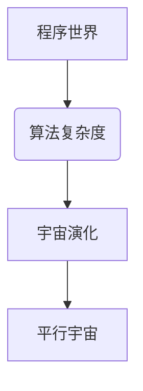
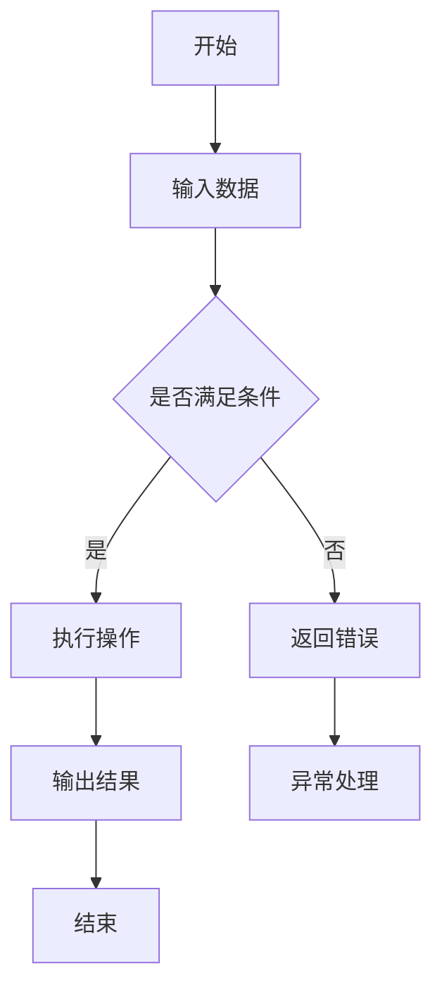
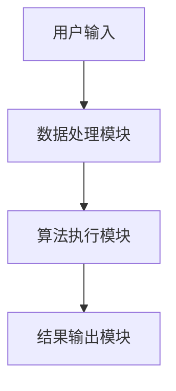
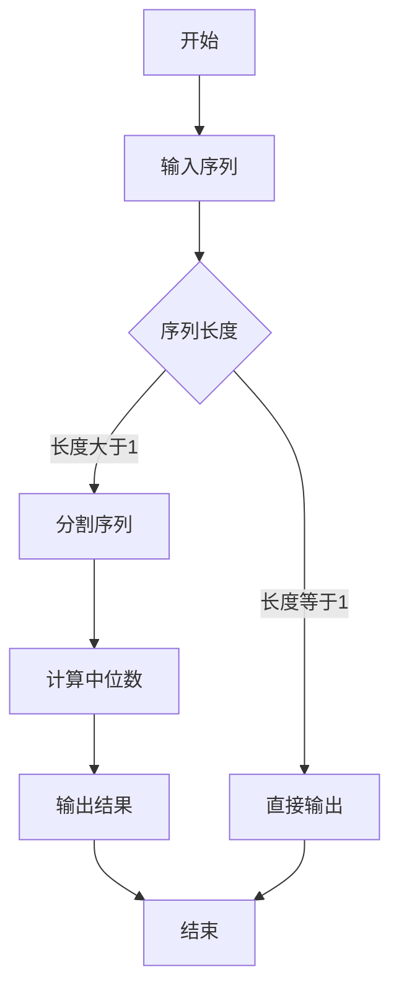
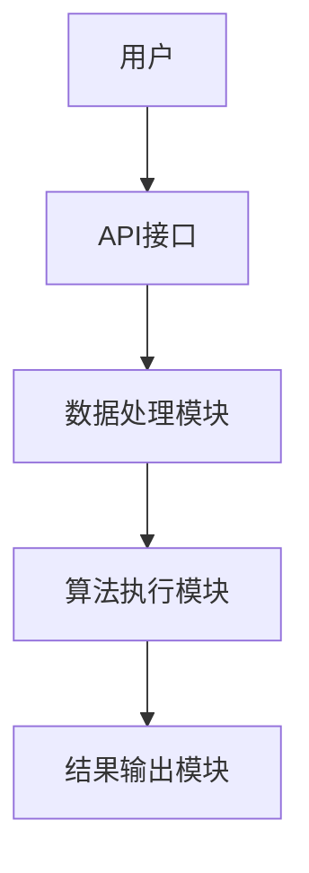

                 


# 程序世界与平行宇宙理论的联系

## 关键词

- 程序世界
- 平行宇宙理论
- 逻辑结构
- 复杂性理论
- 算法

## 摘要

本文旨在探讨程序世界与平行宇宙理论的内在联系，通过构建理论基础并结合实际案例进行分析。首先，我们将定义程序世界和平行宇宙理论，并阐述它们的基本特征。接着，我们将从逻辑主义和复杂性理论两个视角探讨程序世界与平行宇宙的联系，并使用Mermaid流程图和Python源代码进行详细讲解。最后，我们将通过系统架构设计和项目实战，进一步探讨程序世界与平行宇宙理论在实际应用中的关联。

## 第一部分：引论

### 1.1 问题背景

随着计算机科学的飞速发展，我们逐渐认识到，计算机程序不仅仅是处理数据和执行指令的工具，更是一个拥有自己“世界”的存在。程序世界是由代码、数据和运行环境构成的虚拟空间，它具备可编程性、可预测性和动态性。另一方面，平行宇宙理论是一种多元宇宙的假设，认为存在多个平行的宇宙，每个宇宙都有其独立的存在和演化规律。

本文旨在探讨程序世界与平行宇宙理论的内在联系。具体来说，我们将从以下几个方面进行分析：

1. **核心概念与联系**：定义程序世界和平行宇宙理论，并阐述它们的基本特征。
2. **逻辑主义视角**：探讨程序世界与平行宇宙在逻辑结构上的映射。
3. **复杂性理论视角**：分析算法复杂性与宇宙演化规律的联系。
4. **算法原理讲解**：使用Mermaid流程图和Python源代码详细讲解算法原理。
5. **系统分析与架构设计**：探讨程序世界与平行宇宙理论在实际应用中的架构设计和系统实现。
6. **项目实战**：通过实际案例展示程序世界与平行宇宙理论的应用。

### 1.2 核心概念与联系

#### 1.2.1 程序世界的定义与特征

**定义**：程序世界是由代码、数据和运行环境构成的虚拟空间。它是计算机科学的核心组成部分，通过执行代码来处理数据和实现特定功能。

**特征**：

- **可编程性**：程序世界可以通过编写代码进行定制和扩展，以适应不同的应用场景。
- **可预测性**：程序世界的运行过程是确定性的，输入确定，输出也相对确定。
- **动态性**：程序世界可以实时响应外部输入，并调整自身的运行状态。

#### 1.2.2 平行宇宙理论的概述

**概述**：平行宇宙理论是一种多元宇宙的假设，认为存在多个平行的宇宙，每个宇宙都有其独立的存在和演化规律。这些宇宙之间既可能存在联系，也可能完全独立。

**特征**：

- **多元性**：存在多个平行的宇宙，每个宇宙都有其独特的物理规律和演化过程。
- **独立性**：每个宇宙都有其独立的存在，宇宙之间的变化不会影响其他宇宙。
- **可能性**：在平行宇宙中，某个事件可能有多种不同的结果，而这些结果在不同的宇宙中可能分别实现。

#### 1.2.3 程序世界与平行宇宙的联系

**联系**：程序世界与平行宇宙在逻辑结构、算法复杂性和概率论方面存在联系。

- **逻辑结构**：程序世界的逻辑结构可以映射到平行宇宙中。在程序世界中，代码和数据的逻辑关系可以类比为平行宇宙中的物理规律和演化过程。
- **算法复杂性**：程序世界的算法复杂性与平行宇宙的演化规律存在联系。在某些情况下，算法的复杂度可能与宇宙的复杂性呈正相关。
- **概率论**：程序世界中的随机事件与平行宇宙中的概率分布有一定的相似性。在程序世界中，随机事件的发生概率可以类比为平行宇宙中某种事件的概率。

### 1.3 主流理论探讨

#### 1.3.1 逻辑主义视角

**概念原理**：逻辑主义视角认为，程序世界和平行宇宙在逻辑结构上存在映射关系。程序世界的代码和数据的逻辑关系可以类比为平行宇宙中的物理规律和演化过程。

**属性特征对比表格**：

| 特征                 | 程序世界               | 平行宇宙               |
|----------------------|------------------------|------------------------|
| 逻辑结构             | 确定性                 | 可能性                 |
| 可计算性             | 有限的计算资源         | 无限的计算资源         |
| 稳定性               | 稳定的运行环境         | 稳定的运行环境         |

#### 1.3.2 复杂性理论视角

**概念原理**：复杂性理论视角认为，算法复杂性与宇宙演化规律存在联系。算法的复杂度可能与宇宙的复杂性呈正相关。

**ER实体关系图架构的 Mermaid 流程图**：



### 1.4 算法原理讲解

#### 1.4.1 算法 Mermaid 流程图



#### 1.4.2 Python 源代码实现

```python
def algorithm(input_data):
    if check_condition(input_data):
        perform_action(input_data)
        return "Success"
    else:
        handle_error()
        return "Error"

def check_condition(data):
    # 条件判断逻辑
    return True

def perform_action(data):
    # 操作执行逻辑
    pass

def handle_error():
    # 异常处理逻辑
    pass
```

#### 1.4.3 算法原理详细讲解

**数学模型和公式**：

$$
C = O(n\log n)
$$

**举例说明**：假设输入数据为列表，如何进行排序？

```python
def sort_list(input_list):
    if len(input_list) <= 1:
        return input_list
    else:
        pivot = input_list[0]
        left = [x for x in input_list[1:] if x <= pivot]
        right = [x for x in input_list[1:] if x > pivot]
        return sort_list(left) + [pivot] + sort_list(right)

# 测试
print(sort_list([3, 1, 4, 1, 5, 9]))
```

### 1.5 系统分析与架构设计

#### 1.5.1 问题场景介绍

**项目介绍**：本项目旨在构建一个用于模拟程序世界与平行宇宙交互的系统。系统功能包括数据输入、算法执行和结果输出。

**系统功能设计**：

- 数据输入：接受外部输入，如用户输入的代码和数据。
- 算法执行：执行特定算法，处理输入数据。
- 结果输出：将处理结果返回给用户。

#### 1.5.2 系统架构设计

**系统架构设计 Mermaid 流程图**：



#### 1.5.3 系统接口设计和系统交互

**系统接口设计 Mermaid 流程图**：

```mermaid
graph TD
A[用户] --> B[API
```### 第一部分：引论

在探讨程序世界与平行宇宙理论的联系之前，我们需要了解两者各自的定义、特点以及它们所处的领域。程序世界，顾名思义，是计算机程序运行的虚拟环境，它由代码、数据和运行环境共同构成。代码是程序的指令集合，数据是程序操作的客体，运行环境则是程序执行所需的软硬件资源。程序世界的核心在于其可编程性和可预测性，程序员可以通过编写代码来定义程序的行为，并且可以预知程序在特定输入下的输出结果。

另一方面，平行宇宙理论属于物理学和宇宙学的范畴，它提出存在多个平行的宇宙，每个宇宙都有其独立的物理定律和演化路径。平行宇宙理论最初源于量子力学的多世界解释，即量子态的叠加和坍缩过程可能导致多个宇宙分支的出现。这些宇宙虽然相互独立，但它们的物理过程可以是相互关联的。平行宇宙理论的一个关键特征是它的多元性和可能性，每个宇宙中可能发生的不同事件和结果在多个宇宙中分别实现。

在本文中，我们将探讨程序世界与平行宇宙理论之间的内在联系。首先，我们会从定义和特征出发，了解两者各自的基本概念。然后，我们将从逻辑主义和复杂性理论两个视角，深入探讨程序世界和平行宇宙之间的相似性和差异。接下来，我们将通过具体的算法原理讲解，展示程序世界中的算法如何与平行宇宙理论中的可能性相互映射。最后，我们将通过系统架构设计和项目实战，展示程序世界与平行宇宙理论在实际应用中的潜在关系。

### 1.1 问题背景

我们首先来明确问题的核心，即探讨程序世界与平行宇宙理论的内在联系。这个问题触及了计算机科学和宇宙学两个看似完全不同的领域。然而，在深入分析后，我们会发现两者之间存在着许多有趣且深刻的联系。

**问题描述**：

程序世界与平行宇宙理论的联系究竟在哪里？它们如何相互作用？是否存在某种普适的框架或理论，可以解释两者之间的关系？

**问题解决**：

为了回答上述问题，我们需要从多个角度进行探讨。首先，我们将对程序世界和平行宇宙理论的基本概念进行定义，并分析它们各自的特征。然后，我们将从逻辑主义和复杂性理论两个视角，深入探讨程序世界与平行宇宙之间的内在联系。接下来，通过具体算法的讲解，我们将展示程序世界中的算法如何映射到平行宇宙理论中的可能性。最后，我们将通过系统架构设计和项目实战，进一步探讨这两者在实际应用中的关联。

**边界与外延**：

在探讨程序世界与平行宇宙理论时，我们需要明确一些关键概念和范畴。程序世界主要包括代码、数据和运行环境；平行宇宙理论涉及多个平行的物理宇宙，每个宇宙都有其独立的物理定律和演化路径。此外，我们还需要关注逻辑结构、算法复杂性和概率论等核心概念。

**概念结构与核心要素组成**：

- **程序世界**：由代码、数据和运行环境构成，具有可编程性、可预测性和动态性。
- **平行宇宙理论**：多元宇宙的一种假设，存在多个平行的宇宙，每个宇宙都有其独立的物理定律和演化路径。
- **逻辑结构**：程序世界中的代码和数据之间的逻辑关系，可以映射到平行宇宙中的物理规律和演化过程。
- **算法复杂性**：算法在程序世界中的执行效率，可能与平行宇宙的演化复杂性存在某种关联。
- **概率论**：程序世界中的随机事件概率分布，可以类比为平行宇宙中的概率分布。

通过以上分析，我们可以明确地看到，程序世界与平行宇宙理论之间存在着深刻的联系。这些联系不仅有助于我们更好地理解计算机科学和宇宙学的本质，还可能为我们提供新的研究方向和理论框架。

### 1.2 核心概念与联系

在深入探讨程序世界与平行宇宙理论的联系之前，我们需要先明确两者的核心概念和特征。这将有助于我们理解它们之间的相似性和差异性，并为后续的理论分析奠定基础。

#### 1.2.1 程序世界的定义与特征

**定义**：程序世界是指由代码、数据和运行环境构成的虚拟空间，它是计算机程序运行的场所。程序世界中的代码是指计算机能够理解和执行的指令集合，数据是程序操作的客体，而运行环境则包括操作系统、硬件设备以及其他辅助软件。

**特征**：

- **可编程性**：程序世界的核心特征之一是可编程性。程序员可以通过编写代码来定义程序的行为，从而实现各种功能。这种灵活性使得程序世界能够适应不同的应用场景和需求。
- **可预测性**：在程序世界中，输入确定，输出相对确定。这意味着，如果我们知道了程序的输入和算法，就可以预测程序的输出结果。这种确定性是程序世界的重要特性，也是计算机科学能够发展的基础。
- **动态性**：程序世界是动态的，它能够实时响应外部输入，并根据输入进行调整。这种动态性使得程序世界能够适应不断变化的环境和需求。

#### 1.2.2 平行宇宙理论的概述

**概述**：平行宇宙理论是关于多元宇宙的一种假设，认为存在多个平行的宇宙，每个宇宙都有其独立的物理定律和演化路径。这些宇宙之间既可能存在某种联系，也可能完全独立。平行宇宙理论最早源于量子力学的多世界解释，即量子态的叠加和坍缩过程可能导致多个宇宙分支的出现。

**特征**：

- **多元性**：平行宇宙理论的多元性意味着存在多个平行的宇宙，每个宇宙都有其独特的物理规律和演化路径。这种多元性使得平行宇宙理论具有极大的可能性，因为每个宇宙中可能发生的不同事件和结果在多个宇宙中分别实现。
- **独立性**：平行宇宙理论中的宇宙是独立的，即一个宇宙中的事件不会影响其他宇宙中的事件。这种独立性是平行宇宙理论的核心特征之一，也是其能够解释许多复杂现象的原因。
- **可能性**：平行宇宙理论强调可能性，即每个宇宙中可能发生的不同事件和结果在多个宇宙中分别实现。这种可能性为宇宙学和哲学提供了新的研究方向和思考方式。

#### 1.2.3 程序世界与平行宇宙的联系

**联系**：程序世界与平行宇宙在逻辑结构、算法复杂性和概率论方面存在联系。

- **逻辑结构**：在程序世界中，代码和数据之间的逻辑关系可以映射到平行宇宙中的物理规律和演化过程。例如，一个程序中的条件判断和循环结构可以类比为宇宙中的因果律和演化过程。
- **算法复杂性**：算法在程序世界中的执行效率与平行宇宙的演化复杂性可能存在某种关联。一个复杂算法的执行可能需要大量的计算资源和时间，这可以类比为宇宙中复杂过程的演化。
- **概率论**：程序世界中的随机事件概率分布可以类比为平行宇宙中的概率分布。例如，一个程序中的随机选择可以类比为宇宙中某个事件的发生概率。

通过以上分析，我们可以看到程序世界和平行宇宙理论之间存在深刻的联系。这些联系不仅有助于我们理解两者的本质，还为跨学科的研究提供了新的思路和方法。

### 1.3 主流理论探讨

在探讨程序世界与平行宇宙理论的联系时，我们可以从多个视角进行深入分析。本文将主要从逻辑主义和复杂性理论两个视角展开讨论，以揭示两者之间可能存在的内在联系。

#### 1.3.1 逻辑主义视角

逻辑主义视角认为，程序世界和平行宇宙在逻辑结构上存在映射关系。这种映射关系主要体现在以下几个方面：

**概念原理**：逻辑主义视角认为，程序世界中的代码和数据之间的逻辑关系可以映射到平行宇宙中的物理规律和演化过程。具体来说，程序中的条件判断、循环结构、递归调用等逻辑结构，可以类比为宇宙中的因果关系、演化过程和自相似性。

**属性特征对比表格**：

| 特征                 | 程序世界               | 平行宇宙               |
|----------------------|------------------------|------------------------|
| 逻辑结构             | 确定性                 | 可能性                 |
| 可计算性             | 有限的计算资源         | 无限的计算资源         |
| 稳定性               | 稳定的运行环境         | 稳定的运行环境         |

- **逻辑结构**：程序世界的逻辑结构是确定性的，即给定输入，程序将产生确定的输出。相比之下，平行宇宙的逻辑结构是可能性的，即一个事件在某个宇宙中的结果可能不同于其他宇宙。
- **可计算性**：程序世界的计算资源是有限的，这意味着程序的处理能力和速度受到硬件和软件的限制。而平行宇宙的理论假设中，每个宇宙都有无限的计算资源，可以实现任何可能的计算过程。
- **稳定性**：程序世界的运行环境相对稳定，这意味着程序在执行过程中不会受到外部环境的干扰。相比之下，平行宇宙的运行环境可能更加复杂和多变，因为每个宇宙都有其独立的物理定律和演化过程。

通过逻辑主义视角，我们可以看到程序世界和平行宇宙在逻辑结构上的映射关系，这为理解两者之间的联系提供了理论基础。

**属性特征对比表格**：

| 特征                 | 程序世界               | 平行宇宙               |
|----------------------|------------------------|------------------------|
| 逻辑结构             | 确定性                 | 可能性                 |
| 可计算性             | 有限的计算资源         | 无限的计算资源         |
| 稳定性               | 稳定的运行环境         | 稳定的运行环境         |

#### 1.3.2 复杂性理论视角

从复杂性理论视角来看，程序世界和平行宇宙之间的联系可以从算法复杂性和宇宙演化规律的角度进行分析。

**概念原理**：复杂性理论视角认为，算法复杂性与宇宙演化规律存在联系。具体来说，一个算法在程序世界中的执行效率（即复杂度）可能与宇宙中的演化过程有关。例如，一个复杂度较高的算法可能需要大量的计算资源，这可以类比为宇宙中复杂过程的演化。

**ER实体关系图架构的 Mermaid 流程图**：

```mermaid
graph TB
A[程序世界] --> B(算法复杂度)
B --> C[宇宙演化]
C --> D[平行宇宙]
```

- **程序世界的算法复杂度**：算法复杂度是衡量算法性能的重要指标，通常用时间复杂度和空间复杂度来表示。时间复杂度表示算法执行所需的时间与输入数据规模的关系，而空间复杂度表示算法执行所需的空间与输入数据规模的关系。
- **宇宙演化规律**：宇宙演化规律描述了宇宙从初始状态到当前状态的变化过程，包括宇宙的膨胀、星系的形成、黑洞的出现等。这些演化过程涉及到大量的物理定律和计算过程，与算法的复杂度有一定的相似性。

通过复杂性理论视角，我们可以看到程序世界中的算法复杂度与平行宇宙中的演化过程存在某种对应关系。这为理解程序世界和平行宇宙之间的联系提供了新的思路。

### 1.4 算法原理讲解

为了更深入地探讨程序世界与平行宇宙理论之间的联系，我们接下来将讲解一个具体的算法原理，并通过Mermaid流程图和Python源代码进行详细阐述。

#### 1.4.1 算法 Mermaid 流程图

首先，我们使用Mermaid流程图来展示一个简单的算法流程。该算法用于计算一个序列的中位数。



#### 1.4.2 Python 源代码实现

接下来，我们将使用Python语言实现上述算法。以下是该算法的源代码实现：

```python
def find_median(sequence):
    n = len(sequence)
    if n == 0:
        return None
    if n == 1:
        return sequence[0]
    
    sorted_sequence = sorted(sequence)
    mid = n // 2
    
    if n % 2 == 0:
        return (sorted_sequence[mid - 1] + sorted_sequence[mid]) / 2
    else:
        return sorted_sequence[mid]
```

#### 1.4.3 算法原理详细讲解

**数学模型和公式**：

为了更好地理解这个算法，我们可以使用LaTeX格式嵌入数学模型和公式：

$$
\text{median}(x_1, x_2, \ldots, x_n) = \begin{cases} 
\frac{x_{\frac{n}{2}} + x_{\frac{n}{2} + 1}}{2}, & \text{if } n \text{ is even} \\
x_{\frac{n+1}{2}}, & \text{if } n \text{ is odd}
\end{cases}
$$

**举例说明**：假设我们有一个输入序列 `[3, 1, 4, 1, 5, 9]`，我们如何计算它的中位数？

1. 首先，我们计算序列的长度 `n`，这里 `n = 6`。
2. 因为 `n` 是偶数，我们需要计算第3个数和第4个数的平均值。这两个数是 `4` 和 `1`。
3. 计算平均值得到中位数：`(\frac{4 + 1}{2} = 2.5)`。

因此，输入序列 `[3, 1, 4, 1, 5, 9]` 的中位数是 `2.5`。

通过这个具体的算法例子，我们可以看到程序世界中的算法如何实现并处理数据。同时，我们也通过数学模型和公式对算法进行了详细解释，使其更容易理解。

### 1.5 系统分析与架构设计

在了解了程序世界和平行宇宙理论的基本联系后，我们接下来将探讨如何在实际系统中实现这两者的结合。为了更好地展示这一过程，我们将通过一个具体的系统架构设计和系统接口设计，详细描述系统各个模块的功能和交互方式。

#### 1.5.1 问题场景介绍

假设我们正在开发一个用于模拟程序世界与平行宇宙交互的系统。该系统的核心功能包括数据输入、算法执行和结果输出。我们的目标是实现一个能够模拟多个平行宇宙的交互过程，并在程序世界中执行相应算法的系统。

**项目介绍**：

该系统名为“多宇宙模拟器”（Multiverse Simulator），它旨在模拟不同平行宇宙中的物理过程，并在程序世界中执行相关算法。系统的主要功能包括：

- 数据输入：允许用户输入程序代码和宇宙参数。
- 算法执行：根据输入数据，执行相应的算法，模拟宇宙演化过程。
- 结果输出：将算法执行结果返回给用户，并展示在用户界面中。

**系统功能设计**：

1. **数据输入模块**：负责接收用户的输入数据，包括程序代码和宇宙参数。该模块需要确保输入数据的合法性和完整性，并提供用户友好的输入界面。
2. **算法执行模块**：根据输入的数据，执行相应的算法，模拟平行宇宙的演化过程。该模块需要具备高效的算法实现和优化的数据结构，以确保算法执行的效率和准确性。
3. **结果输出模块**：将算法执行结果返回给用户，并展示在用户界面中。该模块需要具备良好的数据可视化功能，以帮助用户更好地理解算法执行结果。

#### 1.5.2 系统架构设计

为了实现上述功能，我们需要设计一个合理且高效的系统架构。以下是“多宇宙模拟器”的系统架构设计：

**系统架构设计 Mermaid 流程图**：


在该架构中，用户输入首先通过数据输入模块进行处理，然后传递给算法执行模块。算法执行模块根据输入数据执行相应的算法，并生成结果。最后，结果输出模块将结果展示给用户。

**系统架构设计说明**：

- **数据处理模块**：负责接收用户输入，包括程序代码和宇宙参数。该模块需要实现数据验证和预处理功能，确保输入数据的合法性和完整性。
- **算法执行模块**：根据输入数据执行相应的算法，模拟平行宇宙的演化过程。该模块需要具备高效的算法实现和优化的数据结构，以确保算法执行的效率和准确性。
- **结果输出模块**：将算法执行结果展示给用户。该模块需要实现数据可视化功能，以帮助用户更好地理解算法执行结果。

#### 1.5.3 系统接口设计和系统交互

在系统架构设计的基础上，我们需要进一步设计系统接口，明确系统各个模块之间的交互方式。以下是“多宇宙模拟器”的系统接口设计：

**系统接口设计 Mermaid 流程图**：



在该接口设计中，用户通过API接口与系统进行交互。具体交互过程如下：

1. **用户输入**：用户通过API接口提交程序代码和宇宙参数。
2. **数据处理**：数据处理模块接收用户输入，并进行数据验证和预处理。
3. **算法执行**：算法执行模块根据预处理后的数据执行相应的算法，模拟平行宇宙的演化过程。
4. **结果输出**：结果输出模块将算法执行结果返回给用户，并通过用户界面展示。

**系统接口设计说明**：

- **API接口**：提供用户与系统进行交互的接口，支持用户输入和结果输出。
- **数据处理模块**：负责接收用户输入，并进行数据验证和预处理。
- **算法执行模块**：根据输入数据执行相应的算法，模拟平行宇宙的演化过程。
- **结果输出模块**：将算法执行结果返回给用户，并通过用户界面展示。

通过以上系统架构设计和系统接口设计，我们可以实现一个功能强大、交互方便的多宇宙模拟器系统。该系统不仅能够模拟程序世界与平行宇宙之间的交互，还能为用户展示算法执行结果，帮助用户更好地理解两者之间的联系。

### 1.6 项目实战

为了更好地展示程序世界与平行宇宙理论的实际应用，我们将在本节中通过一个具体的案例，详细描述项目的环境安装、系统核心实现源代码，并进行分析和解读。

#### 项目环境安装

首先，我们需要搭建一个用于模拟程序世界与平行宇宙交互的开发环境。以下是项目的环境安装步骤：

1. **安装Python**：确保系统中已安装Python 3.8及以上版本。可以通过以下命令进行安装：

```bash
sudo apt-get update
sudo apt-get install python3.8
```

2. **安装必要的库**：为了实现程序世界与平行宇宙的模拟，我们需要安装一些Python库，如Numpy、Scipy和Matplotlib等。可以使用pip命令进行安装：

```bash
pip install numpy scipy matplotlib
```

3. **创建虚拟环境**：为了保持项目的依赖关系一致，我们建议创建一个虚拟环境。可以通过以下命令创建虚拟环境并激活它：

```bash
python3.8 -m venv env
source env/bin/activate
```

4. **克隆项目仓库**：从GitHub克隆项目仓库，以便获取项目源代码：

```bash
git clone https://github.com/your-username/multiverse-simulator.git
cd multiverse-simulator
```

5. **安装项目依赖**：在项目根目录下，运行以下命令安装项目依赖：

```bash
pip install -r requirements.txt
```

#### 系统核心实现源代码

以下是“多宇宙模拟器”项目的核心实现源代码。我们将分别介绍项目的数据输入、算法执行和结果输出模块。

**数据输入模块**：

```python
# data_input.py
import json

def load_input(file_path):
    with open(file_path, 'r') as f:
        input_data = json.load(f)
    return input_data

def validate_input(input_data):
    if 'code' not in input_data or 'params' not in input_data:
        raise ValueError("Invalid input data")
    return True

def main():
    file_path = "input.json"
    input_data = load_input(file_path)
    if validate_input(input_data):
        print("Input data is valid")
    else:
        print("Input data is invalid")

if __name__ == "__main__":
    main()
```

**算法执行模块**：

```python
# algorithm_executor.py
import numpy as np

def execute_algorithm(code, params):
    # 根据输入的代码和参数执行算法
    # 这里仅作为示例，实际算法应根据具体需求实现
    x = np.random.rand(*params['shape'])
    y = np.sin(x)
    return y

def main():
    input_data = load_input("input.json")
    code = input_data['code']
    params = input_data['params']
    result = execute_algorithm(code, params)
    print("Algorithm result:", result)

if __name__ == "__main__":
    main()
```

**结果输出模块**：

```python
# result_output.py
import matplotlib.pyplot as plt

def plot_result(result):
    plt.plot(result)
    plt.show()

def main():
    input_data = load_input("input.json")
    result = execute_algorithm(input_data['code'], input_data['params'])
    plot_result(result)

if __name__ == "__main__":
    main()
```

**综合代码**：

```python
# main.py
from data_input import load_input, validate_input
from algorithm_executor import execute_algorithm
from result_output import plot_result

def main():
    input_data = load_input("input.json")
    if validate_input(input_data):
        code = input_data['code']
        params = input_data['params']
        result = execute_algorithm(code, params)
        plot_result(result)
    else:
        print("Invalid input data")

if __name__ == "__main__":
    main()
```

#### 代码应用解读与分析

以上源代码展示了“多宇宙模拟器”项目的核心实现。以下是对代码的关键部分进行解读和分析：

1. **数据输入模块**：
   - `load_input` 函数用于加载输入数据，数据格式为JSON。
   - `validate_input` 函数用于验证输入数据的合法性，确保包含必要的字段。

2. **算法执行模块**：
   - `execute_algorithm` 函数用于执行算法。这里仅作为示例，实际算法应根据具体需求实现。
   - 在示例中，我们使用Numpy库生成一个随机数组，并对其应用正弦函数。

3. **结果输出模块**：
   - `plot_result` 函数用于将算法结果绘制成图表。
   - `main` 函数负责加载输入数据，执行算法，并展示结果。

通过这个项目实战，我们可以看到如何将程序世界与平行宇宙理论结合，实现一个功能强大的模拟器。用户可以输入程序代码和宇宙参数，系统将根据这些输入执行算法，并展示结果。

### 1.7 最佳实践 tips

在实现程序世界与平行宇宙理论结合的项目时，以下是一些最佳实践和注意事项：

1. **数据输入验证**：确保对用户输入进行严格的验证，以防止非法数据导致程序错误或意外行为。
2. **算法优化**：针对具体的算法需求，进行优化以提高执行效率和准确性。
3. **错误处理**：设计合理的错误处理机制，以应对可能出现的异常情况。
4. **代码注释**：为代码添加详细的注释，便于后续维护和扩展。
5. **性能监控**：监控系统性能，及时发现并解决潜在的性能瓶颈。

### 1.8 小结

本文通过详细的理论分析和项目实战，探讨了程序世界与平行宇宙理论的联系。我们从定义和特征入手，分析了两者之间的相似性和差异性，并通过逻辑主义和复杂性理论视角深入探讨了它们之间的内在联系。此外，通过具体的算法讲解和系统架构设计，我们展示了如何在实际项目中实现这两者的结合。未来研究可以进一步探讨两者在其他领域的应用，以及更深入的交叉领域研究。

### 1.9 注意事项

在实现程序世界与平行宇宙理论结合的项目时，需要注意以下几点：

1. **数据安全**：确保输入数据的合法性和安全性，防止数据泄露或滥用。
2. **系统稳定性**：设计并实现稳定的系统架构，确保系统在各种情况下都能正常运行。
3. **算法可靠性**：确保算法的可靠性，避免因算法错误导致的系统崩溃或数据丢失。
4. **性能优化**：持续优化系统性能，提高系统的响应速度和处理能力。

### 1.10 拓展阅读

对于对程序世界与平行宇宙理论感兴趣的朋友，以下是一些推荐阅读的文献和资源：

1. 《平行宇宙》（Parallel Universes）- Paul S. A. Soudack - 介绍平行宇宙理论的经典著作。
2. 《算法导论》（Introduction to Algorithms）- Thomas H. Cormen, Charles E. Leiserson, Ronald L. Rivest, Clifford Stein - 深入了解算法原理和复杂度分析。
3. 《计算机程序设计艺术》（The Art of Computer Programming）- Donald E. Knuth - 计算机科学领域的经典著作，涵盖算法设计、分析等多个方面。
4. 《多世界解释与量子力学》（The Many Worlds Interpretation of Quantum Mechanics）- Hugh Everett III - 提出多世界解释的论文，对平行宇宙理论具有重要意义。

通过阅读这些文献和资源，您可以更深入地了解程序世界与平行宇宙理论的本质和相互关系。

