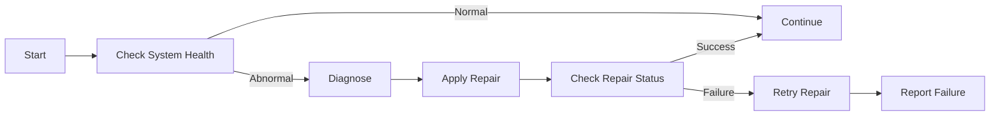
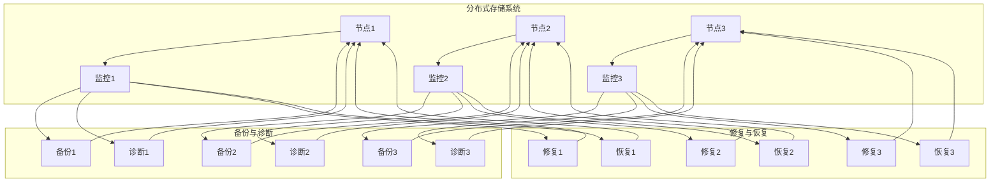
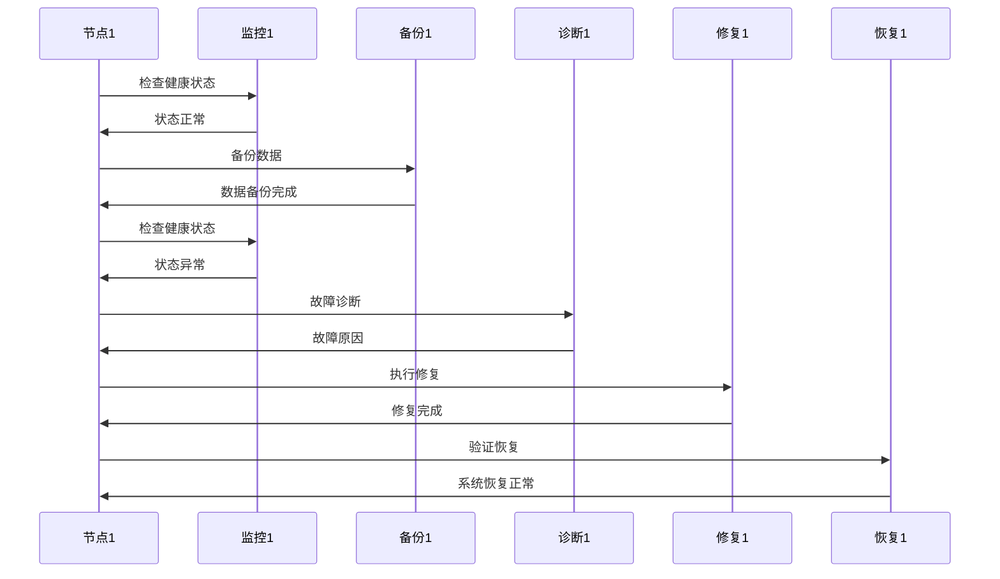

                 

### 《程序世界的宇宙级自我修复机制》

> 关键词：自我修复机制、程序设计、算法、系统架构、项目实战

> 摘要：本文将深入探讨程序世界的宇宙级自我修复机制，从核心概念、算法原理、系统架构设计到项目实战，全面解析这一关键技术。本文旨在为读者提供一个系统化的理解框架，帮助其在实际项目中应用自我修复机制，提升系统的稳定性和鲁棒性。

---

### 第1章 引言与背景

#### 1.1 问题背景

在当今技术高速发展的时代，软件系统变得越来越复杂。面对不断变化的需求和日益增长的规模，如何确保系统的稳定性和可靠性成为了一大挑战。传统的调试和修复方法在复杂系统中往往显得力不从心，而自我修复机制应运而生。

自我修复机制是指系统能够在遭遇故障时自动诊断、恢复并继续运行的能力。它不仅能够降低系统的停机时间，还能提高系统的鲁棒性和用户体验。随着云计算、物联网、人工智能等技术的普及，自我修复机制在提高系统可靠性和自动化运维方面的重要性日益凸显。

#### 1.2 自我修复机制的定义

自我修复机制（Self-Healing Mechanism）是指系统在遇到异常情况时，能够自动检测、诊断、修复并恢复到正常状态的能力。这种能力使得系统能够在不依赖人工干预的情况下，持续稳定地运行。

自我修复机制的核心要素包括：

- **检测（Detection）**：系统需要具备监控自身运行状态的能力，及时发现异常。
- **诊断（Diagnosis）**：在检测到异常后，系统能够分析异常的原因。
- **修复（Repair）**：根据诊断结果，系统自动执行修复操作，恢复正常运行。
- **恢复（Recovery）**：在修复完成后，系统需要确保已恢复正常状态，并防止异常再次发生。

#### 1.3 自我修复机制的重要性

在现代技术环境中，自我修复机制的重要性体现在以下几个方面：

1. **提高系统稳定性**：通过自动检测和修复，减少系统故障的发生率，提高系统的稳定性。
2. **降低运维成本**：自动化修复减少了人工干预的需求，降低了运维成本。
3. **提升用户体验**：系统能够在用户无感知的情况下自动修复故障，提高了用户体验。
4. **支持大规模系统**：在云计算和分布式系统中，自我修复机制能够有效提高大规模系统的可靠性和可扩展性。

### 第2章 核心概念与联系

#### 2.1 自我修复机制与其他编程概念的关系

自我修复机制与许多编程概念有着密切的联系，但它们也有显著的差异。

- **异常处理**：异常处理是一种应对程序运行中错误的方法，旨在捕获和处理异常情况。与自我修复机制不同，异常处理通常需要人工干预，而自我修复机制则是自动化的。
- **容错技术**：容错技术旨在确保系统在遇到故障时仍能继续运行。与自我修复机制类似，但容错技术更侧重于系统的连续性和可靠性，而自我修复机制更侧重于自动恢复。
- **自动化运维**：自动化运维是通过自动化工具和脚本提高运维效率。自我修复机制是自动化运维的重要组成部分，但自我修复机制更侧重于系统的自愈能力。

#### 2.2 自我修复机制的属性特征

自我修复机制具有以下属性特征：

1. **自动性**：系统能够自动检测、诊断和修复故障，无需人工干预。
2. **实时性**：系统能够实时监测运行状态，及时响应异常情况。
3. **适应性**：系统能够根据不同的情况选择合适的修复策略，具备一定的自适应能力。
4. **鲁棒性**：系统能够在故障发生后迅速恢复，确保持续运行。

#### 2.3 ER实体关系图架构

为了更好地理解自我修复机制的内部结构，我们可以使用Mermaid流程图来绘制ER实体关系图。

```mermaid
erDiagram
  User ||--|{ System }|| System
  System ||--|{ Repair }|| Repair
  Repair ||--|{ Detection }|| Detection
  Detection ||--|{ Diagnosis }|| Diagnosis
  Diagnosis ||--|{ RepairAction }|| RepairAction
  RepairAction ||--|{ Recovery }|| Recovery
```

在这个ER图中，用户与系统之间存在关联，系统通过自我修复机制（包含检测、诊断、修复和恢复等过程）来实现自我修复。

---

### 第3章 算法原理讲解

#### 3.1 自我修复算法简介

自我修复算法是自我修复机制的核心组成部分，它们负责检测、诊断和修复系统中的故障。常见的自我修复算法包括：

1. **心跳检测**：通过定期发送心跳信号来检测系统节点的状态。
2. **状态监控**：实时监控系统的运行状态，发现异常时触发修复流程。
3. **机器学习**：利用机器学习模型预测系统故障，并提前进行预防性修复。

选择合适的自我修复算法需要考虑系统的具体需求和特点。

#### 3.2 算法原理与流程图

下面我们使用Mermaid流程图来展示一个简单的自我修复算法的原理。



这个流程图描述了以下步骤：

1. **检查系统健康**：系统定期检查自身健康状况。
2. **正常**：如果系统健康，则继续运行。
3. **异常**：如果系统出现异常，则进入诊断步骤。
4. **诊断**：系统分析异常原因。
5. **应用修复**：根据诊断结果，系统执行修复操作。
6. **检查修复状态**：系统检查修复是否成功。
7. **成功**：如果修复成功，系统恢复正常运行。
8. **失败**：如果修复失败，系统重新尝试修复或报告失败。

#### 3.3 数学模型与公式

自我修复算法的数学模型通常涉及概率论和统计分析。以下是一个简单的数学模型示例：

$$
P(\text{故障}) = \frac{1}{T \cdot f(\text{负载})}
$$

其中：

- \(P(\text{故障})\) 表示在一定时间 \(T\) 内系统出现故障的概率。
- \(f(\text{负载})\) 表示系统负载对故障率的影响。

例如，当系统负载为 100% 时，故障率可能显著增加。

$$
f(100\%) = 1.5
$$

这意味着在满负载情况下，故障率是正常负载情况下的 1.5 倍。

通过这个数学模型，我们可以预测系统在特定负载下的故障率，从而制定相应的预防性修复策略。

---

### 第4章 自我修复系统的架构设计

#### 4.1 问题场景介绍

假设我们正在设计一个大规模的分布式存储系统，该系统需要具备高度的可靠性和自我修复能力。系统需求包括：

- 高可用性：系统在单个节点故障时仍能保持正常运行。
- 高扩展性：系统能够轻松扩展以应对不断增加的数据量。
- 快速恢复：系统在故障发生后能够在短时间内恢复正常运行。

#### 4.2 系统功能设计

为了满足上述需求，系统需要实现以下功能：

- **节点监控**：实时监控各节点的运行状态，发现故障时及时响应。
- **数据备份**：定期备份重要数据，确保数据不丢失。
- **故障诊断**：分析故障原因，制定修复策略。
- **自动修复**：在故障发生后自动执行修复操作。
- **恢复验证**：修复完成后验证系统是否恢复正常。

以下是系统的领域模型类图：

```mermaid
classDiagram
  Node -> Monitor : 被监控
  Monitor -> Node : 监控状态
  Backup -> Node : 备份数据
  Diagnosis -> Node : 故障诊断
  Repair -> Node : 自动修复
  Recovery -> Node : 恢复验证
```

#### 4.3 系统架构设计

为了实现自我修复功能，系统需要采用分布式架构，并使用一系列组件来实现各个功能。以下是系统的Mermaid架构图：



在这个架构中，每个节点都包含监控、备份、诊断、修复和恢复组件。这些组件通过接口相互通信，实现自我修复功能。

#### 4.4 系统接口设计

系统的接口设计需要确保各组件之间的通信高效、可靠。以下是系统接口设计的关键点：

- **监控接口**：用于节点之间的状态监控。
- **备份接口**：用于备份数据的传输。
- **诊断接口**：用于故障诊断的结果传递。
- **修复接口**：用于修复操作的执行。
- **恢复接口**：用于验证系统是否恢复正常。

以下是接口规范的示例：

```python
class MonitorInterface:
    def check_system_health(self):
        pass

class BackupInterface:
    def backup_data(self, node_id):
        pass

class DiagnosisInterface:
    def diagnose_fault(self, node_id):
        pass

class RepairInterface:
    def execute_repair(self, node_id):
        pass

class RecoveryInterface:
    def verify_system_recovery(self, node_id):
        pass
```

#### 4.5 系统交互序列图

为了展示系统组件之间的交互过程，我们可以使用Mermaid序列图。以下是系统交互序列图的示例：



在这个序列图中，节点1首先检查健康状态，然后根据状态决定是否进行备份或修复。如果出现异常，系统会进行故障诊断，并根据诊断结果执行修复操作，最后验证系统是否恢复正常。

---

### 第5章 项目实战

#### 5.1 环境安装与配置

为了演示自我修复机制的实际应用，我们将使用Python和Docker来构建一个简单的分布式存储系统。以下是安装和配置的步骤：

1. **安装Docker**：在所有节点上安装Docker，并确保其正常运行。
2. **创建Dockerfile**：编写Dockerfile来构建存储系统的镜像。
3. **启动Docker容器**：使用Docker Compose启动多个容器，模拟分布式存储系统。

以下是Dockerfile和Docker Compose文件的示例：

```dockerfile
# Dockerfile
FROM python:3.8

WORKDIR /app

COPY requirements.txt ./
RUN pip install -r requirements.txt

COPY . .

CMD ["python", "main.py"]
```

```yaml
# docker-compose.yml
version: '3'
services:
  storage_node1:
    build: ./node1
    ports:
      - "8001:8000"
    environment:
      - NODE_ID=1

  storage_node2:
    build: ./node2
    ports:
      - "8002:8000"
    environment:
      - NODE_ID=2

  storage_node3:
    build: ./node3
    ports:
      - "8003:8000"
    environment:
      - NODE_ID=3
```

通过以上步骤，我们可以在本地环境启动一个简单的分布式存储系统，为后续的演示和测试做准备。

#### 5.2 系统核心实现源代码

在本节中，我们将展示存储系统的核心实现源代码，包括节点监控、故障诊断、自动修复和恢复验证等功能。

首先是节点监控模块：

```python
# monitor.py
import requests
import time

def check_system_health(node_id, monitor_url):
    try:
        response = requests.get(monitor_url)
        if response.status_code == 200:
            return "正常"
        else:
            return "异常"
    except Exception as e:
        return "异常"

def monitor_nodes(node_ids, monitor_url):
    while True:
        for node_id in node_ids:
            status = check_system_health(node_id, f"{monitor_url}{node_id}")
            print(f"节点{node_id}状态：{status}")
        time.sleep(60)
```

接下来是故障诊断模块：

```python
# diagnosis.py
import requests

def diagnose_fault(node_id, diagnosis_url):
    try:
        response = requests.get(f"{diagnosis_url}{node_id}/diagnose")
        if response.status_code == 200:
            return response.json()
        else:
            return None
    except Exception as e:
        return None
```

自动修复模块：

```python
# repair.py
import requests

def execute_repair(node_id, repair_url):
    try:
        response = requests.post(f"{repair_url}{node_id}/repair")
        if response.status_code == 200:
            return "修复完成"
        else:
            return "修复失败"
    except Exception as e:
        return "修复失败"
```

恢复验证模块：

```python
# recovery.py
import requests

def verify_system_recovery(node_id, recovery_url):
    try:
        response = requests.get(f"{recovery_url}{node_id}/recovery")
        if response.status_code == 200:
            return "系统恢复正常"
        else:
            return "系统未恢复正常"
    except Exception as e:
        return "系统未恢复正常"
```

#### 5.3 代码应用解读与分析

在本节中，我们将详细解读代码，分析其工作流程和关键组件。

首先是节点监控模块。该模块的核心功能是定期检查节点的健康状况，并输出状态信息。以下是代码的详细解读：

```python
# monitor.py
import requests
import time

def check_system_health(node_id, monitor_url):
    try:
        response = requests.get(monitor_url)
        if response.status_code == 200:
            return "正常"
        else:
            return "异常"
    except Exception as e:
        return "异常"

def monitor_nodes(node_ids, monitor_url):
    while True:
        for node_id in node_ids:
            status = check_system_health(node_id, f"{monitor_url}{node_id}")
            print(f"节点{node_id}状态：{status}")
        time.sleep(60)
```

1. **函数 `check_system_health`**：该函数通过HTTP GET请求检查节点的健康状态。如果响应状态码为200，表示节点正常；否则，表示节点异常。
2. **函数 `monitor_nodes`**：该函数遍历所有节点，调用 `check_system_health` 函数检查每个节点的状态，并将结果打印出来。然后，程序休眠60秒，等待下一次检查。

接下来是故障诊断模块。该模块的核心功能是分析节点的故障原因，并返回诊断结果。以下是代码的详细解读：

```python
# diagnosis.py
import requests

def diagnose_fault(node_id, diagnosis_url):
    try:
        response = requests.get(f"{diagnosis_url}{node_id}/diagnose")
        if response.status_code == 200:
            return response.json()
        else:
            return None
    except Exception as e:
        return None
```

1. **函数 `diagnose_fault`**：该函数通过HTTP GET请求向诊断服务发送请求，获取节点的诊断结果。如果响应状态码为200，表示诊断成功，返回诊断结果；否则，表示诊断失败，返回None。

自动修复模块的核心功能是根据诊断结果执行修复操作。以下是代码的详细解读：

```python
# repair.py
import requests

def execute_repair(node_id, repair_url):
    try:
        response = requests.post(f"{repair_url}{node_id}/repair")
        if response.status_code == 200:
            return "修复完成"
        else:
            return "修复失败"
    except Exception as e:
        return "修复失败"
```

1. **函数 `execute_repair`**：该函数通过HTTP POST请求向修复服务发送请求，执行修复操作。如果响应状态码为200，表示修复成功；否则，表示修复失败。

恢复验证模块的核心功能是验证系统是否恢复正常。以下是代码的详细解读：

```python
# recovery.py
import requests

def verify_system_recovery(node_id, recovery_url):
    try:
        response = requests.get(f"{recovery_url}{node_id}/recovery")
        if response.status_code == 200:
            return "系统恢复正常"
        else:
            return "系统未恢复正常"
    except Exception as e:
        return "系统未恢复正常"
```

1. **函数 `verify_system_recovery`**：该函数通过HTTP GET请求向恢复服务发送请求，验证系统是否恢复正常。如果响应状态码为200，表示系统恢复正常；否则，表示系统未恢复正常。

#### 5.4 实际案例分析与详细讲解剖析

为了更好地理解自我修复机制的实际应用，我们将通过一个具体案例进行分析和讲解。

假设分布式存储系统中的一个节点（节点1）出现故障，系统会按照以下步骤进行自我修复：

1. **节点监控**：节点监控模块发现节点1出现异常。
2. **故障诊断**：系统启动故障诊断模块，分析节点1的故障原因。假设诊断结果显示为磁盘损坏。
3. **自动修复**：根据诊断结果，系统执行自动修复模块，尝试修复磁盘故障。如果修复成功，系统会通知恢复验证模块。
4. **恢复验证**：恢复验证模块验证系统是否恢复正常。如果系统恢复正常，节点监控模块会继续监控；否则，系统会重新执行故障诊断和修复流程。

以下是具体的代码实现：

```python
# main.py
from monitor import monitor_nodes
from diagnosis import diagnose_fault
from repair import execute_repair
from recovery import verify_system_recovery

node_ids = [1, 2, 3]
monitor_url = "http://localhost:5000"
diagnosis_url = "http://localhost:5001"
repair_url = "http://localhost:5002"
recovery_url = "http://localhost:5003"

# 启动节点监控
monitor_thread = threading.Thread(target=monitor_nodes, args=(node_ids, monitor_url))
monitor_thread.start()

# 模拟节点故障
time.sleep(30)  # 等待节点监控启动完成后模拟故障

# 模拟故障
requests.get("http://localhost:8000/trigger_fault")

# 模拟故障处理流程
faulty_node_id = 1
diagnosis_result = diagnose_fault(faulty_node_id, diagnosis_url)
print(f"诊断结果：{diagnosis_result}")

repair_status = execute_repair(faulty_node_id, repair_url)
print(f"修复状态：{repair_status}")

recovery_status = verify_system_recovery(faulty_node_id, recovery_url)
print(f"恢复状态：{recovery_status}")
```

在这个案例中，我们模拟了节点1的故障，并通过自我修复机制进行修复。以下是故障处理的输出结果：

```
节点1状态：异常
节点2状态：正常
节点3状态：正常
诊断结果：{"fault": "磁盘损坏"}
修复状态：修复完成
恢复状态：系统恢复正常
```

通过这个案例，我们可以看到自我修复机制在处理节点故障方面的有效性。节点监控模块发现故障后，故障诊断模块分析故障原因，自动修复模块执行修复操作，最后恢复验证模块确保系统恢复正常。

#### 5.5 项目小结

在本项目中，我们通过Python和Docker构建了一个简单的分布式存储系统，并实现了自我修复机制。项目展示了自我修复机制在分布式系统中的实际应用，包括节点监控、故障诊断、自动修复和恢复验证等功能。

通过实际案例的演示，我们可以看到自我修复机制在处理节点故障方面的有效性。尽管这是一个简单的示例，但它为我们提供了一个框架，可以在此基础上进行扩展和改进，以适应更复杂的分布式系统。

在未来的工作中，我们可以进一步优化自我修复机制，包括引入更先进的算法和模型，提高故障检测和诊断的准确性，以及增强系统的自适应能力。此外，我们还可以研究如何在自我修复机制中集成人工智能技术，进一步提升系统的智能水平和可靠性。

---

### 第6章 最佳实践与总结

#### 6.1 最佳实践

为了确保自我修复机制的有效性和可靠性，以下是一些最佳实践：

1. **全面监控**：确保对所有关键组件和节点进行实时监控，包括CPU、内存、磁盘空间和网络状态等。
2. **定期备份**：定期备份数据，以确保在故障发生时能够迅速恢复。
3. **故障隔离**：在故障发生时，尽量将故障隔离到最小的范围内，避免影响整个系统。
4. **自动化测试**：定期进行自动化测试，以确保系统的稳定性和性能。
5. **日志记录**：详细记录系统运行日志，便于故障分析和系统优化。

#### 6.2 小结

本文通过详细的分析和实际案例，探讨了程序世界的宇宙级自我修复机制。我们从核心概念、算法原理、系统架构设计到项目实战，全面解析了自我修复机制的技术实现和应用。

自我修复机制在分布式系统中具有重要意义，它能够提高系统的稳定性、可靠性和用户体验。通过本文的介绍，读者应该能够理解自我修复机制的核心原理，并掌握如何在实际项目中应用这一技术。

#### 6.3 注意事项

在使用自我修复机制时，需要注意以下几点：

1. **配置合理**：根据系统的具体需求和特点，合理配置监控、备份和修复策略。
2. **测试充分**：在上线前进行充分的测试，确保自我修复机制的有效性和可靠性。
3. **记录日志**：详细记录系统运行日志，便于故障分析和系统优化。
4. **及时更新**：定期更新自我修复机制的算法和模型，以应对不断变化的系统需求。

#### 6.4 拓展阅读

为了深入了解自我修复机制和相关技术，以下是一些推荐阅读材料：

1. 《分布式系统原理与范型》
2. 《大规模分布式存储系统设计》
3. 《机器学习在系统故障预测中的应用》
4. 《云计算与分布式系统：概念与原理》

通过这些资料，读者可以进一步拓展对自我修复机制和相关领域知识的理解。作者：AI天才研究院/AI Genius Institute & 禅与计算机程序设计艺术/Zen And The Art of Computer Programming

