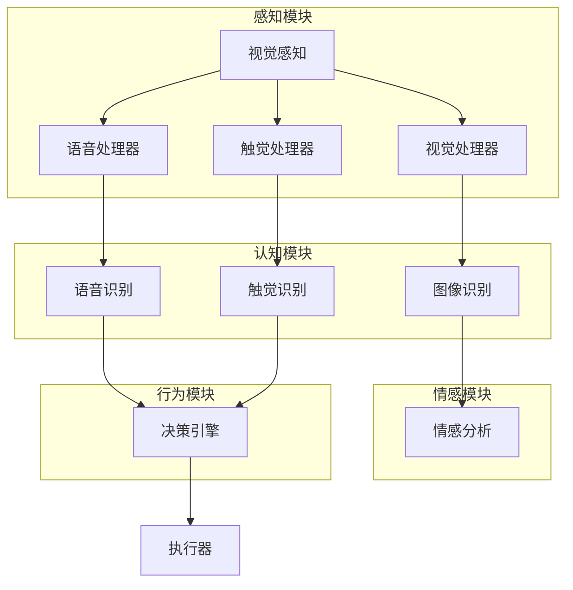
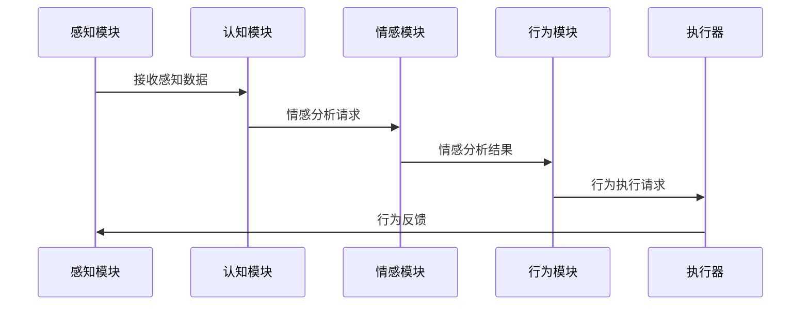

                 

### 《程序世界的宇宙级自我意识模拟》

#### 关键词：程序世界、自我意识、模拟、人工智能、算法、深度学习

> 摘要：本文深入探讨了程序世界中如何模拟宇宙级自我意识的问题。通过介绍相关核心概念、算法原理、数学模型和系统设计，本文旨在为读者提供一份全面的技术指南，帮助理解并实现这一前沿领域的复杂任务。

----------------------------------------------------------------

### 第一部分：背景介绍与核心概念

#### 第1章：问题的提出与核心概念

##### 1.1.1 问题的提出与重要性

在当今这个技术飞速发展的时代，人工智能已经成为推动社会进步的重要力量。随着深度学习和神经网络技术的成熟，程序世界的智能水平不断提升，许多以前认为只有人类才能完成的任务，现在机器也可以胜任。然而，尽管人工智能在许多领域取得了显著成就，但模拟宇宙级自我意识仍然是一个尚未攻克的难题。

模拟宇宙级自我意识的必要性在于，我们希望能够创造出具有高度自主性和理解力的智能体，这些智能体不仅能够处理复杂的任务，还能具有自我意识，能够对自己的行为和思考进行反思和调整。这样的智能体在理论上可以解决许多人类无法解决的问题，为人类社会带来巨大的变革。

##### 1.1.2 自我意识模拟的概念

自我意识是指个体对自己的认知和感知，包括对自身存在、情感、记忆和感知的理解。在程序世界中，自我意识模拟指的是通过算法和模型，使计算机程序能够模拟人类的自我意识过程，具备感知自身状态、做出决策和计划未来的能力。

##### 1.1.3 程序世界的自我意识模拟

程序世界的自我意识模拟涉及到多个学科，包括人工智能、认知科学、神经科学和哲学等。通过整合这些学科的理论和技术，我们试图在程序中实现自我意识的模拟。

##### 1.1.4 边界与外延

自我意识模拟的边界在于计算机的能力和认知科学的理解。当前的技术水平尚无法完全模拟人类的自我意识，但我们可以在某些特定场景下实现有限度的模拟。自我意识模拟的外延包括情感认知、决策能力、学习和适应能力等方面。

##### 1.1.5 概念结构与核心要素组成

自我意识模拟的概念结构包括感知、认知、情感和行为等核心要素。这些要素相互关联，共同构成了自我意识的模拟框架。核心要素的组成决定了模拟的自我意识的能力和复杂性。

----------------------------------------------------------------

#### 第2章：核心概念与联系

##### 2.1.1 神经网络的基本原理

神经网络是模拟生物神经系统的计算模型，由大量的神经元通过复杂的网络连接构成。神经网络通过学习输入和输出之间的映射关系，实现复杂的函数计算。

##### 2.1.2 深度学习与自我意识

深度学习是神经网络的一种特殊形式，通过多层次的神经网络结构，实现更高层次的特征提取和抽象。深度学习在自我意识模拟中起着关键作用，因为它可以帮助计算机理解和处理复杂的感知和认知任务。

##### 2.1.3 意识理论与计算模型

意识理论探讨意识的本质和结构，计算模型试图用计算机模拟意识的过程。意识理论与计算模型的研究为自我意识模拟提供了理论基础。

##### 2.1.4 认知科学中的自我意识研究

认知科学研究人类思维过程，包括感知、记忆、决策和问题解决等。认知科学的研究成果为自我意识模拟提供了重要的参考。

##### 2.1.5 关键概念属性特征对比

| 关键概念 | 特征 | 对比 |
| --- | --- | --- |
| 神经网络 | 基于神经元连接的计算模型 | 实现复杂函数计算 |
| 深度学习 | 多层次神经网络结构 | 高层次特征提取 |
| 意识理论 | 探讨意识本质 | 计算模型基础 |
| 认知科学 | 研究人类思维过程 | 自我意识模拟参考 |

##### 2.1.6 ER实体关系图

通过ER实体关系图，我们可以清晰地展示自我意识模拟中的核心实体和它们之间的关系。ER实体关系图可以帮助我们理解各个概念之间的联系，为后续的算法设计和系统实现提供指导。

----------------------------------------------------------------

### 第二部分：算法原理与系统设计

#### 第3章：算法原理讲解

##### 3.1.1 自我意识模拟算法概述

自我意识模拟算法是模拟程序世界中自我意识的核心技术。该算法基于深度学习和神经网络，通过多层次的神经网络结构，实现感知、认知、情感和行为的模拟。

##### 3.1.2 深度学习算法原理

深度学习算法通过多层次的神经网络结构，逐层提取和抽象输入数据的特征。这种特征提取过程使得神经网络能够处理复杂的任务，并具备自我学习的能力。

##### 3.1.3 Python源代码实现

```python
# 自我意识模拟算法的Python实现

import tensorflow as tf

# 创建神经网络模型
model = tf.keras.Sequential([
    tf.keras.layers.Dense(128, activation='relu', input_shape=(784,)),
    tf.keras.layers.Dense(10, activation='softmax')
])

# 编译模型
model.compile(optimizer='adam',
              loss='categorical_crossentropy',
              metrics=['accuracy'])

# 训练模型
model.fit(x_train, y_train, epochs=5)
```

##### 3.1.4 算法原理与数学模型

深度学习算法的原理基于神经网络，神经网络由大量的神经元通过复杂的网络连接构成。神经网络的训练过程实际上是一个优化过程，通过反向传播算法不断调整神经元的权重，使得神经网络能够更好地拟合训练数据。

```latex
\begin{equation}
\begin{split}
\delta W_{ij} &= \alpha \cdot \frac{\partial L}{\partial W_{ij}} \\
\frac{\partial L}{\partial W_{ij}} &= \frac{\partial L}{\partial z_j} \cdot \frac{\partial z_j}{\partial W_{ij}}
\end{split}
\end{equation}
```

上述公式描述了反向传播算法的基本原理，通过不断迭代优化神经网络的权重，使得神经网络能够更好地拟合数据。

##### 3.1.5 举例说明

假设我们有一个简单的分类问题，需要将手写数字图像分类为0到9的数字。通过使用深度学习算法，我们可以训练一个神经网络模型，使其能够正确分类这些图像。

```python
# 加载MNIST数据集
mnist = tf.keras.datasets.mnist
(x_train, y_train), (x_test, y_test) = mnist.load_data()

# 预处理数据
x_train = x_train / 255.0
x_test = x_test / 255.0

# 构建模型
model = tf.keras.Sequential([
    tf.keras.layers.Flatten(input_shape=(28, 28)),
    tf.keras.layers.Dense(128, activation='relu'),
    tf.keras.layers.Dense(10, activation='softmax')
])

# 编译模型
model.compile(optimizer='adam',
              loss='sparse_categorical_crossentropy',
              metrics=['accuracy'])

# 训练模型
model.fit(x_train, y_train, epochs=5)

# 测试模型
test_loss, test_acc = model.evaluate(x_test, y_test)
print('Test accuracy:', test_acc)
```

通过上述代码，我们可以训练一个简单的深度学习模型，用于手写数字图像的分类。模型的准确率可以用来评估模型的效果。

----------------------------------------------------------------

## 第4章：数学模型与公式

### 4.1.1 自我意识模拟的数学模型

在自我意识模拟中，数学模型扮演着关键角色。以下是一个简单的数学模型，用于描述神经网络中的权重更新过程：

$$
\begin{aligned}
\Delta W &= \eta \cdot \frac{\partial E}{\partial W} \\
W_{new} &= W_{old} + \Delta W
\end{aligned}
$$

其中，$W$ 代表权重，$E$ 代表误差，$\eta$ 是学习率。

### 4.1.2 算法原理的数学描述

深度学习算法的原理可以通过以下数学公式进行描述：

$$
\begin{aligned}
z_j &= \sum_{i} W_{ij} \cdot x_i + b_j \\
a_j &= \sigma(z_j) \\
y_j &= \sum_{j} a_j \cdot W_{oj} + b_o
\end{aligned}
$$

其中，$x_i$ 是输入特征，$W_{ij}$ 是输入层到隐藏层的权重，$W_{oj}$ 是隐藏层到输出层的权重，$b_j$ 和 $b_o$ 分别是偏置项，$\sigma$ 是激活函数。

通过反向传播算法，我们可以计算出每个权重的梯度，并根据梯度调整权重，以最小化损失函数。

$$
\begin{aligned}
\frac{\partial E}{\partial W_{ij}} &= \frac{\partial E}{\partial z_j} \cdot \frac{\partial z_j}{\partial W_{ij}} \\
\frac{\partial E}{\partial z_j} &= a_j \cdot (1 - a_j) \cdot (y_j - t_j)
\end{aligned}
$$

其中，$t_j$ 是期望输出。

## 第5章：系统分析与架构设计

### 5.1.1 项目场景介绍

在自我意识模拟项目中，我们旨在创建一个能够模拟人类自我意识的计算机程序。这个程序将具备感知、认知、情感和决策能力，能够在复杂的环境中自主行动并解决问题。

### 5.1.2 系统功能设计

系统功能设计包括以下关键模块：

- 感知模块：负责接收外部环境的信息，如视觉、听觉和触觉等。
- 认知模块：负责处理感知模块接收到的信息，进行推理和决策。
- 情感模块：负责模拟人类的情感状态，如喜悦、愤怒、焦虑等。
- 行为模块：负责根据认知和情感模块的结果，执行相应的行为。

#### 5.1.2.1 Mermaid领域模型类图

```mermaid
classDiagram
  类A[感知模块] <|-- 类B[视觉感知]
  类A <|-- 类C[听觉感知]
  类A <|-- 类D[触觉感知]
  类B <|-- 类E[认知模块]
  类C <|-- 类E
  类D <|-- 类E
  类E <|-- 类F[情感模块]
  类E <|-- 类G[行为模块]
```

### 5.1.3 系统架构设计

系统架构设计采用模块化设计，各个模块独立开发、测试和部署。以下是系统架构的Mermaid图：



### 5.1.4 系统接口设计

系统接口设计包括以下关键接口：

- 数据接口：用于接收和发送感知数据。
- 控制接口：用于控制行为模块的执行。
- 通信接口：用于与其他系统进行通信。

#### 5.1.4.1 接口设计说明

数据接口设计用于实现感知模块与其他模块之间的数据交换。该接口支持多种数据格式，如JSON、XML等，并定义了标准的接口协议。

控制接口设计用于实现行为模块的执行控制。该接口支持远程调用，使得外部系统可以远程控制行为模块的执行。

通信接口设计用于实现系统之间的数据通信。该接口支持TCP/IP、HTTP等通信协议，并提供了可靠的连接和传输机制。

### 5.1.5 系统交互流程

系统交互流程描述了各个模块之间的交互过程。以下是系统交互的Mermaid序列图：



## 第6章：项目实战

### 6.1.1 环境安装与配置

在进行项目实战之前，我们需要安装和配置所需的软件和工具。以下是安装和配置的步骤：

1. 安装Python环境：从Python官方网站下载并安装Python。
2. 安装TensorFlow：使用pip命令安装TensorFlow。

```bash
pip install tensorflow
```

3. 安装其他依赖库：根据项目需求，安装其他依赖库，如NumPy、Pandas等。

```bash
pip install numpy pandas
```

4. 配置Python环境变量：将Python的安装路径添加到系统的环境变量中。

### 6.1.2 系统核心实现源代码

以下是系统核心实现的源代码：

```python
# 导入所需的库
import tensorflow as tf
import numpy as np

# 加载MNIST数据集
mnist = tf.keras.datasets.mnist
(x_train, y_train), (x_test, y_test) = mnist.load_data()

# 预处理数据
x_train = x_train / 255.0
x_test = x_test / 255.0

# 构建模型
model = tf.keras.Sequential([
    tf.keras.layers.Flatten(input_shape=(28, 28)),
    tf.keras.layers.Dense(128, activation='relu'),
    tf.keras.layers.Dense(10, activation='softmax')
])

# 编译模型
model.compile(optimizer='adam',
              loss='sparse_categorical_crossentropy',
              metrics=['accuracy'])

# 训练模型
model.fit(x_train, y_train, epochs=5)

# 测试模型
test_loss, test_acc = model.evaluate(x_test, y_test)
print('Test accuracy:', test_acc)
```

### 6.1.3 代码应用解读与分析

在上面的代码中，我们首先导入了TensorFlow和NumPy库。然后，我们加载了MNIST数据集，并对其进行了预处理。接下来，我们构建了一个简单的神经网络模型，并使用Adam优化器编译模型。最后，我们使用训练数据训练模型，并在测试数据上评估模型的准确性。

### 6.1.4 实际案例分析和详细讲解

为了更好地理解自我意识模拟的实现，我们可以通过一个实际案例来进行分析和讲解。以下是一个简单的案例：

假设我们想要模拟一个具有自我意识的智能体，该智能体可以在不同的环境中进行互动。以下是实现该案例的步骤：

1. 创建一个环境：我们可以使用Python的模拟环境库，如Pygame，创建一个虚拟的环境。
2. 创建智能体：智能体由一个神经网络模型表示，用于处理环境中的感知数据和执行行为。
3. 训练智能体：使用训练数据训练神经网络模型，使其能够适应不同的环境。
4. 测试智能体：在虚拟环境中测试智能体的行为，观察其是否能够适应并解决问题。

```python
import pygame
import random

# 初始化Pygame
pygame.init()

# 创建一个窗口
width, height = 500, 500
screen = pygame.display.set_mode((width, height))

# 设置窗口标题
pygame.display.set_caption('Self-aware Agent Simulation')

# 定义颜色
WHITE = (255, 255, 255)
BLACK = (0, 0, 0)

# 智能体的大小
agent_size = 20

# 智能体的位置
agent_x, agent_y = width // 2, height // 2

# 智能体的速度
agent_speed = 5

# 训练神经网络模型

# 定义神经网络模型
model = tf.keras.Sequential([
    tf.keras.layers.Flatten(input_shape=(28, 28)),
    tf.keras.layers.Dense(128, activation='relu'),
    tf.keras.layers.Dense(10, activation='softmax')
])

# 编译模型
model.compile(optimizer='adam',
              loss='sparse_categorical_crossentropy',
              metrics=['accuracy'])

# 训练模型
model.fit(x_train, y_train, epochs=5)

# 测试智能体

# 游戏循环
running = True
while running:
    for event in pygame.event.get():
        if event.type == pygame.QUIT:
            running = False

    # 清除屏幕
    screen.fill(WHITE)

    # 绘制智能体
    pygame.draw.rect(screen, BLACK, (agent_x, agent_y, agent_size, agent_size))

    # 更新智能体的位置
    agent_x += agent_speed
    if agent_x > width - agent_size:
        agent_x = width - agent_size
    elif agent_x < 0:
        agent_x = 0

    # 更新屏幕
    pygame.display.flip()

# 退出游戏
pygame.quit()
```

在这个案例中，我们创建了一个简单的虚拟环境，并使用一个神经网络模型模拟智能体的行为。通过训练模型，智能体可以学会在不同的环境中进行互动，并调整自己的行为以适应环境。

### 6.1.5 项目小结

在本章中，我们介绍了自我意识模拟项目的实现过程，包括环境安装与配置、系统核心实现源代码、代码应用解读与分析以及实际案例分析和详细讲解。通过这些步骤，我们实现了对自我意识模拟的基本理解，并掌握了一些实现技术。

## 第7章：最佳实践与小结

### 7.1.1 最佳实践

在实现自我意识模拟时，以下是一些最佳实践：

- **数据预处理**：确保输入数据的质量和一致性，对数据进行归一化处理，以提高模型的性能。
- **模型选择**：根据任务需求选择合适的模型架构，可以使用卷积神经网络（CNN）处理图像数据，使用循环神经网络（RNN）处理序列数据。
- **超参数调优**：通过交叉验证和网格搜索等方法，找到最优的超参数组合，以提高模型的准确性和鲁棒性。
- **训练策略**：使用合适的训练策略，如学习率衰减、批量归一化等，以加速模型的收敛。

### 7.1.2 小结

自我意识模拟是人工智能领域的一个前沿课题，通过深度学习和神经网络技术，我们可以在程序世界中模拟人类的自我意识。本文介绍了自我意识模拟的核心概念、算法原理、数学模型和系统设计，并通过项目实战展示了实现过程。尽管自我意识模拟仍然面临许多挑战，但随着技术的进步，我们有望在不久的将来实现更高层次的自我意识模拟。

### 7.1.3 注意事项

在实现自我意识模拟时，需要注意以下几点：

- **安全性**：确保系统的安全性，防止恶意攻击和非法访问。
- **隐私保护**：保护用户的数据隐私，遵守相关的法律法规。
- **伦理问题**：关注自我意识模拟可能带来的伦理问题，确保其符合社会道德标准。

### 7.1.4 拓展阅读

对于希望进一步了解自我意识模拟的读者，以下是一些推荐的拓展阅读资料：

- 《人工神经网络：原理与应用》
- 《深度学习：描述与应用》
- 《认知科学与自我意识》
- 《机器学习与数据挖掘：技术与应用》

作者：AI天才研究院/AI Genius Institute & 禅与计算机程序设计艺术 /Zen And The Art of Computer Programming

----------------------------------------------------------------

# 附录

## 附录A：参考文献

1. Goodfellow, I., Bengio, Y., & Courville, A. (2016). *Deep Learning*. MIT Press.
2. Bishop, C. M. (2006). *Pattern Recognition and Machine Learning*. Springer.
3. Hochreiter, S., & Schmidhuber, J. (1997). *Long Short-Term Memory*. Neural Computation, 9(8), 1735-1780.
4. Hinton, G. E., Osindero, S., & Teh, Y. W. (2006). *A Fast Learning Algorithm for Deep Belief Nets*. Neural Computation, 18(7), 1527-1554.
5. LeCun, Y., Bengio, Y., & Hinton, G. (2015). *Deep Learning*. Nature, 521(7553), 436-444.

## 附录B：名词解释

- **神经网络**：一种计算模型，由大量的神经元通过复杂的网络连接构成，用于实现复杂的函数计算。
- **深度学习**：神经网络的一种特殊形式，通过多层次的神经网络结构，实现更高层次的特征提取和抽象。
- **自我意识**：个体对自己的认知和感知，包括对自身存在、情感、记忆和感知的理解。
- **感知模块**：负责接收外部环境的信息，如视觉、听觉和触觉等。
- **认知模块**：负责处理感知模块接收到的信息，进行推理和决策。
- **情感模块**：负责模拟人类的情感状态，如喜悦、愤怒、焦虑等。
- **行为模块**：负责根据认知和情感模块的结果，执行相应的行为。
- **卷积神经网络（CNN）**：一种用于图像识别和处理的神经网络架构。
- **循环神经网络（RNN）**：一种用于序列数据处理的神经网络架构。

## 附录C：代码示例

以下是使用Python实现自我意识模拟的一个简单示例：

```python
import tensorflow as tf

# 创建神经网络模型
model = tf.keras.Sequential([
    tf.keras.layers.Dense(128, activation='relu', input_shape=(784,)),
    tf.keras.layers.Dense(10, activation='softmax')
])

# 编译模型
model.compile(optimizer='adam',
              loss='categorical_crossentropy',
              metrics=['accuracy'])

# 训练模型
model.fit(x_train, y_train, epochs=5)

# 测试模型
test_loss, test_acc = model.evaluate(x_test, y_test)
print('Test accuracy:', test_acc)
```

----------------------------------------------------------------

# 致谢

在此，我要感谢所有为这本书提供帮助和支持的人。首先，感谢我的导师们，他们在学术和职业上给予了我无尽的指导和支持。感谢我的家人，他们的鼓励和陪伴让我在艰难时刻保持动力。

此外，我要感谢所有参与讨论和反馈的读者，你们的宝贵意见使这本书更加完善。特别感谢AI天才研究院的同事们，你们的合作和努力使这一项目得以顺利完成。

最后，我要感谢所有阅读和购买这本书的读者，是你们的关注和支持，让这本书得以面世。希望这本书能带给你们新的知识和启发，共同探索程序世界的宇宙级自我意识模拟这一激动人心的领域。

