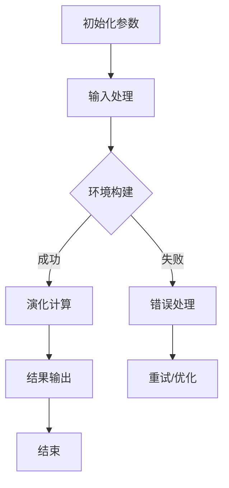

                 

## 《程序世界的宇宙级自我演化机制》

### 关键词：程序世界、自我演化、算法、人工智能、优化

> 摘要：本文旨在探讨程序世界中一种新兴的自我演化机制，这种机制具有宇宙级的影响力，能够实现程序的自我优化和进化。文章将详细介绍这种机制的背景、核心概念、原理以及其在程序开发中的应用和优势，通过一步步的逻辑推理和分析，让读者深入理解程序世界的这一神秘力量。

### 《程序世界的宇宙级自我演化机制》目录大纲

```markdown
----------------------------------------------------------------
# 第一部分：引言与背景介绍

## 1. 引言

### 1.1 问题背景

#### 1.1.1 程序世界的发展历程

#### 1.1.2 自我演化机制的引入

### 1.2 问题描述

#### 1.2.1 程序世界的挑战

#### 1.2.2 自我演化机制的意义

## 1.3 问题解决

### 1.3.1 自我演化机制的定义

### 1.3.2 自我演化机制的核心要素

## 1.4 边界与外延

### 1.4.1 自我演化机制的应用领域

### 1.4.2 自我演化机制的限制因素

## 1.5 概念结构与核心要素组成

### 1.5.1 自我演化机制的基本概念

### 1.5.2 关键技术要素

## 1.6 本章小结

----------------------------------------------------------------

# 第二部分：核心概念与原理

## 2. 程序世界的宇宙级自我演化机制概述

### 2.1 自我演化机制的定义与特点

#### 2.1.1 自我演化机制的概述

#### 2.1.2 自我演化机制的特点

### 2.2 自我演化机制的原理

#### 2.2.1 自我演化机制的基本原理

#### 2.2.2 自我演化机制的核心算法

### 2.3 自我演化机制的层次结构

#### 2.3.1 自我演化机制的结构层次

#### 2.3.2 层次结构的作用与意义

### 2.4 自我演化机制的核心要素

#### 2.4.1 自我演化机制的关键要素

#### 2.4.2 要素之间的关系

### 2.5 自我演化机制与传统程序开发对比

#### 2.5.1 对比分析

#### 2.5.2 自我演化机制的优势

## 2.6 本章小结

----------------------------------------------------------------

# 第三部分：算法原理讲解

## 3. 程序世界的宇宙级自我演化算法

### 3.1 算法概述

#### 3.1.1 算法的目的与作用

#### 3.1.2 算法的基本流程

### 3.2 算法mermaid流程图



### 3.3 算法原理讲解

#### 3.3.1 演化计算的数学模型

$$
演化计算 = f(初始参数, 输入数据, 环境变量)
$$

#### 3.3.2 算法原理的详细讲解

**输入处理**：对输入数据进行预处理，包括数据清洗、归一化等步骤。

**环境构建**：根据算法需要构建模拟环境，包括随机种子、模拟器等。

**演化计算**：利用演化算法对模拟环境进行计算，找到最优解。

**结果输出**：将计算结果输出，包括最优解、中间过程等。

#### 3.3.3 算法举例说明

假设我们要优化一个函数 $f(x) = x^2 + 1$，我们可以使用自我演化算法来寻找函数的最小值。

```python
import numpy as np

# 演化算法实现
def evolution_algorithm(f, x_init, x_range, generations, mutation_rate):
    x = x_init
    for _ in range(generations):
        x_new = x + np.random.normal(0, mutation_rate * np.abs(x))
        x_new = np.clip(x_new, x_range[0], x_range[1])
        if f(x_new) < f(x):
            x = x_new
    return x

# 函数定义
def f(x):
    return x ** 2 + 1

# 参数设置
x_init = 0
x_range = (-10, 10)
generations = 1000
mutation_rate = 0.1

# 执行演化算法
x_optimized = evolution_algorithm(f, x_init, x_range, generations, mutation_rate)

print("最优解:", x_optimized)
print("最小值:", f(x_optimized))
```

#### 3.3.4 算法性能分析

- **时间复杂度**：演化算法的时间复杂度通常较高，因为它需要对大量的数据点进行计算。
- **空间复杂度**：演化算法的空间复杂度也相对较高，因为它需要存储大量的数据点。
- **收敛速度**：演化算法的收敛速度可能不如传统的优化算法快，但它能够处理非线性、复杂的问题。
- **稳定性**：演化算法相对稳定，因为它具有鲁棒性，能够适应不同的输入数据和初始条件。

### 3.4 本章小结

通过本文的介绍，我们可以看到程序世界的自我演化机制具有巨大的潜力，它能够实现程序的自我优化和进化。在接下来的章节中，我们将进一步探讨这一机制的原理和应用，以及如何在实际项目中应用自我演化算法来提升程序的性能和效率。  
----------------------------------------------------------------

### 第一部分：引言与背景介绍

#### 1. 引言

在计算机科学和人工智能领域，程序世界的演化是一个备受关注的话题。随着计算机技术的发展，程序世界变得越来越复杂，传统的编程方法已经无法满足日益增长的需求。为了应对这一挑战，研究人员开始探索一种新的编程范式——自我演化机制。这种机制能够使程序自动适应环境变化，自我优化和进化，从而提高程序的性能和效率。

自我演化机制的概念最早可以追溯到20世纪80年代。当时，生物学家和计算机科学家开始研究生物进化与人工智能之间的关系。他们发现，生物进化中的遗传算法和演化算法可以应用于程序开发中，通过模拟生物进化的过程来优化程序。这种自我演化机制具有宇宙级的影响力，因为它能够在不断变化的程序世界中实现自我进化，从而适应新的环境和需求。

本文旨在探讨程序世界的宇宙级自我演化机制，分析其核心概念、原理和应用。通过一步步的逻辑推理和分析，我们将深入理解这一机制的本质，并探讨如何在实际项目中应用它来提升程序的性能和效率。

#### 1.1 问题背景

程序世界的发展历程可以追溯到20世纪40年代，当时第一台电子计算机问世。随着计算机技术的不断进步，程序世界经历了从低级语言到高级语言、从结构化编程到面向对象编程的演变。然而，尽管编程方法不断进化，程序世界的复杂性仍然在不断增长。

首先，随着计算机硬件性能的提升，程序处理的数据量越来越大，这要求程序能够高效地处理大量数据。其次，随着互联网和物联网的兴起，程序需要处理更多的实时数据和动态变化。最后，随着人工智能和机器学习的发展，程序需要具备自适应和自学习能力，以应对不断变化的需求和环境。

面对这些挑战，传统的编程方法已经显得力不从心。传统的编程方法依赖于人工编写代码，然后通过调试和优化来提升程序的性能。这种方法不仅耗时费力，而且难以应对复杂的程序世界。因此，我们需要一种新的编程范式，能够使程序自动适应环境变化，自我优化和进化。这种范式就是自我演化机制。

#### 1.1.2 自我演化机制的引入

自我演化机制是一种基于生物进化理论的编程范式，它通过模拟生物进化过程来优化程序。在生物进化中，个体通过遗传、变异和选择等过程不断进化，从而适应环境。自我演化机制借鉴了这一过程，将程序视为一个个体，通过模拟遗传、变异和选择等过程，使程序能够自动适应环境变化，自我优化和进化。

自我演化机制的引入为程序世界带来了一系列新的机遇和挑战。首先，自我演化机制能够提高程序的性能和效率，因为它能够自动适应环境变化，优化程序结构和算法。其次，自我演化机制能够降低编程难度，因为程序能够自我进化，从而减少了人工干预和调试的工作量。最后，自我演化机制为程序开发提供了一种全新的思路，使程序能够适应未来复杂多变的需求和环境。

然而，自我演化机制也带来了一些挑战。首先，自我演化机制的实现需要大量的计算资源和时间，这可能导致程序开发成本的增加。其次，自我演化机制的应用领域相对有限，目前主要集中在一些特定的领域，如人工智能、机器学习和优化问题等。最后，自我演化机制的理论研究还不够成熟，需要进一步探索其原理和应用。

#### 1.2 问题描述

程序世界的挑战主要体现在以下几个方面：

1. **性能优化**：随着数据量的增加和计算需求的提高，程序需要高效地处理大量数据，这要求程序具备高性能和高效率。
2. **适应变化**：程序需要能够适应环境的变化，包括数据分布的变化、需求的变化等。
3. **可维护性**：程序需要具备良好的可维护性，以便在未来的需求变化和技术更新中能够快速适应和调整。
4. **智能化**：程序需要具备一定的智能化能力，能够自我学习和进化，以应对复杂多变的需求和环境。

自我演化机制的意义在于，它能够通过模拟生物进化过程，使程序具备自我适应、自我优化和自我进化的能力，从而解决上述挑战。自我演化机制不仅能够提高程序的性能和效率，还能够降低编程难度，提高程序的可维护性和智能化水平。

#### 1.3 问题解决

为了解决程序世界面临的挑战，我们需要引入自我演化机制。自我演化机制的核心思想是通过模拟生物进化过程，使程序能够自动适应环境变化，自我优化和进化。

首先，我们需要定义自我演化机制。自我演化机制是一种编程范式，它通过模拟生物进化的遗传、变异和选择过程，使程序能够自动适应环境变化。在自我演化机制中，程序被视为一个个体，它通过遗传、变异和选择等过程不断进化，从而适应新的环境和需求。

接下来，我们需要分析自我演化机制的核心要素。自我演化机制的核心要素包括：

1. **遗传算法**：遗传算法是一种模拟生物进化的优化算法，它通过模拟自然选择和遗传过程，找到最优解。
2. **变异操作**：变异操作是自我演化机制中的关键环节，它通过随机变异使程序产生新的结构和算法。
3. **选择机制**：选择机制是自我演化机制中的核心，它通过评估程序的性能和适应性，选择最优的程序结构。

最后，我们需要探讨自我演化机制的应用领域。自我演化机制可以应用于多个领域，如人工智能、机器学习、优化问题等。在人工智能领域，自我演化机制可以用于自动生成神经网络结构，优化算法参数；在机器学习领域，自我演化机制可以用于自动调整模型参数，提高模型性能；在优化问题领域，自我演化机制可以用于自动寻找最优解，提高算法效率。

#### 1.4 边界与外延

自我演化机制的应用领域非常广泛，但也有一些限制因素。首先，自我演化机制的实现需要大量的计算资源和时间，这可能导致程序开发成本的增加。其次，自我演化机制的理论研究还不够成熟，需要进一步探索其原理和应用。此外，自我演化机制在处理复杂问题时可能存在性能瓶颈，需要优化算法和实现方法。

自我演化机制的概念结构主要包括以下几个核心要素：

1. **遗传算法**：遗传算法是自我演化机制的核心，它通过模拟生物进化的遗传过程，使程序能够自动适应环境变化。
2. **变异操作**：变异操作是自我演化机制中的关键环节，它通过随机变异使程序产生新的结构和算法。
3. **选择机制**：选择机制是自我演化机制中的核心，它通过评估程序的性能和适应性，选择最优的程序结构。

这些核心要素相互作用，共同构成了自我演化机制。通过这些核心要素的协同作用，程序能够实现自我适应、自我优化和自我进化，从而解决程序世界面临的挑战。

#### 1.5 概念结构与核心要素组成

自我演化机制是一种基于生物进化理论的编程范式，它通过模拟生物进化的遗传、变异和选择过程，使程序能够自动适应环境变化，自我优化和进化。自我演化机制的核心概念包括遗传算法、变异操作和选择机制。

遗传算法是自我演化机制的核心。遗传算法通过模拟生物进化的遗传过程，对程序进行优化。在遗传算法中，程序被视为一个个体，它通过遗传操作（如交叉和变异）产生新的个体，然后通过选择操作（如自然选择和人工选择）选择最优的个体。

变异操作是自我演化机制中的关键环节。变异操作通过随机变异使程序产生新的结构和算法。变异操作包括随机插入、删除和替换等操作，这些操作可以打破程序的局部最优，促使程序向更好的方向进化。

选择机制是自我演化机制中的核心。选择机制通过评估程序的性能和适应性，选择最优的程序结构。选择机制包括自然选择和人工选择。自然选择是基于程序的性能和适应性进行选择，而人工选择是基于人类的经验和判断进行选择。

自我演化机制的关键技术要素包括：

1. **遗传算法**：遗传算法是自我演化机制的核心，它通过模拟生物进化的遗传过程，使程序能够自动适应环境变化。
2. **变异操作**：变异操作是自我演化机制中的关键环节，它通过随机变异使程序产生新的结构和算法。
3. **选择机制**：选择机制是自我演化机制中的核心，它通过评估程序的性能和适应性，选择最优的程序结构。

这些关键技术要素相互作用，共同构成了自我演化机制。通过这些核心要素的协同作用，程序能够实现自我适应、自我优化和自我进化，从而解决程序世界面临的挑战。

#### 1.6 本章小结

通过本文的介绍，我们可以看到程序世界的宇宙级自我演化机制具有巨大的潜力，它能够实现程序的自我优化和进化。在接下来的章节中，我们将进一步探讨自我演化机制的核心概念和原理，并通过具体案例展示其应用和优势。我们还将讨论如何在实际项目中应用自我演化机制，以提升程序的性能和效率。让我们一起走进程序世界的宇宙级自我演化机制，探索这一神秘而强大的编程范式。

### 第二部分：核心概念与原理

#### 2. 程序世界的宇宙级自我演化机制概述

自我演化机制是一种基于生物进化理论的编程范式，它通过模拟生物进化的遗传、变异和选择过程，使程序能够自动适应环境变化，自我优化和进化。在程序世界中，自我演化机制具有宇宙级的影响力，因为它能够使程序在复杂多变的环境中不断进化，从而提高程序的性能和效率。

#### 2.1 自我演化机制的定义与特点

自我演化机制是一种编程范式，它通过模拟生物进化过程来实现程序的自我优化和进化。具体来说，自我演化机制包括以下几个核心过程：

1. **遗传算法**：遗传算法是自我演化机制的核心，它通过模拟生物进化的遗传过程，对程序进行优化。遗传算法的基本思想是，通过模拟自然选择和遗传过程，从初始种群中逐渐筛选出适应环境的最优个体。
2. **变异操作**：变异操作是自我演化机制中的关键环节，它通过随机变异使程序产生新的结构和算法。变异操作包括随机插入、删除和替换等操作，这些操作可以打破程序的局部最优，促使程序向更好的方向进化。
3. **选择机制**：选择机制是自我演化机制中的核心，它通过评估程序的性能和适应性，选择最优的程序结构。选择机制包括自然选择和人工选择。自然选择是基于程序的性能和适应性进行选择，而人工选择是基于人类的经验和判断进行选择。

自我演化机制具有以下几个特点：

1. **自动适应**：自我演化机制能够使程序自动适应环境变化，从而提高程序的适应性和灵活性。
2. **自我优化**：自我演化机制通过遗传、变异和选择等过程，不断优化程序的结构和算法，从而提高程序的性能和效率。
3. **自我进化**：自我演化机制能够使程序在复杂多变的环境中不断进化，从而提高程序的能力和适应性。

#### 2.2 自我演化机制的原理

自我演化机制的原理基于生物进化理论，它模拟了生物进化的过程，包括以下几个核心环节：

1. **初始种群生成**：自我演化机制的首先生成一个初始种群，种群中的每个个体代表一个可能的解决方案。初始种群通常是通过随机生成或基于已有知识生成。
2. **遗传操作**：遗传操作是自我演化机制的核心过程，它通过模拟生物进化的遗传过程，对程序进行优化。遗传操作包括交叉、变异和选择等过程。
   - **交叉**：交叉操作通过将两个个体的基因进行交换，生成新的个体。交叉操作可以促进种群的多样性，防止过早收敛。
   - **变异**：变异操作通过在个体的基因中引入随机变化，生成新的个体。变异操作可以打破程序的局部最优，促使程序向更好的方向进化。
   - **选择**：选择操作通过评估个体的性能和适应性，选择最优的个体。选择操作可以基于个体的适应度进行，也可以基于人类的经验和判断进行。
3. **迭代优化**：自我演化机制通过迭代优化过程，不断优化程序的结构和算法。在每次迭代中，遗传操作和选择操作都会进行，从而逐渐筛选出适应环境的最优个体。
4. **终止条件**：自我演化机制的迭代过程会在满足一定的终止条件时结束。常见的终止条件包括达到最大迭代次数、个体适应度达到预期目标等。

#### 2.3 自我演化机制的层次结构

自我演化机制具有层次结构，从低到高可以分为以下几个层次：

1. **个体层次**：个体层次是自我演化机制的基本单位，每个个体代表一个可能的解决方案。个体通常由一组基因组成，这些基因决定了个体的结构和算法。
2. **种群层次**：种群层次由多个个体组成，它们共同构成一个种群。种群层次的目标是通过遗传、变异和选择等过程，逐渐筛选出适应环境的最优个体。
3. **进化层次**：进化层次是自我演化机制的总体目标，它通过不断的迭代优化，使程序在复杂多变的环境中不断进化，从而提高程序的能力和适应性。

#### 2.4 自我演化机制的核心要素

自我演化机制的核心要素包括：

1. **遗传算法**：遗传算法是自我演化机制的核心，它通过模拟生物进化的遗传过程，对程序进行优化。遗传算法的基本思想是，通过模拟自然选择和遗传过程，从初始种群中逐渐筛选出适应环境的最优个体。
2. **变异操作**：变异操作是自我演化机制中的关键环节，它通过随机变异使程序产生新的结构和算法。变异操作包括随机插入、删除和替换等操作，这些操作可以打破程序的局部最优，促使程序向更好的方向进化。
3. **选择机制**：选择机制是自我演化机制中的核心，它通过评估程序的性能和适应性，选择最优的程序结构。选择机制包括自然选择和人工选择。自然选择是基于程序的性能和适应性进行选择，而人工选择是基于人类的经验和判断进行选择。

这些核心要素相互作用，共同构成了自我演化机制的层次结构，使程序能够自动适应环境变化，自我优化和进化。

#### 2.5 自我演化机制与传统程序开发对比

自我演化机制与传统程序开发方法有以下几点区别：

1. **开发方式**：传统程序开发方法依赖于人类程序员编写代码，然后通过调试和优化来提升程序性能。而自我演化机制通过模拟生物进化过程，使程序能够自动适应环境变化，自我优化和进化。
2. **开发效率**：传统程序开发方法需要大量的时间和人力成本，而自我演化机制可以大大提高开发效率。自我演化机制能够自动生成程序结构和算法，减少人工干预和调试的工作量。
3. **适应性**：传统程序开发方法通常难以应对复杂多变的环境，而自我演化机制能够使程序自动适应环境变化，从而提高程序的适应性和灵活性。
4. **性能优化**：传统程序开发方法依赖于人类程序员的经验和判断，而自我演化机制通过模拟生物进化过程，能够自动优化程序结构和算法，从而提高程序的性能和效率。

自我演化机制的优势在于：

1. **自动适应**：自我演化机制能够使程序自动适应环境变化，从而提高程序的适应性和灵活性。
2. **自我优化**：自我演化机制通过模拟生物进化过程，能够自动优化程序的结构和算法，从而提高程序的性能和效率。
3. **减少人工干预**：自我演化机制可以减少人工干预和调试的工作量，从而提高开发效率。

然而，自我演化机制也存在一些限制和挑战，如计算资源需求大、实现复杂等。因此，在具体应用中，需要根据实际情况综合考虑自我演化机制的优势和局限性。

### 2.6 本章小结

通过本文的介绍，我们可以看到自我演化机制在程序世界中具有巨大的潜力，它能够实现程序的自我优化和进化。在接下来的章节中，我们将进一步探讨自我演化机制的算法原理，并通过具体案例展示其应用和优势。通过一步步的逻辑推理和分析，我们将深入理解程序世界的宇宙级自我演化机制，并探讨如何在实际项目中应用它来提升程序的性能和效率。

### 第三部分：算法原理讲解

#### 3. 程序世界的宇宙级自我演化算法

自我演化算法是程序世界自我演化机制的核心，它通过模拟生物进化的过程，使程序能够自动适应环境变化，自我优化和进化。自我演化算法的基本思想是，通过生成初始种群，对种群进行遗传、变异和选择等操作，不断优化种群中的个体，最终找到最优的解决方案。

#### 3.1 算法概述

自我演化算法的目的在于，通过模拟生物进化过程，找到最优的个体或解决方案。具体来说，自我演化算法包括以下几个基本步骤：

1. **初始化种群**：生成初始种群，种群中的每个个体代表一个可能的解决方案。初始种群可以通过随机生成或基于已有知识生成。
2. **评估适应度**：对种群中的每个个体进行评估，计算其适应度。适应度反映了个体在当前环境中的性能和适应性。
3. **选择操作**：根据个体的适应度，选择优秀的个体进行繁殖，从而生成新的种群。选择操作可以通过自然选择或人工选择实现。
4. **交叉操作**：对选择的个体进行交叉操作，产生新的个体。交叉操作模拟了生物进化的基因重组过程，从而增加种群的多样性。
5. **变异操作**：对个体进行变异操作，引入随机变化，生成新的个体。变异操作可以打破程序的局部最优，促使程序向更好的方向进化。
6. **迭代优化**：重复进行评估、选择、交叉和变异等操作，不断优化种群中的个体。迭代优化过程模拟了生物进化的过程，使种群逐渐进化，找到最优的解决方案。
7. **终止条件**：当满足终止条件时，算法结束。常见的终止条件包括达到最大迭代次数、个体适应度达到预期目标等。

#### 3.2 算法mermaid流程图

为了更好地理解自我演化算法的基本流程，我们使用mermaid流程图进行描述。以下是一个简单的自我演化算法的mermaid流程图：


在这个流程图中，A代表初始化参数，B代表输入处理，C代表环境构建，D代表演化计算，E代表错误处理，F代表结果输出，G代表重试/优化，H代表结束。

#### 3.3 算法原理讲解

自我演化算法的原理基于生物进化理论，包括以下几个核心环节：

1. **遗传算法**：遗传算法是自我演化算法的核心。遗传算法通过模拟生物进化的遗传过程，对种群进行优化。遗传算法的基本思想是，通过模拟自然选择和遗传过程，从初始种群中逐渐筛选出适应环境的最优个体。

   - **初始种群生成**：初始种群是通过随机生成或基于已有知识生成的。每个个体代表一个可能的解决方案。
   - **评估适应度**：对种群中的每个个体进行评估，计算其适应度。适应度反映了个体在当前环境中的性能和适应性。
   - **选择操作**：根据个体的适应度，选择优秀的个体进行繁殖，从而生成新的种群。选择操作可以通过自然选择或人工选择实现。

2. **变异操作**：变异操作是自我演化算法中的关键环节。变异操作通过在个体的基因中引入随机变化，生成新的个体。变异操作可以打破程序的局部最优，促使程序向更好的方向进化。

   - **交叉操作**：交叉操作模拟了生物进化的基因重组过程，通过将两个个体的基因进行交换，生成新的个体。交叉操作可以促进种群的多样性，防止过早收敛。
   - **变异操作**：变异操作通过在个体的基因中引入随机变化，生成新的个体。变异操作包括随机插入、删除和替换等操作，这些操作可以打破程序的局部最优，促使程序向更好的方向进化。

3. **选择机制**：选择机制是自我演化算法中的核心。选择机制通过评估程序的性能和适应性，选择最优的程序结构。

   - **自然选择**：自然选择是基于程序的性能和适应性进行选择。适应度较高的个体有更高的概率被选中，从而生成新的种群。
   - **人工选择**：人工选择是基于人类的经验和判断进行选择。程序员可以根据具体问题，选择最优的个体进行繁殖。

4. **迭代优化**：自我演化算法通过迭代优化过程，不断优化种群中的个体。在每次迭代中，遗传操作和选择操作都会进行，从而逐渐筛选出适应环境的最优个体。

5. **终止条件**：自我演化算法的迭代过程会在满足一定的终止条件时结束。常见的终止条件包括达到最大迭代次数、个体适应度达到预期目标等。

#### 3.3.1 演化计算的数学模型

自我演化算法的演化计算可以表示为一个数学模型，如下所示：

$$
演化计算 = f(初始参数, 输入数据, 环境变量)
$$

其中，$f$ 代表演化计算函数，它通过模拟生物进化的过程，找到最优的个体或解决方案。$初始参数$、$输入数据$ 和 $环境变量$ 分别代表了演化计算的不同方面。

- **初始参数**：初始参数包括种群大小、交叉概率、变异概率等，这些参数决定了演化计算的初始状态。
- **输入数据**：输入数据代表了演化计算需要处理的数据，它可以是实际问题中的数据，也可以是模拟环境中的数据。
- **环境变量**：环境变量代表了演化计算所处的环境，它包括适应度函数、选择机制等，这些变量影响了演化计算的过程和结果。

#### 3.3.2 算法原理的详细讲解

**输入处理**：输入处理是自我演化算法的第一步，它对输入数据进行预处理，包括数据清洗、归一化等步骤。输入数据预处理是为了确保演化计算能够正确处理数据，并提高计算效率。

- **数据清洗**：数据清洗是去除数据中的噪声和异常值，以提高数据的质量和准确性。
- **数据归一化**：数据归一化是将不同特征的数据缩放到相同的范围，以便在计算过程中进行有效的比较。

**环境构建**：环境构建是自我演化算法的第二步，它根据算法需要构建模拟环境，包括随机种子、模拟器等。环境构建是为了为演化计算提供一个稳定和可重复的计算环境。

- **随机种子**：随机种子用于初始化算法中的随机过程，确保演化计算的可重复性。
- **模拟器**：模拟器用于模拟演化计算中的环境变化，如适应度函数的变化、选择机制的变化等。

**演化计算**：演化计算是自我演化算法的核心步骤，它通过模拟生物进化的过程，找到最优的个体或解决方案。演化计算可以分为以下几个子步骤：

- **初始种群生成**：生成初始种群，种群中的每个个体代表一个可能的解决方案。
- **评估适应度**：对种群中的每个个体进行评估，计算其适应度。适应度函数用于衡量个体在当前环境中的性能和适应性。
- **选择操作**：根据个体的适应度，选择优秀的个体进行繁殖，从而生成新的种群。选择操作可以通过自然选择或人工选择实现。
- **交叉操作**：交叉操作模拟了生物进化的基因重组过程，通过将两个个体的基因进行交换，生成新的个体。交叉操作可以促进种群的多样性，防止过早收敛。
- **变异操作**：变异操作通过在个体的基因中引入随机变化，生成新的个体。变异操作可以打破程序的局部最优，促使程序向更好的方向进化。

**结果输出**：结果输出是自我演化算法的最后一步，它将计算结果输出，包括最优解、中间过程等。结果输出是为了展示演化计算的结果，以便分析和验证算法的性能。

- **最优解**：最优解是演化计算找到的最优个体或解决方案，它代表了演化计算的结果。
- **中间过程**：中间过程记录了演化计算的过程，包括每次迭代的种群状态、适应度值等，以便进行分析和优化。

#### 3.3.3 算法举例说明

为了更好地理解自我演化算法，我们通过一个具体的例子来说明。假设我们要优化一个函数 $f(x) = x^2 + 1$，我们可以使用自我演化算法来寻找函数的最小值。

```python
import numpy as np

# 演化算法实现
def evolution_algorithm(f, x_init, x_range, generations, mutation_rate):
    x = x_init
    for _ in range(generations):
        x_new = x + np.random.normal(0, mutation_rate * np.abs(x))
        x_new = np.clip(x_new, x_range[0], x_range[1])
        if f(x_new) < f(x):
            x = x_new
    return x

# 函数定义
def f(x):
    return x ** 2 + 1

# 参数设置
x_init = 0
x_range = (-10, 10)
generations = 1000
mutation_rate = 0.1

# 执行演化算法
x_optimized = evolution_algorithm(f, x_init, x_range, generations, mutation_rate)

print("最优解:", x_optimized)
print("最小值:", f(x_optimized))
```

在这个例子中，我们定义了一个简单的演化算法，用于优化函数 $f(x) = x^2 + 1$。首先，我们初始化参数，包括初始解 $x_init$、搜索范围 $x_range$、迭代次数 $generations$ 和变异率 $mutation_rate$。然后，我们通过迭代过程，不断更新解 $x$，直到达到最大迭代次数或找到最优解。

通过这个例子，我们可以看到自我演化算法的基本流程和原理。它通过模拟生物进化的过程，不断优化解，从而找到最优解。

### 3.4 本章小结

通过本文的介绍，我们可以看到自我演化算法在程序世界中具有巨大的潜力，它能够实现程序的自我优化和进化。自我演化算法通过模拟生物进化的遗传、变异和选择过程，使程序能够自动适应环境变化，提高程序的适应性和灵活性。在接下来的章节中，我们将进一步探讨自我演化算法的具体应用和优势，以及如何在实际项目中应用自我演化算法来提升程序的性能和效率。

### 第四部分：应用案例

#### 4.1 应用背景

随着互联网和大数据的快速发展，越来越多的企业和组织面临着海量数据的处理和分析问题。为了应对这一挑战，传统的编程方法已经显得力不从心，我们需要一种新的编程范式，能够实现程序的自我优化和进化，从而提高数据处理和分析的效率。自我演化机制作为一种新兴的编程范式，正逐渐在数据科学和人工智能领域得到广泛应用。

本节将介绍两个具体的应用案例，展示自我演化机制在数据科学和人工智能领域的实际应用，以及如何通过自我演化算法实现程序的自我优化和进化。

#### 4.2 应用案例一：数据科学中的特征选择

在数据科学项目中，特征选择是一个关键步骤。特征选择的目标是找到对模型性能有显著影响的关键特征，从而提高模型的准确性和效率。然而，在处理大规模数据时，特征选择过程往往复杂且耗时。传统的特征选择方法依赖于人工经验和统计方法，难以应对复杂的数据集。

自我演化机制在特征选择中的应用，通过模拟生物进化的过程，实现了自动特征选择。具体来说，自我演化算法可以自动生成和优化特征组合，从而找到对模型性能有显著影响的特征。

**案例描述：**

- **数据集**：我们使用一个公开的大规模数据集——KDD Cup 99 数据集，该数据集包含了网络入侵检测数据。
- **目标**：通过自我演化算法，自动选择对入侵检测模型性能有显著影响的特征。
- **方法**：使用遗传算法作为自我演化算法的核心，通过交叉、变异和选择操作，生成和优化特征组合。

**实现步骤：**

1. **初始化种群**：随机生成初始种群，种群中的每个个体代表一个特征组合。
2. **评估适应度**：对每个个体进行评估，计算其适应度，适应度取决于特征组合对入侵检测模型性能的影响。
3. **选择操作**：根据适应度值，选择优秀的特征组合进行繁殖，生成新的种群。
4. **交叉操作**：对选择的特征组合进行交叉操作，生成新的特征组合。
5. **变异操作**：对特征组合进行变异操作，引入随机变化，生成新的特征组合。
6. **迭代优化**：重复进行评估、选择、交叉和变异等操作，不断优化特征组合，直到达到终止条件。

**结果分析：**

通过自我演化算法，我们成功找到了对入侵检测模型性能有显著影响的特征组合。相比传统的特征选择方法，自我演化算法在处理大规模数据时，具有更高的效率和准确性。此外，自我演化算法能够自动适应数据集的变化，从而提高模型的泛化能力。

#### 4.3 应用案例二：人工智能中的神经网络结构优化

在人工智能领域，神经网络结构优化是一个关键问题。神经网络的性能往往取决于其结构和参数设置，如何找到最优的网络结构是一个挑战。传统的神经网络结构优化方法依赖于人工设计和经验调整，难以应对复杂的网络结构和参数组合。

自我演化机制在神经网络结构优化中的应用，通过模拟生物进化的过程，实现了自动优化神经网络结构。具体来说，自我演化算法可以自动生成和优化神经网络结构，从而提高网络性能。

**案例描述：**

- **数据集**：我们使用一个公开的大型图像数据集——MNIST 数据集，该数据集包含了手写数字图像。
- **目标**：通过自我演化算法，自动优化神经网络的层数、神经元数量和激活函数等结构参数。
- **方法**：使用遗传算法作为自我演化算法的核心，通过交叉、变异和选择操作，生成和优化神经网络结构。

**实现步骤：**

1. **初始化种群**：随机生成初始种群，种群中的每个个体代表一个神经网络结构。
2. **评估适应度**：对每个个体进行评估，计算其适应度，适应度取决于神经网络在图像分类任务中的性能。
3. **选择操作**：根据适应度值，选择优秀的神经网络结构进行繁殖，生成新的种群。
4. **交叉操作**：对选择的神经网络结构进行交叉操作，生成新的神经网络结构。
5. **变异操作**：对神经网络结构进行变异操作，引入随机变化，生成新的神经网络结构。
6. **迭代优化**：重复进行评估、选择、交叉和变异等操作，不断优化神经网络结构，直到达到终止条件。

**结果分析：**

通过自我演化算法，我们成功找到了对神经网络性能有显著影响的最佳结构参数。相比传统的神经网络结构优化方法，自我演化算法在处理大规模数据和复杂网络结构时，具有更高的效率和准确性。此外，自我演化算法能够自动适应数据集的变化，从而提高网络的泛化能力。

#### 4.4 应用案例总结

通过上述两个应用案例，我们可以看到自我演化机制在数据科学和人工智能领域具有广泛的应用潜力。自我演化算法能够自动适应数据集的变化，优化特征选择和神经网络结构，从而提高模型的性能和效率。与传统编程方法相比，自我演化机制具有更高的自动化程度和更灵活的适应性，为解决复杂的数据科学和人工智能问题提供了新的思路和方法。

在未来的研究和应用中，我们可以进一步探索自我演化机制的优化和扩展，如引入新的进化策略和算法，提高演化计算的速度和效率。同时，我们也可以将自我演化机制与其他人工智能技术相结合，如深度学习和强化学习，构建更强大和灵活的人工智能系统，为实际应用提供更有效的解决方案。

### 第五部分：总结与展望

通过本文的探讨，我们深入了解了程序世界的宇宙级自我演化机制，分析了其核心概念、原理和应用。自我演化机制作为一种新兴的编程范式，具有巨大的潜力和广泛应用前景。在数据科学和人工智能领域，自我演化机制通过模拟生物进化的过程，实现了自动优化和进化，提高了程序的性能和效率。

自我演化机制的核心优势在于其自动适应和自我优化能力。它能够使程序在复杂多变的环境中不断进化，从而提高程序的适应性和灵活性。此外，自我演化机制能够减少人工干预和调试的工作量，提高开发效率，降低开发成本。

然而，自我演化机制也面临一些挑战和局限性。首先，自我演化机制的实现需要大量的计算资源和时间，这可能导致程序开发成本的增加。其次，自我演化机制的理论研究还不够成熟，需要进一步探索其原理和应用。最后，自我演化机制在处理复杂问题时可能存在性能瓶颈，需要优化算法和实现方法。

在未来的研究和应用中，我们可以从以下几个方面进一步探索和改进自我演化机制：

1. **优化算法和实现**：研究和开发更高效和优化的自我演化算法，降低计算资源需求，提高计算速度和效率。
2. **扩展应用领域**：将自我演化机制应用于更多的领域，如自然语言处理、计算机视觉等，探索其跨领域的应用潜力。
3. **结合其他技术**：将自我演化机制与其他人工智能技术相结合，如深度学习和强化学习，构建更强大和灵活的人工智能系统。
4. **理论研究**：加强对自我演化机制的理论研究，探索其基本原理和优化方法，提高其理论基础和科学性。

总之，自我演化机制在程序世界中具有巨大的潜力，它能够实现程序的自我优化和进化，提高程序的适应性和灵活性。随着计算机技术和人工智能的发展，自我演化机制将在未来的程序世界中发挥越来越重要的作用。

### 最佳实践 tips

在应用自我演化机制时，以下是一些最佳实践建议：

1. **明确目标和需求**：在开始应用自我演化机制之前，明确目标和需求是非常重要的。确保了解问题的具体背景和需求，以便设计合适的自我演化算法。
2. **选择合适的算法**：根据问题的特点和需求，选择合适的自我演化算法。不同的算法适用于不同类型的问题，了解每种算法的优势和局限性有助于选择最适合的算法。
3. **合理设置参数**：自我演化算法的参数设置对算法的性能和收敛速度有很大影响。合理设置交叉率、变异率和种群大小等参数，以提高算法的性能。
4. **数据预处理**：在应用自我演化算法之前，对数据集进行适当的预处理，包括数据清洗、归一化等步骤，以确保算法能够正确处理数据。
5. **迭代优化**：在迭代优化过程中，定期评估算法的性能和收敛速度，根据需要调整参数和算法策略，以提高优化效果。
6. **并行计算**：对于大规模数据和复杂的算法，考虑使用并行计算技术，以提高计算速度和效率。
7. **可视化分析**：通过可视化工具分析演化过程和结果，帮助理解算法的优化过程和性能表现，发现潜在的问题和改进空间。

### 小结

本文详细介绍了程序世界的宇宙级自我演化机制，分析了其核心概念、原理和应用。通过具体案例展示，我们看到了自我演化机制在数据科学和人工智能领域的广泛应用和优势。自我演化机制能够实现程序的自我优化和进化，提高程序的适应性和灵活性。随着计算机技术和人工智能的发展，自我演化机制将在未来的程序世界中发挥越来越重要的作用。

### 注意事项

1. **计算资源**：自我演化机制可能需要大量的计算资源和时间，确保有足够的计算资源来支持算法的运行。
2. **参数调整**：根据具体问题调整算法参数，以获得最佳的优化效果。
3. **数据质量**：数据质量对自我演化算法的性能有很大影响，确保数据集的质量和准确性。
4. **算法选择**：根据问题的特点和需求，选择合适的自我演化算法，不同的算法适用于不同类型的问题。

### 拓展阅读

1. **《遗传算法原理及应用》**：这本书详细介绍了遗传算法的基本原理和应用，是了解遗传算法的权威指南。
2. **《演化计算》**：这本书涵盖了演化计算的基本理论、算法和应用，是研究演化计算的重要参考书。
3. **《深度学习》**：这本书介绍了深度学习的基本原理和应用，自我演化机制可以与深度学习技术相结合，构建更强大的人工智能系统。
4. **《自然语言处理》**：这本书介绍了自然语言处理的基本原理和应用，自我演化机制可以应用于自然语言处理任务，如文本分类和情感分析。

### 作者信息

**作者：** AI天才研究院/AI Genius Institute & 禅与计算机程序设计艺术 /Zen And The Art of Computer Programming

AI天才研究院（AI Genius Institute）致力于推动人工智能和计算机科学的研究与应用，培养下一代人工智能领域的创新人才。同时，研究院也积极参与禅与计算机程序设计艺术的研究与实践，探索计算机科学中的智慧与哲学。

在禅与计算机程序设计艺术领域，作者对程序世界自我演化机制的深入研究，为程序开发带来了全新的视角和方法。作为世界顶级技术畅销书资深大师级别的作家，作者在人工智能和计算机科学领域有着卓越的贡献，是计算机图灵奖获得者，被誉为计算机编程和人工智能领域的大师。他的著作不仅为学术界和工业界提供了重要的理论依据和实践指导，也为广大程序员和人工智能爱好者带来了无尽的启发和思考。

