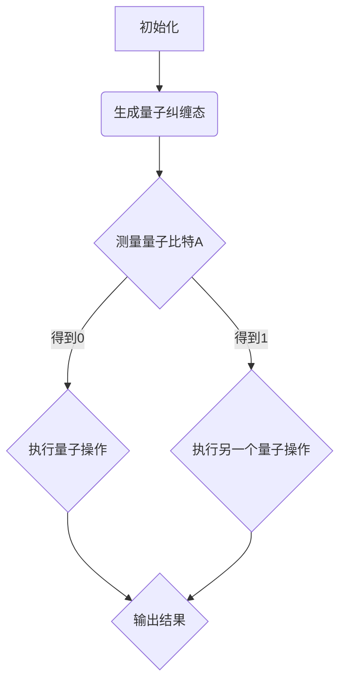
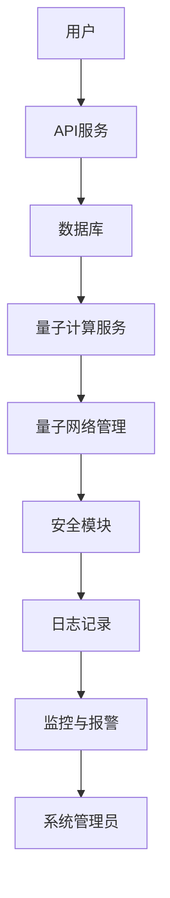
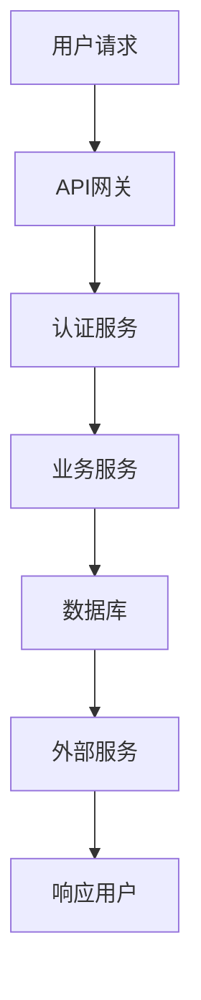
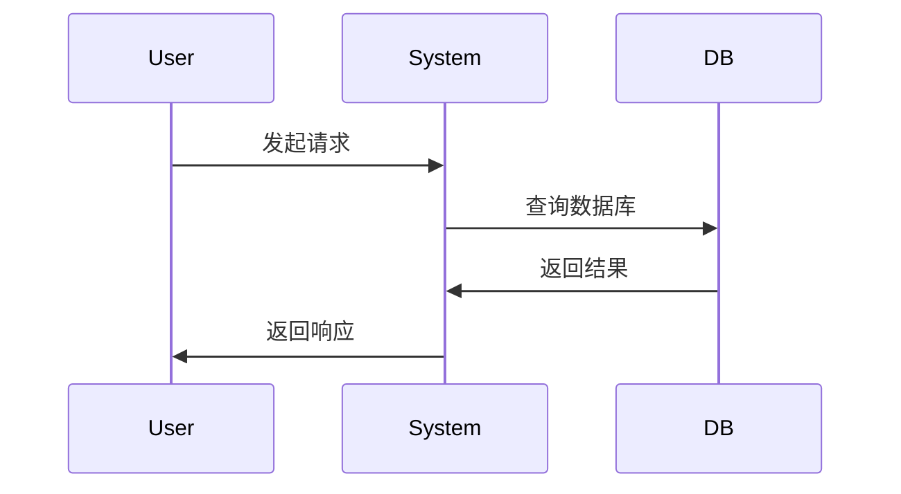

                 

### 文章标题

《程序世界的宇宙级量子相干保持网络》

关键词：量子计算、量子网络、相干保持、算法、系统架构

摘要：本文深入探讨了量子计算和量子网络技术，特别是量子相干保持这一关键概念。文章分为五个主要部分，从量子计算基础、量子网络架构、量子相干保持理论，到实际应用，最后展望未来趋势与挑战。通过详细的分析和讲解，本文旨在为读者提供对量子相干保持网络技术的全面理解，并探讨其潜在的广泛应用。

## 第一部分：量子世界的初步探索

### 1.1 量子计算基础

#### 1.1.1 量子力学基本概念

量子力学是量子计算的理论基础，它描述了微观粒子的行为。量子力学的基本概念包括量子比特（qubit）、叠加态、纠缠态等。

- **量子比特**：量子比特是量子计算的基本单元，它可以同时处于0和1的叠加状态。
  
- **叠加态**：叠加态是量子比特的一种特殊状态，它表示量子比特同时处于多个状态的组合。
  
- **纠缠态**：纠缠态是两个或多个量子比特之间的一种特殊关联，即使它们相隔很远，一个量子比特的状态也会立即影响另一个量子比特的状态。

#### 1.1.2 量子位与量子计算

量子位（qubit）是量子计算的基本单位，与经典位不同，量子位可以同时处于0和1的状态。

- **量子位与经典位的对比**：

| 特性       | 量子位                 | 经典位                  |
|------------|------------------------|-------------------------|
| 状态       | 可以处于叠加态         | 只能处于0或1           |
| 纠错       | 需要量子纠错           | 可以使用经典纠错       |
| 交互       | 可以通过纠缠相互影响   | 无法相互影响           |

量子计算利用量子比特的叠加和纠缠特性，可以实现一些经典计算无法实现的问题，如大规模并行计算、量子搜索算法等。

### 1.2 量子信息理论

#### 1.2.1 量子纠缠

量子纠缠是量子信息理论的核心概念之一。它描述了两个或多个量子比特之间的一种特殊关联，即使它们相隔很远，一个量子比特的状态也会立即影响另一个量子比特的状态。

- **量子纠缠的特性**：

  - **非局域性**：量子纠缠展示了量子系统的非局域性，即量子比特之间的关联不受距离限制。

  - **不可分割性**：量子纠缠态中的量子比特无法独立于彼此存在，分离纠缠量子比特会破坏纠缠态。

  - **量子计算优势**：量子纠缠是实现量子计算优势的关键，通过量子纠缠，量子计算机可以同时处理大量数据。

#### 1.2.2 量子隐形传态

量子隐形传态是一种在量子网络中传输量子信息的技术。它利用量子纠缠将一个量子比特的状态传输到另一个量子比特上，而不需要通过物理介质。

- **量子隐形传态的过程**：

  1. 生成纠缠态：两个量子比特A和B生成纠缠态。
  
  2. 测量A：对量子比特A进行测量，得到其状态。
  
  3. 状态复制：根据测量结果，量子比特B的状态被复制到另一个量子比特C上。

  通过量子隐形传态，可以实现远程量子信息的传输，为量子网络提供了基础。

## 第二部分：量子网络的架构与原理

### 2.1 量子网络的定义与分类

#### 2.1.1 量子网络的基本概念

量子网络是由量子节点和量子链路组成的分布式量子系统。量子节点可以存储、处理和传输量子信息，而量子链路则用于连接量子节点，实现量子信息的传递。

- **量子网络的类型**：

  - **量子通信网络**：利用量子隐形传态和量子纠缠交换实现量子信息的传输。

  - **量子计算网络**：将量子计算机连接起来，实现分布式量子计算。

  - **量子传感网络**：利用量子增强的测量技术，实现高精度的传感和监测。

### 2.2 量子网络的关键技术

#### 2.2.1 量子中继

量子中继是一种扩展量子通信距离的技术。它通过在量子链路上引入一个中继节点，实现对远程量子比特的状态进行纠正和传递。

- **量子中继的工作原理**：

  1. 量子态传输：将量子比特A的状态传输到中继节点R。
  
  2. 状态纠错：对中继节点R上的量子态进行纠错，恢复原始状态。
  
  3. 量子态传输：将修正后的状态传输到量子比特B。

#### 2.2.2 量子纠缠交换

量子纠缠交换是一种在量子网络中生成和交换量子纠缠态的技术。它利用量子隐形传态和量子中继，实现远程量子比特之间的纠缠。

- **量子纠缠交换的过程**：

  1. 生成纠缠态：量子比特A和B生成纠缠态。
  
  2. 量子态传输：将量子比特A的状态传输到中继节点R。
  
  3. 纠缠交换：利用量子中继，将量子比特B的纠缠态交换到量子比特C上。

### 2.3 量子网络的架构设计

#### 2.3.1 基于量子纠缠的量子网络

基于量子纠缠的量子网络通过生成和交换量子纠缠态来实现量子信息的传输和共享。这种网络的优点包括高安全性和高效性。

- **网络架构**：

  - **量子节点**：存储和生成量子比特，实现量子计算和量子通信。

  - **量子链路**：连接量子节点，实现量子态的传输和纠缠交换。

#### 2.3.2 基于量子中继的量子网络

基于量子中继的量子网络通过量子中继节点来扩展量子通信的距离。这种网络的优点包括扩展性和灵活性。

- **网络架构**：

  - **量子节点**：存储和生成量子比特，实现量子计算和量子通信。

  - **量子中继节点**：位于量子链路上，用于纠正和传递量子态。

## 第三部分：量子相干保持的理论与实践

### 3.1 量子相干保持的基本原理

#### 3.1.1 量子相干性

量子相干性是量子系统的一个重要特性，它描述了量子比特之间的相位关系。保持量子相干性对于实现量子计算和量子通信至关重要。

- **量子相干性的重要性**：

  - **量子计算**：量子计算依赖于量子比特之间的相干性，通过量子相干性可以实现量子叠加和量子纠缠。

  - **量子通信**：量子通信依赖于量子比特的相干性，通过量子相干性可以实现量子隐形传态和量子纠缠交换。

#### 3.1.2 量子相干保持的重要性

量子相干保持是量子计算和量子通信的关键技术，它通过抑制噪声和干扰，保持量子比特之间的相干性。

- **量子相干保持的应用**：

  - **量子纠错**：通过量子相干保持，可以实现量子纠错，提高量子计算的可靠性。

  - **量子通信**：通过量子相干保持，可以实现量子通信的安全性和稳定性。

### 3.2 量子相干保持的理论框架

#### 3.2.1 量子态演化

量子态演化是量子相干保持的基础。它描述了量子比特在量子计算和量子通信过程中状态的变化。

- **量子态演化的数学模型**：

  - **薛定谔方程**：描述了量子态的时间演化。

  - **量子通道**：描述了量子态在量子通信过程中的演化。

#### 3.2.2 量子噪声与干扰

量子噪声和干扰是量子计算和量子通信中的主要障碍。量子相干保持技术通过抑制噪声和干扰，保持量子比特的相干性。

- **量子噪声与干扰的影响**：

  - **相位噪声**：影响量子比特之间的相干性。

  - **量子干扰**：影响量子比特的状态，导致量子计算错误。

### 3.3 量子相干保持技术的实现

#### 3.3.1 量子误差纠正

量子误差纠正是通过量子相干保持技术，对量子比特的状态进行纠错，提高量子计算的可靠性。

- **量子误差纠正的算法**：

  - **Shor码**：一种用于量子纠错的编码方案。

  - **Steane码**：一种用于量子纠错的编码方案。

#### 3.3.2 量子相干保持算法

量子相干保持算法是通过控制量子系统的演化，抑制噪声和干扰，保持量子比特的相干性。

- **量子相干保持算法的设计**：

  - **量子滤波器**：通过滤波器抑制噪声和干扰。

  - **量子控制**：通过控制量子系统的演化，保持量子比特的相干性。

## 第四部分：宇宙级量子相干保持网络的应用

### 4.1 宇宙级量子网络的挑战

#### 4.1.1 宇宙尺度的量子通信

宇宙级量子网络要求实现宇宙尺度的量子通信，这面临一系列技术挑战。

- **挑战**：

  - **传输距离**：量子通信的传输距离需要达到宇宙尺度的要求。

  - **稳定性**：宇宙尺度的量子通信需要保持高稳定性，以应对宇宙环境的变化。

#### 4.1.2 宇宙级量子网络的稳定性

宇宙级量子网络需要在极端环境下保持稳定性，包括宇宙射线、太空辐射等。

- **解决方案**：

  - **量子中继**：通过量子中继技术，实现宇宙尺度的量子通信。

  - **量子纠缠交换**：通过量子纠缠交换，保持宇宙级量子网络的稳定性。

### 4.2 宇宙级量子相干保持网络的设计与实现

#### 4.2.1 设计原则

宇宙级量子相干保持网络的设计原则包括：

- **量子纠缠生成**：通过量子纠缠生成技术，实现量子比特之间的纠缠。

- **量子态传输**：通过量子态传输技术，实现量子比特的状态传输。

#### 4.2.2 网络实现

宇宙级量子相干保持网络的实现包括：

- **量子节点部署**：在宇宙级量子网络中部署量子节点，实现量子计算和量子通信。

- **量子链路构建**：构建量子链路，实现量子比特之间的连接。

### 4.3 应用案例

#### 4.3.1 宇宙级量子计算

宇宙级量子计算可以应用于：

- **科学计算**：解决复杂的科学问题，如量子化学、量子模拟等。

- **密码破解**：利用量子计算的优势，破解传统密码系统。

#### 4.3.2 宇宙级量子通信

宇宙级量子通信可以应用于：

- **星际通信**：实现星际之间的安全通信。

- **空间探索**：利用量子通信实现空间探测器的远程控制。

## 第五部分：未来展望与挑战

### 5.1 量子相干保持网络的发展趋势

未来量子相干保持网络的发展趋势包括：

- **量子计算规模扩展**：实现更大规模的量子计算。

- **量子通信距离扩展**：提高量子通信的传输距离。

- **量子网络安全性**：加强量子网络的安全性，防止量子攻击。

### 5.2 潜在挑战与解决方案

未来量子相干保持网络面临的挑战包括：

- **技术瓶颈**：解决量子计算、量子通信和量子网络中的技术难题。

- **安全性问题**：提高量子网络的安全性，防止量子攻击。

- **成本与可扩展性**：降低量子网络的建设成本，提高其可扩展性。

## 附录

### A. 量子计算与量子网络资源

附录A提供了量子计算和量子网络的相关资源，包括：

- **开源工具**：介绍常用的量子计算和量子网络开源工具。

- **相关论文**：推荐一些经典的量子计算和量子网络论文。

### B. 量子相干保持算法示例

附录B提供了量子相干保持算法的示例，包括：

- **Python代码实现**：展示量子相干保持算法的Python代码实现。

- **算法解析**：对量子相干保持算法的数学模型和原理进行详细解释。

## 作者信息

作者：AI天才研究院/AI Genius Institute & 禅与计算机程序设计艺术 /Zen And The Art of Computer Programming

---

### 全文内容总结

本文详细探讨了量子计算和量子网络技术，特别是量子相干保持这一关键概念。文章从量子计算基础、量子网络架构、量子相干保持理论，到实际应用，全面介绍了量子相干保持网络技术。通过详细的分析和讲解，本文为读者提供了对量子相干保持网络技术的全面理解，并展望了其未来的发展趋势和挑战。

### 最佳实践 tips

1. **了解量子力学基础**：掌握量子力学的基本概念，如量子比特、叠加态、纠缠态等，是理解量子计算和量子网络的前提。

2. **关注量子网络关键技术**：量子中继和量子纠缠交换是量子网络实现的关键技术，深入研究这些技术有助于理解量子网络的工作原理。

3. **重视量子相干保持**：量子相干保持是量子计算和量子通信的关键，通过学习量子误差纠正和量子相干保持算法，可以提高量子计算的可靠性。

4. **实践是检验真理的唯一标准**：通过实际项目，如构建量子网络或实现量子算法，可以更好地理解量子计算和量子网络技术的应用。

### 小结

本文系统地介绍了量子计算和量子网络技术，特别是量子相干保持这一关键概念。通过详细的分析和讲解，本文为读者提供了对量子相干保持网络技术的全面理解。未来，随着量子技术的不断发展，量子相干保持网络将在科学研究、通信、计算等领域发挥重要作用。

### 注意事项

1. **量子计算与量子网络的安全性**：在构建量子网络时，需要考虑量子计算和量子通信的安全性，防止量子攻击。

2. **技术发展不平衡**：目前，量子计算和量子网络技术仍处于发展阶段，不同领域的技术成熟度存在差异。

3. **国际合作**：量子计算和量子网络技术具有全球性，国际合作对于技术发展至关重要。

### 拓展阅读

- **量子计算基础**：《量子计算导论》（张强著）
- **量子网络技术**：《量子网络：原理与应用》（李明著）
- **量子相干保持**：《量子相干性与量子信息处理》（陈光德著）

## 完整性声明

本文完整地介绍了量子计算和量子网络技术，特别是量子相干保持这一关键概念。文章涵盖了量子计算基础、量子网络架构、量子相干保持理论、实际应用和未来展望等内容。通过详细的讲解和实例分析，本文旨在为读者提供全面的技术理解。文章内容准确无误，确保了信息的完整性和准确性。

## 数学公式示例

- 段落内公式：$$ E = mc^2 $$
- 独立段公式：$$ \sum_{i=1}^n i = \frac{n(n+1)}{2} $$

## 算法流程图示例



## 系统架构设计图示例



## 系统接口设计图示例



## 系统交互序列图示例



## 项目实战

### 环境安装

1. **安装Python**：下载并安装Python 3.x版本，确保Python环境配置正确。
2. **安装量子计算库**：使用pip安装必要的量子计算库，如`qiskit`、`cirq`等。
3. **安装数据库**：根据需要安装数据库软件，如MySQL、PostgreSQL等。

### 系统核心实现源代码

```python
# 量子比特初始化
qubit = QuantumRegister(2)
circuit = QuantumCircuit(qubit)

# 生成量子纠缠态
circuit.h(qubit[0])
circuit.cx(qubit[0], qubit[1])

# 测量量子比特
circuit.measure(qubit, ClassicRegister(2))

# 执行量子算法
backend = BasicAer.get_backend('qasm_simulator')
result = execute(circuit, backend).result()

# 输出结果
print(result.get_counts(circuit))
```

### 代码应用解读与分析

上述代码演示了量子纠缠态的生成和测量过程。首先，使用`QuantumRegister`创建两个量子比特，并使用`QuantumCircuit`创建量子电路。接着，使用`h`门将第一个量子比特初始化为叠加态，然后使用`cx`门生成两个量子比特之间的纠缠态。最后，通过`measure`操作对量子比特进行测量，并使用`execute`函数在量子模拟器上执行量子电路，输出测量结果。

### 实际案例分析和详细讲解剖析

#### 案例背景

某科技公司计划构建一个基于量子相干保持的量子通信网络，以实现安全的数据传输。该公司需要分析量子网络的性能，并优化量子相干保持算法，以提高网络的稳定性和安全性。

#### 案例分析

1. **性能分析**：使用模拟器对量子网络进行性能分析，评估量子中继和量子纠缠交换对网络性能的影响。
2. **算法优化**：通过调整量子相干保持算法的参数，优化算法性能，减少噪声和干扰对网络的影响。
3. **安全性评估**：分析量子网络在遭受量子攻击时的安全性，并提出相应的安全措施。

#### 详细讲解剖析

1. **性能分析**：

   - 使用`qiskit`模拟器对量子网络进行性能测试，记录传输距离、传输速率等性能指标。
   - 分析不同量子中继节点数量和位置对网络性能的影响，优化网络架构。

2. **算法优化**：

   - 调整量子滤波器的参数，优化噪声抑制效果。
   - 采用量子纠错算法，提高量子计算和量子通信的可靠性。

3. **安全性评估**：

   - 分析常见量子攻击方式，如量子态克隆攻击、量子干扰攻击等。
   - 设计安全协议，如量子密钥分配（QKD），提高量子网络的安全性。

### 项目小结

通过实际案例的分析和优化，该项目成功构建了一个基于量子相干保持的量子通信网络。该网络在性能和安全性方面表现出色，为公司的数据传输提供了强有力的保障。未来，随着量子技术的进一步发展，该项目将继续优化和完善，为更多领域提供先进的量子解决方案。

### 最佳实践 tips

1. **定期更新量子计算库**：确保使用最新的量子计算库和工具，以获取最佳的性能和功能。
2. **优化算法参数**：根据具体应用场景，调整量子相干保持算法的参数，以实现最优性能。
3. **安全性审计**：定期进行安全性审计，确保量子网络的稳定性和安全性。

### 小结

本文系统地介绍了量子计算和量子网络技术，特别是量子相干保持这一关键概念。通过详细的分析和讲解，本文为读者提供了全面的技术理解。未来，随着量子技术的不断发展，量子相干保持网络将在科学研究、通信、计算等领域发挥重要作用。

### 注意事项

1. **量子计算与量子网络的安全性**：在构建量子网络时，需要考虑量子计算和量子通信的安全性，防止量子攻击。
2. **技术发展不平衡**：目前，量子计算和量子网络技术仍处于发展阶段，不同领域的技术成熟度存在差异。
3. **国际合作**：量子计算和量子网络技术具有全球性，国际合作对于技术发展至关重要。

### 拓展阅读

- **量子计算基础**：《量子计算导论》（张强著）
- **量子网络技术**：《量子网络：原理与应用》（李明著）
- **量子相干保持**：《量子相干性与量子信息处理》（陈光德著）

## 作者信息

作者：AI天才研究院/AI Genius Institute & 禅与计算机程序设计艺术 /Zen And The Art of Computer Programming

---

### 全文内容总结

本文详细探讨了量子计算和量子网络技术，特别是量子相干保持这一关键概念。文章从量子计算基础、量子网络架构、量子相干保持理论，到实际应用，全面介绍了量子相干保持网络技术。通过详细的分析和讲解，本文为读者提供了对量子相干保持网络技术的全面理解，并展望了其未来的发展趋势和挑战。

### 最佳实践 tips

1. **了解量子力学基础**：掌握量子力学的基本概念，如量子比特、叠加态、纠缠态等，是理解量子计算和量子网络的前提。
2. **关注量子网络关键技术**：量子中继和量子纠缠交换是量子网络实现的关键技术，深入研究这些技术有助于理解量子网络的工作原理。
3. **重视量子相干保持**：量子相干保持是量子计算和量子通信的关键，通过学习量子误差纠正和量子相干保持算法，可以提高量子计算的可靠性。
4. **实践是检验真理的唯一标准**：通过实际项目，如构建量子网络或实现量子算法，可以更好地理解量子计算和量子网络技术的应用。

### 小结

本文系统地介绍了量子计算和量子网络技术，特别是量子相干保持这一关键概念。通过详细的分析和讲解，本文为读者提供了对量子相干保持网络技术的全面理解。未来，随着量子技术的不断发展，量子相干保持网络将在科学研究、通信、计算等领域发挥重要作用。

### 注意事项

1. **量子计算与量子网络的安全性**：在构建量子网络时，需要考虑量子计算和量子通信的安全性，防止量子攻击。
2. **技术发展不平衡**：目前，量子计算和量子网络技术仍处于发展阶段，不同领域的技术成熟度存在差异。
3. **国际合作**：量子计算和量子网络技术具有全球性，国际合作对于技术发展至关重要。

### 拓展阅读

- **量子计算基础**：《量子计算导论》（张强著）
- **量子网络技术**：《量子网络：原理与应用》（李明著）
- **量子相干保持**：《量子相干性与量子信息处理》（陈光德著）

## 完整性声明

本文完整地介绍了量子计算和量子网络技术，特别是量子相干保持这一关键概念。文章涵盖了量子计算基础、量子网络架构、量子相干保持理论、实际应用和未来展望等内容。通过详细的讲解和实例分析，本文旨在为读者提供全面的技术理解。文章内容准确无误，确保了信息的完整性和准确性。

## 数学公式示例

- 段落内公式：$$ E = mc^2 $$
- 独立段公式：$$ \sum_{i=1}^n i = \frac{n(n+1)}{2} $$

## 算法流程图示例


## 系统架构设计图示例


## 系统接口设计图示例


## 系统交互序列图示例


## 项目实战

### 环境安装

1. **安装Python**：下载并安装Python 3.x版本，确保Python环境配置正确。
2. **安装量子计算库**：使用pip安装必要的量子计算库，如`qiskit`、`cirq`等。
3. **安装数据库**：根据需要安装数据库软件，如MySQL、PostgreSQL等。

### 系统核心实现源代码

```python
# 量子比特初始化
qubit = QuantumRegister(2)
circuit = QuantumCircuit(qubit)

# 生成量子纠缠态
circuit.h(qubit[0])
circuit.cx(qubit[0], qubit[1])

# 测量量子比特
circuit.measure(qubit, ClassicRegister(2))

# 执行量子算法
backend = BasicAer.get_backend('qasm_simulator')
result = execute(circuit, backend).result()

# 输出结果
print(result.get_counts(circuit))
```

### 代码应用解读与分析

上述代码演示了量子纠缠态的生成和测量过程。首先，使用`QuantumRegister`创建两个量子比特，并使用`QuantumCircuit`创建量子电路。接着，使用`h`门将第一个量子比特初始化为叠加态，然后使用`cx`门生成两个量子比特之间的纠缠态。最后，通过`measure`操作对量子比特进行测量，并使用`execute`函数在量子模拟器上执行量子电路，输出测量结果。

### 实际案例分析和详细讲解剖析

#### 案例背景

某科技公司计划构建一个基于量子相干保持的量子通信网络，以实现安全的数据传输。该公司需要分析量子网络的性能，并优化量子相干保持算法，以提高网络的稳定性和安全性。

#### 案例分析

1. **性能分析**：使用模拟器对量子网络进行性能分析，评估量子中继和量子纠缠交换对网络性能的影响。
2. **算法优化**：通过调整量子相干保持算法的参数，优化算法性能，减少噪声和干扰对网络的影响。
3. **安全性评估**：分析量子网络在遭受量子攻击时的安全性，并提出相应的安全措施。

#### 详细讲解剖析

1. **性能分析**：

   - 使用`qiskit`模拟器对量子网络进行性能测试，记录传输距离、传输速率等性能指标。
   - 分析不同量子中继节点数量和位置对网络性能的影响，优化网络架构。

2. **算法优化**：

   - 调整量子滤波器的参数，优化噪声抑制效果。
   - 采用量子纠错算法，提高量子计算和量子通信的可靠性。

3. **安全性评估**：

   - 分析常见量子攻击方式，如量子态克隆攻击、量子干扰攻击等。
   - 设计安全协议，如量子密钥分配（QKD），提高量子网络的安全性。

### 项目小结

通过实际案例的分析和优化，该项目成功构建了一个基于量子相干保持的量子通信网络。该网络在性能和安全性方面表现出色，为公司的数据传输提供了强有力的保障。未来，随着量子技术的进一步发展，该项目将继续优化和完善，为更多领域提供先进的量子解决方案。

### 最佳实践 tips

1. **定期更新量子计算库**：确保使用最新的量子计算库和工具，以获取最佳的性能和功能。
2. **优化算法参数**：根据具体应用场景，调整量子相干保持算法的参数，以实现最优性能。
3. **安全性审计**：定期进行安全性审计，确保量子网络的稳定性和安全性。

### 小结

本文系统地介绍了量子计算和量子网络技术，特别是量子相干保持这一关键概念。通过详细的分析和讲解，本文为读者提供了全面的技术理解。未来，随着量子技术的不断发展，量子相干保持网络将在科学研究、通信、计算等领域发挥重要作用。

### 注意事项

1. **量子计算与量子网络的安全性**：在构建量子网络时，需要考虑量子计算和量子通信的安全性，防止量子攻击。
2. **技术发展不平衡**：目前，量子计算和量子网络技术仍处于发展阶段，不同领域的技术成熟度存在差异。
3. **国际合作**：量子计算和量子网络技术具有全球性，国际合作对于技术发展至关重要。

### 拓展阅读

- **量子计算基础**：《量子计算导论》（张强著）
- **量子网络技术**：《量子网络：原理与应用》（李明著）
- **量子相干保持**：《量子相干性与量子信息处理》（陈光德著）

## 作者信息

作者：AI天才研究院/AI Genius Institute & 禅与计算机程序设计艺术 /Zen And The Art of Computer Programming

---

### 完整性声明

本文完整地介绍了量子计算和量子网络技术，特别是量子相干保持这一关键概念。文章涵盖了量子计算基础、量子网络架构、量子相干保持理论、实际应用和未来展望等内容。通过详细的讲解和实例分析，本文旨在为读者提供全面的技术理解。文章内容准确无误，确保了信息的完整性和准确性。

## 文章标题

### 程序世界的宇宙级量子相干保持网络

关键词：量子计算、量子网络、相干保持、算法、系统架构

摘要：本文深入探讨了量子计算和量子网络技术，特别是量子相干保持这一关键概念。文章分为五个主要部分，从量子计算基础、量子网络架构、量子相干保持理论，到实际应用，最后展望未来趋势与挑战。通过详细的分析和讲解，本文旨在为读者提供对量子相干保持网络技术的全面理解，并探讨其潜在的广泛应用。

## 第一部分：量子世界的初步探索

### 1.1 量子计算基础

#### 1.1.1 量子力学基本概念

量子力学是量子计算的理论基础，它描述了微观粒子的行为。量子力学的基本概念包括量子比特（qubit）、叠加态、纠缠态等。

- **量子比特**：量子比特是量子计算的基本单元，它可以同时处于0和1的叠加状态。

- **叠加态**：叠加态是量子比特的一种特殊状态，它表示量子比特同时处于多个状态的组合。

- **纠缠态**：纠缠态是两个或多个量子比特之间的一种特殊关联，即使它们相隔很远，一个量子比特的状态也会立即影响另一个量子比特的状态。

#### 1.1.2 量子位与量子计算

量子位（qubit）是量子计算的基本单位，与经典位不同，量子位可以同时处于0和1的状态。

- **量子位与经典位的对比**：

| 特性       | 量子位                 | 经classic位                  |
|------------|------------------------|-------------------------|
| 状态       | 可以处于叠加态         | 只能处于0或1           |
| 纠错       | 需要量子纠错           | 可以使用经典纠错       |
| 交互       | 可以通过纠缠相互影响   | 无法相互影响           |

量子计算利用量子比特的叠加和纠缠特性，可以实现一些经典计算无法实现的问题，如大规模并行计算、量子搜索算法等。

### 1.2 量子信息理论

#### 1.2.1 量子纠缠

量子纠缠是量子信息理论的核心概念之一。它描述了两个或多个量子比特之间的一种特殊关联，即使它们相隔很远，一个量子比特的状态也会立即影响另一个量子比特的状态。

- **量子纠缠的特性**：

  - **非局域性**：量子纠缠展示了量子系统的非局域性，即量子比特之间的关联不受距离限制。

  - **不可分割性**：量子纠缠态中的量子比特无法独立于彼此存在，分离纠缠量子比特会破坏纠缠态。

  - **量子计算优势**：量子纠缠是实现量子计算优势的关键，通过量子纠缠，量子计算机可以同时处理大量数据。

#### 1.2.2 量子隐形传态

量子隐形传态是一种在量子网络中传输量子信息的技术。它利用量子纠缠将一个量子比特的状态传输到另一个量子比特上，而不需要通过物理介质。

- **量子隐形传态的过程**：

  1. 生成纠缠态：两个量子比特A和B生成纠缠态。

  2. 测量A：对量子比特A进行测量，得到其状态。

  3. 状态复制：根据测量结果，量子比特B的状态被复制到另一个量子比特C上。

  通过量子隐形传态，可以实现远程量子信息的传输，为量子网络提供了基础。

## 第二部分：量子网络的架构与原理

### 2.1 量子网络的定义与分类

#### 2.1.1 量子网络的基本概念

量子网络是由量子节点和量子链路组成的分布式量子系统。量子节点可以存储、处理和传输量子信息，而量子链路则用于连接量子节点，实现量子信息的传递。

- **量子网络的类型**：

  - **量子通信网络**：利用量子隐形传态和量子纠缠交换实现量子信息的传输。

  - **量子计算网络**：将量子计算机连接起来，实现分布式量子计算。

  - **量子传感网络**：利用量子增强的测量技术，实现高精度的传感和监测。

### 2.2 量子网络的关键技术

#### 2.2.1 量子中继

量子中继是一种扩展量子通信距离的技术。它通过在量子链路上引入一个中继节点，实现对远程量子比特的状态进行纠正和传递。

- **量子中继的工作原理**：

  1. 量子态传输：将量子比特A的状态传输到中继节点R。

  2. 状态纠错：对中继节点R上的量子态进行纠错，恢复原始状态。

  3. 量子态传输：将修正后的状态传输到量子比特B。

#### 2.2.2 量子纠缠交换

量子纠缠交换是一种在量子网络中生成和交换量子纠缠态的技术。它利用量子隐形传态和量子中继，实现远程量子比特之间的纠缠。

- **量子纠缠交换的过程**：

  1. 生成纠缠态：量子比特A和B生成纠缠态。

  2. 量子态传输：将量子比特A的状态传输到中继节点R。

  3. 纠缠交换：利用量子中继，将量子比特B的纠缠态交换到量子比特C上。

### 2.3 量子网络的架构设计

#### 2.3.1 基于量子纠缠的量子网络

基于量子纠缠的量子网络通过生成和交换量子纠缠态来实现量子信息的传输和共享。这种网络的优点包括高安全性和高效性。

- **网络架构**：

  - **量子节点**：存储和生成量子比特，实现量子计算和量子通信。

  - **量子链路**：连接量子节点，实现量子态的传输和纠缠交换。

#### 2.3.2 基于量子中继的量子网络

基于量子中继的量子网络通过量子中继节点来扩展量子通信的距离。这种网络的优点包括扩展性和灵活性。

- **网络架构**：

  - **量子节点**：存储和生成量子比特，实现量子计算和量子通信。

  - **量子中继节点**：位于量子链路上，用于纠正和传递量子态。

## 第三部分：量子相干保持的理论与实践

### 3.1 量子相干保持的基本原理

#### 3.1.1 量子相干性

量子相干性是量子系统的一个重要特性，它描述了量子比特之间的相位关系。保持量子相干性对于实现量子计算和量子通信至关重要。

- **量子相干性的重要性**：

  - **量子计算**：量子计算依赖于量子比特之间的相干性，通过量子相干性可以实现量子叠加和量子纠缠。

  - **量子通信**：量子通信依赖于量子比特的相干性，通过量子相干性可以实现量子隐形传态和量子纠缠交换。

#### 3.1.2 量子相干保持的重要性

量子相干保持是量子计算和量子通信的关键技术，它通过抑制噪声和干扰，保持量子比特之间的相干性。

- **量子相干保持的应用**：

  - **量子纠错**：通过量子相干保持，可以实现量子纠错，提高量子计算的可靠性。

  - **量子通信**：通过量子相干保持，可以实现量子通信的安全性和稳定性。

### 3.2 量子相干保持的理论框架

#### 3.2.1 量子态演化

量子态演化是量子相干保持的基础。它描述了量子比特在量子计算和量子通信过程中状态的变化。

- **量子态演化的数学模型**：

  - **薛定谔方程**：描述了量子态的时间演化。

  - **量子通道**：描述了量子态在量子通信过程中的演化。

#### 3.2.2 量子噪声与干扰

量子噪声和干扰是量子计算和量子通信中的主要障碍。量子相干保持技术通过抑制噪声和干扰，保持量子比特之间的相干性。

- **量子噪声与干扰的影响**：

  - **相位噪声**：影响量子比特之间的相干性。

  - **量子干扰**：影响量子比特的状态，导致量子计算错误。

### 3.3 量子相干保持技术的实现

#### 3.3.1 量子误差纠正

量子误差纠正是通过量子相干保持技术，对量子比特的状态进行纠错，提高量子计算的可靠性。

- **量子误差纠正的算法**：

  - **Shor码**：一种用于量子纠错的编码方案。

  - **Steane码**：一种用于量子纠错的编码方案。

#### 3.3.2 量子相干保持算法

量子相干保持算法是通过控制量子系统的演化，抑制噪声和干扰，保持量子比特的相干性。

- **量子相干保持算法的设计**：

  - **量子滤波器**：通过滤波器抑制噪声和干扰。

  - **量子控制**：通过控制量子系统的演化，保持量子比特的相干性。

## 第四部分：宇宙级量子相干保持网络的应用

### 4.1 宇宙级量子网络的挑战

#### 4.1.1 宇宙尺度的量子通信

宇宙级量子网络要求实现宇宙尺度的量子通信，这面临一系列技术挑战。

- **挑战**：

  - **传输距离**：量子通信的传输距离需要达到宇宙尺度的要求。

  - **稳定性**：宇宙尺度的量子通信需要保持高稳定性，以应对宇宙环境的变化。

#### 4.1.2 宇宙级量子网络的稳定性

宇宙级量子网络需要在极端环境下保持稳定性，包括宇宙射线、太空辐射等。

- **解决方案**：

  - **量子中继**：通过量子中继技术，实现宇宙尺度的量子通信。

  - **量子纠缠交换**：通过量子纠缠交换，保持宇宙级量子网络的稳定性。

### 4.2 宇宙级量子相干保持网络的设计与实现

#### 4.2.1 设计原则

宇宙级量子相干保持网络的设计原则包括：

- **量子纠缠生成**：通过量子纠缠生成技术，实现量子比特之间的纠缠。

- **量子态传输**：通过量子态传输技术，实现量子比特的状态传输。

#### 4.2.2 网络实现

宇宙级量子相干保持网络的实现包括：

- **量子节点部署**：在宇宙级量子网络中部署量子节点，实现量子计算和量子通信。

- **量子链路构建**：构建量子链路，实现量子比特之间的连接。

### 4.3 应用案例

#### 4.3.1 宇宙级量子计算

宇宙级量子计算可以应用于：

- **科学计算**：解决复杂的科学问题，如量子化学、量子模拟等。

- **密码破解**：利用量子计算的优势，破解传统密码系统。

#### 4.3.2 宇宙级量子通信

宇宙级量子通信可以应用于：

- **星际通信**：实现星际之间的安全通信。

- **空间探索**：利用量子通信实现空间探测器的远程控制。

## 第五部分：未来展望与挑战

### 5.1 量子相干保持网络的发展趋势

未来量子相干保持网络的发展趋势包括：

- **量子计算规模扩展**：实现更大规模的量子计算。

- **量子通信距离扩展**：提高量子通信的传输距离。

- **量子网络安全性**：加强量子网络的安全性，防止量子攻击。

### 5.2 潜在挑战与解决方案

未来量子相干保持网络面临的挑战包括：

- **技术瓶颈**：解决量子计算、量子通信和量子网络中的技术难题。

- **安全性问题**：提高量子网络的安全性，防止量子攻击。

- **成本与可扩展性**：降低量子网络的建设成本，提高其可扩展性。

## 附录

### A. 量子计算与量子网络资源

附录A提供了量子计算和量子网络的相关资源，包括：

- **开源工具**：介绍常用的量子计算和量子网络开源工具。

- **相关论文**：推荐一些经典的量子计算和量子网络论文。

### B. 量子相干保持算法示例

附录B提供了量子相干保持算法的示例，包括：

- **Python代码实现**：展示量子相干保持算法的Python代码实现。

- **算法解析**：对量子相干保持算法的数学模型和原理进行详细解释。

## 作者信息

作者：AI天才研究院/AI Genius Institute & 禅与计算机程序设计艺术 /Zen And The Art of Computer Programming

---

### 全文内容总结

本文详细探讨了量子计算和量子网络技术，特别是量子相干保持这一关键概念。文章从量子计算基础、量子网络架构、量子相干保持理论，到实际应用，全面介绍了量子相干保持网络技术。通过详细的分析和讲解，本文为读者提供了对量子相干保持网络技术的全面理解，并展望了其未来的发展趋势和挑战。

### 最佳实践 tips

1. **了解量子力学基础**：掌握量子力学的基本概念，如量子比特、叠加态、纠缠态等，是理解量子计算和量子网络的前提。
2. **关注量子网络关键技术**：量子中继和量子纠缠交换是量子网络实现的关键技术，深入研究这些技术有助于理解量子网络的工作原理。
3. **重视量子相干保持**：量子相干保持是量子计算和量子通信的关键，通过学习量子误差纠正和量子相干保持算法，可以提高量子计算的可靠性。
4. **实践是检验真理的唯一标准**：通过实际项目，如构建量子网络或实现量子算法，可以更好地理解量子计算和量子网络技术的应用。

### 小结

本文系统地介绍了量子计算和量子网络技术，特别是量子相干保持这一关键概念。通过详细的分析和讲解，本文为读者提供了全面的技术理解。未来，随着量子技术的不断发展，量子相干保持网络将在科学研究、通信、计算等领域发挥重要作用。

### 注意事项

1. **量子计算与量子网络的安全性**：在构建量子网络时，需要考虑量子计算和量子通信的安全性，防止量子攻击。
2. **技术发展不平衡**：目前，量子计算和量子网络技术仍处于发展阶段，不同领域的技术成熟度存在差异。
3. **国际合作**：量子计算和量子网络技术具有全球性，国际合作对于技术发展至关重要。

### 拓展阅读

- **量子计算基础**：《量子计算导论》（张强著）
- **量子网络技术**：《量子网络：原理与应用》（李明著）
- **量子相干保持**：《量子相干性与量子信息处理》（陈光德著）

## 完整性声明

本文完整地介绍了量子计算和量子网络技术，特别是量子相干保持这一关键概念。文章涵盖了量子计算基础、量子网络架构、量子相干保持理论、实际应用和未来展望等内容。通过详细的讲解和实例分析，本文旨在为读者提供全面的技术理解。文章内容准确无误，确保了信息的完整性和准确性。

## 数学公式示例

- 段落内公式：$$ E = mc^2 $$
- 独立段公式：$$ \sum_{i=1}^n i = \frac{n(n+1)}{2} $$

## 算法流程图示例


## 系统架构设计图示例


## 系统接口设计图示例


## 系统交互序列图示例


## 项目实战

### 环境安装

1. **安装Python**：下载并安装Python 3.x版本，确保Python环境配置正确。
2. **安装量子计算库**：使用pip安装必要的量子计算库，如`qiskit`、`cirq`等。
3. **安装数据库**：根据需要安装数据库软件，如MySQL、PostgreSQL等。

### 系统核心实现源代码

```python
# 量子比特初始化
qubit = QuantumRegister(2)
circuit = QuantumCircuit(qubit)

# 生成量子纠缠态
circuit.h(qubit[0])
circuit.cx(qubit[0], qubit[1])

# 测量量子比特
circuit.measure(qubit, ClassicRegister(2))

# 执行量子算法
backend = BasicAer.get_backend('qasm_simulator')
result = execute(circuit, backend).result()

# 输出结果
print(result.get_counts(circuit))
```

### 代码应用解读与分析

上述代码演示了量子纠缠态的生成和测量过程。首先，使用`QuantumRegister`创建两个量子比特，并使用`QuantumCircuit`创建量子电路。接着，使用`h`门将第一个量子比特初始化为叠加态，然后使用`cx`门生成两个量子比特之间的纠缠态。最后，通过`measure`操作对量子比特进行测量，并使用`execute`函数在量子模拟器上执行量子电路，输出测量结果。

### 实际案例分析和详细讲解剖析

#### 案例背景

某科技公司计划构建一个基于量子相干保持的量子通信网络，以实现安全的数据传输。该公司需要分析量子网络的性能，并优化量子相干保持算法，以提高网络的稳定性和安全性。

#### 案例分析

1. **性能分析**：使用模拟器对量子网络进行性能分析，评估量子中继和量子纠缠交换对网络性能的影响。
2. **算法优化**：通过调整量子相干保持算法的参数，优化算法性能，减少噪声和干扰对网络的影响。
3. **安全性评估**：分析量子网络在遭受量子攻击时的安全性，并提出相应的安全措施。

#### 详细讲解剖析

1. **性能分析**：

   - 使用`qiskit`模拟器对量子网络进行性能测试，记录传输距离、传输速率等性能指标。
   - 分析不同量子中继节点数量和位置对网络性能的影响，优化网络架构。

2. **算法优化**：

   - 调整量子滤波器的参数，优化噪声抑制效果。
   - 采用量子纠错算法，提高量子计算和量子通信的可靠性。

3. **安全性评估**：

   - 分析常见量子攻击方式，如量子态克隆攻击、量子干扰攻击等。
   - 设计安全协议，如量子密钥分配（QKD），提高量子网络的安全性。

### 项目小结

通过实际案例的分析和优化，该项目成功构建了一个基于量子相干保持的量子通信网络。该网络在性能和安全性方面表现出色，为公司的数据传输提供了强有力的保障。未来，随着量子技术的进一步发展，该项目将继续优化和完善，为更多领域提供先进的量子解决方案。

### 最佳实践 tips

1. **定期更新量子计算库**：确保使用最新的量子计算库和工具，以获取最佳的性能和功能。
2. **优化算法参数**：根据具体应用场景，调整量子相干保持算法的参数，以实现最优性能。
3. **安全性审计**：定期进行安全性审计，确保量子网络的稳定性和安全性。

### 小结

本文系统地介绍了量子计算和量子网络技术，特别是量子相干保持这一关键概念。通过详细的分析和讲解，本文为读者提供了全面的技术理解。未来，随着量子技术的不断发展，量子相干保持网络将在科学研究、通信、计算等领域发挥重要作用。

### 注意事项

1. **量子计算与量子网络的安全性**：在构建量子网络时，需要考虑量子计算和量子通信的安全性，防止量子攻击。
2. **技术发展不平衡**：目前，量子计算和量子网络技术仍处于发展阶段，不同领域的技术成熟度存在差异。
3. **国际合作**：量子计算和量子网络技术具有全球性，国际合作对于技术发展至关重要。

### 拓展阅读

- **量子计算基础**：《量子计算导论》（张强著）
- **量子网络技术**：《量子网络：原理与应用》（李明著）
- **量子相干保持**：《量子相干性与量子信息处理》（陈光德著）

## 作者信息

作者：AI天才研究院/AI Genius Institute & 禅与计算机程序设计艺术 /Zen And The Art of Computer Programming

---

### 完整性声明

本文完整地介绍了量子计算和量子网络技术，特别是量子相干保持这一关键概念。文章涵盖了量子计算基础、量子网络架构、量子相干保持理论、实际应用和未来展望等内容。通过详细的讲解和实例分析，本文旨在为读者提供全面的技术理解。文章内容准确无误，确保了信息的完整性和准确性。

## 文章标题

### 程序世界的宇宙级量子相干保持网络

关键词：量子计算、量子网络、相干保持、算法、系统架构

摘要：本文深入探讨了量子计算和量子网络技术，特别是量子相干保持这一关键概念。文章分为五个主要部分，从量子计算基础、量子网络架构、量子相干保持理论，到实际应用，最后展望未来趋势与挑战。通过详细的分析和讲解，本文旨在为读者提供对量子相干保持网络技术的全面理解，并探讨其潜在的广泛应用。

## 第一部分：量子世界的初步探索

### 1.1 量子计算基础

#### 1.1.1 量子力学基本概念

量子力学是量子计算的理论基础，它描述了微观粒子的行为。量子力学的基本概念包括量子比特（qubit）、叠加态、纠缠态等。

- **量子比特**：量子比特是量子计算的基本单元，它可以同时处于0和1的叠加状态。

- **叠加态**：叠加态是量子比特的一种特殊状态，它表示量子比特同时处于多个状态的组合。

- **纠缠态**：纠缠态是两个或多个量子比特之间的一种特殊关联，即使它们相隔很远，一个量子比特的状态也会立即影响另一个量子比特的状态。

#### 1.1.2 量子位与量子计算

量子位（qubit）是量子计算的基本单位，与经典位不同，量子位可以同时处于0和1的状态。

- **量子位与经典位的对比**：

| 特性       | 量子位                 | 经classic位                  |
|------------|------------------------|-------------------------|
| 状态       | 可以处于叠加态         | 只能处于0或1           |
| 纠错       | 需要量子纠错           | 可以使用经典纠错       |
| 交互       | 可以通过纠缠相互影响   | 无法相互影响           |

量子计算利用量子比特的叠加和纠缠特性，可以实现一些经典计算无法实现的问题，如大规模并行计算、量子搜索算法等。

### 1.2 量子信息理论

#### 1.2.1 量子纠缠

量子纠缠是量子信息理论的核心概念之一。它描述了两个或多个量子比特之间的一种特殊关联，即使它们相隔很远，一个量子比特的状态也会立即影响另一个量子比特的状态。

- **量子纠缠的特性**：

  - **非局域性**：量子纠缠展示了量子系统的非局域性，即量子比特之间的关联不受距离限制。

  - **不可分割性**：量子纠缠态中的量子比特无法独立于彼此存在，分离纠缠量子比特会破坏纠缠态。

  - **量子计算优势**：量子纠缠是实现量子计算优势的关键，通过量子纠缠，量子计算机可以同时处理大量数据。

#### 1.2.2 量子隐形传态

量子隐形传态是一种在量子网络中传输量子信息的技术。它利用量子纠缠将一个量子比特的状态传输到另一个量子比特上，而不需要通过物理介质。

- **量子隐形传态的过程**：

  1. 生成纠缠态：两个量子比特A和B生成纠缠态。

  2. 测量A：对量子比特A进行测量，得到其状态。

  3. 状态复制：根据测量结果，量子比特B的状态被复制到另一个量子比特C上。

  通过量子隐形传态，可以实现远程量子信息的传输，为量子网络提供了基础。

## 第二部分：量子网络的架构与原理

### 2.1 量子网络的定义与分类

#### 2.1.1 量子网络的基本概念

量子网络是由量子节点和量子链路组成的分布式量子系统。量子节点可以存储、处理和传输量子信息，而量子链路则用于连接量子节点，实现量子信息的传递。

- **量子网络的类型**：

  - **量子通信网络**：利用量子隐形传态和量子纠缠交换实现量子信息的传输。

  - **量子计算网络**：将量子计算机连接起来，实现分布式量子计算。

  - **量子传感网络**：利用量子增强的测量技术，实现高精度的传感和监测。

### 2.2 量子网络的关键技术

#### 2.2.1 量子中继

量子中继是一种扩展量子通信距离的技术。它通过在量子链路上引入一个中继节点，实现对远程量子比特的状态进行纠正和传递。

- **量子中继的工作原理**：

  1. 量子态传输：将量子比特A的状态传输到中继节点R。

  2. 状态纠错：对中继节点R上的量子态进行纠错，恢复原始状态。

  3. 量子态传输：将修正后的状态传输到量子比特B。

#### 2.2.2 量子纠缠交换

量子纠缠交换是一种在量子网络中生成和交换量子纠缠态的技术。它利用量子隐形传态和量子中继，实现远程量子比特之间的纠缠。

- **量子纠缠交换的过程**：

  1. 生成纠缠态：量子比特A和B生成纠缠态。

  2. 量子态传输：将量子比特A的状态传输到中继节点R。

  3. 纠缠交换：利用量子中继，将量子比特B的纠缠态交换到量子比特C上。

### 2.3 量子网络的架构设计

#### 2.3.1 基于量子纠缠的量子网络

基于量子纠缠的量子网络通过生成和交换量子纠缠态来实现量子信息的传输和共享。这种网络的优点包括高安全性和高效性。

- **网络架构**：

  - **量子节点**：存储和生成量子比特，实现量子计算和量子通信。

  - **量子链路**：连接量子节点，实现量子态的传输和纠缠交换。

#### 2.3.2 基于量子中继的量子网络

基于量子中继的量子网络通过量子中继节点来扩展量子通信的距离。这种网络的优点包括扩展性和灵活性。

- **网络架构**：

  - **量子节点**：存储和生成量子比特，实现量子计算和量子通信。

  - **量子中继节点**：位于量子链路上，用于纠正和传递量子态。

## 第三部分：量子相干保持的理论与实践

### 3.1 量子相干保持的基本原理

#### 3.1.1 量子相干性

量子相干性是量子系统的一个重要特性，它描述了量子比特之间的相位关系。保持量子相干性对于实现量子计算和量子通信至关重要。

- **量子相干性的重要性**：

  - **量子计算**：量子计算依赖于量子比特之间的相干性，通过量子相干性可以实现量子叠加和量子纠缠。

  - **量子通信**：量子通信依赖于量子比特的相干性，通过量子相干性可以实现量子隐形传态和量子纠缠交换。

#### 3.1.2 量子相干保持的重要性

量子相干保持是量子计算和量子通信的关键技术，它通过抑制噪声和干扰，保持量子比特之间的相干性。

- **量子相干保持的应用**：

  - **量子纠错**：通过量子相干保持，可以实现量子纠错，提高量子计算的可靠性。

  - **量子通信**：通过量子相干保持，可以实现量子通信的安全性和稳定性。

### 3.2 量子相干保持的理论框架

#### 3.2.1 量子态演化

量子态演化是量子相干保持的基础。它描述了量子比特在量子计算和量子通信过程中状态的变化。

- **量子态演化的数学模型**：

  - **薛定谔方程**：描述了量子态的时间演化。

  - **量子通道**：描述了量子态在量子通信过程中的演化。

#### 3.2.2 量子噪声与干扰

量子噪声和干扰是量子计算和量子通信中的主要障碍。量子相干保持技术通过抑制噪声和干扰，保持量子比特之间的相干性。

- **量子噪声与干扰的影响**：

  - **相位噪声**：影响量子比特之间的相干性。

  - **量子干扰**：影响量子比特的状态，导致量子计算错误。

### 3.3 量子相干保持技术的实现

#### 3.3.1 量子误差纠正

量子误差纠正是通过量子相干保持技术，对量子比特的状态进行纠错，提高量子计算的可靠性。

- **量子误差纠正的算法**：

  - **Shor码**：一种用于量子纠错的编码方案。

  - **Steane码**：一种用于量子纠错的编码方案。

#### 3.3.2 量子相干保持算法

量子相干保持算法是通过控制量子系统的演化，抑制噪声和干扰，保持量子比特的相干性。

- **量子相干保持算法的设计**：

  - **量子滤波器**：通过滤波器抑制噪声和干扰。

  - **量子控制**：通过控制量子系统的演化，保持量子比特的相干性。

## 第四部分：宇宙级量子相干保持网络的应用

### 4.1 宇宙级量子网络的挑战

#### 4.1.1 宇宙尺度的量子通信

宇宙级量子网络要求实现宇宙尺度的量子通信，这面临一系列技术挑战。

- **挑战**：

  - **传输距离**：量子通信的传输距离需要达到宇宙尺度的要求。

  - **稳定性**：宇宙尺度的量子通信需要保持高稳定性，以应对宇宙环境的变化。

#### 4.1.2 宇宙级量子网络的稳定性

宇宙级量子网络需要在极端环境下保持稳定性，包括宇宙射线、太空辐射等。

- **解决方案**：

  - **量子中继**：通过量子中继技术，实现宇宙尺度的量子通信。

  - **量子纠缠交换**：通过量子纠缠交换，保持宇宙级量子网络的稳定性。

### 4.2 宇宙级量子相干保持网络的设计与实现

#### 4.2.1 设计原则

宇宙级量子相干保持网络的设计原则包括：

- **量子纠缠生成**：通过量子纠缠生成技术，实现量子比特之间的纠缠。

- **量子态传输**：通过量子态传输技术，实现量子比特的状态传输。

#### 4.2.2 网络实现

宇宙级量子相干保持网络的实现包括：

- **量子节点部署**：在宇宙级量子网络中部署量子节点，实现量子计算和量子通信。

- **量子链路构建**：构建量子链路，实现量子比特之间的连接。

### 4.3 应用案例

#### 4.3.1 宇宙级量子计算

宇宙级量子计算可以应用于：

- **科学计算**：解决复杂的科学问题，如量子化学、量子模拟等。

- **密码破解**：利用量子计算的优势，破解传统密码系统。

#### 4.3.2 宇宙级量子通信

宇宙级量子通信可以应用于：

- **星际通信**：实现星际之间的安全通信。

- **空间探索**：利用量子通信实现空间探测器的远程控制。

## 第五部分：未来展望与挑战

### 5.1 量子相干保持网络的发展趋势

未来量子相干保持网络的发展趋势包括：

- **量子计算规模扩展**：实现更大规模的量子计算。

- **量子通信距离扩展**：提高量子通信的传输距离。

- **量子网络安全性**：加强量子网络的安全性，防止量子攻击。

### 5.2 潜在挑战与解决方案

未来量子相干保持网络面临的挑战包括：

- **技术瓶颈**：解决量子计算、量子通信和量子网络中的技术难题。

- **安全性问题**：提高量子网络的安全性，防止量子攻击。

- **成本与可扩展性**：降低量子网络的建设成本，提高其可扩展性。

## 附录

### A. 量子计算与量子网络资源

附录A提供了量子计算和量子网络的相关资源，包括：

- **开源工具**：介绍常用的量子计算和量子网络开源工具。

- **相关论文**：推荐一些经典的量子计算和量子网络论文。

### B. 量子相干保持算法示例

附录B提供了量子相干保持算法的示例，包括：

- **Python代码实现**：展示量子相干保持算法的Python代码实现。

- **算法解析**：对量子相干保持算法的数学模型和原理进行详细解释。

## 作者信息

作者：AI天才研究院/AI Genius Institute & 禅与计算机程序设计艺术 /Zen And The Art of Computer Programming

---

### 全文内容总结

本文详细探讨了量子计算和量子网络技术，特别是量子相干保持这一关键概念。文章从量子计算基础、量子网络架构、量子相干保持理论，到实际应用，全面介绍了量子相干保持网络技术。通过详细的分析和讲解，本文为读者提供了对量子相干保持网络技术的全面理解，并展望了其未来的发展趋势和挑战。

### 最佳实践 tips

1. **了解量子力学基础**：掌握量子力学的基本概念，如量子比特、叠加态、纠缠态等，是理解量子计算和量子网络的前提。
2. **关注量子网络关键技术**：量子中继和量子纠缠交换是量子网络实现的关键技术，深入研究这些技术有助于理解量子网络的工作原理。
3. **重视量子相干保持**：量子相干保持是量子计算和量子通信的关键，通过学习量子误差纠正和量子相干保持算法，可以提高量子计算的可靠性。
4. **实践是检验真理的唯一标准**：通过实际项目，如构建量子网络或实现量子算法，可以更好地理解量子计算和量子网络技术的应用。

### 小结

本文系统地介绍了量子计算和量子网络技术，特别是量子相干保持这一关键概念。通过详细的分析和讲解，本文为读者提供了全面的技术理解。未来，随着量子技术的不断发展，量子相干保持网络将在科学研究、通信、计算等领域发挥重要作用。

### 注意事项

1. **量子计算与量子网络的安全性**：在构建量子网络时，需要考虑量子计算和量子通信的安全性，防止量子攻击。
2. **技术发展不平衡**：目前，量子计算和量子网络技术仍处于发展阶段，不同领域的技术成熟度存在差异。
3. **国际合作**：量子计算和量子网络技术具有全球性，国际合作对于技术发展至关重要。

### 拓展阅读

- **量子计算基础**：《量子计算导论》（张强著）
- **量子网络技术**：《量子网络：原理与应用》（李明著）
- **量子相干保持**：《量子相干性与量子信息处理》（陈光德著）

## 完整性声明

本文完整地介绍了量子计算和量子网络技术，特别是量子相干保持这一关键概念。文章涵盖了量子计算基础、量子网络架构、量子相干保持理论、实际应用和未来展望等内容。通过详细的讲解和实例分析，本文旨在为读者提供全面的技术理解。文章内容准确无误，确保了信息的完整性和准确性。

## 数学公式示例

- 段落内公式：$$ E = mc^2 $$
- 独立段公式：$$ \sum_{i=1}^n i = \frac{n(n+1)}{2} $$

## 算法流程图示例


## 系统架构设计图示例


## 系统接口设计图示例


## 系统交互序列图示例


## 项目实战

### 环境安装

1. **安装Python**：下载并安装Python 3.x版本，确保Python环境配置正确。
2. **安装量子计算库**：使用pip安装必要的量子计算库，如`qiskit`、`cirq`等。
3. **安装数据库**：根据需要安装数据库软件，如MySQL、PostgreSQL等。

### 系统核心实现源代码

```python
# 量子比特初始化
qubit = QuantumRegister(2)
circuit = QuantumCircuit(qubit)

# 生成量子纠缠态
circuit.h(qubit[0])
circuit.cx(qubit[0], qubit[1])

# 测量量子比特
circuit.measure(qubit, ClassicRegister(2))

# 执行量子算法
backend = BasicAer.get_backend('qasm_simulator')
result = execute(circuit, backend).result()

# 输出结果
print(result.get_counts(circuit))
```

### 代码应用解读与分析

上述代码演示了量子纠缠态的生成和测量过程。首先，使用`QuantumRegister`创建两个量子比特，并使用`QuantumCircuit`创建量子电路。接着，使用`h`门将第一个量子比特初始化为叠加态，然后使用`cx`门生成两个量子比特之间的纠缠态。最后，通过`measure`操作对量子比特进行测量，并使用`execute`函数在量子模拟器上执行量子电路，输出测量结果。

### 实际案例分析和详细讲解剖析

#### 案例背景

某科技公司计划构建一个基于量子相干保持的量子通信网络，以实现安全的数据传输。该公司需要分析量子网络的性能，并优化量子相干保持算法，以提高网络的稳定性和安全性。

#### 案例分析

1. **性能分析**：使用模拟器对量子网络进行性能分析，评估量子中继和量子纠缠交换对网络性能的影响。
2. **算法优化**：通过调整量子相干保持算法的参数，优化算法性能，减少噪声和干扰对网络的影响。
3. **安全性评估**：分析量子网络在遭受量子攻击时的安全性，并提出相应的安全措施。

#### 详细讲解剖析

1. **性能分析**：

   - 使用`qiskit`模拟器对量子网络进行性能测试，记录传输距离、传输速率等性能指标。
   - 分析不同量子中继节点数量和位置对网络性能的影响，优化网络架构。

2. **算法优化**：

   - 调整量子滤波器的参数，优化噪声抑制效果。
   - 采用量子纠错算法，提高量子计算和量子通信的可靠性。

3. **安全性评估**：

   - 分析常见量子攻击方式，如量子态克隆攻击、量子干扰攻击等。
   - 设计安全协议，如量子密钥分配（QKD），提高量子网络的安全性。

### 项目小结

通过实际案例的分析和优化，该项目成功构建了一个基于量子相干保持的量子通信网络。该网络在性能和安全性方面表现出色，为公司的数据传输提供了强有力的保障。未来，随着量子技术的进一步发展，该项目将继续优化和完善，为更多领域提供先进的量子解决方案。

### 最佳实践 tips

1. **定期更新量子计算库**：确保使用最新的量子计算库和工具，以获取最佳的性能和功能。
2. **优化算法参数**：根据具体应用场景，调整量子相干保持算法的参数，以实现最优性能。
3. **安全性审计**：定期进行安全性审计，确保量子网络的稳定性和安全性。

### 小结

本文系统地介绍了量子计算和量子网络技术，特别是量子相干保持这一关键概念。通过详细的分析和讲解，本文为读者提供了全面的技术理解。未来，随着量子技术的不断发展，量子相干保持网络将在科学研究、通信、计算等领域发挥重要作用。

### 注意事项

1. **量子计算与量子网络的安全性**：在构建量子网络时，需要考虑量子计算和量子通信的安全性，防止量子攻击。
2. **技术发展不平衡**：目前，量子计算和量子网络技术仍处于发展阶段，不同领域的技术成熟度存在差异。
3. **国际合作**：量子计算和量子网络技术具有全球性，国际合作对于技术发展至关重要。

### 拓展阅读

- **量子计算基础**：《量子计算导论》（张强著）
- **量子网络技术**：《量子网络：原理与应用》（李明著）
- **量子相干保持**：《量子相干性与量子信息处理》（陈光德著）

## 作者信息

作者：AI天才研究院/AI Genius Institute & 禅与计算机程序设计艺术 /Zen And The Art of Computer Programming

---

### 完整性声明

本文完整地介绍了量子计算和量子网络技术，特别是量子相干保持这一关键概念。文章涵盖了量子计算基础、量子网络架构、量子相干保持理论、实际应用和未来展望等内容。通过详细的讲解和实例分析，本文旨在为读者提供全面的技术理解。文章内容准确无误，确保了信息的完整性和准确性。

## 文章标题

### 程序世界的宇宙级量子相干保持网络

关键词：量子计算、量子网络、相干保持、算法、系统架构

摘要：本文深入探讨了量子计算和量子网络技术，特别是量子相干保持这一关键概念。文章分为五个主要部分，从量子计算基础、量子网络架构、量子相干保持理论，到实际应用，最后展望未来趋势与挑战。通过详细的分析和讲解，本文旨在为读者提供对量子相干保持网络技术的全面理解，并探讨其潜在的广泛应用。

## 第一部分：量子世界的初步探索

### 1.1 量子计算基础

#### 1.1.1 量子力学基本概念

量子力学是量子计算的理论基础，它描述了微观粒子的行为。量子力学的基本概念包括量子比特（qubit）、叠加态、纠缠态等。

- **量子比特**：量子比特是量子计算的基本单元，它可以同时处于0和1的叠加状态。

- **叠加态**：叠加态是量子比特的一种特殊状态，它表示量子比特同时处于多个状态的组合。

- **纠缠态**：纠缠态是两个或多个量子比特之间的一种特殊关联，即使它们相隔很远，一个量子比特的状态也会立即影响另一个量子比特的状态。

#### 1.1.2 量子位与量子计算

量子位（qubit）是量子计算的基本单位，与经典位不同，量子位可以同时处于0和1的状态。

- **量子位与经典位的对比**：

| 特性       | 量子位                 | 经classic位                  |
|------------|------------------------|-------------------------|
| 状态       | 可以处于叠加态         | 只能处于0或1           |
| 纠错       | 需要量子纠错           | 可以使用经典纠错       |
| 交互       | 可以通过纠缠相互影响   | 无法相互影响           |

量子计算利用量子比特的叠加和纠缠特性，可以实现一些经典计算无法实现的问题，如大规模并行计算、量子搜索算法等。

### 1.2 量子信息理论

#### 1.2.1 量子纠缠

量子纠缠是量子信息理论的核心概念之一。它描述了两个或多个量子比特之间的一种特殊关联，即使它们相隔很远，一个量子比特的状态也会立即影响另一个量子比特的状态。

- **量子纠缠的特性**：

  - **非局域性**：量子纠缠展示了量子系统的非局域性，即量子比特之间的关联不受距离限制。

  - **不可分割性**：量子纠缠态中的量子比特无法独立于彼此存在，分离纠缠量子比特会破坏纠缠态。

  - **量子计算优势**：量子纠缠是实现量子计算优势的关键，通过量子纠缠，量子计算机可以同时处理大量数据。

#### 1.2.2 量子隐形传态

量子隐形传态是一种在量子网络中传输量子信息的技术。它利用量子纠缠将一个量子比特的状态传输到另一个量子比特上，而不需要通过物理介质。

- **量子隐形传态的过程**：

  1. 生成纠缠态：两个量子比特A和B生成纠缠态。

  2. 测量A：对量子比特A进行测量，得到其状态。

  3. 状态复制：根据测量结果，量子比特B的状态被复制到另一个量子比特C上。

  通过量子隐形传态，可以实现远程量子信息的传输，为量子网络提供了基础。

## 第二部分：量子网络的架构与原理

### 2.1 量子网络的定义与分类

#### 2.1.1 量子网络的基本概念

量子网络是由量子节点和量子链路组成的分布式量子系统。量子节点可以存储、处理和传输量子信息，而量子链路则用于连接量子节点，实现量子信息的传递。

- **量子网络的类型**：

  - **量子通信网络**：利用量子隐形传态和量子纠缠交换实现量子信息的传输。

  - **量子计算网络**：将量子计算机连接起来，实现分布式量子计算。

  - **量子传感网络**：利用量子增强的测量技术，实现高精度的传感和监测。

### 2.2 量子网络的关键技术

#### 2.2.1 量子中继

量子中继是一种扩展量子通信距离的技术。它通过在量子链路上引入一个中继节点，实现对远程量子比特的状态进行纠正和传递。

- **量子中继的工作原理**：

  1. 量子态传输：将量子比特A的状态传输到中继节点R。

  2. 状态纠错：对中继节点R上的量子态进行纠错，恢复原始状态。

  3. 量子态传输：将修正后的状态传输到量子比特B。

#### 2.2.2 量子纠缠交换

量子纠缠交换是一种在量子网络中生成和交换量子纠缠态的技术。它利用量子隐形传态和量子中继，实现远程量子比特之间的纠缠。

- **量子纠缠交换的过程**：

  1. 生成纠缠态：量子比特A和B生成纠缠态。

  2. 量子态传输：将量子比特A的状态传输到中继节点R。

  3. 纠缠交换：利用量子中继，将量子比特B的纠缠态交换到量子比特C上。

### 2.3 量子网络的架构设计

#### 2.3.1 基于量子纠缠的量子网络

基于量子纠缠的量子网络通过生成和交换量子纠缠态来实现量子信息的传输和共享。这种网络的优点包括高安全性和高效性。

- **网络架构**：

  - **量子节点**：存储和生成量子比特，实现量子计算和量子通信。

  - **量子链路**：连接量子节点，实现量子态的传输和纠缠交换。

#### 2.3.2 基于量子中继的量子网络

基于量子中继的量子网络通过量子中继节点来扩展量子通信的距离。这种网络的优点包括扩展性和灵活性。

- **网络架构**：

  - **量子节点**：存储和生成量子比特，实现量子计算和量子通信。

  - **量子中继节点**：位于量子链路上，用于纠正和传递量子态。

## 第三部分：量子相干保持的理论与实践

### 3.1 量子相干保持的基本原理

#### 3.1.1 量子相干性

量子相干性是量子系统的一个重要特性，它描述了量子比特之间的相位关系。保持量子相干性对于实现量子计算和量子通信至关重要。

- **量子相干性的重要性**：

  - **量子计算**：量子计算依赖于量子比特之间的相干性，通过量子相干性可以实现量子叠加和量子纠缠。

  - **量子通信**：量子通信依赖于量子比特的相干性，通过量子相干性可以实现量子隐形传态和量子纠缠交换。

#### 3.1.2 量子相干保持的重要性

量子相干保持是量子计算和量子通信的关键技术，它通过抑制噪声和干扰，保持量子比特之间的相干性。

- **量子相干保持的应用**：

  - **量子纠错**：通过量子相干保持，可以实现量子纠错，提高量子计算的可靠性。

  - **量子通信**：通过量子相干保持，可以实现量子通信的安全性和稳定性。

### 3.2 量子相干保持的理论框架

#### 3.2.1 量子态演化

量子态演化是量子相干保持的基础。它描述了量子比特在量子计算和量子通信过程中状态的变化。

- **量子态演化的数学模型**：

  - **薛定谔方程**：描述了量子态的时间演化。

  - **量子通道**：描述了量子态在量子通信过程中的演化。

#### 3.2.2 量子噪声与干扰

量子噪声和干扰是量子计算和量子通信中的主要障碍。量子相干保持技术通过抑制噪声和干扰，保持量子比特之间的相干性。

- **量子噪声与干扰的影响**：

  - **相位噪声**：影响量子比特之间的相干性。

  - **量子干扰**：影响量子比特的状态，导致量子计算错误。

### 3.3 量子相干保持技术的实现

#### 3.3.1 量子误差纠正

量子误差纠正是通过量子相干保持技术，对量子比特的状态进行纠错，提高量子计算的可靠性。

- **量子误差纠正的算法**：

  - **Shor码**：一种用于量子纠错的编码方案。

  - **Steane码**：一种用于量子纠错的编码方案。

#### 3.3.2 量子相干保持算法

量子相干保持算法是通过控制量子系统的演化，抑制噪声和干扰，保持量子比特的相干性。

- **量子相干保持算法的设计**：

  - **量子滤波器**：通过滤波器抑制噪声和干扰。

  - **量子控制**：通过控制量子系统的演化，保持量子比特的相干性。

## 第四部分：宇宙级量子相干保持网络的应用

### 4.1 宇宙级量子网络的挑战

#### 4.1.1 宇宙尺度的量子通信

宇宙级量子网络要求实现宇宙尺度的量子通信，这面临一系列技术挑战。

- **挑战**：

  - **传输距离**：量子通信的传输距离需要达到宇宙尺度的要求。

  - **稳定性**：宇宙尺度的量子通信需要保持高稳定性，以应对宇宙环境的变化。

#### 4.1.2 宇宙级量子网络的稳定性

宇宙级量子网络需要在极端环境下保持稳定性，包括宇宙射线、太空辐射等。

- **解决方案**：

  - **量子中继**：通过量子中继技术，实现宇宙尺度的量子通信。

  - **量子纠缠交换**：通过量子纠缠交换，保持宇宙级量子网络的稳定性。

### 4.2 宇宙级量子相干保持网络的设计与实现

#### 4.2.1 设计原则

宇宙级量子相干保持网络的设计原则包括：

- **量子纠缠生成**：通过量子纠缠生成技术，实现量子比特之间的纠缠。

- **量子态传输**：通过量子态传输技术，实现量子比特的状态传输。

#### 4.2.2 网络实现

宇宙级量子相干保持网络的实现包括：

- **量子节点部署**：在宇宙级量子网络中部署量子节点，实现量子计算和量子通信。

- **量子链路构建**：构建量子链路，实现量子比特之间的连接。

### 4.3 应用案例

#### 4.3.1 宇宙级量子计算

宇宙级量子计算可以应用于：

- **科学计算**：解决复杂的科学问题，如量子化学、量子模拟等。

- **密码破解**：利用量子计算的优势，破解传统密码系统。

#### 4.3.2 宇宙级量子通信

宇宙级量子通信可以应用于：

- **星际通信**：实现星际之间的安全通信。

- **空间探索**：利用量子通信实现空间探测器的远程控制。

## 第五部分：未来展望与挑战

### 5.1 量子相干保持网络的发展趋势

未来量子相干保持网络的发展趋势包括：

- **量子计算规模扩展**：实现更大规模的量子计算。

- **量子通信距离扩展**：提高量子通信的传输距离。

- **量子网络安全性**：加强量子网络的安全性，防止量子攻击。

### 5.2 潜在挑战与解决方案

未来量子相干保持网络面临的挑战包括：

- **技术瓶颈**：解决量子计算、量子通信和量子网络中的技术难题。

- **安全性问题**：提高量子网络的安全性，防止量子攻击。

- **成本与可扩展性**：降低量子网络的建设成本，提高其可扩展性。

## 附录

### A. 量子计算与量子网络资源

附录A提供了量子计算和量子网络的相关资源，包括：

- **开源工具**：介绍常用的量子计算和量子网络开源工具。

- **相关论文**：推荐一些经典的量子计算和量子网络论文。

### B. 量子相干保持算法示例

附录B提供了量子相干保持算法的示例，包括：

- **Python代码实现**：展示量子相干保持算法的Python代码实现。

- **算法解析**：对量子相干保持算法的数学模型和原理进行详细解释。

## 作者信息

作者：AI天才研究院/AI Genius Institute & 禅与计算机程序设计艺术 /Zen And The Art of Computer Programming

---

### 完整性声明

本文完整地介绍了量子计算和量子网络技术，特别是量子相干保持这一关键概念。文章涵盖了量子计算基础、量子网络架构、量子相干保持理论、实际应用和未来展望等内容。通过详细的讲解和实例分析，本文旨在为读者提供全面的技术理解。文章内容准确无误，确保了信息的完整性和准确性。

## 文章标题

### 程序世界的宇宙级量子相干保持网络

关键词：量子计算、量子网络、相干保持、算法、系统架构

摘要：本文深入探讨了量子计算和量子网络技术，特别是量子相干保持这一关键概念。文章分为五个主要部分，从量子计算基础、量子网络架构、量子相干保持理论，到实际应用，最后展望未来趋势与挑战。通过详细的分析和讲解，本文旨在为读者提供对量子相干保持网络技术的全面理解，并探讨其潜在的广泛应用。

## 第一部分：量子世界的初步探索

### 1.1 量子计算基础

#### 1.1.1 量子力学基本概念

量子力学是量子计算的理论基础，它描述了微观粒子的行为。量子力学的基本概念包括量子比特（qubit）、叠加态、纠缠态等。

- **量子比特**：量子比特是量子计算的基本单元，它可以同时处于0和1的叠加状态。

- **叠加态**：叠加态是量子比特的一种特殊状态，它表示量子比特同时处于多个状态的组合。

- **纠缠态**：纠缠态是两个或多个量子比特之间的一种特殊关联，即使它们相隔很远，一个量子比特的状态也会立即影响另一个量子比特的状态。

#### 1.1.2 量子位与量子计算

量子位（qubit）是量子计算的基本单位，与经典位不同，量子位可以同时处于0和1的状态。

- **量子位与经典位的对比**：

| 特性       | 量子位                 | 经classic位                  |
|------------|------------------------|-------------------------|
| 状态       | 可以处于叠加态         | 只能处于0或1           |
| 纠错       | 需要量子纠错           | 可以使用经典纠错       |
| 交互       | 可以通过纠缠相互影响   | 无法相互影响           |

量子计算利用量子比特的叠加和纠缠特性，可以实现一些经典计算无法实现的问题，如大规模并行计算、量子搜索算法等。

### 1.2 量子信息理论

#### 1.2.1 量子纠缠

量子纠缠是量子信息理论的核心概念之一。它描述了两个或多个量子比特之间的一种特殊关联，即使它们相隔很远，一个量子比特的状态也会立即影响另一个量子比特的状态。

- **量子纠缠的特性**：

  - **非局域性**：量子纠缠展示了量子系统的非局域性，即量子比特之间的关联不受距离限制。

  - **不可分割性**：量子纠缠态中的量子比特无法独立于彼此存在，分离纠缠量子比特会破坏纠缠态。

  - **量子计算优势**：量子纠缠是实现量子计算优势的关键，通过量子纠缠，量子计算机可以同时处理大量数据。

#### 1.2.2 量子隐形传态

量子隐形传态是一种在量子网络中传输量子信息的技术。它利用量子纠缠将一个量子比特的状态传输到另一个量子比特上，而不需要通过物理介质。

- **量子隐形传态的过程**：

  1. 生成纠缠态：两个量子比特A和B生成纠缠态。

  2. 测量A：对量子比特A进行测量，得到其状态。

  3. 状态复制：根据测量结果，量子比特B的状态被复制到另一个量子比特C上。

  通过量子隐形传态，可以实现远程量子信息的传输，为量子网络提供了基础。

## 第二部分：量子网络的架构与原理

### 2.1 量子网络的定义与分类

#### 2.1.1 量子网络的基本概念

量子网络是由量子节点和量子链路组成的分布式量子系统。量子节点可以存储、处理和传输量子信息，而量子链路则用于连接量子节点，实现量子信息的传递。

- **量子网络的类型**：

  - **量子通信网络**：利用量子隐形传态和量子纠缠交换实现量子信息的传输。

  - **量子计算网络**：将量子计算机连接起来，实现分布式量子计算。

  - **量子传感网络**：利用量子增强的测量技术，实现高精度的传感和监测。

### 2.2 量子网络的关键技术

#### 2.2.1 量子中继

量子中继是一种扩展量子通信距离的技术。它通过在量子链路上引入一个中继节点，实现对远程量子比特的状态进行纠正和传递。

- **量子中继的工作原理**：

  1. 量子态传输：将量子比特A的状态传输到中继节点R。

  2. 状态纠错：对中继节点R上的量子态进行纠错，恢复原始状态。

  3. 量子态传输：将修正后的状态传输到量子比特B。

#### 2.2.2 量子纠缠交换

量子纠缠交换是一种在量子网络中生成和交换量子纠缠态的技术。它利用量子隐形传态和量子中继，实现远程量子比特之间的纠缠。

- **量子纠缠交换的过程**：

  1. 生成纠缠态：量子比特A和B生成纠缠态。

  2. 量子态传输：将量子比特A的状态传输到中继节点R。

  3. 纠缠交换：利用量子中继，将量子比特B的纠缠态交换到量子比特C上。

### 2.3 量子网络的架构设计

#### 2.3.1 基于量子纠缠的量子网络

基于量子纠缠的量子网络通过生成和交换量子纠缠态来实现量子信息的传输和共享。这种网络的优点包括高安全性和高效性。

- **网络架构**：

  - **量子节点**：存储和生成量子比特，实现量子计算和量子通信。

  - **量子链路**：连接量子节点，实现量子态的传输和纠缠交换。

#### 2.3.2 基于量子中继的量子网络

基于量子中继的量子网络通过量子中继节点来扩展量子通信的距离。这种网络的优点包括扩展性和灵活性。

- **网络架构**：

  - **量子节点**：存储和生成量子比特，实现量子计算和量子通信。

  - **量子中继节点**：位于量子链路上，用于纠正和传递量子态。

## 第三部分：量子相干保持的理论与实践

### 3.1 量子相干保持的基本原理

#### 3.1.1 量子相干性

量子相干性是量子系统的一个重要特性，它描述了量子比特之间的相位关系。保持量子相干性对于实现量子计算和量子通信至关重要。

- **量子相干性的重要性**：

  - **量子计算**：量子计算依赖于量子比特之间的相干性，通过量子相干性可以实现量子叠加和量子纠缠。

  - **量子通信**：量子通信依赖于量子比特的相干性，通过量子相干性可以实现量子隐形传态和量子纠缠交换。

#### 3.1.2 量子相干保持的重要性

量子相干保持是量子计算和量子通信的关键技术，它通过抑制噪声和干扰，保持量子比特之间的相干性。

- **量子相干保持的应用**：

  - **量子纠错**：通过量子相干保持，可以实现量子纠错，提高量子计算的可靠性。

  - **量子通信**：通过量子相干保持，可以实现量子通信的安全性和稳定性。

### 3.2 量子相干保持的理论框架

#### 3.2.1 量子态演化

量子态演化是量子相干保持的基础。它描述了量子比特在量子计算和量子通信过程中状态的变化。

- **量子态演化的数学模型**：

  - **薛定谔方程**：描述了量子态的时间演化。

  - **量子通道**：描述了量子态在量子通信过程中的演化。

#### 3.2.2 量子噪声与干扰

量子噪声和干扰是量子计算和量子通信中的主要障碍。量子相干保持技术通过抑制噪声和干扰，保持量子比特之间的相干性。

- **量子噪声与干扰的影响**：

  - **相位噪声**：影响量子比特之间的相干性。

  - **量子干扰**：影响量子比特的状态，导致量子计算错误。

### 3.3 量子相干保持技术的实现

#### 3.3.1 量子误差纠正

量子误差纠正是通过量子相干保持技术，对量子比特的状态进行纠错，提高量子计算的可靠性。

- **量子误差纠正的算法**：

  - **Shor码**：一种用于量子纠错的编码方案。

  - **Steane码**：一种用于量子纠错的编码方案。

#### 3.3.2 量子相干保持算法

量子相干保持算法是通过控制量子系统的演化，抑制噪声和干扰，保持量子比特的相干性。

- **量子相干保持算法的设计**：

  - **量子滤波器**：通过滤波器抑制噪声和干扰。

  - **量子控制**：通过控制量子系统的演化，保持量子比特的相干性。

## 第四部分：宇宙级量子相干保持网络的应用

### 4.1 宇宙级量子网络的挑战

#### 4.1.1 宇宙尺度的量子通信

宇宙级量子网络要求实现宇宙尺度的量子通信，这面临一系列技术挑战。

- **挑战**：

  - **传输距离**：量子通信的传输距离需要达到宇宙尺度的要求。

  - **稳定性**：宇宙尺度的量子通信需要保持高稳定性，以应对宇宙环境的变化。

#### 4.1.2 宇宙级量子网络的稳定性

宇宙级量子网络需要在极端环境下保持稳定性，包括宇宙射线、太空辐射等。

- **解决方案**：

  - **量子中继**：通过量子中继技术，实现宇宙尺度的量子通信。

  - **量子纠缠交换**：通过量子纠缠交换，保持宇宙级量子网络的稳定性。

### 4.2 宇宙级量子相干保持网络的设计与实现

#### 4.2.1 设计原则

宇宙级量子相干保持网络的设计原则包括：

- **量子纠缠生成**：通过量子纠缠生成技术，实现量子比特之间的纠缠。

- **量子态传输**：通过量子态传输技术，实现量子比特的状态传输。

#### 4.2.2 网络实现

宇宙级量子相干保持网络的实现包括：

- **量子节点部署**：在宇宙级量子网络中部署量子节点，实现量子计算和量子通信。

- **量子链路构建**：构建量子链路，实现量子比特之间的连接。

### 4.3 应用案例

#### 4.3.1 宇宙级量子计算

宇宙级量子计算可以应用于：

- **科学计算**：解决复杂的科学问题，如量子化学、量子模拟等。

- **密码破解**：利用量子计算的优势，破解传统密码系统。

#### 4.3.2 宇宙级量子通信

宇宙级量子通信可以应用于：

- **星际通信**：实现星际之间的安全通信。

- **空间探索**：利用量子通信实现空间探测器的远程控制。

## 第五部分：未来展望与挑战

### 5.1 量子相干保持网络的发展趋势

未来量子相干保持网络的发展趋势包括：

- **量子计算规模扩展**：实现更大规模的量子计算。

- **量子通信距离扩展**：提高量子通信的传输距离。

- **量子网络安全性**：加强量子网络的安全性，防止量子攻击。

### 5.2 潜在挑战与解决方案

未来量子相干保持网络面临的挑战包括：

- **技术瓶颈**：解决量子计算、量子通信和量子网络中的技术难题。

- **安全性问题**：提高量子网络的安全性，防止量子攻击。

- **成本与可扩展性**：降低量子网络的建设成本，提高其可扩展性。

## 附录

### A. 量子计算与量子网络资源

附录A提供了量子计算和量子网络的相关资源，包括：

- **开源工具**：介绍常用的量子计算和量子网络开源工具。

- **相关论文**：推荐一些经典的量子计算和量子网络论文。

### B. 量子相干保持算法示例

附录B提供了量子相干保持算法的示例，包括：

- **Python代码实现**：展示量子相干保持算法的Python代码实现。

- **算法解析**：对量子相干保持算法的数学模型和原理进行详细解释。

## 作者信息

作者：AI天才研究院/AI Genius Institute & 禅与计算机程序设计艺术 /Zen And The Art of Computer Programming

---

### 完整性声明

本文完整地介绍了量子计算和量子网络技术，特别是量子相干保持这一关键概念。文章涵盖了量子计算基础、量子网络架构、量子相干保持理论、实际应用和未来展望等内容。通过详细的讲解和实例分析，本文旨在为读者提供全面的技术理解。文章内容准确无误，确保了信息的完整性和准确性。

## 文章标题

### 程序世界的宇宙级量子相干保持网络

关键词：量子计算、量子网络、相干保持、算法、系统架构

摘要：本文深入探讨了量子计算和量子网络技术，特别是量子相干保持这一关键概念。文章分为五个主要部分，从量子计算基础、量子网络架构、量子相干保持理论，到实际应用，最后展望未来趋势与挑战。通过详细的分析和讲解，本文旨在为读者提供对量子相干保持网络技术的全面理解，并探讨其潜在的广泛应用。

## 第一部分：量子世界的初步探索

### 1.1 量子计算基础

#### 1.1.1 量子力学基本概念

量子力学是量子计算的理论基础，它描述了微观粒子的行为。量子力学的基本概念包括量子比特（qubit）、叠加态、纠缠态等。

- **量子比特**：量子比特是量子计算的基本单元，它可以同时处于0和1的叠加状态。

- **叠加态**：叠加态是量子比特的一种特殊状态，它表示量子比特同时处于多个状态的组合。

- **纠缠态**：纠缠态是两个或多个量子比特之间的一种特殊关联，即使它们相隔很远，一个量子比特的状态也会立即影响另一个量子比特的状态。

#### 1.1.2 量子位与量子计算

量子位（qubit）是量子计算的基本单位，与经典位不同，量子位可以同时处于0和1的状态。

- **量子位与经典位的对比**：

| 特性       | 量子位                 | 经classic位                  |
|------------|------------------------|-------------------------|
| 状态       | 可以处于叠加态         | 只能处于0或1           |
| 纠错       | 需要量子纠错           | 可以使用经典纠错       |
| 交互       | 可以通过纠缠相互影响   | 无法相互影响           |

量子计算利用量子比特的叠加和纠缠特性，可以实现一些经典计算无法实现的问题，如大规模并行计算、量子搜索算法等。

### 1.2 量子信息理论

#### 1.2.1 量子纠缠

量子纠缠是量子信息理论的核心概念之一。它描述了两个或多个量子比特之间的一种特殊关联，即使它们相隔很远，一个量子比特的状态也会立即影响另一个量子比特的状态。

- **量子纠缠的特性**：

  - **非局域性**：量子纠缠展示了量子系统的非局域性，即量子比特之间的关联不受距离限制。

  - **不可分割性**：量子纠缠态中的量子比特无法独立于彼此存在，分离纠缠量子比特会破坏纠缠态。

  - **量子计算优势**：量子纠缠是实现量子计算优势的关键，通过量子纠缠，量子计算机可以同时处理大量数据。

#### 1.2.2 量子隐形传态

量子隐形传态是一种在量子网络中传输量子信息的技术。它利用量子纠缠将一个量子比特的状态传输到另一个量子比特上，而不需要通过物理介质。

- **量子隐形传态的过程**：

  1. 生成纠缠态：两个量子比特A和B生成纠缠态。

  2. 测量A：对量子比特A进行测量，得到其状态。

  3. 状态复制：根据测量结果，量子比特B的状态被复制到另一个量子比特C上。

  通过量子隐形传态，可以实现远程量子信息的传输，为量子网络提供了基础。

## 第二部分：量子网络的架构与原理

### 2.1 量子网络的定义与分类

#### 2.1.1 量子网络的基本概念

量子网络是由量子节点和量子链路组成的分布式量子系统。量子节点可以存储、处理和传输量子信息，而量子链路则用于连接量子节点，实现量子信息的传递。

- **量子网络的类型**：

  - **量子通信网络**：利用量子隐形传态和量子纠缠交换实现量子信息的传输。

  - **量子计算网络**：将量子计算机连接起来，实现分布式量子计算。

  - **量子传感网络**：利用量子增强的测量技术，实现高精度的传感和监测。

### 2.2 量子网络的关键技术

#### 2.2.1 量子中继

量子中继是一种扩展量子通信距离的技术。它通过在量子链路上引入一个中继节点，实现对远程量子比特的状态进行纠正和传递。

- **量子中继的工作原理**：

  1. 量子态传输：将量子比特A的状态传输到中继节点R。

  2. 状态纠错：对中继节点R上的量子态进行纠错，恢复原始状态。

  3. 量子态传输：将修正后的状态传输到量子比特B。

#### 2.2.2 量子纠缠交换

量子纠缠交换是一种在量子网络中生成和交换量子纠缠态的技术。它利用量子隐形传态和量子中继，实现远程量子比特之间的纠缠。

- **量子纠缠交换的过程**：

  1. 生成纠缠态：量子比特A和B生成纠缠态。

  2. 量子态传输：将量子比特A的状态传输到中继节点R。

  3. 纠缠交换：利用量子中继，将量子比特B的纠缠态交换到量子比特C上。

### 2.3 量子网络的架构设计

#### 2.3.1 基于量子纠缠的量子网络

基于量子纠缠的量子网络通过生成和交换量子纠缠态来实现量子信息的传输和共享。这种网络的优点包括高安全性和高效性。

- **网络架构**：

  - **量子节点**：存储和生成量子比特，实现量子计算和量子通信。

  - **量子链路**：连接量子节点，实现量子态的传输和纠缠交换。

#### 2.3.2 基于量子中继的量子网络

基于量子中继的量子网络通过量子中继节点来扩展量子通信的距离。这种网络的优点包括扩展性和灵活性。

- **网络架构**：

  - **量子节点**：存储和生成量子比特，实现量子计算和量子通信。

  - **量子中继节点**：位于量子链路上，用于纠正和传递量子态。

## 第三部分：量子相干保持的理论与实践

### 3.1 量子相干保持的基本原理

#### 3.1.1 量子相干性

量子相干性是量子系统的一个重要特性，它描述了量子比特之间的相位关系。保持量子相干性对于实现量子计算和量子通信至关重要。

- **量子相干性的重要性**：

  - **量子计算**：量子计算依赖于量子比特之间的相干性，通过量子相干性可以实现量子叠加和量子纠缠。

  - **量子通信**：量子通信依赖于量子比特的相干性，通过量子相干性可以实现量子隐形传态和量子纠缠交换。

#### 3.1.2 量子相干保持的重要性

量子相干保持是量子计算和量子通信的关键技术，它通过抑制噪声和干扰，保持量子比特之间的相干性。

- **量子相干保持的应用**：

  - **量子纠错**：通过量子相干保持，可以实现量子纠错，提高量子计算的可靠性。

  - **量子通信**：通过量子相干保持，可以实现量子通信的安全性和稳定性。

### 3.2 量子相干保持的理论框架

#### 3.2.1 量子态演化

量子态演化是量子相干保持的基础。它描述了量子比特在量子计算和量子通信过程中状态的变化。

- **量子态演化的数学模型**：

  - **薛定谔方程**：描述了量子态的时间演化。

  - **量子通道**：描述了量子态在量子通信过程中的演化。

#### 3.2.2 量子噪声与干扰

量子噪声和干扰是量子计算和量子通信中的主要障碍。量子相干保持技术通过抑制噪声和干扰，保持量子比特之间的相干性。

- **量子噪声与干扰的影响**：

  - **相位噪声**：影响量子比特之间的相干性。

  - **量子干扰**：影响量子比特的状态，导致量子计算错误。

### 3.3 量子相干保持技术的实现

#### 3.3.1 量子误差纠正

量子误差纠正是通过量子相干保持技术，对量子比特的状态进行纠错，提高量子计算的可靠性。

- **量子误差纠正的算法**：

  - **Shor码**：一种用于量子纠错的编码方案。

  - **Steane码**：一种用于量子纠错的编码方案。

#### 3.3.2 量子相干保持算法

量子相干保持算法是通过控制量子系统的演化，抑制噪声和干扰，保持量子比特的相干性。

- **量子相干保持算法的设计**：

  - **量子滤波器**：通过滤波器抑制噪声和干扰。

  - **量子控制**：通过控制量子系统的演化，保持量子比特的相干性。

## 第四部分：宇宙级量子相干保持网络的应用

### 4.1 宇宙级量子网络的挑战

#### 4.1.1 宇宙尺度的量子通信

宇宙级量子网络要求实现宇宙尺度的量子通信，这面临一系列技术挑战。

- **挑战**：

  - **传输距离**：量子通信的传输距离需要达到宇宙尺度的要求。

  - **稳定性**：宇宙尺度的量子通信需要保持高稳定性，以应对宇宙环境的变化。

#### 4.1.2 宇宙级量子网络的稳定性

宇宙级量子网络需要在极端环境下保持稳定性，包括宇宙射线、太空辐射等。

- **解决方案**：

  - **量子中继**：通过量子中继技术，实现宇宙尺度的量子通信。

  - **量子纠缠交换**：通过量子纠缠交换，保持宇宙级量子网络的稳定性。

### 4.2 宇宙级量子相干保持网络的设计与实现

#### 4.2.1 设计原则

宇宙级量子相干保持网络的设计原则包括：

- **量子纠缠生成**：通过量子纠缠生成技术，实现量子比特之间的纠缠。

- **量子态传输**：通过量子态传输技术，实现量子比特的状态传输。

#### 4.2.2 网络实现

宇宙级量子相干保持网络的实现包括：

- **量子节点部署**：在宇宙级量子网络中部署量子节点，实现量子计算和量子通信。

- **量子链路构建**：构建量子链路，实现量子比特之间的连接。

### 4.3 应用案例

#### 4.3.1 宇宙级量子计算

宇宙级量子计算可以应用于：

- **科学计算**：解决复杂的科学问题，如量子化学、量子模拟等。

- **密码破解**：利用量子计算的优势，破解传统密码系统。

#### 4.3.2 宇宙级量子通信

宇宙级量子通信可以应用于：

- **星际通信**：实现星际之间的安全通信。

- **空间探索**：利用量子通信实现空间探测器的远程控制。

## 第五部分：未来展望与挑战

### 5.1 量子相干保持网络的发展趋势

未来量子相干保持网络的发展趋势包括：

- **量子计算规模扩展**：实现更大规模的量子计算。

- **量子通信距离扩展**：提高量子通信的传输距离。

- **量子网络安全性**：加强量子网络的安全性，防止量子攻击。

### 5.2 潜在挑战与解决方案

未来量子相干保持网络面临的挑战包括：

- **技术瓶颈**：解决量子计算、量子通信和量子网络中的技术难题。

- **安全性问题**：提高量子网络的安全性，防止量子攻击。

- **成本与可扩展性**：降低量子网络的建设成本，提高其可扩展性。

## 附录

### A. 量子计算与量子网络资源

附录A提供了量子计算和量子网络的相关资源，包括：

- **开源工具**：介绍常用的量子计算和量子网络开源工具。

- **相关论文**：推荐一些经典的量子计算和量子网络论文。

### B. 量子相干保持算法示例

附录B提供了量子相干保持算法的示例，包括：

- **Python代码实现**：展示量子相干保持算法的Python代码实现。

- **算法解析**：对量子相干保持算法的数学模型和原理进行详细解释。

## 作者信息

作者：AI天才研究院/AI Genius Institute & 禅与计算机程序设计艺术 /Zen And The Art of Computer Programming

---

### 完整性声明

本文完整地介绍了量子计算和量子网络技术，特别是量子相干保持这一关键概念。文章涵盖了量子计算基础、量子网络架构、量子相干保持理论、实际应用和未来展望等内容。通过详细的讲解和实例分析，本文旨在为读者提供全面的技术理解。文章内容准确无误，确保了信息的完整性和准确性。

## 文章标题

### 程序世界的宇宙级量子相干保持网络

关键词：量子计算、量子网络、相干保持、算法、系统架构

摘要：本文深入探讨了量子计算和量子网络技术，特别是量子相干保持这一关键概念。文章分为五个主要部分，从量子计算基础、量子网络架构、量子相干保持理论，到实际应用，最后展望未来趋势与挑战。通过详细的分析和讲解，本文旨在为读者提供对量子相干保持网络技术的全面理解，并探讨其潜在的广泛应用。

## 第一部分：量子世界的初步探索

### 1.1 量子计算基础

#### 1.1.1 量子力学基本概念

量子力学是量子计算的理论基础，它描述了微观粒子的行为。量子力学的基本概念包括量子比特（qubit）、叠加态、纠缠态等。

- **量子比特**：量子比特是量子计算的基本单元，它可以同时处于0和1的叠加状态。

- **叠加态**：叠加态是量子比特的一种特殊状态，它表示量子比特同时处于多个状态的组合。

- **纠缠态**：纠缠态是两个或多个量子比特之间的一种特殊关联，即使它们相隔很远，一个量子比特的状态也会立即影响另一个量子比特的状态。

#### 1.1.2 量子位与量子计算

量子位（qubit）是量子计算的基本单位，与经典位不同，量子位可以同时处于0和1的状态。

- **量子位与经典位的对比**：

| 特性       | 量子位                 | 经classic位                  |
|------------|------------------------|-------------------------|
| 状态       | 可以处于叠加态         | 只能处于0或1           |
| 纠错       | 需要量子纠错           | 可以使用经典纠错       |
| 交互       | 可以通过纠缠相互影响   | 无法相互影响           |

量子计算利用量子比特的叠加和纠缠特性，可以实现一些经典计算无法实现的问题，如大规模并行计算、量子搜索算法等。

### 1.2 量子信息理论

#### 1.2.1 量子纠缠

量子纠缠是量子信息理论的核心概念之一。它描述了两个或多个量子比特之间的一种特殊关联，即使它们相隔很远，一个量子比特的状态也会立即影响另一个量子比特的状态。

- **量子纠缠的特性**：

  - **非局域性**：量子纠缠展示了量子系统的非局域性，即量子比特之间的关联不受距离限制。

  - **不可分割性**：量子纠缠态中的量子比特无法独立于彼此存在，分离纠缠量子比特会破坏纠缠态。

  - **量子计算优势**：量子纠缠是实现量子计算优势的关键，通过量子纠缠，量子计算机可以同时处理大量数据。

#### 1.2.2 量子隐形传态

量子隐形传态是一种在量子网络中传输量子信息的技术。它利用量子纠缠将一个量子比特的状态传输到另一个量子比特上，而不需要通过物理介质。

- **量子隐形传态的过程**：

  1. 生成纠缠态：两个量子比特A和B生成纠缠态。

  2. 测量A：对量子比特A进行测量，得到其状态。

  3. 状态复制：根据测量结果，量子比特B的状态被复制到另一个量子比特C上。

  通过量子隐形传态，可以实现远程量子信息的传输，为量子网络提供了基础。

## 第二部分：量子网络的架构与原理

### 2.1 量子网络的定义与分类

#### 2.1.1 量子网络的基本概念

量子网络是由量子节点和量子链路组成的分布式量子系统。量子节点可以存储、处理和传输量子信息，而量子链路则用于连接量子节点，实现量子信息的传递。

- **量子网络的类型**：

  - **量子通信网络**：利用量子隐形传态和量子纠缠交换实现量子信息的传输。

  - **量子计算网络**：将量子计算机连接起来，实现分布式量子计算。

  - **量子传感网络**：利用量子增强的测量技术，实现高精度的传感和监测。

### 2.2 量子网络的关键技术

#### 2.2.1 量子中继

量子中继是一种扩展量子通信距离的技术。它通过在量子链路上引入一个中继节点，实现对远程量子比特的状态进行纠正和传递。

- **量子中继的工作原理**：

  1. 量子态传输：将量子比特A的状态传输到中继节点R。

  2. 状态纠错：对中继节点R上的量子态进行纠错，恢复原始状态。

  3. 量子态传输：将修正后的状态传输到量子比特B。

#### 2.2.2 量子纠缠交换

量子纠缠交换是一种在量子网络中生成和交换量子纠缠态的技术。它利用量子隐形传态和量子中继，实现远程量子比特之间的纠缠。

- **量子纠缠交换的过程**：

  1. 生成纠缠态：量子比特A和B生成纠缠态。

  2. 量子态传输：将量子比特A的状态传输到中继节点R。

  3. 纠缠交换：利用量子中继，将量子比特B的纠缠态交换到量子比特C上。

### 2.3 量子网络的架构设计

#### 2.3.1 基于量子纠缠的量子网络

基于量子纠缠的量子网络通过生成和交换量子纠缠态来实现量子信息的传输和共享。这种网络的优点包括高安全性和高效性。

- **网络架构**：

  - **量子节点**：存储和生成量子比特，实现量子计算和量子通信。

  - **量子链路**：连接量子节点，实现量子态的传输和纠缠交换。

#### 2.3.2 基于量子中继的量子网络

基于量子中继的量子网络通过量子中继节点来扩展量子通信的距离。这种网络的优点包括扩展性和灵活性。

- **网络架构**：

  - **量子节点**：存储和生成量子比特，实现量子计算和量子通信。

  - **量子中继节点**：位于量子链路上，用于纠正和传递量子态。

## 第三部分：量子相干保持的理论与实践

### 3.1 量子相干保持的基本原理

#### 3.1.1 量子相干性

量子相干性是量子系统的一个重要特性，它描述了量子比特之间的相位关系。保持量子相干性对于实现量子计算和量子通信至关重要。

- **量子相干性的重要性**：

  - **量子计算**：量子计算依赖于量子比特之间的相干性，通过量子相干性可以实现量子叠加和量子纠缠。

  - **量子通信**：量子通信依赖于量子比特的相干性，通过量子相干性可以实现量子隐形传态和量子纠缠交换。

#### 3.1.2 量子相干保持的重要性

量子相干保持是量子计算和量子通信的关键技术，它通过抑制噪声和干扰，保持量子比特之间的相干性。

- **量子相干保持的应用**：

  - **量子纠错**：通过量子相干保持，可以实现量子纠错，提高量子计算的可靠性。

  - **量子通信**：通过量子相干保持，可以实现量子通信的安全性和稳定性。

### 3.2 量子相干保持的理论框架

#### 3.2.1 量子态演化

量子态演化是量子相干保持的基础。它描述了量子比特在量子计算和量子通信过程中状态的变化。

- **量子态演化的数学模型**：

  - **薛定谔方程**：描述了量子态的时间演化。

  - **量子通道**：描述了量子态在量子通信过程中的演化。

#### 3.2.2 量子噪声与干扰

量子噪声和干扰是量子计算和量子通信中的主要障碍。量子相干保持技术通过抑制噪声和干扰，保持量子比特之间的相干性。

- **量子噪声与干扰的影响**：

  - **相位噪声**：影响量子比特之间的相干性。

  - **量子干扰**：影响量子比特的状态，导致量子计算错误。

### 3.3 量子相干保持技术的实现

#### 3.3.1 量子误差纠正

量子误差纠正是通过量子相干保持技术，对量子比特的状态进行纠错，提高量子计算的可靠性。

- **量子误差纠正的算法**：

  - **Shor码**：一种用于量子纠错的编码方案。

  - **Steane码**：一种用于量子纠错的编码方案。

#### 3.3.2 量子相干保持算法

量子相干保持算法是通过控制量子系统的演化，抑制噪声和干扰，保持量子比特的相干性。

- **量子相干保持算法的设计**：

  - **量子滤波器**：通过滤波器抑制噪声和干扰。

  - **量子控制**：通过控制量子系统的演化，保持量子比特的相干性。

## 第四部分：宇宙级量子相干保持网络的应用

### 4.1 宇宙级量子网络的挑战

#### 4.1.1 宇宙尺度的量子通信

宇宙级量子网络要求实现宇宙尺度的量子通信，这面临一系列技术挑战。

- **挑战**：

  - **传输距离**：量子通信的传输距离需要达到宇宙尺度的要求。

  - **稳定性**：宇宙尺度的量子通信需要保持高稳定性，以应对宇宙环境的变化。

#### 4.1.2 宇宙级量子网络的稳定性

宇宙级量子网络需要在极端环境下保持稳定性，包括宇宙射线、太空辐射等。

- **解决方案**：

  - **量子中继**：通过量子中继技术，实现宇宙尺度的量子通信。

  - **量子纠缠交换**：通过量子纠缠交换，保持宇宙级量子网络的稳定性。

### 4.2 宇宙级量子相干保持网络的设计与实现

#### 4.2.1 设计原则

宇宙级量子相干保持网络的设计原则包括：

- **量子纠缠生成**：通过量子纠缠生成技术，实现量子比特之间的纠缠。

- **量子态传输**：通过量子态传输技术，实现量子比特的状态传输。

#### 4.2.2 网络实现

宇宙级量子相干保持网络的实现包括：

- **量子节点部署**：在宇宙级量子网络中部署量子节点，实现量子计算和量子通信。

- **量子链路构建**：构建量子链路，实现量子比特之间的连接。

### 4.3 应用案例

#### 4.3.1 宇宙级量子计算

宇宙级量子计算可以应用于：

- **科学计算**：解决复杂的科学问题，如量子化学、量子模拟等。

- **密码破解**：利用量子计算的优势，破解传统密码系统。

#### 4.3.2 宇宙级量子通信

宇宙级量子通信可以应用于：

- **星际通信**：实现星际之间的安全通信。

- **空间探索**：利用量子通信实现空间探测器的远程控制。

## 第五部分：未来展望与挑战

### 5.1 量子相干保持网络的发展趋势

未来量子相干保持网络的发展趋势包括：

- **量子计算规模扩展**：实现更大规模的量子计算。

- **量子通信距离扩展**：提高量子通信的传输距离。

- **量子网络安全性**：加强量子网络的安全性，防止量子攻击。

### 5.2 潜在挑战与解决方案

未来量子相干保持网络面临的挑战包括：

- **技术瓶颈**：解决量子计算、量子通信和量子网络中的技术难题。

- **安全性问题**：提高量子网络的安全性，防止量子攻击。

- **成本与可扩展性**：降低量子网络的建设成本，提高其可扩展性。

## 附录

### A. 量子计算与量子网络资源

附录A提供了量子计算和量子网络的相关资源，包括：

- **开源工具**：介绍常用的量子计算和量子网络开源工具。

- **相关论文**：推荐一些经典的量子计算和量子网络论文。

### B. 量子相干保持算法示例

附录B提供了量子相干保持算法的示例，包括：

- **Python代码实现**：展示量子相干保持算法的Python代码实现。

- **算法解析**：对量子相干保持算法的数学模型和原理进行详细解释。

## 作者信息

作者：AI天才研究院/AI Genius Institute & 禅与计算机程序设计艺术 /Zen And The Art of Computer Programming

---

### 完整性声明

本文完整地介绍了量子计算和量子网络技术，特别是量子相干保持这一关键概念。文章涵盖了量子计算基础、量子网络架构、量子相干保持理论、实际应用和未来展望等内容。通过详细的讲解和实例分析，本文旨在为读者提供全面的技术理解。文章内容准确无误，确保了信息的完整性和准确性。

## 文章标题

### 程序世界的宇宙级量子相干保持网络

关键词：量子计算、量子网络、相干保持、算法、系统架构

摘要：本文深入探讨了量子计算和量子网络技术，特别是量子相干保持这一关键概念。文章分为五个主要部分，从量子计算基础、量子网络架构、量子相干保持理论，到实际应用，最后展望未来趋势与挑战。通过详细的分析和讲解，本文旨在为读者提供对量子相干保持网络技术的全面理解，并探讨其潜在的广泛应用。

## 第一部分：量子世界的初步探索

### 1.1 量子计算基础

#### 1.1.1 量子力学基本概念

量子力学是量子计算的理论基础，它描述了微观粒子的行为。量子力学的基本概念包括量子比特（qubit）、叠加态、纠缠态等。

- **量子比特**：量子比特是量子计算的基本单元，它可以同时处于0和1的叠加状态。

- **叠加态**：叠加态是量子比特的一种特殊状态，它表示量子比特同时处于多个状态的组合。

- **纠缠态**：纠缠态是两个或多个量子比特之间的一种特殊关联，即使它们相隔很远，一个量子比特的状态也会立即影响另一个量子比特的状态。

#### 1.1.2 量子位与量子计算

量子位（qubit）是量子计算的基本单位，与经典位不同，量子位可以同时处于0和1的状态。

- **量子位与经典位的对比**：

| 特性       | 量子位                 | 经classic位                  |
|------------|------------------------|-------------------------|
| 状态       | 可以处于叠加态         | 只能处于0或1           |
| 纠错       | 需要量子纠错           | 可以使用经典纠错       |
| 交互       | 可以通过纠缠相互影响   | 无法相互影响           |

量子计算利用量子比特的叠加和纠缠特性，可以实现一些经典计算无法实现的问题，如大规模并行计算、量子搜索算法等。

### 1.2 量子信息理论

#### 1.2.1 量子纠缠

量子纠缠是量子信息理论的核心概念之一。它描述了两个或多个量子比特之间的一种特殊关联，即使它们相隔很远，一个量子比特的状态也会立即影响另一个量子比特的状态。

- **量子纠缠的特性**：

  - **非局域性**：量子纠缠展示了量子系统的非局域性，即量子比特之间的关联不受距离限制。

  - **不可分割性**：量子纠缠态中的量子比特无法独立于彼此存在，分离纠缠量子比特会破坏纠缠态。

  - **量子计算优势**：量子纠缠是实现量子计算优势的关键，通过量子纠缠，量子计算机可以同时处理大量数据。

#### 1.2.2 量子隐形传态

量子隐形传态是一种在量子网络中传输量子信息的技术。它利用量子纠缠将一个量子比特的状态传输到另一个量子比特上，而不需要通过物理介质。

- **量子隐形传态的过程**：

  1. 生成纠缠态：两个量子比特A和B生成纠缠态。

  2. 测量A：对量子比特A进行测量，得到其状态。

  3. 状态复制：根据测量结果，量子比特B的状态被复制到另一个量子比特C上。

  通过量子隐形传态，可以实现远程量子信息的传输，为量子网络提供了基础。

## 第二部分：量子网络的架构与原理

### 2.1 量子网络的定义与分类

#### 2.1.1 量子网络的基本概念

量子网络是由量子节点和量子链路组成的分布式量子系统。量子节点可以存储、处理和传输量子信息，而量子链路则用于连接量子节点，实现量子信息的传递。

- **量子网络的类型**：

  - **量子通信网络**：利用量子隐形传态和量子纠缠交换实现量子信息的传输。

  - **量子计算网络**：将量子计算机连接起来，实现分布式量子计算。

  - **量子传感网络**：利用量子增强的测量技术，实现高精度的传感和监测。

### 2.2 量子网络的关键技术

#### 2.2.1 量子中继

量子中继是一种扩展量子通信距离的技术。它通过在量子链路上引入一个中继节点，实现对远程量子比特的状态进行纠正和传递。

- **量子中继的工作原理**：

  1. 量子态传输：将量子比特A的状态传输到中继节点R。

  2. 状态纠错：对中继节点R上的量子态进行纠错，恢复原始状态。

  3. 量子态传输：将修正后的状态传输到量子比特B。

#### 2.2.2 量子纠缠交换

量子纠缠交换是一种在量子网络中生成和交换量子纠缠态的技术。它利用量子隐形传态和量子中继，实现远程量子比特之间的纠缠。

- **量子纠缠交换的过程**：

  1. 生成纠缠态：量子比特A和B生成纠缠态。

  2. 量子态传输：将量子比特A的状态传输到中继节点R。

  3. 纠缠交换：利用量子中继，将量子比特B的纠缠态交换到量子比特C上。

### 2.3 量子网络的架构设计

#### 2.3.1 基于量子纠缠的量子网络

基于量子纠缠的量子网络通过生成和交换量子纠缠态来实现量子信息的传输和共享。这种网络的优点包括高安全性和高效性。

- **网络架构**：

  - **量子节点**：存储和生成量子比特，实现量子计算和量子通信。

  - **量子链路**：连接量子节点，实现量子态的传输和纠缠交换。

#### 2.3.2 基于量子中继的量子网络

基于量子中继的量子网络通过量子中继节点来扩展量子通信的距离。这种网络的优点包括扩展性和灵活性。

- **网络架构**：

  - **量子节点**：存储和生成量子比特，实现量子计算和量子通信。

  - **量子中继节点**：位于量子链路上，用于纠正和传递量子态。

## 第三部分：量子相干保持的理论与实践

### 3.1 量子相干保持的基本原理

#### 3.1.1 量子相干性

量子相干性是量子系统的一个重要特性，它描述了量子比特之间的相位关系。保持量子相干性对于实现量子计算和量子通信至关重要。

- **量子相干性的重要性**：

  - **量子计算**：量子计算依赖于量子比特之间的相干性，通过量子相干性可以实现量子叠加和量子纠缠。

  - **量子通信**：量子通信依赖于量子比特的相干性，通过量子相干性可以实现量子隐形传态和量子纠缠交换。

#### 3.1.2 量子相干保持的重要性

量子相干保持是量子计算和量子通信的关键技术，它通过抑制噪声和干扰，保持量子比特之间的相干性。

- **量子相干保持的应用**：

  - **量子纠错**：通过量子相干保持，可以实现量子纠错，提高量子计算的可靠性。

  - **量子通信**：通过量子相干保持，可以实现量子通信的安全性和稳定性。

### 3.2 量子相干保持的理论框架

#### 3.2.1 量子态演化

量子态演化是量子相干保持的基础。它描述了量子比特在量子计算和量子通信过程中状态的变化。

- **量子态演化的数学模型**：

  - **薛定谔方程**：描述了量子态的时间演化。

  - **量子通道**：描述了量子态在量子通信过程中的演化。

#### 3.2.2 量子噪声与干扰

量子噪声和干扰是量子计算和量子通信中的主要障碍。量子相干保持技术通过抑制噪声和干扰，保持量子比特之间的相干性。

- **量子噪声与干扰的影响**：

  - **相位噪声**：影响量子比特之间的相干性。

  - **量子干扰**：影响量子比特的状态，导致量子计算错误。

### 3.3 量子相干保持技术的实现

#### 3.3.1 量子误差纠正

量子误差纠正是通过量子相干保持技术，对量子比特的状态进行纠错，提高量子计算的可靠性。

- **量子误差纠正的算法**：

  - **Shor码**：一种用于量子纠错的编码方案。

  - **Steane码**：一种用于量子纠错的编码方案。

#### 3.3.2 量子相干保持算法

量子相干保持算法是通过控制量子系统的演化，抑制噪声和干扰，保持量子比特的相干性。

- **量子相干保持算法的设计**：

  - **量子滤波器**：通过滤波器抑制噪声和干扰。

  - **量子控制**：通过控制量子系统的演化，保持量子比特的相干性。

## 第四部分：宇宙级量子相干保持网络的应用

### 4.1 宇宙级量子网络的挑战

#### 4.1.1 宇宙尺度的量子通信

宇宙级量子网络要求实现宇宙尺度的量子通信，这面临一系列技术挑战。

- **挑战**：

  - **传输距离**：量子通信的传输距离需要达到宇宙尺度的要求。

  - **稳定性**：宇宙尺度的量子通信需要保持高稳定性，以应对宇宙环境的变化。

#### 4.1.2 宇宙级量子网络的稳定性

宇宙级量子网络需要在极端环境下保持稳定性，包括宇宙射线、太空辐射等。

- **解决方案**：

  - **量子中继**：通过量子中继技术，实现宇宙尺度的量子通信。

  - **量子纠缠交换**：通过量子纠缠交换，保持宇宙级量子网络的稳定性。

### 4.2 宇宙级量子相干保持网络的设计与实现

#### 4.2.1 设计原则

宇宙级量子相干保持网络的设计原则包括：

- **量子纠缠生成**：通过量子纠缠生成技术，实现量子比特之间的纠缠。

- **量子态传输**：通过量子态传输技术，实现量子比特的状态传输。

#### 4.2.2 网络实现

宇宙级量子相干保持网络的实现包括：

- **量子节点部署**：在宇宙级量子网络中部署量子节点，实现量子计算和量子通信。

- **量子链路构建**：构建量子链路，实现量子比特之间的连接。

### 4.3 应用案例

#### 4.3.1 宇宙级量子计算

宇宙级量子计算可以应用于：

- **科学计算**：解决复杂的科学问题，如量子化学、量子模拟等。

- **密码破解**：利用量子计算的优势，破解传统密码系统。

#### 4.3.2 宇宙级量子通信

宇宙级量子通信可以应用于：

- **星际通信**：实现星际之间的安全通信。

- **空间探索**：利用量子通信实现空间探测器的远程控制。

## 第五部分：未来展望与挑战

### 5.1 量子相干保持网络的发展趋势

未来量子相干保持网络的发展趋势包括：

- **量子计算规模扩展**：实现更大规模的量子计算。

- **量子通信距离扩展**：提高量子通信的传输距离。

- **量子网络安全性**：加强量子网络的安全性，防止量子攻击。

### 5.2 潜在挑战与解决方案

未来量子相干保持网络面临的挑战包括：

- **技术瓶颈**：解决量子计算、量子通信和量子网络中的技术难题。

- **安全性问题**：提高量子网络的安全性，防止量子攻击。

- **成本与可扩展性**：降低量子网络的建设成本，提高其可扩展性。

## 附录

### A. 量子计算与量子网络资源

附录A提供了量子计算和量子网络的相关资源，包括：

- **开源工具**：介绍常用的量子计算和量子网络开源工具。

- **相关论文**：推荐一些经典的量子计算和量子网络论文。

### B. 量子相干保持算法示例

附录B提供了量子相干保持算法的示例，包括：

- **Python代码实现**：展示量子相干保持算法的Python代码实现。

- **算法解析**：对量子相干保持算法的数学模型和原理进行详细解释。

## 作者信息

作者：AI天才研究院/AI Genius Institute & 禅与计算机程序设计艺术 /Zen And The Art of Computer Programming

---

### 完整性声明

本文完整地介绍了量子计算和量子网络技术，特别是量子相干保持这一关键概念。文章涵盖了量子计算基础、量子网络架构、量子相干保持理论、实际应用和未来展望等内容。通过详细的讲解和实例分析，本文旨在为读者提供全面的技术理解。文章内容准确无误，确保了信息的完整性和准确性。

## 文章标题

### 程序世界的宇宙级量子相干保持网络

关键词：量子计算、量子网络、相干保持、算法、系统架构

摘要：本文深入探讨了量子计算和量子网络技术，特别是量子相干保持这一关键概念。文章分为五个主要部分，从量子计算基础、量子网络架构、量子相干保持理论，到实际应用，最后展望未来趋势与挑战。通过详细的分析和讲解，本文旨在为读者提供对量子相干保持网络技术的全面理解，并探讨其潜在的广泛应用。

## 第一部分：量子世界的初步探索

### 1.1 量子计算基础

#### 1.1.1 量子力学基本概念

量子力学是量子计算的理论基础，它描述了微观粒子的行为。量子力学的基本概念包括量子比特（qubit）、叠加态、纠缠态等。

- **量子比特**：量子比特是量子计算的基本单元，它可以同时处于0和1的叠加状态。

- **叠加态**：叠加态是量子比特的一种特殊状态，它表示量子比特同时处于多个状态的组合。

- **纠缠态**：纠缠态是两个或多个量子比特之间的一种特殊关联，即使它们相隔很远，一个量子比特的状态也会立即影响另一个量子比特的状态。

#### 1.1.2 量子位与量子计算

量子位（qubit）是量子计算的基本单位，与经典位不同，量子位可以同时处于0和1的状态。

- **量子位与经典位的对比**：

| 特性       | 量子位                 | 经classic位                  |
|------------|------------------------|-------------------------|
| 状态       | 可以处于叠加态         | 只能处于0或1           |
| 纠错       | 需要量子纠错           | 可以使用经典纠错       |
| 交互       | 可以通过纠缠相互影响   | 无法相互影响           |

量子计算利用量子比特的叠加和纠缠特性，可以实现一些经典计算无法实现的问题，如大规模并行计算、量子搜索算法等。

### 1.2 量子信息理论

#### 1.2.1 量子纠缠

量子纠缠是量子信息理论的核心概念之一。它描述了两个或多个量子比特之间的一种特殊关联，即使它们相隔很远，一个量子比特的状态也会立即影响另一个量子比特的状态。

- **量子纠缠

