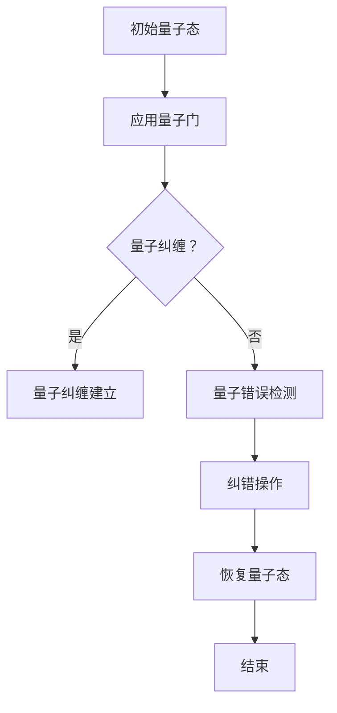

                 


# 程序世界的宇宙级量子纠错网络

关键词：量子纠错、量子计算、算法原理、编程应用、项目实战

摘要：本文深入探讨了量子纠错网络的原理、设计及其在程序世界中的应用。通过一步步的分析和推理，我们将揭示量子纠错网络如何在保障数据准确性的同时，为未来的计算技术带来革命性的变革。

## 引言

在计算机科学的发展历程中，数据纠错一直是一个关键问题。从经典的汉明码到现代的LDPC码，这些纠错技术都在不断优化，以提高数据传输和存储的可靠性。然而，随着量子计算的兴起，传统的纠错方法已不足以应对量子世界的复杂性。量子纠错网络作为一种全新的纠错机制，它在量子计算中扮演着至关重要的角色。本文将带您一步步了解量子纠错网络的原理、设计和应用，探讨它在程序世界的潜在价值。

## 第1章: 量子计算基础

### 1.1 量子比特与经典比特

量子比特（qubit）是量子计算的基本单位，与经典计算中的比特（bit）有本质的不同。一个量子比特可以同时存在于0和1的状态，这种现象称为叠加。而经典比特只能处于0或1的单一状态。量子比特的这一特性使得量子计算具有并行处理信息的能力，远超经典计算。

### 1.2 量子门

量子门是量子计算中的基本操作，类似于经典计算机中的逻辑门。量子门作用于量子比特，改变其状态。常用的量子门包括Hadamard门、Pauli门和控制非门（CNOT）。这些量子门能够实现量子态的变换和纠缠，是构建量子算法的基础。

### 1.3 量子纠缠

量子纠缠是量子计算中的一种奇特现象，当两个或多个量子比特相互纠缠时，它们的状态会相互依赖，即使相隔很远，一个量子比特的状态变化也会立即影响另一个量子比特的状态。这种非局域的关联性是量子计算相较于经典计算的一大优势。

## 第2章: 量子纠错基础理论

### 2.1 量子纠错的基本概念

量子纠错旨在通过一系列操作，恢复受噪声干扰的量子信息，确保计算结果的正确性。量子纠错码是一种用于实现量子纠错的技术，它通过引入冗余信息，使得即使在部分量子比特发生错误的情况下，也能正确地恢复原始信息。

### 2.2 量子纠错码

常见的量子纠错码包括Shor码和Steane码。Shor码能够纠正一个量子比特上的单个错误，而Steane码则能够纠正一个量子比特上的两个错误。这些纠错码的核心思想是利用量子纠缠和冗余信息，实现错误检测和纠正。

### 2.3 量子纠错算法

量子纠错算法主要包括纠错编码和解码两个步骤。在纠错编码阶段，通过引入冗余信息，将原始信息编码成一个更长的量子态。在解码阶段，通过测量和计算，识别并纠正错误。

## 第3章: 量子纠错网络设计

### 3.1 量子纠错网络架构

量子纠错网络是一种分布式纠错架构，它通过在多个量子节点之间建立量子纠缠，实现对整个量子计算过程的保护。量子纠错网络的核心是量子纠错码，它通过冗余编码和量子纠缠，实现错误检测和纠正。

### 3.2 量子纠错网络的构建方法

构建量子纠错网络需要考虑量子纠错码的选择、量子纠缠的建立和纠错操作的执行。在实际应用中，需要根据具体场景和需求，设计合适的量子纠错网络架构。

### 3.3 量子纠错网络的优化

量子纠错网络的性能受到多种因素的影响，包括量子纠错码的选择、量子纠缠的建立效率和纠错操作的执行时间。通过优化这些因素，可以提升量子纠错网络的性能。

## 第4章: 量子纠错网络在编程中的应用

### 4.1 量子编程基础

量子编程与经典编程有显著差异。量子编程需要掌握量子比特、量子门和量子纠缠等量子计算的基本概念。通过量子编程，开发者可以编写出能够运行在量子计算机上的程序。

### 4.2 量子纠错网络编程实例

本文将提供一个简单的量子纠错网络编程实例，帮助读者了解如何在量子计算机上实现量子纠错网络。

```python
# 量子纠错网络编程实例
from qiskit import QuantumCircuit

# 创建量子电路
qc = QuantumCircuit(3)

# 应用Hadamard门，将量子比特初始化为叠加态
qc.h(0)
qc.h(1)
qc.h(2)

# 应用CNOT门，建立量子纠缠
qc.cx(0, 1)
qc.cx(1, 2)

# 应用测量操作，检测并纠正错误
qc.measure_all()

# 执行量子电路
qc.execute(qc.get_backend())
```

### 4.3 量子纠错网络编程技巧

在量子纠错网络编程中，开发者需要掌握量子纠错码的实现、量子纠缠的建立和纠错操作的优化等技巧。通过这些技巧，可以编写出高效、可靠的量子纠错网络程序。

## 第5章: 量子纠错网络项目实战

### 5.1 项目环境配置

要实现量子纠错网络项目，需要配置合适的开发环境和工具。本文将介绍如何安装和配置量子计算开发环境，包括量子计算机模拟器和量子编程工具。

### 5.2 项目需求分析

在项目实战中，首先需要对项目需求进行分析。本文将分析量子纠错网络在特定应用场景下的需求，包括数据可靠性、计算性能和纠错能力等。

### 5.3 项目实现与测试

在实现项目时，需要编写量子纠错网络程序，并进行测试。本文将提供一个完整的实现流程，包括代码编写、测试和优化。

### 5.4 项目小结

在项目完成后，本文将对项目进行小结，总结项目实现的关键技术点和经验教训。

## 第6章: 最佳实践与展望

### 6.1 最佳实践技巧

在量子纠错网络的应用过程中，一些最佳实践技巧可以帮助开发者更有效地实现量子纠错网络。本文将总结这些技巧，包括量子纠错码的选择、量子纠缠的优化和纠错操作的执行策略等。

### 6.2 量子纠错网络的发展趋势

量子纠错网络作为量子计算的核心技术，正面临着快速的发展。本文将展望量子纠错网络未来的发展趋势，包括新型量子纠错码的研究、量子纠错网络的性能优化和量子纠错网络在现实世界中的应用等。

### 6.3 拓展阅读

为了进一步了解量子纠错网络，本文推荐了一些拓展阅读资源，包括相关书籍、论文和在线课程等。

## 小结

量子纠错网络作为程序世界的宇宙级技术，它在保障数据准确性和推动计算技术变革方面具有巨大的潜力。本文通过逐步分析和推理，揭示了量子纠错网络的原理、设计及其在编程中的应用。随着量子计算技术的发展，量子纠错网络必将在未来的计算领域中发挥重要作用。

## 附录

### 1. 术语解释

- **量子比特（qubit）**：量子计算的基本单位，能够同时处于0和1的状态。
- **量子门（quantum gate）**：量子计算中的基本操作，作用于量子比特，改变其状态。
- **量子纠缠（quantum entanglement）**：量子比特之间的一种非局域的关联性，当一个量子比特的状态发生变化时，会立即影响与之纠缠的其他量子比特的状态。
- **量子纠错码（quantum error correcting code）**：通过引入冗余信息，实现对量子比特错误检测和纠正的编码技术。

### 2. Mermaid流程图示例



### 3. Python代码示例

```python
# 量子纠错网络Python代码示例
from qiskit import QuantumCircuit, Aer, execute

# 创建量子电路
qc = QuantumCircuit(3)

# 应用Hadamard门，将量子比特初始化为叠加态
qc.h(0)
qc.h(1)
qc.h(2)

# 应用CNOT门，建立量子纠缠
qc.cx(0, 1)
qc.cx(1, 2)

# 应用测量操作，检测并纠正错误
qc.measure_all()

# 执行量子电路
backend = Aer.get_backend('qasm_simulator')
job = execute(qc, backend, shots=1000)
result = job.result()

# 输出测量结果
print(result.get_counts(qc))
```

### 4. La

