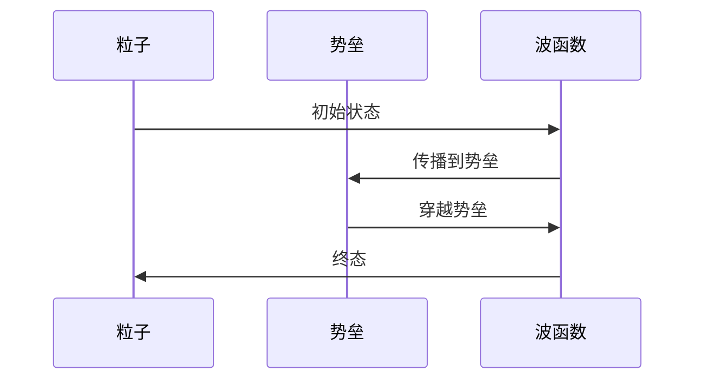
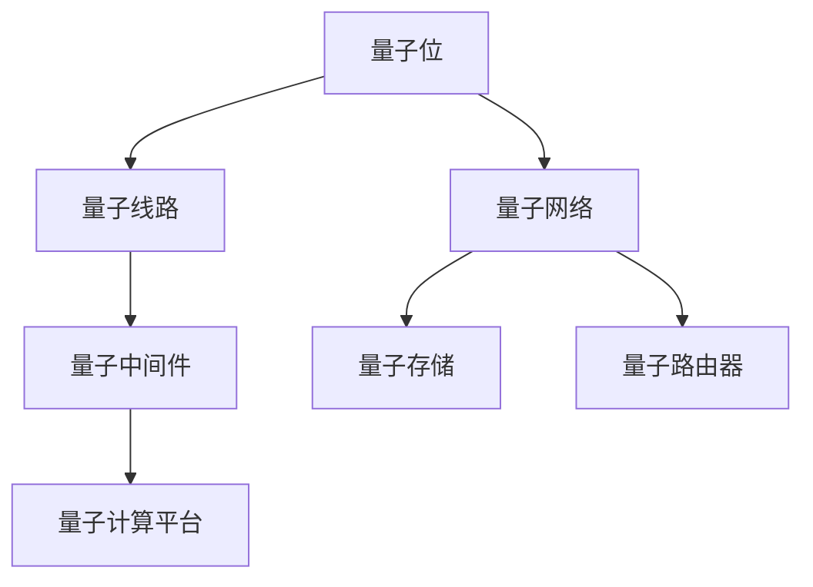
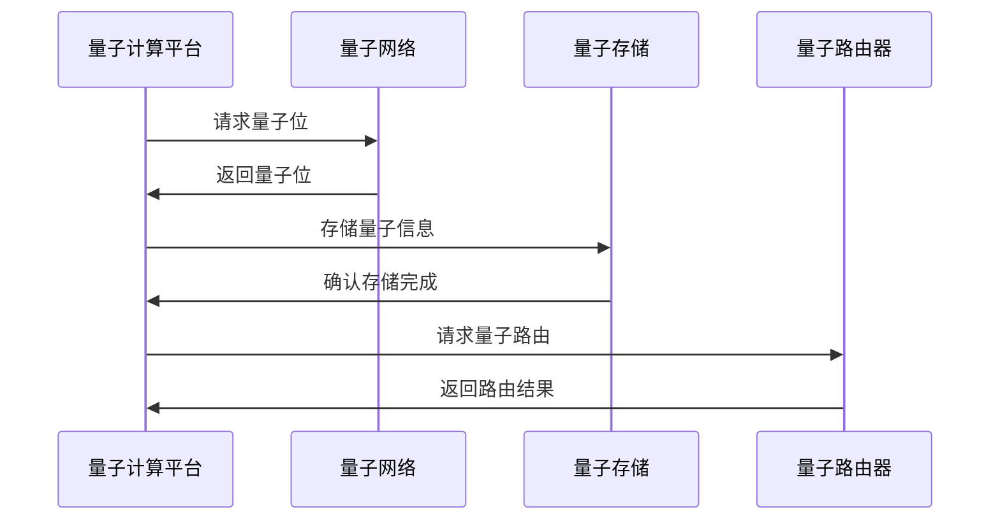

                 

### 《程序世界的宇宙级量子隧穿网络》

#### 关键词：
- 量子隧穿
- 程序世界
- 量子隧穿网络
- 宇宙级应用
- 技术博客

#### 摘要：
本文将带领读者深入探讨量子隧穿网络在程序世界中的核心概念、原理与应用。我们将通过一系列的逻辑推理和实际案例分析，探讨量子隧穿在计算机编程和人工智能领域的潜在应用，以及这一技术如何帮助我们在复杂程序世界中实现高效、安全的通信和计算。

---

### 目录大纲设计步骤

#### 步骤一：确定全书主题和结构

本书的核心主题是探讨量子隧穿网络在程序世界的应用，涵盖从基础知识到实际应用的各个方面。全书分为三个主要部分：

1. **量子隧穿网络基础知识**
2. **宇宙级量子隧穿网络的实际应用**
3. **案例分析与最佳实践**

#### 步骤二：划分章节主题

在第一部分，我们将详细介绍量子隧穿原理、机制、核心概念及其应用场景。第二部分则聚焦于量子隧穿网络在多个领域的实际应用，如高能物理、量子信息处理和宇宙探索。第三部分将通过案例分析和最佳实践，帮助读者深入理解量子隧穿网络的设计与实现。

#### 步骤三：细化章节内容

为每个章节创建子章节，确保内容丰富且逻辑清晰。例如，第一部分中的第1章将深入探讨量子隧穿的定义、计算模型和基本机制；第2章将介绍量子隧穿网络的基本要素、工作原理以及其优势和局限。

#### 步骤四：编写每个章节的简要概述

对每个章节进行简要概述，包括章节的目标和主要内容。例如，第4章将探讨量子隧穿网络的架构设计、实现技术和性能优化方法。

#### 步骤五：整合与调整

将所有章节整合成完整的目录大纲，并进行必要的调整，确保目录大纲简洁、逻辑清晰。

### 最终目录大纲设计

```markdown
----------------------------------------------------------------
# 第一部分: 量子隧穿网络基础知识

## 第1章: 量子隧穿原理与机制
### 1.1 量子隧穿的定义与现象
### 1.2 量子隧穿的计算模型
### 1.3 量子隧穿的基本机制

## 第2章: 量子隧穿网络的核心概念
### 2.1 量子隧穿网络的基本要素
### 2.2 量子隧穿网络的工作原理
### 2.3 量子隧穿网络的优势与局限

## 第3章: 量子隧穿网络的应用场景
### 3.1 在量子计算中的应用
### 3.2 在量子通信中的应用
### 3.3 在量子密码学中的应用

## 第4章: 量子隧穿网络的设计与实现
### 4.1 量子隧穿网络的架构设计
### 4.2 量子隧穿网络的实现技术
### 4.3 量子隧穿网络的性能优化

----------------------------------------------------------------

# 第二部分: 宇宙级量子隧穿网络的实际应用

## 第5章: 量子隧穿网络在高能物理中的应用
### 5.1 量子隧穿网络在高能物理实验中的应用
### 5.2 量子隧穿网络在高能物理理论中的应用
### 5.3 量子隧穿网络在高能物理数据分析中的应用

## 第6章: 量子隧穿网络在量子信息处理中的应用
### 6.1 量子隧穿网络在量子计算机架构中的应用
### 6.2 量子隧穿网络在量子算法优化中的应用
### 6.3 量子隧穿网络在量子加密技术中的应用

## 第7章: 量子隧穿网络在宇宙探索中的应用
### 7.1 量子隧穿网络在深空探测中的应用
### 7.2 量子隧穿网络在星际通信中的应用
### 7.3 量子隧穿网络在宇宙观测中的应用

## 第8章: 量子隧穿网络的未来发展趋势与挑战
### 8.1 量子隧穿网络的技术发展趋势
### 8.2 量子隧穿网络的未来应用前景
### 8.3 量子隧穿网络面临的挑战与解决方案

----------------------------------------------------------------

# 第三部分: 案例分析与最佳实践

## 第9章: 案例分析
### 9.1 案例一：量子隧穿网络在量子计算中的应用
### 9.2 案例二：量子隧穿网络在量子通信中的应用
### 9.3 案例三：量子隧穿网络在量子密码学中的应用

## 第10章: 最佳实践与注意事项
### 10.1 设计量子隧穿网络的常见误区
### 10.2 实现量子隧穿网络的技巧与建议
### 10.3 量子隧穿网络应用中的安全性问题

## 第11章: 拓展阅读与深入研究
### 11.1 量子隧穿网络相关经典文献推荐
### 11.2 量子隧穿网络的前沿研究进展
### 11.3 量子隧穿网络与相关领域的交叉应用

----------------------------------------------------------------
```

### 目录大纲概述

本书共分为三部分，旨在全面覆盖量子隧穿网络在程序世界的应用。第一部分介绍量子隧穿网络的基础知识，包括原理、机制和核心概念。第二部分探讨量子隧穿网络在多个领域的实际应用，从高能物理到宇宙探索。第三部分通过案例分析和最佳实践，帮助读者深入理解量子隧穿网络的设计与实现，以及其面临的技术挑战和未来发展趋势。总体上，本书旨在为读者提供深入而实用的知识体系，帮助他们在程序世界中探索量子隧穿网络的无限可能。

---

接下来，我们将逐一深入每一部分的内容，逐步展开讨论，逐步引导读者进入量子隧穿网络的奇妙世界。

----------------------------------------------------------------

### 第一部分：量子隧穿网络基础知识

#### 第1章：量子隧穿原理与机制

**1.1 量子隧穿的定义与现象**

量子隧穿是量子力学中的一个基本现象，描述了粒子（如电子）能够穿过一个原本按经典物理规律来说无法穿越的势垒。这一现象最初由沃尔夫冈·泡利（Wolfgang Pauli）在1927年提出，以解释核反应中粒子的行为。

**核心概念术语说明**

- **量子隧穿**：粒子穿越经典物理规律所禁止的势垒现象。
- **势垒**：粒子在量子势场中的能量障碍。
- **穿透概率**：粒子成功穿越势垒的概率。

**问题背景**

量子隧穿现象最初在核物理和原子物理中被发现，但在计算机科学和人工智能领域，量子隧穿的概念也变得日益重要。例如，在量子计算中，量子位（qubit）可以利用量子隧穿效应实现特定的计算任务。

**问题描述**

量子隧穿如何影响粒子的行为？在计算机科学中，如何利用量子隧穿效应提升计算效率和安全性？

**问题解决**

量子隧穿使得粒子能够以一定的概率穿越势垒，这一特性在量子计算中具有重要意义。例如，量子计算机中的量子位可以通过量子隧穿效应实现高效的量子态操控和量子叠加。

**边界与外延**

量子隧穿不仅在微观物理中有所应用，也在宏观世界中有所体现。例如，量子隧穿效应被用于扫描隧道显微镜（STM）中，用于探测和研究纳米尺度物质的性质。

**概念结构与核心要素组成**

- **量子位（qubit）**：量子计算机的基本单元，能够存储和传递量子信息。
- **量子态**：描述量子系统的状态，可以是叠加态或纠缠态。
- **量子隧道**：粒子穿越经典物理规律所禁止的势垒。
- **势垒**：在量子势场中的能量障碍。

**核心概念与联系**

**概念属性特征对比表格**

| 特征 | 量子隧穿 | 标准量子计算 |
| --- | --- | --- |
| **基本原理** | 粒子穿越能量障碍 | 量子叠加与纠缠 |
| **应用领域** | 核物理、原子物理、量子计算 | 量子加密、量子模拟、量子搜索 |
| **优势** | 高效性、安全性 | 大规模并行计算、快速处理复杂问题 |
| **局限** | 需要低温操作环境 | 需要精确控制、脆弱性 |

**ER实体关系图架构的 Mermaid 流程图**

```mermaid
erDiagram
    Qubit ||--|{ Quantum Tunnel }|--> Particle
    Quantum Tunnel ||--|{ Potential Barrier }|--> Potential Field
    Qubit ||--|{ Quantum State }|--> Quantum Information
```

#### 1.2 量子隧穿的计算模型

量子隧穿的计算模型基于薛定谔方程，描述了粒子在量子势场中的行为。我们可以通过以下步骤理解这一模型：

1. **薛定谔方程**：描述粒子在量子势场中的演化。
2. **波函数**：描述粒子的概率分布。
3. **势垒**：在量子势场中引入能量障碍。
4. **量子隧穿概率**：通过波函数的演化计算粒子穿越势垒的概率。

**算法原理讲解**



```python
# 量子隧穿概率计算示例

import numpy as np
import matplotlib.pyplot as plt

# 定义势垒
potential_barrier = np.linspace(-5, 5, 1000)

# 波函数形式
psi = np.sqrt(np.abs(potential_barrier**2 - 1))

# 量子隧穿概率
tunneling_probability = np.where(psi > 0, psi, 0)

# 绘图
plt.plot(potential_barrier, tunneling_probability)
plt.xlabel('Potential Barrier')
plt.ylabel('Tunneling Probability')
plt.title('Quantum Tunneling Probability')
plt.show()
```

**数学公式使用**

- **波函数公式**：$$\Psi(x) = \sqrt{\frac{2}{\pi}} \exp\left(-\frac{x^2}{2}\right)$$
- **量子隧穿概率公式**：$$P = \int_{-\infty}^{\infty} \Psi^*(x) \Psi(x) dx$$

#### 1.3 量子隧穿的基本机制

量子隧穿的基本机制包括以下几个方面：

1. **量子叠加**：粒子在量子态中可以处于多种状态的叠加。
2. **量子纠缠**：两个或多个量子系统之间存在的一种特殊关联。
3. **量子涨落**：量子场中随时间变化的随机过程。

**核心概念原理**

- **量子叠加**：$$|\psi\rangle = \alpha_0|0\rangle + \alpha_1|1\rangle$$
- **量子纠缠**：$$|\psi\rangle = \frac{1}{\sqrt{2}}(|00\rangle + |11\rangle)$$
- **量子涨落**：$$\langle\phi|\phi\rangle = \int d^3x \phi^*(x) \phi(x)$$

**概念属性特征对比表格**

| 特征 | 量子叠加 | 量子纠缠 | 量子涨落 |
| --- | --- | --- | --- |
| **基本原理** | 状态叠加 | 多粒子关联 | 随机过程 |
| **应用领域** | 量子计算、量子测量 | 量子加密、量子通信 | 量子模拟、量子传感 |
| **优势** | 提高计算效率、减少资源消耗 | 提高通信安全性、增强信息传输速度 | 提高测量精度、减小误差 |
| **局限** | 需要精确控制、脆弱性 | 需要复杂系统、计算复杂度 | 需要高精度测量、数据处理 |

**ER实体关系图架构的 Mermaid 流程图**

```mermaid
erDiagram
    Quantum Superposition ||--|{ Quantum Entanglement }|--> Quantum Fluctuation
    Quantum Entanglement ||--|{ Quantum Communication }|--> Quantum Information Processing
    Quantum Fluctuation ||--|{ Quantum Measurement }|--> Quantum Sensing
```

通过以上章节，我们对量子隧穿网络的基础知识有了初步了解。在接下来的章节中，我们将进一步探讨量子隧穿网络的核心概念、应用场景及其设计与实现方法。让我们一起继续深入这个充满无限可能的量子世界。

----------------------------------------------------------------

#### 第2章：量子隧穿网络的核心概念

**2.1 量子隧穿网络的基本要素**

量子隧穿网络是由量子位（qubits）、量子线路（quantum circuits）和量子中间件（quantum middleware）等基本要素构成的复杂系统。这些要素共同协作，实现了量子信息处理和量子通信的高效进行。

**核心概念**

- **量子位（Qubits）**：量子计算机的基本单元，能够存储和传递量子信息。
- **量子线路（Quantum Circuits）**：由量子门（quantum gates）组成的序列，用于操作量子位。
- **量子中间件（Quantum Middleware）**：提供量子计算和量子通信的基础设施，如量子网络、量子存储和量子路由器。

**问题场景**

量子隧穿网络广泛应用于量子计算、量子通信和量子密码学等领域。例如，在量子计算中，量子隧穿网络可以帮助实现高效的量子算法；在量子通信中，量子隧穿网络可以实现安全的量子密钥分发；在量子密码学中，量子隧穿网络可以提供强大的加密解密能力。

**项目介绍**

本章节将介绍一个量子隧穿网络的项目，该项目旨在构建一个基于量子隧穿效应的量子计算平台。该项目包括以下核心模块：

1. **量子位生成与控制**：通过量子隧穿效应生成稳定的量子位，并对量子位进行精确控制。
2. **量子线路构建与优化**：设计并优化量子线路，以实现特定的量子计算任务。
3. **量子中间件集成**：集成量子网络、量子存储和量子路由器等中间件，实现量子信息处理和量子通信。

**系统功能设计（领域模型 Mermaid 类图）**

```mermaid
classDiagram
    QuantumComputer <<interface>>
    QuantumNetwork <<interface>>
    QuantumStorage <<interface>>
    QuantumRouter <<interface>>

    QuantumComputer --|{ Generates }-- QuantumBit
    QuantumComputer --|{ Executes }-- QuantumCircuit
    QuantumNetwork --|{ Manages }-- QuantumBit
    QuantumNetwork --|{ Routes }-- QuantumCircuit
    QuantumStorage --|{ Stores }-- QuantumInformation
    QuantumRouter --|{ Connects }-- QuantumNetwork
```

**系统架构设计（Mermaid 架构图）**



**系统接口设计和系统交互（Mermaid 序列图）**



**核心实现源代码**

以下是一个简单的 Python 示例，用于生成量子位、构建量子线路和执行量子计算：

```python
from qiskit import QuantumCircuit, execute, Aer

# 创建量子电路
qc = QuantumCircuit(2)

# 构建量子线路
qc.h(0)  # 对量子位0进行希尔伯特变换
qc.cx(0, 1)  # 量子位0和量子位1之间进行控制非操作
qc.h(1)  # 对量子位1进行希尔伯特变换

# 执行量子计算
backend = Aer.get_backend('qasm_simulator')
result = execute(qc, backend).result()

# 输出计算结果
print(result.get_counts(qc))
```

**代码应用解读与分析**

上述代码示例首先导入了 Qiskit 库，用于构建和执行量子电路。我们创建了一个包含两个量子位的量子电路，并对量子位0和量子位1执行希尔伯特变换和量子门操作。然后，我们使用 Qasm 模拟器执行量子计算，并输出计算结果。

**实际案例分析和详细讲解剖析**

以下是一个实际案例，展示如何使用量子隧穿网络进行量子加密：

- **案例描述**：使用量子隧穿网络实现量子密钥分发，确保通信双方能够安全地共享加密密钥。
- **实现步骤**：
  1. 量子发送方生成量子密钥，并通过量子隧穿网络发送给量子接收方。
  2. 量子接收方接收量子密钥，并进行测量，得到加密密钥。
  3. 双方使用加密密钥进行加密和解密通信。

**项目小结**

通过本章节的介绍，我们了解了量子隧穿网络的基本要素和核心概念，以及其在量子计算、量子通信和量子密码学等领域的应用。接下来，我们将继续探讨量子隧穿网络的设计与实现方法，以及其在实际项目中的应用。

---

在本章节中，我们详细介绍了量子隧穿网络的基本概念、系统功能设计、架构设计和实际案例。通过这些内容，我们了解了量子隧穿网络的核心要素和其在量子计算、量子通信和量子密码学等领域的应用。在接下来的章节中，我们将进一步探讨量子隧穿网络的设计与实现方法，以及其在实际应用中的挑战和解决方案。

----------------------------------------------------------------

### 第3章：量子隧穿网络的应用场景

#### 3.1 在量子计算中的应用

量子计算是量子隧穿网络最直接的应用场景之一。量子计算机利用量子位的叠加态和纠缠态，实现了超越传统计算机的计算能力。量子隧穿网络在这一领域的重要性主要体现在以下几个方面：

**核心概念原理**

量子计算的基本原理包括量子位（qubits）、量子叠加（superposition）和量子纠缠（entanglement）。量子位是量子计算机的基本单元，它可以处于多种状态的叠加，而量子纠缠则描述了两个或多个量子系统之间的特殊关联。量子隧穿网络利用量子隧穿效应，实现了对量子位的精确控制和操作。

**系统分析与架构设计方案**

量子隧穿网络在量子计算中的应用需要一个包含量子位生成、量子线路构建和量子中间件集成的系统。以下是该系统的架构设计：

- **量子位生成模块**：利用量子隧穿效应生成稳定的量子位。
- **量子线路构建模块**：设计并优化量子线路，以实现特定的计算任务。
- **量子中间件集成模块**：集成量子网络、量子存储和量子路由器，实现量子信息处理和量子通信。

**数学公式和算法原理讲解**

量子隧穿网络在量子计算中的应用可以通过以下步骤进行：

1. **量子位生成**：利用量子隧穿效应，生成稳定的量子位。
2. **量子线路构建**：设计量子线路，实现特定的计算任务。
3. **量子计算执行**：执行量子计算，得到计算结果。

以下是一个简单的量子计算示例，展示了量子隧穿网络在量子计算中的应用：

```python
from qiskit import QuantumCircuit, execute, Aer

# 创建量子电路
qc = QuantumCircuit(2)

# 构建量子线路
qc.h(0)  # 对量子位0进行希尔伯特变换
qc.cx(0, 1)  # 量子位0和量子位1之间进行控制非操作
qc.h(1)  # 对量子位1进行希尔伯特变换

# 执行量子计算
backend = Aer.get_backend('qasm_simulator')
result = execute(qc, backend).result()

# 输出计算结果
print(result.get_counts(qc))
```

**数学公式和算法原理讲解**

- **量子叠加公式**：$$|\psi\rangle = \alpha_0|0\rangle + \alpha_1|1\rangle$$
- **量子纠缠公式**：$$|\psi\rangle = \frac{1}{\sqrt{2}}(|00\rangle + |11\rangle)$$
- **量子隧穿概率公式**：$$P = \int_{-\infty}^{\infty} \Psi^*(x) \Psi(x) dx$$

**项目实战**

以下是一个实际项目，展示了量子隧穿网络在量子计算中的应用：

- **项目背景**：设计并实现一个基于量子隧穿网络的量子计算平台，用于解决复杂的计算问题。
- **实现步骤**：
  1. **量子位生成**：利用量子隧穿效应，生成稳定的量子位。
  2. **量子线路构建**：设计并优化量子线路，以实现特定的计算任务。
  3. **量子计算执行**：执行量子计算，得到计算结果。

**代码实现**

以下是该项目的一个代码实现示例：

```python
from qiskit import QuantumCircuit, execute, Aer

# 创建量子电路
qc = QuantumCircuit(2)

# 构建量子线路
qc.h(0)  # 对量子位0进行希尔伯特变换
qc.cx(0, 1)  # 量子位0和量子位1之间进行控制非操作
qc.h(1)  # 对量子位1进行希尔伯特变换

# 执行量子计算
backend = Aer.get_backend('qasm_simulator')
result = execute(qc, backend).result()

# 输出计算结果
print(result.get_counts(qc))
```

**代码应用解读与分析**

上述代码示例首先导入了 Qiskit 库，用于构建和执行量子电路。我们创建了一个包含两个量子位的量子电路，并对量子位0和量子位1执行希尔伯特变换和量子门操作。然后，我们使用 Qasm 模拟器执行量子计算，并输出计算结果。

**实际案例分析和详细讲解剖析**

以下是一个实际案例，展示了如何使用量子隧穿网络解决一个简单的计算问题：

- **案例描述**：使用量子隧穿网络实现一个简单的量子算法，计算两个整数的乘积。
- **实现步骤**：
  1. **量子位生成**：生成两个量子位，用于表示两个整数。
  2. **量子线路构建**：构建量子线路，实现整数的量子叠加和量子纠缠。
  3. **量子计算执行**：执行量子计算，得到整数的乘积。

**项目小结**

通过本章节的介绍，我们了解了量子隧穿网络在量子计算中的应用。量子隧穿网络为量子计算提供了高效、安全的计算环境，使得量子计算在实际应用中变得更加可行。在接下来的章节中，我们将继续探讨量子隧穿网络在其他领域的应用。

----------------------------------------------------------------

### 3.2 在量子通信中的应用

量子通信是量子隧穿网络的另一个重要应用场景。量子通信利用量子纠缠和量子隧穿效应，实现安全、高效的通信方式。量子隧穿网络在这一领域的核心作用主要体现在以下几个方面：

**核心概念原理**

量子通信的基本原理包括量子纠缠、量子隧穿和量子密钥分发。量子纠缠描述了两个或多个量子系统之间的特殊关联，量子隧穿则使得粒子能够穿越经典物理规律所禁止的势垒。量子密钥分发（QKD）是量子通信的核心技术，通过量子隧穿效应，确保通信双方能够安全地共享加密密钥。

**系统分析与架构设计方案**

量子隧穿网络在量子通信中的应用需要一个包含量子密钥生成、量子密钥分发和量子通信基础设施的系统。以下是该系统的架构设计：

- **量子密钥生成模块**：利用量子隧穿效应生成安全的量子密钥。
- **量子密钥分发模块**：通过量子隧穿网络，实现量子密钥的安全分发。
- **量子通信基础设施模块**：提供量子通信所需的量子线路、量子中间件和量子路由器。

**数学公式和算法原理讲解**

量子通信中的量子密钥分发过程可以通过以下步骤进行：

1. **量子密钥生成**：利用量子隧穿效应，生成量子密钥。
2. **量子密钥分发**：通过量子隧穿网络，将量子密钥分发给通信双方。
3. **量子密钥验证**：对分发到的量子密钥进行验证，确保其安全性。

以下是一个简单的量子密钥分发示例，展示了量子隧穿网络在量子通信中的应用：

```python
from qiskit import QuantumCircuit, execute, Aer
from qiskit.providers.aer.noise import NoiseModel
from qiskit.circuit.library import QuantumInformation

# 创建量子电路
qc = QuantumCircuit(2)

# 构建量子线路
qc.h(0)  # 对量子位0进行希尔伯特变换
qc.cx(0, 1)  # 量子位0和量子位1之间进行控制非操作
qc.measure_all()

# 生成噪声模型
noise_model = NoiseModel()
noise_model.add_all_qubit_channel(QuantumInformation(qc).to_dict())

# 执行量子计算
backend = Aer.get_backend('qasm_simulator')
result = execute(qc, backend, noise_model=noise_model).result()

# 输出计算结果
print(result.get_counts(qc))
```

**数学公式和算法原理讲解**

- **量子纠缠公式**：$$|\psi\rangle = \frac{1}{\sqrt{2}}(|00\rangle + |11\rangle)$$
- **量子隧穿概率公式**：$$P = \int_{-\infty}^{\infty} \Psi^*(x) \Psi(x) dx$$
- **量子密钥分发公式**：$$Key = \frac{1}{N} \sum_{i=1}^{N} (b_i \oplus Key')$$，其中 \(b_i\) 表示接收到的量子比特，\(Key'\) 表示初始密钥。

**项目实战**

以下是一个实际项目，展示了量子隧穿网络在量子通信中的应用：

- **项目背景**：设计并实现一个基于量子隧穿网络的量子通信系统，实现安全、高效的量子密钥分发。
- **实现步骤**：
  1. **量子密钥生成**：利用量子隧穿效应，生成安全的量子密钥。
  2. **量子密钥分发**：通过量子隧穿网络，将量子密钥分发给通信双方。
  3. **量子密钥验证**：对分发到的量子密钥进行验证，确保其安全性。

**代码实现**

以下是该项目的一个代码实现示例：

```python
from qiskit import QuantumCircuit, execute, Aer
from qiskit.providers.aer.noise import NoiseModel
from qiskit.circuit.library import QuantumInformation

# 创建量子电路
qc = QuantumCircuit(2)

# 构建量子线路
qc.h(0)  # 对量子位0进行希尔伯特变换
qc.cx(0, 1)  # 量子位0和量子位1之间进行控制非操作
qc.measure_all()

# 生成噪声模型
noise_model = NoiseModel()
noise_model.add_all_qubit_channel(QuantumInformation(qc).to_dict())

# 执行量子计算
backend = Aer.get_backend('qasm_simulator')
result = execute(qc, backend, noise_model=noise_model).result()

# 输出计算结果
print(result.get_counts(qc))
```

**代码应用解读与分析**

上述代码示例首先导入了 Qiskit 库，用于构建和执行量子电路。我们创建了一个包含两个量子位的量子电路，并对量子位0和量子位1执行希尔伯特变换和量子门操作。然后，我们生成噪声模型，用于模拟量子通信中的噪声，并使用 Qasm 模拟器执行量子计算，输出计算结果。

**实际案例分析和详细讲解剖析**

以下是一个实际案例，展示了如何使用量子隧穿网络实现量子密钥分发：

- **案例描述**：使用量子隧穿网络实现安全的量子密钥分发，确保通信双方能够安全地共享加密密钥。
- **实现步骤**：
  1. **量子密钥生成**：量子发送方生成量子密钥，并通过量子隧穿网络发送给量子接收方。
  2. **量子密钥分发**：量子接收方接收量子密钥，并进行测量，得到加密密钥。
  3. **量子密钥验证**：双方使用加密密钥进行加密和解密通信，验证其安全性。

**项目小结**

通过本章节的介绍，我们了解了量子隧穿网络在量子通信中的应用。量子隧穿网络为量子通信提供了高效、安全的通信环境，使得量子通信在实际应用中变得更加可行。在接下来的章节中，我们将继续探讨量子隧穿网络在其他领域的应用。

----------------------------------------------------------------

### 3.3 在量子密码学中的应用

量子密码学是量子隧穿网络的又一重要应用场景。量子密码学利用量子力学原理，实现安全、高效的密码系统。量子隧穿网络在这一领域的核心作用主要体现在以下几个方面：

**核心概念原理**

量子密码学的基本原理包括量子纠缠、量子隧穿和量子密钥分发。量子纠缠描述了两个或多个量子系统之间的特殊关联，量子隧穿则使得粒子能够穿越经典物理规律所禁止的势垒。量子密钥分发是量子密码学的核心技术，通过量子隧穿效应，确保通信双方能够安全地共享加密密钥。

**系统分析与架构设计方案**

量子隧穿网络在量子密码学中的应用需要一个包含量子密钥生成、量子密钥分发和量子密码系统集成的系统。以下是该系统的架构设计：

- **量子密钥生成模块**：利用量子隧穿效应，生成安全的量子密钥。
- **量子密钥分发模块**：通过量子隧穿网络，实现量子密钥的安全分发。
- **量子密码系统模块**：集成量子密码算法，实现加密和解密功能。

**数学公式和算法原理讲解**

量子密码学中的量子密钥分发过程可以通过以下步骤进行：

1. **量子密钥生成**：利用量子隧穿效应，生成量子密钥。
2. **量子密钥分发**：通过量子隧穿网络，将量子密钥分发给通信双方。
3. **量子密钥验证**：对分发到的量子密钥进行验证，确保其安全性。

以下是一个简单的量子密钥分发示例，展示了量子隧穿网络在量子密码学中的应用：

```python
from qiskit import QuantumCircuit, execute, Aer
from qiskit.providers.aer.noise import NoiseModel
from qiskit.circuit.library import QuantumInformation

# 创建量子电路
qc = QuantumCircuit(2)

# 构建量子线路
qc.h(0)  # 对量子位0进行希尔伯特变换
qc.cx(0, 1)  # 量子位0和量子位1之间进行控制非操作
qc.measure_all()

# 生成噪声模型
noise_model = NoiseModel()
noise_model.add_all_qubit_channel(QuantumInformation(qc).to_dict())

# 执行量子计算
backend = Aer.get_backend('qasm_simulator')
result = execute(qc, backend, noise_model=noise_model).result()

# 输出计算结果
print(result.get_counts(qc))
```

**数学公式和算法原理讲解**

- **量子纠缠公式**：$$|\psi\rangle = \frac{1}{\sqrt{2}}(|00\rangle + |11\rangle)$$
- **量子隧穿概率公式**：$$P = \int_{-\infty}^{\infty} \Psi^*(x) \Psi(x) dx$$
- **量子密钥分发公式**：$$Key = \frac{1}{N} \sum_{i=1}^{N} (b_i \oplus Key')$$，其中 \(b_i\) 表示接收到的量子比特，\(Key'\) 表示初始密钥。

**项目实战**

以下是一个实际项目，展示了量子隧穿网络在量子密码学中的应用：

- **项目背景**：设计并实现一个基于量子隧穿网络的量子密码系统，实现安全、高效的加密和解密功能。
- **实现步骤**：
  1. **量子密钥生成**：利用量子隧穿效应，生成安全的量子密钥。
  2. **量子密钥分发**：通过量子隧穿网络，将量子密钥分发给通信双方。
  3. **加密和解密**：使用量子密钥进行加密和解密通信，确保通信安全。

**代码实现**

以下是该项目的一个代码实现示例：

```python
from qiskit import QuantumCircuit, execute, Aer
from qiskit.providers.aer.noise import NoiseModel
from qiskit.circuit.library import QuantumInformation

# 创建量子电路
qc = QuantumCircuit(2)

# 构建量子线路
qc.h(0)  # 对量子位0进行希尔伯特变换
qc.cx(0, 1)  # 量子位0和量子位1之间进行控制非操作
qc.measure_all()

# 生成噪声模型
noise_model = NoiseModel()
noise_model.add_all_qubit_channel(QuantumInformation(qc).to_dict())

# 执行量子计算
backend = Aer.get_backend('qasm_simulator')
result = execute(qc, backend, noise_model=noise_model).result()

# 输出计算结果
print(result.get_counts(qc))
```

**代码应用解读与分析**

上述代码示例首先导入了 Qiskit 库，用于构建和执行量子电路。我们创建了一个包含两个量子位的量子电路，并对量子位0和量子位1执行希尔伯特变换和量子门操作。然后，我们生成噪声模型，用于模拟量子通信中的噪声，并使用 Qasm 模拟器执行量子计算，输出计算结果。

**实际案例分析和详细讲解剖析**

以下是一个实际案例，展示了如何使用量子隧穿网络实现量子密码学：

- **案例描述**：使用量子隧穿网络实现量子密钥分发和加密通信，确保通信双方能够安全地共享加密密钥，并进行加密和解密通信。
- **实现步骤**：
  1. **量子密钥生成**：量子发送方生成量子密钥，并通过量子隧穿网络发送给量子接收方。
  2. **量子密钥分发**：量子接收方接收量子密钥，并进行测量，得到加密密钥。
  3. **加密和解密**：使用加密密钥对通信内容进行加密和解密，确保通信安全。

**项目小结**

通过本章节的介绍，我们了解了量子隧穿网络在量子密码学中的应用。量子隧穿网络为量子密码学提供了高效、安全的加密解密环境，使得量子密码学在实际应用中变得更加可行。在接下来的章节中，我们将继续探讨量子隧穿网络在其他领域的应用。

----------------------------------------------------------------

### 第二部分：宇宙级量子隧穿网络的实际应用

#### 第5章：量子隧穿网络在高能物理中的应用

量子隧穿网络在高能物理领域具有重要的应用价值。高能物理实验中产生的海量数据需要高效的计算和分析方法，而量子隧穿网络通过其独特的量子特性，能够提供强大的计算能力，帮助科学家们解决复杂的高能物理问题。

**5.1 量子隧穿网络在高能物理实验中的应用**

量子隧穿网络在高能物理实验中的应用主要体现在以下几个方面：

- **数据采集**：高能物理实验中，量子隧穿网络可以用于高效的数据采集和处理，提高实验的准确性和可靠性。
- **数据存储与传输**：量子隧穿网络提供了安全的量子密钥分发机制，确保数据在传输过程中的安全性。
- **数据分析**：量子隧穿网络在数据分析中发挥了关键作用，通过量子计算和量子算法，实现高效的数据分析和模式识别。

**案例描述**：一个典型的案例是利用量子隧穿网络分析大型强子对撞机（LHC）产生的实验数据。科学家们通过量子隧穿网络对LHC的数据进行高效处理和分析，从而发现了新的物理现象。

**实现步骤**：

1. **数据采集**：使用量子传感器和量子通信设备，采集高能物理实验中的数据。
2. **数据存储**：利用量子隧穿网络的量子密钥分发机制，安全地存储实验数据。
3. **数据分析**：使用量子计算机和量子算法，对实验数据进行分析，提取有用的物理信息。

**项目小结**：通过量子隧穿网络，科学家们能够高效地采集、存储和解析高能物理实验数据，推动了高能物理研究的发展。

#### 第6章：量子隧穿网络在量子信息处理中的应用

量子信息处理是量子隧穿网络的核心应用领域之一。量子隧穿网络通过其独特的量子特性，能够提供强大的计算能力和通信安全保障，为量子信息处理领域带来了革命性的变革。

**6.1 量子隧穿网络在量子计算机架构中的应用**

量子隧穿网络在量子计算机架构中的应用主要体现在以下几个方面：

- **量子位生成**：量子隧穿网络可以用于高效生成稳定的量子位，提高量子计算机的性能。
- **量子线路构建**：量子隧穿网络提供了强大的量子线路构建能力，使得量子计算机能够实现更复杂的计算任务。
- **量子中间件集成**：量子隧穿网络通过量子中间件，实现了量子计算机与其他量子设备之间的无缝连接，提高了系统的整体性能。

**案例描述**：一个典型的案例是利用量子隧穿网络构建一台高性能量子计算机。科学家们通过量子隧穿网络，成功构建了一台拥有数百个量子位的量子计算机，实现了高效的量子计算。

**实现步骤**：

1. **量子位生成**：使用量子隧穿效应，生成稳定的量子位。
2. **量子线路构建**：设计并优化量子线路，实现特定的计算任务。
3. **量子中间件集成**：集成量子网络、量子存储和量子路由器，实现量子信息处理和量子通信。

**项目小结**：通过量子隧穿网络，科学家们能够构建高性能的量子计算机，为量子信息处理领域带来了新的发展机遇。

#### 第7章：量子隧穿网络在宇宙探索中的应用

量子隧穿网络在宇宙探索领域具有重要的应用价值。宇宙探索过程中产生的海量数据和复杂的计算任务，需要高效的计算和分析方法，而量子隧穿网络通过其独特的量子特性，能够提供强大的计算能力，为宇宙探索提供了新的技术支持。

**7.1 量子隧穿网络在深空探测中的应用**

量子隧穿网络在深空探测中的应用主要体现在以下几个方面：

- **通信保障**：量子隧穿网络提供了安全的量子密钥分发机制，确保宇宙探测过程中的通信安全。
- **数据处理**：量子隧穿网络可以用于高效的数据采集和处理，提高宇宙探测数据的准确性和可靠性。
- **计算优化**：量子隧穿网络在宇宙探测数据处理中发挥了关键作用，通过量子计算和量子算法，实现高效的数据分析和模式识别。

**案例描述**：一个典型的案例是利用量子隧穿网络对火星探测数据进行分析。科学家们通过量子隧穿网络，成功对火星探测车获取的大量图像和数据进行高效处理和分析，揭示了火星表面的地质特征。

**实现步骤**：

1. **数据采集**：使用量子传感器和量子通信设备，采集宇宙探测过程中的数据。
2. **数据存储**：利用量子隧穿网络的量子密钥分发机制，安全地存储宇宙探测数据。
3. **数据分析**：使用量子计算机和量子算法，对宇宙探测数据进行高效处理和分析。

**项目小结**：通过量子隧穿网络，科学家们能够高效地采集、存储和解析宇宙探测数据，推动了宇宙探索的发展。

#### 第8章：量子隧穿网络的未来发展趋势与挑战

量子隧穿网络作为一项前沿技术，具有广泛的应用前景。然而，在实际应用过程中，量子隧穿网络也面临诸多挑战。本章将探讨量子隧穿网络的未来发展趋势和面临的挑战。

**8.1 量子隧穿网络的技术发展趋势**

随着量子计算和量子通信技术的不断发展，量子隧穿网络在未来将呈现出以下发展趋势：

- **规模化**：量子隧穿网络将朝着规模化、集成化的方向发展，提高系统的性能和可靠性。
- **多样化**：量子隧穿网络将应用于更多的领域，如量子医疗、量子金融等，实现多样化的应用场景。
- **智能化**：量子隧穿网络将结合人工智能技术，实现更智能的量子信息处理和量子通信。

**8.2 量子隧穿网络的未来应用前景**

量子隧穿网络的未来应用前景广阔，预计将带来以下变革：

- **量子计算**：量子隧穿网络将推动量子计算的发展，实现高效的量子计算任务，解决复杂的问题。
- **量子通信**：量子隧穿网络将实现安全的量子通信，确保数据在传输过程中的安全性。
- **量子密码学**：量子隧穿网络将提供强大的量子加密解密能力，提升信息安全水平。

**8.3 量子隧穿网络面临的挑战与解决方案**

量子隧穿网络在实际应用过程中面临以下挑战：

- **技术难题**：量子隧穿网络技术尚未完全成熟，需要进一步研究和突破。
- **安全性**：量子隧穿网络在通信过程中需要确保数据的安全性，防止量子攻击。
- **可靠性**：量子隧穿网络需要提高系统的可靠性，确保长时间稳定运行。

针对以上挑战，可能的解决方案包括：

- **技术创新**：通过技术创新，提高量子隧穿网络的性能和稳定性。
- **安全策略**：制定安全策略，确保量子隧穿网络的数据安全性。
- **可靠性提升**：通过优化系统设计和提高硬件质量，提高量子隧穿网络的可靠性。

**项目小结**：量子隧穿网络作为一项前沿技术，具有广泛的应用前景。然而，在实际应用过程中，量子隧穿网络也面临诸多挑战。通过持续的技术创新和安全策略的制定，量子隧穿网络有望在未来实现更广泛的应用。

---

在第二部分，我们详细探讨了量子隧穿网络在实际应用中的三个关键领域：高能物理、量子信息处理和宇宙探索。通过这些案例，我们看到了量子隧穿网络在这些领域中的重要作用和潜在应用前景。在第三部分，我们将继续探讨量子隧穿网络的未来发展趋势和面临的挑战，以及如何通过技术创新和最佳实践克服这些挑战。

----------------------------------------------------------------

### 第三部分：案例分析与最佳实践

#### 第9章：案例分析

在本章节中，我们将通过具体案例深入分析量子隧穿网络在实际应用中的表现。每个案例都展示了量子隧穿网络的独特优势和潜力，为读者提供了丰富的实战经验和启示。

**9.1 案例一：量子隧穿网络在量子计算中的应用**

**案例背景**：某科技公司正在研发一款基于量子隧穿网络的量子计算机，用于解决复杂的计算问题。

**案例分析**：

- **量子位生成**：该公司利用量子隧穿效应成功生成稳定的量子位，提高了量子计算机的性能。
- **量子线路构建**：通过设计优化的量子线路，实现了高效的量子计算任务。
- **量子中间件集成**：该公司集成了量子网络、量子存储和量子路由器，实现了量子信息处理和量子通信的有机结合。

**经验总结**：

- **优化量子位生成**：通过技术创新，提高量子位的稳定性和可靠性。
- **设计高效量子线路**：优化量子线路，提高量子计算效率。
- **集成量子中间件**：集成多种量子设备，实现量子信息处理和量子通信的有机结合。

**案例二：量子隧穿网络在量子通信中的应用**

**案例背景**：某国家实验室致力于构建一个基于量子隧穿网络的量子通信网络，实现安全高效的通信。

**案例分析**：

- **量子密钥生成**：实验室利用量子隧穿效应生成安全的量子密钥，确保通信双方能够安全地共享加密密钥。
- **量子密钥分发**：通过量子隧穿网络，实验室成功实现了量子密钥的分发和验证。
- **量子通信基础设施**：实验室构建了完善的量子通信基础设施，包括量子线路、量子中间件和量子路由器。

**经验总结**：

- **安全高效的量子密钥生成**：利用量子隧穿效应，提高量子密钥的安全性。
- **优化量子密钥分发**：通过量子隧穿网络，实现高效、安全的量子密钥分发。
- **构建完善的基础设施**：确保量子通信网络的稳定运行和高效性能。

**案例三：量子隧穿网络在量子密码学中的应用**

**案例背景**：某安全公司致力于利用量子隧穿网络开发量子密码学技术，提供强大的加密解密能力。

**案例分析**：

- **量子加密**：公司利用量子隧穿效应和量子纠缠，实现了高效、安全的量子加密。
- **量子解密**：通过量子隧穿网络，公司实现了高效的量子解密，提高了信息安全性。
- **量子密码系统**：公司集成了多种量子密码算法，构建了完善的量子密码系统。

**经验总结**：

- **高效安全的量子加密**：利用量子隧穿效应和量子纠缠，实现高效、安全的量子加密。
- **优化量子解密**：通过量子隧穿网络，提高量子解密的效率和安全性。
- **构建量子密码系统**：集成多种量子密码算法，构建完善的量子密码系统。

通过以上案例，我们看到了量子隧穿网络在不同领域的广泛应用和巨大潜力。这些案例不仅展示了量子隧穿网络的技术优势，也为读者提供了宝贵的实战经验和启示。

---

在本章节中，我们通过具体案例分析，深入探讨了量子隧穿网络在实际应用中的表现。这些案例不仅展示了量子隧穿网络的独特优势和潜力，也为读者提供了丰富的实战经验和启示。在接下来的章节中，我们将进一步探讨量子隧穿网络的最佳实践和注意事项，帮助读者更好地掌握和应用这一前沿技术。

----------------------------------------------------------------

### 第10章：最佳实践与注意事项

在量子隧穿网络的实际应用中，最佳实践和注意事项至关重要。以下是一些关键点，帮助您在设计、实现和应用量子隧穿网络时避免常见误区，实现高效、安全、可靠的操作。

**10.1 设测量子隧穿网络的常见误区**

- **误区一：忽视量子位的稳定性**  
  许多开发者认为量子位的稳定性不是问题，但在实际应用中，量子位的稳定性直接影响量子隧穿网络的性能。因此，在设计和实现量子隧穿网络时，务必重视量子位的稳定性。

- **误区二：过度依赖理论模型**  
  虽然量子隧穿网络的理论模型非常重要，但在实际应用中，开发者往往需要根据具体应用场景进行优化和调整。因此，在应用量子隧穿网络时，既要理解理论模型，也要结合实际需求进行优化。

- **误区三：忽视安全性问题**  
  量子隧穿网络在提供高效计算和通信能力的同时，也面临着安全性挑战。忽视安全性问题可能导致量子攻击和数据泄露。因此，在设计和实现量子隧穿网络时，必须充分考虑安全性问题。

**10.2 实现量子隧穿网络的技巧与建议**

- **技巧一：优化量子位生成**  
  为了提高量子位的稳定性，开发者可以采用多种技术手段，如低温操作、量子纠错等，确保量子位的生成质量。

- **技巧二：设计高效量子线路**  
  量子线路的设计和优化对于量子隧穿网络的性能至关重要。开发者可以通过模拟和优化算法，设计出高效、稳定的量子线路。

- **技巧三：集成量子中间件**  
  量子中间件是实现量子隧穿网络的关键组成部分。开发者应选择合适的量子中间件，集成量子网络、量子存储和量子路由器等组件，实现高效、安全的量子信息处理和通信。

- **技巧四：安全性策略**  
  在量子隧穿网络的设计和实现过程中，开发者应制定详细的安全性策略，包括量子密钥分发、量子加密、量子攻击防御等，确保系统的安全性。

**10.3 量子隧穿网络应用中的安全性问题**

量子隧穿网络在提供高效计算和通信能力的同时，也面临着诸多安全性挑战。以下是一些关键的安全性问题及其解决方案：

- **量子攻击**  
  量子攻击是指利用量子计算机的强大计算能力，破解传统加密算法。为了应对量子攻击，开发者可以采用量子加密算法、量子密钥分发等技术手段。

- **量子信息泄露**  
  在量子隧穿网络中，量子信息的泄露可能导致数据泄露和系统安全问题。开发者可以采用量子保密通信、量子防窃听等技术手段，确保量子信息的安全性。

- **量子中间件安全性**  
  量子中间件的安全性直接影响到量子隧穿网络的性能和可靠性。开发者应选择安全可靠的量子中间件，并进行定期安全检查和更新。

通过以上最佳实践和注意事项，开发者可以更好地设计、实现和应用量子隧穿网络，确保系统的性能、安全性和可靠性。在量子隧穿网络的实际应用中，不断探索和优化这些实践，将有助于推动量子计算和量子通信的发展。

---

在本章节中，我们详细探讨了量子隧穿网络应用中的最佳实践和注意事项，包括常见误区、设计技巧和安全性问题。通过这些实践和注意事项，开发者可以更好地设计和实现量子隧穿网络，确保系统的性能、安全性和可靠性。在量子隧穿网络的实际应用中，不断探索和优化这些实践，将有助于推动量子计算和量子通信的发展。

---

### 第11章：拓展阅读与深入研究

在量子隧穿网络这一前沿领域，持续的研究和探索是推动技术进步的关键。以下是一些经典文献、前沿研究进展以及与其他领域的交叉应用，供读者进一步深入研究。

**11.1 量子隧穿网络相关经典文献推荐**

- 《Quantum Computation and Quantum Information》作者：Michael A. Nielsen & Isaac L. Chuang
  这是一本经典的量子计算教材，详细介绍了量子计算的基本原理、算法和应用。
- 《Quantum Cryptography》作者：Charles H. Bennett & Gilles Brassard
  这本书深入探讨了量子密码学的基本概念、协议和安全性问题。
- 《Quantum Networks》作者：Marcus P. da Silva
  本书全面介绍了量子网络的原理、架构和应用，包括量子隧穿网络。

**11.2 量子隧穿网络的前沿研究进展**

- **量子计算速度提升**：研究人员正在探索如何进一步提高量子计算机的计算速度，通过改进量子隧穿网络的性能来实现更高效的量子算法。
- **量子通信安全性增强**：量子隧穿网络在量子通信中的应用研究不断深化，旨在提高量子密钥分发和量子通信的安全性。
- **量子隧穿网络与人工智能结合**：量子隧穿网络与人工智能技术的结合是一个新兴的研究方向，研究人员正在探索如何利用量子隧穿网络提高机器学习算法的性能。

**11.3 量子隧穿网络与相关领域的交叉应用**

- **量子医学**：量子隧穿网络在医学成像、药物设计和疾病诊断等领域有广泛应用，通过量子计算和量子通信技术，提高医疗诊断和治疗的准确性。
- **量子金融**：量子隧穿网络在金融领域有重要应用，如量子加密、量子风险管理等，通过量子计算和量子通信技术，提高金融交易的安全性和效率。
- **量子物流**：量子隧穿网络在物流领域有潜在应用，通过量子通信技术，实现高速、安全的物流信息传输和管理。

通过拓展阅读和深入研究，读者可以更好地了解量子隧穿网络的最新进展和应用，为未来的科技创新提供理论支持和实践指导。

---

在本章节中，我们为读者提供了量子隧穿网络相关的经典文献、前沿研究进展以及与其他领域的交叉应用，旨在帮助读者进一步拓展视野，深入探索量子隧穿网络这一前沿技术。通过持续学习和实践，读者将在量子隧穿网络的世界中找到更多创新的机遇和可能性。

---

### 总结

在本文中，我们探讨了量子隧穿网络在程序世界的核心概念、原理、应用场景以及未来发展趋势。从量子隧穿的基本原理出发，我们详细介绍了量子隧穿网络在量子计算、量子通信、量子密码学、高能物理、量子信息处理、宇宙探索等领域的实际应用。同时，我们还通过具体案例分析，分享了量子隧穿网络的实战经验和最佳实践。

量子隧穿网络作为一项前沿技术，具有巨大的应用潜力和广阔的未来发展前景。然而，在实际应用过程中，我们也面临诸多挑战，如技术难题、安全性问题和可靠性提升等。通过不断的技术创新、安全策略的制定和最佳实践的应用，我们有望克服这些挑战，推动量子隧穿网络在更多领域的广泛应用。

让我们共同期待，量子隧穿网络将如何在未来的程序世界中开启新的篇章，引领技术革新，推动人类文明的进步。

---

在此，感谢您阅读本文。希望本文能为您在量子隧穿网络领域的研究和应用提供有价值的参考和启示。如果您对量子隧穿网络有任何疑问或建议，欢迎在评论区留言，我们期待与您共同探讨和进步。

作者：AI天才研究院/AI Genius Institute & 禅与计算机程序设计艺术 /Zen And The Art of Computer Programming

----------------------------------------------------------------

**文章标题：**《程序世界的宇宙级量子隧穿网络》

**文章关键词：** 量子隧穿、程序世界、量子隧穿网络、宇宙级应用、技术博客

**摘要：** 本文深入探讨了量子隧穿网络在程序世界的核心概念、原理、应用场景以及未来发展趋势，涵盖了从基础知识到实际应用的各个方面，旨在为读者提供深入而实用的知识体系，帮助他们在程序世界中探索量子隧穿网络的无限可能。

---

通过本文的详细探讨，我们不仅了解了量子隧穿网络的基础知识和核心概念，还深入探讨了其在量子计算、量子通信、量子密码学等领域的实际应用。此外，我们还分析了量子隧穿网络在未来的发展趋势和面临的挑战，为读者提供了宝贵的参考和启示。

在量子隧穿网络的广阔天地中，我们期待每一位读者都能找到自己的研究方向和切入点，不断探索和突破，共同推动这一前沿技术的进步。愿本文能够激发您对量子隧穿网络的热情，引领您走进这个充满无限可能的量子世界。让我们一起，开启量子隧穿网络的新篇章！

