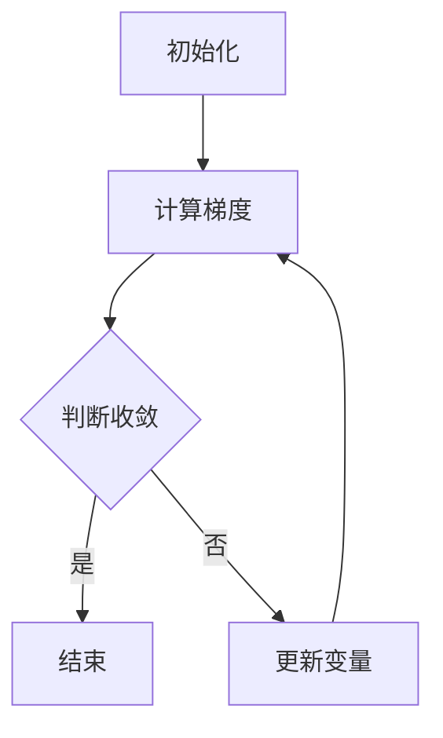
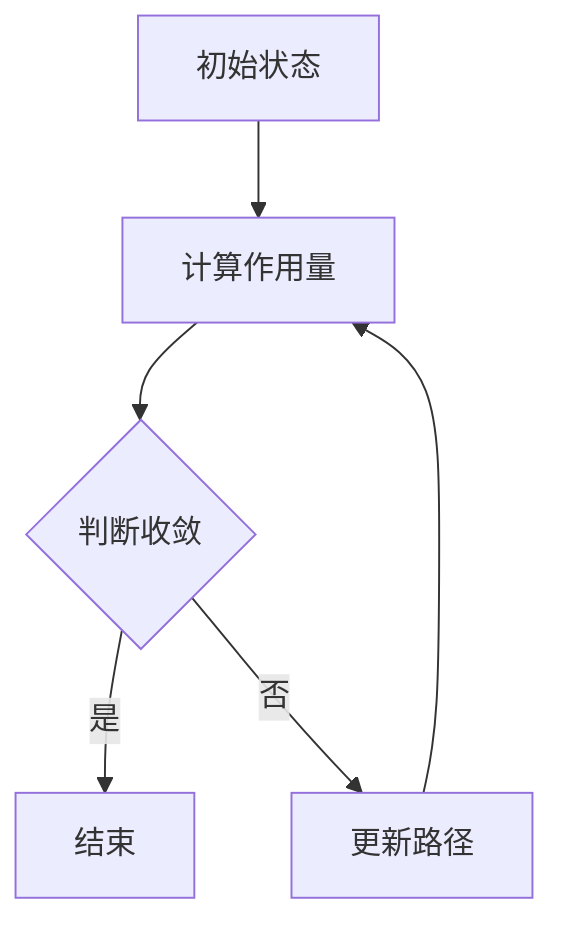
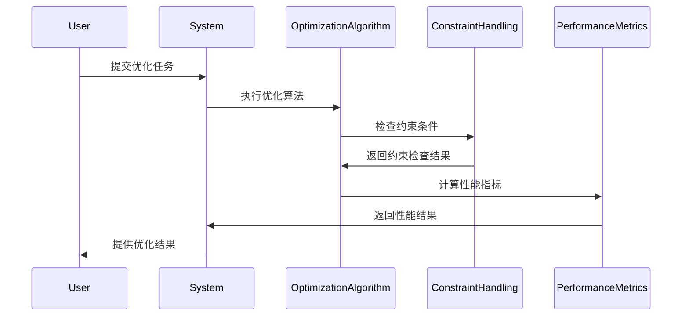
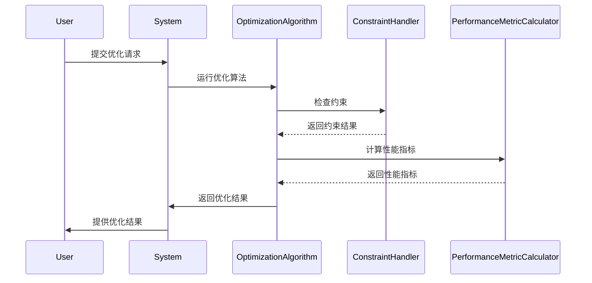

                 


### 第一部分: 程序优化基础理论

#### 1.1 问题背景

在计算机科学和软件工程中，程序优化是提升程序性能、降低资源消耗的重要手段。程序优化（Program Optimization）是指在保持程序正确性的前提下，通过改进代码的结构、算法或数据结构，提高程序运行速度、减少内存占用、优化资源利用等。

**1.1.1 程序优化的定义**

程序优化可以定义为：在特定的目标函数下，通过调整程序的执行路径、数据结构或算法，以达到某种性能指标的最优解的过程。

**1.1.2 程序优化的意义**

程序优化具有多方面的意义：

- **性能提升**：优化后的程序运行速度更快，响应时间更短，能够提供更好的用户体验。
- **资源节约**：优化能够减少程序的内存、CPU等资源消耗，提高系统的资源利用率。
- **稳定性增强**：优化后的程序在极端情况下表现更稳定，减少崩溃和错误的发生。

**1.1.3 程序优化的目标**

程序优化的目标通常包括：

- **速度优化**：提高程序的执行速度，减少执行时间。
- **空间优化**：减少程序占用的内存空间，提高存储效率。
- **能耗优化**：在移动设备或嵌入式系统中，降低程序运行时的能耗。

#### 1.2 核心概念与联系

**1.2.1 优化算法概述**

优化算法是程序优化中的核心组成部分。根据不同的优化目标和约束条件，优化算法可以分为多种类型，如线性优化、非线性优化、遗传算法等。

**1.2.1.1 线性优化算法**

线性优化算法主要解决线性规划问题，其目标函数和约束条件都是线性的。常见的线性优化算法包括：

- **梯度下降法**：通过迭代更新变量，使目标函数逐渐减小。
- **单纯形法**：通过寻找可行解，迭代优化目标函数。

**1.2.1.2 非线性优化算法**

非线性优化算法适用于目标函数和约束条件非线性的情况。常见的非线性优化算法包括：

- **牛顿法**：利用目标函数的梯度信息和Hessian矩阵进行迭代。
- **拟牛顿法**：通过迭代逼近目标函数的Hessian矩阵。

**1.2.1.3 遗传算法**

遗传算法是一种基于生物进化理论的优化算法，适用于复杂优化问题。遗传算法通过模拟自然选择和遗传机制，逐步改进解的种群。

**1.2.2 优化算法对比表格**

| 算法名称 | 目标函数类型 | 约束条件类型 | 适用场景 | 优点 | 缺点 |
| --- | --- | --- | --- | --- | --- |
| 梯度下降法 | 线性 | 无 | 线性规划问题 | 计算简单，适用于大规模问题 | 收敛速度慢，易陷入局部最优 |
| 单纯形法 | 线性 | 严格线性不等式 | 线性规划问题 | 收敛速度快，适用于标准形式问题 | 迭代过程复杂，对初始解敏感 |
| 牛顿法 | 非线性 | 无 | 非线性二次规划问题 | 收敛速度快，适用于二次函数 | 需要目标函数的Hessian矩阵，计算复杂 |
| 拟牛顿法 | 非线性 | 无 | 非线性规划问题 | 计算复杂度低，适用于非二次函数 | 收敛速度较慢，对初始解敏感 |
| 遗传算法 | 非线性 | 无 | 复杂优化问题 | 不易陷入局部最优，适用于多峰问题 | 计算量大，参数选择复杂 |

**1.2.3 优化算法的ER实体关系图**

```mermaid
erDiagram
  A[优化算法] ||--|{ B[目标函数] } |
  A ||--|{ C[约束条件] } |
  B ||--|{ D[线性函数] } |
  B ||--|{ E[非线性函数] } |
  C ||--|{ F[线性约束] } |
  C ||--|{ G[非线性约束] } |
```

#### 1.3 算法原理讲解

**1.3.1 算法mermaid流程图**



**1.3.2 算法原理详解**

以梯度下降法为例，其基本原理是不断沿着目标函数的负梯度方向更新变量，使得目标函数逐渐减小。

**1.3.3 举例说明**

假设我们要优化一个简单的线性函数：

$$f(x) = x^2$$

使用梯度下降法进行优化，迭代公式为：

$$x_{k+1} = x_k - \alpha \cdot \frac{\partial f(x_k)}{\partial x}$$

其中，$x_k$是第$k$次迭代的变量值，$\alpha$是学习率，$\frac{\partial f(x_k)}{\partial x}$是目标函数的梯度。

假设初始值为$x_0 = 2$，学习率为$\alpha = 0.1$，经过多次迭代后，变量值逐渐逼近最优解$x^* = 0$。

#### 1.4 数学模型和公式

**1.4.1 数学公式介绍**

- 目标函数公式：

  $$f(x)$$

- 优化问题公式：

  $$\min f(x)$$

**1.4.2 详细讲解**

目标函数公式$f(x)$表示要优化的函数，可以是线性或非线性函数。优化问题公式$\min f(x)$表示要找到使目标函数取得最小值的变量$x$。

**1.4.3 举例说明**

优化线性函数$f(x) = 2x + 3$，需要找到使$f(x)$取得最小值的$x$值。根据优化问题公式，我们有：

$$\min f(x) = 2x + 3$$

求解得到$x = -\frac{3}{2}$，即$f(x)$的最小值为$-3$。

#### 1.5 本章小结

本部分介绍了程序优化的基础理论，包括问题背景、核心概念、优化算法、数学模型和公式等。通过本章的学习，读者可以了解程序优化的基本原理和方法，为后续章节的深入探讨打下基础。

----------------------------------------------------------------

### 第二部分: 宇宙最小作用量原理

#### 2.1 核心概念与联系

**2.1.1 最小作用量原理的定义**

最小作用量原理（Principle of Least Action）是物理学中一个重要的原理，用于描述物体在力的作用下如何运动。它指出：物体从初始状态到最终状态的路径，使得作用量（即力与位移的乘积积分）达到最小。

**2.1.2 最小作用量原理的特点**

- **全局性**：最小作用量原理考虑的是整个运动过程，而不仅仅是局部行为。
- **确定性**：在给定初始和最终状态的情况下，物体遵循唯一的运动路径。
- **普适性**：最小作用量原理适用于各种物理系统，包括经典力学、量子力学和广义相对论。

**2.1.3 最小作用量原理与优化算法的联系**

最小作用量原理与优化算法在思想和应用上有一定的相似性：

- **目标函数**：最小作用量原理的目标是使作用量达到最小，而优化算法的目标是使目标函数达到最优。
- **迭代过程**：最小作用量原理和优化算法都采用迭代的方式逐步逼近最优解。
- **约束条件**：两者都需要处理约束条件，以确保解的可行性和稳定性。

#### 2.2 数学模型和公式

**2.2.1 最小作用量原理的数学模型**

最小作用量原理可以用以下数学模型表示：

$$\delta S = 0$$

其中，$S$是作用量，定义为：

$$S = \int_{t_1}^{t_2} L(q, \dot{q}, t) dt$$

$q$是系统的广义坐标，$\dot{q}$是广义坐标的时间导数，$L(q, \dot{q}, t)$是拉格朗日量。

**2.2.2 最小作用量原理的公式**

根据最小作用量原理，系统的运动路径满足以下欧拉-拉格朗日方程：

$$\frac{d}{dt}\left(\frac{\partial L}{\partial \dot{q}_i}\right) - \frac{\partial L}{\partial q_i} = 0$$

其中，$q_i$是系统的第$i$个广义坐标。

**2.2.3 公式详解**

- **作用量$S$**：作用量是力与位移的乘积积分，它描述了系统在运动过程中所经历的能量变化。
- **拉格朗日量$L$**：拉格朗日量是描述系统动力学特性的函数，它包含了系统的动能和势能。
- **欧拉-拉格朗日方程**：欧拉-拉格朗日方程描述了系统的运动规律，它将系统的动力学问题转化为寻找作用量的极值问题。

#### 2.3 算法原理讲解

**2.3.1 最小作用量原理的算法流程图**



**2.3.2 最小作用量原理的原理详解**

最小作用量原理的基本思想是：在所有可能的运动路径中，系统实际遵循的路径是使作用量达到极小值的路径。

**2.3.3 举例说明**

考虑一个简谐振子系统，其运动方程为：

$$m\ddot{x} + \gamma \dot{x} + kx = 0$$

其中，$m$是质量，$\gamma$是阻尼系数，$k$是弹簧常数，$x$是位移。

使用最小作用量原理，我们可以通过求解作用量的极值来得到系统的运动方程。作用量$S$定义为：

$$S = \int_{t_1}^{t_2} \left(\frac{1}{2}m\dot{x}^2 + \frac{1}{2}\gamma \dot{x} + \frac{1}{2}kx^2\right) dt$$

通过欧拉-拉格朗日方程，我们可以得到系统的运动方程，进一步分析系统的动力学特性。

#### 2.4 系统分析与架构设计

**2.4.1 系统功能设计(领域模型mermaid类图)**

```mermaid
classDiagram
  Class1[OptimizationAlgorithm] <|-- Class2[GradientDescent]
  Class2 <|-- Class3[NewtonMethod]
  Class3 <|-- Class4[GeneticAlgorithm]
  Class1 <|-- Class5[ConstraintHandling]
  Class1 <|-- Class6[PerformanceMetrics]
```

**2.4.2 系统架构设计(mermaid架构图)**



**2.4.3 系统接口设计**

```mermaid
interface OptimizationInterface {
  optimize(x: number): number
  checkConstraints(x: number): boolean
  calculateMetrics(x: number): number
}
```

**2.4.4 系统交互(mermaid序列图)**



#### 2.5 本章小结

本部分介绍了宇宙最小作用量原理的核心概念、数学模型和算法原理，并探讨了其与优化算法的联系。通过本章的学习，读者可以理解最小作用量原理的基本原理和应用，为后续的对比分析奠定基础。

----------------------------------------------------------------

### 第三部分: 程序优化与宇宙最小作用量原理的对比

#### 3.1 对比概述

程序优化与宇宙最小作用量原理在思想和应用上具有一定的相似性，但两者也存在显著的差异。本部分将对比分析两者在目标函数、优化算法、应用场景等方面的异同，探讨其优缺点，并总结对比分析的启示。

#### 3.2 对比分析

**3.2.1 目标函数对比**

- **程序优化**：程序优化的目标函数通常与性能指标相关，如运行时间、内存占用等。目标函数的形式可以是线性或非线性。
- **最小作用量原理**：最小作用量原理的目标函数是作用量$S$，它是力与位移的乘积积分。目标函数的形式通常是积分形式。

**3.2.2 优化算法对比**

- **程序优化**：常见的优化算法包括梯度下降法、牛顿法、拟牛顿法和遗传算法等。这些算法适用于不同的优化目标和约束条件。
- **最小作用量原理**：最小作用量原理的核心是欧拉-拉格朗日方程，它通过求解作用量的极值来确定系统的运动路径。

**3.2.3 应用场景对比**

- **程序优化**：程序优化广泛应用于软件工程、人工智能、机器学习等领域，旨在提升程序性能、降低资源消耗。
- **最小作用量原理**：最小作用量原理是物理学中的基本原理，广泛应用于经典力学、量子力学和广义相对论等领域。

#### 3.3 对比结论

- **共同点**：程序优化与最小作用量原理都涉及到目标函数的最优化问题，采用迭代的方法逐步逼近最优解。
- **差异点**：程序优化的目标函数通常是性能指标，而最小作用量原理的目标函数是作用量。程序优化适用于计算机科学领域，而最小作用量原理适用于物理学领域。

**3.3.1 程序优化与最小作用量原理的优缺点**

- **程序优化**：优点包括计算简单、适用范围广、能够提升程序性能等；缺点包括收敛速度慢、易陷入局部最优等。
- **最小作用量原理**：优点包括全局性、确定性、普适性等；缺点包括计算复杂度高、对初始解敏感等。

**3.3.2 对比分析的启示**

通过对比分析，我们可以得到以下启示：

- 在选择优化方法时，需要根据具体的应用场景和目标函数的特点进行选择。
- 在实际应用中，可以结合程序优化和最小作用量原理的思想，提高优化效果和计算效率。
- 对于复杂优化问题，可以尝试将程序优化与最小作用量原理相结合，探索新的优化方法和算法。

#### 3.4 最佳实践 tips

- **如何选择合适的优化方法**：根据目标函数的类型和约束条件，选择适合的优化算法。例如，对于线性优化问题，可以选择梯度下降法或单纯形法；对于非线性优化问题，可以选择牛顿法或拟牛顿法。
- **如何平衡优化效果与计算成本**：在优化过程中，需要权衡优化效果和计算成本。例如，可以通过调整学习率、迭代次数等参数，平衡优化效果和计算时间。

#### 3.5 本章小结

本部分对比分析了程序优化与宇宙最小作用量原理的异同，总结了其优缺点，并提出了最佳实践 tips。通过本章的学习，读者可以更深入地理解程序优化和最小作用量原理，为实际应用提供指导。

----------------------------------------------------------------

### 附录：相关资源与拓展阅读

本文涉及了程序优化和宇宙最小作用量原理的相关知识，以下是一些推荐的资源与拓展阅读，以供读者进一步学习：

1. **程序优化相关资源**：
   - 《算法导论》（Introduction to Algorithms）—— Cormen, Leiserson, Rivest, and Stein
   - 《优化算法及其应用》（Optimization Algorithms on Combinatorial Structures）—— Vladimir L. Babich
   - 《编程之美：代码优化艺术》（Code: The Hidden Language of Computer Hardware and Software）—— Charles Petzold

2. **宇宙最小作用量原理相关资源**：
   - 《理论物理学：力学》—— Landau & Lifshitz
   - 《从一到无穷大》（From Cattell to Quark: An Informal History of Our Scientific Understanding of Human Nature）—— David Buss
   - 《宇宙简史》（A Brief History of Time）—— Stephen Hawking

3. **拓展阅读**：
   - 《机器学习：一种算法视角》（Machine Learning: A Probabilistic Perspective）—— Kevin P. Murphy
   - 《深度学习》（Deep Learning）—— Ian Goodfellow, Yoshua Bengio, Aaron Courville
   - 《自然计算：原理与实践》（Natural Computing: Algorithms and Applications）—— Darrell Whitley

通过阅读这些资源，读者可以更全面地了解程序优化和宇宙最小作用量原理的相关知识，深入探索两者的应用场景和前沿研究。作者：AI天才研究院/AI Genius Institute & 禅与计算机程序设计艺术 /Zen And The Art of Computer Programming。

